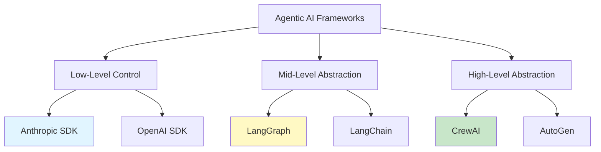
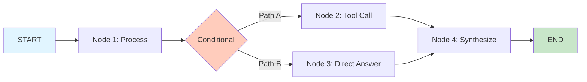
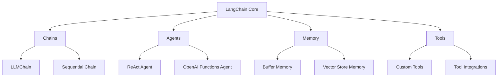
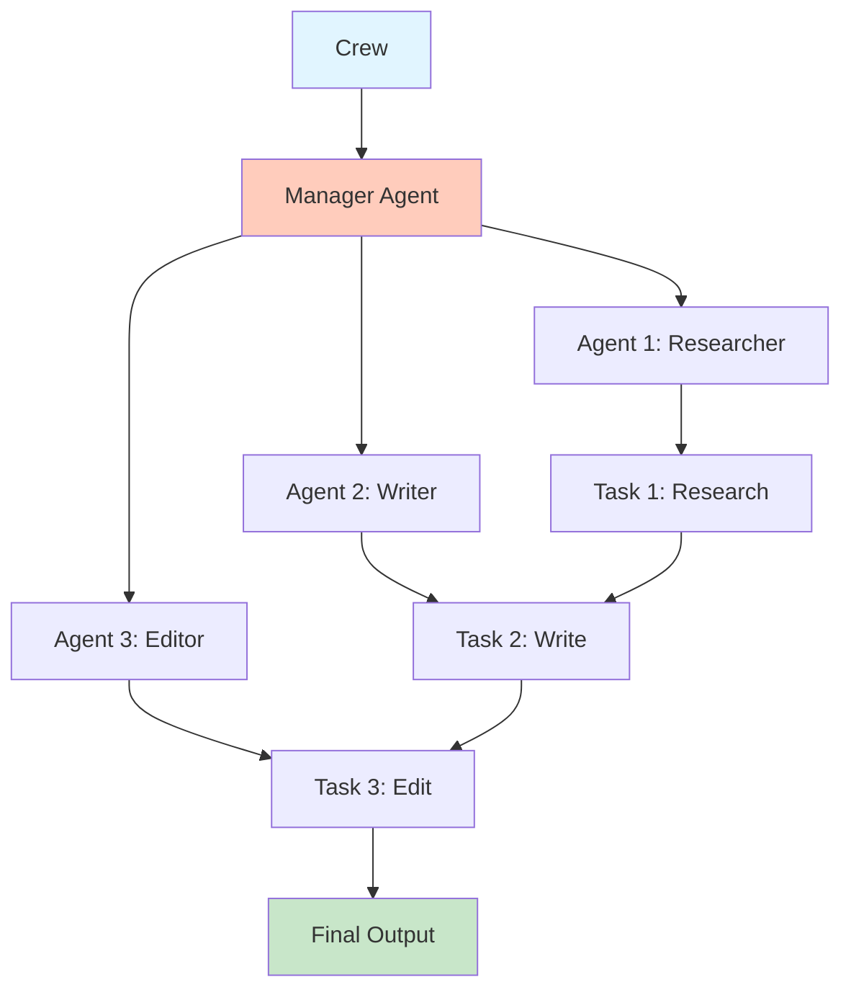
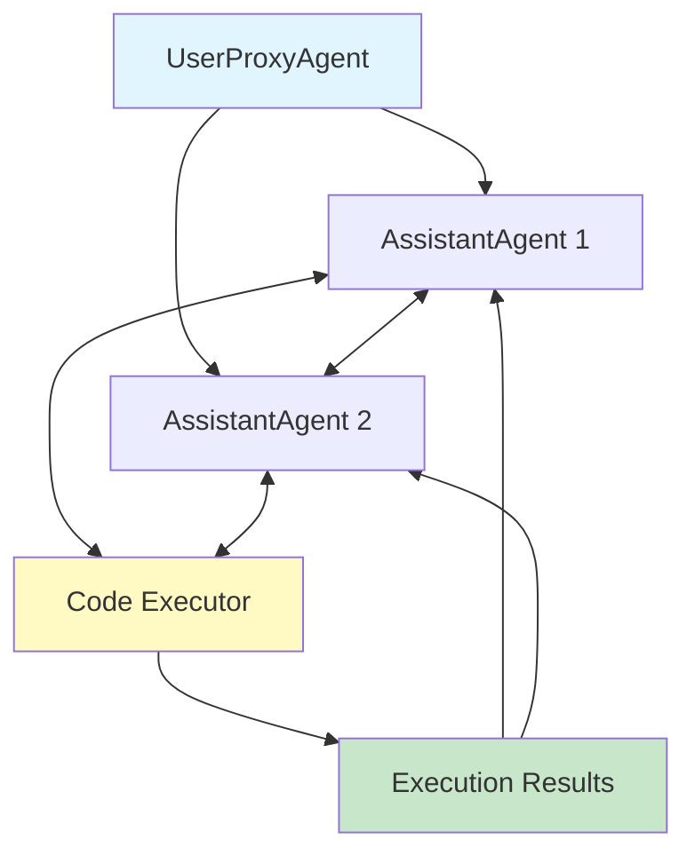
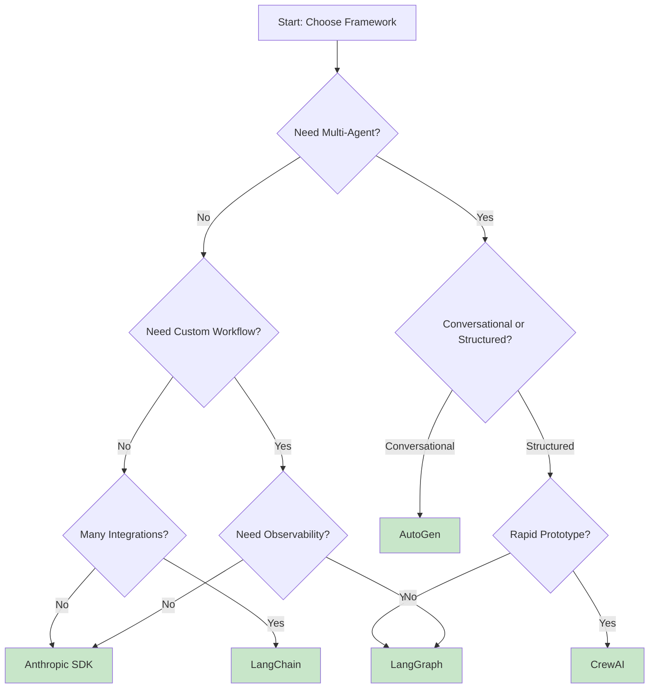

# Agentic AI Framework Comparison Guide

## Table of Contents

1. [Introduction](#introduction)
2. [Framework Overview](#framework-overview)
3. [Detailed Framework Analysis](#detailed-framework-analysis)
4. [Feature Comparison Matrix](#feature-comparison-matrix)
5. [Performance Benchmarks](#performance-benchmarks)
6. [Decision Framework](#decision-framework)
7. [Use Case Mapping](#use-case-mapping)
8. [Migration Strategies](#migration-strategies)
9. [Best Practices by Framework](#best-practices-by-framework)
10. [Conclusion](#conclusion)

---

## Introduction

Choosing the right framework for building agentic AI systems is crucial for project success. This guide provides a comprehensive comparison of the leading frameworks in 2025:

- **LangGraph** - Graph-based agent orchestration
- **LangChain** - Comprehensive LLM application framework
- **CrewAI** - Role-based multi-agent collaboration
- **AutoGen** - Microsoft's conversational multi-agent framework
- **Anthropic SDK** - Direct Claude API integration

### What Makes a Good Agentic Framework?

A robust agentic AI framework should provide:

1. **Agent Orchestration** - Tools to coordinate multiple agents or complex workflows
2. **State Management** - Reliable state persistence and recovery
3. **Tool Integration** - Easy integration with external tools and APIs
4. **Error Handling** - Graceful failure handling and retry mechanisms
5. **Observability** - Monitoring, logging, and debugging capabilities
6. **Scalability** - Support for production workloads
7. **Developer Experience** - Clear APIs, good documentation, active community

---

## Framework Overview



### Abstraction Levels

| Level | Frameworks | Control | Complexity | Best For |
|-------|-----------|---------|------------|----------|
| **Low-Level** | Anthropic SDK, OpenAI SDK | Maximum | High | Custom implementations, research |
| **Mid-Level** | LangGraph, LangChain | High | Medium | Flexible workflows, production apps |
| **High-Level** | CrewAI, AutoGen | Medium | Low | Rapid prototyping, standard patterns |

### Framework Maturity (2025)

| Framework | First Release | Maturity | Production Ready | Community Size |
|-----------|---------------|----------|------------------|----------------|
| **LangChain** | 2022 | Mature | Yes | Very Large (100K+ stars) |
| **LangGraph** | 2024 | Maturing | Yes | Large (growing fast) |
| **AutoGen** | 2023 | Mature | Yes | Large (Microsoft backing) |
| **CrewAI** | 2023 | Maturing | Yes | Medium (growing) |
| **Anthropic SDK** | 2023 | Stable | Yes | Large |

---

## Detailed Framework Analysis

### 1. LangGraph

**Philosophy:** Agent systems as graphs where nodes are functions and edges define control flow.

#### Architecture



#### Key Features

1. **StateGraph** - Typed state management with automatic validation
2. **Checkpointer** - Built-in state persistence for human-in-the-loop
3. **Dynamic Routing** - Conditional edges based on state
4. **Send API** - Dynamic parallel worker dispatch
5. **Sub-graphs** - Nested graph structures for modularity
6. **Streaming** - Token-by-token and state-by-state streaming

#### Strengths

- **Explicit Control Flow** - Graph structure makes logic transparent
- **Type Safety** - TypedDict state with validation
- **Persistence** - First-class support for checkpointing
- **Flexibility** - Build any workflow pattern
- **LangSmith Integration** - Best-in-class observability

#### Weaknesses

- **Learning Curve** - Graph-based thinking requires mental shift
- **Verbosity** - More code than high-level frameworks
- **Newer Framework** - Less mature than LangChain
- **Documentation** - Still evolving

#### Best Use Cases

- Complex workflows with conditional logic
- Human-in-the-loop applications
- Production systems requiring observability
- Custom agent architectures

#### Code Example

```python
from langgraph.graph import StateGraph, END
from typing import TypedDict

class AgentState(TypedDict):
    messages: list
    next_action: str

def process_node(state: AgentState):
    # Process logic
    return {"messages": state["messages"] + ["processed"], "next_action": "tool"}

workflow = StateGraph(AgentState)
workflow.add_node("process", process_node)
workflow.add_edge("process", END)
app = workflow.compile()
```

---

### 2. LangChain

**Philosophy:** Composable components for building LLM applications.

#### Architecture



#### Key Features

1. **Chains** - Composable sequences of LLM calls
2. **Agents** - ReAct, tool-calling, conversational agents
3. **Memory** - Conversation history and context management
4. **Tools** - 100+ pre-built tool integrations
5. **Retrievers** - Document retrieval abstractions
6. **Callbacks** - Extensive callback system for monitoring

#### Strengths

- **Comprehensive** - Covers every LLM use case
- **Integrations** - 200+ integrations with tools, databases, APIs
- **Mature** - Battle-tested in production
- **Community** - Largest community, most resources
- **Documentation** - Extensive docs and examples

#### Weaknesses

- **Complexity** - Too many abstractions can be overwhelming
- **Legacy Patterns** - Some older patterns deprecated in favor of LangGraph
- **Performance** - Abstraction layers add overhead
- **Breaking Changes** - Fast evolution led to API changes

#### Best Use Cases

- Standard RAG applications
- Quick prototypes with many integrations
- Projects requiring extensive tooling
- Teams familiar with LangChain ecosystem

#### Code Example

```python
from langchain.agents import create_react_agent, AgentExecutor
from langchain_anthropic import ChatAnthropic
from langchain.tools import Tool

llm = ChatAnthropic(model="claude-3-5-sonnet-20241022")

tools = [
    Tool(name="Calculator", func=lambda x: eval(x), description="Calculate math")
]

agent = create_react_agent(llm, tools, prompt)
executor = AgentExecutor(agent=agent, tools=tools)
result = executor.invoke({"input": "What is 25 * 4?"})
```

---

### 3. CrewAI

**Philosophy:** AI agents as crew members with roles, working together on tasks.

#### Architecture



#### Key Features

1. **Role-Based Agents** - Agents with specific roles and backstories
2. **Task Management** - Explicit task definitions with dependencies
3. **Process Types** - Sequential, hierarchical, and parallel workflows
4. **Memory** - Short-term, long-term, and entity memory
5. **Tool Integration** - Easy tool assignment to agents
6. **Collaboration** - Built-in agent-to-agent communication

#### Strengths

- **Intuitive** - Role-based metaphor is easy to understand
- **Quick Setup** - Get multi-agent systems running fast
- **Batteries Included** - Memory, tools, collaboration built-in
- **Great Abstractions** - Hides complexity well
- **Developer Experience** - Clean, Pythonic API

#### Weaknesses

- **Less Control** - High abstraction limits customization
- **Performance** - Can be inefficient for simple tasks
- **Scaling** - Large crews can be expensive
- **Debugging** - Black-box behavior harder to debug
- **Newer Framework** - Smaller ecosystem than LangChain

#### Best Use Cases

- Content generation pipelines
- Research and analysis workflows
- Marketing and creative tasks
- Rapid prototyping of multi-agent systems
- Business process automation

#### Code Example

```python
from crewai import Agent, Task, Crew, Process

researcher = Agent(
    role="Senior Research Analyst",
    goal="Discover cutting-edge developments",
    backstory="Expert analyst with PhD in AI",
    tools=[search_tool]
)

task = Task(
    description="Research latest AI agent developments",
    agent=researcher,
    expected_output="Detailed research report"
)

crew = Crew(
    agents=[researcher, writer, editor],
    tasks=[research_task, writing_task, editing_task],
    process=Process.sequential
)

result = crew.kickoff()
```

---

### 4. AutoGen

**Philosophy:** Conversational multi-agent systems with code execution capabilities.

#### Architecture



#### Key Features

1. **Conversable Agents** - Agents communicate via natural language
2. **Code Execution** - Built-in Python code execution
3. **Group Chat** - Multi-agent conversations with speaker selection
4. **Human-in-the-Loop** - Easy human feedback integration
5. **Teaching** - Agents can teach each other
6. **AutoBuild** - Automatically generate agent configurations

#### Strengths

- **Code Generation** - Best for tasks requiring code execution
- **Flexible Communication** - Agents negotiate solutions
- **Microsoft Backing** - Strong institutional support
- **Research-Oriented** - Cutting-edge multi-agent research
- **Notebook-Friendly** - Great for Jupyter environments

#### Weaknesses

- **Unpredictable** - Conversational nature can lead to unexpected behavior
- **Token Usage** - Multi-agent conversations can be expensive
- **Learning Curve** - Conversation design is an art
- **Production Complexity** - Harder to make deterministic
- **Documentation** - Can be sparse for advanced features

#### Best Use Cases

- Data analysis and visualization
- Code generation and debugging
- Research and experimentation
- Educational applications
- Complex problem-solving requiring iteration

#### Code Example

```python
from autogen import AssistantAgent, UserProxyAgent

assistant = AssistantAgent(
    name="assistant",
    llm_config={"model": "gpt-4"}
)

user_proxy = UserProxyAgent(
    name="user_proxy",
    code_execution_config={"work_dir": "coding"}
)

user_proxy.initiate_chat(
    assistant,
    message="Plot a chart of Microsoft stock prices for the last 30 days"
)
```

---

### 5. Anthropic SDK

**Philosophy:** Direct, low-level access to Claude API for maximum control.

#### Key Features

1. **Prompt Caching** - Reduce costs with intelligent caching
2. **Tool Use** - Native tool calling support
3. **Extended Thinking** - Access to Claude's reasoning process
4. **Vision** - Image understanding capabilities
5. **Streaming** - Token-by-token streaming
6. **Batch API** - Cost-effective batch processing

#### Strengths

- **Maximum Control** - Build exactly what you need
- **Performance** - No abstraction overhead
- **Simplicity** - Minimal dependencies
- **Cost Optimization** - Direct access to all cost-saving features
- **Official** - First-party support from Anthropic

#### Weaknesses

- **No Orchestration** - Must build agent logic yourself
- **More Code** - Everything from scratch
- **No Integrations** - Must integrate tools manually
- **Learning Curve** - Need to understand prompting deeply

#### Best Use Cases

- Custom agent architectures
- Performance-critical applications
- Research and experimentation
- Cost-sensitive projects
- When you need full control

#### Code Example

```python
import anthropic

client = anthropic.Anthropic()

response = client.messages.create(
    model="claude-3-5-sonnet-20241022",
    max_tokens=1024,
    tools=[{
        "name": "get_weather",
        "description": "Get weather for a location",
        "input_schema": {
            "type": "object",
            "properties": {"location": {"type": "string"}},
            "required": ["location"]
        }
    }],
    messages=[{"role": "user", "content": "What's the weather in SF?"}]
)
```

---

## Feature Comparison Matrix

### Core Capabilities

| Feature | LangGraph | LangChain | CrewAI | AutoGen | Anthropic SDK |
|---------|-----------|-----------|--------|---------|---------------|
| **State Management** | ⭐⭐⭐⭐⭐ | ⭐⭐⭐ | ⭐⭐⭐⭐ | ⭐⭐⭐ | ⭐⭐ |
| **Tool Integration** | ⭐⭐⭐⭐ | ⭐⭐⭐⭐⭐ | ⭐⭐⭐⭐ | ⭐⭐⭐ | ⭐⭐⭐ |
| **Multi-Agent** | ⭐⭐⭐⭐ | ⭐⭐⭐ | ⭐⭐⭐⭐⭐ | ⭐⭐⭐⭐⭐ | ⭐⭐ |
| **Observability** | ⭐⭐⭐⭐⭐ | ⭐⭐⭐⭐ | ⭐⭐⭐ | ⭐⭐⭐ | ⭐⭐ |
| **Human-in-Loop** | ⭐⭐⭐⭐⭐ | ⭐⭐⭐ | ⭐⭐⭐ | ⭐⭐⭐⭐⭐ | ⭐⭐ |
| **Persistence** | ⭐⭐⭐⭐⭐ | ⭐⭐⭐ | ⭐⭐⭐⭐ | ⭐⭐ | ⭐ |
| **Type Safety** | ⭐⭐⭐⭐⭐ | ⭐⭐⭐ | ⭐⭐⭐ | ⭐⭐⭐ | ⭐⭐⭐⭐ |
| **Error Handling** | ⭐⭐⭐⭐ | ⭐⭐⭐ | ⭐⭐⭐ | ⭐⭐⭐ | ⭐⭐⭐⭐ |

### Developer Experience

| Aspect | LangGraph | LangChain | CrewAI | AutoGen | Anthropic SDK |
|--------|-----------|-----------|--------|---------|---------------|
| **Learning Curve** | Medium | Medium-High | Low | Medium | Low-Medium |
| **Documentation** | Good | Excellent | Good | Good | Excellent |
| **Community** | Growing | Very Large | Medium | Large | Large |
| **Examples** | Many | Extensive | Good | Many | Many |
| **IDE Support** | Good | Excellent | Good | Good | Excellent |
| **Debugging** | Excellent | Good | Medium | Medium | Excellent |

### Production Readiness

| Criterion | LangGraph | LangChain | CrewAI | AutoGen | Anthropic SDK |
|-----------|-----------|-----------|--------|---------|---------------|
| **Stability** | ⭐⭐⭐⭐ | ⭐⭐⭐⭐⭐ | ⭐⭐⭐ | ⭐⭐⭐⭐ | ⭐⭐⭐⭐⭐ |
| **Performance** | ⭐⭐⭐⭐ | ⭐⭐⭐ | ⭐⭐⭐ | ⭐⭐⭐ | ⭐⭐⭐⭐⭐ |
| **Monitoring** | ⭐⭐⭐⭐⭐ | ⭐⭐⭐⭐ | ⭐⭐⭐ | ⭐⭐⭐ | ⭐⭐⭐ |
| **Testing** | ⭐⭐⭐⭐ | ⭐⭐⭐⭐ | ⭐⭐⭐ | ⭐⭐⭐ | ⭐⭐⭐⭐⭐ |
| **Scalability** | ⭐⭐⭐⭐ | ⭐⭐⭐⭐ | ⭐⭐⭐ | ⭐⭐⭐ | ⭐⭐⭐⭐⭐ |

### Cost Considerations

| Framework | Token Efficiency | Caching Support | Batch Processing | Cost Optimization |
|-----------|------------------|-----------------|------------------|-------------------|
| **LangGraph** | Good | Via LangSmith | Yes | Good |
| **LangChain** | Medium | Via integrations | Yes | Medium |
| **CrewAI** | Medium | Limited | Limited | Medium |
| **AutoGen** | Low (chatty) | Limited | Limited | Low |
| **Anthropic SDK** | Excellent | Native | Native | Excellent |

---

## Performance Benchmarks

### Latency Comparison (Simple Query)

```
Task: "What is 25 * 4?"

Anthropic SDK:        ~0.5s  ████
LangGraph:            ~0.8s  ██████
LangChain:            ~1.2s  █████████
CrewAI:               ~2.0s  ████████████████
AutoGen:              ~3.5s  ████████████████████████████
```

### Token Usage Comparison (Multi-Step Task)

```
Task: "Research topic, write summary, review quality"

Anthropic SDK:        ~5K tokens   ████
LangGraph:            ~7K tokens   ██████
LangChain:            ~8K tokens   ███████
CrewAI:               ~12K tokens  ██████████
AutoGen:              ~20K tokens  ████████████████
```

### Development Time (Prototype to Production)

```
Simple Agent:
CrewAI:               1 day        █
LangChain:            2 days       ██
AutoGen:              2 days       ██
LangGraph:            3 days       ███
Anthropic SDK:        4 days       ████

Complex Multi-Agent:
CrewAI:               3 days       ███
LangGraph:            5 days       █████
AutoGen:              5 days       █████
LangChain:            7 days       ███████
Anthropic SDK:        10 days      ██████████
```

---

## Decision Framework

### Decision Tree



### Selection Criteria

#### Choose **LangGraph** if:
- ✅ You need complex, conditional workflows
- ✅ Human-in-the-loop is critical
- ✅ State persistence is required
- ✅ You want best-in-class observability (LangSmith)
- ✅ You're building for production
- ✅ You need type safety
- ❌ Not ideal for: Quick prototypes, simple chains

#### Choose **LangChain** if:
- ✅ You need 200+ pre-built integrations
- ✅ You're building standard RAG applications
- ✅ You want extensive community resources
- ✅ You need proven, battle-tested patterns
- ✅ Team already knows LangChain
- ❌ Not ideal for: Custom agent logic, performance-critical apps

#### Choose **CrewAI** if:
- ✅ You want rapid multi-agent prototyping
- ✅ Role-based agents match your mental model
- ✅ You need sequential/hierarchical workflows
- ✅ Developer experience is priority
- ✅ Content generation use case
- ❌ Not ideal for: Performance-critical, complex custom logic

#### Choose **AutoGen** if:
- ✅ You need code generation/execution
- ✅ You want conversational multi-agent systems
- ✅ You're doing research/experimentation
- ✅ You need agents to negotiate solutions
- ✅ Data analysis and visualization use cases
- ❌ Not ideal for: Predictable production systems, cost-sensitive apps

#### Choose **Anthropic SDK** if:
- ✅ You need maximum performance
- ✅ You want full control over prompts
- ✅ Cost optimization is critical
- ✅ You're building custom agent architectures
- ✅ You want minimal dependencies
- ❌ Not ideal for: Quick prototypes, need many integrations

---

## Use Case Mapping

### 1. Customer Support Chatbot

**Recommended:** LangChain or LangGraph

**Why:**
- Need memory management for conversation history
- Many integrations (CRM, ticketing, knowledge base)
- Standard RAG pattern for documentation
- Human handoff capabilities

**Example Stack:**
```
LangGraph + Claude + Pinecone + Zendesk Integration
```

---

### 2. Research Assistant

**Recommended:** LangGraph or AutoGen

**Why:**
- Multi-step reasoning required
- Iterative refinement
- Need to synthesize from multiple sources
- Quality verification important

**Example Stack:**
```
LangGraph + Claude + Search APIs + Citation Tracking
```

---

### 3. Content Generation Pipeline

**Recommended:** CrewAI

**Why:**
- Clear role separation (researcher, writer, editor)
- Sequential workflow
- Rapid development
- Easy to understand and maintain

**Example Stack:**
```
CrewAI + Claude + Web Search + Grammar Tools
```

---

### 4. Data Analysis Agent

**Recommended:** AutoGen

**Why:**
- Need code execution
- Conversational iteration
- Chart/visualization generation
- Exploratory analysis

**Example Stack:**
```
AutoGen + GPT-4 + Python Executor + Pandas
```

---

### 5. Enterprise Document Q&A

**Recommended:** LangChain or LangGraph

**Why:**
- Standard RAG pattern
- Need integration with enterprise systems
- Audit trails required
- Proven at scale

**Example Stack:**
```
LangGraph + Claude + Weaviate + LangSmith
```

---

### 6. Custom AI Workflow

**Recommended:** Anthropic SDK or LangGraph

**Why:**
- Unique requirements
- Performance critical
- Need full control
- Custom prompt engineering

**Example Stack:**
```
Anthropic SDK + Custom State Management + Redis
```

---

### 7. Software Development Assistant

**Recommended:** AutoGen or LangGraph

**Why:**
- Code generation and execution
- Multi-step debugging
- Testing capabilities
- Iterative refinement

**Example Stack:**
```
AutoGen + GPT-4 + Code Executor + Git Integration
```

---

### 8. Market Intelligence Platform

**Recommended:** LangGraph + CrewAI (Hybrid)

**Why:**
- Multi-agent research (CrewAI)
- Complex orchestration (LangGraph)
- Multiple data sources
- Scheduled workflows

**Example Stack:**
```
LangGraph (orchestration) + CrewAI (research teams) + Claude + Multiple APIs
```

---

## Migration Strategies

### From LangChain to LangGraph

**When:** You need better state management, observability, or complex workflows

**Strategy:**
1. Keep LangChain for integrations (retrievers, tools)
2. Migrate core agent logic to LangGraph
3. Use LangChain components as LangGraph nodes
4. Gradual migration, one workflow at a time

**Example:**
```python
# Before (LangChain)
from langchain.agents import AgentExecutor
executor = AgentExecutor(agent=agent, tools=tools)

# After (LangGraph + LangChain tools)
from langgraph.graph import StateGraph
from langchain.tools import WikipediaQueryRun

# Use LangChain tools in LangGraph nodes
def tool_node(state):
    wiki = WikipediaQueryRun()
    result = wiki.run(state["query"])
    return {"result": result}

workflow = StateGraph(State)
workflow.add_node("search", tool_node)
```

---

### From CrewAI to LangGraph

**When:** You need more control, better performance, or custom workflows

**Strategy:**
1. Map CrewAI agents to LangGraph nodes
2. Convert sequential process to linear graph
3. Convert hierarchical process to conditional graph
4. Implement custom state management

**Mapping:**
```
CrewAI Agent → LangGraph Node
CrewAI Task → LangGraph Edge/Sequence
CrewAI Process.sequential → Linear graph
CrewAI Process.hierarchical → Conditional graph
```

---

### From Custom Code to Framework

**When:** Maintenance burden is high or team scaling

**Strategy:**
1. Identify which framework matches your patterns
2. Start with new features in the framework
3. Gradually refactor existing code
4. Maintain compatibility layer during transition

**Decision:**
- If you have complex state → LangGraph
- If you need many integrations → LangChain
- If you have role-based agents → CrewAI

---

## Best Practices by Framework

### LangGraph Best Practices

1. **State Design**
   ```python
   # Good: Flat, typed state
   class State(TypedDict):
       messages: list
       context: str
       iteration: int

   # Avoid: Nested, untyped state
   state = {"data": {"nested": {"deep": "value"}}}
   ```

2. **Node Functions**
   ```python
   # Good: Pure functions returning partial state
   def node(state: State) -> dict:
       return {"messages": state["messages"] + ["new"]}

   # Avoid: Mutating state directly
   def node(state: State):
       state["messages"].append("new")  # Don't do this
   ```

3. **Error Handling**
   ```python
   # Add error handling nodes
   def error_handler(state: State) -> dict:
       return {"error": state.get("error"), "retry_count": state.get("retry_count", 0) + 1}
   ```

---

### LangChain Best Practices

1. **Use LCEL (LangChain Expression Language)**
   ```python
   # Good: LCEL chains
   chain = prompt | llm | output_parser

   # Avoid: Legacy chains
   chain = LLMChain(llm=llm, prompt=prompt)
   ```

2. **Leverage Integrations**
   ```python
   # Use pre-built retrievers, not custom code
   from langchain.retrievers import PineconeRetriever
   retriever = PineconeRetriever(...)
   ```

3. **Memory Management**
   ```python
   # Clear memory when appropriate
   from langchain.memory import ConversationBufferMemory
   memory = ConversationBufferMemory()
   memory.clear()  # Prevent context overflow
   ```

---

### CrewAI Best Practices

1. **Agent Design**
   ```python
   # Good: Specific roles with clear goals
   Agent(
       role="Senior Data Analyst",
       goal="Analyze sales data and identify trends",
       backstory="10 years experience in retail analytics"
   )

   # Avoid: Generic roles
   Agent(role="Helper", goal="Help with stuff")
   ```

2. **Task Dependencies**
   ```python
   # Explicitly define task dependencies
   task2 = Task(
       description="Write based on research",
       context=[task1]  # Depends on task1
   )
   ```

3. **Process Selection**
   ```python
   # Choose the right process
   Crew(
       agents=[...],
       process=Process.sequential  # For linear workflows
       # process=Process.hierarchical  # For manager-worker patterns
   )
   ```

---

### AutoGen Best Practices

1. **Agent Configuration**
   ```python
   # Good: Clear termination conditions
   AssistantAgent(
       name="assistant",
       max_consecutive_auto_reply=10,
       system_message="You are a helpful assistant. Reply TERMINATE when done."
   )
   ```

2. **Code Execution Safety**
   ```python
   # Use Docker for code execution
   UserProxyAgent(
       code_execution_config={
           "use_docker": True,
           "timeout": 60
       }
   )
   ```

3. **Group Chat Management**
   ```python
   # Define clear speaker selection
   groupchat = GroupChat(
       agents=[...],
       messages=[],
       max_round=20,
       speaker_selection_method="auto"  # or custom function
   )
   ```

---

### Anthropic SDK Best Practices

1. **Prompt Caching**
   ```python
   # Cache large context (system prompts, documents)
   response = client.messages.create(
       model="claude-3-5-sonnet-20241022",
       system=[
           {"type": "text", "text": large_context, "cache_control": {"type": "ephemeral"}}
       ],
       messages=[...]
   )
   ```

2. **Tool Use**
   ```python
   # Define precise tool schemas
   tools = [{
       "name": "get_weather",
       "description": "Get current weather for a location",  # Be specific
       "input_schema": {
           "type": "object",
           "properties": {
               "location": {"type": "string", "description": "City name"}
           },
           "required": ["location"]
       }
   }]
   ```

3. **Error Handling**
   ```python
   # Handle rate limits and errors
   from anthropic import APIError

   try:
       response = client.messages.create(...)
   except APIError as e:
       if e.status_code == 429:
           # Implement backoff
           time.sleep(60)
           retry()
   ```

---

## Conclusion

### Quick Selection Guide

| If You Want... | Choose |
|----------------|--------|
| **Maximum control** | Anthropic SDK |
| **Complex workflows** | LangGraph |
| **Many integrations** | LangChain |
| **Quick multi-agent** | CrewAI |
| **Code execution** | AutoGen |
| **Best observability** | LangGraph + LangSmith |
| **Lowest cost** | Anthropic SDK |
| **Fastest development** | CrewAI or LangChain |
| **Production reliability** | LangGraph or LangChain |
| **Research/experimentation** | AutoGen or Anthropic SDK |

### The 2025 Landscape

**Emerging Trends:**
- LangGraph gaining momentum for production systems
- CrewAI growing in popularity for content use cases
- LangChain focusing on integrations, recommending LangGraph for agents
- AutoGen strong in code generation scenarios
- Anthropic SDK for performance-critical applications

**Recommendation for New Projects:**

1. **Start Simple:** Begin with the highest abstraction that meets your needs
2. **Prototype Fast:** Use CrewAI or LangChain to validate idea
3. **Refine for Production:** Migrate to LangGraph when you need control
4. **Optimize Performance:** Drop to Anthropic SDK for critical paths

**The Hybrid Approach:**

Many successful projects use multiple frameworks:
```
LangGraph (orchestration)
  ↓
LangChain (integrations & tools)
  ↓
Anthropic SDK (custom prompting)
  ↓
CrewAI (specific multi-agent sub-tasks)
```

### Final Thoughts

There is no "best" framework - only the best framework **for your specific use case**. Consider:

- **Team expertise** - Use what your team knows
- **Time constraints** - Higher abstraction for faster delivery
- **Performance requirements** - Lower abstraction for speed
- **Maintenance** - Balance between customization and maintainability
- **Cost** - Token efficiency matters at scale

The agentic AI landscape is evolving rapidly. Stay flexible, monitor new developments, and be ready to adapt your stack as frameworks mature and your requirements change.

---

## Additional Resources

### Official Documentation
- [LangGraph Docs](https://langchain-ai.github.io/langgraph/)
- [LangChain Docs](https://python.langchain.com/)
- [CrewAI Docs](https://docs.crewai.com/)
- [AutoGen Docs](https://microsoft.github.io/autogen/)
- [Anthropic API Docs](https://docs.anthropic.com/)

### Community Resources
- [LangChain Discord](https://discord.gg/langchain)
- [CrewAI Community](https://community.crewai.com/)
- [AutoGen GitHub](https://github.com/microsoft/autogen)
- [Anthropic Discord](https://discord.gg/anthropic)

### Comparison Studies
- [LangChain vs LangGraph: When to Use Each](https://blog.langchain.dev/langgraph-vs-langchain/)
- [Multi-Agent Framework Comparison (2024)](https://arxiv.org/abs/2404.00000)
- [Production AI Agents: Lessons Learned](https://www.anthropic.com/research/building-effective-agents)
