# Agent Memory Architecture: Comprehensive Guide 2025

## Table of Contents
1. [Introduction](#introduction)
2. [Memory Types and Taxonomy](#memory-types-and-taxonomy)
3. [Framework Comparison](#framework-comparison)
4. [Memory Architecture Patterns](#memory-architecture-patterns)
5. [Implementation Strategies](#implementation-strategies)
6. [Best Practices](#best-practices)
7. [Production Considerations](#production-considerations)

---

# 1. Introduction

## What is Agent Memory?

**Agent memory** is the system's ability to retain, recall, and utilize information across interactions, transforming stateless LLMs into **persistent, context-aware agents** that can:
- Remember past conversations
- Build knowledge over time
- Learn from previous interactions
- Maintain coherent long-running workflows
- Share context across multiple agents

## Why Memory Matters (2025 Research)

Based on **Anthropic's 2025 research**:
- **Memory + Context Editing improved performance by 39%** over baseline
- **Reduced token consumption by 84%** in 100-turn evaluations
- **Context editing alone delivered 29% improvement**

From industry adoption:
- **60% improvement in AI relevance** (MongoDB + LangGraph integrations)
- **40% reduction in repeated onboarding overhead**
- **Gartner prediction**: 80% autonomous resolution by 2029 requires sophisticated memory

## The Memory Challenge

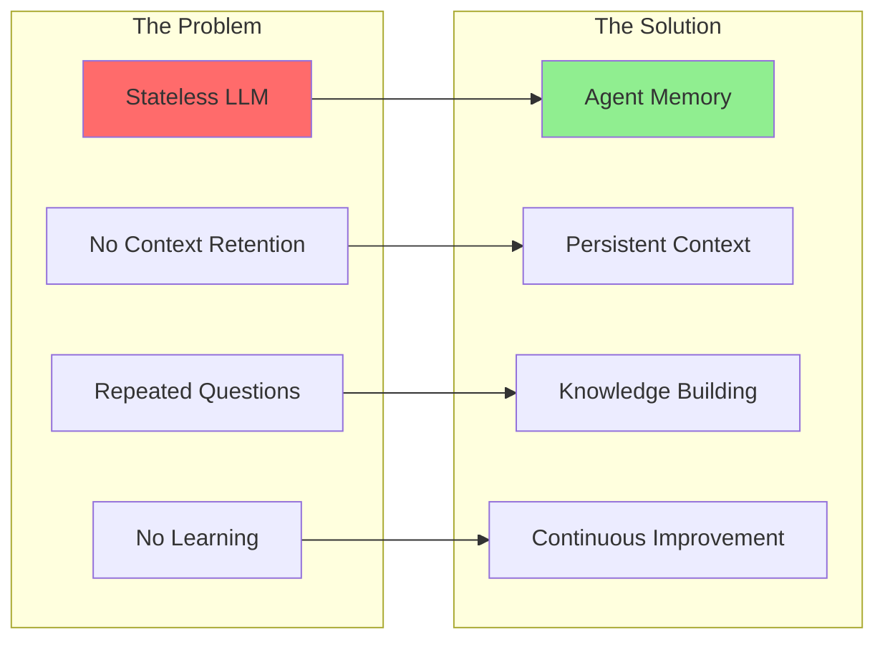

---

# 2. Memory Types and Taxonomy

## 2.1 Core Memory Types

Based on cognitive science and 2025 implementations:

```mermaid
graph TB
    subgraph "Memory Hierarchy"
        M[Agent Memory System]

        M --> ST[Short-Term Memory]
        M --> LT[Long-Term Memory]
        M --> EP[Episodic Memory]
        M --> SM[Semantic Memory]
        M --> EN[Entity Memory]
        M --> PR[Procedural Memory]
    end

    subgraph "Short-Term Characteristics"
        ST --> ST1[Current Session]
        ST --> ST2[Working Context]
        ST --> ST3[Volatile]
        ST --> ST4[Fast Access]
    end

    subgraph "Long-Term Characteristics"
        LT --> LT1[Cross-Session]
        LT --> LT2[Persistent Storage]
        LT --> LT3[Durable]
        LT --> LT4[Indexed Retrieval]
    end

    subgraph "Episodic Characteristics"
        EP --> EP1[Specific Events]
        EP --> EP2[Time-stamped]
        EP --> EP3[Contextual]
        EP --> EP4[Sequential]
    end

    subgraph "Semantic Characteristics"
        SM --> SM1[General Knowledge]
        SM --> SM2[Facts & Rules]
        SM --> SM3[Domain Expertise]
        SM --> SM4[Concepts]
    end

    style ST fill:#FFD700
    style LT fill:#87CEEB
    style EP fill:#DDA0DD
    style SM fill:#90EE90
```

### Detailed Breakdown

| Memory Type | Purpose | Duration | Storage | Example |
|-------------|---------|----------|---------|---------|
| **Short-Term** | Immediate context | Current session | RAM, Redis | "User said their order is #12345" |
| **Long-Term** | Historical knowledge | Across sessions | SQL, Vector DB | "Customer prefers email communication" |
| **Episodic** | Event sequences | Days to months | Time-series DB | "Last 5 interactions with customer" |
| **Semantic** | General facts | Permanent | Knowledge base | "Company policy: 30-day returns" |
| **Entity** | Specific entities | Permanent | Graph DB | "John Doe: Gold tier, 5 years" |
| **Procedural** | How to do tasks | Permanent | Code/Rules | "Password reset workflow" |

## 2.2 Memory Dimensions

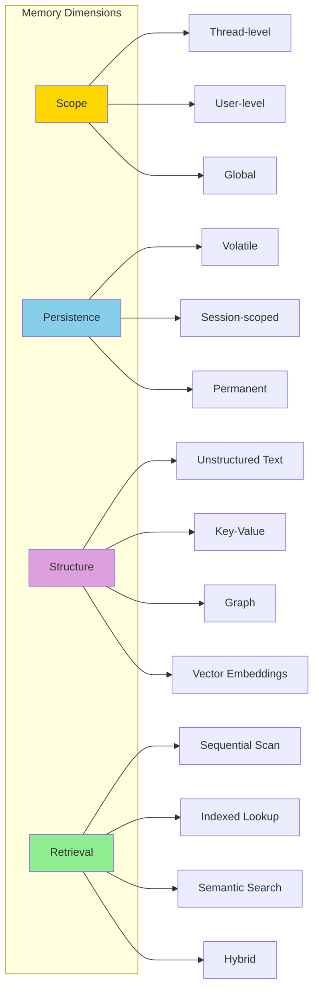

---

# 3. Framework Comparison

## 3.1 Framework Memory Capabilities (2025)

| Framework | Short-Term | Long-Term | Episodic | Semantic | Entity | Checkpointing |
|-----------|-----------|-----------|----------|----------|--------|---------------|
| **Anthropic Claude** | Context Window | CLAUDE.md files | File-based | File search + Vector | Manual | N/A |
| **LangGraph** | Thread State | Checkpointer API | State History | External RAG | Custom | Built-in |
| **CrewAI** | ChromaDB (RAG) | SQLite3 | Implicit | ChromaDB | RAG-based | Optional |
| **OpenAI Swarm** | Context Variables | External | Manual | External | Manual | No (stateless) |
| **Google Gemini** | Session Context | User Preferences | Event Log | ReasoningBank | Custom | Platform |

## 3.2 Detailed Framework Analysis

### Anthropic Claude (2025 Approach)

**Philosophy**: Simple, transparent, file-based memory

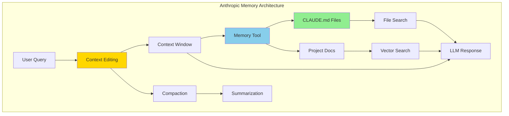

**Key Features**:
1. **Context Editing**: Auto-removes stale tool calls, compacts old turns
2. **Memory Tool**: File-based storage (Markdown), transparent and debuggable
3. **Just-in-Time**: Store lightweight references, load data dynamically
4. **Hybrid Search**: Vector embeddings + file system search

**Performance**:
- 39% improvement with Memory Tool + Context Editing
- 84% reduction in token consumption
- 29% improvement from Context Editing alone

**Code Concept**:
```python
# Anthropic Memory Pattern (Conceptual)

class AnthropicMemorySystem:
    """
    Simple file-based memory following Anthropic's approach
    """

    def __init__(self):
        self.claude_md = "CLAUDE.md"  # Core persistent memory
        self.context_window = []      # Short-term
        self.max_context_tokens = 200000

    def context_editing(self, messages):
        """Remove stale content, compress old turns"""

        # 1. Remove stale tool calls
        filtered = [
            msg for msg in messages
            if not self._is_stale_tool_call(msg)
        ]

        # 2. Compress old turns if approaching limit
        if self._token_count(filtered) > self.max_context_tokens * 0.8:
            filtered = self._compact_old_messages(filtered)

        return filtered

    def _compact_old_messages(self, messages):
        """Summarize older messages to preserve space"""

        # Keep recent messages (last 10), summarize older ones
        recent = messages[-10:]
        older = messages[:-10]

        # Summarize older messages
        summary = self._summarize_conversation(older)

        return [{"role": "system", "content": summary}] + recent

    def memory_tool_write(self, key: str, value: str):
        """Store to CLAUDE.md (long-term memory)"""

        with open(self.claude_md, 'a') as f:
            f.write(f"\n## {key}\n{value}\n")

    def memory_tool_read(self, query: str):
        """Read from CLAUDE.md using semantic search"""

        with open(self.claude_md, 'r') as f:
            content = f.read()

        # Use embedding for semantic search
        relevant_sections = self._semantic_search(query, content)
        return relevant_sections

# Best Practice: Keep CLAUDE.md minimal
"""
# CLAUDE.md Example (Minimal)

## Customer Preferences
- Preferred contact: Email
- Language: English
- Timezone: PST

## Project Context
See detailed docs in: ./docs/project_overview.md

## Key IDs
- Customer ID: cust_12345
- Current order: order_67890
"""
```

### LangGraph (Production-Ready)

**Philosophy**: Stateful workflows with built-in persistence

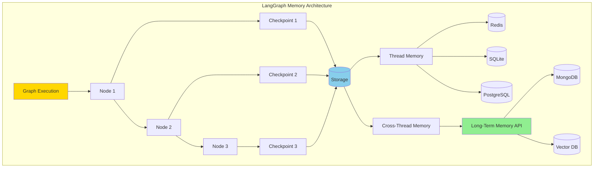

**Key Features**:
1. **Checkpointing**: Auto-save state at every step
2. **Threads**: Organize conversations by thread_id
3. **Time Travel**: Replay from any checkpoint
4. **Long-Term Memory API**: New 2025 feature for cross-thread persistence
5. **Multiple Backends**: Redis, SQLite, PostgreSQL, MongoDB

**Code Concept**:
```python
# LangGraph Memory Pattern

from langgraph.graph import StateGraph
from langgraph.checkpoint.sqlite import SqliteSaver
from langgraph.checkpoint.redis import RedisSaver
from typing import TypedDict, Annotated
import operator

class ConversationState(TypedDict):
    """State with memory"""
    messages: Annotated[list, operator.add]  # Append-only
    user_id: str

    # Short-term (thread-scoped)
    current_intent: str
    entities_mentioned: dict

    # Metadata
    thread_id: str
    checkpoint_id: str

# Short-Term Memory (Thread-scoped with Checkpointing)
class ShortTermMemory:
    """Thread-level persistence"""

    def __init__(self):
        # Choose backend
        self.checkpointer = SqliteSaver.from_conn_string(":memory:")
        # or Redis for production
        # self.checkpointer = RedisSaver.from_conn_string("redis://localhost:6379")

    def build_graph(self):
        workflow = StateGraph(ConversationState)

        # Add nodes...
        workflow.add_node("process", self.process_node)
        workflow.set_entry_point("process")

        # Compile with checkpointing
        return workflow.compile(checkpointer=self.checkpointer)

    def run(self, user_id: str, message: str, thread_id: str):
        """Run with automatic checkpointing"""

        graph = self.build_graph()

        config = {"configurable": {"thread_id": thread_id}}

        # State auto-saved at each step
        result = graph.invoke({
            "messages": [{"role": "user", "content": message}],
            "user_id": user_id,
            "thread_id": thread_id
        }, config=config)

        return result

    def get_conversation_history(self, thread_id: str):
        """Retrieve past conversation"""

        config = {"configurable": {"thread_id": thread_id}}
        state = self.graph.get_state(config)

        return state.values['messages']

# Long-Term Memory (Cross-thread with new API)
class LongTermMemory:
    """Cross-session persistent memory (2025 feature)"""

    def __init__(self):
        # MongoDB for long-term storage
        from langgraph.store.mongodb import MongoDBStore

        self.store = MongoDBStore(
            connection_string="mongodb://localhost:27017",
            database="agent_memory"
        )

    def remember(self, user_id: str, key: str, value: dict):
        """Store across sessions"""

        # Namespace by user
        namespace = ["users", user_id]

        self.store.put(
            namespace=namespace,
            key=key,
            value=value
        )

    def recall(self, user_id: str, key: str = None):
        """Retrieve from long-term memory"""

        namespace = ["users", user_id]

        if key:
            return self.store.get(namespace, key)
        else:
            # Get all memories for user
            return self.store.search(namespace)

    def semantic_search(self, user_id: str, query: str):
        """Search by meaning (requires vector embeddings)"""

        # Embed query
        query_embedding = self._embed(query)

        # Search with filter
        results = self.store.search(
            namespace=["users", user_id],
            filter={"embedding": {"$near": query_embedding}},
            limit=5
        )

        return results

# Combined Usage
class AgentWithMemory:
    def __init__(self):
        self.short_term = ShortTermMemory()
        self.long_term = LongTermMemory()

    def chat(self, user_id: str, message: str, thread_id: str):
        # Check long-term memory first
        user_prefs = self.long_term.recall(user_id, "preferences")

        # Process with short-term memory
        response = self.short_term.run(user_id, message, thread_id)

        # Update long-term memory if needed
        if self._learned_something_new(response):
            self.long_term.remember(
                user_id,
                "last_interaction",
                {
                    "thread_id": thread_id,
                    "summary": response['summary'],
                    "timestamp": time.time()
                }
            )

        return response
```

### CrewAI (Built-in Memory System)

**Philosophy**: Multi-type memory with easy activation

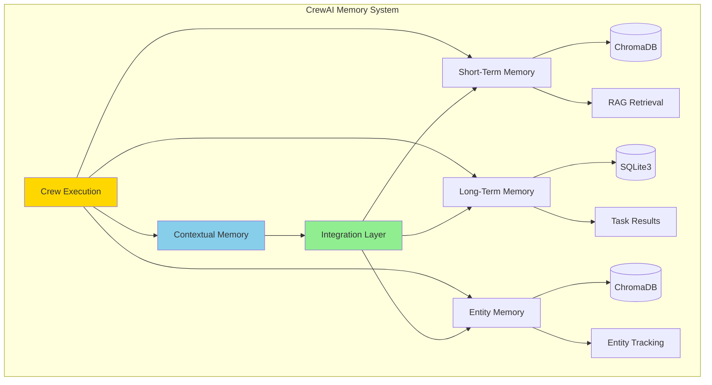

**Key Features**:
1. **4 Memory Types**: Short-term, Long-term, Entity, Contextual
2. **Easy Activation**: `memory=True` enables all
3. **RAG-Powered**: ChromaDB for short-term and entity memory
4. **SQLite3**: Task results storage
5. **Mem0 Integration**: Optional enhanced memory provider

**Code Concept**:
```python
# CrewAI Memory Pattern

from crewai import Agent, Task, Crew, Process
from crewai.memory import ShortTermMemory, LongTermMemory, EntityMemory

# Simple Activation
crew = Crew(
    agents=[agent1, agent2],
    tasks=[task1, task2],
    memory=True,  # Enables all 4 memory types
    verbose=True
)

# Advanced Configuration
class CustomMemoryCrew:
    def __init__(self):
        # Configure each memory type
        self.short_term = ShortTermMemory(
            provider="chromadb",  # or "mem0"
            collection_name="conversations"
        )

        self.long_term = LongTermMemory(
            provider="sqlite3",
            db_path="./crew_memory.db"
        )

        self.entity_memory = EntityMemory(
            provider="chromadb",
            collection_name="entities"
        )

    def create_crew(self):
        # Customer support agent with memory
        support_agent = Agent(
            role="Customer Support",
            goal="Help customers efficiently",
            backstory="Experienced support agent",
            memory_config={
                "short_term": self.short_term,
                "long_term": self.long_term,
                "entity": self.entity_memory
            }
        )

        return Crew(
            agents=[support_agent],
            process=Process.sequential
        )

    def handle_query(self, customer_id: str, query: str):
        """Process with automatic memory"""

        # Memory automatically:
        # 1. Retrieves relevant past interactions (short-term)
        # 2. Recalls customer preferences (long-term)
        # 3. Recognizes entities (entity memory)
        # 4. Maintains context (contextual memory)

        task = Task(
            description=f"Help customer {customer_id}: {query}",
            expected_output="Helpful response"
        )

        crew = self.create_crew()
        result = crew.kickoff()

        return result

# Memory Storage Locations
"""
CrewAI uses platform-specific directories:
- Linux: ~/.local/share/crewai
- macOS: ~/Library/Application Support/crewai
- Windows: C:\\Users\\<user>\\AppData\\Local\\crewai

Customize with: CREWAI_STORAGE_DIR environment variable
"""

# Memory Access Patterns
class CrewAIMemoryAccess:
    """How CrewAI memory works internally"""

    def short_term_lookup(self, query: str):
        """RAG-based retrieval from recent context"""

        # Embed query
        query_embedding = self._embed(query)

        # Search ChromaDB
        results = self.chroma_client.query(
            collection_name="short_term",
            query_embeddings=[query_embedding],
            n_results=5
        )

        return results

    def long_term_store(self, task_result: dict):
        """Store task outcomes in SQLite"""

        cursor = self.db.cursor()
        cursor.execute("""
            INSERT INTO task_results (task_id, result, timestamp)
            VALUES (?, ?, ?)
        """, (task_result['id'], task_result['output'], time.time()))

        self.db.commit()

    def entity_tracking(self, text: str):
        """Extract and remember entities"""

        # NER (Named Entity Recognition)
        entities = self._extract_entities(text)

        for entity in entities:
            # Store in ChromaDB with metadata
            self.chroma_client.add(
                collection_name="entities",
                documents=[entity['text']],
                metadatas=[{
                    "type": entity['type'],
                    "first_seen": time.time(),
                    "mentions": 1
                }],
                ids=[entity['id']]
            )
```

### OpenAI Swarm (Stateless by Design)

**Philosophy**: Deliberate statelessness with external memory

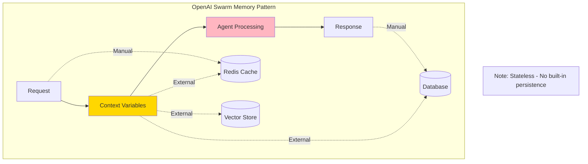

**Key Features**:
1. **Stateless**: No built-in memory (by design)
2. **Context Variables**: Temporary per-request context
3. **External Storage Required**: Developer implements memory
4. **Lightweight**: Minimal framework overhead

**Code Concept**:
```python
# OpenAI Swarm Memory Pattern (Manual Implementation)

from swarm import Swarm, Agent

class SwarmWithMemory:
    """Add memory to stateless Swarm"""

    def __init__(self):
        self.client = Swarm()
        self.memory_store = {}  # External memory (Redis in production)

    def run_with_memory(self, user_id: str, messages: list):
        """Manually inject memory into context"""

        # 1. Load memory from external store
        user_memory = self.memory_store.get(user_id, {
            "preferences": {},
            "history": [],
            "entities": {}
        })

        # 2. Inject into context_variables
        context_variables = {
            "user_id": user_id,
            "user_preferences": user_memory['preferences'],
            "conversation_history": user_memory['history'][-5:],  # Last 5
            "known_entities": user_memory['entities']
        }

        # 3. Run Swarm
        response = self.client.run(
            agent=self.create_agent(),
            messages=messages,
            context_variables=context_variables
        )

        # 4. Update memory (manual)
        user_memory['history'].append({
            "messages": messages,
            "response": response.messages[-1],
            "timestamp": time.time()
        })

        self.memory_store[user_id] = user_memory

        return response

    def create_agent(self):
        """Agent that uses context variables for memory"""

        def recall_preference(context_variables):
            """Tool to access memory"""
            return context_variables.get('user_preferences', {})

        return Agent(
            name="Assistant",
            instructions="""You have access to user preferences and history.
            Use recall_preference() to check what you know about the user.""",
            functions=[recall_preference]
        )

# Production Implementation with Redis
import redis
import json

class ProductionSwarmMemory:
    """Production-ready external memory for Swarm"""

    def __init__(self):
        self.client = Swarm()
        self.redis = redis.Redis(host='localhost', port=6379, db=0)

    def get_memory(self, user_id: str) -> dict:
        """Load from Redis"""
        data = self.redis.get(f"memory:{user_id}")
        return json.loads(data) if data else {}

    def set_memory(self, user_id: str, memory: dict):
        """Save to Redis"""
        self.redis.setex(
            f"memory:{user_id}",
            86400,  # 24 hour TTL
            json.dumps(memory)
        )

    def run(self, user_id: str, message: str):
        memory = self.get_memory(user_id)

        # Build context
        context = {
            "user_id": user_id,
            "last_seen": memory.get('last_seen'),
            "preferences": memory.get('preferences', {}),
            "summary": memory.get('summary', '')
        }

        response = self.client.run(
            agent=self.agent,
            messages=[{"role": "user", "content": message}],
            context_variables=context
        )

        # Update memory
        memory.update({
            "last_seen": time.time(),
            "last_message": message,
            "summary": self._summarize_conversation(response)
        })

        self.set_memory(user_id, memory)

        return response
```

---

# 4. Memory Architecture Patterns

## 4.1 Hybrid Memory Architecture (Recommended)

Most production systems use a **hybrid approach** combining multiple memory types:

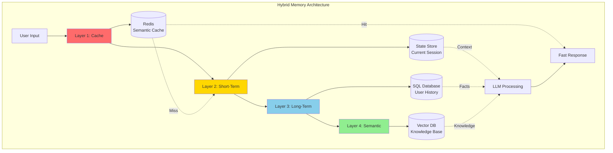

### Layer Breakdown

**Layer 1: Semantic Cache** (Fastest, 1-10ms)
- Purpose: Avoid redundant LLM calls
- Storage: Redis with embeddings
- TTL: Minutes to hours
- Use case: Identical/similar queries

**Layer 2: Short-Term Memory** (Fast, 10-100ms)
- Purpose: Current conversation context
- Storage: Redis, session state
- TTL: Duration of session
- Use case: Multi-turn dialogue

**Layer 3: Long-Term Memory** (Medium, 100-500ms)
- Purpose: User history, preferences
- Storage: PostgreSQL, MongoDB
- TTL: Months to years
- Use case: Personalization

**Layer 4: Semantic Memory** (Slower, 200-1000ms)
- Purpose: Domain knowledge, FAQs
- Storage: Pinecone, Weaviate
- TTL: Permanent
- Use case: RAG, knowledge retrieval

## 4.2 Memory Retrieval Strategies

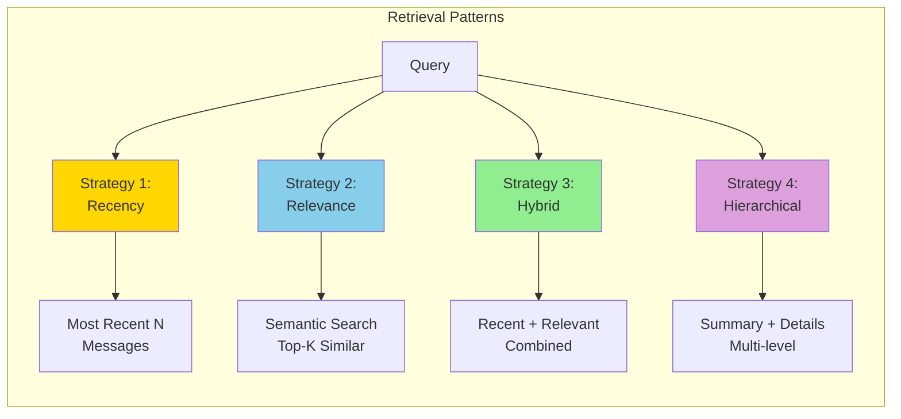

**Strategy Comparison**:

| Strategy | Pros | Cons | Best For |
|----------|------|------|----------|
| **Recency** | Simple, fast | Misses important old info | Chat, short sessions |
| **Relevance** | Finds pertinent info | Can miss temporal context | Knowledge retrieval |
| **Hybrid** | Best of both | More complex | Production systems |
| **Hierarchical** | Handles long history | Most compute | Extended workflows |

## 4.3 Context Window Management

Based on **OpenAI Agents SDK 2025** research:

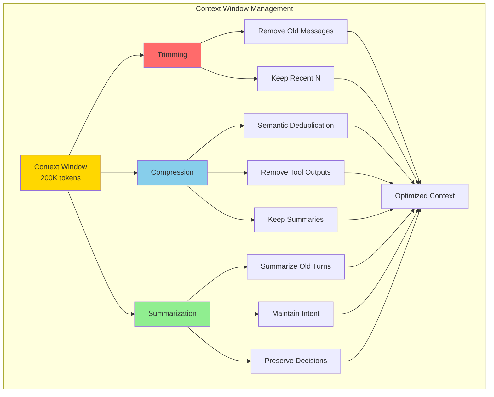

**Techniques**:

1. **Trimming** (Anthropic approach):
   - Remove stale tool calls
   - Keep only recent messages
   - Discard redundant confirmations

2. **Compression** (OpenAI approach):
   - Semantic deduplication
   - Remove verbose tool outputs
   - Keep decision points

3. **Summarization** (Hybrid):
   - Summarize every N turns
   - Maintain key facts
   - Preserve conversation flow

**Code Concept**:
```python
class ContextWindowManager:
    """Manage context within token limits"""

    def __init__(self, max_tokens=200000):
        self.max_tokens = max_tokens
        self.warning_threshold = 0.8  # 80% capacity

    def manage_context(self, messages: list) -> list:
        """Apply trimming, compression, summarization"""

        current_tokens = self._count_tokens(messages)

        if current_tokens < self.max_tokens * self.warning_threshold:
            return messages  # No action needed

        # Stage 1: Remove stale tool calls (Anthropic pattern)
        messages = self._remove_stale_tools(messages)

        # Stage 2: Compress old messages
        if self._count_tokens(messages) > self.max_tokens * 0.9:
            messages = self._compress_old_messages(messages)

        # Stage 3: Summarize if still too large
        if self._count_tokens(messages) > self.max_tokens:
            messages = self._summarize_and_truncate(messages)

        return messages

    def _remove_stale_tools(self, messages: list) -> list:
        """Remove tool calls that are no longer relevant"""

        filtered = []
        active_tool_ids = set()

        # Reverse pass: identify active tool results
        for msg in reversed(messages):
            if msg['role'] == 'tool':
                active_tool_ids.add(msg.get('tool_call_id'))

        # Forward pass: keep only active tools
        for msg in messages:
            if msg['role'] == 'assistant' and msg.get('tool_calls'):
                # Keep if referenced
                active_calls = [
                    tc for tc in msg['tool_calls']
                    if tc['id'] in active_tool_ids
                ]
                if active_calls:
                    msg['tool_calls'] = active_calls
                    filtered.append(msg)
            else:
                filtered.append(msg)

        return filtered

    def _compress_old_messages(self, messages: list, keep_recent=10):
        """Keep recent, summarize old"""

        recent = messages[-keep_recent:]
        old = messages[:-keep_recent]

        # Summarize old messages
        summary = self._generate_summary(old)

        return [
            {"role": "system", "content": f"Previous conversation summary: {summary}"}
        ] + recent

    def _summarize_and_truncate(self, messages: list):
        """Last resort: aggressive summarization"""

        # Keep system message and last 5 turns
        system_msg = [m for m in messages if m['role'] == 'system']
        recent_msgs = messages[-5:]

        # Summarize everything else
        middle = messages[len(system_msg):-5]
        summary = self._generate_summary(middle)

        return system_msg + [
            {"role": "system", "content": f"Summary: {summary}"}
        ] + recent_msgs
```

---

# 5. Implementation Strategies

## 5.1 Semantic Caching (Performance Optimization)

**Semantic caching** understands query meaning rather than exact string matches, reducing LLM calls by 40-70% in production.

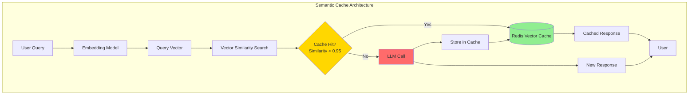

**Code Concept**:
```python
import numpy as np
from typing import Optional
import hashlib

class SemanticCache:
    """
    Cache LLM responses based on semantic similarity
    """

    def __init__(self, redis_client, embedding_model, threshold=0.95):
        self.redis = redis_client
        self.embed = embedding_model
        self.threshold = threshold
        self.cache_key_prefix = "semantic_cache:"

    async def get(self, query: str) -> Optional[str]:
        """Check cache for semantically similar query"""

        # 1. Generate query embedding
        query_vector = self.embed.encode(query)

        # 2. Search for similar cached queries
        similar_entry = await self._find_similar(query_vector)

        if similar_entry and similar_entry['similarity'] >= self.threshold:
            # Cache hit
            return similar_entry['response']

        return None  # Cache miss

    async def set(self, query: str, response: str, ttl: int = 3600):
        """Store query-response pair with embedding"""

        # Generate embedding
        query_vector = self.embed.encode(query)

        # Store in Redis with vector
        cache_entry = {
            "query": query,
            "response": response,
            "embedding": query_vector.tolist(),
            "timestamp": time.time()
        }

        cache_key = self._generate_cache_key(query)

        await self.redis.setex(
            cache_key,
            ttl,
            json.dumps(cache_entry)
        )

    async def _find_similar(self, query_vector: np.ndarray) -> Optional[dict]:
        """Find most similar cached query"""

        # Get all cache keys
        pattern = f"{self.cache_key_prefix}*"
        cache_keys = await self.redis.keys(pattern)

        best_match = None
        best_similarity = 0.0

        for key in cache_keys:
            entry_data = await self.redis.get(key)
            if not entry_data:
                continue

            entry = json.loads(entry_data)
            cached_vector = np.array(entry['embedding'])

            # Cosine similarity
            similarity = self._cosine_similarity(query_vector, cached_vector)

            if similarity > best_similarity:
                best_similarity = similarity
                best_match = {
                    "query": entry['query'],
                    "response": entry['response'],
                    "similarity": similarity
                }

        return best_match

    def _cosine_similarity(self, v1: np.ndarray, v2: np.ndarray) -> float:
        """Calculate cosine similarity"""
        return np.dot(v1, v2) / (np.linalg.norm(v1) * np.linalg.norm(v2))

    def _generate_cache_key(self, query: str) -> str:
        """Generate unique cache key"""
        query_hash = hashlib.md5(query.encode()).hexdigest()
        return f"{self.cache_key_prefix}{query_hash}"

# Usage
cache = SemanticCache(redis_client, embedding_model)

async def query_with_cache(user_query: str) -> str:
    # Check cache first
    cached_response = await cache.get(user_query)
    if cached_response:
        print("Cache hit!")
        return cached_response

    # Cache miss - call LLM
    response = await llm.generate(user_query)

    # Store in cache
    await cache.set(user_query, response)

    return response

# Performance gains:
"""
Without cache:  1000 queries = 1000 LLM calls ($100)
With cache:     1000 queries = 300 LLM calls ($30)
Savings: 70% cost reduction, 80% latency reduction
"""
```

## 5.2 RAG + Memory Integration

Combining **Retrieval-Augmented Generation (RAG)** with **agent memory** for contextual knowledge:

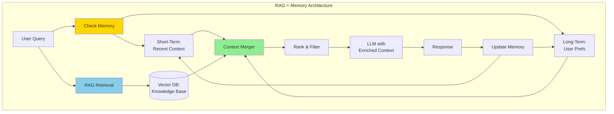

**Code Concept**:
```python
class RAGWithMemory:
    """
    Integrate RAG retrieval with agent memory
    """

    def __init__(self, vector_db, memory_system):
        self.vector_db = vector_db
        self.memory = memory_system

    async def retrieve_with_context(
        self,
        query: str,
        user_id: str,
        thread_id: str
    ) -> dict:
        """Retrieve from both memory and knowledge base"""

        # 1. Get short-term memory (recent conversation)
        short_term = await self.memory.get_short_term(thread_id)

        # 2. Get long-term memory (user preferences, history)
        long_term = await self.memory.get_long_term(user_id)

        # 3. RAG retrieval from knowledge base
        rag_results = await self.vector_db.search(
            query=query,
            top_k=5,
            filters=self._build_filters(long_term)
        )

        # 4. Merge and rank all context
        merged_context = self._merge_context(
            query=query,
            short_term=short_term,
            long_term=long_term,
            rag_results=rag_results
        )

        return merged_context

    def _build_filters(self, long_term_memory: dict) -> dict:
        """Use memory to filter RAG retrieval"""

        filters = {}

        # Example: Filter by user's preferred topics
        if 'preferred_topics' in long_term_memory:
            filters['topic'] = {'$in': long_term_memory['preferred_topics']}

        # Example: Filter by user's role/department
        if 'role' in long_term_memory:
            filters['audience'] = long_term_memory['role']

        return filters

    def _merge_context(
        self,
        query: str,
        short_term: list,
        long_term: dict,
        rag_results: list
    ) -> dict:
        """Combine memory and RAG results"""

        context = {
            "query": query,
            "sources": []
        }

        # Add recent conversation (highest priority)
        if short_term:
            context["sources"].append({
                "type": "short_term_memory",
                "content": short_term[-5:],  # Last 5 turns
                "priority": 1
            })

        # Add user preferences
        if long_term.get('preferences'):
            context["sources"].append({
                "type": "user_preferences",
                "content": long_term['preferences'],
                "priority": 2
            })

        # Add RAG results
        for idx, result in enumerate(rag_results):
            context["sources"].append({
                "type": "knowledge_base",
                "content": result['text'],
                "metadata": result['metadata'],
                "score": result['score'],
                "priority": 3 + idx  # Lower priority than memory
            })

        # Rank by priority and relevance
        context["sources"] = sorted(
            context["sources"],
            key=lambda x: (x["priority"], -x.get("score", 0))
        )

        return context

# Usage Example
async def chat_with_rag_memory(
    user_id: str,
    thread_id: str,
    message: str
):
    rag_memory = RAGWithMemory(vector_db, memory_system)

    # Retrieve enriched context
    context = await rag_memory.retrieve_with_context(
        query=message,
        user_id=user_id,
        thread_id=thread_id
    )

    # Build prompt with all context
    prompt = f"""
    User Query: {message}

    User Preferences: {context['sources'][0]['content']}

    Recent Conversation:
    {format_conversation(context['sources'][1]['content'])}

    Relevant Knowledge:
    {format_knowledge(context['sources'][2:])}

    Provide a helpful response considering all context.
    """

    response = await llm.generate(prompt)

    # Update memory with new interaction
    await memory_system.update_short_term(thread_id, {
        "user": message,
        "assistant": response
    })

    return response
```

## 5.3 Entity Memory (Tracking Entities Across Conversations)

Track **people, places, things** mentioned in conversations:

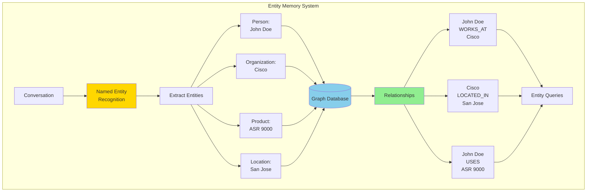

**Code Concept**:
```python
class EntityMemory:
    """
    Track entities and relationships across conversations
    """

    def __init__(self, graph_db):
        self.graph = graph_db  # Neo4j, TigerGraph, etc.
        self.ner_model = self._load_ner_model()

    async def extract_and_store(
        self,
        text: str,
        conversation_id: str
    ):
        """Extract entities from text and store"""

        # 1. NER extraction
        entities = self.ner_model.extract(text)

        # 2. Store each entity
        for entity in entities:
            await self._store_entity(entity, conversation_id)

        # 3. Infer relationships
        relationships = self._infer_relationships(entities)
        for rel in relationships:
            await self._store_relationship(rel)

    async def _store_entity(self, entity: dict, conv_id: str):
        """Store entity in graph"""

        query = """
        MERGE (e:Entity {id: $entity_id})
        ON CREATE SET
            e.name = $name,
            e.type = $type,
            e.first_seen = timestamp(),
            e.mention_count = 1
        ON MATCH SET
            e.mention_count = e.mention_count + 1,
            e.last_seen = timestamp()

        MERGE (c:Conversation {id: $conv_id})
        MERGE (e)-[:MENTIONED_IN]->(c)
        """

        await self.graph.execute(query, {
            "entity_id": entity['id'],
            "name": entity['text'],
            "type": entity['type'],
            "conv_id": conv_id
        })

    async def recall_entity(self, entity_name: str) -> dict:
        """Retrieve entity and its context"""

        query = """
        MATCH (e:Entity {name: $name})
        OPTIONAL MATCH (e)-[r]->(other)
        RETURN e, collect({rel: type(r), target: other}) as relationships
        """

        result = await self.graph.execute(query, {"name": entity_name})

        return {
            "entity": result['e'],
            "relationships": result['relationships'],
            "context": await self._build_entity_context(entity_name)
        }

    async def _build_entity_context(self, entity_name: str) -> str:
        """Generate natural language context for entity"""

        # Get entity info
        entity_data = await self.recall_entity(entity_name)

        # Build context string
        context_parts = [
            f"{entity_name} is a {entity_data['entity']['type']}."
        ]

        # Add relationships
        for rel in entity_data['relationships']:
            context_parts.append(
                f"{entity_name} {rel['rel'].lower()} {rel['target']['name']}."
            )

        # Add temporal info
        context_parts.append(
            f"First mentioned {self._format_time(entity_data['entity']['first_seen'])}."
        )

        return " ".join(context_parts)

# Usage in Agent
async def agent_with_entity_memory(user_message: str, conv_id: str):
    entity_memory = EntityMemory(graph_db)

    # Extract entities from user message
    await entity_memory.extract_and_store(user_message, conv_id)

    # Check if user mentioned any known entities
    entities = entity_memory.ner_model.extract(user_message)

    context = []
    for entity in entities:
        entity_context = await entity_memory.recall_entity(entity['text'])
        context.append(entity_context)

    # Build prompt with entity context
    prompt = f"""
    User: {user_message}

    Known Entities Context:
    {format_entity_context(context)}

    Respond with awareness of these entities and their history.
    """

    response = await llm.generate(prompt)
    return response
```

## 5.4 Memory Compression Techniques

**Challenge**: Long conversations exceed context window
**Solution**: Intelligent compression

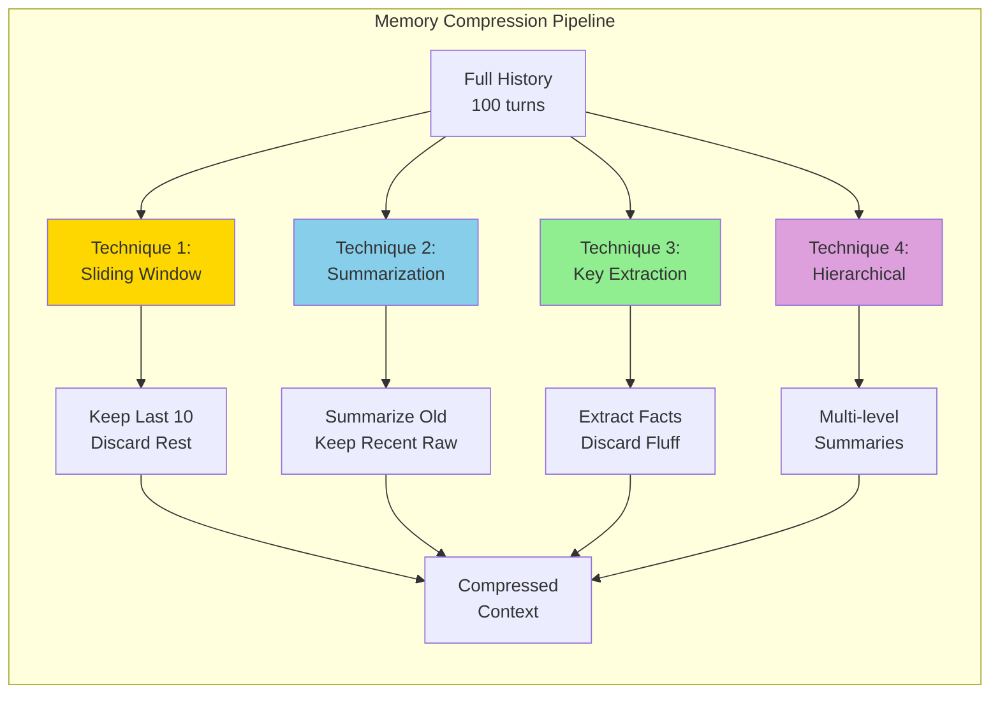

**Code Concepts**:
```python
class MemoryCompressor:
    """
    Compress long conversation history
    """

    def __init__(self, llm, max_tokens=10000):
        self.llm = llm
        self.max_tokens = max_tokens

    async def compress(
        self,
        messages: list,
        strategy: str = "hierarchical"
    ) -> list:
        """Apply compression strategy"""

        strategies = {
            "sliding_window": self._sliding_window,
            "summarization": self._summarize_old,
            "key_extraction": self._extract_key_points,
            "hierarchical": self._hierarchical_summary
        }

        return await strategies[strategy](messages)

    async def _sliding_window(
        self,
        messages: list,
        window_size: int = 10
    ) -> list:
        """Keep only recent N messages"""

        return messages[-window_size:]

    async def _summarize_old(
        self,
        messages: list,
        keep_recent: int = 10
    ) -> list:
        """Summarize old, keep recent raw"""

        recent = messages[-keep_recent:]
        old = messages[:-keep_recent]

        if not old:
            return recent

        # Summarize old messages
        summary_prompt = f"""
        Summarize this conversation history concisely.
        Focus on:
        - Key decisions made
        - Important information shared
        - User preferences mentioned
        - Pending tasks or questions

        Conversation:
        {self._format_messages(old)}

        Summary (max 200 words):
        """

        summary = await self.llm.generate(summary_prompt)

        return [
            {"role": "system", "content": f"Previous conversation summary: {summary}"}
        ] + recent

    async def _extract_key_points(self, messages: list) -> list:
        """Extract and keep only key facts"""

        extraction_prompt = f"""
        Extract key facts, decisions, and information from this conversation.
        Return as a structured list.

        Conversation:
        {self._format_messages(messages)}

        Key Points (JSON format):
        """

        key_points = await self.llm.generate(
            extraction_prompt,
            response_format="json"
        )

        return [
            {
                "role": "system",
                "content": f"Key facts from conversation: {json.dumps(key_points)}"
            }
        ] + messages[-5:]  # Keep last 5 raw

    async def _hierarchical_summary(
        self,
        messages: list,
        levels: int = 3
    ) -> list:
        """Multi-level summarization for very long history"""

        compressed = []

        # Level 1: Detailed summary of oldest third
        oldest_third = messages[:len(messages)//3]
        if oldest_third:
            summary_l1 = await self._create_summary(oldest_third, detail="low")
            compressed.append({
                "role": "system",
                "content": f"Early conversation (brief): {summary_l1}"
            })

        # Level 2: Medium summary of middle third
        middle_third = messages[len(messages)//3:2*len(messages)//3]
        if middle_third:
            summary_l2 = await self._create_summary(middle_third, detail="medium")
            compressed.append({
                "role": "system",
                "content": f"Middle conversation (moderate): {summary_l2}"
            })

        # Level 3: Keep recent third raw
        recent_third = messages[2*len(messages)//3:]
        compressed.extend(recent_third)

        return compressed

    async def _create_summary(
        self,
        messages: list,
        detail: str = "medium"
    ) -> str:
        """Create summary with specified detail level"""

        detail_instructions = {
            "low": "1-2 sentences, key points only",
            "medium": "1 paragraph, main topics and decisions",
            "high": "2-3 paragraphs, detailed context"
        }

        prompt = f"""
        Summarize this conversation: {detail_instructions[detail]}

        {self._format_messages(messages)}

        Summary:
        """

        return await self.llm.generate(prompt)

# Usage Example
compressor = MemoryCompressor(llm)

async def manage_long_conversation(messages: list):
    token_count = count_tokens(messages)

    if token_count > 10000:
        # Compress using hierarchical strategy
        compressed = await compressor.compress(
            messages,
            strategy="hierarchical"
        )
        return compressed

    return messages  # No compression needed
```

---

# 6. Best Practices

## 6.1 Memory Design Principles

Based on 2025 industry research:

### 1. **Principle of Least Surprise**
Memory should behave predictably and transparently.

```python
# GOOD: Explicit memory operations
memory.remember("user_preference", "email_notifications", True)
pref = memory.recall("user_preference", "email_notifications")

# BAD: Hidden/implicit memory that surprises users
# Agent mysteriously remembers something never explicitly stored
```

### 2. **Privacy by Design**
Implement memory with privacy controls.

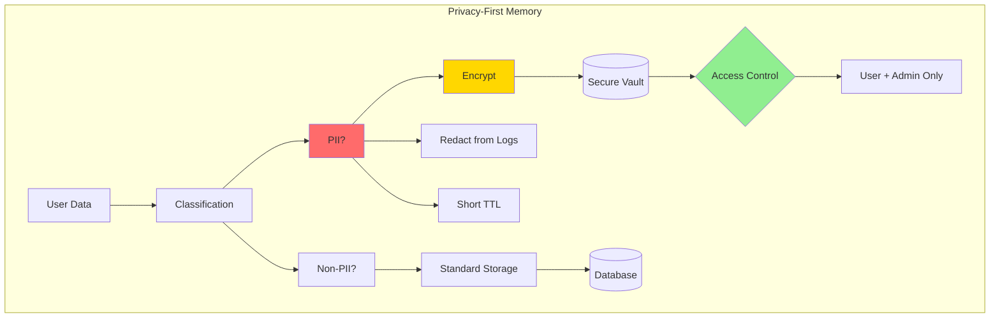

### 3. **Selective Memory**
Not everything needs to be remembered.

```python
class SelectiveMemory:
    """Remember only what matters"""

    def should_remember(self, interaction: dict) -> bool:
        """Decide if interaction is worth remembering"""

        # Skip generic greetings
        if self._is_generic_greeting(interaction):
            return False

        # Remember preferences
        if self._contains_preference(interaction):
            return True

        # Remember decisions
        if self._contains_decision(interaction):
            return True

        # Remember facts about user
        if self._contains_user_fact(interaction):
            return True

        # Default: don't remember
        return False

    def _contains_preference(self, interaction: dict) -> bool:
        """Check if interaction expresses a preference"""
        keywords = ["prefer", "like", "always", "never", "usually"]
        return any(kw in interaction['text'].lower() for kw in keywords)
```

### 4. **Memory Expiration**
Set appropriate TTLs based on memory type.

| Memory Type | TTL | Reasoning |
|-------------|-----|-----------|
| **Semantic Cache** | 1-24 hours | Query patterns change |
| **Short-term (session)** | Until session end | Only relevant during conversation |
| **User preferences** | 90 days | User habits evolve |
| **Facts/Knowledge** | 1 year | May become outdated |
| **Compliance data** | Retention policy | Legal requirements |

### 5. **Graceful Degradation**
System works even if memory fails.

```python
async def get_with_fallback(memory_key: str, default=None):
    """Always have a fallback"""

    try:
        return await memory.get(memory_key)
    except MemoryUnavailable:
        logger.warning(f"Memory unavailable for {memory_key}, using default")
        return default
    except Exception as e:
        logger.error(f"Memory error: {e}")
        return default

# Agent continues working even if memory system is down
```

## 6.2 Memory Anti-Patterns (What to Avoid)

### ❌ Anti-Pattern 1: Unbounded Memory Growth
```python
# BAD: Memory grows forever
class BadMemory:
    def __init__(self):
        self.all_messages = []  # No limit!

    def add_message(self, msg):
        self.all_messages.append(msg)  # Eventually OOM
```

### ✅ Solution: Implement Limits
```python
# GOOD: Bounded memory with automatic cleanup
class GoodMemory:
    def __init__(self, max_messages=1000):
        self.messages = deque(maxlen=max_messages)

    def add_message(self, msg):
        self.messages.append(msg)  # Auto-evicts oldest
```

### ❌ Anti-Pattern 2: Storing Raw PII
```python
# BAD: Credit card in plain text
memory.store({
    "user_id": "123",
    "credit_card": "4532-1234-5678-9010",  # Never do this!
    "ssn": "123-45-6789"
})
```

### ✅ Solution: Tokenization and Encryption
```python
# GOOD: Store references, not raw data
memory.store({
    "user_id": "123",
    "payment_token": "tok_1234abcd",  # Tokenized reference
    "verified": True
})
```

### ❌ Anti-Pattern 3: Ignoring Memory Staleness
```python
# BAD: Using old preferences without checking
pref = memory.get("notification_preference")  # Could be 2 years old!
send_notification(user, method=pref)
```

### ✅ Solution: Check Timestamps
```python
# GOOD: Verify memory freshness
pref = memory.get_with_timestamp("notification_preference")

if pref and (time.time() - pref['timestamp']) < 30 * 24 * 3600:  # 30 days
    send_notification(user, method=pref['value'])
else:
    # Ask user for current preference
    pref_value = prompt_user_for_preference()
    memory.set("notification_preference", pref_value)
```

## 6.3 Memory Testing Strategies

```python
class MemoryTests:
    """Test suite for agent memory"""

    async def test_short_term_recall(self):
        """Agent remembers within session"""

        # Conversation 1
        response1 = await agent.chat("My order number is 12345")
        assert "12345" in response1

        # Conversation 2 (same session)
        response2 = await agent.chat("What was my order number?")
        assert "12345" in response2  # Should recall

    async def test_long_term_persistence(self):
        """Memory persists across sessions"""

        session_id_1 = "session_1"
        session_id_2 = "session_2"

        # Session 1: Set preference
        await agent.chat(
            "I prefer email notifications",
            session_id=session_id_1
        )

        # Session 2: Should remember
        response = await agent.chat(
            "What's my notification preference?",
            session_id=session_id_2
        )

        assert "email" in response.lower()

    async def test_memory_privacy(self):
        """PII is properly handled"""

        # User shares sensitive info
        await agent.chat("My SSN is 123-45-6789")

        # Check that raw SSN is not in logs
        logs = get_system_logs()
        assert "123-45-6789" not in logs

        # Check that SSN is encrypted in database
        db_entry = db.get_memory(user_id="test_user")
        assert db_entry['ssn_encrypted'] is not None
        assert "123-45-6789" not in str(db_entry)

    async def test_memory_expiration(self):
        """Old memories are properly cleaned up"""

        # Set memory with TTL
        await memory.set("temp_token", "abc123", ttl=1)  # 1 second

        # Immediately available
        assert await memory.get("temp_token") == "abc123"

        # Wait for expiration
        await asyncio.sleep(2)

        # Should be gone
        assert await memory.get("temp_token") is None

    async def test_memory_consistency(self):
        """Memory remains consistent across operations"""

        user_id = "test_user"

        # Write
        await memory.set(user_id, "preference", "email")

        # Read multiple times
        pref1 = await memory.get(user_id, "preference")
        pref2 = await memory.get(user_id, "preference")
        pref3 = await memory.get(user_id, "preference")

        assert pref1 == pref2 == pref3 == "email"
```

---

# 7. Production Considerations

## 7.1 Scalability Patterns

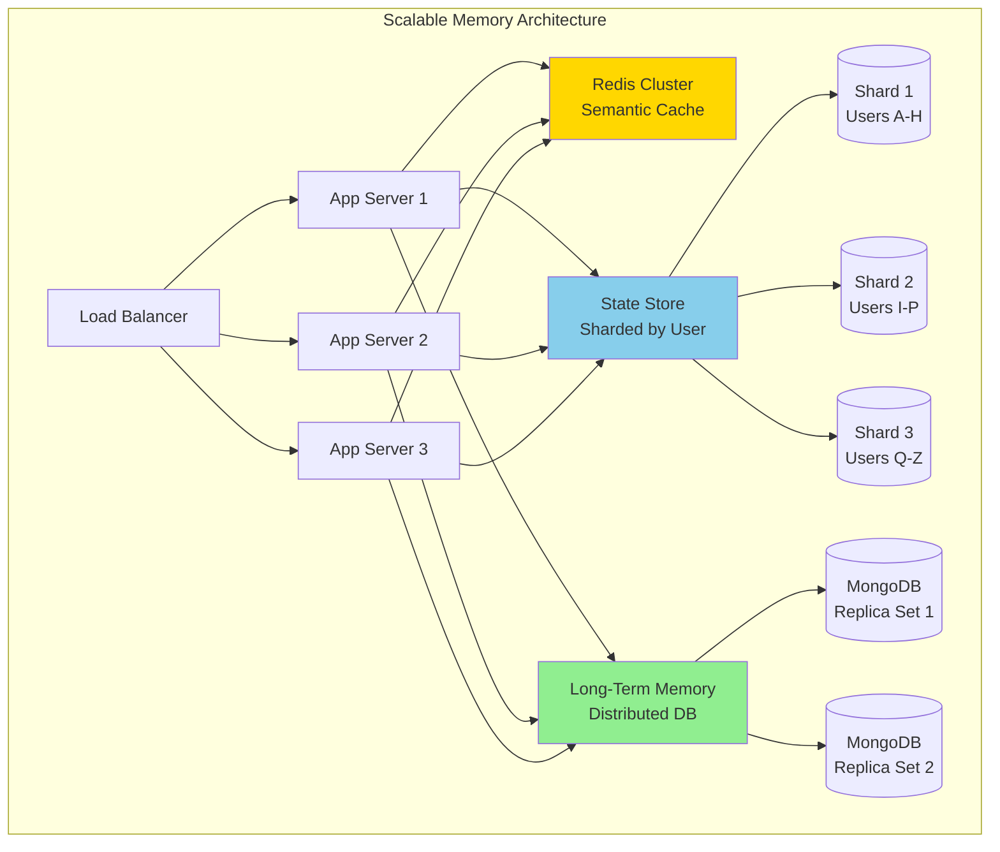

**Scaling Strategies**:

1. **Horizontal Scaling**: Multiple app servers share memory backends
2. **Data Sharding**: Partition by user_id or thread_id
3. **Read Replicas**: Separate read/write for long-term memory
4. **Caching Layers**: Multi-tier cache (L1: local, L2: Redis, L3: DB)

## 7.2 Monitoring Memory Health

**Key Metrics**:

```python
# Prometheus metrics for memory system
from prometheus_client import Counter, Histogram, Gauge

# Cache performance
memory_cache_hits = Counter(
    'memory_cache_hits_total',
    'Cache hits',
    ['cache_type']  # semantic, session, etc.
)

memory_cache_misses = Counter(
    'memory_cache_misses_total',
    'Cache misses',
    ['cache_type']
)

# Memory operations
memory_read_latency = Histogram(
    'memory_read_seconds',
    'Memory read latency',
    ['storage_type'],  # redis, postgres, mongodb
    buckets=[0.001, 0.01, 0.1, 0.5, 1.0, 5.0]
)

memory_write_latency = Histogram(
    'memory_write_seconds',
    'Memory write latency',
    ['storage_type']
)

# Memory size
memory_size_bytes = Gauge(
    'memory_size_bytes',
    'Total memory size',
    ['user_id', 'memory_type']
)

memory_item_count = Gauge(
    'memory_item_count',
    'Number of memory items',
    ['memory_type']
)

# Alerts
"""
Grafana Alerts:
1. Cache hit rate < 60% (poor cache performance)
2. Memory read latency p95 > 500ms (slow retrieval)
3. Memory size > 10MB per user (memory bloat)
4. Memory errors > 1% (system issues)
"""
```

## 7.3 Cost Optimization

**Memory Storage Costs** (Estimated):

| Storage Type | Cost/GB/Month | Access Latency | Use Case |
|--------------|---------------|----------------|----------|
| **Redis** | $20-50 | <10ms | Hot data, cache |
| **PostgreSQL** | $5-15 | 10-100ms | Structured data |
| **MongoDB** | $3-10 | 50-200ms | Document store |
| **S3** | $0.02-0.05 | 200-1000ms | Cold storage |
| **Vector DB** | $40-80 | 50-300ms | Embeddings |

**Optimization Strategies**:

```python
class CostOptimizedMemory:
    """Tiered storage based on access patterns"""

    def __init__(self):
        self.hot_cache = RedisCache()      # Expensive, fast
        self.warm_db = PostgreSQL()        # Medium cost, medium speed
        self.cold_storage = S3Storage()    # Cheap, slow

    async def get(self, key: str):
        """Retrieve with automatic tier promotion"""

        # Try hot cache first
        value = await self.hot_cache.get(key)
        if value:
            return value

        # Try warm DB
        value = await self.warm_db.get(key)
        if value:
            # Promote to hot cache if frequently accessed
            if self._is_hot(key):
                await self.hot_cache.set(key, value, ttl=3600)
            return value

        # Try cold storage
        value = await self.cold_storage.get(key)
        if value:
            # Promote to warm
            await self.warm_db.set(key, value)
            return value

        return None

    async def set(self, key: str, value: any, tier: str = "auto"):
        """Store in appropriate tier"""

        if tier == "auto":
            tier = self._determine_tier(key, value)

        if tier == "hot":
            await self.hot_cache.set(key, value, ttl=3600)
        elif tier == "warm":
            await self.warm_db.set(key, value)
        else:  # cold
            await self.cold_storage.set(key, value)

    def _determine_tier(self, key: str, value: any) -> str:
        """Decide storage tier based on heuristics"""

        # Frequently accessed -> hot
        if self._access_frequency(key) > 10:  # >10 access/hour
            return "hot"

        # Session data -> warm
        if key.startswith("session:"):
            return "warm"

        # Archive -> cold
        return "cold"
```

---

## Summary: Interview Answer Framework

When asked about agent memory in interviews, structure your answer like this:

### 1. **Memory Types** (30 seconds)
"Agent memory falls into six main types: short-term for current session context, long-term for cross-session persistence, episodic for event sequences, semantic for general knowledge, entity memory for tracking people and things, and procedural for learned workflows."

### 2. **Architecture** (45 seconds)
"In production, we use a hybrid architecture with four layers: semantic caching in Redis for 40-70% cost reduction, short-term state management with checkpointing for fault tolerance, long-term storage in SQL or document databases for user history, and vector databases for semantic knowledge retrieval via RAG."

### 3. **Framework Comparison** (30 seconds)
"Anthropic uses file-based memory with context editing—39% performance improvement. LangGraph has built-in checkpointing with thread-level and cross-thread APIs. CrewAI offers four memory types out-of-the-box with RAG. OpenAI Swarm is stateless by design, requiring external memory."

### 4. **Best Practices** (30 seconds)
"Key practices include: implementing memory expiration with appropriate TTLs, privacy-first design with PII encryption, selective memory to avoid bloat, graceful degradation if memory fails, and comprehensive testing for recall accuracy and persistence."

### 5. **Production Considerations** (15 seconds)
"At scale, we need horizontal sharding by user_id, multi-tier caching, monitoring for cache hit rates and latency, and cost optimization through tiered storage—hot cache, warm DB, cold archive."

**Total: ~2.5 minutes** - Perfect for interview depth!

---

## Additional Resources

### Research Papers (2025)
- Anthropic: "Effective Context Engineering for AI Agents"
- MLCommons: "Agentic Reliability Evaluation Standard (ARES)"
- Google: "ReasoningBank: Memory for Self-Improving AI Agents"

### Framework Documentation
- LangGraph: https://langchain-ai.github.io/langgraph/concepts/persistence/
- CrewAI: https://docs.crewai.com/concepts/memory
- Anthropic: https://www.anthropic.com/engineering/effective-context-engineering-for-ai-agents

### Production Examples
- MongoDB + LangGraph: Long-term memory integration
- Redis + LangGraph: Session persistence
- Mem0: Production-ready memory system