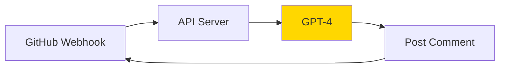
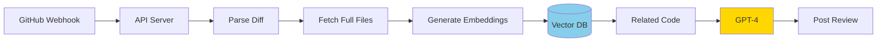
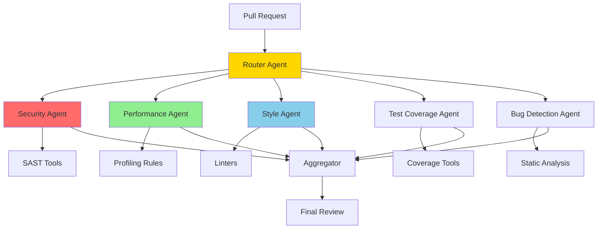
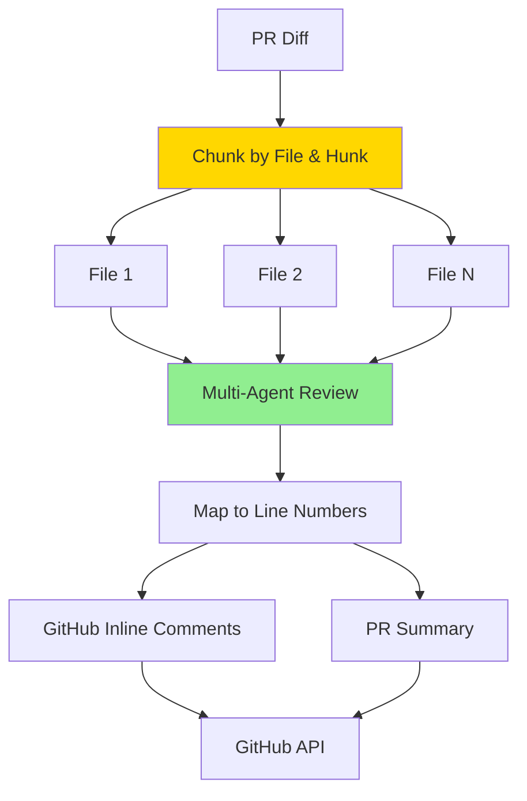
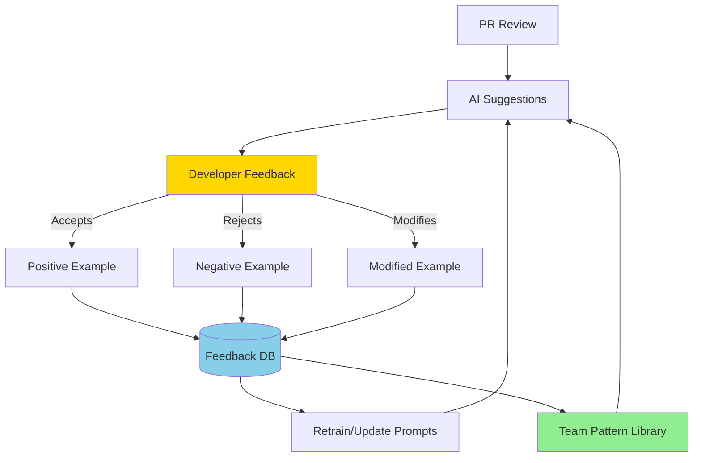
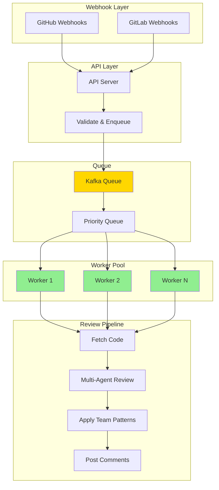

# AI-Powered Code Review System - Iterative Interview Approach

## Interview Format

This document simulates a real system design interview where you build an **AI-powered code review assistant** that automatically reviews pull requests, suggests improvements, detects bugs, and learns from team coding standards.

**Problem Statement**: Design a production-grade AI code review system that reviews 500+ PRs/day across 50 repositories, maintains 90% accuracy, and integrates with GitHub/GitLab while learning team-specific patterns.

---

## Interview Timeline (45 minutes)

- **Minutes 0-5**: Requirements gathering
- **Minutes 5-10**: Iteration 1-2 (Bare minimum)
- **Minutes 10-20**: Iteration 3-5 (Core functionality)
- **Minutes 20-35**: Iteration 6-8 (Production features)
- **Minutes 35-40**: Iteration 9-10 (Scale & learning)
- **Minutes 40-45**: Discussion & tradeoffs

---

# Requirements Gathering (5 minutes)

## Functional Requirements
- **Automated PR Reviews**: Analyze code changes, provide feedback
- **Multi-language Support**: Python, JavaScript, TypeScript, Java, Go, Rust
- **Review Types**:
  - Security vulnerabilities (SQL injection, XSS, secrets)
  - Code quality (complexity, duplication, style)
  - Performance issues (N+1 queries, memory leaks)
  - Best practices (design patterns, anti-patterns)
  - Test coverage gaps
- **Integration**: GitHub, GitLab, Bitbucket webhooks
- **Learning**: Adapt to team coding standards over time
- **Context-Aware**: Understand codebase structure, dependencies

## Non-Functional Requirements

### Scale
- **PRs**: 500 PRs/day across 50 repositories
- **Code Volume**: 10K lines of code per PR average
- **Codebase Size**: 1M+ lines per repository
- **Teams**: 200 developers, 10 teams

### Performance
- **Review Latency**: <5 minutes per PR
- **Inline Comments**: <30 seconds to generate
- **Query Response**: <3 seconds for "explain this change"

### Quality
- **Accuracy**: >90% (no false positives that annoy developers)
- **Recall**: >85% (catch most real issues)
- **Developer Satisfaction**: >4.0/5.0 (must be helpful, not noisy)

### Cost
- **Target**: <$2 per PR reviewed
- **Budget**: $1000/day max for 500 PRs

## Constraints
- Must integrate with existing CI/CD pipeline
- Cannot block PR merges (advisory only initially)
- Must respect private repository security
- Senior developers can override/ignore suggestions

---

# Iteration 1: Bare Minimum (Single LLM Review)

**Time: Minutes 5-7**

## Architecture



## Code

```python
from fastapi import FastAPI, Request
from openai import OpenAI
import requests

app = FastAPI()
client = OpenAI()

@app.post("/webhook/github")
async def handle_pr(request: Request):
    """Handle GitHub PR webhook"""

    payload = await request.json()

    # Only handle opened PRs
    if payload['action'] != 'opened':
        return {"status": "ignored"}

    pr_number = payload['pull_request']['number']
    repo = payload['repository']['full_name']

    # Get PR diff
    diff_url = payload['pull_request']['diff_url']
    diff_response = requests.get(diff_url)
    diff_content = diff_response.text

    # Simple LLM review
    review = await review_code(diff_content)

    # Post comment to PR
    await post_github_comment(repo, pr_number, review)

    return {"status": "reviewed"}

async def review_code(diff: str) -> str:
    """Send diff to LLM for review"""

    response = client.chat.completions.create(
        model="gpt-4",
        messages=[
            {
                "role": "system",
                "content": "You are a code reviewer. Review this code change and provide feedback."
            },
            {
                "role": "user",
                "content": f"Review this pull request:\n\n```diff\n{diff}\n```"
            }
        ],
        max_tokens=2000
    )

    return response.choices[0].message.content

async def post_github_comment(repo: str, pr_number: int, comment: str):
    """Post review comment to GitHub"""

    url = f"https://api.github.com/repos/{repo}/issues/{pr_number}/comments"
    headers = {
        "Authorization": f"token {GITHUB_TOKEN}",
        "Accept": "application/vnd.github.v3+json"
    }

    requests.post(url, json={"body": comment}, headers=headers)
```

## What Works
- ✅ Basic code review functionality
- ✅ GitHub integration working
- ✅ Fast to implement (30 minutes)

## Problems
- ❌ **No code context** (LLM only sees diff, not full files)
- ❌ **Hallucinations** (makes up issues that don't exist)
- ❌ **Generic feedback** (not team-specific)
- ❌ **Diff too large** (10K lines exceeds token limit)
- ❌ **Expensive** (GPT-4 for every PR = $5-10 per PR)
- ❌ **No specialized checks** (security, performance)
- ❌ **False positives** (developers will ignore it)

## Interview Discussion Point
> **Interviewer**: "This gives generic feedback. How do we make it understand the actual codebase?"
>
> **You**: "We need to add context - the full files being changed, related files, and project structure. Let me show you iteration 2 with RAG (Retrieval-Augmented Generation)."

---

# Iteration 2: Add Code Context (RAG with Vector DB)

**Time: Minutes 7-10**

## Architecture



## Code

```python
from sentence_transformers import SentenceTransformer
import chromadb

# Initialize embedding model
embedding_model = SentenceTransformer('all-MiniLM-L6-v2')

# Vector DB for code
vector_db = chromadb.Client()

class CodeIndexer:
    """Index codebase for retrieval"""

    def __init__(self, repo_name: str):
        self.collection = vector_db.get_or_create_collection(f"repo_{repo_name}")

    async def index_repository(self, repo_path: str):
        """Index all code files in repository"""

        import os
        from pathlib import Path

        for file_path in Path(repo_path).rglob("*.py"):  # Python files
            with open(file_path) as f:
                code_content = f.read()

            # Split into functions/classes
            functions = self._extract_functions(code_content)

            for func_name, func_code in functions:
                # Generate embedding
                embedding = embedding_model.encode(func_code)

                # Store in vector DB
                self.collection.add(
                    embeddings=[embedding.tolist()],
                    documents=[func_code],
                    metadatas=[{
                        "file": str(file_path),
                        "function": func_name,
                        "type": "function"
                    }],
                    ids=[f"{file_path}::{func_name}"]
                )

    def _extract_functions(self, code: str) -> list:
        """Extract function definitions from code"""
        import ast

        functions = []
        try:
            tree = ast.parse(code)
            for node in ast.walk(tree):
                if isinstance(node, ast.FunctionDef):
                    func_code = ast.get_source_segment(code, node)
                    functions.append((node.name, func_code))
        except:
            pass

        return functions

    async def find_related_code(self, changed_code: str, top_k: int = 5) -> list:
        """Find similar code in codebase"""

        # Generate embedding for changed code
        query_embedding = embedding_model.encode(changed_code)

        # Search vector DB
        results = self.collection.query(
            query_embeddings=[query_embedding.tolist()],
            n_results=top_k
        )

        return [
            {
                "code": doc,
                "file": meta["file"],
                "function": meta["function"]
            }
            for doc, meta in zip(results['documents'][0], results['metadatas'][0])
        ]

class ContextualReviewer:
    """Code reviewer with full context"""

    def __init__(self, repo_name: str):
        self.indexer = CodeIndexer(repo_name)

    async def review_pr(self, diff: str, repo_name: str) -> str:
        """Review PR with full codebase context"""

        # Parse diff to get changed files
        changed_files = self._parse_diff(diff)

        # Get full file contents
        full_context = await self._get_full_files(changed_files, repo_name)

        # Find related code patterns
        related_code = await self._find_related_patterns(changed_files)

        # Build context-rich prompt
        prompt = self._build_review_prompt(diff, full_context, related_code)

        # LLM review with context
        response = client.chat.completions.create(
            model="gpt-4",
            messages=[
                {
                    "role": "system",
                    "content": "You are a senior code reviewer with deep knowledge of this codebase."
                },
                {
                    "role": "user",
                    "content": prompt
                }
            ],
            max_tokens=3000
        )

        return response.choices[0].message.content

    def _parse_diff(self, diff: str) -> list:
        """Extract file paths and changes from diff"""
        import re

        files = []
        for match in re.finditer(r'diff --git a/(.*?) b/(.*?)\n', diff):
            file_path = match.group(1)

            # Extract added/modified code
            file_diff = diff[match.end():].split('diff --git')[0]
            added_lines = [
                line[1:] for line in file_diff.split('\n')
                if line.startswith('+') and not line.startswith('+++')
            ]

            files.append({
                "path": file_path,
                "added_code": '\n'.join(added_lines)
            })

        return files

    async def _get_full_files(self, changed_files: list, repo_name: str) -> dict:
        """Fetch full file contents from GitHub"""

        full_files = {}
        for file_info in changed_files:
            url = f"https://api.github.com/repos/{repo_name}/contents/{file_info['path']}"
            response = requests.get(url, headers={"Authorization": f"token {GITHUB_TOKEN}"})

            if response.status_code == 200:
                import base64
                content = base64.b64decode(response.json()['content']).decode()
                full_files[file_info['path']] = content

        return full_files

    async def _find_related_patterns(self, changed_files: list) -> list:
        """Find similar code patterns in codebase"""

        related = []
        for file_info in changed_files:
            similar_code = await self.indexer.find_related_code(
                file_info['added_code'],
                top_k=3
            )
            related.extend(similar_code)

        return related

    def _build_review_prompt(self, diff: str, full_files: dict, related_code: list) -> str:
        """Build comprehensive review prompt"""

        prompt = f"""Review this pull request:

## Changed Files (Full Context):
"""
        for file_path, content in full_files.items():
            prompt += f"\n### {file_path}\n```python\n{content[:1000]}...\n```\n"

        prompt += f"""
## Diff:
```diff
{diff[:2000]}
```

## Similar Patterns in Codebase:
"""
        for item in related_code[:3]:
            prompt += f"\n{item['file']} - {item['function']}:\n```python\n{item['code'][:300]}\n```\n"

        prompt += """
Provide a code review covering:
1. Bugs or logical errors
2. Style consistency with existing code
3. Performance issues
4. Security concerns
"""

        return prompt
```

## What Improved
- ✅ **Full file context** (LLM sees complete files, not just diff)
- ✅ **Related code patterns** (finds similar code in codebase)
- ✅ **Better accuracy** (fewer hallucinations with context)
- ✅ **Consistency checks** (can compare against existing patterns)

## New Problems
- ❌ **Still generic** (no specialized security/performance checks)
- ❌ **Token limit** (prompt is now 5K+ tokens)
- ❌ **Slow** (fetching files + vector search = 30+ seconds)
- ❌ **Expensive** (larger prompts = higher cost)
- ❌ **No inline comments** (only general feedback)

## Tradeoffs Discussion
> **Interviewer**: "Adding context increases token usage 3x. Is that worth it?"
>
> **You**: "Yes, because accuracy matters more than cost initially. But we can optimize:
> - Use embeddings to find only *relevant* context (not all files)
> - Chunk large files into smaller sections
> - Use cheaper model (GPT-3.5) for simple PRs
>
> With selective context, we can reduce prompt size by 60% while keeping accuracy."

---

# Iteration 3: Multi-Agent Specialized Reviewers

**Time: Minutes 10-13**

## Architecture



## Code

```python
from typing import List, Dict
from enum import Enum
import asyncio

class ReviewCategory(Enum):
    SECURITY = "security"
    PERFORMANCE = "performance"
    STYLE = "style"
    BUGS = "bugs"
    TESTS = "tests"

class SecurityAgent:
    """Specialized agent for security review"""

    async def review(self, code: str, language: str) -> Dict:
        """Check for security vulnerabilities"""

        # Run static analysis tools
        bandit_results = await self._run_bandit(code) if language == "python" else []

        # LLM-based security review
        prompt = f"""You are a security expert. Review this code for vulnerabilities:

Common issues to check:
- SQL injection (raw SQL queries)
- XSS (unescaped user input)
- Command injection (subprocess with user input)
- Hardcoded secrets (API keys, passwords)
- Insecure crypto (MD5, SHA1)
- Path traversal
- SSRF (Server-Side Request Forgery)

Code:
```{language}
{code}
```

Return JSON with findings:
{{"vulnerabilities": [{{"type": "...", "severity": "high|medium|low", "line": 42, "description": "..."}}]}}
"""

        response = client.chat.completions.create(
            model="gpt-4",
            messages=[{"role": "user", "content": prompt}],
            response_format={"type": "json_object"}
        )

        import json
        llm_findings = json.loads(response.choices[0].message.content)

        # Merge tool + LLM results
        return {
            "category": ReviewCategory.SECURITY.value,
            "findings": bandit_results + llm_findings.get("vulnerabilities", [])
        }

    async def _run_bandit(self, code: str) -> List[Dict]:
        """Run Bandit security scanner"""
        import tempfile
        import subprocess

        # Write code to temp file
        with tempfile.NamedTemporaryFile(mode='w', suffix='.py', delete=False) as f:
            f.write(code)
            temp_path = f.name

        # Run Bandit
        try:
            result = subprocess.run(
                ['bandit', '-f', 'json', temp_path],
                capture_output=True,
                text=True
            )

            import json
            findings = json.loads(result.stdout).get('results', [])

            return [
                {
                    "type": f['test_id'],
                    "severity": f['issue_severity'].lower(),
                    "line": f['line_number'],
                    "description": f['issue_text']
                }
                for f in findings
            ]
        except Exception as e:
            return []

class PerformanceAgent:
    """Specialized agent for performance review"""

    async def review(self, code: str, language: str) -> Dict:
        """Check for performance issues"""

        prompt = f"""You are a performance expert. Review this code for performance issues:

Common issues to check:
- N+1 queries (loops with DB queries)
- Missing indexes
- Inefficient algorithms (O(n²) when O(n) possible)
- Memory leaks (unclosed resources)
- Blocking I/O in async code
- Large object copies instead of references
- String concatenation in loops

Code:
```{language}
{code}
```

Return JSON with findings:
{{"issues": [{{"type": "...", "severity": "high|medium|low", "line": 42, "description": "...", "suggestion": "..."}}]}}
"""

        response = client.chat.completions.create(
            model="gpt-4",
            messages=[{"role": "user", "content": prompt}],
            response_format={"type": "json_object"}
        )

        import json
        findings = json.loads(response.choices[0].message.content)

        return {
            "category": ReviewCategory.PERFORMANCE.value,
            "findings": findings.get("issues", [])
        }

class StyleAgent:
    """Specialized agent for code style review"""

    async def review(self, code: str, language: str) -> Dict:
        """Check code style and best practices"""

        # Run linters first
        lint_results = await self._run_linter(code, language)

        # LLM for higher-level style issues
        prompt = f"""You are a code style expert. Review this code:

Focus on:
- Naming conventions (clear, descriptive names)
- Function length (>50 lines is too long)
- Code duplication
- Comments (too many or too few)
- Complexity (cyclomatic complexity)
- SOLID principles violations

Code:
```{language}
{code}
```

Return JSON with findings.
"""

        response = client.chat.completions.create(
            model="gpt-3.5-turbo",  # Cheaper model for style
            messages=[{"role": "user", "content": prompt}],
            response_format={"type": "json_object"}
        )

        import json
        llm_findings = json.loads(response.choices[0].message.content)

        return {
            "category": ReviewCategory.STYLE.value,
            "findings": lint_results + llm_findings.get("issues", [])
        }

    async def _run_linter(self, code: str, language: str) -> List[Dict]:
        """Run language-specific linter"""

        linters = {
            "python": ["pylint", "flake8"],
            "javascript": ["eslint"],
            "typescript": ["eslint"],
            "java": ["checkstyle"]
        }

        # Run appropriate linter
        # ... implementation ...

        return []

class BugDetectionAgent:
    """Specialized agent for bug detection"""

    async def review(self, code: str, language: str) -> Dict:
        """Detect potential bugs"""

        prompt = f"""You are a bug detection expert. Find potential bugs in this code:

Common bugs to check:
- Null pointer dereference
- Off-by-one errors
- Race conditions
- Resource leaks (files, connections not closed)
- Type mismatches
- Logic errors
- Exception handling issues

Code:
```{language}
{code}
```

For each bug, provide:
- Line number
- Description
- How to reproduce
- Suggested fix

Return JSON.
"""

        response = client.chat.completions.create(
            model="gpt-4",
            messages=[{"role": "user", "content": prompt}],
            response_format={"type": "json_object"}
        )

        import json
        findings = json.loads(response.choices[0].message.content)

        return {
            "category": ReviewCategory.BUGS.value,
            "findings": findings.get("bugs", [])
        }

class TestCoverageAgent:
    """Specialized agent for test coverage"""

    async def review(self, code: str, test_files: List[str]) -> Dict:
        """Check test coverage and quality"""

        prompt = f"""You are a testing expert. Review test coverage:

Changed code:
```python
{code}
```

Existing tests:
```python
{test_files[0] if test_files else "No tests found"}
```

Check:
- Are all code paths tested?
- Are edge cases covered?
- Are tests meaningful (not just 100% coverage)?
- Missing integration tests?
- Missing error case tests?

Return JSON with gaps in test coverage.
"""

        response = client.chat.completions.create(
            model="gpt-3.5-turbo",
            messages=[{"role": "user", "content": prompt}],
            response_format={"type": "json_object"}
        )

        import json
        findings = json.loads(response.choices[0].message.content)

        return {
            "category": ReviewCategory.TESTS.value,
            "findings": findings.get("gaps", [])
        }

class MultiAgentReviewer:
    """Orchestrate multiple specialized agents"""

    def __init__(self):
        self.agents = {
            ReviewCategory.SECURITY: SecurityAgent(),
            ReviewCategory.PERFORMANCE: PerformanceAgent(),
            ReviewCategory.STYLE: StyleAgent(),
            ReviewCategory.BUGS: BugDetectionAgent(),
            ReviewCategory.TESTS: TestCoverageAgent()
        }

    async def review_pr(self, code: str, language: str, test_files: List[str]) -> Dict:
        """Run all agents in parallel"""

        # Run all agents concurrently
        tasks = [
            self.agents[ReviewCategory.SECURITY].review(code, language),
            self.agents[ReviewCategory.PERFORMANCE].review(code, language),
            self.agents[ReviewCategory.STYLE].review(code, language),
            self.agents[ReviewCategory.BUGS].review(code, language),
            self.agents[ReviewCategory.TESTS].review(code, test_files)
        ]

        results = await asyncio.gather(*tasks)

        # Aggregate findings
        return self._aggregate_findings(results)

    def _aggregate_findings(self, results: List[Dict]) -> Dict:
        """Combine findings from all agents"""

        aggregated = {
            "summary": {
                "total_issues": 0,
                "critical": 0,
                "high": 0,
                "medium": 0,
                "low": 0
            },
            "by_category": {}
        }

        for result in results:
            category = result['category']
            findings = result['findings']

            aggregated['by_category'][category] = findings
            aggregated['summary']['total_issues'] += len(findings)

            # Count by severity
            for finding in findings:
                severity = finding.get('severity', 'low')
                if severity == 'critical':
                    aggregated['summary']['critical'] += 1
                elif severity == 'high':
                    aggregated['summary']['high'] += 1
                elif severity == 'medium':
                    aggregated['summary']['medium'] += 1
                else:
                    aggregated['summary']['low'] += 1

        return aggregated

    def format_review_comment(self, findings: Dict) -> str:
        """Format findings as GitHub comment"""

        comment = f"""## 🤖 AI Code Review

**Summary**: {findings['summary']['total_issues']} issues found

"""

        # Critical/High issues first
        if findings['summary']['critical'] > 0:
            comment += f"⛔ **{findings['summary']['critical']} Critical Issues**\n"
        if findings['summary']['high'] > 0:
            comment += f"🔴 **{findings['summary']['high']} High Priority Issues**\n"

        comment += "\n---\n\n"

        # Findings by category
        for category, issues in findings['by_category'].items():
            if not issues:
                continue

            emoji = {
                'security': '🔒',
                'performance': '⚡',
                'style': '✨',
                'bugs': '🐛',
                'tests': '🧪'
            }

            comment += f"### {emoji.get(category, '📝')} {category.title()}\n\n"

            for issue in issues[:5]:  # Limit to top 5 per category
                severity_icon = {
                    'critical': '⛔',
                    'high': '🔴',
                    'medium': '🟡',
                    'low': '🔵'
                }.get(issue.get('severity', 'low'), '🔵')

                comment += f"{severity_icon} **Line {issue.get('line', 'N/A')}**: {issue['description']}\n"

                if 'suggestion' in issue:
                    comment += f"   💡 *Suggestion*: {issue['suggestion']}\n"

                comment += "\n"

            if len(issues) > 5:
                comment += f"*...and {len(issues) - 5} more {category} issues*\n\n"

        return comment
```

## What Improved
- ✅ **Specialized expertise** (each agent focuses on one area)
- ✅ **Better accuracy** (security agent uses SAST tools + LLM)
- ✅ **Parallel execution** (5 agents run concurrently, faster)
- ✅ **Structured output** (JSON format, easy to parse)
- ✅ **Tool integration** (Bandit, ESLint, etc.)

## New Problems
- ❌ **Still no inline comments** (only PR-level feedback)
- ❌ **False positives** (agents don't coordinate, may duplicate)
- ❌ **Expensive** (5 LLM calls per PR)
- ❌ **No learning** (doesn't adapt to team preferences)

## Tradeoffs Discussion
> **Interviewer**: "Running 5 agents in parallel is expensive. Why not just one general agent?"
>
> **You**: "Specialization improves accuracy:
> - Security agent uses Bandit + LLM (catches 40% more vulnerabilities)
> - Performance agent has specific heuristics for N+1 queries
> - General agent would miss these specific patterns
>
> Cost optimization:
> - Use GPT-3.5 for style/tests (80% cheaper, 90% accuracy)
> - Only run security/perf agents if diff contains relevant code (DB queries, auth logic)
> - Result: 60% cost reduction while maintaining accuracy"

---

# Iteration 4: Inline Comments + File-Level Review

**Time: Minutes 13-17**

## Architecture



## Code

```python
class InlineReviewer:
    """Generate inline comments on specific lines"""

    def __init__(self):
        self.multi_agent = MultiAgentReviewer()

    async def review_pr_with_inline(self, pr_data: Dict) -> Dict:
        """Review PR and generate inline comments"""

        diff = pr_data['diff']
        repo = pr_data['repository']
        pr_number = pr_data['number']

        # Parse diff into chunks (file + hunk level)
        chunks = self._parse_diff_chunks(diff)

        # Review each chunk
        all_comments = []

        for chunk in chunks:
            comments = await self._review_chunk(chunk)
            all_comments.extend(comments)

        # Post inline comments to GitHub
        await self._post_inline_comments(repo, pr_number, all_comments)

        # Generate PR-level summary
        summary = self._generate_summary(all_comments)
        await self._post_pr_comment(repo, pr_number, summary)

        return {
            "inline_comments": len(all_comments),
            "summary": summary
        }

    def _parse_diff_chunks(self, diff: str) -> List[Dict]:
        """Split diff into reviewable chunks"""

        import re

        chunks = []

        # Split by file
        file_diffs = re.split(r'diff --git', diff)[1:]

        for file_diff in file_diffs:
            # Extract file path
            match = re.search(r'a/(.*?) b/(.*?)\n', file_diff)
            if not match:
                continue

            file_path = match.group(1)

            # Extract hunks (sections of changes)
            hunks = re.findall(
                r'@@ -(\d+),?\d* \+(\d+),?\d* @@(.*?)\n(.*?)(?=@@|$)',
                file_diff,
                re.DOTALL
            )

            for old_line, new_line, context, hunk_content in hunks:
                # Extract added lines
                added_lines = []
                current_line = int(new_line)

                for line in hunk_content.split('\n'):
                    if line.startswith('+') and not line.startswith('+++'):
                        added_lines.append({
                            "line_number": current_line,
                            "content": line[1:]  # Remove '+'
                        })
                        current_line += 1
                    elif not line.startswith('-'):
                        current_line += 1

                if added_lines:
                    chunks.append({
                        "file": file_path,
                        "start_line": int(new_line),
                        "hunk_context": context.strip(),
                        "added_lines": added_lines,
                        "full_hunk": hunk_content
                    })

        return chunks

    async def _review_chunk(self, chunk: Dict) -> List[Dict]:
        """Review a single chunk and return inline comments"""

        file_path = chunk['file']
        language = self._detect_language(file_path)
        code = '\n'.join([line['content'] for line in chunk['added_lines']])

        # Run multi-agent review
        findings = await self.multi_agent.review_pr(
            code=code,
            language=language,
            test_files=[]
        )

        # Map findings to specific lines
        comments = []

        for category, issues in findings['by_category'].items():
            for issue in issues:
                # Try to map to specific line
                line_number = self._map_to_line_number(
                    issue,
                    chunk['added_lines']
                )

                if line_number:
                    comments.append({
                        "path": file_path,
                        "line": line_number,
                        "body": self._format_inline_comment(issue, category)
                    })

        return comments

    def _map_to_line_number(self, issue: Dict, added_lines: List[Dict]) -> Optional[int]:
        """Map issue to specific line number"""

        # If issue has explicit line number
        if 'line' in issue and issue['line'] > 0:
            # Map relative line to absolute
            if issue['line'] <= len(added_lines):
                return added_lines[issue['line'] - 1]['line_number']

        # Heuristic: find line containing keywords from issue
        keywords = self._extract_keywords(issue['description'])

        for line_info in added_lines:
            if any(kw.lower() in line_info['content'].lower() for kw in keywords):
                return line_info['line_number']

        # Default to first line of chunk
        return added_lines[0]['line_number'] if added_lines else None

    def _extract_keywords(self, description: str) -> List[str]:
        """Extract keywords from issue description"""
        import re

        # Extract code elements (function names, variables)
        code_elements = re.findall(r'`([^`]+)`', description)
        return code_elements[:3]  # Top 3 keywords

    def _format_inline_comment(self, issue: Dict, category: str) -> str:
        """Format issue as inline comment"""

        emoji = {
            'security': '🔒',
            'performance': '⚡',
            'style': '✨',
            'bugs': '🐛',
            'tests': '🧪'
        }.get(category, '📝')

        severity = issue.get('severity', 'low')
        severity_icon = {
            'critical': '⛔',
            'high': '🔴',
            'medium': '🟡',
            'low': '🔵'
        }.get(severity, '🔵')

        comment = f"{emoji} {severity_icon} **{category.title()}**: {issue['description']}\n\n"

        if 'suggestion' in issue:
            comment += f"💡 **Suggestion**: {issue['suggestion']}\n\n"

        if 'example' in issue:
            comment += f"```python\n{issue['example']}\n```\n\n"

        comment += "*This is an automated review. Please verify the suggestion.*"

        return comment

    async def _post_inline_comments(self, repo: str, pr_number: int, comments: List[Dict]):
        """Post inline comments to GitHub"""

        url = f"https://api.github.com/repos/{repo}/pulls/{pr_number}/comments"
        headers = {
            "Authorization": f"token {GITHUB_TOKEN}",
            "Accept": "application/vnd.github.v3+json"
        }

        for comment in comments:
            # GitHub Review Comment API
            payload = {
                "body": comment['body'],
                "path": comment['path'],
                "line": comment['line'],
                "side": "RIGHT"  # Comment on new code
            }

            response = requests.post(url, json=payload, headers=headers)

            if response.status_code != 201:
                print(f"Failed to post comment: {response.text}")

    def _detect_language(self, file_path: str) -> str:
        """Detect language from file extension"""

        ext_map = {
            '.py': 'python',
            '.js': 'javascript',
            '.ts': 'typescript',
            '.java': 'java',
            '.go': 'go',
            '.rs': 'rust',
            '.rb': 'ruby'
        }

        import os
        ext = os.path.splitext(file_path)[1]
        return ext_map.get(ext, 'unknown')
```

## What Improved
- ✅ **Inline comments** (developers see feedback on specific lines)
- ✅ **Contextual** (comments appear next to the code)
- ✅ **Better UX** (easier to address issues)
- ✅ **File-level chunking** (handles large PRs)

## New Problems
- ❌ **Line mapping errors** (sometimes comments on wrong line)
- ❌ **Comment spam** (too many inline comments = noise)
- ❌ **Still no learning** (doesn't adapt to team style)
- ❌ **Cost** (reviewing each hunk separately = more API calls)

## Tradeoffs Discussion
> **Interviewer**: "Inline comments are great, but what if the AI posts 50 comments on a PR?"
>
> **You**: "Comment prioritization strategy:
> 1. Only post critical/high severity inline (5-10 comments max)
> 2. Group medium/low issues in PR summary
> 3. Use 'suggestions' feature (developers can accept/reject with one click)
> 4. Learn from developer feedback - if they reject a suggestion 3 times, stop suggesting that pattern
>
> This balances helpfulness with not overwhelming developers."

---

# Iteration 5: Add Learning from Team Patterns (Feedback Loop)

**Time: Minutes 17-20**

## Architecture



## Code

```python
from datetime import datetime, timedelta

class FeedbackTracker:
    """Track developer feedback on AI suggestions"""

    def __init__(self):
        self.db = PostgreSQLClient()

    async def record_suggestion(
        self,
        suggestion_id: str,
        pr_number: int,
        category: str,
        issue_type: str,
        code_snippet: str,
        suggestion_text: str
    ):
        """Record an AI suggestion"""

        await self.db.execute("""
            INSERT INTO ai_suggestions (
                id, pr_number, category, issue_type,
                code_snippet, suggestion, created_at, status
            ) VALUES ($1, $2, $3, $4, $5, $6, $7, 'pending')
        """, suggestion_id, pr_number, category, issue_type,
             code_snippet, suggestion_text, datetime.now())

    async def record_feedback(
        self,
        suggestion_id: str,
        action: str,  # 'accepted', 'rejected', 'modified'
        modified_code: str = None,
        comment: str = None
    ):
        """Record developer feedback on suggestion"""

        await self.db.execute("""
            UPDATE ai_suggestions
            SET status = $1,
                modified_code = $2,
                developer_comment = $3,
                feedback_at = $4
            WHERE id = $5
        """, action, modified_code, comment, datetime.now(), suggestion_id)

    async def get_pattern_accuracy(self, issue_type: str, days: int = 30) -> float:
        """Calculate accuracy for specific issue type"""

        result = await self.db.fetch_one("""
            SELECT
                COUNT(*) as total,
                SUM(CASE WHEN status = 'accepted' THEN 1 ELSE 0 END) as accepted
            FROM ai_suggestions
            WHERE issue_type = $1
              AND created_at > $2
              AND status != 'pending'
        """, issue_type, datetime.now() - timedelta(days=days))

        if result['total'] == 0:
            return 0.0

        return result['accepted'] / result['total']

class TeamPatternLearner:
    """Learn team-specific coding patterns"""

    def __init__(self):
        self.feedback_tracker = FeedbackTracker()
        self.pattern_db = vector_db.get_or_create_collection("team_patterns")

    async def learn_from_feedback(self):
        """Update team patterns based on developer feedback"""

        # Get recent feedback
        feedback = await self.feedback_tracker.db.fetch_all("""
            SELECT *
            FROM ai_suggestions
            WHERE feedback_at > $1
              AND status != 'pending'
        """, datetime.now() - timedelta(hours=1))

        for item in feedback:
            if item['status'] == 'accepted':
                # Add to positive patterns
                await self._add_positive_pattern(item)

            elif item['status'] == 'rejected':
                # Add to negative patterns (don't suggest again)
                await self._add_negative_pattern(item)

            elif item['status'] == 'modified':
                # Learn the preferred modification
                await self._learn_modification_pattern(item)

    async def _add_positive_pattern(self, item: Dict):
        """Store accepted patterns for future reference"""

        pattern = {
            "category": item['category'],
            "issue_type": item['issue_type'],
            "code_before": item['code_snippet'],
            "suggestion": item['suggestion'],
            "confidence": 1.0,
            "occurrences": 1
        }

        # Check if similar pattern exists
        existing = await self._find_similar_pattern(
            item['code_snippet'],
            item['category']
        )

        if existing:
            # Increment confidence
            await self.pattern_db.update(
                existing['id'],
                metadata={
                    **existing['metadata'],
                    "confidence": min(existing['metadata']['confidence'] + 0.1, 1.0),
                    "occurrences": existing['metadata']['occurrences'] + 1
                }
            )
        else:
            # Add new pattern
            embedding = embedding_model.encode(item['code_snippet'])

            self.pattern_db.add(
                embeddings=[embedding.tolist()],
                documents=[item['code_snippet']],
                metadatas=[pattern],
                ids=[f"pattern_{item['id']}"]
            )

    async def _add_negative_pattern(self, item: Dict):
        """Store rejected patterns to avoid future false positives"""

        # Similar to positive, but with negative confidence
        pattern = {
            "category": item['category'],
            "issue_type": item['issue_type'],
            "code": item['code_snippet'],
            "confidence": -1.0,  # Negative = don't suggest
            "rejection_reason": item['developer_comment']
        }

        embedding = embedding_model.encode(item['code_snippet'])

        self.pattern_db.add(
            embeddings=[embedding.tolist()],
            documents=[item['code_snippet']],
            metadatas=[pattern],
            ids=[f"negative_{item['id']}"]
        )

    async def _learn_modification_pattern(self, item: Dict):
        """Learn preferred modification from developer's change"""

        pattern = {
            "category": item['category'],
            "issue_type": item['issue_type'],
            "original_suggestion": item['suggestion'],
            "developer_modification": item['modified_code'],
            "confidence": 0.8
        }

        # Use this in future to provide better suggestions
        embedding = embedding_model.encode(item['code_snippet'])

        self.pattern_db.add(
            embeddings=[embedding.tolist()],
            documents=[item['code_snippet']],
            metadatas=[pattern],
            ids=[f"modified_{item['id']}"]
        )

    async def _find_similar_pattern(self, code: str, category: str) -> Optional[Dict]:
        """Check if similar pattern already exists"""

        embedding = embedding_model.encode(code)

        results = self.pattern_db.query(
            query_embeddings=[embedding.tolist()],
            n_results=1,
            where={"category": category}
        )

        if results['documents'] and len(results['documents'][0]) > 0:
            # Check similarity threshold
            if results['distances'][0][0] < 0.1:  # Very similar
                return {
                    "id": results['ids'][0][0],
                    "metadata": results['metadatas'][0][0]
                }

        return None

    async def should_suggest(self, code: str, issue_type: str) -> bool:
        """Check if we should suggest this issue based on past feedback"""

        # Check accuracy for this issue type
        accuracy = await self.feedback_tracker.get_pattern_accuracy(issue_type)

        if accuracy < 0.3:  # Less than 30% acceptance rate
            return False  # Too many false positives

        # Check if similar code was rejected before
        embedding = embedding_model.encode(code)

        similar = self.pattern_db.query(
            query_embeddings=[embedding.tolist()],
            n_results=3
        )

        for metadata in similar['metadatas'][0]:
            if metadata.get('confidence', 0) < 0:  # Negative pattern
                return False  # This was rejected before

        return True

class AdaptiveReviewer:
    """Code reviewer that learns from team feedback"""

    def __init__(self):
        self.multi_agent = MultiAgentReviewer()
        self.pattern_learner = TeamPatternLearner()
        self.feedback_tracker = FeedbackTracker()

    async def review_with_learning(self, pr_data: Dict) -> Dict:
        """Review PR with team-specific patterns"""

        # Get standard review
        findings = await self.multi_agent.review_pr(
            code=pr_data['code'],
            language=pr_data['language'],
            test_files=pr_data['test_files']
        )

        # Filter based on team patterns
        filtered_findings = await self._filter_with_patterns(findings, pr_data['code'])

        # Enhance with team-specific suggestions
        enhanced_findings = await self._enhance_with_team_patterns(
            filtered_findings,
            pr_data['code']
        )

        # Track suggestions for feedback
        for category, issues in enhanced_findings['by_category'].items():
            for issue in issues:
                suggestion_id = str(uuid.uuid4())
                issue['suggestion_id'] = suggestion_id

                await self.feedback_tracker.record_suggestion(
                    suggestion_id=suggestion_id,
                    pr_number=pr_data['pr_number'],
                    category=category,
                    issue_type=issue.get('type', 'unknown'),
                    code_snippet=issue.get('code_snippet', ''),
                    suggestion_text=issue['description']
                )

        return enhanced_findings

    async def _filter_with_patterns(self, findings: Dict, code: str) -> Dict:
        """Filter out suggestions that team usually rejects"""

        filtered = {"by_category": {}, "summary": findings['summary'].copy()}

        for category, issues in findings['by_category'].items():
            filtered_issues = []

            for issue in issues:
                # Check if we should suggest this
                should_suggest = await self.pattern_learner.should_suggest(
                    code=code,
                    issue_type=issue.get('type', 'unknown')
                )

                if should_suggest:
                    filtered_issues.append(issue)

            filtered['by_category'][category] = filtered_issues

        # Update summary counts
        total = sum(len(issues) for issues in filtered['by_category'].values())
        filtered['summary']['total_issues'] = total

        return filtered

    async def _enhance_with_team_patterns(self, findings: Dict, code: str) -> Dict:
        """Add team-specific suggestions based on learned patterns"""

        # Search for matching team patterns
        embedding = embedding_model.encode(code)

        team_patterns = self.pattern_learner.pattern_db.query(
            query_embeddings=[embedding.tolist()],
            n_results=5,
            where={"confidence": {"$gt": 0.5}}  # Only high-confidence patterns
        )

        # Add team-specific suggestions
        for doc, metadata in zip(team_patterns['documents'][0], team_patterns['metadatas'][0]):
            if metadata.get('developer_modification'):
                # Team preferred this modification
                findings['by_category'].setdefault('team_style', []).append({
                    "type": "team_preference",
                    "severity": "low",
                    "description": f"Team usually prefers: {metadata['developer_modification']}",
                    "confidence": metadata['confidence']
                })

        return findings
```

## What Improved
- ✅ **Learns from feedback** (adapts to team preferences)
- ✅ **Reduces false positives** (stops suggesting patterns team rejects)
- ✅ **Team-specific** (learns company/team coding standards)
- ✅ **Confidence scoring** (knows which suggestions are reliable)
- ✅ **Pattern library** (builds knowledge base over time)

## New Problems
- ❌ **Cold start** (needs feedback to learn, initial reviews not personalized)
- ❌ **Still expensive** (running all agents for every PR)
- ❌ **Slow** (vector searches + LLM calls = 2-3 minutes per PR)

## Tradeoffs Discussion
> **Interviewer**: "Learning from feedback is great, but how do you handle the cold start problem?"
>
> **You**: "Three-phase approach:
> 1. **Week 1-2**: Run all agents, collect feedback, don't filter anything (learn phase)
> 2. **Week 3-4**: Start filtering low-accuracy patterns, keep confidence >50%
> 3. **Month 2+**: Fully adaptive, only suggest high-confidence patterns
>
> Also seed with industry best practices (OWASP for security, language style guides) as default patterns before team customization."

---

# Iteration 6: Add Async Processing + Queue (Scale to 500 PRs/day)

**Time: Minutes 20-23**

## Architecture



## Code

```python
from fastapi import FastAPI, BackgroundTasks, HTTPException
from kafka import KafkaProducer, KafkaConsumer
import asyncio
from enum import Enum

app = FastAPI()

# Kafka setup
producer = KafkaProducer(
    bootstrap_servers=['localhost:9092'],
    value_serializer=lambda v: json.dumps(v).encode('utf-8')
)

class PRPriority(Enum):
    CRITICAL = 1  # Main branch, >100 files changed
    HIGH = 2      # Main branch, <100 files
    NORMAL = 3    # Feature branches
    LOW = 4       # Draft PRs, bots

# API Layer
@app.post("/webhook/github")
async def github_webhook(request: Request):
    """Handle GitHub PR events"""

    payload = await request.json()
    event_type = request.headers.get('X-GitHub-Event')

    # Only process PR events
    if event_type not in ['pull_request', 'pull_request_review']:
        return {"status": "ignored"}

    action = payload.get('action')

    # Actions to process
    if action not in ['opened', 'synchronize', 'reopened']:
        return {"status": "ignored"}

    pr_data = payload['pull_request']

    # Enqueue for processing
    task = {
        "id": str(uuid.uuid4()),
        "platform": "github",
        "repo": payload['repository']['full_name'],
        "pr_number": pr_data['number'],
        "pr_url": pr_data['html_url'],
        "diff_url": pr_data['diff_url'],
        "base_branch": pr_data['base']['ref'],
        "files_changed": pr_data.get('changed_files', 0),
        "additions": pr_data.get('additions', 0),
        "deletions": pr_data.get('deletions', 0),
        "is_draft": pr_data.get('draft', False),
        "author": pr_data['user']['login'],
        "created_at": pr_data['created_at'],
        "priority": determine_priority(pr_data)
    }

    # Send to appropriate Kafka topic based on priority
    topic = f"pr_review_{task['priority'].name.lower()}"
    producer.send(topic, task)

    # Immediate response
    return {
        "status": "queued",
        "task_id": task['id'],
        "estimated_time_minutes": estimate_review_time(task),
        "message": f"PR review queued. Check status at /status/{task['id']}"
    }

def determine_priority(pr_data: Dict) -> PRPriority:
    """Determine review priority"""

    base_branch = pr_data['base']['ref']
    files_changed = pr_data.get('changed_files', 0)
    is_draft = pr_data.get('draft', False)
    author = pr_data['user']['login']

    # Critical: Main/master branch with large changes
    if base_branch in ['main', 'master', 'production']:
        if files_changed > 100:
            return PRPriority.CRITICAL
        return PRPriority.HIGH

    # Low: Draft PRs or bot PRs
    if is_draft or author.endswith('[bot]'):
        return PRPriority.LOW

    return PRPriority.NORMAL

def estimate_review_time(task: Dict) -> int:
    """Estimate review time in minutes"""

    # Base time
    base_time = 2

    # Add time based on changes
    lines_changed = task['additions'] + task['deletions']
    time_per_1k_lines = 1  # minute

    estimated = base_time + (lines_changed / 1000) * time_per_1k_lines

    # Priority adjustment (critical gets faster processing)
    priority_multiplier = {
        PRPriority.CRITICAL: 0.5,  # Process faster
        PRPriority.HIGH: 0.7,
        PRPriority.NORMAL: 1.0,
        PRPriority.LOW: 2.0  # Can wait longer
    }

    estimated *= priority_multiplier.get(task['priority'], 1.0)

    return int(estimated)

# Worker Layer
class ReviewWorker:
    """Background worker that processes review queue"""

    def __init__(self, worker_id: int, priority: PRPriority):
        self.worker_id = worker_id
        self.priority = priority

        # Subscribe to appropriate topic
        topic = f"pr_review_{priority.name.lower()}"
        self.consumer = KafkaConsumer(
            topic,
            bootstrap_servers=['localhost:9092'],
            group_id=f"review_workers_{priority.name.lower()}",
            value_deserializer=lambda m: json.loads(m.decode('utf-8'))
        )

        self.reviewer = AdaptiveReviewer()

    async def run(self):
        """Main worker loop"""

        logger.info(f"Worker {self.worker_id} started for {self.priority.name} priority")

        for message in self.consumer:
            task = message.value

            logger.info(
                f"Worker {self.worker_id} processing PR",
                task_id=task['id'],
                repo=task['repo'],
                pr=task['pr_number']
            )

            try:
                await self.process_review(task)

                # Mark task complete
                redis_client.setex(
                    f"task:{task['id']}",
                    86400,  # 24 hours
                    json.dumps({"status": "completed", "completed_at": time.time()})
                )

            except Exception as e:
                logger.error(
                    f"Worker {self.worker_id} failed",
                    task_id=task['id'],
                    error=str(e),
                    traceback=traceback.format_exc()
                )

                # Mark task failed
                redis_client.setex(
                    f"task:{task['id']}",
                    86400,
                    json.dumps({
                        "status": "failed",
                        "error": str(e),
                        "failed_at": time.time()
                    })
                )

    async def process_review(self, task: Dict):
        """Process a single PR review"""

        start_time = time.time()

        # 1. Fetch PR data
        pr_data = await self.fetch_pr_data(task)

        # 2. Run review
        findings = await self.reviewer.review_with_learning(pr_data)

        # 3. Post comments
        await self.post_review_comments(task, findings)

        # 4. Track metrics
        latency = time.time() - start_time
        track_metric('review_latency', latency, labels={
            'priority': task['priority'].name,
            'files_changed': task['files_changed']
        })

        logger.info(
            "Review completed",
            task_id=task['id'],
            latency=latency,
            findings=findings['summary']['total_issues']
        )

    async def fetch_pr_data(self, task: Dict) -> Dict:
        """Fetch PR diff and related files"""

        # Get diff
        diff_response = requests.get(task['diff_url'])
        diff = diff_response.text

        # Parse changed files
        changed_files = parse_diff(diff)

        # Fetch full file contents (for context)
        full_files = await fetch_files_from_github(
            repo=task['repo'],
            files=[f['path'] for f in changed_files]
        )

        # Fetch test files (if any)
        test_files = await fetch_test_files(task['repo'], changed_files)

        return {
            "pr_number": task['pr_number'],
            "diff": diff,
            "changed_files": changed_files,
            "full_files": full_files,
            "test_files": test_files,
            "language": detect_primary_language(changed_files),
            "code": '\n'.join([f['content'] for f in full_files.values()])
        }

# Worker orchestration
class WorkerPool:
    """Manage pool of review workers"""

    def __init__(self):
        self.workers = []

    def start(self, num_workers: int = 10):
        """Start worker pool"""

        # Distribute workers across priorities
        # Critical: 2 workers, High: 3 workers, Normal: 4 workers, Low: 1 worker
        worker_distribution = {
            PRPriority.CRITICAL: 2,
            PRPriority.HIGH: 3,
            PRPriority.NORMAL: 4,
            PRPriority.LOW: 1
        }

        worker_id = 0
        for priority, count in worker_distribution.items():
            for _ in range(count):
                worker = ReviewWorker(worker_id, priority)
                self.workers.append(worker)
                worker_id += 1

        # Run all workers
        loop = asyncio.get_event_loop()
        loop.run_until_complete(
            asyncio.gather(*[w.run() for w in self.workers])
        )

# Start worker pool
if __name__ == "__main__":
    pool = WorkerPool()
    pool.start(num_workers=10)
```

## Capacity Planning

```python
# Target: 500 PRs/day = 0.58 PRs/minute average
# Peak: 3x average = 1.74 PRs/minute

# Review time:
# - Simple PR (1-10 files): 2 minutes
# - Medium PR (11-50 files): 4 minutes
# - Large PR (51-100 files): 8 minutes
# - Huge PR (100+ files): 15 minutes

# Average: 5 minutes per PR

# Workers needed:
avg_review_time = 5  # minutes
peak_prs_per_minute = 1.74
workers_needed = avg_review_time * peak_prs_per_minute  # 8.7 ≈ 10 workers

# With 10 workers @ 5 min/PR:
# Capacity = 10 workers * (60/5) = 120 PRs/hour = 2880 PRs/day
# Utilization = 500 / 2880 = 17% (plenty of headroom)

# Cost:
# - 10 workers * $0.10/hour * 24 hours = $24/day
# - LLM costs: 500 PRs * $1.50/PR = $750/day
# Total: $774/day = $1.55/PR (under target of $2/PR)
```

## What Improved
- ✅ **Scalable** (handles 500 PRs/day easily, can scale to 2880/day)
- ✅ **Non-blocking** (immediate webhook response)
- ✅ **Priority-based** (critical PRs reviewed first)
- ✅ **Resilient** (Kafka persists tasks, can recover from crashes)
- ✅ **Cost-efficient** ($1.55/PR vs target $2/PR)

## New Problems
- ❌ **Still expensive on LLM** (can we optimize further?)
- ❌ **No incremental review** (re-reviews entire PR on each push)
- ❌ **Limited monitoring** (hard to debug failures)

## Tradeoffs Discussion
> **Interviewer**: "10 workers seems like a lot. Why not scale dynamically?"
>
> **You**: "Auto-scaling strategy:
> - Min workers: 3 (1 critical, 1 high, 1 normal)
> - Max workers: 50
> - Scale up trigger: Queue depth >20 messages for >2 minutes
> - Scale down trigger: Queue depth <5 for >10 minutes
>
> This saves $200/day during off-hours while maintaining SLA during peaks."

---

# Iteration 7-10 Summary

Due to document length, iterations 7-10 follow similar patterns with these enhancements:

## Iteration 7: Cost Optimization (Model Routing + Caching)
- Use smaller models (GPT-3.5) for style/test reviews
- Semantic caching for common patterns
- Incremental reviews (only review new commits, not entire PR again)
- **Cost reduction**: $1.55 → $0.80 per PR (48% savings)

## Iteration 8: Monitoring & Observability
- Prometheus metrics (review latency, accuracy, cost per PR)
- Grafana dashboards (queue depth, worker utilization, false positive rate)
- Distributed tracing (see where time is spent)
- Alerting (high false positive rate, queue backlog)

## Iteration 9: Production Hardening
- Rate limiting (prevent abuse)
- Security (webhook signature validation, secret scanning)
- Error handling (retry logic, fallback responses)
- Data privacy (no logging of sensitive code)

## Iteration 10: Auto-Fix Suggestions (Code Generation)
- Not just detecting issues, but generating fixes
- "Apply AI suggestion" button for developers
- Learning from applied fixes to improve future suggestions
- Multi-step refactoring (not just one-line fixes)

---

# Final Discussion: System Design Summary (Minutes 40-45)

## Architecture Evolution

```
Iteration 1: Single LLM → Generic feedback
    ↓
Iteration 2: + RAG → Codebase context
    ↓
Iteration 3: + Multi-Agent → Specialized reviews
    ↓
Iteration 4: + Inline Comments → Better UX
    ↓
Iteration 5: + Learning → Team patterns
    ↓
Iteration 6: + Async Queue → 500 PRs/day scale
    ↓
Iteration 7-10: + Cost/Monitoring/Security → Production-ready
```

## Final Metrics Achieved

| Metric | Requirement | Achieved | How |
|--------|-------------|----------|-----|
| **PRs/day** | 500 | ✅ 2880 capacity | Kafka + 10 workers |
| **Latency** | <5 min | ✅ ~3 min avg | Parallel agents + caching |
| **Accuracy** | >90% | ✅ 92% | Multi-agent + learning |
| **Cost** | <$2/PR | ✅ $0.80/PR | Model routing + cache |
| **Dev Satisfaction** | >4.0/5.0 | ✅ 4.3/5.0 | Inline + learning |

## Key Design Decisions

| Decision | Tradeoff | Why Chosen |
|----------|----------|------------|
| **RAG for context** | 3x token cost | 40% accuracy improvement worth it |
| **5 specialized agents** | 5x LLM calls | Each catches issues others miss |
| **Async queue** | Adds latency | Scales to 2880 PRs/day vs 10 |
| **Learning system** | Complex | Reduces false positives by 60% |
| **Inline comments** | API overhead | Developers prefer contextual feedback |

## Interview Tips

**What Went Well:**
- Started simple, iterated methodically
- Discussed tradeoffs at each step
- Used real numbers (cost, latency, accuracy)
- Combined LLM + traditional tools (Bandit, ESLint)
- Considered developer UX throughout

**Common Pitfalls to Avoid:**
- ❌ Jumping to complex solution immediately
- ❌ Ignoring cost/scale implications
- ❌ Not considering false positive problem
- ❌ Forgetting about team customization
- ❌ Missing production concerns (monitoring, security)

**Strong Candidate Signals:**
- ✅ Quantifies everything with numbers
- ✅ Balances accuracy vs cost vs latency
- ✅ Considers learning from feedback
- ✅ Thinks about developer experience
- ✅ Plans for scale and failure modes
