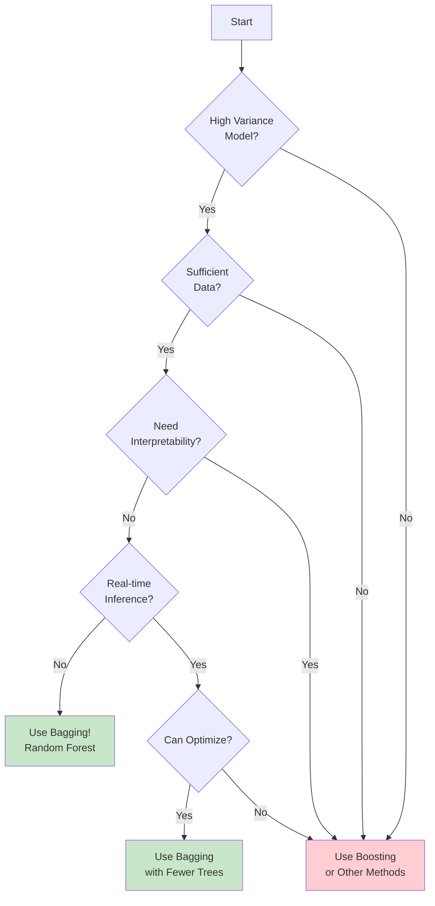

# Bagging (Bootstrap Aggregating) - Complete Guide

## Table of Contents
1. [Introduction](#introduction)
2. [Theory and Fundamentals](#theory-and-fundamentals)
3. [Bootstrap Sampling](#bootstrap-sampling)
4. [Variance Reduction Mechanism](#variance-reduction-mechanism)
5. [Bagging Algorithms](#bagging-algorithms)
6. [Random Forest Deep Dive](#random-forest-deep-dive)
7. [Out-of-Bag (OOB) Error](#out-of-bag-oob-error)
8. [Mathematical Formulation](#mathematical-formulation)
9. [Implementation from Scratch](#implementation-from-scratch)
10. [Implementation with Scikit-learn](#implementation-with-scikit-learn)
11. [Hyperparameter Tuning](#hyperparameter-tuning)
12. [When to Use Bagging](#when-to-use-bagging)
13. [Interview Questions](#interview-questions)

---

## Introduction

### What is Bagging?

**Bagging** (Bootstrap Aggregating) is an ensemble machine learning technique designed to improve the stability and accuracy of machine learning algorithms. It was proposed by **Leo Breiman** in 1996 and has become one of the most widely used ensemble methods.

**Key Characteristics:**
- Reduces variance and helps prevent overfitting
- Trains multiple models in parallel (independent of each other)
- Uses bootstrap sampling to create diverse training sets
- Aggregates predictions through voting (classification) or averaging (regression)
- Works best with high-variance, low-bias models (e.g., deep decision trees)

### Historical Context

The concept of bootstrap aggregating is derived from **bootstrapping**, a statistical resampling technique developed by **Bradley Efron** in 1979. Breiman extended this concept to machine learning by:
1. Creating multiple bootstrap samples from the training data
2. Training a separate model on each sample
3. Aggregating predictions to produce final output

### Why Bagging Works

Bagging leverages the **wisdom of crowds** principle:
- Individual models may make errors
- These errors are often uncorrelated
- Averaging reduces the impact of individual errors
- Result: More stable and accurate predictions

---

## Theory and Fundamentals

### The Variance Problem

High-variance models (like deep decision trees) suffer from:
- **Overfitting**: Memorizing training data instead of learning patterns
- **Instability**: Small changes in data lead to very different models
- **Poor generalization**: High training accuracy but low test accuracy

### How Bagging Reduces Variance


**Mathematical Intuition:**

If we have N independent models with variance σ², the variance of their average is:

```
Var(Average) = σ²/N
```

This means variance decreases as we add more models!

### Bias-Variance Tradeoff

**Bagging's Effect:**
- **Variance**: ↓ Significantly reduced
- **Bias**: → Remains approximately the same
- **Overall Error**: ↓ Reduced (variance reduction outweighs unchanged bias)


**When Bagging Works Best:**
- Base learner has high variance (e.g., deep decision trees, neural networks)
- Base learner has low bias (can fit complex patterns)
- Data has sufficient samples for bootstrap sampling

---

## Bootstrap Sampling

### What is Bootstrap Sampling?

**Bootstrap sampling** is random sampling **with replacement** from the original dataset.

### The 63.2% Rule

A fascinating mathematical property of bootstrap sampling:

**Question:** What percentage of the original dataset appears in each bootstrap sample?

**Answer:** Approximately **63.2%**

**Proof:**

For a dataset with n samples:
- Probability of selecting a specific sample: 1/n
- Probability of NOT selecting it: (1 - 1/n)
- After n draws with replacement: (1 - 1/n)ⁿ
- As n → ∞: lim (1 - 1/n)ⁿ = e⁻¹ ≈ 0.368

Therefore: **Probability of being selected = 1 - 0.368 = 0.632 (63.2%)**

### Out-of-Bag (OOB) Samples

The remaining **36.8%** of samples not selected are called **Out-of-Bag (OOB)** samples.


**Key Insight:** OOB samples provide a **free validation set** without needing separate train/test splits!

### Bootstrap Sampling Implementation

```python
import numpy as np

def bootstrap_sample(X, y, random_state=None):
    """
    Create a bootstrap sample from dataset (X, y)

    Returns:
        X_sample, y_sample: Bootstrap sample
        oob_indices: Indices of out-of-bag samples
    """
    np.random.seed(random_state)
    n_samples = X.shape[0]

    # Sample with replacement
    indices = np.random.choice(n_samples, size=n_samples, replace=True)

    # Get unique indices for bootstrap sample
    X_sample = X[indices]
    y_sample = y[indices]

    # Find OOB indices
    all_indices = set(range(n_samples))
    sampled_indices = set(indices)
    oob_indices = list(all_indices - sampled_indices)

    return X_sample, y_sample, oob_indices

# Example usage
X = np.array([[1, 2], [3, 4], [5, 6], [7, 8], [9, 10]])
y = np.array([0, 0, 1, 1, 1])

X_boot, y_boot, oob_idx = bootstrap_sample(X, y, random_state=42)

print(f"Original size: {len(y)}")
print(f"Bootstrap size: {len(y_boot)}")
print(f"Unique samples in bootstrap: {len(np.unique(y_boot))}")
print(f"OOB samples: {len(oob_idx)}")
print(f"OOB percentage: {len(oob_idx)/len(y)*100:.1f}%")
```

**Output:**
```
Original size: 5
Bootstrap size: 5
Unique samples in bootstrap: 3
OOB samples: 2
OOB percentage: 40.0%
```

---

## Variance Reduction Mechanism

### Why Averaging Reduces Variance

Consider N identically distributed random variables X₁, X₂, ..., Xₙ with:
- Mean: E[Xᵢ] = μ
- Variance: Var(Xᵢ) = σ²
- Correlation: ρ (pairwise correlation between predictions)

The variance of the average is:

```
Var(X̄) = ρσ² + (1-ρ)σ²/N
```

**Two Key Terms:**
1. **ρσ²**: Irreducible variance due to correlation between models
2. **(1-ρ)σ²/N**: Reducible variance (decreases with more models)

**Implications:**
- If ρ = 0 (uncorrelated models): Var(X̄) = σ²/N → Variance decreases linearly with N
- If ρ = 1 (perfectly correlated): Var(X̄) = σ² → No variance reduction
- Goal: Make models as uncorrelated as possible (through diverse training sets)

### Diversity is Key


**Strategies to Increase Diversity:**
1. **Bootstrap sampling** (bagging): Different training sets
2. **Feature randomization** (Random Forest): Different feature subsets
3. **Parameter randomization**: Different hyperparameters
4. **Algorithm diversity**: Different base learners

---

## Bagging Algorithms

### 1. Bagged Decision Trees

The simplest form of bagging uses decision trees as base learners.

**Algorithm:**
```
1. For b = 1 to B (number of bootstrap samples):
   a. Create bootstrap sample (Xb, yb) from (X, y)
   b. Train decision tree Tb on (Xb, yb)
2. For prediction on new sample x:
   a. Classification: Majority vote from all trees
   b. Regression: Average prediction from all trees
```

**Advantages:**
- Decision trees are high-variance → Bagging helps significantly
- Trees can capture complex non-linear patterns
- No need for feature scaling
- Handles mixed data types (numerical + categorical)

**Implementation:**
```python
from sklearn.tree import DecisionTreeClassifier
from sklearn.ensemble import BaggingClassifier

# Bagged decision trees
bagging_clf = BaggingClassifier(
    estimator=DecisionTreeClassifier(max_depth=None),  # Deep trees
    n_estimators=100,        # Number of trees
    max_samples=1.0,         # 100% bootstrap sample size
    bootstrap=True,          # Use bootstrap sampling
    oob_score=True,          # Compute OOB score
    random_state=42
)
```

### 2. Random Forest

**Random Forest = Bagging + Feature Randomization**

Random Forest extends bagging by adding randomness in feature selection at each split.

**Key Difference from Bagged Trees:**
```
Bagged Trees: Consider ALL features when splitting a node
Random Forest: Consider random subset of features when splitting
```

**Advantages over Bagging:**
- Even lower correlation between trees
- Further variance reduction
- Better generalization
- Less prone to overfitting

### 3. Extra Trees (Extremely Randomized Trees)

**Extra Trees = Random Forest + Random Splits**

Adds another layer of randomization:
- Random feature subset (like Random Forest)
- Random split thresholds (instead of optimal splits)

**Advantages:**
- Faster training (no need to find optimal splits)
- Even more diversity
- Can further reduce variance

**Trade-off:**
- Slightly higher bias (random splits may be suboptimal)
- Usually worth it for variance reduction

### Comparison Table

| Feature | Bagged Trees | Random Forest | Extra Trees |
|---------|--------------|---------------|-------------|
| Bootstrap Sampling | ✓ | ✓ | ✓ |
| Feature Randomization | ✗ | ✓ | ✓ |
| Random Splits | ✗ | ✗ | ✓ |
| Training Speed | Medium | Medium | Fast |
| Variance | High | Low | Very Low |
| Bias | Low | Low | Medium |
| Best Use Case | General | Most cases | Large datasets |

---

## Random Forest Deep Dive

### Architecture


### Feature Randomization

At each node split, Random Forest:
1. Randomly selects m features from M total features
2. Finds best split among these m features only
3. Different features may be selected at different nodes

**Default values of m:**
- Classification: m = √M
- Regression: m = M/3

**Example:**
```
Total features M = 100
Classification: m = √100 = 10 features per split
Regression: m = 100/3 ≈ 33 features per split
```

### Why Feature Randomization Helps

**Problem with Bagged Trees:**
If one feature is very strong predictor:
- All trees will use it at the root
- Trees become highly correlated
- Limited variance reduction

**Solution with Random Forest:**
- Strong features not always available
- Forces trees to use different features
- Creates more diverse trees
- Better variance reduction


### Random Forest Algorithm

```python
def random_forest_algorithm(X, y, n_trees, max_features):
    """
    Random Forest Algorithm (Simplified)
    """
    trees = []
    n_samples, n_features = X.shape

    # Determine max_features
    if max_features == 'sqrt':
        m = int(np.sqrt(n_features))
    elif max_features == 'log2':
        m = int(np.log2(n_features))
    else:
        m = max_features

    for i in range(n_trees):
        # Step 1: Bootstrap sample
        indices = np.random.choice(n_samples, size=n_samples, replace=True)
        X_boot = X[indices]
        y_boot = y[indices]

        # Step 2: Train tree with feature randomization
        tree = DecisionTree(max_features=m)
        tree.fit(X_boot, y_boot)
        trees.append(tree)

    return trees

def predict(trees, X):
    """Make predictions using ensemble of trees"""
    # Get predictions from all trees
    predictions = np.array([tree.predict(X) for tree in trees])

    # Majority vote for each sample
    return np.apply_along_axis(
        lambda x: np.bincount(x).argmax(),
        axis=0,
        arr=predictions
    )
```

### Random Forest Hyperparameters

**Tree Structure Parameters:**
- `n_estimators`: Number of trees (typically 100-500)
- `max_depth`: Maximum depth of trees (None = fully grown)
- `min_samples_split`: Minimum samples to split a node (2-10)
- `min_samples_leaf`: Minimum samples in leaf node (1-5)

**Randomization Parameters:**
- `max_features`: Number of features to consider at split
  - 'sqrt': √(n_features) for classification
  - 'log2': log₂(n_features)
  - float: Fraction of features
  - int: Exact number of features

**Sampling Parameters:**
- `bootstrap`: Whether to use bootstrap sampling (True recommended)
- `max_samples`: Size of bootstrap sample (1.0 = 100%)
- `oob_score`: Whether to compute OOB error (True recommended)

**Performance Parameters:**
- `n_jobs`: Number of parallel jobs (-1 = use all CPUs)
- `random_state`: Random seed for reproducibility

---

## Out-of-Bag (OOB) Error

### What is OOB Error?

**Out-of-Bag (OOB) Error** is a method of measuring prediction error using samples that were not included in the bootstrap sample for each tree.

**Key Insight:** OOB error provides an unbiased estimate of test error **without needing a separate validation set**!

### OOB Error Calculation


**Algorithm:**
```
For each sample xi in original dataset:
    1. Find all trees where xi was OOB
    2. Get predictions from these trees
    3. Aggregate predictions (vote/average)
    4. Compare to true label yi

OOB Error = Average error across all samples
```

### OOB Error Implementation

```python
import numpy as np
from sklearn.ensemble import RandomForestClassifier
from sklearn.datasets import make_classification
from sklearn.metrics import accuracy_score

# Generate dataset
X, y = make_classification(n_samples=1000, n_features=20,
                           n_informative=15, random_state=42)

# Train Random Forest with OOB
rf = RandomForestClassifier(
    n_estimators=100,
    max_features='sqrt',
    bootstrap=True,
    oob_score=True,  # Enable OOB score calculation
    random_state=42
)
rf.fit(X, y)

# OOB Score (accuracy)
print(f"OOB Score: {rf.oob_score_:.4f}")

# OOB Predictions for each sample
print(f"OOB Predictions shape: {rf.oob_decision_function_.shape}")
# Shape: (n_samples, n_classes)

# Manual OOB error calculation
oob_predictions = np.argmax(rf.oob_decision_function_, axis=1)
oob_error = 1 - accuracy_score(y, oob_predictions)
print(f"OOB Error: {oob_error:.4f}")
```

### OOB vs Cross-Validation

**Advantages of OOB:**
- No need for separate train/val split
- Uses all data for training
- Computationally free (calculated during training)
- Provides unbiased error estimate

**When OOB Error ≈ Cross-Validation Error:**
- Large datasets
- Many trees (N ≥ 100)
- Stabilized OOB error (not changing with more trees)

**Comparison:**

| Metric | OOB Error | 5-Fold CV | 10-Fold CV |
|--------|-----------|-----------|------------|
| Training Data Used | 100% | 80% | 90% |
| Validation Splits | N trees | 5 | 10 |
| Computation | Free | 5x slower | 10x slower |
| Accuracy | High | High | Very High |
| Best For | Large N | Small data | Best estimate |

### Visualizing OOB Error Convergence

```python
import matplotlib.pyplot as plt
from sklearn.ensemble import RandomForestClassifier

# Track OOB error as trees are added
oob_errors = []
n_trees_range = range(1, 201, 5)

for n_trees in n_trees_range:
    rf = RandomForestClassifier(
        n_estimators=n_trees,
        oob_score=True,
        random_state=42
    )
    rf.fit(X, y)
    oob_errors.append(1 - rf.oob_score_)

# Plot
plt.figure(figsize=(10, 6))
plt.plot(n_trees_range, oob_errors, linewidth=2)
plt.xlabel('Number of Trees', fontsize=12)
plt.ylabel('OOB Error', fontsize=12)
plt.title('OOB Error vs Number of Trees', fontsize=14)
plt.grid(True, alpha=0.3)
plt.show()
```

**Typical Pattern:**
- OOB error decreases rapidly initially
- Stabilizes after ~50-100 trees
- Further trees provide minimal improvement

---

## Mathematical Formulation

### Bagging for Classification

**Training:**
For b = 1, 2, ..., B:
1. Draw bootstrap sample Zb = {(x₁, y₁), ..., (xₙ, yₙ)}
2. Train classifier fb on Zb

**Prediction:**
```
ŷ = argmax_k Σ(b=1 to B) I(fb(x) = k)
```
Where I(·) is indicator function (1 if true, 0 if false)

**Interpretation:** Majority vote across all B classifiers

### Bagging for Regression

**Prediction:**
```
ŷ = (1/B) Σ(b=1 to B) fb(x)
```

**Interpretation:** Average prediction across all B regressors

### Expected Prediction Error

For regression, the expected prediction error at point x:

```
E[(Y - f(x))²] = E[(Y - E[Y|X=x])²] + E[(f(x) - E[f(x)|X=x])²]
                = Irreducible Error + Variance
```

**Bagging reduces the second term (variance)!**

### Variance Reduction Formula

For N models with variance σ² and correlation ρ:

```
Var(Bagged) = ρσ² + ((1-ρ)/N)σ²
```

**As N → ∞:**
```
Var(Bagged) → ρσ²
```

**Minimum achievable variance = ρσ²** (correlation times single-model variance)

**Key Insight:**
- If models are uncorrelated (ρ = 0): Variance → 0
- If models are correlated (ρ > 0): Residual variance remains
- Random Forest reduces ρ through feature randomization

### Information Gain with Feature Randomization

For Random Forest, at each split:

**Information Gain:**
```
IG(S, A) = H(S) - Σ((|Sv|/|S|) × H(Sv))
```

Where:
- S: Current node samples
- A: Split attribute (chosen from random subset)
- Sv: Samples in child node v
- H(S): Entropy of node S

**Random Forest twist:** A is chosen from random m features, not all M features.

---

## Implementation from Scratch

### Complete Bagging Implementation

```python
import numpy as np
from sklearn.tree import DecisionTreeClassifier
from sklearn.base import clone

class BaggingClassifierFromScratch:
    """
    Bagging Classifier implemented from scratch
    """
    def __init__(self, base_estimator=None, n_estimators=10,
                 max_samples=1.0, bootstrap=True,
                 oob_score=False, random_state=None):
        """
        Parameters:
        -----------
        base_estimator : object
            The base estimator to fit on random subsets
        n_estimators : int
            Number of base estimators in the ensemble
        max_samples : float or int
            Number of samples to draw for each base estimator
        bootstrap : bool
            Whether samples are drawn with replacement
        oob_score : bool
            Whether to use out-of-bag samples to estimate error
        random_state : int
            Random seed for reproducibility
        """
        self.base_estimator = base_estimator
        self.n_estimators = n_estimators
        self.max_samples = max_samples
        self.bootstrap = bootstrap
        self.oob_score = oob_score
        self.random_state = random_state
        self.estimators_ = []
        self.oob_score_ = None

    def fit(self, X, y):
        """Fit the bagging ensemble"""
        np.random.seed(self.random_state)
        n_samples = X.shape[0]

        # Determine sample size
        if isinstance(self.max_samples, float):
            n_sample = int(self.max_samples * n_samples)
        else:
            n_sample = self.max_samples

        # Initialize OOB tracking
        if self.oob_score:
            oob_predictions = np.zeros((n_samples, len(np.unique(y))))
            oob_counts = np.zeros(n_samples)

        # Train each estimator
        for i in range(self.n_estimators):
            # Bootstrap sample
            if self.bootstrap:
                indices = np.random.choice(
                    n_samples, size=n_sample, replace=True
                )
            else:
                indices = np.random.choice(
                    n_samples, size=n_sample, replace=False
                )

            # Get bootstrap sample
            X_sample = X[indices]
            y_sample = y[indices]

            # Clone and train base estimator
            estimator = clone(self.base_estimator)
            estimator.fit(X_sample, y_sample)
            self.estimators_.append(estimator)

            # Track OOB samples
            if self.oob_score:
                # Find OOB samples
                oob_indices = list(set(range(n_samples)) - set(indices))

                if len(oob_indices) > 0:
                    # Predict on OOB samples
                    X_oob = X[oob_indices]
                    oob_pred = estimator.predict_proba(X_oob)

                    # Accumulate predictions
                    oob_predictions[oob_indices] += oob_pred
                    oob_counts[oob_indices] += 1

        # Calculate OOB score
        if self.oob_score:
            # Average OOB predictions
            oob_mask = oob_counts > 0
            oob_predictions[oob_mask] /= oob_counts[oob_mask, np.newaxis]

            # Get OOB accuracy
            oob_decision = np.argmax(oob_predictions[oob_mask], axis=1)
            self.oob_score_ = np.mean(oob_decision == y[oob_mask])

        return self

    def predict(self, X):
        """Predict class labels"""
        # Get predictions from all estimators
        predictions = np.array([
            estimator.predict(X) for estimator in self.estimators_
        ])

        # Majority vote
        final_predictions = np.apply_along_axis(
            lambda x: np.bincount(x).argmax(),
            axis=0,
            arr=predictions
        )

        return final_predictions

    def predict_proba(self, X):
        """Predict class probabilities"""
        # Get probabilities from all estimators
        probas = np.array([
            estimator.predict_proba(X) for estimator in self.estimators_
        ])

        # Average probabilities
        return np.mean(probas, axis=0)


# Example Usage
from sklearn.datasets import make_classification
from sklearn.model_selection import train_test_split
from sklearn.metrics import accuracy_score

# Generate dataset
X, y = make_classification(
    n_samples=1000, n_features=20, n_informative=15,
    n_classes=2, random_state=42
)

X_train, X_test, y_train, y_test = train_test_split(
    X, y, test_size=0.2, random_state=42
)

# Train bagging classifier
bagging = BaggingClassifierFromScratch(
    base_estimator=DecisionTreeClassifier(max_depth=None),
    n_estimators=50,
    max_samples=1.0,
    bootstrap=True,
    oob_score=True,
    random_state=42
)

bagging.fit(X_train, y_train)

# Predictions
y_pred = bagging.predict(X_test)

# Evaluate
print(f"Test Accuracy: {accuracy_score(y_test, y_pred):.4f}")
print(f"OOB Score: {bagging.oob_score_:.4f}")
```

### Random Forest from Scratch

```python
class RandomForestFromScratch:
    """
    Random Forest implemented from scratch
    """
    def __init__(self, n_estimators=100, max_features='sqrt',
                 max_depth=None, min_samples_split=2,
                 bootstrap=True, oob_score=False, random_state=None):
        self.n_estimators = n_estimators
        self.max_features = max_features
        self.max_depth = max_depth
        self.min_samples_split = min_samples_split
        self.bootstrap = bootstrap
        self.oob_score = oob_score
        self.random_state = random_state
        self.trees_ = []
        self.oob_score_ = None

    def _get_max_features(self, n_features):
        """Calculate max_features for each split"""
        if self.max_features == 'sqrt':
            return int(np.sqrt(n_features))
        elif self.max_features == 'log2':
            return int(np.log2(n_features))
        elif isinstance(self.max_features, int):
            return self.max_features
        elif isinstance(self.max_features, float):
            return int(self.max_features * n_features)
        else:
            return n_features

    def fit(self, X, y):
        """Train Random Forest"""
        np.random.seed(self.random_state)
        n_samples, n_features = X.shape
        max_features = self._get_max_features(n_features)

        # Initialize OOB tracking
        if self.oob_score:
            oob_predictions = np.zeros((n_samples, len(np.unique(y))))
            oob_counts = np.zeros(n_samples)

        # Train each tree
        for i in range(self.n_estimators):
            # Bootstrap sample
            if self.bootstrap:
                indices = np.random.choice(
                    n_samples, size=n_samples, replace=True
                )
            else:
                indices = np.arange(n_samples)

            X_sample = X[indices]
            y_sample = y[indices]

            # Train tree with feature randomization
            tree = DecisionTreeClassifier(
                max_depth=self.max_depth,
                min_samples_split=self.min_samples_split,
                max_features=max_features,  # KEY: Feature randomization
                random_state=self.random_state + i if self.random_state else None
            )
            tree.fit(X_sample, y_sample)
            self.trees_.append(tree)

            # OOB tracking
            if self.oob_score and self.bootstrap:
                oob_indices = list(set(range(n_samples)) - set(indices))
                if len(oob_indices) > 0:
                    X_oob = X[oob_indices]
                    oob_pred = tree.predict_proba(X_oob)
                    oob_predictions[oob_indices] += oob_pred
                    oob_counts[oob_indices] += 1

        # Calculate OOB score
        if self.oob_score:
            oob_mask = oob_counts > 0
            oob_predictions[oob_mask] /= oob_counts[oob_mask, np.newaxis]
            oob_decision = np.argmax(oob_predictions[oob_mask], axis=1)
            self.oob_score_ = np.mean(oob_decision == y[oob_mask])

        return self

    def predict(self, X):
        """Predict using majority vote"""
        predictions = np.array([tree.predict(X) for tree in self.trees_])
        return np.apply_along_axis(
            lambda x: np.bincount(x).argmax(),
            axis=0, arr=predictions
        )

    def predict_proba(self, X):
        """Predict class probabilities"""
        probas = np.array([tree.predict_proba(X) for tree in self.trees_])
        return np.mean(probas, axis=0)


# Example Usage
rf = RandomForestFromScratch(
    n_estimators=100,
    max_features='sqrt',
    max_depth=None,
    bootstrap=True,
    oob_score=True,
    random_state=42
)

rf.fit(X_train, y_train)
y_pred = rf.predict(X_test)

print(f"Test Accuracy: {accuracy_score(y_test, y_pred):.4f}")
print(f"OOB Score: {rf.oob_score_:.4f}")
```

---

## Implementation with Scikit-learn

### BaggingClassifier

```python
from sklearn.ensemble import BaggingClassifier
from sklearn.tree import DecisionTreeClassifier
from sklearn.neighbors import KNeighborsClassifier
from sklearn.datasets import make_classification
from sklearn.model_selection import train_test_split, cross_val_score
from sklearn.metrics import accuracy_score, classification_report

# Generate dataset
X, y = make_classification(
    n_samples=1000, n_features=20, n_informative=15,
    n_redundant=5, random_state=42
)

X_train, X_test, y_train, y_test = train_test_split(
    X, y, test_size=0.2, random_state=42
)

# 1. Bagging with Decision Trees
bagging_dt = BaggingClassifier(
    estimator=DecisionTreeClassifier(max_depth=None),
    n_estimators=100,
    max_samples=1.0,          # Use 100% of samples
    max_features=1.0,         # Use 100% of features
    bootstrap=True,           # Bootstrap sampling
    bootstrap_features=False, # Don't bootstrap features
    oob_score=True,          # Compute OOB score
    n_jobs=-1,               # Use all CPU cores
    random_state=42
)

bagging_dt.fit(X_train, y_train)
y_pred_dt = bagging_dt.predict(X_test)

print("Bagging with Decision Trees:")
print(f"  Test Accuracy: {accuracy_score(y_test, y_pred_dt):.4f}")
print(f"  OOB Score: {bagging_dt.oob_score_:.4f}")

# 2. Bagging with KNN
bagging_knn = BaggingClassifier(
    estimator=KNeighborsClassifier(n_neighbors=5),
    n_estimators=50,
    max_samples=0.8,         # Use 80% of samples
    bootstrap=True,
    oob_score=True,
    n_jobs=-1,
    random_state=42
)

bagging_knn.fit(X_train, y_train)
y_pred_knn = bagging_knn.predict(X_test)

print("\nBagging with KNN:")
print(f"  Test Accuracy: {accuracy_score(y_test, y_pred_knn):.4f}")
print(f"  OOB Score: {bagging_knn.oob_score_:.4f}")

# 3. Cross-validation
cv_scores = cross_val_score(
    bagging_dt, X_train, y_train, cv=5, scoring='accuracy'
)
print(f"\n5-Fold CV Accuracy: {cv_scores.mean():.4f} (+/- {cv_scores.std():.4f})")
```

### RandomForestClassifier

```python
from sklearn.ensemble import RandomForestClassifier
import numpy as np

# Create Random Forest
rf = RandomForestClassifier(
    n_estimators=100,
    criterion='gini',              # or 'entropy'
    max_depth=None,                # Fully grown trees
    min_samples_split=2,
    min_samples_leaf=1,
    max_features='sqrt',           # √(n_features) for classification
    bootstrap=True,
    oob_score=True,
    n_jobs=-1,
    random_state=42,
    verbose=0
)

rf.fit(X_train, y_train)
y_pred_rf = rf.predict(X_test)

print("Random Forest:")
print(f"  Test Accuracy: {accuracy_score(y_test, y_pred_rf):.4f}")
print(f"  OOB Score: {rf.oob_score_:.4f}")

# Feature importance
feature_importance = rf.feature_importances_
sorted_idx = np.argsort(feature_importance)[::-1]

print("\nTop 5 Important Features:")
for i in range(5):
    print(f"  Feature {sorted_idx[i]}: {feature_importance[sorted_idx[i]]:.4f}")

# Predict probabilities
y_proba = rf.predict_proba(X_test)
print(f"\nPrediction probabilities shape: {y_proba.shape}")
```

### RandomForestRegressor

```python
from sklearn.ensemble import RandomForestRegressor
from sklearn.datasets import make_regression
from sklearn.metrics import mean_squared_error, r2_score

# Generate regression dataset
X_reg, y_reg = make_regression(
    n_samples=1000, n_features=20, n_informative=15,
    noise=10, random_state=42
)

X_train_reg, X_test_reg, y_train_reg, y_test_reg = train_test_split(
    X_reg, y_reg, test_size=0.2, random_state=42
)

# Train Random Forest Regressor
rf_reg = RandomForestRegressor(
    n_estimators=100,
    max_features='sqrt',          # or 1.0 / 3 for regression
    max_depth=None,
    min_samples_split=2,
    min_samples_leaf=1,
    bootstrap=True,
    oob_score=True,
    n_jobs=-1,
    random_state=42
)

rf_reg.fit(X_train_reg, y_train_reg)
y_pred_reg = rf_reg.predict(X_test_reg)

print("Random Forest Regressor:")
print(f"  Test MSE: {mean_squared_error(y_test_reg, y_pred_reg):.4f}")
print(f"  Test R²: {r2_score(y_test_reg, y_pred_reg):.4f}")
print(f"  OOB Score (R²): {rf_reg.oob_score_:.4f}")
```

---

## Hyperparameter Tuning

### Key Hyperparameters

**1. n_estimators (Number of Trees)**
- More trees → Better performance (up to a point)
- Diminishing returns after ~100-500 trees
- More trees → Longer training time
- **Recommendation:** Start with 100, increase if needed

**2. max_features (Feature Randomization)**
- Controls diversity between trees
- Lower → More diverse trees, lower correlation
- Higher → Better individual trees, higher correlation
- **Recommendations:**
  - Classification: `'sqrt'` or `'log2'`
  - Regression: `1.0/3` or `'sqrt'`

**3. max_depth (Tree Depth)**
- Controls tree complexity
- `None` → Fully grown trees (high variance, low bias)
- Lower values → Simpler trees (lower variance, higher bias)
- **Recommendation:** Start with `None`, reduce if overfitting

**4. min_samples_split**
- Minimum samples required to split a node
- Higher → More conservative trees
- Lower → More complex trees
- **Recommendation:** 2-10 (2 is default)

**5. min_samples_leaf**
- Minimum samples required in leaf node
- Higher → Smoother decision boundaries
- Lower → More flexible boundaries
- **Recommendation:** 1-5 (1 is default)

**6. bootstrap**
- Whether to use bootstrap sampling
- `True` → Standard bagging (recommended)
- `False` → Use all samples (reduces diversity)

### Grid Search for Hyperparameter Tuning

```python
from sklearn.model_selection import GridSearchCV
from sklearn.ensemble import RandomForestClassifier

# Define parameter grid
param_grid = {
    'n_estimators': [50, 100, 200],
    'max_features': ['sqrt', 'log2', 0.5],
    'max_depth': [None, 10, 20, 30],
    'min_samples_split': [2, 5, 10],
    'min_samples_leaf': [1, 2, 4],
    'bootstrap': [True]
}

# Create Random Forest
rf = RandomForestClassifier(random_state=42, n_jobs=-1)

# Grid search with cross-validation
grid_search = GridSearchCV(
    estimator=rf,
    param_grid=param_grid,
    cv=5,
    scoring='accuracy',
    n_jobs=-1,
    verbose=2
)

grid_search.fit(X_train, y_train)

# Best parameters
print("Best Parameters:")
print(grid_search.best_params_)
print(f"\nBest CV Score: {grid_search.best_score_:.4f}")

# Test with best model
best_rf = grid_search.best_estimator_
y_pred_best = best_rf.predict(X_test)
print(f"Test Accuracy: {accuracy_score(y_test, y_pred_best):.4f}")
```

### Random Search (Faster Alternative)

```python
from sklearn.model_selection import RandomizedSearchCV
from scipy.stats import randint, uniform

# Define parameter distributions
param_distributions = {
    'n_estimators': randint(50, 300),
    'max_features': uniform(0.3, 0.7),
    'max_depth': [None] + list(randint(10, 50).rvs(10)),
    'min_samples_split': randint(2, 20),
    'min_samples_leaf': randint(1, 10),
}

# Random search
random_search = RandomizedSearchCV(
    estimator=RandomForestClassifier(random_state=42, n_jobs=-1),
    param_distributions=param_distributions,
    n_iter=50,              # Number of parameter combinations to try
    cv=5,
    scoring='accuracy',
    n_jobs=-1,
    random_state=42,
    verbose=2
)

random_search.fit(X_train, y_train)

print("Best Parameters:")
print(random_search.best_params_)
print(f"\nBest CV Score: {random_search.best_score_:.4f}")
```

### Learning Curves

```python
from sklearn.model_selection import learning_curve
import matplotlib.pyplot as plt

def plot_learning_curve(estimator, X, y, cv=5):
    """Plot learning curves for training and validation"""
    train_sizes, train_scores, val_scores = learning_curve(
        estimator, X, y, cv=cv,
        train_sizes=np.linspace(0.1, 1.0, 10),
        scoring='accuracy',
        n_jobs=-1
    )

    train_mean = np.mean(train_scores, axis=1)
    train_std = np.std(train_scores, axis=1)
    val_mean = np.mean(val_scores, axis=1)
    val_std = np.std(val_scores, axis=1)

    plt.figure(figsize=(10, 6))
    plt.plot(train_sizes, train_mean, label='Training Score', linewidth=2)
    plt.fill_between(train_sizes, train_mean - train_std,
                     train_mean + train_std, alpha=0.2)

    plt.plot(train_sizes, val_mean, label='Validation Score', linewidth=2)
    plt.fill_between(train_sizes, val_mean - val_std,
                     val_mean + val_std, alpha=0.2)

    plt.xlabel('Training Size', fontsize=12)
    plt.ylabel('Accuracy', fontsize=12)
    plt.title('Learning Curves', fontsize=14)
    plt.legend(loc='best')
    plt.grid(True, alpha=0.3)
    plt.show()

# Plot for Random Forest
rf = RandomForestClassifier(n_estimators=100, random_state=42, n_jobs=-1)
plot_learning_curve(rf, X_train, y_train)
```

---

## When to Use Bagging

### Best Use Cases

**1. High-Variance Models**
- Deep decision trees
- Neural networks (sometimes)
- K-Nearest Neighbors
- Unstable models sensitive to data changes

**2. Sufficient Training Data**
- Need enough data for meaningful bootstrap samples
- Rule of thumb: n > 100 samples
- More data → Better diversity

**3. Parallel Computing Available**
- Bagging is embarrassingly parallel
- Can train all models simultaneously
- Ideal for multi-core systems

**4. Need for Stability**
- Want consistent predictions
- Reduce sensitivity to data perturbations
- Production systems requiring reliability

### When NOT to Use Bagging

**1. High-Bias Models**
- Linear regression
- Logistic regression
- Simple decision trees (stumps)
- Bagging doesn't reduce bias significantly

**2. Small Datasets**
- Bootstrap samples too similar
- Limited diversity
- May increase overfitting

**3. Interpretability Requirements**
- Ensemble of 100+ trees is hard to interpret
- Use single decision tree instead
- Or use simpler linear models

**4. Real-Time Inference Requirements**
- Bagging requires predictions from all models
- Can be slow for large ensembles
- Consider model compression or distillation

### Decision Flowchart



---

## Interview Questions

### Conceptual Questions

**Q1: What is bagging and how does it work?**

**Answer:**
Bagging (Bootstrap Aggregating) is an ensemble learning technique that:
1. Creates multiple bootstrap samples (random sampling with replacement)
2. Trains a separate model on each bootstrap sample
3. Aggregates predictions through voting (classification) or averaging (regression)

It reduces variance by training models on diverse datasets and averaging their predictions, which cancels out individual model errors.

---

**Q2: Why does bagging reduce variance but not bias?**

**Answer:**
- **Variance Reduction:** Bagging creates diverse models through bootstrap sampling. Averaging predictions from multiple uncorrelated models reduces variance (σ²/N for N models).
- **Bias Unchanged:** Each individual model has the same bias as a single model trained on the full dataset. Averaging predictions doesn't change the systematic errors (bias), only random errors (variance).
- **Implication:** Bagging works best with high-variance, low-bias models like deep decision trees.

---

**Q3: Explain the 63.2% rule in bootstrap sampling.**

**Answer:**
When creating a bootstrap sample of size n from a dataset of size n:
- Probability of selecting any specific sample in one draw: 1/n
- Probability of NOT selecting it: (1 - 1/n)
- After n draws: (1 - 1/n)ⁿ
- As n → ∞: lim (1 - 1/n)ⁿ = e⁻¹ ≈ 0.368

Therefore, approximately **63.2%** of unique samples appear in each bootstrap sample, and **36.8%** are out-of-bag (OOB).

---

**Q4: What is OOB error and why is it useful?**

**Answer:**
Out-of-Bag (OOB) error is a validation metric calculated using samples not included in each bootstrap sample (the 36.8%).

**Calculation:**
- For each sample, find all trees where it was OOB
- Aggregate predictions from those trees
- Compare to true label

**Advantages:**
- No need for separate validation set
- Uses 100% of data for training
- Computationally free (calculated during training)
- Provides unbiased estimate of test error
- Approximates leave-one-out cross-validation for large N

---

**Q5: How does Random Forest differ from bagging?**

**Answer:**

| Aspect | Bagging | Random Forest |
|--------|---------|---------------|
| Bootstrap Sampling | ✓ | ✓ |
| Feature Randomization | ✗ | ✓ |
| Correlation Between Models | Higher | Lower |
| Variance Reduction | Good | Better |
| Best Use Case | General | Most cases |

Random Forest adds feature randomization: at each split, only a random subset of features (typically √M for classification) is considered. This:
- Further decorrelates trees
- Reduces variance more than plain bagging
- Prevents strong features from dominating all trees

---

**Q6: Why does bagging work better with unstable models?**

**Answer:**
**Unstable models** (e.g., deep decision trees) have high variance—small changes in training data lead to very different models.

**Why bagging helps:**
1. Bootstrap sampling creates diverse training sets
2. Each model makes different mistakes
3. Errors are largely uncorrelated
4. Averaging cancels out random errors
5. Result: Stable, low-variance ensemble

**Stable models** (e.g., linear regression) produce similar models regardless of training data → bagging provides minimal benefit.

---

**Q7: How many trees should you use in a Random Forest?**

**Answer:**
**Typical range:** 100-500 trees

**Considerations:**
- **More trees → Better performance** (up to a point)
- **Diminishing returns** after ~100-200 trees
- **OOB error stabilization** indicates sufficient trees
- **Training time** increases linearly with trees
- **Prediction time** also increases with trees

**Recommendation:**
- Start with 100 trees
- Monitor OOB error convergence
- Increase if OOB error still decreasing
- Balance accuracy vs computational cost

---

**Q8: What is the effect of max_features in Random Forest?**

**Answer:**
`max_features` controls the number of features considered at each split.

**Effects:**
- **Lower values:** More diverse trees, lower correlation, more variance reduction
- **Higher values:** Better individual trees, higher correlation, less ensemble benefit

**Recommendations:**
- **Classification:** `sqrt` (√M) or `log2`
- **Regression:** `1.0/3` or `sqrt`
- **Rule:** Lower for many features, higher for few features

**Example:** 100 features
- `max_features='sqrt'` → 10 features per split
- `max_features='log2'` → 7 features per split
- `max_features=0.5` → 50 features per split

---

### Technical Questions

**Q9: Implement bootstrap sampling in Python.**

**Answer:**
```python
import numpy as np

def bootstrap_sample(X, y, random_state=None):
    """Create bootstrap sample with OOB indices"""
    np.random.seed(random_state)
    n_samples = X.shape[0]

    # Sample with replacement
    indices = np.random.choice(n_samples, size=n_samples, replace=True)
    X_boot = X[indices]
    y_boot = y[indices]

    # Find OOB samples
    oob_indices = list(set(range(n_samples)) - set(indices))

    return X_boot, y_boot, oob_indices

# Example
X = np.array([[1,2], [3,4], [5,6], [7,8]])
y = np.array([0, 0, 1, 1])
X_boot, y_boot, oob = bootstrap_sample(X, y, random_state=42)
print(f"OOB samples: {len(oob)} ({len(oob)/len(y)*100:.1f}%)")
```

---

**Q10: How do you calculate feature importance in Random Forest?**

**Answer:**
**Mean Decrease in Impurity (Gini Importance):**

For each feature:
1. Calculate weighted impurity decrease for all splits using that feature
2. Average across all trees
3. Normalize to sum to 1

**Formula:**
```
Importance(feature j) = (1/N) Σ(t=1 to N) Σ(splits using j) (impurity_decrease)
```

**Code:**
```python
from sklearn.ensemble import RandomForestClassifier
import numpy as np

rf = RandomForestClassifier(n_estimators=100, random_state=42)
rf.fit(X_train, y_train)

# Get feature importance
importance = rf.feature_importances_
indices = np.argsort(importance)[::-1]

print("Feature Importance Ranking:")
for i in range(X.shape[1]):
    print(f"{i+1}. Feature {indices[i]}: {importance[indices[i]]:.4f}")
```

**Limitations:**
- Biased towards high-cardinality features
- Doesn't capture feature interactions
- Use permutation importance for unbiased estimates

---

**Q11: What's the time complexity of Random Forest training and prediction?**

**Answer:**

**Training:**
```
O(N × M × log(n) × T)
```
Where:
- N = n_estimators (number of trees)
- M = max_features (features per split)
- n = number of samples
- T = average tree depth

**Prediction:**
```
O(N × T)
```
Where:
- N = n_estimators
- T = average tree depth

**Space Complexity:**
```
O(N × T × M)
```

**Parallelization:**
- Training: Embarrassingly parallel → near-linear speedup with more cores
- Prediction: Also parallelizable

---

**Q12: How do you handle imbalanced datasets with Random Forest?**

**Answer:**

**1. Class Weights:**
```python
rf = RandomForestClassifier(
    class_weight='balanced',  # or custom dict
    random_state=42
)
```
Automatically adjusts weights inversely proportional to class frequencies.

**2. Balanced Sampling:**
```python
rf = RandomForestClassifier(
    class_weight='balanced_subsample',
    random_state=42
)
```
Recomputes weights for each bootstrap sample.

**3. SMOTE + Bagging:**
```python
from imblearn.over_sampling import SMOTE
from imblearn.ensemble import BalancedBaggingClassifier

bbc = BalancedBaggingClassifier(
    base_estimator=DecisionTreeClassifier(),
    sampling_strategy='auto',
    replacement=False,
    random_state=42
)
```

**4. Custom Threshold:**
```python
y_proba = rf.predict_proba(X_test)[:, 1]
threshold = 0.3  # Lower for minority class
y_pred = (y_proba >= threshold).astype(int)
```

---

**Q13: Compare bagging with different base learners.**

**Answer:**

| Base Learner | Variance Reduction | Training Speed | Best Use Case |
|--------------|-------------------|----------------|---------------|
| **Decision Trees** | ★★★★★ | Fast | Most cases (default) |
| **KNN** | ★★★ | Slow | Small datasets |
| **Neural Networks** | ★★★★ | Very Slow | Complex patterns |
| **Linear Models** | ★ | Very Fast | Don't use (low variance) |
| **SVM** | ★★ | Slow | High-dimensional data |

**Code Example:**
```python
from sklearn.ensemble import BaggingClassifier
from sklearn.tree import DecisionTreeClassifier
from sklearn.neighbors import KNeighborsClassifier
from sklearn.svm import SVC

# Bagging with different base learners
classifiers = {
    'Bagging+DT': BaggingClassifier(DecisionTreeClassifier()),
    'Bagging+KNN': BaggingClassifier(KNeighborsClassifier(n_neighbors=5)),
    'Bagging+SVM': BaggingClassifier(SVC(probability=True))
}

for name, clf in classifiers.items():
    clf.fit(X_train, y_train)
    score = clf.score(X_test, y_test)
    print(f"{name}: {score:.4f}")
```

---

**Q14: How do you prevent overfitting in Random Forest?**

**Answer:**

**1. Limit Tree Depth:**
```python
rf = RandomForestClassifier(
    max_depth=10,              # Limit depth
    min_samples_split=10,      # More samples to split
    min_samples_leaf=5,        # More samples per leaf
)
```

**2. Increase Diversity:**
```python
rf = RandomForestClassifier(
    max_features='sqrt',       # Use fewer features
    max_samples=0.8,           # Use 80% of samples
)
```

**3. Regularization:**
```python
rf = RandomForestClassifier(
    min_impurity_decrease=0.01,  # Minimum improvement to split
    ccp_alpha=0.01,               # Cost-complexity pruning
)
```

**4. Cross-Validation:**
```python
from sklearn.model_selection import cross_val_score
scores = cross_val_score(rf, X, y, cv=5)
print(f"CV Score: {scores.mean():.4f} (+/- {scores.std():.4f})")
```

**5. Monitor Learning Curves:**
- If validation accuracy plateaus while training accuracy increases → overfitting
- Reduce model complexity

---

**Q15: Explain how to use Random Forest for feature selection.**

**Answer:**

**Method 1: Feature Importance Ranking**
```python
rf = RandomForestClassifier(n_estimators=100, random_state=42)
rf.fit(X_train, y_train)

# Get importance
importance = rf.feature_importances_
threshold = 0.01  # Keep features with importance > 0.01

# Select features
selected_features = np.where(importance > threshold)[0]
X_train_selected = X_train[:, selected_features]
```

**Method 2: Recursive Feature Elimination**
```python
from sklearn.feature_selection import RFE

rf = RandomForestClassifier(random_state=42)
rfe = RFE(estimator=rf, n_features_to_select=10)
rfe.fit(X_train, y_train)

# Selected features
selected = rfe.support_
X_train_selected = X_train[:, selected]
```

**Method 3: SelectFromModel**
```python
from sklearn.feature_selection import SelectFromModel

rf = RandomForestClassifier(n_estimators=100, random_state=42)
rf.fit(X_train, y_train)

# Select features automatically
selector = SelectFromModel(rf, threshold='mean', prefit=True)
X_train_selected = selector.transform(X_train)
```

**Method 4: Permutation Importance**
```python
from sklearn.inspection import permutation_importance

rf.fit(X_train, y_train)
perm_importance = permutation_importance(
    rf, X_test, y_test, n_repeats=10, random_state=42
)

# Get importances
importances = perm_importance.importances_mean
```

---

### Comparison Questions

**Q16: Compare bagging vs boosting.**

**Answer:**

| Aspect | Bagging | Boosting |
|--------|---------|----------|
| **Training** | Parallel | Sequential |
| **Goal** | Reduce variance | Reduce bias |
| **Base Learners** | Independent | Dependent (adaptive) |
| **Weights** | Equal | Adaptive |
| **Best For** | High-variance models | High-bias models |
| **Overfitting** | Robust | Can overfit |
| **Speed** | Fast (parallel) | Slower (sequential) |
| **Example** | Random Forest | AdaBoost, XGBoost |

---

**Q17: When would you use bagging vs cross-validation?**

**Answer:**

**Use Bagging When:**
- Goal: Improve model performance (reduce variance)
- Have high-variance base learner
- Want single ensemble model for production
- Care about prediction accuracy

**Use Cross-Validation When:**
- Goal: Estimate model performance
- Want to compare different models
- Need unbiased performance estimate
- Hyperparameter tuning

**Can Use Both:**
```python
# Cross-validation on bagged model
from sklearn.model_selection import cross_val_score
from sklearn.ensemble import BaggingClassifier

bagging = BaggingClassifier(DecisionTreeClassifier(), n_estimators=50)
cv_scores = cross_val_score(bagging, X, y, cv=5)
print(f"CV Score: {cv_scores.mean():.4f}")
```

---

**Q18: How does bagging compare to stacking?**

**Answer:**

**Bagging:**
- Homogeneous ensemble (same algorithm)
- Simple aggregation (vote/average)
- Reduces variance
- Fast, parallel training
- Example: Random Forest

**Stacking:**
- Heterogeneous ensemble (different algorithms)
- Meta-learner combines predictions
- Reduces bias and variance
- Slower, sequential training
- Example: RF + XGBoost + NN → Logistic Regression

**When to use each:**
- **Bagging:** Standard choice, fast, reliable
- **Stacking:** Competitions, maximum accuracy, have diverse models

---

### Practical Questions

**Q19: You have a dataset with 1000 samples. How would you set up bagging?**

**Answer:**

```python
from sklearn.ensemble import BaggingClassifier, RandomForestClassifier
from sklearn.tree import DecisionTreeClassifier
from sklearn.model_selection import train_test_split

# Split data
X_train, X_test, y_train, y_test = train_test_split(
    X, y, test_size=0.2, random_state=42
)

# Option 1: Bagging (if you need custom base learner)
bagging = BaggingClassifier(
    estimator=DecisionTreeClassifier(max_depth=None),
    n_estimators=50,          # 50-100 trees for 1000 samples
    max_samples=1.0,          # Use all 1000 samples (with replacement)
    max_features=0.8,         # Use 80% of features
    bootstrap=True,
    oob_score=True,           # Free validation estimate
    n_jobs=-1,                # Parallel training
    random_state=42
)

# Option 2: Random Forest (recommended for most cases)
rf = RandomForestClassifier(
    n_estimators=100,
    max_features='sqrt',
    max_depth=None,
    min_samples_split=5,      # ~0.5% of 1000
    min_samples_leaf=2,
    bootstrap=True,
    oob_score=True,
    n_jobs=-1,
    random_state=42
)

# Train and evaluate
rf.fit(X_train, y_train)
print(f"OOB Score: {rf.oob_score_:.4f}")
print(f"Test Score: {rf.score(X_test, y_test):.4f}")
```

**Rationale:**
- 1000 samples → sufficient for bootstrap sampling
- Use OOB for validation (saves 200 samples)
- 100 trees → good balance (diminishing returns after)
- Parallel training → fast

---

**Q20: How would you deploy a Random Forest model in production?**

**Answer:**

**1. Model Training & Serialization:**
```python
import joblib
from sklearn.ensemble import RandomForestClassifier

# Train optimized model
rf = RandomForestClassifier(
    n_estimators=100,     # Balance accuracy/speed
    max_depth=20,         # Limit depth for speed
    n_jobs=1,             # Use 1 core in production
    random_state=42
)
rf.fit(X_train, y_train)

# Save model
joblib.dump(rf, 'random_forest_model.pkl')
```

**2. Model Loading & Inference:**
```python
# Load model
rf_loaded = joblib.load('random_forest_model.pkl')

# Single prediction
def predict_single(features):
    prediction = rf_loaded.predict([features])[0]
    probability = rf_loaded.predict_proba([features])[0]
    return {
        'prediction': int(prediction),
        'probability': float(probability[1])
    }

# Batch prediction
def predict_batch(features_list):
    predictions = rf_loaded.predict(features_list)
    probabilities = rf_loaded.predict_proba(features_list)
    return predictions, probabilities
```

**3. REST API (Flask):**
```python
from flask import Flask, request, jsonify
import joblib

app = Flask(__name__)
model = joblib.load('random_forest_model.pkl')

@app.route('/predict', methods=['POST'])
def predict():
    data = request.json
    features = data['features']
    prediction = model.predict([features])[0]
    probability = model.predict_proba([features])[0].tolist()

    return jsonify({
        'prediction': int(prediction),
        'probability': probability
    })

if __name__ == '__main__':
    app.run(host='0.0.0.0', port=5000)
```

**4. Optimization Considerations:**
- **Model Compression:** Reduce n_estimators, limit max_depth
- **Caching:** Cache predictions for common inputs
- **Batching:** Process multiple predictions together
- **Monitoring:** Log predictions, track drift
- **A/B Testing:** Compare with simpler models

**5. Monitoring:**
```python
import logging

logger = logging.getLogger(__name__)

def predict_with_monitoring(features):
    start_time = time.time()
    prediction = model.predict([features])[0]
    latency = time.time() - start_time

    logger.info(f"Prediction: {prediction}, Latency: {latency:.3f}s")

    return prediction
```

---

## Summary

**Key Takeaways:**
1. Bagging reduces variance through bootstrap sampling and aggregation
2. Works best with high-variance, low-bias models (deep decision trees)
3. Random Forest extends bagging with feature randomization
4. OOB error provides free validation without separate test set
5. Parallel training makes bagging computationally efficient
6. Typical hyperparameters: 100-200 trees, √M features, deep trees

**When to Use Bagging:**
- High-variance base learners
- Sufficient training data (n > 100)
- Need stable, robust predictions
- Parallel computing available

**Best Practices:**
- Start with Random Forest (bagging + feature randomization)
- Use OOB error for validation
- Monitor learning curves to detect overfitting
- Tune n_estimators and max_features first
- Use n_jobs=-1 for parallel training

---

**End of Document**
