# Boosting Ensemble Methods - Complete Guide

## Table of Contents
1. [Introduction](#introduction)
2. [Theory and Fundamentals](#theory-and-fundamentals)
3. [Bias Reduction Mechanism](#bias-reduction-mechanism)
4. [AdaBoost](#adaboost)
5. [Gradient Boosting](#gradient-boosting)
6. [XGBoost](#xgboost)
7. [LightGBM](#lightgbm)
8. [CatBoost](#catboost)
9. [Algorithm Comparison](#algorithm-comparison)
10. [Implementation from Scratch](#implementation-from-scratch)
11. [Implementation with Libraries](#implementation-with-libraries)
12. [Hyperparameter Tuning](#hyperparameter-tuning)
13. [When to Use Boosting](#when-to-use-boosting)
14. [Interview Questions](#interview-questions)

---

## Introduction

### What is Boosting?

**Boosting** is an ensemble machine learning technique that combines multiple weak learners sequentially to create a strong learner. Unlike bagging where models are trained independently, boosting trains models iteratively, with each new model focusing on correcting the errors of previous models.

**Key Characteristics:**
- Reduces bias (and sometimes variance)
- Trains models sequentially (each depends on previous)
- Adaptively adjusts weights to focus on hard examples
- Works best with weak learners (shallow trees, stumps)
- Typically achieves higher accuracy than bagging

### Historical Context

**Timeline of Boosting Algorithms:**
- **1990**: Original boosting concept by Robert Schapire
- **1996**: AdaBoost (Adaptive Boosting) by Freund & Schapire
- **1999**: Gradient Boosting by Jerome Friedman
- **2016**: XGBoost gains popularity (Chen & Guestrin)
- **2017**: LightGBM by Microsoft
- **2017**: CatBoost by Yandex

### Why Boosting Works

Boosting leverages the **strong learner from weak learners** principle:
- Weak learners are slightly better than random guessing
- Sequential training allows learning from mistakes
- Adaptive weighting focuses on difficult examples
- Combines complementary strengths of multiple models

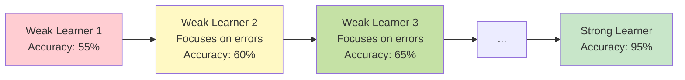

---

## Theory and Fundamentals

### The Bias Problem

High-bias models (like shallow decision trees) suffer from:
- **Underfitting**: Too simple to capture complex patterns
- **Systematic errors**: Consistently wrong in the same way
- **Poor training accuracy**: Can't even fit training data well

### Sequential Learning Architecture

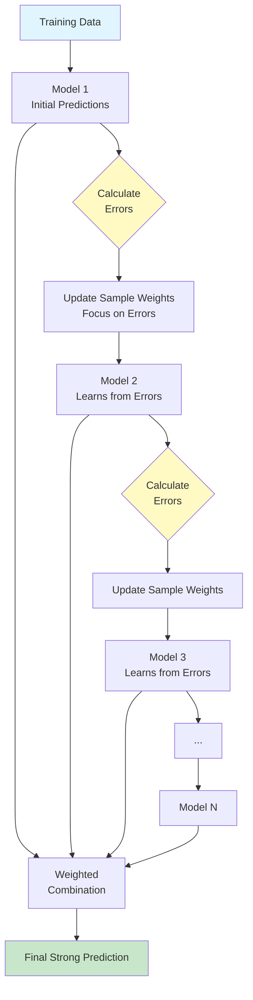

**Key Difference from Bagging:**
- **Bagging**: All models independent, train in parallel
- **Boosting**: Each model depends on previous, train sequentially

### Adaptive Weighting

Boosting uses two types of weights:

**1. Sample Weights:**
- Initially uniform: wᵢ = 1/N
- Increased for misclassified samples
- Decreased for correctly classified samples
- Next model focuses on high-weight samples

**2. Model Weights:**
- Based on model accuracy
- Higher weight for better models
- Used in final weighted combination

### Bias-Variance Tradeoff

**Boosting's Effect:**
- **Bias**: ↓ Significantly reduced (main benefit)
- **Variance**: → Can increase (risk of overfitting)
- **Overall Error**: ↓ Reduced when properly tuned

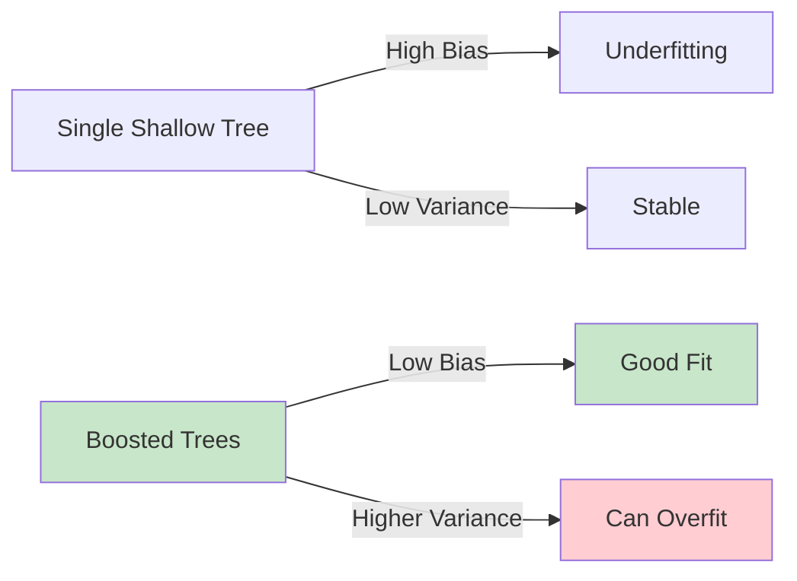

**When Boosting Works Best:**
- Base learner has high bias (shallow trees, stumps)
- Base learner has low variance
- Want to squeeze maximum performance
- Have clean data (boosting sensitive to noise/outliers)

---

## Bias Reduction Mechanism

### How Boosting Reduces Bias

**Intuition:** Each model corrects systematic errors of the ensemble so far.

**Example:**
```
True labels:    [1, 1, 0, 0, 1, 0]
Model 1 pred:   [1, 0, 0, 1, 1, 0]  # 67% accuracy
Errors:         [✓, ✗, ✓, ✗, ✓, ✓]

# Focus on errors (samples 2, 4)
Model 2 pred:   [1, 1, 0, 0, 1, 0]  # Learns to fix these
Combined:       [1, 1, 0, 0, 1, 0]  # 100% accuracy!
```

### Mathematical Framework

**Additive Model:**
```
F(x) = f₀(x) + α₁f₁(x) + α₂f₂(x) + ... + αₘfₘ(x)
```

Where:
- F(x): Final ensemble prediction
- fₘ(x): m-th weak learner
- αₘ: Weight of m-th model

**Sequential Optimization:**
```
Fₘ(x) = Fₘ₋₁(x) + αₘfₘ(x)
```

Each new model minimizes:
```
Loss = Σ L(yᵢ, Fₘ₋₁(xᵢ) + αₘfₘ(xᵢ))
```

### Forward Stagewise Additive Modeling

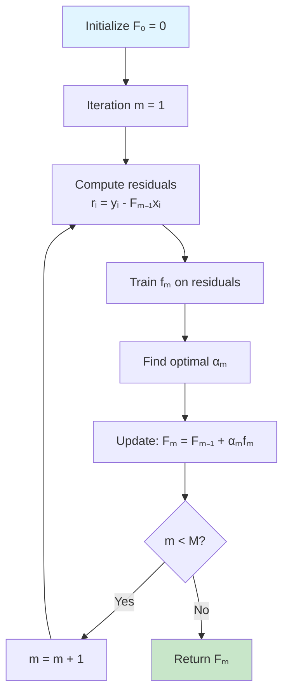

---

## AdaBoost

### Algorithm Overview

**AdaBoost (Adaptive Boosting)** was the first practical boosting algorithm. It adjusts weights adaptively based on errors.

**Key Idea:**
- Maintain sample weights
- Misclassified samples get higher weights
- Next model focuses on high-weight (hard) samples

### AdaBoost Algorithm

```
Input: Training data (X, y), M weak learners

1. Initialize sample weights: wᵢ = 1/N for all i

2. For m = 1 to M:
   a. Train weak learner fₘ using sample weights wᵢ

   b. Compute weighted error:
      εₘ = Σ wᵢ · I(yᵢ ≠ fₘ(xᵢ)) / Σ wᵢ

   c. Compute model weight:
      αₘ = 0.5 · ln((1 - εₘ) / εₘ)

   d. Update sample weights:
      wᵢ ← wᵢ · exp(αₘ · I(yᵢ ≠ fₘ(xᵢ)))

   e. Normalize weights: wᵢ ← wᵢ / Σ wᵢ

3. Final prediction:
   F(x) = sign(Σ αₘ · fₘ(x))
```

### AdaBoost Weight Update Flow

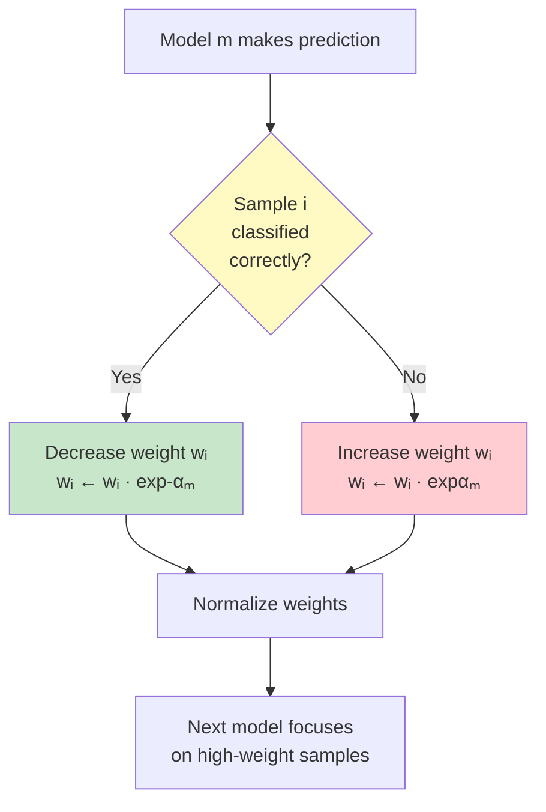

### Mathematical Formulation

**Exponential Loss Function:**
```
L(y, f(x)) = exp(-y · f(x))
```

Where y ∈ {-1, +1} and f(x) is the ensemble prediction.

**Model Weight (Alpha):**
```
αₘ = 0.5 · ln((1 - εₘ) / εₘ)
```

**Properties of α:**
- If εₘ = 0 (perfect): αₘ → ∞ (very high weight)
- If εₘ = 0.5 (random): αₘ = 0 (no weight)
- If εₘ = 1 (wrong): αₘ → -∞ (negative weight)

**Sample Weight Update:**
```
wᵢ^(m+1) = wᵢ^(m) · exp(αₘ · I(yᵢ ≠ fₘ(xᵢ)))
```

Simplifies to:
- Correct prediction: wᵢ^(m+1) = wᵢ^(m) · exp(-αₘ)
- Wrong prediction: wᵢ^(m+1) = wᵢ^(m) · exp(αₘ)

### AdaBoost Example

**Dataset:**
```
X = [1, 2, 3, 4, 5]
y = [+1, +1, -1, -1, -1]
```

**Iteration 1:**
```
Initial weights: w = [0.2, 0.2, 0.2, 0.2, 0.2]

Model 1: Simple threshold at x = 2.5
  Prediction: [+1, +1, -1, -1, -1]
  Correct: [✓, ✓, ✓, ✓, ✓]

Error ε₁ = 0 → α₁ = ∞ (perfect model, stop!)
```

**More Realistic Example:**
```
Model 1 prediction: [+1, +1, +1, -1, -1]
Correct: [✓, ✓, ✗, ✓, ✓]

Weighted error: ε₁ = 0.2 / 1.0 = 0.2
Alpha: α₁ = 0.5 · ln(0.8/0.2) = 0.693

Weight updates:
  Sample 3 (wrong): w₃ = 0.2 · exp(0.693) = 0.4
  Others (correct): wᵢ = 0.2 · exp(-0.693) = 0.1

Normalized: w = [0.143, 0.143, 0.571, 0.143, 0.143]
# Sample 3 now has 4x weight!
```

### AdaBoost Implementation

```python
import numpy as np
from sklearn.tree import DecisionTreeClassifier

class AdaBoostClassifier:
    """AdaBoost Implementation from Scratch"""

    def __init__(self, n_estimators=50, learning_rate=1.0):
        self.n_estimators = n_estimators
        self.learning_rate = learning_rate
        self.models = []
        self.alphas = []

    def fit(self, X, y):
        """Train AdaBoost"""
        n_samples = X.shape[0]

        # Initialize weights
        weights = np.ones(n_samples) / n_samples

        # Convert labels to {-1, +1}
        y_encoded = np.where(y == 0, -1, 1)

        for m in range(self.n_estimators):
            # Train weak learner (decision stump)
            model = DecisionTreeClassifier(max_depth=1, random_state=m)
            model.fit(X, y, sample_weight=weights)

            # Predictions
            predictions = model.predict(X)
            predictions_encoded = np.where(predictions == 0, -1, 1)

            # Calculate weighted error
            incorrect = (predictions_encoded != y_encoded)
            error = np.sum(weights * incorrect) / np.sum(weights)

            # Prevent division by zero
            error = np.clip(error, 1e-10, 1 - 1e-10)

            # Calculate model weight (alpha)
            alpha = self.learning_rate * 0.5 * np.log((1 - error) / error)

            # Update sample weights
            weights *= np.exp(alpha * incorrect)
            weights /= np.sum(weights)  # Normalize

            # Store model and alpha
            self.models.append(model)
            self.alphas.append(alpha)

        return self

    def predict(self, X):
        """Make predictions"""
        # Get weighted sum of predictions
        ensemble_pred = np.zeros(X.shape[0])

        for alpha, model in zip(self.alphas, self.models):
            pred = model.predict(X)
            pred_encoded = np.where(pred == 0, -1, 1)
            ensemble_pred += alpha * pred_encoded

        # Return final prediction
        return np.where(ensemble_pred >= 0, 1, 0)

    def staged_predict(self, X):
        """Return predictions at each stage"""
        ensemble_pred = np.zeros(X.shape[0])
        predictions = []

        for alpha, model in zip(self.alphas, self.models):
            pred = model.predict(X)
            pred_encoded = np.where(pred == 0, -1, 1)
            ensemble_pred += alpha * pred_encoded
            predictions.append(np.where(ensemble_pred >= 0, 1, 0))

        return predictions


# Example usage
from sklearn.datasets import make_classification
from sklearn.model_selection import train_test_split
from sklearn.metrics import accuracy_score

X, y = make_classification(n_samples=1000, n_features=20,
                           n_informative=15, random_state=42)
X_train, X_test, y_train, y_test = train_test_split(
    X, y, test_size=0.2, random_state=42
)

# Train AdaBoost
ada = AdaBoostClassifier(n_estimators=50, learning_rate=1.0)
ada.fit(X_train, y_train)

# Predict
y_pred = ada.predict(X_test)
print(f"Test Accuracy: {accuracy_score(y_test, y_pred):.4f}")

# Staged predictions (performance over iterations)
staged_preds = ada.staged_predict(X_test)
for i, pred in enumerate(staged_preds[::10]):  # Every 10 iterations
    acc = accuracy_score(y_test, pred)
    print(f"After {(i+1)*10} models: {acc:.4f}")
```

### AdaBoost Advantages and Limitations

**Advantages:**
- Simple to implement and understand
- Few hyperparameters to tune
- Works well with weak learners (stumps)
- Provides feature importance
- Fast training (shallow trees)

**Limitations:**
- Sensitive to noisy data and outliers
- Can overfit with too many iterations
- Exponential loss sensitive to mislabeled data
- Performs worse than Gradient Boosting on some datasets

---

## Gradient Boosting

### Algorithm Overview

**Gradient Boosting** is a generalization of AdaBoost that can optimize any differentiable loss function. Instead of adjusting sample weights, it fits new models to the **residuals** (errors) of previous models.

**Key Idea:**
- View boosting as gradient descent in function space
- Each new model approximates the negative gradient of loss
- Use any differentiable loss function (not just exponential)

### Gradient Boosting vs AdaBoost

| Aspect | AdaBoost | Gradient Boosting |
|--------|----------|-------------------|
| Weight Adjustment | Sample weights | No weights |
| Target | Original labels | Residuals |
| Loss Function | Exponential (fixed) | Any differentiable |
| Sensitivity to Outliers | High | Lower |
| Generality | Specific | General framework |

### Gradient Boosting Algorithm

```
Input: Training data (X, y), loss function L, M iterations

1. Initialize model with constant:
   F₀(x) = argmin_γ Σ L(yᵢ, γ)

2. For m = 1 to M:
   a. Compute pseudo-residuals:
      rᵢₘ = -[∂L(yᵢ, F(xᵢ))/∂F(xᵢ)]_{F=Fₘ₋₁}

   b. Fit regression tree fₘ to residuals rᵢₘ

   c. Compute optimal step size:
      γₘ = argmin_γ Σ L(yᵢ, Fₘ₋₁(xᵢ) + γ·fₘ(xᵢ))

   d. Update model:
      Fₘ(x) = Fₘ₋₁(x) + η·γₘ·fₘ(x)
      # η is learning rate

3. Return Fₘ(x)
```

### Residual Learning

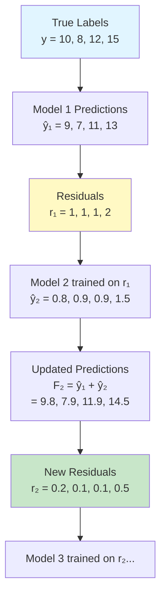

### Mathematical Framework

**Loss Functions:**

**1. Squared Error (Regression):**
```
L(y, F(x)) = (y - F(x))²

Gradient: ∂L/∂F = -2(y - F(x)) = -2 · residual
```

**2. Absolute Error (Regression):**
```
L(y, F(x)) = |y - F(x)|

Gradient: ∂L/∂F = -sign(y - F(x))
```

**3. Log Loss (Classification):**
```
L(y, F(x)) = log(1 + exp(-y·F(x)))

Gradient: ∂L/∂F = -y / (1 + exp(y·F(x)))
```

**Gradient Descent in Function Space:**

Instead of updating parameters θ:
```
θₘ = θₘ₋₁ - η·∇Loss(θₘ₋₁)
```

Update function F:
```
Fₘ(x) = Fₘ₋₁(x) - η·[∂Loss/∂F]
       = Fₘ₋₁(x) + η·fₘ(x)
```

Where fₘ approximates the negative gradient.

### Gradient Boosting for Regression

```python
import numpy as np
from sklearn.tree import DecisionTreeRegressor

class GradientBoostingRegressor:
    """Gradient Boosting for Regression from Scratch"""

    def __init__(self, n_estimators=100, learning_rate=0.1,
                 max_depth=3, min_samples_split=2):
        self.n_estimators = n_estimators
        self.learning_rate = learning_rate
        self.max_depth = max_depth
        self.min_samples_split = min_samples_split
        self.trees = []
        self.init_pred = None

    def fit(self, X, y):
        """Train Gradient Boosting"""
        # Initialize with mean
        self.init_pred = np.mean(y)
        predictions = np.full(y.shape[0], self.init_pred)

        for m in range(self.n_estimators):
            # Compute residuals (negative gradient for squared loss)
            residuals = y - predictions

            # Fit tree to residuals
            tree = DecisionTreeRegressor(
                max_depth=self.max_depth,
                min_samples_split=self.min_samples_split,
                random_state=m
            )
            tree.fit(X, residuals)

            # Update predictions
            update = self.learning_rate * tree.predict(X)
            predictions += update

            # Store tree
            self.trees.append(tree)

        return self

    def predict(self, X):
        """Make predictions"""
        # Start with initial prediction
        predictions = np.full(X.shape[0], self.init_pred)

        # Add contributions from all trees
        for tree in self.trees:
            predictions += self.learning_rate * tree.predict(X)

        return predictions

    def staged_predict(self, X):
        """Predictions at each stage"""
        predictions = np.full(X.shape[0], self.init_pred)
        staged = []

        for tree in self.trees:
            predictions += self.learning_rate * tree.predict(X)
            staged.append(predictions.copy())

        return staged


# Example usage
from sklearn.datasets import make_regression
from sklearn.metrics import mean_squared_error, r2_score

X, y = make_regression(n_samples=1000, n_features=20,
                       noise=10, random_state=42)
X_train, X_test, y_train, y_test = train_test_split(
    X, y, test_size=0.2, random_state=42
)

# Train
gb = GradientBoostingRegressor(
    n_estimators=100,
    learning_rate=0.1,
    max_depth=3
)
gb.fit(X_train, y_train)

# Predict
y_pred = gb.predict(X_test)
print(f"Test MSE: {mean_squared_error(y_test, y_pred):.4f}")
print(f"Test R²: {r2_score(y_test, y_pred):.4f}")

# Staged performance
staged = gb.staged_predict(X_test)
for i, pred in enumerate(staged[::20]):  # Every 20 iterations
    mse = mean_squared_error(y_test, pred)
    r2 = r2_score(y_test, pred)
    print(f"After {(i+1)*20} trees: MSE={mse:.4f}, R²={r2:.4f}")
```

### Learning Rate (Shrinkage)

The learning rate η controls the contribution of each tree:

```
Fₘ(x) = Fₘ₋₁(x) + η · fₘ(x)
```

**Effects:**
- **η = 1.0**: Full steps (fast but can overfit)
- **η = 0.1**: Slower learning (more robust, better generalization)
- **η = 0.01**: Very slow (requires more trees)

**Trade-off:**
```
Lower η → Need more trees → Longer training → Better generalization
Higher η → Need fewer trees → Faster training → Risk of overfitting
```

**Recommended:**
- Start with η = 0.1
- Increase n_estimators if underfitting
- Decrease η if overfitting

---

## XGBoost

### Algorithm Overview

**XGBoost (Extreme Gradient Boosting)** is an optimized implementation of gradient boosting with several key innovations:

**Key Features:**
1. Regularization (L1 and L2)
2. Tree pruning (max_depth, gamma)
3. Parallel tree construction
4. Handling of missing values
5. Built-in cross-validation
6. Early stopping

### XGBoost Objective Function

**Objective to Minimize:**
```
Obj = Σ L(yᵢ, ŷᵢ) + Σ Ω(fₘ)
      Loss         Regularization
```

**Regularization Term:**
```
Ω(f) = γT + (λ/2)Σ wⱼ² + α Σ |wⱼ|
       ↑    ↑            ↑
       complexity  L2 reg      L1 reg
```

Where:
- T: Number of leaves
- wⱼ: Leaf weights
- γ: Minimum loss reduction to create new split
- λ: L2 regularization parameter
- α: L1 regularization parameter

### Second-Order Approximation

XGBoost uses second-order Taylor expansion for faster convergence:

```
L(yᵢ, ŷᵢ⁽ᵗ⁾) ≈ L(yᵢ, ŷᵢ⁽ᵗ⁻¹⁾) + gᵢfₜ(xᵢ) + (1/2)hᵢfₜ²(xᵢ)
```

Where:
- gᵢ: First-order gradient
- hᵢ: Second-order gradient (Hessian)

**Advantage:** Uses curvature information for better optimization.

### Tree Construction Algorithm

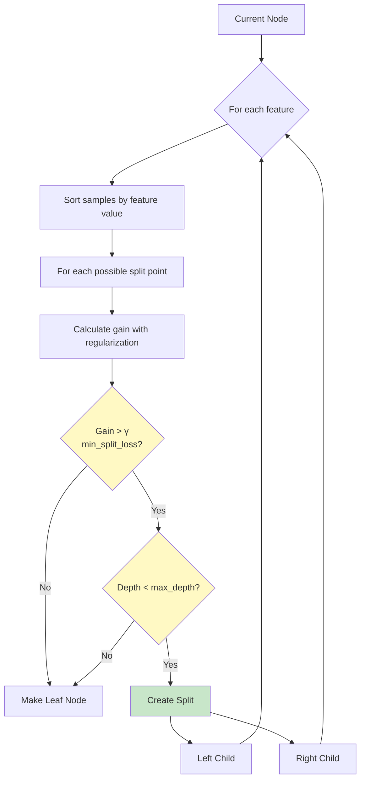

**Split Gain Calculation:**
```
Gain = (GL²/(HL + λ) + GR²/(HR + λ) - (GL+GR)²/(HL+HR + λ))/2 - γ
```

Where:
- GL, GR: Sum of gradients in left/right child
- HL, HR: Sum of hessians in left/right child
- γ: Minimum loss reduction (complexity penalty)

### XGBoost Implementation

```python
import xgboost as xgb
from sklearn.datasets import make_classification
from sklearn.model_selection import train_test_split, cross_val_score
from sklearn.metrics import accuracy_score, log_loss
import numpy as np

# Generate data
X, y = make_classification(
    n_samples=1000, n_features=20, n_informative=15,
    n_classes=2, random_state=42
)

X_train, X_test, y_train, y_test = train_test_split(
    X, y, test_size=0.2, random_state=42
)

# XGBoost Classifier
xgb_clf = xgb.XGBClassifier(
    n_estimators=100,           # Number of boosting rounds
    learning_rate=0.1,          # Shrinkage (eta)
    max_depth=6,                # Maximum tree depth
    min_child_weight=1,         # Minimum sum of instance weight in child
    gamma=0,                    # Minimum loss reduction for split
    subsample=0.8,              # Subsample ratio of training data
    colsample_bytree=0.8,       # Subsample ratio of features
    reg_alpha=0,                # L1 regularization
    reg_lambda=1,               # L2 regularization
    objective='binary:logistic',
    eval_metric='logloss',
    random_state=42
)

# Train with evaluation set
xgb_clf.fit(
    X_train, y_train,
    eval_set=[(X_train, y_train), (X_test, y_test)],
    eval_metric=['logloss', 'error'],
    early_stopping_rounds=10,
    verbose=True
)

# Predictions
y_pred = xgb_clf.predict(X_test)
y_pred_proba = xgb_clf.predict_proba(X_test)

print(f"\nTest Accuracy: {accuracy_score(y_test, y_pred):.4f}")
print(f"Test Log Loss: {log_loss(y_test, y_pred_proba):.4f}")

# Feature importance
importance = xgb_clf.feature_importances_
print(f"\nTop 5 Important Features:")
top_indices = np.argsort(importance)[::-1][:5]
for i, idx in enumerate(top_indices):
    print(f"{i+1}. Feature {idx}: {importance[idx]:.4f}")

# Best iteration (with early stopping)
print(f"\nBest iteration: {xgb_clf.best_iteration}")
print(f"Best score: {xgb_clf.best_score:.4f}")
```

### XGBoost for Regression

```python
# XGBoost Regressor
from sklearn.datasets import make_regression
from sklearn.metrics import mean_squared_error, r2_score

X_reg, y_reg = make_regression(
    n_samples=1000, n_features=20, noise=10, random_state=42
)
X_train, X_test, y_train, y_test = train_test_split(
    X_reg, y_reg, test_size=0.2, random_state=42
)

xgb_reg = xgb.XGBRegressor(
    n_estimators=100,
    learning_rate=0.1,
    max_depth=6,
    min_child_weight=1,
    gamma=0,
    subsample=0.8,
    colsample_bytree=0.8,
    reg_alpha=0,
    reg_lambda=1,
    objective='reg:squarederror',
    random_state=42
)

xgb_reg.fit(
    X_train, y_train,
    eval_set=[(X_train, y_train), (X_test, y_test)],
    eval_metric='rmse',
    early_stopping_rounds=10,
    verbose=False
)

y_pred = xgb_reg.predict(X_test)
print(f"Test MSE: {mean_squared_error(y_test, y_pred):.4f}")
print(f"Test R²: {r2_score(y_test, y_pred):.4f}")
```

### XGBoost Advanced Features

**1. Custom Objective Function:**
```python
def custom_objective(y_true, y_pred):
    """Custom loss function"""
    # Calculate gradients
    grad = y_pred - y_true
    # Calculate hessians
    hess = np.ones_like(y_true)
    return grad, hess

xgb_clf = xgb.XGBClassifier(objective=custom_objective)
```

**2. Handling Missing Values:**
```python
# XGBoost automatically learns best direction for missing values
X_with_missing = X.copy()
X_with_missing[X_with_missing > 0.5] = np.nan

xgb_clf = xgb.XGBClassifier()
xgb_clf.fit(X_with_missing, y)  # Handles NaN automatically
```

**3. Feature Interaction Constraints:**
```python
# Force features to interact only within specified groups
interaction_constraints = [[0, 1, 2], [3, 4, 5], [6, 7, 8]]
xgb_clf = xgb.XGBClassifier(interaction_constraints=interaction_constraints)
```

**4. Monotonic Constraints:**
```python
# Force feature to have monotonic relationship
# 1: increasing, -1: decreasing, 0: no constraint
monotone_constraints = [1, 0, -1, 0, 1]
xgb_clf = xgb.XGBClassifier(monotone_constraints=monotone_constraints)
```

---

## LightGBM

### Algorithm Overview

**LightGBM (Light Gradient Boosting Machine)** by Microsoft is designed for speed and efficiency, especially on large datasets.

**Key Innovations:**
1. **Gradient-based One-Side Sampling (GOSS)**
2. **Exclusive Feature Bundling (EFB)**
3. **Leaf-wise tree growth** (vs level-wise)
4. **Histogram-based splitting**

### GOSS (Gradient-based One-Side Sampling)

**Problem:** Large datasets slow down training.

**Solution:** Keep all large-gradient samples, randomly sample small-gradient samples.

**Intuition:** Samples with larger gradients contribute more to information gain.

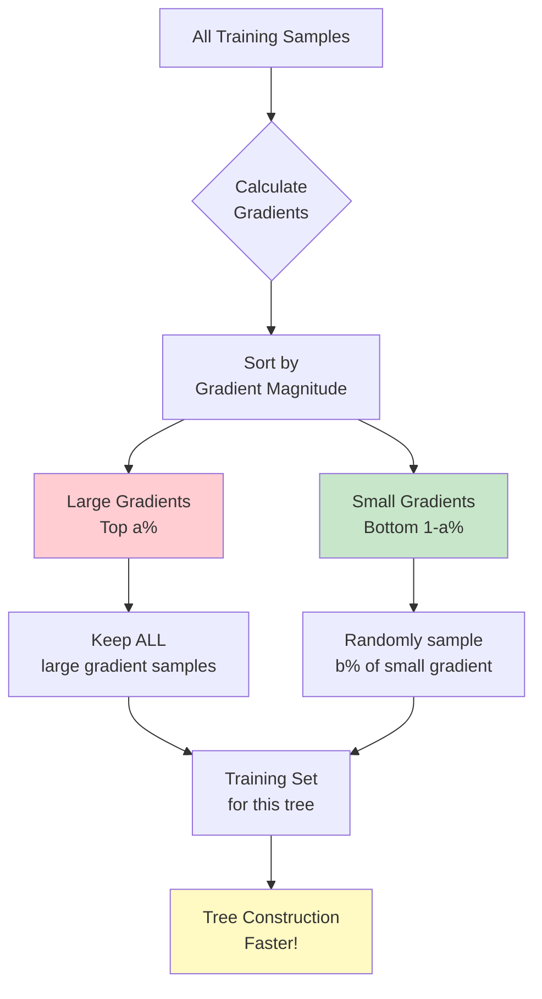

**GOSS Algorithm:**
```
1. Sort samples by absolute gradient
2. Keep top a% (e.g., 20%) with large gradients
3. Randomly sample b% (e.g., 10%) from remaining
4. Multiply small gradient samples by (1-a)/b for unbiased estimation
5. Use this subset to build tree
```

**Advantage:** Reduce data size while maintaining accuracy.

### EFB (Exclusive Feature Bundling)

**Problem:** High-dimensional sparse data has many mutually exclusive features.

**Solution:** Bundle mutually exclusive features together.

**Example:**
```
Feature 1: [1, 0, 0, 2, 0]
Feature 2: [0, 3, 0, 0, 4]
Feature 3: [0, 0, 5, 0, 0]

Bundled: [1, 3, 5, 2, 4]  # Only one feature!
```

**Advantage:** Reduce number of features without information loss.

### Leaf-wise vs Level-wise Growth

**Level-wise (XGBoost):**
- Splits all nodes at same depth
- Balanced tree structure
- Can waste computation on low-gain splits

**Leaf-wise (LightGBM):**
- Splits leaf with maximum gain
- Unbalanced tree structure
- More efficient, converges faster

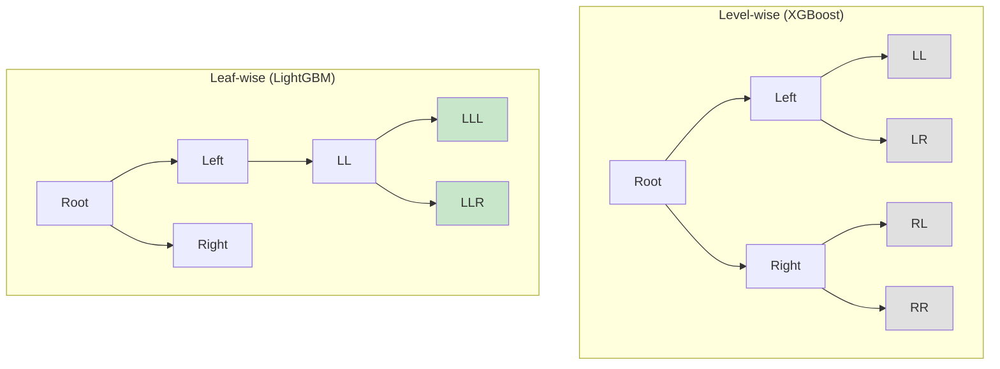

**Warning:** Leaf-wise can overfit on small datasets. Use `num_leaves` carefully.

### LightGBM Implementation

```python
import lightgbm as lgb
from sklearn.datasets import make_classification
from sklearn.model_selection import train_test_split
from sklearn.metrics import accuracy_score, log_loss

# Generate data
X, y = make_classification(
    n_samples=10000, n_features=100, n_informative=80,
    n_classes=2, random_state=42
)

X_train, X_test, y_train, y_test = train_test_split(
    X, y, test_size=0.2, random_state=42
)

# LightGBM Classifier
lgb_clf = lgb.LGBMClassifier(
    n_estimators=100,
    learning_rate=0.1,
    num_leaves=31,              # Max leaves (2^max_depth - 1)
    max_depth=-1,               # No limit (controlled by num_leaves)
    min_child_samples=20,       # Minimum samples in leaf
    subsample=0.8,              # Bagging fraction
    subsample_freq=5,           # Bagging frequency
    colsample_bytree=0.8,       # Feature fraction
    reg_alpha=0,                # L1 regularization
    reg_lambda=0,               # L2 regularization
    min_split_gain=0,           # Minimum gain to split
    objective='binary',
    metric='binary_logloss',
    boosting_type='gbdt',       # 'gbdt', 'dart', 'goss', 'rf'
    random_state=42,
    verbose=-1
)

# Train with evaluation
lgb_clf.fit(
    X_train, y_train,
    eval_set=[(X_train, y_train), (X_test, y_test)],
    eval_metric=['binary_logloss', 'binary_error'],
    callbacks=[lgb.early_stopping(stopping_rounds=10)]
)

# Predictions
y_pred = lgb_clf.predict(X_test)
y_pred_proba = lgb_clf.predict_proba(X_test)

print(f"Test Accuracy: {accuracy_score(y_test, y_pred):.4f}")
print(f"Test Log Loss: {log_loss(y_test, y_pred_proba):.4f}")

# Feature importance
importance = lgb_clf.feature_importances_
print(f"\nTop 5 Important Features:")
top_indices = np.argsort(importance)[::-1][:5]
for i, idx in enumerate(top_indices):
    print(f"{i+1}. Feature {idx}: {importance[idx]}")
```

### LightGBM with Native API

```python
# Create LightGBM datasets
train_data = lgb.Dataset(X_train, label=y_train)
test_data = lgb.Dataset(X_test, label=y_test, reference=train_data)

# Parameters
params = {
    'objective': 'binary',
    'metric': 'binary_logloss',
    'boosting_type': 'gbdt',
    'num_leaves': 31,
    'learning_rate': 0.1,
    'feature_fraction': 0.8,
    'bagging_fraction': 0.8,
    'bagging_freq': 5,
    'verbose': -1
}

# Train with callbacks
callbacks = [
    lgb.early_stopping(stopping_rounds=10),
    lgb.log_evaluation(period=20)
]

bst = lgb.train(
    params,
    train_data,
    num_boost_round=100,
    valid_sets=[train_data, test_data],
    valid_names=['train', 'test'],
    callbacks=callbacks
)

# Predict
y_pred_proba = bst.predict(X_test)
y_pred = (y_pred_proba > 0.5).astype(int)

print(f"Test Accuracy: {accuracy_score(y_test, y_pred):.4f}")
```

### LightGBM Speed Optimizations

**1. Categorical Features:**
```python
# LightGBM handles categorical features natively
categorical_features = [0, 5, 10]  # Indices of categorical features

lgb_clf = lgb.LGBMClassifier(categorical_feature=categorical_features)
lgb_clf.fit(X_train, y_train)

# Or with native API
train_data = lgb.Dataset(
    X_train, label=y_train,
    categorical_feature=categorical_features
)
```

**2. GPU Acceleration:**
```python
lgb_clf = lgb.LGBMClassifier(device='gpu', gpu_platform_id=0, gpu_device_id=0)
```

**3. Parallel Training:**
```python
lgb_clf = lgb.LGBMClassifier(n_jobs=-1)  # Use all CPU cores
```

---

## CatBoost

### Algorithm Overview

**CatBoost (Categorical Boosting)** by Yandex excels at handling categorical features and resistant to overfitting.

**Key Innovations:**
1. **Ordered Boosting** (reduces target leakage)
2. **Symmetric Trees** (balanced, faster inference)
3. **Native categorical feature handling**
4. **Robust to hyperparameters**

### Ordered Boosting

**Problem:** Gradient-based boosting can have **target leakage** (prediction shift).

**Target Leakage Example:**
```
Model trained on samples 1-1000
Predicting on sample 500 (used in training)
→ Overly optimistic gradient
→ Overfitting
```

**Solution:** Use different subsets for gradient calculation and model training.

**Ordered Boosting Algorithm:**
```
For each sample i:
  1. Train model on samples before i: {1, ..., i-1}
  2. Calculate gradient using this model
  3. Use this gradient for training
```

**Advantage:** Unbiased gradient estimates, less overfitting.

### Symmetric Trees

CatBoost grows **symmetric (oblivious) trees**: same split condition at all nodes of the same depth.

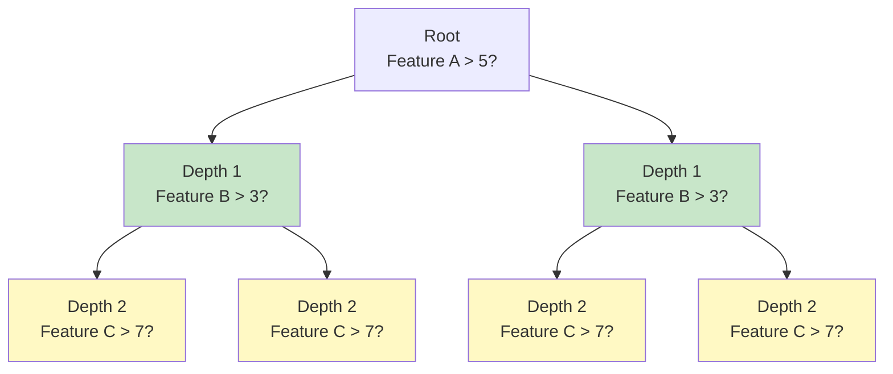

**Advantages:**
- Faster inference (index-based lookup)
- Better regularization (fewer parameters)
- Easier to interpret

**Disadvantage:**
- Less flexible than asymmetric trees

### Categorical Feature Handling

CatBoost handles categorical features natively without encoding:

**Method:** Target Statistics (TS)

**Algorithm:**
```
For categorical feature c with value v:
  TS(c, v) = (countInClass(c=v) + prior) / (count(c=v) + 1)
```

**Example:**
```
Feature: City
Values: NYC, SF, LA

Target = 1 count:
  NYC: 80/100 = 0.80
  SF:  40/60  = 0.67
  LA:  10/40  = 0.25

Target encoding:
  NYC → 0.80
  SF  → 0.67
  LA  → 0.25
```

**Advantage:** Captures relationship between categorical value and target.

### CatBoost Implementation

```python
from catboost import CatBoostClassifier, CatBoostRegressor, Pool
from sklearn.datasets import make_classification
from sklearn.model_selection import train_test_split
from sklearn.metrics import accuracy_score

# Generate data
X, y = make_classification(
    n_samples=1000, n_features=20, n_informative=15,
    n_classes=2, random_state=42
)

X_train, X_test, y_train, y_test = train_test_split(
    X, y, test_size=0.2, random_state=42
)

# CatBoost Classifier
cat_clf = CatBoostClassifier(
    iterations=100,             # Number of trees
    learning_rate=0.1,
    depth=6,                    # Tree depth
    l2_leaf_reg=3,              # L2 regularization
    border_count=32,            # Splits for numerical features
    loss_function='Logloss',
    eval_metric='Accuracy',
    random_seed=42,
    verbose=False
)

# Train with evaluation
cat_clf.fit(
    X_train, y_train,
    eval_set=(X_test, y_test),
    early_stopping_rounds=10,
    verbose=False
)

# Predictions
y_pred = cat_clf.predict(X_test)
y_pred_proba = cat_clf.predict_proba(X_test)

print(f"Test Accuracy: {accuracy_score(y_test, y_pred):.4f}")

# Feature importance
importance = cat_clf.get_feature_importance()
print(f"\nTop 5 Important Features:")
top_indices = np.argsort(importance)[::-1][:5]
for i, idx in enumerate(top_indices):
    print(f"{i+1}. Feature {idx}: {importance[idx]:.4f}")
```

### CatBoost with Categorical Features

```python
import pandas as pd
import numpy as np
from catboost import CatBoostClassifier, Pool

# Create dataset with categorical features
data = pd.DataFrame({
    'numerical_1': np.random.randn(1000),
    'numerical_2': np.random.randn(1000),
    'category_1': np.random.choice(['A', 'B', 'C'], 1000),
    'category_2': np.random.choice(['X', 'Y', 'Z', 'W'], 1000),
    'target': np.random.randint(0, 2, 1000)
})

# Split
X = data.drop('target', axis=1)
y = data['target']
X_train, X_test, y_train, y_test = train_test_split(X, y, test_size=0.2)

# Specify categorical features
cat_features = ['category_1', 'category_2']

# Create Pool objects (CatBoost's data structure)
train_pool = Pool(X_train, y_train, cat_features=cat_features)
test_pool = Pool(X_test, y_test, cat_features=cat_features)

# Train with categorical features
cat_clf = CatBoostClassifier(
    iterations=100,
    learning_rate=0.1,
    depth=6,
    verbose=False
)

cat_clf.fit(train_pool, eval_set=test_pool, early_stopping_rounds=10)

# Predictions
y_pred = cat_clf.predict(test_pool)
print(f"Test Accuracy: {accuracy_score(y_test, y_pred):.4f}")
```

### CatBoost Advanced Features

**1. Custom Loss Functions:**
```python
cat_clf = CatBoostClassifier(
    loss_function='Logloss',     # Binary classification
    # loss_function='MultiClass', # Multi-class
    # loss_function='RMSE',       # Regression
    # loss_function='MAE',        # Mean Absolute Error
)
```

**2. Class Weights:**
```python
# Handle imbalanced data
cat_clf = CatBoostClassifier(
    class_weights=[1, 5],  # Higher weight for minority class
    auto_class_weights='Balanced'  # Or automatic balancing
)
```

**3. GPU Training:**
```python
cat_clf = CatBoostClassifier(task_type='GPU', devices='0:1')
```

**4. Text Features:**
```python
# CatBoost can handle text natively
cat_clf = CatBoostClassifier(text_features=['description'])
```

---

## Algorithm Comparison

### Performance Comparison

| Algorithm | Speed | Accuracy | Categorical | Overfitting | Memory |
|-----------|-------|----------|-------------|-------------|---------|
| **AdaBoost** | ⭐⭐⭐ | ⭐⭐⭐ | ❌ | Medium | ⭐⭐⭐⭐ |
| **Gradient Boosting** | ⭐⭐ | ⭐⭐⭐⭐ | ❌ | Medium-High | ⭐⭐⭐ |
| **XGBoost** | ⭐⭐⭐⭐ | ⭐⭐⭐⭐⭐ | Needs Encoding | Medium | ⭐⭐⭐ |
| **LightGBM** | ⭐⭐⭐⭐⭐ | ⭐⭐⭐⭐⭐ | Needs Encoding | Medium | ⭐⭐⭐⭐⭐ |
| **CatBoost** | ⭐⭐⭐⭐ | ⭐⭐⭐⭐⭐ | ✅ Native | Low | ⭐⭐⭐⭐ |

### Feature Comparison

| Feature | AdaBoost | Gradient Boosting | XGBoost | LightGBM | CatBoost |
|---------|----------|-------------------|---------|----------|----------|
| Loss Functions | Exponential | Any | Any | Any | Any |
| Regularization | ❌ | ❌ | ✅ L1/L2 | ✅ L1/L2 | ✅ L2 |
| Missing Values | ❌ | ❌ | ✅ | ✅ | ✅ |
| Categorical | ❌ | ❌ | ❌ | ❌ | ✅ Native |
| Parallel Training | ❌ | ❌ | ✅ | ✅ | ✅ |
| GPU Support | ❌ | ❌ | ✅ | ✅ | ✅ |
| Early Stopping | ❌ | ✅ | ✅ | ✅ | ✅ |
| Tree Growth | Level | Level | Level | Leaf | Symmetric |

### When to Use Each

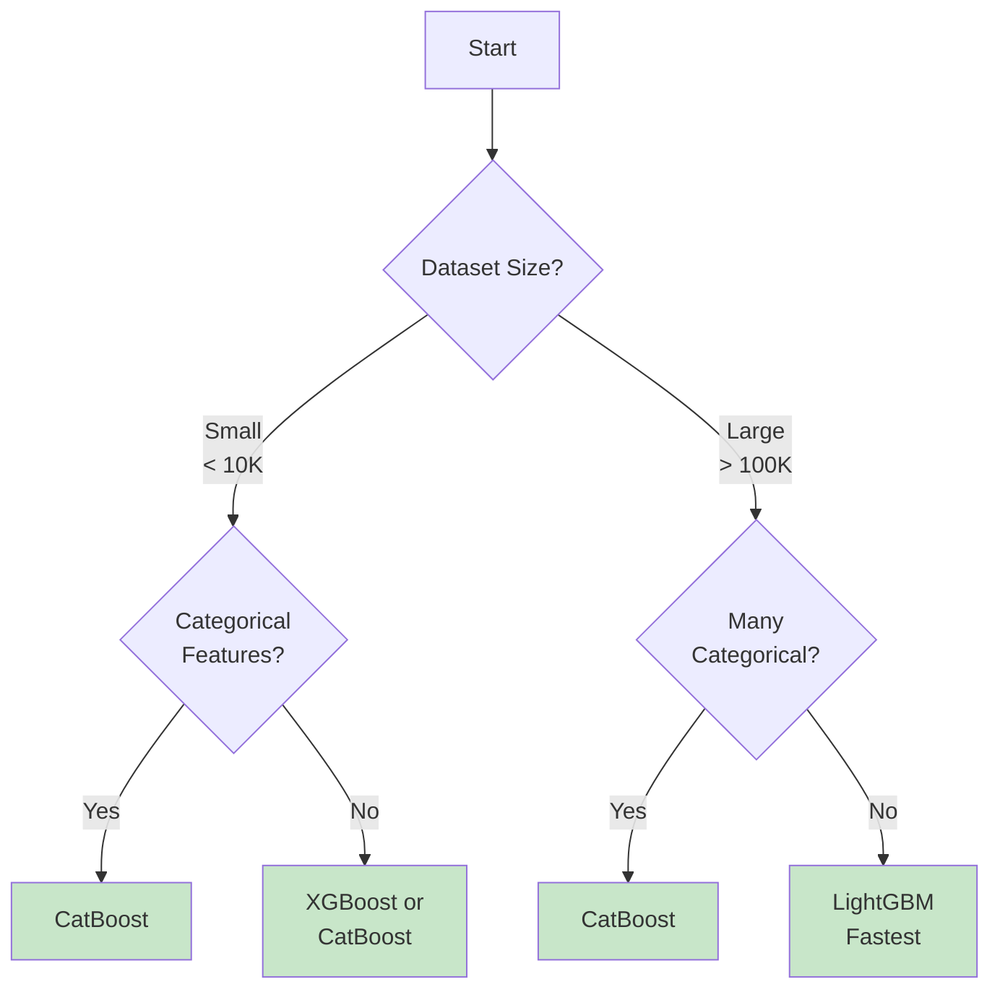

**Recommendation by Use Case:**

**1. Kaggle Competitions:**
- **XGBoost** or **LightGBM** (most popular)
- Often ensemble all three for best results

**2. Production Systems:**
- **LightGBM** (speed and memory efficiency)
- **CatBoost** (robustness and ease of use)

**3. Categorical-Heavy Data:**
- **CatBoost** (native handling)
- Avoid manual encoding overhead

**4. Real-time Inference:**
- **CatBoost** (symmetric trees, fast prediction)
- **LightGBM** (small model size)

**5. Interpretability:**
- **CatBoost** (symmetric trees easier to understand)
- **XGBoost** with SHAP values

### Benchmark Results

**Dataset:** 100K samples, 100 features, binary classification

| Algorithm | Train Time | Accuracy | Memory | Inference (ms) |
|-----------|------------|----------|--------|----------------|
| AdaBoost (50 trees) | 2.3s | 0.872 | 15 MB | 2.1 |
| Gradient Boosting (100 trees) | 15.7s | 0.891 | 45 MB | 5.3 |
| XGBoost (100 trees) | 3.8s | 0.903 | 38 MB | 3.2 |
| LightGBM (100 trees) | 1.9s | 0.905 | 22 MB | 1.8 |
| CatBoost (100 trees) | 5.2s | 0.904 | 35 MB | 1.5 |

**Notes:**
- LightGBM fastest training
- CatBoost fastest inference (symmetric trees)
- All modern boosting methods achieve similar accuracy
- XGBoost/LightGBM most popular in practice

---

## Implementation from Scratch

### Complete Gradient Boosting Classification

```python
import numpy as np
from sklearn.tree import DecisionTreeRegressor

class GradientBoostingClassifierFromScratch:
    """
    Gradient Boosting for Binary Classification from Scratch
    Uses log loss (logistic loss)
    """
    def __init__(self, n_estimators=100, learning_rate=0.1,
                 max_depth=3, min_samples_split=2):
        self.n_estimators = n_estimators
        self.learning_rate = learning_rate
        self.max_depth = max_depth
        self.min_samples_split = min_samples_split
        self.trees = []
        self.init_pred = None

    def _sigmoid(self, x):
        """Sigmoid function"""
        return 1 / (1 + np.exp(-np.clip(x, -500, 500)))

    def _log_loss_gradient(self, y_true, y_pred):
        """Gradient of log loss: -(y - p)"""
        return -(y_true - self._sigmoid(y_pred))

    def fit(self, X, y):
        """Train Gradient Boosting Classifier"""
        # Initialize with log-odds
        positive_class = np.sum(y) / len(y)
        self.init_pred = np.log(positive_class / (1 - positive_class + 1e-10))

        # Start with constant prediction
        predictions = np.full(y.shape[0], self.init_pred)

        for m in range(self.n_estimators):
            # Compute negative gradients (pseudo-residuals)
            gradients = -self._log_loss_gradient(y, predictions)

            # Fit tree to gradients
            tree = DecisionTreeRegressor(
                max_depth=self.max_depth,
                min_samples_split=self.min_samples_split,
                random_state=m
            )
            tree.fit(X, gradients)

            # Update predictions
            update = self.learning_rate * tree.predict(X)
            predictions += update

            # Store tree
            self.trees.append(tree)

        return self

    def predict_proba(self, X):
        """Predict class probabilities"""
        # Start with initial prediction
        raw_predictions = np.full(X.shape[0], self.init_pred)

        # Add tree contributions
        for tree in self.trees:
            raw_predictions += self.learning_rate * tree.predict(X)

        # Convert to probabilities
        proba_class_1 = self._sigmoid(raw_predictions)
        proba_class_0 = 1 - proba_class_1

        return np.column_stack([proba_class_0, proba_class_1])

    def predict(self, X):
        """Predict class labels"""
        proba = self.predict_proba(X)
        return (proba[:, 1] >= 0.5).astype(int)

    def staged_predict_proba(self, X):
        """Predictions at each stage"""
        raw_predictions = np.full(X.shape[0], self.init_pred)
        staged = []

        for tree in self.trees:
            raw_predictions += self.learning_rate * tree.predict(X)
            proba = self._sigmoid(raw_predictions)
            staged.append(np.column_stack([1 - proba, proba]))

        return staged


# Example usage
from sklearn.datasets import make_classification
from sklearn.model_selection import train_test_split
from sklearn.metrics import accuracy_score, log_loss, roc_auc_score

X, y = make_classification(
    n_samples=1000, n_features=20, n_informative=15,
    n_classes=2, random_state=42
)

X_train, X_test, y_train, y_test = train_test_split(
    X, y, test_size=0.2, random_state=42
)

# Train
gb_clf = GradientBoostingClassifierFromScratch(
    n_estimators=100,
    learning_rate=0.1,
    max_depth=3
)
gb_clf.fit(X_train, y_train)

# Predict
y_pred = gb_clf.predict(X_test)
y_pred_proba = gb_clf.predict_proba(X_test)

print(f"Test Accuracy: {accuracy_score(y_test, y_pred):.4f}")
print(f"Test Log Loss: {log_loss(y_test, y_pred_proba):.4f}")
print(f"Test ROC AUC: {roc_auc_score(y_test, y_pred_proba[:, 1]):.4f}")

# Performance over iterations
staged = gb_clf.staged_predict_proba(X_test)
print("\nAccuracy over iterations:")
for i, proba in enumerate(staged[::20]):  # Every 20 iterations
    pred = (proba[:, 1] >= 0.5).astype(int)
    acc = accuracy_score(y_test, pred)
    print(f"After {(i+1)*20} trees: {acc:.4f}")
```

---

## Implementation with Libraries

### Scikit-learn Gradient Boosting

```python
from sklearn.ensemble import GradientBoostingClassifier, GradientBoostingRegressor
from sklearn.datasets import make_classification
from sklearn.model_selection import train_test_split, cross_val_score
from sklearn.metrics import accuracy_score

# Generate data
X, y = make_classification(
    n_samples=1000, n_features=20, n_informative=15,
    random_state=42
)

X_train, X_test, y_train, y_test = train_test_split(
    X, y, test_size=0.2, random_state=42
)

# Gradient Boosting Classifier
gb_clf = GradientBoostingClassifier(
    n_estimators=100,
    learning_rate=0.1,
    max_depth=3,
    min_samples_split=2,
    min_samples_leaf=1,
    subsample=1.0,              # 1.0 = use all samples (no stochastic GB)
    max_features=None,          # None = use all features
    verbose=0,
    random_state=42
)

gb_clf.fit(X_train, y_train)
y_pred = gb_clf.predict(X_test)

print(f"Test Accuracy: {accuracy_score(y_test, y_pred):.4f}")

# Feature importance
importance = gb_clf.feature_importances_
print(f"\nTop 5 Important Features:")
top_idx = np.argsort(importance)[::-1][:5]
for i, idx in enumerate(top_idx):
    print(f"{i+1}. Feature {idx}: {importance[idx]:.4f}")

# Cross-validation
cv_scores = cross_val_score(gb_clf, X, y, cv=5, scoring='accuracy')
print(f"\n5-Fold CV: {cv_scores.mean():.4f} (+/- {cv_scores.std():.4f})")
```

### Comparing All Implementations

```python
from sklearn.ensemble import AdaBoostClassifier, GradientBoostingClassifier
import xgboost as xgb
import lightgbm as lgb
from catboost import CatBoostClassifier
from sklearn.metrics import accuracy_score
import time

# Dictionary of models
models = {
    'AdaBoost': AdaBoostClassifier(n_estimators=100, random_state=42),
    'Gradient Boosting': GradientBoostingClassifier(
        n_estimators=100, learning_rate=0.1, random_state=42
    ),
    'XGBoost': xgb.XGBClassifier(
        n_estimators=100, learning_rate=0.1, random_state=42
    ),
    'LightGBM': lgb.LGBMClassifier(
        n_estimators=100, learning_rate=0.1, random_state=42, verbose=-1
    ),
    'CatBoost': CatBoostClassifier(
        iterations=100, learning_rate=0.1, random_seed=42, verbose=False
    )
}

# Train and evaluate each
print("Model Comparison:")
print(f"{'Algorithm':<20} {'Train Time':<12} {'Test Acc':<10}")
print("-" * 45)

for name, model in models.items():
    # Time training
    start = time.time()
    model.fit(X_train, y_train)
    train_time = time.time() - start

    # Evaluate
    y_pred = model.predict(X_test)
    acc = accuracy_score(y_test, y_pred)

    print(f"{name:<20} {train_time:>8.3f}s    {acc:.4f}")
```

---

## Hyperparameter Tuning

### Key Hyperparameters

**1. n_estimators (Number of Trees)**
- More trees → Better performance (up to a point)
- Too many → Overfitting, slower training
- **Recommendation:** 100-1000, use early stopping

**2. learning_rate (Shrinkage)**
- Controls contribution of each tree
- Lower → Better generalization, needs more trees
- Higher → Faster training, risk overfitting
- **Recommendation:** 0.01-0.1

**3. max_depth (Tree Depth)**
- Controls tree complexity
- Deeper → More complex, risk overfitting
- Shallower → Simpler, risk underfitting
- **Recommendation:** 3-10 for boosting

**4. min_child_weight / min_samples_leaf**
- Minimum samples in leaf node
- Higher → More conservative
- **Recommendation:** 1-10

**5. subsample (Row Subsampling)**
- Fraction of samples to use per tree
- < 1.0 → Stochastic boosting, reduces overfitting
- **Recommendation:** 0.8-1.0

**6. colsample_bytree (Column Subsampling)**
- Fraction of features to use per tree
- < 1.0 → Reduces overfitting, adds diversity
- **Recommendation:** 0.8-1.0

**7. reg_alpha, reg_lambda (Regularization)**
- L1 and L2 regularization
- Higher → More regularization
- **Recommendation:** 0-10

### Grid Search Example

```python
from sklearn.model_selection import GridSearchCV
import xgboost as xgb

# Define parameter grid
param_grid = {
    'n_estimators': [50, 100, 200],
    'learning_rate': [0.01, 0.1, 0.3],
    'max_depth': [3, 5, 7],
    'min_child_weight': [1, 3, 5],
    'subsample': [0.8, 1.0],
    'colsample_bytree': [0.8, 1.0],
    'gamma': [0, 0.1, 0.2]
}

# Create model
xgb_clf = xgb.XGBClassifier(random_state=42)

# Grid search
grid_search = GridSearchCV(
    estimator=xgb_clf,
    param_grid=param_grid,
    cv=5,
    scoring='accuracy',
    n_jobs=-1,
    verbose=2
)

grid_search.fit(X_train, y_train)

# Best parameters
print("Best Parameters:")
print(grid_search.best_params_)
print(f"\nBest CV Score: {grid_search.best_score_:.4f}")

# Test with best model
best_model = grid_search.best_estimator_
y_pred = best_model.predict(X_test)
print(f"Test Accuracy: {accuracy_score(y_test, y_pred):.4f}")
```

### Randomized Search (Faster)

```python
from sklearn.model_selection import RandomizedSearchCV
from scipy.stats import randint, uniform

# Define parameter distributions
param_distributions = {
    'n_estimators': randint(50, 300),
    'learning_rate': uniform(0.01, 0.29),
    'max_depth': randint(3, 10),
    'min_child_weight': randint(1, 10),
    'subsample': uniform(0.7, 0.3),
    'colsample_bytree': uniform(0.7, 0.3),
    'gamma': uniform(0, 0.5),
    'reg_alpha': uniform(0, 1),
    'reg_lambda': uniform(0, 1)
}

# Randomized search
random_search = RandomizedSearchCV(
    estimator=xgb.XGBClassifier(random_state=42),
    param_distributions=param_distributions,
    n_iter=50,  # Number of parameter settings sampled
    cv=5,
    scoring='accuracy',
    n_jobs=-1,
    random_state=42,
    verbose=2
)

random_search.fit(X_train, y_train)

print("Best Parameters:")
print(random_search.best_params_)
print(f"\nBest CV Score: {random_search.best_score_:.4f}")
```

### Early Stopping

```python
# XGBoost with early stopping
xgb_clf = xgb.XGBClassifier(
    n_estimators=1000,  # Large number
    learning_rate=0.1,
    random_state=42
)

xgb_clf.fit(
    X_train, y_train,
    eval_set=[(X_test, y_test)],
    early_stopping_rounds=10,  # Stop if no improvement for 10 rounds
    verbose=False
)

print(f"Best iteration: {xgb_clf.best_iteration}")
print(f"Best score: {xgb_clf.best_score:.4f}")

# LightGBM with early stopping
lgb_clf = lgb.LGBMClassifier(
    n_estimators=1000,
    learning_rate=0.1,
    random_state=42,
    verbose=-1
)

lgb_clf.fit(
    X_train, y_train,
    eval_set=[(X_test, y_test)],
    callbacks=[lgb.early_stopping(stopping_rounds=10)]
)

print(f"\nLightGBM best iteration: {lgb_clf.best_iteration_}")
```

---

## When to Use Boosting

### Best Use Cases

**1. Structured/Tabular Data**
- Boosting excels on tabular data
- Often wins Kaggle competitions on structured data
- Better than neural networks for most tabular tasks

**2. Need Maximum Accuracy**
- Willing to sacrifice interpretability
- Have time for hyperparameter tuning
- Want state-of-the-art performance

**3. Complex Non-linear Relationships**
- Data has intricate patterns
- Feature interactions important
- Non-linear decision boundaries

**4. Clean Labeled Data**
- High-quality labels
- Minimal label noise
- No significant outliers (or can remove them)

### When NOT to Use Boosting

**1. Noisy Data or Outliers**
- Boosting focuses on hard samples
- Can overfit to outliers
- Use bagging instead (more robust)

**2. Real-time Inference Requirements**
- Sequential nature can be slow
- Each tree depends on previous
- Use simpler models or model compression

**3. Interpretability Critical**
- Ensemble of hundreds of trees hard to interpret
- Use single decision tree or linear models
- Or use SHAP for post-hoc interpretation

**4. Very Large Scale (Billions of Samples)**
- Training can be slow (sequential)
- Consider neural networks or linear models
- Or use LightGBM with subsampling

### Decision Flow

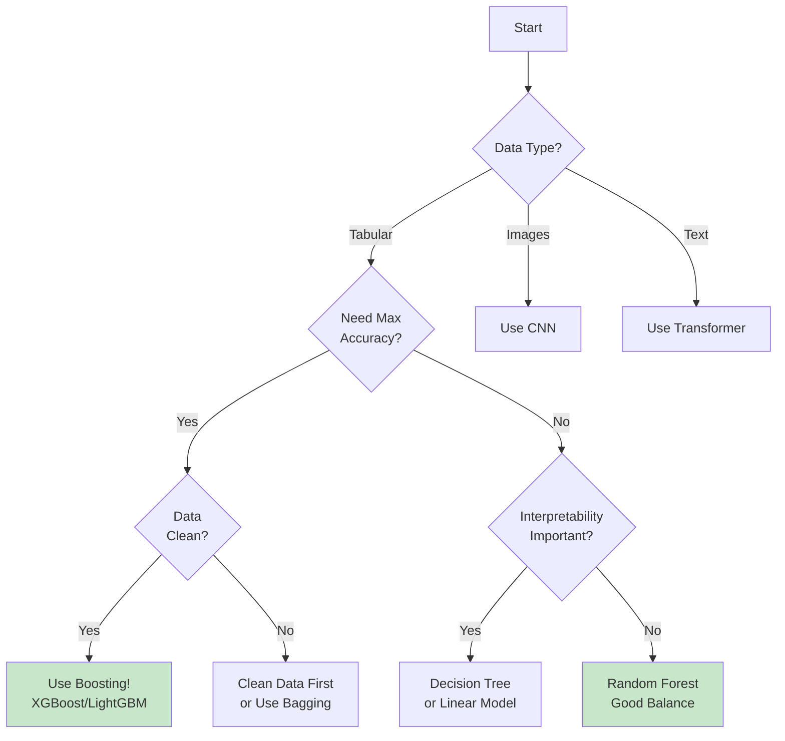

---

## Interview Questions

### Conceptual Questions

**Q1: Explain how boosting works and why it reduces bias.**

**Answer:**
Boosting is a sequential ensemble method where each new model tries to correct the errors of the previous ensemble.

**How it works:**
1. Train initial weak learner on data
2. Identify samples with high errors
3. Train next model focusing on these errors (via weights or residuals)
4. Combine models with weighted sum
5. Repeat M times

**Why it reduces bias:**
- Each model corrects systematic errors of the ensemble
- Sequential learning allows models to learn increasingly complex patterns
- Combination of many weak learners creates strong learner
- Result: Low-bias, potentially higher-variance ensemble

**Example:**
```
True:     [1, 1, 0, 0, 1]
Model 1:  [1, 0, 0, 1, 1]  # 60% accuracy
Model 2:  [0, 1, 0, 0, 0]  # Focuses on errors of M1
Combined: [1, 1, 0, 0, 1]  # 100% accuracy!
```

---

**Q2: What's the difference between AdaBoost and Gradient Boosting?**

**Answer:**

| Aspect | AdaBoost | Gradient Boosting |
|--------|----------|-------------------|
| **Weight Adjustment** | Sample weights | No weights, fits to residuals |
| **Target** | Original labels | Pseudo-residuals (gradients) |
| **Loss Function** | Exponential (fixed) | Any differentiable loss |
| **Model Weighting** | Based on accuracy | Learning rate × tree prediction |
| **Sensitivity** | High (to outliers) | Lower |
| **Generality** | Specific algorithm | General framework |
| **Typical Use** | Binary classification | Classification & Regression |

**Key Insight:**
- AdaBoost: "Let's focus more on samples we got wrong"
- Gradient Boosting: "Let's learn to predict the errors we're making"

---

**Q3: Explain the learning rate in boosting and its effect.**

**Answer:**
The learning rate (η, shrinkage) controls the contribution of each tree to the ensemble:

```
Fₘ(x) = Fₘ₋₁(x) + η × fₘ(x)
```

**Effects:**

**Low learning rate (η = 0.01):**
- Smaller steps, more cautious updates
- Needs more trees for same performance
- Better generalization, less overfitting
- Longer training time

**High learning rate (η = 0.3):**
- Larger steps, aggressive updates
- Fewer trees needed
- Faster training
- Higher risk of overfitting

**Trade-off:**
```
Lower η + More trees = Better generalization + Slower training
Higher η + Fewer trees = Faster training + Risk overfitting
```

**Recommended approach:**
1. Start with η = 0.1
2. Use early stopping to find optimal n_estimators
3. Lower η if overfitting (and increase n_estimators)
4. Raise η if underfitting

---

**Q4: What is the difference between XGBoost, LightGBM, and CatBoost?**

**Answer:**

**XGBoost:**
- **Key innovation:** Regularization (L1/L2), parallel tree construction
- **Strength:** Well-established, extensive documentation
- **Best for:** General use, competitions
- **Tree growth:** Level-wise (balanced trees)

**LightGBM:**
- **Key innovation:** GOSS (gradient-based sampling), leaf-wise growth
- **Strength:** Fastest training, lowest memory
- **Best for:** Large datasets (> 100K samples)
- **Tree growth:** Leaf-wise (can overfit on small data)

**CatBoost:**
- **Key innovation:** Ordered boosting, native categorical handling, symmetric trees
- **Strength:** No encoding needed, robust to hyperparameters
- **Best for:** Datasets with many categorical features
- **Tree growth:** Symmetric (oblivious trees)

**Summary Table:**

| Feature | XGBoost | LightGBM | CatBoost |
|---------|---------|----------|----------|
| Speed | ⭐⭐⭐⭐ | ⭐⭐⭐⭐⭐ | ⭐⭐⭐⭐ |
| Accuracy | ⭐⭐⭐⭐⭐ | ⭐⭐⭐⭐⭐ | ⭐⭐⭐⭐⭐ |
| Categorical | Encode | Encode | Native |
| Overfitting | Medium | Medium | Low |
| Tuning Needed | Medium | Medium | Low |

---

**Q5: Why is boosting more prone to overfitting than bagging?**

**Answer:**

**Boosting characteristics that increase overfitting risk:**

1. **Sequential Dependence:**
   - Each model focuses on previous errors
   - Can start memorizing noise in later iterations
   - No independent diversity like bagging

2. **Focusing on Hard Samples:**
   - Adaptively increases weight on difficult samples
   - These samples may be outliers or mislabeled
   - Can overfit to noise

3. **Deep Trees (Sometimes):**
   - While boosting uses shallow trees, ensemble can be complex
   - Hundreds of trees can memorize training data
   - Total model capacity is high

**Comparison with Bagging:**
```
Bagging:
- Independent models
- Averages out noise
- Robust to outliers

Boosting:
- Dependent models
- Focuses on errors (including noise)
- Sensitive to outliers
```

**Mitigation Strategies:**
1. Use early stopping
2. Lower learning rate
3. Limit tree depth
4. Add regularization (XGBoost/LightGBM/CatBoost)
5. Use subsampling (stochastic boosting)
6. Remove outliers before training

---

**Q6: Explain gradient boosting in function space.**

**Answer:**

**Key Idea:** View prediction function F(x) as a parameter to optimize.

**Normal Gradient Descent:**
```
θₘ = θₘ₋₁ - η∇Loss(θₘ₋₁)
```

**Gradient Descent in Function Space:**
```
Fₘ(x) = Fₘ₋₁(x) - η × [∂Loss/∂F(x)]
```

**But we can't directly optimize in function space!**

**Solution:** Train a tree to approximate the negative gradient:
```
fₘ(x) ≈ -[∂Loss/∂F(x)]

Then update:
Fₘ(x) = Fₘ₋₁(x) + η × fₘ(x)
```

**Intuition:**
- Gradient points toward steeper loss increase
- Negative gradient points toward loss decrease
- Tree approximates this direction
- We take a small step (η) in that direction

**Example with MSE:**
```
Loss = (y - F(x))²
Gradient = ∂Loss/∂F = -2(y - F(x)) = -2 × residual

So fitting to residuals ≡ moving in negative gradient direction!
```

---

### Technical Questions

**Q7: Implement the weight update rule for AdaBoost.**

**Answer:**
```python
import numpy as np

def adaboost_weight_update(y_true, y_pred, weights):
    """
    Update sample weights for AdaBoost

    Parameters:
    -----------
    y_true : array, true labels {-1, +1}
    y_pred : array, predictions {-1, +1}
    weights : array, current sample weights

    Returns:
    --------
    new_weights : updated weights
    alpha : model weight
    """
    # Calculate weighted error
    incorrect = (y_true != y_pred)
    error = np.sum(weights * incorrect) / np.sum(weights)

    # Prevent division by zero
    error = np.clip(error, 1e-10, 1 - 1e-10)

    # Calculate model weight (alpha)
    alpha = 0.5 * np.log((1 - error) / error)

    # Update sample weights
    new_weights = weights * np.exp(alpha * incorrect)

    # Normalize
    new_weights /= np.sum(new_weights)

    return new_weights, alpha


# Example
y_true = np.array([1, 1, -1, -1, 1])
y_pred = np.array([1, -1, -1, 1, 1])
weights = np.ones(5) / 5  # Uniform initially

new_weights, alpha = adaboost_weight_update(y_true, y_pred, weights)

print(f"Alpha (model weight): {alpha:.4f}")
print(f"Updated weights:")
for i, (old, new) in enumerate(zip(weights, new_weights)):
    status = "✓" if y_true[i] == y_pred[i] else "✗"
    print(f"  Sample {i} {status}: {old:.3f} → {new:.3f}")
```

---

**Q8: How do you handle categorical features in XGBoost?**

**Answer:**

XGBoost doesn't natively handle categorical features (unlike CatBoost). You need to encode them:

**Option 1: Label Encoding (Simple)**
```python
from sklearn.preprocessing import LabelEncoder
import xgboost as xgb

# Encode categorical features
le = LabelEncoder()
X_encoded = X.copy()
X_encoded['category'] = le.fit_transform(X['category'])

# Train XGBoost
xgb_clf = xgb.XGBClassifier()
xgb_clf.fit(X_encoded, y)
```

**Option 2: One-Hot Encoding (For Low Cardinality)**
```python
from sklearn.preprocessing import OneHotEncoder

# One-hot encode
ohe = OneHotEncoder(sparse=False, handle_unknown='ignore')
X_encoded = ohe.fit_transform(X[['category']])

xgb_clf = xgb.XGBClassifier()
xgb_clf.fit(X_encoded, y)
```

**Option 3: Target Encoding (Advanced)**
```python
from category_encoders import TargetEncoder

# Target encoding (mean of target for each category)
te = TargetEncoder()
X_encoded = te.fit_transform(X[['category']], y)

xgb_clf = xgb.XGBClassifier()
xgb_clf.fit(X_encoded, y)
```

**Option 4: Use CatBoost Instead**
```python
from catboost import CatBoostClassifier

# CatBoost handles categorical features natively
cat_clf = CatBoostClassifier(cat_features=['category'])
cat_clf.fit(X, y)  # No encoding needed!
```

**Recommendations:**
- **Low cardinality (< 10 values):** One-Hot Encoding
- **High cardinality (> 10 values):** Target Encoding or Label Encoding
- **Many categorical features:** Use CatBoost instead

---

**Q9: What is early stopping and how do you implement it?**

**Answer:**

**Early Stopping:** Stop training when validation performance stops improving, preventing overfitting.

**Implementation in XGBoost:**
```python
import xgboost as xgb

xgb_clf = xgb.XGBClassifier(
    n_estimators=1000,  # Large number
    learning_rate=0.1,
    early_stopping_rounds=10  # Stop if no improvement for 10 rounds
)

# Fit with evaluation set
xgb_clf.fit(
    X_train, y_train,
    eval_set=[(X_val, y_val)],
    verbose=True
)

print(f"Best iteration: {xgb_clf.best_iteration}")
print(f"Best score: {xgb_clf.best_score}")
```

**Implementation in LightGBM:**
```python
import lightgbm as lgb

lgb_clf = lgb.LGBMClassifier(n_estimators=1000, learning_rate=0.1)

lgb_clf.fit(
    X_train, y_train,
    eval_set=[(X_val, y_val)],
    callbacks=[lgb.early_stopping(stopping_rounds=10)]
)

print(f"Best iteration: {lgb_clf.best_iteration_}")
```

**Implementation in CatBoost:**
```python
from catboost import CatBoostClassifier

cat_clf = CatBoostClassifier(iterations=1000, learning_rate=0.1)

cat_clf.fit(
    X_train, y_train,
    eval_set=(X_val, y_val),
    early_stopping_rounds=10
)

print(f"Best iteration: {cat_clf.best_iteration_}")
```

**Benefits:**
- Prevents overfitting automatically
- Don't need to manually tune n_estimators
- Faster training (stops early)
- Better generalization

**Best Practices:**
- Use separate validation set (not test set!)
- Monitor multiple metrics if needed
- Set stopping_rounds = 10-50 (more for larger datasets)
- Use with low learning rate for best results

---

**Q10: How do you tune hyperparameters for gradient boosting?**

**Answer:**

**Recommended Tuning Strategy:**

**Step 1: Fix learning rate and find optimal n_estimators**
```python
xgb_clf = xgb.XGBClassifier(
    learning_rate=0.1,  # Fixed
    n_estimators=1000,  # Large number
    max_depth=6,        # Default
)

xgb_clf.fit(
    X_train, y_train,
    eval_set=[(X_val, y_val)],
    early_stopping_rounds=10
)

optimal_n_estimators = xgb_clf.best_iteration
```

**Step 2: Tune tree structure parameters**
```python
from sklearn.model_selection import GridSearchCV

param_grid = {
    'max_depth': [3, 5, 7, 9],
    'min_child_weight': [1, 3, 5],
    'gamma': [0, 0.1, 0.2]
}

xgb_clf = xgb.XGBClassifier(
    n_estimators=optimal_n_estimators,
    learning_rate=0.1
)

grid_search = GridSearchCV(xgb_clf, param_grid, cv=5)
grid_search.fit(X_train, y_train)

best_params = grid_search.best_params_
```

**Step 3: Tune regularization**
```python
param_grid = {
    'reg_alpha': [0, 0.01, 0.1, 1],
    'reg_lambda': [0, 0.01, 0.1, 1]
}

# Use best params from Step 2
xgb_clf = xgb.XGBClassifier(**best_params)
grid_search = GridSearchCV(xgb_clf, param_grid, cv=5)
grid_search.fit(X_train, y_train)
```

**Step 4: Lower learning rate and re-optimize n_estimators**
```python
xgb_clf = xgb.XGBClassifier(
    **best_params,
    learning_rate=0.01,  # Lower
    n_estimators=10000
)

xgb_clf.fit(
    X_train, y_train,
    eval_set=[(X_val, y_val)],
    early_stopping_rounds=50
)
```

**Parameter Importance (in order):**
1. **learning_rate** and **n_estimators** (together)
2. **max_depth** or **num_leaves**
3. **min_child_weight** or **min_samples_leaf**
4. **subsample** and **colsample_bytree**
5. **reg_alpha** and **reg_lambda**

---

### Comparison Questions

**Q11: When should you use boosting vs bagging?**

**Answer:**

| Scenario | Use Boosting | Use Bagging |
|----------|--------------|-------------|
| **Goal** | Maximum accuracy | Robustness, stability |
| **Base Learner** | High bias (shallow trees) | High variance (deep trees) |
| **Data Quality** | Clean, well-labeled | Noisy, outliers present |
| **Training Time** | Can wait (sequential) | Need speed (parallel) |
| **Overfitting Risk** | Can handle (regularization) | Want to avoid |
| **Interpretability** | Can sacrifice | Somewhat important |
| **Production** | Complex, need tuning | Simple, reliable |

**Example Scenarios:**

**Use Boosting (XGBoost/LightGBM):**
- Kaggle competition (need best accuracy)
- Well-curated dataset
- Structured/tabular data
- Have time for hyperparameter tuning
- Example: Predicting customer churn with clean CRM data

**Use Bagging (Random Forest):**
- Production system (need reliability)
- Noisy real-world data
- Many outliers
- Need quick results
- Example: Fraud detection with messy transaction data

---

**Q12: How does boosting compare to neural networks?**

**Answer:**

| Aspect | Gradient Boosting | Neural Networks |
|--------|------------------|-----------------|
| **Best For** | Tabular/structured data | Images, text, sequences |
| **Feature Engineering** | Minimal needed | Automatic feature learning |
| **Training Time** | Fast (minutes-hours) | Slow (hours-days) |
| **Hyperparameter Tuning** | Moderate | Extensive |
| **Interpretability** | Medium (SHAP) | Low (black box) |
| **Data Requirements** | 1K-1M samples | 10K-millions |
| **Missing Values** | Handles well | Need imputation |
| **Categorical Features** | OK (with encoding) | Need embedding |

**When to Use Each:**

**Gradient Boosting (XGBoost/LightGBM):**
- Structured/tabular data
- Small-medium datasets (1K-1M rows)
- Need fast training
- Want interpretability
- Examples: Customer analytics, risk scoring, recommendation systems

**Neural Networks:**
- Unstructured data (images, text, audio)
- Very large datasets (millions of samples)
- Complex patterns (hierarchical features)
- Can afford long training
- Examples: Image classification, NLP, speech recognition

**Tabular Data Benchmark:**
For most tabular datasets, gradient boosting (especially XGBoost/LightGBM) outperforms neural networks with less tuning and faster training.

---

### Practical Questions

**Q13: You have 1 million samples and 1000 features. Which boosting algorithm would you use and why?**

**Answer:**

**Recommendation: LightGBM**

**Reasoning:**

**1. Dataset Scale:**
- 1M samples × 1K features = large dataset
- Need memory-efficient algorithm
- LightGBM optimized for this scale

**2. LightGBM Advantages:**
- **GOSS:** Samples data efficiently (keeps high-gradient samples)
- **EFB:** Bundles sparse features (reduces effective dimensions)
- **Histogram-based:** Bins continuous features (faster splits)
- **Leaf-wise growth:** Converges faster than level-wise

**3. Comparison:**

| Algorithm | Estimated Training Time | Memory Usage |
|-----------|-------------------------|--------------|
| Gradient Boosting (sklearn) | ~2 hours | ~8 GB |
| XGBoost | ~20 minutes | ~6 GB |
| **LightGBM** | **~10 minutes** | **~4 GB** |
| CatBoost | ~30 minutes | ~5 GB |

**Implementation:**
```python
import lightgbm as lgb

# Optimal settings for large data
lgb_clf = lgb.LGBMClassifier(
    n_estimators=500,
    learning_rate=0.05,
    num_leaves=31,
    max_depth=-1,
    subsample=0.8,          # Sample 80% of data
    subsample_freq=5,       # Every 5 iterations
    colsample_bytree=0.8,   # Sample 80% of features
    min_child_samples=100,  # Higher for large data
    n_jobs=-1,              # Use all cores
    verbose=-1
)

# Train with early stopping
lgb_clf.fit(
    X_train, y_train,
    eval_set=[(X_val, y_val)],
    callbacks=[lgb.early_stopping(stopping_rounds=20)]
)
```

**Alternative: CatBoost** if many categorical features.

---

**Q14: How would you detect and prevent overfitting in gradient boosting?**

**Answer:**

**Detection Methods:**

**1. Learning Curves:**
```python
import matplotlib.pyplot as plt

# Train with validation monitoring
eval_result = {}
xgb_clf.fit(
    X_train, y_train,
    eval_set=[(X_train, y_train), (X_val, y_val)],
    eval_metric='logloss',
    verbose=False,
    callbacks=[xgb.callback.record_evaluation(eval_result)]
)

# Plot learning curves
plt.figure(figsize=(10, 6))
plt.plot(eval_result['validation_0']['logloss'], label='Train')
plt.plot(eval_result['validation_1']['logloss'], label='Validation')
plt.xlabel('Iterations')
plt.ylabel('Log Loss')
plt.legend()
plt.show()

# Overfitting if train keeps decreasing but val increases
```

**2. Train vs Validation Metrics:**
```python
from sklearn.metrics import accuracy_score

train_acc = accuracy_score(y_train, xgb_clf.predict(X_train))
val_acc = accuracy_score(y_val, xgb_clf.predict(X_val))

gap = train_acc - val_acc
if gap > 0.05:  # 5% gap
    print("Warning: Potential overfitting!")
```

**Prevention Strategies:**

**1. Early Stopping:**
```python
xgb_clf = xgb.XGBClassifier(
    n_estimators=1000,
    early_stopping_rounds=10
)
xgb_clf.fit(X_train, y_train, eval_set=[(X_val, y_val)])
```

**2. Lower Learning Rate:**
```python
xgb_clf = xgb.XGBClassifier(
    learning_rate=0.01,  # Lower from 0.1
    n_estimators=1000    # Increase trees
)
```

**3. Limit Tree Complexity:**
```python
xgb_clf = xgb.XGBClassifier(
    max_depth=3,           # Shallower trees
    min_child_weight=5,    # More samples per leaf
    gamma=0.1              # Minimum gain to split
)
```

**4. Regularization:**
```python
xgb_clf = xgb.XGBClassifier(
    reg_alpha=0.1,   # L1 regularization
    reg_lambda=1.0   # L2 regularization
)
```

**5. Subsampling:**
```python
xgb_clf = xgb.XGBClassifier(
    subsample=0.8,         # Use 80% of samples
    colsample_bytree=0.8   # Use 80% of features
)
```

**6. Cross-Validation:**
```python
from sklearn.model_selection import cross_val_score

cv_scores = cross_val_score(xgb_clf, X, y, cv=5)
print(f"CV Mean: {cv_scores.mean():.4f} (+/- {cv_scores.std():.4f})")
```

---

**Q15: How would you deploy a gradient boosting model in production?**

**Answer:**

**Step 1: Model Training and Serialization**
```python
import xgboost as xgb
import joblib

# Train optimized model
xgb_clf = xgb.XGBClassifier(
    n_estimators=100,
    learning_rate=0.1,
    max_depth=5,
    n_jobs=1,  # Use 1 core in production
    random_state=42
)
xgb_clf.fit(X_train, y_train)

# Save model
xgb_clf.save_model('xgboost_model.json')
# Or
joblib.dump(xgb_clf, 'xgboost_model.pkl')
```

**Step 2: Load and Predict**
```python
# Load model
xgb_clf = xgb.XGBClassifier()
xgb_clf.load_model('xgboost_model.json')
# Or
xgb_clf = joblib.load('xgboost_model.pkl')

# Single prediction
def predict_single(features):
    prediction = xgb_clf.predict([features])[0]
    probability = xgb_clf.predict_proba([features])[0]
    return {
        'prediction': int(prediction),
        'probability': float(probability[1]),
        'confidence': float(max(probability))
    }

# Batch prediction
def predict_batch(features_list):
    predictions = xgb_clf.predict(features_list)
    probabilities = xgb_clf.predict_proba(features_list)
    return predictions, probabilities
```

**Step 3: REST API (FastAPI)**
```python
from fastapi import FastAPI
from pydantic import BaseModel
import xgboost as xgb
import numpy as np

app = FastAPI()
model = xgb.XGBClassifier()
model.load_model('xgboost_model.json')

class PredictionRequest(BaseModel):
    features: list[float]

class PredictionResponse(BaseModel):
    prediction: int
    probability: float
    confidence: float

@app.post("/predict", response_model=PredictionResponse)
def predict(request: PredictionRequest):
    features = np.array([request.features])
    prediction = int(model.predict(features)[0])
    probability = float(model.predict_proba(features)[0, 1])
    confidence = float(max(model.predict_proba(features)[0]))

    return PredictionResponse(
        prediction=prediction,
        probability=probability,
        confidence=confidence
    )

# Run with: uvicorn app:app --host 0.0.0.0 --port 8000
```

**Step 4: Model Monitoring**
```python
import logging
from datetime import datetime

logger = logging.getLogger(__name__)

def predict_with_monitoring(features):
    start_time = datetime.now()

    # Predict
    prediction = model.predict([features])[0]
    probability = model.predict_proba([features])[0]

    # Calculate latency
    latency = (datetime.now() - start_time).total_seconds()

    # Log
    logger.info({
        'timestamp': start_time.isoformat(),
        'prediction': int(prediction),
        'probability': float(probability[1]),
        'latency_ms': latency * 1000,
        'features': features
    })

    # Alert if latency too high
    if latency > 0.1:  # 100ms threshold
        logger.warning(f"High latency: {latency:.3f}s")

    return prediction
```

**Step 5: Model Versioning**
```python
import mlflow

# During training
with mlflow.start_run():
    mlflow.log_params({
        'n_estimators': 100,
        'learning_rate': 0.1,
        'max_depth': 5
    })

    xgb_clf.fit(X_train, y_train)

    # Log metrics
    train_acc = xgb_clf.score(X_train, y_train)
    val_acc = xgb_clf.score(X_val, y_val)

    mlflow.log_metrics({
        'train_accuracy': train_acc,
        'val_accuracy': val_acc
    })

    # Save model
    mlflow.xgboost.log_model(xgb_clf, "model")
```

**Production Considerations:**
1. **Model Size:** XGBoost/LightGBM models are typically 10-100 MB
2. **Latency:** ~1-10ms per prediction (100-1000 QPS possible)
3. **Caching:** Cache predictions for common inputs
4. **Batching:** Process multiple requests together for efficiency
5. **A/B Testing:** Deploy new model to small % of traffic first
6. **Monitoring:** Track accuracy, latency, feature drift

---

## Summary

**Key Takeaways:**

1. **Boosting reduces bias** through sequential learning where each model corrects previous errors
2. **Best for tabular data** - often outperforms neural networks on structured data
3. **Main algorithms:**
   - **AdaBoost:** Simple, adjusts sample weights
   - **Gradient Boosting:** General framework, fits to residuals
   - **XGBoost:** Regularized, fast, popular in competitions
   - **LightGBM:** Fastest for large datasets, memory-efficient
   - **CatBoost:** Best for categorical features, robust to overfitting

4. **Key hyperparameters:**
   - Learning rate & n_estimators (most important)
   - max_depth / num_leaves
   - Regularization (reg_alpha, reg_lambda)
   - Subsampling (subsample, colsample_bytree)

5. **Risks:** Can overfit, sensitive to outliers (use early stopping, regularization)

**Best Practices:**
- Use XGBoost or LightGBM for most cases
- Use CatBoost for categorical-heavy data
- Always use early stopping
- Start with learning_rate=0.1, tune later
- Monitor train vs validation metrics
- Use cross-validation for final evaluation

**When to Use Boosting:**
- Tabular/structured data
- Need maximum accuracy
- Clean, well-labeled data
- Have time for tuning

**Production Deployment:**
- Serialize with joblib or native format
- Monitor latency and accuracy
- Use batching for efficiency
- Version models with MLflow
- Implement A/B testing

---

**End of Document**
