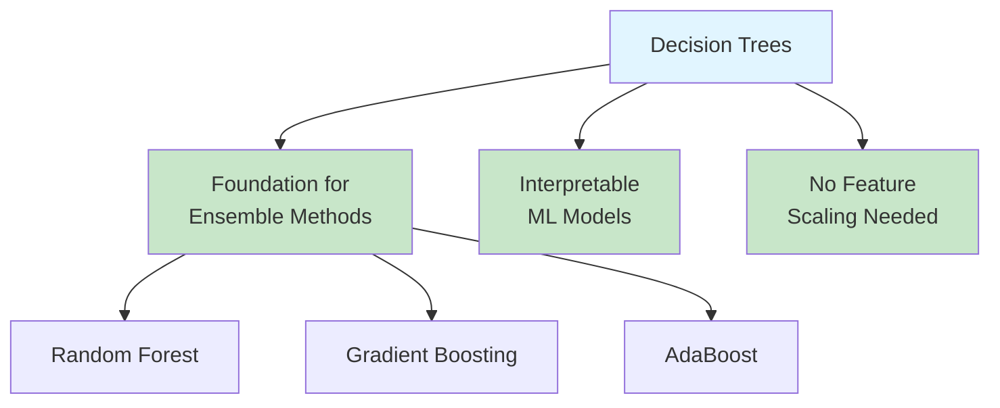
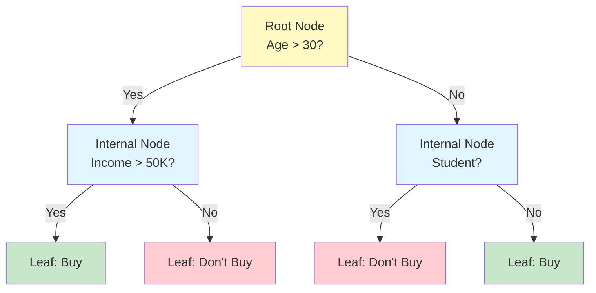
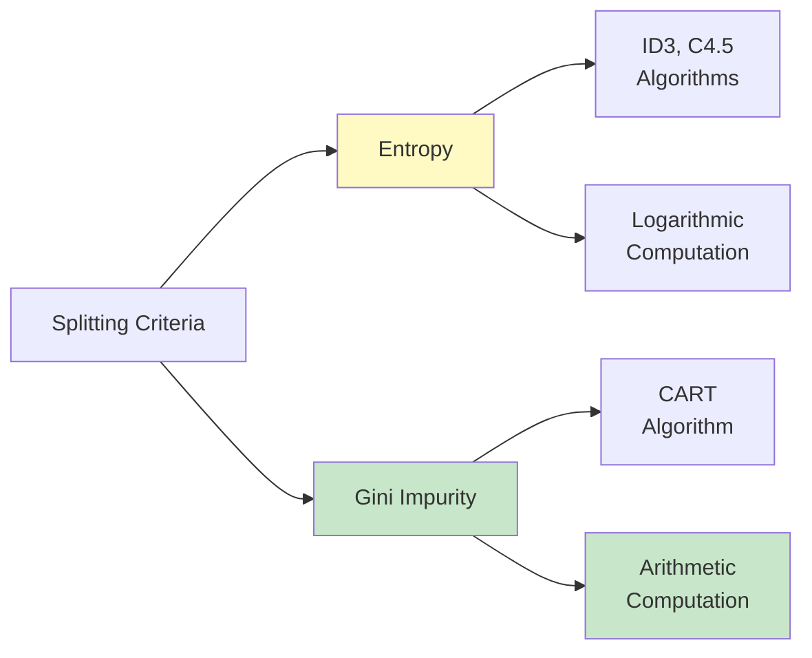
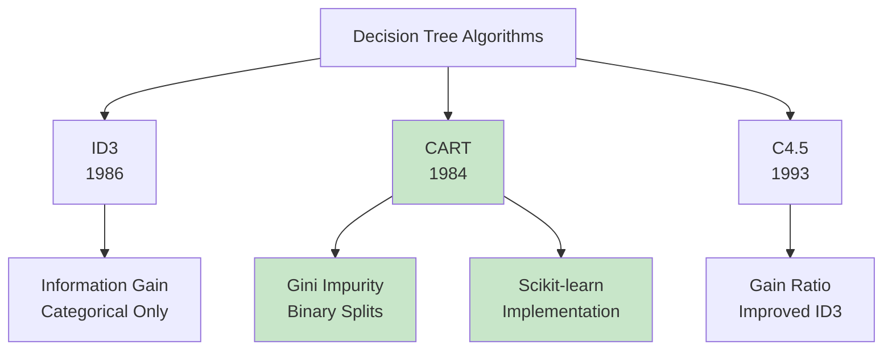
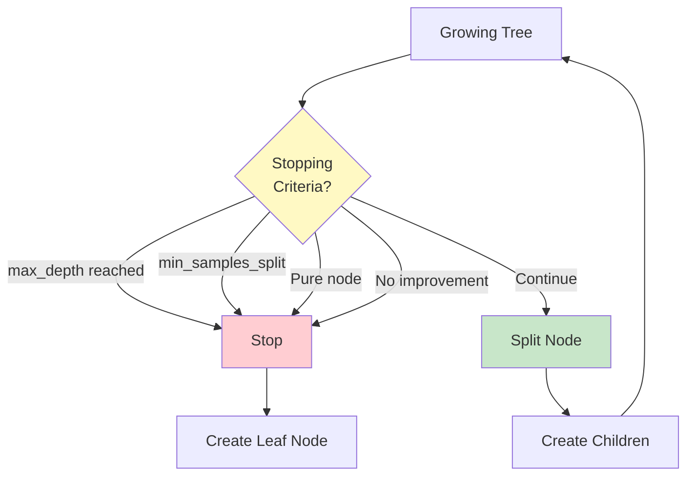
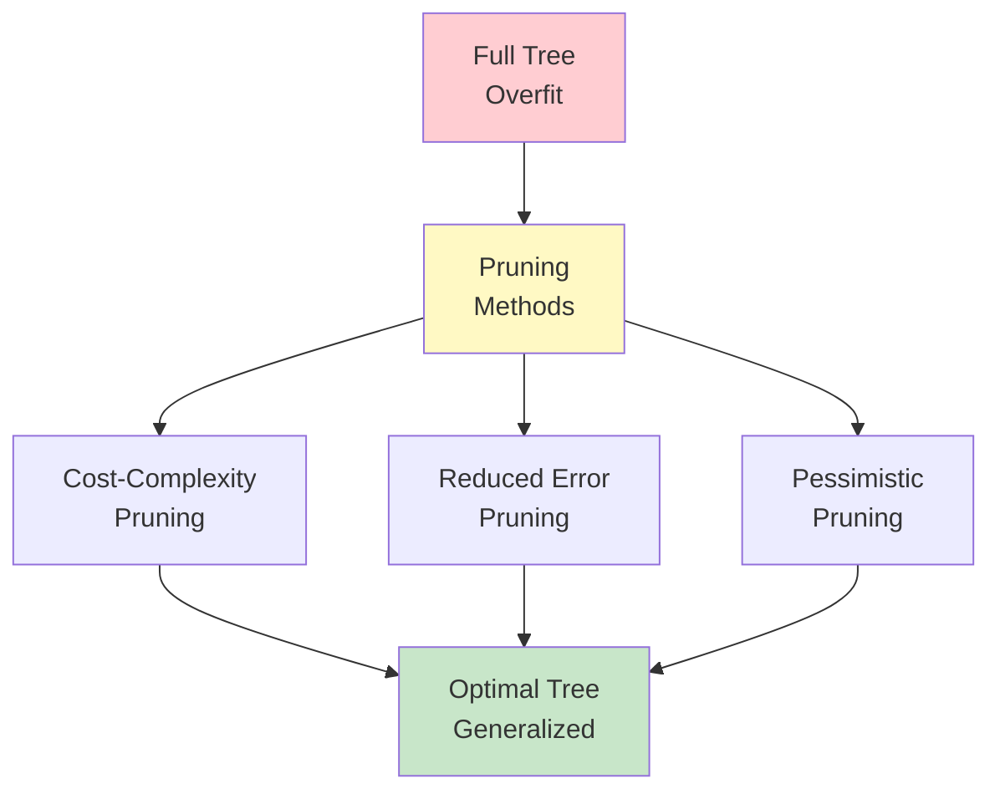
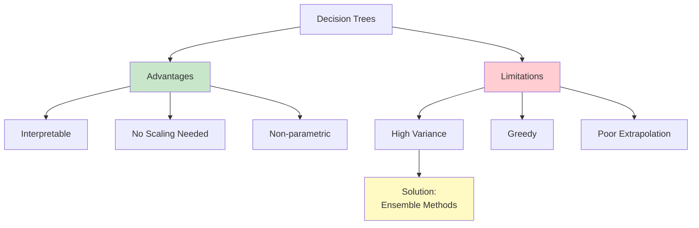
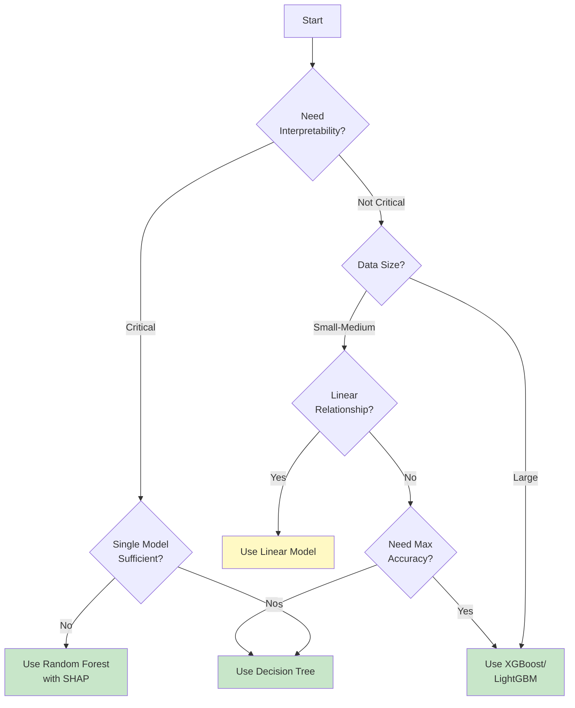

# Decision Trees - Complete Guide

## Table of Contents
1. [Introduction](#introduction)
2. [How Decision Trees Work](#how-decision-trees-work)
3. [Splitting Criteria](#splitting-criteria)
4. [Tree Construction Algorithms](#tree-construction-algorithms)
5. [Handling Different Data Types](#handling-different-data-types)
6. [Stopping Criteria](#stopping-criteria)
7. [Tree Pruning](#tree-pruning)
8. [Regression Trees](#regression-trees)
9. [Feature Importance](#feature-importance)
10. [Tree Visualization](#tree-visualization)
11. [Implementation from Scratch](#implementation-from-scratch)
12. [Implementation with Scikit-learn](#implementation-with-scikit-learn)
13. [Hyperparameter Tuning](#hyperparameter-tuning)
14. [Advantages and Limitations](#advantages-and-limitations)
15. [When to Use Decision Trees](#when-to-use-decision-trees)
16. [Interview Questions](#interview-questions)

---

## Introduction

### What is a Decision Tree?

A **Decision Tree** is a supervised machine learning algorithm used for both classification and regression tasks. It works by recursively splitting the data based on feature values, creating a tree-like model of decisions.

**Key Characteristics:**
- Non-parametric (no assumptions about data distribution)
- Handles both numerical and categorical data
- Highly interpretable (white-box model)
- Can capture non-linear relationships
- Prone to overfitting without proper constraints

### Historical Context

**Timeline:**
- **1963**: Early decision tree systems (CLS - Concept Learning System)
- **1986**: ID3 (Iterative Dichotomiser 3) by Ross Quinlan
- **1993**: C4.5 (improved ID3) by Ross Quinlan
- **1984**: CART (Classification and Regression Trees) by Breiman et al.
- **Present**: Used as base learners in ensemble methods (Random Forest, XGBoost)

### Why Decision Trees Are Important



**Decision trees serve as:**
1. **Standalone models** for interpretable predictions
2. **Base learners** for ensemble methods (bagging, boosting)
3. **Feature selection** tools
4. **Data exploration** aids

---

## How Decision Trees Work

### Tree Structure

A decision tree consists of:
- **Root Node**: Top node representing entire dataset
- **Internal Nodes**: Decision points based on feature tests
- **Branches**: Outcomes of decisions (Yes/No, True/False)
- **Leaf Nodes**: Final predictions (class labels or values)



### Decision-Making Process

**Training Phase:**
1. Start with all data at root node
2. Find best feature and threshold to split data
3. Create child nodes with split subsets
4. Recursively repeat for each child node
5. Stop when stopping criterion is met

**Prediction Phase:**
1. Start at root node with new sample
2. Follow decision path based on feature values
3. Reach leaf node
4. Return prediction (class or value)

### Example: Customer Purchase Decision

**Dataset:**
```
Age | Income | Student | Bought
----|--------|---------|-------
25  | 40K    | Yes     | No
35  | 60K    | No      | Yes
45  | 80K    | No      | Yes
20  | 20K    | Yes     | No
60  | 50K    | No      | Yes
```

**Decision Tree:**
```
Age > 30?
├─ Yes → Income > 50K?
│        ├─ Yes → Bought = Yes
│        └─ No → Bought = No
└─ No → Student = Yes?
         ├─ Yes → Bought = No
         └─ No → Bought = Yes
```

---

## Splitting Criteria

### Overview

The key to building effective decision trees is selecting the **best feature and split point** at each node. Different criteria measure the quality of splits.

### 1. Entropy (Information Theory)

**Entropy** measures the impurity or disorder in a dataset.

**Formula:**
```
H(S) = -Σ(pᵢ × log₂(pᵢ))
```

Where:
- S: Dataset
- pᵢ: Proportion of class i in S
- H(S): Entropy of S

**Properties:**
- Minimum: 0 (pure node, all samples same class)
- Maximum: 1 (for binary classification, perfectly impure)
- Higher entropy → More disorder

**Example:**
```python
Dataset: [1, 1, 1, 0, 0]
p(1) = 3/5 = 0.6
p(0) = 2/5 = 0.4

H(S) = -(0.6 × log₂(0.6) + 0.4 × log₂(0.4))
     = -(0.6 × -0.737 + 0.4 × -1.322)
     = -(-0.442 - 0.529)
     = 0.971
```

### 2. Information Gain

**Information Gain** measures the reduction in entropy after a split.

**Formula:**
```
IG(S, A) = H(S) - Σ(|Sᵥ|/|S|) × H(Sᵥ)
```

Where:
- A: Attribute (feature) to split on
- Sᵥ: Subset of S where attribute A has value v
- |S|: Size of dataset S

**Interpretation:**
- Higher information gain → Better split
- ID3 and C4.5 algorithms use information gain

**Example:**
```
Parent: [Y, Y, Y, N, N] → H(parent) = 0.971

Split on "Age > 30":
Left (Age ≤ 30): [Y, N, N] → H(left) = 0.918
Right (Age > 30): [Y, Y] → H(right) = 0

IG = 0.971 - (3/5 × 0.918 + 2/5 × 0)
   = 0.971 - 0.551
   = 0.420
```

### 3. Gini Impurity

**Gini Impurity** measures the probability of incorrectly classifying a randomly chosen sample.

**Formula:**
```
Gini(S) = 1 - Σ(pᵢ²)
```

Where:
- pᵢ: Proportion of class i in S

**Properties:**
- Minimum: 0 (pure node)
- Maximum: 0.5 (binary classification, perfectly impure)
- Lower Gini → Better split

**Example:**
```python
Dataset: [1, 1, 1, 0, 0]
p(1) = 0.6
p(0) = 0.4

Gini = 1 - (0.6² + 0.4²)
     = 1 - (0.36 + 0.16)
     = 1 - 0.52
     = 0.48
```

### 4. Gini Gain (Gini Index)

**Gini Gain** measures the reduction in Gini impurity after a split.

**Formula:**
```
Gini_Gain(S, A) = Gini(S) - Σ(|Sᵥ|/|S|) × Gini(Sᵥ)
```

**CART algorithm** uses Gini impurity for classification.

### Entropy vs Gini: Comparison

| Aspect | Entropy | Gini Impurity |
|--------|---------|---------------|
| **Range** | 0 to 1 (binary) | 0 to 0.5 (binary) |
| **Computation** | Logarithmic (slower) | Arithmetic (faster) |
| **Algorithm** | ID3, C4.5 | CART |
| **Sensitivity** | More sensitive to changes | Less sensitive |
| **Bias** | Favors balanced splits | Slightly favors larger partitions |
| **Performance** | Similar in practice | Similar in practice |



**When to use each:**
- **Entropy**: When you need theoretical soundness (information theory)
- **Gini**: When you need computational efficiency (production systems)
- **Practical**: Both produce similar trees, Gini is faster

### 5. Information Gain Ratio (C4.5)

**Problem with Information Gain:**
- Biased towards attributes with many values (high cardinality)
- Example: "Customer ID" would have perfect information gain but is useless

**Solution: Information Gain Ratio**

**Formula:**
```
Gain_Ratio(S, A) = IG(S, A) / SplitInfo(S, A)

SplitInfo(S, A) = -Σ(|Sᵥ|/|S| × log₂(|Sᵥ|/|S|))
```

**SplitInfo** penalizes attributes that split data into many small subsets.

**C4.5 algorithm** uses Information Gain Ratio to overcome ID3's bias.

---

## Tree Construction Algorithms

### 1. ID3 (Iterative Dichotomiser 3)

**Developed by:** Ross Quinlan (1986)

**Algorithm:**
```
ID3(Dataset, Target_Attribute, Attributes):
    1. Create root node
    2. If all examples have same class:
       Return leaf with that class
    3. If Attributes is empty:
       Return leaf with majority class
    4. Else:
       a. Select attribute A with highest Information Gain
       b. Create decision node for A
       c. For each value v of A:
          - Create branch for A = v
          - Let Subset = examples where A = v
          - Call ID3(Subset, Target, Attributes - {A})
```

**Characteristics:**
- Uses **Entropy** and **Information Gain**
- Only handles **categorical** features
- No pruning
- Cannot handle missing values
- Can overfit easily

**Example:**
```python
import numpy as np
from collections import Counter

def entropy(y):
    """Calculate entropy of labels"""
    counts = Counter(y)
    total = len(y)
    return -sum((count/total) * np.log2(count/total) for count in counts.values())

def information_gain(X_feature, y, threshold=None):
    """Calculate information gain for a feature"""
    parent_entropy = entropy(y)

    if threshold is None:  # Categorical
        values = np.unique(X_feature)
        weighted_entropy = 0
        for v in values:
            mask = X_feature == v
            subset_entropy = entropy(y[mask])
            weighted_entropy += (np.sum(mask) / len(y)) * subset_entropy
    else:  # Numerical
        left_mask = X_feature <= threshold
        right_mask = ~left_mask

        left_entropy = entropy(y[left_mask])
        right_entropy = entropy(y[right_mask])

        weighted_entropy = (np.sum(left_mask) / len(y)) * left_entropy + \
                          (np.sum(right_mask) / len(y)) * right_entropy

    return parent_entropy - weighted_entropy
```

### 2. C4.5 (Successor of ID3)

**Developed by:** Ross Quinlan (1993)

**Improvements over ID3:**
1. Handles both **categorical** and **continuous** features
2. Handles **missing values**
3. Uses **Information Gain Ratio** (reduces bias)
4. Includes **pruning** to prevent overfitting
5. Can produce **rule sets** from trees

**Algorithm for Continuous Features:**
```
For continuous attribute A:
    1. Sort samples by A
    2. For each adjacent pair (vᵢ, vᵢ₊₁):
       - Candidate threshold: (vᵢ + vᵢ₊₁) / 2
       - Calculate Gain Ratio for this threshold
    3. Select threshold with highest Gain Ratio
```

**Handling Missing Values:**
- During training: Use samples with known values to calculate gain
- During prediction: Use probability-weighted voting across branches

**Characteristics:**
- More robust than ID3
- Handles real-world data better
- Became one of the most popular tree algorithms
- Basis for commercial C5.0 algorithm

### 3. CART (Classification and Regression Trees)

**Developed by:** Leo Breiman et al. (1984)

**Key Characteristics:**
- Handles **classification** AND **regression**
- Always creates **binary trees** (two-way splits)
- Uses **Gini impurity** for classification
- Uses **variance reduction** for regression
- Includes **cost-complexity pruning**
- Scikit-learn's implementation is based on CART

**Classification Algorithm:**
```
CART_Classification(Dataset, Target):
    1. For each feature:
       a. Sort samples by feature value
       b. For each possible split point:
          - Calculate Gini impurity for split
          - Track best split (lowest Gini)
    2. Split on best feature and threshold
    3. Recursively build left and right subtrees
    4. Stop when:
       - Maximum depth reached
       - Minimum samples per node reached
       - No improvement in Gini
```

**Regression Algorithm:**
```
CART_Regression(Dataset, Target):
    1. For each feature and threshold:
       - Split data into left and right
       - Calculate variance of each subset
       - Calculate weighted variance
    2. Select split with lowest variance
    3. Recursively build subtrees
    4. Leaf prediction = mean of target values
```

**Characteristics:**
- Most widely used algorithm (scikit-learn default)
- Efficient binary splitting
- Built-in support for regression
- Produces simpler trees than ID3/C4.5

### Algorithm Comparison

| Feature | ID3 | C4.5 | CART |
|---------|-----|------|------|
| **Year** | 1986 | 1993 | 1984 |
| **Splitting Criterion** | Information Gain | Gain Ratio | Gini / Variance |
| **Tree Type** | Multi-way | Multi-way | Binary |
| **Continuous Features** | ❌ | ✅ | ✅ |
| **Missing Values** | ❌ | ✅ | ✅ |
| **Pruning** | ❌ | ✅ | ✅ |
| **Regression** | ❌ | ❌ | ✅ |
| **Most Used** | Historical | Historical | ✅ Modern |



---

## Handling Different Data Types

### 1. Categorical Features

**Binary Features** (e.g., Gender: M/F):
- Simple split: M vs F
- Both ID3, C4.5, and CART handle directly

**Multi-class Features** (e.g., Color: Red, Blue, Green):
- **ID3/C4.5**: Multi-way split (one branch per value)
- **CART**: Binary split (one value vs all others)

**Example:**
```
Color: {Red, Blue, Green}

ID3/C4.5 Split:
    Color?
    ├── Red → ...
    ├── Blue → ...
    └── Green → ...

CART Split:
    Color = Red?
    ├── Yes → ...
    └── No (Blue or Green) → ...
```

**Ordinal Features** (e.g., Size: Small, Medium, Large):
- Treat as continuous (Small < Medium < Large)
- Or encode numerically (0, 1, 2)

### 2. Numerical/Continuous Features

**Challenge:** Infinite possible split points

**Solution:** Test candidate thresholds

**Algorithm:**
```
1. Sort feature values: [v₁, v₂, v₃, ..., vₙ]
2. Candidate thresholds: {(v₁+v₂)/2, (v₂+v₃)/2, ..., (vₙ₋₁+vₙ)/2}
3. Evaluate each threshold:
   - Split: feature ≤ threshold vs feature > threshold
   - Calculate impurity/gain
4. Select best threshold
```

**Example:**
```python
def find_best_split_continuous(X_feature, y):
    """Find best threshold for continuous feature"""
    best_gain = -float('inf')
    best_threshold = None

    # Sort unique values
    sorted_values = np.sort(np.unique(X_feature))

    # Test thresholds between adjacent values
    for i in range(len(sorted_values) - 1):
        threshold = (sorted_values[i] + sorted_values[i+1]) / 2
        gain = information_gain(X_feature, y, threshold)

        if gain > best_gain:
            best_gain = gain
            best_threshold = threshold

    return best_threshold, best_gain
```

**Optimization:**
- Don't test all possible thresholds (too slow)
- Use percentiles: 10th, 25th, 50th, 75th, 90th
- Or sample random thresholds

### 3. Missing Values

**Handling Missing Values in C4.5:**

**During Training:**
1. Ignore samples with missing values for that feature
2. Calculate gain using only samples with known values
3. Adjust gain by fraction of samples with known values

**During Prediction:**
- Use **surrogate splits**: Alternative features highly correlated with primary
- Or **probability-weighted voting**: Send sample down all branches weighted by proportions

**Handling in CART:**
- Learns best direction for missing values
- Treats missing as separate category during training

**Handling in Scikit-learn:**
- Does NOT handle missing values automatically
- Must impute before training: mean, median, mode, or advanced imputation

```python
from sklearn.impute import SimpleImputer

# Impute missing values with mean
imputer = SimpleImputer(strategy='mean')
X_imputed = imputer.fit_transform(X)
```

### 4. Mixed Data Types

**Real-world datasets** often have mixed types:
```
Features:
- Age: Continuous
- Income: Continuous
- City: Categorical (high cardinality)
- Has_Degree: Binary
- Credit_Score: Continuous
```

**Best Practices:**
1. **Encode categorical** before using scikit-learn:
   - Binary: Leave as 0/1
   - Ordinal: Encode as integers
   - Nominal: One-hot encoding or target encoding

2. **Normalize/Scale?**
   - Decision trees do NOT require feature scaling
   - Split points are found individually per feature
   - Unlike neural networks or SVM

3. **Handle high cardinality** carefully:
   - Features with many unique values (e.g., ZIP code)
   - Can lead to overfitting
   - Consider grouping or target encoding

---

## Stopping Criteria

### Why Stop Growing?

**Without stopping criteria:**
- Tree grows until each leaf has one sample
- Perfect training accuracy (100%)
- Severe overfitting
- Poor generalization

**Goal:** Balance between fitting training data and generalizing to unseen data

### Common Stopping Criteria

**1. Maximum Depth (`max_depth`)**
```
Stop if: Current depth ≥ max_depth
```
- Most common and effective stopping criterion
- Limits model complexity directly
- **Typical values:** 3-20
- **Recommendation:** Start with 5-10

**2. Minimum Samples to Split (`min_samples_split`)**
```
Stop if: Number of samples in node < min_samples_split
```
- Prevents splitting nodes with too few samples
- **Typical values:** 2-20
- **Default:** 2 (split any node with ≥2 samples)

**3. Minimum Samples per Leaf (`min_samples_leaf`)**
```
Stop if: Split would create child with < min_samples_leaf samples
```
- Ensures each leaf has sufficient samples
- More conservative than min_samples_split
- **Typical values:** 1-10
- **Recommendation:** 5-10 for smoother decision boundaries

**4. Minimum Impurity Decrease (`min_impurity_decrease`)**
```
Stop if: Impurity reduction from split < min_impurity_decrease
```
- Only split if improvement is significant
- Prevents trivial splits
- **Typical values:** 0.0-0.01

**5. Maximum Leaf Nodes (`max_leaf_nodes`)**
```
Stop if: Number of leaf nodes ≥ max_leaf_nodes
```
- Limits total tree size
- Grows tree best-first (highest gain splits first)
- **Alternative to** max_depth

**6. Pure Node**
```
Stop if: All samples in node have same class (Gini = 0 or Entropy = 0)
```
- Natural stopping point
- Always checked

### Stopping Criteria Comparison

| Criterion | Effect | Best For | Typical Value |
|-----------|--------|----------|---------------|
| **max_depth** | Limits vertical growth | Most cases | 5-10 |
| **min_samples_split** | Prevents small splits | Large datasets | 10-50 |
| **min_samples_leaf** | Smooth boundaries | Regression, noise | 5-10 |
| **min_impurity_decrease** | Quality threshold | Clean data | 0.0-0.01 |
| **max_leaf_nodes** | Limits total size | Memory constraints | 20-100 |



### Pre-Pruning vs Post-Pruning

**Pre-Pruning (Early Stopping):**
- Stop growing tree during construction
- Use stopping criteria above
- **Advantage:** Faster, simpler
- **Disadvantage:** May stop too early (horizon effect)

**Post-Pruning:**
- Grow full tree, then remove branches
- More sophisticated (covered in next section)
- **Advantage:** Better performance
- **Disadvantage:** Slower, more complex

---

## Tree Pruning

### Why Prune?

**Problem:** Fully grown trees overfit training data
- Memorize noise
- Poor generalization
- High variance

**Solution:** Prune (remove) unnecessary branches

### 1. Reduced Error Pruning (REP)

**Simple post-pruning method**

**Algorithm:**
```
1. Grow full tree
2. For each non-leaf node (bottom-up):
   a. Temporarily convert to leaf (with majority class)
   b. Evaluate accuracy on validation set
   c. If accuracy improves or stays same:
      - Permanently remove subtree
   d. Else:
      - Keep subtree
3. Return pruned tree
```

**Characteristics:**
- Requires validation set
- Greedy approach
- Simple and fast
- May not find optimal pruning

**Example:**
```python
def reduced_error_pruning(tree, X_val, y_val):
    """
    Prune tree using validation set
    """
    def prune_node(node):
        if node.is_leaf():
            return

        # Recursively prune children first
        prune_node(node.left)
        prune_node(node.right)

        # Try pruning this node
        original_accuracy = accuracy(tree, X_val, y_val)

        # Temporarily convert to leaf
        node_backup = node.copy()
        node.make_leaf(majority_class(node))

        # Check if accuracy improves
        new_accuracy = accuracy(tree, X_val, y_val)

        if new_accuracy < original_accuracy:
            # Restore node
            node.restore(node_backup)

    prune_node(tree.root)
    return tree
```

### 2. Cost-Complexity Pruning (CCP)

**Most sophisticated pruning method** (used in scikit-learn)

**Also called:** Minimal Cost-Complexity Pruning, Weakest Link Pruning

**Concept:** Balance between tree complexity and training error

**Cost-Complexity Measure:**
```
Rα(T) = R(T) + α × |T|
```

Where:
- R(T): Training error (misclassification rate)
- |T|: Number of leaf nodes (complexity)
- α: Complexity parameter (penalty for complexity)

**Algorithm:**
```
1. Grow full tree T₀
2. For α = 0 to ∞:
   a. Find subtree Tα that minimizes Rα(T)
   b. This creates a sequence: T₀ ⊃ T₁ ⊃ ... ⊃ {root}
3. Use cross-validation to select best α
4. Prune original tree with selected α
```

**Intuition:**
- α = 0: No penalty → Full tree (overfitting)
- α = ∞: High penalty → Root only (underfitting)
- Optimal α: Balance between the two

**Scikit-learn Implementation:**
```python
from sklearn.tree import DecisionTreeClassifier
from sklearn.model_selection import cross_val_score
import numpy as np

# 1. Fit full tree
tree = DecisionTreeClassifier(random_state=42)
tree.fit(X_train, y_train)

# 2. Get cost-complexity pruning path
path = tree.cost_complexity_pruning_path(X_train, y_train)
ccp_alphas = path.ccp_alphas
impurities = path.impurities

# 3. Train trees with different alphas
trees = []
for ccp_alpha in ccp_alphas:
    tree = DecisionTreeClassifier(ccp_alpha=ccp_alpha, random_state=42)
    tree.fit(X_train, y_train)
    trees.append(tree)

# 4. Select best alpha using cross-validation
train_scores = [tree.score(X_train, y_train) for tree in trees]
test_scores = [tree.score(X_test, y_test) for tree in trees]

# 5. Choose alpha with best test score
best_idx = np.argmax(test_scores)
best_alpha = ccp_alphas[best_idx]
best_tree = trees[best_idx]

print(f"Best alpha: {best_alpha:.4f}")
print(f"Test accuracy: {test_scores[best_idx]:.4f}")
```

**Visualization:**
```python
import matplotlib.pyplot as plt

fig, ax = plt.subplots(figsize=(10, 6))
ax.plot(ccp_alphas, train_scores, marker='o', label='Train', linewidth=2)
ax.plot(ccp_alphas, test_scores, marker='o', label='Test', linewidth=2)
ax.axvline(x=best_alpha, linestyle='--', color='red', label='Best Alpha')
ax.set_xlabel('Alpha (complexity parameter)')
ax.set_ylabel('Accuracy')
ax.set_title('Accuracy vs Alpha (Cost-Complexity Pruning)')
ax.legend()
plt.show()
```

### 3. Pessimistic Error Pruning (PEP)

**Used in C4.5**

**Concept:** Estimate error on unseen data using training data with pessimistic adjustment

**Error Estimate:**
```
Apparent Error Rate: e = errors / samples
Adjusted Error Rate: e' = (errors + 0.5) / samples
```

**Algorithm:**
- For each node, compare error of:
  - Keeping subtree: Sum of adjusted errors in leaves
  - Pruning to leaf: Adjusted error at this node
- Prune if error doesn't increase significantly

**Advantage:** No validation set needed

### 4. Minimum Error Pruning (MEP)

**Bayesian approach**

**Estimates probability of error** using Beta distribution

**More sophisticated but rarely used** in practice

### Pruning Comparison

| Method | Validation Set? | Complexity | Used In | Scikit-learn |
|--------|----------------|------------|---------|--------------|
| **Reduced Error** | ✅ Required | Simple | Research | ❌ |
| **Cost-Complexity** | ❌ Optional | Medium | CART | ✅ |
| **Pessimistic** | ❌ Not needed | Medium | C4.5 | ❌ |
| **Minimum Error** | ❌ Not needed | High | Research | ❌ |



---

## Regression Trees

### Classification vs Regression Trees

| Aspect | Classification Trees | Regression Trees |
|--------|---------------------|------------------|
| **Target** | Categorical (classes) | Continuous (values) |
| **Splitting Criterion** | Gini / Entropy | Variance / MSE |
| **Leaf Prediction** | Majority class | Mean of values |
| **Impurity Measure** | Gini = 1 - Σpᵢ² | Variance = Σ(yᵢ - ȳ)² |

### Variance Reduction for Splitting

**Goal:** Find splits that minimize variance within child nodes

**Variance:**
```
Var(S) = (1/|S|) × Σ(yᵢ - ȳ)²
```

Where:
- yᵢ: Individual target values
- ȳ: Mean of target values in S

**Variance Reduction:**
```
VR(S, A, t) = Var(S) - [|Sleft|/|S| × Var(Sleft) + |Sright|/|S| × Var(Sright)]
```

Where:
- A: Feature to split on
- t: Threshold
- Sleft: Samples where A ≤ t
- Sright: Samples where A > t

**Select split with maximum variance reduction**

### Mean Squared Error (MSE)

**Alternative criterion:** Minimize MSE

**MSE:**
```
MSE(S) = (1/|S|) × Σ(yᵢ - ȳ)²
```

**Same as variance**, commonly used name in regression context

**Weighted MSE after split:**
```
Weighted_MSE = |Sleft|/|S| × MSE(Sleft) + |Sright|/|S| × MSE(Sright)
```

### Regression Tree Example

**Dataset:**
```
Age | Income | House_Price
----|--------|------------
25  | 50K    | 200K
30  | 60K    | 250K
35  | 70K    | 300K
40  | 80K    | 350K
45  | 90K    | 400K
```

**Building Tree:**

**Step 1:** Calculate variance of House_Price
```
Mean price = 300K
Variance = 10,000 (thousands²)
```

**Step 2:** Try split on Age
```
Split: Age ≤ 32.5
Left:  [200K, 250K] → Mean=225K, Var=625
Right: [300K, 350K, 400K] → Mean=350K, Var=2500

Variance Reduction = 10000 - (2/5 × 625 + 3/5 × 2500)
                   = 10000 - (250 + 1500)
                   = 8250 (good split!)
```

**Step 3:** Continue recursively...

**Final Tree:**
```
Age ≤ 32.5?
├─ Yes: Predict 225K
└─ No: Income ≤ 75K?
       ├─ Yes: Predict 300K
       └─ No: Predict 375K
```

### Regression Tree Implementation

```python
import numpy as np

class RegressionTreeNode:
    def __init__(self):
        self.feature = None
        self.threshold = None
        self.left = None
        self.right = None
        self.value = None  # For leaf nodes

    def is_leaf(self):
        return self.value is not None

class RegressionTree:
    def __init__(self, max_depth=None, min_samples_split=2, min_samples_leaf=1):
        self.max_depth = max_depth
        self.min_samples_split = min_samples_split
        self.min_samples_leaf = min_samples_leaf
        self.root = None

    def _variance(self, y):
        """Calculate variance"""
        if len(y) == 0:
            return 0
        return np.var(y)

    def _variance_reduction(self, y, y_left, y_right):
        """Calculate variance reduction"""
        n = len(y)
        n_left, n_right = len(y_left), len(y_right)

        if n_left == 0 or n_right == 0:
            return 0

        var_parent = self._variance(y)
        var_left = self._variance(y_left)
        var_right = self._variance(y_right)

        reduction = var_parent - (n_left/n * var_left + n_right/n * var_right)
        return reduction

    def _best_split(self, X, y):
        """Find best feature and threshold"""
        best_gain = -float('inf')
        best_feature = None
        best_threshold = None

        n_features = X.shape[1]

        for feature_idx in range(n_features):
            feature_values = X[:, feature_idx]
            thresholds = np.unique(feature_values)

            for threshold in thresholds:
                left_mask = feature_values <= threshold
                right_mask = ~left_mask

                if np.sum(left_mask) < self.min_samples_leaf or \
                   np.sum(right_mask) < self.min_samples_leaf:
                    continue

                y_left, y_right = y[left_mask], y[right_mask]
                gain = self._variance_reduction(y, y_left, y_right)

                if gain > best_gain:
                    best_gain = gain
                    best_feature = feature_idx
                    best_threshold = threshold

        return best_feature, best_threshold, best_gain

    def _build_tree(self, X, y, depth=0):
        """Recursively build tree"""
        n_samples = len(y)

        # Stopping criteria
        if depth == self.max_depth or \
           n_samples < self.min_samples_split or \
           self._variance(y) == 0:
            leaf = RegressionTreeNode()
            leaf.value = np.mean(y)
            return leaf

        # Find best split
        feature, threshold, gain = self._best_split(X, y)

        if feature is None:  # No valid split found
            leaf = RegressionTreeNode()
            leaf.value = np.mean(y)
            return leaf

        # Create node
        node = RegressionTreeNode()
        node.feature = feature
        node.threshold = threshold

        # Split data
        left_mask = X[:, feature] <= threshold
        right_mask = ~left_mask

        # Recursively build children
        node.left = self._build_tree(X[left_mask], y[left_mask], depth + 1)
        node.right = self._build_tree(X[right_mask], y[right_mask], depth + 1)

        return node

    def fit(self, X, y):
        """Build regression tree"""
        self.root = self._build_tree(X, y)
        return self

    def _predict_sample(self, x, node):
        """Predict single sample"""
        if node.is_leaf():
            return node.value

        if x[node.feature] <= node.threshold:
            return self._predict_sample(x, node.left)
        else:
            return self._predict_sample(x, node.right)

    def predict(self, X):
        """Predict for multiple samples"""
        return np.array([self._predict_sample(x, self.root) for x in X])


# Example usage
from sklearn.datasets import make_regression
from sklearn.model_selection import train_test_split
from sklearn.metrics import mean_squared_error, r2_score

X, y = make_regression(n_samples=1000, n_features=10, noise=10, random_state=42)
X_train, X_test, y_train, y_test = train_test_split(X, y, test_size=0.2, random_state=42)

# Train regression tree
tree = RegressionTree(max_depth=5, min_samples_split=10, min_samples_leaf=5)
tree.fit(X_train, y_train)

# Predict
y_pred = tree.predict(X_test)

print(f"MSE: {mean_squared_error(y_test, y_pred):.4f}")
print(f"R²: {r2_score(y_test, y_pred):.4f}")
```

### Regression Tree Characteristics

**Advantages:**
- No assumptions about data distribution
- Captures non-linear relationships
- Automatic feature selection
- Handles interaction effects

**Limitations:**
- Piecewise constant predictions (step functions)
- Less smooth than linear regression
- Can overfit easily
- High variance

**Visualization of Predictions:**
```
Linear Regression:    Regression Tree:
      y                     y
      │                     │
      │     /               │  ┌──┐
      │   /                 │  │  │
      │ /                   │  │  │ ┌──┐
      │/                    │  │  │ │  │
      └────── x             └──┴──┴─┴──┴── x
   (Smooth)              (Step function)
```

---

## Feature Importance

### Why Feature Importance?

**Questions answered:**
- Which features are most useful for predictions?
- Can we remove irrelevant features?
- Which features should we focus on collecting?
- How do features contribute to model decisions?

### 1. Mean Decrease in Impurity (MDI)

**Also called:** Gini Importance (for classification)

**Concept:** Sum of impurity decreases for all splits using a feature

**Formula:**
```
Importance(feature j) = Σ(nodes using j) [n/N × ΔImpurity]
```

Where:
- n: Number of samples reaching the node
- N: Total samples
- ΔImpurity: Impurity decrease from split

**Calculation:**
```python
def calculate_feature_importance_mdi(tree):
    """Calculate MDI feature importance"""
    n_features = tree.n_features_
    importance = np.zeros(n_features)

    def traverse(node):
        if node.is_leaf():
            return

        # Impurity decrease for this split
        n_node = node.n_samples
        impurity_decrease = (
            node.impurity -
            node.left.impurity * node.left.n_samples / n_node -
            node.right.impurity * node.right.n_samples / n_node
        )

        # Weight by samples
        weighted_decrease = (n_node / tree.n_samples_) * impurity_decrease

        # Add to feature importance
        importance[node.feature] += weighted_decrease

        # Recurse
        traverse(node.left)
        traverse(node.right)

    traverse(tree.root)

    # Normalize to sum to 1
    importance /= importance.sum()

    return importance
```

**Scikit-learn:**
```python
from sklearn.tree import DecisionTreeClassifier

tree = DecisionTreeClassifier()
tree.fit(X_train, y_train)

# Get feature importances
importances = tree.feature_importances_

# Visualize
import matplotlib.pyplot as plt

indices = np.argsort(importances)[::-1]
plt.figure(figsize=(10, 6))
plt.bar(range(X_train.shape[1]), importances[indices])
plt.xlabel('Feature Index')
plt.ylabel('Importance')
plt.title('Feature Importances (MDI)')
plt.show()
```

**Characteristics:**
- **Fast:** Calculated during training
- **Biased:** Favors high-cardinality features
- **Default** in scikit-learn

### 2. Permutation Importance

**Concept:** Measure accuracy drop when feature values are randomly shuffled

**Algorithm:**
```
1. Train model on original data
2. Calculate baseline accuracy on validation set
3. For each feature:
   a. Randomly shuffle feature values
   b. Predict with shuffled data
   c. Calculate new accuracy
   d. Importance = baseline_accuracy - shuffled_accuracy
4. Repeat multiple times and average
```

**Implementation:**
```python
from sklearn.inspection import permutation_importance

# Train model
tree = DecisionTreeClassifier()
tree.fit(X_train, y_train)

# Calculate permutation importance
perm_importance = permutation_importance(
    tree, X_test, y_test,
    n_repeats=10,  # Number of times to permute each feature
    random_state=42,
    n_jobs=-1
)

# Get importances
importances_mean = perm_importance.importances_mean
importances_std = perm_importance.importances_std

# Visualize with error bars
indices = np.argsort(importances_mean)[::-1]
plt.figure(figsize=(10, 6))
plt.bar(range(len(importances_mean)), importances_mean[indices],
        yerr=importances_std[indices])
plt.xlabel('Feature')
plt.ylabel('Importance')
plt.title('Permutation Importance')
plt.show()
```

**Characteristics:**
- **Unbiased:** Not affected by feature cardinality
- **Slow:** Requires multiple predictions
- **Intuitive:** Measures actual contribution to predictions
- **Recommended** for important decisions

### 3. SHAP Values (SHapley Additive exPlanations)

**Concept:** Game-theoretic approach to explain predictions

**Uses Shapley values** from cooperative game theory

**Advantages:**
- Feature importance for **individual predictions**
- Consistent and fair attribution
- Shows positive/negative contributions

```python
import shap

# Train model
tree = DecisionTreeClassifier()
tree.fit(X_train, y_train)

# Create SHAP explainer
explainer = shap.TreeExplainer(tree)
shap_values = explainer.shap_values(X_test)

# Visualize
shap.summary_plot(shap_values, X_test, plot_type="bar")  # Overall importance
shap.summary_plot(shap_values, X_test)  # Impact on predictions
```

### MDI vs Permutation Importance

| Aspect | MDI | Permutation |
|--------|-----|-------------|
| **Speed** | Fast (during training) | Slow (many predictions) |
| **Bias** | Favors high-cardinality | Unbiased |
| **When Calculated** | Training time | After training |
| **Requires Validation Set** | No | Yes (recommended) |
| **Interpretability** | Tree-specific | Model-agnostic |
| **Default in Scikit-learn** | ✅ | ❌ (separate function) |

**Recommendation:**
- **MDI** for quick insights during development
- **Permutation Importance** for final model interpretation
- **SHAP** for detailed individual prediction explanations

---

## Tree Visualization

### Why Visualize?

**Benefits:**
- Understand model decisions
- Debug model behavior
- Communicate results to stakeholders
- Identify overfitting (very deep trees)
- Feature analysis

### 1. Text-Based Visualization

**Simplest method**

```python
from sklearn.tree import DecisionTreeClassifier, export_text

# Train tree
tree = DecisionTreeClassifier(max_depth=3, random_state=42)
tree.fit(X_train, y_train)

# Export as text
tree_rules = export_text(tree, feature_names=['Age', 'Income', 'Credit_Score'])
print(tree_rules)
```

**Output:**
```
|--- Age <= 30.50
|   |--- Income <= 50.00
|   |   |--- Credit_Score <= 600.00
|   |   |   |--- class: 0
|   |   |--- Credit_Score >  600.00
|   |   |   |--- class: 1
|   |--- Income >  50.00
|   |   |--- class: 1
|--- Age >  30.50
|   |--- class: 1
```

**Advantages:**
- No dependencies
- Works in any environment
- Easy to save and share

### 2. Matplotlib Visualization (plot_tree)

**Built-in scikit-learn visualization**

```python
from sklearn.tree import plot_tree
import matplotlib.pyplot as plt

# Train tree
tree = DecisionTreeClassifier(max_depth=3, random_state=42)
tree.fit(X_train, y_train)

# Plot
plt.figure(figsize=(20, 10))
plot_tree(tree,
          feature_names=['Age', 'Income', 'Credit_Score'],
          class_names=['No', 'Yes'],
          filled=True,  # Color by class
          rounded=True,  # Rounded boxes
          fontsize=12)
plt.title('Decision Tree Visualization')
plt.show()
```

**Parameters:**
- `filled=True`: Color nodes by majority class
- `rounded=True`: Rounded box corners
- `proportion=True`: Show proportions instead of counts
- `precision=2`: Decimal places for impurity values
- `fontsize`: Text size

**Advantages:**
- No external dependencies
- Customizable
- High-resolution exports

### 3. Graphviz Visualization

**Professional-quality visualizations**

```python
from sklearn.tree import export_graphviz
import graphviz

# Train tree
tree = DecisionTreeClassifier(max_depth=3, random_state=42)
tree.fit(X_train, y_train)

# Export to DOT format
dot_data = export_graphviz(
    tree,
    out_file=None,
    feature_names=['Age', 'Income', 'Credit_Score'],
    class_names=['No', 'Yes'],
    filled=True,
    rounded=True,
    special_characters=True
)

# Render
graph = graphviz.Source(dot_data)
graph.render('decision_tree', format='png', cleanup=True)  # Save as PNG
graph.view()  # Display
```

**Installation:**
```bash
pip install graphviz
# Also install system graphviz: sudo apt-get install graphviz (Ubuntu)
```

**Advantages:**
- Best visual quality
- Multiple export formats (PNG, PDF, SVG)
- Professional presentations

### 4. dtreeviz Package

**Most advanced visualization**

```python
from dtreeviz.trees import dtreeviz
import pandas as pd

# Train tree
X_df = pd.DataFrame(X_train, columns=['Age', 'Income', 'Credit_Score'])
tree = DecisionTreeClassifier(max_depth=3, random_state=42)
tree.fit(X_df, y_train)

# Visualize
viz = dtreeviz(
    tree,
    X_df,
    y_train,
    target_name='Purchased',
    feature_names=['Age', 'Income', 'Credit_Score'],
    class_names=['No', 'Yes'],
    fancy=True,  # Enhanced visualization
    histtype='barstacked',  # Histogram type
    scale=1.5  # Size scaling
)

viz.save('tree.svg')
viz.view()
```

**Features:**
- **Histograms** at each node showing data distribution
- **Path highlighting** for specific samples
- **Feature space** visualization
- **Leaf statistics**

**Installation:**
```bash
pip install dtreeviz
```

**Advantages:**
- Most informative
- Beautiful aesthetics
- Interactive features
- Great for presentations

### Visualization Comparison

| Method | Quality | Dependencies | Best For |
|--------|---------|--------------|----------|
| **export_text** | Basic | None | Quick checks, logs |
| **plot_tree** | Good | Matplotlib | Standard reports |
| **graphviz** | Excellent | Graphviz | Publications |
| **dtreeviz** | Outstanding | dtreeviz | Presentations, deep analysis |

### Tips for Better Visualizations

**1. Limit Tree Depth**
```python
tree = DecisionTreeClassifier(max_depth=4)  # Visualizations get messy beyond depth 5-6
```

**2. Use Meaningful Feature Names**
```python
# Bad
plot_tree(tree, feature_names=['X0', 'X1', 'X2'])

# Good
plot_tree(tree, feature_names=['Age', 'Income', 'Credit_Score'])
```

**3. Color Coding**
```python
plot_tree(tree, filled=True)  # Color by majority class
```

**4. Focus on Important Subtrees**
```python
# Visualize only top 3 levels
plot_tree(tree, max_depth=3)
```

**5. Export High-Resolution**
```python
plt.figure(figsize=(30, 15), dpi=300)  # High DPI for printing
plot_tree(tree, ...)
plt.savefig('tree.png', dpi=300, bbox_inches='tight')
```

---

## Implementation from Scratch

### Complete CART Implementation

```python
import numpy as np
from collections import Counter

class Node:
    """Tree node"""
    def __init__(self, feature=None, threshold=None, left=None, right=None, value=None):
        self.feature = feature      # Feature index to split on
        self.threshold = threshold  # Threshold value
        self.left = left            # Left child
        self.right = right          # Right child
        self.value = value          # Prediction (for leaf nodes)

    def is_leaf(self):
        return self.value is not None


class DecisionTreeClassifier:
    """Decision Tree Classifier from Scratch (CART)"""

    def __init__(self, max_depth=None, min_samples_split=2,
                 min_samples_leaf=1, criterion='gini'):
        """
        Parameters:
        -----------
        max_depth : int, default=None
            Maximum depth of tree
        min_samples_split : int, default=2
            Minimum samples required to split
        min_samples_leaf : int, default=1
            Minimum samples required in leaf
        criterion : str, default='gini'
            Splitting criterion: 'gini' or 'entropy'
        """
        self.max_depth = max_depth
        self.min_samples_split = min_samples_split
        self.min_samples_leaf = min_samples_leaf
        self.criterion = criterion
        self.root = None
        self.n_classes_ = None
        self.n_features_ = None

    def _gini(self, y):
        """Calculate Gini impurity"""
        m = len(y)
        if m == 0:
            return 0
        counts = np.bincount(y)
        probabilities = counts / m
        return 1 - np.sum(probabilities ** 2)

    def _entropy(self, y):
        """Calculate entropy"""
        m = len(y)
        if m == 0:
            return 0
        counts = np.bincount(y)
        probabilities = counts[counts > 0] / m
        return -np.sum(probabilities * np.log2(probabilities))

    def _impurity(self, y):
        """Calculate impurity based on criterion"""
        if self.criterion == 'gini':
            return self._gini(y)
        else:  # entropy
            return self._entropy(y)

    def _split(self, X_column, threshold):
        """Split dataset based on feature and threshold"""
        left_mask = X_column <= threshold
        right_mask = ~left_mask
        return left_mask, right_mask

    def _information_gain(self, y, y_left, y_right):
        """Calculate information gain"""
        n = len(y)
        n_left, n_right = len(y_left), len(y_right)

        if n_left == 0 or n_right == 0:
            return 0

        # Parent impurity
        impurity_parent = self._impurity(y)

        # Weighted child impurity
        impurity_left = self._impurity(y_left)
        impurity_right = self._impurity(y_right)
        impurity_children = (n_left / n) * impurity_left + (n_right / n) * impurity_right

        # Information gain
        return impurity_parent - impurity_children

    def _best_split(self, X, y):
        """Find best feature and threshold to split on"""
        best_gain = -1
        best_feature = None
        best_threshold = None

        n_features = X.shape[1]

        for feature_idx in range(n_features):
            X_column = X[:, feature_idx]
            thresholds = np.unique(X_column)

            for threshold in thresholds:
                # Try split
                left_mask, right_mask = self._split(X_column, threshold)

                # Check minimum samples in leaf
                if np.sum(left_mask) < self.min_samples_leaf or \
                   np.sum(right_mask) < self.min_samples_leaf:
                    continue

                # Calculate information gain
                y_left, y_right = y[left_mask], y[right_mask]
                gain = self._information_gain(y, y_left, y_right)

                if gain > best_gain:
                    best_gain = gain
                    best_feature = feature_idx
                    best_threshold = threshold

        return best_feature, best_threshold

    def _build_tree(self, X, y, depth=0):
        """Recursively build decision tree"""
        n_samples, n_features = X.shape
        n_classes = len(np.unique(y))

        # Stopping criteria
        if depth >= self.max_depth or \
           n_samples < self.min_samples_split or \
           n_classes == 1:
            # Create leaf node
            leaf_value = Counter(y).most_common(1)[0][0]
            return Node(value=leaf_value)

        # Find best split
        best_feature, best_threshold = self._best_split(X, y)

        if best_feature is None:
            # No valid split found, create leaf
            leaf_value = Counter(y).most_common(1)[0][0]
            return Node(value=leaf_value)

        # Split data
        left_mask, right_mask = self._split(X[:, best_feature], best_threshold)

        # Recursively build children
        left_child = self._build_tree(X[left_mask], y[left_mask], depth + 1)
        right_child = self._build_tree(X[right_mask], y[right_mask], depth + 1)

        # Return decision node
        return Node(feature=best_feature, threshold=best_threshold,
                   left=left_child, right=right_child)

    def fit(self, X, y):
        """Build decision tree"""
        self.n_classes_ = len(np.unique(y))
        self.n_features_ = X.shape[1]
        self.root = self._build_tree(X, y)
        return self

    def _predict_sample(self, x, node):
        """Predict single sample"""
        if node.is_leaf():
            return node.value

        if x[node.feature] <= node.threshold:
            return self._predict_sample(x, node.left)
        else:
            return self._predict_sample(x, node.right)

    def predict(self, X):
        """Predict multiple samples"""
        return np.array([self._predict_sample(x, self.root) for x in X])

    def _get_depth(self, node):
        """Get tree depth"""
        if node.is_leaf():
            return 1
        return 1 + max(self._get_depth(node.left), self._get_depth(node.right))

    def get_depth(self):
        """Get depth of tree"""
        return self._get_depth(self.root)

    def _count_leaves(self, node):
        """Count leaf nodes"""
        if node.is_leaf():
            return 1
        return self._count_leaves(node.left) + self._count_leaves(node.right)

    def get_n_leaves(self):
        """Get number of leaves"""
        return self._count_leaves(self.root)

    def print_tree(self, node=None, depth=0):
        """Print tree structure"""
        if node is None:
            node = self.root

        if node.is_leaf():
            print("  " * depth + f"Leaf: class={node.value}")
        else:
            print("  " * depth + f"Feature {node.feature} <= {node.threshold:.2f}")
            self.print_tree(node.left, depth + 1)
            self.print_tree(node.right, depth + 1)


# Example Usage
from sklearn.datasets import load_iris
from sklearn.model_selection import train_test_split
from sklearn.metrics import accuracy_score, classification_report

# Load data
iris = load_iris()
X, y = iris.data, iris.target

# Split data
X_train, X_test, y_train, y_test = train_test_split(
    X, y, test_size=0.2, random_state=42
)

# Train tree
tree = DecisionTreeClassifier(max_depth=4, criterion='gini')
tree.fit(X_train, y_train)

# Predict
y_pred = tree.predict(X_test)

# Evaluate
print(f"Accuracy: {accuracy_score(y_test, y_pred):.4f}")
print(f"Tree Depth: {tree.get_depth()}")
print(f"Number of Leaves: {tree.get_n_leaves()}")

print("\nTree Structure:")
tree.print_tree()

print("\nClassification Report:")
print(classification_report(y_test, y_pred, target_names=iris.target_names))
```

---

## Implementation with Scikit-learn

### DecisionTreeClassifier

```python
from sklearn.tree import DecisionTreeClassifier
from sklearn.datasets import load_iris
from sklearn.model_selection import train_test_split, cross_val_score
from sklearn.metrics import accuracy_score, confusion_matrix, classification_report
import numpy as np

# Load data
iris = load_iris()
X, y = iris.data, iris.target
X_train, X_test, y_train, y_test = train_test_split(X, y, test_size=0.2, random_state=42)

# Create decision tree
tree = DecisionTreeClassifier(
    criterion='gini',          # 'gini' or 'entropy'
    splitter='best',           # 'best' or 'random'
    max_depth=None,            # Maximum depth
    min_samples_split=2,       # Minimum samples to split
    min_samples_leaf=1,        # Minimum samples per leaf
    max_features=None,         # Features to consider for split
    max_leaf_nodes=None,       # Maximum number of leaves
    min_impurity_decrease=0.0, # Minimum impurity decrease
    random_state=42
)

# Train
tree.fit(X_train, y_train)

# Predict
y_pred = tree.predict(X_test)
y_proba = tree.predict_proba(X_test)

# Evaluate
print(f"Training Accuracy: {tree.score(X_train, y_train):.4f}")
print(f"Test Accuracy: {accuracy_score(y_test, y_pred):.4f}")

# Cross-validation
cv_scores = cross_val_score(tree, X, y, cv=5)
print(f"CV Accuracy: {cv_scores.mean():.4f} (+/- {cv_scores.std():.4f})")

# Confusion Matrix
print("\nConfusion Matrix:")
print(confusion_matrix(y_test, y_pred))

# Classification Report
print("\nClassification Report:")
print(classification_report(y_test, y_pred, target_names=iris.target_names))

# Tree properties
print(f"\nTree Depth: {tree.get_depth()}")
print(f"Number of Leaves: {tree.get_n_leaves()}")

# Feature importance
print("\nFeature Importances:")
for name, importance in zip(iris.feature_names, tree.feature_importances_):
    print(f"{name}: {importance:.4f}")
```

### DecisionTreeRegressor

```python
from sklearn.tree import DecisionTreeRegressor
from sklearn.datasets import make_regression
from sklearn.metrics import mean_squared_error, r2_score, mean_absolute_error

# Generate regression data
X, y = make_regression(n_samples=1000, n_features=10, noise=10, random_state=42)
X_train, X_test, y_train, y_test = train_test_split(X, y, test_size=0.2, random_state=42)

# Create regression tree
tree_reg = DecisionTreeRegressor(
    criterion='squared_error',  # 'squared_error', 'friedman_mse', 'absolute_error'
    max_depth=5,
    min_samples_split=10,
    min_samples_leaf=5,
    random_state=42
)

# Train
tree_reg.fit(X_train, y_train)

# Predict
y_pred = tree_reg.predict(X_test)

# Evaluate
print(f"Training R²: {tree_reg.score(X_train, y_train):.4f}")
print(f"Test R²: {r2_score(y_test, y_pred):.4f}")
print(f"MSE: {mean_squared_error(y_test, y_pred):.4f}")
print(f"MAE: {mean_absolute_error(y_test, y_pred):.4f}")
print(f"RMSE: {np.sqrt(mean_squared_error(y_test, y_pred)):.4f}")

# Feature importance
print("\nFeature Importances:")
importances = tree_reg.feature_importances_
for i, imp in enumerate(importances):
    print(f"Feature {i}: {imp:.4f}")
```

### Multi-class Classification

```python
from sklearn.datasets import load_wine
from sklearn.preprocessing import StandardScaler

# Load wine dataset (3 classes)
wine = load_wine()
X, y = wine.data, wine.target

# Note: Decision trees don't need scaling, but shown for comparison
# scaler = StandardScaler()
# X = scaler.fit_transform(X)

X_train, X_test, y_train, y_test = train_test_split(X, y, test_size=0.2, random_state=42)

# Train tree
tree = DecisionTreeClassifier(max_depth=5, random_state=42)
tree.fit(X_train, y_train)

# Predict probabilities for all classes
y_proba = tree.predict_proba(X_test)

print(f"Test Accuracy: {tree.score(X_test, y_test):.4f}")
print(f"\nProbabilities for first 5 samples:")
print(y_proba[:5])
print(f"\nTrue labels: {y_test[:5]}")
print(f"Predicted labels: {tree.predict(X_test)[:5]}")
```

### Saving and Loading Models

```python
import joblib

# Train model
tree = DecisionTreeClassifier(max_depth=5, random_state=42)
tree.fit(X_train, y_train)

# Save model
joblib.dump(tree, 'decision_tree_model.pkl')

# Load model
loaded_tree = joblib.load('decision_tree_model.pkl')

# Use loaded model
y_pred = loaded_tree.predict(X_test)
print(f"Loaded Model Accuracy: {accuracy_score(y_test, y_pred):.4f}")
```

---

## Hyperparameter Tuning

### Key Hyperparameters

**1. max_depth**
- Controls tree depth (vertical growth)
- Lower → Simpler tree, less overfitting
- Higher → Complex tree, risk overfitting
- **Typical values:** 3-10
- **Default:** None (fully grown)

**2. min_samples_split**
- Minimum samples required to split node
- Higher → More conservative, less overfitting
- **Typical values:** 2-50
- **Default:** 2

**3. min_samples_leaf**
- Minimum samples required in leaf
- Higher → Smoother decision boundaries
- **Typical values:** 1-20
- **Default:** 1

**4. max_features**
- Number of features to consider for split
- Adds randomness (like Random Forest)
- Options: int, float, 'sqrt', 'log2', None
- **Default:** None (all features)

**5. max_leaf_nodes**
- Maximum number of leaf nodes
- Alternative to max_depth
- Grows tree best-first
- **Default:** None (unlimited)

**6. min_impurity_decrease**
- Minimum impurity decrease for split
- Higher → Fewer splits
- **Typical values:** 0.0-0.01
- **Default:** 0.0

**7. criterion**
- Splitting criterion
- Classification: 'gini', 'entropy'
- Regression: 'squared_error', 'absolute_error'
- **Default:** 'gini' (classification)

**8. ccp_alpha**
- Cost-complexity pruning parameter
- Higher → More pruning
- **Typical values:** 0.0-0.1
- **Default:** 0.0 (no pruning)

### Grid Search

```python
from sklearn.model_selection import GridSearchCV

# Define parameter grid
param_grid = {
    'max_depth': [3, 5, 7, 10, None],
    'min_samples_split': [2, 10, 20],
    'min_samples_leaf': [1, 5, 10],
    'criterion': ['gini', 'entropy'],
    'max_features': ['sqrt', 'log2', None]
}

# Create base tree
tree = DecisionTreeClassifier(random_state=42)

# Grid search with cross-validation
grid_search = GridSearchCV(
    estimator=tree,
    param_grid=param_grid,
    cv=5,
    scoring='accuracy',
    n_jobs=-1,
    verbose=1
)

# Fit
grid_search.fit(X_train, y_train)

# Best parameters
print("Best Parameters:")
print(grid_search.best_params_)
print(f"\nBest CV Score: {grid_search.best_score_:.4f}")

# Test best model
best_tree = grid_search.best_estimator_
y_pred = best_tree.predict(X_test)
print(f"Test Accuracy: {accuracy_score(y_test, y_pred):.4f}")
```

### Randomized Search

```python
from sklearn.model_selection import RandomizedSearchCV
from scipy.stats import randint, uniform

# Define parameter distributions
param_distributions = {
    'max_depth': randint(3, 20),
    'min_samples_split': randint(2, 50),
    'min_samples_leaf': randint(1, 20),
    'criterion': ['gini', 'entropy'],
    'max_features': ['sqrt', 'log2', None],
    'min_impurity_decrease': uniform(0, 0.01)
}

# Randomized search
random_search = RandomizedSearchCV(
    estimator=DecisionTreeClassifier(random_state=42),
    param_distributions=param_distributions,
    n_iter=50,  # Number of combinations to try
    cv=5,
    scoring='accuracy',
    n_jobs=-1,
    random_state=42,
    verbose=1
)

# Fit
random_search.fit(X_train, y_train)

print("Best Parameters:")
print(random_search.best_params_)
print(f"\nBest CV Score: {random_search.best_score_:.4f}")
```

### Learning Curves

```python
from sklearn.model_selection import learning_curve
import matplotlib.pyplot as plt

def plot_learning_curves(estimator, X, y):
    """Plot learning curves"""
    train_sizes, train_scores, val_scores = learning_curve(
        estimator, X, y,
        train_sizes=np.linspace(0.1, 1.0, 10),
        cv=5,
        scoring='accuracy',
        n_jobs=-1
    )

    train_mean = np.mean(train_scores, axis=1)
    train_std = np.std(train_scores, axis=1)
    val_mean = np.mean(val_scores, axis=1)
    val_std = np.std(val_scores, axis=1)

    plt.figure(figsize=(10, 6))
    plt.plot(train_sizes, train_mean, label='Training Score', linewidth=2)
    plt.fill_between(train_sizes, train_mean - train_std,
                     train_mean + train_std, alpha=0.2)

    plt.plot(train_sizes, val_mean, label='Validation Score', linewidth=2)
    plt.fill_between(train_sizes, val_mean - val_std,
                     val_mean + val_std, alpha=0.2)

    plt.xlabel('Training Size')
    plt.ylabel('Accuracy')
    plt.title('Learning Curves')
    plt.legend()
    plt.grid(True)
    plt.show()

# Plot for different depths
for depth in [3, 5, 10, None]:
    tree = DecisionTreeClassifier(max_depth=depth, random_state=42)
    plot_learning_curves(tree, X, y)
```

### Pruning with ccp_alpha

```python
# Get pruning path
tree = DecisionTreeClassifier(random_state=42)
path = tree.cost_complexity_pruning_path(X_train, y_train)
ccp_alphas = path.ccp_alphas[:-1]  # Exclude max alpha

# Train trees with different alphas
trees = []
for ccp_alpha in ccp_alphas:
    tree = DecisionTreeClassifier(ccp_alpha=ccp_alpha, random_state=42)
    tree.fit(X_train, y_train)
    trees.append(tree)

# Evaluate
train_scores = [tree.score(X_train, y_train) for tree in trees]
test_scores = [tree.score(X_test, y_test) for tree in trees]

# Plot
fig, ax = plt.subplots(figsize=(12, 6))
ax.plot(ccp_alphas, train_scores, marker='o', label='Train', linewidth=2)
ax.plot(ccp_alphas, test_scores, marker='o', label='Test', linewidth=2)
ax.set_xlabel('Alpha (complexity parameter)')
ax.set_ylabel('Accuracy')
ax.set_title('Accuracy vs Alpha (Cost-Complexity Pruning)')
ax.legend()
plt.grid(True)
plt.show()

# Select best alpha
best_idx = np.argmax(test_scores)
best_alpha = ccp_alphas[best_idx]
print(f"Best Alpha: {best_alpha:.5f}")
print(f"Test Accuracy: {test_scores[best_idx]:.4f}")
```

---

## Advantages and Limitations

### Advantages

**1. Easy to Understand and Interpret**
- Visual representation (tree diagram)
- Clear decision rules
- "White-box" model
- Can explain predictions to non-technical stakeholders

**2. Requires Little Data Preparation**
- No need for feature scaling/normalization
- Handles missing values (some implementations)
- Works with both numerical and categorical features
- No need for one-hot encoding

**3. Non-parametric**
- No assumptions about data distribution
- Can model non-linear relationships
- Captures interactions automatically

**4. Handles Multi-output Problems**
- Multi-class classification natively
- Can predict multiple targets simultaneously

**5. Fast Prediction**
- O(log n) time complexity for prediction
- Efficient for real-time applications

**6. Feature Importance**
- Automatic feature selection
- Identifies important features
- Useful for data exploration

**7. Works Well with Mixed Data**
- Handles numerical and categorical together
- No domain transformation needed

### Limitations

**1. Overfitting (High Variance)**
- Tends to overfit without constraints
- Creates overly complex trees
- Poor generalization
- **Solution:** Pruning, ensemble methods

**2. Instability**
- Small data changes → Very different trees
- Not robust to outliers
- High variance
- **Solution:** Use ensemble methods (Random Forest, Boosting)

**3. Biased Towards Dominant Classes**
- In imbalanced datasets, favors majority class
- **Solution:** Class weights, balanced sampling

**4. Biased Towards High-Cardinality Features**
- Features with many values favored in splits
- Leads to overfitting
- **Solution:** Use ensemble methods, regularization

**5. Greedy Algorithm**
- Locally optimal splits (not globally optimal)
- May miss better splits later
- **No solution:** Inherent to algorithm

**6. Poor Extrapolation**
- Cannot predict beyond training data range
- Piecewise constant predictions (regression)
- **Solution:** Use ensemble or other algorithms

**7. Expensive to Train on Large Datasets**
- O(n × m × log n) time complexity
- Can be slow for big data
- **Solution:** Sampling, distributed computing



### Decision Trees vs Other Algorithms

| Algorithm | Interpretability | Handling Outliers | Feature Scaling | Non-linear | Training Speed |
|-----------|-----------------|-------------------|-----------------|------------|----------------|
| **Decision Trees** | ★★★★★ | ★★ | Not needed | ✅ | ★★★ |
| **Random Forest** | ★★ | ★★★★ | Not needed | ✅ | ★★ |
| **Logistic Regression** | ★★★★ | ★★ | Needed | ❌ | ★★★★★ |
| **SVM** | ★★ | ★★★ | Needed | ✅ (kernel) | ★★ |
| **Neural Networks** | ★ | ★★★ | Needed | ✅ | ★ |
| **KNN** | ★★★ | ★ | Needed | ✅ | ★★★★★ (no training) |

---

## When to Use Decision Trees

### Best Use Cases

**1. Need for Interpretability**
- Explain predictions to stakeholders
- Regulatory requirements (e.g., finance, healthcare)
- Debugging model decisions
- **Example:** Loan approval systems

**2. Mixed Data Types**
- Combination of numerical and categorical features
- No time for extensive preprocessing
- **Example:** Customer segmentation with demographics + behavior

**3. Feature Importance Analysis**
- Identify key predictive features
- Data exploration phase
- Feature selection
- **Example:** Identifying factors affecting customer churn

**4. Quick Baseline Model**
- Fast to train and evaluate
- Establish baseline performance
- Compare against complex models
- **Example:** Prototyping phase

**5. Non-linear Relationships**
- When relationships are complex and non-linear
- No prior knowledge of feature interactions
- **Example:** Medical diagnosis with multiple symptoms

**6. As Base Learner in Ensembles**
- Random Forest (bagging)
- Gradient Boosting (XGBoost, LightGBM, CatBoost)
- AdaBoost
- **Example:** Winning Kaggle solutions

### When NOT to Use Decision Trees

**1. Need Maximum Accuracy (Standalone)**
- Single trees usually underperform
- High variance
- **Use instead:** Ensemble methods (Random Forest, XGBoost)

**2. Linear Relationships**
- Overkill for simple linear patterns
- **Use instead:** Linear/Logistic Regression

**3. Very High-Dimensional Data**
- Curse of dimensionality
- Computational expense
- **Use instead:** Feature selection first, or ensemble methods

**4. Time Series with Trends**
- Cannot extrapolate
- Assumes stationarity
- **Use instead:** Time series models (ARIMA, LSTM)

**5. Noisy Data with Many Outliers**
- Sensitive to noise
- Unstable
- **Use instead:** Random Forest (more robust)

**6. Need Smooth Predictions (Regression)**
- Piecewise constant outputs
- Jagged prediction surface
- **Use instead:** Linear regression, GAM, Neural networks

### Decision Flow



---

## Interview Questions

### Conceptual Questions

**Q1: What is a decision tree and how does it work?**

**Answer:**
A decision tree is a supervised learning algorithm that makes predictions by recursively partitioning the feature space based on feature values.

**How it works:**
1. **Training:** Start at root with all data. Find best feature and split point that maximizes information gain (or minimizes impurity). Recursively create children nodes. Stop when criteria met (max depth, min samples, pure node).

2. **Prediction:** Start at root with new sample. Follow decision path based on feature values. Reach leaf node. Return prediction (majority class for classification, mean for regression).

**Key components:**
- **Nodes:** Decision points (internal) or predictions (leaves)
- **Branches:** Outcomes of decisions
- **Splitting:** Based on feature thresholds
- **Stopping:** Max depth, min samples, purity

**Example:** Predicting loan approval based on income and credit score.

---

**Q2: Explain entropy and information gain.**

**Answer:**

**Entropy:** Measure of impurity/disorder in a dataset.

**Formula:**
```
H(S) = -Σ(pᵢ × log₂(pᵢ))
```

- Range: 0 (pure) to 1 (maximum impurity for binary)
- Low entropy: Homogeneous (all same class)
- High entropy: Heterogeneous (mixed classes)

**Information Gain:** Reduction in entropy after a split.

**Formula:**
```
IG(S, A) = H(S) - Σ(|Sᵥ|/|S|) × H(Sᵥ)
```

**Example:**
```
Parent: [Y, Y, N, N] → H = 1.0 (maximum impurity)
Split on feature X:
  Left: [Y, Y] → H = 0 (pure)
  Right: [N, N] → H = 0 (pure)

IG = 1.0 - (2/4 × 0 + 2/4 × 0) = 1.0 (perfect split!)
```

**Usage:** ID3 and C4.5 algorithms use information gain to select best splits.

---

**Q3: What is the difference between Gini impurity and entropy?**

**Answer:**

| Aspect | Gini Impurity | Entropy |
|--------|---------------|---------|
| **Formula** | Gini = 1 - Σpᵢ² | H = -Σ(pᵢ log₂ pᵢ) |
| **Computation** | Faster (no log) | Slower (logarithm) |
| **Range (binary)** | 0 to 0.5 | 0 to 1 |
| **Algorithm** | CART | ID3, C4.5 |
| **Sensitivity** | Less sensitive | More sensitive |

**When to use:**
- **Gini:** Faster, CART default, production systems
- **Entropy:** Theoretically grounded, similar performance

**Example:**
```
Dataset: [1, 1, 0]
p(1) = 2/3, p(0) = 1/3

Gini = 1 - (2/3)² - (1/3)² = 1 - 4/9 - 1/9 = 4/9 ≈ 0.44

Entropy = -(2/3)log₂(2/3) - (1/3)log₂(1/3) ≈ 0.918
```

**Practical:** Both produce similar trees. Gini is default in scikit-learn for efficiency.

---

**Q4: Explain the difference between CART, ID3, and C4.5 algorithms.**

**Answer:**

| Feature | ID3 (1986) | C4.5 (1993) | CART (1984) |
|---------|------------|-------------|-------------|
| **Splitting** | Information Gain | Gain Ratio | Gini / Variance |
| **Tree Type** | Multi-way | Multi-way | Binary only |
| **Features** | Categorical only | Categorical + Continuous | Both |
| **Missing Values** | ❌ | ✅ | ✅ |
| **Pruning** | ❌ | ✅ Pessimistic | ✅ Cost-Complexity |
| **Regression** | ❌ | ❌ | ✅ |
| **Modern Use** | Historical | Historical | ✅ Scikit-learn |

**ID3:**
- First practical algorithm
- Simple, only handles categorical
- No pruning → overfitting

**C4.5:**
- Improved ID3
- Gain Ratio (reduces bias to high-cardinality)
- Handles continuous features and missing values
- Pruning included

**CART:**
- Most widely used today
- Binary trees only
- Supports classification AND regression
- Cost-complexity pruning
- Scikit-learn implementation

**Bottom line:** Use CART (scikit-learn default) for modern applications.

---

**Q5: Why do decision trees tend to overfit?**

**Answer:**

**Reasons for overfitting:**

**1. Unlimited Growth:**
- Without constraints, trees grow until each leaf has 1 sample
- Memorizes training data perfectly (100% train accuracy)
- Captures noise as if it were signal
- Poor generalization

**2. Greedy Algorithm:**
- Makes locally optimal splits
- Doesn't consider future consequences
- Can create unnecessary complex structures

**3. High Variance:**
- Small changes in data → Very different trees
- Unstable model
- Overfits to specific training samples

**4. No Regularization (by default):**
- No penalty for complexity
- Encouraged to create deep, complex trees

**Example:**
```
Training Accuracy: 100%  ← Memorized training data
Test Accuracy:     65%   ← Poor generalization (OVERFITTING)
```

**Solutions:**
1. **Pre-pruning:** max_depth, min_samples_split, min_samples_leaf
2. **Post-pruning:** Cost-complexity pruning (ccp_alpha)
3. **Ensemble methods:** Random Forest, Gradient Boosting
4. **Cross-validation:** Detect overfitting early

---

**Q6: What is pruning and why is it important?**

**Answer:**

**Pruning** is the process of removing unnecessary branches from a decision tree to prevent overfitting.

**Why important:**
- Reduces model complexity
- Improves generalization
- Prevents memorization of training data
- Balances bias-variance tradeoff

**Types:**

**1. Pre-Pruning (Early Stopping):**
- Stop growing during construction
- Criteria: max_depth, min_samples_split, min_samples_leaf
- **Advantage:** Fast, simple
- **Disadvantage:** May stop too early (horizon effect)

**2. Post-Pruning:**
- Grow full tree, then remove branches
- Methods: Reduced Error Pruning, Cost-Complexity Pruning
- **Advantage:** Better performance
- **Disadvantage:** Slower, more complex

**Example:**
```
Full Tree (unpruned):
- Depth: 15
- Leaves: 1024
- Train Accuracy: 100%
- Test Accuracy: 70%

Pruned Tree:
- Depth: 6
- Leaves: 42
- Train Accuracy: 88%
- Test Accuracy: 85%  ← Better generalization!
```

**Cost-Complexity Pruning (scikit-learn):**
- Parameter: ccp_alpha
- Higher alpha → More pruning
- Use cross-validation to select optimal alpha

---

**Q7: How do decision trees handle continuous and categorical features?**

**Answer:**

**Continuous Features:**
- **Challenge:** Infinite possible split points
- **Solution:** Test thresholds between adjacent values
  1. Sort feature values: [v₁, v₂, v₃, ...]
  2. Candidate thresholds: (v₁+v₂)/2, (v₂+v₃)/2, ...
  3. Evaluate each threshold
  4. Select best threshold
- **Split:** feature ≤ threshold vs feature > threshold
- **Example:** Age ≤ 30.5 vs Age > 30.5

**Categorical Features:**

**Binary (e.g., Gender: M/F):**
- Simple split: M vs F

**Multi-class (e.g., Color: Red, Blue, Green):**
- **ID3/C4.5:** Multi-way split (one branch per value)
- **CART:** Binary split (one value vs rest)
  - Red vs {Blue, Green}
  - OR {Red, Blue} vs Green

**Ordinal (e.g., Size: Small, Medium, Large):**
- Encode as numerical (0, 1, 2)
- Treat as continuous

**High Cardinality (many values):**
- Can lead to overfitting
- Consider grouping or encoding

**Scikit-learn:**
- Does NOT handle categorical automatically
- Must encode before training (one-hot, label encoding)

---

**Q8: Explain the bias-variance tradeoff in decision trees.**

**Answer:**

**Shallow Trees (High Bias, Low Variance):**
- **Underfitting:** Too simple to capture patterns
- **Bias:** High (systematic errors)
- **Variance:** Low (stable across datasets)
- **Example:** max_depth=2 → same predictions for many inputs

**Deep Trees (Low Bias, High Variance):**
- **Overfitting:** Memorizes training data
- **Bias:** Low (captures complex patterns)
- **Variance:** High (unstable across datasets)
- **Example:** max_depth=None → perfect train accuracy, poor test accuracy

**Optimal Tree:**
- Balance between bias and variance
- Captures true patterns without memorizing noise
- **Method:** Cross-validation, pruning

```
Error = Bias² + Variance + Irreducible Error

Shallow Tree: High Bias² + Low Variance = High Error
Deep Tree:    Low Bias²  + High Variance = High Error
Optimal Tree: Medium Bias² + Medium Variance = Lowest Error
```

**Controlling Tradeoff:**
- `max_depth`: Lower → Higher bias, lower variance
- `min_samples_split`: Higher → Higher bias, lower variance
- `min_samples_leaf`: Higher → Higher bias, lower variance
- Pruning (ccp_alpha): Higher → Higher bias, lower variance

---

### Technical Questions

**Q9: Implement a function to calculate Gini impurity.**

**Answer:**
```python
import numpy as np

def gini_impurity(y):
    """
    Calculate Gini impurity for a set of labels

    Parameters:
    -----------
    y : array-like
        Class labels

    Returns:
    --------
    float : Gini impurity (0 to 0.5 for binary classification)
    """
    if len(y) == 0:
        return 0

    # Count occurrences of each class
    counts = np.bincount(y)

    # Calculate probabilities
    probabilities = counts / len(y)

    # Gini = 1 - Σ(pᵢ²)
    gini = 1 - np.sum(probabilities ** 2)

    return gini


# Example usage
y1 = np.array([1, 1, 1, 1])  # Pure node
y2 = np.array([1, 1, 0, 0])  # Mixed node
y3 = np.array([1, 0])        # Maximum impurity (binary)

print(f"Pure node Gini: {gini_impurity(y1):.4f}")      # 0.0000
print(f"Mixed node Gini: {gini_impurity(y2):.4f}")     # 0.5000
print(f"Max impurity Gini: {gini_impurity(y3):.4f}")   # 0.5000
```

---

**Q10: How do you calculate feature importance in decision trees?**

**Answer:**

**Method: Mean Decrease in Impurity (MDI)**

**Algorithm:**
```
For each feature j:
  importance[j] = 0

For each node that splits on feature j:
  1. Calculate impurity decrease:
     ΔImpurity = parent_impurity - weighted_child_impurity

  2. Weight by number of samples:
     weighted_decrease = (n_node / n_total) × ΔImpurity

  3. Add to feature importance:
     importance[j] += weighted_decrease

Normalize: importance /= sum(importance)
```

**Code:**
```python
from sklearn.tree import DecisionTreeClassifier
import numpy as np

# Train tree
tree = DecisionTreeClassifier(max_depth=4, random_state=42)
tree.fit(X_train, y_train)

# Get feature importances (built-in)
importances = tree.feature_importances_

# Visualize
import matplotlib.pyplot as plt

indices = np.argsort(importances)[::-1]
plt.figure(figsize=(10, 6))
plt.bar(range(len(importances)), importances[indices])
plt.xlabel('Feature Index')
plt.ylabel('Importance')
plt.title('Feature Importances')
plt.show()

# Print top features
for i in range(min(5, len(importances))):
    print(f"Feature {indices[i]}: {importances[indices[i]]:.4f}")
```

**Properties:**
- Sum of all importances = 1.0
- Higher value → More important feature
- Biased towards high-cardinality features

**Alternative: Permutation Importance (unbiased)**
```python
from sklearn.inspection import permutation_importance

perm_importance = permutation_importance(
    tree, X_test, y_test,
    n_repeats=10,
    random_state=42
)

print("Permutation Importances:")
for i, imp in enumerate(perm_importance.importances_mean):
    print(f"Feature {i}: {imp:.4f}")
```

---

**Q11: What is cost-complexity pruning and how does it work?**

**Answer:**

**Cost-Complexity Pruning** (Minimal Cost-Complexity Pruning) balances tree complexity and training error.

**Cost-Complexity Measure:**
```
Rα(T) = R(T) + α × |T|
```

Where:
- R(T): Training error (misclassification rate)
- |T|: Number of leaf nodes
- α: Complexity parameter (penalty for leaves)

**Algorithm:**
1. Grow full tree T₀
2. For α = 0 to ∞:
   - Find subtree Tα that minimizes Rα(T)
   - Creates sequence: T₀ ⊃ T₁ ⊃ ... ⊃ {root}
3. Use cross-validation to select best α
4. Prune original tree with selected α

**Scikit-learn Implementation:**
```python
from sklearn.tree import DecisionTreeClassifier
import numpy as np

# 1. Fit full tree
tree = DecisionTreeClassifier(random_state=42)
tree.fit(X_train, y_train)

# 2. Get pruning path (sequence of alphas)
path = tree.cost_complexity_pruning_path(X_train, y_train)
ccp_alphas = path.ccp_alphas

# 3. Train trees with different alphas
trees = []
for ccp_alpha in ccp_alphas:
    tree = DecisionTreeClassifier(ccp_alpha=ccp_alpha, random_state=42)
    tree.fit(X_train, y_train)
    trees.append(tree)

# 4. Evaluate on test set
test_scores = [tree.score(X_test, y_test) for tree in trees]

# 5. Select best alpha
best_idx = np.argmax(test_scores)
best_alpha = ccp_alphas[best_idx]
best_tree = trees[best_idx]

print(f"Best alpha: {best_alpha:.5f}")
print(f"Test accuracy: {test_scores[best_idx]:.4f}")
print(f"Tree depth: {best_tree.get_depth()}")
print(f"Number of leaves: {best_tree.get_n_leaves()}")
```

**Interpretation:**
- α = 0: No pruning (full tree)
- α increasing: More pruning
- α = ∞: Root only
- Optimal α: Best test performance

---

**Q12: How do you handle imbalanced datasets with decision trees?**

**Answer:**

**Problem:** Decision trees biased towards majority class.

**Solutions:**

**1. Class Weights:**
```python
from sklearn.tree import DecisionTreeClassifier
from sklearn.utils.class_weight import compute_class_weight
import numpy as np

# Automatic class weights
tree = DecisionTreeClassifier(
    class_weight='balanced',  # Inversely proportional to class frequency
    random_state=42
)
tree.fit(X_train, y_train)

# Manual class weights
class_weights = {0: 1, 1: 10}  # Give 10x weight to minority class
tree = DecisionTreeClassifier(class_weight=class_weights)
tree.fit(X_train, y_train)
```

**2. Resampling:**
```python
from imblearn.over_sampling import SMOTE
from imblearn.under_sampling import RandomUnderSampler

# Oversample minority class with SMOTE
smote = SMOTE(random_state=42)
X_resampled, y_resampled = smote.fit_resample(X_train, y_train)

# Train on balanced data
tree = DecisionTreeClassifier()
tree.fit(X_resampled, y_resampled)

# Undersample majority class
rus = RandomUnderSampler(random_state=42)
X_resampled, y_resampled = rus.fit_resample(X_train, y_train)
tree.fit(X_resampled, y_resampled)
```

**3. Adjust Decision Threshold:**
```python
# Get predicted probabilities
y_proba = tree.predict_proba(X_test)[:, 1]

# Use custom threshold (instead of 0.5)
threshold = 0.3  # Lower threshold for minority class
y_pred = (y_proba >= threshold).astype(int)
```

**4. Ensemble Methods:**
```python
from sklearn.ensemble import RandomForestClassifier

# Random Forest with class weights
rf = RandomForestClassifier(
    n_estimators=100,
    class_weight='balanced',
    random_state=42
)
rf.fit(X_train, y_train)
```

**5. Evaluation Metrics:**
```python
from sklearn.metrics import (
    classification_report,
    confusion_matrix,
    f1_score,
    roc_auc_score
)

# Don't rely on accuracy alone!
y_pred = tree.predict(X_test)

print("Classification Report:")
print(classification_report(y_test, y_pred))

print("\nF1 Score:", f1_score(y_test, y_pred))
print("ROC AUC:", roc_auc_score(y_test, tree.predict_proba(X_test)[:, 1]))
```

---

### Comparison Questions

**Q13: When would you use a decision tree vs Random Forest vs XGBoost?**

**Answer:**

| Scenario | Use | Reason |
|----------|-----|--------|
| **Need interpretability** | Decision Tree | Clear rules, visualizable |
| **Need maximum accuracy** | XGBoost | Best performance on tabular data |
| **Large dataset, speed critical** | XGBoost/LightGBM | Optimized implementations |
| **Small dataset, quick baseline** | Decision Tree | Fast training, no tuning |
| **Noisy data, outliers** | Random Forest | Robust through averaging |
| **Production system, balanced needs** | Random Forest | Good accuracy + robustness |
| **Kaggle competition** | XGBoost/LightGBM | State-of-the-art tabular performance |
| **Explaining to business** | Decision Tree + SHAP | Interpretable + detailed |

**Decision Tree:**
- **When:** Interpretability critical, quick baseline
- **Pros:** Explainable, fast, no preprocessing
- **Cons:** Overfits, high variance, lower accuracy

**Random Forest:**
- **When:** Need robustness and good accuracy
- **Pros:** Reduces overfitting, handles outliers, good performance
- **Cons:** Less interpretable, slower than single tree

**XGBoost/LightGBM:**
- **When:** Maximum accuracy needed
- **Pros:** Best performance, regularization, fast
- **Cons:** Black box, requires tuning, can overfit

---

**Q14: Compare decision trees with logistic regression.**

**Answer:**

| Aspect | Decision Tree | Logistic Regression |
|--------|---------------|---------------------|
| **Model Type** | Non-parametric | Parametric |
| **Interpretability** | ★★★★★ Visual | ★★★★ Coefficients |
| **Linearity** | Handles non-linear | Assumes linear (or kernel) |
| **Feature Interactions** | Automatic | Need manual engineering |
| **Overfitting** | High risk | Lower risk |
| **Feature Scaling** | Not needed | Needed |
| **Categorical Features** | Native support | Need encoding |
| **Extrapolation** | Poor | Good |
| **Decision Boundary** | Axis-aligned rectangles | Linear hyperplane |
| **Training Speed** | O(n m log n) | O(iterations × n × m) |

**When to use Decision Tree:**
- Non-linear relationships
- Feature interactions important
- Mixed data types
- No time for preprocessing
- Need visual explanation

**When to use Logistic Regression:**
- Linear relationships
- Need probability estimates
- Regularization important
- Extrapolation needed
- Smaller feature space

**Example:**
```python
from sklearn.tree import DecisionTreeClassifier
from sklearn.linear_model import LogisticRegression
from sklearn.metrics import accuracy_score

# Decision Tree
dt = DecisionTreeClassifier(max_depth=5)
dt.fit(X_train, y_train)
dt_score = dt.score(X_test, y_test)

# Logistic Regression
lr = LogisticRegression()
lr.fit(X_train, y_train)
lr_score = lr.score(X_test, y_test)

print(f"Decision Tree: {dt_score:.4f}")
print(f"Logistic Regression: {lr_score:.4f}")
```

---

### Practical Questions

**Q15: You have a dataset with 100,000 samples and 50 features. How would you build a decision tree model?**

**Answer:**

**Step-by-Step Approach:**

**1. Exploratory Data Analysis:**
```python
import pandas as pd
import numpy as np

# Check data
print(f"Shape: {X.shape}")  # (100000, 50)
print(f"Missing values: {X.isnull().sum().sum()}")
print(f"Class distribution: {np.bincount(y)}")
```

**2. Handle Missing Values:**
```python
from sklearn.impute import SimpleImputer

imputer = SimpleImputer(strategy='median')
X_imputed = imputer.fit_transform(X)
```

**3. Train-Test Split:**
```python
from sklearn.model_selection import train_test_split

X_train, X_test, y_train, y_test = train_test_split(
    X_imputed, y, test_size=0.2, stratify=y, random_state=42
)
```

**4. Start with Baseline:**
```python
from sklearn.tree import DecisionTreeClassifier

# Simple tree first
baseline = DecisionTreeClassifier(
    max_depth=5,  # Shallow to prevent overfitting
    min_samples_split=100,  # 0.1% of 100K
    min_samples_leaf=50,
    random_state=42
)
baseline.fit(X_train, y_train)

print(f"Baseline Test Accuracy: {baseline.score(X_test, y_test):.4f}")
```

**5. Hyperparameter Tuning:**
```python
from sklearn.model_selection import RandomizedSearchCV
from scipy.stats import randint

param_dist = {
    'max_depth': randint(5, 20),
    'min_samples_split': randint(50, 500),
    'min_samples_leaf': randint(25, 200),
    'criterion': ['gini', 'entropy']
}

random_search = RandomizedSearchCV(
    DecisionTreeClassifier(random_state=42),
    param_distributions=param_dist,
    n_iter=20,
    cv=5,
    scoring='accuracy',
    n_jobs=-1,
    verbose=1
)

random_search.fit(X_train, y_train)
best_tree = random_search.best_estimator_
```

**6. Apply Pruning:**
```python
# Get pruning path
path = best_tree.cost_complexity_pruning_path(X_train, y_train)
ccp_alphas = path.ccp_alphas[::10]  # Sample alphas

# Find best alpha
best_score = 0
best_alpha = 0

for alpha in ccp_alphas:
    tree = DecisionTreeClassifier(ccp_alpha=alpha, random_state=42)
    tree.fit(X_train, y_train)
    score = tree.score(X_test, y_test)
    if score > best_score:
        best_score = score
        best_alpha = alpha

# Train final model
final_tree = DecisionTreeClassifier(ccp_alpha=best_alpha, random_state=42)
final_tree.fit(X_train, y_train)
```

**7. Evaluate:**
```python
from sklearn.metrics import classification_report, confusion_matrix

y_pred = final_tree.predict(X_test)
print(f"Final Test Accuracy: {accuracy_score(y_test, y_pred):.4f}")
print("\nClassification Report:")
print(classification_report(y_test, y_pred))
```

**8. Consider Ensemble (Bonus):**
```python
from sklearn.ensemble import RandomForestClassifier

# Single tree often not enough for large datasets
rf = RandomForestClassifier(
    n_estimators=100,
    max_depth=10,
    min_samples_split=100,
    min_samples_leaf=50,
    n_jobs=-1,
    random_state=42
)
rf.fit(X_train, y_train)
print(f"Random Forest Accuracy: {rf.score(X_test, y_test):.4f}")
```

**Recommendations:**
- For 100K samples: Consider Random Forest or XGBoost over single tree
- Use stratified sampling for class imbalance
- Monitor training time (may need sampling for hyperparameter search)
- Feature importance analysis to reduce dimensionality

---

**Q16: How would you deploy a decision tree model in production?**

**Answer:**

**Step 1: Train and Save Model**
```python
import joblib
from sklearn.tree import DecisionTreeClassifier

# Train optimized model
tree = DecisionTreeClassifier(
    max_depth=6,
    min_samples_split=50,
    min_samples_leaf=20,
    ccp_alpha=0.001,
    random_state=42
)
tree.fit(X_train, y_train)

# Save model
joblib.dump(tree, 'decision_tree_model.pkl')

# Save preprocessing pipeline too
joblib.dump(imputer, 'imputer.pkl')
joblib.dump(scaler, 'scaler.pkl')  # If used
```

**Step 2: Create Prediction Function**
```python
import numpy as np

def predict_production(features):
    """
    Production prediction function

    Parameters:
    -----------
    features : dict or array
        Input features

    Returns:
    --------
    dict : Prediction and probability
    """
    # Load models (cache in real production)
    tree = joblib.load('decision_tree_model.pkl')
    imputer = joblib.load('imputer.pkl')

    # Convert to array if dict
    if isinstance(features, dict):
        feature_array = np.array([[features[key] for key in sorted(features.keys())]])
    else:
        feature_array = np.array(features).reshape(1, -1)

    # Preprocess
    feature_array = imputer.transform(feature_array)

    # Predict
    prediction = tree.predict(feature_array)[0]
    probability = tree.predict_proba(feature_array)[0]

    return {
        'prediction': int(prediction),
        'probability': float(probability[prediction]),
        'class_probabilities': probability.tolist()
    }

# Test
result = predict_production({
    'age': 35,
    'income': 50000,
    'credit_score': 700
})
print(result)
```

**Step 3: REST API (Flask/FastAPI)**
```python
from fastapi import FastAPI, HTTPException
from pydantic import BaseModel
import joblib
import numpy as np

app = FastAPI()

# Load model at startup
model = joblib.load('decision_tree_model.pkl')
imputer = joblib.load('imputer.pkl')

class PredictionRequest(BaseModel):
    features: list[float]

class PredictionResponse(BaseModel):
    prediction: int
    probability: float
    class_probabilities: list[float]

@app.post("/predict", response_model=PredictionResponse)
def predict(request: PredictionRequest):
    try:
        # Preprocess
        features = np.array(request.features).reshape(1, -1)
        features = imputer.transform(features)

        # Predict
        prediction = int(model.predict(features)[0])
        probabilities = model.predict_proba(features)[0]

        return PredictionResponse(
            prediction=prediction,
            probability=float(probabilities[prediction]),
            class_probabilities=probabilities.tolist()
        )
    except Exception as e:
        raise HTTPException(status_code=500, detail=str(e))

# Run with: uvicorn app:app --host 0.0.0.0 --port 8000
```

**Step 4: Docker Container**
```dockerfile
FROM python:3.9-slim

WORKDIR /app

COPY requirements.txt .
RUN pip install --no-cache-dir -r requirements.txt

COPY . .

CMD ["uvicorn", "app:app", "--host", "0.0.0.0", "--port", "8000"]
```

**Step 5: Monitoring**
```python
import logging
from datetime import datetime

logger = logging.getLogger(__name__)

def predict_with_monitoring(features):
    """Prediction with logging"""
    start_time = datetime.now()

    try:
        result = predict_production(features)

        latency = (datetime.now() - start_time).total_seconds()

        # Log prediction
        logger.info({
            'timestamp': start_time.isoformat(),
            'prediction': result['prediction'],
            'probability': result['probability'],
            'latency_ms': latency * 1000,
            'features': features
        })

        # Alert if low confidence
        if result['probability'] < 0.7:
            logger.warning(f"Low confidence prediction: {result['probability']:.2f}")

        return result

    except Exception as e:
        logger.error(f"Prediction failed: {str(e)}")
        raise
```

**Step 6: Model Versioning (MLflow)**
```python
import mlflow
import mlflow.sklearn

with mlflow.start_run():
    # Log parameters
    mlflow.log_params({
        'max_depth': tree.max_depth,
        'min_samples_split': tree.min_samples_split,
        'criterion': tree.criterion
    })

    # Log metrics
    mlflow.log_metrics({
        'train_accuracy': tree.score(X_train, y_train),
        'test_accuracy': tree.score(X_test, y_test),
        'tree_depth': tree.get_depth(),
        'n_leaves': tree.get_n_leaves()
    })

    # Log model
    mlflow.sklearn.log_model(tree, "model")
```

**Production Considerations:**
1. **Latency:** Decision trees are fast (~1ms prediction)
2. **Scaling:** Stateless → Easy horizontal scaling
3. **Monitoring:** Track prediction distribution, latency, confidence
4. **A/B Testing:** Deploy new model to % of traffic
5. **Fallback:** Have backup model if main fails
6. **Explainability:** Save SHAP values for debugging

---

## Summary

**Key Takeaways:**

1. **Decision trees** split data recursively based on feature values to create tree-like prediction models
2. **Splitting criteria:** Gini impurity (CART), Entropy/Information Gain (ID3/C4.5)
3. **Algorithms:** CART (modern standard), ID3 (historical), C4.5 (improved ID3)
4. **Strengths:** Interpretable, no feature scaling, handles non-linearity, automatic feature selection
5. **Weaknesses:** High variance, prone to overfitting, greedy algorithm, unstable
6. **Pruning:** Pre-pruning (early stopping) and post-pruning (cost-complexity) prevent overfitting
7. **Feature importance:** MDI (fast, biased) and Permutation (slower, unbiased)
8. **Foundation for ensembles:** Random Forest (bagging) and Gradient Boosting (XGBoost, LightGBM)

**When to Use Decision Trees:**
- Need interpretability (explain decisions)
- Quick baseline model
- Feature importance analysis
- Mixed data types (numerical + categorical)
- As base learners in ensemble methods

**Best Practices:**
- Start with shallow trees (max_depth=5-10)
- Use cross-validation for hyperparameter tuning
- Apply pruning (ccp_alpha) to prevent overfitting
- Consider ensemble methods (Random Forest, XGBoost) for production
- Visualize trees for debugging and communication
- Monitor feature importance for insights

**Connection to Ensemble Methods:**
- **Bagging (Random Forest):** Reduces variance by averaging multiple trees
- **Boosting (XGBoost, AdaBoost):** Reduces bias by sequentially correcting errors
- Decision trees are the **building blocks** for most successful ensemble methods

---

**End of Document**
