# BERT: Training and Classification Deep Dive

**For eBay Interview - Understanding BERT for Product Classification**

---

## Table of Contents
1. [BERT Architecture Overview](#1-bert-architecture-overview)
2. [BERT Pre-Training Process](#2-bert-pre-training-process)
3. [Fine-Tuning BERT for Classification](#3-fine-tuning-bert-for-classification)
4. [Using BERT Embeddings](#4-using-bert-embeddings)
5. [Code Examples](#5-code-examples)
6. [Interview Talking Points](#6-interview-talking-points)

---

## 1. BERT Architecture Overview

### What is BERT?

**BERT** = **B**idirectional **E**ncoder **R**epresentations from **T**ransformers

- **Published:** October 2018 by Google AI
- **Key Innovation:** Bidirectional context (reads text left-to-right AND right-to-left)
- **Architecture:** Encoder-only Transformer (unlike GPT which is decoder-only)

### BERT Variants

| Model | Layers | Hidden | Params | Key Innovation | Speed vs BERT |
|-------|--------|--------|--------|----------------|---------------|
| **BERT-Base** | 12 | 768 | 110M | MLM + NSP | Baseline |
| **BERT-Large** | 24 | 1024 | 340M | Deeper model | 0.3x slower |
| **RoBERTa** | 12/24 | 768/1024 | 125M/355M | Dynamic masking, no NSP, more data | Same |
| **ALBERT** | 12 | 768 | 12M/18M | Parameter sharing, factorized embeddings | 1.7x faster train |
| **DistilBERT** | 6 | 768 | 66M | Knowledge distillation | **60% faster** |
| **TinyBERT** | 4 | 312 | 14M | 4-layer distillation | **~10x faster** |

#### When to Use Each Model


#### Key Differences Explained

| Feature | BERT | RoBERTa | ALBERT | DistilBERT |
|---------|------|---------|--------|------------|
| **Pre-training Data** | 16GB | 160GB (10x more) | Same as BERT | Distilled from BERT |
| **NSP Task** | ✅ Yes | ❌ Removed | ❌ Replaced with SOP | ❌ No |
| **Masking** | Static | Dynamic (changes each epoch) | Static | N/A |
| **Parameter Sharing** | ❌ No | ❌ No | ✅ Cross-layer | ❌ No |
| **Best For** | General NLP | Max accuracy | Memory-limited | Production speed |

**For eBay @ 10K QPS:** Use DistilBERT or TinyBERT for speed

---

### Self-Attention Deep Dive

Self-attention is BERT's core innovation, allowing each token to "attend" to every other token in the sequence.

#### Query, Key, Value (Q, K, V) Mechanics

Every token is transformed into three vectors using learned weight matrices:


**Intuition:**
- **Query (Q):** "What information am I looking for?"
- **Key (K):** "What type of information do I contain?"
- **Value (V):** "What actual information do I provide?"

#### Attention Score Computation

```
Attention(Q, K, V) = softmax(QK^T / √d_k) × V
```

**Step-by-Step:**

```mermaid
graph LR
    A[Q × K^T] -->|Dot Product| B[Raw Scores]
    B -->|÷ √64| C[Scaled Scores]
    C -->|Softmax| D[Attention Weights]
    D -->|× V| E[Weighted Output]
    
    style A fill:#ffebee
    style C fill:#fff4e1
    style D fill:#e8f5e9
    style E fill:#e3f2fd
```



| Step | Formula | Purpose |
|------|---------|---------|
| 1. Dot Product | QK^T | Measure similarity between tokens |
| 2. Scale | ÷ √d_k (√64 for BERT) | Prevent softmax saturation with large values |
| 3. Softmax | softmax(scores) | Normalize to probabilities (sum = 1) |
| 4. Weighted Sum | weights × V | Aggregate information from all tokens |

**Why Scale by √d_k?**
Without scaling, dot products grow large with high dimensions, pushing softmax into regions with tiny gradients. Dividing by √d_k keeps gradients stable.

#### Multi-Head Attention

BERT uses **12 attention heads** (BERT-Base) in parallel, each learning different patterns:

```mermaid
graph TB
    Input[Input: 768-dim] --> Split[Split into 12 Heads]
    Split --> H1[Head 1: 64-dim<br/>Subject-Verb]
    Split --> H2[Head 2: 64-dim<br/>Adjective-Noun]
    Split --> H3[Head 3: 64-dim<br/>Coreference]
    Split --> H4[...]
    Split --> H12[Head 12: 64-dim<br/>Semantic Role]
    
    H1 --> Concat[Concatenate: 12 × 64 = 768-dim]
    H2 --> Concat
    H3 --> Concat
    H4 --> Concat
    H12 --> Concat
    
    Concat --> WO[W_O Linear Layer]
    WO --> Output[Output: 768-dim]
    
    style Input fill:#e1f5ff
    style Concat fill:#fff4e1
    style Output fill:#e8f5e9
```



**Why Multiple Heads?**
- Each head attends to different relationship types
- Head 1 might learn syntax, Head 2 might learn semantics
- Combined heads provide richer representation

**Code Example:**
```python
# Multi-Head Attention in PyTorch
class MultiHeadAttention(nn.Module):
    def __init__(self, d_model=768, n_heads=12):
        super().__init__()
        self.d_k = d_model // n_heads  # 64
        self.n_heads = n_heads
        
        self.W_q = nn.Linear(d_model, d_model)
        self.W_k = nn.Linear(d_model, d_model)
        self.W_v = nn.Linear(d_model, d_model)
        self.W_o = nn.Linear(d_model, d_model)
    
    def forward(self, x):
        batch_size, seq_len, _ = x.size()
        
        # Project to Q, K, V
        Q = self.W_q(x).view(batch_size, seq_len, self.n_heads, self.d_k).transpose(1, 2)
        K = self.W_k(x).view(batch_size, seq_len, self.n_heads, self.d_k).transpose(1, 2)
        V = self.W_v(x).view(batch_size, seq_len, self.n_heads, self.d_k).transpose(1, 2)
        
        # Scaled dot-product attention
        scores = torch.matmul(Q, K.transpose(-2, -1)) / math.sqrt(self.d_k)
        attn_weights = F.softmax(scores, dim=-1)
        attn_output = torch.matmul(attn_weights, V)
        
        # Concatenate heads and project
        attn_output = attn_output.transpose(1, 2).contiguous().view(batch_size, seq_len, -1)
        return self.W_o(attn_output)
```

---

## 2. BERT Pre-Training Process

### Input Embeddings: How BERT Represents Text

Before anything, BERT converts text into numerical representations by summing three types of embeddings:


| Embedding Type | Purpose | Size |
|---------------|---------|------|
| **Token** | Represents actual word/subword meaning | 30,522 vocab → 768-dim |
| **Positional** | Encodes position in sequence (0-511) | 512 positions → 768-dim |
| **Segment** | Distinguishes Sentence A vs B | 2 segments → 768-dim |

#### WordPiece Tokenization

BERT uses **WordPiece** - a subword tokenization algorithm that balances vocabulary size with rare word handling:

**How It Works:**
1. Start with character-level vocabulary
2. Iteratively merge most frequent pairs
3. Result: Common words are single tokens, rare words split into subwords

**Example:**
```
Input:     "unbelievable"
Tokens:    ["un", "##believable"]   ← ## means "continuation of previous"

Input:     "playing"  
Tokens:    ["play", "##ing"]

Input:     "iPhone"
Tokens:    ["i", "##Phone"] or ["iPhone"] (depends on vocabulary)
```

**Why WordPiece?**
- **Handles OOV:** Never see `[UNK]` for rare words - just split them
- **Efficient:** 30,522 tokens cover most English text
- **Morphology:** Captures word parts (un-, -ing, -tion)

**Special Tokens:**
| Token | ID | Purpose |
|-------|-----|---------|
| `[CLS]` | 101 | Start of sequence, used for classification |
| `[SEP]` | 102 | Separator between sentences |
| `[PAD]` | 0 | Padding for batch processing |
| `[MASK]` | 103 | Masked token during pre-training |
| `[UNK]` | 100 | Unknown token (rarely used) |

---

### Pre-Training Overview

BERT is pre-trained on two self-supervised tasks:
1. **Masked Language Modeling (MLM)** - 85% of training
2. **Next Sentence Prediction (NSP)** - 15% of training

**Training Data:**
- BooksCorpus (800M words)
- English Wikipedia (2,500M words)
- Total: ~3.3B words

**Training Time:**
- BERT-Base: 4 days on 4 Cloud TPUs (16 TPU chips)
- BERT-Large: 4 days on 16 Cloud TPUs (64 TPU chips)

---

### Task 1: Masked Language Model (MLM)

#### How It Works


#### Detailed Process

**Step 1: Token Selection**
- Randomly select **15%** of tokens for masking
- Example: "The cat sat on the mat" → select "cat" and "mat"

**Step 2: Token Replacement** (for each selected token)
- **80% of time:** Replace with [MASK] token
  - "The [MASK] sat on the [MASK]"
- **10% of time:** Replace with random word
  - "The dog sat on the car" (introduces noise)
- **10% of time:** Keep original word
  - "The cat sat on the mat" (prevents dataset shift)

**Why not 100% [MASK]?**
- During fine-tuning, there are no [MASK] tokens
- This creates a mismatch between pre-training and fine-tuning
- Random words and keeping original helps the model generalize

**Step 3: Prediction**
- BERT predicts the original token for all 15% selected positions
- Uses bidirectional context (words before AND after)

**Example:**
```
Original:  "The cat sat on the mat"
Masked:    "The [MASK] sat on the [MASK]"
Context:   BERT sees "The ___ sat on the ___"
Predict:   Position 2 → "cat", Position 6 → "mat"
```

**Loss Function:**
```python
# Cross-entropy loss only on masked positions
masked_lm_loss = CrossEntropyLoss(predictions[masked_positions],
                                   true_tokens[masked_positions])
```

---

### Task 2: Next Sentence Prediction (NSP)

#### How It Works


#### Detailed Process

**Step 1: Create Sentence Pairs**
- Take two sentences from training corpus
- **50% of time:** B is actual next sentence after A (label = 1)
- **50% of time:** B is random sentence from corpus (label = 0)

**Example:**
```
IsNext = 1 (Positive):
  A: "I went to the store."
  B: "I bought some milk."  ← Actually follows A

IsNext = 0 (Negative):
  A: "I went to the store."
  B: "The sky is blue."  ← Random sentence
```

**Step 2: Format Input**
```
[CLS] Sentence A [SEP] Sentence B [SEP]
```

**Step 3: Classification**
- Use the [CLS] token's final hidden state (pooled output)
- Pass through binary classifier: `sigmoid(W * h_CLS + b)`
- Predict: Is B the next sentence after A?

**Loss Function:**
```python
# Binary cross-entropy on IsNext prediction
nsp_loss = BinaryCrossEntropyLoss(prediction, true_label)
```

**Note:** Recent research (RoBERTa, ALBERT) showed NSP might not be necessary, but original BERT uses it.

---

### Combined Pre-Training


**Combined Loss:**
```python
total_loss = mlm_loss + nsp_loss
```

**Training Hyperparameters (BERT-Base):**
- Batch size: 256 sequences
- Max sequence length: 512 tokens
- Learning rate: 1e-4
- Optimizer: Adam with warmup
- Training steps: 1,000,000
- Warmup steps: 10,000

---

## 3. Fine-Tuning BERT for Classification

### Classification Architecture

```mermaid
graph TB
    A[Product Query: 'iphone 15 pro'] --> B[Tokenization]
    B --> C[Input IDs + Attention Mask]
    C --> D[BERT Encoder - 12 Layers]
    D --> E[Layer 1: Self-Attention + FFN]
    D --> F[Layer 2: Self-Attention + FFN]
    D --> G[...]
    D --> H[Layer 12: Self-Attention + FFN]
    H --> I[CLS Token Output - 768 dim]
    I --> J[Dropout Layer - 0.1]
    J --> K[Linear Layer: 768 → 20000]
    K --> L[Softmax]
    L --> M[Category Probabilities]

    style A fill:#e1f5ff
    style D fill:#fff4e1
    style I fill:#ffe4e1
    style K fill:#e8f5e9
    style M fill:#f3e5f5
```



### Step-by-Step Fine-Tuning Process

#### 1. Input Preparation

**Original Query:** `"iphone 15 pro"`

**Tokenization:**
```python
from transformers import BertTokenizer

tokenizer = BertTokenizer.from_pretrained('bert-base-uncased')
inputs = tokenizer("iphone 15 pro", return_tensors='pt', padding=True, truncation=True)

# Result:
# {
#   'input_ids': [101, 2126, 15331, 2624, 15, 4013, 102],
#   'attention_mask': [1, 1, 1, 1, 1, 1, 1],
#   'token_type_ids': [0, 0, 0, 0, 0, 0, 0]
# }

# Token mapping:
# 101 = [CLS]
# 2126, 15331, 2624, 15, 4013 = "iphone", "15", "pro" (subwords)
# 102 = [SEP]
```

**Special Tokens:**
- `[CLS]` (101): Start of sequence - used for classification
- `[SEP]` (102): Separator / End of sequence
- `[PAD]` (0): Padding token (for batching)
- `[MASK]` (103): Masked token (only during pre-training)

#### 2. BERT Encoding


**Each layer performs:**
1. **Multi-Head Self-Attention:**
   - Each token attends to all other tokens
   - Bidirectional: "iphone" sees both "15" and "pro"
   - 12 attention heads in parallel

2. **Feed-Forward Network:**
   - Two linear layers with GELU activation
   - Same for each token position

3. **Layer Normalization + Residual Connections**

#### Transformer Encoder Layer Architecture


**Key Components:**

| Component | Details | Purpose |
|-----------|---------|---------|
| **Multi-Head Attention** | 12 heads, 64-dim each | Captures different relationships |
| **Residual Connection** | x + sublayer(x) | Enables gradient flow, prevents degradation |
| **Layer Norm** | Normalize across features | Stabilizes training |
| **FFN** | 768 → 3072 → 768 | Adds non-linear modeling capacity |
| **GELU** | Gaussian Error Linear Unit | Smoother than ReLU, better for NLP |

**Why GELU instead of ReLU?**
```python
# GELU: x * Φ(x) where Φ is cumulative Gaussian distribution
# Smoother activation that allows small negative values through
import torch.nn.functional as F
output = F.gelu(hidden_states)  # Used in BERT
```

**Output:**
- 768-dimensional embedding for each token
- We use the **[CLS] token embedding** for classification

#### 3. Classification Head

```python
# CLS token embedding from BERT
h_cls = bert_output.last_hidden_state[:, 0, :]  # Shape: [batch_size, 768]

# Add dropout for regularization
h_cls_dropout = dropout(h_cls, p=0.1)

# Linear layer to 20K categories
logits = linear_layer(h_cls_dropout)  # Shape: [batch_size, 20000]

# Softmax for probabilities
probabilities = softmax(logits)  # Shape: [batch_size, 20000]

# Predicted category
predicted_category = argmax(probabilities)
```

#### 4. Training (Fine-Tuning)

```python
from transformers import BertForSequenceClassification, Trainer, TrainingArguments

# Load pre-trained BERT and add classification head
model = BertForSequenceClassification.from_pretrained(
    'bert-base-uncased',
    num_labels=20000,  # Number of eBay categories
    problem_type="single_label_classification"
)

# Training arguments
training_args = TrainingArguments(
    output_dir='./results',
    num_train_epochs=3,
    per_device_train_batch_size=32,
    learning_rate=2e-5,  # Small LR - fine-tuning not training from scratch
    warmup_steps=500,
    weight_decay=0.01,
    logging_steps=100,
    evaluation_strategy='epoch',
    save_strategy='epoch',
    load_best_model_at_end=True,
)

# Loss function
loss_fn = CrossEntropyLoss()

# During training
for batch in dataloader:
    # Forward pass
    outputs = model(
        input_ids=batch['input_ids'],
        attention_mask=batch['attention_mask'],
        labels=batch['category_ids']
    )

    loss = outputs.loss  # Cross-entropy between predictions and true labels

    # Backward pass
    loss.backward()
    optimizer.step()
    optimizer.zero_grad()
```

### Fine-Tuning Best Practices (Production-Ready)

#### Recommended Hyperparameters

| Parameter | Recommended | Range | Why |
|-----------|-------------|-------|-----|
| **Learning Rate** | 2e-5 | 1e-5 to 5e-5 | Smaller than from-scratch training |
| **Batch Size** | 16 or 32 | 8-64 | Larger = more stable gradients |
| **Epochs** | 3 | 2-4 | More epochs → overfitting risk |
| **Warmup** | 10% of steps | 5-15% | Prevents early training instability |
| **Weight Decay** | 0.01 | 0.01-0.1 | Regularization |
| **Max Seq Length** | 128 for short texts | 64-512 | Shorter = faster |

#### Layer-wise Learning Rate Decay

Lower layers learn general features → need less adaptation. Higher layers are task-specific → need more updates.

```python
# Apply different LRs to different layers
base_lr = 2e-5
lr_decay = 0.95  # Each layer gets 95% of next layer's LR

optimizer_grouped_parameters = []
for layer_num in range(12):
    layer_lr = base_lr * (lr_decay ** (12 - layer_num))
    optimizer_grouped_parameters.append({
        'params': model.bert.encoder.layer[layer_num].parameters(),
        'lr': layer_lr
    })

# Classification head gets full LR
optimizer_grouped_parameters.append({
    'params': model.classifier.parameters(),
    'lr': base_lr
})

optimizer = AdamW(optimizer_grouped_parameters)
```

#### When to Freeze Layers

| Scenario | Recommendation | Layers to Freeze |
|----------|----------------|------------------|
| Small dataset (<1K samples) | Freeze most | Layers 0-10 |
| Medium dataset (1K-10K) | Freeze some | Layers 0-6 |
| Large dataset (>100K) | Freeze none | Train all |
| Very similar domain | Freeze more | Layers 0-8 |
| Very different domain | Freeze less | Layers 0-4 or none |

### Common Pitfalls & Troubleshooting

#### ❌ Pitfall 1: Tokenizer Mismatch

```python
# WRONG: Different tokenizer than model
tokenizer = BertTokenizer.from_pretrained('bert-base-cased')
model = BertForSequenceClassification.from_pretrained('bert-base-uncased')  # Mismatch!

# CORRECT: Same tokenizer as model
tokenizer = BertTokenizer.from_pretrained('bert-base-uncased')
model = BertForSequenceClassification.from_pretrained('bert-base-uncased')
```

#### ❌ Pitfall 2: Forgetting Attention Mask for Padded Sequences

```python
# WRONG: No attention mask
outputs = model(input_ids=batch['input_ids'])

# CORRECT: Include attention mask
outputs = model(
    input_ids=batch['input_ids'],
    attention_mask=batch['attention_mask']  # Essential for padded sequences!
)
```

#### ❌ Pitfall 3: Too Aggressive Truncation

```python
# WRONG: Truncate to 32 tokens (loses important info)
tokenizer(text, max_length=32, truncation=True)

# BETTER: Analyze your data first
avg_length = np.mean([len(tokenizer.tokenize(t)) for t in texts])
max_length = int(np.percentile([len(tokenizer.tokenize(t)) for t in texts], 95))
# Use the 95th percentile as max_length
```

#### ❌ Pitfall 4: Not Using Mixed Precision (2x slower training)

```python
# Add fp16=True for 2x faster training on GPU
training_args = TrainingArguments(
    ...,
    fp16=True,  # Mixed precision - 2x faster, less memory
)
```

#### ❌ Pitfall 5: Overfitting on Small Datasets

**Symptoms:** Training accuracy 99%, validation accuracy 60%

**Solutions:**
```python
# 1. More regularization
model = BertForSequenceClassification.from_pretrained(
    'bert-base-uncased',
    num_labels=20000,
    hidden_dropout_prob=0.2,  # Default is 0.1
    attention_probs_dropout_prob=0.2
)

# 2. Data augmentation (back-translation, synonym replacement)
# 3. Early stopping
from transformers import EarlyStoppingCallback
trainer = Trainer(
    ...,
    callbacks=[EarlyStoppingCallback(early_stopping_patience=3)]
)

# 4. Use smaller model (DistilBERT)
```

---

## 4. Using BERT Embeddings

### Three Ways to Use BERT for Classification


---

### Approach 1: Fine-Tuning (RECOMMENDED for eBay)

**What happens:**
- Update ALL BERT weights during training
- Add classification head on top
- Train end-to-end on your data

**Code:**
```python
from transformers import BertForSequenceClassification

# Load model with classification head
model = BertForSequenceClassification.from_pretrained(
    'bert-base-uncased',
    num_labels=20000
)

# All parameters are trainable
for param in model.parameters():
    param.requires_grad = True

# Train on eBay product data
trainer.train()
```

**Pros:**
- Best accuracy
- Model adapts to your domain (eBay products)

**Cons:**
- Requires more training data (~10K+ examples per category)
- Slower training
- Risk of overfitting on small datasets

**When to use:**
- Large labeled dataset (millions of examples)
- Need highest accuracy
- Domain-specific language (e.g., eBay product titles)

---

### Approach 2: Feature Extraction (Frozen BERT)

**What happens:**
- Keep BERT weights frozen (don't update)
- Extract embeddings
- Train lightweight classifier on top

**Code:**
```python
from transformers import BertModel
import torch.nn as nn

class BERTFeatureClassifier(nn.Module):
    def __init__(self, num_labels=20000):
        super().__init__()

        # Load BERT and freeze
        self.bert = BertModel.from_pretrained('bert-base-uncased')
        for param in self.bert.parameters():
            param.requires_grad = False  # Freeze

        # Only train this classifier
        self.classifier = nn.Sequential(
            nn.Dropout(0.1),
            nn.Linear(768, 512),
            nn.ReLU(),
            nn.Dropout(0.1),
            nn.Linear(512, num_labels)
        )

    def forward(self, input_ids, attention_mask):
        # Get BERT embeddings (no gradients)
        with torch.no_grad():
            outputs = self.bert(input_ids, attention_mask)
            cls_embedding = outputs.last_hidden_state[:, 0, :]  # [batch, 768]

        # Train only classifier
        logits = self.classifier(cls_embedding)
        return logits
```

**Pros:**
- Much faster training (only train small classifier)
- Works with less data
- Can cache embeddings (compute once, reuse)
- Cheaper inference (if embeddings cached)

**Cons:**
- Lower accuracy than fine-tuning
- Doesn't adapt to your domain

**When to use:**
- Limited training data (<1K examples per category)
- Need fast training/iteration
- BERT representations already good for your task

---

### Approach 3: Hybrid (Partial Fine-Tuning)

**What happens:**
- Freeze early BERT layers (1-8)
- Fine-tune later layers (9-12)
- Train classification head

**Code:**
```python
model = BertForSequenceClassification.from_pretrained(
    'bert-base-uncased',
    num_labels=20000
)

# Freeze early layers (general features)
for name, param in model.bert.embeddings.named_parameters():
    param.requires_grad = False

for i in range(8):  # Freeze layers 0-7
    for param in model.bert.encoder.layer[i].parameters():
        param.requires_grad = False

# Fine-tune layers 8-11 (task-specific features)
for i in range(8, 12):
    for param in model.bert.encoder.layer[i].parameters():
        param.requires_grad = True

# Always train classification head
for param in model.classifier.parameters():
    param.requires_grad = True
```

**Pros:**
- Faster than full fine-tuning
- Better accuracy than frozen
- Less overfitting risk

**Cons:**
- More complex to implement
- Need to tune which layers to freeze

**When to use:**
- Medium-sized dataset (1K-10K examples)
- Balance between speed and accuracy
- Limited compute budget

---

## 5. Code Examples

### Complete Example: eBay Product Categorization

```python
from transformers import (
    BertTokenizer,
    BertForSequenceClassification,
    Trainer,
    TrainingArguments
)
from datasets import Dataset
import torch
import numpy as np

# ====================
# 1. PREPARE DATA
# ====================

# Sample eBay data
data = {
    'query': [
        'iphone 15 pro max 256gb',
        'nike air zoom pegasus',
        'apple macbook pro 16 inch',
        # ... millions more
    ],
    'category': [
        'Cell Phones & Smartphones',
        'Athletic Shoes',
        'Laptops & Notebooks',
        # ...
    ],
    'category_id': [15234, 3421, 177, ...]  # Integer IDs
}

# Create dataset
dataset = Dataset.from_dict(data)

# Split train/test
train_test = dataset.train_test_split(test_size=0.2)
train_dataset = train_test['train']
test_dataset = train_test['test']

# ====================
# 2. TOKENIZATION
# ====================

tokenizer = BertTokenizer.from_pretrained('bert-base-uncased')

def tokenize_function(examples):
    return tokenizer(
        examples['query'],
        padding='max_length',
        truncation=True,
        max_length=128  # Product queries are short
    )

# Tokenize datasets
train_dataset = train_dataset.map(tokenize_function, batched=True)
test_dataset = test_dataset.map(tokenize_function, batched=True)

# ====================
# 3. MODEL SETUP
# ====================

num_categories = 20000

model = BertForSequenceClassification.from_pretrained(
    'bert-base-uncased',
    num_labels=num_categories,
    problem_type="single_label_classification"
)

# For faster training, use DistilBERT instead:
# from transformers import DistilBertForSequenceClassification
# model = DistilBertForSequenceClassification.from_pretrained(
#     'distilbert-base-uncased',
#     num_labels=num_categories
# )

# ====================
# 4. TRAINING CONFIG
# ====================

training_args = TrainingArguments(
    output_dir='./ebay_classifier',
    evaluation_strategy='epoch',
    save_strategy='epoch',
    learning_rate=2e-5,
    per_device_train_batch_size=32,
    per_device_eval_batch_size=64,
    num_train_epochs=3,
    weight_decay=0.01,
    warmup_steps=500,
    logging_steps=100,
    load_best_model_at_end=True,
    metric_for_best_model='accuracy',

    # Mixed precision for speed (2x faster on GPU)
    fp16=True,

    # Gradient accumulation if GPU memory limited
    gradient_accumulation_steps=2,
)

# ====================
# 5. EVALUATION METRICS
# ====================

from sklearn.metrics import accuracy_score, precision_recall_fscore_support

def compute_metrics(eval_pred):
    predictions, labels = eval_pred
    predictions = np.argmax(predictions, axis=1)

    # Top-1 accuracy
    accuracy = accuracy_score(labels, predictions)

    # Per-class metrics
    precision, recall, f1, _ = precision_recall_fscore_support(
        labels, predictions, average='weighted'
    )

    return {
        'accuracy': accuracy,
        'precision': precision,
        'recall': recall,
        'f1': f1
    }

# ====================
# 6. TRAINING
# ====================

trainer = Trainer(
    model=model,
    args=training_args,
    train_dataset=train_dataset,
    eval_dataset=test_dataset,
    compute_metrics=compute_metrics,
)

# Fine-tune BERT
trainer.train()

# ====================
# 7. INFERENCE
# ====================

def predict_category(query):
    """Predict category for a product query"""

    # Tokenize
    inputs = tokenizer(
        query,
        return_tensors='pt',
        padding=True,
        truncation=True,
        max_length=128
    )

    # Predict
    model.eval()
    with torch.no_grad():
        outputs = model(**inputs)
        predictions = torch.softmax(outputs.logits, dim=-1)

        # Get top-5 predictions
        top5_probs, top5_indices = torch.topk(predictions, k=5)

    # Format results
    results = []
    for prob, idx in zip(top5_probs[0], top5_indices[0]):
        results.append({
            'category_id': idx.item(),
            'category_name': category_names[idx.item()],
            'confidence': prob.item()
        })

    return results

# Test
print(predict_category("iphone 15 pro max"))
# Output:
# [
#   {'category_id': 15234, 'category_name': 'Cell Phones & Smartphones', 'confidence': 0.95},
#   {'category_id': 15235, 'category_name': 'Apple iPhones', 'confidence': 0.03},
#   ...
# ]

# ====================
# 8. OPTIMIZATION FOR PRODUCTION
# ====================

# A. Export to ONNX for faster inference
import torch.onnx

dummy_input = tokenizer("sample query", return_tensors='pt')
torch.onnx.export(
    model,
    (dummy_input['input_ids'], dummy_input['attention_mask']),
    "bert_classifier.onnx",
    input_names=['input_ids', 'attention_mask'],
    output_names=['logits'],
    dynamic_axes={
        'input_ids': {0: 'batch', 1: 'sequence'},
        'attention_mask': {0: 'batch', 1: 'sequence'},
        'logits': {0: 'batch'}
    }
)

# B. Quantization for 4x smaller model, 2-3x faster
quantized_model = torch.quantization.quantize_dynamic(
    model,
    {torch.nn.Linear},
    dtype=torch.qint8
)

# C. Knowledge Distillation (BERT → TinyBERT)
# Train small model to mimic large model
# See: https://huggingface.co/huawei-noah/TinyBERT_General_4L_312D
```

---

## 6. Interview Talking Points

### When Asked: "How Does BERT Work?"

**Your Answer (60 seconds):**

> "BERT is a bidirectional transformer encoder pre-trained on two tasks: Masked Language Modeling and Next Sentence Prediction.
>
> In MLM, we randomly mask 15% of tokens and train BERT to predict them using bidirectional context - it sees words both before and after the mask. This is different from GPT which only sees previous words.
>
> In NSP, we train BERT to predict if sentence B follows sentence A. This helps it understand relationships between sentences.
>
> After pre-training on billions of words, we fine-tune BERT for specific tasks. For classification, we add a linear layer on top of the [CLS] token embedding and train end-to-end on labeled data.
>
> The bidirectional nature is key - BERT's 'pro' embedding in 'iPhone 15 Pro' is informed by both 'iPhone 15' before it and any text after it."

---

### When Asked: "Why Use BERT for Product Categorization?"

**Your Answer:**

> "BERT is ideal for product categorization because:
>
> 1. **Semantic Understanding:** It understands that 'iPhone 15 Pro' and 'Apple iPhone 15 Pro Max' are similar products, not just matching keywords.
>
> 2. **Context-Aware:** The word 'pro' means different things in 'iPhone Pro' vs 'MacBook Pro' vs 'Pro tennis racket'. BERT learns these distinctions.
>
> 3. **Pre-trained Knowledge:** BERT has seen billions of words during pre-training, so it already understands product brands, models, and attributes before we even fine-tune it.
>
> 4. **Transfer Learning:** We can fine-tune on eBay's specific product language with relatively less data, leveraging pre-trained knowledge.
>
> For production at 10K QPS, I'd use DistilBERT (3x faster, 97% of accuracy) with ONNX optimization and quantization to hit our <50ms latency target."

---

### When Asked: "What's the Difference Between BERT and GPT?"

| Aspect | BERT | GPT |
|--------|------|-----|
| **Architecture** | Encoder-only | Decoder-only |
| **Direction** | Bidirectional | Unidirectional (left-to-right) |
| **Pre-training** | MLM + NSP | Causal Language Modeling |
| **Best For** | Classification, NER, Q&A | Text generation, completion |
| **Context** | Sees full sentence | Sees only previous words |
| **eBay Use Case** | Product categorization ✅ | Product description generation |

---

### When Asked: "How to Optimize BERT for Production?"

**Your Answer with Numbers:**

> "For eBay's 10K QPS requirement, I'd optimize BERT in these ways:
>
> 1. **Model Distillation:** BERT-Base (110M params) → DistilBERT (66M) → TinyBERT (14M)
>    - Inference time: 20ms → 7ms → 2ms
>    - Accuracy loss: 0% → 3% → 5%
>
> 2. **Quantization:** FP32 → INT8
>    - Model size: 440MB → 110MB (4x smaller)
>    - Speed: 2-3x faster
>    - Accuracy loss: <1%
>
> 3. **ONNX Runtime:** Convert PyTorch model to ONNX
>    - 2-3x faster inference
>    - Better CPU performance
>
> 4. **Layer Reduction:** Use only last 4 layers for embeddings
>    - 3x faster encoding
>    - Minimal accuracy loss for many tasks
>
> Combined, these optimizations give us 10-15x speedup while maintaining >95% accuracy."

---

### Connection to Petar's Work

**How to mention in interview:**

> "This connects to your work on knowledge graph embeddings. We could create a multi-modal classifier that combines BERT text embeddings with RDF2Vec product graph embeddings.
>
> The BERT model would encode the query text ('iPhone 15 Pro'), while the RDF2Vec embedding would capture the product's position in eBay's knowledge graph (brand relationships, category hierarchy, similar products).
>
> Concatenating these embeddings as features could improve accuracy, especially for ambiguous queries. Your paper on 'Wisdom of the Sellers' shows how to extract graph structure from noisy user data, which would be perfect for building this hybrid classifier."

---

## Visual Summary: BERT Training Pipeline


---

## Quick Reference: BERT Numbers

**Architecture (BERT-Base):**
- Layers: 12
- Hidden size: 768
- Attention heads: 12
- Parameters: 110M
- Max sequence length: 512 tokens

**Pre-Training:**
- Corpus: 3.3B words (Books + Wikipedia)
- MLM masking: 15% of tokens
- Mask replacement: 80% [MASK], 10% random, 10% keep
- Training time: 4 days on 4 Cloud TPUs
- Batch size: 256 sequences
- Steps: 1M

**Fine-Tuning:**
- Learning rate: 2e-5 to 5e-5
- Epochs: 2-4
- Batch size: 16-32
- Warmup: 10% of steps

**Production (DistilBERT):**
- Inference: ~7ms on CPU, ~2ms on GPU
- With ONNX + quantization: ~2-3ms on CPU
- Memory: ~250MB (quantized)

---

## Sources & Further Reading

**Official Resources:**
- [BERT Paper (arXiv)](https://arxiv.org/abs/1810.04805) - Original Google Research paper
- [BERT on Hugging Face](https://huggingface.co/docs/transformers/en/model_doc/bert) - Documentation
- [BERT Wikipedia](https://en.wikipedia.org/wiki/BERT_(language_model)) - Overview

**Training Details:**
- [Masked Language Models - IBM](https://www.ibm.com/think/topics/masked-language-model)
- [BERT Next Sentence Prediction - Scaler](https://www.scaler.com/topics/nlp/bert-next-sentence-prediction/)
- [Fine-Tuning BERT - Analytics Vidhya](https://www.analyticsvidhya.com/blog/2022/09/fine-tuning-bert-with-masked-language-modeling/)

**Advanced Topics:**
- [Complete Guide to BERT - Towards Data Science](https://towardsdatascience.com/a-complete-guide-to-bert-with-code-9f87602e4a11/)
- [BERT Model Explanation - GeeksforGeeks](https://www.geeksforgeeks.org/nlp/explanation-of-bert-model-nlp/)

---

**You're now ready to discuss BERT in depth during your interview!** 🚀

**Key points to emphasize:**
- Bidirectional pre-training (MLM + NSP)
- Fine-tuning for classification (add head on [CLS] token)
- Production optimizations (DistilBERT, ONNX, quantization)
- Connection to Petar's KG work (hybrid embeddings)
