# IBM watsonx Orchestrate - Complete Interview Preparation Guide

A comprehensive guide to IBM watsonx Orchestrate covering architecture, agentic AI workflows, agent development, enterprise integration, and production best practices for 2025 interviews.

---

## Table of Contents

1. [Introduction](#1-introduction)
2. [Platform Overview & Architecture](#2-platform-overview--architecture)
3. [Agentic AI & Workflows](#3-agentic-ai--workflows)
4. [Agent Development Kit (ADK)](#4-agent-development-kit-adk)
5. [Skills & Tools](#5-skills--tools)
6. [AgentOps: Monitoring & Governance](#6-agentops-monitoring--governance)
7. [Enterprise Integration](#7-enterprise-integration)
8. [RAG & Knowledge Bases](#8-rag--knowledge-bases)
9. [Production Deployment](#9-production-deployment)
10. [Competitive Landscape](#10-competitive-landscape)
11. [Interview Questions](#11-interview-questions)

---

## 1. Introduction

### 1.1 What is IBM watsonx Orchestrate?

**IBM watsonx Orchestrate** is an enterprise AI platform that enables organizations to build, deploy, and manage **agentic AI systems** at scale. It orchestrates multiple AI agents, tools, and human workflows to automate complex business processes.

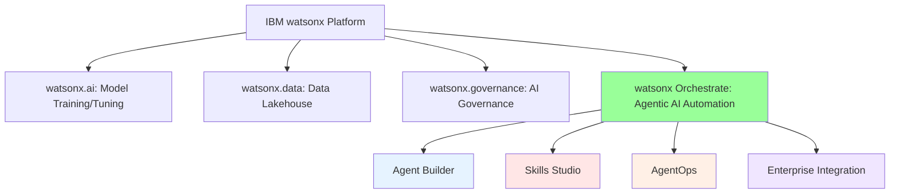

### 1.2 Evolution Timeline

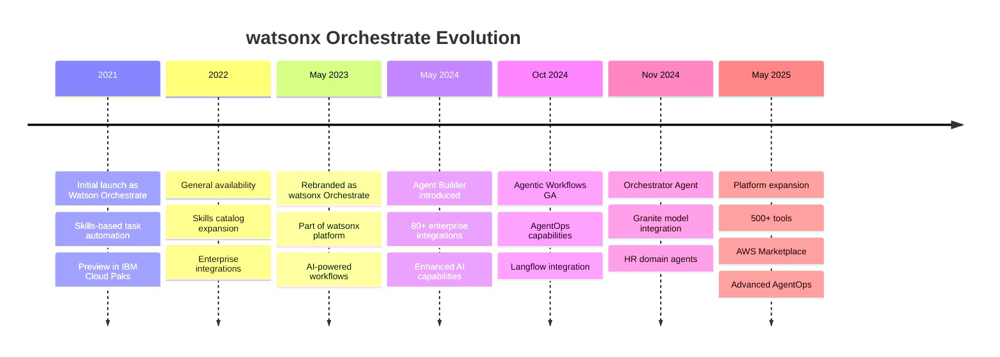

### 1.3 Key Value Propositions

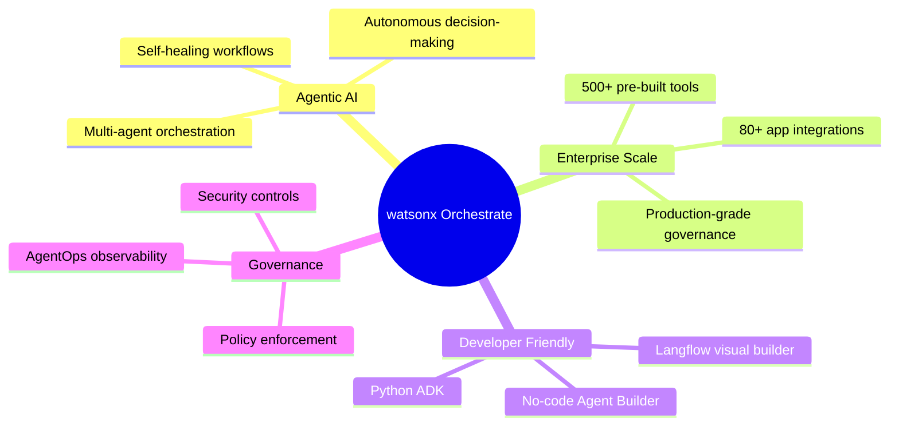

---

## 2. Platform Overview & Architecture

### 2.1 Core Components

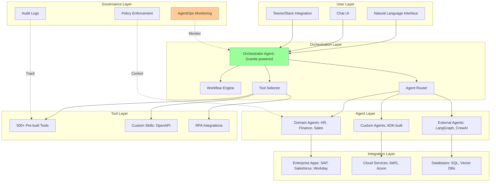

### 2.2 Architecture Patterns

#### Supervisor Pattern

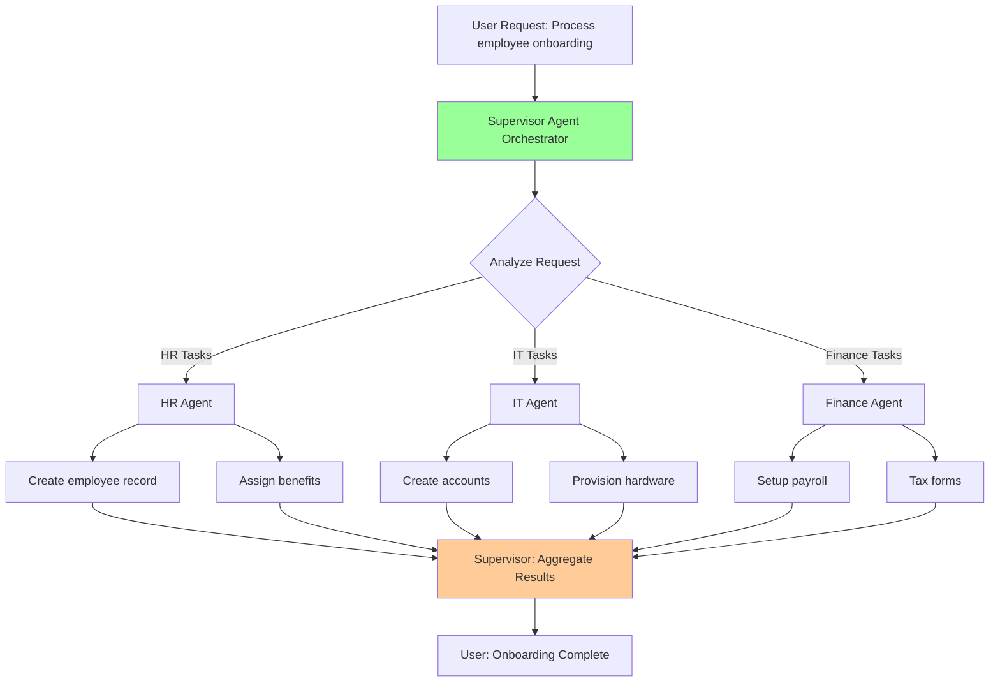

#### Multi-Agent Collaboration

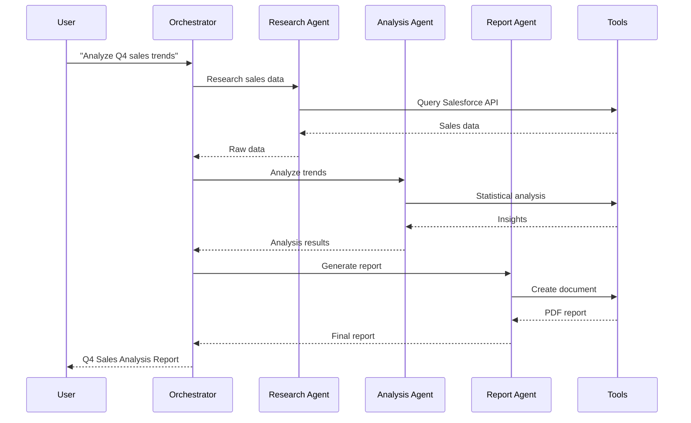

### 2.3 IBM Granite Model Integration

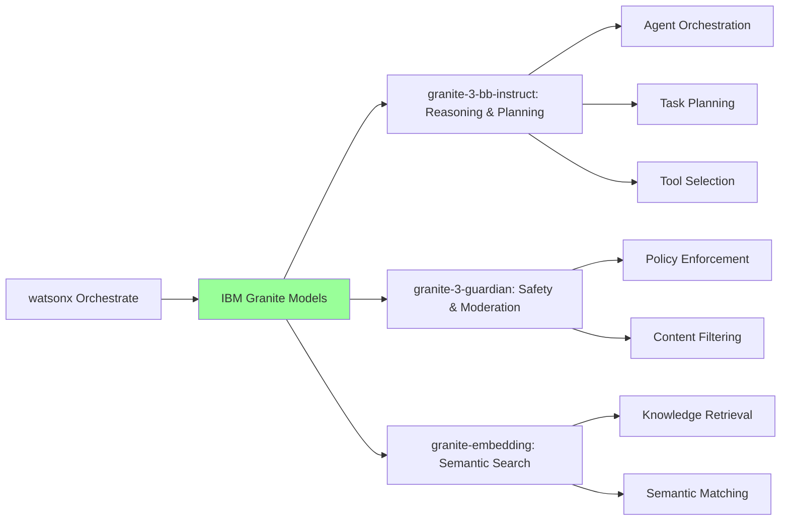

**Granite Model Capabilities**:
- **granite-3-bb-instruct**: Fine-tuned for agent reasoning, task decomposition, and multi-step planning
- **granite-3-guardian**: Safety layer for prompt injection detection, content moderation
- **granite-embedding**: High-quality embeddings for RAG and semantic search

---

## 3. Agentic AI & Workflows

### 3.1 What is Agentic AI?

**Agentic AI** systems don't just respond to requests—they reason, plan, and act autonomously to achieve goals.

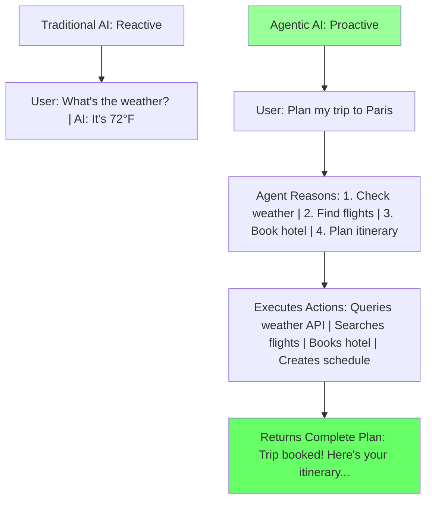

### 3.2 Agentic Workflows

**Definition**: Standardized, reusable flows that sequence multiple agents and tools reliably.

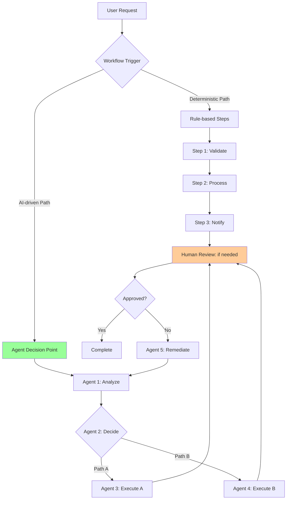

#### Real-World Workflow Example: Employee Onboarding

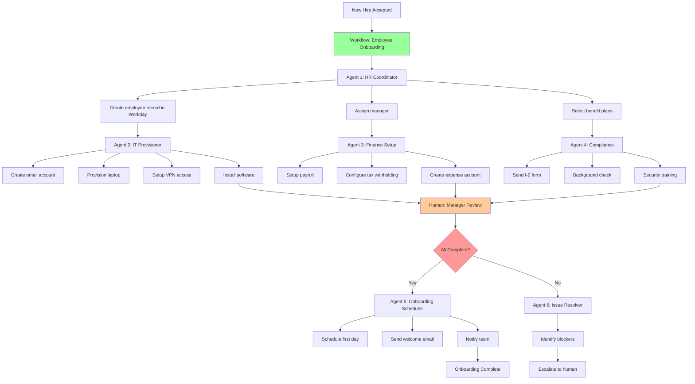

### 3.3 Workflow Types

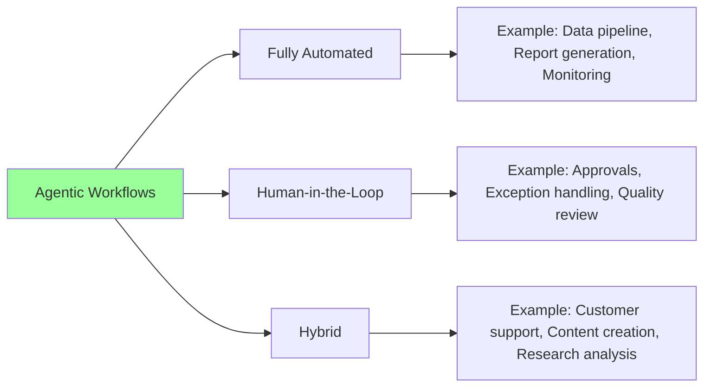

### 3.4 Langflow Integration

**Langflow**: Visual drag-and-drop builder for agentic workflows.

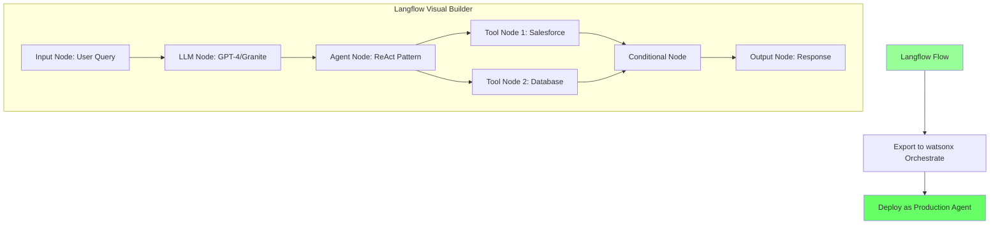

**Benefits**:
- Reduce agent setup time by 60%
- Visual debugging of agent flows
- Template library for common patterns
- Integration with external frameworks (LangGraph, CrewAI)

---

## 4. Agent Development Kit (ADK)

### 4.1 Overview

The **Agent Development Kit (ADK)** is a Python library and CLI for building and deploying agents on watsonx Orchestrate.

```mermaid
graph LR
    A[Developer] --> B[Write Agent | Python + YAML]
    B --> C[ADK CLI]
    C --> D[Local Testing | Developer Edition]
    D --> E[Deploy to | watsonx Orchestrate]
    E --> F[Production Agent]

    C --> G[Agent Builder UI | No-code Alternative]
    G --> E

    style C fill:#99ff99
    style F fill:#66ff66
```

### 4.2 Installation & Setup

```python
# Install ADK
pip install watsonx-orchestrate-adk

# Verify installation
orchestrate --version

# Initialize environment
orchestrate env activate local

# Start Developer Edition (local testing)
orchestrate server start
```

### 4.3 Agent Structure

**Agent Definition (YAML)**:

```yaml
# my-agent.yaml
name: salesforce_opportunity_agent
description: Manages Salesforce opportunities with intelligent automation
version: 1.0.0

llm:
  provider: watsonx
  model: ibm/granite-3-8b-instruct
  parameters:
    temperature: 0.3
    max_tokens: 2000

tools:
  - name: search_opportunities
    type: python
    file: tools/salesforce_tools.py
    function: search_opportunities

  - name: create_opportunity
    type: python
    file: tools/salesforce_tools.py
    function: create_opportunity

  - name: update_opportunity
    type: openapi
    spec: tools/salesforce_api.yaml

agent_type: conversational
agent_pattern: react  # ReAct: Reasoning + Acting

system_prompt: |
  You are a Salesforce opportunity management assistant.
  Help users search, create, and update opportunities.
  Always confirm before making changes.
  Use the available tools to access Salesforce data.

knowledge_base:
  type: vector_db
  connection: milvus_prod
  collection: salesforce_kb
```

**Tool Implementation (Python)**:

```python
# tools/salesforce_tools.py
from simple_salesforce import Salesforce
from typing import Dict, List, Optional

class SalesforceTools:
    """Tools for Salesforce opportunity management"""

    def __init__(self, sf_client: Salesforce):
        self.sf = sf_client

    def search_opportunities(
        self,
        account_name: Optional[str] = None,
        stage: Optional[str] = None,
        amount_min: Optional[float] = None,
        limit: int = 10
    ) -> List[Dict]:
        """
        Search Salesforce opportunities with filters

        Args:
            account_name: Filter by account name (partial match)
            stage: Filter by opportunity stage
            amount_min: Minimum opportunity amount
            limit: Maximum results to return

        Returns:
            List of matching opportunities
        """
        # Build SOQL query
        query = "SELECT Id, Name, AccountName, StageName, Amount, CloseDate FROM Opportunity WHERE "

        conditions = []
        if account_name:
            conditions.append(f"AccountName LIKE '%{account_name}%'")
        if stage:
            conditions.append(f"StageName = '{stage}'")
        if amount_min:
            conditions.append(f"Amount >= {amount_min}")

        if not conditions:
            conditions.append("1=1")  # No filters

        query += " AND ".join(conditions)
        query += f" ORDER BY Amount DESC LIMIT {limit}"

        # Execute query
        result = self.sf.query(query)

        return [
            {
                "id": opp['Id'],
                "name": opp['Name'],
                "account": opp['AccountName'],
                "stage": opp['StageName'],
                "amount": opp['Amount'],
                "close_date": opp['CloseDate']
            }
            for opp in result['records']
        ]

    def create_opportunity(
        self,
        name: str,
        account_id: str,
        stage: str = "Prospecting",
        amount: Optional[float] = None,
        close_date: Optional[str] = None
    ) -> Dict:
        """
        Create a new Salesforce opportunity

        Args:
            name: Opportunity name
            account_id: Salesforce account ID
            stage: Initial stage (default: Prospecting)
            amount: Opportunity amount
            close_date: Expected close date (YYYY-MM-DD)

        Returns:
            Created opportunity details
        """
        opportunity_data = {
            "Name": name,
            "AccountId": account_id,
            "StageName": stage
        }

        if amount:
            opportunity_data["Amount"] = amount
        if close_date:
            opportunity_data["CloseDate"] = close_date

        # Create opportunity
        result = self.sf.Opportunity.create(opportunity_data)

        if result['success']:
            # Retrieve full opportunity details
            opp = self.sf.Opportunity.get(result['id'])
            return {
                "id": opp['Id'],
                "name": opp['Name'],
                "account_id": opp['AccountId'],
                "stage": opp['StageName'],
                "amount": opp.get('Amount'),
                "close_date": opp.get('CloseDate'),
                "created": True
            }
        else:
            raise Exception(f"Failed to create opportunity: {result['errors']}")

    def update_opportunity(
        self,
        opportunity_id: str,
        stage: Optional[str] = None,
        amount: Optional[float] = None,
        close_date: Optional[str] = None
    ) -> Dict:
        """
        Update an existing opportunity

        Args:
            opportunity_id: Salesforce opportunity ID
            stage: New stage
            amount: New amount
            close_date: New close date

        Returns:
            Updated opportunity details
        """
        update_data = {}

        if stage:
            update_data["StageName"] = stage
        if amount:
            update_data["Amount"] = amount
        if close_date:
            update_data["CloseDate"] = close_date

        if not update_data:
            raise ValueError("At least one field must be updated")

        # Update opportunity
        result = self.sf.Opportunity.update(opportunity_id, update_data)

        if result == 204:  # Success code
            opp = self.sf.Opportunity.get(opportunity_id)
            return {
                "id": opp['Id'],
                "name": opp['Name'],
                "stage": opp['StageName'],
                "amount": opp.get('Amount'),
                "close_date": opp.get('CloseDate'),
                "updated": True
            }
        else:
            raise Exception(f"Failed to update opportunity: {result}")


# Register tools with ADK
def get_tools(sf_client: Salesforce):
    """Factory function to create tool instances"""
    tools = SalesforceTools(sf_client)
    return {
        "search_opportunities": tools.search_opportunities,
        "create_opportunity": tools.create_opportunity,
        "update_opportunity": tools.update_opportunity
    }
```

### 4.4 ADK CLI Commands

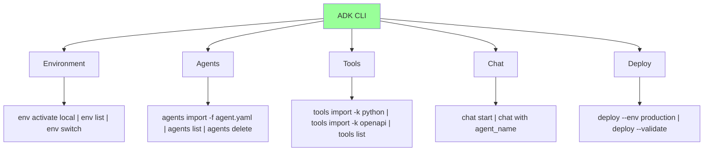

**Common Workflow**:

```bash
# 1. Activate environment
orchestrate env activate local

# 2. Import tools
orchestrate tools import -k python -f tools/salesforce_tools.py -r requirements.txt

# 3. Import agent
orchestrate agents import -f my-agent.yaml

# 4. Test locally
orchestrate chat start

# 5. Deploy to production
orchestrate deploy --env production --agent salesforce_opportunity_agent
```

### 4.5 Agent Patterns

#### ReAct Pattern (Reasoning + Acting)

```mermaid
flowchart TD
    A[User Input: | 'Find high-value opportunities'] --> B[Thought: | Need to search with filters]

    B --> C[Action: | search_opportunities]
    C --> D[Observation: | Found 5 opportunities]

    D --> E[Thought: | User likely wants details]

    E --> F[Action: | Format results as table]
    F --> G[Observation: | Table created]

    G --> H[Thought: | Ready to respond]
    H --> I[Final Answer: | Present formatted results]

    style B fill:#e6f3ff
    style E fill:#e6f3ff
    style H fill:#e6f3ff
    style I fill:#99ff99
```

**Implementation**:

```python
# react_agent.py
from watsonx_orchestrate_adk import Agent, Tool

class ReActAgent(Agent):
    """Agent using ReAct pattern"""

    def run(self, user_input: str) -> str:
        """Execute ReAct loop"""
        max_iterations = 5

        for i in range(max_iterations):
            # Reasoning step
            thought = self.llm.generate(
                f"Given: {user_input}\nPrevious: {self.history}\nThought:"
            )

            if "FINISH" in thought:
                break

            # Acting step
            action = self.extract_action(thought)
            if action:
                observation = self.execute_tool(action)
                self.history.append({
                    "thought": thought,
                    "action": action,
                    "observation": observation
                })

        # Generate final answer
        final_answer = self.llm.generate(
            f"Given all observations, provide final answer to: {user_input}"
        )

        return final_answer
```

---

## 5. Skills & Tools

### 5.1 Skills Overview

**Skills** = Individual capabilities that agents can use (e.g., "Send email", "Query database", "Create ticket")

```mermaid
graph TB
    A[Skills Catalog] --> B[Pre-built Skills | 500+]
    A --> C[Custom Skills]

    B --> B1[Enterprise Apps | Salesforce, SAP, Workday]
    B --> B2[Communication | Email, Slack, Teams]
    B --> B3[Productivity | Calendar, Docs, Tasks]
    B --> B4[Analytics | Tableau, PowerBI]

    C --> C1[OpenAPI Import]
    C --> C2[Python Functions]
    C --> C3[RPA Workflows]

    style A fill:#99ff99
```

### 5.2 Skills Studio

**Skills Studio**: Low-code platform for building custom skills.

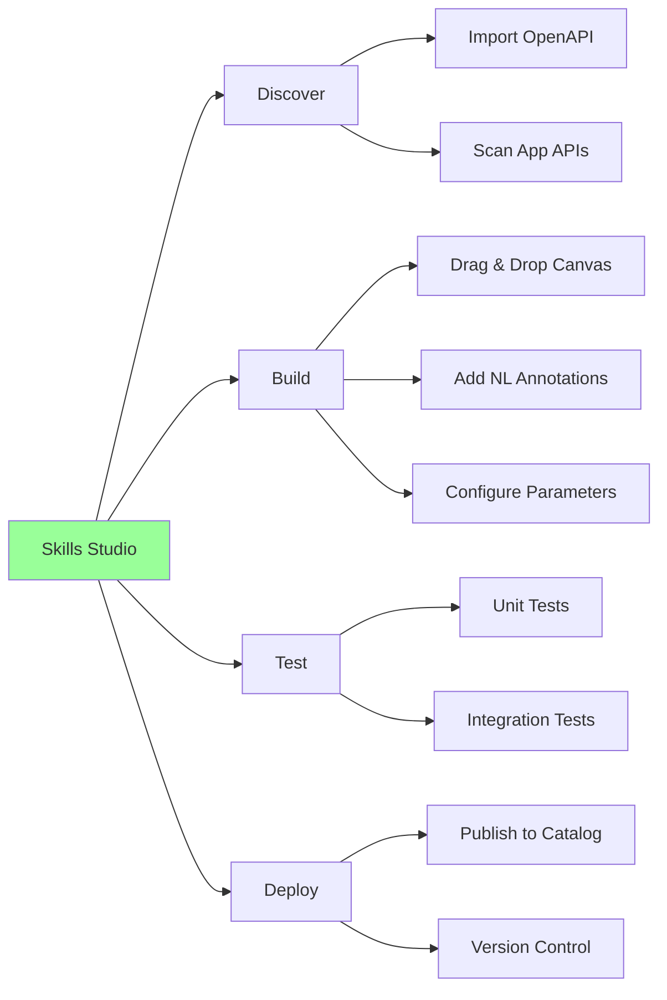

### 5.3 Building Custom Skills with OpenAPI

**Example: Weather API Skill**

```yaml
# weather_api.yaml (OpenAPI 3.0)
openapi: 3.0.0
info:
  title: Weather API
  version: 1.0.0
  description: Get weather information for any location

servers:
  - url: https://api.weatherapi.com/v1

paths:
  /current.json:
    get:
      summary: Get current weather
      description: Returns current weather for a location
      operationId: getCurrentWeather
      parameters:
        - name: q
          in: query
          required: true
          description: Location (city name or lat,lon)
          schema:
            type: string
            example: "San Francisco"
        - name: key
          in: query
          required: true
          description: API key
          schema:
            type: string
      responses:
        '200':
          description: Successful response
          content:
            application/json:
              schema:
                type: object
                properties:
                  location:
                    type: object
                    properties:
                      name:
                        type: string
                      region:
                        type: string
                      country:
                        type: string
                  current:
                    type: object
                    properties:
                      temp_c:
                        type: number
                      condition:
                        type: object
                        properties:
                          text:
                            type: string

x-watsonx-orchestrate:
  naturalLanguage:
    phrases:
      - "What's the weather in {location}"
      - "Get current temperature for {location}"
      - "Check weather in {location}"
  parameters:
    q:
      naturalLanguage: "location"
      examples:
        - "San Francisco"
        - "New York"
        - "37.7749,-122.4194"
```

**Import into Orchestrate**:

```bash
# Import OpenAPI skill
orchestrate tools import -k openapi -f weather_api.yaml

# Verify import
orchestrate tools list | grep weather

# Test skill
orchestrate chat start
> "What's the weather in San Francisco?"
```

### 5.4 Tool Categories

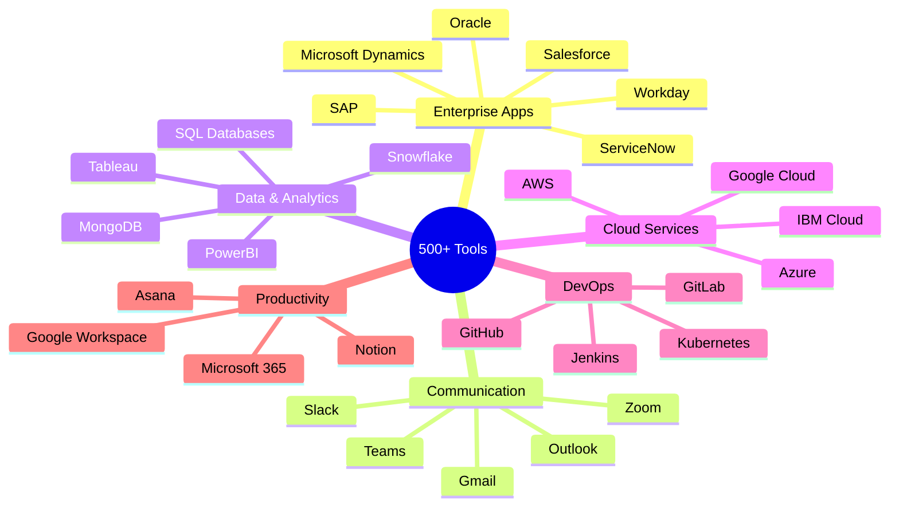

---

## 6. AgentOps: Monitoring & Governance

### 6.1 AgentOps Overview

**AgentOps** = Observability + Governance for agentic AI at scale.

```mermaid
graph TB
    subgraph "AgentOps Platform"
        A[Agent Development] --> B[Pre-deployment | Evaluation]
        B --> C[Staging Area | Testing]
        C --> D[Production | Deployment]
        D --> E[Continuous | Monitoring]
        E --> F[Incident | Response]
        F --> A
    end

    G[Observability] -.->|Metrics| E
    H[Governance] -.->|Policies| C
    I[Security] -.->|Controls| D

    style B fill:#ffcc99
    style C fill:#ffff99
    style E fill:#99ff99
```

### 6.2 Agent Observability Dashboard

```mermaid
graph LR
    A[Observability | Dashboard] --> B[Agent Metrics]
    A --> C[Tool Metrics]
    A --> D[Workflow Metrics]
    A --> E[System Metrics]

    B --> B1[Success Rate | Latency | Token Usage | Cost per Query]

    C --> C1[Tool Call Frequency | Tool Success Rate | Tool Latency | Error Types]

    D --> D1[Workflow Completion | Step Duration | Human Interventions | Failure Points]

    E --> E1[API Throughput | Queue Depth | Resource Usage | Error Rates]

    style A fill:#99ff99
```

**Key Metrics**:

| Metric | Description | Good Target |
|--------|-------------|-------------|
| **Agent Success Rate** | % of queries successfully completed | > 95% |
| **Average Latency** | Time from query to response | < 5 seconds |
| **Tool Call Accuracy** | % of correct tool selections | > 90% |
| **Token Efficiency** | Tokens used per query | Minimize |
| **Cost per Query** | $ per user interaction | < $0.05 |
| **Human Escalation Rate** | % requiring human intervention | < 10% |

### 6.3 Governance Framework

```mermaid
flowchart TD
    A[Agent Submission] --> B{Pre-Deployment | Evaluation}

    B --> C[Quality Tests]
    C --> C1[Journey Completion | Answer Relevancy | Tool Call Accuracy]

    B --> D[Security Tests]
    D --> D1[Prompt Injection | Data Leakage | Authorization]

    B --> E[Performance Tests]
    E --> E1[Latency | Throughput | Cost]

    C1 --> F{All Tests Pass?}
    D1 --> F
    E1 --> F

    F -->|No| G[Remediation Required]
    F -->|Yes| H[Staging Deployment]

    G --> A

    H --> I[Production Monitoring]
    I --> J{Policy | Violations?}

    J -->|Yes| K[Alert + Auto-remediate]
    J -->|No| L[Continue Monitoring]

    K --> M{Severe?}
    M -->|Yes| N[Emergency Shutdown]
    M -->|No| O[Log + Notify]

    L --> I
    O --> I

    style F fill:#ffcc99
    style J fill:#ffcc99
    style N fill:#ff9999
```

### 6.4 Policy Examples

**Governance Policies (YAML)**:

```yaml
# governance_policies.yaml
policies:
  - name: cost_control
    type: budget
    rules:
      - metric: cost_per_day
        threshold: 1000.00
        currency: USD
        action: alert
      - metric: cost_per_query
        threshold: 1.00
        currency: USD
        action: throttle

  - name: data_protection
    type: security
    rules:
      - check: pii_detection
        action: mask
        patterns:
          - ssn
          - credit_card
          - email
      - check: sensitive_data_access
        action: require_approval
        data_classifications:
          - confidential
          - restricted

  - name: quality_assurance
    type: performance
    rules:
      - metric: success_rate
        threshold: 0.90
        window: 1h
        action: alert
      - metric: latency_p95
        threshold: 10.0
        unit: seconds
        action: scale_up

  - name: compliance
    type: regulatory
    rules:
      - check: gdpr_consent
        required: true
        regions: [EU]
      - check: audit_logging
        retention_days: 365
        log_level: INFO

enforcement:
  mode: automatic  # automatic, manual, advisory
  alerts:
    slack_channel: "#agent-ops"
    email: ops-team@company.com
  auto_remediation:
    enabled: true
    actions:
      - throttle_requests
      - scale_resources
      - rollback_deployment
```

### 6.5 OpenTelemetry Integration

**Distributed Tracing**:

```python
# Instrument agent with OpenTelemetry
from opentelemetry import trace
from opentelemetry.sdk.trace import TracerProvider
from opentelemetry.sdk.trace.export import BatchSpanProcessor
from watsonx_orchestrate_adk import Agent

# Setup tracer
trace.set_tracer_provider(TracerProvider())
tracer = trace.get_tracer(__name__)

class InstrumentedAgent(Agent):
    """Agent with OpenTelemetry tracing"""

    def handle_query(self, query: str) -> str:
        with tracer.start_as_current_span("agent.handle_query") as span:
            span.set_attribute("query", query)

            # Reasoning step
            with tracer.start_as_current_span("agent.reasoning"):
                thought = self.reason(query)
                span.set_attribute("thought", thought)

            # Tool selection
            with tracer.start_as_current_span("agent.tool_selection"):
                tool = self.select_tool(thought)
                span.set_attribute("tool_name", tool.name)

            # Tool execution
            with tracer.start_as_current_span(f"tool.{tool.name}"):
                result = tool.execute()
                span.set_attribute("tool_result", str(result))

            # Response generation
            with tracer.start_as_current_span("agent.response"):
                response = self.generate_response(result)
                span.set_attribute("response", response)

            return response
```

**Trace Visualization**:

```mermaid
gantt
    title Agent Query Execution Trace
    dateFormat ss.SSS
    axisFormat %S.%L

    section Agent
    handle_query :a1, 00.000, 5s

    section Reasoning
    reasoning :a2, 00.100, 1s

    section Tool Selection
    tool_selection :a3, 01.200, 0.5s

    section Tool Execution
    salesforce_query :a4, 01.800, 2s

    section Response
    generate_response :a5, 03.900, 1s
```

---

## 7. Enterprise Integration

### 7.1 Integration Architecture

```mermaid
graph TB
    subgraph "watsonx Orchestrate"
        A[Agent Platform]
    end

    subgraph "Enterprise Apps"
        B1[Salesforce]
        B2[SAP]
        B3[Workday]
        B4[ServiceNow]
        B5[Oracle]
        B6[Microsoft Dynamics]
    end

    subgraph "Cloud Platforms"
        C1[AWS | Bedrock, Lambda]
        C2[Azure | OpenAI, Functions]
        C3[Google Cloud | Vertex AI]
    end

    subgraph "Collaboration"
        D1[Slack]
        D2[Teams]
        D3[Email]
    end

    subgraph "Data Sources"
        E1[SQL Databases]
        E2[MongoDB]
        E3[Snowflake]
        E4[S3/Blob Storage]
    end

    A --> B1
    A --> B2
    A --> B3
    A --> B4
    A --> B5
    A --> B6

    A --> C1
    A --> C2
    A --> C3

    A --> D1
    A --> D2
    A --> D3

    A --> E1
    A --> E2
    A --> E3
    A --> E4

    style A fill:#99ff99
```

### 7.2 AWS Integration

**watsonx Orchestrate on AWS Marketplace**:

```mermaid
graph LR
    A[AWS Marketplace] --> B[watsonx Orchestrate | as a Service]

    B --> C[Amazon Bedrock | Foundation Models]
    B --> D[Amazon Bedrock | AgentCore]
    B --> E[AWS Lambda | Custom Functions]
    B --> F[Amazon S3 | Storage]

    C --> G[Claude, Llama, etc.]
    D --> H[A2A Protocol | Agent Collaboration]
    E --> I[Serverless Agents]
    F --> J[Document Storage]

    style B fill:#99ff99
```

**Benefits**:
- Deploy via AWS Marketplace with existing AWS contracts
- Use committed spend credits
- Integrate with Amazon Bedrock models (Claude, Llama, Titan)
- AgentCore for multi-agent coordination
- Serverless deployment with auto-scaling

### 7.3 Celonis Process Intelligence Integration

```mermaid
flowchart TD
    A[Celonis Process | Intelligence Graph] --> B[Identify Automation | Opportunities]

    B --> C[Process Mining | Analysis]
    C --> D[Bottleneck Detection]
    C --> E[Inefficiency Identification]
    C --> F[Variant Analysis]

    D --> G[watsonx Orchestrate]
    E --> G
    F --> G

    G --> H[Build AI Agents | for Identified Tasks]

    H --> I[Deploy Agents]
    I --> J[Monitor Performance]

    J --> K[Feed Results Back | to Celonis]
    K --> A

    style A fill:#99ccff
    style G fill:#99ff99
```

**Use Case**: Procure-to-Pay Automation
1. **Celonis** identifies delays in invoice approval process
2. **watsonx Orchestrate** builds agent to auto-approve low-value invoices
3. **Agent** handles 80% of invoices automatically
4. **Celonis** monitors 40% reduction in approval time

### 7.4 Connection Management

**Secure Connection Configuration**:

```yaml
# connections.yaml
connections:
  - name: salesforce_prod
    type: oauth2
    provider: salesforce
    credentials:
      client_id: ${SALESFORCE_CLIENT_ID}
      client_secret: ${SALESFORCE_CLIENT_SECRET}
      auth_url: https://login.salesforce.com/services/oauth2/authorize
      token_url: https://login.salesforce.com/services/oauth2/token
    scopes:
      - api
      - refresh_token

  - name: sap_erp
    type: basic_auth
    provider: sap
    base_url: https://sap.company.com/api
    credentials:
      username: ${SAP_USERNAME}
      password: ${SAP_PASSWORD}

  - name: workday_hris
    type: api_key
    provider: workday
    base_url: https://wd2-impl.workday.com
    credentials:
      api_key: ${WORKDAY_API_KEY}
      tenant: company_tenant

  - name: aws_bedrock
    type: aws_credentials
    provider: aws
    region: us-east-1
    credentials:
      access_key_id: ${AWS_ACCESS_KEY}
      secret_access_key: ${AWS_SECRET_KEY}

security:
  credential_storage: vault  # vault, secrets_manager, key_vault
  encryption: AES-256
  rotation_policy: 90_days
  audit_logging: enabled
```

---

## 8. RAG & Knowledge Bases

### 8.1 RAG Integration Architecture

```mermaid
graph TB
    subgraph "User Interaction"
        A[User Query]
    end

    subgraph "watsonx Orchestrate Agent"
        B[Agent Receives Query]
        C{Requires | Knowledge?}
    end

    subgraph "Knowledge Retrieval"
        D[Query Embedding | granite-embedding]
        E[Vector Search | Milvus/Elasticsearch]
        F[Retrieve Top-K Docs]
        G[Rerank Results]
    end

    subgraph "LLM Generation"
        H[Construct Prompt: | Context + Query]
        I[LLM Generation | Granite/Bedrock]
        J[Response]
    end

    subgraph "Knowledge Sources"
        K[IBM Watson Discovery]
        L[Vector Databases | Milvus, MongoDB Atlas]
        M[Enterprise Docs | Confluence, SharePoint]
    end

    A --> B
    B --> C
    C -->|Yes| D
    C -->|No| I

    D --> E
    K --> E
    L --> E
    M --> E

    E --> F
    F --> G
    G --> H
    H --> I
    I --> J

    style B fill:#99ff99
    style E fill:#ffcc99
    style I fill:#99ccff
```

### 8.2 Knowledge Base Setup

**Create Knowledge Base (ADK)**:

```python
# knowledge_base.py
from watsonx_orchestrate_adk import KnowledgeBase
from watsonx_orchestrate_adk.embeddings import GraniteEmbeddings
from milvus import connections, Collection, CollectionSchema, FieldSchema, DataType

class OrchestratKnowledgeBase:
    """RAG knowledge base for watsonx Orchestrate agents"""

    def __init__(
        self,
        collection_name: str,
        embedding_model: str = "ibm/granite-embedding-125m-english",
        vector_db_host: str = "localhost",
        vector_db_port: int = 19530
    ):
        self.collection_name = collection_name
        self.embeddings = GraniteEmbeddings(model_name=embedding_model)

        # Connect to Milvus
        connections.connect(host=vector_db_host, port=vector_db_port)

        # Create collection if not exists
        self._create_collection()

    def _create_collection(self):
        """Create Milvus collection schema"""
        fields = [
            FieldSchema(name="id", dtype=DataType.INT64, is_primary=True, auto_id=True),
            FieldSchema(name="text", dtype=DataType.VARCHAR, max_length=65535),
            FieldSchema(name="embedding", dtype=DataType.FLOAT_VECTOR, dim=768),
            FieldSchema(name="metadata", dtype=DataType.JSON)
        ]

        schema = CollectionSchema(fields, description="Knowledge base for agents")
        self.collection = Collection(self.collection_name, schema)

        # Create index
        index_params = {
            "metric_type": "COSINE",
            "index_type": "IVF_FLAT",
            "params": {"nlist": 1024}
        }
        self.collection.create_index("embedding", index_params)

    def add_documents(self, documents: List[Dict]):
        """
        Add documents to knowledge base

        Args:
            documents: List of dicts with 'text' and optional 'metadata'
        """
        texts = [doc['text'] for doc in documents]
        metadata = [doc.get('metadata', {}) for doc in documents]

        # Generate embeddings
        embeddings = self.embeddings.embed_documents(texts)

        # Insert to Milvus
        data = [texts, embeddings, metadata]
        self.collection.insert(data)
        self.collection.flush()

    def search(self, query: str, top_k: int = 5) -> List[Dict]:
        """
        Search knowledge base

        Args:
            query: Search query
            top_k: Number of results

        Returns:
            List of relevant documents with scores
        """
        # Embed query
        query_embedding = self.embeddings.embed_query(query)

        # Search
        search_params = {"metric_type": "COSINE", "params": {"nprobe": 10}}
        results = self.collection.search(
            data=[query_embedding],
            anns_field="embedding",
            param=search_params,
            limit=top_k,
            output_fields=["text", "metadata"]
        )

        # Format results
        docs = []
        for hit in results[0]:
            docs.append({
                "text": hit.entity.get('text'),
                "metadata": hit.entity.get('metadata'),
                "score": hit.score
            })

        return docs


# Usage in agent
kb = OrchestrateKnowledgeBase(collection_name="company_policies")

# Add documents
kb.add_documents([
    {
        "text": "Employee vacation policy: Full-time employees receive 15 days PTO per year...",
        "metadata": {"source": "HR_Handbook", "page": 12}
    },
    {
        "text": "Remote work policy: Employees may work remotely up to 3 days per week...",
        "metadata": {"source": "HR_Handbook", "page": 25}
    }
])

# Search
results = kb.search("How many vacation days do I get?", top_k=3)
```

### 8.3 IBM Watson Discovery Integration

```mermaid
graph LR
    A[watsonx Orchestrate | Agent] --> B[Watson Discovery | API]

    B --> C[Document Ingestion]
    C --> C1[PDFs]
    C --> C2[Word Docs]
    C --> C3[Confluence]
    C --> C4[SharePoint]

    B --> D[Search & Retrieval]
    D --> D1[Natural Language | Search]
    D --> D2[Faceted Search]
    D --> D3[Entity Extraction]

    B --> E[Enrichment]
    E --> E1[NLP Analysis]
    E --> E2[Sentiment]
    E --> E3[Classifications]

    style A fill:#99ff99
    style B fill:#99ccff
```

**Discovery Configuration**:

```yaml
# watson_discovery.yaml
knowledge_base:
  type: watson_discovery
  instance_id: ${DISCOVERY_INSTANCE_ID}
  api_key: ${DISCOVERY_API_KEY}
  project_id: ${DISCOVERY_PROJECT_ID}

  collections:
    - name: company_policies
      documents: 1500
      enrichments:
        - entity_extraction
        - sentiment_analysis

    - name: technical_docs
      documents: 5000
      enrichments:
        - entity_extraction

  search_config:
    max_results: 10
    min_score: 0.5
    return_fields:
      - document_id
      - title
      - text
      - extracted_metadata

    passages:
      enabled: true
      max_per_document: 3
      characters: 500
```

### 8.4 Hybrid Search (Dense + Sparse)

```python
def hybrid_search(query: str, top_k: int = 10, alpha: float = 0.5):
    """
    Hybrid search combining dense and sparse retrieval

    Args:
        query: Search query
        top_k: Number of results
        alpha: Weight for dense vs sparse (0=sparse only, 1=dense only)

    Returns:
        Ranked documents
    """
    # Dense retrieval (vector search)
    dense_results = vector_db.search(query, top_k=top_k*2)

    # Sparse retrieval (BM25)
    sparse_results = elasticsearch.search(
        index="knowledge_base",
        body={
            "query": {
                "match": {
                    "text": query
                }
            },
            "size": top_k*2
        }
    )

    # Combine scores
    doc_scores = {}

    for doc in dense_results:
        doc_id = doc['id']
        doc_scores[doc_id] = alpha * doc['score']

    for doc in sparse_results['hits']['hits']:
        doc_id = doc['_id']
        score = doc['_score']
        if doc_id in doc_scores:
            doc_scores[doc_id] += (1 - alpha) * score
        else:
            doc_scores[doc_id] = (1 - alpha) * score

    # Rank by combined score
    ranked_docs = sorted(doc_scores.items(), key=lambda x: x[1], reverse=True)

    return ranked_docs[:top_k]
```

---

## 9. Production Deployment

### 9.1 Deployment Architecture

```mermaid
graph TB
    subgraph "Development"
        A[Local Development | Developer Edition]
        B[ADK CLI]
        C[Version Control | Git]
    end

    subgraph "CI/CD Pipeline"
        D[Build & Test]
        E[Security Scan]
        F[Performance Test]
    end

    subgraph "Staging"
        G[Staging Environment]
        H[Integration Tests]
        I[UAT]
    end

    subgraph "Production"
        J[Production Deployment]
        K[Blue-Green | Deployment]
        L[Canary Release]
    end

    subgraph "Monitoring"
        M[AgentOps Dashboard]
        N[Alerts & Incidents]
        O[Auto-scaling]
    end

    A --> B
    B --> C
    C --> D
    D --> E
    E --> F
    F --> G
    G --> H
    H --> I
    I --> J
    J --> K
    K --> L

    L --> M
    M --> N
    M --> O

    N -.->|Rollback| K

    style J fill:#99ff99
    style M fill:#ffcc99
```

### 9.2 Deployment Options

```mermaid
graph LR
    A[watsonx Orchestrate] --> B[IBM Cloud | SaaS]
    A --> C[AWS | Marketplace]
    A --> D[On-Premises | Cloud Pak for Data]

    B --> B1[Multi-tenant | Shared infrastructure | Pay-as-you-go]

    C --> C1[Single-tenant | AWS infrastructure | Marketplace billing]

    D --> D1[Self-managed | Private cloud/data center | Capacity licensing]

    style A fill:#99ff99
```

### 9.3 Scaling Strategy

```mermaid
graph TB
    A[Load Balancer] --> B[Agent API Gateway]

    B --> C[Agent Cluster 1 | Auto-scaling Group]
    B --> D[Agent Cluster 2 | Auto-scaling Group]
    B --> E[Agent Cluster N | Auto-scaling Group]

    C --> F[LLM Service | watsonx.ai / Bedrock]
    D --> F
    E --> F

    C --> G[Vector DB | Milvus Cluster]
    D --> G
    E --> G

    C --> H[Tool Services | Microservices]
    D --> H
    E --> H

    F --> I[Model Cache | Redis]
    G --> J[Data Lake | S3 / Cloud Object Storage]

    style B fill:#99ff99
    style F fill:#99ccff
```

**Auto-scaling Configuration**:

```yaml
# autoscaling.yaml
autoscaling:
  agents:
    min_replicas: 3
    max_replicas: 20
    target_metrics:
      - type: cpu_utilization
        target: 70
      - type: memory_utilization
        target: 80
      - type: request_latency_p95
        target: 5000  # milliseconds
      - type: queue_depth
        target: 100

    scale_up:
      cooldown: 120  # seconds
      step_size: 2

    scale_down:
      cooldown: 300
      step_size: 1

  llm_service:
    model_cache_size: 10GB
    batch_size: 8
    concurrent_requests: 50

  vector_db:
    read_replicas: 3
    cache_size: 5GB
```

### 9.4 Disaster Recovery

```mermaid
graph TB
    subgraph "Primary Region"
        A[watsonx Orchestrate | Primary]
        B[Vector DB | Primary]
        C[LLM Service | Primary]
    end

    subgraph "DR Region"
        D[watsonx Orchestrate | Standby]
        E[Vector DB | Replica]
        F[LLM Service | Standby]
    end

    A -->|Continuous | Replication| D
    B -->|Async | Replication| E
    C -->|Model | Sync| F

    G[Global Load Balancer] --> A
    G -.->|Failover| D

    H[Health Check] -.->|Monitor| A
    H -.->|Monitor| D

    I{Primary | Failure?} -->|Yes| J[Automatic | Failover]
    J --> D

    style G fill:#99ff99
    style J fill:#ff9999
```

### 9.5 Security Best Practices

```mermaid
mindmap
  root((Security))
    Authentication
      OAuth 2.0
      SAML SSO
      API Keys
      MFA
    Authorization
      RBAC
      ABAC
      Policy Engine
    Data Protection
      Encryption at Rest
      Encryption in Transit
      Data Masking
      PII Detection
    Network Security
      VPC Isolation
      Private Endpoints
      WAF
      DDoS Protection
    Compliance
      GDPR
      HIPAA
      SOC 2
      ISO 27001
    Audit
      Logging
      Monitoring
      Alerting
      Forensics
```

---

## 10. Competitive Landscape

### 10.1 Comparison Matrix

```mermaid
graph TB
    A[Enterprise AI | Automation] --> B[IBM watsonx | Orchestrate]
    A --> C[UiPath]
    A --> D[Automation Anywhere]
    A --> E[Microsoft Power | Automate]

    B --> B1[Strengths: | ✓ Agentic AI | ✓ Natural language | ✓ Enterprise integration | ✓ AgentOps]

    C --> C1[Strengths: | ✓ RPA focus | ✓ Community | ✓ Computer vision | ✓ Academy]

    D --> D1[Strengths: | ✓ Co-Pilot | ✓ Scalability | ✓ Cloud-native | ✓ IQ Bot]

    E --> E1[Strengths: | ✓ Microsoft ecosystem | ✓ Low cost | ✓ Easy adoption | ✓ Connectors]

    style B fill:#99ff99
```

| Feature | watsonx Orchestrate | UiPath | Automation Anywhere | Power Automate |
|---------|---------------------|--------|---------------------|----------------|
| **Agentic AI** | ⭐⭐⭐⭐⭐ | ⭐⭐⭐ | ⭐⭐⭐⭐ | ⭐⭐ |
| **Natural Language** | ⭐⭐⭐⭐⭐ | ⭐⭐⭐ | ⭐⭐⭐ | ⭐⭐⭐ |
| **RPA Capabilities** | ⭐⭐⭐ | ⭐⭐⭐⭐⭐ | ⭐⭐⭐⭐⭐ | ⭐⭐⭐ |
| **Enterprise Integration** | ⭐⭐⭐⭐⭐ (80+) | ⭐⭐⭐⭐ | ⭐⭐⭐⭐ | ⭐⭐⭐⭐⭐ (300+) |
| **Observability** | ⭐⭐⭐⭐⭐ (AgentOps) | ⭐⭐⭐⭐ | ⭐⭐⭐⭐ | ⭐⭐⭐ |
| **Governance** | ⭐⭐⭐⭐⭐ | ⭐⭐⭐⭐ | ⭐⭐⭐⭐ | ⭐⭐⭐ |
| **Developer Experience** | ⭐⭐⭐⭐ (Python ADK) | ⭐⭐⭐⭐ (Studio) | ⭐⭐⭐⭐ | ⭐⭐⭐⭐ (Low-code) |
| **AI/ML Integration** | ⭐⭐⭐⭐⭐ (watsonx) | ⭐⭐⭐ | ⭐⭐⭐⭐ | ⭐⭐⭐ (Azure AI) |
| **Pricing** | $$$ | $$$$ | $$$$ | $ - $$ |
| **Learning Curve** | Medium | Medium-High | Medium | Low |

### 10.2 When to Choose watsonx Orchestrate

```mermaid
flowchart TD
    A{What's your | primary use case?} -->|Complex reasoning | & decision-making| B[watsonx Orchestrate | ⭐⭐⭐⭐⭐]

    A -->|Desktop automation | & screen scraping| C[UiPath | ⭐⭐⭐⭐⭐]

    A -->|Simple workflows | in Microsoft 365| D[Power Automate | ⭐⭐⭐⭐⭐]

    A -->|Multi-agent | orchestration| B

    A -->|Enterprise AI | at scale| B

    A -->|Attended automation | with Co-Pilot| E[Automation Anywhere | ⭐⭐⭐⭐⭐]

    style B fill:#99ff99
```

**Choose watsonx Orchestrate if**:
- ✅ Need agentic AI with autonomous decision-making
- ✅ Require natural language interaction
- ✅ Want enterprise-grade governance and observability
- ✅ Already using IBM ecosystem (watsonx.ai, Cloud Pak for Data)
- ✅ Need integration with 80+ enterprise apps
- ✅ Require multi-agent orchestration at scale

**Consider alternatives if**:
- ⚠️ Primary need is desktop RPA (UiPath better)
- ⚠️ Budget-conscious and in Microsoft ecosystem (Power Automate)
- ⚠️ Need extensive community resources and training (UiPath Academy)

---

## 11. Interview Questions

### Architecture & Platform

**Q1: Explain the architecture of IBM watsonx Orchestrate. What are the key layers?**

<details>
<summary>Answer</summary>

**watsonx Orchestrate Architecture** has 6 key layers:

1. **User Layer**: Natural language interface, chat UI, Teams/Slack integration
2. **Orchestration Layer**: Orchestrator agent (Granite-powered), workflow engine, agent router, tool selector
3. **Agent Layer**: Domain agents (HR, Finance, Sales), custom agents (ADK-built), external agents (LangGraph, CrewAI)
4. **Tool Layer**: 500+ pre-built tools, custom skills (OpenAPI), RPA integrations
5. **Integration Layer**: Enterprise apps (SAP, Salesforce, Workday), cloud services (AWS, Azure), databases
6. **Governance Layer**: AgentOps monitoring, policy enforcement, audit logs

**Key Design Principles**:
- **Supervisor pattern**: Central orchestrator routes requests to specialized agents
- **Tool abstraction**: Skills as reusable capabilities
- **Event-driven**: Asynchronous workflows with human-in-the-loop
- **Multi-model**: Supports multiple LLMs (Granite, Bedrock, etc.)
</details>

---

**Q2: How does the Orchestrator Agent work? What role does IBM Granite play?**

<details>
<summary>Answer</summary>

The **Orchestrator Agent** acts as a supervisor that:

1. **Receives** user requests via natural language
2. **Analyzes** intent using IBM Granite models (granite-3-bb-instruct)
3. **Plans** multi-step execution strategy
4. **Routes** subtasks to specialized agents
5. **Monitors** execution and handles failures
6. **Aggregates** results from multiple agents
7. **Responds** to user with coherent answer

**IBM Granite Integration**:
- **granite-3-bb-instruct**: Reasoning, task decomposition, tool selection
- **granite-3-guardian**: Safety checks, prompt injection detection
- **granite-embedding**: Semantic search for knowledge retrieval

**Example Flow**:
```
User: "Onboard new employee John Doe"
↓
Orchestrator analyzes → Needs HR, IT, Finance agents
↓
Routes to:
  - HR Agent: Create employee record
  - IT Agent: Setup accounts
  - Finance Agent: Payroll setup
↓
Aggregates results → "John Doe successfully onboarded"
```
</details>

---

**Q3: What are Agentic Workflows? How do they differ from traditional workflows?**

<details>
<summary>Answer</summary>

**Agentic Workflows** are standardized, reusable flows that sequence multiple agents and tools with AI-driven decision-making.

**Key Differences**:

| Traditional Workflows | Agentic Workflows |
|----------------------|-------------------|
| Deterministic (if-then-else) | AI-driven decisions |
| Fixed paths | Dynamic routing |
| Brittle (breaks on exceptions) | Self-healing |
| No reasoning | Multi-step reasoning |
| Human defines every step | Agents decide steps |

**Example**:

**Traditional**:
```
Step 1: Check inventory
IF inventory < 10 THEN
  Step 2: Create purchase order
ELSE
  Step 3: Mark as fulfilled
```

**Agentic**:
```
Agent 1: Analyze inventory trends
Agent 2: Decide optimal reorder point (considers seasonality, demand)
Agent 3: Select best supplier (considers price, lead time, quality)
Agent 4: Create PO or negotiate contract
```

**Benefits**:
- Handle complex, ambiguous scenarios
- Adapt to changing conditions
- Self-correct on failures
- Learn from feedback
</details>

---

### Agent Development

**Q4: Walk me through creating a custom agent using the ADK. What are the key components?**

<details>
<summary>Answer</summary>

**Steps to Create Custom Agent with ADK**:

1. **Install ADK**:
```bash
pip install watsonx-orchestrate-adk
orchestrate --version
```

2. **Define Agent (YAML)**:
```yaml
name: my_agent
description: Agent description
llm:
  provider: watsonx
  model: ibm/granite-3-8b-instruct
tools:
  - name: tool1
    type: python
    file: tools.py
agent_pattern: react
```

3. **Implement Tools (Python)**:
```python
def tool1(param1: str) -> Dict:
    # Tool logic
    return {"result": "..."}
```

4. **Test Locally**:
```bash
orchestrate env activate local
orchestrate agents import -f agent.yaml
orchestrate chat start
```

5. **Deploy to Production**:
```bash
orchestrate deploy --env production
```

**Key Components**:
- **Agent definition**: YAML with metadata, LLM config, tools
- **Tools**: Python functions or OpenAPI specs
- **System prompt**: Instructions for agent behavior
- **Agent pattern**: ReAct, plan-and-execute, reflexion
- **Knowledge base**: Optional vector DB integration
</details>

---

**Q5: What is the ReAct pattern? How would you implement it?**

<details>
<summary>Answer</summary>

**ReAct** = **Reasoning** + **Acting**

The agent alternates between thinking (reasoning) and doing (acting with tools).

**Loop**:
1. **Thought**: Reason about what to do next
2. **Action**: Execute a tool
3. **Observation**: See result
4. Repeat until final answer

**Example**:
```
User: "Find high-value opportunities closing this quarter"

Thought: Need to search Salesforce with filters
Action: search_opportunities(stage="Negotiation", close_date="Q4")
Observation: Found 5 opportunities

Thought: User likely wants details sorted by amount
Action: sort_by_amount(opportunities)
Observation: Sorted list

Thought: Ready to present
Final Answer: [Formatted table of 5 opportunities]
```

**Implementation**:
```python
def react_loop(user_input, max_iterations=5):
    for i in range(max_iterations):
        # Reasoning
        thought = llm.generate(f"Thought: {context}")

        if "FINISH" in thought:
            break

        # Acting
        action = extract_action(thought)
        observation = execute_tool(action)

        context += f"\nThought: {thought}\nAction: {action}\nObservation: {observation}"

    return llm.generate(f"Final Answer: {context}")
```

**Benefits**:
- Transparent reasoning
- Error recovery (can adjust based on observations)
- Tool selection is explicit
</details>

---

### Skills & Integration

**Q6: How would you integrate a custom REST API as a skill in watsonx Orchestrate?**

<details>
<summary>Answer</summary>

**Two Approaches**:

**1. OpenAPI Import** (Recommended):

```yaml
# weather_api.yaml (OpenAPI 3.0)
openapi: 3.0.0
info:
  title: Weather API
  version: 1.0.0

paths:
  /current:
    get:
      operationId: getCurrentWeather
      parameters:
        - name: location
          in: query
          schema:
            type: string

x-watsonx-orchestrate:
  naturalLanguage:
    phrases:
      - "What's the weather in {location}"
```

Import:
```bash
orchestrate tools import -k openapi -f weather_api.yaml
```

**2. Python Wrapper**:

```python
import requests

def get_current_weather(location: str) -> Dict:
    """Get current weather for location"""
    response = requests.get(
        "https://api.weather.com/current",
        params={"location": location, "key": API_KEY}
    )
    return response.json()
```

Import:
```bash
orchestrate tools import -k python -f weather_tools.py -r requirements.txt
```

**Best Practices**:
- Add natural language annotations for better LLM understanding
- Include authentication in connection config
- Add error handling
- Document parameters clearly
- Test with multiple example inputs
</details>

---

**Q7: Explain the difference between Skills, Tools, and Agents.**

<details>
<summary>Answer</summary>

```mermaid
graph TB
    A[Agents] --> B[Tools]
    B --> C[Skills]

    A1[Decision-making | entities] -.-> A
    B1[Capabilities | agents can use] -.-> B
    C1[Individual | functions] -.-> C

    style A fill:#99ff99
    style B fill:#99ccff
    style C fill:#ffcc99
```

**Skills**:
- Individual functions/capabilities
- Example: "Send email", "Query Salesforce", "Create ticket"
- Granular, single-purpose
- Can be OpenAPI or Python

**Tools**:
- Collections of related skills
- Example: "Salesforce Tool" (includes search, create, update skills)
- Logical grouping
- May share authentication

**Agents**:
- Intelligent entities that use tools
- Make decisions about which tools to use
- Have reasoning capabilities (LLM-powered)
- Can orchestrate multiple tools
- Example: "HR Agent" uses tools for Workday, email, calendar

**Hierarchy**:
```
Agent: HR Onboarding Agent
  ├─ Tool: Workday
  │   ├─ Skill: create_employee
  │   └─ Skill: assign_manager
  ├─ Tool: Email
  │   └─ Skill: send_welcome_email
  └─ Tool: IT Provisioning
      ├─ Skill: create_account
      └─ Skill: provision_laptop
```
</details>

---

### AgentOps & Governance

**Q8: What is AgentOps? How does it differ from traditional MLOps?**

<details>
<summary>Answer</summary>

**AgentOps** = Operations framework for agentic AI systems

**Key Differences**:

| Dimension | MLOps | AgentOps |
|-----------|-------|----------|
| **Focus** | Model performance | Agent behavior |
| **Metrics** | Accuracy, F1, latency | Success rate, tool accuracy, cost |
| **Monitoring** | Single model | Multi-agent workflows |
| **Governance** | Model versioning | Policy enforcement, guardrails |
| **Testing** | Validation set | Journey completion, scenarios |
| **Failure Modes** | Wrong predictions | Wrong tool calls, loops, policy violations |

**AgentOps Capabilities in watsonx Orchestrate**:

1. **Pre-Deployment Evaluation**:
   - Journey completion tests
   - Answer relevancy checks
   - Tool call accuracy
   - Security testing (prompt injection, etc.)

2. **Production Monitoring**:
   - Real-time observability (OpenTelemetry)
   - Success rate, latency, cost per query
   - Tool usage patterns
   - User satisfaction

3. **Governance**:
   - Policy-based controls (budget, data access, approvals)
   - Automated guardrails
   - Audit logging
   - Compliance reporting

4. **Incident Response**:
   - Auto-remediation (throttle, rollback)
   - Alert workflows
   - Root cause analysis

**Example Metrics**:
- Agent success rate: 95%
- Average latency: 3.2s
- Tool call accuracy: 92%
- Cost per query: $0.03
- Human escalation rate: 8%
</details>

---

**Q9: How would you implement governance policies for a production agent?**

<details>
<summary>Answer</summary>

**Governance Policy Framework**:

```yaml
# governance_policies.yaml
policies:
  - name: cost_control
    type: budget
    rules:
      - metric: cost_per_day
        threshold: 1000
        action: alert
      - metric: cost_per_query
        threshold: 1.00
        action: throttle

  - name: data_protection
    type: security
    rules:
      - check: pii_detection
        action: mask
      - check: sensitive_data_access
        action: require_approval

  - name: quality_assurance
    type: performance
    rules:
      - metric: success_rate
        threshold: 0.90
        window: 1h
        action: alert
      - metric: latency_p95
        threshold: 10.0
        action: scale_up

  - name: compliance
    type: regulatory
    rules:
      - check: gdpr_consent
        required: true
        regions: [EU]
      - check: audit_logging
        retention_days: 365

enforcement:
  mode: automatic
  auto_remediation:
    enabled: true
    actions:
      - throttle_requests
      - scale_resources
      - rollback_deployment
```

**Implementation Steps**:

1. **Define Policies**: YAML configuration
2. **Deploy Policy Engine**: Policy enforcement layer
3. **Monitor Compliance**: Real-time checking
4. **Auto-remediate**: Automatic actions on violations
5. **Alert Stakeholders**: Notifications
6. **Audit Trail**: Complete logging

**Example Violation Handling**:
```
Violation: Cost per query exceeds $1.00
↓
Action: Throttle requests to 50% capacity
↓
Alert: Send to ops-team@company.com
↓
Log: Record in audit trail
↓
Remediate: If not resolved in 10 min, route to smaller model
```
</details>

---

**Q10: What observability tools are integrated with watsonx Orchestrate?**

<details>
<summary>Answer</summary>

**Built-in Observability**:

1. **OpenTelemetry** (Standard):
   - Distributed tracing across agents, tools, LLMs
   - Span-based instrumentation
   - Context propagation
   - Export to any observability platform

2. **Traceloop** (AI-specific):
   - Specialized for LLM and agent tracing
   - Captures prompts, completions, tool calls
   - Token usage tracking
   - Cost attribution

3. **AgentOps Dashboard** (Native):
   - Real-time metrics
   - Agent performance
   - Tool usage analytics
   - Cost breakdown
   - Drill-down to individual transactions

**Integration Architecture**:

```mermaid
graph LR
    A[Agent Execution] --> B[OpenTelemetry | Instrumentation]
    B --> C[Trace Exporter]

    C --> D[Jaeger | Distributed Tracing]
    C --> E[Prometheus | Metrics]
    C --> F[Grafana | Visualization]
    C --> G[AgentOps | Dashboard]

    style G fill:#99ff99
```

**Key Metrics Tracked**:
- **Latency**: P50, P95, P99 response times
- **Throughput**: Queries per second
- **Success Rate**: % of completed queries
- **Tool Accuracy**: % of correct tool selections
- **Token Usage**: Total tokens, cost
- **Error Rates**: By type and agent

**Example Trace**:
```
Span: agent.handle_query (5.2s)
  ├─ Span: agent.reasoning (1.1s)
  ├─ Span: agent.tool_selection (0.3s)
  ├─ Span: tool.salesforce_query (2.5s)
  │   ├─ Span: http.request (2.3s)
  │   └─ Span: response.parse (0.2s)
  └─ Span: agent.response (1.3s)
```
</details>

---

### RAG & Knowledge

**Q11: How would you implement RAG in a watsonx Orchestrate agent?**

<details>
<summary>Answer</summary>

**RAG Implementation Steps**:

**1. Setup Knowledge Base**:

```python
from watsonx_orchestrate_adk import KnowledgeBase
from milvus import connections, Collection

# Connect to vector database
kb = KnowledgeBase(
    collection_name="company_policies",
    embedding_model="ibm/granite-embedding-125m-english",
    vector_db_host="localhost"
)

# Add documents
kb.add_documents([
    {
        "text": "Employee PTO policy...",
        "metadata": {"source": "HR_Handbook", "page": 12}
    }
])
```

**2. Configure Agent with KB**:

```yaml
# agent.yaml
name: hr_assistant
knowledge_base:
  type: vector_db
  connection: milvus_prod
  collection: company_policies
  retrieval:
    top_k: 5
    min_score: 0.7
    rerank: true
```

**3. Implement RAG in Agent**:

```python
class RAGAgent(Agent):
    def handle_query(self, query: str) -> str:
        # 1. Retrieve relevant documents
        docs = self.kb.search(query, top_k=5)

        # 2. Rerank (optional)
        docs = self.rerank(query, docs)

        # 3. Construct prompt with context
        context = "\n\n".join([doc['text'] for doc in docs])
        prompt = f"""
        Context:
        {context}

        Question: {query}

        Answer based on the context above:
        """

        # 4. Generate response
        response = self.llm.generate(prompt)

        # 5. Add citations
        response += "\n\nSources:\n"
        for doc in docs:
            response += f"- {doc['metadata']['source']} (page {doc['metadata']['page']})\n"

        return response
```

**4. Advanced: Hybrid Search**:

```python
def hybrid_rag(query):
    # Dense retrieval (vector)
    vector_results = vector_db.search(query, top_k=10)

    # Sparse retrieval (BM25)
    bm25_results = elasticsearch.search(query, top_k=10)

    # Combine with reciprocal rank fusion
    combined = reciprocal_rank_fusion(vector_results, bm25_results)

    return combined[:5]  # Top 5
```

**Best Practices**:
- Use hybrid search (dense + sparse)
- Implement reranking for better results
- Add citations for transparency
- Monitor retrieval quality
- Update KB regularly
</details>

---

**Q12: What vector databases are supported? How do you choose one?**

<details>
<summary>Answer</summary>

**Supported Vector Databases**:

1. **Milvus** ⭐
   - Open-source, high-performance
   - Integrated with watsonx.data
   - Best for large-scale (millions of vectors)
   - GPU acceleration support

2. **IBM Watson Discovery** ⭐
   - Enterprise solution with Elasticsearch backend
   - Built-in enrichment (NER, sentiment)
   - Best for document-centric RAG
   - Cloud-managed

3. **MongoDB Atlas Vector Search**
   - Good for existing MongoDB users
   - Unified document + vector storage
   - Flexible schema

4. **ChromaDB**
   - Lightweight, easy to use
   - Good for development/testing
   - Local-first

5. **Elasticsearch**
   - Hybrid search (keyword + vector)
   - Good analytics capabilities
   - Enterprise features

**Selection Criteria**:

```mermaid
flowchart TD
    A{What's your | scale?} -->|< 1M vectors| B[ChromaDB or | MongoDB Atlas]
    A -->|1M - 10M| C[MongoDB Atlas or | Elasticsearch]
    A -->|> 10M| D[Milvus]

    E{Existing | infrastructure?} -->|IBM Cloud| F[Watson Discovery]
    E -->|AWS| G[OpenSearch]
    E -->|MongoDB| H[Atlas Vector Search]

    I{Need hybrid | search?} -->|Yes| J[Elasticsearch or | Watson Discovery]
    I -->|No| K[Milvus]

    style D fill:#99ff99
    style F fill:#99ff99
    style J fill:#99ff99
```

**Recommendation Matrix**:

| Use Case | Best Choice | Reason |
|----------|------------|--------|
| Large-scale production | **Milvus** | Performance, scalability |
| Enterprise, managed | **Watson Discovery** | IBM integration, features |
| Hybrid search | **Elasticsearch** | Keyword + vector |
| Quick prototype | **ChromaDB** | Easy setup |
| Existing MongoDB | **Atlas Vector Search** | Unified storage |

**Configuration Example**:

```yaml
# milvus_config.yaml
vector_db:
  type: milvus
  host: milvus.company.com
  port: 19530
  collection: knowledge_base

  index:
    type: IVF_FLAT
    metric: COSINE
    params:
      nlist: 1024

  search:
    params:
      nprobe: 10
    top_k: 10
    min_score: 0.7
```
</details>

---

### Production & Operations

**Q13: How would you handle failover and disaster recovery for a production deployment?**

<details>
<summary>Answer</summary>

**Multi-Region DR Strategy**:

```mermaid
graph TB
    subgraph "Primary Region (us-east-1)"
        A[Load Balancer]
        B[Agent Cluster]
        C[Vector DB Primary]
        D[LLM Service]
    end

    subgraph "DR Region (us-west-2)"
        E[Load Balancer]
        F[Agent Cluster Standby]
        G[Vector DB Replica]
        H[LLM Service]
    end

    I[Global DNS] --> A
    I -.->|Failover| E

    C -->|Async | Replication| G

    J[Health Checks] -.-> A
    J -.-> E

    style I fill:#99ff99
    style J fill:#ffcc99
```

**Implementation**:

**1. Active-Passive Setup**:
```yaml
# dr_config.yaml
disaster_recovery:
  mode: active-passive
  primary_region: us-east-1
  dr_region: us-west-2

  replication:
    vector_db:
      type: async
      lag_tolerance: 60s  # seconds

    agent_state:
      type: s3_backup
      frequency: 15m

    llm_models:
      sync_on: deployment

  failover:
    trigger: automatic
    health_check_interval: 30s
    failure_threshold: 3
    rpo: 5m  # Recovery Point Objective
    rto: 15m  # Recovery Time Objective
```

**2. Health Checks**:
```python
def health_check():
    checks = {
        "agent_api": check_api_health(),
        "vector_db": check_db_connectivity(),
        "llm_service": check_llm_availability(),
        "tools": check_tool_connectivity()
    }

    all_healthy = all(checks.values())

    if not all_healthy:
        trigger_failover()

    return checks
```

**3. Failover Process**:
```
1. Health check detects primary failure
2. Global DNS switches to DR region
3. DR agent cluster activates
4. Vector DB promotes replica to primary
5. Verify all services healthy
6. Alert operations team
```

**4. Failback Strategy**:
```
1. Primary region restored
2. Sync data from DR to primary
3. Verify data consistency
4. Staged failback (10% → 50% → 100%)
5. Monitor for issues
6. Deactivate DR if stable
```

**Best Practices**:
- Test failover monthly
- Monitor replication lag
- Use blue-green deployment
- Automate failover decision
- Document runbooks
</details>

---

**Q14: What are the key performance optimization strategies for agents?**

<details>
<summary>Answer</summary>

**Optimization Strategies**:

**1. Model Optimization**:

```mermaid
graph LR
    A[Model Selection] --> B[Granite 3-8B | for most tasks]
    A --> C[Granite 3-2B | for simple tasks]
    A --> D[Granite 13B+ | for complex reasoning]

    E[Model Caching] --> F[Cache frequent | queries]

    G[Quantization] --> H[INT8 for | faster inference]

    style B fill:#99ff99
    style F fill:#99ff99
```

**2. KV Cache Optimization**:
```python
# Enable KV cache reuse
llm_config = {
    "model": "ibm/granite-3-8b-instruct",
    "cache_config": {
        "enabled": True,
        "max_cache_size": "10GB",
        "eviction_policy": "LRU"
    }
}
```

**3. Batching**:
```python
# Batch multiple queries
async def batch_process(queries: List[str], batch_size=8):
    results = []
    for i in range(0, len(queries), batch_size):
        batch = queries[i:i+batch_size]
        batch_results = await llm.generate_batch(batch)
        results.extend(batch_results)
    return results
```

**4. Tool Call Optimization**:
- Cache tool results (with TTL)
- Parallelize independent tool calls
- Use connection pooling for APIs

```python
async def parallel_tools(tool_calls):
    # Execute independent tools in parallel
    tasks = [tool.execute_async() for tool in tool_calls]
    results = await asyncio.gather(*tasks)
    return results
```

**5. Vector DB Optimization**:
- Use appropriate index (IVF, HNSW)
- Tune search parameters (nprobe, ef)
- Implement semantic caching

```python
# Semantic cache for RAG
cache = SemanticCache(
    embedding_model="granite-embedding",
    similarity_threshold=0.95
)

def rag_with_cache(query):
    # Check cache first
    cached_result = cache.get(query)
    if cached_result:
        return cached_result

    # Retrieve from vector DB
    docs = vector_db.search(query)
    result = generate_response(docs)

    # Cache result
    cache.set(query, result)
    return result
```

**6. Prompt Optimization**:
- Use shorter prompts
- Optimize system prompts
- Remove redundant instructions

**Performance Targets**:

| Metric | Target | Strategy |
|--------|--------|----------|
| Latency (P95) | < 5s | Model selection, caching |
| Throughput | > 100 QPS | Batching, scaling |
| Cost per Query | < $0.05 | Smaller models, caching |
| Token Efficiency | Minimize | Prompt optimization |

**Monitoring**:
```python
# Track performance metrics
@monitor_performance
def agent_query(query: str):
    start = time.time()
    result = agent.handle(query)
    latency = time.time() - start

    metrics.record({
        "latency": latency,
        "tokens": count_tokens(result),
        "cost": calculate_cost(result),
        "cache_hit": was_cached(query)
    })

    return result
```
</details>

---

**Q15: How do you ensure security and compliance in a production agent?**

<details>
<summary>Answer</summary>

**Security Framework**:

```mermaid
mindmap
  root((Security & | Compliance))
    Authentication
      OAuth 2.0
      SAML SSO
      API Keys
      MFA
    Authorization
      RBAC
      ABAC
      Tool-level permissions
    Data Protection
      Encryption at rest
      Encryption in transit
      PII masking
      Data classification
    Input Validation
      Prompt injection detection
      SQL injection prevention
      XSS prevention
    Output Filtering
      PII redaction
      Sensitive data removal
      Content moderation
    Audit & Compliance
      Complete logging
      Immutable audit trail
      GDPR compliance
      SOC 2 controls
```

**1. Input Security**:

```python
from watsonx_orchestrate_adk.security import InputValidator

class SecureAgent(Agent):
    def __init__(self):
        super().__init__()
        self.validator = InputValidator()

    def handle_query(self, query: str) -> str:
        # Detect prompt injection
        if self.validator.is_prompt_injection(query):
            log_security_event("prompt_injection_detected", query)
            return "Invalid input detected. Please rephrase."

        # Check for malicious patterns
        if self.validator.contains_malicious_patterns(query):
            log_security_event("malicious_pattern", query)
            return "Security violation detected."

        # Proceed with query
        return super().handle_query(query)
```

**2. Authorization**:

```yaml
# rbac_config.yaml
roles:
  - name: hr_agent_user
    permissions:
      - read:employee_data
      - write:employee_records
      - execute:hr_workflows
    restrictions:
      - no_salary_data
      - no_ssn_access

  - name: finance_agent_user
    permissions:
      - read:financial_data
      - execute:finance_workflows
    restrictions:
      - requires_approval:transactions_over_10000

policies:
  - resource: employee_salary
    require_approval: true
    approvers: [manager, hr_director]

  - resource: customer_pii
    mask_fields: [ssn, credit_card]
    audit_all_access: true
```

**3. Data Protection**:

```python
def mask_pii(text: str) -> str:
    """Mask PII in agent responses"""
    # SSN masking
    text = re.sub(r'\d{3}-\d{2}-\d{4}', 'XXX-XX-XXXX', text)

    # Email masking
    text = re.sub(r'[\w\.-]+@[\w\.-]+\.\w+', 'XXXXX@XXXXX.com', text)

    # Credit card masking
    text = re.sub(r'\d{4}[-\s]?\d{4}[-\s]?\d{4}[-\s]?\d{4}', 'XXXX-XXXX-XXXX-XXXX', text)

    return text

class SecureAgent(Agent):
    def generate_response(self, content: str) -> str:
        response = super().generate_response(content)

        # Mask PII before returning
        return mask_pii(response)
```

**4. Audit Logging**:

```python
import logging
from datetime import datetime

def audit_log(event_type: str, user: str, resource: str, action: str, result: str):
    """Immutable audit log"""
    log_entry = {
        "timestamp": datetime.utcnow().isoformat(),
        "event_type": event_type,
        "user": user,
        "resource": resource,
        "action": action,
        "result": result,
        "agent_id": get_agent_id(),
        "session_id": get_session_id()
    }

    # Write to immutable log storage
    audit_logger.info(json.dumps(log_entry))

    # Also send to SIEM
    siem.send(log_entry)
```

**5. Compliance Controls**:

```yaml
# compliance.yaml
gdpr:
  enabled: true
  data_residency: EU
  consent_required: true
  right_to_deletion: true
  data_portability: true

hipaa:
  enabled: false  # Set true if handling PHI

soc2:
  controls:
    - access_control
    - change_management
    - system_monitoring
    - vendor_management

pci_dss:
  enabled: false  # Set true if handling payment data
```

**6. Granite Guardian Integration**:

```python
# Use Granite Guardian for safety
llm_config = {
    "model": "ibm/granite-3-8b-instruct",
    "safety_model": "ibm/granite-3-guardian",
    "safety_checks": [
        "prompt_injection",
        "jailbreak_attempt",
        "toxic_content",
        "pii_leakage"
    ]
}
```

**Best Practices**:
- Encrypt all data at rest and in transit
- Implement least-privilege access
- Mask PII automatically
- Maintain complete audit trail
- Regular security assessments
- Penetration testing
- Incident response plan
</details>

---

### Competitive & Strategic

**Q16: When would you choose watsonx Orchestrate over UiPath or Power Automate?**

<details>
<summary>Answer</summary>

**Decision Matrix**:

**Choose watsonx Orchestrate if**:

✅ **Agentic AI is core requirement**
- Need autonomous decision-making
- Complex reasoning and planning
- Multi-agent orchestration
- Natural language interaction

✅ **Enterprise AI at scale**
- Already using IBM ecosystem (watsonx.ai, Cloud Pak)
- Need enterprise governance and observability
- Require integration with 80+ enterprise apps
- AgentOps monitoring essential

✅ **LLM-first workflows**
- Workflows involve significant NLP/understanding
- Need semantic search and RAG
- LLM reasoning drives decisions

**Choose UiPath if**:

⚠️ **Desktop RPA is primary need**
- Screen scraping
- Legacy system automation (no APIs)
- Attended automation with robots
- Computer vision for UI interaction

⚠️ **Strong community/training needed**
- UiPath Academy is industry-leading
- Extensive community resources
- Many RPA-certified professionals available

**Choose Power Automate if**:

⚠️ **Deep Microsoft ecosystem**
- Heavy Microsoft 365 usage
- SharePoint, Teams, Dynamics integration
- Budget-conscious (cheaper licensing)
- Citizen developer focus (low-code)

**Example Scenarios**:

| Scenario | Best Choice | Why |
|----------|-------------|-----|
| Customer support chatbot with multi-agent routing | **watsonx Orchestrate** | Agentic AI, NLP, multi-agent |
| Invoice data extraction from PDFs | **UiPath** | Document understanding, RPA |
| Automate Outlook email sorting | **Power Automate** | Microsoft ecosystem, simple |
| Complex procurement with approvals, negotiations | **watsonx Orchestrate** | Reasoning, decision-making |
| Attended desktop automation for call center | **UiPath** | Attended robots, UI automation |
| Employee onboarding across HR, IT, Finance | **watsonx Orchestrate** | Multi-system, agentic workflows |

**Hybrid Approach**:
Many enterprises use **multiple platforms**:
- watsonx Orchestrate for agentic AI and decision-making
- UiPath for desktop RPA and screen scraping
- Power Automate for simple Microsoft 365 workflows
</details>

---

**Q17: What are the key challenges in deploying agentic AI at enterprise scale?**

<details>
<summary>Answer</summary>

**Top Challenges**:

**1. Reliability & Trust**
```mermaid
graph TD
    A[Challenge: | Non-deterministic behavior] --> B[Solution: | Rigorous testing]
    B --> B1[Journey completion tests]
    B --> B2[Regression testing]
    B --> B3[Shadow deployment]

    C[Challenge: | Hallucinations] --> D[Solution: | RAG + Citations]
    D --> D1[Ground in facts]
    D --> D2[Provide sources]
    D --> D3[Confidence scores]

    style A fill:#ff9999
    style C fill:#ff9999
    style B fill:#99ff99
    style D fill:#99ff99
```

**2. Governance & Compliance**
- **Challenge**: Agents make autonomous decisions
- **Solution**:
  - Pre-deployment evaluation (quality, security, cost)
  - Policy-based controls
  - Human-in-the-loop for high-stakes decisions
  - Complete audit trail

**3. Cost Management**
- **Challenge**: LLM costs can spiral (especially with reasoning loops)
- **Solution**:
  - Budget policies ($X per day/query)
  - Model routing (small models for simple tasks)
  - Semantic caching (40-70% cost reduction)
  - Token optimization

**4. Integration Complexity**
- **Challenge**: 80+ enterprise apps, each with different APIs
- **Solution**:
  - Pre-built connectors
  - OpenAPI import
  - Connection management
  - Error handling & retries

**5. Observability**
- **Challenge**: Multi-agent workflows are hard to debug
- **Solution**:
  - OpenTelemetry distributed tracing
  - AgentOps dashboard
  - Detailed logging
  - Replay failed transactions

**6. Security**
- **Challenge**: Prompt injection, data leakage, unauthorized access
- **Solution**:
  - Granite Guardian safety layer
  - Input validation
  - PII masking
  - RBAC

**7. Change Management**
- **Challenge**: Users resistant to AI agents
- **Solution**:
  - Gradual rollout (shadow mode → co-pilot → autopilot)
  - Training and documentation
  - Show ROI and time savings
  - Feedback loops

**8. Performance at Scale**
- **Challenge**: Latency increases with load
- **Solution**:
  - Auto-scaling
  - Load balancing
  - Model caching
  - Async processing

**Mitigation Strategies**:

| Challenge | Mitigation | Metric |
|-----------|-----------|--------|
| Reliability | Testing + RAG | Success rate > 95% |
| Cost | Caching + routing | < $0.05/query |
| Security | Guardrails + audits | Zero breaches |
| Performance | Scaling + optimization | Latency < 5s |
| Governance | Policies + monitoring | 100% compliant |
</details>

---

**Q18: How would you measure ROI for a watsonx Orchestrate deployment?**

<details>
<summary>Answer</summary>

**ROI Framework**:

```mermaid
graph TB
    A[ROI Calculation] --> B[Cost Savings]
    A --> C[Productivity Gains]
    A --> D[Quality Improvements]
    A --> E[Revenue Impact]

    B --> B1[Labor cost reduction]
    B --> B2[Operational efficiency]
    B --> B3[Error reduction costs]

    C --> C1[Time saved per task]
    C --> C2[Tasks automated]
    C --> C3[Employee reallocation]

    D --> D1[Reduced error rate]
    D --> D2[Faster response time]
    D --> D3[Customer satisfaction]

    E --> E1[Faster sales cycles]
    E --> E2[Better customer retention]
    E --> E3[New capabilities]

    style A fill:#99ff99
```

**1. Calculate Costs**:

```python
# Implementation costs
implementation_costs = {
    "licenses": 100_000,  # Annual watsonx Orchestrate licenses
    "professional_services": 150_000,  # IBM or partner services
    "internal_labor": 200_000,  # Internal team (6 months)
    "training": 20_000,
    "infrastructure": 50_000  # AWS/IBM Cloud
}

# Ongoing costs
annual_operational_costs = {
    "licenses": 100_000,
    "compute": 60_000,  # LLM inference, vector DB
    "maintenance": 40_000,
    "support": 30_000
}

total_first_year_cost = sum(implementation_costs.values()) + sum(annual_operational_costs.values())
# = $750,000
```

**2. Calculate Benefits**:

```python
# Time savings
hours_saved_per_employee_per_week = 5  # From automation
employees_using_agents = 200
hourly_rate = 50  # Loaded cost
weeks_per_year = 50

time_savings_value = (
    hours_saved_per_employee_per_week *
    employees_using_agents *
    hourly_rate *
    weeks_per_year
)
# = $2,500,000/year

# Error reduction
errors_per_year_before = 1000
cost_per_error = 500
error_reduction_rate = 0.80  # 80% reduction

error_savings = errors_per_year_before * cost_per_error * error_reduction_rate
# = $400,000/year

# Process efficiency
processes_automated = 50
time_per_process_before = 30  # minutes
time_per_process_after = 5
processes_per_year = 10_000

time_saved_minutes = (time_per_process_before - time_per_process_after) * processes_per_year
time_saved_hours = time_saved_minutes / 60
efficiency_savings = time_saved_hours * hourly_rate
# = $208,333/year

# Total annual benefits
total_annual_benefits = (
    time_savings_value +
    error_savings +
    efficiency_savings
)
# = $3,108,333/year
```

**3. Calculate ROI**:

```python
# ROI formula
net_benefit = total_annual_benefits - sum(annual_operational_costs.values())
roi = (net_benefit / total_first_year_cost) * 100

# First year ROI
first_year_net_benefit = total_annual_benefits - total_first_year_cost
first_year_roi = (first_year_net_benefit / total_first_year_cost) * 100
# = 315% ROI

# Payback period
payback_period_months = (total_first_year_cost / (total_annual_benefits / 12))
# = 2.9 months
```

**4. Metrics Dashboard**:

| Metric | Target | Actual | Status |
|--------|--------|--------|--------|
| **Time Saved** | 5 hrs/emp/week | 5.2 hrs | ✅ |
| **Cost per Query** | < $0.05 | $0.03 | ✅ |
| **Automation Rate** | 70% of tasks | 75% | ✅ |
| **Employee Satisfaction** | > 4.0/5 | 4.3/5 | ✅ |
| **Error Rate** | < 5% | 3% | ✅ |
| **Payback Period** | < 12 months | 2.9 months | ✅ |

**5. Business Case Template**:

```markdown
## Business Case: HR Onboarding Automation with watsonx Orchestrate

### Problem Statement
- Manual onboarding takes 3 days
- Error rate: 15% (missing forms, incorrect data)
- 200 new hires per year

### Solution
- Automated agent-driven onboarding
- Multi-agent coordination (HR, IT, Finance)
- Reduces time to 4 hours

### Costs
- Year 1: $750,000 (implementation + operations)
- Years 2+: $230,000/year (operations only)

### Benefits
- Time savings: $2,500,000/year
- Error reduction: $400,000/year
- Efficiency gains: $208,333/year
- **Total: $3,108,333/year**

### ROI
- First year: 315% ROI
- Payback: 2.9 months
- 3-year NPV: $6.1M

### Risk Mitigation
- Phased rollout (pilot → scale)
- Change management program
- Backup manual processes
```

**Key Success Factors**:
- Start with high-impact, low-complexity use cases
- Measure baseline metrics before deployment
- Track metrics continuously
- Report ROI quarterly to stakeholders
- Expand to additional use cases after success
</details>

---

## Summary

This comprehensive guide covers:

✅ **Platform Architecture**: Orchestration layer, agent patterns, Granite integration
✅ **Agentic AI**: Workflows, Langflow, multi-agent collaboration
✅ **Development**: ADK, Python tools, OpenAPI skills, ReAct pattern
✅ **AgentOps**: Observability, governance, OpenTelemetry, policy enforcement
✅ **Integration**: 80+ enterprise apps, AWS Marketplace, Celonis
✅ **RAG**: Vector databases, Watson Discovery, hybrid search
✅ **Production**: Deployment strategies, scaling, DR, security
✅ **Competitive**: vs UiPath, Automation Anywhere, Power Automate
✅ **Interview**: 18 comprehensive questions with detailed answers

**Key Takeaways**:

1. **watsonx Orchestrate = Agentic AI platform** for enterprise automation
2. **Supervisor pattern** with Granite-powered orchestrator
3. **AgentOps** for production observability and governance
4. **ADK** for Python-based agent development
5. **500+ tools**, 80+ integrations, production-grade
6. **Best for**: Complex reasoning, multi-agent workflows, enterprise AI at scale

**For Interviews**:
- Emphasize agentic AI differentiation
- Highlight AgentOps and governance capabilities
- Discuss production deployment experience
- Show understanding of ROI and business value
- Be ready to compare with competitors
- Demonstrate technical depth (ADK, RAG, etc.)

---

*IBM watsonx Orchestrate Interview Guide - 2025 Edition*
