# LLM Fundamentals Part 1: Tokenization, Context Windows & Positional Encoding

A comprehensive deep-dive into tokenization algorithms, context window mechanics, and positional encoding methods essential for understanding Large Language Models.

---

## Table of Contents

1. [Introduction](#1-introduction)
2. [Tokenization Deep Dive](#2-tokenization-deep-dive)
3. [Context Windows](#3-context-windows)
4. [Positional Encoding](#4-positional-encoding)
5. [Interview Questions](#5-interview-questions)

---

## 1. Introduction

### What You'll Learn

This guide covers the foundational mechanisms that transform text into neural network inputs:

- **Tokenization**: How text is broken into processable units
- **Context Windows**: The memory capacity of LLMs
- **Positional Encoding**: How models understand token order

### Why These Matter

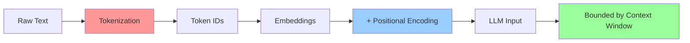

**Impact on Production**:
- **Cost**: You pay per token
- **Speed**: Longer sequences = slower inference
- **Quality**: Tokenization affects model understanding
- **Limits**: Context window determines input size

---

## 2. Tokenization Deep Dive

### 2.1 What is Tokenization?

**Definition**: Tokenization is the process of segmenting text into smaller units (tokens) and mapping them to numerical IDs.

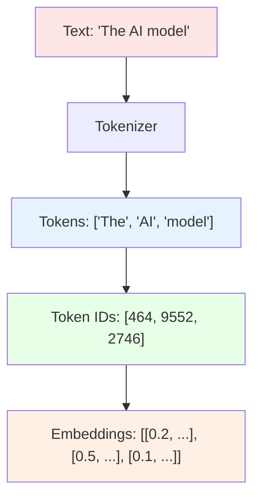

### 2.2 Evolution of Tokenization

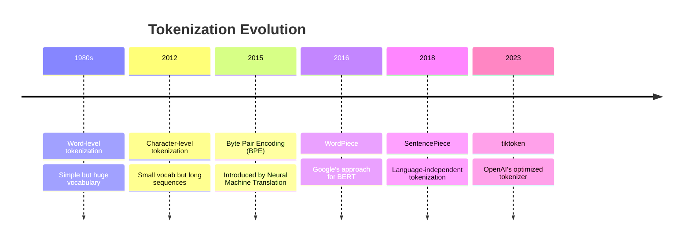

### 2.3 Tokenization Approaches Comparison


**Trade-offs**:

| Approach | Vocab Size | Sequence Length | OOV Handling | Best For |
|----------|-----------|-----------------|--------------|----------|
| Character | Very Small (~256) | Very Long | Perfect | Character-level tasks |
| Word | Very Large (50K+) | Short | Poor | Clean, standard text |
| Subword | Medium (32K-128K) | Medium | Excellent | General purpose |

### 2.4 Byte Pair Encoding (BPE)

#### Algorithm

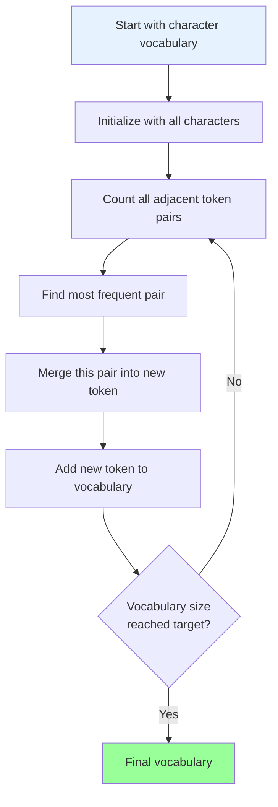

#### Step-by-Step Example

**Input**: `"lower lower lowest"`

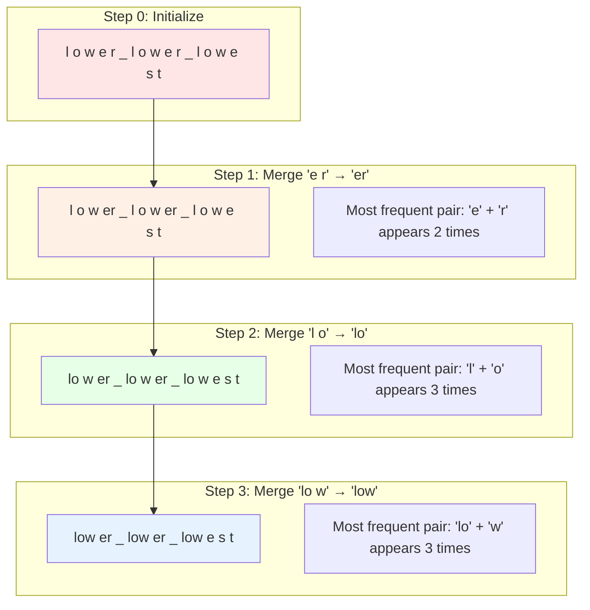

#### Python Implementation

```python
from collections import defaultdict, Counter

class BPETokenizer:
    """
    Byte Pair Encoding tokenizer from scratch
    """
    def __init__(self, vocab_size=1000):
        self.vocab_size = vocab_size
        self.vocab = {}
        self.merges = {}

    def get_stats(self, vocab):
        """Count frequency of adjacent pairs"""
        pairs = defaultdict(int)
        for word, freq in vocab.items():
            symbols = word.split()
            for i in range(len(symbols) - 1):
                pairs[symbols[i], symbols[i+1]] += freq
        return pairs

    def merge_vocab(self, pair, vocab):
        """Merge the most frequent pair in vocabulary"""
        v_out = {}
        bigram = ' '.join(pair)
        replacement = ''.join(pair)

        for word in vocab:
            w_out = word.replace(bigram, replacement)
            v_out[w_out] = vocab[word]
        return v_out

    def train(self, text):
        """
        Train BPE on text corpus

        Args:
            text: Training text
        """
        # Initialize vocabulary with words and their frequencies
        words = text.split()
        vocab = Counter([' '.join(word) + ' </w>' for word in words])

        # Get initial tokens (characters)
        self.vocab = set()
        for word in vocab.keys():
            self.vocab.update(word.split())

        print(f"Initial vocab size: {len(self.vocab)}")
        print(f"Initial vocab: {sorted(self.vocab)[:20]}")

        # Iteratively merge most frequent pairs
        num_merges = self.vocab_size - len(self.vocab)

        for i in range(num_merges):
            pairs = self.get_stats(vocab)
            if not pairs:
                break

            best_pair = max(pairs, key=pairs.get)
            vocab = self.merge_vocab(best_pair, vocab)
            self.merges[best_pair] = ''.join(best_pair)

            if i % 100 == 0:
                print(f"Merge {i}: {best_pair} → {''.join(best_pair)} (freq: {pairs[best_pair]})")

        # Update final vocabulary
        self.vocab = set()
        for word in vocab.keys():
            self.vocab.update(word.split())

        print(f"\nFinal vocab size: {len(self.vocab)}")

    def tokenize(self, text):
        """
        Tokenize text using learned merges

        Args:
            text: Text to tokenize

        Returns:
            tokens: List of tokens
        """
        words = text.split()
        tokens = []

        for word in words:
            word = ' '.join(word) + ' </w>'
            word = word.split()

            # Apply merges
            while len(word) > 1:
                pairs = [(word[i], word[i+1]) for i in range(len(word)-1)]
                # Find first pair that has a merge rule
                bigram = None
                for pair in pairs:
                    if pair in self.merges:
                        bigram = pair
                        break

                if bigram is None:
                    break

                # Merge the pair
                first, second = bigram
                new_word = []
                i = 0
                while i < len(word):
                    if i < len(word) - 1 and word[i] == first and word[i+1] == second:
                        new_word.append(first + second)
                        i += 2
                    else:
                        new_word.append(word[i])
                        i += 1
                word = new_word

            tokens.extend(word)

        return tokens


# Example usage
training_text = """
the quick brown fox jumps over the lazy dog
the dog was lazy but the fox was quick
"""

tokenizer = BPETokenizer(vocab_size=300)
tokenizer.train(training_text)

# Tokenize new text
test_text = "the fox jumps"
tokens = tokenizer.tokenize(test_text)
print(f"\nText: '{test_text}'")
print(f"Tokens: {tokens}")
```

**Output**:
```
Initial vocab size: 28
Initial vocab: ['</w>', 'a', 'b', 'c', 'd', 'e', 'f', 'g', 'h', 'i', ...]
Merge 0: ('t', 'h') → th (freq: 4)
Merge 100: ('qu', 'i') → qui (freq: 2)
...
Final vocab size: 156

Text: 'the fox jumps'
Tokens: ['the</w>', 'fox</w>', 'jump', 's</w>']
```

### 2.5 WordPiece Tokenization

**Key Difference from BPE**: Uses **likelihood maximization** instead of frequency.

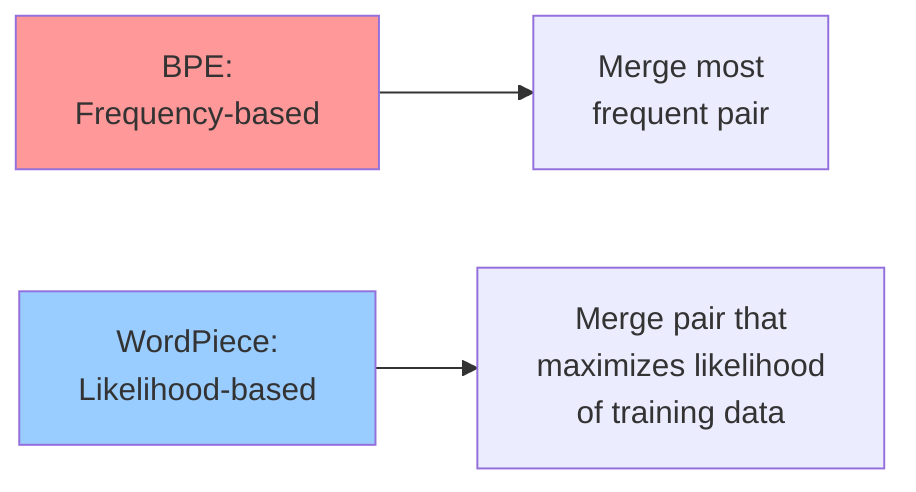

#### WordPiece Formula

For each candidate merge, calculate:

```
Score(x, y) = log P(xy) - log P(x) - log P(y)
            = log [P(xy) / (P(x) × P(y))]
```

Merge the pair with the **highest score**.

#### Special Tokens

WordPiece uses **##** prefix for continuation tokens:

```
Word: "unhappiness"
Tokens: ["un", "##hap", "##pi", "##ness"]
```

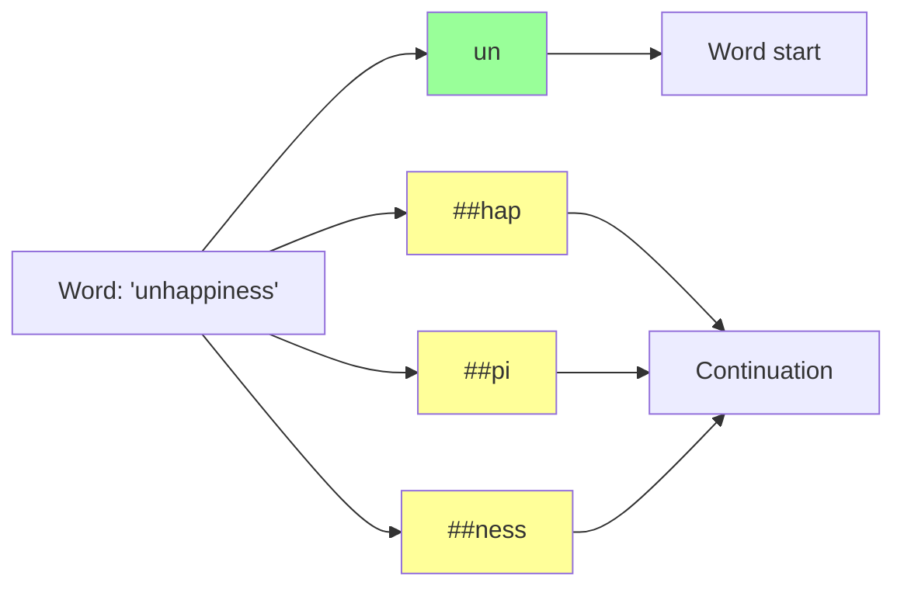

#### Python Implementation with Hugging Face

```python
from transformers import BertTokenizer

# Load pre-trained WordPiece tokenizer
tokenizer = BertTokenizer.from_pretrained('bert-base-uncased')

def analyze_wordpiece_tokenization(text):
    """
    Analyze WordPiece tokenization in detail

    Args:
        text: Input text
    """
    print(f"Input: {text}\n")

    # Tokenize
    tokens = tokenizer.tokenize(text)
    token_ids = tokenizer.encode(text, add_special_tokens=True)

    print("Tokens:")
    for i, token in enumerate(tokens):
        token_id = tokenizer.convert_tokens_to_ids(token)
        is_continuation = token.startswith('##')
        print(f"  {i}: '{token}' (ID: {token_id}) {'[continuation]' if is_continuation else '[start]'}")

    print(f"\nToken IDs: {token_ids}")
    print(f"  [CLS] = {tokenizer.cls_token_id}")
    print(f"  [SEP] = {tokenizer.sep_token_id}")

    # Decode back
    decoded = tokenizer.decode(token_ids)
    print(f"\nDecoded: {decoded}")

    # Show vocabulary size
    print(f"\nVocabulary size: {len(tokenizer)}")

    return tokens, token_ids


# Examples
texts = [
    "Hello world!",
    "Tokenization is fundamental",
    "unhappiness",
    "COVID-19 pandemic"
]

for text in texts:
    print("=" * 60)
    analyze_wordpiece_tokenization(text)
    print()
```

**Output**:
```
Input: unhappiness

Tokens:
  0: 'un' (ID: 4895) [start]
  1: '##hap' (ID: 25031) [continuation]
  2: '##pi' (ID: 8197) [continuation]
  3: '##ness' (ID: 2791) [continuation]

Token IDs: [101, 4895, 25031, 8197, 2791, 102]
  [CLS] = 101
  [SEP] = 102

Decoded: [CLS] unhappiness [SEP]

Vocabulary size: 30522
```

### 2.6 SentencePiece

**Key Innovation**: Language-independent, works on **raw text** without pre-tokenization.

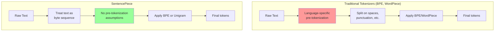

#### Features

1. **Space as special character** (▁):
   ```
   Text: "Hello world"
   Tokens: ["▁Hello", "▁world"]
   ```

2. **Language-agnostic**: Works equally well for English, Chinese, Arabic, etc.

3. **Reversible**: Can perfectly reconstruct original text including spaces

4. **Two algorithms**: BPE or Unigram Language Model

#### Unigram Language Model

Different from BPE - starts with **large vocabulary** and iteratively **removes** tokens.

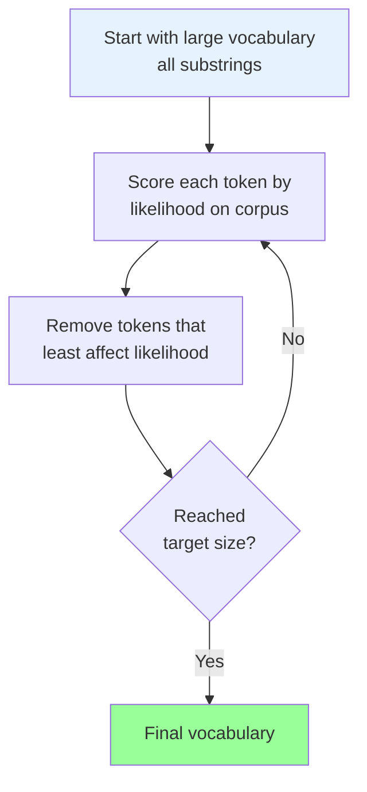

#### Python Implementation

```python
import sentencepiece as spm
import os

# Training data
train_text = """
The quick brown fox jumps over the lazy dog.
Machine learning is transforming artificial intelligence.
Natural language processing enables computers to understand human language.
Deep learning models require large amounts of training data.
"""

# Write to file
with open('train.txt', 'w') as f:
    f.write(train_text)

# Train SentencePiece model
spm.SentencePieceTrainer.train(
    input='train.txt',
    model_prefix='sentencepiece',
    vocab_size=1000,
    model_type='unigram',  # or 'bpe'
    character_coverage=1.0,  # Cover all characters
    pad_id=0,
    unk_id=1,
    bos_id=2,
    eos_id=3
)

# Load trained model
sp = spm.SentencePieceProcessor()
sp.load('sentencepiece.model')

def analyze_sentencepiece(text):
    """
    Analyze SentencePiece tokenization

    Args:
        text: Input text
    """
    print(f"Input: {text}\n")

    # Tokenize to pieces
    pieces = sp.encode_as_pieces(text)
    print("Pieces:")
    for i, piece in enumerate(pieces):
        print(f"  {i}: '{piece}'")

    # Tokenize to IDs
    ids = sp.encode_as_ids(text)
    print(f"\nIDs: {ids}")

    # Decode
    decoded = sp.decode_pieces(pieces)
    print(f"\nDecoded: {decoded}")

    # Show vocabulary info
    print(f"\nVocabulary size: {sp.get_piece_size()}")
    print(f"BOS token: {sp.bos_id()} ('{sp.id_to_piece(sp.bos_id())}')")
    print(f"EOS token: {sp.eos_id()} ('{sp.id_to_piece(sp.eos_id())}')")
    print(f"UNK token: {sp.unk_id()} ('{sp.id_to_piece(sp.unk_id())}')")

    return pieces, ids


# Test
texts = [
    "Hello world",
    "Machine learning",
    "こんにちは世界",  # Japanese: "Hello world"
]

for text in texts:
    print("=" * 60)
    analyze_sentencepiece(text)
    print()

# Cleanup
os.remove('train.txt')
```

**Output**:
```
Input: Hello world

Pieces:
  0: '▁Hello'
  1: '▁world'

IDs: [145, 267]

Decoded: Hello world

Vocabulary size: 1000
BOS token: 2 ('<s>')
EOS token: 3 ('</s>')
UNK token: 1 ('<unk>')
```

### 2.7 Tokenization Impact on Costs

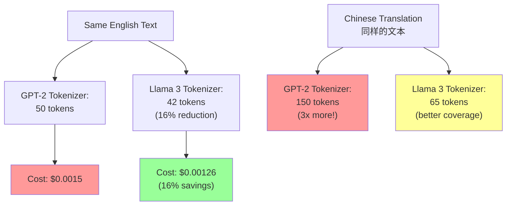

#### Cost Calculation Example

```python
import tiktoken

def compare_tokenizer_costs(text, model_names, cost_per_1k_tokens=0.0015):
    """
    Compare tokenization costs across models

    Args:
        text: Input text
        model_names: List of model names
        cost_per_1k_tokens: Cost per 1000 tokens
    """
    print(f"Text: {text[:100]}...")
    print(f"Character count: {len(text)}\n")

    results = []

    for model_name in model_names:
        try:
            encoding = tiktoken.encoding_for_model(model_name)
            tokens = encoding.encode(text)
            num_tokens = len(tokens)
            cost = (num_tokens / 1000) * cost_per_1k_tokens

            results.append({
                'model': model_name,
                'tokens': num_tokens,
                'cost': cost,
                'tokens_per_char': num_tokens / len(text)
            })

            print(f"{model_name}:")
            print(f"  Tokens: {num_tokens}")
            print(f"  Cost: ${cost:.6f}")
            print(f"  Tokens/char: {num_tokens/len(text):.3f}")
            print()

        except Exception as e:
            print(f"{model_name}: Error - {e}\n")

    # Find best and worst
    if results:
        best = min(results, key=lambda x: x['tokens'])
        worst = max(results, key=lambda x: x['tokens'])

        savings = (1 - best['tokens'] / worst['tokens']) * 100

        print(f"Best: {best['model']} ({best['tokens']} tokens)")
        print(f"Worst: {worst['model']} ({worst['tokens']} tokens)")
        print(f"Savings: {savings:.1f}%")

    return results


# Test on English text
english_text = """
Large language models have revolutionized natural language processing.
They can understand context, generate coherent text, and perform various tasks.
""" * 10  # Repeat for substantial text

models = ["gpt-3.5-turbo", "gpt-4"]
results = compare_tokenizer_costs(english_text, models)
```

### 2.8 Common Tokenization Issues

#### Issue 1: Trailing Spaces

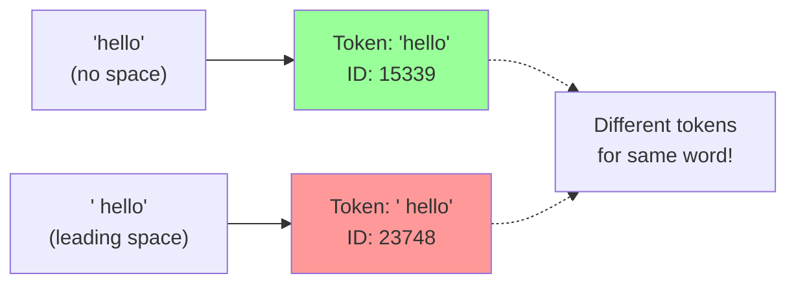

**Solution**: Be consistent with spacing in prompts.

#### Issue 2: Number Tokenization

```python
import tiktoken

encoding = tiktoken.encoding_for_model("gpt-3.5-turbo")

numbers = ["42", "1234", "9876543210", "$1,234.56"]

for num in numbers:
    tokens = encoding.encode(num)
    print(f"Number: {num}")
    print(f"Tokens: {[encoding.decode([t]) for t in tokens]}")
    print(f"Token count: {len(tokens)}\n")
```

**Output**:
```
Number: 42
Tokens: ['42']
Token count: 1

Number: 1234
Tokens: ['123', '4']
Token count: 2

Number: 9876543210
Tokens: ['987', '654', '321', '0']
Token count: 4

Number: $1,234.56
Tokens: ['$', '1', ',', '234', '.', '56']
Token count: 6
```

**Impact**: Numbers and special formats consume many tokens!

#### Issue 3: Multilingual Token Efficiency

```python
def compare_language_efficiency(text_dict):
    """
    Compare token efficiency across languages

    Args:
        text_dict: Dict of {language: text}
    """
    encoding = tiktoken.encoding_for_model("gpt-3.5-turbo")

    results = []

    for lang, text in text_dict.items():
        tokens = encoding.encode(text)
        chars = len(text)
        ratio = len(tokens) / chars

        results.append({
            'language': lang,
            'characters': chars,
            'tokens': len(tokens),
            'tokens_per_char': ratio
        })

        print(f"{lang}:")
        print(f"  Text: {text}")
        print(f"  Characters: {chars}")
        print(f"  Tokens: {len(tokens)}")
        print(f"  Tokens/char: {ratio:.2f}")
        print()

    # Sort by efficiency (lower is better)
    results.sort(key=lambda x: x['tokens_per_char'])

    print("Efficiency ranking (lower is better):")
    for i, r in enumerate(results, 1):
        print(f"{i}. {r['language']}: {r['tokens_per_char']:.2f} tokens/char")

    return results


# Test across languages
texts = {
    'English': 'Hello, how are you today?',
    'Spanish': '¡Hola! ¿Cómo estás hoy?',
    'French': 'Bonjour, comment allez-vous aujourd\'hui?',
    'German': 'Hallo, wie geht es dir heute?',
    'Chinese': '你好，你今天怎么样？',
    'Japanese': 'こんにちは、今日はお元気ですか？',
    'Arabic': 'مرحبا، كيف حالك اليوم؟',
    'Russian': 'Привет, как дела сегодня?'
}

results = compare_language_efficiency(texts)
```

---

## 3. Context Windows

### 3.1 What is a Context Window?

**Definition**: The maximum number of tokens an LLM can process in a single forward pass.

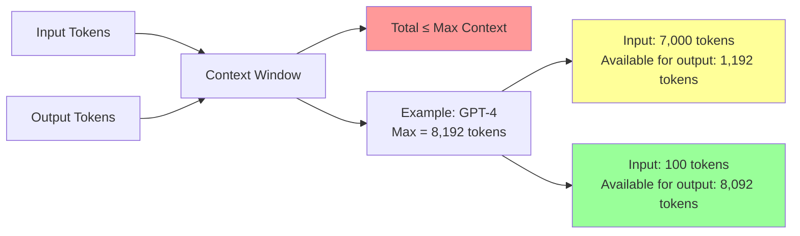

### 3.2 Context Window Evolution

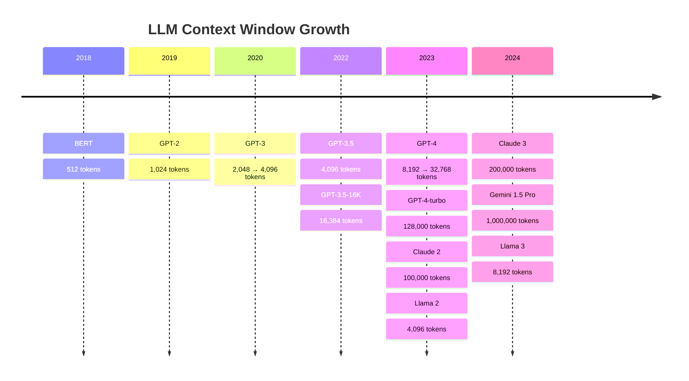

### 3.3 Why Context Windows Matter

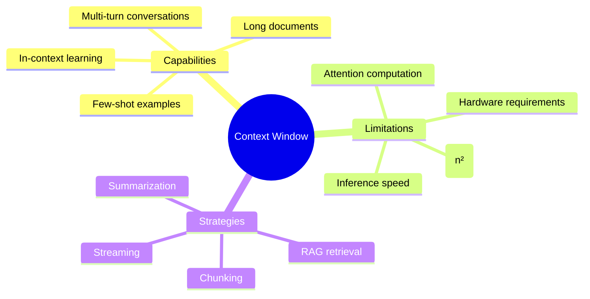

### 3.4 Memory Complexity

**Attention Mechanism Complexity**:

```
Memory: O(n²)
Compute: O(n²)

Where n = sequence length
```

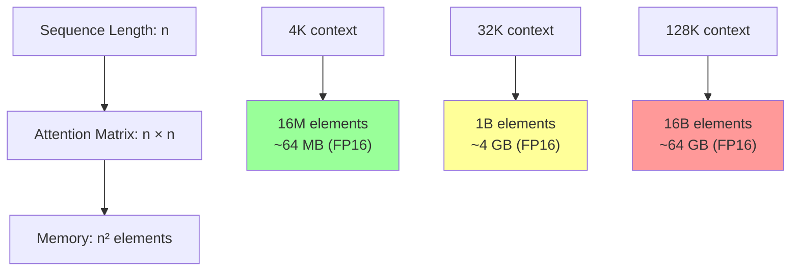

**Calculation**:
```python
def calculate_attention_memory(seq_len, precision="fp16"):
    """
    Calculate memory for attention matrix

    Args:
        seq_len: Sequence length
        precision: fp32, fp16, or int8
    """
    bytes_per_element = {
        "fp32": 4,
        "fp16": 2,
        "int8": 1
    }

    # Attention matrix is seq_len × seq_len
    num_elements = seq_len * seq_len
    bytes_needed = num_elements * bytes_per_element[precision]

    # Convert to readable units
    if bytes_needed < 1024:
        size_str = f"{bytes_needed} bytes"
    elif bytes_needed < 1024 ** 2:
        size_str = f"{bytes_needed / 1024:.2f} KB"
    elif bytes_needed < 1024 ** 3:
        size_str = f"{bytes_needed / (1024**2):.2f} MB"
    else:
        size_str = f"{bytes_needed / (1024**3):.2f} GB"

    print(f"Sequence length: {seq_len:,}")
    print(f"Attention matrix: {seq_len:,} × {seq_len:,}")
    print(f"Elements: {num_elements:,}")
    print(f"Memory ({precision}): {size_str}")
    print()

    return bytes_needed


# Examples
context_lengths = [512, 2048, 4096, 8192, 32768, 128000]

for length in context_lengths:
    calculate_attention_memory(length, "fp16")
```

---

## 4. Positional Encoding

### 4.1 Why Positional Encoding?

**Problem**: Transformers process all tokens in parallel → no inherent notion of order.

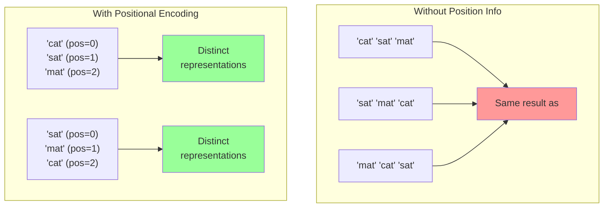

### 4.2 Positional Encoding Methods

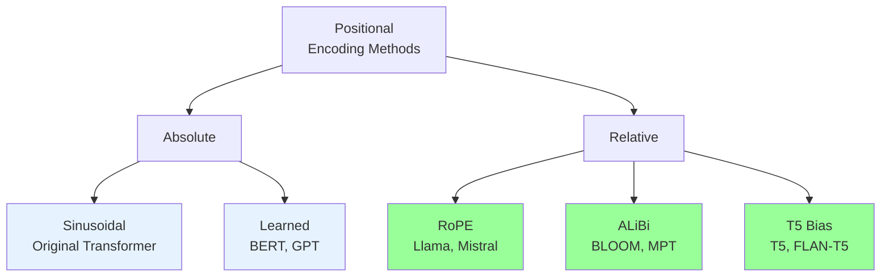

### 4.3 Sinusoidal Positional Encoding

**Original Transformer approach** (Vaswani et al., 2017)

#### Formula

For position `pos` and dimension `i`:

```
PE(pos, 2i) = sin(pos / 10000^(2i/d_model))
PE(pos, 2i+1) = cos(pos / 10000^(2i/d_model))
```

Where:
- `pos`: Position in sequence (0, 1, 2, ...)
- `i`: Dimension index
- `d_model`: Model dimension (e.g., 512, 768)

#### Visualization

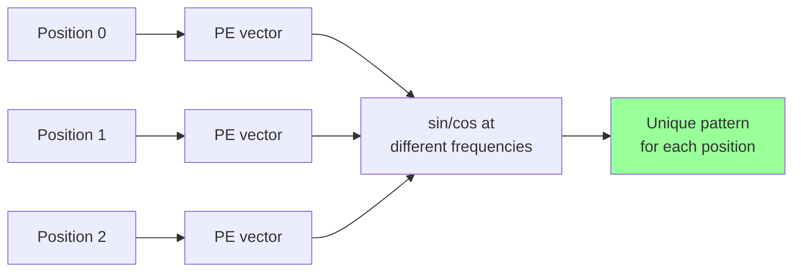

**Key Properties**:
1. **Deterministic**: Same position always gets same encoding
2. **Bounded**: Values between [-1, 1]
3. **Relative distances**: Can compute relative position from encodings
4. **No training needed**: Mathematical function

#### Python Implementation

```python
import numpy as np
import matplotlib.pyplot as plt

def sinusoidal_positional_encoding(max_len, d_model):
    """
    Generate sinusoidal positional encodings

    Args:
        max_len: Maximum sequence length
        d_model: Model dimension

    Returns:
        pos_encoding: Positional encoding matrix [max_len, d_model]
    """
    # Create position indices
    position = np.arange(max_len)[:, np.newaxis]  # [max_len, 1]

    # Create dimension indices
    div_term = np.exp(np.arange(0, d_model, 2) *
                     -(np.log(10000.0) / d_model))  # [d_model/2]

    # Initialize encoding matrix
    pos_encoding = np.zeros((max_len, d_model))

    # Apply sin to even indices
    pos_encoding[:, 0::2] = np.sin(position * div_term)

    # Apply cos to odd indices
    pos_encoding[:, 1::2] = np.cos(position * div_term)

    return pos_encoding


def visualize_positional_encoding(max_len=100, d_model=512):
    """Visualize positional encoding"""
    pe = sinusoidal_positional_encoding(max_len, d_model)

    # Plot heatmap
    plt.figure(figsize=(15, 8))

    plt.subplot(2, 1, 1)
    plt.imshow(pe.T, aspect='auto', cmap='RdBu', vmin=-1, vmax=1)
    plt.colorbar(label='Value')
    plt.xlabel('Position')
    plt.ylabel('Dimension')
    plt.title('Sinusoidal Positional Encoding Heatmap')

    # Plot specific positions
    plt.subplot(2, 1, 2)
    positions_to_plot = [0, 1, 10, 50]
    for pos in positions_to_plot:
        plt.plot(pe[pos, :64], label=f'Position {pos}', alpha=0.7)
    plt.xlabel('Dimension')
    plt.ylabel('Value')
    plt.title('Positional Encoding Values (first 64 dimensions)')
    plt.legend()
    plt.grid(True, alpha=0.3)

    plt.tight_layout()
    plt.savefig('positional_encoding.png', dpi=150, bbox_inches='tight')
    plt.show()

    return pe


# Generate and visualize
pe = visualize_positional_encoding(max_len=100, d_model=512)
print(f"Positional encoding shape: {pe.shape}")
print(f"First position encoding:\n{pe[0, :10]}")
```

#### Adding to Token Embeddings

```python
import torch
import torch.nn as nn

class PositionalEncoding(nn.Module):
    """
    Positional encoding module for Transformer
    """
    def __init__(self, d_model, max_len=5000):
        super().__init__()
        self.d_model = d_model

        # Create positional encoding matrix
        pe = torch.zeros(max_len, d_model)
        position = torch.arange(0, max_len, dtype=torch.float).unsqueeze(1)
        div_term = torch.exp(torch.arange(0, d_model, 2).float() *
                            (-np.log(10000.0) / d_model))

        pe[:, 0::2] = torch.sin(position * div_term)
        pe[:, 1::2] = torch.cos(position * div_term)

        # Register as buffer (not a parameter, but part of state)
        self.register_buffer('pe', pe.unsqueeze(0))  # [1, max_len, d_model]

    def forward(self, x):
        """
        Add positional encoding to input

        Args:
            x: Input tensor [batch, seq_len, d_model]

        Returns:
            x with positional encoding added
        """
        seq_len = x.size(1)
        x = x + self.pe[:, :seq_len, :]
        return x


# Example usage
batch_size = 2
seq_len = 10
d_model = 512

# Token embeddings
token_embeddings = torch.randn(batch_size, seq_len, d_model)

# Add positional encoding
pos_encoder = PositionalEncoding(d_model)
embeddings_with_pos = pos_encoder(token_embeddings)

print(f"Token embeddings shape: {token_embeddings.shape}")
print(f"With positional encoding: {embeddings_with_pos.shape}")
print(f"\nFirst token embedding (before): {token_embeddings[0, 0, :5]}")
print(f"First token embedding (after): {embeddings_with_pos[0, 0, :5]}")
```

### 4.4 RoPE (Rotary Position Embedding)

**Used in**: Llama, Mistral, PaLM, GPT-NeoX

**Key Idea**: Instead of adding positional information, **rotate** the query and key vectors based on position.

#### Mathematical Foundation

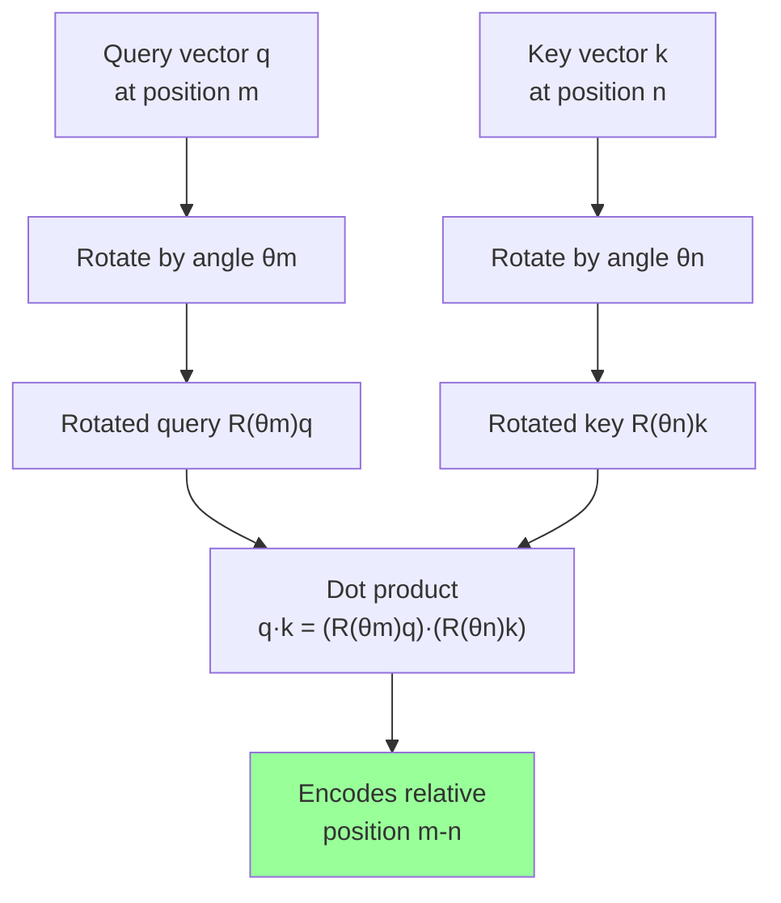

#### 2D Rotation Matrix

For a 2D vector, rotation by angle θ:

```
R(θ) = [cos(θ)  -sin(θ)]
       [sin(θ)   cos(θ)]
```

RoPE extends this to higher dimensions by applying rotations to pairs of dimensions.

#### Advantages over Sinusoidal

```mermaid
graph LR
    A[Sinusoidal PE] --> B[Fixed encoding<br/>for each position]
    B --> C[Poor extrapolation<br/>to longer sequences]

    D[RoPE] --> E[Relative position<br/>encoded in rotation]
    E --> F[Excellent extrapolation<br/>to longer sequences]

    style C fill:#ff9999
    style F fill:#99ff99
```

#### Python Implementation

```python
import torch
import torch.nn as nn
import math

class RotaryPositionalEmbedding(nn.Module):
    """
    Rotary Position Embedding (RoPE)
    """
    def __init__(self, dim, max_seq_len=2048, base=10000):
        super().__init__()
        self.dim = dim
        self.max_seq_len = max_seq_len
        self.base = base

        # Precompute inverse frequencies
        inv_freq = 1.0 / (base ** (torch.arange(0, dim, 2).float() / dim))
        self.register_buffer("inv_freq", inv_freq)

        # Precompute sin and cos
        self._set_cos_sin_cache(max_seq_len)

    def _set_cos_sin_cache(self, seq_len):
        """Precompute cos and sin values"""
        self.max_seq_len_cached = seq_len

        # Create position indices
        t = torch.arange(seq_len, device=self.inv_freq.device).type_as(self.inv_freq)

        # Compute frequencies
        freqs = torch.einsum("i,j->ij", t, self.inv_freq)  # [seq_len, dim/2]

        # Concatenate to match full dimension
        emb = torch.cat((freqs, freqs), dim=-1)  # [seq_len, dim]

        # Register cos and sin buffers
        self.register_buffer("cos_cached", emb.cos()[None, :, None, :], persistent=False)
        self.register_buffer("sin_cached", emb.sin()[None, :, None, :], persistent=False)

    def forward(self, x, seq_len=None):
        """
        Apply rotary position embedding

        Args:
            x: Input tensor [batch, seq_len, num_heads, head_dim]

        Returns:
            x with RoPE applied
        """
        if seq_len is None:
            seq_len = x.shape[1]

        # Extend cache if needed
        if seq_len > self.max_seq_len_cached:
            self._set_cos_sin_cache(seq_len)

        # Get cos and sin for this sequence length
        cos = self.cos_cached[:, :seq_len, :, :]
        sin = self.sin_cached[:, :seq_len, :, :]

        # Apply rotation
        return (x * cos) + (self._rotate_half(x) * sin)

    def _rotate_half(self, x):
        """Rotate half the dimensions"""
        x1 = x[..., : x.shape[-1] // 2]
        x2 = x[..., x.shape[-1] // 2 :]
        return torch.cat((-x2, x1), dim=-1)


# Example usage
batch_size = 2
seq_len = 100
num_heads = 8
head_dim = 64

# Query and key tensors
query = torch.randn(batch_size, seq_len, num_heads, head_dim)
key = torch.randn(batch_size, seq_len, num_heads, head_dim)

# Apply RoPE
rope = RotaryPositionalEmbedding(head_dim, max_seq_len=2048)

query_with_rope = rope(query, seq_len)
key_with_rope = rope(key, seq_len)

print(f"Query shape: {query.shape}")
print(f"Query with RoPE: {query_with_rope.shape}")

# Verify relative position encoding
# Positions that are same distance apart should have similar dot products
pos1, pos2 = 10, 20
pos3, pos4 = 50, 60  # Same distance (10) as pos1, pos2

sim1 = (query_with_rope[0, pos1, 0] @ key_with_rope[0, pos2, 0]).item()
sim2 = (query_with_rope[0, pos3, 0] @ key_with_rope[0, pos4, 0]).item()

print(f"\nSimilarity for positions (10, 20): {sim1:.4f}")
print(f"Similarity for positions (50, 60): {sim2:.4f}")
print(f"Difference: {abs(sim1 - sim2):.4f} (should be small)")
```

### 4.5 ALiBi (Attention with Linear Biases)

**Used in**: BLOOM, MPT

**Key Idea**: Add a linear bias to attention scores based on distance.

#### Formula

```
attention_score(i, j) = q_i · k_j + m × (-(i - j))
```

Where:
- `i, j`: Token positions
- `m`: Head-specific slope (negative)
- `-(i - j)`: Distance penalty

```mermaid
graph TD
    A[Token at<br/>position i] --> B[Attends to<br/>token at position j]

    B --> C[Distance: i - j]
    C --> D[Bias: m × -(i - j)]

    D --> E["Closer tokens<br/>(small distance)<br/>→ smaller penalty"]
    D --> F["Far tokens<br/>(large distance)<br/>→ larger penalty"]

    style E fill:#99ff99
    style F fill:#ffff99
```

#### Head-Specific Slopes

Different attention heads use different slopes:

```python
def get_alibi_slopes(n_heads):
    """
    Generate ALiBi slopes for each attention head

    Args:
        n_heads: Number of attention heads

    Returns:
        slopes: Tensor of shape [n_heads]
    """
    def get_slopes_power_of_2(n):
        start = 2 ** (-(2 ** -(math.log2(n) - 3)))
        ratio = start
        return [start * (ratio ** i) for i in range(n)]

    if math.log2(n_heads).is_integer():
        slopes = get_slopes_power_of_2(n_heads)
    else:
        # Not a power of 2
        closest_power_of_2 = 2 ** math.floor(math.log2(n_heads))
        slopes = get_slopes_power_of_2(closest_power_of_2)
        slopes.extend(get_slopes_power_of_2(2 * closest_power_of_2)[0::2][:n_heads - closest_power_of_2])

    return torch.tensor(slopes)


# Example: 8 attention heads
n_heads = 8
slopes = get_alibi_slopes(n_heads)
print(f"ALiBi slopes for {n_heads} heads:")
print(slopes)
```

**Output**:
```
ALiBi slopes for 8 heads:
tensor([0.0625, 0.1250, 0.2500, 0.5000, 0.0312, 0.0156, 0.0078, 0.0039])
```

#### Implementation

```python
import torch
import torch.nn.functional as F

def apply_alibi_bias(attention_scores, slopes, seq_len):
    """
    Apply ALiBi bias to attention scores

    Args:
        attention_scores: [batch, n_heads, seq_len, seq_len]
        slopes: [n_heads] head-specific slopes
        seq_len: Sequence length

    Returns:
        Biased attention scores
    """
    # Create distance matrix: position i - position j
    positions = torch.arange(seq_len, device=attention_scores.device)
    distance_matrix = positions[None, :] - positions[:, None]  # [seq_len, seq_len]

    # Apply slopes: m × (-distance)
    # slopes: [n_heads] -> [n_heads, 1, 1]
    # distance_matrix: [seq_len, seq_len] -> [1, 1, seq_len, seq_len]
    alibi = -distance_matrix.abs()[None, None, :, :].float() * slopes[:, None, None]

    # Add bias to attention scores
    return attention_scores + alibi


# Example usage
batch_size = 2
n_heads = 8
seq_len = 128

# Simulate attention scores (Q @ K^T)
attention_scores = torch.randn(batch_size, n_heads, seq_len, seq_len)

# Get ALiBi slopes
slopes = get_alibi_slopes(n_heads)

# Apply ALiBi
biased_scores = apply_alibi_bias(attention_scores, slopes, seq_len)

# Apply softmax
attention_weights = F.softmax(biased_scores, dim=-1)

print(f"Attention scores shape: {attention_scores.shape}")
print(f"Biased scores shape: {biased_scores.shape}")
print(f"Attention weights shape: {attention_weights.shape}")

# Visualize bias for one head
import matplotlib.pyplot as plt

bias_matrix = -torch.arange(seq_len)[None, :] + torch.arange(seq_len)[:, None]
bias_matrix = bias_matrix.abs().float() * slopes[0]

plt.figure(figsize=(10, 8))
plt.imshow(bias_matrix.numpy(), cmap='RdBu', aspect='auto')
plt.colorbar(label='Bias Value')
plt.xlabel('Key Position')
plt.ylabel('Query Position')
plt.title(f'ALiBi Bias Matrix (Head 0, slope={slopes[0]:.4f})')
plt.tight_layout()
plt.savefig('alibi_bias.png', dpi=150, bbox_inches='tight')
plt.show()
```

#### Advantages

```mermaid
graph TB
    A[ALiBi Advantages] --> B[No Position Embeddings<br/>Needed]
    A --> C[Excellent Extrapolation<br/>to Longer Sequences]
    A --> D[Simple Implementation]
    A --> E[Works Across<br/>Architectures]

    B --> F[Saves memory<br/>and parameters]
    C --> G[Can handle sequences<br/>longer than training]
    D --> H[Just add bias<br/>to attention]
    E --> I[Can be retrofitted<br/>to existing models]

    style B fill:#99ff99
    style C fill:#99ff99
    style D fill:#99ff99
    style E fill:#99ff99
```

### 4.6 Comparison of Positional Encoding Methods

```mermaid
graph TD
    A[Positional<br/>Encoding<br/>Methods] --> B[Sinusoidal]
    A --> C[Learned]
    A --> D[RoPE]
    A --> E[ALiBi]

    B --> B1["✓ No training<br/>✓ Deterministic<br/>✗ Poor extrapolation"]
    C --> C1["✓ Flexible<br/>✗ Needs training<br/>✗ Fixed max length"]
    D --> D1["✓ Excellent extrapolation<br/>✓ Relative positions<br/>✓ Used in modern LLMs"]
    E --> E1["✓ Simplest<br/>✓ Best extrapolation<br/>✓ No position embeddings"]

    style D1 fill:#99ff99
    style E1 fill:#99ff99
```

| Method | Extrapolation | Parameters | Complexity | Used In |
|--------|--------------|------------|------------|---------|
| **Sinusoidal** | Poor | 0 | Low | Original Transformer |
| **Learned** | Poor | O(L×d) | Low | BERT, GPT-2 |
| **RoPE** | Excellent | 0 | Medium | Llama, Mistral, PaLM |
| **ALiBi** | Best | 0 | Low | BLOOM, MPT |

---

## 5. Interview Questions

### Tokenization Questions

**Q1: Explain the difference between BPE and WordPiece. When would you use each?**

<details>
<summary>Answer</summary>

**BPE (Byte Pair Encoding)**:
- Merge criterion: **Frequency-based** (merge most frequent pair)
- Used in: GPT-2, GPT-3, RoBERTa
- Simple and effective for most languages

**WordPiece**:
- Merge criterion: **Likelihood-based** (merge pair that maximizes corpus probability)
- Special token: Uses "##" for continuations
- Used in: BERT, DistilBERT
- Better for morphologically rich languages

**When to use**:
- BPE: Default choice, simpler, works well for most cases
- WordPiece: When you need better handling of rare words and morphological variants
</details>

**Q2: Why is SentencePiece considered language-independent? What problem does it solve?**

<details>
<summary>Answer</summary>

**Language Independence**:
- Works directly on **raw byte sequences**, no pre-tokenization
- Doesn't assume spaces separate words (critical for Chinese, Japanese, etc.)
- Treats space as special character (▁)

**Problems it solves**:
1. **Language-specific rules**: Traditional tokenizers need language-specific pre-tokenization
2. **Multilingual models**: One tokenizer for all languages
3. **Reversibility**: Can perfectly reconstruct original text with spaces

**Example**:
- English: "Hello world" → ["▁Hello", "▁world"]
- Chinese: "你好世界" → ["▁你好", "世界"] (no space assumption)
</details>

**Q3: How would you estimate token count before sending text to an API? Why is this important?**

<details>
<summary>Answer</summary>

```python
import tiktoken

def estimate_tokens(text, model="gpt-3.5-turbo"):
    encoding = tiktoken.encoding_for_model(model)
    return len(encoding.encode(text))

# Usage
text = "Your prompt here"
token_count = estimate_tokens(text)
cost = (token_count / 1000) * 0.0015  # Example price
```

**Why important**:
1. **Cost control**: APIs charge per token
2. **Context limits**: Avoid truncation errors
3. **Batching**: Optimize batch sizes
4. **Performance**: Estimate latency (proportional to tokens)
</details>

### Context Window Questions

**Q4: Explain why attention complexity is O(n²). What are the implications for long contexts?**

<details>
<summary>Answer</summary>

**Why O(n²)**:
- Attention computes similarity between **every pair of tokens**
- Attention matrix: n × n (where n = sequence length)
- Memory: stores n² values
- Compute: calculates n² dot products

**Implications for long contexts**:
1. **Memory**: 128K context → 16B elements (~64 GB!)
2. **Speed**: Quadratic slowdown with length
3. **Hardware**: Requires expensive GPUs
4. **Cost**: Higher inference costs

**Solutions**:
- Flash Attention (2-4× faster, less memory)
- Sparse attention patterns
- Sliding window attention
- Linear attention variants
</details>

**Q5: What is the difference between maximum context window and effective context window?**

<details>
<summary>Answer</summary>

**Maximum Context Window**: Architectural limit (e.g., 8,192 tokens)

**Effective Context Window**: How much the model can **actually use effectively**

**"Lost in the Middle" Problem**:
- Models attend best to start and end of context
- Middle tokens get lower attention
- Performance degrades with longer contexts

**Example**:
- GPT-4: 8K max context
- Effective: ~6-7K for complex tasks
- Solution: Put important info at start/end, use RAG for retrieval
</details>

### Positional Encoding Questions

**Q6: Why do we need positional encoding in Transformers? What would happen without it?**

<details>
<summary>Answer</summary>

**Why needed**:
- Transformers process tokens **in parallel**
- Self-attention is **permutation-invariant** (order doesn't matter)
- Without positions: "cat sat mat" = "mat cat sat"

**Without positional encoding**:
```python
# These would be identical:
"The cat sat on the mat"
"The mat sat on the cat"
"Cat the on sat mat the"
```

**Solution**: Add position information so model knows token order
</details>

**Q7: Compare RoPE and ALiBi. Which is better and why?**

<details>
<summary>Answer</summary>

**RoPE (Rotary Position Embedding)**:
- Method: Rotates Q/K vectors based on position
- Extrapolation: Excellent (can handle 2-4× trained length)
- Complexity: Medium (rotation operations)
- Used in: Llama, Mistral, PaLM

**ALiBi (Attention with Linear Biases)**:
- Method: Adds linear bias to attention scores
- Extrapolation: Best (can handle 10×+ trained length)
- Complexity: Low (just add bias)
- Used in: BLOOM, MPT

**Which is better**:
- **ALiBi**: Simpler, better extrapolation, no position embeddings
- **RoPE**: More widely adopted, slightly better performance on standard lengths
- **In practice**: Both work well, choice depends on use case
</details>

**Q8: How would you extend a model's context window from 2K to 8K tokens?**

<details>
<summary>Answer</summary>

**Techniques**:

1. **Position Interpolation**:
   - Scale position indices: `new_pos = old_pos * (2048 / 8192)`
   - Fine-tune on longer sequences
   - Used by Llama 2

2. **RoPE Scaling**:
   - Adjust base frequency: `base = 10000 → 40000`
   - Minimal fine-tuning needed
   - LongRoPE, YaRN methods

3. **Progressive Extension**:
   - Gradually increase context: 2K → 4K → 8K
   - Fine-tune at each stage
   - Better stability

4. **ALiBi Retrofit**:
   - Replace position encoding with ALiBi
   - Zero-shot extrapolation possible
   - May need slight fine-tuning

**Best approach**: Position interpolation + fine-tuning on long sequences
</details>

### Production Questions

**Q9: Your application needs to process 100K token documents, but your model has 8K context. What strategies would you use?**

<details>
<summary>Answer</summary>

**Strategies**:

1. **Chunking with Overlap**:
   ```python
   def chunk_document(doc, chunk_size=7000, overlap=1000):
       chunks = []
       start = 0
       while start < len(doc):
           end = start + chunk_size
           chunks.append(doc[start:end])
           start = end - overlap
       return chunks
   ```

2. **Hierarchical Summarization**:
   - Split into chunks
   - Summarize each chunk
   - Combine summaries
   - Final processing

3. **RAG (Retrieval)**:
   - Index document in vector DB
   - Retrieve only relevant sections
   - Process retrieved chunks

4. **Map-Reduce**:
   - Process chunks independently (map)
   - Aggregate results (reduce)

5. **Streaming**:
   - Process sequentially with sliding window
   - Maintain summary of previous content

**Best choice**: RAG for Q&A, hierarchical summarization for summaries
</details>

**Q10: How would you optimize tokenization for a multi-lingual application?**

<details>
<summary>Answer</summary>

**Challenges**:
- English: 1 token/word
- Chinese: 2-3 tokens/character
- Arabic: Complex morphology

**Solutions**:

1. **Use SentencePiece**:
   - Language-independent
   - Train on multilingual corpus

2. **Adjust Vocabulary**:
   - Include characters from all target languages
   - Balance vocabulary across languages
   - Typical size: 32K-128K

3. **Monitor Token Efficiency**:
   ```python
   def check_efficiency(text, lang):
       tokens = tokenizer.encode(text)
       ratio = len(tokens) / len(text)
       print(f"{lang}: {ratio:.2f} tokens/char")
   ```

4. **Language-Specific Models**:
   - Use specialized models for each language
   - Better efficiency but more complexity

5. **Cost Optimization**:
   - Llama 3 tokenizer: 128K vocab (better multilingual)
   - GPT-4 tokenizer: 100K vocab
   - Avoid GPT-2: Only 50K vocab (poor for non-English)
</details>

---

## Summary

This guide covered Part 1 of LLM fundamentals:

### Key Takeaways

1. **Tokenization**:
   - BPE: Frequency-based merging
   - WordPiece: Likelihood-based with ## prefix
   - SentencePiece: Language-independent
   - Impact: Cost, context usage, multilingual support

2. **Context Windows**:
   - Memory complexity: O(n²)
   - Evolution: 512 → 1M tokens
   - Trade-offs: Memory vs sequence length
   - Solutions: Flash Attention, sparse patterns

3. **Positional Encoding**:
   - Sinusoidal: Original, fixed
   - RoPE: Rotational, excellent extrapolation
   - ALiBi: Linear bias, best extrapolation
   - Critical for understanding token order

### Next Steps

Continue to **Part 2** for:
- Inference and decoding strategies
- Evaluation metrics
- Optimization techniques (KV cache, speculative decoding)
- Prompting methods

---

*Part of ML/AI Interview Preparation Guide - Part 1 of 2*
