# LLM Fundamentals Part 2: Inference Strategies, Evaluation & Optimization

A comprehensive deep-dive into LLM inference strategies, evaluation metrics, and cutting-edge optimization techniques for production deployment.

---

## Table of Contents

1. [Introduction](#1-introduction)
2. [Inference and Decoding Strategies](#2-inference-and-decoding-strategies)
3. [Evaluation Metrics](#3-evaluation-metrics)
4. [Model Sizes and Scaling Laws](#4-model-sizes-and-scaling-laws)
5. [KV Cache Optimization](#5-kv-cache-optimization)
6. [Speculative Decoding](#6-speculative-decoding)
7. [Prompting Techniques](#7-prompting-techniques)
8. [Interview Questions](#8-interview-questions)

---

## 1. Introduction

### What You'll Learn

This guide covers advanced LLM concepts essential for production deployment:

- **Inference Strategies**: How LLMs generate text token-by-token
- **Evaluation**: Measuring model quality and performance
- **Optimization**: Techniques for faster, cheaper inference
- **Prompting**: Extracting best performance from LLMs

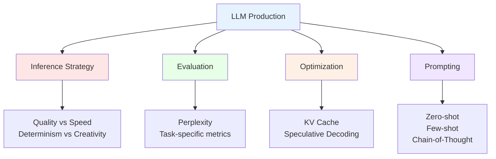

---

## 2. Inference and Decoding Strategies

### 2.1 Auto-Regressive Generation

**How LLMs Generate Text**:

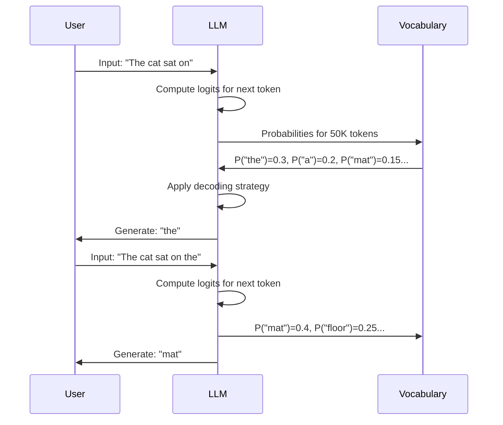

**Key Point**: Each token depends on all previous tokens (auto-regressive).

### 2.2 Decoding Strategy Overview

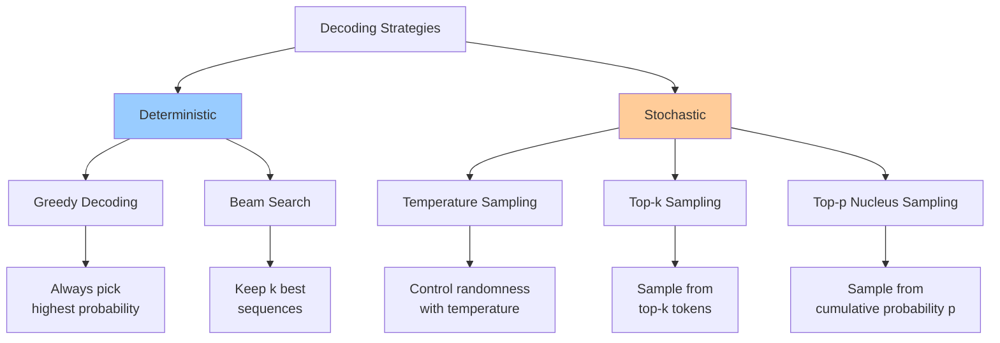

### 2.3 Greedy Decoding

**Strategy**: Always select token with highest probability.

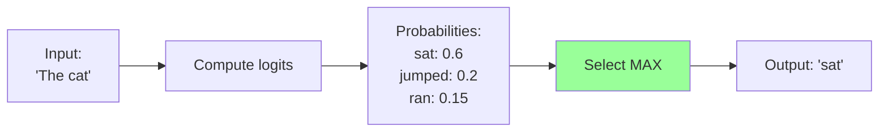

**Algorithm**:
```python
def greedy_decode(logits):
    """
    Greedy decoding: select highest probability token

    Args:
        logits: [vocab_size] unnormalized scores

    Returns:
        token_id: Selected token
    """
    token_id = torch.argmax(logits, dim=-1)
    return token_id
```

**Pros and Cons**:

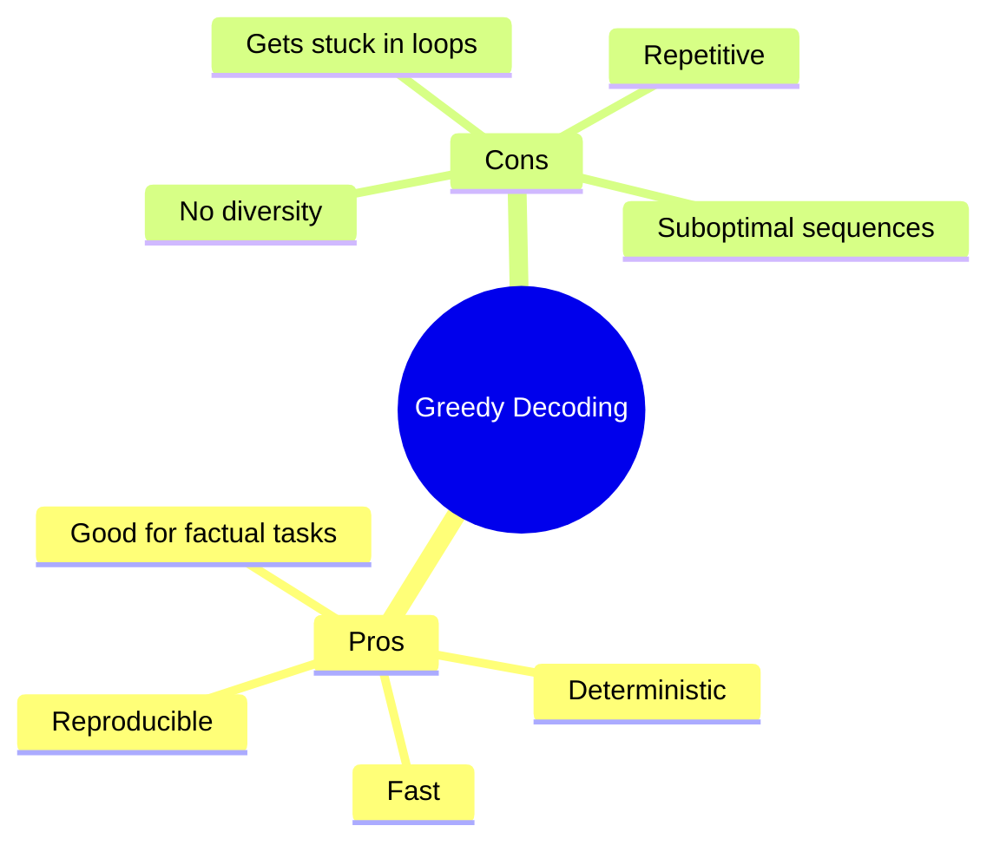

**Example**:
```python
from transformers import GPT2LMHeadModel, GPT2Tokenizer
import torch

model = GPT2LMHeadModel.from_pretrained("gpt2")
tokenizer = GPT2Tokenizer.from_pretrained("gpt2")

def generate_greedy(prompt, max_length=50):
    """Generate text using greedy decoding"""
    input_ids = tokenizer.encode(prompt, return_tensors="pt")

    for _ in range(max_length):
        # Get model predictions
        with torch.no_grad():
            outputs = model(input_ids)
            logits = outputs.logits[:, -1, :]  # Last token logits

        # Greedy selection
        next_token = torch.argmax(logits, dim=-1, keepdim=True)

        # Append to sequence
        input_ids = torch.cat([input_ids, next_token], dim=1)

        # Stop if EOS token
        if next_token.item() == tokenizer.eos_token_id:
            break

    return tokenizer.decode(input_ids[0])

# Test
result = generate_greedy("The future of AI is")
print(result)
```

**When to Use**:
- ✅ Code generation
- ✅ Translation
- ✅ Mathematical reasoning
- ✅ Factual Q&A
- ❌ Creative writing
- ❌ Brainstorming

### 2.4 Beam Search

**Strategy**: Maintain top-k most probable sequences at each step.

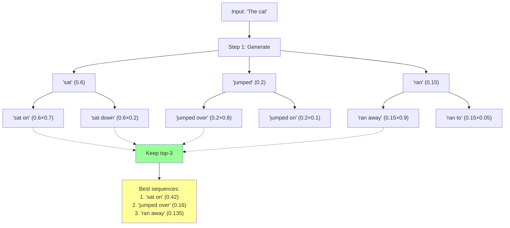

**Algorithm**:
```python
def beam_search(model, tokenizer, prompt, beam_width=5, max_length=50):
    """
    Beam search decoding

    Args:
        model: Language model
        tokenizer: Tokenizer
        prompt: Input text
        beam_width: Number of beams
        max_length: Maximum generation length

    Returns:
        best_sequence: Most probable sequence
    """
    input_ids = tokenizer.encode(prompt, return_tensors="pt")

    # Initialize beams: (sequence, score)
    beams = [(input_ids[0].tolist(), 0.0)]

    for _ in range(max_length):
        candidates = []

        for seq, score in beams:
            # Convert to tensor
            seq_tensor = torch.tensor([seq])

            # Get predictions
            with torch.no_grad():
                outputs = model(seq_tensor)
                logits = outputs.logits[0, -1, :]
                log_probs = torch.log_softmax(logits, dim=-1)

            # Get top-k next tokens
            top_log_probs, top_indices = torch.topk(log_probs, beam_width)

            # Create new candidates
            for log_prob, idx in zip(top_log_probs, top_indices):
                new_seq = seq + [idx.item()]
                new_score = score + log_prob.item()
                candidates.append((new_seq, new_score))

        # Keep top beam_width candidates
        beams = sorted(candidates, key=lambda x: x[1], reverse=True)[:beam_width]

        # Check if all beams end with EOS
        if all(seq[-1] == tokenizer.eos_token_id for seq, _ in beams):
            break

    # Return best sequence
    best_seq, _ = beams[0]
    return tokenizer.decode(best_seq)


# Example usage
result = beam_search(model, tokenizer, "The future of AI is", beam_width=5)
print(result)
```

**Beam Search Parameters**:

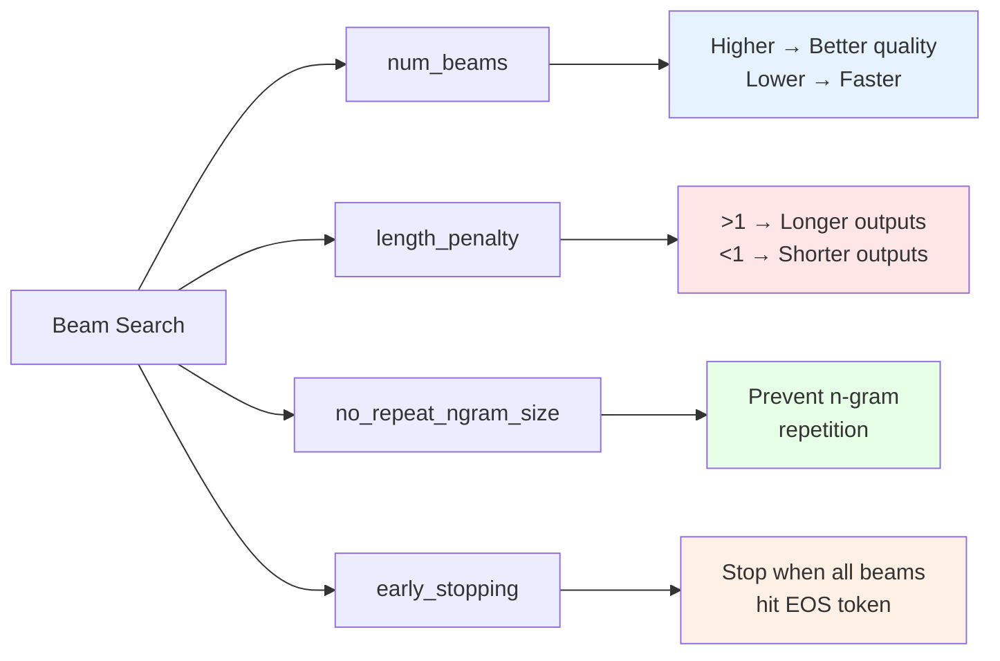

```python
# Using Hugging Face generate()
output = model.generate(
    input_ids,
    max_length=50,
    num_beams=5,              # Beam width
    no_repeat_ngram_size=2,   # Prevent 2-gram repetition
    early_stopping=True,      # Stop when all beams hit EOS
    length_penalty=1.0,       # 1.0 = neutral, >1 favors longer
    num_return_sequences=3    # Return top-3 sequences
)
```

**When to Use**:
- ✅ Summarization
- ✅ Translation
- ✅ Q&A with single answer
- ❌ Creative writing
- ❌ Diverse outputs needed

### 2.5 Temperature Sampling

**Strategy**: Scale logits by temperature before sampling.

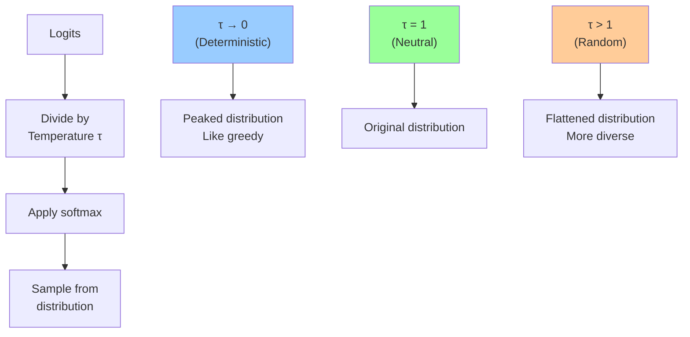

**Mathematical Formula**:

```
P(token_i) = exp(logit_i / τ) / Σ exp(logit_j / τ)
```

**Visualization**:

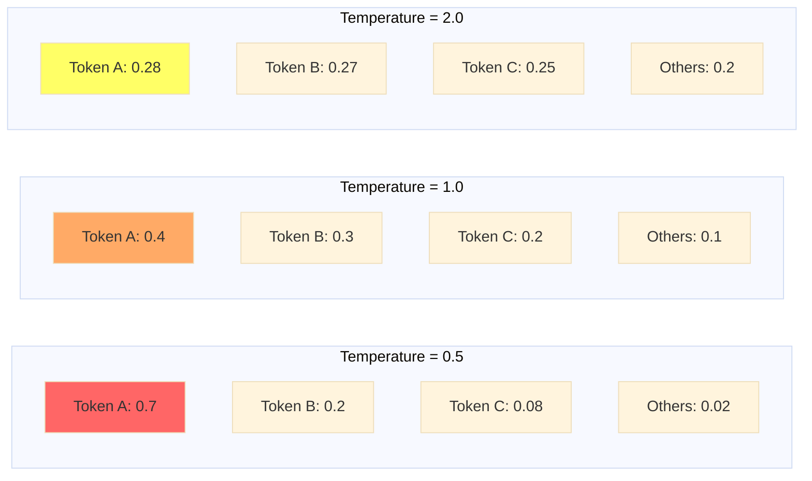

**Implementation**:

```python
import torch
import torch.nn.functional as F

def temperature_sampling(logits, temperature=1.0):
    """
    Sample with temperature scaling

    Args:
        logits: [vocab_size] unnormalized scores
        temperature: Sampling temperature

    Returns:
        token_id: Sampled token
    """
    # Scale logits
    scaled_logits = logits / temperature

    # Convert to probabilities
    probs = F.softmax(scaled_logits, dim=-1)

    # Sample
    token_id = torch.multinomial(probs, num_samples=1)

    return token_id


def generate_with_temperature(prompt, temperature=0.8, max_length=50):
    """Generate text with temperature sampling"""
    input_ids = tokenizer.encode(prompt, return_tensors="pt")

    for _ in range(max_length):
        with torch.no_grad():
            outputs = model(input_ids)
            logits = outputs.logits[:, -1, :]

        # Temperature sampling
        next_token = temperature_sampling(logits[0], temperature)

        # Append
        input_ids = torch.cat([input_ids, next_token.unsqueeze(0)], dim=1)

        if next_token.item() == tokenizer.eos_token_id:
            break

    return tokenizer.decode(input_ids[0])


# Test different temperatures
temperatures = [0.3, 0.7, 1.0, 1.5]
prompt = "Once upon a time"

for temp in temperatures:
    result = generate_with_temperature(prompt, temperature=temp)
    print(f"\nTemperature {temp}:")
    print(result)
```

**Temperature Guidelines**:

| Temperature | Behavior | Use Case |
|-------------|----------|----------|
| 0.1 - 0.3 | Nearly deterministic | Code, math, translation |
| 0.5 - 0.7 | Balanced | Q&A, summaries |
| 0.8 - 1.0 | Creative | Stories, dialogue |
| 1.2 - 1.5 | Very creative | Brainstorming |
| 1.5+ | Chaotic | Experimental |

### 2.6 Top-k Sampling

**Strategy**: Sample only from top-k most probable tokens.

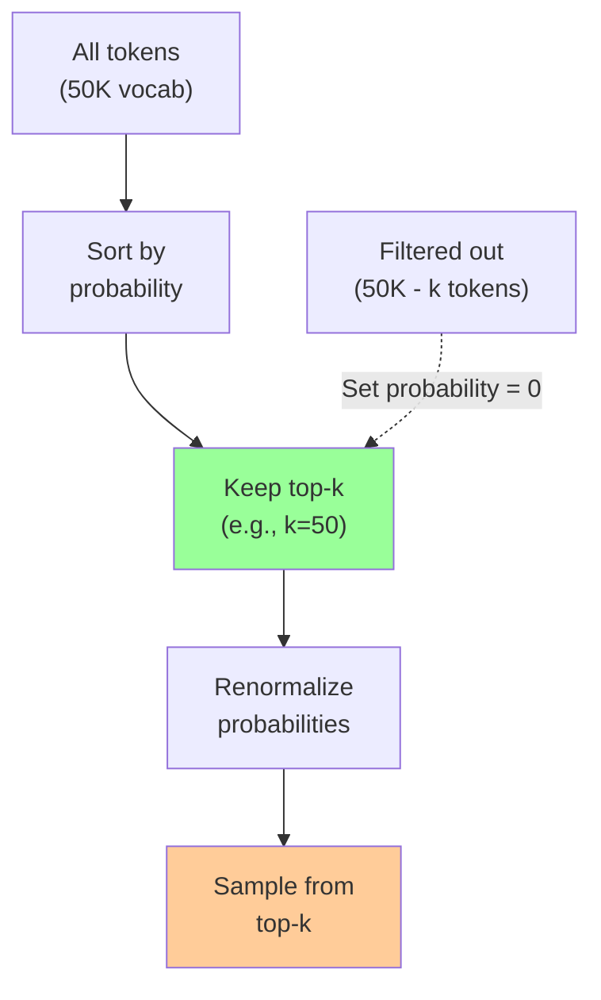

**Algorithm**:

```python
def top_k_sampling(logits, k=50, temperature=1.0):
    """
    Top-k sampling

    Args:
        logits: [vocab_size] unnormalized scores
        k: Number of top tokens to consider
        temperature: Sampling temperature

    Returns:
        token_id: Sampled token
    """
    # Apply temperature
    scaled_logits = logits / temperature

    # Get top-k logits and indices
    top_k_logits, top_k_indices = torch.topk(scaled_logits, k=k)

    # Convert to probabilities (only for top-k)
    probs = F.softmax(top_k_logits, dim=-1)

    # Sample from top-k
    sampled_index = torch.multinomial(probs, num_samples=1)
    token_id = top_k_indices[sampled_index]

    return token_id


# Example with different k values
def compare_top_k(prompt, k_values=[10, 50, 100]):
    """Compare generation with different k values"""
    input_ids = tokenizer.encode(prompt, return_tensors="pt")

    results = {}
    for k in k_values:
        output = model.generate(
            input_ids,
            max_length=50,
            do_sample=True,
            top_k=k,
            temperature=0.8,
            num_return_sequences=1
        )
        results[k] = tokenizer.decode(output[0], skip_special_tokens=True)

    return results

# Test
results = compare_top_k("The future of artificial intelligence")
for k, text in results.items():
    print(f"\nTop-k={k}:")
    print(text)
```

**Top-k Values**:

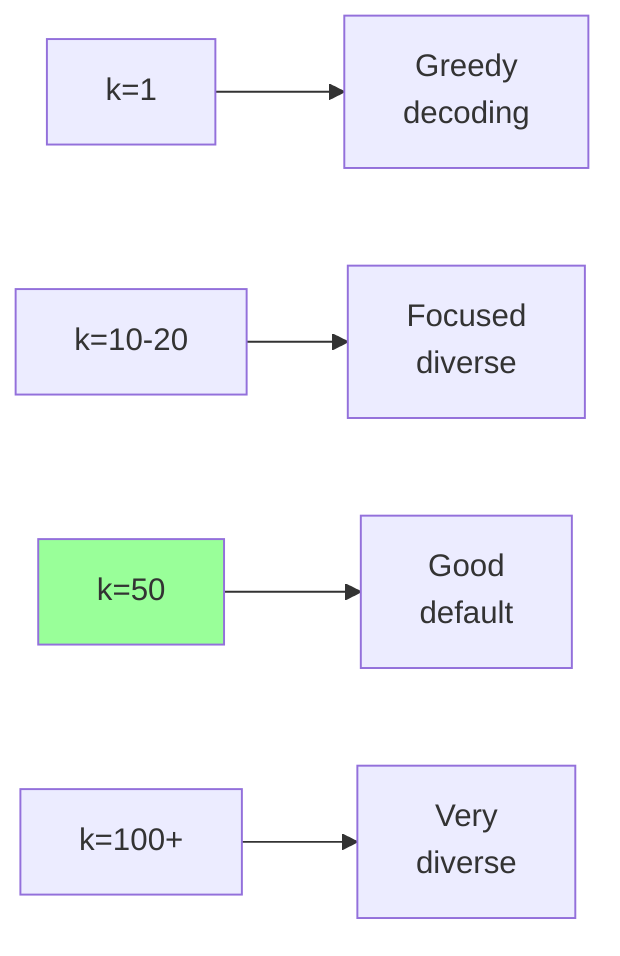

### 2.7 Top-p (Nucleus) Sampling

**Strategy**: Sample from smallest set of tokens whose cumulative probability ≥ p.

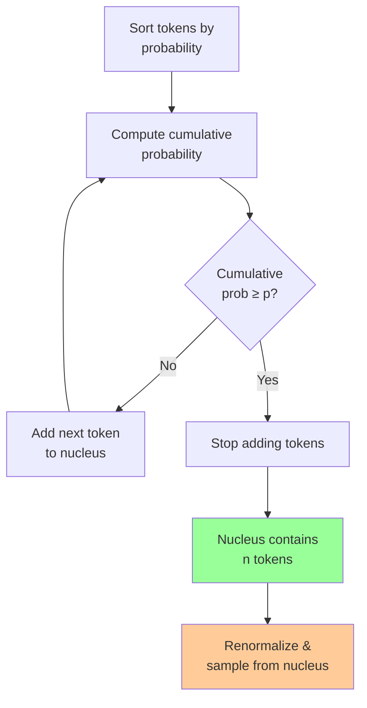

**Example with p=0.9**:

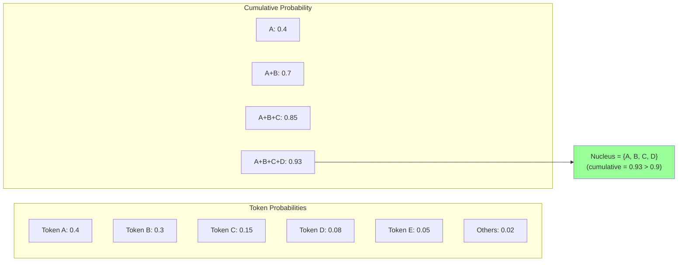

**Implementation**:

```python
def top_p_sampling(logits, p=0.9, temperature=1.0):
    """
    Top-p (nucleus) sampling

    Args:
        logits: [vocab_size] unnormalized scores
        p: Cumulative probability threshold
        temperature: Sampling temperature

    Returns:
        token_id: Sampled token
    """
    # Apply temperature
    scaled_logits = logits / temperature

    # Convert to probabilities
    probs = F.softmax(scaled_logits, dim=-1)

    # Sort probabilities
    sorted_probs, sorted_indices = torch.sort(probs, descending=True)

    # Compute cumulative probabilities
    cumulative_probs = torch.cumsum(sorted_probs, dim=-1)

    # Find cutoff index (first position where cumulative > p)
    cutoff_index = torch.where(cumulative_probs > p)[0]
    if len(cutoff_index) > 0:
        cutoff_index = cutoff_index[0].item() + 1
    else:
        cutoff_index = len(sorted_probs)

    # Keep only nucleus tokens
    nucleus_probs = sorted_probs[:cutoff_index]
    nucleus_indices = sorted_indices[:cutoff_index]

    # Renormalize
    nucleus_probs = nucleus_probs / nucleus_probs.sum()

    # Sample
    sampled_index = torch.multinomial(nucleus_probs, num_samples=1)
    token_id = nucleus_indices[sampled_index]

    return token_id


# Visualize nucleus size for different distributions
def analyze_nucleus(logits, p_values=[0.7, 0.9, 0.95]):
    """Analyze nucleus size for different p values"""
    probs = F.softmax(logits, dim=-1)
    sorted_probs, _ = torch.sort(probs, descending=True)
    cumulative_probs = torch.cumsum(sorted_probs, dim=-1)

    for p in p_values:
        nucleus_size = (cumulative_probs <= p).sum().item() + 1
        print(f"p={p}: Nucleus contains {nucleus_size} tokens "
              f"({100*nucleus_size/len(logits):.2f}% of vocabulary)")

# Test
logits = torch.randn(50257)  # GPT-2 vocab size
analyze_nucleus(logits)
```

**Advantages over Top-k**:

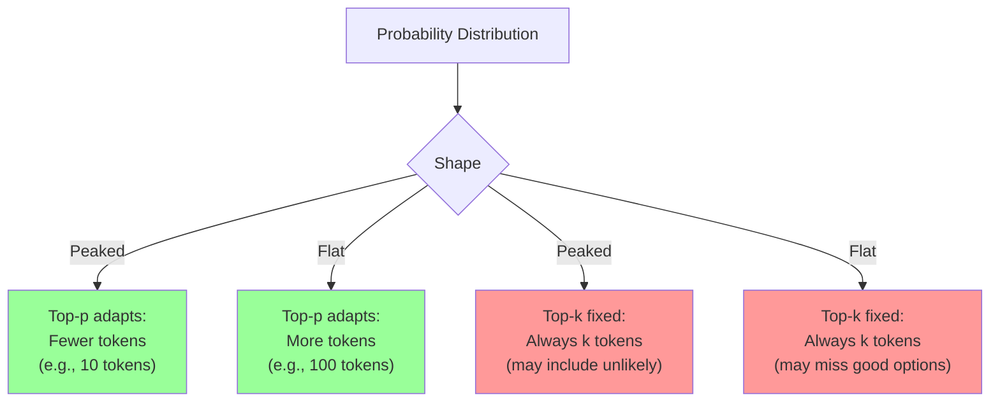

### 2.8 Combined Strategy (Production Best Practice)

**Optimal Approach**: Combine temperature + top-k + top-p

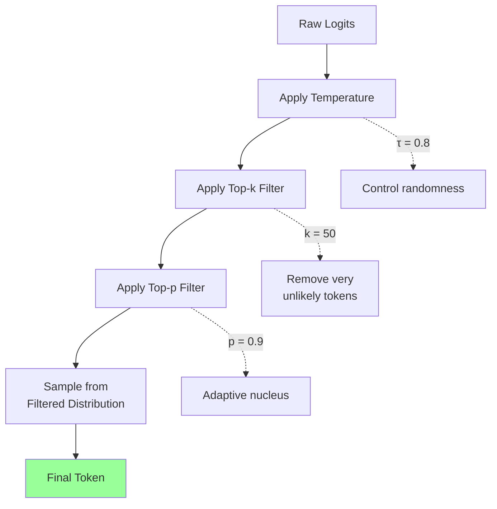

**Implementation**:

```python
def combined_sampling(logits, temperature=0.8, top_k=50, top_p=0.9):
    """
    Combined sampling strategy

    Args:
        logits: [vocab_size] unnormalized scores
        temperature: Sampling temperature
        top_k: Top-k filter (0 = no filter)
        top_p: Top-p filter (1.0 = no filter)

    Returns:
        token_id: Sampled token
    """
    # Step 1: Temperature scaling
    scaled_logits = logits / temperature

    # Step 2: Top-k filtering
    if top_k > 0:
        indices_to_remove = scaled_logits < torch.topk(scaled_logits, top_k)[0][..., -1, None]
        scaled_logits[indices_to_remove] = float('-inf')

    # Convert to probabilities
    probs = F.softmax(scaled_logits, dim=-1)

    # Step 3: Top-p filtering
    if top_p < 1.0:
        sorted_probs, sorted_indices = torch.sort(probs, descending=True)
        cumulative_probs = torch.cumsum(sorted_probs, dim=-1)

        # Remove tokens with cumulative probability above threshold
        sorted_indices_to_remove = cumulative_probs > top_p
        # Shift right to keep at least 1 token
        sorted_indices_to_remove[..., 1:] = sorted_indices_to_remove[..., :-1].clone()
        sorted_indices_to_remove[..., 0] = 0

        # Convert back to original indexing
        indices_to_remove = sorted_indices[sorted_indices_to_remove]
        probs[indices_to_remove] = 0

        # Renormalize
        probs = probs / probs.sum()

    # Step 4: Sample
    token_id = torch.multinomial(probs, num_samples=1)

    return token_id


# Production configuration templates
CONFIG_FACTUAL = {
    "do_sample": True,
    "temperature": 0.3,
    "top_k": 20,
    "top_p": 0.85,
    "repetition_penalty": 1.1
}

CONFIG_BALANCED = {
    "do_sample": True,
    "temperature": 0.7,
    "top_k": 50,
    "top_p": 0.9,
    "repetition_penalty": 1.15
}

CONFIG_CREATIVE = {
    "do_sample": True,
    "temperature": 1.0,
    "top_k": 100,
    "top_p": 0.95,
    "repetition_penalty": 1.2
}

# Usage
output = model.generate(
    input_ids,
    max_length=100,
    **CONFIG_BALANCED
)
```

### 2.9 Decoding Strategy Comparison

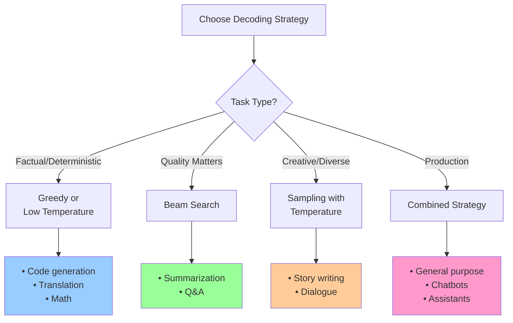

**Summary Table**:

| Strategy | Speed | Diversity | Quality | Deterministic | Best For |
|----------|-------|-----------|---------|---------------|----------|
| **Greedy** | ⚡⚡⚡ | ⭐ | ⭐⭐ | ✅ | Code, translation |
| **Beam Search** | ⚡ | ⭐⭐ | ⭐⭐⭐ | ✅ | Summarization |
| **Temperature** | ⚡⚡⚡ | ⭐⭐⭐ | ⭐⭐ | ❌ | Creative writing |
| **Top-k** | ⚡⚡⚡ | ⭐⭐⭐ | ⭐⭐⭐ | ❌ | General use |
| **Top-p** | ⚡⚡⚡ | ⭐⭐⭐⭐ | ⭐⭐⭐ | ❌ | Best default |
| **Combined** | ⚡⚡⚡ | ⭐⭐⭐⭐ | ⭐⭐⭐⭐ | ❌ | Production |

---

## 3. Evaluation Metrics

### 3.1 Perplexity

**Definition**: Perplexity measures how "surprised" a model is by test data.

```mermaid
graph LR
    A[Model] --> B[Predict next token]
    B --> C[Compare with<br/>actual token]
    C --> D[Calculate<br/>cross-entropy loss]
    D --> E[Perplexity =<br/>exp(loss)]

    E --> F["Low perplexity<br/>= Better model"]
    E --> G["High perplexity<br/>= Worse model"]

    style F fill:#99ff99
    style G fill:#ff9999
```

**Mathematical Formula**:

```
Perplexity = exp(CrossEntropyLoss)
          = exp(-1/N × Σ log P(token_i | context))
          = 2^(CrossEntropyLoss / log(2))
```

**Intuition**: If perplexity = k, the model is as confused as if it had to choose uniformly from k possibilities.

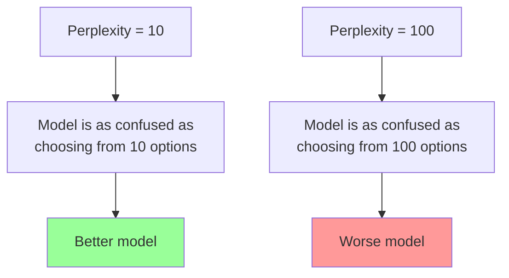

**Implementation**:

```python
import torch
import math

def calculate_perplexity(model, tokenizer, text):
    """
    Calculate perplexity for a given text

    Args:
        model: Language model
        tokenizer: Tokenizer
        text: Input text

    Returns:
        perplexity: Perplexity score
        loss: Cross-entropy loss
    """
    # Tokenize
    inputs = tokenizer(text, return_tensors="pt")
    input_ids = inputs["input_ids"]

    # Get model predictions
    with torch.no_grad():
        outputs = model(input_ids, labels=input_ids)
        loss = outputs.loss.item()

    # Calculate perplexity
    perplexity = math.exp(loss)

    return perplexity, loss


def compare_models_perplexity(models, tokenizer, test_texts):
    """
    Compare multiple models on test set

    Args:
        models: Dict of {model_name: model}
        tokenizer: Tokenizer
        test_texts: List of test texts

    Returns:
        results: Dict of results per model
    """
    results = {}

    for model_name, model in models.items():
        model.eval()
        total_loss = 0
        total_tokens = 0

        for text in test_texts:
            perplexity, loss = calculate_perplexity(model, tokenizer, text)
            tokens = tokenizer.encode(text)

            total_loss += loss * len(tokens)
            total_tokens += len(tokens)

        avg_loss = total_loss / total_tokens
        avg_perplexity = math.exp(avg_loss)

        results[model_name] = {
            "perplexity": avg_perplexity,
            "loss": avg_loss
        }

        print(f"{model_name}:")
        print(f"  Perplexity: {avg_perplexity:.2f}")
        print(f"  Loss: {avg_loss:.4f}")
        print()

    return results


# Example
test_texts = [
    "The quick brown fox jumps over the lazy dog.",
    "Machine learning is transforming artificial intelligence.",
    "Natural language processing enables computers to understand text.",
]

models = {
    "GPT-2": GPT2LMHeadModel.from_pretrained("gpt2"),
    "GPT-2-Medium": GPT2LMHeadModel.from_pretrained("gpt2-medium"),
}

results = compare_models_perplexity(models, tokenizer, test_texts)
```

**Perplexity Ranges** (GPT-2 on English text):

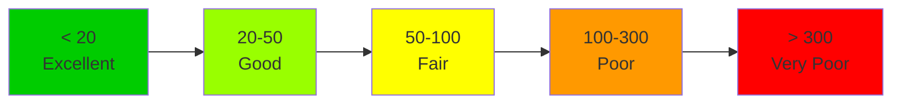

### 3.2 Perplexity Limitations

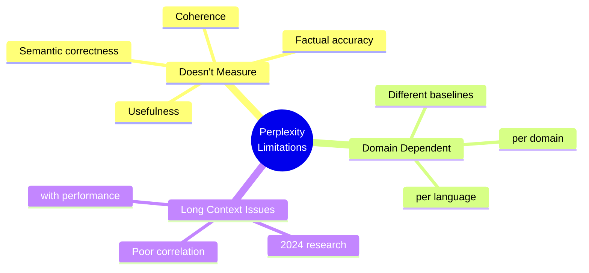

**Long-Context Problem** (2024 Research):

```mermaid
graph TD
    A[Standard Perplexity] --> B[Treats all<br/>tokens equally]
    B --> C[Poor correlation with<br/>long-context performance]

    D[LongPPL 2024] --> E[Weights key<br/>tokens more]
    E --> F[Better correlation with<br/>long-context tasks]

    C --> G[Pearson correlation:<br/>≈ 0.2]
    F --> H[Pearson correlation:<br/>≈ -0.96]

    style G fill:#ff9999
    style H fill:#99ff99
```

### 3.3 Task-Specific Evaluation

**Better Approach**: Use task-specific metrics

```mermaid
graph TB
    A[Task Type] --> B[Question Answering]
    A --> C[Summarization]
    A --> D[Translation]
    A --> E[Code Generation]

    B --> B1["• Exact Match<br/>• F1 Score<br/>• BLEU"]
    C --> C1["• ROUGE<br/>• BERTScore<br/>• Human eval"]
    D --> D1["• BLEU<br/>• METEOR<br/>• chrF"]
    E --> E1["• Pass@k<br/>• CodeBLEU<br/>• Execution accuracy"]

    style B1 fill:#e6f3ff
    style C1 fill:#ffe6e6
    style D1 fill:#e6ffe6
    style E1 fill:#fff0e6
```

---

## 4. Model Sizes and Scaling Laws

### 4.1 Model Size Notation

**"B" = Billions of Parameters**

```mermaid
graph LR
    A["7B Model"] --> B["7 billion<br/>parameters"]
    B --> C["Weight matrices<br/>+ biases"]
    C --> D["Learnable values<br/>trained on data"]

    E["Memory<br/>Calculation"] --> F["7B × 2 bytes<br/>(FP16)"]
    F --> G["≈ 14 GB"]

    style G fill:#ffcc99
```

### 4.2 Popular Model Sizes

```mermaid
timeline
    title Model Size Evolution
    2018 : BERT: 110M-340M parameters
    2019 : GPT-2: 117M-1.5B parameters
    2020 : GPT-3: 125M-175B parameters
    2021 : Megatron-Turing NLG: 530B
    2022 : PaLM: 540B
         : OPT: 66B-175B
         : BLOOM: 176B
    2023 : Llama 2: 7B, 13B, 70B
         : GPT-4: Unknown (rumored 1.76T)
         : Falcon: 7B, 40B, 180B
    2024 : Llama 3: 8B, 70B, 405B
         : Mixtral: 8x7B (MoE), 8x22B
         : Gemini: Nano to Ultra
```

### 4.3 Memory Requirements

**Formula**:
```
Memory (GB) = Parameters (B) × Bytes per Parameter × Overhead
```

```mermaid
graph TD
    A[Model Size<br/>7B parameters] --> B[FP32: 28 GB]
    A --> C[FP16: 14 GB]
    A --> D[INT8: 7 GB]
    A --> E[INT4: 3.5 GB]

    B --> F[+20% overhead]
    C --> G[+20% overhead]
    D --> H[+20% overhead]
    E --> I[+20% overhead]

    F --> F1[Total: ≈34 GB]
    G --> G1[Total: ≈17 GB]
    H --> H1[Total: ≈8 GB]
    I --> I1[Total: ≈4 GB]

    style F1 fill:#ff6666
    style G1 fill:#ffaa66
    style H1 fill:#ffff66
    style I1 fill:#66ff66
```

**GPU Requirements**:

```python
def calculate_memory_requirements(num_params_b, precision="fp16",
                                 batch_size=1, seq_len=2048):
    """
    Calculate memory requirements for LLM inference

    Args:
        num_params_b: Number of parameters in billions
        precision: Model precision (fp32, fp16, int8, int4)
        batch_size: Batch size
        seq_len: Sequence length

    Returns:
        memory_breakdown: Dict with memory components
    """
    bytes_per_param = {
        "fp32": 4,
        "fp16": 2,
        "int8": 1,
        "int4": 0.5
    }

    # Model weights
    model_memory_gb = (num_params_b * 1e9 *
                      bytes_per_param[precision] / (1024**3))

    # KV cache (rough estimate)
    # Assumes 32 layers, 32 heads, 128 head_dim
    kv_cache_gb = (2 * 32 * 32 * 128 * seq_len * batch_size *
                   bytes_per_param[precision] / (1024**3))

    # Activations (rough estimate)
    activation_gb = model_memory_gb * 0.2

    # Total
    total_gb = model_memory_gb + kv_cache_gb + activation_gb

    return {
        "model": model_memory_gb,
        "kv_cache": kv_cache_gb,
        "activations": activation_gb,
        "total": total_gb
    }


# Example: Llama-2-70B
memory = calculate_memory_requirements(70, "fp16", batch_size=1, seq_len=4096)
print("Llama-2-70B (FP16):")
for component, size in memory.items():
    print(f"  {component}: {size:.2f} GB")
```

**Output**:
```
Llama-2-70B (FP16):
  model: 130.00 GB
  kv_cache: 2.00 GB
  activations: 26.00 GB
  total: 158.00 GB
```

### 4.4 Scaling Laws

**Chinchilla Scaling Law** (2022):

```
Optimal Training Tokens ≈ 20 × Number of Parameters
```

```mermaid
graph LR
    A[7B Model] --> B[Optimal:<br/>140B tokens]
    C[70B Model] --> D[Optimal:<br/>1.4T tokens]
    E[405B Model] --> F[Optimal:<br/>8.1T tokens]

    style B fill:#99ff99
    style D fill:#99ff99
    style F fill:#99ff99
```

**Kaplan Scaling Laws** (2020):

```
Loss ∝ N^(-α)
where N = number of parameters, α ≈ 0.076
```

```mermaid
graph TD
    A[Doubling Model Size] --> B[Predictable<br/>improvement in loss]
    B --> C[But diminishing<br/>returns]

    D["10B → 20B<br/>Loss: 3.5 → 3.2"] --> E["Improvement: 0.3"]
    F["100B → 200B<br/>Loss: 2.8 → 2.6"] --> G["Improvement: 0.2"]

    E --> H[Larger absolute<br/>improvement]
    G --> I[Smaller absolute<br/>improvement]

    style H fill:#99ff99
    style I fill:#ffcc99
```

### 4.5 Emergent Abilities

**Phenomenon**: Capabilities that appear suddenly at certain scales.

```mermaid
graph TD
    A[Model Scale] --> B["< 1B:<br/>Basic language"]
    B --> C["1-10B:<br/>Few-shot learning"]
    C --> D["10-100B:<br/>Chain-of-thought"]
    D --> E["100B+:<br/>Complex reasoning"]

    style B fill:#ff9999
    style C fill:#ffcc99
    style D fill:#ffff99
    style E fill:#99ff99
```

**Examples**:

| Capability | Emergence Point | Models |
|-----------|----------------|---------|
| Few-shot learning | ~13B | GPT-3-13B+ |
| Chain-of-thought reasoning | ~100B | GPT-3-175B, PaLM-540B |
| Instruction following | ~10B | FLAN-T5-11B+ |
| Code generation (quality) | ~7B | Codex-7B+, StarCoder-7B+ |
| Mathematical reasoning | ~70B | Llama-2-70B, GPT-4 |

---

## 5. KV Cache Optimization

### 5.1 What is KV Cache?

**Problem**: Recomputing attention keys/values for all previous tokens is wasteful.

```mermaid
sequenceDiagram
    participant Model
    participant Cache

    Note over Model: Generate token 1
    Model->>Cache: Store K, V for position 0

    Note over Model: Generate token 2
    Cache->>Model: Reuse K, V for position 0
    Model->>Cache: Store K, V for position 1

    Note over Model: Generate token 3
    Cache->>Model: Reuse K, V for positions 0-1
    Model->>Cache: Store K, V for position 2

    Note over Model: ⚡ 10x speedup!
```

**Memory Cost Formula**:

```
KV Cache Size = 2 × num_layers × num_heads × head_dim × seq_len × batch_size × bytes
```

```mermaid
graph TD
    A["Llama-2-7B<br/>4K context"] --> B["32 layers<br/>32 heads<br/>128 head_dim"]
    B --> C["2 × 32 × 32 × 128 × 4096 × 2 bytes"]
    C --> D["≈ 1 GB per sequence"]

    E["128K context"] --> F["Same calculation<br/>× 32"]
    F --> G["≈ 32 GB per sequence!"]

    style D fill:#99ff99
    style G fill:#ff9999
```

### 5.2 PagedAttention (vLLM)

**Idea**: Store KV cache like OS virtual memory - in pages!

```mermaid
graph TB
    subgraph "Traditional KV Cache"
        A1[Sequence 1:<br/>Contiguous memory] --> A2[Wasted space<br/>if not full]
        A3[Sequence 2:<br/>Contiguous memory] --> A4[Wasted space<br/>if not full]
    end

    subgraph "PagedAttention"
        B1[Sequence 1] --> B2[Page 1]
        B1 --> B3[Page 3]
        B1 --> B5[Page 7]

        B4[Sequence 2] --> B6[Page 2]
        B4 --> B7[Page 4]
        B4 --> B8[Page 5]

        B9[Free Pages] --> B10[Page 6, 8, 9,...]
    end

    A2 -.->|55% waste| A5[Memory inefficient]
    B9 -.->|Near-zero waste| B11[Memory efficient]

    style A5 fill:#ff9999
    style B11 fill:#99ff99
```

**Benefits**:
- 55% memory reduction
- Dynamic allocation
- Efficient sharing of prefixes
- Higher batch sizes → better throughput

### 5.3 KV Cache Quantization

**Strategy**: Store cache in lower precision (INT8, INT4)

```mermaid
graph LR
    A[FP16 KV Cache<br/>2 bytes/value] --> B[Quantize to INT8<br/>1 byte/value]
    B --> C[50% memory<br/>reduction]

    D[FP16 KV Cache<br/>2 bytes/value] --> E[Quantize to INT4<br/>0.5 bytes/value]
    E --> F[75% memory<br/>reduction]

    style C fill:#99ff99
    style F fill:#66ff66
```

**Implementation**:

```python
def quantize_kv_cache(k, v, bits=8):
    """
    Quantize KV cache to INT8 or INT4

    Args:
        k: Keys [num_heads, seq_len, head_dim]
        v: Values [num_heads, seq_len, head_dim]
        bits: 8 or 4

    Returns:
        Quantized k, v and scales
    """
    def quantize_tensor(x, bits):
        # Calculate scale
        x_max = x.abs().max()
        scale = x_max / (2 ** (bits - 1) - 1)

        # Quantize
        x_int = (x / scale).round().clamp(-(2 ** (bits-1)), 2 ** (bits-1) - 1)

        if bits == 8:
            x_int = x_int.to(torch.int8)
        else:  # 4-bit stored in int8
            x_int = x_int.to(torch.int8)

        return x_int, scale

    k_quant, k_scale = quantize_tensor(k, bits)
    v_quant, v_scale = quantize_tensor(v, bits)

    return k_quant, v_quant, k_scale, v_scale


def dequantize_kv_cache(k_quant, v_quant, k_scale, v_scale):
    """Dequantize back to FP16"""
    k = k_quant.float() * k_scale
    v = v_quant.float() * v_scale
    return k, v


# Example
k = torch.randn(32, 2048, 128)  # 32 heads, 2K seq, 128 dim
v = torch.randn(32, 2048, 128)

# FP16 size
fp16_size = k.element_size() * k.nelement() * 2  # k + v
print(f"FP16 size: {fp16_size / (1024**2):.2f} MB")

# INT8 quantization
k_int8, v_int8, k_scale, v_scale = quantize_kv_cache(k, v, bits=8)
int8_size = k_int8.element_size() * k_int8.nelement() * 2
print(f"INT8 size: {int8_size / (1024**2):.2f} MB")
print(f"Reduction: {(1 - int8_size/fp16_size)*100:.1f}%")

# Dequantize and check error
k_deq, v_deq = dequantize_kv_cache(k_int8, v_int8, k_scale, v_scale)
error = (k - k_deq).abs().mean()
print(f"Quantization error: {error:.6f}")
```

### 5.4 Token Pruning (Selective Cache)

**Idea**: Keep only important tokens in cache.

```mermaid
graph TD
    A["Full KV Cache<br/>(all 2048 tokens)"] --> B[Calculate token<br/>importance scores]
    B --> C[Keep top 30%<br/>(~600 tokens)]
    C --> D[70% memory saved]

    B --> E["Score based on:<br/>• Attention weights<br/>• Position<br/>• Content"]

    style D fill:#99ff99
```

**Strategies**:

1. **H2O (Heavy-Hitter Oracle)**: Keep tokens with highest attention scores
2. **StreamingLLM**: Keep first N + last M tokens
3. **SnapKV**: Adaptive selection based on patterns

**StreamingLLM Implementation**:

```python
class StreamingKVCache:
    """
    Streaming KV cache for infinite-length generation
    Keeps: initial tokens + recent tokens
    """
    def __init__(self, num_init_tokens=4, num_recent_tokens=2044):
        self.num_init = num_init_tokens
        self.num_recent = num_recent_tokens
        self.k_init = None
        self.v_init = None
        self.k_recent = None
        self.v_recent = None
        self.total_processed = 0

    def update(self, k_new, v_new):
        """
        Update cache with new tokens

        Args:
            k_new: New keys [num_heads, 1, head_dim]
            v_new: New values [num_heads, 1, head_dim]
        """
        self.total_processed += 1

        # Store initial tokens
        if self.k_init is None:
            self.k_init = k_new
            self.v_init = v_new
            return

        if self.k_init.size(1) < self.num_init:
            self.k_init = torch.cat([self.k_init, k_new], dim=1)
            self.v_init = torch.cat([self.v_init, v_new], dim=1)
            return

        # Add to recent tokens
        if self.k_recent is None:
            self.k_recent = k_new
            self.v_recent = v_new
        else:
            self.k_recent = torch.cat([self.k_recent, k_new], dim=1)
            self.v_recent = torch.cat([self.v_recent, v_new], dim=1)

        # Maintain sliding window
        if self.k_recent.size(1) > self.num_recent:
            self.k_recent = self.k_recent[:, -self.num_recent:, :]
            self.v_recent = self.v_recent[:, -self.num_recent:, :]

    def get(self):
        """Get full cache (init + recent)"""
        if self.k_recent is None:
            return self.k_init, self.v_init

        k = torch.cat([self.k_init, self.k_recent], dim=1)
        v = torch.cat([self.v_init, self.v_recent], dim=1)
        return k, v

    def get_stats(self):
        """Get cache statistics"""
        k, v = self.get()
        return {
            "total_processed": self.total_processed,
            "cache_size": k.size(1),
            "memory_saved_pct": (1 - k.size(1) / self.total_processed) * 100
        }


# Example: Generate 10K tokens with fixed cache size
cache = StreamingKVCache(num_init_tokens=4, num_recent_tokens=2044)

for i in range(10000):
    k_new = torch.randn(32, 1, 128)
    v_new = torch.randn(32, 1, 128)
    cache.update(k_new, v_new)

    if i % 1000 == 0:
        stats = cache.get_stats()
        print(f"Step {i}: Cache size = {stats['cache_size']} tokens "
              f"(saved {stats['memory_saved_pct']:.1f}%)")
```

---

## 6. Speculative Decoding

### 6.1 The Problem

**Auto-regressive generation is slow**: Generate one token at a time.

```mermaid
sequenceDiagram
    participant Large Model

    Note over Large Model: Token 1 (slow)
    Large Model->>Large Model: Forward pass
    Note over Large Model: Token 2 (slow)
    Large Model->>Large Model: Forward pass
    Note over Large Model: Token 3 (slow)
    Large Model->>Large Model: Forward pass
    Note over Large Model: Total: 3× slow passes
```

### 6.2 The Solution

**Speculative Decoding**: Use small draft model + parallel verification

```mermaid
sequenceDiagram
    participant Draft Model
    participant Target Model

    Note over Draft Model: Generate 5 candidates (fast)
    Draft Model->>Target Model: [tok1, tok2, tok3, tok4, tok5]

    Note over Target Model: Verify all 5 in parallel (fast)
    Target Model->>Target Model: Accept [tok1, tok2, tok3]
    Target Model->>Target Model: Reject [tok4, tok5]

    Note over Target Model: 2-4× speedup!
```

**Key Insight**: Parallel verification is much faster than sequential generation!

### 6.3 Algorithm

```mermaid
flowchart TD
    A[Start with context] --> B[Draft model:<br/>Generate k tokens]
    B --> C[Target model:<br/>Verify all k tokens<br/>in parallel]
    C --> D{Accept token?}
    D -->|Yes| E[Add to output]
    D -->|No| F[Reject & resample<br/>from target]
    E --> G{More tokens<br/>accepted?}
    G -->|Yes| D
    G -->|No| H{Reached<br/>max length?}
    F --> H
    H -->|No| B
    H -->|Yes| I[Done]

    style C fill:#99ff99
    style F fill:#ffcc99
```

**Acceptance Probability**:

```
P(accept draft token) = min(1, P_target(token) / P_draft(token))
```

### 6.4 Implementation

```python
def speculative_decoding(
    draft_model,
    target_model,
    tokenizer,
    prompt,
    max_new_tokens=100,
    num_speculative_tokens=5,
    temperature=1.0
):
    """
    Speculative decoding implementation

    Args:
        draft_model: Small, fast model
        target_model: Large, accurate model
        tokenizer: Tokenizer
        prompt: Input text
        max_new_tokens: Maximum tokens to generate
        num_speculative_tokens: Speculation length (k)
        temperature: Sampling temperature

    Returns:
        generated_text: Generated text
        stats: Statistics (acceptance rate, speedup)
    """
    input_ids = tokenizer.encode(prompt, return_tensors="pt")
    generated_ids = input_ids.clone()

    num_generated = 0
    total_draft_tokens = 0
    accepted_tokens = 0

    while num_generated < max_new_tokens:
        # Step 1: Draft model generates k candidates
        draft_candidates = []
        draft_context = generated_ids

        with torch.no_grad():
            for _ in range(num_speculative_tokens):
                draft_outputs = draft_model(draft_context)
                draft_logits = draft_outputs.logits[:, -1, :] / temperature
                draft_probs = F.softmax(draft_logits, dim=-1)

                # Sample from draft
                draft_token = torch.multinomial(draft_probs, num_samples=1)
                draft_candidates.append(draft_token)
                draft_context = torch.cat([draft_context, draft_token], dim=1)

                total_draft_tokens += 1

        # Step 2: Target model verifies all candidates in parallel
        candidate_sequence = torch.cat([generated_ids] + draft_candidates, dim=1)

        with torch.no_grad():
            target_outputs = target_model(candidate_sequence)
            target_logits = target_outputs.logits

        # Step 3: Verify each draft token
        for i, draft_token in enumerate(draft_candidates):
            # Target probability for this position
            target_logits_i = target_logits[:, -(num_speculative_tokens-i), :] / temperature
            target_probs_i = F.softmax(target_logits_i, dim=-1)
            target_prob = target_probs_i[0, draft_token.item()]

            # Draft probability
            if i == 0:
                draft_context_for_prob = generated_ids
            else:
                draft_context_for_prob = torch.cat(
                    [generated_ids] + draft_candidates[:i], dim=1
                )

            with torch.no_grad():
                draft_outputs_i = draft_model(draft_context_for_prob)
                draft_logits_i = draft_outputs_i.logits[:, -1, :] / temperature
                draft_probs_i = F.softmax(draft_logits_i, dim=-1)
                draft_prob = draft_probs_i[0, draft_token.item()]

            # Acceptance probability
            accept_prob = min(1.0, (target_prob / draft_prob).item())

            # Accept or reject
            if torch.rand(1).item() < accept_prob:
                # Accept
                generated_ids = torch.cat([generated_ids, draft_token], dim=1)
                num_generated += 1
                accepted_tokens += 1

                if num_generated >= max_new_tokens:
                    break
            else:
                # Reject: sample from adjusted distribution
                adjusted_probs = torch.maximum(
                    target_probs_i - draft_probs_i,
                    torch.zeros_like(target_probs_i)
                )
                adjusted_probs = adjusted_probs / adjusted_probs.sum()

                corrected_token = torch.multinomial(adjusted_probs, num_samples=1)
                generated_ids = torch.cat([generated_ids, corrected_token], dim=1)
                num_generated += 1

                break  # Stop after first rejection

    # Calculate statistics
    acceptance_rate = accepted_tokens / total_draft_tokens if total_draft_tokens > 0 else 0
    theoretical_speedup = acceptance_rate * num_speculative_tokens / (1 + (1-acceptance_rate) * (num_speculative_tokens+1))

    stats = {
        "acceptance_rate": acceptance_rate,
        "theoretical_speedup": theoretical_speedup,
        "total_draft_tokens": total_draft_tokens,
        "accepted_tokens": accepted_tokens
    }

    generated_text = tokenizer.decode(generated_ids[0], skip_special_tokens=True)

    return generated_text, stats


# Example usage
from transformers import GPT2LMHeadModel, GPT2Tokenizer

draft_model = GPT2LMHeadModel.from_pretrained("gpt2")  # 124M
target_model = GPT2LMHeadModel.from_pretrained("gpt2-large")  # 774M
tokenizer = GPT2Tokenizer.from_pretrained("gpt2")

text, stats = speculative_decoding(
    draft_model,
    target_model,
    tokenizer,
    prompt="The future of artificial intelligence",
    max_new_tokens=50,
    num_speculative_tokens=5
)

print("Generated text:")
print(text)
print("\nStatistics:")
for key, value in stats.items():
    print(f"  {key}: {value:.3f}" if isinstance(value, float) else f"  {key}: {value}")
```

### 6.5 Speedup Analysis

```mermaid
graph TD
    A[Acceptance Rate α] --> B[Speedup Formula]
    B --> C["Speedup = α × k / (1 + (1-α) × (k+1))"]

    D["α = 0.8, k = 5"] --> E["Speedup = 2.5×"]
    F["α = 0.6, k = 5"] --> G["Speedup = 1.7×"]
    H["α = 0.9, k = 5"] --> I["Speedup = 3.2×"]

    style E fill:#ffff99
    style G fill:#ffcc99
    style I fill:#99ff99
```

**Model Selection for Draft**:

| Target Model | Draft Model | Acceptance Rate | Speedup |
|--------------|-------------|----------------|---------|
| GPT-3-175B | GPT-2-1.5B | ~0.65 | 2.0-2.5× |
| Llama-2-70B | Llama-2-7B | ~0.70 | 2.0-2.8× |
| Mixtral-8x7B | Mistral-7B | ~0.75 | 2.5-3.0× |

---

## 7. Prompting Techniques

### 7.1 Zero-Shot Prompting

**Definition**: Ask model to perform task without examples.

```mermaid
graph LR
    A[Task Description] --> B[Input]
    B --> C[LLM]
    C --> D[Output]

    style A fill:#e6f3ff
    style D fill:#99ff99
```

**Example**:
```python
prompt = """
Classify the sentiment of the following text as positive, negative, or neutral:

Text: "This movie was absolutely fantastic!"
Sentiment:
"""
```

**When to Use**:
- Large models (70B+)
- Simple, well-known tasks
- No examples available

### 7.2 Few-Shot Prompting

**Definition**: Provide examples before the task.

```mermaid
graph TD
    A[Example 1] --> B[Example 2]
    B --> C[Example 3]
    C --> D[Test Input]
    D --> E[LLM]
    E --> F[Output]

    style A fill:#ffe6e6
    style B fill:#ffe6e6
    style C fill:#ffe6e6
    style D fill:#e6f3ff
    style F fill:#99ff99
```

**Example**:
```python
prompt = """
Classify the sentiment:

Text: "I love this product!"
Sentiment: Positive

Text: "This was a waste of money."
Sentiment: Negative

Text: "It's okay, nothing special."
Sentiment: Neutral

Text: "Absolutely fantastic experience!"
Sentiment:
"""
```

**When to Use**:
- Complex or domain-specific tasks
- Need specific output format
- Smaller models (<70B)

### 7.3 Chain-of-Thought (CoT) Prompting

**Definition**: Encourage step-by-step reasoning.

```mermaid
graph LR
    A[Problem] --> B[Step 1]
    B --> C[Step 2]
    C --> D[Step 3]
    D --> E[Final Answer]

    style B fill:#e6f3ff
    style C fill:#e6f3ff
    style D fill:#e6f3ff
    style E fill:#99ff99
```

**Zero-Shot CoT** (magic phrase!):
```python
prompt = """
Question: If John has 5 apples and gives 2 to Mary, then buys 3 more, how many apples does he have?

Let's think step by step.
"""
```

**Few-Shot CoT**:
```python
prompt = """
Question: Roger has 5 tennis balls. He buys 2 more cans. Each can has 3 balls. How many does he have?

Answer: Let's think step by step.
1. Roger starts with 5 balls
2. He buys 2 cans, each with 3 balls: 2 × 3 = 6 balls
3. Total: 5 + 6 = 11 balls
Therefore, Roger has 11 tennis balls.

Question: A train travels 60 mph for 2 hours, then 80 mph for 1 hour. What's the total distance?

Answer: Let's think step by step.
"""
```

### 7.4 Self-Consistency

**Strategy**: Generate multiple reasoning paths, then vote.

```mermaid
flowchart TD
    A[Problem] --> B[Generate Path 1]
    A --> C[Generate Path 2]
    A --> D[Generate Path 3]
    A --> E[Generate Path 4]
    A --> F[Generate Path 5]

    B --> G[Extract Answer 1]
    C --> H[Extract Answer 2]
    D --> I[Extract Answer 3]
    E --> J[Extract Answer 4]
    F --> K[Extract Answer 5]

    G --> L[Vote for Most<br/>Common Answer]
    H --> L
    I --> L
    J --> L
    K --> L

    L --> M[Final Answer]

    style L fill:#99ff99
    style M fill:#66ff66
```

**Implementation**:
```python
def self_consistency(model, tokenizer, prompt, num_samples=5, temperature=0.8):
    """
    Self-consistency decoding

    Args:
        model: Language model
        tokenizer: Tokenizer
        prompt: CoT prompt
        num_samples: Number of reasoning paths
        temperature: Sampling temperature

    Returns:
        most_common_answer: Most consistent answer
        all_answers: All generated answers
    """
    from collections import Counter
    import re

    answers = []

    for _ in range(num_samples):
        # Generate reasoning path
        input_ids = tokenizer.encode(prompt, return_tensors="pt")
        output = model.generate(
            input_ids,
            max_new_tokens=200,
            temperature=temperature,
            do_sample=True,
            top_p=0.9
        )

        generated_text = tokenizer.decode(output[0], skip_special_tokens=True)

        # Extract final answer (look for "Therefore" or similar)
        match = re.search(r'Therefore[,:]?\s*(.+?)[\.\n]', generated_text, re.IGNORECASE)
        if match:
            answer = match.group(1).strip()
            answers.append(answer)

    # Vote for most common answer
    if answers:
        answer_counts = Counter(answers)
        most_common_answer = answer_counts.most_common(1)[0][0]
        return most_common_answer, answers

    return None, []

# Example
prompt = """
Question: A shirt costs $15 and is on 20% sale. What's the final price?

Let's think step by step.
"""

final_answer, all_answers = self_consistency(model, tokenizer, prompt, num_samples=5)
print(f"All answers: {all_answers}")
print(f"Final answer (most common): {final_answer}")
```

---

## 8. Interview Questions

**Q1: Explain the difference between greedy decoding and beam search. When would you use each?**

<details>
<summary>Answer</summary>

**Greedy Decoding**:
- Selects highest probability token at each step
- Fast (1 forward pass per token)
- Deterministic
- Can get stuck in suboptimal paths

**Beam Search**:
- Maintains k best sequences
- Explores multiple paths
- Better quality than greedy
- Slower (k forward passes per step)

**When to use**:
- **Greedy**: Code generation, translation, factual Q&A (speed matters, single answer)
- **Beam Search**: Summarization, tasks with single best answer (quality matters more)
</details>

**Q2: What is temperature in sampling? How does it affect generation?**

<details>
<summary>Answer</summary>

**Temperature (τ)** scales logits before applying softmax:

```
P(token) = softmax(logits / τ)
```

**Effects**:
- **τ → 0**: Nearly deterministic (like greedy)
- **τ = 1**: Original distribution
- **τ > 1**: More random/creative

**Use cases**:
- Low (0.1-0.3): Factual tasks
- Medium (0.7-0.9): Balanced
- High (1.0-1.5): Creative writing
</details>

**Q3: Why is top-p (nucleus) sampling better than top-k?**

<details>
<summary>Answer</summary>

**Top-k Problem**: Fixed k doesn't adapt to distribution shape
- Peaked distribution: May include unlikely tokens
- Flat distribution: May miss good options

**Top-p Solution**: Adaptive nucleus size
- Peaked → fewer tokens
- Flat → more tokens
- Better quality across different contexts

**Example**:
- Very confident prediction: nucleus = 5 tokens
- Uncertain prediction: nucleus = 100 tokens
</details>

**Q4: What is perplexity and what are its limitations?**

<details>
<summary>Answer</summary>

**Perplexity**: Measures model "surprise" on test data

```
PPL = exp(cross_entropy_loss)
```

Lower = better, but...

**Limitations**:
1. Doesn't measure semantic correctness
2. Doesn't capture factual accuracy
3. Domain-dependent baselines
4. Poor correlation with long-context performance (2024 research)

**Better alternatives**: Task-specific metrics (BLEU, ROUGE, F1, etc.)
</details>

**Q5: How do you calculate memory requirements for a 70B model?**

<details>
<summary>Answer</summary>

**Formula**:
```
Memory = Parameters × Bytes per Parameter
```

**70B model**:
- FP16: 70B × 2 bytes = 140 GB
- INT8: 70B × 1 byte = 70 GB
- INT4: 70B × 0.5 bytes = 35 GB

**Add overhead** (~20%):
- KV cache
- Activations
- Gradients (if training)

**Total** (FP16): ~168 GB → Needs 4× A100-40GB or 2× A100-80GB
</details>

**Q6: Explain KV cache and why it's important.**

<details>
<summary>Answer</summary>

**KV Cache**: Stores computed attention keys and values to avoid recomputation.

**Without cache**:
- Token 1: Compute attention for position 0
- Token 2: Recompute for 0-1
- Token N: Recompute for 0-(N-1)

**With cache**:
- Store K,V for processed tokens
- Only compute for new token
- **~10× speedup**

**Memory cost**: Can be 1-32 GB depending on sequence length

**Optimizations**: PagedAttention, quantization, token pruning
</details>

**Q7: What is speculative decoding and when does it provide speedup?**

<details>
<summary>Answer</summary>

**Speculative Decoding**:
1. Small draft model generates k candidate tokens (fast)
2. Large target model verifies all k in parallel (still fast!)
3. Accept verified, reject and resample others

**Speedup**: 2-4× with no quality loss

**When it works best**:
- Acceptance rate > 60%
- Draft model 5-10× smaller
- Similar training data
- Example: Llama-2-7B draft, Llama-2-70B target
</details>

**Q8: What is chain-of-thought prompting? When should you use it?**

<details>
<summary>Answer</summary>

**Chain-of-Thought (CoT)**: Encourage step-by-step reasoning before final answer.

**Zero-shot**: Add "Let's think step by step"
**Few-shot**: Provide examples with reasoning

**When to use**:
- Mathematical reasoning
- Multi-step problems
- Logical deduction
- Complex decision-making

**Benefits**: 10-20% accuracy improvement on reasoning tasks
</details>

---

## Summary

This guide covered Part 2 of LLM fundamentals:

### Key Takeaways

1. **Inference Strategies**:
   - Greedy: Fast, deterministic
   - Beam search: Better quality
   - Temperature: Control randomness
   - Top-p: Adaptive, best default
   - Combined: Production standard

2. **Evaluation**:
   - Perplexity: Model confidence metric
   - Limitations: Doesn't measure quality
   - Task-specific metrics preferred

3. **Model Sizes**:
   - 7B-13B: Good balance
   - 70B+: Complex reasoning
   - Memory: Parameters × Bytes per param
   - Scaling laws: 20× tokens per parameter

4. **Optimization**:
   - KV cache: 10× speedup
   - PagedAttention: 55% memory reduction
   - Quantization: 2-4× memory savings
   - Speculative decoding: 2-4× speedup

5. **Prompting**:
   - Zero-shot: Simple tasks
   - Few-shot: Complex/specific tasks
   - Chain-of-thought: Reasoning tasks
   - Self-consistency: Improved accuracy

### Production Checklist

✅ Choose right decoding strategy for task
✅ Monitor perplexity + task metrics
✅ Optimize KV cache (PagedAttention, quantization)
✅ Consider speculative decoding for latency
✅ Use appropriate prompting technique
✅ Benchmark and iterate

---

*Part of ML/AI Interview Preparation Guide - Part 2 of 2*
