# RAG Evaluation: Complete Guide to Evaluating Retrieval-Augmented Generation Systems

A comprehensive deep-dive into RAG evaluation metrics, frameworks, and best practices for production deployment.

---

## Table of Contents

1. [Introduction](#1-introduction)
2. [RAG System Architecture](#2-rag-system-architecture)
3. [Core Evaluation Metrics](#3-core-evaluation-metrics)
4. [RAGAS Framework](#4-ragas-framework)
5. [Advanced Evaluation Techniques](#5-advanced-evaluation-techniques)
6. [Evaluation Frameworks Comparison](#6-evaluation-frameworks-comparison)
7. [Production Evaluation Pipeline](#7-production-evaluation-pipeline)
8. [Common Challenges and Solutions](#8-common-challenges-and-solutions)
9. [Interview Questions](#9-interview-questions)

---

## 1. Introduction

### What You'll Learn

This guide covers comprehensive evaluation strategies for Retrieval-Augmented Generation (RAG) systems:

- **Evaluation Metrics**: Understanding faithfulness, relevancy, precision, and recall
- **RAGAS Framework**: Industry-standard RAG assessment tool
- **LLM-as-a-Judge**: Using LLMs to evaluate RAG outputs
- **Production Pipelines**: Building automated evaluation systems
- **Optimization**: Identifying and fixing RAG failures

### Why RAG Evaluation Matters

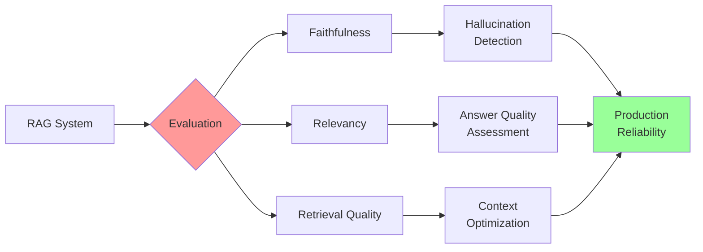

**Impact on Production**:
- **Reliability**: Detect hallucinations before users do
- **Quality**: Ensure answers are relevant and accurate
- **Cost**: Optimize retrieval to reduce token usage
- **Trust**: Build confidence in AI-generated responses

### RAG vs Standard LLM Evaluation

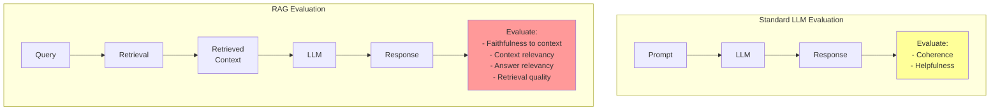

**Key Difference**: RAG evaluation must assess **both retrieval and generation** quality.

---

## 2. RAG System Architecture

### 2.1 Complete RAG Pipeline

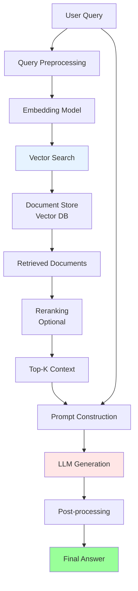

### 2.2 Evaluation Points in RAG

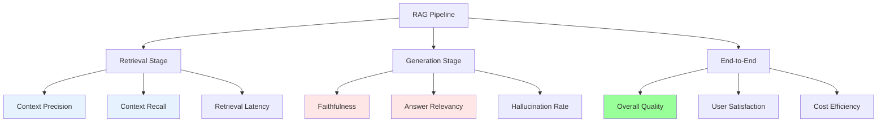

### 2.3 What Can Go Wrong in RAG

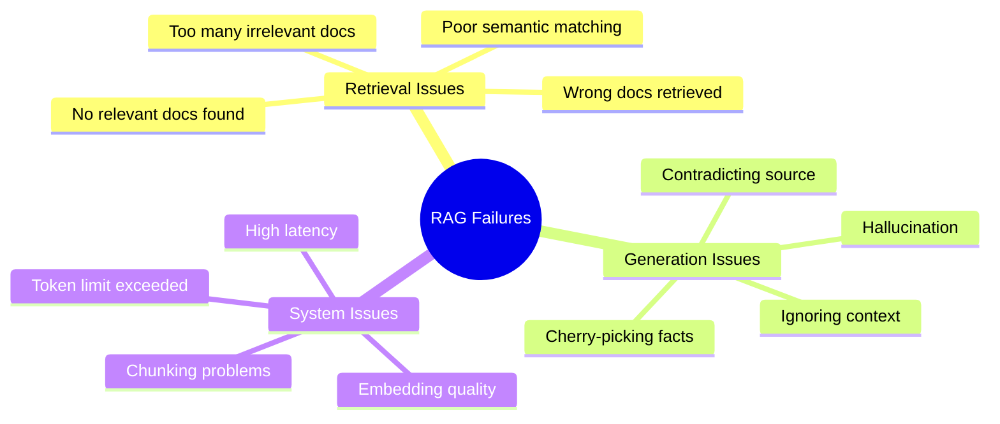

---

## 3. Core Evaluation Metrics

### 3.1 Metric Categories

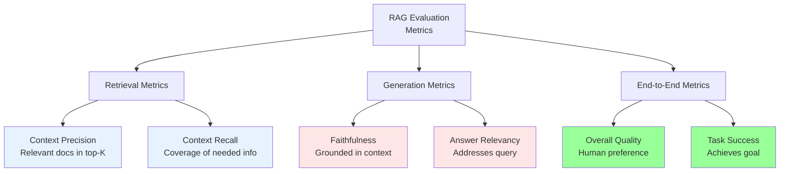

### 3.2 Faithfulness (Groundedness)

**Definition**: Measures whether the generated answer is factually consistent with the retrieved context.

#### How It Works

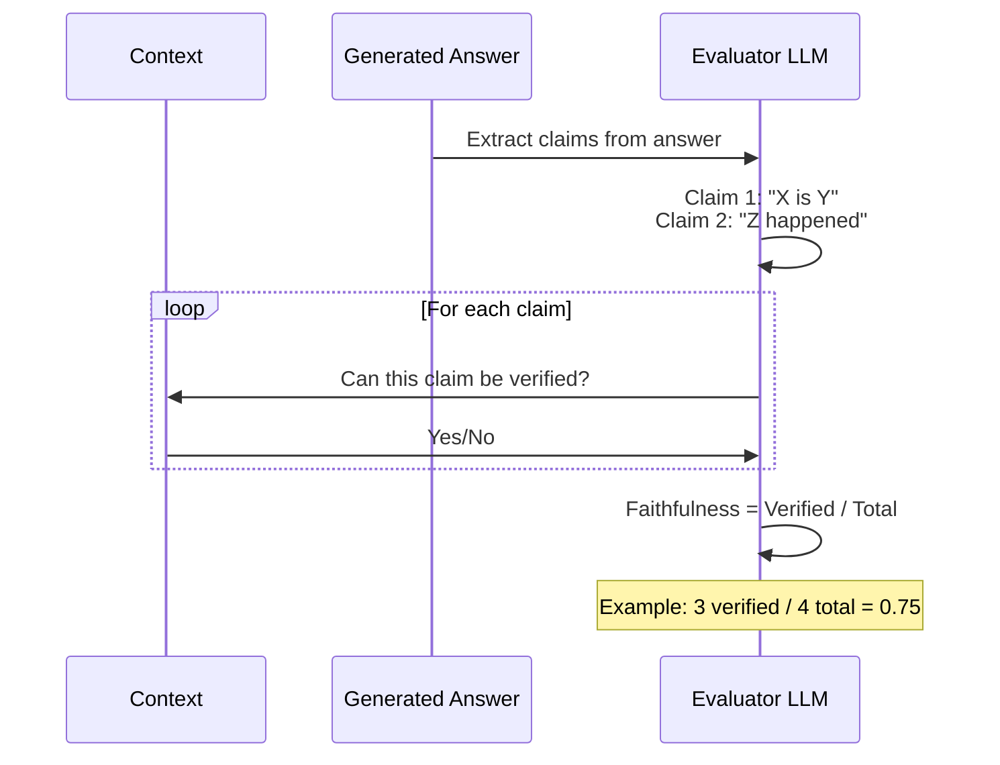

#### Formula

```
Faithfulness = Number of verified claims / Total number of claims

Where:
- Claims are extracted from the answer
- Each claim is checked against the context
- Score ranges from 0.0 (no faithfulness) to 1.0 (fully faithful)
```

#### Example

**Context:**
```
The Eiffel Tower was completed in 1889. It stands 330 meters tall
and was the world's tallest structure until 1930.
```

**Answer:**
```
The Eiffel Tower, finished in 1889, is 330 meters high. It was the
tallest building globally for over 40 years until 1930.
```

**Evaluation:**

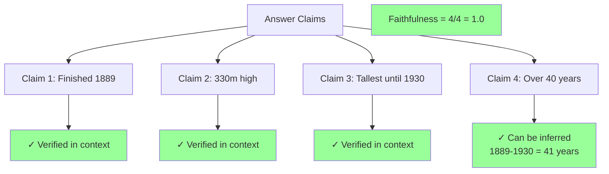

#### Python Implementation

```python
"""Faithfulness evaluation using LLM-as-a-judge."""

from typing import List, Dict, Tuple
from openai import OpenAI
import json

client = OpenAI()

def extract_claims(answer: str) -> List[str]:
    """
    Extract individual factual claims from an answer.

    Args:
        answer: The generated answer text

    Returns:
        List of extracted claims
    """
    prompt = f"""Extract individual factual claims from the following answer.
Each claim should be a single, verifiable statement.

Answer: {answer}

Return claims as JSON array of strings.
Format: {{"claims": ["claim1", "claim2", ...]}}
"""

    response = client.chat.completions.create(
        model="gpt-4-turbo",
        messages=[{"role": "user", "content": prompt}],
        response_format={"type": "json_object"},
        temperature=0.0
    )

    result = json.loads(response.choices[0].message.content)
    return result.get("claims", [])


def verify_claim(claim: str, context: str) -> Dict[str, any]:
    """
    Verify if a claim can be supported by the context.

    Args:
        claim: The claim to verify
        context: The retrieved context

    Returns:
        Dict with verification result and reasoning
    """
    prompt = f"""Determine if the following claim can be verified from the context.

Claim: {claim}

Context: {context}

Can this claim be supported by the context? Consider:
1. Direct statements in context
2. Information that can be reasonably inferred
3. Do NOT use external knowledge

Return JSON:
{{
  "verified": true/false,
  "reasoning": "explanation",
  "evidence": "quote from context or 'none'"
}}
"""

    response = client.chat.completions.create(
        model="gpt-4-turbo",
        messages=[{"role": "user", "content": prompt}],
        response_format={"type": "json_object"},
        temperature=0.0
    )

    return json.loads(response.choices[0].message.content)


def calculate_faithfulness(
    answer: str,
    context: str,
    verbose: bool = True
) -> Tuple[float, Dict]:
    """
    Calculate faithfulness score for a RAG answer.

    Args:
        answer: Generated answer
        context: Retrieved context
        verbose: Print detailed results

    Returns:
        Tuple of (faithfulness_score, detailed_results)
    """
    # Extract claims
    claims = extract_claims(answer)

    if not claims:
        return 1.0, {"claims": [], "verified": [], "score": 1.0}

    # Verify each claim
    verifications = []
    for claim in claims:
        verification = verify_claim(claim, context)
        verifications.append({
            "claim": claim,
            **verification
        })

    # Calculate score
    verified_count = sum(1 for v in verifications if v["verified"])
    faithfulness_score = verified_count / len(claims)

    results = {
        "score": faithfulness_score,
        "total_claims": len(claims),
        "verified_claims": verified_count,
        "unverified_claims": len(claims) - verified_count,
        "details": verifications
    }

    if verbose:
        print(f"\n{'='*60}")
        print(f"FAITHFULNESS EVALUATION")
        print(f"{'='*60}")
        print(f"\nScore: {faithfulness_score:.2f}")
        print(f"Verified: {verified_count}/{len(claims)} claims\n")

        for i, v in enumerate(verifications, 1):
            status = "✓" if v["verified"] else "✗"
            print(f"{status} Claim {i}: {v['claim']}")
            print(f"  Reasoning: {v['reasoning']}")
            if v['evidence'] != 'none':
                print(f"  Evidence: {v['evidence'][:100]}...")
            print()

    return faithfulness_score, results


# Example usage
if __name__ == "__main__":
    context = """
    The Eiffel Tower was completed in 1889 for the World's Fair.
    It stands 330 meters (1,083 feet) tall and was the world's
    tallest structure until 1930. The tower was designed by
    Gustave Eiffel's engineering company.
    """

    answer = """
    The Eiffel Tower, finished in 1889, is 330 meters high.
    It was the tallest building globally until 1930. The tower
    weighs approximately 10,000 tons.
    """

    score, details = calculate_faithfulness(answer, context, verbose=True)

    print(f"\nFinal Faithfulness Score: {score:.2f}")
```

### 3.3 Answer Relevancy

**Definition**: Measures how well the answer addresses the original query.

#### How It Works

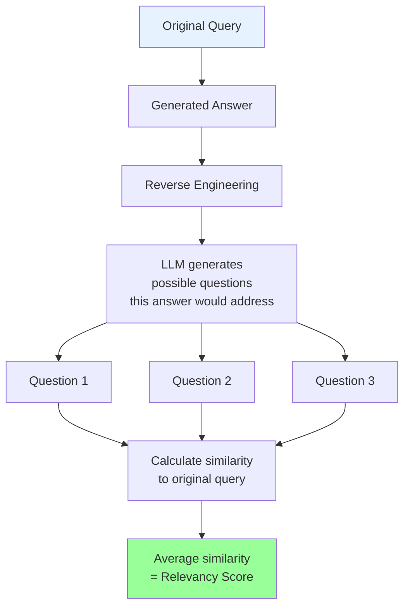

#### Formula

```
Answer Relevancy = Average(Similarity(original_query, generated_question_i))

Where:
- Generated questions are what the answer seems to address
- Similarity is typically cosine similarity of embeddings
- Score ranges from 0.0 (not relevant) to 1.0 (highly relevant)
```

#### Implementation

```python
"""Answer relevancy evaluation."""

from typing import List
import numpy as np
from openai import OpenAI
from sklearn.metrics.pairwise import cosine_similarity

client = OpenAI()


def generate_reverse_questions(answer: str, n: int = 3) -> List[str]:
    """
    Generate questions that this answer would address.

    Args:
        answer: The generated answer
        n: Number of questions to generate

    Returns:
        List of generated questions
    """
    prompt = f"""Given the following answer, generate {n} different questions
that this answer would appropriately address.

Answer: {answer}

Return as JSON array: {{"questions": ["q1", "q2", "q3"]}}
"""

    response = client.chat.completions.create(
        model="gpt-4-turbo",
        messages=[{"role": "user", "content": prompt}],
        response_format={"type": "json_object"},
        temperature=0.7
    )

    import json
    result = json.loads(response.choices[0].message.content)
    return result.get("questions", [])


def get_embedding(text: str) -> np.ndarray:
    """Get embedding vector for text."""
    response = client.embeddings.create(
        model="text-embedding-3-small",
        input=text
    )
    return np.array(response.data[0].embedding)


def calculate_answer_relevancy(
    query: str,
    answer: str,
    n_questions: int = 3,
    verbose: bool = True
) -> float:
    """
    Calculate answer relevancy score.

    Args:
        query: Original user query
        answer: Generated answer
        n_questions: Number of reverse questions to generate
        verbose: Print detailed results

    Returns:
        Relevancy score (0.0 to 1.0)
    """
    # Generate reverse questions
    generated_questions = generate_reverse_questions(answer, n_questions)

    # Get embeddings
    query_embedding = get_embedding(query).reshape(1, -1)

    similarities = []
    for gen_q in generated_questions:
        gen_q_embedding = get_embedding(gen_q).reshape(1, -1)
        similarity = cosine_similarity(query_embedding, gen_q_embedding)[0][0]
        similarities.append(similarity)

        if verbose:
            print(f"\nGenerated Q: {gen_q}")
            print(f"Similarity: {similarity:.3f}")

    # Average similarity
    relevancy_score = np.mean(similarities)

    if verbose:
        print(f"\n{'='*60}")
        print(f"Answer Relevancy Score: {relevancy_score:.3f}")
        print(f"{'='*60}\n")

    return relevancy_score


# Example
if __name__ == "__main__":
    query = "What is the height of the Eiffel Tower?"

    answer = """The Eiffel Tower stands 330 meters (1,083 feet) tall,
    making it one of the tallest structures in Paris."""

    score = calculate_answer_relevancy(query, answer, verbose=True)
```

### 3.4 Context Precision

**Definition**: Measures what proportion of retrieved context is actually relevant to answering the query.

#### Visual Representation

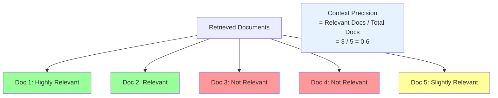

#### Ranked Context Precision

For ranked retrieval, precision at different cutoffs matters:

```mermaid
graph LR
    A[Ranking] --> B[Position 1: Relevant ✓]
    A --> C[Position 2: Not Relevant ✗]
    A --> D[Position 3: Relevant ✓]
    A --> E[Position 4: Relevant ✓]
    A --> F[Position 5: Not Relevant ✗]

    G[Precision@3 = 2/3 = 0.67<br/>Precision@5 = 3/5 = 0.60]

    style B fill:#99ff99
    style C fill:#ff9999
    style D fill:#99ff99
    style E fill:#99ff99
    style F fill:#ff9999
```

#### Implementation

```python
"""Context precision evaluation."""

from typing import List, Dict
from openai import OpenAI
import json

client = OpenAI()


def evaluate_context_relevance(
    query: str,
    context: str
) -> Dict[str, any]:
    """
    Evaluate if a context is relevant to the query.

    Args:
        query: User query
        context: Retrieved context document

    Returns:
        Dict with relevance score and reasoning
    """
    prompt = f"""Evaluate if the following context is relevant for answering the query.

Query: {query}

Context: {context}

Is this context relevant? Rate on scale:
- 2: Highly relevant, directly answers query
- 1: Somewhat relevant, provides related information
- 0: Not relevant, unrelated to query

Return JSON:
{{
  "relevance_score": 0/1/2,
  "reasoning": "explanation"
}}
"""

    response = client.chat.completions.create(
        model="gpt-4-turbo",
        messages=[{"role": "user", "content": prompt}],
        response_format={"type": "json_object"},
        temperature=0.0
    )

    return json.loads(response.choices[0].message.content)


def calculate_context_precision(
    query: str,
    retrieved_contexts: List[str],
    k: int = None,
    verbose: bool = True
) -> Dict[str, float]:
    """
    Calculate context precision at different cutoffs.

    Args:
        query: User query
        retrieved_contexts: List of retrieved documents (in rank order)
        k: Cutoff for precision@k (if None, use all)
        verbose: Print detailed results

    Returns:
        Dict with precision scores
    """
    if k is None:
        k = len(retrieved_contexts)

    # Evaluate each context
    evaluations = []
    relevant_count = 0

    for i, context in enumerate(retrieved_contexts[:k], 1):
        eval_result = evaluate_context_relevance(query, context)
        is_relevant = eval_result["relevance_score"] >= 1

        if is_relevant:
            relevant_count += 1

        evaluations.append({
            "rank": i,
            "context": context[:100] + "...",
            "relevance_score": eval_result["relevance_score"],
            "reasoning": eval_result["reasoning"],
            "is_relevant": is_relevant
        })

        if verbose:
            status = "✓" if is_relevant else "✗"
            print(f"{status} Rank {i}: Score {eval_result['relevance_score']}")
            print(f"  {eval_result['reasoning']}\n")

    # Calculate precision
    precision = relevant_count / k

    results = {
        f"precision@{k}": precision,
        "relevant_count": relevant_count,
        "total_evaluated": k,
        "evaluations": evaluations
    }

    if verbose:
        print(f"\n{'='*60}")
        print(f"Context Precision@{k}: {precision:.3f}")
        print(f"Relevant: {relevant_count}/{k}")
        print(f"{'='*60}\n")

    return results


# Example
if __name__ == "__main__":
    query = "What is the height of the Eiffel Tower?"

    retrieved_contexts = [
        "The Eiffel Tower stands 330 meters tall and is located in Paris.",
        "Paris is the capital city of France with a population of 2.1 million.",
        "The Eiffel Tower was completed in 1889 for the World's Fair.",
        "Gustav Eiffel also designed the internal frame for the Statue of Liberty.",
        "The tower has three levels accessible to visitors."
    ]

    results = calculate_context_precision(
        query,
        retrieved_contexts,
        k=5,
        verbose=True
    )
```

### 3.5 Context Recall

**Definition**: Measures what proportion of the information needed to answer the query was actually retrieved.

#### Visual Representation

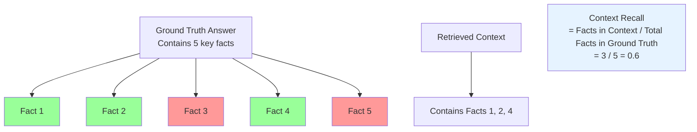

#### Challenge

Context recall **requires a ground truth answer** to compare against.

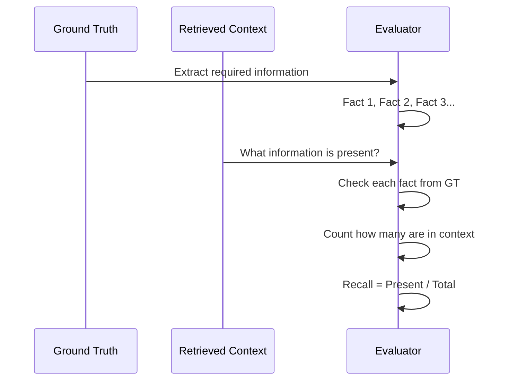

#### Implementation

```python
"""Context recall evaluation."""

from typing import List, Dict
from openai import OpenAI
import json

client = OpenAI()


def extract_ground_truth_statements(
    ground_truth_answer: str
) -> List[str]:
    """
    Extract key statements from ground truth answer.

    Args:
        ground_truth_answer: The correct/reference answer

    Returns:
        List of key statements
    """
    prompt = f"""Extract all key factual statements from the following answer.
Each statement should be a single piece of information.

Answer: {ground_truth_answer}

Return JSON: {{"statements": ["statement1", "statement2", ...]}}
"""

    response = client.chat.completions.create(
        model="gpt-4-turbo",
        messages=[{"role": "user", "content": prompt}],
        response_format={"type": "json_object"},
        temperature=0.0
    )

    result = json.loads(response.choices[0].message.content)
    return result.get("statements", [])


def check_statement_in_context(
    statement: str,
    context: str
) -> Dict[str, any]:
    """
    Check if a statement can be found in the retrieved context.

    Args:
        statement: Statement to check
        context: Retrieved context

    Returns:
        Dict with result
    """
    prompt = f"""Check if the following statement is present in the context.
The context should contain this information (exact wording not required).

Statement: {statement}

Context: {context}

Return JSON:
{{
  "found": true/false,
  "reasoning": "explanation"
}}
"""

    response = client.chat.completions.create(
        model="gpt-4-turbo",
        messages=[{"role": "user", "content": prompt}],
        response_format={"type": "json_object"},
        temperature=0.0
    )

    return json.loads(response.choices[0].message.content)


def calculate_context_recall(
    ground_truth_answer: str,
    retrieved_context: str,
    verbose: bool = True
) -> Dict[str, any]:
    """
    Calculate context recall score.

    Args:
        ground_truth_answer: The correct/reference answer
        retrieved_context: All retrieved context combined
        verbose: Print detailed results

    Returns:
        Dict with recall score and details
    """
    # Extract statements from ground truth
    gt_statements = extract_ground_truth_statements(ground_truth_answer)

    if not gt_statements:
        return {"recall": 1.0, "found": 0, "total": 0}

    # Check each statement
    results = []
    found_count = 0

    for statement in gt_statements:
        check_result = check_statement_in_context(statement, retrieved_context)

        if check_result["found"]:
            found_count += 1

        results.append({
            "statement": statement,
            **check_result
        })

        if verbose:
            status = "✓" if check_result["found"] else "✗"
            print(f"{status} {statement}")
            print(f"  {check_result['reasoning']}\n")

    # Calculate recall
    recall = found_count / len(gt_statements)

    output = {
        "recall": recall,
        "found": found_count,
        "total": len(gt_statements),
        "details": results
    }

    if verbose:
        print(f"\n{'='*60}")
        print(f"Context Recall: {recall:.3f}")
        print(f"Found: {found_count}/{len(gt_statements)}")
        print(f"{'='*60}\n")

    return output


# Example
if __name__ == "__main__":
    ground_truth = """
    The Eiffel Tower is 330 meters tall, was completed in 1889,
    and was the world's tallest structure until 1930.
    """

    retrieved_context = """
    The Eiffel Tower was completed in 1889 for the World's Fair.
    The tower has become a global cultural icon of France.
    """

    results = calculate_context_recall(
        ground_truth,
        retrieved_context,
        verbose=True
    )
```

### 3.6 Metrics Summary

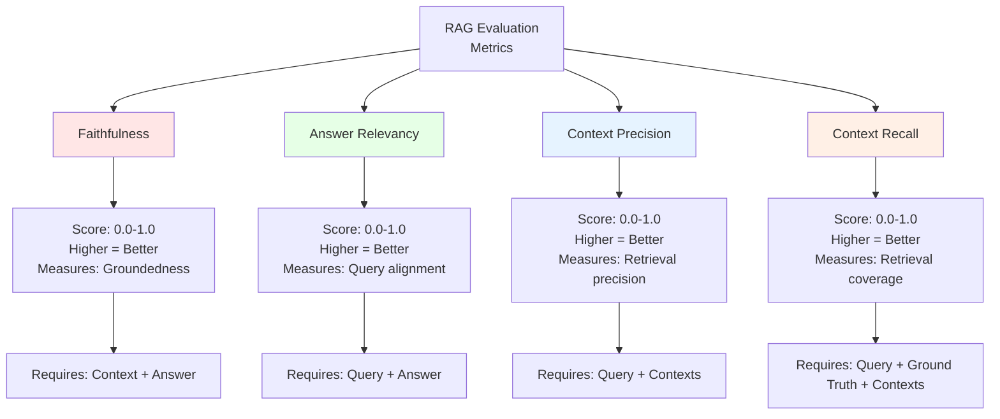

**Comparison Table:**

| Metric | What It Measures | Input Required | Ground Truth Needed | Primary Use |
|--------|-----------------|----------------|-------------------|-------------|
| **Faithfulness** | Is answer grounded in context? | Query, Context, Answer | No | Hallucination detection |
| **Answer Relevancy** | Does answer address query? | Query, Answer | No | Quality assessment |
| **Context Precision** | Are retrieved docs relevant? | Query, Contexts | No | Retrieval optimization |
| **Context Recall** | Is needed info retrieved? | Query, Contexts, Ground Truth | Yes | Retrieval coverage |

---

## 4. RAGAS Framework

### 4.1 What is RAGAS?

**RAGAS** (Retrieval-Augmented Generation Assessment) is an open-source framework specifically designed for evaluating RAG systems.

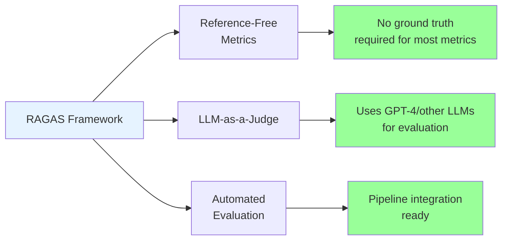

### 4.2 RAGAS Metrics

RAGAS provides four main metrics:

```python
from ragas.metrics import (
    faithfulness,
    answer_relevancy,
    context_precision,
    context_recall
)
```

### 4.3 Installation and Setup

```python
# Install RAGAS
# pip install ragas

from ragas import evaluate
from ragas.metrics import (
    faithfulness,
    answer_relevancy,
    context_recall,
    context_precision
)
from datasets import Dataset
```

### 4.4 Complete RAGAS Example

```python
"""Complete RAGAS evaluation example."""

from ragas import evaluate
from ragas.metrics import (
    faithfulness,
    answer_relevancy,
    context_recall,
    context_precision
)
from datasets import Dataset
import pandas as pd


# Prepare evaluation data
evaluation_data = {
    "question": [
        "What is the height of the Eiffel Tower?",
        "When was the Eiffel Tower completed?",
    ],
    "answer": [
        "The Eiffel Tower is 330 meters (1,083 feet) tall.",
        "The Eiffel Tower was completed in 1889 for the World's Fair in Paris.",
    ],
    "contexts": [
        [
            "The Eiffel Tower stands 330 meters tall and is located in Paris, France.",
            "It was the world's tallest structure from 1889 to 1930."
        ],
        [
            "Construction of the Eiffel Tower was completed in March 1889.",
            "The tower was built for the 1889 World's Fair in Paris."
        ],
    ],
    "ground_truth": [
        "The Eiffel Tower is 330 meters tall.",
        "The Eiffel Tower was completed in 1889.",
    ]
}

# Convert to Dataset
dataset = Dataset.from_dict(evaluation_data)

# Run evaluation
result = evaluate(
    dataset,
    metrics=[
        faithfulness,
        answer_relevancy,
        context_recall,
        context_precision,
    ],
)

# Display results
df = result.to_pandas()
print("\n" + "="*80)
print("RAGAS EVALUATION RESULTS")
print("="*80 + "\n")
print(df.to_string())
print("\n" + "="*80)
print("METRIC AVERAGES")
print("="*80)
for metric in ['faithfulness', 'answer_relevancy', 'context_recall', 'context_precision']:
    if metric in df.columns:
        avg = df[metric].mean()
        print(f"{metric:20s}: {avg:.3f}")
```

**Output:**
```
================================================================================
RAGAS EVALUATION RESULTS
================================================================================

   question                    answer  ... context_precision context_recall
0  What is the height of...  The Eif... ...            1.000          1.000
1  When was the Eiffel...   The Eif... ...            1.000          1.000

================================================================================
METRIC AVERAGES
================================================================================
faithfulness        : 1.000
answer_relevancy    : 0.987
context_recall      : 1.000
context_precision   : 1.000
```

### 4.5 RAGAS with Custom LLM

```python
"""Use RAGAS with custom LLM (Azure OpenAI, local models, etc.)."""

from ragas.llms import LangchainLLMWrapper
from langchain_openai import ChatOpenAI, OpenAIEmbeddings

# Configure custom LLM
evaluator_llm = LangchainLLMWrapper(ChatOpenAI(
    model="gpt-4-turbo",
    temperature=0.0
))

# Configure embeddings
embeddings = OpenAIEmbeddings(model="text-embedding-3-small")

# Run evaluation with custom models
result = evaluate(
    dataset,
    metrics=[faithfulness, answer_relevancy],
    llm=evaluator_llm,
    embeddings=embeddings
)
```

### 4.6 Integrating RAGAS into Production Pipeline

```python
"""Production RAG evaluation pipeline with RAGAS."""

from typing import List, Dict
import logging
from ragas import evaluate
from ragas.metrics import faithfulness, answer_relevancy, context_precision
from datasets import Dataset

logging.basicConfig(level=logging.INFO)
logger = logging.getLogger(__name__)


class RAGEvaluationPipeline:
    """Production RAG evaluation pipeline."""

    def __init__(
        self,
        faithfulness_threshold: float = 0.7,
        relevancy_threshold: float = 0.7,
        precision_threshold: float = 0.6
    ):
        """
        Initialize evaluation pipeline.

        Args:
            faithfulness_threshold: Minimum acceptable faithfulness score
            relevancy_threshold: Minimum acceptable relevancy score
            precision_threshold: Minimum acceptable precision score
        """
        self.thresholds = {
            "faithfulness": faithfulness_threshold,
            "answer_relevancy": relevancy_threshold,
            "context_precision": precision_threshold
        }

        self.metrics = [
            faithfulness,
            answer_relevancy,
            context_precision
        ]

    def evaluate_batch(
        self,
        questions: List[str],
        answers: List[str],
        contexts: List[List[str]]
    ) -> Dict:
        """
        Evaluate a batch of RAG responses.

        Args:
            questions: List of user queries
            answers: List of generated answers
            contexts: List of retrieved context lists

        Returns:
            Dict with evaluation results and pass/fail status
        """
        # Prepare data
        eval_data = {
            "question": questions,
            "answer": answers,
            "contexts": contexts
        }

        dataset = Dataset.from_dict(eval_data)

        # Run evaluation
        logger.info(f"Evaluating {len(questions)} RAG responses...")
        result = evaluate(dataset, metrics=self.metrics)

        df = result.to_pandas()

        # Check thresholds
        failures = []
        for idx, row in df.iterrows():
            for metric, threshold in self.thresholds.items():
                if metric in df.columns and row[metric] < threshold:
                    failures.append({
                        "index": idx,
                        "question": questions[idx],
                        "metric": metric,
                        "score": row[metric],
                        "threshold": threshold
                    })

        # Calculate pass rate
        total = len(questions)
        failed = len(set(f["index"] for f in failures))
        passed = total - failed
        pass_rate = passed / total if total > 0 else 0

        return {
            "pass_rate": pass_rate,
            "total": total,
            "passed": passed,
            "failed": failed,
            "failures": failures,
            "detailed_results": df,
            "metric_averages": {
                metric: df[metric].mean()
                for metric in ["faithfulness", "answer_relevancy", "context_precision"]
                if metric in df.columns
            }
        }

    def evaluate_single(
        self,
        question: str,
        answer: str,
        contexts: List[str]
    ) -> Dict:
        """Evaluate a single RAG response."""
        return self.evaluate_batch(
            questions=[question],
            answers=[answer],
            contexts=[contexts]
        )


# Example usage
if __name__ == "__main__":
    pipeline = RAGEvaluationPipeline(
        faithfulness_threshold=0.8,
        relevancy_threshold=0.7,
        precision_threshold=0.7
    )

    # Test data
    questions = [
        "What is the capital of France?",
        "What is the height of the Eiffel Tower?"
    ]

    answers = [
        "The capital of France is Paris, which has a population of over 2 million.",
        "The Eiffel Tower is approximately 300 meters tall."  # Slightly inaccurate
    ]

    contexts = [
        [
            "Paris is the capital and largest city of France.",
            "The city has a population of 2.1 million residents."
        ],
        [
            "The Eiffel Tower stands 330 meters (1,083 feet) tall.",
            "It is located on the Champ de Mars in Paris."
        ]
    ]

    # Run evaluation
    results = pipeline.evaluate_batch(questions, answers, contexts)

    print(f"\n{'='*60}")
    print("EVALUATION SUMMARY")
    print(f"{'='*60}")
    print(f"Pass Rate: {results['pass_rate']:.1%}")
    print(f"Passed: {results['passed']}/{results['total']}")
    print(f"\nMetric Averages:")
    for metric, score in results['metric_averages'].items():
        print(f"  {metric:20s}: {score:.3f}")

    if results['failures']:
        print(f"\n{'='*60}")
        print("FAILURES")
        print(f"{'='*60}")
        for failure in results['failures']:
            print(f"\nQuestion: {failure['question']}")
            print(f"Metric: {failure['metric']}")
            print(f"Score: {failure['score']:.3f} (threshold: {failure['threshold']:.3f})")
```

---

## 5. Advanced Evaluation Techniques

### 5.1 Hallucination Detection

Beyond basic faithfulness, specialized hallucination detection:

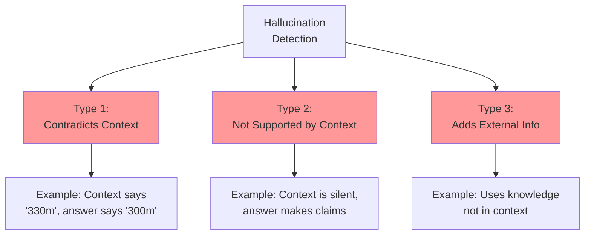

#### Implementation

```python
"""Advanced hallucination detection."""

from typing import Dict, List
from openai import OpenAI
import json

client = OpenAI()


def detect_hallucinations(
    context: str,
    answer: str,
    query: str
) -> Dict:
    """
    Detect different types of hallucinations.

    Args:
        context: Retrieved context
        answer: Generated answer
        query: Original query

    Returns:
        Dict with hallucination analysis
    """
    prompt = f"""Analyze the answer for hallucinations compared to the context.

Query: {query}

Context: {context}

Answer: {answer}

Identify:
1. Contradictions: Statements that contradict the context
2. Unsupported claims: Statements not verifiable from context
3. External knowledge: Information not present in context

Return JSON:
{{
  "has_hallucination": true/false,
  "hallucination_type": "contradiction/unsupported/external/none",
  "hallucinated_statements": ["statement1", ...],
  "severity": "high/medium/low",
  "explanation": "detailed explanation"
}}
"""

    response = client.chat.completions.create(
        model="gpt-4-turbo",
        messages=[{"role": "user", "content": prompt}],
        response_format={"type": "json_object"},
        temperature=0.0
    )

    return json.loads(response.choices[0].message.content)


# Example
context = "The Eiffel Tower is 330 meters tall."
answer = "The Eiffel Tower is about 300 meters high."
query = "How tall is the Eiffel Tower?"

result = detect_hallucinations(context, answer, query)
print(json.dumps(result, indent=2))
```

### 5.2 Retrieval Quality Analysis

Analyze why retrieval might be failing:

```python
"""Retrieval quality analysis."""

from typing import List, Dict
import numpy as np
from openai import OpenAI

client = OpenAI()


def analyze_retrieval_quality(
    query: str,
    retrieved_docs: List[str],
    expected_info: str = None
) -> Dict:
    """
    Analyze retrieval quality and identify issues.

    Args:
        query: User query
        retrieved_docs: List of retrieved documents
        expected_info: What information should have been retrieved (optional)

    Returns:
        Analysis of retrieval quality
    """
    # Check relevance distribution
    relevance_scores = []
    for doc in retrieved_docs:
        # Simplified: use embedding similarity
        query_emb = get_embedding(query)
        doc_emb = get_embedding(doc)
        similarity = np.dot(query_emb, doc_emb)
        relevance_scores.append(similarity)

    # Analyze score distribution
    mean_relevance = np.mean(relevance_scores)
    std_relevance = np.std(relevance_scores)

    # Identify issues
    issues = []

    if mean_relevance < 0.6:
        issues.append("Low overall relevance - query reformulation may help")

    if std_relevance < 0.05:
        issues.append("Low score variance - retrieval not discriminative")

    if relevance_scores[0] < 0.7:
        issues.append("Top result has low relevance - consider reranking")

    # Check for expected information
    if expected_info:
        # Use LLM to check if expected info is present
        found = check_information_present(expected_info, " ".join(retrieved_docs))
        if not found:
            issues.append(f"Missing expected information: {expected_info}")

    return {
        "mean_relevance": mean_relevance,
        "std_relevance": std_relevance,
        "relevance_scores": relevance_scores,
        "issues": issues,
        "recommendation": generate_recommendation(issues)
    }


def get_embedding(text: str) -> np.ndarray:
    """Get embedding for text."""
    response = client.embeddings.create(
        model="text-embedding-3-small",
        input=text
    )
    return np.array(response.data[0].embedding)


def check_information_present(expected: str, retrieved: str) -> bool:
    """Check if expected information is in retrieved docs."""
    prompt = f"""Is the following expected information present in the retrieved text?

Expected: {expected}

Retrieved: {retrieved}

Return JSON: {{"present": true/false}}
"""

    response = client.chat.completions.create(
        model="gpt-4-turbo",
        messages=[{"role": "user", "content": prompt}],
        response_format={"type": "json_object"},
        temperature=0.0
    )

    import json
    result = json.loads(response.choices[0].message.content)
    return result.get("present", False)


def generate_recommendation(issues: List[str]) -> str:
    """Generate actionable recommendations."""
    if not issues:
        return "Retrieval quality is good"

    recommendations = []
    for issue in issues:
        if "query reformulation" in issue:
            recommendations.append("Try query expansion or reformulation")
        elif "reranking" in issue:
            recommendations.append("Implement cross-encoder reranking")
        elif "not discriminative" in issue:
            recommendations.append("Check embedding model quality")
        elif "Missing expected" in issue:
            recommendations.append("Review chunk size and indexing strategy")

    return "; ".join(recommendations)
```

### 5.3 Answer Quality Decomposition

Evaluate multiple dimensions of answer quality:

```python
"""Multi-dimensional answer quality evaluation."""

from typing import Dict
from openai import OpenAI
import json

client = OpenAI()


def evaluate_answer_quality(
    query: str,
    answer: str,
    context: str
) -> Dict:
    """
    Evaluate answer across multiple quality dimensions.

    Args:
        query: User query
        answer: Generated answer
        context: Retrieved context

    Returns:
        Multi-dimensional quality scores
    """
    prompt = f"""Evaluate the answer across multiple dimensions.

Query: {query}

Context: {context}

Answer: {answer}

Rate each dimension (0-10):

1. Completeness: Does it fully answer the query?
2. Accuracy: Is the information correct?
3. Coherence: Is it well-structured and clear?
4. Conciseness: Is it appropriately brief?
5. Groundedness: Is it supported by context?

Return JSON:
{{
  "completeness": {{
    "score": 0-10,
    "reasoning": "explanation"
  }},
  "accuracy": {{
    "score": 0-10,
    "reasoning": "explanation"
  }},
  "coherence": {{
    "score": 0-10,
    "reasoning": "explanation"
  }},
  "conciseness": {{
    "score": 0-10,
    "reasoning": "explanation"
  }},
  "groundedness": {{
    "score": 0-10,
    "reasoning": "explanation"
  }},
  "overall_quality": "excellent/good/fair/poor",
  "improvement_suggestions": ["suggestion1", "suggestion2"]
}}
"""

    response = client.chat.completions.create(
        model="gpt-4-turbo",
        messages=[{"role": "user", "content": prompt}],
        response_format={"type": "json_object"},
        temperature=0.0
    )

    return json.loads(response.choices[0].message.content)


# Example
query = "What is the height of the Eiffel Tower?"
context = "The Eiffel Tower stands 330 meters (1,083 feet) tall."
answer = "It's about 300 meters."

quality = evaluate_answer_quality(query, answer, context)

print(json.dumps(quality, indent=2))

# Visualize results
import matplotlib.pyplot as plt

dimensions = ["Completeness", "Accuracy", "Coherence", "Conciseness", "Groundedness"]
scores = [
    quality["completeness"]["score"],
    quality["accuracy"]["score"],
    quality["coherence"]["score"],
    quality["conciseness"]["score"],
    quality["groundedness"]["score"]
]

plt.figure(figsize=(10, 6))
plt.barh(dimensions, scores, color='skyblue')
plt.xlabel('Score (0-10)')
plt.title('Answer Quality Dimensions')
plt.xlim(0, 10)
for i, v in enumerate(scores):
    plt.text(v + 0.1, i, str(v), va='center')
plt.tight_layout()
plt.savefig('answer_quality.png', dpi=150, bbox_inches='tight')
```

---

## 6. Evaluation Frameworks Comparison

### 6.1 Popular RAG Evaluation Tools

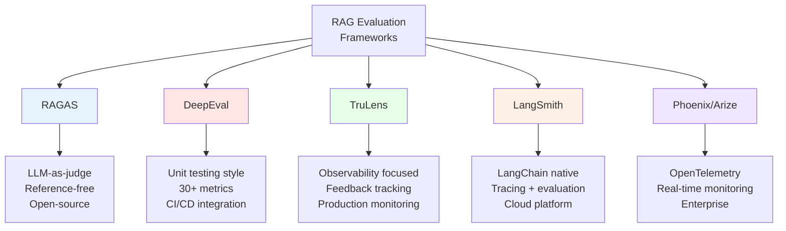

### 6.2 Framework Comparison Table

| Framework | Best For | Metrics | LLM Required | Cost | Ease of Use |
|-----------|----------|---------|--------------|------|-------------|
| **RAGAS** | Research, prototyping | 4 core RAG metrics | Yes (GPT-4 recommended) | Pay-per-use | High |
| **DeepEval** | Testing, CI/CD | 30+ metrics | Yes | Pay-per-use | High |
| **TruLens** | Production monitoring | Custom + standard | Yes | Pay-per-use | Medium |
| **LangSmith** | LangChain apps | Custom evaluators | Optional | Freemium/Paid | High |
| **Phoenix** | Enterprise monitoring | Comprehensive | Yes | Enterprise | Medium |

### 6.3 DeepEval for RAG

```python
"""DeepEval example for RAG evaluation."""

# pip install deepeval

from deepeval import evaluate
from deepeval.metrics import (
    AnswerRelevancyMetric,
    FaithfulnessMetric,
    ContextualPrecisionMetric,
    ContextualRecallMetric
)
from deepeval.test_case import LLMTestCase


# Define test cases
test_case = LLMTestCase(
    input="What is the height of the Eiffel Tower?",
    actual_output="The Eiffel Tower is 330 meters tall.",
    retrieval_context=[
        "The Eiffel Tower stands 330 meters (1,083 feet) tall.",
        "It was completed in 1889."
    ],
    expected_output="330 meters"  # Optional ground truth
)

# Define metrics
metrics = [
    AnswerRelevancyMetric(threshold=0.7),
    FaithfulnessMetric(threshold=0.7),
    ContextualPrecisionMetric(threshold=0.7),
    ContextualRecallMetric(threshold=0.7)
]

# Run evaluation
evaluate(
    test_cases=[test_case],
    metrics=metrics
)
```

### 6.4 TruLens for Production Monitoring

```python
"""TruLens example for production RAG monitoring."""

# pip install trulens-eval

from trulens_eval import Tru, Feedback, Select
from trulens_eval.app import App
from trulens_eval.feedback import Groundedness

# Initialize
tru = Tru()

# Define feedback functions
grounded = Groundedness()

f_groundedness = Feedback(
    grounded.groundedness_measure_with_cot_reasons
).on(
    Select.RecordCalls.retrieve.rets.collect()
).on_output()

# Wrap your RAG app
class MyRAGApp:
    def query(self, question: str) -> str:
        # Your RAG logic here
        contexts = self.retrieve(question)
        answer = self.generate(question, contexts)
        return answer

    def retrieve(self, question: str) -> list:
        # Retrieval logic
        pass

    def generate(self, question: str, contexts: list) -> str:
        # Generation logic
        pass

# Wrap with TruLens
tru_app = App(
    MyRAGApp(),
    app_id="my_rag_app",
    feedbacks=[f_groundedness]
)

# Use normally - TruLens tracks everything
with tru_app as recording:
    result = tru_app.query("What is the height of the Eiffel Tower?")

# View results in dashboard
tru.run_dashboard()  # Opens localhost dashboard
```

---

## 7. Production Evaluation Pipeline

### 7.1 Complete Pipeline Architecture

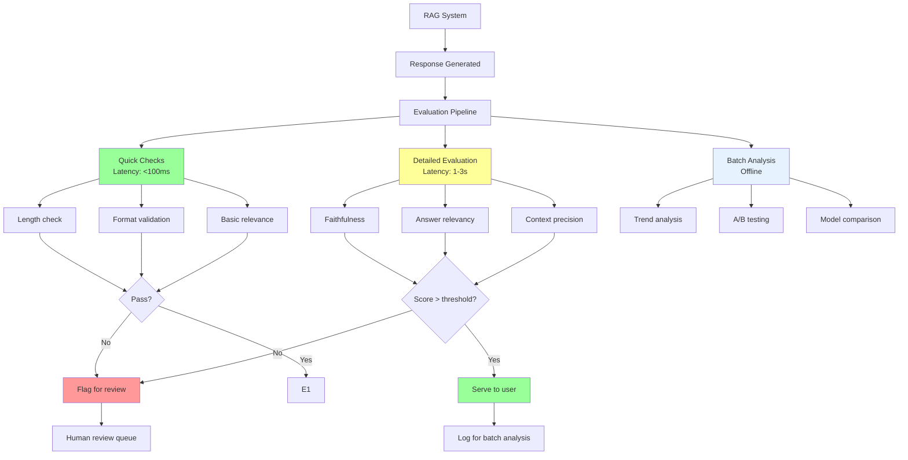

### 7.2 Production Pipeline Implementation

```python
"""Production-ready RAG evaluation pipeline."""

import logging
import time
from typing import Dict, List, Optional
from dataclasses import dataclass
from enum import Enum
import asyncio

logging.basicConfig(level=logging.INFO)
logger = logging.getLogger(__name__)


class EvaluationResult(Enum):
    """Evaluation result status."""
    PASS = "pass"
    FAIL = "fail"
    NEEDS_REVIEW = "needs_review"


@dataclass
class RAGResponse:
    """RAG response data."""
    query: str
    answer: str
    contexts: List[str]
    metadata: Dict
    timestamp: float


@dataclass
class EvaluationReport:
    """Evaluation report."""
    status: EvaluationResult
    scores: Dict[str, float]
    issues: List[str]
    latency_ms: float
    recommendations: List[str]


class ProductionRAGEvaluator:
    """Production RAG evaluation pipeline."""

    def __init__(
        self,
        enable_quick_checks: bool = True,
        enable_detailed_eval: bool = True,
        faithfulness_threshold: float = 0.7,
        relevancy_threshold: float = 0.7,
        max_eval_latency_ms: float = 3000
    ):
        """
        Initialize production evaluator.

        Args:
            enable_quick_checks: Enable fast validation checks
            enable_detailed_eval: Enable LLM-based evaluation
            faithfulness_threshold: Minimum faithfulness score
            relevancy_threshold: Minimum relevancy score
            max_eval_latency_ms: Maximum allowed evaluation time
        """
        self.enable_quick_checks = enable_quick_checks
        self.enable_detailed_eval = enable_detailed_eval
        self.thresholds = {
            "faithfulness": faithfulness_threshold,
            "relevancy": relevancy_threshold
        }
        self.max_eval_latency_ms = max_eval_latency_ms

        self.stats = {
            "total_evaluated": 0,
            "passed": 0,
            "failed": 0,
            "needs_review": 0
        }

    async def evaluate(
        self,
        response: RAGResponse
    ) -> EvaluationReport:
        """
        Evaluate a RAG response.

        Args:
            response: RAG response to evaluate

        Returns:
            Evaluation report
        """
        start_time = time.time()
        issues = []
        scores = {}

        try:
            # Phase 1: Quick checks (< 100ms)
            if self.enable_quick_checks:
                quick_issues = self._quick_checks(response)
                issues.extend(quick_issues)

                if quick_issues:
                    logger.warning(f"Quick check failures: {quick_issues}")
                    return self._create_report(
                        EvaluationResult.FAIL,
                        scores,
                        issues,
                        start_time
                    )

            # Phase 2: Detailed evaluation (1-3s)
            if self.enable_detailed_eval:
                scores, detail_issues = await self._detailed_evaluation(response)
                issues.extend(detail_issues)

            # Determine final status
            status = self._determine_status(scores, issues)

            # Update stats
            self._update_stats(status)

            return self._create_report(status, scores, issues, start_time)

        except Exception as e:
            logger.error(f"Evaluation error: {e}")
            return self._create_report(
                EvaluationResult.NEEDS_REVIEW,
                {},
                [f"Evaluation error: {str(e)}"],
                start_time
            )

    def _quick_checks(self, response: RAGResponse) -> List[str]:
        """
        Fast validation checks.

        Args:
            response: RAG response

        Returns:
            List of issues found
        """
        issues = []

        # Check 1: Answer not empty
        if not response.answer.strip():
            issues.append("Empty answer")

        # Check 2: Answer length reasonable
        if len(response.answer) < 10:
            issues.append("Answer too short")
        elif len(response.answer) > 2000:
            issues.append("Answer too long")

        # Check 3: Contexts retrieved
        if not response.contexts:
            issues.append("No contexts retrieved")

        # Check 4: Basic keyword overlap
        query_words = set(response.query.lower().split())
        answer_words = set(response.answer.lower().split())
        overlap = len(query_words & answer_words) / len(query_words) if query_words else 0

        if overlap < 0.2:
            issues.append("Low query-answer overlap")

        return issues

    async def _detailed_evaluation(
        self,
        response: RAGResponse
    ) -> tuple[Dict[str, float], List[str]]:
        """
        Detailed LLM-based evaluation.

        Args:
            response: RAG response

        Returns:
            Tuple of (scores_dict, issues_list)
        """
        scores = {}
        issues = []

        # Run evaluations in parallel
        tasks = [
            self._evaluate_faithfulness(response),
            self._evaluate_relevancy(response),
        ]

        results = await asyncio.gather(*tasks, return_exceptions=True)

        # Process results
        for result in results:
            if isinstance(result, Exception):
                logger.error(f"Evaluation task failed: {result}")
                continue

            metric_name, score = result
            scores[metric_name] = score

            # Check threshold
            threshold = self.thresholds.get(metric_name)
            if threshold and score < threshold:
                issues.append(
                    f"{metric_name} below threshold: "
                    f"{score:.3f} < {threshold:.3f}"
                )

        return scores, issues

    async def _evaluate_faithfulness(
        self,
        response: RAGResponse
    ) -> tuple[str, float]:
        """Evaluate faithfulness asynchronously."""
        # Simplified for example - use actual RAGAS or custom implementation
        await asyncio.sleep(1)  # Simulate API call
        score = 0.85  # Placeholder
        return ("faithfulness", score)

    async def _evaluate_relevancy(
        self,
        response: RAGResponse
    ) -> tuple[str, float]:
        """Evaluate relevancy asynchronously."""
        await asyncio.sleep(1)  # Simulate API call
        score = 0.90  # Placeholder
        return ("relevancy", score)

    def _determine_status(
        self,
        scores: Dict[str, float],
        issues: List[str]
    ) -> EvaluationResult:
        """Determine final evaluation status."""
        if issues:
            # Check severity
            critical_keywords = ["empty", "no contexts", "threshold"]
            has_critical = any(
                any(k in issue.lower() for k in critical_keywords)
                for issue in issues
            )

            if has_critical:
                return EvaluationResult.FAIL
            else:
                return EvaluationResult.NEEDS_REVIEW

        return EvaluationResult.PASS

    def _create_report(
        self,
        status: EvaluationResult,
        scores: Dict[str, float],
        issues: List[str],
        start_time: float
    ) -> EvaluationReport:
        """Create evaluation report."""
        latency_ms = (time.time() - start_time) * 1000

        # Generate recommendations
        recommendations = self._generate_recommendations(issues, scores)

        return EvaluationReport(
            status=status,
            scores=scores,
            issues=issues,
            latency_ms=latency_ms,
            recommendations=recommendations
        )

    def _generate_recommendations(
        self,
        issues: List[str],
        scores: Dict[str, float]
    ) -> List[str]:
        """Generate actionable recommendations."""
        recommendations = []

        for issue in issues:
            if "faithfulness" in issue:
                recommendations.append(
                    "Review context relevance and consider reranking"
                )
            elif "relevancy" in issue:
                recommendations.append(
                    "Check query understanding and rephrase generation prompt"
                )
            elif "overlap" in issue:
                recommendations.append(
                    "Verify answer addresses the query"
                )

        return recommendations

    def _update_stats(self, status: EvaluationResult):
        """Update evaluation statistics."""
        self.stats["total_evaluated"] += 1

        if status == EvaluationResult.PASS:
            self.stats["passed"] += 1
        elif status == EvaluationResult.FAIL:
            self.stats["failed"] += 1
        else:
            self.stats["needs_review"] += 1

    def get_stats(self) -> Dict:
        """Get evaluation statistics."""
        total = self.stats["total_evaluated"]
        return {
            **self.stats,
            "pass_rate": self.stats["passed"] / total if total > 0 else 0,
            "fail_rate": self.stats["failed"] / total if total > 0 else 0
        }


# Example usage
async def main():
    """Example usage of production evaluator."""
    evaluator = ProductionRAGEvaluator(
        faithfulness_threshold=0.75,
        relevancy_threshold=0.70
    )

    # Simulate RAG response
    response = RAGResponse(
        query="What is the height of the Eiffel Tower?",
        answer="The Eiffel Tower is 330 meters tall.",
        contexts=[
            "The Eiffel Tower stands 330 meters (1,083 feet) tall.",
            "It was completed in 1889."
        ],
        metadata={"model": "gpt-4", "retrieval_method": "vector_search"},
        timestamp=time.time()
    )

    # Evaluate
    report = await evaluator.evaluate(response)

    print(f"\n{'='*60}")
    print("EVALUATION REPORT")
    print(f"{'='*60}")
    print(f"Status: {report.status.value}")
    print(f"Latency: {report.latency_ms:.2f}ms")
    print(f"\nScores:")
    for metric, score in report.scores.items():
        print(f"  {metric:20s}: {score:.3f}")

    if report.issues:
        print(f"\nIssues:")
        for issue in report.issues:
            print(f"  - {issue}")

    if report.recommendations:
        print(f"\nRecommendations:")
        for rec in report.recommendations:
            print(f"  - {rec}")

    # Get stats
    stats = evaluator.get_stats()
    print(f"\n{'='*60}")
    print("EVALUATION STATISTICS")
    print(f"{'='*60}")
    print(f"Total evaluated: {stats['total_evaluated']}")
    print(f"Pass rate: {stats['pass_rate']:.1%}")


if __name__ == "__main__":
    asyncio.run(main())
```

---

## 8. Common Challenges and Solutions

### 8.1 Challenge: High Evaluation Cost

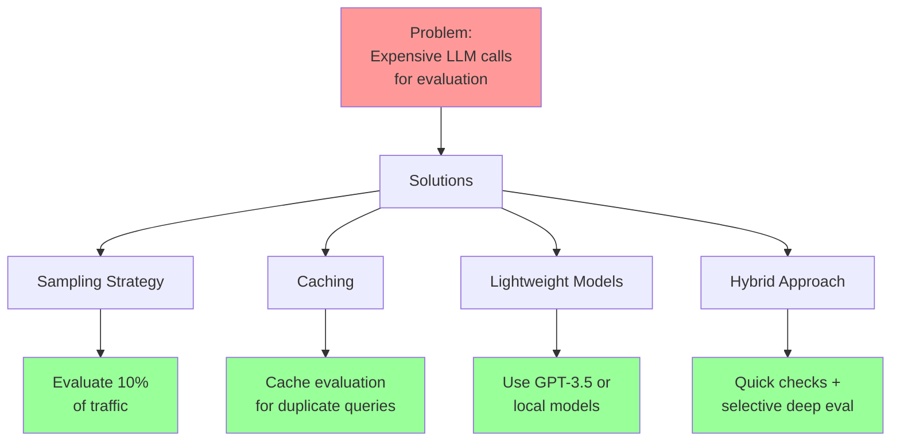

### 8.2 Challenge: Evaluation Latency

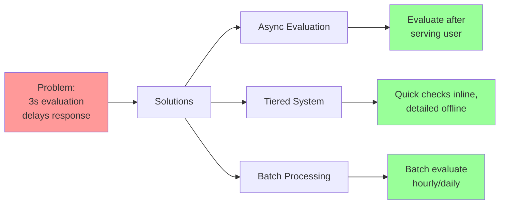

### 8.3 Challenge: No Ground Truth

```mermaid
graph TD
    A[Problem:<br/>No ground truth<br/>for new queries] --> B[Solutions]

    B --> C[Reference-Free Metrics]
    B --> D[Human-in-Loop]
    B --> E[Synthetic Ground Truth]

    C --> C1[Use RAGAS metrics<br/>that don't need GT]
    D --> D1[Sample for<br/>human review]
    E --> E1[Generate GT using<br/>strong LLM]

    style A fill:#ff9999
    style C1 fill:#99ff99
    style D1 fill:#99ff99
    style E1 fill:#99ff99
```

### 8.4 Challenge: Inconsistent Evaluation

```mermaid
graph TD
    A[Problem:<br/>LLM judge gives<br/>different scores] --> B[Solutions]

    B --> C[Low Temperature]
    B --> D[Detailed Rubrics]
    B --> E[Multiple Runs]
    B --> F[Human Calibration]

    C --> C1[Set temp=0.0]
    D --> D1[Explicit scoring<br/>guidelines]
    E --> E1[Average 3-5<br/>evaluations]
    F --> F1[Validate against<br/>human judgments]

    style A fill:#ff9999
    style C1 fill:#99ff99
    style D1 fill:#99ff99
    style E1 fill:#99ff99
    style F1 fill:#99ff99
```

---

## 9. Interview Questions

### Evaluation Metrics Questions

**Q1: Explain the difference between faithfulness and answer relevancy in RAG evaluation.**

<details>
<summary>Answer</summary>

**Faithfulness (Groundedness)**:
- **What**: Measures if the answer is factually consistent with the retrieved context
- **Question**: "Is this answer supported by the context?"
- **Example**: Context says "330 meters", answer says "300 meters" → Low faithfulness
- **Purpose**: Detect hallucinations

**Answer Relevancy**:
- **What**: Measures if the answer addresses the original query
- **Question**: "Does this answer actually answer the question?"
- **Example**: Query asks "height", answer talks about "location" → Low relevancy
- **Purpose**: Ensure answer usefulness

**Key Difference**:
- Faithfulness: Answer ↔ Context relationship
- Relevancy: Answer ↔ Query relationship

**Both can fail independently**:
- High faithfulness, low relevancy: Answer is grounded but doesn't address query
- Low faithfulness, high relevancy: Answer addresses query but hallucinates
</details>

**Q2: What is context recall and why does it require ground truth?**

<details>
<summary>Answer</summary>

**Context Recall**:
- Measures what proportion of information needed to answer the query was actually retrieved
- Formula: `Recall = Information in context / Information needed`

**Why it requires ground truth**:
- You need to know what the "correct answer" should contain
- Without ground truth, you can't determine what information "should" have been retrieved
- Example:
  - Query: "What are the features of the Eiffel Tower?"
  - Ground truth: "Height, construction date, location, designer"
  - Retrieved: Only mentions height and location
  - Recall: 2/4 = 0.5

**Alternatives without ground truth**:
- Use faithfulness and relevancy (reference-free)
- Generate synthetic ground truth using strong LLM
- Sample human-annotated ground truth for subset
</details>

**Q3: How would you detect hallucinations in a RAG system?**

<details>
<summary>Answer</summary>

**Multi-layered Approach**:

1. **Faithfulness Check** (Primary):
   ```python
   # Extract claims from answer
   claims = extract_claims(answer)
   # Verify each against context
   verified = [verify(claim, context) for claim in claims]
   hallucination_rate = 1 - (sum(verified) / len(claims))
   ```

2. **Types of Hallucinations**:
   - **Contradiction**: Answer contradicts context
   - **Unsupported**: Answer makes claims not in context
   - **External knowledge**: Answer uses information not retrieved

3. **Detection Methods**:
   ```python
   # Method 1: LLM-as-judge
   "Does the answer contradict or add information not in context?"

   # Method 2: Entailment checking
   Use NLI model to check if context entails answer

   # Method 3: Fact verification
   Extract facts, check each against context
   ```

4. **Production Implementation**:
   - Set faithfulness threshold (e.g., > 0.85)
   - Flag low-score responses for review
   - Log and analyze hallucination patterns
</details>

### Framework Questions

**Q4: Compare RAGAS and DeepEval. Which would you use and when?**

<details>
<summary>Answer</summary>

**RAGAS**:
- **Strengths**:
  - Specialized for RAG evaluation
  - Reference-free metrics
  - Simple, focused (4 core metrics)
  - Well-documented research
- **Best for**: Research, prototyping, RAG-specific evaluation
- **When to use**: Quick evaluation, RAG systems, academic work

**DeepEval**:
- **Strengths**:
  - 30+ metrics (beyond RAG)
  - Unit testing style (pytest-like)
  - CI/CD integration
  - Broader evaluation capabilities
- **Best for**: Production testing, comprehensive evaluation
- **When to use**: Testing pipelines, multiple evaluation types, team development

**Decision Guide**:
```
Use RAGAS if:
- Pure RAG evaluation
- Research/prototyping
- Need quick setup
- Focus on 4 core metrics

Use DeepEval if:
- Need more metrics
- CI/CD integration required
- Testing multiple components
- Team development workflow
```

**In Practice**: Many teams use **both**:
- RAGAS for RAG-specific metrics
- DeepEval for broader testing and CI/CD
</details>

**Q5: How would you set up automated RAG evaluation in a CI/CD pipeline?**

<details>
<summary>Answer</summary>

**Complete CI/CD Setup**:

```yaml
# .github/workflows/rag-evaluation.yml
name: RAG Evaluation

on: [pull_request]

jobs:
  evaluate-rag:
    runs-on: ubuntu-latest
    steps:
      - uses: actions/checkout@v2

      - name: Set up Python
        uses: actions/setup-python@v2
        with:
          python-version: '3.10'

      - name: Install dependencies
        run: |
          pip install deepeval ragas pytest

      - name: Run RAG evaluation tests
        run: |
          pytest tests/test_rag_evaluation.py
        env:
          OPENAI_API_KEY: ${{ secrets.OPENAI_API_KEY }}

      - name: Check thresholds
        run: |
          python scripts/check_evaluation_thresholds.py
```

**Test Implementation**:

```python
# tests/test_rag_evaluation.py
import pytest
from deepeval import assert_test
from deepeval.metrics import FaithfulnessMetric, AnswerRelevancyMetric
from deepeval.test_case import LLMTestCase

@pytest.mark.parametrize("test_case", load_test_cases())
def test_rag_response(test_case):
    """Test RAG responses meet quality thresholds."""

    # Define metrics
    faithfulness = FaithfulnessMetric(threshold=0.7)
    relevancy = AnswerRelevancyMetric(threshold=0.7)

    # Run evaluation
    assert_test(test_case, [faithfulness, relevancy])
```

**Key Components**:
1. Test dataset (golden set)
2. Threshold definitions
3. Automated execution
4. Failure alerts
5. Trend tracking
</details>

### Production Questions

**Q6: Your RAG system has a faithfulness score of 0.65 (threshold: 0.80). How would you debug and fix this?**

<details>
<summary>Answer</summary>

**Debugging Process**:

1. **Analyze Failure Patterns**:
   ```python
   # Examine failed cases
   failed_cases = [c for c in results if c.faithfulness < 0.8]

   # Categorize issues
   - Hallucinations: 40%
   - Missing information: 30%
   - Contradictions: 20%
   - Other: 10%
   ```

2. **Check Retrieval Quality**:
   ```python
   # Are we retrieving relevant docs?
   context_precision = evaluate_context_precision(failed_cases)

   # If low → Fix retrieval
   # If high → Fix generation
   ```

3. **Common Causes & Fixes**:

   **Cause A: Poor Retrieval**
   ```
   Solution:
   - Improve embedding model
   - Adjust chunk size
   - Add reranking
   - Tune top-k parameter
   ```

   **Cause B: LLM Ignoring Context**
   ```
   Solution:
   - Strengthen system prompt:
     "ONLY use information from the context below"
   - Add explicit instructions:
     "If information is not in context, say so"
   - Use lower temperature (e.g., 0.3)
   ```

   **Cause C: Context Too Long**
   ```
   Solution:
   - Implement reranking to get best chunks
   - Summarize context if > 2K tokens
   - Use better context formatting
   ```

4. **Iterative Improvement**:
   ```python
   while faithfulness < threshold:
       1. Implement fix
       2. Re-evaluate on test set
       3. Measure improvement
       4. Deploy if better
   ```
</details>

**Q7: How would you handle evaluation for a high-traffic RAG system (1M queries/day)?**

<details>
<summary>Answer</summary>

**Strategy**: Tiered evaluation system

**Tier 1: Inline Quick Checks (100% of traffic)**
```python
# < 50ms overhead
- Length validation
- Format checking
- Basic keyword overlap
- Cached results for common queries
```

**Tier 2: Async Detailed Evaluation (10% sample)**
```python
# After serving user, 1-3s
- Faithfulness
- Answer relevancy
- Log to database

# Sampling strategy
if hash(query) % 10 == 0:  # 10% sample
    async_evaluate(response)
```

**Tier 3: Batch Analysis (Offline)**
```python
# Daily/weekly, comprehensive
- Context precision/recall
- Trend analysis
- A/B testing
- Model comparison
```

**Architecture**:
```mermaid
graph LR
    A[1M queries/day] --> B[100%: Quick checks<br/>< 50ms]
    B --> C[Serve user]
    B --> D[10% sample]
    D --> E[Async evaluation<br/>1-3s]
    E --> F[Logs]
    F --> G[Daily batch<br/>analysis]

    style B fill:#99ff99
    style E fill:#ffff99
    style G fill:#e6f3ff
```

**Cost Optimization**:
- Quick checks: $0 (rule-based)
- 10% sample: 100K evals/day × $0.01 = $1K/day
- Batch: Use cheaper models or caching

**Total**: ~$30K/month for 1M queries/day
</details>

**Q8: How would you build a human-in-the-loop evaluation system for RAG?**

<details>
<summary>Answer</summary>

**Complete HITL System**:

**1. Identify Cases for Human Review**:
```python
def needs_human_review(eval_result):
    """Determine if human review is needed."""
    return (
        eval_result.faithfulness < 0.7 or  # Low confidence
        eval_result.variance > 0.2 or       # High uncertainty
        eval_result.is_edge_case or         # Unusual query
        random.random() < 0.01              # Random 1% sample
    )
```

**2. Review Queue System**:
```mermaid
graph TD
    A[RAG Response] --> B{Automated<br/>Evaluation}
    B -->|Pass| C[Serve User]
    B -->|Flag| D[Review Queue]

    D --> E[Prioritize:<br/>1. Safety issues<br/>2. Low confidence<br/>3. Random sample]

    E --> F[Human Reviewer]
    F --> G[Provide:<br/>- Correct answer<br/>- Quality ratings<br/>- Issues found]

    G --> H[Feedback DB]
    H --> I[Update Model]
    H --> J[Recalibrate<br/>Eval Thresholds]

    style D fill:#ffff99
    style F fill:#e6f3ff
    style H fill:#99ff99
```

**3. Review Interface**:
```python
{
  "query": "What is the height of the Eiffel Tower?",
  "context": ["Retrieved doc 1...", "Retrieved doc 2..."],
  "answer": "The Eiffel Tower is about 300 meters tall.",
  "auto_scores": {
    "faithfulness": 0.65,
    "relevancy": 0.85
  },

  "human_review": {
    "correct_answer": "330 meters",
    "is_factual": false,
    "issues": ["Inaccurate height"],
    "suggested_fix": "Use exact figure from context"
  }
}
```

**4. Feedback Loop**:
- Use human labels to fine-tune judge models
- Recalibrate thresholds based on human agreement
- Identify systematic errors
- Update prompts and retrieval

**5. Scale Considerations**:
- Target: 100-200 reviews/day per reviewer
- Focus on edge cases and failures
- Build feedback into training data
- Track human-AI agreement over time
</details>

### Advanced Questions

**Q9: Design an evaluation system for a multi-hop RAG system (requires multiple retrieval steps).**

<details>
<summary>Answer</summary>

**Multi-Hop RAG Challenges**:
- Multiple retrieval steps
- Information aggregation across hops
- Chain-of-reasoning evaluation

**Evaluation Architecture**:

```mermaid
graph TD
    A[Query] --> B[Hop 1: Retrieve]
    B --> C[Hop 1: Evaluate]
    C --> D[Hop 2: Retrieve]
    D --> E[Hop 2: Evaluate]
    E --> F[Synthesis]
    F --> G[Final Evaluation]

    C --> C1[Hop 1 Precision]
    C --> C2[Hop 1 Relevancy]

    E --> E1[Hop 2 Precision]
    E --> E2[Incremental Value]

    G --> G1[End-to-End<br/>Faithfulness]
    G --> G2[Chain Coherence]
    G --> G3[Answer Quality]

    style C fill:#e6f3ff
    style E fill:#ffe6e6
    style G fill:#99ff99
```

**Evaluation Metrics**:

1. **Per-Hop Metrics**:
   ```python
   for hop in [1, 2, 3]:
       - Context precision at hop
       - Relevance to sub-query
       - Information novelty (vs previous hops)
   ```

2. **Chain Metrics**:
   ```python
   - Reasoning coherence: Do hops logically connect?
   - Information accumulation: Is each hop adding value?
   - Retrieval efficiency: Could fewer hops work?
   ```

3. **End-to-End Metrics**:
   ```python
   - Overall faithfulness: Grounded in all retrieved contexts?
   - Answer completeness: All sub-questions addressed?
   - Synthesis quality: Information properly integrated?
   ```

**Implementation**:

```python
class MultiHopEvaluator:
    def evaluate(self, multi_hop_response):
        results = {
            "per_hop": [],
            "chain": {},
            "end_to_end": {}
        }

        # Evaluate each hop
        for i, hop in enumerate(multi_hop_response.hops):
            hop_eval = {
                "hop_number": i + 1,
                "precision": evaluate_precision(hop.query, hop.contexts),
                "relevancy": evaluate_relevancy(hop.query, hop.contexts),
                "novelty": calculate_novelty(hop.contexts, previous_contexts)
            }
            results["per_hop"].append(hop_eval)

        # Evaluate chain
        results["chain"] = {
            "coherence": evaluate_chain_coherence(multi_hop_response.hops),
            "efficiency": len(multi_hop_response.hops)  # Fewer is better
        }

        # Evaluate final answer
        all_contexts = flatten([hop.contexts for hop in multi_hop_response.hops])
        results["end_to_end"] = {
            "faithfulness": evaluate_faithfulness(
                multi_hop_response.final_answer,
                all_contexts
            ),
            "completeness": evaluate_completeness(
                multi_hop_response.query,
                multi_hop_response.final_answer
            )
        }

        return results
```
</details>

**Q10: How would you evaluate a RAG system that generates code as output?**

<details>
<summary>Answer</summary>

**Code Generation RAG requires specialized evaluation**:

**Evaluation Dimensions**:

```mermaid
graph TD
    A[Code RAG<br/>Evaluation] --> B[Functional<br/>Correctness]
    A --> C[Code Quality]
    A --> D[Context<br/>Adherence]
    A --> E[Security]

    B --> B1[Does it run?]
    B --> B2[Does it pass tests?]
    B --> B3[Correct output?]

    C --> C1[Style adherence]
    C --> C2[Best practices]
    C --> C3[Documentation]

    D --> D1[Uses retrieved<br/>patterns/APIs]
    D --> D2[Doesn't hallucinate<br/>functions]

    E --> E1[No vulnerabilities]
    E --> E2[Input validation]
    E --> E3[Safe dependencies]

    style B fill:#e6f3ff
    style C fill:#ffe6e6
    style D fill:#e6ffe6
    style E fill:#fff0e6
```

**Evaluation Pipeline**:

```python
class CodeRAGEvaluator:
    """Evaluator for code-generating RAG systems."""

    def evaluate(self, query, generated_code, retrieved_contexts, test_cases):
        results = {}

        # 1. Functional Correctness (Highest Priority)
        results["functional"] = self._test_functionality(
            generated_code,
            test_cases
        )

        # 2. Code Quality
        results["quality"] = self._evaluate_quality(
            generated_code
        )

        # 3. Context Adherence (RAG-specific)
        results["adherence"] = self._evaluate_adherence(
            generated_code,
            retrieved_contexts
        )

        # 4. Security
        results["security"] = self._security_scan(
            generated_code
        )

        return results

    def _test_functionality(self, code, test_cases):
        """Execute code and run tests."""
        try:
            # Sandbox execution
            exec_result = execute_in_sandbox(code, test_cases)
            return {
                "passes": exec_result.passes,
                "fails": exec_result.fails,
                "errors": exec_result.errors,
                "pass_rate": exec_result.passes / len(test_cases)
            }
        except Exception as e:
            return {
                "error": str(e),
                "pass_rate": 0.0
            }

    def _evaluate_quality(self, code):
        """Static analysis of code quality."""
        return {
            "style_score": run_linter(code),  # pylint, flake8, etc.
            "complexity": calculate_cyclomatic_complexity(code),
            "documentation": check_docstrings(code),
            "type_hints": check_type_annotations(code)
        }

    def _evaluate_adherence(self, code, contexts):
        """Check if code uses retrieved context."""
        # Extract APIs/patterns from context
        context_apis = extract_apis(contexts)

        # Check if generated code uses them
        code_apis = extract_apis(code)

        # Check for hallucinated APIs
        hallucinated = [api for api in code_apis if api not in context_apis]

        return {
            "uses_context_apis": len(set(code_apis) & set(context_apis)) > 0,
            "hallucinated_apis": hallucinated,
            "faithfulness": 1 - (len(hallucinated) / len(code_apis))
        }

    def _security_scan(self, code):
        """Security analysis."""
        return {
            "has_vulnerabilities": run_bandit(code),  # Python security scanner
            "dangerous_imports": check_dangerous_imports(code),
            "injection_risks": check_injection_vulnerabilities(code)
        }
```

**Metrics Priority**:
1. **Functional Correctness** (Pass/Fail): 80% weight
2. **Security** (Critical): Block deployment if issues
3. **Context Adherence** (RAG quality): 15% weight
4. **Code Quality** (Nice to have): 5% weight

**Example**:
```python
query = "Write a function to fetch user data from API"
retrieved_context = [
    "Use requests.get(url, headers=auth_headers)",
    "Handle timeout exceptions",
    "Validate response.status_code == 200"
]
generated_code = """
def fetch_user(user_id):
    response = requests.get(f'https://api.example.com/users/{user_id}')
    return response.json()
"""

evaluation = evaluator.evaluate(query, generated_code, retrieved_context, test_cases)

# Results:
# - Functional: PASS (code runs, gets data)
# - Quality: 6/10 (missing error handling)
# - Adherence: 0.4 (doesn't use auth_headers, doesn't handle exceptions)
# - Security: WARNING (no input validation on user_id)
```
</details>

---

## Summary

This guide covered comprehensive RAG evaluation:

### Key Takeaways

1. **Core Metrics**:
   - Faithfulness: Is answer grounded in context?
   - Answer Relevancy: Does answer address query?
   - Context Precision: Are retrieved docs relevant?
   - Context Recall: Is needed information retrieved?

2. **Evaluation Frameworks**:
   - RAGAS: RAG-specific, reference-free, open-source
   - DeepEval: Comprehensive, CI/CD-friendly, 30+ metrics
   - TruLens: Production monitoring, observability-focused
   - LangSmith: LangChain native, tracing + evaluation

3. **Production Best Practices**:
   - Tiered evaluation (quick checks + detailed + batch)
   - Async evaluation to reduce latency
   - Sampling strategies to control costs
   - Human-in-the-loop for edge cases
   - Continuous monitoring and improvement

4. **Common Challenges**:
   - Cost optimization through sampling and caching
   - Latency management via async and tiered systems
   - Handling lack of ground truth with reference-free metrics
   - Ensuring consistent evaluation with calibration

### Next Steps

- Implement RAGAS evaluation for your RAG system
- Set up automated evaluation in CI/CD
- Build monitoring dashboards for production
- Establish human review process for quality assurance
- Iterate on retrieval and generation based on metrics

---

*Part of ML/AI Documentation Series - RAG Systems*
