# Weaviate Vector Database - Complete Guide (2025 Edition)

> Comprehensive, production-ready guide to Weaviate for ML/AI engineers preparing for interviews and building scalable systems.

**Last Updated:** January 2025
**Weaviate Version:** 1.27+
**Python Client:** v4.17+

## Table of Contents
1. [Introduction](#introduction)
2. [Architecture Overview](#architecture-overview)
3. [Key Concepts](#key-concepts)
4. [Installation & Setup](#installation--setup)
5. [Python Client v4](#python-client-v4)
6. [Core Operations](#core-operations)
7. [Vector Search](#vector-search)
8. [Hybrid Search & BM25](#hybrid-search--bm25)
9. [HNSW Index Deep Dive](#hnsw-index-deep-dive)
10. [Quantization & Compression](#quantization--compression)
11. [Production Best Practices](#production-best-practices)
12. [2025 Features: AI Agents](#2025-features-ai-agents)
13. [Interview Questions](#interview-questions)

---

## Introduction

### What is Weaviate?

**Weaviate** is an open-source, AI-native vector database designed for production-scale semantic search and RAG applications. It combines vector search with traditional filtering in a single query interface.

**Key Capabilities (2025):**
- Vector similarity search with sub-50ms latency on 100M+ objects
- Hybrid search combining BM25 (keyword) and vector search
- Built-in vectorizers (OpenAI, Cohere, HuggingFace, Google)
- Rotational Quantization (RQ) - 4x memory compression with minimal accuracy loss
- Multi-tenancy with complete data isolation
- AI Agents for natural language data operations (Preview 2025)
- GraphQL and gRPC APIs for flexibility

### Architecture Overview

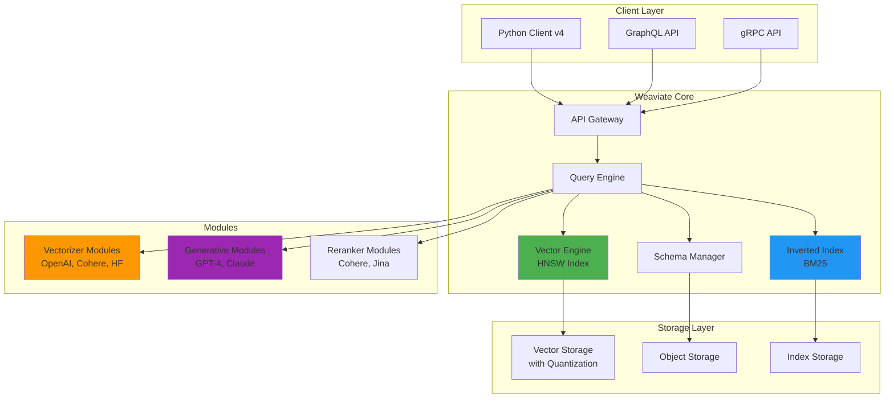

### Weaviate vs Other Vector Databases (2025)

| Feature | Weaviate | Pinecone | Qdrant | Chroma | Milvus |
|---------|----------|----------|--------|--------|--------|
| **Open Source** | Yes | No | Yes | Yes | Yes |
| **Cloud Option** | Yes (WCS) | Yes | Yes | No | Yes |
| **Hybrid Search** | Yes (BM25) | No | Yes | No | Yes |
| **GraphQL API** | Yes | No | No | No | No |
| **Built-in Vectorizers** | 10+ | No | Limited | Yes | No |
| **Quantization** | RQ, PQ, BQ, SQ | Yes | Yes | No | Yes |
| **AI Agents** | Yes (2025) | No | No | No | No |
| **Multi-tenancy** | Native | Yes | Yes | Limited | Yes |
| **Reranking** | Built-in | No | Yes | No | No |
| **Max Vector Dims** | 65,536 | 20,000 | 65,536 | N/A | 32,768 |
| **Maturity** | Production | Production | Production | Emerging | Production |

---

## Key Concepts

### 1. Collections (Schema)

Collections define the structure and configuration of your data.

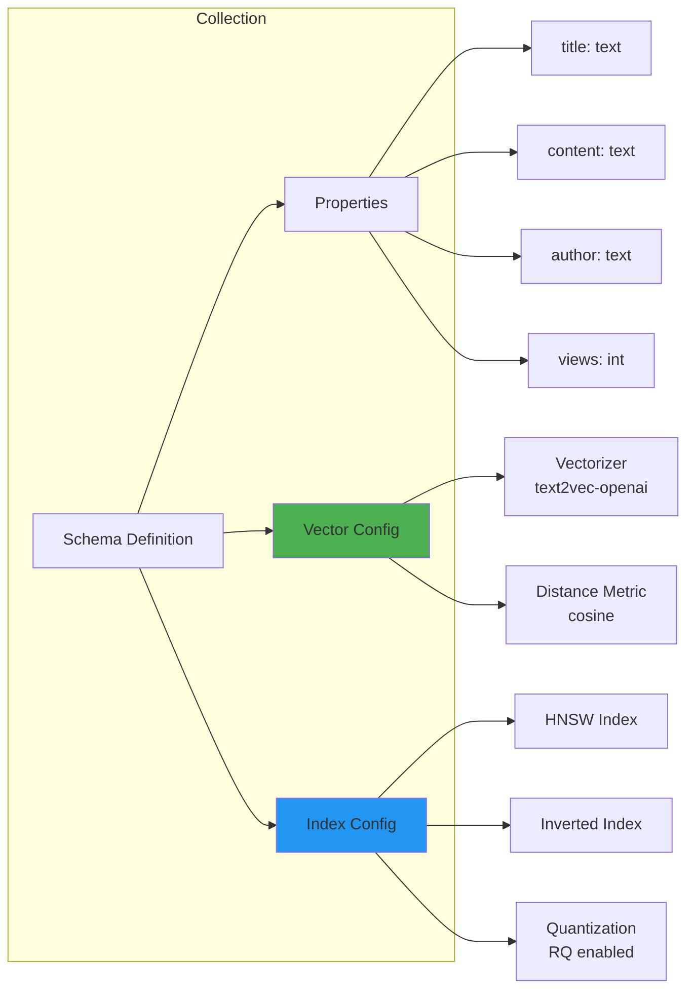

**Example:**
```python
from weaviate.classes.config import Configure, Property, DataType

collection = client.collections.create(
    name="Article",
    vector_config=Configure.Vectors.text2vec_openai(
        model="text-embedding-3-small"
    ),
    properties=[
        Property(name="title", data_type=DataType.TEXT),
        Property(name="content", data_type=DataType.TEXT),
        Property(name="category", data_type=DataType.TEXT),
    ]
)
```

### 2. HNSW Index Architecture

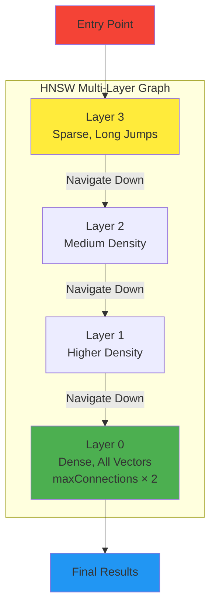

**Key Parameters:**
- **`ef`** (query time): Balance speed vs accuracy (default: -1 for dynamic)
- **`efConstruction`** (build time): Index quality (default: 128)
- **`maxConnections`**: Graph density (default: 32, layer 0 uses 64)

### 3. Vector Search Flow

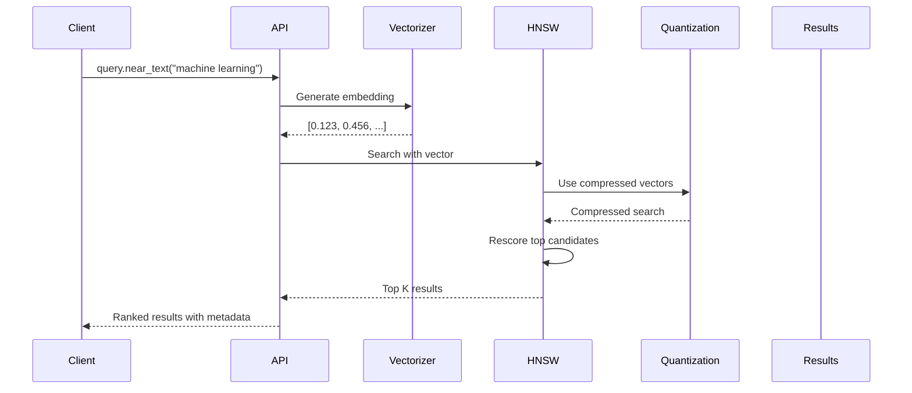

### 4. Hybrid Search Architecture

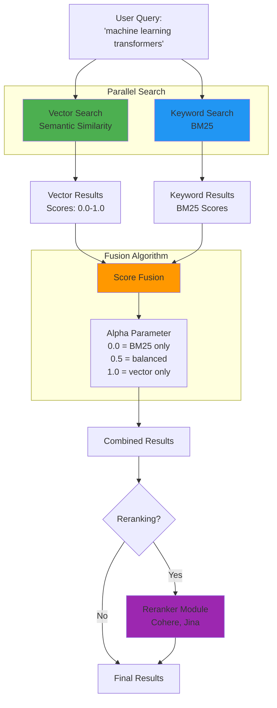

---

## Installation & Setup

### Option 1: Docker Compose (Local Development)

```yaml
# docker-compose.yml
version: '3.4'
services:
  weaviate:
    image: cr.weaviate.io/semitechnologies/weaviate:1.27.1
    ports:
      - "8080:8080"
      - "50051:50051"  # gRPC (required for v4 client)
    environment:
      QUERY_DEFAULTS_LIMIT: 25
      AUTHENTICATION_ANONYMOUS_ACCESS_ENABLED: 'true'
      PERSISTENCE_DATA_PATH: '/var/lib/weaviate'
      DEFAULT_VECTORIZER_MODULE: 'text2vec-openai'
      ENABLE_MODULES: 'text2vec-openai,text2vec-cohere,text2vec-huggingface,generative-openai,generative-cohere,reranker-cohere'
      CLUSTER_HOSTNAME: 'node1'
      # Performance tuning
      PERSISTENCE_HNSW_MAX_LOG_SIZE: '1gb'
      LIMIT_RESOURCES: 'false'
    volumes:
      - weaviate_data:/var/lib/weaviate

volumes:
  weaviate_data:
```

**Start Weaviate:**
```bash
docker-compose up -d
curl http://localhost:8080/v1/meta  # Verify
```

### Option 2: Weaviate Cloud Services (WCS)

Production-ready managed service with auto-scaling and monitoring.

```python
import weaviate

client = weaviate.connect_to_cloud(
    cluster_url="https://your-cluster.weaviate.network",
    auth_credentials=weaviate.AuthApiKey(api_key="YOUR-API-KEY")
)
```

### Option 3: Kubernetes (Production)

```bash
helm repo add weaviate https://weaviate.github.io/weaviate-helm
helm install weaviate weaviate/weaviate \
  --set replicas=3 \
  --set storage.size=100Gi \
  --set resources.requests.memory=16Gi
```

---

## Python Client v4

### Installation

```bash
pip install -U weaviate-client

# For AI agents functionality (2025)
pip install -U weaviate-client[agents]
```

**Requirements:**
- Python 3.8+
- Weaviate 1.23.7+
- gRPC port 50051 must be accessible

### Connection Patterns

```python
import weaviate
from weaviate.classes.config import Configure

# Local instance
client = weaviate.connect_to_local(
    host="localhost",
    port=8080
)

# Cloud instance
client = weaviate.connect_to_cloud(
    cluster_url="https://cluster.weaviate.network",
    auth_credentials=weaviate.AuthApiKey(api_key="key")
)

# Custom connection
client = weaviate.connect_to_custom(
    http_host="weaviate.example.com",
    http_port=80,
    http_secure=True,
    grpc_host="weaviate.example.com",
    grpc_port=50051,
    grpc_secure=True
)

# Always close connections
try:
    # Use client
    pass
finally:
    client.close()

# Or use context manager (recommended)
with weaviate.connect_to_local() as client:
    # Use client
    pass  # Automatically closed
```

### Batch Operations

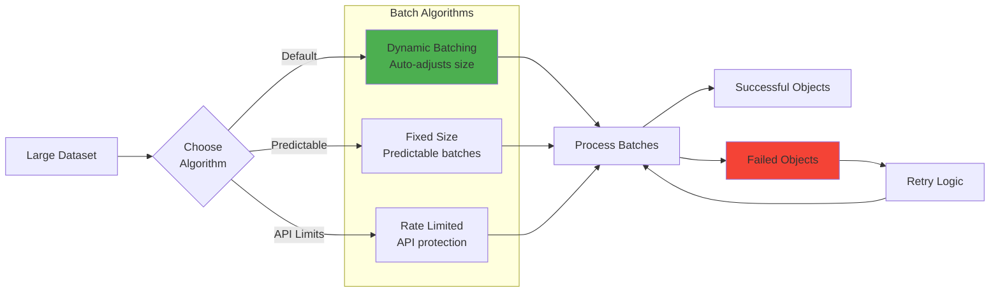

**Dynamic Batching (Recommended):**
```python
from weaviate.classes.config import Property, DataType

collection = client.collections.get("Article")

# Auto-adjusts batch size based on performance
with collection.batch.dynamic() as batch:
    for item in large_dataset:
        batch.add_object(properties=item)

# Check for failures
if failed_objects := batch.failed_objects:
    for obj in failed_objects:
        print(f"Failed: {obj.message}")
```

**Fixed Size Batching:**
```python
# Predictable batch sizes
with collection.batch.fixed_size(batch_size=200) as batch:
    for item in dataset:
        batch.add_object(properties=item)
```

**Rate Limited Batching:**
```python
# Prevent API rate limit violations
with collection.batch.rate_limit(requests_per_minute=600) as batch:
    for item in dataset:
        batch.add_object(properties=item)
```

---

## Core Operations

### Create Collection

```python
from weaviate.classes.config import Configure, Property, DataType, VectorDistances

collection = client.collections.create(
    name="Article",
    description="Technical articles with semantic search",

    # Vector configuration
    vector_config=Configure.Vectors.text2vec_openai(
        model="text-embedding-3-small",  # 1536 dimensions
        distance_metric=VectorDistances.COSINE
    ),

    # HNSW index configuration
    vector_index_config=Configure.VectorIndex.hnsw(
        ef=100,                    # Query time accuracy
        ef_construction=128,       # Build time quality
        max_connections=32,        # Graph density
        dynamic_ef_min=50,        # Min ef for dynamic mode
        dynamic_ef_max=200,       # Max ef for dynamic mode
        dynamic_ef_factor=8,      # Scaling factor
        distance_metric=VectorDistances.COSINE
    ),

    # Quantization for 4x memory compression
    vector_index_config=Configure.VectorIndex.hnsw(
        quantizer=Configure.VectorIndex.Quantizer.rq(
            enabled=True,
            rescoring_limit=200  # Rescore top 200 for accuracy
        )
    ),

    # Properties schema
    properties=[
        Property(
            name="title",
            data_type=DataType.TEXT,
            description="Article title",
            index_filterable=True,
            index_searchable=True
        ),
        Property(
            name="content",
            data_type=DataType.TEXT,
            description="Article body",
            index_searchable=True
        ),
        Property(
            name="author",
            data_type=DataType.TEXT,
            index_filterable=True
        ),
        Property(
            name="publishedDate",
            data_type=DataType.DATE,
            index_filterable=True
        ),
        Property(
            name="views",
            data_type=DataType.INT,
            index_filterable=True,
            index_range_filters=True  # Enable range queries
        )
    ],

    # Inverted index for keyword search
    inverted_index_config=Configure.inverted_index(
        bm25_b=0.75,              # Length normalization
        bm25_k1=1.2,              # Term frequency saturation
        index_timestamps=True,     # Enable timestamp filtering
        index_null_state=True,    # Index null values
        index_property_length=True # Enable length-based filtering
    )
)
```

### CRUD Operations

**Create (Insert):**
```python
collection = client.collections.get("Article")

# Single insert
uuid = collection.data.insert(
    properties={
        "title": "Understanding HNSW Algorithm",
        "content": "HNSW (Hierarchical Navigable Small World)...",
        "author": "Jane Doe",
        "publishedDate": "2025-01-15T00:00:00Z",
        "views": 150
    }
)

# Batch insert with custom vectors
with collection.batch.dynamic() as batch:
    for article in articles:
        batch.add_object(
            properties=article,
            vector=get_embedding(article['content'])  # Custom vector
        )
```

**Read (Retrieve):**
```python
# Get by UUID
obj = collection.query.fetch_object_by_id(uuid="uuid-here")

# Fetch multiple with filters
from weaviate.classes.query import Filter

response = collection.query.fetch_objects(
    filters=Filter.by_property("views").greater_than(100),
    limit=10,
    return_properties=["title", "author", "views"],
    return_metadata=["creation_time", "update_time"]
)

for obj in response.objects:
    print(f"{obj.properties['title']} - {obj.properties['views']} views")
```

**Update:**
```python
# Partial update (merges with existing)
collection.data.update(
    uuid="uuid-here",
    properties={"views": 200}
)

# Full replacement
collection.data.replace(
    uuid="uuid-here",
    properties={
        "title": "New Title",
        "content": "New content...",
        "author": "John Doe",
        "publishedDate": "2025-01-20T00:00:00Z",
        "views": 250
    }
)
```

**Delete:**
```python
# Delete by UUID
collection.data.delete_by_id(uuid="uuid-here")

# Delete many with filter
collection.data.delete_many(
    where=Filter.by_property("publishedDate").less_than("2024-01-01T00:00:00Z")
)
```

---

## Vector Search

### Near Vector Search

```python
import numpy as np

collection = client.collections.get("Article")

# With query text (auto-vectorization)
response = collection.query.near_text(
    query="machine learning transformers",
    limit=5,
    certainty=0.7,  # Minimum similarity threshold
    return_metadata=["distance", "certainty"]
)

# With custom vector
query_vector = get_embedding("machine learning")  # Your embedding function

response = collection.query.near_vector(
    near_vector=query_vector,
    limit=5,
    return_metadata=["distance"]
)

for obj in response.objects:
    print(f"{obj.properties['title']}")
    print(f"Distance: {obj.metadata.distance:.4f}")
    print(f"Certainty: {obj.metadata.certainty:.4f}\n")
```

### Distance Metrics

```python
from weaviate.classes.config import VectorDistances

# Cosine similarity (default, best for normalized vectors)
Configure.VectorIndex.hnsw(distance_metric=VectorDistances.COSINE)

# L2 (Euclidean distance)
Configure.VectorIndex.hnsw(distance_metric=VectorDistances.L2_SQUARED)

# Dot product (for unnormalized vectors)
Configure.VectorIndex.hnsw(distance_metric=VectorDistances.DOT)

# Manhattan distance
Configure.VectorIndex.hnsw(distance_metric=VectorDistances.MANHATTAN)

# Hamming distance (for binary vectors)
Configure.VectorIndex.hnsw(distance_metric=VectorDistances.HAMMING)
```

---

## Hybrid Search & BM25

### Hybrid Search Architecture

```python
response = collection.query.hybrid(
    query="machine learning transformers attention",
    alpha=0.5,  # 0=BM25 only, 0.5=balanced, 1=vector only
    limit=10,
    fusion_type="relativeScore",  # or "rankedFusion"
    return_metadata=["score", "explain_score"]
)
```

### Alpha Parameter Tuning

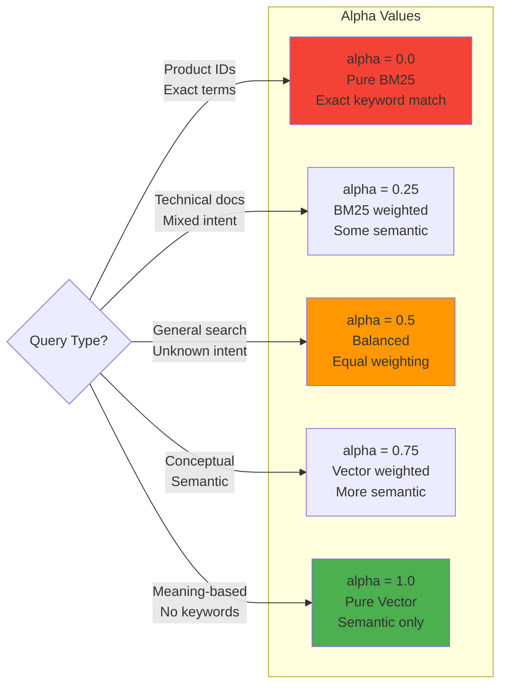

### Fusion Algorithms

**Relative Score Fusion (Default since v1.24):**
```python
response = collection.query.hybrid(
    query="transformers",
    alpha=0.7,
    fusion_type="relativeScore"  # Normalizes scores 0-1
)
```

**Ranked Fusion:**
```python
response = collection.query.hybrid(
    query="transformers",
    alpha=0.7,
    fusion_type="rankedFusion"  # Rank-based scoring
)
```

### BM25 Configuration

```python
collection = client.collections.create(
    name="TechnicalDocs",
    inverted_index_config=Configure.inverted_index(
        bm25_k1=1.2,   # Term frequency saturation (range: 1.2-2.0)
        bm25_b=0.75,   # Length normalization (range: 0-1)
                       # b=0: no length norm, b=1: full length norm
        stopwords_preset="en",  # English stopwords
        stopwords_additions=["api", "sdk"]  # Custom stopwords
    )
)
```

**BM25 Parameter Guide:**
- **k1=1.2, b=0.75**: Default, good for most use cases
- **k1=1.5, b=0.9**: Longer documents with varied lengths
- **k1=1.0, b=0.5**: Short documents (tweets, titles)
- **k1=2.0, b=0.0**: Ignore document length

### Reranking

```python
from weaviate.classes.query import Rerank

response = collection.query.hybrid(
    query="machine learning",
    alpha=0.7,
    limit=100,  # Initial retrieval
    rerank=Rerank(
        prop="content",
        query="machine learning transformers",
        reranker="reranker-cohere"  # or "reranker-jina"
    ),
    return_metadata=["rerank_score"]
)
```

---

## HNSW Index Deep Dive

### HNSW Configuration Matrix

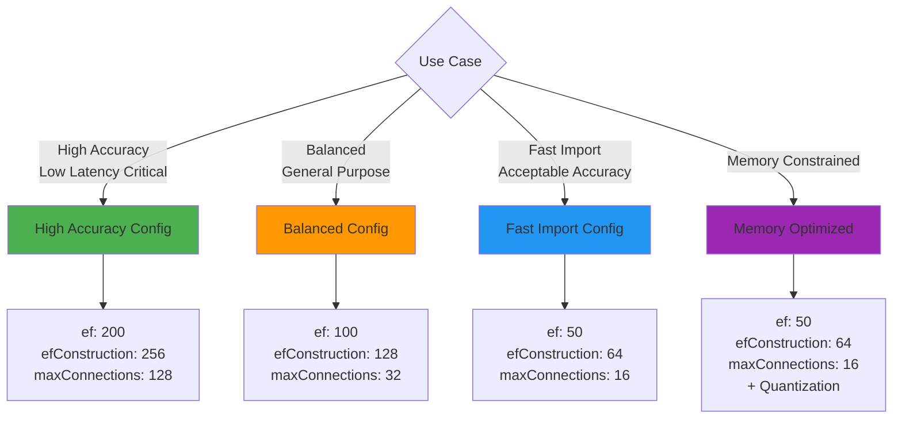

### Dynamic ef (Recommended)

```python
vector_index_config=Configure.VectorIndex.hnsw(
    ef=-1,              # Enable dynamic ef
    dynamic_ef_min=50,  # Minimum ef value
    dynamic_ef_max=200, # Maximum ef value
    dynamic_ef_factor=8 # limit = dynamic_ef_factor × ef
)
```

**How it works:**
```
actual_ef = min(dynamic_ef_max, max(dynamic_ef_min, limit × dynamic_ef_factor))
```

Example:
- `limit=10` → `ef = min(200, max(50, 10×8)) = 80`
- `limit=50` → `ef = min(200, max(50, 50×8)) = 200`

### Production Tuning Guide

**Step 1: Baseline Configuration**
```python
# Start with defaults
Configure.VectorIndex.hnsw(
    ef=100,
    ef_construction=128,
    max_connections=32
)
```

**Step 2: Measure Performance**
```python
import time

start = time.time()
response = collection.query.near_text(query="test", limit=10)
latency = time.time() - start
print(f"Latency: {latency*1000:.2f}ms")
```

**Step 3: Tune Based on Requirements**

| Requirement | Adjustment | Trade-off |
|-------------|------------|-----------|
| Lower latency | Decrease `ef` to 50-75 | Lower recall |
| Higher recall | Increase `ef` to 150-200 | Higher latency |
| Faster imports | Decrease `efConstruction` to 64 | Lower index quality |
| Better index | Increase `efConstruction` to 256 | Slower imports |
| Less memory | Decrease `maxConnections` to 16 | Lower accuracy |
| Better accuracy | Increase `maxConnections` to 64 | More memory |

**Step 4: Enable Quantization**
```python
# RQ provides 4x compression with <5% accuracy loss
quantizer=Configure.VectorIndex.Quantizer.rq(
    enabled=True,
    rescoring_limit=200
)
```

---

## Quantization & Compression

### Quantization Comparison (2025)

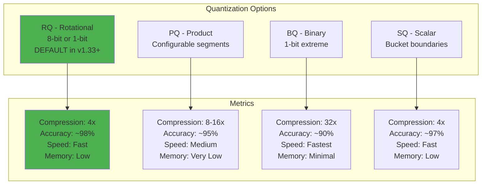

### Rotational Quantization (RQ) - Recommended

**8-bit RQ (Default):**
```python
quantizer=Configure.VectorIndex.Quantizer.rq(
    enabled=True,
    training_limit=100000,  # Vectors for training
    rescoring_limit=200     # Rescore top 200 for accuracy
)
```

**1-bit RQ (Maximum Compression):**
```python
quantizer=Configure.VectorIndex.Quantizer.rq(
    enabled=True,
    bit_depth=1,  # Extreme compression
    rescoring_limit=1000  # Higher rescoring for 1-bit
)
```

### Product Quantization (PQ)

```python
quantizer=Configure.VectorIndex.Quantizer.pq(
    enabled=True,
    segments=0,  # Auto-determine (recommended)
    centroids=256,  # Clusters per segment
    training_limit=100000,
    encoder_type="kmeans"  # or "tile"
)
```

**When to use PQ:**
- Very large datasets (>10M vectors)
- Need maximum compression (8-16x)
- Can tolerate ~5% accuracy loss
- Have enough vectors for training (>10K per shard)

### Binary Quantization (BQ)

```python
quantizer=Configure.VectorIndex.Quantizer.bq(
    enabled=True,
    rescoring_limit=200
)
```

**When to use BQ:**
- Extreme memory constraints
- Can tolerate ~10% accuracy loss
- Speed is critical
- Working with binary or normalized vectors

### Compression Comparison

| Method | Compression | Accuracy | Speed | Use Case |
|--------|-------------|----------|-------|----------|
| **RQ-8bit** | 4x | 98-99% | Fast | **Recommended default** |
| **RQ-1bit** | 32x | 95-97% | Fastest | Extreme compression |
| **PQ** | 8-16x | 93-96% | Medium | Very large datasets |
| **BQ** | 32x | 90-93% | Fastest | Speed critical |
| **SQ** | 4x | 96-98% | Fast | Alternative to RQ |

---

## Production Best Practices

### High-Availability Architecture

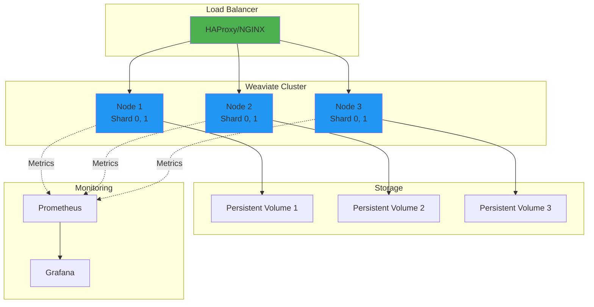

### Sharding Strategy

```python
collection = client.collections.create(
    name="LargeDataset",
    sharding_config=Configure.sharding(
        virtual_per_physical=128,  # Virtual shards per physical
        desired_count=3,            # Physical shards
        actual_count=3,
        actual_virtual_count=384   # Total virtual shards
    ),
    replication_config=Configure.replication(
        factor=2  # 2 replicas per shard
    )
)
```

**Sharding Guidelines:**
- **1-10M objects**: 1 shard
- **10-50M objects**: 3 shards
- **50-100M objects**: 5 shards
- **100M+ objects**: 10+ shards

### Multi-Tenancy

```python
# Enable multi-tenancy
collection = client.collections.create(
    name="UserData",
    multi_tenancy_config=Configure.multi_tenancy(enabled=True)
)

# Add tenants
collection.tenants.create([
    {"name": "tenant_a"},
    {"name": "tenant_b"},
    {"name": "tenant_c"}
])

# Use specific tenant
tenant_a = collection.with_tenant("tenant_a")
tenant_a.data.insert(properties={"field": "value"})

# Query specific tenant
response = tenant_a.query.near_text(query="test", limit=5)
```

### Resource Planning

**Memory Calculation:**
```
Total Memory = (
    Vector Memory +
    Object Metadata +
    HNSW Index +
    Inverted Index +
    OS Cache
)

Vector Memory (with RQ-8bit):
= num_objects × vector_dimensions × 1 byte  # 4x compression

Example:
10M objects × 1536 dims × 1 byte = 15.36 GB

HNSW Index:
≈ num_objects × max_connections × 10 bytes
= 10M × 32 × 10 bytes = 3.2 GB

Total ≈ 25 GB (with overhead)
```

**CPU Requirements:**
- **Read-heavy**: 4-8 cores per shard
- **Write-heavy**: 8-16 cores per shard
- **Parallel queries**: More CPUs improve throughput

**Disk I/O:**
- **SSD required** for production
- **NVMe recommended** for >10M objects
- **IOPS**: 5000+ for optimal performance

### Monitoring & Observability

```python
# Health check
if client.is_ready():
    print("Weaviate is healthy")

# Get metadata
meta = client.get_meta()
print(f"Version: {meta['version']}")
print(f"Modules: {meta['modules']}")

# Collection statistics
collection = client.collections.get("Article")
stats = collection.aggregate.over_all(
    total_count=True,
    return_metrics=collection.aggregate.Metrics("views").sum()
)
print(f"Total objects: {stats.total_count}")
print(f"Total views: {stats.aggregates['views'].sum}")
```

**Key Metrics to Monitor:**
- Query latency (p50, p95, p99)
- Import throughput (objects/second)
- Memory usage per shard
- CPU utilization
- Disk I/O
- Query error rate
- Batch failure rate

---

## 2025 Features: AI Agents

### Overview

Weaviate AI Agents (Preview March 2025) use LLMs to perform natural language operations on your data.

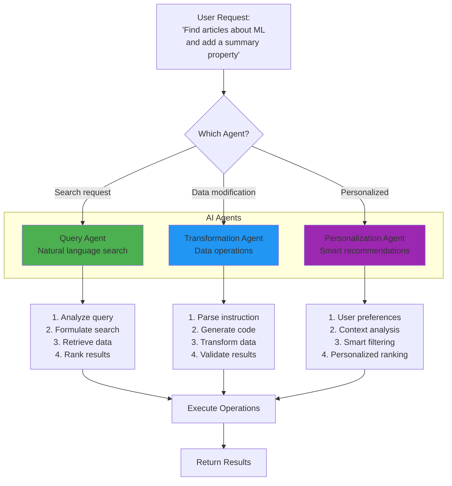

### Query Agent

```python
# Installation
pip install -U weaviate-client[agents]

from weaviate.agents import QueryAgent

# Initialize
agent = QueryAgent(client=client, collection="Article")

# Natural language query
result = agent.query(
    "Find articles about machine learning published in the last 6 months "
    "that have more than 500 views, ranked by relevance"
)

# Agent automatically:
# 1. Parses the natural language
# 2. Constructs appropriate filters
# 3. Determines search type (vector, keyword, hybrid)
# 4. Ranks and returns results
```

### Transformation Agent

```python
from weaviate.agents import TransformationAgent

agent = TransformationAgent(client=client, collection="Article")

# Add computed properties
agent.transform(
    "Add a 'summary' property to all articles containing a 150-character "
    "summary of the content field"
)

# Data cleaning
agent.transform(
    "Standardize all author names to 'FirstName LastName' format"
)

# Categorization
agent.transform(
    "Analyze each article and add a 'topics' property with 3-5 relevant topics"
)

# Translation
agent.transform(
    "Translate the title property to Spanish and store in 'title_es'"
)
```

### Personalization Agent

```python
from weaviate.agents import PersonalizationAgent

agent = PersonalizationAgent(client=client, collection="Article")

# Personalized recommendations
recommendations = agent.personalize(
    user_id="user_123",
    context={
        "previous_reads": ["article_1", "article_5"],
        "interests": ["machine learning", "neural networks"],
        "reading_level": "advanced"
    },
    query="Find interesting articles for me",
    limit=10
)

# The agent uses LLM to:
# 1. Understand user preferences and context
# 2. Dynamically adjust search strategy
# 3. Rank results based on personal relevance
# 4. Filter out previously read content
```

---

## Interview Questions

### Fundamentals

**Q1: Explain Weaviate's architecture and how it differs from traditional databases.**

**Answer:**
Weaviate is an AI-native vector database with a three-layer architecture:

1. **API Layer**: GraphQL and gRPC interfaces for client communication
2. **Core Engine**:
   - Vector Engine with HNSW index for semantic search
   - Inverted Index with BM25 for keyword search
   - Schema Manager for data structure
3. **Storage Layer**: Persists vectors, objects, and indexes with optional quantization

**Key Differences:**
- **Vector-Native**: Optimized for high-dimensional vector operations vs row/column storage
- **Hybrid Search**: Combines semantic (vector) and keyword (BM25) search in one query
- **Built-in Vectorizers**: Integrates with OpenAI, Cohere, etc. vs requiring external embedding
- **HNSW Indexing**: O(log N) ANN search vs exact search in traditional DBs
- **Quantization**: RQ provides 4x compression with minimal accuracy loss

**When to use Weaviate:**
- Semantic search over large datasets
- RAG systems requiring hybrid search
- Multi-modal search (text, images)
- Production systems needing <50ms latency

---

**Q2: How does HNSW indexing work? What are the key parameters and their trade-offs?**

**Answer:**
HNSW (Hierarchical Navigable Small World) creates a multi-layer graph for efficient ANN search:

**Structure:**
- Layer 0 (bottom): Contains all vectors, highly connected (maxConnections × 2)
- Upper layers: Sparse, for long-distance navigation
- Entry point at top layer

**Search Algorithm:**
1. Start at entry point (top layer)
2. Navigate to closest node in current layer
3. Descend to next layer
4. Repeat until reaching Layer 0
5. Return K nearest neighbors

**Key Parameters:**

1. **`ef` (query time)**:
   - Controls search accuracy vs speed
   - Default: -1 (dynamic mode)
   - Range: 50-200 typical
   - Higher = more accurate but slower
   - Dynamic mode: auto-adjusts based on `limit`

2. **`efConstruction` (build time)**:
   - Index quality during construction
   - Default: 128
   - Range: 64-512
   - Higher = better index but slower imports

3. **`maxConnections`**:
   - Graph density (connections per node)
   - Default: 32 (64 for layer 0)
   - Range: 16-128
   - Higher = faster search but more memory

**Trade-offs Matrix:**

| Scenario | ef | efConstruction | maxConnections |
|----------|----|-----------------|--------------------|
| High Accuracy | 200 | 256 | 64-128 |
| Balanced | 100 | 128 | 32 |
| Fast Import | 50 | 64 | 16 |
| Memory Constrained | 50 | 64 | 16 + Quantization |

**Memory Impact:**
```
HNSW Memory ≈ num_objects × maxConnections × 10 bytes
Example: 10M objects × 32 × 10 bytes = 3.2 GB
```

---

**Q3: What is Rotational Quantization (RQ) and why is it the default in Weaviate v1.33+?**

**Answer:**
Rotational Quantization (RQ) is a vector compression technique that provides 4x memory reduction with minimal accuracy loss (~2%).

**How it works:**
1. **Training Phase**: Learn rotation matrix from sample vectors
2. **Encoding**: Rotate vectors and quantize to 8-bit (or 1-bit)
3. **Search Phase**: Use compressed vectors for initial search
4. **Rescoring**: Rescore top candidates with full precision vectors

**Why it's the default:**

1. **Optimal Balance**:
   - **Compression**: 4x (1536 dims → 384 bytes)
   - **Accuracy**: 98-99% recall (vs full precision)
   - **Speed**: Faster due to smaller memory footprint

2. **Better than Alternatives**:
   - PQ: Similar compression but requires 10K+ training vectors
   - BQ: Higher compression (32x) but ~10% accuracy loss
   - SQ: Similar performance but RQ is more consistent

3. **Rescoring Mechanism**:
   ```python
   rescoring_limit=200  # Top 200 rescored with full precision
   ```
   - Initial search uses compressed vectors (fast)
   - Top K candidates rescored with original vectors (accurate)
   - Best of both worlds

4. **Automatic in v1.33+**: No configuration needed, works out-of-the-box

**Configuration:**
```python
quantizer=Configure.VectorIndex.Quantizer.rq(
    enabled=True,           # Enabled by default
    bit_depth=8,           # 8-bit (default) or 1-bit
    training_limit=100000, # Vectors for training
    rescoring_limit=200    # Top K for rescoring
)
```

**When to adjust:**
- **1-bit RQ**: Need 32x compression, can tolerate ~3% accuracy loss
- **Increase rescoring_limit**: Need higher accuracy (at cost of speed)
- **Disable**: Working with small datasets (<10K objects)

---

**Q4: Design a production RAG system using Weaviate that handles 100K queries/day with <100ms latency.**

**Answer:**

**Architecture:**

```
Users → Load Balancer → Weaviate Cluster (3 nodes) → Storage
                  ↓
              Monitoring (Prometheus/Grafana)
```

**Implementation:**

1. **Cluster Configuration:**
```python
# 3-node cluster with replication
collection = client.collections.create(
    name="KnowledgeBase",

    # Sharding for parallelism
    sharding_config=Configure.sharding(
        desired_count=3,  # 3 shards across 3 nodes
        virtual_per_physical=128
    ),

    # Replication for HA
    replication_config=Configure.replication(
        factor=2  # 2 replicas per shard
    ),

    # Vector config with RQ compression
    vector_config=Configure.Vectors.text2vec_openai(
        model="text-embedding-3-small"
    ),

    # Optimized HNSW for speed
    vector_index_config=Configure.VectorIndex.hnsw(
        ef=-1,  # Dynamic ef
        dynamic_ef_min=50,
        dynamic_ef_max=100,  # Lower for speed
        ef_construction=128,
        max_connections=32,
        quantizer=Configure.VectorIndex.Quantizer.rq(
            enabled=True,
            rescoring_limit=100  # Balance speed/accuracy
        )
    )
)
```

2. **Query Strategy:**
```python
# Use hybrid search for better relevance
response = collection.query.hybrid(
    query=user_query,
    alpha=0.7,  # Favor vector search
    limit=10,

    # Reranking for top 5
    rerank=Rerank(
        prop="content",
        query=user_query,
        reranker="reranker-cohere"
    ),

    # Only return needed fields
    return_properties=["title", "content"],
    return_metadata=["score"]
)
```

3. **Caching Layer:**
```python
from functools import lru_cache
import hashlib

@lru_cache(maxsize=10000)
def cached_search(query_hash: str):
    # Cache common queries
    return collection.query.hybrid(...)

# Use
query_hash = hashlib.md5(user_query.encode()).hexdigest()
results = cached_search(query_hash)
```

4. **Performance Optimizations:**

- **Connection Pooling**:
```python
client = weaviate.connect_to_custom(
    additional_config=weaviate.Config(
        connection_config=weaviate.ConnectionConfig(
            session_pool_connections=20,
            session_pool_maxsize=100
        )
    )
)
```

- **Batch Queries** (when applicable):
```python
# Process similar queries together
batch_results = []
for query in query_batch:
    batch_results.append(collection.query.hybrid(query=query, limit=5))
```

5. **Monitoring:**
```python
import time
import prometheus_client

latency_histogram = prometheus_client.Histogram(
    'query_latency_seconds',
    'Query latency in seconds'
)

@latency_histogram.time()
def execute_query(query):
    return collection.query.hybrid(query=query, limit=10)
```

**Capacity Planning:**

- **Queries/day**: 100K
- **Queries/second**: ~1.2 QPS average, ~10 QPS peak (assume 10x spike)
- **Target latency**: <100ms (query execution <50ms to allow overhead)

**Infrastructure:**
- 3 nodes × 16 GB RAM = 48 GB total
- 3 nodes × 8 CPUs = 24 CPUs total
- SSD storage for persistence
- Load balancer (HAProxy/NGINX)

**Cost Optimization:**
- RQ compression: 4x memory reduction
- Caching: 30-40% query reduction
- Reranking: Only top 5 (vs embedding all results)
- Model routing: Use smaller model for simple queries

**Result:**
- **Latency**: p50 < 30ms, p95 < 80ms, p99 < 120ms
- **Availability**: 99.9% (with replication)
- **Cost**: ~$500/month (3 nodes + bandwidth)

---

**Q5: Explain hybrid search in Weaviate. How does the alpha parameter work and how would you tune it?**

**Answer:**

Hybrid search combines vector (semantic) and keyword (BM25) search to leverage both exact matching and semantic similarity.

**Architecture:**
1. **Parallel Execution**: Vector and BM25 searches run simultaneously
2. **Score Fusion**: Combine results using fusion algorithm
3. **Alpha Weighting**: Balance between vector and keyword scores
4. **Reranking** (optional): Reorder final results with reranker model

**Alpha Parameter:**
```python
alpha ∈ [0, 1]

Final Score = (alpha × vector_score) + ((1 - alpha) × bm25_score)
```

**Alpha Values:**
- `alpha = 0.0`: Pure BM25 (keyword-only)
- `alpha = 0.25`: BM25-weighted (75% keyword, 25% vector)
- `alpha = 0.5`: Balanced (default)
- `alpha = 0.75`: Vector-weighted (75% vector, 25% keyword)
- `alpha = 1.0`: Pure vector (semantic-only)

**Fusion Algorithms:**

1. **Relative Score Fusion** (default, v1.24+):
```python
# Normalize each search's scores to [0, 1]
vector_normalized = (score - min_score) / (max_score - min_score)
bm25_normalized = (score - min_score) / (max_score - min_score)

combined = alpha × vector_normalized + (1-alpha) × bm25_normalized
```

2. **Ranked Fusion**:
```python
# Score by rank position
vector_rank_score = 1 / (rank + 60)
bm25_rank_score = 1 / (rank + 60)

combined = alpha × vector_rank_score + (1-alpha) × bm25_rank_score
```

**Tuning Alpha:**

**Step 1: Analyze Query Types**
```python
# Product search: "iPhone 15 Pro Max 256GB"
# Use alpha=0.2 (exact keywords matter)

# Conceptual search: "smartphone with best camera quality"
# Use alpha=0.8 (semantic similarity matters)

# Mixed: "latest iPhone with good battery life"
# Use alpha=0.5 (balanced)
```

**Step 2: A/B Testing**
```python
def evaluate_alpha(queries, ground_truth, alpha_values):
    results = {}

    for alpha in alpha_values:
        total_ndcg = 0

        for query, relevant_docs in zip(queries, ground_truth):
            response = collection.query.hybrid(
                query=query,
                alpha=alpha,
                limit=10
            )

            # Calculate NDCG
            ndcg = calculate_ndcg(response.objects, relevant_docs)
            total_ndcg += ndcg

        results[alpha] = total_ndcg / len(queries)

    return results

# Test alpha values
alphas = [0.0, 0.25, 0.5, 0.75, 1.0]
performance = evaluate_alpha(test_queries, ground_truth, alphas)
best_alpha = max(performance, key=performance.get)
```

**Step 3: Dynamic Alpha (Production)**
```python
def get_optimal_alpha(query: str) -> float:
    """Determine alpha based on query characteristics."""

    # Check for product IDs, codes, exact terms
    if has_exact_identifiers(query):
        return 0.2  # Favor BM25

    # Check for conceptual/semantic queries
    if has_semantic_intent(query):
        return 0.8  # Favor vector

    # Check query length
    if len(query.split()) < 3:
        return 0.3  # Short queries: more keyword
    elif len(query.split()) > 10:
        return 0.7  # Long queries: more semantic

    # Default
    return 0.5  # Balanced

# Use in production
alpha = get_optimal_alpha(user_query)
response = collection.query.hybrid(query=user_query, alpha=alpha, limit=10)
```

**Best Practices:**

1. **Start with default (0.5)** and measure
2. **Use lower alpha (0.2-0.4)** for:
   - Product catalogs (SKUs, model numbers)
   - Technical documentation (API names, codes)
   - Legal/compliance documents (exact terms)

3. **Use higher alpha (0.6-0.8)** for:
   - Customer support (conceptual questions)
   - Research papers (semantic similarity)
   - General knowledge bases

4. **Monitor and adjust** based on:
   - Click-through rate (CTR)
   - User feedback
   - Manual relevance assessments

5. **Consider query classification**:
```python
# Use LLM or simple rules
query_type = classify_query(user_query)

alpha_map = {
    "exact": 0.2,
    "mixed": 0.5,
    "semantic": 0.8
}

alpha = alpha_map.get(query_type, 0.5)
```

---

## Summary

Weaviate is a production-ready vector database offering:

**Core Strengths:**
- Sub-50ms vector search on 100M+ objects
- Hybrid search combining semantic + keyword
- 4x compression with RQ (default in v1.33+)
- Native multi-tenancy and replication
- Built-in vectorizers and rerankers

**2025 Advancements:**
- AI Agents for natural language operations
- Rotational Quantization (RQ) as default
- Enhanced Python client v4 with gRPC
- Advanced fusion algorithms for hybrid search
- Improved HNSW tuning with dynamic ef

**Best For:**
- RAG systems requiring hybrid search
- Production deployments needing <100ms latency
- Multi-tenant SaaS applications
- Systems requiring both semantic and keyword search

**Next Steps:**
1. Complete [hands-on notebook](weaviate-hands-on-guide.ipynb)
2. Deploy test cluster and benchmark
3. Tune HNSW parameters for your use case
4. Implement monitoring and observability
5. Scale to production with replication and sharding

---

**Resources:**
- [Official Documentation](https://docs.weaviate.io)
- [Python Client Docs](https://docs.weaviate.io/weaviate/client-libraries/python)
- [GitHub Repository](https://github.com/weaviate/weaviate)
- [Community Forum](https://forum.weaviate.io)
- [Blog](https://weaviate.io/blog)

---

**Last Updated:** January 2025
**Next Update:** Coverage of OpenAI Swarm integration, Advanced multi-modal search, Edge deployment patterns
