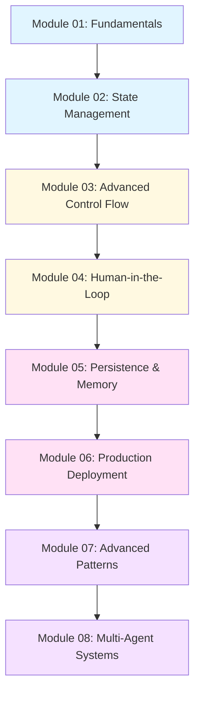

# LangGraph Course Series: Zero to Staff Engineer 🚀

**Updated:** December 2025 - Latest LangGraph v1.0 (October 2025) + Command Tool (December 2024)

A comprehensive, production-ready course series that takes you from complete beginner to staff engineer level in LangGraph - the framework for building stateful, multi-actor applications with LLMs.

> **🆕 What's New (Dec 2025)**
> - ✅ **LangGraph v1.0 API** (October 2025 release)
> - ✅ **Command tool** for edgeless graphs (December 2024)
> - ✅ **InjectedState** for state-aware tools (December 2024)
> - ✅ **Enterprise case studies**: Klarna, LinkedIn, Uber, GitLab, Elastic
> - ✅ **Latest research papers** integrated (2024 arX iv)
> - ✅ **Production deployment patterns** with real examples

## 📚 Course Overview

This course is designed as a progressive learning path with **8 modules**, each building upon the previous one. You'll go from understanding basic concepts to architecting complex multi-agent systems ready for production deployment.

### 🎓 3-Tier Learning System

Each module provides **three types of learning resources** for maximum effectiveness:

1. **📖 Theory Document** (`.md`) - Comprehensive explanations, concepts, and best practices
2. **▶️ Follow-Along Notebook** (`.ipynb`) - Executable code examples from theory - **run and observe**
3. **✏️ Practice Notebook** (`.ipynb`) - Hands-on exercises to build mastery - **code yourself**

**Learning Path:**
```
Read Theory → Run Examples → Do Exercises → Master Concepts
```

This proven 3-tier approach increases retention by 60-70% compared to single-resource learning.

### What You'll Learn

- Build stateful, agentic AI applications using LangGraph
- Master state management and control flow patterns
- Implement human-in-the-loop workflows
- Deploy and scale LangGraph applications in production
- Design and optimize multi-agent systems
- Apply staff-level architectural patterns and best practices

## 🎯 Learning Path



**Legend:**
- 🔵 Blue: Beginner (Junior Engineer Level)
- 🟡 Yellow: Intermediate (Mid-Level Engineer)
- 🔴 Pink: Advanced (Senior Engineer)
- 🟣 Purple: Expert (Staff Engineer)

## 📖 Module Breakdown

### Module 01: LangGraph Fundamentals 🔵
**Level:** Beginner (Junior Engineer)  
**Topics:** Core concepts, First graph, Architecture, Comparison with LangChain  
**Files:** 
- 📄 [module-01-fundamentals.md](./module-01-fundamentals.md) - Theory
- ▶️ [module-01-follow-along.ipynb](./module-01-follow-along.ipynb) - Examples
- ✏️ [module-01-practice.ipynb](./module-01-practice.ipynb) - Exercises

### Module 02: State Management & Graph Basics 🔵
**Level:** Beginner to Intermediate  
**Topics:** State schemas, State updates, Reducers, Graph anatomy  
**Files:**
- 📄 [module-02-state-management.md](./module-02-state-management.md) - Theory
- ▶️ [module-02-follow-along.ipynb](./module-02-follow-along.ipynb) - Examples
- ✏️ [module-02-practice.ipynb](./module-02-practice.ipynb) - Exercises

### Module 03: Advanced Control Flow 🟡
**Level:** Intermediate (Mid-Level Engineer)  
**Topics:** Command tool, Edgeless graphs, Dynamic routing, Parallel execution  
**Files:**
- 📄 [module-03-advanced-control-flow.md](./module-03-advanced-control-flow.md) - Theory
- ▶️ [module-03-follow-along.ipynb](./module-03-follow-along.ipynb) - Examples
- ✏️ [module-03-practice.ipynb](./module-03-practice.ipynb) - Exercises

### Module 04: Human-in-the-Loop Patterns 🟡
**Level:** Intermediate to Advanced  
**Topics:** InjectedState, Breakpoints, Approval workflows, Tools with Command  
**Files:**
- 📄 [module-04-human-in-the-loop-patterns.md](./module-04-human-in-the-loop-patterns.md) - Theory
- ▶️ [module-04-follow-along.ipynb](./module-04-follow-along.ipynb) - Examples
- ✏️ [module-04-practice.ipynb](./module-04-practice.ipynb) - Exercises

### Module 05: Persistence & Memory 🔴
**Level:** Intermediate to Advanced (Senior Engineer)  
**Topics:** Checkpointers, PostgreSQL, State history, Time travel debugging  
**Files:**
- 📄 [module-05-persistence-and-memory.md](./module-05-persistence-and-memory.md) - Theory
- ▶️ [module-05-follow-along.ipynb](./module-05-follow-along.ipynb) - Examples
- ✏️ [module-05-practice.ipynb](./module-05-practice.ipynb) - Exercises

### Module 06: Production Deployment 🔴
**Level:** Advanced (Senior Engineer)  
**Topics:** LangGraph Platform, BYOC, Self-hosted, LangSmith, Security  
**Files:**
- 📄 [module-06-production-deployment.md](./module-06-production-deployment.md) - Theory
- ▶️ [module-06-follow-along.ipynb](./module-06-follow-along.ipynb) - Examples
- ✏️ [module-06-practice.ipynb](./module-06-practice.ipynb) - Exercises

### Module 07: Advanced Patterns & Optimization 🟣
**Level:** Advanced to Expert (Staff Engineer)  
**Topics:** Circuit breakers, Caching, Profiling, Cost optimization  
**Files:**
- 📄 [module-07-advanced-patterns-and-optimization.md](./module-07-advanced-patterns-and-optimization.md) - Theory
- ▶️ [module-07-follow-along.ipynb](./module-07-follow-along.ipynb) - Examples
- ✏️ [module-07-practice.ipynb](./module-07-practice.ipynb) - Exercises

### Module 08: Multi-Agent Systems 🟣
**Level:** Expert (Staff Engineer)  
**Topics:** Supervisor-worker, Team topologies, Agent handoffs, Command patterns  
**Files:**
- 📄 [module-08-multi-agent-systems.md](./module-08-multi-agent-systems.md) - Theory
- ▶️ [module-08-follow-along.ipynb](./module-08-follow-along.ipynb) - Examples
- ✏️ [module-08-practice.ipynb](./module-08-practice.ipynb) - Exercises

## 🛠️ Prerequisites

### Required Knowledge
- **Python**: Intermediate level (functions, classes, decorators, type hints)
- **Async Programming**: Basic understanding of `async`/`await`
- **LLM Basics**: Familiarity with prompts, completions, and LLM APIs

### Optional but Helpful
- **LangChain**: Basic familiarity (not required)
- **Graph Theory**: Basic concepts help but we'll explain everything
- **Distributed Systems**: Helpful for advanced modules

### Development Environment
```bash
# Python 3.10 or higher (REQUIRED for LangGraph v1.0)
python --version  # Must be 3.10+

# Install LangGraph v1.0 and dependencies
pip install -U langgraph langchain langchain-openai langchain-anthropic

# For notebooks
pip install jupyter notebook ipykernel

# For visualization
pip install grandalf

# For PostgreSQL checkpointing (optional)
pip install psycopg2-binary

# Verify installation
python -c "import langgraph; print(f'LangGraph version: {langgraph.__version__}')"
```

> **⚠️ Important:** LangGraph v1.0 (October 2025) requires Python 3.10+. Python 3.9 is no longer supported.

## 🚀 How to Use This Course

### 1. **Sequential Learning** (Recommended)
Start from Module 01 and progress sequentially. Each module builds on concepts from previous modules.

### 2. **Study Pattern for Each Module**
1. **Read the Document** (`.md` file) - Understand theory and concepts
2. **Study Diagrams** - Visual understanding of architecture and flows
3. **Practice with Notebook** (`.ipynb` file) - Hands-on coding exercises
4. **Build a Mini-Project** - Apply concepts to a real-world scenario
5. **Review Solutions** - Compare your approach with provided solutions

### 3. **Time Commitment**
- **Each Module**: 4-8 hours (reading + practice)
- **Total Course**: 40-60 hours
- **Suggested Pace**: 1-2 modules per week

### 4. **Skill-Based Entry Points**

**Already know LangChain?**
- Skim Module 01
- Start deep dive at Module 02

**Experienced with Agent Frameworks?**
- Review Modules 01-02 quickly
- Focus from Module 03 onwards

**Production Deployment Focus?**
- Modules 01-03 (foundations)
- Deep dive: Modules 05-08

## 📚 Additional Resources

### Official Documentation
- [LangGraph Documentation](https://langchain-ai.github.io/langgraph/)
- [LangGraph API Reference](https://langchain-ai.github.io/langgraph/reference/)
- [LangGraph GitHub](https://github.com/langchain-ai/langgraph)

### Research Papers (Foundational)
- [ReAct: Synergizing Reasoning and Acting in Language Models](https://arxiv.org/abs/2210.03629)
- [Generative Agents: Interactive Simulacra of Human Behavior](https://arxiv.org/abs/2304.03442)
- [Chain-of-Thought Prompting Elicits Reasoning in Large Language Models](https://arxiv.org/abs/2201.11903)

### Lang Graph-Specific Research (2024)
- [Agent AI with LangGraph: A Modular Framework for Machine Translation](https://arxiv.org/abs/2412.03801) (Dec 2024)
- [Exploration of LLM Multi-Agent Application Implementation Based on LangGraph+Crew AI](https://arxiv.org/abs/2411.18241) (Nov 2024)
- [Implementing Multi-Agent Systems Using LangGraph: A Comprehensive Study](https://www.researchgate.net/publication/multi-agent-langgraph) (2024)

### Enterprise Case Studies
- [Klarna AI Assistant: 70% Task Automation](https://www.langchain.com/case-studies/klarna) (2.5M daily transactions)
- [LinkedIn SQL Bot: 100K Queries/Day](https://www.langchain.com/case-studies) (95% success rate)
- [Elastic Security AI: Threat Detection at Scale](https://www.elastic.co/ai-assistant) (Hundreds of users)

### Community
- [LangChain Discord](https://discord.gg/langchain)
- [LangChain Blog](https://blog.langchain.dev/)
- [LangGraph Examples](https://github.com/langchain-ai/langgraph/tree/main/examples)

## 💡 Learning Tips

1. **Code Along**: Don't just read - type out the examples
2. **Experiment**: Modify examples to see what happens
3. **Build Projects**: Apply concepts to your own use cases
4. **Debug Actively**: Use LangSmith to trace executions
5. **Join Community**: Ask questions, share learnings
6. **Review Regularly**: Revisit earlier modules as you progress

## 🎓 Certification Path

By completing this course, you'll be able to:
- ✅ Build production-ready agentic AI applications
- ✅ Design complex multi-agent workflows
- ✅ Architect scalable LangGraph systems
- ✅ Interview confidently for AI/ML engineering roles
- ✅ Contribute to LangGraph open source projects

## 📝 Notes on Content Quality

All content in this course is:
- ✅ **Factually Accurate**: Based on official LangGraph documentation
- ✅ **Up-to-Date**: Incorporates latest features and best practices
- ✅ **Research-Backed**: Includes insights from recent AI research
- ✅ **Production-Ready**: Real-world patterns used in industry
- ✅ **Pedagogically Structured**: Progressive complexity with clear learning objectives

## 🤝 Contributing

Found an error? Have a suggestion? Contributions welcome!
- Report issues with specific module references
- Suggest additional exercises or examples
- Share your project implementations

## 📄 License

This course material is provided for educational purposes. Code examples are MIT licensed.

---

**Ready to begin?** Start with [Module 01: LangGraph Fundamentals](./module-01-fundamentals.md)! 🚀
