# Module 01: LangGraph Fundamentals

**Level:** Beginner (Junior Engineer)  
**Duration:** 4-6 hours  
**Prerequisites:** Python basics, familiarity with LLMs

## Table of Contents
1. [Introduction](#introduction)
2. [What is LangGraph?](#what-is-langgraph)
3. [Core Concepts](#core-concepts)
4. [Architecture Overview](#architecture-overview)
5. [Your First LangGraph Application](#your-first-langgraph-application)
6. [LangGraph vs LangChain](#langgraph-vs-langchain)
7. [When to Use LangGraph](#when-to-use-langgraph)
8. [Best Practices](#best-practices)
9. [Common Pitfalls](#common-pitfalls)
10. [Summary & Next Steps](#summary--next-steps)

---

## Introduction

Welcome to the world of **LangGraph** - a framework that revolutionizes how we build agentic AI applications. In this module, you'll understand the fundamentals that will serve as the foundation for everything else you'll learn in this course.

### Learning Objectives

By the end of this module, you will:
- ✅ Understand what LangGraph is and its core philosophy
- ✅ Learn the fundamental building blocks: Nodes, Edges, and State
- ✅ Build your first stateful LangGraph application
- ✅ Understand when to use LangGraph vs other frameworks
- ✅ Apply best practices from day one

---

## What is LangGraph?

**LangGraph** is a library for building **stateful, multi-actor applications** with Large Language Models (LLMs). It extends the LangChain ecosystem by introducing a graph-based approach to orchestrating LLM workflows.

### Key Characteristics

1. **Graph-Based Architecture**: Applications are modeled as graphs where:
   - **Nodes** represent computation steps (e.g., LLM calls, tool executions)
   - **Edges** define the flow of execution
   - **State** is shared across the entire graph

2. **Stateful by Design**: Unlike simple chains, LangGraph maintains state throughout execution, enabling:
   - Memory across interactions
   - Complex decision-making
   - Multi-turn conversations
   - Persistent workflows

3. **Cyclical Flows**: LangGraph supports cycles in the graph, allowing:
   - Iterative refinement
   - Retry mechanisms
   - Agent loops (think → act → observe → repeat)

4. **Built on LangChain**: Leverages LangChain's ecosystem while adding orchestration capabilities

### The Philosophy

LangGraph is built on a simple but powerful idea: **AI applications are better modeled as graphs than linear chains**. Real-world AI workflows often require:
- Conditional branching ("if the user asks X, do Y")
- Loops and iterations ("keep trying until successful")
- Parallel execution ("call multiple tools simultaneously")
- Human oversight ("pause for approval")

Traditional chains struggle with these patterns. LangGraph makes them natural.

---

## Core Concepts

### 1. Graphs

A **graph** in LangGraph is a computational workflow represented as a directed graph.


**Types of Graphs:**
- **StateGraph**: Most common - maintains state throughout execution
- **MessageGraph**: Specialized for message-based flows (deprecated in favor of StateGraph)
- **CompiledGraph**: The executable version of your graph

### 2. Nodes

**Nodes** are the computational units of your graph. Each node is a Python function that:
- Takes the current state as input
- Performs some computation (call an LLM, run a tool, process data)
- Returns state updates

```python
def my_node(state: State) -> State:
    """A node function that processes state."""
    # Do some work
    result = process(state['input'])
    # Return state updates
    return {"output": result}
```

**Node Characteristics:**
- Pure functions (ideally) - predictable and testable
- Can be synchronous or asynchronous
- Can call LLMs, APIs, databases, or any Python code
- Multiple nodes can run in parallel

### 3. Edges

**Edges** define the flow of execution between nodes.

**Types of Edges:**

**a) Normal Edges**: Direct connections between nodes
```python
graph.add_edge("node_a", "node_b")  # Always go from A to B
```

**b) Conditional Edges**: Dynamic routing based on state
```python
def route_logic(state: State) -> str:
    if state['score'] > 0.8:
        return "high_confidence"
    return "low_confidence"

graph.add_conditional_edge("classifier", route_logic)
```

**c) Entry Point**: Where execution starts
```python
graph.set_entry_point("start_node")
```

**d) Finish Point**: Where execution ends
```python
graph.set_finish_point("end_node")
```


### 4. State

**State** is the shared data structure that flows through your graph. It's the memory of your application.

**Key Properties:**
- **Typed**: Defined using Python type hints (typically a TypedDict)
- **Mutable**: Nodes can update state
- **Persistent** (optional): Can be saved between runs
- **Reducers**: Define how updates are merged

```python
from typing import TypedDict, Annotated
from langgraph.graph import add_messages

class State(TypedDict):
    messages: Annotated[list, add_messages]  # Special reducer for messages
    user_id: str
    context: dict
    iteration_count: int
```

**State Flow:**
1. Initial state is created
2. Each node receives the current state
3. Node returns updates to state
4. Updates are merged into state
5. Updated state flows to next node


### 5. Reducers

**Reducers** define how state updates are merged. They're crucial for handling concurrent updates.

**Built-in Reducers:**
- `add_messages`: Append to message list (deduplicates by ID)
- Default: Replace (new value overwrites old)

**Custom Reducer Example:**
```python
def accumulate_scores(existing: list, new: list) -> list:
    """Accumulate scores instead of replacing."""
    return existing + new

class State(TypedDict):
    scores: Annotated[list, accumulate_scores]
```

---

## Architecture Overview

Let's understand how all pieces fit together:


**Execution Flow:**

1. **Input Phase**: User provides input
2. **Initialization**: State is created with initial values
3. **Execution**: 
   - Graph traverses nodes based on edges
   - Each node reads state, processes, and updates state
   - Conditional edges route execution dynamically
   - Cycles allow iterative processing
4. **Completion**: Execution reaches finish point
5. **Output**: Final state is returned

---

## Your First LangGraph Application

Let's build a simple but complete LangGraph application: a chatbot with memory.

### Step 1: Define State

```python
from typing import TypedDict, Annotated
from langgraph.graph.message import add_messages

class ChatState(TypedDict):
    """
    State for our chatbot.
    
    - messages: Conversation history
    - user_name: Name of the user (if known)
    """
    messages: Annotated[list, add_messages]
    user_name: str
```

### Step 2: Create Nodes

```python
from langchain_openai import ChatOpenAI
from langchain_core.messages import HumanMessage, SystemMessage

# Initialize LLM
llm = ChatOpenAI(model="gpt-4", temperature=0.7)

def chatbot_node(state: ChatState) -> ChatState:
    """
    Main chatbot node - calls LLM with conversation history.
    """
    # Add system message if we know user's name
    messages = state['messages'].copy()
    if state.get('user_name'):
        system_msg = SystemMessage(
            content=f"You are a helpful assistant. The user's name is {state['user_name']}."
        )
        messages = [system_msg] + messages
    
    # Call LLM
    response = llm.invoke(messages)
    
    # Return state update
    return {"messages": [response]}

def extract_name_node(state: ChatState) -> ChatState:
    """
    Extract user name from first message if not already known.
    """
    if state.get('user_name'):
        return {}  # No update needed
    
    # Simple name extraction (in production, use NER)
    first_message = state['messages'][0].content if state['messages'] else ""
    if "my name is" in first_message.lower():
        name = first_message.lower().split("my name is")[1].strip().split()[0]
        return {"user_name": name.capitalize()}
    
    return {}
```

### Step 3: Build the Graph

```python
from langgraph.graph import StateGraph, END

# Create graph
workflow = StateGraph(ChatState)

# Add nodes
workflow.add_node("extract_name", extract_name_node)
workflow.add_node("chatbot", chatbot_node)

# Define edges
workflow.set_entry_point("extract_name")
workflow.add_edge("extract_name", "chatbot")
workflow.add_edge("chatbot", END)

# Compile
app = workflow.compile()
```

### Step 4: Run the Application

```python
# First interaction
initial_state = {
    "messages": [HumanMessage(content="Hi, my name is Alice")],
    "user_name": ""
}

result = app.invoke(initial_state)
print(result['messages'][-1].content)
# Output: "Hello Alice! How can I help you today?"

# Follow-up (the graph remembers the name)
follow_up_state = {
    "messages": result['messages'] + [HumanMessage(content="What's my name?")],
    "user_name": result['user_name']
}

result2 = app.invoke(follow_up_state)
print(result2['messages'][-1].content)
# Output: "Your name is Alice!"
```

### Flow Visualization


---

## LangGraph vs LangChain

Understanding the relationship between LangGraph and LangChain is crucial.

### LangChain: The Foundation

**LangChain** provides:
- Components (LLMs, prompts, tools, retrievers)
- Simple chains (linear workflows)
- Expression Language (LCEL)
- Ecosystem integrations

**Strengths:**
- Quick prototyping
- Simple use cases
- Rich component library

**Limitations:**
- Linear flows (DAGs only, no cycles)
- Limited state management
- Hard to add complex control flow
- Difficult to add human-in-the-loop

### LangGraph: The Orchestrator

**LangGraph** adds:
- Stateful orchestration
- Cyclical flows
- Complex control flow
- Built-in persistence
- Human-in-the-loop patterns
- Streaming and interruption

**When LangGraph Shines:**
- Multi-step agentic workflows
- Iterative refinement
- Conditional logic
- Human oversight needed
- Stateful conversations
- Complex error handling

### Comparison Table

| Feature | LangChain | LangGraph |
|---------|-----------|-----------|
| **Flow Type** | Linear/DAG | Cyclic graphs |
| **State Management** | Limited | Built-in, persistent |
| **Complexity** | Simple | Can be complex |
| **Learning Curve** | Gentle | Steeper |
| **Human-in-Loop** | Manual | Built-in |
| **Best For** | Simple chains | Agentic apps |
| **Debugging** | Basic | Advanced (LangSmith) |
| **Use Cases** | RAG, Q&A | Agents, workflows |

### Can They Work Together?

**Absolutely!** LangGraph uses LangChain components:

```python
from langchain_openai import ChatOpenAI
from langchain_community.tools import DuckDuckGoSearchRun
from langgraph.prebuilt import ToolExecutor

# LangChain components
llm = ChatOpenAI()
search_tool = DuckDuckGoSearchRun()

# Used in LangGraph
tool_executor = ToolExecutor([search_tool])

def agent_node(state):
    response = llm.invoke(state['messages'])
    return {"messages": [response]}
```

**Best Practice:** Use LangChain for components, LangGraph for orchestration.

---

## When to Use LangGraph

### ✅ Use LangGraph When:

1. **Building Agents**: Your LLM needs to:
   - Make decisions
   - Use tools iteratively
   - Reflect on outputs
   - Retry on failures

2. **Multi-Step Workflows**: Processes require:
   - Conditional branching
   - Loops and iterations
   - State tracking across steps
   - Complex routing logic

3. **Human-in-the-Loop**: You need:
   - Approval workflows
   - Interactive debugging
   - User intervention points
   - Review steps

4. **Stateful Applications**: Requirements include:
   - Conversation memory
   - Session persistence
   - Cross-interaction state
   - Resume from interruption

5. **Production Deployments**: When you need:
   - Robust error handling
   - Observability and monitoring
   - Streaming outputs
   - Scalable architecture

### ❌ Consider Alternatives When:

1. **Simple Q&A**: Single LLM call with prompt
   - *Use:* Simple LangChain chain or direct LLM API

2. **Basic RAG**: Retrieve → Generate pipeline
   - *Use:* LangChain LCEL chains

3. **Static Workflows**: Fixed, linear processing
   - *Use:* LangChain chains or simple functions

4. **Non-LLM Pipelines**: Pure data processing
   - *Use:* Standard Python tools (Pandas, etc.)

### Decision Flowchart

```mermaid
graph TD
    A[Need to build LLM app?] -->|Yes| B{Needs decisions<br/>or tools?}
    A -->|No| Z1[Use standard tools]
    
    B -->|Yes| C{Needs cycles<br/>or complex flow?}
    B -->|No| Z2[Use LangChain<br/>LCEL chains]
    
    C -->|Yes| D{Needs state<br/>persistence?}
    C -->|No| E{Human oversight<br/>needed?}
    
    D -->|Yes| F[✅ Use LangGraph<br/>with checkpointer]
    D -->|No| E
    
    E -->|Yes| F
    E -->|No| G[Consider LangGraph<br/>or advanced LCEL]
    
    style F fill:#90EE90
    style Z1 fill:#FFB6C1
    style Z2 fill:#FFB6C1
```



---

## Best Practices

### 1. Design Your Graph First

**Before coding:**
- Sketch the workflow on paper
- Identify decision points
- Map out state requirements
- Plan for error cases

**Tool:** Use mermaid diagrams to visualize

### 2. Keep Nodes Focused

```python
# ❌ Bad: Node does too much
def mega_node(state):
    data = fetch_data()
    processed = process_data(data)
    result = call_llm(processed)
    saved = save_to_db(result)
    return {"everything": saved}

# ✅ Good: Separate concerns
def fetch_node(state):
    return {"raw_data": fetch_data()}

def process_node(state):
    return {"processed_data": process_data(state['raw_data'])}

def llm_node(state):
    return {"result": call_llm(state['processed_data'])}
```

**Benefits:**
- Easier to test
- Better error isolation
- Reusable components
- Clearer logic flow

### 3. Use Type Hints

```python
# ✅ Explicit typing helps catch errors
from typing import TypedDict, List

class MyState(TypedDict):
    messages: List[str]
    count: int
    metadata: dict

def my_node(state: MyState) -> MyState:
    # Type checker catches mistakes
    return {"count": state['count'] + 1}
```

### 4. Handle Errors Gracefully

```python
def robust_node(state: State) -> State:
    try:
        result = risky_operation(state['input'])
        return {"status": "success", "result": result}
    except Exception as e:
        return {"status": "error", "error": str(e)}

# Use conditional edge to route based on status
def route_on_status(state: State) -> str:
    return "handle_error" if state['status'] == "error" else "continue"
```

### 5. Start Simple, Iterate

```python
# Phase 1: Basic flow
workflow = StateGraph(State)
workflow.add_node("process", process_node)
workflow.add_node("respond", respond_node)
workflow.set_entry_point("process")
workflow.add_edge("process", "respond")
workflow.add_edge("respond", END)

# Phase 2: Add validation
workflow.add_node("validate", validate_node)
workflow.add_edge("process", "validate")
workflow.add_conditional_edge("validate", route_validation)

# Phase 3: Add error handling, etc.
```

### 6. Leverage Streaming

```python
# Stream outputs for better UX
for chunk in app.stream(initial_state):
    print(chunk)  # Real-time updates

# Vs. blocking
result = app.invoke(initial_state)  # Wait for everything
```

### 7. Use LangSmith for Debugging

```python
import os
os.environ["LANGCHAIN_TRACING_V2"] = "true"
os.environ["LANGCHAIN_API_KEY"] = "your-api-key"

# All executions now traced in LangSmith UI
result = app.invoke(state)
```

**LangSmith shows:**
- Execution trace
- Node timing
- State changes
- LLM calls and tokens
- Errors and retries

---

## Common Pitfalls

### 1. State Mutation Confusion

```python
# ❌ WRONG: Mutating state directly
def bad_node(state: State):
    state['count'] += 1  # Direct mutation
    return state  # Returns entire state

# ✅ CORRECT: Return updates only
def good_node(state: State):
    return {"count": state['count'] + 1}  # Return update dict
```

**Why?** LangGraph merges returned values into state. Returning full state can cause issues.

### 2. Forgetting to Compile

```python
workflow = StateGraph(State)
workflow.add_node("node1", node1_func)
# ... add more nodes and edges ...

# ❌ WRONG: Using uncompiled workflow
result = workflow.invoke(state)  # Error!

# ✅ CORRECT: Compile first
app = workflow.compile()
result = app.invoke(state)  # Works!
```

### 3. Infinite Loops Without Safeguards

```python
# ❌ DANGEROUS: No loop exit condition
def always_continue(state):
    return "repeat"  # Always loops back!

workflow.add_conditional_edge("node", always_continue)

# ✅ SAFE: Add max iterations or exit condition
def safe_router(state):
    if state['iterations'] >= MAX_ITERATIONS:
        return "end"
    if state['is_complete']:
        return "end"
    return "repeat"
```

### 4. Overcomplicating State

```python
# ❌ Complex: Too much nested structure
class BadState(TypedDict):
    user: dict[str, dict[str, list[dict]]]
    session: dict[str, any]
    context: dict[str, dict[str, dict]]

# ✅ Simpler: Flat, clear structure
class GoodState(TypedDict):
    user_id: str
    messages: list
    session_id: str
    context_summary: str
```

### 5. Not Using Reducers Properly

```python
# ❌ Messages get overwritten
class BadState(TypedDict):
    messages: list  # No reducer - replaces entire list

# Later:
return {"messages": [new_message]}  # Loses all previous messages!

# ✅ Messages accumulate
from langgraph.graph import add_messages

class GoodState(TypedDict):
    messages: Annotated[list, add_messages]  # Appends messages

return {"messages": [new_message]}  # Adds to existing messages
```

---

## Summary & Next Steps

### What You Learned

✅ **Core Concepts**: Nodes, Edges, State, Graphs  
✅ **Architecture**: How LangGraph executes workflows  
✅ **First Application**: Built a stateful chatbot  
✅ **LangGraph vs LangChain**: When to use each  
✅ **Best Practices**: Design patterns and common pitfalls  

### Key Takeaways

1. **LangGraph = Stateful Orchestration**: Perfect for agentic, multi-step workflows
2. **Graph Thinking**: Model workflows as nodes and edges, not linear chains
3. **State Management**: Central concept - all nodes share and update state
4. **Built on LangChain**: Leverage existing ecosystem while adding control flow
5. **Production-Ready**: Designed for real-world applications from the start

### Practice Exercises

Now head to **[module-01-practice.ipynb](./module-01-practice.ipynb)** to:
1. Build your first graph from scratch
2. Create conditional routing logic
3. Implement state with reducers
4. Build a simple agent with tools
5. Debug using LangSmith

### Next Module

**Module 02: State Management & Graph Basics** will dive deeper into:
- Advanced state schemas and patterns
- Custom reducers
- Graph anatomy and execution model
- State visualization and debugging
- Building more complex workflows

---

## Additional Resources

### Official Documentation
- [LangGraph Docs](https://langchain-ai.github.io/langgraph/)
- [LangGraph GitHub](https://github.com/langchain-ai/langgraph)
- [LangGraph Examples](https://github.com/langchain-ai/langgraph/tree/main/examples)

### Research Papers
- [ReAct: Synergizing Reasoning and Acting](https://arxiv.org/abs/2210.03629) - Foundation for agent patterns
- [Chain-of-Thought Prompting](https://arxiv.org/abs/2201.11903) - Reasoning in LLMs

### Community
- [LangChain Discord](https://discord.gg/langchain)
- [LangChain Blog](https://blog.langchain.dev/)

---

**Ready for hands-on practice?** Open [module-01-practice.ipynb](./module-01-practice.ipynb) and start building! 🚀
