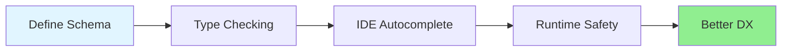
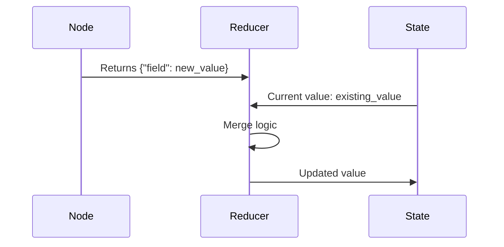
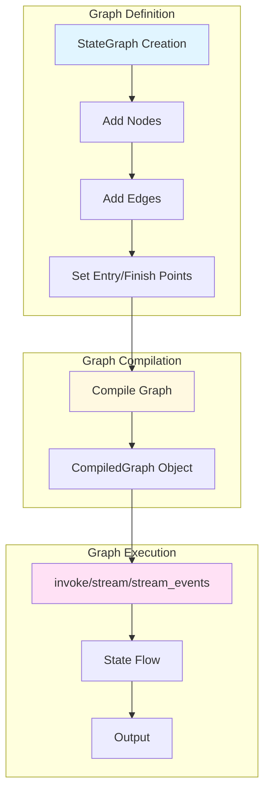
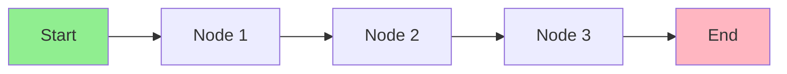
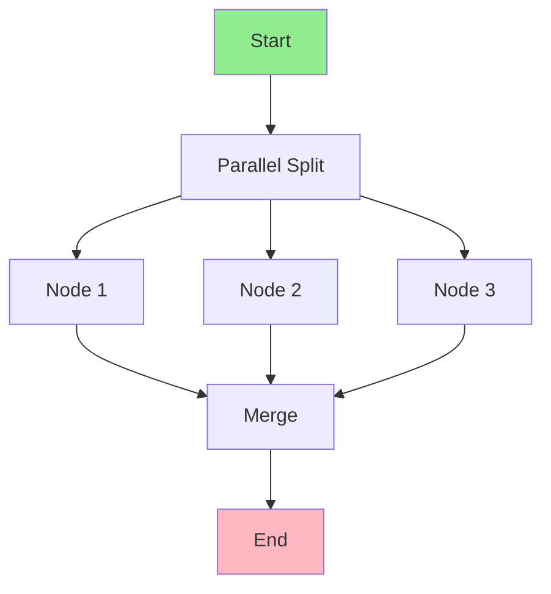
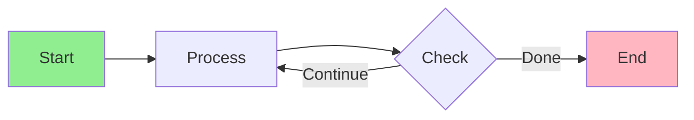
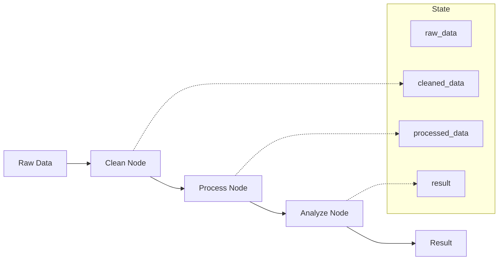

# Module 02: State Management & Graph Basics

**Level:** Beginner to Intermediate  
**Duration:** 5-7 hours  
**Prerequisites:** Module 01 completed

## Table of Contents
1. [Introduction](#introduction)
2. [Deep Dive: State Schemas](#deep-dive-state-schemas)
3. [Understanding Reducers](#understanding-reducers)
4. [Graph Anatomy](#graph-anatomy)
5. [State Flow Patterns](#state-flow-patterns)
6. [Advanced State Techniques](#advanced-state-techniques)
7. [Graph Compilation & Execution](#graph-compilation--execution)
8. [Debugging State Issues](#debugging-state-issues)
9. [Performance Considerations](#performance-considerations)
10. [Best Practices](#best-practices)
11. [Summary & Next Steps](#summary--next-steps)

---

## Introduction

In Module 01, you learned the basics of LangGraph. Now we'll dive deep into the heart of LangGraph: **state management**. Understanding state is crucial because it's the mechanism that makes your applications stateful, persistent, and capable of complex behaviors.

### Learning Objectives

By the end of this module, you will:
- ✅ Master state schema design patterns
- ✅ Create custom reducers for complex state updates
- ✅ Understand graph execution models in depth
- ✅ Debug state-related issues effectively
- ✅ Apply performance optimization techniques
- ✅ Build production-ready state management strategies

---

## Deep Dive: State Schemas

### What is a State Schema?

A **state schema** defines the structure and types of data that flow through your graph. Think of it as a contract that all nodes must respect.

```python
from typing import TypedDict, Annotated, List, Optional
from langgraph.graph import add_messages

class RobustState(TypedDict):
    # Required fields
    messages: Annotated[List, add_messages]
    user_id: str
    session_id: str
    
    # Optional fields
    context: Optional[dict]
    metadata: Optional[dict]
    
    # Computed fields
    iteration_count: int
    status: str  # "processing", "complete", "error"
```

### Why Use TypedDict?

**Benefits:**
1. **Type Safety**: IDEs catch errors before runtime
2. **Documentation**: Schema is self-documenting
3. **Validation**: Type checkers ensure correctness
4. **Autocomplete**: Better developer experience



### State Design Patterns

#### 1. **Flat Schema** (Recommended for beginners)

```python
class FlatState(TypedDict):
    """Simple, flat structure - easy to understand and debug."""
    user_input: str
    llm_response: str
    confidence: float
    timestamp: str
```

**Pros:**
- Easy to understand
- Simple to debug
- Fast access

**Cons:**
- Can become cluttered with many fields
- Less organized for complex data

#### 2. **Nested Schema** (For complex applications)

```python
class NestedState(TypedDict):
    """Organized into logical groups."""
    user: dict  # {id, name, preferences}
    session: dict  # {id, start_time, metadata}
    conversation: dict  # {messages, context, summary}
    processing: dict  # {status, errors, retries}
```

**Pros:**
- Better organization
- Logical grouping
- Scalable

**Cons:**
- Deeper access paths
- Harder to debug
- Reducer complexity

#### 3. **Hybrid Schema** (Best of both worlds)

```python
class HybridState(TypedDict):
    """Flat for frequently accessed, nested for logical groups."""
    # Frequently accessed - keep flat
    messages: Annotated[List, add_messages]
    current_status: str
    
    # Logical groups - nest
    user_profile: dict
    metadata: dict
```

### Schema Evolution

As your application grows, your schema will evolve. Here's how to handle it:

```python
# Version 1: Simple
class StateV1(TypedDict):
    messages: Annotated[List, add_messages]

# Version 2: Add user tracking
class StateV2(TypedDict):
    messages: Annotated[List, add_messages]
    user_id: str
    
# Version 3: Add context
class StateV3(TypedDict):
    messages: Annotated[List, add_messages]
    user_id: str
    context: dict
```

**Migration Strategy:**
1. Add new fields as optional first
2. Update nodes gradually
3. Make fields required once all nodes updated
4. Remove deprecated fields

---

## Understanding Reducers

### What are Reducers?

**Reducers** are functions that define how state updates are merged when a node returns new values.



### Built-in Reducers

#### 1. **Default Reducer** (Replace)

```python
class State(TypedDict):
    count: int  # No reducer annotation
    name: str

# Behavior: New value replaces old value
state = {"count": 5, "name": "Alice"}
update = {"count": 10}
# Result: {"count": 10, "name": "Alice"}
```

#### 2. **add_messages** Reducer

```python
from langgraph.graph import add_messages

class State(TypedDict):
    messages: Annotated[List, add_messages]

# Behavior: Appends messages, deduplicates by ID
state = {"messages": [msg1, msg2]}
update = {"messages": [msg3]}
# Result: {"messages": [msg1, msg2, msg3]}
```

**Special Features:**
- Deduplicates by message ID
- Handles message updates (if same ID with new content)
- Preserves message order

### Custom Reducers

#### Pattern 1: Accumulator

```python
def accumulate_list(existing: list, new: list) -> list:
    """Append new items to existing list."""
    return existing + new

class State(TypedDict):
    logs: Annotated[list, accumulate_list]
```

#### Pattern 2: Max Selector

```python
def keep_max(existing: float, new: float) -> float:
    \"\"\"Keep the maximum value.\"\"\"
    return max(existing, new)

class State(TypedDict):
    max_confidence: Annotated[float, keep_max]
```

#### Pattern 3: Dictionary Merger

```python
def merge_dicts(existing: dict, new: dict) -> dict:
    \"\"\"Deep merge dictionaries.\"\"\"
    result = existing.copy()
    result.update(new)
    return result

class State(TypedDict):
    context: Annotated[dict, merge_dicts]
```

#### Pattern 4: Deduplicator

```python
def deduplicate_items(existing: list, new: list) -> list:
    \"\"\"Add only unique items.\"\"\"
    existing_set = set(existing)
    return existing + [item for item in new if item not in existing_set]

class State(TypedDict):
    unique_tags: Annotated[list, deduplicate_items]
```

#### Pattern 5: Counter

```python
def increment_counter(existing: int, new: int) -> int:
    \"\"\"Increment counter instead of replacing.\"\"\"
    return existing + new

class State(TypedDict):
    iterations: Annotated[int, increment_counter]

# Usage in node:
return {\"iterations\": 1}  # Adds 1 to current count
```

### Advanced Reducer Patterns

#### Conditional Reducer

```python
def conditional_update(existing: str, new: str) -> str:
    \"\"\"Update only if new value meets condition.\"\"\"
    if new and new != \"SKIP\":
        return new
    return existing

class State(TypedDict):
    status: Annotated[str, conditional_update]
```

#### Time-based Reducer

```python
from datetime import datetime

def keep_latest(existing: dict, new: dict) -> dict:
    \"\"\"Keep the value with the latest timestamp.\"\"\"
    existing_time = existing.get('timestamp', 0)
    new_time = new.get('timestamp', 0)
    return new if new_time > existing_time else existing

class State(TypedDict):
    latest_data: Annotated[dict, keep_latest]
```

---

## Graph Anatomy

Let's dissect the structure of a LangGraph application.



### Graph Components Detailed

#### 1. StateGraph

```python
from langgraph.graph import StateGraph

# Create graph with state schema
workflow = StateGraph(MyState)
```

**Purpose:** Container for your computational graph

#### 2. Nodes

```python
workflow.add_node("my_node", my_function)
```

**Node Function Signature:**
```python
def my_function(state: MyState) -> MyState:
    # Process state
    return {"updated_field": new_value}
```

**Node Best Practices:**
- Keep focused and single-purpose
- Return only updates, not full state
- Handle errors gracefully
- Make pure functions when possible

#### 3. Edges

**Normal Edge:**
```python
workflow.add_edge("node_a", "node_b")
```

**Conditional Edge:**
```python
def router(state: MyState) -> str:
    return "path_a" if state['condition'] else "path_b"

workflow.add_conditional_edges(
    "decision_node",
    router,
    {"path_a": "node_a", "path_b": "node_b"}
)
```

**Entry and Finish:**
```python
workflow.set_entry_point("start_node")
workflow.add_edge("end_node", END)
```

#### 4. Compilation

```python
app = workflow.compile(
    checkpointer=None,  # Optional: for persistence
    interrupt_before=[],  # Optional: nodes to pause before
    interrupt_after=[],  # Optional: nodes to pause after
    debug=False  # Optional: enable debug mode
)
```

### Graph Execution Models

#### Model 1: Sequential Execution



```python
workflow.set_entry_point(\"node1\")
workflow.add_edge(\"node1\", \"node2\")
workflow.add_edge(\"node2\", \"node3\")
workflow.add_edge(\"node3\", END)
```

#### Model 2: Parallel Execution



```python
# LangGraph runs nodes in parallel when they don't depend on each other
# If Node1, Node2, Node3 can all operate on initial state:
workflow.set_entry_point(\"node1\")
workflow.set_entry_point(\"node2\")  # Multiple entry points = parallel
workflow.set_entry_point(\"node3\")
workflow.add_edge(\"node1\", \"merge\")
workflow.add_edge(\"node2\", \"merge\")
workflow.add_edge(\"node3\", \"merge\")
```

#### Model 3: Cyclic Execution (Loops)



```python
def should_continue(state: State) -> str:
    return \"process\" if state['iterations'] < MAX_ITER else \"end\"

workflow.add_node(\"process\", process_node)
workflow.set_entry_point(\"process\")
workflow.add_conditional_edges(
    \"process\",
    should_continue,
    {\"process\": \"process\", \"end\": END}
)
```

---

## State Flow Patterns

### Pattern 1: Pipeline Pattern

Sequential processing where each node transforms the data.

```python
class PipelineState(TypedDict):
    raw_data: str
    cleaned_data: str
    processed_data: str
    result: str

def clean_node(state: PipelineState) -> PipelineState:
    return {\"cleaned_data\": clean(state['raw_data'])}

def process_node(state: PipelineState) -> PipelineState:
    return {\"processed_data\": process(state['cleaned_data'])}

def analyze_node(state: PipelineState) -> PipelineState:
    return {\"result\": analyze(state['processed_data'])}
```



### Pattern 2: Aggregation Pattern

Multiple nodes contribute to shared state.

```python
class AggregationState(TypedDict):
    features: Annotated[list, lambda e, n: e + n]
    scores: Annotated[list, lambda e, n: e + n]
    
def feature_extractor_1(state: AggregationState):
    return {\"features\": [extract_feature_1(state)]}

def feature_extractor_2(state: AggregationState):
    return {\"features\": [extract_feature_2(state)]}

def feature_extractor_3(state: AggregationState):
    return {\"features\": [extract_feature_3(state)]}
```

### Pattern 3: Decision Tree Pattern

Conditional routing based on state.

```python
class DecisionState(TypedDict):
    input: str
    category: str
    handler_result: str

def classify(state: DecisionState) -> str:
    # Return name of next node
    if is_question(state['input']):
        return \"qa_handler\"
    elif is_command(state['input']):
        return \"command_handler\"
    return \"default_handler\"
```

### Pattern 4: Refinement Pattern

Iterative improvement until quality threshold met.

```python
class RefinementState(TypedDict):
    draft: str
    quality_score: float
    iterations: int

def refine(state: RefinementState):
    improved = improve_text(state['draft'])
    score = evaluate_quality(improved)
    return {
        \"draft\": improved,
        \"quality_score\": score,
        \"iterations\": state['iterations'] + 1
    }

def should_refine(state: RefinementState) -> str:
    if state['quality_score'] >= 0.9 or state['iterations'] >= 5:
        return \"done\"
    return \"refine\"
```

---

## Advanced State Techniques

### Technique 1: State Partitioning

Separate concerns into different state sections.

```python
class PartitionedState(TypedDict):
    # User interaction state
    conversation: Annotated[list, add_messages]
    
    # Processing state
    processing_status: str
    processing_errors: list
    
    # Business logic state
    entities: list
    intent: str
    confidence: float
    
    # Metadata
    session_id: str
    timestamp: str
```

### Technique 2: Computed Fields

Derive values from other state fields.

```python
def completion_checker(state: MyState) -> MyState:
    \"\"\"Compute completion status from other fields.\"\"\"
    all_done = all([
        state.get('step1_done'),
        state.get('step2_done'),
        state.get('step3_done')
    ])
    return {\"is_complete\": all_done}
```

### Technique 3: State Validation

Ensure state integrity at key points.

```python
def validate_node(state: MyState) -> MyState:
    \"\"\"Validate state before proceeding.\"\"\"
    errors = []
    
    if not state.get('user_id'):
        errors.append(\"Missing user_id\")
    
    if not state.get('messages'):
        errors.append(\"No messages\")
    
    if errors:
        return {\"status\": \"error\", \"errors\": errors}
    
    return {\"status\": \"valid\"}
```

### Technique 4: State Rollback

Save checkpoints for potential rollback.

```python
class StateWithHistory(TypedDict):
    current_data: dict
    history: Annotated[list, lambda e, n: e + n]

def checkpoint_node(state: StateWithHistory):
    \"\"\"Save current state to history.\"\"\"
    snapshot = {\"timestamp\": time.time(), \"data\": state['current_data']}
    return {\"history\": [snapshot]}

def rollback_node(state: StateWithHistory):
    \"\"\"Restore from last checkpoint.\"\"\"
    if state['history']:
        last_checkpoint = state['history'][-1]
        return {\"current_data\": last_checkpoint['data']}
    return {}
```

---

## Graph Compilation & Execution

### Compilation Options

```python
app = workflow.compile(
    # Persistence
    checkpointer=MemorySaver(),  # or PostgresSaver(), etc.
    
    # Interruptions (for human-in-the-loop)
    interrupt_before=[\"approval_node\"],
    interrupt_after=[\"risk_assessment\"],
    
    # Debugging
    debug=True  # Enables verbose logging
)
```

### Execution Methods

#### 1. invoke() - Synchronous, blocking

```python
result = app.invoke(
    input={\"messages\": [HumanMessage(content=\"Hello\")]},
    config={\"configurable\": {\"thread_id\": \"1\"}}
)
```

**Use when:**
- Simple scripts
- Batch processing
- Don't need streaming

#### 2. stream() - Stream node outputs

```python
for chunk in app.stream(initial_state):
    print(f\"Node output: {chunk}\")
```

**Use when:**
- Want to see intermediate results
- Building UIs with progressive updates
- Debugging execution flow

#### 3. astream() - Async streaming

```python
async for chunk in app.astream(initial_state):
    print(f\"Node output: {chunk}\")
```

**Use when:**
- Async application
- High concurrency needed
- Non-blocking execution required

---

## Debugging State Issues

### Common State Problems

#### Problem 1: State Not Updating

```python
# ❌ WRONG: Mutating state directly
def bad_node(state: State):
    state['count'] += 1
    return state

# ✅ CORRECT: Return updates
def good_node(state: State):
    return {\"count\": state['count'] + 1}
```

#### Problem 2: Missing Reducer

```python
# ❌ WRONG: No reducer for list (replaces instead of appends)
class State(TypedDict):
    items: list

# ✅ CORRECT: Add reducer
class State(TypedDict):
    items: Annotated[list, lambda e, n: e + n]
```

#### Problem 3: Type Mismatches

```python
# ❌ WRONG: Wrong type returned
def bad_node(state: State) -> State:
    return {\"count\": \"5\"}  # String instead of int

# ✅ CORRECT: Match schema types
def good_node(state: State) -> State:
    return {\"count\": 5}  # Int as defined
```

### Debugging Techniques

#### 1. Add Logging

```python
import logging

def debug_node(state: State) -> State:
    logging.info(f\"State at entry: {state}\")
    result = process(state)
    logging.info(f\"Returning: {result}\")
    return result
```

#### 2. Use LangSmith Tracing

```python
import os
os.environ[\"LANGCHAIN_TRACING_V2\"] = \"true\"
os.environ[\"LANGCHAIN_API_KEY\"] = \"your-key\"

# Execution now traced in LangSmith
result = app.invoke(state)
```

#### 3. Print State Between Nodes

```python
def state_printer(state: State) -> State:
    \"\"\"Debug node that prints state.\"\"\"
    print(\"=\" * 50)
    print(f\"Current State: {state}\")
    print(\"=\" * 50)
    return {}  # No updates

# Add between nodes for debugging
workflow.add_node(\"debug\", state_printer)
workflow.add_edge(\"node1\", \"debug\")
workflow.add_edge(\"debug\", \"node2\")
```

---

## Performance Considerations

### 1. State Size

**Problem:** Large state slows down execution
**Solution:** Keep state minimal

```python
# ❌ Avoid: Storing massive data
class BadState(TypedDict):
    all_documents: list  # Could be millions of items!
    
# ✅ Better: Store references
class GoodState(TypedDict):
    document_ids: list  # Just IDs
    current_doc: dict  # Only what's needed now
```

### 2. Reducer Complexity

**Problem:** Complex reducers run on every update
**Solution:** Optimize reducer logic

```python
# ❌ Slow: O(n²) deduplication
def slow_dedup(existing: list, new: list) -> list:
    result = existing.copy()
    for item in new:
        if item not in result:  # O(n) check
            result.append(item)
    return result

# ✅ Fast: O(n) deduplication
def fast_dedup(existing: list, new: list) -> list:
    seen = set(existing)
    return existing + [item for item in new if item not in seen]
```

### 3. Parallel Execution

**Leverage parallelism when possible:**

```python
# These nodes can run in parallel if they don't depend on each other
workflow.add_node(\"fetch_user\", fetch_user_node)
workflow.add_node(\"fetch_settings\", fetch_settings_node)
workflow.add_node(\"fetch_history\", fetch_history_node)

# All start from entry point
workflow.set_entry_point(\"fetch_user\")
# LangGraph automatically parallelizes independent nodes
```

---

## Best Practices

### 1. Design Schema First

Before writing any nodes, design your complete state schema.

```python
# Document your schema
class WellDesignedState(TypedDict):
    \"\"\"
    State for customer support chatbot.
    
    Fields:
        messages: Conversation history
        user_id: Customer identifier
        ticket_id: Support ticket reference
        issue_category: Classified issue type
        resolution_status: Current status
        confidence: Model confidence in classification
    \"\"\"
    messages: Annotated[List, add_messages]
    user_id: str
    ticket_id: Optional[str]
    issue_category: Optional[str]
    resolution_status: str
    confidence: float
```

### 2. Use Type Hints Everywhere

```python
from typing import TypedDict, Optional, List, Dict, Any

def well_typed_node(state: MyState) -> MyState:
    \"\"\"Type hints help catch errors early.\"\"\"
    value: int = state['count']
    result: str = process(value)
    return {\"output\": result}
```

### 3. Keep Nodes Focused

```python
# ✅ Good: Single responsibility
def fetch_data_node(state: State) -> State:
    return {\"data\": fetch_data(state['id'])}

def process_data_node(state: State) -> State:
    return {\"processed\": process(state['data'])}

def save_data_node(state: State) -> State:
    save(state['processed'])
    return {\"status\": \"saved\"}
```

### 4. Plan for Errors

```python
class RobustState(TypedDict):
    data: dict
    status: str
    error: Optional[str]
    retry_count: int

def resilient_node(state: RobustState) -> RobustState:
    try:
        result = risky_operation(state['data'])
        return {\"data\": result, \"status\": \"success\"}
    except Exception as e:
        return {
            \"status\": \"error\",
            \"error\": str(e),
            \"retry_count\": state['retry_count'] + 1
        }
```

### 5. Document Your Graph

```python
def build_workflow() -> CompiledGraph:
    \"\"\"
    Build customer support workflow.
    
    Flow:
        1. classify_issue: Categorize user's problem
        2. route_to_handler: Route to specialized handler
        3. generate_response: Create appropriate response
        4. quality_check: Verify response quality
    
    Returns:
        Compiled LangGraph application
    \"\"\"
    workflow = StateGraph(SupportState)
    # ... build graph
    return workflow.compile()
```

---

## Summary & Next Steps

### What You Learned

✅ **Advanced State Schemas**: Design patterns and evolution strategies  
✅ **Reducers Mastery**: Built-in and custom reducers for complex state updates  
✅ **Graph Anatomy**: Deep understanding of components and compilation  
✅ **State Flow Patterns**: Pipeline, aggregation, decision tree, refinement  
✅ **Advanced Techniques**: Partitioning, validation, rollback  
✅ **Performance**: Optimization strategies for production  
✅ **Debugging**: Techniques for troubleshooting state issues  

### Key Takeaways

1. **State Design Matters**: Invest time in schema design upfront
2. **Reducers Are Powerful**: Use custom reducers for complex merge logic
3. **Type Hints Save Time**: Catch errors early with proper typing
4. **Debug Proactively**: Use logging and LangSmith from the start
5. **Optimize Wisely**: Keep state minimal and reducers efficient

### Practice Exercises

Head to **[module-02-practice.ipynb](./module-02-practice.ipynb)** to practice:
1. Designing complex state schemas
2. Implementing custom reducers
3. Building multi-pattern workflows
4. Debugging state issues
5. Optimizing state management

### Next Module

**Module 03: Advanced Control Flow** will cover:
- Conditional edges in depth
- Dynamic routing strategies
- Subgraphs and composition
- Parallel execution patterns
- Complex decision logic

---

## Additional Resources

- [LangGraph State Documentation](https://langchain-ai.github.io/langgraph/concepts/low_level/#state)
- [LangGraph Reducers Guide](https://langchain-ai.github.io/langgraph/concepts/low_level/#reducers)
- [TypedDict Documentation](https://docs.python.org/3/library/typing.html#typing.TypedDict)

---

**Ready to practice?** Open [module-02-practice.ipynb](./module-02-practice.ipynb)! 🚀
