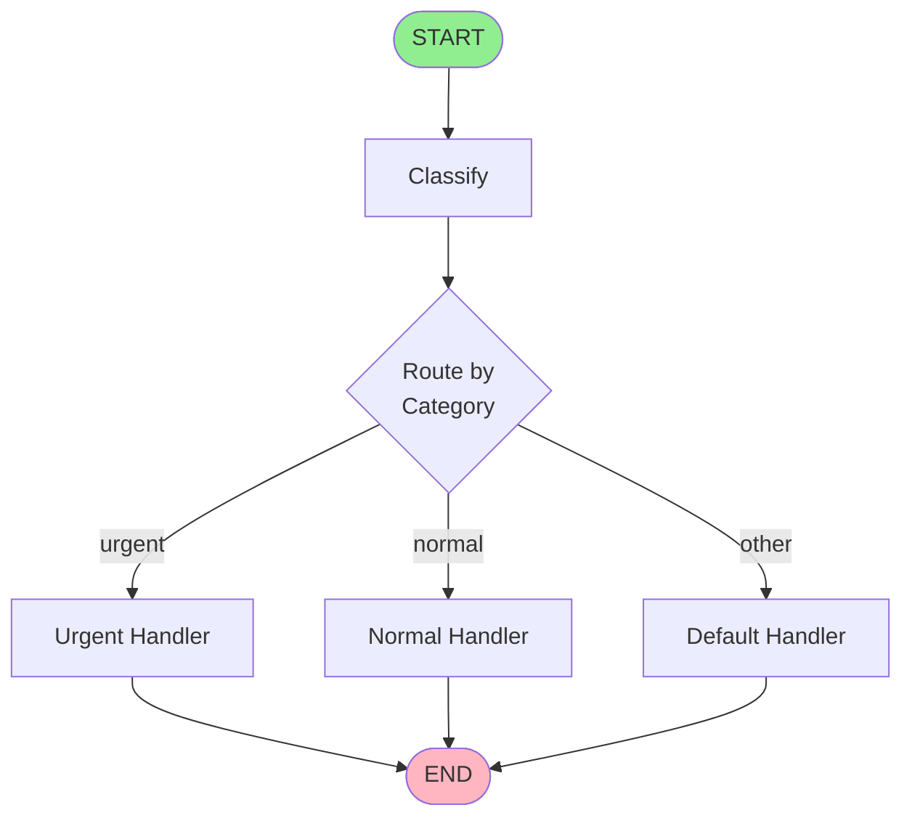
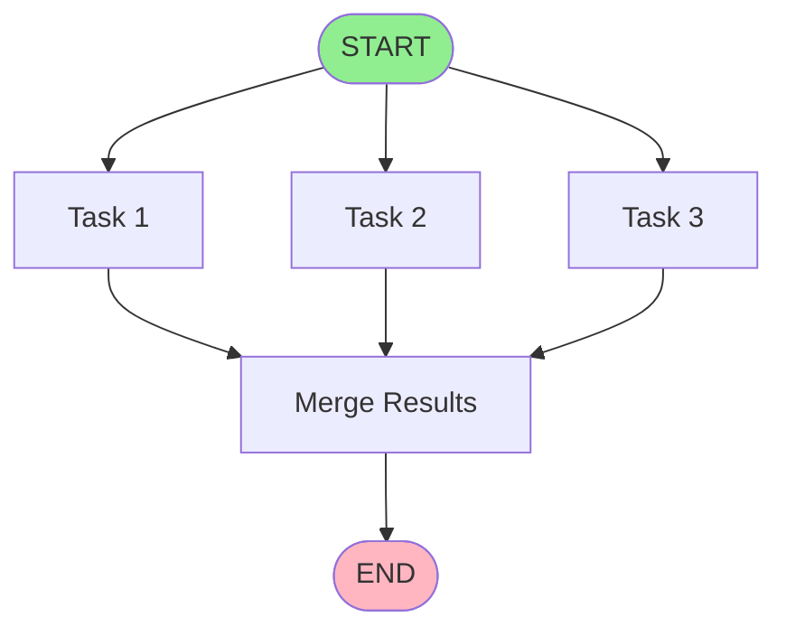

# Module 03: Advanced Control Flow

**Level:** Intermediate (Mid-Level Engineer)  
**Duration:** 6-8 hours  
**Prerequisites:** Modules 01-02 completed  
**Updated:** December 2025 - Includes Command tool and dynamic routing

## Table of Contents
1. [Introduction](#introduction)
2. [Conditional Edges Deep Dive](#conditional-edges-deep-dive)
3. [Dynamic Routing with Command (2024+)](#dynamic-routing-with-command-2024)
4. [Edgeless Graphs](#edgeless-graphs)
5. [Subgraphs and Composition](#subgraphs-and-composition)
6. [Parallel Execution](#parallel-execution)
7. [Real-World Patterns](#real-world-patterns)
8. [Best Practices](#best-practices)
9. [Common Pitfalls](#common-pitfalls)
10. [Summary & Next Steps](#summary--next-steps)

---

## Introduction

This module covers **Advanced Control Flow** in LangGraph, with special focus on the revolutionary **Command tool** (introduced December 2024) that enables dynamic, edgeless graphs and modern multi-agent architectures.

> **🆕 What's New in 2024-2025**
> - `Command` tool for dynamic routing without pre-defined edges
> - Runtime node selection and state updates
> - Modern multi-agent communication patterns
> - `START` and `END` constants replacing string-based entry/exit

### Learning Objectives

By the end of this module, you will:
- ✅ Master traditional conditional edges
- ✅ Understand and use the **Command tool** for dynamic routing
- ✅ Build edgeless graphs with runtime node selection
- ✅ Compose complex workflows with subgraphs
- ✅ Implement parallel execution patterns
- ✅ Apply production-ready routing strategies

---

## Conditional Edges Deep Dive

### Traditional Conditional Routing

Before Command, LangGraph used conditional edges with predefined mappings:

```python
from langgraph.graph import StateGraph, START, END
from typing import TypedDict

class State(TypedDict):
    input: str
    category: str
    result: str

def classifier_node(state: State) -> State:
    """Classify input into categories."""
    category = classify(state['input'])
    return {"category": category}

def route_by_category(state: State) -> str:
    """Router function returns node name."""
    if state['category'] == 'urgent':
        return "urgent_handler"
    elif state['category'] == 'normal':
        return "normal_handler"
    return "default_handler"

# Build graph with conditional edges
workflow = StateGraph(State)

workflow.add_node("classify", classifier_node)
workflow.add_node("urgent_handler", urgent_handler_node)
workflow.add_node("normal_handler", normal_handler_node)
workflow.add_node("default_handler", default_handler_node)

# Entry point
workflow.add_edge(START, "classify")

# Conditional routing - must define ALL possible paths
workflow.add_conditional_edges(
    "classify",
    route_by_category,
    {
        "urgent_handler": "urgent_handler",
        "normal_handler": "normal_handler",
        "default_handler": "default_handler"
    }
)

# All handlers go to END
workflow.add_edge("urgent_handler", END)
workflow.add_edge("normal_handler", END)
workflow.add_edge("default_handler", END)

app = workflow.compile()
```

**Flow Diagram:**



**Limitations:**
- All routes must be pre-defined at compile time
- Router function just returns a string
- Cannot update state AND route in one operation
- Inflexible for dynamic, multi-agent scenarios

---

## Dynamic Routing with Command (2024+)

### The Command Tool Revolution

Introduced in **December 2024**, `Command` allows nodes to:
1. Update graph state
2. Specify next node(s) to execute
3. Do both simultaneously in a single return

This enables **true dynamic routing** without predefined edges.

### Basic Command Example

```python
from langgraph.graph import StateGraph, START, END
from langgraph.types import Command
from typing import TypedDict

class AgentState(TypedDict):
    messages: list
    next_agent: str
    context: dict

def supervisor_node(state: AgentState) -> Command:
    """
    Supervisor decides which agent to call next.
    Returns Command with state update AND routing decision.
    """
    # Analyze conversation
    analysis = analyze_messages(state['messages'])
    
    # Decide next agent based on runtime conditions
    if analysis['needs_research']:
        next_agent = "research_agent"
        context_update = {"task": "deep_research"}
    elif analysis['needs_code']:
        next_agent = "code_agent"
        context_update = {"task": "code_generation"}
    else:
        next_agent = "writer_agent"
        context_update = {"task": "summarization"}
    
    # Return Command: update state AND route dynamically
    return Command(
        update={"context": context_update, "next_agent": next_agent},
        goto=next_agent  # Dynamic routing - no predefined edge needed!
    )

def research_agent(state: AgentState) -> Command:
    """Research agent processes and returns to supervisor."""
    results = do_research(state['context'])
    return Command(
        update={"messages": state['messages'] + [results]},
        goto="supervisor_node"  # Route back to supervisor
    )

def code_agent(state: AgentState) -> Command:
    """Code agent generates code and returns to supervisor."""
    code = generate_code(state['context'])
    return Command(
        update={"messages": state['messages'] + [code]},
        goto="supervisor_node"
    )

def writer_agent(state: AgentState) -> Command:
    """Writer creates final output."""
    final = write_summary(state['messages'])
    return Command(
        update={"messages": state['messages'] + [final]},
        goto=END  # Can route to END when done
    )

# Build graph - NO EDGES NEEDED!
workflow = StateGraph(AgentState)

workflow.add_node("supervisor_node", supervisor_node)
workflow.add_node("research_agent", research_agent)
workflow.add_node("code_agent", code_agent)
workflow.add_node("writer_agent", writer_agent)

workflow.add_edge(START, "supervisor_node")
# That's it! No other edges needed - Command handles routing

app = workflow.compile()
```

**Flow Visualization:**

```mermaid
graph TD
    START([START]) --> S[Supervisor]
    S -.Command.goto.-> R[Research Agent]
    S -.Command.goto.-> C[Code Agent]
    S -.Command.goto.-> W[Writer Agent]
    R -.Command.goto.-> S
    C -.Command.goto.-> S
    W -.Command.goto.-> END([END])
    
    style START fill:#90EE90
    style END fill:#FFB6C1
    style S fill:#e1f5ff
```

### Command vs Conditional Edges

| Feature | Conditional Edges | Command Tool |
|---------|-------------------|--------------|
| **Routing** | Pre-defined mappings | Dynamic, runtime decisions |
| **State Update** | Separate operation | Combined with routing |
| **Edge Definition** | Required for all paths | Not required |
| **Flexibility** | Limited to compile-time routes | Full runtime flexibility |
| **Best For** | Simple, static workflows | Multi-agent, dynamic systems |
| **When Introduced** | Original LangGraph | December 2024 |

### When to Use Each

**Use Conditional Edges When:**
- Routes are known at compile time
- Simple branching logic
- Teaching/learning scenarios
- Visualization clarity is priority

**Use Command When:**
- Multi-agent systems with dynamic handoffs
- Runtime-determined routing
- Need to update state AND route together
- Production multi-agent architectures

---

## Edgeless Graphs

### The Edgeless Architecture Pattern

With `Command`, you can build graphs with **ZERO predefined edges** (except START):

```python
from langgraph.graph import StateGraph, START, END
from langgraph.types import Command
from typing import TypedDict, Literal

class WorkflowState(TypedDict):
    task: str
    step: int
    result: str
    status: Literal["processing", "complete", "error"]

def dynamic_workflow_node(state: WorkflowState) -> Command:
    \"\"\"
    Single node that routes to itself, END, or error handler
    based entirely on runtime conditions - no predefined edges!
    \"\"\"
    try:
        # Process current step
        step_result = process_step(state['task'], state['step'])
        
        # Determine next action dynamically
        if state['step'] >= 10:
            # Work complete
            return Command(
                update={"status": "complete", "result": step_result},
                goto=END
            )
        elif should_continue(step_result):
            # Continue to next step - route to self!
            return Command(
                update={"step": state['step'] + 1, "result": step_result},
                goto="dynamic_workflow_node"  # Self-routing
            )
        else:
            # Need human review
            return Command(
                update={"status": "needs_review"},
                goto="human_review_node"
            )
            
    except Exception as e:
        # Error - route to error handler
        return Command(
            update={"status": "error", "result": str(e)},
            goto="error_handler_node"
        )

# Edgeless graph - only START edge defined!
workflow = StateGraph(WorkflowState)

workflow.add_node("dynamic_workflow_node", dynamic_workflow_node)
workflow.add_node("human_review_node", human_review_node)
workflow.add_node("error_handler_node", error_handler_node)

workflow.add_edge(START, "dynamic_workflow_node")
# NO OTHER EDGES! Command handles all routing

app = workflow.compile()
```

**Benefits of Edgeless Graphs:**
1. **Runtime Flexibility**: Routes determined dynamically
2. **Self-Routing**: Nodes can route to themselves for loops
3. **Simplified Graph Definition**: Less boilerplate
4. **Dynamic Error Handling**: Route to error handlers on-demand
5. **Multi-Agent Communication**: Agents decide next agent at runtime

---

## Subgraphs and Composition

### Subgraph Pattern

Create modular, reusable workflows:

```python
from langgraph.graph import StateGraph, START, END

# Subgraph 1: Data validation
def build_validation_subgraph():
    class ValidationState(TypedDict):
        data: dict
        is_valid: bool
        errors: list
    
    subgraph = StateGraph(ValidationState)
    
    subgraph.add_node("schema_check", schema_check_node)
    subgraph.add_node("business_rules", business_rules_node)
    
    subgraph.add_edge(START, "schema_check")
    subgraph.add_edge("schema_check", "business_rules")
    subgraph.add_edge("business_rules", END)
    
    return subgraph.compile()

# Subgraph 2: Data processing
def build_processing_subgraph():
    class ProcessState(TypedDict):
        data: dict
        processed: dict
    
    subgraph = StateGraph(ProcessState)
    
    subgraph.add_node("transform", transform_node)
    subgraph.add_node("enrich", enrich_node)
    
    subgraph.add_edge(START, "transform")
    subgraph.add_edge("transform", "enrich")
    subgraph.add_edge("enrich", END)
    
    return subgraph.compile()

# Main graph composes subgraphs
class MainState(TypedDict):
    raw_data: dict
    validated_data: dict
    final_output: dict

def main_workflow():
    workflow = StateGraph(MainState)
    
    # Use subgraphs as nodes
    validation_graph = build_validation_subgraph()
    processing_graph = build_processing_subgraph()
    
    workflow.add_node("validate", validation_graph)
    workflow.add_node("process", processing_graph)
    workflow.add_node("finalize", finalize_node)
    
    workflow.add_edge(START, "validate")
    workflow.add_edge("validate", "process")
    workflow.add_edge("process", "finalize")
    workflow.add_edge("finalize", END)
    
    return workflow.compile()
```

---

## Parallel Execution

### Pattern: Fan-Out / Fan-In

Execute multiple nodes in parallel, then merge results:

```python
from langgraph.graph import StateGraph, START, END
from typing import TypedDict, Annotated

def merge_lists(existing: list, new: list) -> list:
    """Custom reducer to merge lists."""
    return existing + new

class ParallelState(TypedDict):
    input: str
    results: Annotated[list, merge_lists]  # Will accumulate from parallel nodes
    final: str

def parallel_task_1(state: ParallelState):
    result = process_task_1(state['input'])
    return {"results": [{"task": 1, "data": result}]}

def parallel_task_2(state: ParallelState):
    result = process_task_2(state['input'])
    return {"results": [{"task": 2, "data": result}]}

def parallel_task_3(state: ParallelState):
    result = process_task_3(state['input'])
    return {"results": [{"task": 3, "data": result}]}

def merge_results(state: ParallelState):
    """Merge all parallel results."""
    merged = combine(state['results'])
    return {"final": merged}

# Build graph
workflow = StateGraph(ParallelState)

workflow.add_node("task1", parallel_task_1)
workflow.add_node("task2", parallel_task_2)
workflow.add_node("task3", parallel_task_3)
workflow.add_node("merge", merge_results)

# Fan-out: START to all parallel tasks
workflow.add_edge(START, "task1")
workflow.add_edge(START, "task2")
workflow.add_edge(START, "task3")

# Fan-in: All tasks to merge
workflow.add_edge("task1", "merge")
workflow.add_edge("task2", "merge")
workflow.add_edge("task3", "merge")

workflow.add_edge("merge", END)

app = workflow.compile()
```



---

## Real-World Patterns

### Pattern 1: Customer Support Router (Command-Based)

```python
from langgraph.graph import StateGraph, START, END
from langgraph.types import Command

class SupportState(TypedDict):
    customer_message: str
    category: str
    priority: str
    assigned_agent: str
    resolution: str

def triage_node(state: SupportState) -> Command:
    \"\"\"Triage incoming support requests.\"\"\"
    category, priority = analyze_request(state['customer_message'])
    
    # Dynamic routing based on priority
    if priority == "critical":
        agent = "senior_agent"
    elif category == "technical":
        agent = "tech_specialist"
    elif category == "billing":
        agent = "billing_agent"
    else:
        agent = "general_support"
    
    return Command(
        update={"category": category, "priority": priority, "assigned_agent": agent},
        goto=agent
    )

def senior_agent(state: SupportState) -> Command:
    resolution = handle_critical_issue(state)
    return Command(
        update={"resolution": resolution},
        goto=END
    )

# Build support system
workflow = StateGraph(SupportState)
workflow.add_node("triage", triage_node)
workflow.add_node("senior_agent", senior_agent)
workflow.add_node("tech_specialist", tech_specialist_node)
workflow.add_node("billing_agent", billing_agent_node)
workflow.add_node("general_support", general_support_node)

workflow.add_edge(START, "triage")
app = workflow.compile()
```

### Pattern 2: Research Pipeline with Conditional Depth

```python
def research_node(state: ResearchState) -> Command:
    \"\"\"Conduct research with dynamic depth.\"\"\"
    results = search(state['query'])
    
    # Decide if more depth needed
    if state['depth'] < state['max_depth'] and needs_more_research(results):
        # Go deeper - route to self with updated query
        refined_query = refine_query(state['query'], results)
        return Command(
            update={
                "query": refined_query,
                "depth": state['depth'] + 1,
                "results": state['results'] + [results]
            },
            goto="research_node"  # Self-routing for depth
        )
    else:
        # Research complete - synthesize
        return Command(
            update={"results": state['results'] + [results]},
            goto="synthesize_node"
        )
```

---

## Best Practices

### 1. Choose the Right Routing Mechanism

```python
# ✅ GOOD: Use Command for multi-agent systems
def agent_node(state) -> Command:
    next_agent = decide_next_agent(state)
    return Command(update={...}, goto=next_agent)

# ⚠️ OKAY: Use conditional edges for simple branching
def simple_router(state) -> str:
    return "path_a" if condition else "path_b"

workflow.add_conditional_edges("node", simple_router, {...})
```

### 2. Always Handle Edge Cases in Command

```python
def robust_command_node(state: State) -> Command:
    try:
        result = process(state)
        return Command(
            update={"result": result, "status": "success"},
            goto="next_node"
        )
    except Exception as e:
        # Always provide fallback routing
        return Command(
            update={"error": str(e), "status": "error"},
            goto="error_handler"  # Don't leave hanging!
        )
```

### 3. Document Dynamic Routing Logic

```python
def supervisor_node(state: State) -> Command:
    \"\"\"
    Supervisor routes to specialist agents.
    
    Routing Logic:
    - Research tasks → research_agent
    - Code tasks → code_agent
    - Writing tasks → writer_agent
    - Unclear → clarification_agent
    \"\"\"
    task_type = classify_task(state)
    agent_map = {
        "research": "research_agent",
        "code": "code_agent",
        "writing": "writer_agent"
    }
    next_agent = agent_map.get(task_type, "clarification_agent")
    
    return Command(update={"task_type": task_type}, goto=next_agent)
```

### 4. Use START/END Constants (2024+ Best Practice)

```python
# ✅ MODERN (2024+)
from langgraph.graph import START, END

workflow.add_edge(START, "first_node")
workflow.add_edge("last_node", END)

# ❌ OUTDATED (pre-2024)
workflow.set_entry_point("first_node")  # Deprecated
workflow.add_edge("last_node", END)  # END is still ok
```

---

## Common Pitfalls

### Pitfall 1: Forgetting to Return Command

```python
# ❌ WRONG: Regular return in Command-based graph
def node(state: State):
    return {"field": "value"}  # Graph will error!

# ✅ CORRECT: Always return Command
def node(state: State) -> Command:
    return Command(update={"field": "value"}, goto="next_node")
```

### Pitfall 2: Mixing Routing Paradigms

```python
# ❌ CONFUSING: Mixing conditional edges and Command
workflow.add_conditional_edges("node1", router, {...})  # Traditional
workflow.add_node("node2", lambda s: Command(...))  # Command-based
# Pick one approach for consistency!
```

### Pitfall 3: Infinite Loops Without Guards

```python
# ❌ DANGEROUS: No loop prevention
def node(state: State) -> Command:
    return Command(goto="node")  # Infinite loop!

# ✅ SAFE: Add iteration guard
def node(state: State) -> Command:
    if state['iterations'] >= MAX_ITERATIONS:
        return Command(goto=END)
    return Command(
        update={"iterations": state['iterations'] + 1},
        goto="node"
    )
```

---

## Summary & Next Steps

### What You Learned

✅ **Traditional Conditional Edges**: Router functions with predefined paths  
✅ **Command Tool (2024)**: Dynamic routing with state updates  
✅ **Edgeless Graphs**: Runtime-determined flow without predefined edges  
✅ **Subgraphs**: Modular, composable workflows  
✅ **Parallel Execution**: Fan-out/fan-in patterns  
✅ **Production Patterns**: Real-world multi-agent routing  

### Key Takeaways

1. **Command is the Modern Standard** for dynamic multi-agent systems
2. **Conditional Edges Still Valid** for simple, static branching
3. **START/END Constants** are the 2024+ best practice
4. **Edgeless Graphs** provide maximum flexibility
5. **Always Handle Edge Cases** in routing logic

### Practice Now

Continue to **[module-03-practice.ipynb](./module-03-practice.ipynb)** to practice:
- Building Command-based multi-agent systems
- Creating edgeless graphs
- Implementing parallel execution
- Converting conditional edges to Command

### Next Module

**Module 04: Human-in-the-Loop Patterns** will cover:
- State-modifying tools with `InjectedState`
- Tools returning `Command` objects
- Approval workflows
- Interactive debugging

---

## Additional Resources

- [LangGraph Command Documentation](https://python.langchain.com/docs/langgraph/)
- [Multi-Agent Architecture Guide](https://python.langchain.com/docs/langgraph/)
- [LangGraph Changelog - December 2024](https://python.langchain.com/changelog/)
- [Command Tool Release Announcement](https://blog.langchain.dev/)

---

**Ready to build modern multi-agent systems?** Module 04 awaits! 🚀
