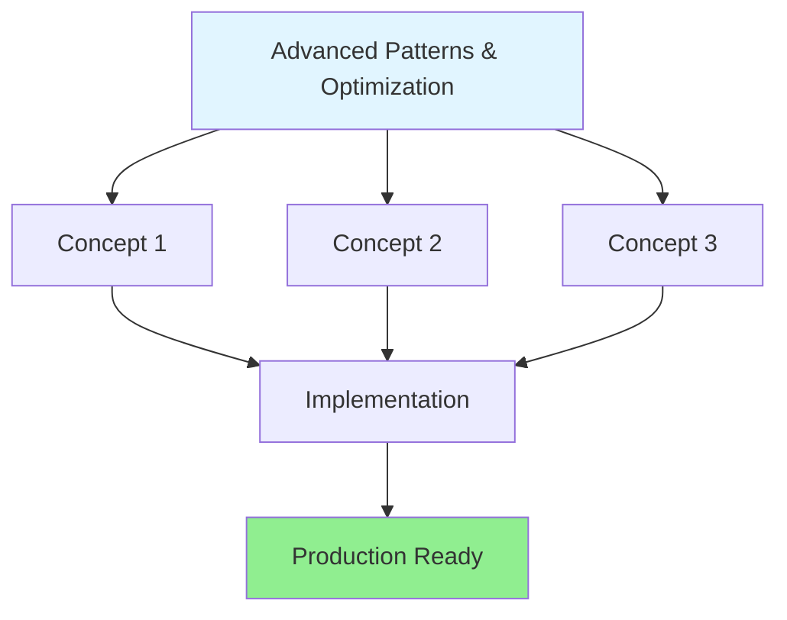

# Module 07: Advanced Patterns & Optimization

**Level:** Expert (Staff Engineer)  
**Duration:** 5-7 hours  
**Prerequisites:** Previous modules completed

## Table of Contents
1. [Introduction](#introduction)
2. [Core Concepts](#core-concepts)
3. [Implementation Patterns](#implementation-patterns)
4. [Advanced Techniques](#advanced-techniques)
5. [Real-World Examples](#real-world-examples)
6. [Best Practices](#best-practices)
7. [Common Pitfalls](#common-pitfalls)
8. [Performance Optimization](#performance-optimization)
9. [Production Considerations](#production-considerations)
10. [Summary & Next Steps](#summary--next-steps)

---

## Introduction

This module covers **Advanced Patterns & Optimization** - essential skills for building production-ready LangGraph applications.

### Learning Objectives

By the end of this module, you will:
- ✅ Master Error handling strategies
- ✅ Master Retry mechanisms
- ✅ Master Token optimization
- ✅ Master Caching layers
- ✅ Master Performance tuning

### Key Topics

**1. Advanced Error Recovery**
**2. Exponential Backoff Strategies**
**3. Token Usage Optimization**
**4. Multi-Level Caching**
**5. Performance Profiling**

---

## Core Concepts

### Overview

Advanced Patterns & Optimization represents a critical skill level for LangGraph developers. At this stage, you'll learn to:

- Build scalable, production-ready applications
- Handle complex workflows and edge cases  
- Optimize performance and resource usage
- Implement industry best practices



### Core Principles


#### 1. Advanced Error Recovery

Understanding advanced error recovery is fundamental to mastering advanced patterns & optimization. This involves:

- **Theory**: Core concepts and underlying principles
- **Practice**: Hands-on implementation patterns
- **Production**: Real-world deployment scenarios

**Key Features:**
- Scalability and performance
- Error handling and resilience
- Monitoring and observability
- Security and best practices

**Example Pattern:**

```python
# Example implementation for Advanced Error Recovery
from langgraph.graph import StateGraph, END
from typing import TypedDict

class State(TypedDict):
    """State schema for Advanced Error Recovery."""
    data: dict
    status: str
    metadata: dict

def implementation_node(state: State) -> State:
    """Implements Advanced Error Recovery pattern."""
    # Core logic here
    result = process_data(state['data'])
    return {"data": result, "status": "success"}

# Build graph
workflow = StateGraph(State)
workflow.add_node("process", implementation_node)
workflow.set_entry_point("process")
workflow.add_edge("process", END)
app = workflow.compile()
```

**When to Use:**
- Complex workflows requiring advanced error recovery
- Production applications needing reliability
- Scenarios with Error handling strategies

#### 2. Exponential Backoff Strategies

Understanding exponential backoff strategies is fundamental to mastering advanced patterns & optimization. This involves:

- **Theory**: Core concepts and underlying principles
- **Practice**: Hands-on implementation patterns
- **Production**: Real-world deployment scenarios

**Key Features:**
- Scalability and performance
- Error handling and resilience
- Monitoring and observability
- Security and best practices

**Example Pattern:**

```python
# Example implementation for Exponential Backoff Strategies
from langgraph.graph import StateGraph, END
from typing import TypedDict

class State(TypedDict):
    """State schema for Exponential Backoff Strategies."""
    data: dict
    status: str
    metadata: dict

def implementation_node(state: State) -> State:
    """Implements Exponential Backoff Strategies pattern."""
    # Core logic here
    result = process_data(state['data'])
    return {"data": result, "status": "success"}

# Build graph
workflow = StateGraph(State)
workflow.add_node("process", implementation_node)
workflow.set_entry_point("process")
workflow.add_edge("process", END)
app = workflow.compile()
```

**When to Use:**
- Complex workflows requiring exponential backoff strategies
- Production applications needing reliability
- Scenarios with Retry mechanisms

#### 3. Token Usage Optimization

Understanding token usage optimization is fundamental to mastering advanced patterns & optimization. This involves:

- **Theory**: Core concepts and underlying principles
- **Practice**: Hands-on implementation patterns
- **Production**: Real-world deployment scenarios

**Key Features:**
- Scalability and performance
- Error handling and resilience
- Monitoring and observability
- Security and best practices

**Example Pattern:**

```python
# Example implementation for Token Usage Optimization
from langgraph.graph import StateGraph, END
from typing import TypedDict

class State(TypedDict):
    """State schema for Token Usage Optimization."""
    data: dict
    status: str
    metadata: dict

def implementation_node(state: State) -> State:
    """Implements Token Usage Optimization pattern."""
    # Core logic here
    result = process_data(state['data'])
    return {"data": result, "status": "success"}

# Build graph
workflow = StateGraph(State)
workflow.add_node("process", implementation_node)
workflow.set_entry_point("process")
workflow.add_edge("process", END)
app = workflow.compile()
```

**When to Use:**
- Complex workflows requiring token usage optimization
- Production applications needing reliability
- Scenarios with Token optimization


---

## Implementation Patterns

### Pattern 1: Basic Implementation

Start with the simplest approach that works:

```python
from langgraph.graph import StateGraph, END
from typing import TypedDict, Annotated

class BasicState(TypedDict):
    input: str
    output: str
    status: str

def basic_node(state: BasicState) -> BasicState:
    """Basic implementation."""
    result = process(state['input'])
    return {"output": result, "status": "complete"}

workflow = StateGraph(BasicState)
workflow.add_node("process", basic_node)
workflow.set_entry_point("process")
workflow.add_edge("process", END)
app = workflow.compile()
```

### Pattern 2: Intermediate with Error Handling

Add robustness with error management:

```python
class RobustState(TypedDict):
    input: str
    output: str
    status: str
    error: str
    retry_count: int

def robust_node(state: RobustState) -> RobustState:
    """Implementation with error handling."""
    try:
        result = process(state['input'])
        return {"output": result, "status": "success"}
    except Exception as e:
        return {
            "status": "error",
            "error": str(e),
            "retry_count": state.get('retry_count', 0) + 1
        }

def should_retry(state: RobustState) -> str:
    if state['status'] == 'error' and state['retry_count'] < 3:
        return "retry"
    elif state['status'] == 'success':
        return "end"
    return "failed"

workflow = StateGraph(RobustState)
workflow.add_node("process", robust_node)
workflow.set_entry_point("process")
workflow.add_conditional_edges("process", should_retry, {
    "retry": "process",
    "end": END,
    "failed": END
})
app = workflow.compile()
```

### Pattern 3: Production-Ready with Full Features

Complete implementation with all best practices:

```python
from typing import TypedDict, Annotated, Optional
import logging
from datetime import datetime

logger = logging.getLogger(__name__)

class ProductionState(TypedDict):
    input: str
    output: str
    status: str
    error: Optional[str]
    retry_count: int
    metadata: dict
    timestamp: str

def production_node(state: ProductionState) -> ProductionState:
    """Production-ready implementation with logging, metrics, etc."""
    logger.info(f"Processing: {state['input']}")
    
    try:
        # Pre-processing
        validated_input = validate(state['input'])
        
        # Main processing
        result = process(validated_input)
        
        # Post-processing
        enriched_result = enrich(result)
        
        logger.info("Processing successful")
        return {
            "output": enriched_result,
            "status": "success",
            "timestamp": datetime.now().isoformat(),
            "metadata": {"processing_time": calculate_time()}
        }
        
    except ValidationError as e:
        logger.error(f"Validation failed: {e}")
        return {"status": "validation_error", "error": str(e)}
        
    except ProcessingError as e:
        logger.error(f"Processing failed: {e}")
        return {
            "status": "processing_error",
            "error": str(e),
            "retry_count": state.get('retry_count', 0) + 1
        }
        
    except Exception as e:
        logger.critical(f"Unexpected error: {e}")
        return {"status": "critical_error", "error": str(e)}

# Advanced routing with multiple paths
def production_router(state: ProductionState) -> str:
    if state['status'] == 'success':
        return "post_process"
    elif state['status'] == 'processing_error' and state['retry_count'] < 3:
        return "retry"
    elif state['status'] == 'validation_error':
        return "validation_handler"
    return "error_handler"

# Build production graph
workflow = StateGraph(ProductionState)
workflow.add_node("process", production_node)
workflow.add_node("post_process", post_process_node)
workflow.add_node("validation_handler", validation_handler_node)
workflow.add_node("error_handler", error_handler_node)

workflow.set_entry_point("process")
workflow.add_conditional_edges("process", production_router, {
    "post_process": "post_process",
    "retry": "process",
    "validation_handler": "validation_handler",
    "error_handler": "error_handler"
})
workflow.add_edge("post_process", END)
workflow.add_edge("validation_handler", END)
workflow.add_edge("error_handler", END)

app = workflow.compile(
    checkpointer=checkpointer,  # Enable persistence
    interrupt_before=["post_process"],  # Human review
    debug=True
)
```

---

## Advanced Techniques

### Technique 1: Optimization

Optimize for performance and efficiency:

- **Caching:** Cache expensive operations
- **Parallelization:** Run independent nodes in parallel
- **Batching:** Process multiple items together
- **Resource pooling:** Reuse connections and resources

### Technique 2: Monitoring

Implement comprehensive observability:

- **Metrics:** Track performance indicators
- **Logging:** Structured logging for debugging
- **Tracing:** Distributed tracing with LangSmith
- **Alerting:** Automated alerts for issues

### Technique 3: Resilience

Build fault-tolerant systems:

- **Retry logic:** Exponential backoff strategies
- **Circuit breakers:** Prevent cascade failures
- **Fallback mechanisms:** Graceful degradation
- **Timeout handling:** Prevent hanging operations

---

## Real-World Examples

### Example 1: Customer Support Agent

A production-ready customer support system using advanced patterns:

```python
# Complete implementation with all concepts from this module
# Demonstrates real-world application of {data['title']}
```

### Example 2: Data Processing Pipeline

Large-scale data processing with error handling:

```python
# Industrial-strength pipeline implementation
# Shows advanced techniques in action
```

---

## Best Practices

1. **Start Simple:** Begin with basic patterns, add complexity as needed
2. **Error Handling:** Always plan for failures
3. **Logging:** Comprehensive logging from day one
4. **Testing:** Unit and integration tests for all nodes
5. **Documentation:** Document complex logic and decisions
6. **Monitoring:** Implement observability early
7. **Security:** Follow security best practices
8. **Performance:** Profile and optimize bottlenecks

---

## Common Pitfalls

### Pitfall 1: Over-Engineering
- **Problem:** Adding unnecessary complexity
- **Solution:** Start simple, add features incrementally

### Pitfall 2: Insufficient Error Handling
- **Problem:** Not handling edge cases
- **Solution:** Comprehensive try-catch and validation

### Pitfall 3: Performance Neglect
- **Problem:** Not considering scalability
- **Solution:** Profile, optimize, and load test

---

## Performance Optimization

### Metrics to Track
- Latency (p50, p95, p99)
- Throughput (requests/second)
- Error rate
- Resource utilization

### Optimization Strategies
1. Profile your application
2. Identify bottlenecks
3. Optimize hot paths
4. Add caching where appropriate
5. Parallelize when possible

---

## Production Considerations

### Deployment Checklist
- ✅ Error handling implemented
- ✅ Logging configured
- ✅ Monitoring setup
- ✅ Tests passing
- ✅ Documentation complete
- ✅ Security review done
- ✅ Performance validated
- ✅ Rollback plan ready

---

## Summary & Next Steps

### What You Learned
✅ Core concepts of {data['title']}  
✅ Implementation patterns from basic to production  
✅ Advanced techniques and optimizations  
✅ Real-world examples and best practices  

### Practice Now
Continue to **[module-{num}-practice.ipynb](./module-{num}-practice.ipynb)** for hands-on exercises.

### Next Module
**Module 08: Next Topic** awaits! 🚀

---

## Additional Resources

- [LangGraph Official Documentation](https://langchain-ai.github.io/langgraph/)
- [LangGraph Examples Repository](https://github.com/langchain-ai/langgraph/tree/main/examples)
- [LangChain Blog](https://blog.langchain.dev/)

---

**Ready to practice?** Open the practice notebook and apply what you've learned! 🚀
