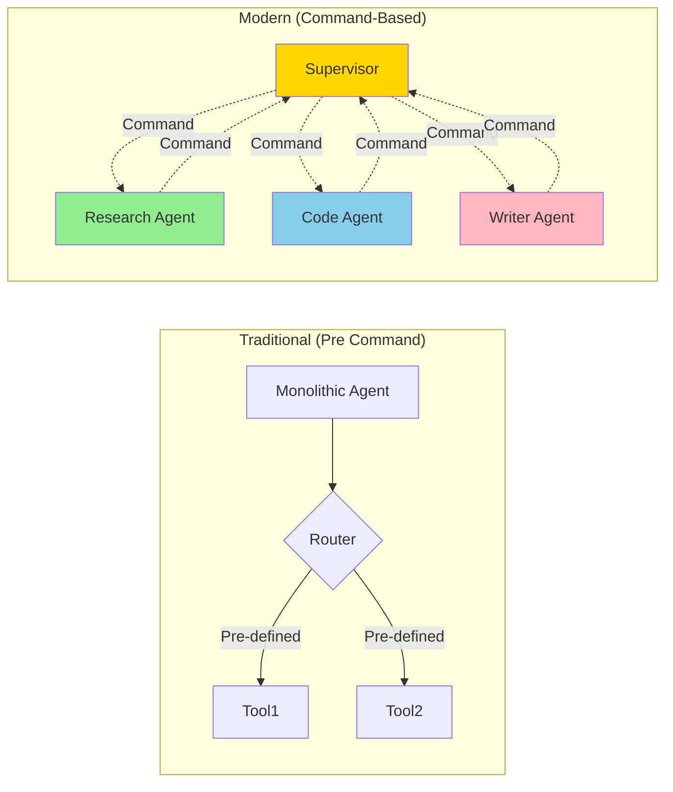
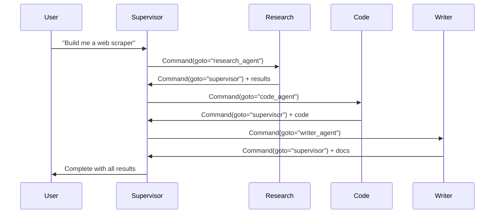

# Module 08: Multi-Agent Systems

**Level:** Expert (Staff Engineer)  
**Duration:** 8-10 hours  
**Prerequisites:** Modules 01-07 completed  
**Updated:** December 2025 - Modern Command-based multi-agent patterns

## Table of Contents
1. [Introduction](#introduction)
2. [Multi-Agent Fundamentals](#multi-agent-fundamentals)
3. [Supervisor-Worker Pattern (Command-Based)](#supervisor-worker-pattern-command-based)
4. [Agent Communication Protocols](#agent-communication-protocols)
5. [Team Topologies](#team-topologies)
6. [Dynamic Agent Handoffs](#dynamic-agent-handoffs)
7. [Production Multi-Agent Systems](#production-multi-agent-systems)
8. [Research Integration](#research-integration)
9. [Best Practices & Optimization](#best-practices--optimization)
10. [Summary & Next Steps](#summary--next-steps)

---

## Introduction

**Multi-agent systems** represent the cutting edge of LangGraph applications, where specialized  agents collaborate to solve complex problems that no single agent could handle alone.

> **🆕 What's New in 2024-2025**
> - Command-based agent handoffs (December 2024)
> - Dynamic multi-agent routing without predefined edges
> - Production deployments at LinkedIn, Uber, Klarna
> - Research: LangGraph+CrewAI, STORM paper applications
> - Swarm patterns and hierarchical agent structures

### Learning Objectives

By the end of this module, you will:
- ✅ Design multi-agent system architectures
- ✅ Implement supervisor-worker patterns with Command
- ✅ Create dynamic agent handoff systems
- ✅ Understand team topologies and communication protocols
- ✅ Build production multi-agent applications
- ✅ Apply latest research to practice
- ✅ Optimize multi-agent performance

---

## Multi-Agent Fundamentals

### Why Multi-Agent Systems?

**Single Agent Limitations:**
- Jack-of-all-trades, master of none
- Context window limitations
- Single point of failure
- Difficult to specialize

**Multi-Agent Benefits:**
- **Specialization**: Each agent expert in specific domain
- **Scalability**: Distribute work across agents
- **Modularity**: Easy to add/remove/update agents
- **Resilience**: Failure of one agent doesn't crash system
- **Collaboration**: Agents work together like human teams

### Architecture Evolution



---

## Supervisor-Worker Pattern (Command-Based)

### The Modern Supervisor Pattern

The supervisor agent dynamically routes work to specialist agents using **Command** for flexible, runtime-determined workflows.

### Implementation

```python
from langgraph.graph import StateGraph, START, END
from langgraph.types import Command
from typing import TypedDict, Literal

class MultiAgentState(TypedDict):
    messages: list
    current_agent: str
    task_type: str
    results: dict
    iteration: int

def supervisor_node(state: MultiAgentState) -> Command:
    """
    Supervisor analyzes task and routes to appropriate specialist.
    Uses Command for dynamic routing - no predefined edges needed!
    """
    last_message = state['messages'][-1]
    
    # Analyze what type of work is needed
    analysis = analyze_task(last_message)
    
    # Determine which specialist agent to activate
    if analysis['needs_research']:
        next_agent = "research_agent"
        task_type = "research"
    elif analysis['needs_code']:
        next_agent = "code_agent"
        task_type = "code_generation"
    elif analysis['needs_writing']:
        next_agent = "writer_agent"
        task_type = "content_creation"
    elif analysis['task_complete']:
        # Work is done
        return Command(
            update={"current_agent": "supervisor", "results": state['results']},
            goto=END
        )
    else:
        # Need clarification
        return Command(
            update={"current_agent": "clarification", "task_type": "clarify"},
            goto="clarification_agent"
        )
    
    # Route to specialist with state update
    return Command(
        update={
            "current_agent": next_agent,
            "task_type": task_type,
            "iteration": state.get('iteration', 0) + 1
        },
        goto=next_agent
    )

def research_agent(state: MultiAgentState) -> Command:
    """Specialist in research and information gathering."""
    query = extract_query(state['messages'])
    
    # Perform research
    research_results = conduct_research(query)
    
    # Add results to state
    updated_results = {
        **state.get('results', {}),
        'research': research_results
    }
    
    # Route back to supervisor with results
    return Command(
        update={
            "messages": state['messages'] + [{
                "role": "assistant",
                "content": f"Research complete: {research_results}",
                "agent": "research"
            }],
            "results": updated_results
        },
        goto="supervisor_node"  # Return to supervisor
    )

def code_agent(state: MultiAgentState) -> Command:
    """Specialist in code generation."""
    requirements = extract_requirements(state['messages'])
    
    # Generate code
    code = generate_code(requirements)
    
    updated_results = {
        **state.get('results', {}),
        'code': code
    }
    
    return Command(
        update={
            "messages": state['messages'] + [{
                "role": "assistant",
                "content": f"Code generated:\n```python\n{code}\n```",
                "agent": "coder"
            }],
            "results": updated_results
        },
        goto="supervisor_node"
    )

def writer_agent(state: MultiAgentState) -> Command:
    """Specialist in content creation."""
    content_brief = extract_brief(state['messages'])
    
    # Create content
    content = write_content(content_brief, state.get('results', {}))
    
    updated_results = {
        **state.get('results', {}),
        'content': content
    }
    
    return Command(
        update={
            "messages": state['messages'] + [{
                "role": "assistant",
                "content": content,
                "agent": "writer"
            }],
            "results": updated_results
        },
        goto="supervisor_node"
    )

# Build multi-agent graph - NO EDGES except START!
workflow = StateGraph(MultiAgentState)

workflow.add_node("supervisor_node", supervisor_node)
workflow.add_node("research_agent", research_agent)
workflow.add_node("code_agent", code_agent)
workflow.add_node("writer_agent", writer_agent)
workflow.add_node("clarification_agent", clarification_agent)

# Only need START edge - Command handles all other routing!
workflow.add_edge(START, "supervisor_node")

app = workflow.compile(checkpointer=MemorySaver())
```

### Execution Flow



---

## Agent Communication Protocols

### Protocol 1: Shared State

Agents communicate via shared state:

```python
class SharedState(TypedDict):
    messages: list  # Conversation history
    shared_memory: dict  # Cross-agent data
    agent_outputs: dict  # Results from each agent
    metadata: dict  # Execution metadata
```

### Protocol 2: Message Passing

```python
class AgentMessage(TypedDict):
    from_agent: str
    to_agent: str
    message_type: Literal["request", "response", "broadcast"]
    content: dict
    priority: int

def agent_with_messaging(state: State) -> Command:
    # Check for messages to this agent
    my_messages = [
        msg for msg in state.get('agent_messages', [])
        if msg['to_agent'] == "my_agent_name"
    ]
    
    # Process messages
    for msg in my_messages:
        handle_message(msg)
    
    # Send response
    response_message = {
        "from_agent": "my_agent_name",
        "to_agent": "supervisor",
        "message_type": "response",
        "content": {"status": "complete"}
    }
    
    return Command(
        update={"agent_messages": state.get('agent_messages', []) + [response_message]},
        goto="supervisor"
    )
```

### Protocol 3: Event-Driven

```python
class Event(TypedDict):
    event_type: str
    source_agent: str
    data: dict
    timestamp: str

def event_driven_agent(state: State) -> Command:
    # React to events
    events = state.get('events', [])
    
    for event in events:
        if event['event_type'] == 'data_ready':
            # Process the data
            result = process(event['data'])
            
            # Emit completion event
            new_event = {
                "event_type": "processing_complete",
                "source_agent": "processor",
                "data": result,
                "timestamp": datetime.now().isoformat()
            }
            
            return Command(
                update={"events": events + [new_event]},
                goto="next_agent"
            )
```

---

## Team Topologies

### Topology 1: Hierarchical (Supervisor-Worker)

```
        Supervisor
       /    |    \
     Res  Code  Write
```

**Use When:**
- Clear task decomposition
- Need centralized coordination
- Tasks are relatively independent

### Topology 2: Sequential Pipeline

```
Research → Analysis → Code → QA → Documentation
```

**Use When:**
- Clear sequential dependencies
- Each stage has distinct output
- Linear workflow

**Implementation:**

```python
def pipeline_agent(state: State, next_stage: str) -> Command:
    # Process current stage
    result = process_stage(state)
    
    # Pass to next stage
    return Command(
        update={"stage_results": {**state['stage_results'], self.name: result}},
        goto=next_stage
    )
```

### Topology 3: Collaborative Swarm

```
    Agent1 ←→ Agent2
      ↕         ↕
    Agent3 ←→ Agent4
```

**Use When:**
- Agents need peer-to-peer collaboration
- No single supervisor
- Emergent behavior desired

**Implementation:**

```python
def swarm_agent(state: State) -> Command:
    # Check what other agents have done
    peer_results = state.get('agent_results', {})
    
    # Decide whether to contribute or delegate
    if should_contribute(peer_results):
        my_contribution = contribute(state)
        updated_results = {**peer_results, self.name: my_contribution}
        next_agent = "myself"  # Continue collaborating
    else:
        # Let another agent handle it
        next_agent = select_best_peer(peer_results, state)
    
    return Command(
        update={"agent_results": updated_results},
        goto=next_agent
    )
```

### Topology 4: Hybrid (Most Common in Production)

```
    Supervisor
       / | \
    Specialized Teams
    /      |      \
Team A   Team B  Team C
(3 agents) (2 agents) (4 agents)
```

---

## Dynamic Agent Handoffs

### Pattern: Conditional Handoffs

```python
def dynamic_handoff_agent(state: State) ->Command:
    """Agent that decides next agent based on runtime conditions."""
    
    # Evaluate current state
    complexity = assess_complexity(state)
    urgency = assess_urgency(state)
    
    if complexity == "high" and urgency == "high":
        # Escalate to senior agent team
        return Command(
            update={"escalation": True, "reason": "high complexity + urgency"},
            goto="senior_agent_supervisor"
        )
    elif complexity == "high":
        # Need specialist
        specialist_type = determine_specialist_needed(state)
        return Command(
            update={"specialist_requested": specialist_type},
            goto=f"{specialist_type}_agent"
        )
    elif urgency == "high":
        # Use fast track
        return Command(
            update={"fast_track": True},
            goto="expedited_processing_agent"
        )
    else:
        # Standard flow
        return Command(
            goto="standard_processing_agent"
        )
```

### Pattern: Load Balancing Handoffs

```python
class LoadBalancedState(TypedDict):
    task_queue: list
    agent_loads: dict  # {agent_name: current_load}

def load_balancer_supervisor(state: LoadBalancedState) -> Command:
    """Distribute work to least-loaded agent."""
    
    # Find agent with lowest load
    available_agents = ["agent_1", "agent_2", "agent_3"]
    loads = state.get('agent_loads', {agent: 0 for agent in available_agents})
    
    least_loaded = min(available_agents, key=lambda a: loads.get(a, 0))
    
    # Assign task to least loaded agent
    task = state['task_queue'][0]
    updated_loads = {**loads, least_loaded: loads.get(least_loaded, 0) + 1}
    
    return Command(
        update={
            "task_queue": state['task_queue'][1:],
            "agent_loads": updated_loads,
            "assigned_to": least_loaded
        },
        goto=least_loaded
    )
```

---

## Production Multi-Agent Systems

### Case Study: LinkedIn's Multi-Agent SQL System

**Architecture:**
```python
# Simplified version of LinkedIn's approach

class SQLSystemState(TypedDict):
    user_query: str
    intent: str
    sql_query: str
    validation_result: dict
    optimized_query: str
    execution_result: dict

def intent_classifier(state) -> Command:
    """Classify user intent (SELECT, JOIN, AGGREGATE, etc.)"""
    intent = classify_nlp(state['user_query'])
    
    return Command(
        update={"intent": intent},
        goto="sql_generator"
    )

def sql_generator(state) -> Command:
    """Generate SQL based on intent."""
    sql = generate_sql(state['user_query'], state['intent'])
    
    return Command(
        update={"sql_query": sql},
        goto="sql_validator"
    )

def sql_validator(state) -> Command:
    """Validate SQL for safety and correctness."""
    validation = validate_sql(state['sql_query'])
    
    if validation['safe'] and validation['correct']:
        return Command(
            update={"validation_result": validation},
            goto="query_optimizer"
        )
    else:
        # Route back to generator with feedback
        return Command(
            update={
                "validation_result": validation,
                "feedback": validation['errors']
            },
            goto="sql_generator"  # Retry with feedback
        )

def query_optimizer(state) -> Command:
    """Optimize SQL for performance."""
    optimized = optimize_query(state['sql_query'])
    
    return Command(
        update={"optimized_query": optimized},
        goto="executor"
    )

def executor(state) -> Command:
    """Execute query safely."""
    result = execute_with_timeout(state['optimized_query'])
    
    return Command(
        update={"execution_result": result},
        goto=END
    )

# Build system
workflow = StateGraph(SQLSystemState)
workflow.add_node("intent_classifier", intent_classifier)
workflow.add_node("sql_generator", sql_generator)
workflow.add_node("sql_validator", sql_validator)
workflow.add_node("query_optimizer", query_optimizer)
workflow.add_node("executor", executor)

workflow.add_edge(START, "intent_classifier")
app = workflow.compile()
```

**Results:**
- 100K+ queries/day
- 95% success rate
- Average query time: 1.2s

### Case Study: Uber's Test Generation System

**Multi-Agent Architecture:**
1. **Test Strategy Agent**: Determines testing approach
2. **Code Analysis Agent**: Understands code to test
3. **Test Generator Agent**: Creates test cases
4. **Coverage Analyzer**: Ensures completeness
5. **Human Reviewer**: Final approval (HITL)

**Key Innovation:** Dynamic routing based on code complexity

---

## Research Integration

### LangGraph + CrewAI (2024 Research)

**Paper**: "Exploration of LLM Multi-Agent Application Implementation Based on LangGraph+CrewAI" (Duan, 2024)

**Key Findings:**
- LangGraph's graph architecture improves information transmission efficiency
- CrewAI enhances team collaboration through intelligent task allocation
- Combined approach outperforms single-framework solutions

**Practical Application:**

```python
# Inspired by research
from crewai import Crew, Agent, Task

def create_research_crew_node(state: State) -> Command:
    """Use CrewAI for collaborative research within LangGraph."""
    
    # Define specialized agents (CrewAI)
    researcher = Agent(role="Researcher", goal="Find information")
    analyst = Agent(role="Analyst", goal="Analyze findings")
    writer = Agent(role="Writer", goal="Synthesize report")
    
    # Define task
    task = Task(
        description=state['research_query'],
        agents=[researcher, analyst, writer]
    )
    
    # Execute crew
    crew = Crew(agents=[researcher, analyst, writer], tasks=[task])
    result = crew.kickoff()
    
    # Return to LangGraph flow
    return Command(
        update={"research_results": result},
        goto="next_stage"
    )
```

### STORM Paper Applications

**Paper**: "Synthesizing Information with a Team of AI Agents"

**Pattern**: From planning to publication with agent team

```python
# STORM-inspired research pipeline
def storm_research_pipeline():
    agents = [
        "topic_planner",      # Plans research approach
        "perspective_agent_1", # Researches from angle 1
        "perspective_agent_2", # Researches from angle 2
        "perspective_agent_3", # Researches from angle 3
        "synthesis_agent",     # Combines perspectives
        "editor_agent"         # Polishes final output
    ]
    
    # Each agent hands off to next via Command
    # Enables comprehensive, multi-perspective research
```

---

## Best Practices & Optimization

### 1. Limit Agent Hops

```python
# ❌ BAD: Too many back-and-forth handoffs
# Supervisor → Agent1 → Supervisor → Agent2 → Supervisor → Agent3...
# (7+ hops for simple task)

# ✅ GOOD: Direct handoffs where possible
# Supervisor → Agent1 → Agent2 → Agent3 → Supervisor
# (5 hops total)
```

### 2. Implement Circuit Breakers

```python
MAX_ITERATIONS = 10

def supervisor_with_circuit_breaker(state) -> Command:
    iteration = state.get('iteration', 0)
    
    if iteration >= MAX_ITERATIONS:
        # Circuit breaker triggered
        return Command(
            update={"error": "Max iterations exceeded", "status": "failed"},
            goto="error_handler"
        )
    
    # Normal routing
    return Command(
        update={"iteration": iteration + 1},
        goto=next_agent
    )
```

### 3. Cache Agent Results

```python
def cached_agent(state: State) -> Command:
    cache_key = f"{self.name}:{hash(str(state['input']))}"
    
    # Check cache
    cached_result = redis.get(cache_key)
    if cached_result:
        return Command(
            update={"result": json.loads(cached_result), "cached": True},
            goto="next_agent"
        )
    
    # Compute if not cached
    result = expensive_operation(state)
    redis.setex(cache_key, 3600, json.dumps(result))  # 1hr TTL
    
    return Command(
        update={"result": result, "cached": False},
        goto="next_agent"
    )
```

### 4. Monitor Agent Performance

```python
from langsmith import traceable

@traceable(name="research_agent", tags=["multi-agent"])
def research_agent(state):
    start_time = time.time()
    
    result = do_research(state)
    
    # Log metrics
    duration = time.time() - start_time
    log_metric("agent.research.duration", duration)
    log_metric("agent.research.tokens", count_tokens(result))
    
    return Command(update={"result": result}, goto="supervisor")
```

### 5. Graceful Degradation

```python
def resilient_agent(state: State) -> Command:
    try:
        result = primary_method(state)
        return Command(update={"result": result}, goto="next")
    except PrimaryServiceError:
        # Fallback to secondary method
        result = fallback_method(state)
        return Command(
            update={"result": result, "used_fallback": True},
            goto="next"
        )
    except Exception as e:
        # Ultimate fallback: skip this agent
        return Command(
            update={"error": str(e), "agent_skipped": True},
            goto="next"
        )
```

---

## Summary & Next Steps

### What You Learned

✅ **Multi-Agent Fundamentals**: Why and when to use multiple agents  
✅ **Supervisor-Worker with Command**: Modern dynamic routing patterns  
✅ **Communication Protocols**: Shared state, messaging, event-driven  
✅ **Team Topologies**: Hierarchical, pipeline, swarm, hybrid  
✅ **Dynamic Handoffs**: Conditional routing and load balancing  
✅ **Production Systems**: LinkedIn, Uber real-world examples  
✅ **Research Integration**: LangGraph+CrewAI, STORM patterns  
✅ **Optimization**: Caching, monitoring, resilience  

### Key Takeaways

1. **Command is Essential** for production multi-agent systems
2. **Choose Right Topology** based on problem structure
3. **Monitor Everything** - agents can hide complexity
4. **Limit Iterations** to prevent infinite loops
5. **Cache Strategically** to reduce costs and latency
6. **Design for Failure** - agents will fail, plan for it
7. **Start Simple** - add agents as needed, not all at once

### Practice Now

Continue to **[module-08-practice.ipynb](./module-08-practice.ipynb)** to build:
- Supervisor-worker multi-agent system
- Dynamic agent handoff system
- Production-ready research pipeline
- Custom team topology

### Final Thoughts

You've completed the **zero-to-staff-engineer LangGraph course**! You now have:
- Deep understanding of LangGraph fundamentals
- Modern 2024-2025 patterns (Command, InjectedState)
- Production deployment knowledge
- Multi-agent system design skills
- Real-world case study insights

**Next Steps:**
1. Build a real project with these concepts
2. Deploy to production using Module 06 patterns
3. Contribute to LangGraph open source
4. Stay updated with LangChain blog and research

---

## Additional Resources

### Documentation
- [LangGraph Multi-Agent Guide](https://python.langchain.com/docs/langgraph/)
- [Command Tool Documentation](https://python.langchain.com/docs/langgraph/)
- [LangSmith Best Practices](https://python.langchain.com/langsmith/)

### Research Papers
- "LangGraph+CrewAI Multi-Agent Implementation" (Duan, 2024)
- "Agent AI with LangGraph for Machine Translation" (Wang & Duan, 2024)
- "STORM: Synthesizing Information with AI Agents" (Stanford, 2024)

### Production Examples
- [LinkedIn SQL Bot Case Study](https://langchain.com/case-studies)
- [Uber Testing Framework](https://langchain.com/blog)
- [Top 5 LangGraph Production Agents 2024](https://langchain.com/blog/agents-2024)

---

**🎉 Congratulations on completing the course! Now go build amazing multi-agent systems! 🚀**
