# Anomaly Detection - Complete Guide (Part 1: Fundamentals & Traditional Methods)

A comprehensive deep-dive into anomaly detection from statistical methods to production deployment, with 2024-2025 SOTA research and legacy best practices.

---

## Table of Contents - Part 1

1. [Introduction](#1-introduction)
2. [Anomaly Detection Fundamentals](#2-anomaly-detection-fundamentals)
3. [Statistical Methods](#3-statistical-methods)
4. [Isolation Forest](#4-isolation-forest)
5. [One-Class SVM](#5-one-class-svm)
6. [Local Outlier Factor (LOF)](#6-local-outlier-factor-lof)
7. [Evaluation Metrics](#7-evaluation-metrics)
8. [Choosing the Right Algorithm](#8-choosing-the-right-algorithm)

**See Part 2 for**: Deep Learning Methods (Autoencoders, VAE, GAN, Transformers), Time Series Anomaly Detection, Production Deployment, and Interview Questions.

---

## 1. Introduction

### What You'll Learn

This comprehensive guide covers anomaly detection techniques from classical methods to state-of-the-art approaches:

- **Traditional Methods**: Statistical, Isolation Forest, One-Class SVM, LOF
- **Evaluation**: Precision-Recall, F1-Score, ROC-AUC for imbalanced data
- **Deep Learning**: Autoencoders, VAE, GAN, Transformers (Part 2)
- **Time Series**: LSTM, Transformers, DTW-based methods (Part 2)
- **Production**: Monitoring, drift detection, retraining strategies (Part 2)
- **Real-world Applications**: Fraud detection, network security, manufacturing

### What is Anomaly Detection?

**Anomaly Detection** identifies rare observations, events, or data points that deviate significantly from the majority of the data. Also known as outlier detection or novelty detection.

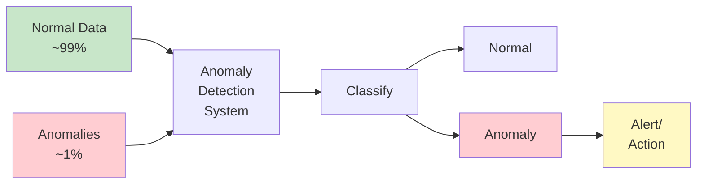

**Key Characteristics**:
- **Unsupervised or Semi-supervised**: Often no labeled anomalies available
- **Imbalanced**: Anomalies are rare (0.01%-5% of data)
- **Dynamic**: What's normal today may be anomalous tomorrow
- **Context-dependent**: Anomaly definition varies by domain

### Types of Anomalies

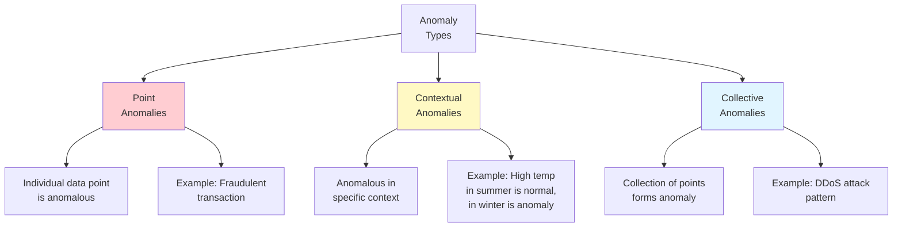

**1. Point Anomalies**:
- Single data instance is anomalous
- Most common type
- Example: Credit card transaction of $50,000 when typical is $50

**2. Contextual Anomalies** (Conditional Anomalies):
- Instance is anomalous in specific context
- Requires contextual and behavioral attributes
- Example: Temperature of 30°C in July (normal) vs. January (anomaly)

**3. Collective Anomalies**:
- Collection of instances is anomalous
- Individual points may not be anomalous
- Example: Sequence of login attempts from different locations

### Real-World Applications

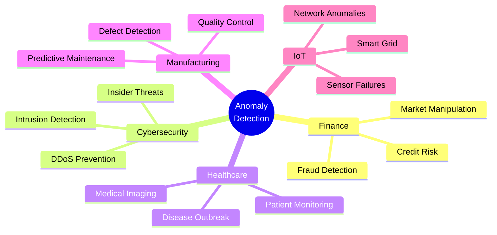

**Industry Examples**:

1. **Finance**: Detecting fraudulent credit card transactions ($28B fraud in 2023)
2. **Cybersecurity**: Network intrusion detection (billions of attacks/year)
3. **Manufacturing**: Predictive maintenance (reduce downtime by 30-50%)
4. **Healthcare**: Early disease detection, patient deterioration
5. **IoT**: Sensor anomalies in smart cities, industrial IoT

### Anomaly Detection vs. Outlier Detection vs. Novelty Detection

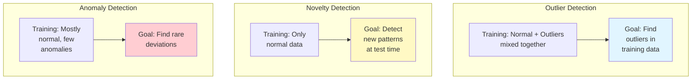

| Aspect | Outlier Detection | Novelty Detection | Anomaly Detection |
|--------|-------------------|-------------------|-------------------|
| **Training Data** | Normal + outliers | Only normal | Mostly normal |
| **Goal** | Find outliers in training | Detect new at test time | Find rare patterns |
| **Contamination** | Expected | Not expected | Low contamination |
| **Examples** | Data cleaning | Fault detection | Fraud detection |
| **Algorithms** | Isolation Forest, LOF | One-Class SVM | Both categories |

**2024 Research Note**: One-Class SVM is best for **novelty detection** on clean data, while Isolation Forest excels at **outlier detection** on contaminated data.

---

## 2. Anomaly Detection Fundamentals

### 2.1 Problem Formulation

**Supervised Anomaly Detection**:
```
Given: Labeled dataset D = {(x₁, y₁), ..., (xₙ, yₙ)}
       where y ∈ {normal, anomaly}
Goal: Learn f: X → Y
Issue: Severe class imbalance (anomalies < 1%)
```

**Unsupervised Anomaly Detection**:
```
Given: Unlabeled dataset D = {x₁, ..., xₙ}
Goal: Learn anomaly score function s: X → ℝ
      Higher score = more anomalous
Decision: Threshold τ where anomaly if s(x) > τ
```

**Semi-supervised Anomaly Detection** (Most Common):
```
Given: Training on mostly normal data
Goal: Detect deviations from learned normal patterns
```

### 2.2 Key Assumptions

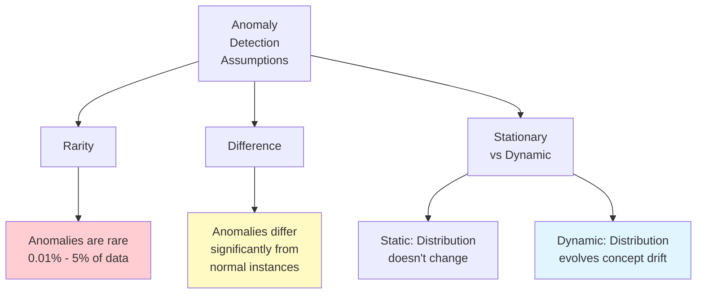

**Rarity Assumption**:
- Anomalies occur much less frequently than normal instances
- Typical ratio: 1:100 to 1:1000
- Violated in: seasonal patterns, new product launches

**Difference Assumption**:
- Anomalies have different feature values than normal
- Measurable via distance, density, or distribution
- Challenged by: adaptive adversaries (fraud evolves)

**Stationarity** (Traditional) vs. **Non-stationarity** (Modern):
- **Static**: Normal distribution fixed over time
- **Dynamic**: Patterns evolve → requires drift detection & retraining

**2024 Production Best Practice**: Always implement drift detection for production anomaly detectors.

### 2.3 Challenges

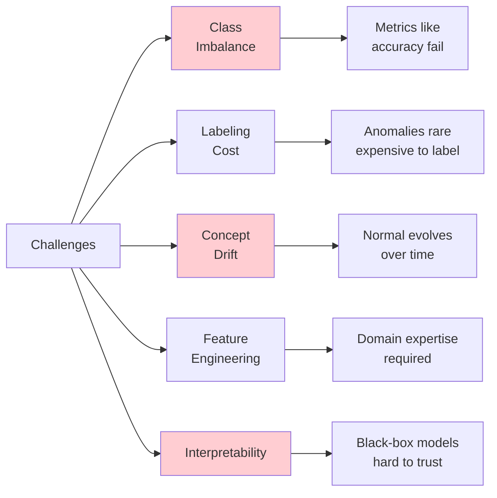

1. **Severe Class Imbalance**:
   - 99:1 or 999:1 ratios common
   - Accuracy is meaningless metric
   - Solution: Use Precision-Recall, F1-Score, PR-AUC

2. **High Labeling Cost**:
   - Anomalies are rare → hard to find for labeling
   - Domain experts needed
   - Solution: Unsupervised or semi-supervised methods

3. **Concept Drift**:
   - Normal behavior changes over time
   - Old models become stale
   - Solution: Continuous monitoring & retraining (Part 2)

4. **High-Dimensional Data**:
   - Curse of dimensionality
   - Distance metrics break down
   - Solution: Dimensionality reduction, feature selection

5. **Interpretability Requirements**:
   - Need to explain "why" for business decisions
   - Black-box models problematic
   - Solution: SHAP, LIME, inherently interpretable models

---

## 3. Statistical Methods

### 3.1 Z-Score (Standard Score)

**Z-Score** measures how many standard deviations a point is from the mean.

```mermaid
graph LR
    A[Data Point x] --> B[Compute:<br/>z = x - μ / σ]
    B --> C{|z| > threshold?}
    C -->|Yes| D[Anomaly]
    C -->|No| E[Normal]

    style D fill:#ffcdd2
    style E fill:#c8e6c9
```

**Formula**:
```
z = (x - μ) / σ

where:
- μ = mean
- σ = standard deviation
- Common threshold: |z| > 3 (99.7% rule)
```

**Assumptions**:
- Data is normally distributed (Gaussian)
- No or few outliers in training data
- Univariate (single feature) or assumes independence

### 3.2 IQR (Interquartile Range)

**IQR** is a robust alternative to Z-score, less sensitive to outliers.

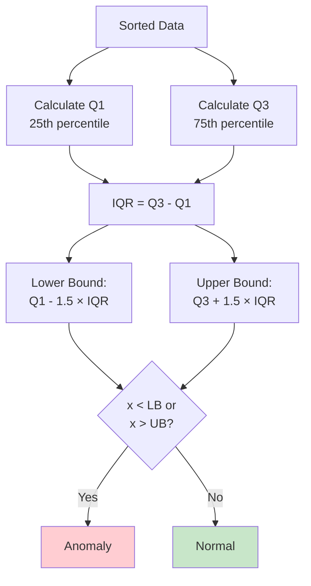

**Advantages**:
- ✅ Robust to outliers (uses quartiles, not mean)
- ✅ No assumption of normal distribution
- ✅ Simple and interpretable

**Disadvantages**:
- ❌ Univariate only (or requires feature independence)
- ❌ Fixed threshold (1.5 × IQR) may not suit all domains
- ❌ Doesn't capture multivariate patterns

### 3.3 Mahalanobis Distance

**Mahalanobis Distance** accounts for correlations between features.

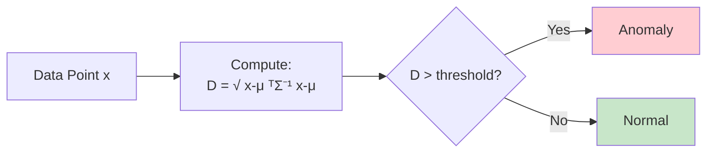

**Formula**:
```
D_M(x) = √((x - μ)ᵀ Σ⁻¹ (x - μ))

where:
- μ = mean vector
- Σ = covariance matrix
- Threshold often based on χ² distribution
```

**Advantages**:
- ✅ Handles correlated features
- ✅ Scale-invariant
- ✅ Multivariate

**Disadvantages**:
- ❌ Assumes normal distribution
- ❌ Requires covariance matrix inversion (O(d³))
- ❌ Sensitive to outliers in training data

### 3.4 Implementation

```python
"""Statistical anomaly detection methods implementation.

Legacy methods (1960s-1990s) still widely used in 2024 for:
- Simple, interpretable baselines
- Real-time systems (low latency)
- Low-dimensional data
"""

from typing import Tuple, Optional
import numpy as np
from numpy.typing import NDArray
from scipy import stats
import matplotlib.pyplot as plt


class StatisticalAnomalyDetector:
    """Statistical methods for anomaly detection.

    Implements Z-score, IQR, and Mahalanobis distance methods.

    Attributes:
        method: Detection method ('zscore', 'iqr', 'mahalanobis').
        threshold: Anomaly threshold.
        mean_: Fitted mean (for zscore/mahalanobis).
        std_: Fitted std (for zscore).
        q1_: First quartile (for IQR).
        q3_: Third quartile (for IQR).
        cov_: Covariance matrix (for mahalanobis).
    """

    def __init__(
        self,
        method: str = 'zscore',
        threshold: Optional[float] = None
    ) -> None:
        """Initialize statistical detector.

        Args:
            method: 'zscore', 'iqr', or 'mahalanobis'.
            threshold: Custom threshold (None = use default).
                - zscore: default 3.0 (3 std devs)
                - iqr: default 1.5 (1.5 × IQR)
                - mahalanobis: default based on χ² distribution
        """
        if method not in ['zscore', 'iqr', 'mahalanobis']:
            raise ValueError(f"Unknown method: {method}")

        self.method = method
        self.threshold = threshold

        # Fitted parameters
        self.mean_: Optional[NDArray[np.float64]] = None
        self.std_: Optional[NDArray[np.float64]] = None
        self.q1_: Optional[NDArray[np.float64]] = None
        self.q3_: Optional[NDArray[np.float64]] = None
        self.cov_: Optional[NDArray[np.float64]] = None

    def fit(self, X: NDArray[np.float64]) -> 'StatisticalAnomalyDetector':
        """Fit detector on normal data.

        Args:
            X: Training data of shape (n_samples, n_features).

        Returns:
            self: Fitted detector.
        """
        if self.method == 'zscore':
            self.mean_ = np.mean(X, axis=0)
            self.std_ = np.std(X, axis=0)

            # Avoid division by zero
            self.std_ = np.where(self.std_ == 0, 1e-10, self.std_)

            if self.threshold is None:
                self.threshold = 3.0  # 3-sigma rule

        elif self.method == 'iqr':
            self.q1_ = np.percentile(X, 25, axis=0)
            self.q3_ = np.percentile(X, 75, axis=0)

            if self.threshold is None:
                self.threshold = 1.5  # Tukey's rule

        elif self.method == 'mahalanobis':
            self.mean_ = np.mean(X, axis=0)
            self.cov_ = np.cov(X.T)

            # Regularize to avoid singular matrix
            self.cov_ += np.eye(self.cov_.shape[0]) * 1e-6

            if self.threshold is None:
                # Use χ² distribution (95th percentile)
                self.threshold = stats.chi2.ppf(0.95, df=X.shape[1])

        return self

    def anomaly_score(self, X: NDArray[np.float64]) -> NDArray[np.float64]:
        """Compute anomaly scores.

        Args:
            X: Data of shape (n_samples, n_features).

        Returns:
            Anomaly scores of shape (n_samples,).
            Higher score = more anomalous.
        """
        if self.method == 'zscore':
            # Z-score (max across features for multivariate)
            z_scores = np.abs((X - self.mean_) / self.std_)
            return np.max(z_scores, axis=1)

        elif self.method == 'iqr':
            # IQR-based score
            iqr = self.q3_ - self.q1_
            lower_bound = self.q1_ - self.threshold * iqr
            upper_bound = self.q3_ + self.threshold * iqr

            # Compute violation magnitude
            lower_violation = np.maximum(0, lower_bound - X)
            upper_violation = np.maximum(0, X - upper_bound)

            violations = lower_violation + upper_violation
            return np.max(violations, axis=1)

        elif self.method == 'mahalanobis':
            # Mahalanobis distance
            diff = X - self.mean_
            cov_inv = np.linalg.inv(self.cov_)

            scores = np.sqrt(np.sum(diff @ cov_inv * diff, axis=1))
            return scores

        return np.array([])

    def predict(self, X: NDArray[np.float64]) -> NDArray[np.int32]:
        """Predict anomalies.

        Args:
            X: Data of shape (n_samples, n_features).

        Returns:
            Binary labels (1 = anomaly, 0 = normal).
        """
        scores = self.anomaly_score(X)
        return (scores > self.threshold).astype(np.int32)

    def fit_predict(self, X: NDArray[np.float64]) -> NDArray[np.int32]:
        """Fit and predict in one step.

        Args:
            X: Data of shape (n_samples, n_features).

        Returns:
            Binary labels.
        """
        self.fit(X)
        return self.predict(X)


def visualize_statistical_methods(
    X: NDArray[np.float64],
    y_true: Optional[NDArray[np.int32]] = None
) -> None:
    """Compare statistical methods visually (2D only).

    Args:
        X: Data of shape (n_samples, 2).
        y_true: True labels (optional, for comparison).
    """
    if X.shape[1] != 2:
        print("Visualization only for 2D data")
        return

    methods = ['zscore', 'iqr', 'mahalanobis']
    fig, axes = plt.subplots(1, 3, figsize=(18, 5))

    for idx, method in enumerate(methods):
        ax = axes[idx]

        # Fit and predict
        detector = StatisticalAnomalyDetector(method=method)
        detector.fit(X)
        predictions = detector.predict(X)
        scores = detector.anomaly_score(X)

        # Plot
        scatter = ax.scatter(
            X[:, 0], X[:, 1],
            c=scores,
            cmap='RdYlGn_r',
            alpha=0.6,
            edgecolors='k',
            linewidth=0.5
        )

        # Highlight predictions
        anomalies = predictions == 1
        if anomalies.any():
            ax.scatter(
                X[anomalies, 0],
                X[anomalies, 1],
                c='red',
                marker='x',
                s=100,
                linewidth=2,
                label='Detected Anomalies'
            )

        ax.set_xlabel('Feature 1')
        ax.set_ylabel('Feature 2')
        ax.set_title(f'{method.upper()}\n(Threshold: {detector.threshold:.2f})')
        ax.legend()
        ax.grid(True, alpha=0.3)
        plt.colorbar(scatter, ax=ax, label='Anomaly Score')

    plt.tight_layout()
    plt.savefig('statistical_methods_comparison.png', dpi=300, bbox_inches='tight')
    plt.close()


# Example usage
if __name__ == "__main__":
    from sklearn.datasets import make_blobs

    # Generate data
    np.random.seed(42)
    X_normal, _ = make_blobs(n_samples=500, centers=1, cluster_std=1.0, random_state=42)

    # Add anomalies
    X_anomalies = np.random.uniform(-8, 8, size=(50, 2))
    X = np.vstack([X_normal, X_anomalies])
    y_true = np.hstack([np.zeros(500), np.ones(50)]).astype(np.int32)

    # Test each method
    for method in ['zscore', 'iqr', 'mahalanobis']:
        print(f"\n=== {method.upper()} Method ===")

        detector = StatisticalAnomalyDetector(method=method)
        detector.fit(X_normal)  # Fit on normal data only

        predictions = detector.predict(X)
        scores = detector.anomaly_score(X)

        # Metrics
        from sklearn.metrics import precision_score, recall_score, f1_score

        precision = precision_score(y_true, predictions)
        recall = recall_score(y_true, predictions)
        f1 = f1_score(y_true, predictions)

        print(f"Precision: {precision:.3f}")
        print(f"Recall: {recall:.3f}")
        print(f"F1-Score: {f1:.3f}")
        print(f"Anomalies detected: {predictions.sum()}/{len(predictions)}")

    # Visualize
    visualize_statistical_methods(X, y_true)
```

### 3.5 When to Use Statistical Methods

**Use Statistical Methods when**:
- ✅ Need simple, interpretable baseline
- ✅ Low-dimensional data (d < 20)
- ✅ Real-time requirements (microsecond latency)
- ✅ Data approximately follows known distribution

**Avoid when**:
- ❌ High-dimensional data (curse of dimensionality)
- ❌ Complex multivariate dependencies
- ❌ Non-Gaussian distributions
- ❌ Training data contains outliers

**2024 Best Practice**: Start with statistical methods as baseline, then compare to machine learning approaches.

---

## 4. Isolation Forest

### 4.1 How Isolation Forest Works

**Isolation Forest** (2008, still SOTA in 2024) isolates anomalies using random binary trees.

**Key Insight**: Anomalies are **few and different**, so they are easier to isolate than normal points.

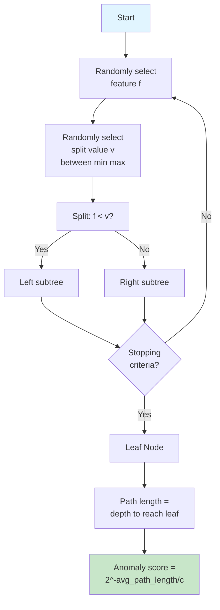

**Algorithm**:

1. **Training Phase**:
   ```
   For each tree in forest:
     - Randomly sample subset of data
     - Build isolation tree:
       * Randomly select feature
       * Randomly select split value
       * Recursively split until:
         - Node has 1 point, OR
         - All points identical, OR
         - Max depth reached
   ```

2. **Scoring Phase**:
   ```
   For each point x:
     - Pass through all trees
     - Record path length to reach leaf
     - Shorter path → more anomalous

   Anomaly score:
     s(x) = 2^(-E[h(x)] / c(n))

   where:
     - E[h(x)] = average path length across trees
     - c(n) = average path length of unsuccessful search in BST
     - s(x) ≈ 1: anomaly
     - s(x) < 0.5: normal
   ```

### 4.2 Why Isolation Forest Works

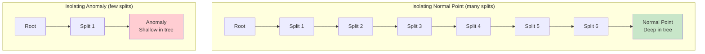

**Intuition**:
- **Normal points**: Dense regions → many splits needed → long paths
- **Anomalies**: Sparse regions → few splits needed → short paths

### 4.3 Advantages and Limitations

**Advantages** (Why it's still SOTA in 2024):
- ✅ **Fast**: Log-linear time complexity O(n log n) training, O(log n) prediction
  - More precisely: O(t × ψ × log ψ) where t = n_estimators, ψ = max_samples
  - Default max_samples = min(256, n) keeps training fast even for large n
- ✅ **Scalable**: Handles millions of samples
- ✅ **No distance metric**: Works in high dimensions
- ✅ **Handles mixed types**: Numerical + categorical features
- ✅ **Low memory**: Only stores tree structures
- ✅ **Multi-modal data**: Works with multiple clusters

**Reference**: Liu, F.T., Ting, K.M. and Zhou, Z.H., "Isolation forest" (ICDM 2008); scikit-learn documentation (2024)

**2024 Research Findings**:
- **Isolation Forest + LOF** perform "reasonably well for multi-modal data"
- **Faster than One-Class SVM**, especially for large datasets
- **Extended Isolation Forest** (2025) adds interpretability with adaptive thresholds

**Limitations**:
- ❌ Random splits → some variance in results
- ❌ Less effective for high-density anomalies
- ❌ Global anomalies only (not good for local anomalies)

### 4.4 Implementation

```python
"""Isolation Forest implementation with production best practices.

2024 Research: Isolation Forest remains state-of-the-art for:
- Fast anomaly detection on large datasets
- Multi-modal data
- High-dimensional data
- Mixed data types
"""

from typing import Tuple, Optional
import numpy as np
from numpy.typing import NDArray
from sklearn.ensemble import IsolationForest
from sklearn.preprocessing import StandardScaler
from sklearn.metrics import (
    precision_score,
    recall_score,
    f1_score,
    average_precision_score,
    roc_auc_score
)
import matplotlib.pyplot as plt
import logging

logging.basicConfig(level=logging.INFO)
logger = logging.getLogger(__name__)


class ProductionIsolationForest:
    """Production-ready Isolation Forest with best practices.

    2024 Best Practices:
    - Standardization for mixed-scale features
    - Contamination parameter tuning
    - Multiple random seeds for stability
    - Comprehensive metrics for imbalanced data

    Attributes:
        contamination: Expected proportion of anomalies.
        n_estimators: Number of trees.
        max_samples: Samples per tree.
        random_state: Random seed.
        scaler_: Fitted scaler.
        model_: Fitted Isolation Forest.
    """

    def __init__(
        self,
        contamination: float = 0.01,
        n_estimators: int = 100,
        max_samples: str = 'auto',
        random_state: Optional[int] = 42
    ) -> None:
        """Initialize Production Isolation Forest.

        Args:
            contamination: Expected anomaly proportion (0.0-0.5).
                - 0.01 = 1% anomalies (common)
                - 0.05 = 5% anomalies
                - 'auto' = determine from threshold
            n_estimators: Number of trees in forest.
                - More trees → more stable but slower
                - 100 is good default
            max_samples: Samples to train each tree.
                - 'auto' = min(256, n_samples)
                - int = fixed number
                - Good for large datasets (subsample)
            random_state: Random seed for reproducibility.
        """
        self.contamination = contamination
        self.n_estimators = n_estimators
        self.max_samples = max_samples
        self.random_state = random_state

        self.scaler_: Optional[StandardScaler] = None
        self.model_: Optional[IsolationForest] = None

        # Note: contamination parameter changed from 0.1 to 'auto' in scikit-learn 0.22
        # Reference: https://scikit-learn.org/stable/modules/generated/sklearn.ensemble.IsolationForest.html

    def fit(
        self,
        X: NDArray[np.float64],
        standardize: bool = True
    ) -> 'ProductionIsolationForest':
        """Fit Isolation Forest.

        2024 Best Practice: Always standardize features for consistent behavior.

        Args:
            X: Training data (mostly normal).
            standardize: Whether to standardize features.

        Returns:
            self: Fitted detector.
        """
        logger.info(f"Fitting Isolation Forest on {len(X)} samples...")

        # Standardization
        if standardize:
            self.scaler_ = StandardScaler()
            X_scaled = self.scaler_.fit_transform(X)
        else:
            X_scaled = X

        # Fit Isolation Forest
        self.model_ = IsolationForest(
            n_estimators=self.n_estimators,
            max_samples=self.max_samples,
            contamination=self.contamination,
            random_state=self.random_state,
            n_jobs=-1,  # Use all cores
            warm_start=False
        )

        self.model_.fit(X_scaled)

        logger.info("Isolation Forest fitted successfully")
        return self

    def predict(self, X: NDArray[np.float64]) -> NDArray[np.int32]:
        """Predict anomalies.

        Args:
            X: Data to predict.

        Returns:
            Binary labels (1 = anomaly, 0 = normal).
        """
        if self.model_ is None:
            raise ValueError("Model not fitted yet")

        # Transform
        if self.scaler_ is not None:
            X_scaled = self.scaler_.transform(X)
        else:
            X_scaled = X

        # Predict (-1 = anomaly, 1 = normal in sklearn)
        predictions = self.model_.predict(X_scaled)

        # Convert to (1 = anomaly, 0 = normal)
        return (predictions == -1).astype(np.int32)

    def anomaly_score(self, X: NDArray[np.float64]) -> NDArray[np.float64]:
        """Compute anomaly scores.

        Args:
            X: Data to score.

        Returns:
            Anomaly scores (higher = more anomalous).
            Range: approximately [-0.5, 0.5+]
        """
        if self.model_ is None:
            raise ValueError("Model not fitted yet")

        # Transform
        if self.scaler_ is not None:
            X_scaled = self.scaler_.transform(X)
        else:
            X_scaled = X

        # Score (sklearn returns negative scores)
        scores = -self.model_.score_samples(X_scaled)

        return scores

    def fit_predict(self, X: NDArray[np.float64]) -> NDArray[np.int32]:
        """Fit and predict in one step.

        Args:
            X: Training data.

        Returns:
            Binary labels.
        """
        self.fit(X)
        return self.predict(X)


def tune_contamination_parameter(
    X_train: NDArray[np.float64],
    y_train: NDArray[np.int32],
    contamination_range: list = [0.001, 0.005, 0.01, 0.02, 0.05, 0.1]
) -> float:
    """Find optimal contamination parameter.

    2024 Best Practice: Tune contamination on validation set with known labels.

    Args:
        X_train: Training data.
        y_train: True labels (1 = anomaly).
        contamination_range: Values to test.

    Returns:
        Optimal contamination value.
    """
    logger.info("Tuning contamination parameter...")

    results = []

    for contamination in contamination_range:
        detector = ProductionIsolationForest(
            contamination=contamination,
            n_estimators=100,
            random_state=42
        )

        detector.fit(X_train)
        predictions = detector.predict(X_train)

        # Metrics
        precision = precision_score(y_train, predictions, zero_division=0)
        recall = recall_score(y_train, predictions, zero_division=0)
        f1 = f1_score(y_train, predictions, zero_division=0)

        results.append({
            'contamination': contamination,
            'precision': precision,
            'recall': recall,
            'f1': f1
        })

        logger.info(
            f"Contamination={contamination:.3f}: "
            f"P={precision:.3f}, R={recall:.3f}, F1={f1:.3f}"
        )

    # Select based on F1-score
    best_idx = np.argmax([r['f1'] for r in results])
    optimal_contamination = results[best_idx]['contamination']

    logger.info(f"\nOptimal contamination: {optimal_contamination:.3f}")

    # Visualization
    fig, axes = plt.subplots(1, 3, figsize=(15, 4))

    contam_values = [r['contamination'] for r in results]

    axes[0].plot(contam_values, [r['precision'] for r in results], 'bo-')
    axes[0].axvline(optimal_contamination, color='r', linestyle='--')
    axes[0].set_xlabel('Contamination')
    axes[0].set_ylabel('Precision')
    axes[0].set_xscale('log')
    axes[0].grid(True, alpha=0.3)

    axes[1].plot(contam_values, [r['recall'] for r in results], 'go-')
    axes[1].axvline(optimal_contamination, color='r', linestyle='--')
    axes[1].set_xlabel('Contamination')
    axes[1].set_ylabel('Recall')
    axes[1].set_xscale('log')
    axes[1].grid(True, alpha=0.3)

    axes[2].plot(contam_values, [r['f1'] for r in results], 'ro-')
    axes[2].axvline(optimal_contamination, color='r', linestyle='--')
    axes[2].set_xlabel('Contamination')
    axes[2].set_ylabel('F1-Score')
    axes[2].set_xscale('log')
    axes[2].grid(True, alpha=0.3)

    plt.tight_layout()
    plt.savefig('isolation_forest_contamination_tuning.png', dpi=300, bbox_inches='tight')
    plt.close()

    return optimal_contamination


def evaluate_isolation_forest(
    detector: ProductionIsolationForest,
    X_test: NDArray[np.float64],
    y_test: NDArray[np.int32]
) -> dict:
    """Comprehensive evaluation for imbalanced anomaly detection.

    2024 Best Practice: Use PR-AUC and F1 for imbalanced data, not accuracy.

    Args:
        detector: Fitted detector.
        X_test: Test data.
        y_test: True labels.

    Returns:
        Dictionary of evaluation metrics.
    """
    # Predictions
    predictions = detector.predict(X_test)
    scores = detector.anomaly_score(X_test)

    # Metrics
    metrics = {
        'precision': precision_score(y_test, predictions, zero_division=0),
        'recall': recall_score(y_test, predictions, zero_division=0),
        'f1_score': f1_score(y_test, predictions, zero_division=0),
        'pr_auc': average_precision_score(y_test, scores),
        'roc_auc': roc_auc_score(y_test, scores),
        'n_anomalies_detected': predictions.sum(),
        'n_anomalies_true': y_test.sum()
    }

    logger.info("\n=== Isolation Forest Evaluation ===")
    logger.info(f"Precision: {metrics['precision']:.3f}")
    logger.info(f"Recall: {metrics['recall']:.3f}")
    logger.info(f"F1-Score: {metrics['f1_score']:.3f}")
    logger.info(f"PR-AUC: {metrics['pr_auc']:.3f} (primary metric for imbalanced)")
    logger.info(f"ROC-AUC: {metrics['roc_auc']:.3f}")
    logger.info(f"Anomalies: {metrics['n_anomalies_detected']}/{len(y_test)} "
               f"(True: {metrics['n_anomalies_true']})")

    return metrics


# Example usage
if __name__ == "__main__":
    from sklearn.datasets import make_blobs

    # Generate imbalanced data
    np.random.seed(42)

    # Normal data (99%)
    X_normal, _ = make_blobs(
        n_samples=9900,
        centers=3,
        cluster_std=1.0,
        random_state=42
    )

    # Anomalies (1%)
    X_anomalies = np.random.uniform(-10, 10, size=(100, 2))

    # Combine
    X = np.vstack([X_normal, X_anomalies])
    y = np.hstack([np.zeros(9900), np.ones(100)]).astype(np.int32)

    # Split
    from sklearn.model_selection import train_test_split
    X_train, X_test, y_train, y_test = train_test_split(
        X, y, test_size=0.3, random_state=42, stratify=y
    )

    print("=== Isolation Forest Demo ===")
    print(f"Training samples: {len(X_train)} (anomalies: {y_train.sum()})")
    print(f"Test samples: {len(X_test)} (anomalies: {y_test.sum()})")

    # Tune contamination
    optimal_contamination = tune_contamination_parameter(
        X_train, y_train,
        contamination_range=[0.001, 0.005, 0.01, 0.02, 0.05]
    )

    # Train with optimal contamination
    detector = ProductionIsolationForest(
        contamination=optimal_contamination,
        n_estimators=100
    )
    detector.fit(X_train)

    # Evaluate
    metrics = evaluate_isolation_forest(detector, X_test, y_test)
```

### 4.5 Extended Isolation Forest (2024)

**Extended Isolation Forest (EIF)** improves upon standard Isolation Forest with better splits and interpretability.

**Original EIF** (Hariri et al., 2019):
- Uses **hyperplane splits** instead of axis-aligned splits
- Better performance on complex, non-axis-aligned anomalies
- Available: `github.com/sahandha/eif`

**ExIFFI (2024 - Latest)**: Extended Isolation Forest Feature Importance

**Key Features** (from "Enhancing Interpretability and Generalizability in Extended Isolation Forests", 2024):
- **Global interpretability**: Feature importance across all predictions
- **Local interpretability**: Explains individual anomaly predictions
- **AUC_FS metric**: Novel metric for evaluating interpretability quality
- **Performance**: Outperforms standard interpretability methods on 8 of 11 real-world datasets

**EIF+ (2024 Enhanced Version)**:
- Revised splitting strategy for better generalization
- **Consistently outperforms EIF** across all datasets when trained without anomalies
- Better at detecting **unseen anomalies**

**When to Use** (2024 Best Practice):
- ✅ Need to **explain why** a point is anomalous (regulatory compliance, trust)
- ✅ Want feature importance for anomaly detection
- ✅ Axis-aligned splits (standard IF) insufficient for your data

**Implementation**: Open-source at `github.com/alessioarcudi/ExIFFI`

**Reference**: Arcudi et al., "Enhancing interpretability and generalizability in extended isolation forests" (2024)

---

## 5. One-Class SVM

### 5.1 How One-Class SVM Works

**One-Class SVM** learns a decision boundary around normal data in high-dimensional space.

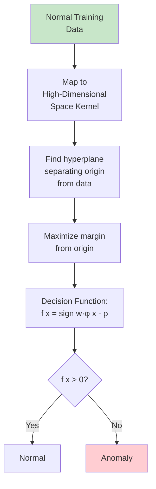

**Mathematical Formulation**:

```
Minimize: (1/2)||w||² + (1/νn)Σξᵢ - ρ

Subject to: w·φ(xᵢ) ≥ ρ - ξᵢ, ξᵢ ≥ 0

where:
- φ(x) = kernel mapping
- ν ∈ (0,1) = upper bound on fraction of outliers
- ρ = offset from origin
- ξᵢ = slack variables
```

**Key Idea**: Separate training data from origin in feature space, maximizing margin.

### 5.2 Kernel Functions

```mermaid
graph TD
    A[Kernel<br/>Functions] --> B[RBF Gaussian]
    A --> C[Polynomial]
    A --> D[Linear]
    A --> E[Sigmoid]

    B --> B1[K x,y = exp-γ||x-y||² ]
    B --> B2[Most common<br/>Non-linear boundary]

    C --> C1[K x,y = γx·y + r ^d]
    C --> C2[Degree d polynomial]

    D --> D1[K x,y = x·y]
    D --> D2[Fast but linear]

    E --> E1[K x,y = tanh γx·y + r ]
    E --> E2[Neural network-like]

    style B fill:#c8e6c9
```

**RBF (Radial Basis Function)** - Most Common:
```
K(x, y) = exp(-γ ||x - y||²)

where γ = 1 / (2σ²)
- Small γ → smooth boundary
- Large γ → complex boundary (overfitting risk)
```

### 5.3 One-Class SVM vs. Isolation Forest

**2024 Research Findings**:

| Feature | One-Class SVM | Isolation Forest |
|---------|---------------|------------------|
| **Speed** | Slow: O(n²) to O(n³) | Fast: O(n log n) |
| **Scalability** | Poor (n < 10,000) | Excellent (n > 1M) |
| **Training Data** | **Clean data only** | Handles contamination |
| **Use Case** | **Novelty detection** | **Outlier detection** |
| **High Dimensions** | Handles via kernel | Handles naturally |
| **Interpretability** | Support vectors | Feature splits |

**When to Use One-Class SVM**:
- ✅ Training data is **clean** (no anomalies)
- ✅ **Novelty detection** at test time
- ✅ Small dataset (n < 10,000)
- ✅ Need smooth, continuous decision boundary

**When to Use Isolation Forest**:
- ✅ Training data may contain **some outliers**
- ✅ Large dataset (n > 10,000)
- ✅ Need **fast** training and prediction
- ✅ **Multi-modal** data

**Official scikit-learn Documentation** (2024):
> "This estimator is best suited for novelty detection when the training set is not contaminated by outliers. The svm.OneClassSVM is known to be sensitive to outliers and thus does not perform very well for outlier detection."

**Reference**: https://scikit-learn.org/stable/modules/outlier_detection.html

### 5.4 Implementation

```python
"""One-Class SVM implementation with production best practices.

2024 Use Case: Best for novelty detection on clean training data.
"""

from typing import Tuple, Optional
import numpy as np
from numpy.typing import NDArray
from sklearn.svm import OneClassSVM
from sklearn.preprocessing import StandardScaler
from sklearn.model_selection import GridSearchCV
from sklearn.metrics import make_scorer, f1_score
import matplotlib.pyplot as plt
import logging

logging.basicConfig(level=logging.INFO)
logger = logging.getLogger(__name__)


class ProductionOneClassSVM:
    """Production One-Class SVM for novelty detection.

    2024 Best Practice: Use only when training data is clean (no anomalies).

    Attributes:
        nu: Upper bound on fraction of training errors.
        kernel: Kernel type.
        gamma: Kernel coefficient.
        scaler_: Fitted scaler.
        model_: Fitted One-Class SVM.
    """

    def __init__(
        self,
        nu: float = 0.01,
        kernel: str = 'rbf',
        gamma: str = 'scale'
    ) -> None:
        """Initialize One-Class SVM.

        Args:
            nu: Upper bound on fraction of outliers (0 < nu ≤ 1).
                - 0.01 = expect ≤1% outliers
                - Also lower bound on fraction of support vectors
            kernel: Kernel type ('rbf', 'linear', 'poly', 'sigmoid').
            gamma: Kernel coefficient.
                - 'scale' = 1 / (n_features * X.var()) [default]
                - 'auto' = 1 / n_features
                - float = custom value
        """
        self.nu = nu
        self.kernel = kernel
        self.gamma = gamma

        self.scaler_: Optional[StandardScaler] = None
        self.model_: Optional[OneClassSVM] = None

    def fit(
        self,
        X: NDArray[np.float64],
        standardize: bool = True
    ) -> 'ProductionOneClassSVM':
        """Fit One-Class SVM on normal data.

        WARNING: Training data must NOT contain anomalies.

        Args:
            X: Training data (normal instances only).
            standardize: Whether to standardize features.

        Returns:
            self: Fitted detector.
        """
        logger.info(f"Fitting One-Class SVM on {len(X)} samples...")
        logger.warning("Ensure training data contains ONLY normal instances")

        # Standardization (critical for SVM)
        if standardize:
            self.scaler_ = StandardScaler()
            X_scaled = self.scaler_.fit_transform(X)
        else:
            X_scaled = X

        # Fit One-Class SVM
        self.model_ = OneClassSVM(
            nu=self.nu,
            kernel=self.kernel,
            gamma=self.gamma
        )

        self.model_.fit(X_scaled)

        n_support = len(self.model_.support_)
        logger.info(f"Fitted with {n_support}/{len(X)} support vectors")

        return self

    def predict(self, X: NDArray[np.float64]) -> NDArray[np.int32]:
        """Predict novelties.

        Args:
            X: Data to predict.

        Returns:
            Binary labels (1 = novelty/anomaly, 0 = normal).
        """
        if self.model_ is None:
            raise ValueError("Model not fitted yet")

        # Transform
        if self.scaler_ is not None:
            X_scaled = self.scaler_.transform(X)
        else:
            X_scaled = X

        # Predict (-1 = novelty, 1 = normal in sklearn)
        predictions = self.model_.predict(X_scaled)

        # Convert to (1 = anomaly, 0 = normal)
        return (predictions == -1).astype(np.int32)

    def decision_function(self, X: NDArray[np.float64]) -> NDArray[np.float64]:
        """Compute decision function (anomaly scores).

        Args:
            X: Data to score.

        Returns:
            Signed distances to decision boundary.
            Negative = novelty/anomaly.
        """
        if self.model_ is None:
            raise ValueError("Model not fitted yet")

        # Transform
        if self.scaler_ is not None:
            X_scaled = self.scaler_.transform(X)
        else:
            X_scaled = X

        # Decision function (negative = anomaly)
        scores = self.model_.decision_function(X_scaled)

        return -scores  # Flip sign for consistency (higher = more anomalous)


def tune_one_class_svm(
    X_train: NDArray[np.float64],
    X_val: NDArray[np.float64],
    y_val: NDArray[np.int32]
) -> dict:
    """Tune One-Class SVM hyperparameters.

    2024 Best Practice: Tune nu and gamma on validation set.

    Args:
        X_train: Training data (normal only).
        X_val: Validation data (with anomalies).
        y_val: Validation labels.

    Returns:
        Best parameters.
    """
    logger.info("Tuning One-Class SVM hyperparameters...")

    # Standardize
    scaler = StandardScaler()
    X_train_scaled = scaler.fit_transform(X_train)
    X_val_scaled = scaler.transform(X_val)

    # Parameter grid
    param_grid = {
        'nu': [0.001, 0.01, 0.05, 0.1],
        'gamma': ['scale', 'auto', 0.01, 0.1, 1.0]
    }

    # Custom scorer for imbalanced data
    def custom_scorer(estimator, X, y):
        predictions = estimator.predict(X)
        predictions = (predictions == -1).astype(np.int32)
        return f1_score(y, predictions, zero_division=0)

    # Grid search
    grid_search = GridSearchCV(
        OneClassSVM(kernel='rbf'),
        param_grid,
        scoring=make_scorer(custom_scorer),
        cv=3,  # Note: CV on normal data only
        n_jobs=-1,
        verbose=1
    )

    grid_search.fit(X_train_scaled)

    best_params = grid_search.best_params_
    logger.info(f"Best parameters: {best_params}")

    # Evaluate best model on validation set
    best_model = grid_search.best_estimator_
    val_predictions = best_model.predict(X_val_scaled)
    val_predictions = (val_predictions == -1).astype(np.int32)

    from sklearn.metrics import precision_score, recall_score

    precision = precision_score(y_val, val_predictions, zero_division=0)
    recall = recall_score(y_val, val_predictions, zero_division=0)
    f1 = f1_score(y_val, val_predictions, zero_division=0)

    logger.info(f"Validation: P={precision:.3f}, R={recall:.3f}, F1={f1:.3f}")

    return best_params


# Example: Novelty detection scenario
if __name__ == "__main__":
    from sklearn.datasets import make_blobs

    np.random.seed(42)

    # Training: ONLY normal data (critical for One-Class SVM)
    X_train_normal, _ = make_blobs(
        n_samples=1000,
        centers=1,
        cluster_std=1.0,
        random_state=42
    )

    # Test: normal + novelties
    X_test_normal, _ = make_blobs(
        n_samples=900,
        centers=1,
        cluster_std=1.0,
        random_state=43
    )
    X_test_novelties = np.random.uniform(-8, 8, size=(100, 2))

    X_test = np.vstack([X_test_normal, X_test_novelties])
    y_test = np.hstack([np.zeros(900), np.ones(100)]).astype(np.int32)

    print("=== One-Class SVM: Novelty Detection ===")
    print(f"Training: {len(X_train_normal)} normal samples (NO anomalies)")
    print(f"Test: {len(X_test)} samples ({y_test.sum()} novelties)")

    # Tune parameters
    best_params = tune_one_class_svm(
        X_train_normal,
        X_test,
        y_test
    )

    # Train with best parameters
    detector = ProductionOneClassSVM(**best_params)
    detector.fit(X_train_normal)

    # Predict
    predictions = detector.predict(X_test)
    scores = detector.decision_function(X_test)

    # Evaluate
    from sklearn.metrics import precision_score, recall_score, f1_score

    precision = precision_score(y_test, predictions, zero_division=0)
    recall = recall_score(y_test, predictions, zero_division=0)
    f1 = f1_score(y_test, predictions, zero_division=0)

    print(f"\nFinal Results:")
    print(f"Precision: {precision:.3f}")
    print(f"Recall: {recall:.3f}")
    print(f"F1-Score: {f1:.3f}")
    print(f"Novelties detected: {predictions.sum()}/{len(predictions)}")
```

---

## 6. Local Outlier Factor (LOF)

### 6.1 How LOF Works

**LOF** identifies anomalies based on local density deviation.

**Key Idea**: Anomalies have lower density than their neighbors.

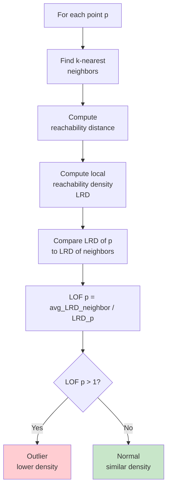

**Algorithm Steps**:

1. **k-distance**: Distance to k-th nearest neighbor

2. **Reachability Distance**:
   ```
   reach-dist_k(A, B) = max(k-distance(B), d(A,B))
   ```

3. **Local Reachability Density (LRD)**:
   ```
   LRD_k(A) = 1 / (avg reach-dist from A to neighbors)
   ```

4. **Local Outlier Factor**:
   ```
   LOF_k(A) = avg(LRD(neighbor)) / LRD(A)

   - LOF ≈ 1: similar density to neighbors (normal)
   - LOF >> 1: much lower density (outlier)
   - LOF < 1: higher density (core of cluster)
   ```

### 6.2 LOF Interpretation

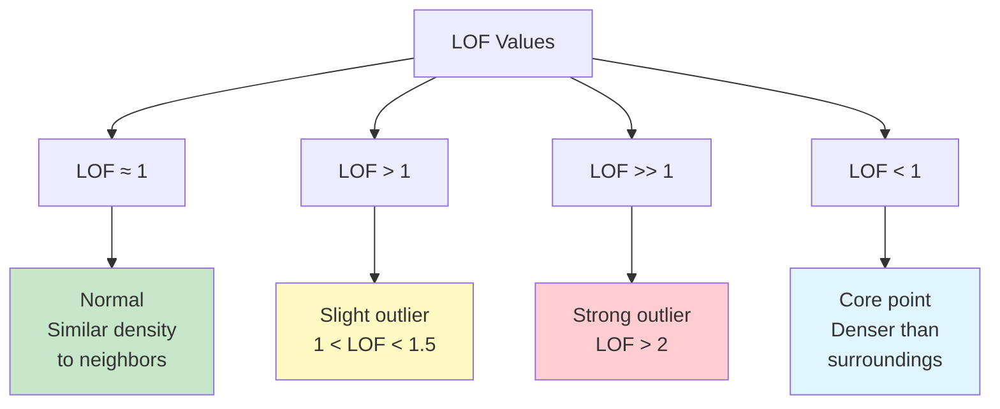

### 6.3 Advantages and Limitations

**Advantages**:
- ✅ Detects **local outliers** (anomalies in low-density regions)
- ✅ Handles **varying density** clusters
- ✅ Provides **outlier scores** (not just binary)
- ✅ Works well for **multi-modal** data

**2024 Research**: "Isolation Forest and LOF perform reasonably well for multi-modal data."

**Limitations**:
- ❌ **Slow**: O(n²) for distance computation
- ❌ **Memory intensive**: Stores distance matrix
- ❌ **Sensitive to k**: Requires tuning k parameter
- ❌ **Curse of dimensionality**: Distance becomes meaningless in high dimensions

### 6.4 Implementation

```python
"""Local Outlier Factor (LOF) implementation.

1999 algorithm, still relevant in 2024 for local outlier detection.
"""

from typing import Optional
import numpy as np
from numpy.typing import NDArray
from sklearn.neighbors import LocalOutlierFactor
from sklearn.preprocessing import StandardScaler
import matplotlib.pyplot as plt
import logging

logging.basicConfig(level=logging.INFO)
logger = logging.getLogger(__name__)


class ProductionLOF:
    """Production LOF for local outlier detection.

    2024 Use Case: Local outliers in multi-modal data.

    Attributes:
        n_neighbors: Number of neighbors.
        contamination: Expected outlier proportion.
        novelty: Whether to use for novelty detection.
        scaler_: Fitted scaler.
        model_: Fitted LOF.
    """

    def __init__(
        self,
        n_neighbors: int = 20,
        contamination: float = 0.01,
        novelty: bool = False
    ) -> None:
        """Initialize LOF.

        Args:
            n_neighbors: Number of neighbors (k).
                - Small k: sensitive to local noise
                - Large k: smoother, may miss local outliers
                - Typical range: 10-50
            contamination: Expected proportion of outliers.
            novelty: If True, use for novelty detection.
                - False: outlier detection on training data
                - True: novelty detection on test data
        """
        self.n_neighbors = n_neighbors
        self.contamination = contamination
        self.novelty = novelty

        self.scaler_: Optional[StandardScaler] = None
        self.model_: Optional[LocalOutlierFactor] = None

    def fit(
        self,
        X: NDArray[np.float64],
        standardize: bool = True
    ) -> 'ProductionLOF':
        """Fit LOF.

        Args:
            X: Training data.
            standardize: Whether to standardize.

        Returns:
            self: Fitted detector.
        """
        logger.info(f"Fitting LOF with k={self.n_neighbors}...")

        # Standardization
        if standardize:
            self.scaler_ = StandardScaler()
            X_scaled = self.scaler_.fit_transform(X)
        else:
            X_scaled = X

        # Fit LOF
        self.model_ = LocalOutlierFactor(
            n_neighbors=self.n_neighbors,
            contamination=self.contamination,
            novelty=self.novelty,
            n_jobs=-1
        )

        if self.novelty:
            # Novelty mode: fit only
            self.model_.fit(X_scaled)
        else:
            # Outlier mode: fit_predict
            _ = self.model_.fit_predict(X_scaled)

        logger.info("LOF fitted successfully")
        return self

    def predict(self, X: NDArray[np.float64]) -> NDArray[np.int32]:
        """Predict outliers/novelties.

        Args:
            X: Data to predict.

        Returns:
            Binary labels (1 = outlier, 0 = normal).
        """
        if self.model_ is None:
            raise ValueError("Model not fitted yet")

        # Transform
        if self.scaler_ is not None:
            X_scaled = self.scaler_.transform(X)
        else:
            X_scaled = X

        # Predict
        if self.novelty:
            predictions = self.model_.predict(X_scaled)
        else:
            # Re-fit predict for outlier mode
            predictions = self.model_.fit_predict(X_scaled)

        # Convert (-1 = outlier to 1 = outlier)
        return (predictions == -1).astype(np.int32)

    def negative_outlier_factor(
        self,
        X: Optional[NDArray[np.float64]] = None
    ) -> NDArray[np.float64]:
        """Get negative outlier factors (LOF scores).

        Args:
            X: Data (only for novelty mode).

        Returns:
            Negative LOF scores (more negative = more outlying).
        """
        if self.model_ is None:
            raise ValueError("Model not fitted yet")

        if self.novelty:
            if X is None:
                raise ValueError("X required for novelty mode")

            if self.scaler_ is not None:
                X_scaled = self.scaler_.transform(X)
            else:
                X_scaled = X

            return self.model_.score_samples(X_scaled)
        else:
            # Outlier mode: return training scores
            return self.model_.negative_outlier_factor_


def tune_k_parameter(
    X: NDArray[np.float64],
    y_true: NDArray[np.int32],
    k_range: list = [5, 10, 20, 30, 50, 100]
) -> int:
    """Tune number of neighbors (k).

    Args:
        X: Data.
        y_true: True labels.
        k_range: Values of k to test.

    Returns:
        Optimal k.
    """
    logger.info("Tuning k parameter for LOF...")

    from sklearn.metrics import f1_score

    results = []

    for k in k_range:
        lof = ProductionLOF(n_neighbors=k, contamination=0.01)
        lof.fit(X)
        predictions = lof.predict(X)

        f1 = f1_score(y_true, predictions, zero_division=0)
        results.append((k, f1))

        logger.info(f"k={k}: F1={f1:.3f}")

    # Find best k
    best_k = max(results, key=lambda x: x[1])[0]
    logger.info(f"\nOptimal k: {best_k}")

    return best_k


# Example usage
if __name__ == "__main__":
    from sklearn.datasets import make_blobs

    np.random.seed(42)

    # Multi-modal data with outliers
    X1, _ = make_blobs(n_samples=500, centers=1, cluster_std=0.5, center_box=(-5, -5))
    X2, _ = make_blobs(n_samples=500, centers=1, cluster_std=0.5, center_box=(5, 5))
    X_normal = np.vstack([X1, X2])

    # Local outliers (between clusters)
    X_outliers = np.random.uniform(-2, 2, size=(50, 2))

    X = np.vstack([X_normal, X_outliers])
    y = np.hstack([np.zeros(1000), np.ones(50)]).astype(np.int32)

    print("=== LOF: Local Outlier Detection ===")
    print(f"Data: {len(X)} samples ({y.sum()} outliers)")

    # Tune k
    optimal_k = tune_k_parameter(X, y, k_range=[5, 10, 20, 30, 50])

    # Fit LOF
    lof = ProductionLOF(n_neighbors=optimal_k, contamination=0.05)
    lof.fit(X)

    predictions = lof.predict(X)
    scores = lof.negative_outlier_factor()

    # Evaluate
    from sklearn.metrics import precision_score, recall_score, f1_score

    precision = precision_score(y, predictions, zero_division=0)
    recall = recall_score(y, predictions, zero_division=0)
    f1 = f1_score(y, predictions, zero_division=0)

    print(f"\nResults:")
    print(f"Precision: {precision:.3f}")
    print(f"Recall: {recall:.3f}")
    print(f"F1-Score: {f1:.3f}")
```

---

## 7. Evaluation Metrics

### 7.1 Why Accuracy Fails for Anomaly Detection

**Problem**: Severe class imbalance (99:1 or worse)

```python
# Example: 99% normal, 1% anomaly
# Trivial classifier that predicts "normal" 100% of time:
accuracy = 99%  # Useless!
```

**2024 Best Practice**: NEVER use accuracy for anomaly detection. Use Precision-Recall based metrics.

### 7.2 Core Metrics for Imbalanced Data

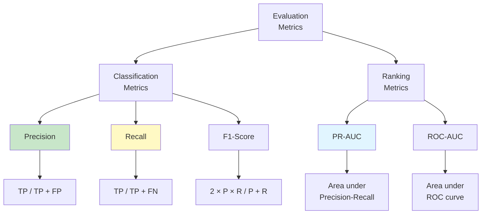

#### Confusion Matrix for Anomaly Detection

```
                Predicted
                Normal  Anomaly
Actual Normal    TN      FP
       Anomaly   FN      TP

TN = True Negative (correct normal)
TP = True Positive (correct anomaly detection)
FP = False Positive (false alarm)
FN = False Negative (missed anomaly)
```

#### Precision

**Precision** = What fraction of detected anomalies are actually anomalies?

```
Precision = TP / (TP + FP)

High Precision → Low false alarm rate
```

**Business Impact**: High precision minimizes alert fatigue.

#### Recall (Sensitivity)

**Recall** = What fraction of actual anomalies did we detect?

```
Recall = TP / (TP + FN)

High Recall → Few missed anomalies
```

**Business Impact**: High recall minimizes missed frauds/attacks.

#### F1-Score

**F1-Score** = Harmonic mean of precision and recall

```
F1 = 2 × (Precision × Recall) / (Precision + Recall)

Balances precision and recall
```

**2024 Research**: "F1 Score provides a harmonic mean ensuring a more reliable assessment, unlike accuracy which can be misleading in imbalanced datasets."

### 7.3 PR-AUC vs ROC-AUC

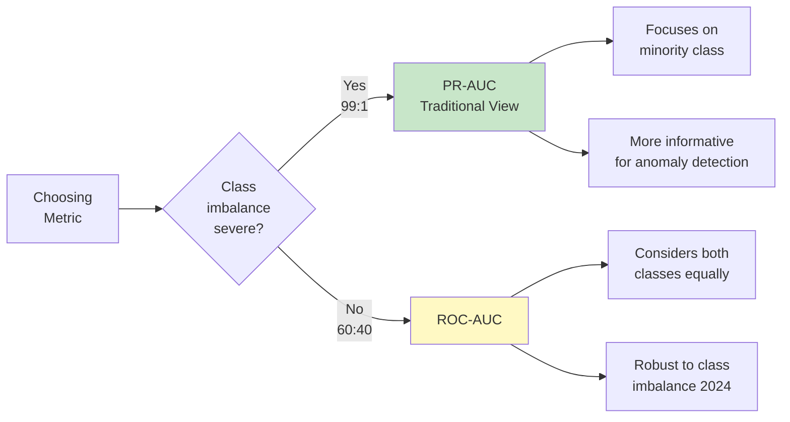

**PR-AUC (Precision-Recall AUC)**:
- **Use for**: When focusing specifically on positive (anomaly) class
- **Range**: [0, 1], higher is better
- **Interpretation**: Average precision across all recall levels
- **Baseline**: Random classifier baseline = class imbalance ratio (e.g., 0.01 for 1% anomalies)

**ROC-AUC (Receiver Operating Characteristic AUC)**:
- **Use for**: Overall model discrimination ability
- **Range**: [0.5, 1], 0.5 = random, 1 = perfect
- **Baseline**: Random classifier always gives 0.5 (class-imbalance invariant)

**Traditional View** (Saito & Rehmsmeier, PLOS ONE 2015):
- "PR curve is more informative than ROC plot for imbalanced datasets"
- ROC-AUC can appear overly optimistic due to large number of true negatives

**Recent Counter-Research** (2024):
- "ROC curve is robust to class imbalance, PR curve is highly sensitive" (PMC 2024)
- ROC-AUC's invariance to imbalance is a feature, not a bug
- Both metrics provide different, complementary information

**2024 Best Practice** (Balanced View):
- **Report both** PR-AUC and ROC-AUC
- **PR-AUC**: Primary for understanding minority class performance
- **ROC-AUC**: Secondary for overall discrimination ability
- **Never use accuracy** for imbalanced data

**References**:
- Saito, T., & Rehmsmeier, M. (2015). "The precision-recall plot is more informative than the ROC plot when evaluating binary classifiers on imbalanced datasets" PLOS ONE
- Davis, J., & Goadrich, M. (2006). "The relationship between Precision-Recall and ROC curves" ICML
- Recent discussion: PMC 11240176 (2024) "The receiver operating characteristic curve accurately assesses imbalanced datasets"

### 7.4 Implementation

```python
"""Comprehensive evaluation for anomaly detection.

2024 Best Practices for evaluating on imbalanced data.
"""

from typing import Dict
import numpy as np
from numpy.typing import NDArray
from sklearn.metrics import (
    precision_score,
    recall_score,
    f1_score,
    average_precision_score,
    roc_auc_score,
    precision_recall_curve,
    roc_curve,
    confusion_matrix
)
import matplotlib.pyplot as plt


def evaluate_anomaly_detector(
    y_true: NDArray[np.int32],
    y_pred: NDArray[np.int32],
    scores: NDArray[np.float64]
) -> Dict[str, float]:
    """Comprehensive evaluation for anomaly detection.

    2024 Best Practice: Report multiple metrics for imbalanced data.

    Args:
        y_true: True labels (1 = anomaly).
        y_pred: Predicted labels (1 = anomaly).
        scores: Anomaly scores (higher = more anomalous).

    Returns:
        Dictionary of evaluation metrics.
    """
    # Confusion matrix
    tn, fp, fn, tp = confusion_matrix(y_true, y_pred).ravel()

    # Classification metrics
    precision = precision_score(y_true, y_pred, zero_division=0)
    recall = recall_score(y_true, y_pred, zero_division=0)
    f1 = f1_score(y_true, y_pred, zero_division=0)

    # Ranking metrics
    pr_auc = average_precision_score(y_true, scores)
    roc_auc = roc_auc_score(y_true, scores)

    # Additional metrics
    specificity = tn / (tn + fp) if (tn + fp) > 0 else 0
    false_positive_rate = fp / (fp + tn) if (fp + tn) > 0 else 0
    false_negative_rate = fn / (fn + tp) if (fn + tp) > 0 else 0

    metrics = {
        # Confusion matrix
        'true_negatives': int(tn),
        'false_positives': int(fp),
        'false_negatives': int(fn),
        'true_positives': int(tp),

        # Primary metrics
        'precision': float(precision),
        'recall': float(recall),
        'f1_score': float(f1),
        'pr_auc': float(pr_auc),  # PRIMARY for imbalanced
        'roc_auc': float(roc_auc),

        # Additional
        'specificity': float(specificity),
        'fpr': float(false_positive_rate),
        'fnr': float(false_negative_rate),

        # Summary
        'total_samples': len(y_true),
        'total_anomalies': int(y_true.sum()),
        'detected_anomalies': int(y_pred.sum())
    }

    return metrics


def print_evaluation_report(metrics: Dict) -> None:
    """Print formatted evaluation report.

    Args:
        metrics: Dictionary from evaluate_anomaly_detector.
    """
    print("\n" + "="*60)
    print("ANOMALY DETECTION EVALUATION REPORT")
    print("="*60)

    # Confusion matrix
    print("\nConfusion Matrix:")
    print(f"                Predicted")
    print(f"                Normal  Anomaly")
    print(f"Actual Normal    {metrics['true_negatives']:<6}  {metrics['false_positives']:<6}")
    print(f"       Anomaly   {metrics['false_negatives']:<6}  {metrics['true_positives']:<6}")

    # Primary metrics
    print(f"\n{'Metric':<25} {'Value':>10} {'Interpretation':<25}")
    print("-"*60)

    print(f"{'PR-AUC (PRIMARY)':<25} {metrics['pr_auc']:>10.3f} "
          f"{'Excellent' if metrics['pr_auc'] > 0.8 else 'Good' if metrics['pr_auc'] > 0.6 else 'Fair':<25}")

    print(f"{'Precision':<25} {metrics['precision']:>10.3f} "
          f"{'Low false alarms' if metrics['precision'] > 0.8 else 'Some false alarms':<25}")

    print(f"{'Recall':<25} {metrics['recall']:>10.3f} "
          f"{'Few missed' if metrics['recall'] > 0.8 else 'Some missed':<25}")

    print(f"{'F1-Score':<25} {metrics['f1_score']:>10.3f} "
          f"{'Excellent' if metrics['f1_score'] > 0.8 else 'Good' if metrics['f1_score'] > 0.6 else 'Fair':<25}")

    print(f"{'ROC-AUC':<25} {metrics['roc_auc']:>10.3f} "
          f"{'(less important for imbalanced)':<25}")

    # Summary
    print(f"\n{'Total samples':<25} {metrics['total_samples']:>10}")
    print(f"{'True anomalies':<25} {metrics['total_anomalies']:>10} "
          f"({100*metrics['total_anomalies']/metrics['total_samples']:.2f}%)")
    print(f"{'Detected anomalies':<25} {metrics['detected_anomalies']:>10}")

    print("="*60 + "\n")


def plot_pr_and_roc_curves(
    y_true: NDArray[np.int32],
    scores: NDArray[np.float64],
    title: str = "Anomaly Detection Performance"
) -> None:
    """Plot Precision-Recall and ROC curves.

    Args:
        y_true: True labels.
        scores: Anomaly scores.
        title: Plot title.
    """
    fig, axes = plt.subplots(1, 2, figsize=(14, 5))

    # Precision-Recall curve
    precision, recall, pr_thresholds = precision_recall_curve(y_true, scores)
    pr_auc = average_precision_score(y_true, scores)

    axes[0].plot(recall, precision, 'b-', linewidth=2, label=f'PR-AUC = {pr_auc:.3f}')
    axes[0].fill_between(recall, precision, alpha=0.2)
    axes[0].set_xlabel('Recall')
    axes[0].set_ylabel('Precision')
    axes[0].set_title('Precision-Recall Curve\n(PRIMARY for imbalanced data)')
    axes[0].legend(loc='lower left')
    axes[0].grid(True, alpha=0.3)
    axes[0].set_xlim([0, 1])
    axes[0].set_ylim([0, 1.05])

    # ROC curve
    fpr, tpr, roc_thresholds = roc_curve(y_true, scores)
    roc_auc = roc_auc_score(y_true, scores)

    axes[1].plot(fpr, tpr, 'r-', linewidth=2, label=f'ROC-AUC = {roc_auc:.3f}')
    axes[1].plot([0, 1], [0, 1], 'k--', label='Random')
    axes[1].fill_between(fpr, tpr, alpha=0.2)
    axes[1].set_xlabel('False Positive Rate')
    axes[1].set_ylabel('True Positive Rate')
    axes[1].set_title('ROC Curve\n(Less informative for imbalanced)')
    axes[1].legend(loc='lower right')
    axes[1].grid(True, alpha=0.3)
    axes[1].set_xlim([0, 1])
    axes[1].set_ylim([0, 1.05])

    plt.suptitle(title, fontsize=14, y=1.02)
    plt.tight_layout()
    plt.savefig('pr_roc_curves.png', dpi=300, bbox_inches='tight')
    plt.close()


# Example usage
if __name__ == "__main__":
    from sklearn.datasets import make_blobs
    from sklearn.ensemble import IsolationForest

    # Generate imbalanced data (1% anomalies)
    np.random.seed(42)
    X_normal, _ = make_blobs(n_samples=9900, centers=1, random_state=42)
    X_anomalies = np.random.uniform(-10, 10, size=(100, 2))

    X = np.vstack([X_normal, X_anomalies])
    y_true = np.hstack([np.zeros(9900), np.ones(100)]).astype(np.int32)

    # Fit detector
    detector = IsolationForest(contamination=0.01, random_state=42)
    detector.fit(X)

    # Predict
    predictions_raw = detector.predict(X)
    y_pred = (predictions_raw == -1).astype(np.int32)
    scores = -detector.score_samples(X)

    # Evaluate
    metrics = evaluate_anomaly_detector(y_true, y_pred, scores)
    print_evaluation_report(metrics)

    # Plot curves
    plot_pr_and_roc_curves(y_true, scores, title="Isolation Forest Performance")
```

---

## 8. Choosing the Right Algorithm

### 8.1 Decision Tree

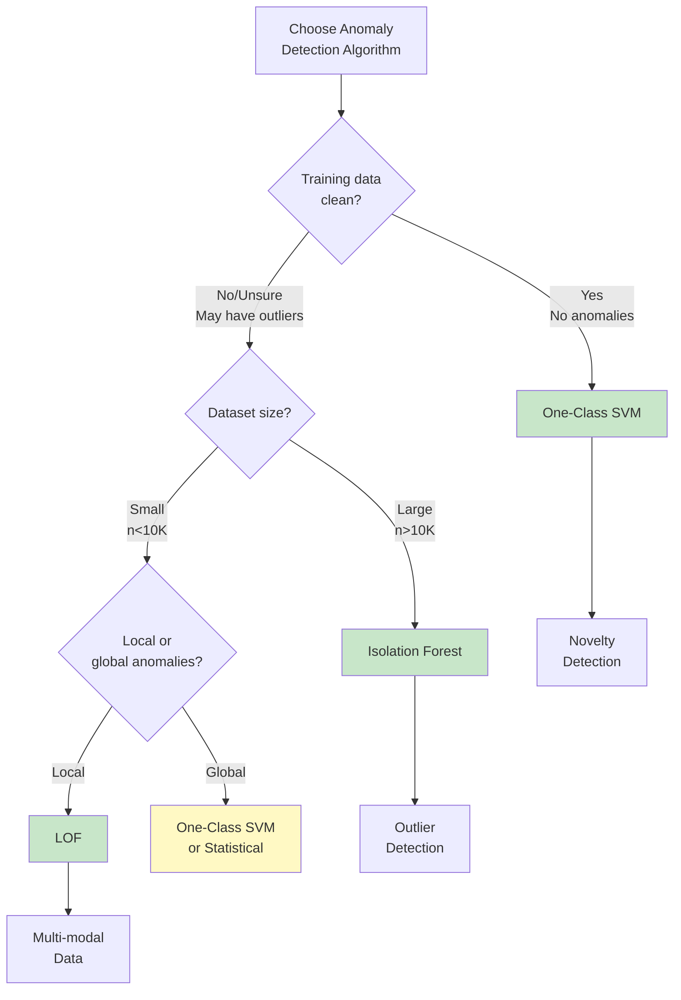

### 8.2 Algorithm Comparison Table

| Algorithm | Speed | Scalability | Contamination | Use Case | 2024 Status |
|-----------|-------|-------------|---------------|----------|-------------|
| **Z-Score** | Fastest | Excellent | Low | Univariate, Gaussian | Legacy, still useful |
| **IQR** | Fastest | Excellent | Robust | Univariate, robust | Legacy, still useful |
| **Mahalanobis** | Fast | Good | Low | Multivariate, Gaussian | Legacy |
| **Isolation Forest** | Fast | Excellent | Handles well | General purpose | **SOTA** |
| **One-Class SVM** | Slow | Poor | **Must be clean** | Novelty detection | SOTA for clean data |
| **LOF** | Slow | Poor | Handles well | Local outliers | SOTA for local |

### 8.3 Practical Guidelines

**Use Isolation Forest when** (2024 Default):
- ✅ General-purpose anomaly detection
- ✅ Large datasets (n > 10,000)
- ✅ High-dimensional data
- ✅ Training data may contain some anomalies
- ✅ Need fast training and prediction

**Use One-Class SVM when**:
- ✅ **Training data is clean** (no anomalies)
- ✅ **Novelty detection** scenario
- ✅ Small dataset (n < 10,000)
- ✅ Need smooth decision boundary

**Use LOF when**:
- ✅ **Local outliers** important
- ✅ **Multi-modal** data (multiple clusters)
- ✅ Varying density regions
- ✅ Small to medium dataset

**Use Statistical Methods when**:
- ✅ Need simple, interpretable baseline
- ✅ Low-dimensional data (d < 10)
- ✅ Real-time requirements (microsecond latency)
- ✅ Data approximately Gaussian

### 8.4 2024 Research-Based Recommendations

**From 2024 Research**:

1. **"Isolation Forest and LOF perform reasonably well for multi-modal data"**
   - Use either for datasets with multiple clusters

2. **"One-Class SVM is best for novelty detection when training set is not contaminated"**
   - Critical: Only use if you're certain training data is clean

3. **"Isolation Forest is faster than One-Class SVM"**
   - For large datasets, prefer Isolation Forest

4. **"2024-2025 Hybrid Approaches"**:
   - Ensemble: Isolation Forest + Autoencoders
   - Combine fast ML (IF) + deep learning for best results (Part 2)

---

## Summary - Part 1

This concludes Part 1 of the Anomaly Detection Complete Guide. We covered:

### Classical Methods (Still Relevant 2024)

1. **Statistical Methods**:
   - Z-score, IQR, Mahalanobis distance
   - Best for: Simple baselines, real-time systems
   - Limitations: Low-dimensional data only

2. **Isolation Forest** (SOTA):
   - Fast, scalable, handles contamination
   - Best for: General-purpose anomaly detection
   - **2024**: Still state-of-the-art for traditional ML

3. **One-Class SVM**:
   - Clean data requirement, smooth boundaries
   - Best for: Novelty detection on clean data
   - Limitation: Slow, doesn't scale

4. **Local Outlier Factor**:
   - Local density-based, multi-modal data
   - Best for: Local outliers, varying densities
   - Limitation: Slow O(n²)

### Evaluation (Critical for Imbalanced Data)

- **Never use accuracy** for anomaly detection
- **PR-AUC**: Primary metric for imbalanced data
- **F1-Score**: Balance precision and recall
- **Precision vs Recall tradeoff**: Depends on business cost

### 2024 Research Insights

- Isolation Forest remains SOTA for traditional ML
- One-Class SVM best for **novelty detection only**
- LOF + Isolation Forest work well for **multi-modal data**
- **Hybrid methods** (IF + Autoencoders) emerging as SOTA
- **PR-AUC** is most informative metric for imbalanced data

---

**Continue to Part 2** for:
- Deep Learning Methods (Autoencoders, VAE, GAN, Transformers)
- Time Series Anomaly Detection (LSTM, Transformers)
- Production Deployment (Monitoring, Drift Detection, Retraining)
- Hybrid Ensemble Approaches
- Interview Questions and Case Studies

---

## References

### Official Documentation
1. **scikit-learn Isolation Forest**: https://scikit-learn.org/stable/modules/generated/sklearn.ensemble.IsolationForest.html
2. **scikit-learn One-Class SVM**: https://scikit-learn.org/stable/modules/generated/sklearn.svm.OneClassSVM.html
3. **scikit-learn Novelty and Outlier Detection**: https://scikit-learn.org/stable/modules/outlier_detection.html
4. **scikit-learn Local Outlier Factor**: https://scikit-learn.org/stable/modules/generated/sklearn.neighbors.LocalOutlierFactor.html

### Academic Papers - Foundational
5. **Liu, F.T., Ting, K.M. and Zhou, Z.H.** (2008). "Isolation forest." *Data Mining, 2008. ICDM'08. Eighth IEEE International Conference on*
6. **Liu, F.T., Ting, K.M. and Zhou, Z.H.** (2012). "Isolation-based anomaly detection." *ACM Transactions on Knowledge Discovery from Data (TKDD)* 6.1: 3
7. **Breunig, M.M., Kriegel, H.P., Ng, R.T. and Sander, J.** (2000). "LOF: identifying density-based local outliers." *ACM sigmod record* 29.2: 93-104
8. **Schölkopf, B., Williamson, R.C., Smola, A., Shawe-Taylor, J. and Platt, J.** (1999). "Support vector method for novelty detection." *NIPS* 12: 582-588

### Academic Papers - Extended Isolation Forest (2024)
9. **Arcudi, A., Brusa, E., Cagliero, L., Garza, P. and Baralis, E.** (2024). "Enhancing interpretability and generalizability in extended isolation forests." *Expert Systems with Applications* (2024). arXiv:2310.05468
10. **Hariri, S., Kind, M.C. and Brunner, R.J.** (2019). "Extended isolation forest." *IEEE Transactions on Knowledge and Data Engineering* 33.4: 1479-1489

### Evaluation Metrics
11. **Saito, T. and Rehmsmeier, M.** (2015). "The precision-recall plot is more informative than the ROC plot when evaluating binary classifiers on imbalanced datasets." *PLOS ONE* 10.3: e0118432
12. **Davis, J. and Goadrich, M.** (2006). "The relationship between Precision-Recall and ROC curves." *Proceedings of the 23rd international conference on Machine learning*
13. **PMC 11240176** (2024). "The receiver operating characteristic curve accurately assesses imbalanced datasets"

### Additional Resources
14. **Machine Learning Mastery**: "ROC Curves and Precision-Recall Curves for Imbalanced Classification" - https://machinelearningmastery.com/
15. **Wikipedia - Isolation Forest**: https://en.wikipedia.org/wiki/Isolation_forest

---

*Part of ML/AI Documentation Series - Anomaly Detection*
