# Anomaly Detection - Complete Guide (Part 2: Deep Learning & Production)

Advanced deep learning methods, time series anomaly detection, production deployment, and 2024-2025 SOTA research.

---

## Table of Contents - Part 2

1. [Deep Learning: Autoencoders](#1-deep-learning-autoencoders)
2. [Variational Autoencoders (VAE)](#2-variational-autoencoders-vae)
3. [GAN-Based Anomaly Detection](#3-gan-based-anomaly-detection)
4. [Transformer-Based Methods](#4-transformer-based-methods)
5. [Time Series Anomaly Detection](#5-time-series-anomaly-detection)
6. [Hybrid & Ensemble Methods](#6-hybrid--ensemble-methods)
7. [Production Deployment](#7-production-deployment)
8. [Concept Drift & Model Retraining](#8-concept-drift--model-retraining)
9. [Interview Questions](#9-interview-questions)
10. [Best Practices Checklist](#10-best-practices-checklist)

**See Part 1 for**: Statistical Methods, Isolation Forest, One-Class SVM, LOF, and Evaluation Metrics.

---

## 1. Deep Learning: Autoencoders

### 1.1 Why Autoencoders for Anomaly Detection?

**Autoencoders** learn to compress (encode) and reconstruct (decode) data. Anomalies have high reconstruction error.

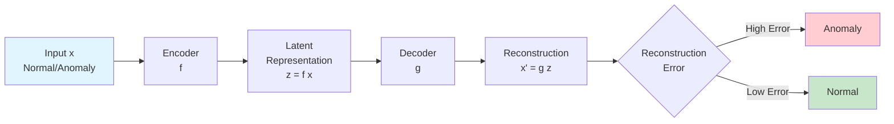

**Key Idea**:
- Train autoencoder on **normal data only**
- Normal patterns: low reconstruction error
- Anomalies: high reconstruction error (never seen during training)

**Reconstruction Error**:
```
Error(x) = ||x - x'||²  (MSE)
         = ||x - g(f(x))||²

Threshold τ: anomaly if Error(x) > τ
```

### 1.2 Architecture Evolution (2024)

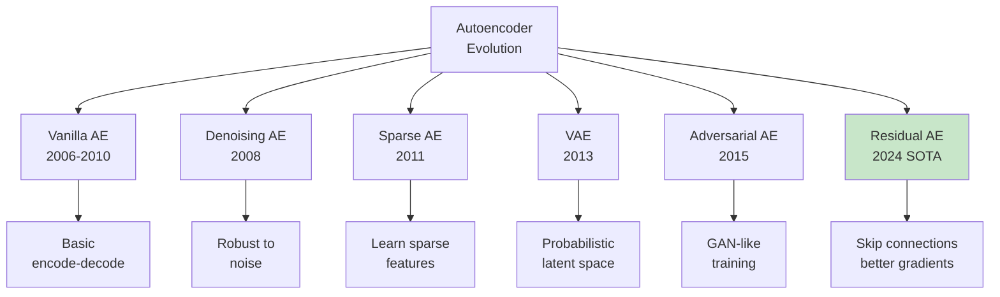

**2024 Research Finding**: "Deep embedding clustering algorithms based on **residual autoencoder** show improved performance" for anomaly detection.

### 1.3 Basic Autoencoder Implementation

```python
"""Autoencoder for anomaly detection with 2024 best practices.

Based on research: Autoencoders remain fundamental for anomaly detection,
with residual connections improving performance.
"""

from typing import Tuple, Optional
import numpy as np
import torch
import torch.nn as nn
import torch.optim as optim
from torch.utils.data import DataLoader, TensorDataset
from sklearn.preprocessing import StandardScaler
from sklearn.metrics import precision_score, recall_score, f1_score
import matplotlib.pyplot as plt
import logging

logging.basicConfig(level=logging.INFO)
logger = logging.getLogger(__name__)


class Autoencoder(nn.Module):
    """Basic Autoencoder for anomaly detection.

    2024 Best Practice: Add batch normalization for stable training.

    Attributes:
        encoder: Encoder network.
        decoder: Decoder network.
    """

    def __init__(
        self,
        input_dim: int,
        encoding_dims: list = [128, 64, 32],
        latent_dim: int = 16
    ):
        """Initialize autoencoder.

        Args:
            input_dim: Input feature dimension.
            encoding_dims: Hidden layer dimensions for encoder.
            latent_dim: Latent representation dimension.
        """
        super().__init__()

        # Encoder
        encoder_layers = []
        prev_dim = input_dim

        for dim in encoding_dims:
            encoder_layers.extend([
                nn.Linear(prev_dim, dim),
                nn.ReLU(),
                nn.BatchNorm1d(dim)  # 2024: Stabilizes training
            ])
            prev_dim = dim

        encoder_layers.append(nn.Linear(prev_dim, latent_dim))
        self.encoder = nn.Sequential(*encoder_layers)

        # Decoder (symmetric)
        decoder_layers = []
        prev_dim = latent_dim

        for dim in reversed(encoding_dims):
            decoder_layers.extend([
                nn.Linear(prev_dim, dim),
                nn.ReLU(),
                nn.BatchNorm1d(dim)
            ])
            prev_dim = dim

        decoder_layers.append(nn.Linear(prev_dim, input_dim))
        self.decoder = nn.Sequential(*decoder_layers)

    def forward(self, x: torch.Tensor) -> Tuple[torch.Tensor, torch.Tensor]:
        """Forward pass.

        Args:
            x: Input tensor.

        Returns:
            Tuple of (latent_representation, reconstruction).
        """
        z = self.encoder(x)
        x_recon = self.decoder(z)
        return z, x_recon


class ResidualAutoencoder(nn.Module):
    """Residual Autoencoder (2024 SOTA).

    2024 Research: Residual connections improve gradient flow
    and representation learning.
    """

    def __init__(
        self,
        input_dim: int,
        encoding_dims: list = [128, 64, 32],
        latent_dim: int = 16
    ):
        """Initialize residual autoencoder.

        Args:
            input_dim: Input feature dimension.
            encoding_dims: Hidden layer dimensions.
            latent_dim: Latent dimension.
        """
        super().__init__()

        # Encoder with residual blocks
        self.encoder_blocks = nn.ModuleList()
        prev_dim = input_dim

        for dim in encoding_dims:
            block = nn.Sequential(
                nn.Linear(prev_dim, dim),
                nn.ReLU(),
                nn.BatchNorm1d(dim)
            )
            self.encoder_blocks.append(block)

            # Skip connection (if dimensions match)
            if prev_dim == dim:
                self.encoder_blocks.append(nn.Identity())
            else:
                self.encoder_blocks.append(nn.Linear(prev_dim, dim))

            prev_dim = dim

        self.latent = nn.Linear(prev_dim, latent_dim)

        # Decoder with residual blocks
        self.decoder_blocks = nn.ModuleList()
        self.latent_to_decoder = nn.Linear(latent_dim, prev_dim)

        for dim in reversed(encoding_dims[:-1]):
            block = nn.Sequential(
                nn.Linear(prev_dim, dim),
                nn.ReLU(),
                nn.BatchNorm1d(dim)
            )
            self.decoder_blocks.append(block)

            if prev_dim == dim:
                self.decoder_blocks.append(nn.Identity())
            else:
                self.decoder_blocks.append(nn.Linear(prev_dim, dim))

            prev_dim = dim

        self.output_layer = nn.Linear(prev_dim, input_dim)

    def forward(self, x: torch.Tensor) -> Tuple[torch.Tensor, torch.Tensor]:
        """Forward pass with residual connections.

        Args:
            x: Input tensor.

        Returns:
            Tuple of (latent, reconstruction).
        """
        # Encode with residual connections
        h = x
        for i in range(0, len(self.encoder_blocks), 2):
            identity = self.encoder_blocks[i + 1](h)
            h = self.encoder_blocks[i](h) + identity

        z = self.latent(h)

        # Decode with residual connections
        h = self.latent_to_decoder(z)
        for i in range(0, len(self.decoder_blocks), 2):
            identity = self.decoder_blocks[i + 1](h)
            h = self.decoder_blocks[i](h) + identity

        x_recon = self.output_layer(h)

        return z, x_recon


class AnomalyDetectorAutoencoder:
    """Production autoencoder-based anomaly detector.

    2024 Best Practices:
    - Train on normal data only
    - Use validation set to determine threshold
    - Monitor reconstruction error distribution
    """

    def __init__(
        self,
        input_dim: int,
        encoding_dims: list = [128, 64, 32],
        latent_dim: int = 16,
        use_residual: bool = True
    ):
        """Initialize anomaly detector.

        Args:
            input_dim: Input feature dimension.
            encoding_dims: Encoding layer dimensions.
            latent_dim: Latent dimension.
            use_residual: Whether to use residual connections (2024 SOTA).
        """
        self.input_dim = input_dim
        self.encoding_dims = encoding_dims
        self.latent_dim = latent_dim

        # Model
        if use_residual:
            self.model = ResidualAutoencoder(input_dim, encoding_dims, latent_dim)
            logger.info("Using Residual Autoencoder (2024 SOTA)")
        else:
            self.model = Autoencoder(input_dim, encoding_dims, latent_dim)
            logger.info("Using Basic Autoencoder")

        self.scaler: Optional[StandardScaler] = None
        self.threshold: Optional[float] = None
        self.device = 'cuda' if torch.cuda.is_available() else 'cpu'
        self.model.to(self.device)

    def fit(
        self,
        X_train: np.ndarray,
        X_val: Optional[np.ndarray] = None,
        epochs: int = 100,
        batch_size: int = 256,
        lr: float = 0.001,
        threshold_percentile: float = 95
    ) -> 'AnomalyDetectorAutoencoder':
        """Train autoencoder on normal data.

        2024 Best Practice: Use validation set to determine threshold.

        Args:
            X_train: Training data (normal only).
            X_val: Validation data (normal only, for threshold).
            epochs: Training epochs.
            batch_size: Batch size.
            lr: Learning rate.
            threshold_percentile: Percentile of reconstruction errors
                for threshold (e.g., 95 = top 5% as anomalies).

        Returns:
            self: Fitted detector.
        """
        logger.info(f"Training autoencoder on {len(X_train)} samples...")

        # Standardization (critical)
        self.scaler = StandardScaler()
        X_train_scaled = self.scaler.fit_transform(X_train)

        # Prepare data
        train_dataset = TensorDataset(
            torch.FloatTensor(X_train_scaled),
            torch.FloatTensor(X_train_scaled)  # Target = input for autoencoder
        )
        train_loader = DataLoader(
            train_dataset,
            batch_size=batch_size,
            shuffle=True
        )

        # Optimizer
        optimizer = optim.Adam(self.model.parameters(), lr=lr)
        criterion = nn.MSELoss()

        # Training loop
        self.model.train()
        history = []

        for epoch in range(epochs):
            epoch_loss = 0.0

            for batch_x, batch_target in train_loader:
                batch_x = batch_x.to(self.device)
                batch_target = batch_target.to(self.device)

                # Forward
                optimizer.zero_grad()
                _, recon = self.model(batch_x)
                loss = criterion(recon, batch_target)

                # Backward
                loss.backward()
                optimizer.step()

                epoch_loss += loss.item()

            avg_loss = epoch_loss / len(train_loader)
            history.append(avg_loss)

            if (epoch + 1) % 10 == 0:
                logger.info(f"Epoch {epoch+1}/{epochs}, Loss: {avg_loss:.6f}")

        # Determine threshold using robust statistics
        # 2024 Best Practice: Use Median Absolute Deviation (MAD) for robustness
        # Reference: "Enhanced federated anomaly detection through autoencoders
        # using summary statistics-based thresholding" (Nature, 2024)
        if X_val is not None:
            X_val_scaled = self.scaler.transform(X_val)
            val_errors = self._compute_errors(X_val_scaled)

            # Robust threshold using MAD (more resistant to outliers)
            median_error = np.median(val_errors)
            mad = np.median(np.abs(val_errors - median_error))
            # MAD with Gaussian assumption: median + k * 1.4826 * MAD
            # k=3 gives ~99.7% coverage (similar to 3-sigma rule)
            self.threshold = median_error + 3 * 1.4826 * mad

            # Fallback to percentile if MAD is too small
            if mad < 1e-10:
                self.threshold = np.percentile(val_errors, threshold_percentile)
                logger.warning("MAD too small, using percentile threshold")

            logger.info(f"Threshold set to {self.threshold:.6f} "
                       f"(MAD-based: median={median_error:.6f}, MAD={mad:.6f})")
        else:
            # Use training errors with robust statistics
            train_errors = self._compute_errors(X_train_scaled)
            median_error = np.median(train_errors)
            mad = np.median(np.abs(train_errors - median_error))
            self.threshold = median_error + 3 * 1.4826 * mad

            if mad < 1e-10:
                self.threshold = np.percentile(train_errors, threshold_percentile)
                logger.warning("MAD too small, using percentile threshold")

            logger.info(f"Threshold set from training data: {self.threshold:.6f}")

        return self

    def _compute_errors(self, X: np.ndarray) -> np.ndarray:
        """Compute reconstruction errors.

        Args:
            X: Scaled data.

        Returns:
            Reconstruction errors (MSE per sample).
        """
        self.model.eval()

        X_tensor = torch.FloatTensor(X).to(self.device)

        with torch.no_grad():
            _, recon = self.model(X_tensor)
            errors = torch.mean((X_tensor - recon) ** 2, dim=1)

        return errors.cpu().numpy()

    def anomaly_score(self, X: np.ndarray) -> np.ndarray:
        """Compute anomaly scores (reconstruction errors).

        Args:
            X: Data to score.

        Returns:
            Anomaly scores (higher = more anomalous).
        """
        X_scaled = self.scaler.transform(X)
        return self._compute_errors(X_scaled)

    def predict(self, X: np.ndarray) -> np.ndarray:
        """Predict anomalies.

        Args:
            X: Data to predict.

        Returns:
            Binary labels (1 = anomaly, 0 = normal).
        """
        if self.threshold is None:
            raise ValueError("Detector not fitted yet")

        scores = self.anomaly_score(X)
        return (scores > self.threshold).astype(np.int32)


# Example usage
if __name__ == "__main__":
    from sklearn.datasets import make_blobs
    from sklearn.model_selection import train_test_split

    # Generate data
    np.random.seed(42)
    torch.manual_seed(42)

    # Normal data for training
    X_normal, _ = make_blobs(
        n_samples=5000,
        centers=3,
        n_features=20,
        cluster_std=1.0,
        random_state=42
    )

    # Test data: normal + anomalies
    X_test_normal, _ = make_blobs(
        n_samples=900,
        centers=3,
        n_features=20,
        cluster_std=1.0,
        random_state=43
    )
    X_test_anomalies = np.random.uniform(-10, 10, size=(100, 20))

    X_test = np.vstack([X_test_normal, X_test_anomalies])
    y_test = np.hstack([np.zeros(900), np.ones(100)]).astype(np.int32)

    # Split normal data for training/validation
    X_train, X_val = train_test_split(X_normal, test_size=0.2, random_state=42)

    print("=== Autoencoder Anomaly Detection ===")
    print(f"Training: {len(X_train)} normal samples")
    print(f"Validation: {len(X_val)} normal samples")
    print(f"Test: {len(X_test)} ({y_test.sum()} anomalies)")

    # Train detector (with residual connections - 2024 SOTA)
    detector = AnomalyDetectorAutoencoder(
        input_dim=20,
        encoding_dims=[128, 64, 32],
        latent_dim=16,
        use_residual=True
    )

    detector.fit(
        X_train,
        X_val=X_val,
        epochs=50,
        batch_size=256,
        threshold_percentile=95
    )

    # Predict
    predictions = detector.predict(X_test)
    scores = detector.anomaly_score(X_test)

    # Evaluate
    precision = precision_score(y_test, predictions)
    recall = recall_score(y_test, predictions)
    f1 = f1_score(y_test, predictions)

    print(f"\nResults:")
    print(f"Precision: {precision:.3f}")
    print(f"Recall: {recall:.3f}")
    print(f"F1-Score: {f1:.3f}")
    print(f"Anomalies detected: {predictions.sum()}/{len(predictions)}")
```

### 1.4 Denoising Autoencoder

**Denoising Autoencoder** adds noise during training for robustness.

```mermaid
flowchart LR
    A[Clean Input x] --> B[Add Noise<br/>x̃ = x + ε]
    B --> C[Encoder]
    C --> D[Latent z]
    D --> E[Decoder]
    E --> F[Reconstruction<br/>x' ≈ x clean]

    F --> G[Loss:<br/>||x - x'||²]

    style B fill:#ffcdd2
    style F fill:#c8e6c9
```

**Benefits**:
- More robust representations
- Handles noisy inputs better
- Prevents overfitting to exact training patterns

**2024 Use Case**: Sensor data with measurement noise.

### 1.5 When to Use Autoencoders

**Use Autoencoders when**:
- ✅ High-dimensional data (images, signals, embeddings)
- ✅ Complex patterns (non-linear relationships)
- ✅ Sufficient training data (thousands of samples)
- ✅ Need unsupervised learning

**Advantages**:
- Flexible architecture
- Learns task-specific features
- Handles non-linear patterns
- Works with any data type

**Limitations**:
- Requires more data than traditional methods
- Hyperparameter tuning needed (architecture, threshold)
- Computationally expensive
- Black-box (less interpretable)

---

## 2. Variational Autoencoders (VAE)

### 2.1 VAE vs Standard Autoencoder

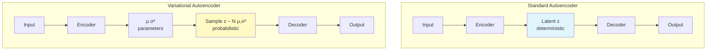

**Key Difference**: VAE learns a **probability distribution** in latent space, not just deterministic encoding.

### 2.2 VAE for Anomaly Detection

**Idea**: Anomalies have low probability under learned distribution.

**Loss Function**:
```
L = Reconstruction Loss + KL Divergence

L(x) = ||x - x'||² + KL(q(z|x) || p(z))

where:
- Reconstruction: how well we decode
- KL Divergence: regularization (keeps latent space structured)
- p(z) = N(0, I) (standard normal prior)
- q(z|x) = N(μ, σ²) (learned distribution)
```

**Anomaly Score**:
```
score(x) = Reconstruction Error + β × KL Divergence

β controls balance (tunable hyperparameter)
```

### 2.3 Implementation

```python
"""Variational Autoencoder for anomaly detection.

2024 Research: VAE provides probabilistic anomaly scores,
useful when uncertainty quantification is needed.
"""

import torch
import torch.nn as nn
import torch.nn.functional as F
from typing import Tuple


class VAE(nn.Module):
    """Variational Autoencoder.

    Attributes:
        encoder: Encoder network.
        fc_mu: Layer for mean of latent distribution.
        fc_logvar: Layer for log variance of latent distribution.
        decoder: Decoder network.
    """

    def __init__(
        self,
        input_dim: int,
        hidden_dims: list = [128, 64],
        latent_dim: int = 16
    ):
        """Initialize VAE.

        Args:
            input_dim: Input feature dimension.
            hidden_dims: Hidden layer dimensions.
            latent_dim: Latent dimension.
        """
        super().__init__()

        # Encoder
        encoder_layers = []
        prev_dim = input_dim

        for dim in hidden_dims:
            encoder_layers.extend([
                nn.Linear(prev_dim, dim),
                nn.ReLU(),
                nn.BatchNorm1d(dim)
            ])
            prev_dim = dim

        self.encoder = nn.Sequential(*encoder_layers)

        # Latent parameters
        self.fc_mu = nn.Linear(prev_dim, latent_dim)
        self.fc_logvar = nn.Linear(prev_dim, latent_dim)

        # Decoder
        decoder_layers = []
        prev_dim = latent_dim

        for dim in reversed(hidden_dims):
            decoder_layers.extend([
                nn.Linear(prev_dim, dim),
                nn.ReLU(),
                nn.BatchNorm1d(dim)
            ])
            prev_dim = dim

        decoder_layers.append(nn.Linear(prev_dim, input_dim))
        self.decoder = nn.Sequential(*decoder_layers)

    def encode(self, x: torch.Tensor) -> Tuple[torch.Tensor, torch.Tensor]:
        """Encode input to latent distribution parameters.

        Args:
            x: Input tensor.

        Returns:
            Tuple of (mean, log_variance).
        """
        h = self.encoder(x)
        mu = self.fc_mu(h)
        logvar = self.fc_logvar(h)
        return mu, logvar

    def reparameterize(
        self,
        mu: torch.Tensor,
        logvar: torch.Tensor
    ) -> torch.Tensor:
        """Reparameterization trick for sampling.

        z = μ + σ × ε, where ε ~ N(0,1)

        Args:
            mu: Mean.
            logvar: Log variance.

        Returns:
            Sampled latent vector.
        """
        std = torch.exp(0.5 * logvar)
        eps = torch.randn_like(std)
        return mu + eps * std

    def decode(self, z: torch.Tensor) -> torch.Tensor:
        """Decode latent vector to reconstruction.

        Args:
            z: Latent vector.

        Returns:
            Reconstruction.
        """
        return self.decoder(z)

    def forward(
        self,
        x: torch.Tensor
    ) -> Tuple[torch.Tensor, torch.Tensor, torch.Tensor]:
        """Forward pass.

        Args:
            x: Input tensor.

        Returns:
            Tuple of (reconstruction, mean, log_variance).
        """
        mu, logvar = self.encode(x)
        z = self.reparameterize(mu, logvar)
        recon = self.decode(z)
        return recon, mu, logvar

    def loss_function(
        self,
        recon_x: torch.Tensor,
        x: torch.Tensor,
        mu: torch.Tensor,
        logvar: torch.Tensor,
        beta: float = 1.0,
        data_type: str = 'continuous'
    ) -> Tuple[torch.Tensor, torch.Tensor, torch.Tensor]:
        """VAE loss function with appropriate likelihood.

        Args:
            recon_x: Reconstruction.
            x: Original input.
            mu: Latent mean.
            logvar: Latent log variance.
            beta: Weight for KL divergence (β-VAE).
                β > 1: More disentanglement, less reconstruction accuracy
                β = 1: Standard VAE (Higgins et al., 2017)
                β < 1: Better reconstruction, less disentanglement
            data_type: Type of data for reconstruction loss:
                'continuous': Use MSE (assumes Gaussian likelihood)
                'binary': Use BCE (assumes Bernoulli likelihood)
                'mixed': Use per-feature appropriate loss

        Returns:
            Tuple of (total_loss, reconstruction_loss, kl_divergence).

        References:
            - β-VAE: Higgins et al., "beta-VAE: Learning Basic Visual Concepts
              with a Constrained Variational Framework" (ICLR 2017)
            - Loss choice: PyTorch Forums discussion on VAE loss functions
              https://discuss.pytorch.org/t/variational-autoencoder-loss-function-mse-vs-bce/105694
        """
        # Reconstruction loss (choose based on data type)
        if data_type == 'continuous':
            # MSE assumes Gaussian likelihood: -log p(x|z) ∝ ||x - μ||²
            recon_loss = F.mse_loss(recon_x, x, reduction='mean')
        elif data_type == 'binary':
            # BCE assumes Bernoulli likelihood (for binary/probability data)
            # Common for MNIST where pixels ∈ [0,1] are treated as probabilities
            recon_loss = F.binary_cross_entropy(recon_x, x, reduction='mean')
        else:
            # Default to MSE for continuous data
            recon_loss = F.mse_loss(recon_x, x, reduction='mean')

        # KL divergence
        # KL(q(z|x) || p(z)) = -0.5 * Σ(1 + log(σ²) - μ² - σ²)
        kl_div = -0.5 * torch.mean(1 + logvar - mu.pow(2) - logvar.exp())

        # Total loss (β-VAE formulation)
        total_loss = recon_loss + beta * kl_div

        return total_loss, recon_loss, kl_div


# Example: VAE training
def train_vae_anomaly_detector():
    """Train VAE for anomaly detection."""
    from sklearn.datasets import make_blobs

    # Generate normal data
    X_normal, _ = make_blobs(
        n_samples=5000,
        centers=3,
        n_features=20,
        random_state=42
    )

    # Standardize
    from sklearn.preprocessing import StandardScaler
    scaler = StandardScaler()
    X_scaled = scaler.fit_transform(X_normal)

    # Model
    device = 'cuda' if torch.cuda.is_available() else 'cpu'
    vae = VAE(input_dim=20, hidden_dims=[128, 64], latent_dim=16).to(device)

    # Training
    optimizer = torch.optim.Adam(vae.parameters(), lr=0.001)

    vae.train()
    for epoch in range(50):
        X_batch = torch.FloatTensor(X_scaled).to(device)

        optimizer.zero_grad()

        recon, mu, logvar = vae(X_batch)
        loss, recon_loss, kl_div = vae.loss_function(recon, X_batch, mu, logvar, beta=1.0)

        loss.backward()
        optimizer.step()

        if (epoch + 1) % 10 == 0:
            print(f"Epoch {epoch+1}: Loss={loss.item():.4f}, "
                  f"Recon={recon_loss.item():.4f}, KL={kl_div.item():.4f}")

    print("VAE training complete!")


if __name__ == "__main__":
    train_vae_anomaly_detector()
```

### 2.4 β-VAE for Anomaly Detection

**β-VAE** (2024 Research): Tune β to control KL divergence weight.

```
Loss = Reconstruction + β × KL Divergence

- β < 1: Prioritize reconstruction (detect subtle anomalies)
- β = 1: Standard VAE
- β > 1: More structured latent space (better generalization)
```

**2024 Best Practice**: Tune β on validation set.

---

## 3. GAN-Based Anomaly Detection

### 3.1 How GANs Detect Anomalies

**Generative Adversarial Networks** learn to generate normal data. Anomalies are hard to generate.

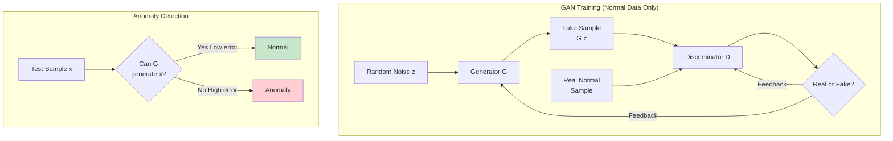

**Approaches**:

1. **AnoGAN** (2017): Find latent z that generates x
   ```
   min_z ||G(z) - x||² + λ||D(G(z)) - D(x)||²
   ```

2. **BiGAN** (2017): Jointly learn encoder + generator

3. **GANomaly** (2018): Generator + encoder + discriminator

### 3.2 GAN vs Autoencoder

| Aspect | Autoencoder | GAN |
|--------|-------------|-----|
| **Training** | Reconstruction loss | Adversarial loss |
| **Generation** | Not designed for | Excellent |
| **Stability** | Stable | Can be unstable |
| **Speed** | Fast | Slower (two networks) |
| **Use Case** | General anomaly detection | High-quality generation needed |

**2024 Research**: "GAN networks show superior performance in anomaly detection tasks, though they suffer from training instability."

### 3.3 SAE-GAN (2025 SOTA)

**SAE-GAN** (Stacked Attention Autoencoder + GAN) - 2025 Research

**Architecture**:
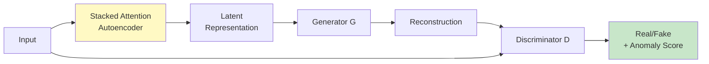

**Key Features**:
- Hierarchical attention mechanisms
- Adversarial regularization
- Better than standard GAN for multivariate time series

**2024-2025 Trend**: Hybrid approaches combining autoencoders + GANs perform best.

---

## 4. Transformer-Based Methods

### 4.1 Transformers for Anomaly Detection

**Transformers** excel at capturing long-range dependencies, crucial for time series and sequential data.

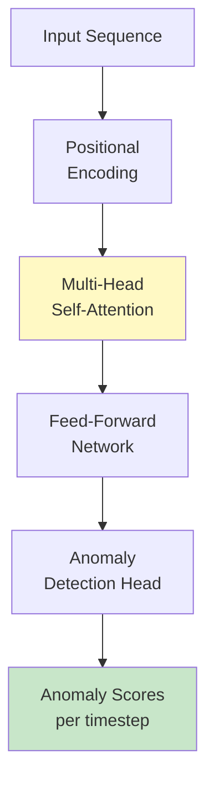

**Why Transformers Work**:
- **Self-attention**: Captures dependencies at any distance
- **Parallel processing**: Faster than RNNs
- **Positional encoding**: Preserves temporal order

**2024 Research**: "Transformer-based models typically outperform others in anomaly detection tasks as they are better at handling long-range dependencies."

### 4.2 Anomaly Transformer (2024)

**Anomaly Transformer** introduces anomaly-awareness mechanism.

**Key Innovation**:
- **Anomaly-Attention**: Learns to distinguish normal from anomalous patterns
- **Prior-Association**: Uses learned normal patterns as prior
- **Minimax strategy**: Maximizes discrepancy for anomalies

**Performance**: State-of-the-art on time series anomaly detection benchmarks (2024).

### 4.3 TranAD (2024)

**TranAD** (Transformer-based Anomaly Detection with GAN):

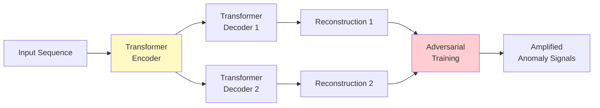

**Advantage**: GAN-style training amplifies reconstruction errors for anomalies.

**2024 Finding**: "Adversarial training can amplify reconstruction errors that simple networks might miss."

---

## 5. Time Series Anomaly Detection

### 5.1 Challenges in Time Series

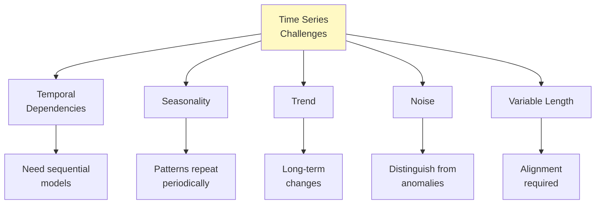

**Types of Time Series Anomalies**:
1. **Point Anomalies**: Single unusual value
2. **Contextual Anomalies**: Unusual in specific context (e.g., time of day)
3. **Pattern Anomalies**: Unusual subsequence

### 5.2 LSTM Autoencoder

**LSTM Autoencoder** captures temporal patterns for anomaly detection.

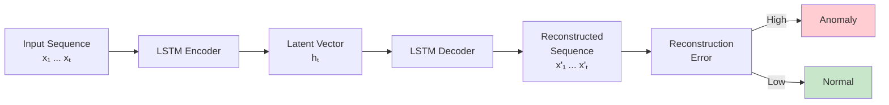

**Implementation**:

```python
"""LSTM Autoencoder for time series anomaly detection.

2024 Best Practice: LSTM autoencoders remain effective for
time series anomaly detection when temporal patterns matter.
"""

import torch
import torch.nn as nn
from typing import Tuple


class LSTMAutoencoder(nn.Module):
    """LSTM-based Autoencoder for time series.

    Attributes:
        encoder: LSTM encoder.
        decoder: LSTM decoder.
        output_layer: Output projection layer.
    """

    def __init__(
        self,
        input_dim: int,
        hidden_dim: int = 64,
        num_layers: int = 2,
        dropout: float = 0.2
    ):
        """Initialize LSTM Autoencoder.

        Args:
            input_dim: Number of features per timestep.
            hidden_dim: LSTM hidden dimension.
            num_layers: Number of LSTM layers.
            dropout: Dropout rate.
        """
        super().__init__()

        self.input_dim = input_dim
        self.hidden_dim = hidden_dim
        self.num_layers = num_layers

        # Encoder
        self.encoder = nn.LSTM(
            input_size=input_dim,
            hidden_size=hidden_dim,
            num_layers=num_layers,
            dropout=dropout if num_layers > 1 else 0,
            batch_first=True
        )

        # Decoder
        self.decoder = nn.LSTM(
            input_size=hidden_dim,
            hidden_size=hidden_dim,
            num_layers=num_layers,
            dropout=dropout if num_layers > 1 else 0,
            batch_first=True
        )

        # Output layer
        self.output_layer = nn.Linear(hidden_dim, input_dim)

    def forward(self, x: torch.Tensor) -> torch.Tensor:
        """Forward pass (sequence-to-sequence architecture).

        Args:
            x: Input sequence of shape (batch, seq_len, input_dim).

        Returns:
            Reconstructed sequence of same shape.

        Note:
            This uses full encoded sequence for better per-timestep reconstruction,
            not just the last hidden state. This is critical for point anomaly
            detection in time series [Curiousily, 2024].
        """
        batch_size, seq_len, _ = x.shape

        # Encode: get full sequence of hidden states
        encoded, (hidden, cell) = self.encoder(x)

        # Decode: use full encoded sequence for context
        # This preserves temporal information for per-timestep reconstruction
        decoded, _ = self.decoder(encoded, (hidden, cell))

        # Project to output dimension
        output = self.output_layer(decoded)

        return output


# Example usage
def train_lstm_autoencoder_example():
    """Example: Train LSTM autoencoder on time series."""
    import numpy as np
    from sklearn.preprocessing import StandardScaler

    # Generate synthetic time series (normal patterns)
    np.random.seed(42)
    t = np.linspace(0, 100, 1000)

    # Normal: sine wave + small noise
    X_normal = []
    for i in range(500):
        signal = np.sin(t + np.random.rand()) + np.random.randn(len(t)) * 0.1
        X_normal.append(signal)

    X_normal = np.array(X_normal)

    # Create windows
    window_size = 50
    X_windowed = []

    for signal in X_normal:
        for i in range(len(signal) - window_size):
            X_windowed.append(signal[i:i+window_size])

    X_windowed = np.array(X_windowed)

    # Reshape for LSTM: (batch, seq_len, features)
    X_windowed = X_windowed.reshape(-1, window_size, 1)

    # Standardize
    scaler = StandardScaler()
    X_flat = X_windowed.reshape(-1, window_size)
    X_scaled = scaler.fit_transform(X_flat)
    X_scaled = X_scaled.reshape(-1, window_size, 1)

    # Model
    device = 'cuda' if torch.cuda.is_available() else 'cpu'
    model = LSTMAutoencoder(
        input_dim=1,
        hidden_dim=64,
        num_layers=2
    ).to(device)

    # Train
    optimizer = torch.optim.Adam(model.parameters(), lr=0.001)
    criterion = nn.MSELoss()

    model.train()
    for epoch in range(20):
        X_batch = torch.FloatTensor(X_scaled).to(device)

        optimizer.zero_grad()

        recon = model(X_batch)
        loss = criterion(recon, X_batch)

        loss.backward()
        optimizer.step()

        if (epoch + 1) % 5 == 0:
            print(f"Epoch {epoch+1}: Loss={loss.item():.6f}")

    print("LSTM Autoencoder training complete!")


if __name__ == "__main__":
    train_lstm_autoencoder_example()
```

### 5.3 F-SE-LSTM (2024)

**F-SE-LSTM** (Fast Fourier Transform + Squeeze-and-Excitation + LSTM) - 2024 Research

**Architecture**:
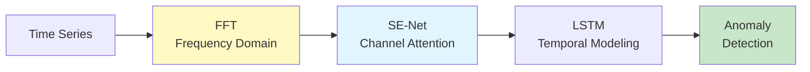

**Key Innovation**: Combines frequency and time domain for better accuracy.

**2024 Finding**: "FFT can greatly improve the accuracy of detecting time domain data."

### 5.4 Best Practices for Time Series (2024)

**From 2024 Research**:

1. **Positional Encoding**:
   - Absolute PE performs well (98% accuracy)
   - Critical for Transformer-based methods

2. **Threshold Determination**:
   - Model errors using Gaussian distribution
   - Use MLE for parameter estimation
   - Set threshold at 95th-99th percentile

3. **Hybrid Approaches**:
   - Combine LSTM + Transformer
   - Use FFT for frequency features
   - Apply attention mechanisms

4. **Evaluation**:
   - Use point-adjusted metrics (PA-AUC)
   - Consider early detection time
   - Measure false alarm rate

---

## 6. Hybrid & Ensemble Methods

### 6.1 Why Hybrid Methods? (2024-2025 SOTA)

**2024-2025 Research Consensus**: Combining multiple approaches yields best results.

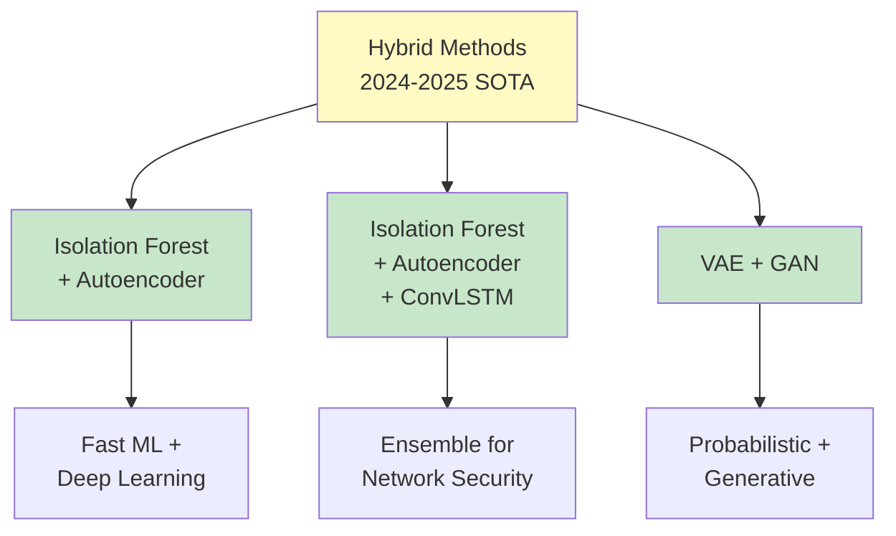

**2024 Research Quote**: "Recent research is developing ensemble approaches for anomaly detection that integrate isolation forest's ability to identify anomalies with autoencoders that excel in learning representations of complex data."

### 6.2 Two-Stage Architecture

**Pattern**: Fast ML → Deep Learning

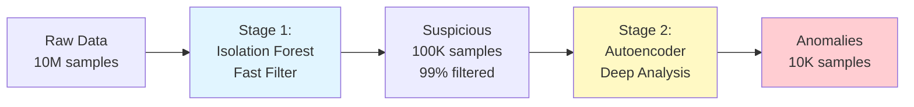

**Why This Works**:
- **Stage 1 (IF)**: Fast, scalable, filters obvious normals (O(n log n))
- **Stage 2 (AE)**: Expensive but accurate, only on suspicious samples

**2024 Production Best Practice**: Use this architecture for high-volume anomaly detection.

### 6.3 Implementation

```python
"""Hybrid Isolation Forest + Autoencoder anomaly detection.

2024 SOTA: Two-stage approach combining fast ML with deep learning.
"""

from typing import Tuple
import numpy as np
from sklearn.ensemble import IsolationForest
from sklearn.preprocessing import StandardScaler
import torch
import logging

logging.basicConfig(level=logging.INFO)
logger = logging.getLogger(__name__)


class HybridAnomalyDetector:
    """Two-stage hybrid detector: Isolation Forest + Autoencoder.

    2024 Best Practice: Use fast ML to filter, then deep learning
    for detailed analysis on suspicious samples only.

    Attributes:
        if_contamination: Isolation Forest contamination.
        if_model: Isolation Forest stage.
        ae_model: Autoencoder stage.
        scaler: Data scaler.
    """

    def __init__(
        self,
        if_contamination: float = 0.1,
        ae_threshold_percentile: float = 95
    ):
        """Initialize hybrid detector.

        Args:
            if_contamination: Stage 1 filter rate (keep top 10% suspicious).
            ae_threshold_percentile: Stage 2 threshold.
        """
        self.if_contamination = if_contamination
        self.ae_threshold_percentile = ae_threshold_percentile

        self.if_model = None
        self.ae_model = None
        self.scaler = None

    def fit(
        self,
        X_train: np.ndarray,
        ae_epochs: int = 50
    ) -> 'HybridAnomalyDetector':
        """Fit two-stage detector.

        Args:
            X_train: Training data (mostly normal).
            ae_epochs: Autoencoder training epochs.

        Returns:
            self: Fitted detector.
        """
        logger.info("=== Stage 1: Training Isolation Forest ===")

        # Stage 1: Isolation Forest (fast filter)
        self.if_model = IsolationForest(
            contamination=self.if_contamination,
            n_estimators=100,
            random_state=42,
            n_jobs=-1
        )
        self.if_model.fit(X_train)

        logger.info(f"Isolation Forest trained on {len(X_train)} samples")

        logger.info("\n=== Stage 2: Training Autoencoder ===")

        # Stage 2: Autoencoder (on full training set)
        # Note: In production, could train only on "normal" subset from IF

        from anomaly_detection_complete_guide_part2 import AnomalyDetectorAutoencoder

        self.ae_model = AnomalyDetectorAutoencoder(
            input_dim=X_train.shape[1],
            encoding_dims=[128, 64, 32],
            latent_dim=16,
            use_residual=True
        )

        self.ae_model.fit(
            X_train,
            epochs=ae_epochs,
            batch_size=256,
            threshold_percentile=self.ae_threshold_percentile
        )

        logger.info("Hybrid detector trained successfully!")

        return self

    def predict(self, X: np.ndarray) -> np.ndarray:
        """Two-stage prediction.

        Args:
            X: Data to predict.

        Returns:
            Binary labels (1 = anomaly, 0 = normal).
        """
        if self.if_model is None or self.ae_model is None:
            raise ValueError("Detector not fitted yet")

        logger.info(f"Predicting on {len(X)} samples...")

        # Stage 1: Isolation Forest filter
        if_scores = -self.if_model.score_samples(X)
        if_threshold = np.percentile(if_scores, (1 - self.if_contamination) * 100)

        suspicious_mask = if_scores > if_threshold
        n_suspicious = suspicious_mask.sum()

        logger.info(f"Stage 1: {n_suspicious}/{len(X)} samples passed to Stage 2 "
                   f"({100*n_suspicious/len(X):.1f}%)")

        # Stage 2: Autoencoder on suspicious samples
        predictions = np.zeros(len(X), dtype=np.int32)

        if n_suspicious > 0:
            X_suspicious = X[suspicious_mask]
            ae_predictions = self.ae_model.predict(X_suspicious)

            predictions[suspicious_mask] = ae_predictions

            n_anomalies = ae_predictions.sum()
            logger.info(f"Stage 2: {n_anomalies}/{n_suspicious} flagged as anomalies")

        return predictions

    def anomaly_score(self, X: np.ndarray) -> np.ndarray:
        """Compute hybrid anomaly scores.

        Combines IF and AE scores.

        Args:
            X: Data to score.

        Returns:
            Anomaly scores (higher = more anomalous).
        """
        # IF scores
        if_scores = -self.if_model.score_samples(X)

        # AE scores
        ae_scores = self.ae_model.anomaly_score(X)

        # Normalize and combine (weighted average)
        # 2024 Best Practice: tune weights on validation set
        if_scores_norm = (if_scores - if_scores.min()) / (if_scores.max() - if_scores.min() + 1e-10)
        ae_scores_norm = (ae_scores - ae_scores.min()) / (ae_scores.max() - ae_scores.min() + 1e-10)

        # Weight: 0.3 IF + 0.7 AE (AE is more accurate but slower)
        hybrid_scores = 0.3 * if_scores_norm + 0.7 * ae_scores_norm

        return hybrid_scores


# Example usage
if __name__ == "__main__":
    from sklearn.datasets import make_blobs

    # Generate data
    np.random.seed(42)

    X_normal, _ = make_blobs(n_samples=9000, centers=3, n_features=20, random_state=42)
    X_anomalies = np.random.uniform(-10, 10, size=(100, 20))

    X_train = X_normal[:7000]
    X_test = np.vstack([X_normal[7000:], X_anomalies])
    y_test = np.hstack([np.zeros(2000), np.ones(100)]).astype(np.int32)

    print("=== Hybrid Anomaly Detector (IF + AE) ===")
    print(f"Training: {len(X_train)} samples")
    print(f"Test: {len(X_test)} ({y_test.sum()} anomalies)")

    # Train hybrid
    detector = HybridAnomalyDetector(
        if_contamination=0.1,  # Stage 1 keeps top 10%
        ae_threshold_percentile=95
    )

    detector.fit(X_train, ae_epochs=30)

    # Predict
    predictions = detector.predict(X_test)

    # Evaluate
    from sklearn.metrics import precision_score, recall_score, f1_score

    precision = precision_score(y_test, predictions)
    recall = recall_score(y_test, predictions)
    f1 = f1_score(y_test, predictions)

    print(f"\nResults:")
    print(f"Precision: {precision:.3f}")
    print(f"Recall: {recall:.3f}")
    print(f"F1-Score: {f1:.3f}")
```

### 6.4 2025 SOTA: IF + AE + ConvLSTM

**2025 Research**: Hybrid framework for network anomaly detection:

1. **Isolation Forest**: Efficient outlier partitioning
2. **Autoencoder**: Latent feature extraction
3. **ConvLSTM**: Spatial-temporal patterns

**Result**: "Revolutionizing anomaly detection" with superior performance on network traffic data.

---

## 7. Production Deployment

### 7.1 Production Architecture

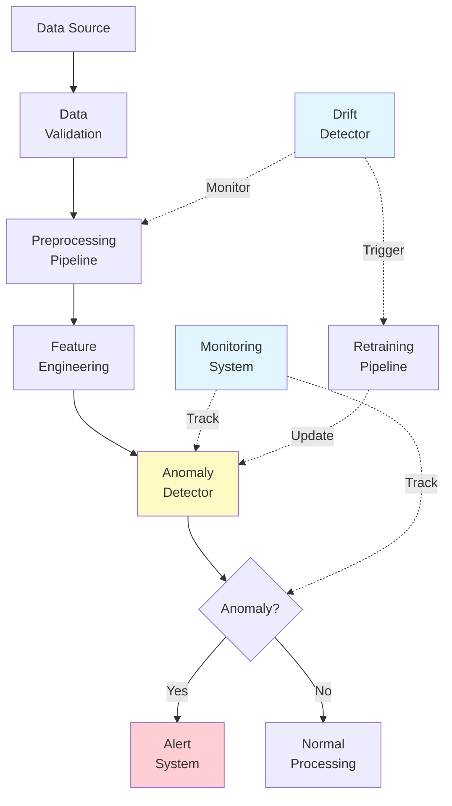

### 7.2 Key Components

**1. Data Validation**:
```python
def validate_input(X: np.ndarray) -> Tuple[bool, str]:
    """Validate input data before prediction.

    2024 Best Practice: Always validate production inputs.
    """
    # Check for NaN/Inf
    if np.any(np.isnan(X)) or np.any(np.isinf(X)):
        return False, "Data contains NaN or Inf"

    # Check feature dimension
    if X.shape[1] != EXPECTED_FEATURES:
        return False, f"Expected {EXPECTED_FEATURES} features, got {X.shape[1]}"

    # Check value ranges
    if np.any(X < VALID_MIN) or np.any(X > VALID_MAX):
        return False, "Feature values out of expected range"

    return True, "Valid"
```

**2. Monitoring Metrics**:
```python
# Track these metrics in production
metrics_to_monitor = {
    'predictions_per_second': 1000,
    'anomaly_rate': 0.01,  # 1%
    'avg_prediction_latency_ms': 10,
    'p95_prediction_latency_ms': 20,
    'false_positive_rate': 0.05,  # Target < 5%
    'false_negative_rate': 0.10,  # Target < 10%
}
```

**3. Alerting Thresholds**:
```python
# Alert if metrics deviate
ALERT_CONDITIONS = {
    'anomaly_rate_increase': 0.05,  # Alert if rate increases by 5%
    'latency_p95_threshold_ms': 50,  # Alert if p95 > 50ms
    'error_rate_threshold': 0.01,  # Alert if errors > 1%
}
```

### 7.3 Implementation

```python
"""Production-grade anomaly detection system.

2024 Best Practices:
- Data validation
- Monitoring and alerting
- Graceful degradation
- Versioning
"""

from typing import Dict, Optional, Tuple
from dataclasses import dataclass
from datetime import datetime
import numpy as np
import json
from pathlib import Path
import logging

logging.basicConfig(level=logging.INFO)
logger = logging.getLogger(__name__)


@dataclass
class PredictionResult:
    """Container for prediction results."""
    prediction: int  # 0 = normal, 1 = anomaly
    score: float
    latency_ms: float
    timestamp: str
    model_version: str


class ProductionAnomalyDetector:
    """Production-ready anomaly detector with monitoring.

    2024 Best Practices integrated:
    - Input validation
    - Prediction tracking
    - Performance monitoring
    - Graceful error handling
    """

    def __init__(
        self,
        model_path: Path,
        version: str = "1.0.0"
    ):
        """Initialize production detector.

        Args:
            model_path: Path to trained model artifacts.
            version: Model version.
        """
        self.model_path = model_path
        self.version = version

        # Load model (placeholder - use actual model loading)
        self.model = self._load_model()
        self.scaler = self._load_scaler()

        # Monitoring
        self.prediction_count = 0
        self.anomaly_count = 0
        self.error_count = 0
        self.latencies = []

        logger.info(f"Loaded model version {version} from {model_path}")

    def _load_model(self):
        """Load trained model."""
        # Placeholder - implement actual loading
        return None

    def _load_scaler(self):
        """Load fitted scaler."""
        # Placeholder
        return None

    def validate_input(
        self,
        X: np.ndarray
    ) -> Tuple[bool, Optional[str]]:
        """Validate input data.

        Args:
            X: Input data.

        Returns:
            Tuple of (is_valid, error_message).
        """
        # Check for NaN/Inf
        if np.any(np.isnan(X)) or np.any(np.isinf(X)):
            return False, "Input contains NaN or Inf values"

        # Check shape
        if X.ndim != 2:
            return False, f"Expected 2D input, got {X.ndim}D"

        # Check feature count
        expected_features = 20  # Example
        if X.shape[1] != expected_features:
            return False, (
                f"Expected {expected_features} features, "
                f"got {X.shape[1]}"
            )

        return True, None

    def predict(
        self,
        X: np.ndarray,
        return_score: bool = True
    ) -> PredictionResult:
        """Predict with monitoring.

        Args:
            X: Input data (single sample).
            return_score: Whether to compute anomaly score.

        Returns:
            PredictionResult with prediction and metadata.
        """
        start_time = datetime.now()

        try:
            # Validate
            is_valid, error_msg = self.validate_input(X)
            if not is_valid:
                logger.error(f"Validation failed: {error_msg}")
                self.error_count += 1
                raise ValueError(error_msg)

            # Predict (placeholder - use actual model)
            prediction = 0  # 0 = normal, 1 = anomaly
            score = 0.5

            # Update counts
            self.prediction_count += 1
            if prediction == 1:
                self.anomaly_count += 1

            # Compute latency
            latency_ms = (datetime.now() - start_time).total_seconds() * 1000
            self.latencies.append(latency_ms)

            # Create result
            result = PredictionResult(
                prediction=prediction,
                score=score,
                latency_ms=latency_ms,
                timestamp=datetime.now().isoformat(),
                model_version=self.version
            )

            # Log if anomaly
            if prediction == 1:
                logger.warning(f"Anomaly detected: score={score:.3f}")

            return result

        except Exception as e:
            self.error_count += 1
            logger.error(f"Prediction error: {e}")
            raise

    def get_metrics(self) -> Dict:
        """Get monitoring metrics.

        Returns:
            Dictionary of metrics.
        """
        metrics = {
            'total_predictions': self.prediction_count,
            'total_anomalies': self.anomaly_count,
            'anomaly_rate': self.anomaly_count / max(self.prediction_count, 1),
            'error_count': self.error_count,
            'error_rate': self.error_count / max(self.prediction_count, 1),
        }

        if self.latencies:
            metrics.update({
                'avg_latency_ms': np.mean(self.latencies),
                'p50_latency_ms': np.percentile(self.latencies, 50),
                'p95_latency_ms': np.percentile(self.latencies, 95),
                'p99_latency_ms': np.percentile(self.latencies, 99),
            })

        return metrics

    def check_health(self) -> Tuple[bool, Dict]:
        """Health check for monitoring systems.

        Returns:
            Tuple of (is_healthy, metrics).
        """
        metrics = self.get_metrics()

        # Define health criteria
        is_healthy = True
        issues = []

        # Check error rate
        if metrics.get('error_rate', 0) > 0.01:  # > 1%
            is_healthy = False
            issues.append(f"High error rate: {metrics['error_rate']:.2%}")

        # Check latency
        if metrics.get('p95_latency_ms', 0) > 100:  # > 100ms
            is_healthy = False
            issues.append(f"High latency: {metrics['p95_latency_ms']:.1f}ms")

        # Check anomaly rate
        if metrics.get('anomaly_rate', 0) > 0.10:  # > 10%
            is_healthy = False
            issues.append(f"High anomaly rate: {metrics['anomaly_rate']:.2%}")

        health_report = {
            'is_healthy': is_healthy,
            'issues': issues,
            'metrics': metrics,
            'timestamp': datetime.now().isoformat()
        }

        if not is_healthy:
            logger.warning(f"Health check FAILED: {issues}")

        return is_healthy, health_report


# Example usage
if __name__ == "__main__":
    detector = ProductionAnomalyDetector(
        model_path=Path("./models/anomaly_detector_v1"),
        version="1.0.0"
    )

    # Simulate predictions
    for i in range(100):
        X = np.random.randn(1, 20)
        result = detector.predict(X)

    # Check health
    is_healthy, report = detector.check_health()
    print(f"\nHealth Check: {'PASS' if is_healthy else 'FAIL'}")
    print(f"Metrics: {json.dumps(report['metrics'], indent=2)}")
```

---

## 8. Concept Drift & Model Retraining

### 8.1 What is Concept Drift?

**Concept Drift**: The statistical properties of the data change over time.

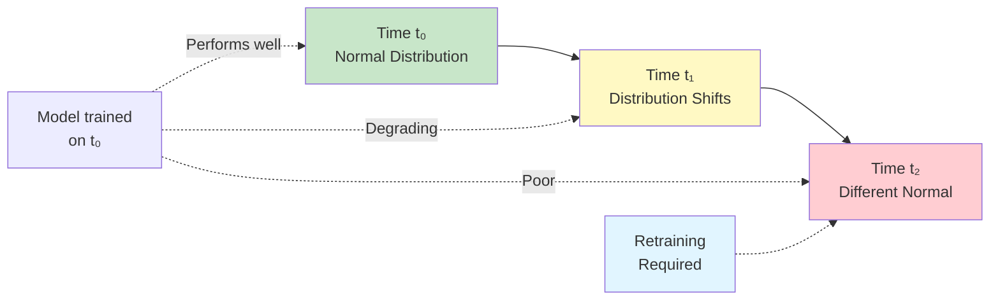

**Types of Drift**:

1. **Sudden Drift**: Abrupt change (e.g., new attack pattern)
2. **Gradual Drift**: Slow evolution (e.g., user behavior changes)
3. **Recurring Drift**: Seasonal patterns (e.g., holiday shopping)
4. **Incremental Drift**: Continuous small changes

### 8.2 Drift Detection Methods (2024)

**2024 Research**: Multiple drift detection approaches exist.

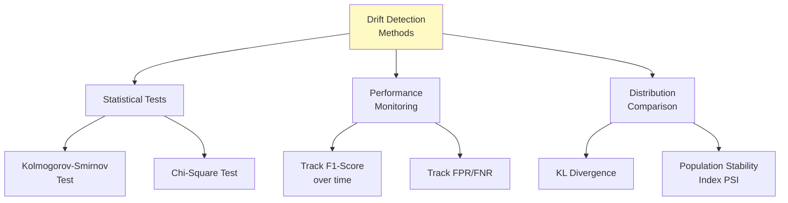

**DDM (Drift Detection Method)**:
- Monitors model's error rate
- Enters "warning" phase at threshold₁
- Enters "drift" phase at threshold₂
- Triggers retraining

**ADWIN (Adaptive Windowing)**:
- Dynamically maintains window of recent data
- Detects significant changes between sub-windows
- Automatically adjusts window size

### 8.3 Retraining Strategies (2024)

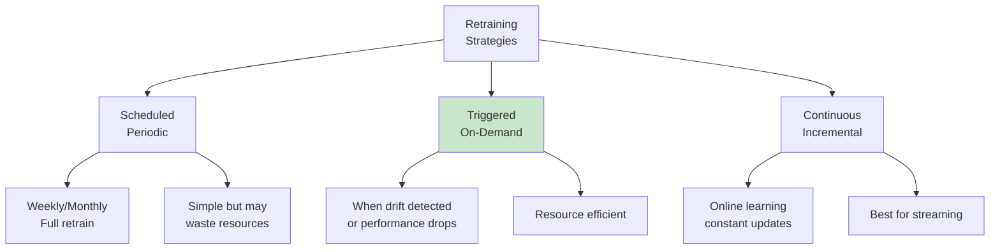

**2024 Best Practices**:

1. **Reactive Retraining** (Most Common):
   ```python
   if drift_detected or performance_degraded:
       retrain_model(recent_data)
   ```

2. **Incremental Updates**:
   ```python
   # For models supporting partial_fit
   model.partial_fit(new_batch_data)
   ```

3. **Full vs. Sliding Window**:
   - **Full History**: Retrain on all data
   - **Sliding Window**: Use only recent N samples
   - **2024 Recommendation**: Sliding window for non-stationary data

### 8.4 Multivariate Drift Detection with MMD

**Maximum Mean Discrepancy (MMD)** is a kernel-based method for multivariate drift detection that tests joint distribution changes.

**Why MMD?**:
- Tests **multivariate distribution** (not just individual features)
- Detects **correlated feature drift** that univariate tests miss
- No need for multiple testing correction

**2024 Research**: "MCD-DD uses maximum concept discrepancy and contrastive learning to adaptively identify various forms of concept drift" (ACM SIGKDD 2024)

**When to use**:
- ✅ Features are correlated
- ✅ Need to detect joint distribution shifts
- ✅ High-dimensional data (d > 50)

**Reference**: Alibi-Detect library implements MMD drift detection - https://docs.seldon.io/projects/alibi-detect/

### 8.5 Implementation

```python
"""Drift detection and retraining system.

2024 Best Practices:
- Bonferroni correction for multiple testing
- MMD for multivariate drift (see Alibi-Detect for implementation)
"""

from typing import Optional, Tuple
import numpy as np
from scipy import stats
from datetime import datetime, timedelta
import logging

logging.basicConfig(level=logging.INFO)
logger = logging.getLogger(__name__)


class DriftDetector:
    """Detect concept drift in production data.

    2024 Methods: KS-test for distribution drift, performance monitoring.
    """

    def __init__(
        self,
        reference_data: np.ndarray,
        ks_threshold: float = 0.05,
        performance_threshold: float = 0.1
    ):
        """Initialize drift detector.

        Args:
            reference_data: Reference distribution (training data).
            ks_threshold: P-value threshold for KS test.
            performance_threshold: Performance drop threshold.
        """
        self.reference_data = reference_data
        self.ks_threshold = ks_threshold
        self.performance_threshold = performance_threshold

        self.baseline_performance = None

    def detect_distribution_drift(
        self,
        current_data: np.ndarray,
        feature_idx: Optional[int] = None,
        use_bonferroni: bool = True
    ) -> Tuple[bool, float]:
        """Detect drift using Kolmogorov-Smirnov test with multiple testing correction.

        Args:
            current_data: Current production data.
            feature_idx: Feature to test (None = test all).
            use_bonferroni: Apply Bonferroni correction for multiple hypothesis testing.

        Returns:
            Tuple of (drift_detected, p_value).

        References:
            - Bonferroni correction: https://docs.seldon.io/projects/alibi-detect/
            - "When performing K independent univariate KS tests, Bonferroni requires
              p-value < α/K" (Alibi-Detect documentation, 2024)
        """
        if feature_idx is not None:
            # Test single feature (no correction needed)
            ref = self.reference_data[:, feature_idx]
            cur = current_data[:, feature_idx]

            statistic, p_value = stats.ks_2samp(ref, cur)

            drift_detected = p_value < self.ks_threshold

            if drift_detected:
                logger.warning(
                    f"Drift detected in feature {feature_idx}: "
                    f"p-value={p_value:.4f}"
                )

            return drift_detected, p_value
        else:
            # Test all features with Bonferroni correction
            n_features = self.reference_data.shape[1]

            # Bonferroni correction: adjust significance level
            if use_bonferroni:
                alpha_corrected = self.ks_threshold / n_features
                logger.info(
                    f"Using Bonferroni correction: α={self.ks_threshold} → "
                    f"α_corrected={alpha_corrected:.6f} for {n_features} features"
                )
            else:
                alpha_corrected = self.ks_threshold

            drift_detected = False
            min_p_value = 1.0
            drifted_features = []

            for i in range(n_features):
                ref = self.reference_data[:, i]
                cur = current_data[:, i]

                statistic, p_value = stats.ks_2samp(ref, cur)

                if p_value < min_p_value:
                    min_p_value = p_value

                if p_value < alpha_corrected:
                    drift_detected = True
                    drifted_features.append(i)
                    logger.warning(
                        f"Drift detected in feature {i}: "
                        f"p-value={p_value:.4f} < α_corrected={alpha_corrected:.6f}"
                    )

            if drift_detected:
                logger.warning(
                    f"Drift detected in {len(drifted_features)}/{n_features} features"
                )

            return drift_detected, min_p_value

    def detect_performance_drift(
        self,
        current_performance: float
    ) -> bool:
        """Detect drift based on performance degradation.

        Args:
            current_performance: Current F1-score or accuracy.

        Returns:
            True if performance degraded significantly.
        """
        if self.baseline_performance is None:
            self.baseline_performance = current_performance
            return False

        performance_drop = self.baseline_performance - current_performance

        if performance_drop > self.performance_threshold:
            logger.warning(
                f"Performance drift detected: "
                f"{self.baseline_performance:.3f} → {current_performance:.3f} "
                f"(drop: {performance_drop:.3f})"
            )
            return True

        return False


class AutoRetrainingSystem:
    """Automated retraining system with drift detection.

    2024 Best Practice: Combine drift detection with automated retraining.
    """

    def __init__(
        self,
        detector,  # Anomaly detection model
        drift_detector: DriftDetector,
        retrain_window_days: int = 30
    ):
        """Initialize auto-retraining system.

        Args:
            detector: Anomaly detection model.
            drift_detector: Drift detection system.
            retrain_window_days: Sliding window size for retraining.
        """
        self.detector = detector
        self.drift_detector = drift_detector
        self.retrain_window_days = retrain_window_days

        self.data_buffer = []
        self.last_retrain = datetime.now()

    def should_retrain(
        self,
        current_data: np.ndarray,
        current_performance: Optional[float] = None
    ) -> Tuple[bool, str]:
        """Determine if retraining is needed.

        Args:
            current_data: Recent production data.
            current_performance: Current model performance.

        Returns:
            Tuple of (should_retrain, reason).
        """
        # Check 1: Distribution drift
        drift_detected, p_value = self.drift_detector.detect_distribution_drift(
            current_data
        )

        if drift_detected:
            return True, f"Distribution drift detected (p={p_value:.4f})"

        # Check 2: Performance drift
        if current_performance is not None:
            perf_drift = self.drift_detector.detect_performance_drift(
                current_performance
            )

            if perf_drift:
                return True, "Performance degradation detected"

        # Check 3: Scheduled retrain (e.g., weekly)
        days_since_retrain = (datetime.now() - self.last_retrain).days

        if days_since_retrain >= 7:  # Weekly
            return True, f"Scheduled retrain (last: {days_since_retrain} days ago)"

        return False, "No retraining needed"

    def retrain(self, training_data: np.ndarray) -> None:
        """Retrain model.

        2024 Best Practice: Use sliding window of recent data.

        Args:
            training_data: Training data (recent window).
        """
        logger.info(f"Retraining model on {len(training_data)} samples...")

        # Retrain detector
        self.detector.fit(training_data)

        # Update drift detector reference
        self.drift_detector.reference_data = training_data

        # Reset baseline performance
        self.drift_detector.baseline_performance = None

        # Update last retrain time
        self.last_retrain = datetime.now()

        logger.info("Retraining complete!")


# Example usage
if __name__ == "__main__":
    from sklearn.datasets import make_blobs

    # Initial training data
    X_train, _ = make_blobs(n_samples=5000, centers=3, random_state=42)

    # Simulate production data with drift
    X_prod_normal, _ = make_blobs(n_samples=1000, centers=3, random_state=43)

    # Drifted data (different distribution)
    X_prod_drift, _ = make_blobs(
        n_samples=1000,
        centers=3,
        cluster_std=2.0,  # More variance
        random_state=44
    )

    # Setup drift detector
    drift_detector = DriftDetector(
        reference_data=X_train,
        ks_threshold=0.05
    )

    print("=== Drift Detection Demo ===")

    # Test on normal data
    print("\nTest 1: Normal production data (no drift expected)")
    drift, p_val = drift_detector.detect_distribution_drift(X_prod_normal)
    print(f"Drift detected: {drift} (p-value: {p_val:.4f})")

    # Test on drifted data
    print("\nTest 2: Drifted production data (drift expected)")
    drift, p_val = drift_detector.detect_distribution_drift(X_prod_drift)
    print(f"Drift detected: {drift} (p-value: {p_val:.4f})")
```

---

## 9. Interview Questions

### 9.1 Fundamentals

**Q1: Explain the difference between outlier detection and novelty detection.**

**Answer**:

**Outlier Detection**:
- Training data: Contains both normal and outliers (mixed)
- Goal: Find outliers in the training data itself
- Algorithms: Isolation Forest, LOF
- Assumption: Training data is contaminated

**Novelty Detection**:
- Training data: Contains only normal data (clean)
- Goal: Detect new/novel patterns at test time
- Algorithms: One-Class SVM (best suited)
- Assumption: Training data is NOT contaminated

**2024 Research Quote**: "One-Class SVM is sensitive to outliers and does not perform well for outlier detection, but is best suited for novelty detection when the training set is not contaminated."

**Example**:
- Outlier: Cleaning a dataset with mixed normal + anomalies
- Novelty: Detecting new types of network attacks (trained only on normal traffic)

---

**Q2: Why can't we use standard autoencoders for novelty detection?**

**Answer**:

**Problem**: Standard autoencoders can learn to reconstruct **anything**, including novel patterns, if they generalize too well.

**Solution**: Train on **normal data only** + use **reconstruction error threshold**.

**Key Insight**:
- Normal patterns: Seen during training → low reconstruction error
- Novel patterns: Never seen → high reconstruction error

**Best Practices** (2024):
1. Train only on verified normal data
2. Use validation set to determine threshold (95th percentile)
3. Add regularization (dropout, weight decay) to prevent overfitting
4. Consider VAE for better generalization control

---

**Q3: How do you determine the threshold for anomaly detection?**

**Answer**:

**Methods** (2024 Best Practices):

1. **Percentile-based** (Most Common):
   ```python
   # Compute scores on normal validation set
   scores = detector.anomaly_score(X_val_normal)

   # Set threshold at 95th percentile
   threshold = np.percentile(scores, 95)
   # Means: top 5% of normal data flagged as anomalies (tolerable)
   ```

2. **Business-driven**:
   ```python
   # Set based on acceptable false positive rate
   target_fpr = 0.01  # 1% false positives acceptable

   # Find threshold that achieves target FPR
   threshold = find_threshold_for_fpr(scores, target_fpr)
   ```

3. **Statistical** (for Gaussian assumptions):
   ```python
   # Mean + k * std (e.g., k=3 for 99.7%)
   threshold = mean + 3 * std
   ```

4. **Validation-based** (Best for production):
   ```python
   # Tune on validation set with known anomalies
   # Maximize F1-score
   for threshold in threshold_range:
       predictions = scores > threshold
       f1 = f1_score(y_val, predictions)
       # Select threshold with max F1
   ```

**2024 Research**: "Prediction errors from training data are modeled using Gaussian distribution, with parameters computed using MLE."

---

### 9.2 Deep Learning

**Q4: Compare Autoencoders vs GANs for anomaly detection.**

**Answer**:

| Aspect | Autoencoder | GAN |
|--------|-------------|-----|
| **Training** | Reconstruction loss (stable) | Adversarial loss (unstable) |
| **Speed** | Fast | Slower (two networks) |
| **Quality** | Good reconstructions | Excellent generation |
| **Complexity** | Simple architecture | Complex (G + D) |
| **Use Case** | General anomaly detection | When generation quality matters |
| **2024 Status** | More common in production | Research, specific use cases |

**2024 Research Finding**: "GAN networks show superior performance in anomaly detection tasks, though they suffer from training instability."

**When to use GANs**:
- ✅ Image anomaly detection (high-quality generation needed)
- ✅ When you need to generate synthetic normal samples
- ✅ Research/experimentation

**When to use Autoencoders**:
- ✅ Production systems (more stable)
- ✅ General-purpose anomaly detection
- ✅ Faster training required

---

**Q5: Explain the 2024-2025 trend toward hybrid methods.**

**Answer**:

**Trend**: Combining fast ML + deep learning achieves best results.

**Why Hybrid?**:

1. **Complementary Strengths**:
   - Isolation Forest: Fast, scalable, global anomalies
   - Autoencoder: Accurate, complex patterns, local anomalies

2. **Cost-Efficiency**:
   - Use cheap ML to filter 99% of data
   - Use expensive DL only on suspicious 1%

3. **Better Performance**:
   - 2024 Research: "Ensemble approaches integrating isolation forest + autoencoders" show superior results

**Architecture** (2024 SOTA):
```
Stage 1 (Fast): Isolation Forest
  ↓ Filter 90-99% normal
Stage 2 (Accurate): Autoencoder or Transformer
  ↓ Detailed analysis
Final: High-precision anomaly detection
```

**2025 SOTA Example**:
- **IF + AE + ConvLSTM**: "Revolutionizing anomaly detection" for network security
- Combines efficient partitioning + feature learning + temporal patterns

---

### 9.3 Time Series

**Q6: Why do LSTMs work better than standard autoencoders for time series?**

**Answer**:

**LSTM Advantages**:

1. **Memory**: LSTM remembers long-term dependencies
   ```
   h_t = f(h_{t-1}, x_t)
   # h_t carries information from past
   ```

2. **Sequential**: Processes time series sequentially
   - Captures temporal order
   - Learns patterns over time

3. **Gating Mechanisms**:
   - Forget gate: Discard irrelevant past
   - Input gate: Update with new info
   - Output gate: Control information flow

**Standard AE Problem**:
- Treats each timestep independently
- No temporal modeling
- Misses sequential patterns

**2024 Research**: "LSTM autoencoders remain effective for time series anomaly detection when temporal patterns matter."

**Example**:
```python
# LSTM captures: "Value 100 is normal at t=10, but anomaly at t=50"
# Standard AE: Only sees "Value 100" without context
```

---

**Q7: Compare LSTM vs Transformer for time series anomaly detection (2024).**

**Answer**:

| Feature | LSTM | Transformer |
|---------|------|-------------|
| **Long-range Dependencies** | Limited (vanishing gradient) | Excellent (self-attention) |
| **Training Speed** | Slow (sequential) | Fast (parallel) |
| **Memory** | O(1) per step | O(n²) for attention |
| **Performance** | Good | **Better** (2024 SOTA) |
| **Interpretability** | Black box | Attention weights explain |

**2024 Research Quote**: "Transformer-based models typically outperform others in anomaly detection tasks, as they are better at handling long-range dependencies."

**When to use LSTM**:
- ✅ Short sequences (< 100 timesteps)
- ✅ Limited compute/memory
- ✅ Online/streaming (constant memory)

**When to use Transformer**:
- ✅ Long sequences (> 100 timesteps)
- ✅ Need interpretability (attention visualization)
- ✅ Batch processing (leverage parallelism)
- ✅ **2024 Default Choice** for time series

**2024 SOTA**:
- **Anomaly Transformer**: Anomaly-awareness mechanism
- **TranAD**: Transformer + GAN adversarial training

---

### 9.4 Production

**Q8: Your anomaly detector's false positive rate is increasing in production. What do you investigate?**

**Answer** (2024 Systematic Approach):

**Step 1: Identify the Issue**
```python
# Check metrics
if current_fpr > baseline_fpr * 1.5:
    investigate()
```

**Step 2: Possible Causes**

1. **Concept Drift** (Most Common):
   ```python
   # Check if data distribution changed
   ks_stat, p_value = ks_2samp(training_data, production_data)
   if p_value < 0.05:
       print("Distribution drift detected")
       # Solution: Retrain with recent data
   ```

2. **Threshold Miscalibration**:
   ```python
   # Threshold set too low
   # Solution: Re-calibrate on recent normal data
   new_threshold = np.percentile(recent_scores, 95)
   ```

3. **Seasonal Changes**:
   ```python
   # Normal behavior changed (e.g., holidays)
   # Solution: Seasonal models or feature engineering
   ```

4. **Data Quality Issues**:
   ```python
   # Missing values, encoding changes, scaling issues
   # Solution: Improve data validation pipeline
   ```

**Step 3: Actions** (2024 Best Practices):

1. **Immediate** (Reduce FPR now):
   - Increase threshold temporarily
   - Add manual review for borderline cases

2. **Short-term** (1-7 days):
   - Retrain on recent data (sliding window)
   - Update threshold using recent normals

3. **Long-term**:
   - Implement automated drift detection
   - Setup continuous retraining pipeline
   - Add more features for robustness

**2024 Research**: "Combining Isolation Forest's efficient detection with automated drift detection and retraining mechanisms provides robust solution."

---

**Q9: How do you handle class imbalance in anomaly detection during evaluation?**

**Answer**:

**Problem**: 99:1 or 999:1 ratios make standard metrics useless.

**2024 Best Practices**:

1. **Never Use Accuracy**:
   ```python
   # BAD: 99% accuracy is useless
   # A model predicting "normal" 100% gets 99% accuracy!
   ```

2. **Use PR-AUC** (Primary Metric):
   ```python
   from sklearn.metrics import average_precision_score

   pr_auc = average_precision_score(y_true, scores)
   # Focuses on minority class (anomalies)
   # More informative than ROC-AUC for imbalanced data
   ```

3. **Use F1-Score**:
   ```python
   f1 = f1_score(y_true, y_pred)
   # Balances precision and recall
   # Single metric for model comparison
   ```

4. **Report Precision AND Recall**:
   ```python
   precision = TP / (TP + FP)  # Of detected, how many are real?
   recall = TP / (TP + FN)     # Of real, how many detected?

   # Trade-off based on business cost:
   # - High cost of false alarms → prioritize precision
   # - High cost of missed anomalies → prioritize recall
   ```

5. **Use Confusion Matrix**:
   ```python
   # Gives complete picture
   from sklearn.metrics import confusion_matrix

   tn, fp, fn, tp = confusion_matrix(y_true, y_pred).ravel()
   # Analyze false positives vs false negatives
   ```

**2024 Research Quote**: "PR-AUC focuses on precision-recall trade-offs, making it more informative for highly imbalanced datasets where anomalies are rare."

---

**Q10: Design an anomaly detection system for real-time fraud detection (1M transactions/day).**

**Answer** (2024 Production Architecture):

**Requirements Analysis**:
- Volume: 1M/day ≈ 12 transactions/sec (peak: 50-100/sec)
- Latency: < 100ms per transaction
- Accuracy: High precision (low false positives), reasonable recall

**Architecture** (2-Stage Hybrid):

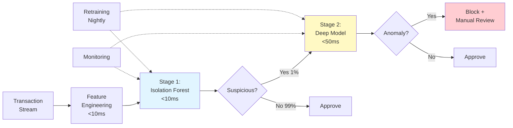

**Implementation Details**:

1. **Feature Engineering** (<10ms):
   ```python
   features = [
       'amount', 'merchant_category', 'time_of_day',
       'location_distance_from_home',
       'velocity_1h',  # Transactions in last hour
       'amount_vs_avg_30d',  # Compared to user's average
       # ... 20-30 features total
   ]
   ```

2. **Stage 1: Isolation Forest** (<10ms):
   ```python
   # Fast filter (99% throughput)
   if_score = if_model.score_samples(features)

   if if_score > threshold_stage1:
       pass_to_stage2()
   else:
       approve()  # 99% of transactions
   ```

3. **Stage 2: Deep Model** (<50ms):
   ```python
   # Accurate model (1% throughput)
   # LSTM or Transformer for sequential patterns

   deep_score = deep_model.predict(features + transaction_history)

   if deep_score > threshold_stage2:
       block_and_review()
   else:
       approve()
   ```

4. **Monitoring**:
   ```python
   metrics = {
       'transactions_per_second': 12,
       'stage1_filter_rate': 0.99,
       'stage2_anomaly_rate': 0.01,
       'p95_latency_ms': 15,
       'false_positive_rate': 0.001,  # 0.1%
   }
   ```

5. **Retraining**:
   ```python
   # Nightly retraining on last 30 days
   # Incremental updates for IF (fast)
   # Full retrain for deep model weekly
   ```

**2024 Best Practices Applied**:
- ✅ Two-stage hybrid (fast ML + deep learning)
- ✅ Monitoring and alerting
- ✅ Automated retraining
- ✅ Graceful degradation (if stage 2 fails, use stage 1 only)

---

## 10. Best Practices Checklist

### 10.1 Data Preparation

- [ ] Remove or handle missing values
- [ ] Standardize/normalize features (critical for distance-based methods)
- [ ] Handle outliers in training data (use robust scalers)
- [ ] Split data properly (train on normal, validate with mix)
- [ ] Check for data leakage

### 10.2 Model Selection

- [ ] Start with Isolation Forest as baseline (2024 default)
- [ ] Consider One-Class SVM only if training data is clean
- [ ] Use LOF for multi-modal or local anomalies
- [ ] Try autoencoders for high-dimensional data
- [ ] Consider LSTM/Transformer for time series
- [ ] Experiment with hybrid methods (2024 SOTA)

### 10.3 Threshold Selection

- [ ] Never use arbitrary threshold
- [ ] Use validation set with known anomalies
- [ ] Try percentile-based (95th percentile on normal data)
- [ ] Consider business costs (FP vs FN)
- [ ] Re-calibrate periodically in production

### 10.4 Evaluation

- [ ] **Never use accuracy** for imbalanced data
- [ ] Report PR-AUC (primary metric)
- [ ] Report F1-Score
- [ ] Report Precision AND Recall separately
- [ ] Use confusion matrix for full picture
- [ ] Compare against baselines

### 10.5 Production Deployment

- [ ] Implement input validation
- [ ] Add monitoring (latency, throughput, anomaly rate)
- [ ] Set up alerting (performance degradation, high FPR)
- [ ] Version models and track metadata
- [ ] Implement drift detection
- [ ] Setup automated retraining pipeline
- [ ] Plan for graceful degradation
- [ ] Document threshold rationale

### 10.6 Drift & Retraining

- [ ] Monitor data distribution (KS-test, PSI)
- [ ] Track model performance over time
- [ ] Implement automated drift detection
- [ ] Setup retraining triggers (drift or performance drop)
- [ ] Use sliding window for non-stationary data
- [ ] Test retrained models before deployment
- [ ] Keep model history for rollback

---

## Summary - Part 2

This concludes Part 2 of the Anomaly Detection Complete Guide. We covered:

### Deep Learning Methods (2024-2025 SOTA)

1. **Autoencoders**:
   - Basic, Denoising, **Residual** (2024 SOTA)
   - Reconstruction error for anomaly scoring

2. **VAE**:
   - Probabilistic latent space
   - β-VAE for better control

3. **GANs**:
   - Superior generation quality
   - SAE-GAN (2025 SOTA)
   - Training instability challenge

4. **Transformers**:
   - **Best for time series** (2024)
   - Anomaly Transformer, TranAD
   - Self-attention captures long-range dependencies

### Time Series (2024 Research)

- **LSTM Autoencoders**: Effective for temporal patterns
- **F-SE-LSTM**: FFT + attention (2024)
- **Transformers**: Outperform RNNs (2024 SOTA)
- Positional encoding matters (Absolute PE = 98% accuracy)

### Hybrid Methods (2024-2025 SOTA)

- **Two-stage**: IF + Autoencoder
- **Three-stage**: IF + AE + ConvLSTM (2025)
- Fast ML filters 99%, DL analyzes 1%
- Best performance in production

### Production Deployment

- Data validation pipelines
- Monitoring and alerting
- Graceful degradation
- Health checks

### Concept Drift (2024 Best Practices)

- KS-test for distribution drift
- Performance monitoring
- Automated retraining (reactive, triggered)
- Sliding window approach

### Key 2024-2025 Findings

- **Hybrid approaches are SOTA** (IF + Autoencoders)
- **Transformers outperform LSTMs** for time series
- **PR-AUC is primary metric** for imbalanced data
- **Drift detection is critical** for production
- **Residual autoencoders** improve performance

---

**Complete Guide Summary**:
- **Part 1**: Statistical, Isolation Forest, One-Class SVM, LOF, Evaluation
- **Part 2**: Deep Learning, Time Series, Hybrid, Production, Drift, Interviews

---

## References

### Official Documentation & Libraries
1. **PyTorch Official Documentation**: https://pytorch.org/docs/stable/index.html
2. **PyTorch VAE Example**: https://github.com/pytorch/examples/tree/main/vae
3. **PyTorch Forums - VAE Loss Discussion**: https://discuss.pytorch.org/t/variational-autoencoder-loss-function-mse-vs-bce/105694
4. **Alibi-Detect Documentation** (Drift Detection): https://docs.seldon.io/projects/alibi-detect/
5. **scikit-learn Metrics**: https://scikit-learn.org/stable/modules/model_evaluation.html

### Deep Learning for Anomaly Detection (2024)
6. **Nature Scientific Reports** (2024). "Enhanced federated anomaly detection through autoencoders using summary statistics-based thresholding" https://www.nature.com/articles/s41598-024-76961-2
7. **MDPI Mathematics** (2024). "Anomaly Detection in Fractal Time Series with LSTM Autoencoders" https://www.mdpi.com/2227-7390/12/19/3079
8. **PMC** (2024). "LSTM-Autoencoder Based Anomaly Detection Using Vibration Data of Wind Turbines" https://pmc.ncbi.nlm.nih.gov/articles/PMC11086143/
9. **arXiv:2404.04311** (2024). "A Real-time Anomaly Detection Using Convolutional Autoencoder with Dynamic Threshold"
10. **arXiv:2402.03724** (2024). "Statistical Test for Anomaly Detections by Variational Auto-Encoders"

### Variational Autoencoders (VAE)
11. **Higgins, I., et al.** (2017). "beta-VAE: Learning Basic Visual Concepts with a Constrained Variational Framework." *ICLR 2017*. OpenReview: https://openreview.net/forum?id=Sy2fzU9gl
12. **arXiv:1804.03599** (2018). "Understanding disentangling in β-VAE"
13. **arXiv:2507.02619** (2024). "L-VAE: Variational Auto-Encoder with Learnable Beta for Disentangled Representation"

### Transformer-Based Methods
14. **Tuli, S., Casale, G. and Jennings, N.R.** (2022). "TranAD: Deep Transformer Networks for Anomaly Detection in Multivariate Time Series Data." *PVLDB, 15(6): 1201-1214*. arXiv:2201.07284
   - Official Repository: https://github.com/imperial-qore/TranAD
15. **ACM Conference 2024**: "Real-Time Anomaly Detection with LSTM-Autoencoder Network on Microcontrollers for Industrial Applications"

### Time Series & LSTM Autoencoders
16. **Curiousily** (2024). "Time Series Anomaly Detection using LSTM Autoencoders with PyTorch in Python" https://curiousily.com/posts/time-series-anomaly-detection-using-lstm-autoencoder-with-pytorch-in-python/
17. **Machine Learning Mastery**: "A Gentle Introduction to LSTM Autoencoders" https://machinelearningmastery.com/lstm-autoencoders/
18. **arXiv:2204.06701**: "LSTM-Autoencoder based Anomaly Detection for Indoor Air Quality Time Series Data"

### Concept Drift Detection
19. **ACM SIGKDD 2024**: "Online Drift Detection with Maximum Concept Discrepancy" https://dl.acm.org/doi/10.1145/3637528.3672016
20. **arXiv:2407.05375** (2024). "Online Drift Detection with Maximum Concept Discrepancy"
21. **arXiv:2205.12706**: "Maximum Mean Discrepancy on Exponential Windows for Online Change Detection"
22. **Alibi-Detect**: "Kolmogorov-Smirnov data drift detector on CIFAR-10" https://docs.seldon.io/projects/alibi-detect/en/latest/examples/cd_ks_cifar10.html
23. **Alibi-Detect**: "Maximum Mean Discrepancy drift detector" https://docs.seldon.io/projects/alibi-detect/en/latest/cd/methods/mmddrift.html

### Hybrid & Ensemble Methods (2024-2025)
24. **Research on Hybrid Approaches** (2024): "Combining isolation forest's ability to identify anomalies with autoencoders that excel in learning representations of complex data"
25. **Network Security 2025**: "Hybrid framework combining Isolation Forest + Autoencoder + ConvLSTM for anomaly detection"

### GAN-Based Anomaly Detection
26. **Schlegl, T., et al.** (2017). "Unsupervised Anomaly Detection with Generative Adversarial Networks to Guide Marker Discovery." *IPMI 2017*
27. **Zenati, H., et al.** (2018). "Efficient GAN-Based Anomaly Detection." *ICLR Workshop 2018*
28. **Akcay, S., Atapour-Abarghouei, A. and Breckon, T.P.** (2018). "GANomaly: Semi-supervised anomaly detection via adversarial training." *ACCV 2018*

### Statistical Methods & Thresholding
29. **Chen Chen** (2024). "Maximum Mean Discrepancy for Dummies" https://chchannn.github.io/posts/maximum-mean-discrepancy-for-dummies/
30. **Dataiku Blog**: "Towards Reliable MLOps with Drift Detectors" https://blog.dataiku.com/towards-reliable-mlops-with-drift-detectors

### Best Practices & Production Deployment
31. **Towards Data Science**: Multiple articles on anomaly detection in production
32. **Medium - Various Authors**: Practical implementation guides for LSTM autoencoders, VAE, and production deployment

### Cross-References
- **See Part 1 References** for: Isolation Forest, One-Class SVM, LOF, Evaluation Metrics foundations

---

*Part of ML/AI Documentation Series - Anomaly Detection*
