# Clustering Algorithms - Complete Guide (Part 1: Fundamentals & Traditional Methods)

A comprehensive deep-dive into clustering algorithms, from fundamentals to production deployment.

---

## Table of Contents - Part 1

1. [Introduction](#1-introduction)
2. [Clustering Fundamentals](#2-clustering-fundamentals)
3. [K-Means Clustering](#3-k-means-clustering)
4. [Hierarchical Clustering](#4-hierarchical-clustering)
5. [Density-Based Clustering (DBSCAN)](#5-density-based-clustering-dbscan)
6. [Gaussian Mixture Models (GMM)](#6-gaussian-mixture-models-gmm)
7. [Clustering Evaluation Metrics](#7-clustering-evaluation-metrics)
8. [Choosing the Right Algorithm](#8-choosing-the-right-algorithm)

**See Part 2 for**: Advanced methods (HDBSCAN, Spectral, Deep Clustering), Time Series Clustering, Production Deployment, and Interview Questions.

---

## 1. Introduction

### What You'll Learn

This comprehensive guide covers clustering algorithms used in machine learning and data science:

- **Traditional Methods**: K-Means, Hierarchical, DBSCAN, GMM
- **Advanced Techniques**: HDBSCAN, Spectral Clustering, Deep Clustering (Part 2)
- **Evaluation Metrics**: Silhouette, Davies-Bouldin, Calinski-Harabasz
- **Production Deployment**: Scalability, distributed clustering, optimization (Part 2)
- **Real-world Applications**: Customer segmentation, anomaly detection, image clustering

### What is Clustering?

**Clustering** is an unsupervised machine learning technique that groups similar data points together without predefined labels. It's the foundation of exploratory data analysis and pattern discovery.

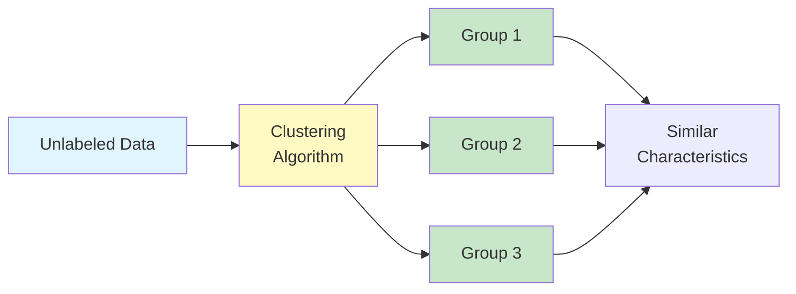

**Key Characteristics**:
- **Unsupervised**: No ground truth labels required
- **Exploratory**: Discover hidden patterns in data
- **Flexible**: Various algorithms for different data structures
- **Scalable**: From small datasets to big data

### Clustering vs Classification

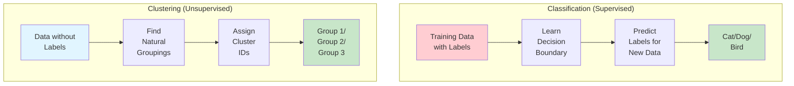

| Aspect | Classification | Clustering |
|--------|---------------|------------|
| **Learning Type** | Supervised | Unsupervised |
| **Labels** | Required for training | Not required |
| **Goal** | Predict predefined classes | Discover groups |
| **Evaluation** | Accuracy, F1-score | Silhouette, cohesion |
| **Use Case** | Spam detection | Customer segmentation |

### Real-World Applications

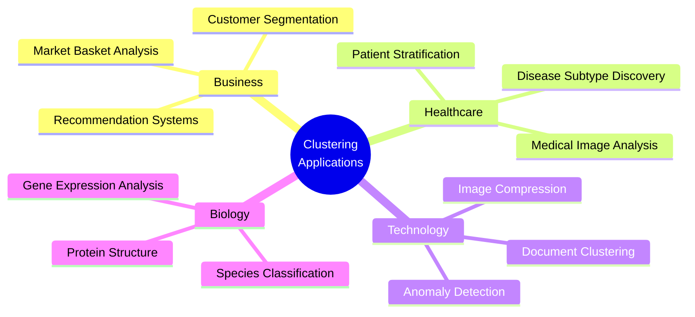

**Industry Examples**:
1. **E-commerce**: Customer segmentation for personalized marketing
2. **Healthcare**: Patient stratification for precision medicine
3. **Finance**: Fraud detection and risk assessment
4. **Social Media**: Content recommendation and user profiling
5. **Manufacturing**: Quality control and defect detection

---

## 2. Clustering Fundamentals

### Types of Clustering

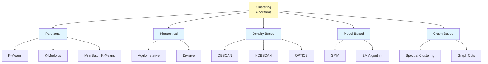

### 2.1 Partitional Clustering

**Definition**: Divides data into non-overlapping subsets (partitions) where each data point belongs to exactly one cluster.

**Characteristics**:
- Fixed number of clusters (k) specified upfront
- Iterative optimization approach
- Generally faster than hierarchical methods
- May converge to local optima

**Example**: K-Means, K-Medoids

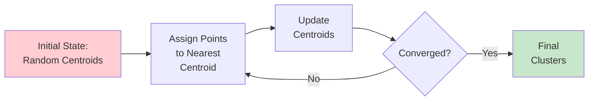

### 2.2 Hierarchical Clustering

**Definition**: Builds a tree of clusters (dendrogram) showing relationships at multiple levels of granularity.

**Two Approaches**:

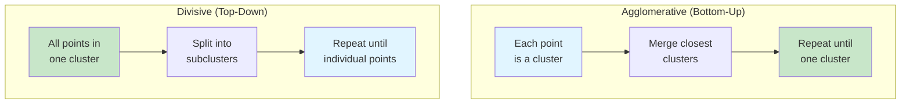

**Advantages**:
- No need to specify k upfront
- Provides hierarchy of clusters
- Deterministic results

**Disadvantages**:
- O(n³) time complexity (slower for large datasets)
- Cannot undo merges/splits
- Sensitive to noise and outliers

### 2.3 Density-Based Clustering

**Definition**: Identifies clusters as high-density regions separated by low-density regions.

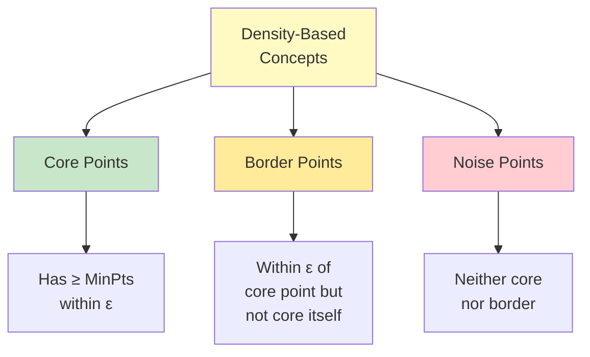

**Key Parameters**:
- **ε (epsilon)**: Maximum distance between two points to be considered neighbors
- **MinPts**: Minimum number of points to form a dense region

**Advantages**:
- No need to specify number of clusters
- Handles arbitrary shapes
- Robust to outliers
- Identifies noise points

**Disadvantages**:
- Sensitive to parameter choice (ε, MinPts)
- Struggles with varying densities (solved by HDBSCAN)
- Memory intensive for large datasets

### 2.4 Model-Based Clustering

**Definition**: Assumes data is generated from a mixture of probability distributions.

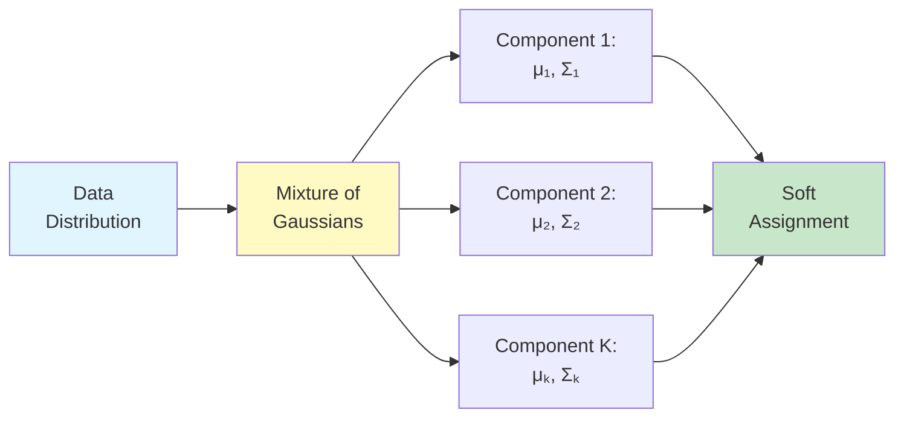

**Examples**: Gaussian Mixture Models (GMM), Hidden Markov Models

**Key Concept**: **Soft Clustering** - Points can belong to multiple clusters with different probabilities

### Distance Metrics

The choice of distance metric significantly impacts clustering results.

```mermaid
graph TD
    A[Distance<br/>Metrics] --> B[Euclidean]
    A --> C[Manhattan]
    A --> D[Cosine]
    A --> E[Mahalanobis]

    B --> B1[√Σx²-y²<br/>Most common]
    C --> C1[Σ|x-y|<br/>Grid-like paths]
    D --> D1[1 - cos θ<br/>Text/high-dim]
    E --> E1[Accounts for<br/>covariance]

    style A fill:#fff9c4
```

**Distance Metric Selection Guide**:

| Metric | Use Case | Formula |
|--------|----------|---------|
| **Euclidean** | General purpose, continuous features | d = √(Σ(xᵢ - yᵢ)²) |
| **Manhattan** | High dimensions, grid-based data | d = Σ\|xᵢ - yᵢ\| |
| **Cosine** | Text, sparse data, direction matters | d = 1 - (x·y)/(\\|x\\|\\|y\\|) |
| **Mahalanobis** | Correlated features, different scales | d² = (x-y)ᵀΣ⁻¹(x-y) |

---

## 3. K-Means Clustering

### 3.1 How K-Means Works

**K-Means** is the most popular partitional clustering algorithm that minimizes within-cluster variance.

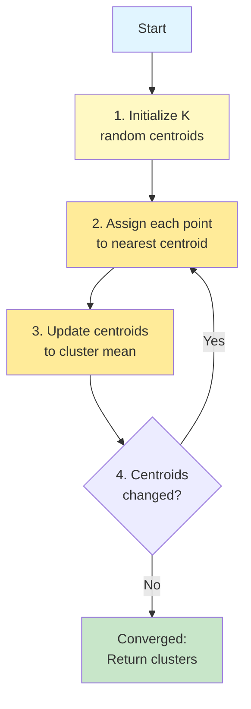

**Algorithm Steps**:

1. **Initialize**: Randomly select k data points as initial centroids
2. **Assignment**: Assign each point to the nearest centroid (Euclidean distance)
3. **Update**: Recalculate centroids as the mean of assigned points
4. **Repeat**: Steps 2-3 until convergence (centroids don't change)

**Mathematical Formulation**:

**Objective**: Minimize within-cluster sum of squares (WCSS)

```
J = Σᵢ₌₁ᵏ Σₓ∈Cᵢ ||x - μᵢ||²

where:
- k = number of clusters
- Cᵢ = cluster i
- μᵢ = centroid of cluster i
- x = data point
```

### 3.2 K-Means Variants

#### K-Means++ (Smart Initialization)

**Problem**: Random initialization can lead to poor convergence

**Solution**: K-Means++ uses probabilistic selection for initial centroids

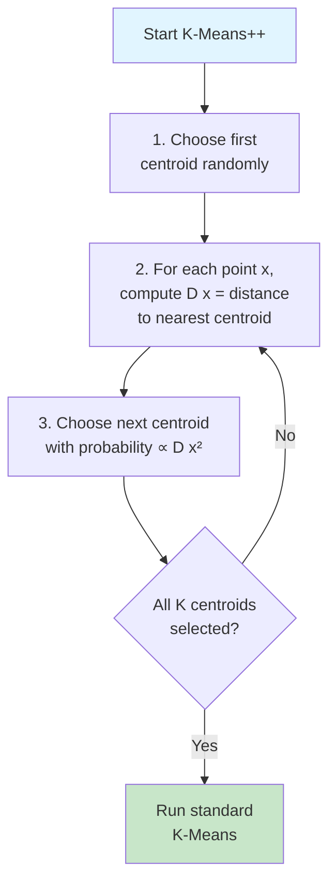

**Key Advantage**: Provides O(log k) approximation guarantee

**Implementation** (from research 2024): K-Means++ is the default initialization in scikit-learn and significantly improves clustering quality.

#### Mini-Batch K-Means

**Problem**: Standard K-Means is slow for large datasets (O(nkdi) per iteration)

**Solution**: Use random mini-batches for faster convergence

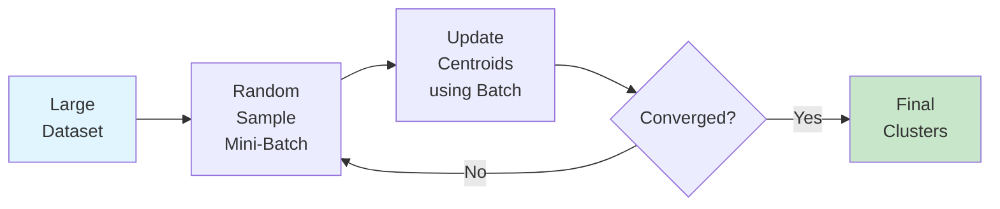

**Time Complexity**: O(k × b × d × t), where b << n (batch size)

**2024 Research Finding**: Mini-Batch K-Means achieves **order of magnitude speedup** compared to standard K-Means while maintaining comparable clustering quality.

**When to Use**:
- Datasets with n > 10,000 samples
- Online/streaming data
- Real-time applications

#### Elkan's Algorithm

**Optimization**: Uses triangle inequality to avoid unnecessary distance computations

**Triangle Inequality**:
```
d(x, z) ≤ d(x, y) + d(y, z)
```

**Key Insight**: If point x is far from centroid c₁ and close to c₂, we can skip computing d(x, c₁)

**Performance**: Significantly faster for datasets with well-separated clusters

### 3.3 K-Means Implementation

#### From Scratch (Google Standard Code)

```python
"""K-Means clustering implementation from scratch.

This module implements the K-Means clustering algorithm with K-Means++
initialization for improved convergence.
"""

from typing import Tuple, Optional
import numpy as np
from numpy.typing import NDArray


class KMeans:
    """K-Means clustering algorithm.

    Attributes:
        n_clusters: Number of clusters to form.
        max_iters: Maximum number of iterations.
        tolerance: Convergence tolerance.
        random_state: Random seed for reproducibility.
        centroids_: Cluster centroids after fitting.
        labels_: Cluster labels for each data point.
        inertia_: Within-cluster sum of squares.
    """

    def __init__(
        self,
        n_clusters: int = 8,
        max_iters: int = 300,
        tolerance: float = 1e-4,
        random_state: Optional[int] = None
    ) -> None:
        """Initialize K-Means clusterer.

        Args:
            n_clusters: Number of clusters to form.
            max_iters: Maximum number of iterations.
            tolerance: Convergence tolerance (change in centroids).
            random_state: Random seed for reproducibility.
        """
        self.n_clusters = n_clusters
        self.max_iters = max_iters
        self.tolerance = tolerance
        self.random_state = random_state
        self.centroids_: Optional[NDArray[np.float64]] = None
        self.labels_: Optional[NDArray[np.int32]] = None
        self.inertia_: Optional[float] = None

    def _initialize_centroids_plus_plus(
        self,
        X: NDArray[np.float64]
    ) -> NDArray[np.float64]:
        """K-Means++ initialization for better convergence.

        Algorithm:
        1. Choose first centroid randomly
        2. For remaining centroids:
           - Compute D(x)² = distance to nearest existing centroid
           - Choose next centroid with probability ∝ D(x)²

        Args:
            X: Data matrix of shape (n_samples, n_features).

        Returns:
            Initial centroids of shape (n_clusters, n_features).
        """
        rng = np.random.RandomState(self.random_state)
        n_samples = X.shape[0]

        # Choose first centroid randomly
        centroids = [X[rng.randint(n_samples)]]

        # Choose remaining centroids
        for _ in range(1, self.n_clusters):
            # Compute squared distances to nearest centroid
            distances = np.array([
                np.min([np.sum((x - c) ** 2) for c in centroids])
                for x in X
            ])

            # Choose next centroid with probability ∝ distance²
            probabilities = distances / distances.sum()
            cumulative_probs = probabilities.cumsum()
            r = rng.rand()

            for idx, prob in enumerate(cumulative_probs):
                if r < prob:
                    centroids.append(X[idx])
                    break

        return np.array(centroids)

    def _compute_distances(
        self,
        X: NDArray[np.float64],
        centroids: NDArray[np.float64]
    ) -> NDArray[np.float64]:
        """Compute Euclidean distances between points and centroids.

        Args:
            X: Data matrix of shape (n_samples, n_features).
            centroids: Centroid matrix of shape (n_clusters, n_features).

        Returns:
            Distance matrix of shape (n_samples, n_clusters).
        """
        # Vectorized computation: ||x - c||² = ||x||² + ||c||² - 2x·c
        x_squared = np.sum(X ** 2, axis=1, keepdims=True)
        c_squared = np.sum(centroids ** 2, axis=1)
        cross_term = 2 * np.dot(X, centroids.T)

        distances = x_squared + c_squared - cross_term
        return np.sqrt(np.maximum(distances, 0))  # Avoid negative due to float precision

    def _assign_clusters(
        self,
        X: NDArray[np.float64],
        centroids: NDArray[np.float64]
    ) -> NDArray[np.int32]:
        """Assign each point to nearest centroid.

        Args:
            X: Data matrix of shape (n_samples, n_features).
            centroids: Centroid matrix of shape (n_clusters, n_features).

        Returns:
            Cluster labels of shape (n_samples,).
        """
        distances = self._compute_distances(X, centroids)
        return np.argmin(distances, axis=1).astype(np.int32)

    def _update_centroids(
        self,
        X: NDArray[np.float64],
        labels: NDArray[np.int32]
    ) -> NDArray[np.float64]:
        """Update centroids as mean of assigned points.

        Args:
            X: Data matrix of shape (n_samples, n_features).
            labels: Cluster labels of shape (n_samples,).

        Returns:
            Updated centroids of shape (n_clusters, n_features).
        """
        centroids = np.zeros((self.n_clusters, X.shape[1]))

        for k in range(self.n_clusters):
            cluster_points = X[labels == k]
            if len(cluster_points) > 0:
                centroids[k] = cluster_points.mean(axis=0)
            else:
                # Handle empty cluster: reinitialize randomly
                centroids[k] = X[np.random.randint(len(X))]

        return centroids

    def _compute_inertia(
        self,
        X: NDArray[np.float64],
        labels: NDArray[np.int32],
        centroids: NDArray[np.float64]
    ) -> float:
        """Compute within-cluster sum of squares.

        Args:
            X: Data matrix of shape (n_samples, n_features).
            labels: Cluster labels of shape (n_samples,).
            centroids: Centroid matrix of shape (n_clusters, n_features).

        Returns:
            Inertia (WCSS) value.
        """
        inertia = 0.0
        for k in range(self.n_clusters):
            cluster_points = X[labels == k]
            if len(cluster_points) > 0:
                inertia += np.sum((cluster_points - centroids[k]) ** 2)
        return inertia

    def fit(self, X: NDArray[np.float64]) -> 'KMeans':
        """Fit K-Means clustering.

        Args:
            X: Data matrix of shape (n_samples, n_features).

        Returns:
            self: Fitted clusterer.

        Raises:
            ValueError: If n_clusters > n_samples.
        """
        if self.n_clusters > len(X):
            raise ValueError(
                f"n_clusters ({self.n_clusters}) cannot be larger than "
                f"n_samples ({len(X)})"
            )

        # Initialize centroids using K-Means++
        centroids = self._initialize_centroids_plus_plus(X)

        # Iterative optimization
        for iteration in range(self.max_iters):
            # Assign points to clusters
            labels = self._assign_clusters(X, centroids)

            # Update centroids
            new_centroids = self._update_centroids(X, labels)

            # Check convergence
            centroid_shift = np.max(np.linalg.norm(new_centroids - centroids, axis=1))
            centroids = new_centroids

            if centroid_shift < self.tolerance:
                break

        # Store results
        self.centroids_ = centroids
        self.labels_ = labels
        self.inertia_ = self._compute_inertia(X, labels, centroids)

        return self

    def predict(self, X: NDArray[np.float64]) -> NDArray[np.int32]:
        """Predict cluster labels for new data.

        Args:
            X: Data matrix of shape (n_samples, n_features).

        Returns:
            Predicted cluster labels of shape (n_samples,).

        Raises:
            ValueError: If model is not fitted yet.
        """
        if self.centroids_ is None:
            raise ValueError("Model must be fitted before prediction")

        return self._assign_clusters(X, self.centroids_)

    def fit_predict(self, X: NDArray[np.float64]) -> NDArray[np.int32]:
        """Fit and predict in one step.

        Args:
            X: Data matrix of shape (n_samples, n_features).

        Returns:
            Cluster labels of shape (n_samples,).
        """
        self.fit(X)
        return self.labels_


# Example usage
if __name__ == "__main__":
    # Generate sample data
    np.random.seed(42)
    X = np.vstack([
        np.random.randn(100, 2) + [2, 2],
        np.random.randn(100, 2) + [-2, -2],
        np.random.randn(100, 2) + [2, -2],
    ])

    # Fit K-Means
    kmeans = KMeans(n_clusters=3, random_state=42)
    labels = kmeans.fit_predict(X)

    print(f"Cluster labels: {labels[:10]}")
    print(f"Centroids:\n{kmeans.centroids_}")
    print(f"Inertia: {kmeans.inertia_:.2f}")
```

#### Using Scikit-learn (Production-Ready)

```python
"""Production K-Means clustering with scikit-learn.

Demonstrates best practices for K-Means clustering including:
- Optimal k selection using elbow method and silhouette analysis
- Standardization for better convergence
- Visualization of results
"""

from typing import Tuple, List
import numpy as np
import matplotlib.pyplot as plt
from sklearn.cluster import KMeans, MiniBatchKMeans
from sklearn.preprocessing import StandardScaler
from sklearn.metrics import silhouette_score, davies_bouldin_score
from sklearn.datasets import make_blobs


def find_optimal_k(
    X: np.ndarray,
    k_range: range = range(2, 11),
    method: str = 'elbow'
) -> int:
    """Find optimal number of clusters.

    Args:
        X: Standardized data matrix.
        k_range: Range of k values to test.
        method: 'elbow' or 'silhouette'.

    Returns:
        Optimal k value.
    """
    inertias = []
    silhouette_scores = []

    for k in k_range:
        kmeans = KMeans(n_clusters=k, random_state=42, n_init=10)
        labels = kmeans.fit_predict(X)

        inertias.append(kmeans.inertia_)
        silhouette_scores.append(silhouette_score(X, labels))

    if method == 'elbow':
        # Elbow method: find point of maximum curvature
        # Simple heuristic: maximum second derivative
        diffs = np.diff(inertias)
        second_diffs = np.diff(diffs)
        optimal_idx = np.argmax(np.abs(second_diffs)) + 1
        optimal_k = list(k_range)[optimal_idx]
    else:  # silhouette
        optimal_idx = np.argmax(silhouette_scores)
        optimal_k = list(k_range)[optimal_idx]

    # Visualization
    fig, axes = plt.subplots(1, 2, figsize=(12, 4))

    # Elbow plot
    axes[0].plot(k_range, inertias, 'bo-')
    axes[0].axvline(optimal_k, color='r', linestyle='--', label=f'Optimal k={optimal_k}')
    axes[0].set_xlabel('Number of clusters (k)')
    axes[0].set_ylabel('Inertia (WCSS)')
    axes[0].set_title('Elbow Method')
    axes[0].legend()
    axes[0].grid(True, alpha=0.3)

    # Silhouette plot
    axes[1].plot(k_range, silhouette_scores, 'go-')
    axes[1].axvline(optimal_k, color='r', linestyle='--', label=f'Optimal k={optimal_k}')
    axes[1].set_xlabel('Number of clusters (k)')
    axes[1].set_ylabel('Silhouette Score')
    axes[1].set_title('Silhouette Analysis')
    axes[1].legend()
    axes[1].grid(True, alpha=0.3)

    plt.tight_layout()
    plt.savefig('optimal_k_selection.png', dpi=300, bbox_inches='tight')
    plt.close()

    return optimal_k


def cluster_with_kmeans(
    X: np.ndarray,
    n_clusters: int = 3,
    use_minibatch: bool = False
) -> Tuple[np.ndarray, KMeans]:
    """Perform K-Means clustering with best practices.

    Args:
        X: Data matrix (will be standardized internally).
        n_clusters: Number of clusters.
        use_minibatch: Whether to use Mini-Batch K-Means for large datasets.

    Returns:
        Tuple of (labels, fitted_model).
    """
    # Standardization: important for K-Means
    scaler = StandardScaler()
    X_scaled = scaler.fit_transform(X)

    # Choose algorithm based on dataset size
    if use_minibatch or len(X) > 10000:
        print("Using Mini-Batch K-Means for faster computation...")
        clusterer = MiniBatchKMeans(
            n_clusters=n_clusters,
            random_state=42,
            batch_size=1024,
            n_init=10,
            max_iter=300
        )
    else:
        clusterer = KMeans(
            n_clusters=n_clusters,
            init='k-means++',  # Default in sklearn
            n_init=10,  # Run 10 times with different initializations
            max_iter=300,
            random_state=42,
            algorithm='elkan'  # Use Elkan's algorithm for speedup
        )

    # Fit and predict
    labels = clusterer.fit_predict(X_scaled)

    # Evaluation metrics
    silhouette = silhouette_score(X_scaled, labels)
    davies_bouldin = davies_bouldin_score(X_scaled, labels)

    print(f"\n=== Clustering Results ===")
    print(f"Number of clusters: {n_clusters}")
    print(f"Inertia (WCSS): {clusterer.inertia_:.2f}")
    print(f"Silhouette Score: {silhouette:.3f} (higher is better, [-1, 1])")
    print(f"Davies-Bouldin Index: {davies_bouldin:.3f} (lower is better)")
    print(f"Iterations to converge: {clusterer.n_iter_}")

    # Cluster size distribution
    unique, counts = np.unique(labels, return_counts=True)
    print(f"\nCluster sizes: {dict(zip(unique, counts))}")

    return labels, clusterer


def visualize_clusters(
    X: np.ndarray,
    labels: np.ndarray,
    centroids: np.ndarray,
    title: str = "K-Means Clustering"
) -> None:
    """Visualize clustering results (2D only).

    Args:
        X: Original data matrix.
        labels: Cluster labels.
        centroids: Cluster centroids.
        title: Plot title.
    """
    if X.shape[1] != 2:
        print("Visualization only supported for 2D data")
        return

    plt.figure(figsize=(10, 6))

    # Plot points colored by cluster
    scatter = plt.scatter(
        X[:, 0], X[:, 1],
        c=labels,
        cmap='viridis',
        alpha=0.6,
        edgecolors='k',
        linewidth=0.5
    )

    # Plot centroids
    plt.scatter(
        centroids[:, 0], centroids[:, 1],
        c='red',
        marker='X',
        s=300,
        edgecolors='black',
        linewidth=2,
        label='Centroids'
    )

    plt.colorbar(scatter, label='Cluster')
    plt.xlabel('Feature 1')
    plt.ylabel('Feature 2')
    plt.title(title)
    plt.legend()
    plt.grid(True, alpha=0.3)
    plt.savefig('kmeans_clusters.png', dpi=300, bbox_inches='tight')
    plt.close()


# Example: Production pipeline
def main():
    """Main clustering pipeline example."""
    # Generate synthetic data
    X, y_true = make_blobs(
        n_samples=1000,
        centers=4,
        n_features=2,
        cluster_std=0.8,
        random_state=42
    )

    print("Step 1: Finding optimal k...")
    optimal_k = find_optimal_k(X, k_range=range(2, 10), method='silhouette')

    print(f"\nStep 2: Clustering with k={optimal_k}...")
    labels, model = cluster_with_kmeans(X, n_clusters=optimal_k)

    print("\nStep 3: Visualizing results...")
    # Get centroids in original scale
    scaler = StandardScaler().fit(X)
    centroids_scaled = model.cluster_centers_
    centroids = scaler.inverse_transform(centroids_scaled)
    visualize_clusters(X, labels, centroids)

    print("\nPipeline completed successfully!")


if __name__ == "__main__":
    main()
```

### 3.4 Determining Optimal K

#### Elbow Method

**Concept**: Plot WCSS vs. k and find the "elbow" where improvement diminishes

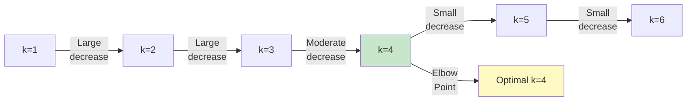

**Limitations**:
- Subjective interpretation
- May not have clear elbow
- Works best for well-separated clusters

#### Silhouette Analysis

**Silhouette Score** measures how similar a point is to its own cluster compared to other clusters:

```
s(i) = (b(i) - a(i)) / max(a(i), b(i))

where:
- a(i) = average distance to points in same cluster
- b(i) = average distance to points in nearest cluster
- s(i) ∈ [-1, 1]: higher is better
```

**Interpretation**:
- **s(i) ≈ 1**: Well-clustered
- **s(i) ≈ 0**: On cluster boundary
- **s(i) < 0**: Likely in wrong cluster

#### Gap Statistic

**Formula**:
```
Gap(k) = E[log(WCSS_random)] - log(WCSS_data)
```

**Optimal k**: First k where Gap(k) ≥ Gap(k+1) - s_{k+1}

### 3.5 K-Means Limitations

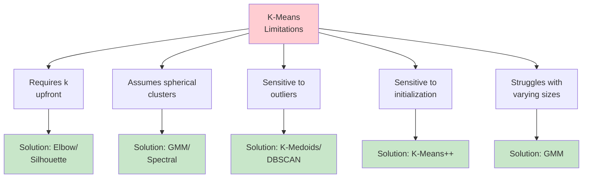

**When K-Means Fails**:

1. **Non-spherical clusters**: Use spectral clustering or DBSCAN
2. **Varying densities**: Use DBSCAN or HDBSCAN
3. **Outliers present**: Use K-Medoids or DBSCAN
4. **Overlapping clusters**: Use GMM for soft clustering

---

## 4. Hierarchical Clustering

### 4.1 Agglomerative Clustering

**Agglomerative** (bottom-up) is the most common hierarchical approach.

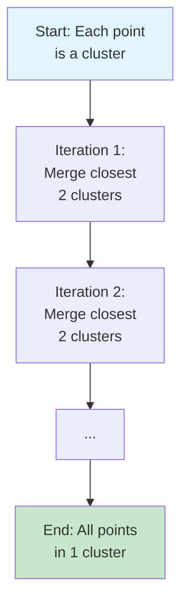

**Algorithm**:
```
1. Start with n clusters (each point is a cluster)
2. Repeat until one cluster remains:
   a. Find closest pair of clusters
   b. Merge them into single cluster
   c. Update distance matrix
3. Cut dendrogram at desired level to get k clusters
```

### 4.2 Linkage Criteria

**Linkage** defines the distance between clusters.

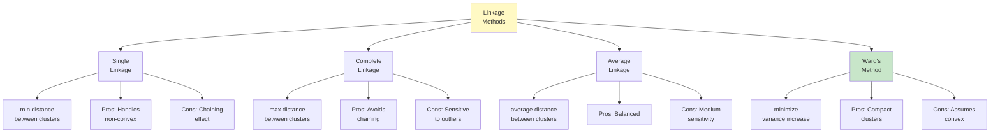

**Mathematical Definitions**:

| Linkage | Formula | Use Case |
|---------|---------|----------|
| **Single** | d(A,B) = min{d(a,b) : a∈A, b∈B} | Non-convex shapes |
| **Complete** | d(A,B) = max{d(a,b) : a∈A, b∈B} | Compact clusters |
| **Average** | d(A,B) = (1/\|A\|\|B\|) Σ d(a,b) | Balanced |
| **Ward** | Minimizes increase in total within-cluster variance | Most popular |

### 4.3 Dendrogram

A **dendrogram** visualizes the hierarchical clustering process.

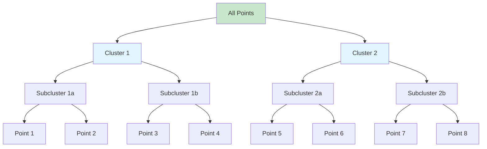

**Reading a Dendrogram**:
- **Vertical axis**: Distance/dissimilarity at merge
- **Horizontal axis**: Data points
- **Cut line**: Determines number of clusters

### 4.4 Implementation

#### From Scratch (Simplified Single Linkage)

```python
"""Agglomerative clustering with single linkage implementation.

Simplified version for educational purposes.
For production use, prefer scikit-learn's implementation.
"""

from typing import List, Tuple
import numpy as np
from numpy.typing import NDArray


class AgglomerativeClustering:
    """Agglomerative clustering with single linkage.

    Attributes:
        n_clusters: Number of clusters to form.
        labels_: Cluster labels after fitting.
        linkage_matrix_: Linkage matrix for dendrogram.
    """

    def __init__(self, n_clusters: int = 2) -> None:
        """Initialize agglomerative clusterer.

        Args:
            n_clusters: Number of clusters to form.
        """
        self.n_clusters = n_clusters
        self.labels_: Optional[NDArray[np.int32]] = None
        self.linkage_matrix_: List[List[float]] = []

    def _compute_distance_matrix(
        self,
        X: NDArray[np.float64]
    ) -> NDArray[np.float64]:
        """Compute pairwise Euclidean distance matrix.

        Args:
            X: Data matrix of shape (n_samples, n_features).

        Returns:
            Distance matrix of shape (n_samples, n_samples).
        """
        n_samples = len(X)
        distances = np.zeros((n_samples, n_samples))

        for i in range(n_samples):
            for j in range(i + 1, n_samples):
                dist = np.linalg.norm(X[i] - X[j])
                distances[i, j] = dist
                distances[j, i] = dist

        return distances

    def _single_linkage_distance(
        self,
        cluster1: List[int],
        cluster2: List[int],
        distances: NDArray[np.float64]
    ) -> float:
        """Compute single linkage distance between clusters.

        Args:
            cluster1: Indices of points in cluster 1.
            cluster2: Indices of points in cluster 2.
            distances: Pairwise distance matrix.

        Returns:
            Minimum distance between any two points in different clusters.
        """
        min_dist = float('inf')

        for i in cluster1:
            for j in cluster2:
                if distances[i, j] < min_dist:
                    min_dist = distances[i, j]

        return min_dist

    def fit(self, X: NDArray[np.float64]) -> 'AgglomerativeClustering':
        """Fit agglomerative clustering.

        Args:
            X: Data matrix of shape (n_samples, n_features).

        Returns:
            self: Fitted clusterer.
        """
        n_samples = len(X)

        # Initialize: each point is its own cluster
        clusters = [[i] for i in range(n_samples)]

        # Compute initial distance matrix
        distances = self._compute_distance_matrix(X)

        # Merge until we have n_clusters remaining
        while len(clusters) > self.n_clusters:
            # Find closest pair of clusters
            min_dist = float('inf')
            merge_i, merge_j = 0, 1

            for i in range(len(clusters)):
                for j in range(i + 1, len(clusters)):
                    dist = self._single_linkage_distance(
                        clusters[i],
                        clusters[j],
                        distances
                    )
                    if dist < min_dist:
                        min_dist = dist
                        merge_i, merge_j = i, j

            # Record merge in linkage matrix
            self.linkage_matrix_.append([
                merge_i,
                merge_j,
                min_dist,
                len(clusters[merge_i]) + len(clusters[merge_j])
            ])

            # Merge clusters
            clusters[merge_i].extend(clusters[merge_j])
            del clusters[merge_j]

        # Assign labels
        labels = np.zeros(n_samples, dtype=np.int32)
        for cluster_id, cluster in enumerate(clusters):
            for point_idx in cluster:
                labels[point_idx] = cluster_id

        self.labels_ = labels
        return self

    def fit_predict(self, X: NDArray[np.float64]) -> NDArray[np.int32]:
        """Fit and predict in one step.

        Args:
            X: Data matrix of shape (n_samples, n_features).

        Returns:
            Cluster labels of shape (n_samples,).
        """
        self.fit(X)
        return self.labels_


# Example usage
if __name__ == "__main__":
    # Generate sample data
    np.random.seed(42)
    X = np.vstack([
        np.random.randn(50, 2) + [2, 2],
        np.random.randn(50, 2) + [-2, -2],
    ])

    # Fit hierarchical clustering
    hc = AgglomerativeClustering(n_clusters=2)
    labels = hc.fit_predict(X)

    print(f"Cluster labels: {labels[:10]}")
    print(f"Cluster sizes: {np.bincount(labels)}")
```

#### Using Scikit-learn with Dendrogram

```python
"""Production hierarchical clustering with scikit-learn and scipy.

Includes dendrogram visualization and optimal cut selection.
"""

from typing import Optional
import numpy as np
import matplotlib.pyplot as plt
from scipy.cluster.hierarchy import dendrogram, linkage
from sklearn.cluster import AgglomerativeClustering
from sklearn.preprocessing import StandardScaler
from sklearn.metrics import silhouette_score
from sklearn.datasets import make_blobs


def plot_dendrogram(
    X: np.ndarray,
    linkage_method: str = 'ward',
    figsize: tuple = (12, 6)
) -> None:
    """Plot dendrogram for hierarchical clustering.

    Args:
        X: Standardized data matrix.
        linkage_method: 'ward', 'complete', 'average', or 'single'.
        figsize: Figure size.
    """
    # Compute linkage matrix
    linkage_matrix = linkage(X, method=linkage_method)

    # Plot dendrogram
    plt.figure(figsize=figsize)
    dendrogram(
        linkage_matrix,
        truncate_mode='lastp',  # Show only last p merged clusters
        p=30,  # Show last 30 merges
        leaf_font_size=10,
        show_contracted=True
    )
    plt.xlabel('Sample Index or (Cluster Size)')
    plt.ylabel('Distance')
    plt.title(f'Hierarchical Clustering Dendrogram ({linkage_method} linkage)')
    plt.axhline(y=10, color='r', linestyle='--', label='Cut line (example)')
    plt.legend()
    plt.grid(True, alpha=0.3)
    plt.savefig(f'dendrogram_{linkage_method}.png', dpi=300, bbox_inches='tight')
    plt.close()


def hierarchical_clustering_comparison(
    X: np.ndarray,
    n_clusters: int = 3
) -> None:
    """Compare different linkage methods.

    Args:
        X: Data matrix.
        n_clusters: Number of clusters to form.
    """
    linkage_methods = ['ward', 'complete', 'average', 'single']

    # Standardize data
    scaler = StandardScaler()
    X_scaled = scaler.fit_transform(X)

    results = []

    for method in linkage_methods:
        # Fit clustering
        clusterer = AgglomerativeClustering(
            n_clusters=n_clusters,
            linkage=method
        )
        labels = clusterer.fit_predict(X_scaled)

        # Compute metrics
        silhouette = silhouette_score(X_scaled, labels)

        results.append({
            'method': method,
            'silhouette': silhouette,
            'labels': labels
        })

        print(f"{method.capitalize():10} | Silhouette: {silhouette:.3f}")

    # Visualize comparison
    fig, axes = plt.subplots(2, 2, figsize=(12, 10))
    axes = axes.ravel()

    for idx, result in enumerate(results):
        ax = axes[idx]
        scatter = ax.scatter(
            X[:, 0], X[:, 1],
            c=result['labels'],
            cmap='viridis',
            alpha=0.6,
            edgecolors='k',
            linewidth=0.5
        )
        ax.set_title(
            f"{result['method'].capitalize()} Linkage\n"
            f"Silhouette: {result['silhouette']:.3f}"
        )
        ax.set_xlabel('Feature 1')
        ax.set_ylabel('Feature 2')
        ax.grid(True, alpha=0.3)
        plt.colorbar(scatter, ax=ax, label='Cluster')

    plt.tight_layout()
    plt.savefig('hierarchical_comparison.png', dpi=300, bbox_inches='tight')
    plt.close()


def main():
    """Main hierarchical clustering example."""
    # Generate synthetic data
    X, _ = make_blobs(
        n_samples=500,
        centers=4,
        n_features=2,
        cluster_std=1.0,
        random_state=42
    )

    print("=== Hierarchical Clustering Comparison ===\n")
    hierarchical_clustering_comparison(X, n_clusters=4)

    print("\n=== Generating Dendrograms ===")
    scaler = StandardScaler()
    X_scaled = scaler.fit_transform(X)

    for method in ['ward', 'complete']:
        print(f"Creating dendrogram for {method} linkage...")
        plot_dendrogram(X_scaled, linkage_method=method)


if __name__ == "__main__":
    main()
```

### 4.5 Advantages and Limitations

**Advantages**:
- ✅ No need to specify k upfront (cut dendrogram anywhere)
- ✅ Dendrogram provides intuitive visualization
- ✅ Deterministic results (no random initialization)
- ✅ Can capture hierarchical structure in data

**Disadvantages**:
- ❌ High time complexity: O(n³) for naive implementation, O(n² log n) optimized
- ❌ High space complexity: O(n²) for distance matrix
- ❌ Cannot undo previous merges (greedy algorithm)
- ❌ Sensitive to noise and outliers (especially single linkage)

**When to Use**:
- Small to medium datasets (n < 10,000)
- When hierarchical structure matters
- When you want to explore different k values
- When deterministic results are required

---

## 5. Density-Based Clustering (DBSCAN)

### 5.1 How DBSCAN Works

**DBSCAN** (Density-Based Spatial Clustering of Applications with Noise) identifies clusters as dense regions separated by sparse regions.

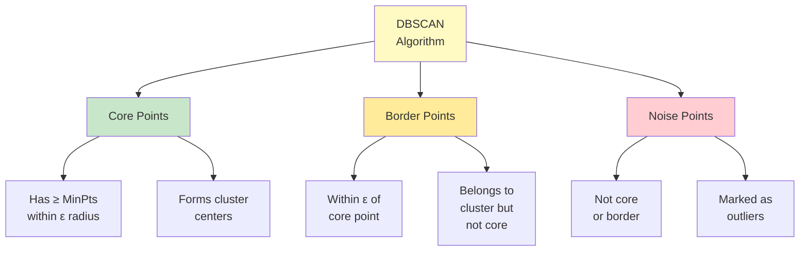

**Algorithm Steps**:

```
1. For each point p:
   a. Find all neighbor points within ε distance
   b. If count ≥ MinPts: mark p as core point

2. For each core point p not yet assigned:
   a. Create new cluster
   b. Add p to cluster
   c. Find all density-reachable points from p
   d. Add them to same cluster

3. Assign border points to clusters

4. Mark remaining points as noise
```

**Visual Example**:

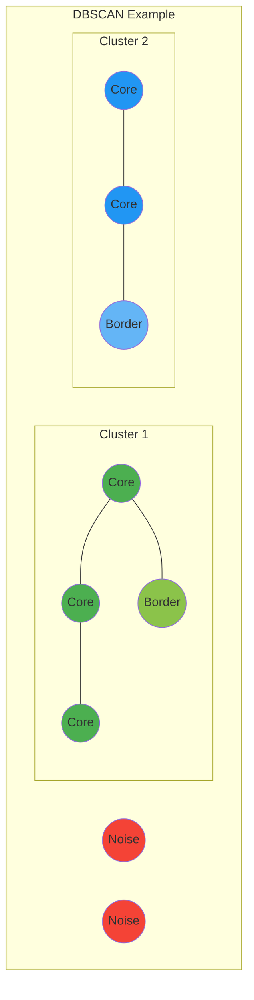

### 5.2 Key Parameters

**ε (epsilon)**: Maximum distance between two points to be neighbors

**MinPts**: Minimum points required to form dense region

**Parameter Selection Heuristics**:

```python
"""Heuristics for DBSCAN parameter selection."""

import numpy as np
import matplotlib.pyplot as plt
from sklearn.neighbors import NearestNeighbors


def estimate_eps(X: np.ndarray, min_pts: int = 5) -> float:
    """Estimate optimal eps using k-distance graph.

    Method: Find elbow in k-nearest neighbor distance plot.

    Args:
        X: Data matrix.
        min_pts: Minimum points for core point.

    Returns:
        Suggested eps value.
    """
    # Compute k-nearest neighbor distances
    neighbors = NearestNeighbors(n_neighbors=min_pts)
    neighbors.fit(X)
    distances, indices = neighbors.kneighbors(X)

    # Sort distances to kth nearest neighbor
    k_distances = np.sort(distances[:, -1])

    # Plot k-distance graph
    plt.figure(figsize=(10, 6))
    plt.plot(k_distances)
    plt.xlabel('Points sorted by distance')
    plt.ylabel(f'{min_pts}-th Nearest Neighbor Distance')
    plt.title('K-Distance Graph for DBSCAN eps Selection')
    plt.grid(True, alpha=0.3)

    # Find elbow (simplified: use knee detection)
    # Suggestion: look for sharp increase
    suggested_eps = np.percentile(k_distances, 90)
    plt.axhline(suggested_eps, color='r', linestyle='--',
                label=f'Suggested eps={suggested_eps:.2f}')
    plt.legend()
    plt.savefig('dbscan_eps_selection.png', dpi=300, bbox_inches='tight')
    plt.close()

    return suggested_eps


# MinPts heuristic
# Rule of thumb: MinPts ≥ dimensionality + 1
# Common choice: MinPts = 2 * dimensionality
```

### 5.3 Implementation

#### From Scratch

```python
"""DBSCAN implementation from scratch.

Educational implementation demonstrating core concepts.
For production, use scikit-learn's optimized version.
"""

from typing import List, Set, Optional
from collections import deque
import numpy as np
from numpy.typing import NDArray


class DBSCAN:
    """DBSCAN clustering algorithm.

    Attributes:
        eps: Maximum distance between neighbors.
        min_pts: Minimum points for core point.
        labels_: Cluster labels (-1 for noise).
        core_sample_indices_: Indices of core samples.
    """

    NOISE = -1
    UNCLASSIFIED = 0

    def __init__(self, eps: float = 0.5, min_pts: int = 5) -> None:
        """Initialize DBSCAN clusterer.

        Args:
            eps: Maximum distance between neighbors.
            min_pts: Minimum points to form dense region.
        """
        self.eps = eps
        self.min_pts = min_pts
        self.labels_: Optional[NDArray[np.int32]] = None
        self.core_sample_indices_: List[int] = []

    def _get_neighbors(
        self,
        X: NDArray[np.float64],
        point_idx: int
    ) -> List[int]:
        """Find all points within eps distance.

        Args:
            X: Data matrix.
            point_idx: Index of query point.

        Returns:
            List of neighbor indices.
        """
        neighbors = []
        point = X[point_idx]

        for idx, other_point in enumerate(X):
            if np.linalg.norm(point - other_point) <= self.eps:
                neighbors.append(idx)

        return neighbors

    def _expand_cluster(
        self,
        X: NDArray[np.float64],
        point_idx: int,
        neighbors: List[int],
        cluster_id: int,
        labels: NDArray[np.int32]
    ) -> bool:
        """Expand cluster from seed point.

        Args:
            X: Data matrix.
            point_idx: Index of seed point.
            neighbors: Neighbor indices of seed point.
            cluster_id: Current cluster ID.
            labels: Label array (modified in-place).

        Returns:
            True if cluster was created.
        """
        # Seed point becomes part of cluster
        labels[point_idx] = cluster_id

        # Use queue for breadth-first expansion
        queue = deque(neighbors)

        while queue:
            current_idx = queue.popleft()

            # Mark as part of cluster if unclassified
            if labels[current_idx] == self.UNCLASSIFIED:
                labels[current_idx] = cluster_id

                # If core point, add its neighbors to queue
                current_neighbors = self._get_neighbors(X, current_idx)
                if len(current_neighbors) >= self.min_pts:
                    self.core_sample_indices_.append(current_idx)
                    queue.extend(current_neighbors)

            # Border point: belongs to cluster but already visited
            elif labels[current_idx] == self.NOISE:
                labels[current_idx] = cluster_id

        return True

    def fit(self, X: NDArray[np.float64]) -> 'DBSCAN':
        """Fit DBSCAN clustering.

        Args:
            X: Data matrix of shape (n_samples, n_features).

        Returns:
            self: Fitted clusterer.
        """
        n_samples = len(X)
        labels = np.full(n_samples, self.UNCLASSIFIED, dtype=np.int32)
        cluster_id = 0

        # Process each point
        for point_idx in range(n_samples):
            # Skip if already processed
            if labels[point_idx] != self.UNCLASSIFIED:
                continue

            # Find neighbors
            neighbors = self._get_neighbors(X, point_idx)

            # Not a core point: mark as noise (might change later)
            if len(neighbors) < self.min_pts:
                labels[point_idx] = self.NOISE
                continue

            # Core point: expand cluster
            cluster_id += 1
            self.core_sample_indices_.append(point_idx)
            self._expand_cluster(X, point_idx, neighbors, cluster_id, labels)

        self.labels_ = labels
        return self

    def fit_predict(self, X: NDArray[np.float64]) -> NDArray[np.int32]:
        """Fit and predict in one step.

        Args:
            X: Data matrix of shape (n_samples, n_features).

        Returns:
            Cluster labels (-1 for noise).
        """
        self.fit(X)
        return self.labels_


# Example usage
if __name__ == "__main__":
    # Generate sample data with noise
    np.random.seed(42)
    X = np.vstack([
        np.random.randn(100, 2) * 0.3 + [0, 0],
        np.random.randn(100, 2) * 0.3 + [3, 3],
        np.random.uniform(-2, 5, (20, 2))  # Noise
    ])

    # Fit DBSCAN
    dbscan = DBSCAN(eps=0.5, min_pts=5)
    labels = dbscan.fit_predict(X)

    n_clusters = len(set(labels)) - (1 if -1 in labels else 0)
    n_noise = list(labels).count(-1)

    print(f"Number of clusters: {n_clusters}")
    print(f"Number of noise points: {n_noise}")
    print(f"Number of core samples: {len(dbscan.core_sample_indices_)}")
```

#### Using Scikit-learn (Production)

```python
"""Production DBSCAN clustering with scikit-learn.

Includes parameter tuning and comprehensive evaluation.
"""

from typing import Tuple
import numpy as np
import matplotlib.pyplot as plt
from sklearn.cluster import DBSCAN
from sklearn.preprocessing import StandardScaler
from sklearn.neighbors import NearestNeighbors
from sklearn.metrics import silhouette_score, calinski_harabasz_score
from sklearn.datasets import make_moons, make_blobs


def tune_dbscan_parameters(
    X: np.ndarray,
    eps_range: np.ndarray,
    min_pts_range: List[int]
) -> Tuple[float, int]:
    """Find optimal DBSCAN parameters using grid search.

    Args:
        X: Standardized data matrix.
        eps_range: Range of eps values to try.
        min_pts_range: Range of min_pts values to try.

    Returns:
        Tuple of (optimal_eps, optimal_min_pts).
    """
    best_score = -1
    best_params = (eps_range[0], min_pts_range[0])

    results = []

    for eps in eps_range:
        for min_pts in min_pts_range:
            dbscan = DBSCAN(eps=eps, min_samples=min_pts)
            labels = dbscan.fit_predict(X)

            # Skip if all points are noise or only one cluster
            n_clusters = len(set(labels)) - (1 if -1 in labels else 0)
            if n_clusters < 2:
                continue

            # Evaluate using silhouette score
            # (exclude noise points for fair comparison)
            mask = labels != -1
            if mask.sum() < 2:
                continue

            score = silhouette_score(X[mask], labels[mask])
            results.append((eps, min_pts, n_clusters, score))

            if score > best_score:
                best_score = score
                best_params = (eps, min_pts)

    # Print top 5 configurations
    results.sort(key=lambda x: x[3], reverse=True)
    print("\n=== Top 5 Parameter Configurations ===")
    print(f"{'eps':>6} {'min_pts':>8} {'clusters':>9} {'silhouette':>11}")
    print("-" * 40)
    for eps, min_pts, n_clusters, score in results[:5]:
        print(f"{eps:>6.2f} {min_pts:>8} {n_clusters:>9} {score:>11.3f}")

    return best_params


def cluster_with_dbscan(
    X: np.ndarray,
    eps: Optional[float] = None,
    min_samples: int = 5,
    auto_tune: bool = False
) -> Tuple[np.ndarray, DBSCAN]:
    """Perform DBSCAN clustering with best practices.

    Args:
        X: Data matrix.
        eps: Maximum distance between neighbors (auto-estimated if None).
        min_samples: Minimum points for core point.
        auto_tune: Whether to perform parameter tuning.

    Returns:
        Tuple of (labels, fitted_model).
    """
    # Standardization: important for distance-based algorithms
    scaler = StandardScaler()
    X_scaled = scaler.fit_transform(X)

    # Auto-estimate eps if not provided
    if eps is None:
        neighbors = NearestNeighbors(n_neighbors=min_samples)
        neighbors.fit(X_scaled)
        distances, _ = neighbors.kneighbors(X_scaled)
        k_distances = np.sort(distances[:, -1])
        eps = np.percentile(k_distances, 90)
        print(f"Auto-estimated eps: {eps:.3f}")

    # Parameter tuning if requested
    if auto_tune:
        print("\nPerforming parameter tuning...")
        eps_range = np.linspace(eps * 0.5, eps * 1.5, 10)
        min_pts_range = [3, 5, 7, 10]
        eps, min_samples = tune_dbscan_parameters(
            X_scaled, eps_range, min_pts_range
        )
        print(f"\nOptimal parameters: eps={eps:.3f}, min_samples={min_samples}")

    # Fit DBSCAN
    dbscan = DBSCAN(eps=eps, min_samples=min_samples, n_jobs=-1)
    labels = dbscan.fit_predict(X_scaled)

    # Evaluation
    n_clusters = len(set(labels)) - (1 if -1 in labels else 0)
    n_noise = list(labels).count(-1)
    n_core = len(dbscan.core_sample_indices_)

    print(f"\n=== DBSCAN Results ===")
    print(f"Number of clusters: {n_clusters}")
    print(f"Number of noise points: {n_noise} ({100*n_noise/len(X):.1f}%)")
    print(f"Number of core samples: {n_core}")

    if n_clusters >= 2:
        mask = labels != -1
        if mask.sum() >= 2:
            silhouette = silhouette_score(X_scaled[mask], labels[mask])
            calinski = calinski_harabasz_score(X_scaled[mask], labels[mask])
            print(f"Silhouette Score: {silhouette:.3f}")
            print(f"Calinski-Harabasz Score: {calinski:.2f}")

    # Cluster size distribution
    if n_clusters > 0:
        unique, counts = np.unique(labels[labels != -1], return_counts=True)
        print(f"\nCluster sizes: {dict(zip(unique, counts))}")

    return labels, dbscan


def visualize_dbscan(
    X: np.ndarray,
    labels: np.ndarray,
    title: str = "DBSCAN Clustering"
) -> None:
    """Visualize DBSCAN clustering results (2D only).

    Args:
        X: Original data matrix.
        labels: Cluster labels (-1 for noise).
        title: Plot title.
    """
    if X.shape[1] != 2:
        print("Visualization only supported for 2D data")
        return

    plt.figure(figsize=(10, 6))

    # Separate clustered points and noise
    mask_clustered = labels != -1
    mask_noise = labels == -1

    # Plot clustered points
    if mask_clustered.any():
        scatter = plt.scatter(
            X[mask_clustered, 0],
            X[mask_clustered, 1],
            c=labels[mask_clustered],
            cmap='viridis',
            alpha=0.6,
            edgecolors='k',
            linewidth=0.5,
            label='Clustered'
        )
        plt.colorbar(scatter, label='Cluster')

    # Plot noise points
    if mask_noise.any():
        plt.scatter(
            X[mask_noise, 0],
            X[mask_noise, 1],
            c='red',
            marker='x',
            s=50,
            alpha=0.8,
            label='Noise'
        )

    plt.xlabel('Feature 1')
    plt.ylabel('Feature 2')
    plt.title(title)
    plt.legend()
    plt.grid(True, alpha=0.3)
    plt.savefig('dbscan_clusters.png', dpi=300, bbox_inches='tight')
    plt.close()


def main():
    """Main DBSCAN clustering example."""
    # Generate non-convex data (moons)
    X, _ = make_moons(n_samples=500, noise=0.1, random_state=42)

    print("=== DBSCAN on Non-Convex Data ===")
    labels, model = cluster_with_dbscan(X, auto_tune=True)
    visualize_dbscan(X, labels, title="DBSCAN on Moon-Shaped Clusters")

    # Compare with K-Means (will fail on non-convex)
    from sklearn.cluster import KMeans
    kmeans_labels = KMeans(n_clusters=2, random_state=42).fit_predict(X)
    visualize_dbscan(X, kmeans_labels, title="K-Means on Moon-Shaped Clusters (Fails)")


if __name__ == "__main__":
    main()
```

### 5.4 DBSCAN vs K-Means

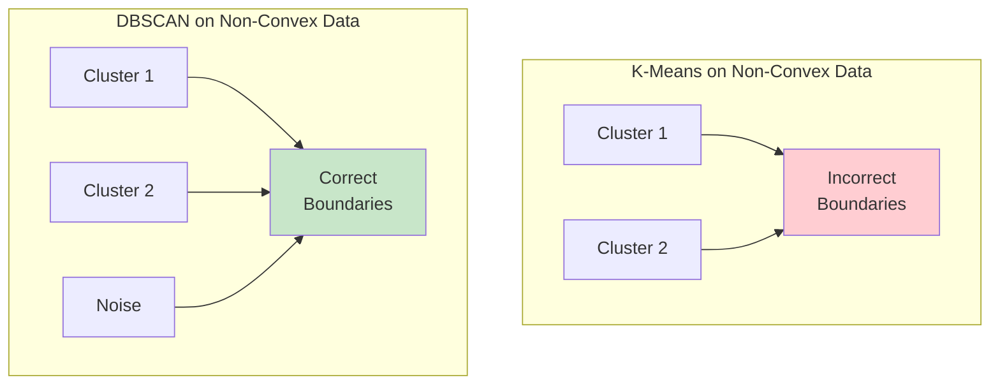

**Comparison Table**:

| Feature | K-Means | DBSCAN |
|---------|---------|--------|
| **Cluster shape** | Spherical | Arbitrary |
| **Number of clusters** | Must specify k | Discovered automatically |
| **Outliers** | Assigned to clusters | Marked as noise |
| **Density** | Uniform | Handles varying densities (poorly) |
| **Scalability** | Excellent | Good (with indexing) |
| **Parameters** | k (intuitive) | eps, MinPts (harder to tune) |

### 5.5 Advantages and Limitations

**Advantages**:
- ✅ Discovers arbitrary-shaped clusters
- ✅ No need to specify number of clusters
- ✅ Robust to outliers (marks as noise)
- ✅ Only two parameters

**Disadvantages**:
- ❌ Sensitive to parameter choice (eps, MinPts)
- ❌ Struggles with clusters of varying densities
- ❌ Expensive for high-dimensional data (curse of dimensionality)
- ❌ Memory intensive for large datasets

**2024 Research Finding**: HDBSCAN addresses the varying density limitation and eliminates need for eps parameter (covered in Part 2).

---

## 6. Gaussian Mixture Models (GMM)

### 6.1 How GMM Works

**GMM** assumes data is generated from a mixture of K Gaussian distributions.

```mermaid
graph LR
    A[Data<br/>Generation] --> B[Gaussian 1<br/>μ₁ Σ₁<br/>weight: π₁]
    A --> C[Gaussian 2<br/>μ₂ Σ₂<br/>weight: π₂]
    A --> D[Gaussian K<br/>μₖ Σₖ<br/>weight: πₖ]

    B --> E[Observed<br/>Data]
    C --> E
    D --> E

    style A fill:#e1f5ff
    style E fill:#c8e6c9
```

**Key Concept**: **Soft Clustering** - Each point has a probability of belonging to each cluster

**Mathematical Model**:
```
p(x) = Σᵢ₌₁ᴷ πᵢ · N(x | μᵢ, Σᵢ)

where:
- πᵢ = mixing coefficient (weight) for component i
- N(x | μᵢ, Σᵢ) = Gaussian distribution
- Σᵢ πᵢ = 1, πᵢ ≥ 0
```

### 6.2 Expectation-Maximization (EM) Algorithm

**EM Algorithm** iteratively estimates GMM parameters.

```mermaid
flowchart TD
    A[Initialize<br/>Parameters] --> B[E-Step:<br/>Compute<br/>Responsibilities]
    B --> C[M-Step:<br/>Update<br/>Parameters]
    C --> D{Converged?}
    D -->|No| B
    D -->|Yes| E[Final<br/>Model]

    B --> B1[γᵢₖ = P cluster k | point i]
    C --> C1[Update μₖ Σₖ πₖ<br/>using γᵢₖ]

    style A fill:#e1f5ff
    style B fill:#fff9c4
    style C fill:#ffeb99
    style E fill:#c8e6c9
```

**Algorithm Steps**:

```
Initialize: μₖ, Σₖ, πₖ for k=1..K

Repeat until convergence:

  E-Step (Expectation):
    For each point i and cluster k:
      Compute responsibility γᵢₖ = P(cluster k | point i)
      γᵢₖ = πₖ · N(xᵢ | μₖ, Σₖ) / Σⱼ πⱼ · N(xᵢ | μⱼ, Σⱼ)

  M-Step (Maximization):
    Update parameters using responsibilities:
    Nₖ = Σᵢ γᵢₖ
    πₖ = Nₖ / N
    μₖ = (1/Nₖ) Σᵢ γᵢₖ · xᵢ
    Σₖ = (1/Nₖ) Σᵢ γᵢₖ · (xᵢ - μₖ)(xᵢ - μₖ)ᵀ
```

### 6.3 GMM vs K-Means

```mermaid
graph TB
    subgraph "K-Means (Hard Clustering)"
        A1[Point] -->|Assign to<br/>nearest| A2[Cluster 1]
        A1 -->|OR| A3[Cluster 2]
    end

    subgraph "GMM (Soft Clustering)"
        B1[Point] -->|70%<br/>probability| B2[Cluster 1]
        B1 -->|30%<br/>probability| B3[Cluster 2]
    end

    style A1 fill:#e1f5ff
    style B1 fill:#e1f5ff
    style B2 fill:#c8e6c9
    style B3 fill:#ffeb99
```

**Key Differences**:

| Feature | K-Means | GMM |
|---------|---------|-----|
| **Assignment** | Hard (binary) | Soft (probabilistic) |
| **Cluster shape** | Spherical | Elliptical |
| **Model** | Distance-based | Probabilistic |
| **Covariance** | Isotropic (same in all directions) | Anisotropic (different per dimension) |
| **Uncertainty** | None | Provides probabilities |

### 6.4 Implementation

```python
"""Gaussian Mixture Models implementation.

Demonstrates GMM for soft clustering with best practices from 2024 research.
"""

from typing import Tuple, Optional
import numpy as np
import matplotlib.pyplot as plt
from matplotlib.patches import Ellipse
from sklearn.mixture import GaussianMixture
from sklearn.preprocessing import StandardScaler
from sklearn.metrics import silhouette_score
from sklearn.datasets import make_blobs


def select_n_components(
    X: np.ndarray,
    max_components: int = 10
) -> int:
    """Select optimal number of components using BIC and AIC.

    2024 Best Practice: BIC penalizes complexity more than AIC,
    helping avoid overfitting.

    Args:
        X: Standardized data matrix.
        max_components: Maximum components to test.

    Returns:
        Optimal number of components.
    """
    bic_scores = []
    aic_scores = []
    n_components_range = range(1, max_components + 1)

    for n_components in n_components_range:
        gmm = GaussianMixture(
            n_components=n_components,
            random_state=42,
            n_init=10  # Multiple initializations (2024 best practice)
        )
        gmm.fit(X)

        bic_scores.append(gmm.bic(X))
        aic_scores.append(gmm.aic(X))

    # Lower BIC/AIC is better
    optimal_bic = np.argmin(bic_scores) + 1
    optimal_aic = np.argmin(aic_scores) + 1

    # Visualization
    fig, ax = plt.subplots(figsize=(10, 6))

    ax.plot(n_components_range, bic_scores, 'bo-', label='BIC')
    ax.plot(n_components_range, aic_scores, 'go-', label='AIC')
    ax.axvline(optimal_bic, color='b', linestyle='--', alpha=0.5,
               label=f'Optimal BIC (k={optimal_bic})')
    ax.axvline(optimal_aic, color='g', linestyle='--', alpha=0.5,
               label=f'Optimal AIC (k={optimal_aic})')

    ax.set_xlabel('Number of Components')
    ax.set_ylabel('Information Criterion')
    ax.set_title('GMM Model Selection: BIC vs AIC')
    ax.legend()
    ax.grid(True, alpha=0.3)
    plt.savefig('gmm_model_selection.png', dpi=300, bbox_inches='tight')
    plt.close()

    print(f"Optimal components - BIC: {optimal_bic}, AIC: {optimal_aic}")

    # Prefer BIC (more conservative)
    return optimal_bic


def cluster_with_gmm(
    X: np.ndarray,
    n_components: Optional[int] = None,
    covariance_type: str = 'full'
) -> Tuple[np.ndarray, np.ndarray, GaussianMixture]:
    """Perform GMM clustering with best practices.

    2024 Best Practices:
    - Multiple initializations (n_init=10)
    - Regularization to avoid singular covariance
    - Proper initialization with K-Means

    Args:
        X: Data matrix.
        n_components: Number of components (auto-selected if None).
        covariance_type: 'full', 'tied', 'diag', or 'spherical'.
            - full: Each component has own covariance matrix
            - tied: All components share same covariance
            - diag: Diagonal covariance (no correlation)
            - spherical: Single variance per component

    Returns:
        Tuple of (hard_labels, soft_labels, fitted_model).
    """
    # Standardization
    scaler = StandardScaler()
    X_scaled = scaler.fit_transform(X)

    # Auto-select components if not provided
    if n_components is None:
        print("Selecting optimal number of components...")
        n_components = select_n_components(X_scaled)

    # Fit GMM with best practices
    gmm = GaussianMixture(
        n_components=n_components,
        covariance_type=covariance_type,
        n_init=10,  # Multiple initializations
        init_params='k-means++',  # Use K-Means++ for initialization
        reg_covar=1e-6,  # Regularization (2024 best practice)
        random_state=42,
        max_iter=200,
        tol=1e-4
    )

    # Fit model
    gmm.fit(X_scaled)

    # Predictions
    hard_labels = gmm.predict(X_scaled)  # Hard clustering
    soft_labels = gmm.predict_proba(X_scaled)  # Soft clustering

    # Evaluation
    log_likelihood = gmm.score(X_scaled)
    bic = gmm.bic(X_scaled)
    aic = gmm.aic(X_scaled)

    print(f"\n=== GMM Results ===")
    print(f"Number of components: {n_components}")
    print(f"Covariance type: {covariance_type}")
    print(f"Converged: {gmm.converged_}")
    print(f"Iterations: {gmm.n_iter_}")
    print(f"Log-likelihood: {log_likelihood:.2f}")
    print(f"BIC: {bic:.2f} (lower is better)")
    print(f"AIC: {aic:.2f} (lower is better)")

    if n_components >= 2:
        silhouette = silhouette_score(X_scaled, hard_labels)
        print(f"Silhouette Score: {silhouette:.3f}")

    # Component weights and sizes
    print(f"\nComponent weights (π): {gmm.weights_}")
    unique, counts = np.unique(hard_labels, return_counts=True)
    print(f"Hard assignment sizes: {dict(zip(unique, counts))}")

    return hard_labels, soft_labels, gmm


def visualize_gmm(
    X: np.ndarray,
    labels: np.ndarray,
    gmm: GaussianMixture,
    title: str = "Gaussian Mixture Model"
) -> None:
    """Visualize GMM clustering with ellipses (2D only).

    Args:
        X: Original data matrix.
        labels: Cluster labels.
        gmm: Fitted GMM model.
        title: Plot title.
    """
    if X.shape[1] != 2:
        print("Visualization only supported for 2D data")
        return

    # Standardize for plotting (gmm was fitted on scaled data)
    scaler = StandardScaler()
    X_scaled = scaler.fit_transform(X)

    fig, axes = plt.subplots(1, 2, figsize=(15, 6))

    # Plot 1: Hard clustering
    ax = axes[0]
    scatter = ax.scatter(
        X_scaled[:, 0], X_scaled[:, 1],
        c=labels,
        cmap='viridis',
        alpha=0.6,
        edgecolors='k',
        linewidth=0.5
    )

    # Draw Gaussian ellipses
    for i, (mean, covar) in enumerate(zip(gmm.means_, gmm.covariances_)):
        v, w = np.linalg.eigh(covar)
        angle = np.arctan2(w[0][1], w[0][0])
        angle = 180 * angle / np.pi

        # 2 standard deviations = ~95% confidence
        for n_std in [1, 2]:
            ellipse = Ellipse(
                mean,
                2 * n_std * np.sqrt(v[0]),
                2 * n_std * np.sqrt(v[1]),
                angle,
                facecolor='none',
                edgecolor=plt.cm.viridis(i / gmm.n_components),
                linewidth=2,
                linestyle='--' if n_std == 2 else '-'
            )
            ax.add_patch(ellipse)

    ax.scatter(
        gmm.means_[:, 0], gmm.means_[:, 1],
        c='red', marker='X', s=200,
        edgecolors='black', linewidth=2,
        label='Means'
    )

    ax.set_xlabel('Feature 1 (scaled)')
    ax.set_ylabel('Feature 2 (scaled)')
    ax.set_title(f'{title} - Hard Clustering')
    ax.legend()
    ax.grid(True, alpha=0.3)
    plt.colorbar(scatter, ax=ax, label='Cluster')

    # Plot 2: Soft clustering (show uncertainty)
    ax = axes[1]
    soft_probs = gmm.predict_proba(X_scaled)
    max_probs = soft_probs.max(axis=1)  # Confidence

    scatter = ax.scatter(
        X_scaled[:, 0], X_scaled[:, 1],
        c=labels,
        cmap='viridis',
        alpha=max_probs,  # Opacity shows confidence
        edgecolors='k',
        linewidth=0.5
    )

    ax.set_xlabel('Feature 1 (scaled)')
    ax.set_ylabel('Feature 2 (scaled)')
    ax.set_title(f'{title} - Soft Clustering\n(Opacity = Confidence)')
    ax.grid(True, alpha=0.3)
    plt.colorbar(scatter, ax=ax, label='Cluster')

    plt.tight_layout()
    plt.savefig('gmm_clustering.png', dpi=300, bbox_inches='tight')
    plt.close()


def compare_covariance_types(X: np.ndarray, n_components: int = 3) -> None:
    """Compare different covariance types.

    Args:
        X: Data matrix.
        n_components: Number of components.
    """
    covariance_types = ['full', 'tied', 'diag', 'spherical']

    fig, axes = plt.subplots(2, 2, figsize=(14, 12))
    axes = axes.ravel()

    scaler = StandardScaler()
    X_scaled = scaler.fit_transform(X)

    for idx, cov_type in enumerate(covariance_types):
        gmm = GaussianMixture(
            n_components=n_components,
            covariance_type=cov_type,
            n_init=10,
            random_state=42
        )
        labels = gmm.fit_predict(X_scaled)

        ax = axes[idx]
        scatter = ax.scatter(
            X_scaled[:, 0], X_scaled[:, 1],
            c=labels,
            cmap='viridis',
            alpha=0.6,
            edgecolors='k',
            linewidth=0.5
        )

        # Draw means
        ax.scatter(
            gmm.means_[:, 0], gmm.means_[:, 1],
            c='red', marker='X', s=200,
            edgecolors='black', linewidth=2
        )

        bic = gmm.bic(X_scaled)
        ax.set_title(f'{cov_type.capitalize()} Covariance\nBIC: {bic:.1f}')
        ax.set_xlabel('Feature 1')
        ax.set_ylabel('Feature 2')
        ax.grid(True, alpha=0.3)
        plt.colorbar(scatter, ax=ax, label='Cluster')

    plt.tight_layout()
    plt.savefig('gmm_covariance_comparison.png', dpi=300, bbox_inches='tight')
    plt.close()


def main():
    """Main GMM clustering example."""
    # Generate data with overlapping clusters
    X, _ = make_blobs(
        n_samples=600,
        centers=3,
        n_features=2,
        cluster_std=[1.0, 1.5, 0.8],  # Varying sizes
        random_state=42
    )

    print("=== Gaussian Mixture Model Clustering ===")

    # Auto-select and cluster
    labels, soft_labels, gmm = cluster_with_gmm(X, covariance_type='full')

    # Visualize
    visualize_gmm(X, labels, gmm)

    # Compare covariance types
    print("\n=== Comparing Covariance Types ===")
    compare_covariance_types(X, n_components=3)

    # Example: Access soft clustering probabilities
    print("\n=== Soft Clustering Example ===")
    print("First 5 points - cluster probabilities:")
    print(soft_labels[:5])


if __name__ == "__main__":
    main()
```

### 6.5 Covariance Types

```mermaid
graph TD
    A[Covariance<br/>Types] --> B[Full]
    A --> C[Tied]
    A --> D[Diagonal]
    A --> E[Spherical]

    B --> B1[Each component:<br/>own covariance<br/>matrix]
    B --> B2[Most flexible]
    B --> B3[Most parameters]

    C --> C1[All components:<br/>share covariance<br/>matrix]
    C --> C2[Moderate flexibility]
    C --> C3[Fewer parameters]

    D --> D1[Diagonal<br/>covariance<br/>no correlation]
    D --> D2[Axis-aligned<br/>ellipses]
    D --> D3[Few parameters]

    E --> E1[Single variance<br/>per component]
    E --> E2[Spherical<br/>clusters only]
    E --> E3[Fewest parameters]

    style A fill:#fff9c4
    style B fill:#c8e6c9
```

**Guideline**:
- **Full**: Most flexible, use when sufficient data
- **Tied**: When all clusters have similar shape
- **Diagonal**: When features are independent
- **Spherical**: Like K-Means, use when clusters are spherical

### 6.6 Advantages and Limitations

**Advantages**:
- ✅ Soft clustering (provides probabilities)
- ✅ Handles elliptical/elongated clusters
- ✅ Probabilistic framework (principled uncertainty)
- ✅ Model selection via BIC/AIC

**Disadvantages**:
- ❌ Sensitive to initialization
- ❌ Can converge to local optima
- ❌ Requires choosing k (number of components)
- ❌ Assumes Gaussian distributions
- ❌ Computationally expensive (O(n k d²) per iteration)

**2024 Best Practice**: Always use multiple initializations (n_init=10) and regularization (reg_covar) to avoid singular covariance matrices.

---

## 7. Clustering Evaluation Metrics

### 7.1 Internal Metrics (No Ground Truth)

**Internal metrics** evaluate clustering quality using only the data and cluster assignments.

```mermaid
graph TD
    A[Internal<br/>Metrics] --> B[Silhouette<br/>Score]
    A --> C[Davies-Bouldin<br/>Index]
    A --> D[Calinski-Harabasz<br/>Index]
    A --> E[Dunn Index]

    B --> B1[Range: -1, 1<br/>Higher is better]
    C --> C1[Range: 0, ∞<br/>Lower is better]
    D --> D1[Range: 0, ∞<br/>Higher is better]
    E --> E1[Range: 0, ∞<br/>Higher is better]

    style A fill:#fff9c4
```

#### Silhouette Score

**Formula** for point i:
```
s(i) = (b(i) - a(i)) / max(a(i), b(i))

where:
- a(i) = average distance to points in same cluster (cohesion)
- b(i) = average distance to points in nearest cluster (separation)
```

**Interpretation**:
- **s(i) ≈ 1**: Well-clustered (far from other clusters)
- **s(i) ≈ 0**: On boundary between clusters
- **s(i) < 0**: Likely in wrong cluster

**Average Silhouette** = mean(s(i)) over all points

```python
from sklearn.metrics import silhouette_score, silhouette_samples

# Overall score
score = silhouette_score(X, labels)

# Per-sample scores
sample_scores = silhouette_samples(X, labels)
```

#### Davies-Bouldin Index

**Formula**:
```
DB = (1/k) Σᵢ₌₁ᵏ max_{j≠i} (σᵢ + σⱼ) / d(cᵢ, cⱼ)

where:
- σᵢ = average distance of points in cluster i to centroid
- d(cᵢ, cⱼ) = distance between centroids i and j
```

**Interpretation**: Lower is better (≈0.79 is good per 2024 research)

**Measures**: Balance between within-cluster scatter and between-cluster separation

```python
from sklearn.metrics import davies_bouldin_score

score = davies_bouldin_score(X, labels)  # Lower is better
```

#### Calinski-Harabasz Index

**Formula** (Variance Ratio Criterion):
```
CH = [Between-cluster variance / Within-cluster variance] × [(n - k) / (k - 1)]

where:
- n = number of samples
- k = number of clusters
```

**Interpretation**: Higher is better

**Advantage**: Fast to compute, works well in practice

```python
from sklearn.metrics import calinski_harabasz_score

score = calinski_harabasz_score(X, labels)  # Higher is better
```

#### Dunn Index

**Formula**:
```
DI = min_{i≠j} d(Cᵢ, Cⱼ) / max_k diameter(Cₖ)

where:
- d(Cᵢ, Cⱼ) = distance between clusters i and j
- diameter(Cₖ) = maximum within-cluster distance
```

**Interpretation**: Higher is better (maximizes inter-cluster distance, minimizes intra-cluster distance)

**Disadvantage**: Computationally expensive

### 7.2 External Metrics (Ground Truth Available)

When true labels are available (for validation, not clustering itself):

```python
from sklearn.metrics import (
    adjusted_rand_score,
    normalized_mutual_info_score,
    fowlkes_mallows_score,
    homogeneity_completeness_v_measure
)

# Adjusted Rand Index: measures agreement between true and predicted
ari = adjusted_rand_score(y_true, y_pred)  # Range: [-1, 1], higher better

# Normalized Mutual Information: measures information shared
nmi = normalized_mutual_info_score(y_true, y_pred)  # Range: [0, 1]

# Fowlkes-Mallows Index: geometric mean of precision and recall
fmi = fowlkes_mallows_score(y_true, y_pred)  # Range: [0, 1]

# Homogeneity, Completeness, V-Measure
h, c, v = homogeneity_completeness_v_measure(y_true, y_pred)
# h: each cluster contains only members of single class
# c: all members of given class assigned to same cluster
# v: harmonic mean of h and c
```

### 7.3 Comprehensive Evaluation Function

```python
"""Comprehensive clustering evaluation suite.

Implements all major evaluation metrics with 2024 best practices.
"""

from typing import Dict, Optional
import numpy as np
from sklearn.metrics import (
    silhouette_score,
    davies_bouldin_score,
    calinski_harabasz_score,
    adjusted_rand_score,
    normalized_mutual_info_score
)


def evaluate_clustering(
    X: np.ndarray,
    labels: np.ndarray,
    y_true: Optional[np.ndarray] = None
) -> Dict[str, float]:
    """Comprehensive clustering evaluation.

    2024 Research: Use multiple metrics together for robust assessment.
    - Silhouette: ~0.5-0.7 is good, >0.7 is excellent
    - Davies-Bouldin: <1.0 is good, <0.79 is very good
    - Calinski-Harabasz: Higher is better (dataset-dependent)

    Args:
        X: Data matrix.
        labels: Cluster labels.
        y_true: True labels (if available).

    Returns:
        Dictionary of metric scores.
    """
    metrics = {}

    # Check if valid clustering (at least 2 clusters, no all-noise)
    n_clusters = len(set(labels)) - (1 if -1 in labels else 0)

    if n_clusters < 2:
        print("Warning: Less than 2 clusters found")
        return {'n_clusters': n_clusters}

    # Filter out noise points for metrics (if present)
    mask = labels != -1
    if mask.sum() < 2:
        print("Warning: Too few non-noise points for evaluation")
        return {'n_clusters': n_clusters}

    X_filtered = X[mask]
    labels_filtered = labels[mask]

    # Internal metrics
    try:
        metrics['silhouette'] = silhouette_score(X_filtered, labels_filtered)
        metrics['davies_bouldin'] = davies_bouldin_score(X_filtered, labels_filtered)
        metrics['calinski_harabasz'] = calinski_harabasz_score(X_filtered, labels_filtered)
    except Exception as e:
        print(f"Warning: Could not compute some internal metrics: {e}")

    # External metrics (if ground truth available)
    if y_true is not None:
        y_true_filtered = y_true[mask]
        try:
            metrics['adjusted_rand_index'] = adjusted_rand_score(
                y_true_filtered, labels_filtered
            )
            metrics['normalized_mutual_info'] = normalized_mutual_info_score(
                y_true_filtered, labels_filtered
            )
        except Exception as e:
            print(f"Warning: Could not compute external metrics: {e}")

    # Basic statistics
    metrics['n_clusters'] = n_clusters
    metrics['n_noise'] = list(labels).count(-1)
    metrics['noise_ratio'] = metrics['n_noise'] / len(labels)

    return metrics


def print_evaluation_report(metrics: Dict[str, float]) -> None:
    """Print formatted evaluation report.

    Args:
        metrics: Dictionary from evaluate_clustering.
    """
    print("\n" + "="*50)
    print("CLUSTERING EVALUATION REPORT")
    print("="*50)

    print(f"\n{'Metric':<30} {'Value':>15} {'Interpretation':<20}")
    print("-"*70)

    # Internal metrics
    if 'silhouette' in metrics:
        sil = metrics['silhouette']
        interp = "Excellent" if sil > 0.7 else "Good" if sil > 0.5 else "Fair" if sil > 0.25 else "Poor"
        print(f"{'Silhouette Score':<30} {sil:>15.3f} {interp:<20}")

    if 'davies_bouldin' in metrics:
        db = metrics['davies_bouldin']
        interp = "Very Good" if db < 0.8 else "Good" if db < 1.0 else "Fair" if db < 1.5 else "Poor"
        print(f"{'Davies-Bouldin Index':<30} {db:>15.3f} {interp:<20}")

    if 'calinski_harabasz' in metrics:
        ch = metrics['calinski_harabasz']
        print(f"{'Calinski-Harabasz Index':<30} {ch:>15.2f} {'(Higher better)':<20}")

    # External metrics
    if 'adjusted_rand_index' in metrics:
        ari = metrics['adjusted_rand_index']
        interp = "Excellent" if ari > 0.9 else "Good" if ari > 0.7 else "Fair" if ari > 0.5 else "Poor"
        print(f"{'Adjusted Rand Index':<30} {ari:>15.3f} {interp:<20}")

    if 'normalized_mutual_info' in metrics:
        nmi = metrics['normalized_mutual_info']
        print(f"{'Normalized Mutual Info':<30} {nmi:>15.3f} {'(0=random, 1=perfect)':<20}")

    # Statistics
    print("\n" + "-"*70)
    print(f"{'Number of clusters':<30} {metrics['n_clusters']:>15}")
    if metrics.get('n_noise', 0) > 0:
        print(f"{'Noise points':<30} {metrics['n_noise']:>15}")
        print(f"{'Noise ratio':<30} {metrics['noise_ratio']:>15.1%}")

    print("="*50 + "\n")


# Example usage
if __name__ == "__main__":
    from sklearn.datasets import make_blobs
    from sklearn.cluster import KMeans

    # Generate data with ground truth
    X, y_true = make_blobs(n_samples=500, centers=4, random_state=42)

    # Cluster
    kmeans = KMeans(n_clusters=4, random_state=42)
    labels = kmeans.fit_predict(X)

    # Evaluate
    metrics = evaluate_clustering(X, labels, y_true=y_true)
    print_evaluation_report(metrics)
```

---

## 8. Choosing the Right Algorithm

### 8.1 Decision Tree

```mermaid
graph TD
    A[Choose<br/>Clustering<br/>Algorithm] --> B{Know k?}

    B -->|Yes| C{Spherical<br/>clusters?}
    B -->|No| D{Arbitrary<br/>shapes?}

    C -->|Yes| E[K-Means]
    C -->|No| F[GMM]

    D -->|Yes| G{Varying<br/>densities?}
    D -->|No| H{Hierarchy<br/>needed?}

    G -->|Yes| I[HDBSCAN<br/>Part 2]
    G -->|No| J[DBSCAN]

    H -->|Yes| K[Hierarchical]
    H -->|No| L[Try multiple<br/>algorithms]

    E --> M{Large<br/>dataset?}
    M -->|Yes n>10k| N[Mini-Batch<br/>K-Means]
    M -->|No| O[Standard<br/>K-Means]

    style A fill:#fff9c4
    style E fill:#c8e6c9
    style F fill:#c8e6c9
    style I fill:#c8e6c9
    style J fill:#c8e6c9
    style K fill:#c8e6c9
    style N fill:#c8e6c9
    style O fill:#c8e6c9
```

### 8.2 Algorithm Comparison Table

| Algorithm | Cluster Shape | Scalability | k Required? | Handles Outliers? | Use Case |
|-----------|---------------|-------------|-------------|-------------------|----------|
| **K-Means** | Spherical | Excellent | Yes | No | General purpose, large datasets |
| **Mini-Batch K-Means** | Spherical | Excellent | Yes | No | Very large datasets (n>10k) |
| **Hierarchical** | Any | Poor (O(n³)) | No | No | Small datasets, dendrograms |
| **DBSCAN** | Arbitrary | Good | No | Yes | Non-convex, uniform density |
| **HDBSCAN** (Part 2) | Arbitrary | Good | No | Yes | Varying densities |
| **GMM** | Elliptical | Moderate | Yes | No | Overlapping, probabilistic |
| **Spectral** (Part 2) | Complex | Poor | Yes | No | Graph data, manifolds |

### 8.3 Practical Guidelines

**Use K-Means when**:
- ✅ Clusters are roughly spherical and similar size
- ✅ You have a good estimate of k
- ✅ You need fast results
- ✅ Dataset is large (n > 10,000)

**Use DBSCAN when**:
- ✅ Clusters have arbitrary shapes
- ✅ You don't know k
- ✅ Data has outliers/noise
- ✅ Clusters have similar density

**Use GMM when**:
- ✅ Clusters are elliptical/elongated
- ✅ You need probabilistic assignments
- ✅ Clusters overlap
- ✅ You want soft clustering

**Use Hierarchical when**:
- ✅ Dataset is small (n < 10,000)
- ✅ You want to explore different k values
- ✅ Hierarchical structure matters
- ✅ You need deterministic results

### 8.4 Data Characteristics Checklist

```python
"""Helper function to analyze data characteristics for algorithm selection."""

import numpy as np
from scipy.stats import skew, kurtosis
from sklearn.preprocessing import StandardScaler


def analyze_data_characteristics(X: np.ndarray) -> Dict[str, any]:
    """Analyze data to suggest clustering algorithm.

    Args:
        X: Data matrix.

    Returns:
        Dictionary of characteristics and recommendations.
    """
    n_samples, n_features = X.shape

    # Standardize for analysis
    scaler = StandardScaler()
    X_scaled = scaler.fit_transform(X)

    characteristics = {
        'n_samples': n_samples,
        'n_features': n_features,
        'is_large': n_samples > 10000,
        'is_high_dim': n_features > 50
    }

    # Check for outliers (using IQR method)
    Q1 = np.percentile(X_scaled, 25, axis=0)
    Q3 = np.percentile(X_scaled, 75, axis=0)
    IQR = Q3 - Q1
    outlier_mask = np.any(
        (X_scaled < Q1 - 1.5 * IQR) | (X_scaled > Q3 + 1.5 * IQR),
        axis=1
    )
    outlier_ratio = outlier_mask.sum() / n_samples
    characteristics['has_outliers'] = outlier_ratio > 0.05
    characteristics['outlier_ratio'] = outlier_ratio

    # Check feature correlation (for covariance type selection)
    corr_matrix = np.corrcoef(X_scaled.T)
    high_corr = np.sum(np.abs(corr_matrix - np.eye(n_features)) > 0.7) > 0
    characteristics['high_correlation'] = high_corr

    # Check distribution (for GMM suitability)
    skewness = np.mean(np.abs(skew(X_scaled, axis=0)))
    characteristics['is_gaussian_like'] = skewness < 1.0

    # Recommendations
    recommendations = []

    if characteristics['is_large']:
        recommendations.append("Mini-Batch K-Means (fast for large data)")
    else:
        recommendations.append("Standard K-Means")

    if characteristics['has_outliers']:
        recommendations.append("DBSCAN or HDBSCAN (robust to outliers)")

    if characteristics['is_gaussian_like']:
        recommendations.append("GMM (data appears Gaussian)")

    if not characteristics['is_large']:
        recommendations.append("Hierarchical (good for exploration)")

    if characteristics['is_high_dim']:
        recommendations.append("Consider dimensionality reduction first (PCA/UMAP)")

    characteristics['recommendations'] = recommendations

    # Print report
    print("\n" + "="*60)
    print("DATA CHARACTERISTICS ANALYSIS")
    print("="*60)
    print(f"\nDataset size: {n_samples:,} samples × {n_features} features")
    print(f"Outlier ratio: {outlier_ratio:.1%}")
    print(f"High feature correlation: {high_corr}")
    print(f"Gaussian-like distribution: {characteristics['is_gaussian_like']}")

    print("\n" + "-"*60)
    print("RECOMMENDED ALGORITHMS:")
    for i, rec in enumerate(recommendations, 1):
        print(f"{i}. {rec}")
    print("="*60 + "\n")

    return characteristics


# Example usage
if __name__ == "__main__":
    from sklearn.datasets import make_blobs, make_moons

    # Example 1: Standard blobs
    X_blobs, _ = make_blobs(n_samples=500, centers=3, random_state=42)
    print("Analysis for Blob Data:")
    analyze_data_characteristics(X_blobs)

    # Example 2: Non-convex data
    X_moons, _ = make_moons(n_samples=500, noise=0.1, random_state=42)
    print("\nAnalysis for Moon Data:")
    analyze_data_characteristics(X_moons)
```

---

## Summary - Part 1

This concludes Part 1 of the Clustering Complete Guide. We covered:

### Key Algorithms

1. **K-Means**: Fast, scalable, spherical clusters
   - Variants: K-Means++, Mini-Batch, Elkan's algorithm
   - Best for: Large datasets, well-separated clusters

2. **Hierarchical**: Dendrogram, no k required
   - Linkage methods: Ward, complete, average, single
   - Best for: Small datasets, hierarchical structure

3. **DBSCAN**: Arbitrary shapes, outlier detection
   - Density-based, no k required
   - Best for: Non-convex clusters, uniform density

4. **GMM**: Probabilistic, soft clustering
   - EM algorithm, elliptical clusters
   - Best for: Overlapping clusters, uncertainty quantification

### Evaluation Metrics

- **Silhouette Score**: -1 to 1, higher better
- **Davies-Bouldin Index**: 0 to ∞, lower better
- **Calinski-Harabasz Index**: 0 to ∞, higher better

### 2024 Research Insights

- K-Means++: Provides O(log k) approximation guarantee
- Mini-Batch K-Means: Order of magnitude speedup for large data
- HDBSCAN outperforms DBSCAN for varying densities (Part 2)
- GMM best practices: Multiple initializations (n_init=10), regularization

---

**Continue to Part 2** for:
- Advanced algorithms (HDBSCAN, Spectral Clustering)
- Deep clustering with neural networks
- Time series clustering
- Production deployment and scalability
- Distributed clustering (Dask, Ray)
- Interview questions and case studies

---

*Part of ML/AI Documentation Series - Clustering Algorithms*
