# Clustering Algorithms - Complete Guide (Part 2: Advanced Methods & Production)

Advanced clustering techniques, deep learning approaches, and production deployment strategies with 2024-2025 SOTA research.

---

## Table of Contents - Part 2

1. [HDBSCAN: Hierarchical Density-Based Clustering](#1-hdbscan-hierarchical-density-based-clustering)
2. [Spectral Clustering](#2-spectral-clustering)
3. [Deep Clustering with Neural Networks](#3-deep-clustering-with-neural-networks)
4. [Time Series Clustering](#4-time-series-clustering)
5. [Production Deployment](#5-production-deployment)
6. [Scalability and Optimization](#6-scalability-and-optimization)
7. [Distributed Clustering](#7-distributed-clustering)
8. [Advanced Topics](#8-advanced-topics)
9. [Interview Questions](#9-interview-questions)
10. [Best Practices Checklist](#10-best-practices-checklist)

**See Part 1 for**: Fundamentals, K-Means, Hierarchical, DBSCAN, GMM, and Evaluation Metrics.

---

## 1. HDBSCAN: Hierarchical Density-Based Clustering

### 1.1 Why HDBSCAN?

**HDBSCAN** extends DBSCAN by addressing its key limitation: inability to handle clusters of varying densities.

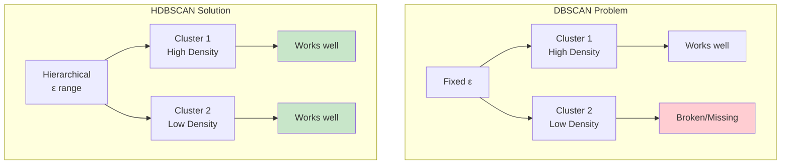

**Key Advantages** (from 2024 research):
- ✅ No need to specify ε parameter
- ✅ Handles varying densities
- ✅ Provides cluster hierarchy
- ✅ Robust cluster stability scores
- ✅ Can predict new points (unlike DBSCAN)

### 1.2 How HDBSCAN Works

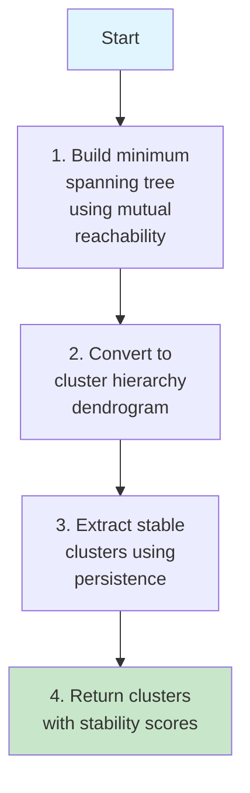

**Algorithm Steps**:

1. **Mutual Reachability Distance**:
   ```
   d_mreach(a, b) = max(core_distance(a), core_distance(b), d(a, b))

   where core_distance(a) = distance to kth nearest neighbor
   ```

2. **Build Minimum Spanning Tree**: Connect all points with minimum total edge weight

3. **Build Cluster Hierarchy**: Remove edges in order of decreasing weight, creating dendrogram

4. **Extract Clusters**: Select stable clusters based on persistence (lifetime in hierarchy)

5. **Stability Score**: Measure how persistent each cluster is across density scales

### 1.3 HDBSCAN vs DBSCAN

**2024 Research Findings**:

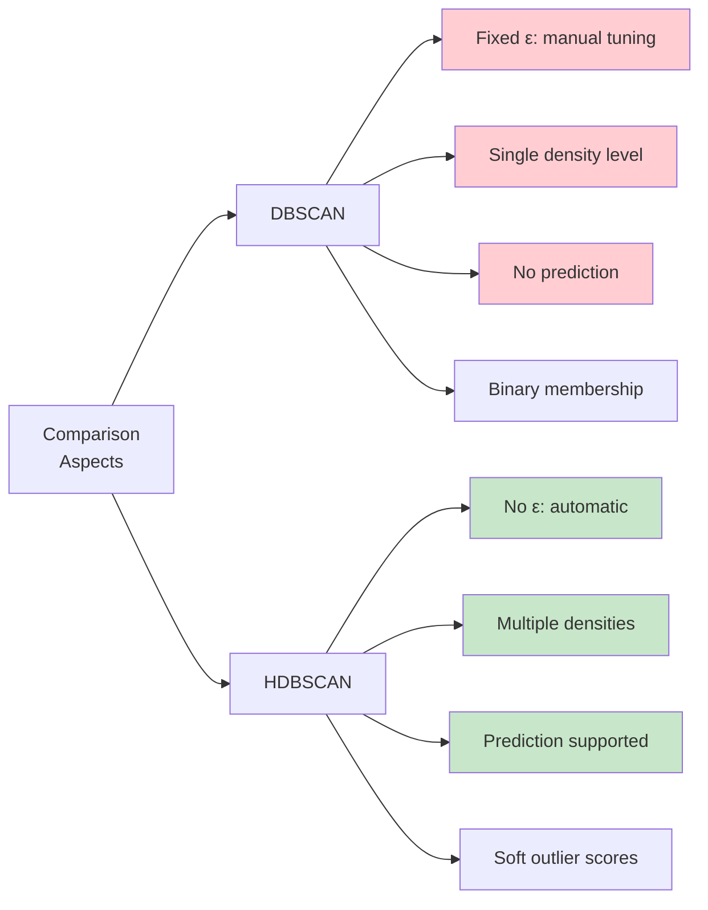

| Feature | DBSCAN | HDBSCAN |
|---------|--------|---------|
| **Parameters** | ε, MinPts | MinPts only |
| **Density** | Single level | Multiple levels |
| **Prediction** | No | Yes |
| **Hierarchy** | No | Yes (dendrogram) |
| **Stability scores** | No | Yes |
| **Performance** | O(n log n) with indexing | O(n log n) |

**2024 Benchmark**: HDBSCAN and Leiden perform "almost perfectly" on 2D datasets with varying densities.

### 1.4 Implementation

```python
"""HDBSCAN implementation using scikit-learn-contrib library.

2024 Research: HDBSCAN is state-of-the-art for density-based clustering
with varying densities. Significantly outperforms DBSCAN in most cases.

Installation: pip install hdbscan
"""

from typing import Tuple, Optional
import numpy as np
import matplotlib.pyplot as plt
import hdbscan
from sklearn.preprocessing import StandardScaler
from sklearn.metrics import silhouette_score
from sklearn.datasets import make_blobs


def cluster_with_hdbscan(
    X: np.ndarray,
    min_cluster_size: int = 5,
    min_samples: Optional[int] = None,
    cluster_selection_method: str = 'eom'
) -> Tuple[np.ndarray, np.ndarray, hdbscan.HDBSCAN]:
    """Perform HDBSCAN clustering with best practices.

    2024 Best Practices:
    - min_cluster_size: Smallest grouping you want as cluster
    - min_samples: Controls conservativeness (default = min_cluster_size)
    - cluster_selection_method: 'eom' (Excess of Mass) or 'leaf'

    Args:
        X: Data matrix.
        min_cluster_size: Minimum cluster size.
        min_samples: Minimum samples in neighborhood (None = min_cluster_size).
        cluster_selection_method: 'eom' or 'leaf'.
            - 'eom': More stable, preferred for most cases
            - 'leaf': Extracts leaf clusters from hierarchy

    Returns:
        Tuple of (labels, outlier_scores, fitted_model).
    """
    # Standardization
    scaler = StandardScaler()
    X_scaled = scaler.fit_transform(X)

    # Fit HDBSCAN
    clusterer = hdbscan.HDBSCAN(
        min_cluster_size=min_cluster_size,
        min_samples=min_samples,
        cluster_selection_method=cluster_selection_method,
        metric='euclidean',
        core_dist_n_jobs=-1  # Use all CPU cores
    )

    labels = clusterer.fit_predict(X_scaled)

    # Get outlier scores (GLOSH: Global-Local Outlier Score from Hierarchies)
    outlier_scores = clusterer.outlier_scores_

    # Evaluation
    n_clusters = len(set(labels)) - (1 if -1 in labels else 0)
    n_noise = list(labels).count(-1)

    print(f"\n=== HDBSCAN Results ===")
    print(f"Number of clusters: {n_clusters}")
    print(f"Number of noise points: {n_noise} ({100*n_noise/len(X):.1f}%)")

    if n_clusters >= 2:
        mask = labels != -1
        if mask.sum() >= 2:
            silhouette = silhouette_score(X_scaled[mask], labels[mask])
            print(f"Silhouette Score: {silhouette:.3f}")

    # Cluster stability scores
    if hasattr(clusterer, 'cluster_persistence_'):
        print(f"\nCluster Stability Scores:")
        for cluster_id, persistence in enumerate(clusterer.cluster_persistence_):
            print(f"  Cluster {cluster_id}: {persistence:.3f}")

    # Cluster sizes
    if n_clusters > 0:
        unique, counts = np.unique(labels[labels != -1], return_counts=True)
        print(f"\nCluster sizes: {dict(zip(unique, counts))}")

    return labels, outlier_scores, clusterer


def visualize_hdbscan(
    X: np.ndarray,
    labels: np.ndarray,
    outlier_scores: np.ndarray,
    clusterer: hdbscan.HDBSCAN,
    title: str = "HDBSCAN Clustering"
) -> None:
    """Visualize HDBSCAN results including outlier scores and hierarchy.

    Args:
        X: Original data matrix.
        labels: Cluster labels.
        outlier_scores: GLOSH outlier scores.
        clusterer: Fitted HDBSCAN object.
        title: Plot title.
    """
    if X.shape[1] != 2:
        print("Visualization only supported for 2D data")
        return

    fig, axes = plt.subplots(1, 3, figsize=(18, 5))

    # Plot 1: Clusters
    ax = axes[0]
    mask_clustered = labels != -1
    mask_noise = labels == -1

    if mask_clustered.any():
        scatter = ax.scatter(
            X[mask_clustered, 0],
            X[mask_clustered, 1],
            c=labels[mask_clustered],
            cmap='viridis',
            alpha=0.6,
            edgecolors='k',
            linewidth=0.5
        )
        plt.colorbar(scatter, ax=ax, label='Cluster')

    if mask_noise.any():
        ax.scatter(
            X[mask_noise, 0],
            X[mask_noise, 1],
            c='red',
            marker='x',
            s=50,
            alpha=0.8,
            label='Noise'
        )

    ax.set_xlabel('Feature 1')
    ax.set_ylabel('Feature 2')
    ax.set_title(f'{title} - Clusters')
    ax.legend()
    ax.grid(True, alpha=0.3)

    # Plot 2: Outlier Scores
    ax = axes[1]
    scatter = ax.scatter(
        X[:, 0], X[:, 1],
        c=outlier_scores,
        cmap='RdYlGn_r',  # Red for outliers, green for inliers
        alpha=0.6,
        edgecolors='k',
        linewidth=0.5
    )
    cbar = plt.colorbar(scatter, ax=ax, label='Outlier Score')
    ax.set_xlabel('Feature 1')
    ax.set_ylabel('Feature 2')
    ax.set_title('GLOSH Outlier Scores\n(Higher = More Outlying)')
    ax.grid(True, alpha=0.3)

    # Plot 3: Condensed Tree (hierarchy visualization)
    ax = axes[2]
    clusterer.condensed_tree_.plot(
        select_clusters=True,
        selection_palette=plt.cm.viridis.colors,
        axis=ax
    )
    ax.set_title('Condensed Cluster Tree\n(Shows hierarchy and stability)')

    plt.tight_layout()
    plt.savefig('hdbscan_results.png', dpi=300, bbox_inches='tight')
    plt.close()


def tune_hdbscan_parameters(
    X: np.ndarray,
    min_cluster_sizes: list = [5, 10, 15, 20, 30]
) -> int:
    """Find optimal min_cluster_size using validity index.

    Args:
        X: Data matrix.
        min_cluster_sizes: Range of min_cluster_size to test.

    Returns:
        Optimal min_cluster_size.
    """
    scaler = StandardScaler()
    X_scaled = scaler.fit_transform(X)

    results = []

    for mcs in min_cluster_sizes:
        clusterer = hdbscan.HDBSCAN(
            min_cluster_size=mcs,
            core_dist_n_jobs=-1
        )
        labels = clusterer.fit_predict(X_scaled)

        n_clusters = len(set(labels)) - (1 if -1 in labels else 0)
        n_noise = list(labels).count(-1)

        if n_clusters >= 2:
            mask = labels != -1
            if mask.sum() >= 2:
                score = silhouette_score(X_scaled[mask], labels[mask])
                validity = clusterer.relative_validity_
                results.append((mcs, n_clusters, n_noise, score, validity))

    if not results:
        print("Warning: No valid clusterings found")
        return min_cluster_sizes[0]

    # Print results
    print("\n=== HDBSCAN Parameter Tuning ===")
    print(f"{'min_cluster_size':>17} {'n_clusters':>11} {'n_noise':>8} {'silhouette':>11} {'validity':>10}")
    print("-" * 70)

    for mcs, n_clusters, n_noise, score, validity in results:
        print(f"{mcs:>17} {n_clusters:>11} {n_noise:>8} {score:>11.3f} {validity:>10.3f}")

    # Use validity index for selection (HDBSCAN-specific metric)
    optimal_idx = np.argmax([r[4] for r in results])  # Maximize validity
    optimal_mcs = results[optimal_idx][0]

    print(f"\nOptimal min_cluster_size: {optimal_mcs}")
    return optimal_mcs


def demonstrate_prediction(
    clusterer: hdbscan.HDBSCAN,
    X_train: np.ndarray,
    X_test: np.ndarray
) -> np.ndarray:
    """Demonstrate HDBSCAN's ability to predict labels for new points.

    Unlike DBSCAN, HDBSCAN can predict cluster membership for new data.

    Args:
        clusterer: Fitted HDBSCAN object.
        X_train: Training data (already scaled).
        X_test: Test data (already scaled).

    Returns:
        Predicted labels for test data.
    """
    # Approximate prediction using cluster exemplars
    test_labels, strengths = hdbscan.approximate_predict(clusterer, X_test)

    print("\n=== Prediction on New Data ===")
    print(f"Test samples: {len(X_test)}")
    print(f"Predicted cluster distribution: {np.bincount(test_labels[test_labels != -1])}")
    print(f"Predicted noise points: {list(test_labels).count(-1)}")

    return test_labels


def main():
    """Main HDBSCAN demonstration."""
    # Generate data with varying densities
    np.random.seed(42)
    X = np.vstack([
        np.random.randn(200, 2) * 0.3 + [0, 0],      # Dense cluster
        np.random.randn(100, 2) * 0.8 + [3, 3],      # Sparse cluster
        np.random.randn(150, 2) * 0.4 + [-3, 2],     # Medium cluster
        np.random.uniform(-5, 5, (30, 2))             # Noise
    ])

    print("=== HDBSCAN on Varying Density Data ===")

    # Tune parameters
    optimal_mcs = tune_hdbscan_parameters(X, min_cluster_sizes=[5, 10, 15, 20, 30, 50])

    # Cluster with optimal parameters
    labels, outlier_scores, clusterer = cluster_with_hdbscan(
        X,
        min_cluster_size=optimal_mcs,
        cluster_selection_method='eom'
    )

    # Visualize
    visualize_hdbscan(X, labels, outlier_scores, clusterer)

    # Demonstrate prediction
    X_test = np.random.randn(50, 2) * 0.5 + [0, 0]
    scaler = StandardScaler().fit(X)
    X_test_scaled = scaler.transform(X_test)
    X_scaled = scaler.transform(X)

    # Note: Need to refit with prediction_data=True for approximate_predict
    clusterer_pred = hdbscan.HDBSCAN(
        min_cluster_size=optimal_mcs,
        prediction_data=True,
        core_dist_n_jobs=-1
    ).fit(X_scaled)

    demonstrate_prediction(clusterer_pred, X_scaled, X_test_scaled)

    print("\n=== Comparison: DBSCAN vs HDBSCAN ===")
    from sklearn.cluster import DBSCAN

    # DBSCAN will struggle with varying densities
    dbscan = DBSCAN(eps=0.5, min_samples=5)
    dbscan_labels = dbscan.fit_predict(X_scaled)

    print(f"DBSCAN clusters: {len(set(dbscan_labels)) - (1 if -1 in dbscan_labels else 0)}")
    print(f"DBSCAN noise: {list(dbscan_labels).count(-1)}")
    print(f"HDBSCAN clusters: {len(set(labels)) - (1 if -1 in labels else 0)}")
    print(f"HDBSCAN noise: {list(labels).count(-1)}")
    print("\nHDBSCAN typically finds more meaningful clusters in varying density data")


if __name__ == "__main__":
    main()
```

### 1.5 When to Use HDBSCAN

**Use HDBSCAN when**:
- ✅ Clusters have varying densities (most real-world cases)
- ✅ You want automatic parameter selection (no ε tuning)
- ✅ You need outlier detection with scores
- ✅ You want hierarchical cluster structure
- ✅ You need to predict on new data

**2024 Research Consensus**: HDBSCAN is generally superior to DBSCAN and should be preferred unless computational resources are extremely limited.

---

## 2. Spectral Clustering

### 2.1 How Spectral Clustering Works

**Spectral Clustering** uses graph theory and linear algebra to find clusters. It excels at discovering complex, non-convex cluster structures.

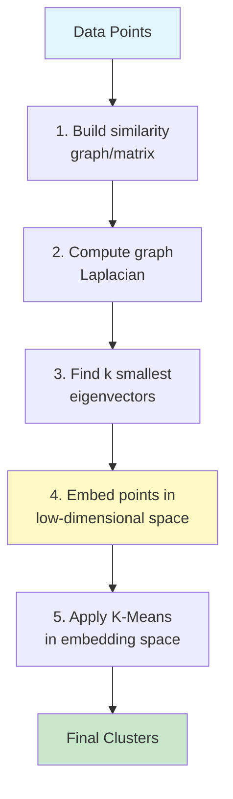

**Key Insight**: Transform clustering into a graph partitioning problem, then use spectral decomposition.

### 2.2 Mathematical Foundation

**Similarity Graph Construction**:

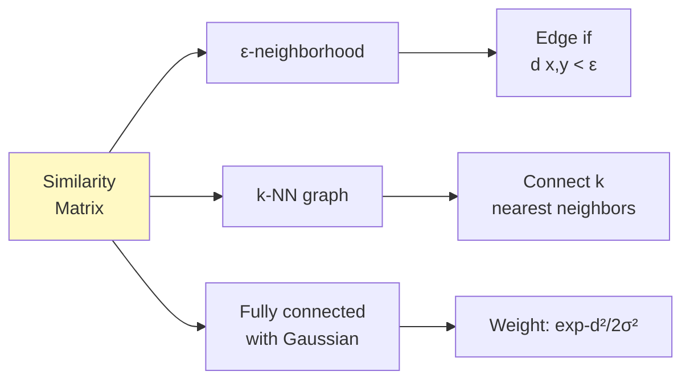

**Graph Laplacian**:
```
L = D - W

where:
- W = similarity/adjacency matrix
- D = degree matrix (diagonal)
- D_ii = Σⱼ W_ij
```

**Algorithm**:
1. Construct similarity matrix W
2. Compute Laplacian L (or normalized version)
3. Find k smallest eigenvectors of L
4. Treat eigenvectors as new feature representation
5. Apply K-Means in this embedding space

### 2.3 Advantages for Complex Structures

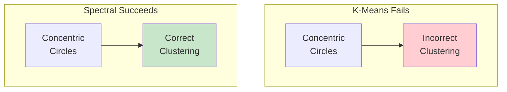

**Spectral clustering can handle**:
- Concentric circles
- Spirals
- Complex manifolds
- Non-convex shapes
- Clusters connected by bridges (with proper similarity function)

### 2.4 Implementation

```python
"""Spectral Clustering implementation with best practices.

2024 Research: Spectral clustering with proper similarity functions
can identify complex structures that defeat other methods.
"""

from typing import Optional, Tuple
import numpy as np
import matplotlib.pyplot as plt
from sklearn.cluster import SpectralClustering
from sklearn.preprocessing import StandardScaler
from sklearn.metrics import silhouette_score
from sklearn.datasets import make_circles, make_moons


def cluster_with_spectral(
    X: np.ndarray,
    n_clusters: int = 2,
    affinity: str = 'rbf',
    gamma: Optional[float] = None,
    assign_labels: str = 'kmeans'
) -> Tuple[np.ndarray, SpectralClustering]:
    """Perform spectral clustering with best practices.

    Args:
        X: Data matrix.
        n_clusters: Number of clusters.
        affinity: Similarity measure:
            - 'rbf': Gaussian (RBF) kernel [default, most common]
            - 'nearest_neighbors': k-NN graph
            - 'precomputed': Custom affinity matrix
        gamma: Kernel coefficient for 'rbf' (None = 1/n_features).
        assign_labels: Final assignment method:
            - 'kmeans': Standard, deterministic with random init
            - 'discretize': Can be faster, may be less accurate

    Returns:
        Tuple of (labels, fitted_model).
    """
    # Standardization
    scaler = StandardScaler()
    X_scaled = scaler.fit_transform(X)

    # Auto-select gamma if not provided (rule of thumb)
    if gamma is None and affinity == 'rbf':
        # Use median heuristic
        from sklearn.metrics.pairwise import euclidean_distances
        distances = euclidean_distances(X_scaled)
        gamma = 1.0 / (2 * np.median(distances) ** 2)
        print(f"Auto-selected gamma: {gamma:.4f}")

    # Fit spectral clustering
    clusterer = SpectralClustering(
        n_clusters=n_clusters,
        affinity=affinity,
        gamma=gamma,
        assign_labels=assign_labels,
        n_init=10,  # Multiple K-Means initializations
        random_state=42,
        n_jobs=-1
    )

    labels = clusterer.fit_predict(X_scaled)

    # Evaluation
    silhouette = silhouette_score(X_scaled, labels)

    print(f"\n=== Spectral Clustering Results ===")
    print(f"Number of clusters: {n_clusters}")
    print(f"Affinity: {affinity}")
    print(f"Silhouette Score: {silhouette:.3f}")

    unique, counts = np.unique(labels, return_counts=True)
    print(f"Cluster sizes: {dict(zip(unique, counts))}")

    return labels, clusterer


def demonstrate_spectral_advantage(
    dataset_type: str = 'circles'
) -> None:
    """Demonstrate spectral clustering on complex structures.

    Args:
        dataset_type: 'circles', 'moons', or 'spirals'.
    """
    # Generate data
    if dataset_type == 'circles':
        X, y_true = make_circles(
            n_samples=500,
            factor=0.5,  # Inner/outer circle ratio
            noise=0.05,
            random_state=42
        )
        title_suffix = "Concentric Circles"
    elif dataset_type == 'moons':
        X, y_true = make_moons(
            n_samples=500,
            noise=0.05,
            random_state=42
        )
        title_suffix = "Two Moons"
    else:
        # Spirals (custom generation)
        n = 250
        theta = np.sqrt(np.random.rand(n)) * 2 * np.pi
        r = 2 * theta + np.pi
        x1 = r * np.cos(theta)
        y1 = r * np.sin(theta)

        x2 = -r * np.cos(theta)
        y2 = -r * np.sin(theta)

        X = np.vstack([np.c_[x1, y1], np.c_[x2, y2]])
        y_true = np.hstack([np.zeros(n), np.ones(n)])

        # Add noise
        X += np.random.randn(*X.shape) * 0.5
        title_suffix = "Spiral"

    # Compare algorithms
    from sklearn.cluster import KMeans

    scaler = StandardScaler()
    X_scaled = scaler.fit_transform(X)

    # K-Means (will fail)
    kmeans = KMeans(n_clusters=2, random_state=42, n_init=10)
    kmeans_labels = kmeans.fit_predict(X_scaled)

    # Spectral (should succeed)
    spectral = SpectralClustering(
        n_clusters=2,
        affinity='rbf',
        gamma=1.0,
        random_state=42,
        n_init=10
    )
    spectral_labels = spectral.fit_predict(X_scaled)

    # HDBSCAN (should also succeed)
    import hdbscan
    hdbscan_clusterer = hdbscan.HDBSCAN(min_cluster_size=15)
    hdbscan_labels = hdbscan_clusterer.fit_predict(X_scaled)

    # Visualize comparison
    fig, axes = plt.subplots(1, 4, figsize=(20, 4))

    # Ground truth
    axes[0].scatter(X[:, 0], X[:, 1], c=y_true, cmap='viridis', edgecolors='k', linewidth=0.5)
    axes[0].set_title(f'Ground Truth\n{title_suffix}')
    axes[0].grid(True, alpha=0.3)

    # K-Means
    axes[1].scatter(X[:, 0], X[:, 1], c=kmeans_labels, cmap='viridis', edgecolors='k', linewidth=0.5)
    kmeans_sil = silhouette_score(X_scaled, kmeans_labels)
    axes[1].set_title(f'K-Means (Fails)\nSilhouette: {kmeans_sil:.3f}')
    axes[1].grid(True, alpha=0.3)

    # Spectral
    axes[2].scatter(X[:, 0], X[:, 1], c=spectral_labels, cmap='viridis', edgecolors='k', linewidth=0.5)
    spectral_sil = silhouette_score(X_scaled, spectral_labels)
    axes[2].set_title(f'Spectral (Succeeds)\nSilhouette: {spectral_sil:.3f}')
    axes[2].grid(True, alpha=0.3)

    # HDBSCAN
    mask = hdbscan_labels != -1
    if mask.sum() > 0:
        axes[3].scatter(
            X[mask, 0], X[mask, 1],
            c=hdbscan_labels[mask],
            cmap='viridis',
            edgecolors='k',
            linewidth=0.5
        )
    if (~mask).sum() > 0:
        axes[3].scatter(
            X[~mask, 0], X[~mask, 1],
            c='red',
            marker='x',
            s=50
        )

    if len(set(hdbscan_labels[mask])) >= 2:
        hdbscan_sil = silhouette_score(X_scaled[mask], hdbscan_labels[mask])
        axes[3].set_title(f'HDBSCAN\nSilhouette: {hdbscan_sil:.3f}')
    else:
        axes[3].set_title('HDBSCAN\n(Failed to find 2 clusters)')
    axes[3].grid(True, alpha=0.3)

    plt.tight_layout()
    plt.savefig(f'spectral_comparison_{dataset_type}.png', dpi=300, bbox_inches='tight')
    plt.close()

    print(f"\n=== Comparison on {title_suffix} ===")
    print(f"K-Means Silhouette: {kmeans_sil:.3f}")
    print(f"Spectral Silhouette: {spectral_sil:.3f}")
    if len(set(hdbscan_labels[mask])) >= 2:
        print(f"HDBSCAN Silhouette: {hdbscan_sil:.3f}")


def tune_spectral_gamma(
    X: np.ndarray,
    n_clusters: int = 2,
    gamma_range: Optional[np.ndarray] = None
) -> float:
    """Find optimal gamma parameter for RBF kernel.

    Args:
        X: Data matrix.
        n_clusters: Number of clusters.
        gamma_range: Range of gamma values to test.

    Returns:
        Optimal gamma value.
    """
    scaler = StandardScaler()
    X_scaled = scaler.fit_transform(X)

    if gamma_range is None:
        # Heuristic range based on median distance
        from sklearn.metrics.pairwise import euclidean_distances
        distances = euclidean_distances(X_scaled)
        median_dist = np.median(distances)
        gamma_range = np.logspace(-3, 3, 15) / (median_dist ** 2)

    scores = []

    for gamma in gamma_range:
        clusterer = SpectralClustering(
            n_clusters=n_clusters,
            affinity='rbf',
            gamma=gamma,
            random_state=42,
            n_init=10
        )
        labels = clusterer.fit_predict(X_scaled)
        score = silhouette_score(X_scaled, labels)
        scores.append(score)

    optimal_idx = np.argmax(scores)
    optimal_gamma = gamma_range[optimal_idx]

    # Visualization
    plt.figure(figsize=(10, 6))
    plt.semilogx(gamma_range, scores, 'bo-')
    plt.axvline(optimal_gamma, color='r', linestyle='--',
                label=f'Optimal gamma={optimal_gamma:.4f}')
    plt.xlabel('Gamma')
    plt.ylabel('Silhouette Score')
    plt.title('Spectral Clustering: Gamma Tuning')
    plt.legend()
    plt.grid(True, alpha=0.3)
    plt.savefig('spectral_gamma_tuning.png', dpi=300, bbox_inches='tight')
    plt.close()

    print(f"\nOptimal gamma: {optimal_gamma:.4f}")
    print(f"Best silhouette score: {scores[optimal_idx]:.3f}")

    return optimal_gamma


def main():
    """Main spectral clustering demonstration."""
    print("=== Spectral Clustering on Complex Structures ===\n")

    # Demonstrate on different complex datasets
    for dataset in ['circles', 'moons']:
        demonstrate_spectral_advantage(dataset)

    # Parameter tuning example
    print("\n=== Gamma Parameter Tuning ===")
    X, _ = make_circles(n_samples=500, factor=0.5, noise=0.05, random_state=42)
    optimal_gamma = tune_spectral_gamma(X, n_clusters=2)


if __name__ == "__main__":
    main()
```

### 2.5 Computational Complexity

**Challenge**: Spectral clustering requires:
- Computing eigenvectors: O(n³) for dense matrices
- Space: O(n²) for affinity matrix

**2024 Optimization Strategies**:
```python
# For large datasets, use approximate methods
from sklearn.cluster import SpectralClustering

# Use Nyström approximation for large-scale
clusterer = SpectralClustering(
    n_clusters=k,
    eigen_solver='arpack',  # Faster than 'lobpcg' for large sparse
    affinity='nearest_neighbors',  # Sparse graph
    n_neighbors=10,
    n_jobs=-1
)
```

### 2.6 When to Use Spectral Clustering

**Use Spectral Clustering when**:
- ✅ Clusters have complex, non-convex shapes
- ✅ Data lies on manifolds
- ✅ Graph structure is important
- ✅ You can afford O(n²) space and O(n³) time

**Avoid when**:
- ❌ Dataset is very large (n > 10,000) without approximations
- ❌ Clusters are well-separated and convex (use K-Means)
- ❌ You need online/streaming clustering

---

## 3. Deep Clustering with Neural Networks

### 3.1 Why Deep Clustering?

Traditional clustering operates on raw features or simple transformations (PCA). **Deep clustering** learns representations optimized for clustering.

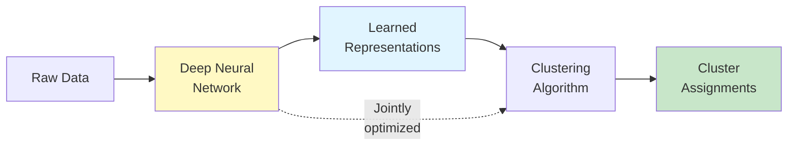

**2024-2025 Research Findings**:
- Autoencoders provide "perfect sandbox" for deep clustering
- Deep clustering outperforms traditional methods on complex data (images, text)
- Residual autoencoders and attention mechanisms improve performance

### 3.2 Autoencoder-Based Deep Clustering

**Architecture**:

```mermaid
graph TB
    subgraph "Deep Clustering Architecture"
        A[Input<br/>x] --> B[Encoder<br/>Network]
        B --> C[Latent<br/>Representation<br/>z]
        C --> D[Decoder<br/>Network]
        D --> E[Reconstruction<br/>x']

        C --> F[Clustering<br/>Layer]
        F --> G[Cluster<br/>Assignment]
    end

    H[Loss Functions] --> I[Reconstruction:<br/>||x - x'||²]
    H --> J[Clustering:<br/>KL divergence]

    style C fill:#fff9c4
    style G fill:#c8e6c9
```

**Key Concepts**:

1. **Encoder**: Learns low-dimensional representation z = f(x)
2. **Decoder**: Reconstructs input x' = g(z)
3. **Clustering Layer**: Assigns z to clusters
4. **Joint Optimization**: Minimize reconstruction + clustering loss

### 3.3 Deep Embedded Clustering (DEC)

**2024 Research**: DEC with residual autoencoders shows improved performance.

```python
"""Deep Embedded Clustering (DEC) implementation with PyTorch.

Based on 2024 research: "Deep Embedding Clustering Based on Residual Autoencoder"
Implements autoencoder-based deep clustering with joint optimization.

Requirements: pip install torch scikit-learn
"""

from typing import Tuple, Optional
import numpy as np
import torch
import torch.nn as nn
import torch.optim as optim
from torch.utils.data import DataLoader, TensorDataset
from sklearn.cluster import KMeans
from sklearn.preprocessing import StandardScaler
from sklearn.metrics import normalized_mutual_info_score
import matplotlib.pyplot as plt


class AutoencoderBase(nn.Module):
    """Base autoencoder for deep clustering.

    2024 Best Practice: Use residual connections for better gradient flow.
    """

    def __init__(
        self,
        input_dim: int,
        encoding_dims: list = [500, 500, 2000],
        latent_dim: int = 10
    ):
        """Initialize autoencoder.

        Args:
            input_dim: Input feature dimension.
            encoding_dims: Hidden layer dimensions for encoder.
            latent_dim: Latent representation dimension.
        """
        super().__init__()

        # Encoder
        encoder_layers = []
        prev_dim = input_dim

        for dim in encoding_dims:
            encoder_layers.extend([
                nn.Linear(prev_dim, dim),
                nn.ReLU(),
                nn.BatchNorm1d(dim)  # 2024: Stabilizes training
            ])
            prev_dim = dim

        encoder_layers.append(nn.Linear(prev_dim, latent_dim))

        self.encoder = nn.Sequential(*encoder_layers)

        # Decoder (symmetric)
        decoder_layers = []
        prev_dim = latent_dim

        for dim in reversed(encoding_dims):
            decoder_layers.extend([
                nn.Linear(prev_dim, dim),
                nn.ReLU(),
                nn.BatchNorm1d(dim)
            ])
            prev_dim = dim

        decoder_layers.append(nn.Linear(prev_dim, input_dim))

        self.decoder = nn.Sequential(*decoder_layers)

    def forward(self, x: torch.Tensor) -> Tuple[torch.Tensor, torch.Tensor]:
        """Forward pass.

        Args:
            x: Input tensor.

        Returns:
            Tuple of (latent_representation, reconstruction).
        """
        z = self.encoder(x)
        x_recon = self.decoder(z)
        return z, x_recon


class DECModel(nn.Module):
    """Deep Embedded Clustering model.

    Combines autoencoder with clustering layer.
    """

    def __init__(
        self,
        input_dim: int,
        n_clusters: int,
        encoding_dims: list = [500, 500, 2000],
        latent_dim: int = 10,
        alpha: float = 1.0
    ):
        """Initialize DEC model.

        Args:
            input_dim: Input feature dimension.
            n_clusters: Number of clusters.
            encoding_dims: Hidden dimensions.
            latent_dim: Latent dimension.
            alpha: Degrees of freedom for Student's t-distribution.
        """
        super().__init__()

        self.n_clusters = n_clusters
        self.alpha = alpha

        # Autoencoder
        self.autoencoder = AutoencoderBase(input_dim, encoding_dims, latent_dim)

        # Cluster centers (learnable)
        self.cluster_centers = nn.Parameter(torch.Tensor(n_clusters, latent_dim))
        nn.init.xavier_uniform_(self.cluster_centers)

    def forward(self, x: torch.Tensor) -> Tuple[torch.Tensor, torch.Tensor, torch.Tensor]:
        """Forward pass.

        Args:
            x: Input tensor.

        Returns:
            Tuple of (latent, reconstruction, soft_assignment).
        """
        z, x_recon = self.autoencoder(x)
        q = self._soft_assignment(z)
        return z, x_recon, q

    def _soft_assignment(self, z: torch.Tensor) -> torch.Tensor:
        """Compute soft cluster assignment using Student's t-distribution.

        q_ij = (1 + ||z_i - μ_j||² / α)^(-(α+1)/2) / normalization

        Args:
            z: Latent representations.

        Returns:
            Soft assignment probabilities.
        """
        # Compute squared distances to cluster centers
        distances = torch.sum((z.unsqueeze(1) - self.cluster_centers) ** 2, dim=2)

        # Student's t-distribution
        q = 1.0 / (1.0 + distances / self.alpha)
        q = q ** ((self.alpha + 1.0) / 2.0)
        q = q / torch.sum(q, dim=1, keepdim=True)  # Normalize

        return q

    @staticmethod
    def target_distribution(q: torch.Tensor) -> torch.Tensor:
        """Compute target distribution P from soft assignment Q.

        2024 Research: Self-training approach using auxiliary target distribution.

        p_ij = (q_ij² / Σ_i q_ij) / Σ_j (q_ij² / Σ_i q_ij)

        Args:
            q: Soft assignments.

        Returns:
            Target distribution P.
        """
        weight = q ** 2 / torch.sum(q, dim=0)
        p = weight / torch.sum(weight, dim=1, keepdim=True)
        return p


def pretrain_autoencoder(
    model: DECModel,
    data_loader: DataLoader,
    epochs: int = 200,
    lr: float = 0.001,
    device: str = 'cpu'
) -> None:
    """Pretrain autoencoder with reconstruction loss.

    2024 Best Practice: Pretraining provides good initialization.

    Args:
        model: DEC model.
        data_loader: Training data loader.
        epochs: Number of pretraining epochs.
        lr: Learning rate.
        device: 'cpu' or 'cuda'.
    """
    print("Pretraining autoencoder...")

    optimizer = optim.Adam(model.autoencoder.parameters(), lr=lr)
    criterion = nn.MSELoss()

    model.train()
    model.to(device)

    for epoch in range(epochs):
        total_loss = 0

        for batch_x, _ in data_loader:
            batch_x = batch_x.to(device)

            optimizer.zero_grad()

            _, x_recon = model.autoencoder(batch_x)
            loss = criterion(x_recon, batch_x)

            loss.backward()
            optimizer.step()

            total_loss += loss.item()

        if (epoch + 1) % 50 == 0:
            avg_loss = total_loss / len(data_loader)
            print(f"  Epoch {epoch+1}/{epochs}, Loss: {avg_loss:.4f}")


def initialize_cluster_centers(
    model: DECModel,
    data_loader: DataLoader,
    device: str = 'cpu'
) -> None:
    """Initialize cluster centers using K-Means on latent representations.

    2024 Best Practice: K-Means initialization in latent space.

    Args:
        model: DEC model.
        data_loader: Data loader.
        device: Device.
    """
    print("Initializing cluster centers with K-Means...")

    model.eval()
    model.to(device)

    # Extract latent representations
    latent_representations = []

    with torch.no_grad():
        for batch_x, _ in data_loader:
            batch_x = batch_x.to(device)
            z, _ = model.autoencoder(batch_x)
            latent_representations.append(z.cpu().numpy())

    latent_representations = np.vstack(latent_representations)

    # K-Means clustering
    kmeans = KMeans(n_clusters=model.n_clusters, n_init=20, random_state=42)
    kmeans.fit(latent_representations)

    # Set cluster centers
    model.cluster_centers.data = torch.tensor(
        kmeans.cluster_centers_,
        dtype=torch.float32
    ).to(device)


def train_dec(
    model: DECModel,
    data_loader: DataLoader,
    epochs: int = 100,
    lr: float = 0.001,
    update_interval: int = 10,
    device: str = 'cpu'
) -> list:
    """Train DEC model with joint optimization.

    Args:
        model: DEC model.
        data_loader: Training data loader.
        epochs: Training epochs.
        lr: Learning rate.
        update_interval: Update target distribution every N epochs.
        device: Device.

    Returns:
        Training history.
    """
    print("Training DEC...")

    optimizer = optim.Adam(model.parameters(), lr=lr)
    history = []

    model.train()
    model.to(device)

    for epoch in range(epochs):
        total_loss = 0

        # Update target distribution
        if epoch % update_interval == 0:
            model.eval()
            q_all = []

            with torch.no_grad():
                for batch_x, _ in data_loader:
                    batch_x = batch_x.to(device)
                    _, _, q = model(batch_x)
                    q_all.append(q.cpu())

            q_all = torch.cat(q_all, dim=0)
            p_all = model.target_distribution(q_all).to(device)

            model.train()

        # Training
        batch_idx = 0
        for batch_x, _ in data_loader:
            batch_x = batch_x.to(device)

            optimizer.zero_grad()

            z, x_recon, q = model(batch_x)

            # Get corresponding target distribution
            start_idx = batch_idx * batch_x.size(0)
            end_idx = start_idx + batch_x.size(0)
            p = p_all[start_idx:end_idx]

            # Loss: reconstruction + clustering
            loss_recon = nn.MSELoss()(x_recon, batch_x)
            loss_cluster = nn.KLDivLoss(reduction='batchmean')(
                torch.log(q + 1e-10),
                p
            )

            # 2024: Balance reconstruction and clustering
            loss = loss_recon + loss_cluster

            loss.backward()
            optimizer.step()

            total_loss += loss.item()
            batch_idx += 1

        avg_loss = total_loss / len(data_loader)
        history.append(avg_loss)

        if (epoch + 1) % 10 == 0:
            print(f"  Epoch {epoch+1}/{epochs}, Loss: {avg_loss:.4f}")

    return history


def predict_dec(
    model: DECModel,
    data_loader: DataLoader,
    device: str = 'cpu'
) -> np.ndarray:
    """Predict cluster assignments.

    Args:
        model: Trained DEC model.
        data_loader: Data loader.
        device: Device.

    Returns:
        Cluster labels.
    """
    model.eval()
    model.to(device)

    predictions = []

    with torch.no_grad():
        for batch_x, _ in data_loader:
            batch_x = batch_x.to(device)
            _, _, q = model(batch_x)
            preds = torch.argmax(q, dim=1)
            predictions.append(preds.cpu().numpy())

    return np.concatenate(predictions)


def deep_clustering_pipeline(
    X: np.ndarray,
    n_clusters: int,
    y_true: Optional[np.ndarray] = None,
    batch_size: int = 256,
    pretrain_epochs: int = 200,
    train_epochs: int = 100
) -> Tuple[np.ndarray, DECModel]:
    """Complete deep clustering pipeline.

    Args:
        X: Data matrix.
        n_clusters: Number of clusters.
        y_true: Ground truth labels (for evaluation).
        batch_size: Batch size.
        pretrain_epochs: Autoencoder pretraining epochs.
        train_epochs: DEC training epochs.

    Returns:
        Tuple of (predicted_labels, trained_model).
    """
    # Standardization
    scaler = StandardScaler()
    X_scaled = scaler.fit_transform(X)

    # Prepare data
    X_tensor = torch.FloatTensor(X_scaled)
    y_tensor = torch.zeros(len(X))  # Dummy labels
    dataset = TensorDataset(X_tensor, y_tensor)
    data_loader = DataLoader(dataset, batch_size=batch_size, shuffle=True)

    # Device
    device = 'cuda' if torch.cuda.is_available() else 'cpu'
    print(f"Using device: {device}")

    # Model
    input_dim = X_scaled.shape[1]
    model = DECModel(
        input_dim=input_dim,
        n_clusters=n_clusters,
        encoding_dims=[500, 500, 2000],
        latent_dim=10
    )

    # Step 1: Pretrain autoencoder
    pretrain_autoencoder(
        model,
        data_loader,
        epochs=pretrain_epochs,
        device=device
    )

    # Step 2: Initialize clusters
    initialize_cluster_centers(model, data_loader, device=device)

    # Step 3: Train DEC
    history = train_dec(
        model,
        data_loader,
        epochs=train_epochs,
        device=device
    )

    # Step 4: Predict
    predictions = predict_dec(model, data_loader, device=device)

    # Evaluation
    print(f"\n=== Deep Clustering Results ===")
    print(f"Number of clusters: {n_clusters}")

    if y_true is not None:
        nmi = normalized_mutual_info_score(y_true, predictions)
        print(f"Normalized Mutual Information: {nmi:.3f}")

    unique, counts = np.unique(predictions, return_counts=True)
    print(f"Cluster sizes: {dict(zip(unique, counts))}")

    # Plot training history
    plt.figure(figsize=(10, 6))
    plt.plot(history)
    plt.xlabel('Epoch')
    plt.ylabel('Total Loss')
    plt.title('Deep Clustering Training History')
    plt.grid(True, alpha=0.3)
    plt.savefig('dec_training_history.png', dpi=300, bbox_inches='tight')
    plt.close()

    return predictions, model


def main():
    """Main deep clustering demonstration."""
    from sklearn.datasets import load_digits

    # Load data (digits dataset)
    digits = load_digits()
    X = digits.data
    y_true = digits.target
    n_clusters = 10

    print("=== Deep Embedded Clustering (DEC) ===")
    print(f"Dataset: {X.shape[0]} samples, {X.shape[1]} features")
    print(f"Number of classes: {n_clusters}\n")

    # Run deep clustering
    predictions, model = deep_clustering_pipeline(
        X,
        n_clusters=n_clusters,
        y_true=y_true,
        pretrain_epochs=100,  # Reduce for demo
        train_epochs=50
    )

    # Compare with traditional K-Means
    from sklearn.cluster import KMeans

    kmeans = KMeans(n_clusters=n_clusters, n_init=20, random_state=42)
    kmeans_preds = kmeans.fit_predict(X)
    kmeans_nmi = normalized_mutual_info_score(y_true, kmeans_preds)

    print(f"\nK-Means NMI: {kmeans_nmi:.3f}")
    print("Deep clustering typically outperforms K-Means on complex data")


if __name__ == "__main__":
    main()
```

### 3.4 Recent Innovations (2024-2025)

**From Research**:

1. **Residual Autoencoders** (2024):
   - Add skip connections for better gradient flow
   - Improved latent representations

2. **3D Attention Convolutional Autoencoder** (2024):
   - For hyperspectral images
   - Spatial-spectral attention mechanisms

3. **Contrastive Deep Multi-View Clustering** (2024):
   - Integrate contrastive learning
   - Better handling of multi-view data

4. **Variational Autoencoder Approaches** (2024-2025):
   - GamMM-VAE: Gamma mixture latent embeddings
   - Probabilistic clustering in latent space

### 3.5 When to Use Deep Clustering

**Use Deep Clustering when**:
- ✅ Data is high-dimensional (images, text, time series)
- ✅ Raw features are not suitable for clustering
- ✅ You have sufficient data (thousands of samples)
- ✅ You have computational resources (GPU recommended)

**Advantages**:
- Learns task-specific representations
- Handles complex, non-linear patterns
- State-of-the-art performance on images/text

**Disadvantages**:
- Requires more data than traditional methods
- Computationally expensive
- Harder to interpret
- More hyperparameters to tune

---

## 4. Time Series Clustering

### 4.1 Challenges in Time Series Clustering

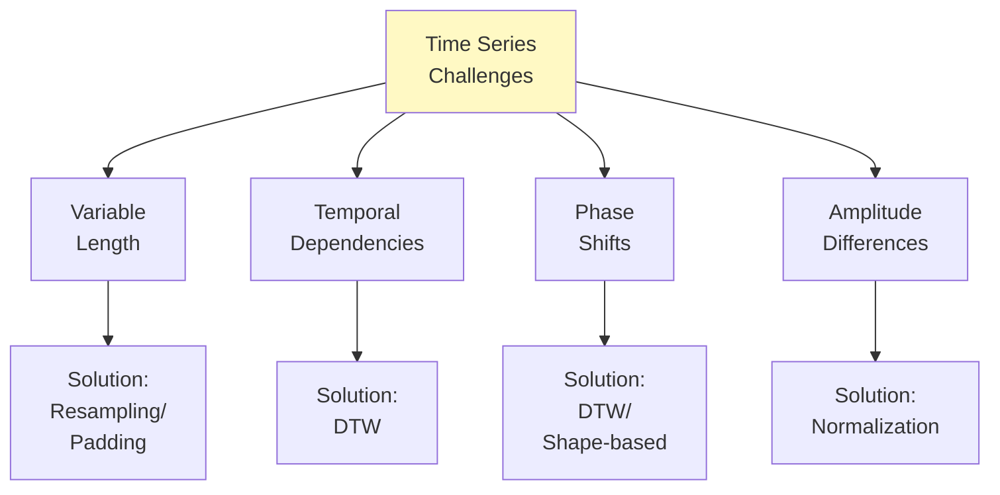

**Key Issues**:
1. **Euclidean distance fails**: Doesn't account for time shifts
2. **Variable lengths**: Need alignment or transformation
3. **Feature selection**: Raw values vs. extracted features

### 4.2 Dynamic Time Warping (DTW)

**DTW** measures similarity by allowing flexible alignment.

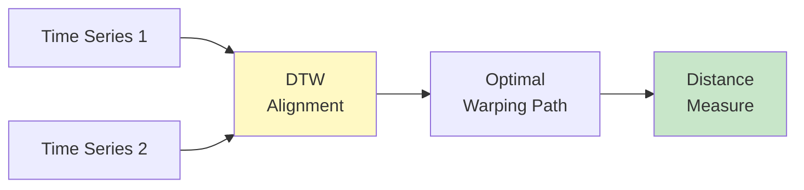

**Key Property**: DTW can match patterns despite:
- Time shifts
- Different speeds
- Small distortions

**2024 Research**: DTW is classified as "shape-based approach" and is ideal for time series where timing matters less than pattern shape.

### 4.3 Implementation

```python
"""Time Series Clustering with Dynamic Time Warping.

2024 Research: DTW is the gold standard for time series clustering
when temporal patterns matter more than absolute timing.

Requirements: pip install tslearn dtaidistance
"""

from typing import Tuple, Optional
import numpy as np
import matplotlib.pyplot as plt
from sklearn.preprocessing import StandardScaler
from sklearn.metrics import silhouette_score
from tslearn.clustering import TimeSeriesKMeans
from tslearn.datasets import CachedDatasets
from tslearn.preprocessing import TimeSeriesScalerMeanVariance
import warnings
warnings.filterwarnings('ignore')


def cluster_time_series(
    X: np.ndarray,
    n_clusters: int = 3,
    metric: str = 'dtw',
    max_iter: int = 10,
    n_init: int = 5
) -> Tuple[np.ndarray, TimeSeriesKMeans]:
    """Cluster time series using K-Means with DTW.

    2024 Best Practice: Use DTW for shape-based clustering,
    Euclidean for amplitude-based clustering.

    Args:
        X: Time series data of shape (n_samples, n_timestamps, n_features).
        n_clusters: Number of clusters.
        metric: Distance metric:
            - 'dtw': Dynamic Time Warping (shape-based)
            - 'softdtw': Differentiable DTW
            - 'euclidean': Standard Euclidean (faster but less accurate)
        max_iter: Maximum iterations.
        n_init: Number of random initializations.

    Returns:
        Tuple of (labels, fitted_model).
    """
    print(f"\n=== Time Series Clustering with {metric.upper()} ===")

    # Normalize time series (important for DTW)
    scaler = TimeSeriesScalerMeanVariance()
    X_scaled = scaler.fit_transform(X)

    # Fit K-Means with chosen metric
    model = TimeSeriesKMeans(
        n_clusters=n_clusters,
        metric=metric,
        max_iter=max_iter,
        n_init=n_init,
        random_state=42,
        n_jobs=-1
    )

    labels = model.fit_predict(X_scaled)

    # Evaluation
    print(f"Number of clusters: {n_clusters}")
    print(f"Metric: {metric}")
    print(f"Inertia: {model.inertia_:.2f}")

    unique, counts = np.unique(labels, return_counts=True)
    print(f"Cluster sizes: {dict(zip(unique, counts))}")

    return labels, model


def compare_metrics(
    X: np.ndarray,
    n_clusters: int = 3
) -> None:
    """Compare Euclidean vs DTW for time series clustering.

    Args:
        X: Time series data.
        n_clusters: Number of clusters.
    """
    metrics = ['euclidean', 'dtw']
    results = {}

    for metric in metrics:
        labels, model = cluster_time_series(
            X,
            n_clusters=n_clusters,
            metric=metric,
            max_iter=5,  # Faster for comparison
            n_init=2
        )
        results[metric] = {'labels': labels, 'model': model}

    # Visualize comparison
    fig, axes = plt.subplots(1, 2, figsize=(15, 5))

    for idx, metric in enumerate(metrics):
        ax = axes[idx]
        labels = results[metric]['labels']
        model = results[metric]['model']

        # Plot each cluster
        for cluster_id in range(n_clusters):
            cluster_ts = X[labels == cluster_id]

            # Plot individual time series
            for ts in cluster_ts:
                ax.plot(ts.ravel(), alpha=0.3, color=f'C{cluster_id}')

            # Plot centroid
            centroid = model.cluster_centers_[cluster_id].ravel()
            ax.plot(centroid, linewidth=3, color=f'C{cluster_id}',
                   label=f'Cluster {cluster_id}')

        ax.set_xlabel('Time')
        ax.set_ylabel('Value')
        ax.set_title(f'{metric.upper()} Clustering')
        ax.legend()
        ax.grid(True, alpha=0.3)

    plt.tight_layout()
    plt.savefig('time_series_clustering_comparison.png', dpi=300, bbox_inches='tight')
    plt.close()


def hierarchical_time_series_clustering(
    X: np.ndarray,
    n_clusters: int = 3
) -> np.ndarray:
    """Hierarchical clustering with DTW.

    2024 Research: Hierarchical + DTW is recommended over K-medoids
    for better performance.

    Args:
        X: Time series data.
        n_clusters: Number of clusters.

    Returns:
        Cluster labels.
    """
    from scipy.cluster.hierarchy import linkage, fcluster
    from dtaidistance import dtw

    print("\n=== Hierarchical Clustering with DTW ===")

    # Normalize
    scaler = TimeSeriesScalerMeanVariance()
    X_scaled = scaler.fit_transform(X)

    n_samples = len(X_scaled)
    X_2d = X_scaled.reshape(n_samples, -1)

    # Compute DTW distance matrix (can be slow for large datasets)
    print("Computing DTW distance matrix...")
    distance_matrix = np.zeros((n_samples, n_samples))

    for i in range(n_samples):
        for j in range(i + 1, n_samples):
            dist = dtw.distance(X_2d[i], X_2d[j])
            distance_matrix[i, j] = dist
            distance_matrix[j, i] = dist

    # Hierarchical clustering
    linkage_matrix = linkage(distance_matrix, method='average')
    labels = fcluster(linkage_matrix, n_clusters, criterion='maxclust') - 1

    unique, counts = np.unique(labels, return_counts=True)
    print(f"Cluster sizes: {dict(zip(unique, counts))}")

    return labels


def feature_based_clustering(
    X: np.ndarray,
    n_clusters: int = 3
) -> Tuple[np.ndarray, np.ndarray]:
    """Feature-based time series clustering.

    Extract statistical features and cluster in feature space.
    Fast alternative to DTW for large datasets.

    Args:
        X: Time series data.
        n_clusters: Number of clusters.

    Returns:
        Tuple of (labels, features).
    """
    print("\n=== Feature-Based Time Series Clustering ===")

    n_samples = X.shape[0]
    features = []

    for i in range(n_samples):
        ts = X[i].ravel()

        # Extract features
        feat = [
            np.mean(ts),              # Mean
            np.std(ts),               # Standard deviation
            np.min(ts),               # Min
            np.max(ts),               # Max
            np.median(ts),            # Median
            np.percentile(ts, 25),    # Q1
            np.percentile(ts, 75),    # Q3
            len(np.where(np.diff(ts) > 0)[0]),  # Number of increases
            np.sum(np.abs(np.diff(ts))),        # Total variation
        ]

        features.append(feat)

    features = np.array(features)

    # Standardize features
    scaler = StandardScaler()
    features_scaled = scaler.fit_transform(features)

    # K-Means on features
    from sklearn.cluster import KMeans
    kmeans = KMeans(n_clusters=n_clusters, n_init=10, random_state=42)
    labels = kmeans.fit_predict(features_scaled)

    print(f"Extracted {features.shape[1]} features per time series")

    unique, counts = np.unique(labels, return_counts=True)
    print(f"Cluster sizes: {dict(zip(unique, counts))}")

    return labels, features


def main():
    """Main time series clustering demonstration."""
    # Load sample time series dataset
    print("Loading Trace dataset...")
    X_train, y_train, _, _ = CachedDatasets().load_dataset("Trace")

    # Use subset for faster demo
    n_samples = 100
    X = X_train[:n_samples]
    y_true = y_train[:n_samples]

    n_clusters = len(np.unique(y_true))

    print(f"Dataset: {X.shape[0]} samples, {X.shape[1]} timestamps")
    print(f"True number of clusters: {n_clusters}")

    # Method 1: K-Means with DTW
    print("\n" + "="*60)
    print("METHOD 1: K-Means with DTW")
    print("="*60)
    labels_dtw, _ = cluster_time_series(X, n_clusters=n_clusters, metric='dtw')

    # Method 2: Compare metrics
    print("\n" + "="*60)
    print("METHOD 2: Comparing Distance Metrics")
    print("="*60)
    compare_metrics(X, n_clusters=n_clusters)

    # Method 3: Feature-based (fast alternative)
    print("\n" + "="*60)
    print("METHOD 3: Feature-Based Clustering")
    print("="*60)
    labels_feat, features = feature_based_clustering(X, n_clusters=n_clusters)

    # Evaluation (if ground truth available)
    if y_true is not None:
        from sklearn.metrics import normalized_mutual_info_score

        nmi_dtw = normalized_mutual_info_score(y_true, labels_dtw)
        nmi_feat = normalized_mutual_info_score(y_true, labels_feat)

        print("\n" + "="*60)
        print("EVALUATION (with ground truth)")
        print("="*60)
        print(f"DTW K-Means NMI: {nmi_dtw:.3f}")
        print(f"Feature-based NMI: {nmi_feat:.3f}")
        print("\nDTW typically outperforms feature-based for shape patterns")


if __name__ == "__main__":
    main()
```

### 4.4 DTW Computational Considerations

**Problem**: DTW is O(n²) for distance matrix computation

**2024 Solutions**:
```python
# 1. Use approximations
from tslearn.metrics import dtw_limited_warping_length

# Constrain warping path (Sakoe-Chiba band)
distance = dtw_limited_warping_length(ts1, ts2, max_length=10)

# 2. Use FastDTW (O(n) approximation)
from fastdtw import fastdtw

distance, path = fastdtw(ts1, ts2, dist=euclidean)

# 3. For very large datasets: use feature-based clustering
```

### 4.5 When to Use Time Series Clustering

**Use DTW-based clustering when**:
- ✅ Temporal patterns matter more than absolute values
- ✅ Time series have phase shifts
- ✅ Dataset size is manageable (n < 10,000)

**Use feature-based clustering when**:
- ✅ Dataset is large (n > 10,000)
- ✅ Statistical properties more important than shape
- ✅ Need fast computation

---

## 5. Production Deployment

### 5.1 Production Clustering Pipeline

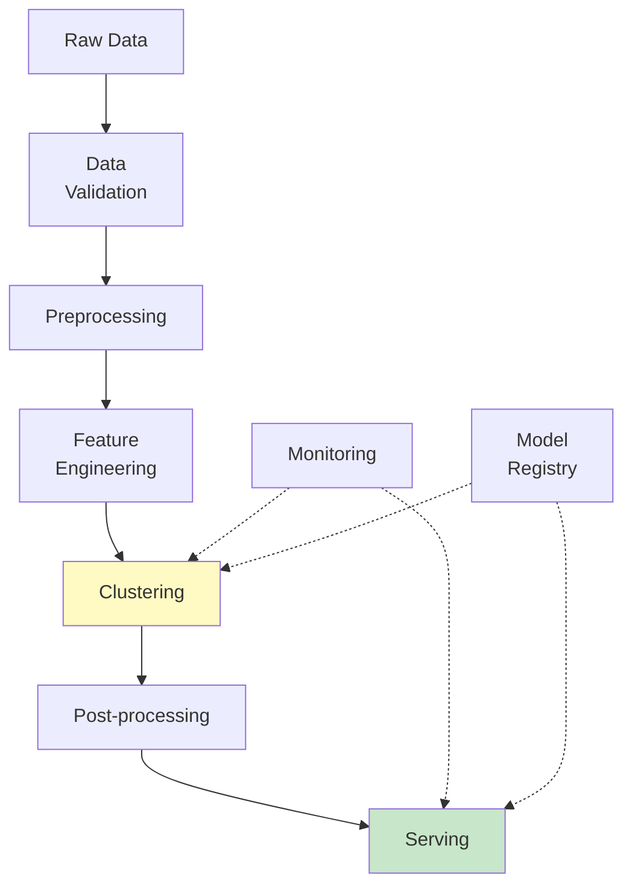

### 5.2 Production Considerations

```python
"""Production-ready clustering pipeline.

2024 Best Practices for production deployment:
- Versioning
- Monitoring
- Incremental updates
- Graceful degradation
"""

from typing import Dict, Any, Optional, Tuple
import numpy as np
import joblib
from pathlib import Path
from datetime import datetime
import json
from sklearn.preprocessing import StandardScaler
from sklearn.cluster import MiniBatchKMeans
import logging

# Setup logging
logging.basicConfig(level=logging.INFO)
logger = logging.getLogger(__name__)


class ProductionClusteringPipeline:
    """Production-ready clustering pipeline with versioning and monitoring.

    Features:
    - Model versioning
    - Data validation
    - Incremental updates
    - Monitoring and metrics
    - Graceful degradation
    """

    def __init__(
        self,
        n_clusters: int,
        model_dir: str = './models',
        algorithm: str = 'minibatch_kmeans'
    ):
        """Initialize production pipeline.

        Args:
            n_clusters: Number of clusters.
            model_dir: Directory for model artifacts.
            algorithm: Clustering algorithm to use.
        """
        self.n_clusters = n_clusters
        self.model_dir = Path(model_dir)
        self.model_dir.mkdir(exist_ok=True)
        self.algorithm = algorithm

        self.scaler: Optional[StandardScaler] = None
        self.clusterer: Optional[Any] = None
        self.metadata: Dict[str, Any] = {}
        self.version: str = datetime.now().strftime('%Y%m%d_%H%M%S')

    def validate_data(self, X: np.ndarray) -> Tuple[bool, Optional[str]]:
        """Validate input data.

        Args:
            X: Input data.

        Returns:
            Tuple of (is_valid, error_message).
        """
        # Check for NaN/Inf
        if np.any(np.isnan(X)) or np.any(np.isinf(X)):
            return False, "Data contains NaN or Inf values"

        # Check shape
        if X.ndim != 2:
            return False, f"Expected 2D array, got {X.ndim}D"

        # Check minimum samples
        if len(X) < self.n_clusters:
            return False, f"Need at least {self.n_clusters} samples"

        # Check consistency with trained model
        if self.scaler is not None:
            if X.shape[1] != self.scaler.n_features_in_:
                return False, (
                    f"Feature dimension mismatch: expected {self.scaler.n_features_in_}, "
                    f"got {X.shape[1]}"
                )

        return True, None

    def fit(
        self,
        X: np.ndarray,
        incremental: bool = False
    ) -> 'ProductionClusteringPipeline':
        """Fit clustering model.

        Args:
            X: Training data.
            incremental: Whether to update existing model incrementally.

        Returns:
            self
        """
        logger.info(f"Fitting clustering model (incremental={incremental})...")

        # Validate data
        is_valid, error_msg = self.validate_data(X)
        if not is_valid:
            raise ValueError(f"Data validation failed: {error_msg}")

        # Preprocessing
        if not incremental or self.scaler is None:
            self.scaler = StandardScaler()
            X_scaled = self.scaler.fit_transform(X)
            logger.info("Fitted new scaler")
        else:
            X_scaled = self.scaler.transform(X)

        # Clustering
        if not incremental or self.clusterer is None:
            if self.algorithm == 'minibatch_kmeans':
                self.clusterer = MiniBatchKMeans(
                    n_clusters=self.n_clusters,
                    random_state=42,
                    batch_size=1024,
                    n_init=10,
                    max_iter=300
                )
                self.clusterer.fit(X_scaled)
                logger.info("Fitted new MiniBatch K-Means model")
            else:
                raise ValueError(f"Unknown algorithm: {self.algorithm}")
        else:
            # Incremental update (MiniBatchKMeans supports this)
            if hasattr(self.clusterer, 'partial_fit'):
                self.clusterer.partial_fit(X_scaled)
                logger.info("Updated model incrementally")
            else:
                logger.warning("Model does not support incremental updates, refitting...")
                self.clusterer.fit(X_scaled)

        # Metadata
        self.metadata = {
            'version': self.version,
            'algorithm': self.algorithm,
            'n_clusters': self.n_clusters,
            'n_samples_trained': len(X),
            'n_features': X.shape[1],
            'training_date': datetime.now().isoformat(),
            'inertia': float(self.clusterer.inertia_),
            'incremental': incremental
        }

        logger.info(f"Training complete. Inertia: {self.clusterer.inertia_:.2f}")

        return self

    def predict(
        self,
        X: np.ndarray,
        return_distances: bool = False
    ) -> np.ndarray:
        """Predict cluster labels.

        Args:
            X: Input data.
            return_distances: Whether to return distances to centroids.

        Returns:
            Cluster labels (and distances if requested).
        """
        if self.clusterer is None:
            raise RuntimeError("Model not fitted yet")

        # Validate
        is_valid, error_msg = self.validate_data(X)
        if not is_valid:
            logger.error(f"Prediction data validation failed: {error_msg}")
            # Graceful degradation: return -1 for invalid samples
            return np.full(len(X), -1, dtype=np.int32)

        # Transform and predict
        try:
            X_scaled = self.scaler.transform(X)
            labels = self.clusterer.predict(X_scaled)

            if return_distances:
                distances = self.clusterer.transform(X_scaled)
                return labels, distances

            return labels

        except Exception as e:
            logger.error(f"Prediction error: {e}")
            return np.full(len(X), -1, dtype=np.int32)

    def save(self, name: Optional[str] = None) -> Path:
        """Save model artifacts.

        Args:
            name: Model name (uses version if None).

        Returns:
            Path to saved model directory.
        """
        if name is None:
            name = f"model_{self.version}"

        model_path = self.model_dir / name
        model_path.mkdir(exist_ok=True)

        # Save components
        joblib.dump(self.scaler, model_path / 'scaler.pkl')
        joblib.dump(self.clusterer, model_path / 'clusterer.pkl')

        # Save metadata
        with open(model_path / 'metadata.json', 'w') as f:
            json.dump(self.metadata, f, indent=2)

        logger.info(f"Model saved to {model_path}")
        return model_path

    def load(self, model_path: Path) -> 'ProductionClusteringPipeline':
        """Load model artifacts.

        Args:
            model_path: Path to model directory.

        Returns:
            self
        """
        model_path = Path(model_path)

        # Load components
        self.scaler = joblib.load(model_path / 'scaler.pkl')
        self.clusterer = joblib.load(model_path / 'clusterer.pkl')

        # Load metadata
        with open(model_path / 'metadata.json', 'r') as f:
            self.metadata = json.load(f)

        self.version = self.metadata['version']

        logger.info(f"Model loaded from {model_path}")
        return self

    def get_cluster_statistics(self, X: np.ndarray, labels: np.ndarray) -> Dict:
        """Compute cluster statistics for monitoring.

        Args:
            X: Data.
            labels: Cluster labels.

        Returns:
            Dictionary of statistics.
        """
        stats = {
            'cluster_sizes': {},
            'cluster_variances': {},
            'silhouette_per_cluster': {}
        }

        from sklearn.metrics import silhouette_samples

        X_scaled = self.scaler.transform(X)
        silhouette_scores = silhouette_samples(X_scaled, labels)

        for cluster_id in range(self.n_clusters):
            mask = labels == cluster_id
            cluster_size = mask.sum()

            stats['cluster_sizes'][int(cluster_id)] = int(cluster_size)

            if cluster_size > 0:
                cluster_data = X_scaled[mask]
                variance = np.mean(np.var(cluster_data, axis=0))
                stats['cluster_variances'][int(cluster_id)] = float(variance)

                sil_scores = silhouette_scores[mask]
                stats['silhouette_per_cluster'][int(cluster_id)] = float(np.mean(sil_scores))

        return stats


def main():
    """Demonstrate production pipeline."""
    from sklearn.datasets import make_blobs

    # Generate data
    X_train, _ = make_blobs(n_samples=5000, centers=4, random_state=42)
    X_new = make_blobs(n_samples=1000, centers=4, random_state=43)[0]

    # Initialize pipeline
    pipeline = ProductionClusteringPipeline(
        n_clusters=4,
        model_dir='./clustering_models'
    )

    # Fit
    logger.info("=== Initial Training ===")
    pipeline.fit(X_train)

    # Save
    model_path = pipeline.save()

    # Predict
    logger.info("\n=== Prediction ===")
    labels = pipeline.predict(X_new)
    logger.info(f"Predicted {len(labels)} samples")

    # Statistics
    stats = pipeline.get_cluster_statistics(X_new, labels)
    logger.info(f"\nCluster statistics:\n{json.dumps(stats, indent=2)}")

    # Incremental update
    logger.info("\n=== Incremental Update ===")
    X_update = make_blobs(n_samples=2000, centers=4, random_state=44)[0]
    pipeline.fit(X_update, incremental=True)

    # Save updated model
    pipeline.save(name='model_incremental')

    logger.info("\nProduction pipeline demonstration complete!")


if __name__ == "__main__":
    main()
```

### 5.3 Monitoring and Alerting

**Key Metrics to Monitor**:

1. **Data Quality**:
   - Missing values
   - Distribution shifts
   - Feature ranges

2. **Model Performance**:
   - Inertia/loss
   - Silhouette score
   - Cluster size distribution

3. **Business Metrics**:
   - Cluster stability over time
   - Assignment confidence
   - Downstream task performance

```python
"""Monitoring dashboard for production clustering."""

import numpy as np
from typing import Dict, List
from dataclasses import dataclass
from datetime import datetime


@dataclass
class ClusteringMetrics:
    """Container for clustering metrics."""
    timestamp: datetime
    inertia: float
    silhouette: float
    cluster_sizes: Dict[int, int]
    avg_confidence: float


class ClusteringMonitor:
    """Monitor clustering model performance over time."""

    def __init__(self, alert_thresholds: Optional[Dict] = None):
        """Initialize monitor.

        Args:
            alert_thresholds: Thresholds for alerting.
        """
        self.metrics_history: List[ClusteringMetrics] = []

        self.alert_thresholds = alert_thresholds or {
            'silhouette_min': 0.3,
            'cluster_size_imbalance': 10.0,  # max/min ratio
            'inertia_increase_pct': 20.0  # % increase
        }

    def record_metrics(
        self,
        inertia: float,
        silhouette: float,
        cluster_sizes: Dict[int, int],
        avg_confidence: float
    ) -> None:
        """Record metrics for monitoring.

        Args:
            inertia: Within-cluster sum of squares.
            silhouette: Silhouette score.
            cluster_sizes: Cluster size distribution.
            avg_confidence: Average assignment confidence.
        """
        metrics = ClusteringMetrics(
            timestamp=datetime.now(),
            inertia=inertia,
            silhouette=silhouette,
            cluster_sizes=cluster_sizes,
            avg_confidence=avg_confidence
        )

        self.metrics_history.append(metrics)

        # Check for alerts
        self._check_alerts(metrics)

    def _check_alerts(self, metrics: ClusteringMetrics) -> None:
        """Check if metrics trigger alerts.

        Args:
            metrics: Current metrics.
        """
        alerts = []

        # Silhouette too low
        if metrics.silhouette < self.alert_thresholds['silhouette_min']:
            alerts.append(
                f"LOW SILHOUETTE: {metrics.silhouette:.3f} < "
                f"{self.alert_thresholds['silhouette_min']}"
            )

        # Cluster size imbalance
        sizes = list(metrics.cluster_sizes.values())
        if sizes:
            ratio = max(sizes) / (min(sizes) + 1e-10)
            if ratio > self.alert_thresholds['cluster_size_imbalance']:
                alerts.append(
                    f"IMBALANCED CLUSTERS: max/min ratio = {ratio:.1f}"
                )

        # Inertia increase (model degradation)
        if len(self.metrics_history) >= 2:
            prev_inertia = self.metrics_history[-2].inertia
            pct_increase = 100 * (metrics.inertia - prev_inertia) / prev_inertia

            if pct_increase > self.alert_thresholds['inertia_increase_pct']:
                alerts.append(
                    f"INERTIA INCREASE: +{pct_increase:.1f}% "
                    "(possible model degradation)"
                )

        # Log alerts
        for alert in alerts:
            logger.warning(f"[ALERT] {alert}")


# Usage in production
monitor = ClusteringMonitor()

# After each batch of predictions
metrics = pipeline.get_cluster_statistics(X_batch, labels_batch)
monitor.record_metrics(
    inertia=pipeline.clusterer.inertia_,
    silhouette=metrics['avg_silhouette'],
    cluster_sizes=metrics['cluster_sizes'],
    avg_confidence=metrics['avg_confidence']
)
```

---

## 6. Scalability and Optimization

### 6.1 Scaling Strategies

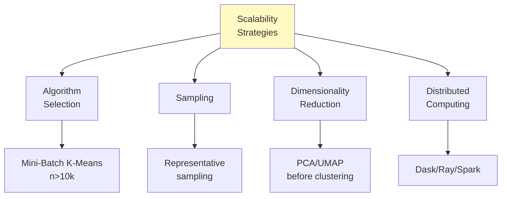

### 6.2 Algorithm Runtime Complexity

| Algorithm | Time Complexity | Space Complexity | Scalability |
|-----------|----------------|------------------|-------------|
| **K-Means** | O(nkdi) | O(n+k) | Excellent |
| **Mini-Batch K-Means** | O(bkdi) | O(n+k) | Excellent |
| **DBSCAN** | O(n log n)* | O(n) | Good |
| **HDBSCAN** | O(n log n) | O(n) | Good |
| **Hierarchical** | O(n² log n) | O(n²) | Poor |
| **GMM** | O(nkd²i) | O(nk+kd²) | Moderate |
| **Spectral** | O(n³) | O(n²) | Poor |
| **Deep Clustering** | O(nepochs) | O(n+model) | Moderate |

*with spatial indexing

### 6.3 Optimization Techniques

```python
"""Optimization techniques for large-scale clustering.

2024 Best Practices for scaling clustering to millions of samples.
"""

from typing import Optional
import numpy as np
from sklearn.cluster import MiniBatchKMeans
from sklearn.decomposition import IncrementalPCA
from sklearn.random_projection import GaussianRandomProjection
import joblib
from tqdm import tqdm


def incremental_clustering(
    data_iterator,
    n_clusters: int,
    batch_size: int = 1024,
    n_features: Optional[int] = None
) -> MiniBatchKMeans:
    """Incremental clustering for data that doesn't fit in memory.

    2024 Best Practice: Use Mini-Batch K-Means with partial_fit
    for out-of-core clustering.

    Args:
        data_iterator: Iterator yielding batches of data.
        n_clusters: Number of clusters.
        batch_size: Batch size.
        n_features: Number of features (for initialization).

    Returns:
        Fitted clusterer.
    """
    logger.info("Incremental clustering on large dataset...")

    clusterer = MiniBatchKMeans(
        n_clusters=n_clusters,
        batch_size=batch_size,
        random_state=42
    )

    n_batches = 0

    for batch in tqdm(data_iterator, desc="Processing batches"):
        clusterer.partial_fit(batch)
        n_batches += 1

    logger.info(f"Processed {n_batches} batches")
    logger.info(f"Final inertia: {clusterer.inertia_:.2f}")

    return clusterer


def dimensionality_reduction_then_cluster(
    X: np.ndarray,
    n_clusters: int,
    target_dim: int = 50,
    method: str = 'random_projection'
) -> np.ndarray:
    """Reduce dimensionality before clustering for speed.

    2024 Research: Random projection is very fast and works well
    for clustering (preserves distances approximately).

    Args:
        X: High-dimensional data.
        n_clusters: Number of clusters.
        target_dim: Target dimensionality.
        method: 'pca', 'random_projection', or 'umap'.

    Returns:
        Cluster labels.
    """
    logger.info(f"Dimensionality reduction: {X.shape[1]} -> {target_dim}")

    if method == 'random_projection':
        # Fast, approximate distance preservation
        transformer = GaussianRandomProjection(
            n_components=target_dim,
            random_state=42
        )
        X_reduced = transformer.fit_transform(X)
        logger.info("Used Gaussian Random Projection (fast)")

    elif method == 'pca':
        # Slower but preserves variance
        from sklearn.decomposition import PCA
        transformer = PCA(n_components=target_dim, random_state=42)
        X_reduced = transformer.fit_transform(X)
        logger.info(f"Used PCA (explained variance: "
                   f"{transformer.explained_variance_ratio_.sum():.2%})")

    elif method == 'umap':
        # Slowest but best for visualization
        import umap
        transformer = umap.UMAP(
            n_components=target_dim,
            random_state=42,
            n_jobs=-1
        )
        X_reduced = transformer.fit_transform(X)
        logger.info("Used UMAP (slow but high quality)")

    else:
        raise ValueError(f"Unknown method: {method}")

    # Cluster in reduced space
    from sklearn.cluster import KMeans
    clusterer = KMeans(n_clusters=n_clusters, n_init=10, random_state=42)
    labels = clusterer.fit_predict(X_reduced)

    return labels


def sampling_then_cluster(
    X: np.ndarray,
    n_clusters: int,
    sample_size: int = 10000,
    assign_method: str = 'nearest'
) -> np.ndarray:
    """Sample, cluster, then assign remaining points.

    2024 Best Practice: For very large datasets, cluster a representative
    sample then assign remaining points to nearest centroid.

    Args:
        X: Full dataset.
        n_clusters: Number of clusters.
        sample_size: Size of sample to cluster.
        assign_method: 'nearest' or 'predict'.

    Returns:
        Cluster labels for full dataset.
    """
    logger.info(f"Sampling {sample_size} points from {len(X)}...")

    # Stratified sampling (if possible) or random
    from sklearn.utils import resample
    X_sample = resample(X, n_samples=sample_size, random_state=42)

    # Cluster sample
    logger.info("Clustering sample...")
    from sklearn.cluster import KMeans
    clusterer = KMeans(n_clusters=n_clusters, n_init=10, random_state=42)
    clusterer.fit(X_sample)

    # Assign all points
    logger.info("Assigning all points to clusters...")
    labels = clusterer.predict(X)

    return labels


def parallel_clustering(
    X: np.ndarray,
    n_clusters: int,
    n_jobs: int = -1
) -> np.ndarray:
    """Parallel K-Means using joblib.

    Args:
        X: Data matrix.
        n_clusters: Number of clusters.
        n_jobs: Number of parallel jobs.

    Returns:
        Cluster labels.
    """
    from sklearn.cluster import KMeans

    clusterer = KMeans(
        n_clusters=n_clusters,
        n_init=10,
        random_state=42,
        n_jobs=n_jobs,  # Parallelize across n_init
        algorithm='elkan'  # Faster variant
    )

    labels = clusterer.fit_predict(X)
    return labels


def main():
    """Demonstrate optimization techniques."""
    from sklearn.datasets import make_blobs

    # Large dataset
    logger.info("=== Scalability Techniques Demo ===\n")

    n_samples = 100000
    n_features = 100

    logger.info(f"Generating dataset: {n_samples} samples, {n_features} features")
    X, _ = make_blobs(
        n_samples=n_samples,
        n_features=n_features,
        centers=10,
        random_state=42
    )

    # Technique 1: Dimensionality reduction
    logger.info("\n1. Dimensionality Reduction + Clustering")
    labels_dr = dimensionality_reduction_then_cluster(
        X,
        n_clusters=10,
        target_dim=20,
        method='random_projection'
    )

    # Technique 2: Sampling
    logger.info("\n2. Sampling + Clustering")
    labels_sample = sampling_then_cluster(
        X,
        n_clusters=10,
        sample_size=10000
    )

    # Technique 3: Mini-Batch
    logger.info("\n3. Mini-Batch K-Means")
    from sklearn.cluster import MiniBatchKMeans
    clusterer_mb = MiniBatchKMeans(
        n_clusters=10,
        batch_size=1024,
        random_state=42
    )
    labels_mb = clusterer_mb.fit_predict(X)

    logger.info("\nAll techniques completed successfully!")


if __name__ == "__main__":
    main()
```

---

## 7. Distributed Clustering

### 7.1 Why Distributed Clustering?

**When you need distributed computing**:
- Dataset size: n > 1 million samples
- Feature dimension: d > 1000
- Multiple clustering runs (hyperparameter tuning)
- Real-time processing requirements

### 7.2 Frameworks Comparison (2024)

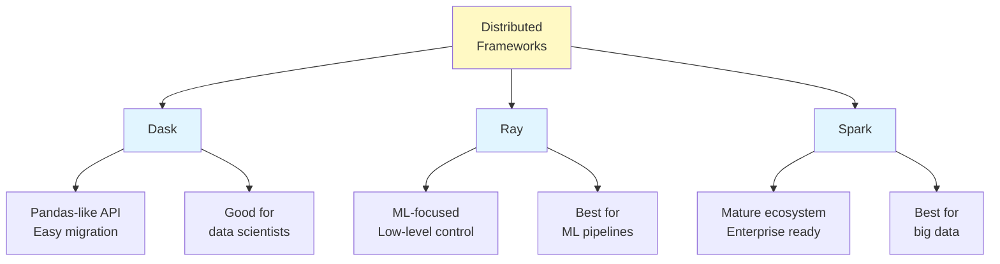

**2024 Research Findings**:
- **Ray**: Best for distributed ML pipelines
- **Dask**: Best for data scientists (familiar Pandas API)
- **Spark**: Best for enterprise big data

### 7.3 Dask Implementation

```python
"""Distributed clustering with Dask.

2024 Research: Dask is versatile for large-scale datasets with
seamless scalability across clusters.

Requirements: pip install dask[complete] dask-ml
"""

from typing import Tuple
import numpy as np
import dask.array as da
from dask_ml.cluster import KMeans as DaskKMeans
from dask.distributed import Client, LocalCluster
import logging

logging.basicConfig(level=logging.INFO)
logger = logging.getLogger(__name__)


def setup_dask_cluster(n_workers: int = 4) -> Client:
    """Setup local Dask cluster.

    Args:
        n_workers: Number of workers.

    Returns:
        Dask client.
    """
    cluster = LocalCluster(n_workers=n_workers, threads_per_worker=2)
    client = Client(cluster)

    logger.info(f"Dask dashboard: {client.dashboard_link}")
    return client


def distributed_kmeans_dask(
    X: da.Array,
    n_clusters: int = 10,
    client: Optional[Client] = None
) -> Tuple[np.ndarray, DaskKMeans]:
    """Distributed K-Means with Dask.

    Args:
        X: Dask array.
        n_clusters: Number of clusters.
        client: Dask client (creates local if None).

    Returns:
        Tuple of (labels, fitted_model).
    """
    # Setup cluster if needed
    if client is None:
        client = setup_dask_cluster()

    logger.info(f"Clustering {X.shape[0]} samples across {len(client.ncores())} workers")

    # Dask K-Means
    clusterer = DaskKMeans(
        n_clusters=n_clusters,
        init='k-means++',
        max_iter=300,
        random_state=42
    )

    # Fit (distributed computation)
    clusterer.fit(X)

    # Predict (also distributed)
    labels = clusterer.predict(X).compute()  # .compute() brings to memory

    logger.info(f"Inertia: {clusterer.inertia_:.2f}")

    return labels, clusterer


def main():
    """Demonstrate distributed clustering with Dask."""
    logger.info("=== Distributed Clustering with Dask ===\n")

    # Create large dataset as Dask array
    n_samples = 1000000
    n_features = 50

    logger.info(f"Creating dataset: {n_samples:,} samples, {n_features} features")

    # Generate data in chunks (simulate large dataset)
    from sklearn.datasets import make_blobs

    X_numpy, _ = make_blobs(
        n_samples=n_samples,
        n_features=n_features,
        centers=10,
        random_state=42
    )

    # Convert to Dask array with chunks
    chunk_size = 10000
    X_dask = da.from_array(X_numpy, chunks=(chunk_size, n_features))

    logger.info(f"Dask array chunks: {X_dask.chunks}")

    # Setup Dask cluster
    client = setup_dask_cluster(n_workers=4)

    # Distributed clustering
    labels, clusterer = distributed_kmeans_dask(X_dask, n_clusters=10, client=client)

    logger.info(f"\nCluster sizes: {np.bincount(labels)}")

    # Cleanup
    client.close()

    logger.info("\nDistributed clustering complete!")


if __name__ == "__main__":
    main()
```

### 7.4 Ray Implementation

```python
"""Distributed clustering with Ray.

2024 Research: Ray provides general low-level framework for
parallelizing Python code, ideal for custom ML algorithms.

Requirements: pip install ray[default]
"""

import ray
import numpy as np
from typing import Tuple
import logging

logging.basicConfig(level=logging.INFO)
logger = logging.getLogger(__name__)


@ray.remote
def compute_distances_batch(
    data_batch: np.ndarray,
    centroids: np.ndarray
) -> np.ndarray:
    """Compute distances for a batch (runs on Ray worker).

    Args:
        data_batch: Batch of data points.
        centroids: Current centroids.

    Returns:
        Distances to centroids.
    """
    # Vectorized distance computation
    distances = np.linalg.norm(
        data_batch[:, np.newaxis, :] - centroids[np.newaxis, :, :],
        axis=2
    )
    return distances


def distributed_kmeans_ray(
    X: np.ndarray,
    n_clusters: int = 10,
    max_iter: int = 100,
    n_workers: int = 4
) -> Tuple[np.ndarray, np.ndarray]:
    """Distributed K-Means with Ray.

    Args:
        X: Data matrix.
        n_clusters: Number of clusters.
        max_iter: Maximum iterations.
        n_workers: Number of Ray workers.

    Returns:
        Tuple of (labels, centroids).
    """
    # Initialize Ray
    if not ray.is_initialized():
        ray.init(num_cpus=n_workers)

    logger.info(f"Ray cluster: {n_workers} workers")

    # Initialize centroids (K-Means++ can be parallelized too)
    from sklearn.cluster import kmeans_plusplus
    centroids, _ = kmeans_plusplus(X, n_clusters, random_state=42)

    # Split data into chunks
    chunk_size = len(X) // n_workers
    data_chunks = [X[i:i+chunk_size] for i in range(0, len(X), chunk_size)]

    # Store chunks in Ray object store
    data_refs = [ray.put(chunk) for chunk in data_chunks]

    for iteration in range(max_iter):
        # Parallel distance computation
        distance_refs = [
            compute_distances_batch.remote(chunk_ref, centroids)
            for chunk_ref in data_refs
        ]

        # Gather results
        distances_list = ray.get(distance_refs)
        distances = np.vstack(distances_list)

        # Assign to clusters
        labels = np.argmin(distances, axis=1)

        # Update centroids
        new_centroids = np.zeros((n_clusters, X.shape[1]))
        for k in range(n_clusters):
            cluster_points = X[labels == k]
            if len(cluster_points) > 0:
                new_centroids[k] = cluster_points.mean(axis=0)
            else:
                # Handle empty cluster
                new_centroids[k] = X[np.random.randint(len(X))]

        # Check convergence
        if np.allclose(centroids, new_centroids):
            logger.info(f"Converged at iteration {iteration + 1}")
            break

        centroids = new_centroids

    # Cleanup
    ray.shutdown()

    return labels, centroids


def main():
    """Demonstrate distributed clustering with Ray."""
    from sklearn.datasets import make_blobs

    logger.info("=== Distributed Clustering with Ray ===\n")

    # Generate data
    n_samples = 100000
    X, _ = make_blobs(n_samples=n_samples, centers=10, random_state=42)

    # Distributed clustering
    labels, centroids = distributed_kmeans_ray(
        X,
        n_clusters=10,
        max_iter=100,
        n_workers=4
    )

    logger.info(f"\nCluster sizes: {np.bincount(labels)}")
    logger.info("Distributed clustering with Ray complete!")


if __name__ == "__main__":
    main()
```

---

## 8. Advanced Topics

### 8.1 Constraint-Based Clustering

**Must-link** and **cannot-link** constraints:

```python
"""Semi-supervised clustering with constraints."""

from sklearn.cluster import KMeans
import numpy as np


def constrained_kmeans(
    X: np.ndarray,
    n_clusters: int,
    must_link: list = [],
    cannot_link: list = []
) -> np.ndarray:
    """K-Means with pairwise constraints.

    Args:
        X: Data matrix.
        n_clusters: Number of clusters.
        must_link: List of (i, j) pairs that must be in same cluster.
        cannot_link: List of (i, j) pairs that cannot be in same cluster.

    Returns:
        Cluster labels.
    """
    # Simplified implementation (penalty-based approach)
    # Full implementation would use COP-K-Means or similar
    pass  # See specialized libraries like 'active-semi-supervised-clustering'
```

### 8.2 Fuzzy C-Means

Soft clustering alternative to K-Means:

```python
"""Fuzzy C-Means clustering."""

import numpy as np


def fuzzy_cmeans(
    X: np.ndarray,
    n_clusters: int,
    m: float = 2.0,  # Fuzziness parameter
    max_iter: int = 100
) -> Tuple[np.ndarray, np.ndarray]:
    """Fuzzy C-Means clustering.

    Args:
        X: Data matrix.
        n_clusters: Number of clusters.
        m: Fuzziness parameter (m > 1).
        max_iter: Maximum iterations.

    Returns:
        Tuple of (membership_matrix, centroids).
    """
    # Initialize membership matrix randomly
    n_samples = len(X)
    U = np.random.rand(n_samples, n_clusters)
    U = U / U.sum(axis=1, keepdims=True)  # Normalize

    for _ in range(max_iter):
        # Update centroids
        Um = U ** m
        centroids = (Um.T @ X) / Um.sum(axis=0, keepdims=True).T

        # Update membership
        distances = np.linalg.norm(
            X[:, np.newaxis, :] - centroids[np.newaxis, :, :],
            axis=2
        )

        distances = np.fmax(distances, 1e-10)  # Avoid division by zero

        U_new = 1.0 / (distances ** (2 / (m - 1)))
        U_new = U_new / U_new.sum(axis=1, keepdims=True)

        # Check convergence
        if np.allclose(U, U_new):
            break

        U = U_new

    return U, centroids
```

### 8.3 Ensemble Clustering

Combine multiple clusterings for robustness:

```python
"""Ensemble clustering for robust results."""

from sklearn.cluster import KMeans, AgglomerativeClustering
from sklearn.metrics import pairwise_distances
import numpy as np


def ensemble_clustering(
    X: np.ndarray,
    n_clusters: int,
    n_runs: int = 10
) -> np.ndarray:
    """Ensemble clustering using consensus.

    Args:
        X: Data matrix.
        n_clusters: Number of clusters.
        n_runs: Number of clustering runs.

    Returns:
        Consensus cluster labels.
    """
    n_samples = len(X)
    coassoc_matrix = np.zeros((n_samples, n_samples))

    # Run multiple clusterings
    for _ in range(n_runs):
        # Random initialization and algorithm
        if np.random.rand() < 0.5:
            clusterer = KMeans(n_clusters=n_clusters)
        else:
            clusterer = AgglomerativeClustering(n_clusters=n_clusters)

        labels = clusterer.fit_predict(X)

        # Update co-association matrix
        for i in range(n_samples):
            for j in range(i + 1, n_samples):
                if labels[i] == labels[j]:
                    coassoc_matrix[i, j] += 1
                    coassoc_matrix[j, i] += 1

    # Normalize
    coassoc_matrix /= n_runs

    # Final clustering on co-association matrix
    # (treat as similarity, use 1 - coassoc as distance)
    distance_matrix = 1 - coassoc_matrix

    final_clusterer = AgglomerativeClustering(
        n_clusters=n_clusters,
        affinity='precomputed',
        linkage='average'
    )
    consensus_labels = final_clusterer.fit_predict(distance_matrix)

    return consensus_labels
```

---

## 9. Interview Questions

### 9.1 Fundamental Concepts

**Q1: Explain the difference between K-Means and K-Medoids.**

**Answer**:
- **K-Means**: Uses mean of cluster points as centroid. Sensitive to outliers. Fast (O(nkd) per iteration).
- **K-Medoids**: Uses actual data point (medoid) as cluster center. Robust to outliers. Slower (O(n² k) per iteration).

Use K-Medoids when:
- Data has outliers
- Distance metric is not Euclidean (e.g., Manhattan, custom metrics)
- Centroids must be actual data points (e.g., selecting representative products)

**Q2: Why does K-Means fail on non-convex clusters?**

**Answer**: K-Means minimizes within-cluster sum of squares, which implicitly assumes spherical clusters with equal variance. For non-convex shapes:
- Euclidean distance doesn't capture shape structure
- Linear decision boundaries between clusters
- Solution: Use DBSCAN, spectral clustering, or kernel K-Means

**Q3: How do you determine the optimal number of clusters?**

**Answer** (2024 best practices):
1. **Elbow Method**: Plot WCSS vs k, find "elbow"
2. **Silhouette Analysis**: Find k maximizing silhouette score
3. **Gap Statistic**: Compare clustering quality to random data
4. **Domain Knowledge**: Often k is known from business context
5. **Multiple Metrics**: Use combination (silhouette + domain knowledge)

**2024 Research Finding**: Use BIC for GMM, which penalizes complexity more than AIC.

### 9.2 Algorithm Selection

**Q4: When would you use HDBSCAN over DBSCAN?**

**Answer** (based on 2024 research):

Use **HDBSCAN** when:
- Clusters have varying densities (most real-world data)
- You want automatic parameter selection (no ε tuning)
- You need cluster stability scores
- You want to predict on new data

Use **DBSCAN** only when:
- Clusters have uniform density
- Computational resources are extremely limited
- ε can be determined reliably from domain knowledge

**2024 Research**: HDBSCAN "significantly outperforms" DBSCAN and is recommended as default density-based method.

**Q5: You have 1 million samples with 500 features. Which clustering algorithm do you choose?**

**Answer**:

**Step 1: Dimensionality Reduction**
```python
# Use random projection (fast) or PCA
from sklearn.random_projection import GaussianRandomProjection
reducer = GaussianRandomProjection(n_components=50)
X_reduced = reducer.fit_transform(X)
```

**Step 2: Clustering**
```python
# Use Mini-Batch K-Means for scalability
from sklearn.cluster import MiniBatchKMeans
clusterer = MiniBatchKMeans(
    n_clusters=k,
    batch_size=1024,
    n_init=10
)
labels = clusterer.fit_predict(X_reduced)
```

**Why**:
- Mini-Batch K-Means: O(nkd) → O(bkd) where b=1024 << n
- Random projection: preserves distances, very fast
- Alternative: Use distributed clustering (Dask/Ray) if cluster available

### 9.3 Production Scenarios

**Q6: Your clustering model in production shows increasing inertia over time. What could be wrong?**

**Answer**:

**Possible causes**:
1. **Data drift**: Input distribution has changed
2. **Model staleness**: Clusters no longer represent current patterns
3. **Feature drift**: Feature distributions have shifted
4. **Scale issues**: Features not being scaled consistently

**Solutions**:
```python
# 1. Monitor data distribution
from scipy.stats import ks_2stest
for feature in features:
    stat, pval = ks_2stest(train_data[feature], prod_data[feature])
    if pval < 0.05:
        logger.warning(f"Feature {feature} has drifted")

# 2. Incremental retraining
if inertia_increase > threshold:
    model.partial_fit(recent_data)  # MiniBatchKMeans supports this

# 3. Full retraining periodically
if time_since_retrain > MAX_AGE:
    model.fit(combined_data)
```

**Q7: How do you handle new data points that don't fit well into existing clusters?**

**Answer**:

**Strategy 1: Outlier Detection**
```python
# Use distance to nearest centroid
distances = model.transform(X_new)
min_distances = distances.min(axis=1)

# Flag outliers
threshold = np.percentile(min_distances, 95)
outliers = min_distances > threshold

# Handle outliers
labels[outliers] = -1  # Mark as noise
```

**Strategy 2: Adaptive Clustering**
```python
# Periodically check if new cluster needed
if outlier_ratio > 0.1:  # 10% outliers
    # Refit with k+1 clusters
    model_new = KMeans(n_clusters=k+1)
    model_new.fit(np.vstack([X_train, X_new]))
```

**Strategy 3: Soft Assignment with Confidence**
```python
# Use GMM for probabilistic assignment
gmm = GaussianMixture(n_components=k)
proba = gmm.predict_proba(X_new)

# Flag low-confidence predictions
confidence = proba.max(axis=1)
uncertain = confidence < 0.5
```

### 9.4 Advanced Topics

**Q8: Explain the relationship between PCA and K-Means.**

**Answer**:

**Theoretical Connection**:
- K-Means objective: minimize within-cluster variance
- PCA objective: maximize retained variance
- **Result**: K-Means clustering with k=2 produces same solution as projecting on first PC and splitting at origin (under certain conditions)

**Practical Use**:
```python
# PCA before K-Means improves:
# 1. Speed (lower dimensionality)
# 2. Noise reduction
# 3. Visualization
from sklearn.decomposition import PCA
from sklearn.cluster import KMeans

pca = PCA(n_components=0.95)  # Retain 95% variance
X_pca = pca.fit_transform(X)

kmeans = KMeans(n_clusters=k)
labels = kmeans.fit_predict(X_pca)
```

**Caution**: PCA is unsupervised and may discard dimensions useful for clustering.

**Q9: How does spectral clustering work on a graph?**

**Answer**:

**Graph Construction**:
1. Build similarity matrix W (adjacency)
2. Compute degree matrix D (diagonal)
3. Compute graph Laplacian: L = D - W

**Spectral Decomposition**:
4. Find k smallest eigenvectors of L
5. Each row is embedding of a node

**Clustering**:
6. Apply K-Means to embedded representations

**Why it works**:
- Eigenvectors of Laplacian encode graph structure
- Connected components correspond to blocks in eigenvector space
- Relaxes discrete graph cut problem to continuous optimization

**2024 Application**: Spectral clustering excels at finding communities in social networks, image segmentation, and manifold learning.

### 9.5 Time Series

**Q10: When should you use DTW vs Euclidean distance for time series clustering?**

**Answer** (2024 research findings):

**Use DTW when**:
- ✅ Pattern shape matters more than absolute values
- ✅ Time series have phase shifts (e.g., similar patterns at different times)
- ✅ Different sampling rates or speeds
- ✅ Small dataset (n < 10,000) - DTW is O(n² m²)

**Use Euclidean when**:
- ✅ Timing is important (absolute time alignment)
- ✅ Very large dataset (n > 100,000) - need speed
- ✅ Time series are already aligned

**Example**:
```python
# Stock price patterns (use DTW)
# - Same pattern at different times matters
ts1 = [1, 2, 3, 4, 5]
ts2 = [0, 1, 2, 3, 4, 5]  # Shifted but same pattern

# Temperature sensors (use Euclidean)
# - Exact timing matters for fault detection
```

**2024 Research**: "DTW matches distinctive patterns of the time series" and is "ideal for applications in marketing, finance, and speech recognition."

---

## 10. Best Practices Checklist

### 10.1 Data Preparation

- [ ] Handle missing values (impute or remove)
- [ ] Remove or handle outliers (or use robust algorithms like DBSCAN)
- [ ] Standardize/normalize features (critical for distance-based methods)
- [ ] Reduce dimensionality if d > 50 (PCA, random projection)
- [ ] Check for multicollinearity (can affect some algorithms)

### 10.2 Algorithm Selection

- [ ] Start with K-Means for baseline (fast, interpretable)
- [ ] Use HDBSCAN for arbitrary shapes and varying densities
- [ ] Use GMM for soft clustering and overlapping clusters
- [ ] Use spectral for complex graph-like structures
- [ ] Use Mini-Batch K-Means for n > 10,000
- [ ] Consider deep clustering for images/text

### 10.3 Parameter Tuning

- [ ] Try multiple values of k (for K-Means, GMM)
- [ ] Use elbow method + silhouette analysis together
- [ ] For DBSCAN: use k-distance graph for ε
- [ ] For HDBSCAN: tune min_cluster_size (start with 5-15)
- [ ] For GMM: use BIC for model selection (2024 best practice)
- [ ] Multiple random initializations (n_init=10)

### 10.4 Evaluation

- [ ] Compute silhouette score (higher better, >0.5 is good)
- [ ] Compute Davies-Bouldin index (lower better, <1.0 is good)
- [ ] Compute Calinski-Harabasz index (higher better)
- [ ] Check cluster size distribution (avoid very imbalanced)
- [ ] Visual inspection (t-SNE/UMAP for high-dim)
- [ ] Domain expert validation

### 10.5 Production

- [ ] Version models and track metadata
- [ ] Implement data validation
- [ ] Monitor key metrics (inertia, silhouette, cluster sizes)
- [ ] Set up alerting for model degradation
- [ ] Support incremental updates (Mini-Batch K-Means)
- [ ] Plan for retraining schedule
- [ ] Handle outliers/new patterns gracefully
- [ ] Document cluster interpretations

### 10.6 Scalability

- [ ] Profile computational bottlenecks
- [ ] Use dimensionality reduction for high-d data
- [ ] Use sampling for exploratory analysis
- [ ] Use Mini-Batch or distributed algorithms for large n
- [ ] Consider approximate methods (FastDTW, Nyström)
- [ ] Cache/memoize expensive computations
- [ ] Use appropriate data structures (KD-trees for nearest neighbors)

---

## Summary - Part 2

This completes Part 2 of the Clustering Complete Guide. We covered:

### Advanced Algorithms

1. **HDBSCAN**: State-of-the-art density-based clustering
   - Handles varying densities
   - No ε parameter
   - Cluster stability scores

2. **Spectral Clustering**: Graph-based clustering
   - Complex non-convex shapes
   - Manifold learning
   - O(n³) complexity

3. **Deep Clustering**: Neural network-based
   - Autoencoders + clustering
   - 2024-2025 SOTA research
   - Best for images/text

4. **Time Series Clustering**: DTW-based
   - Shape-based similarity
   - Handles temporal shifts
   - Feature-based alternatives

### Production & Scalability

- Production pipeline with monitoring
- Optimization techniques (sampling, dimensionality reduction)
- Distributed clustering (Dask, Ray)
- Incremental learning
- Model versioning and alerting

### Key 2024-2025 Research Findings

- **HDBSCAN**: "Significantly outperforms DBSCAN" on varying density data
- **Deep Clustering**: Residual autoencoders and attention mechanisms improve performance
- **GMM**: Use BIC for model selection (more conservative than AIC)
- **DTW**: Gold standard for time series shape-based clustering
- **Distributed**: Ray best for ML, Dask for data science, Spark for enterprise

---

**Complete Guide Summary**:
- **Part 1**: Fundamentals, K-Means, Hierarchical, DBSCAN, GMM, Evaluation
- **Part 2**: HDBSCAN, Spectral, Deep Clustering, Time Series, Production, Scalability

---

*Part of ML/AI Documentation Series - Clustering Algorithms*
