# Linear Regression Complete Guide: Zero to Architect

## Table of Contents
1. [Introduction](#introduction)
2. [Mathematical Foundations](#mathematical-foundations)
3. [Ordinary Least Squares (OLS)](#ordinary-least-squares-ols)
4. [Assumptions and Diagnostics](#assumptions-and-diagnostics)
5. [Multiple Linear Regression](#multiple-linear-regression)
6. [Feature Engineering](#feature-engineering)
7. [Regularization](#regularization)
8. [Model Evaluation](#model-evaluation)
9. [Practical Implementation](#practical-implementation)
10. [Interview Questions](#interview-questions)

---

## Introduction

### What is Linear Regression?

**Linear Regression** models the relationship between:
- **Dependent variable (Y)**: Target, outcome, response
- **Independent variables (X)**: Features, predictors, covariates

**Goal**: Find the best-fitting linear relationship

```
Y = β₀ + β₁X₁ + β₂X₂ + ... + β_pX_p + ε
```

### Use Cases

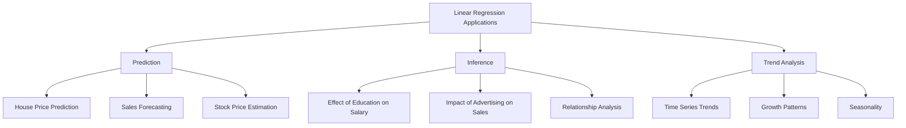

### Learning Roadmap


---

## Mathematical Foundations

### Simple Linear Regression

**Model**:
```
Y = β₀ + β₁X + ε
```

**Components**:
- **β₀**: Intercept (value of Y when X=0)
- **β₁**: Slope (change in Y per unit change in X)
- **ε**: Error term (residual)

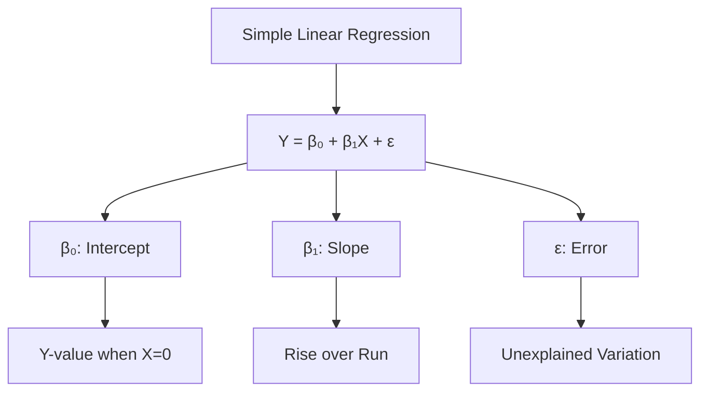

**Interpretation**:
```
β₁ = 5 means:
- One unit increase in X → 5 units increase in Y
- Positive slope: Direct relationship
- Negative slope: Inverse relationship
- Zero slope: No relationship
```

**Example**: Salary vs Years of Experience
```
Salary = 30000 + 5000 × Experience

β₀ = 30000 (starting salary)
β₁ = 5000 (salary increase per year)

After 5 years: 30000 + 5000(5) = 55000
```

### Residuals

**Definition**: Difference between observed and predicted values

```
e_i = y_i - ŷ_i
    = y_i - (β₀ + β₁x_i)
```

**Properties**:
- Sum of residuals = 0 (with intercept)
- Uncorrelated with predictors (in OLS)
- Represent unexplained variation

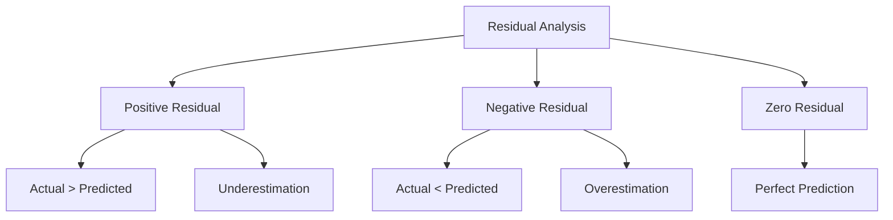

---

## Ordinary Least Squares (OLS)

### Objective

**Minimize** Sum of Squared Residuals (SSR):
```
SSR = Σ(y_i - ŷ_i)²
    = Σ(y_i - β₀ - β₁x_i)²
```

**Why square residuals?**
1. Positive and negative errors don't cancel out
2. Penalizes large errors more
3. Mathematically tractable (differentiable)
4. Leads to unique solution

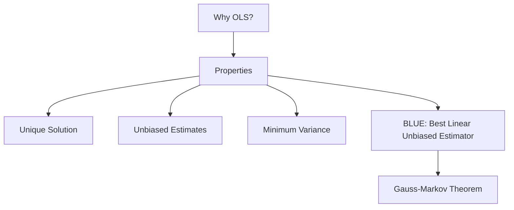

### Analytical Solution

**For Simple Linear Regression**:

```
β₁ = Σ(x_i - x̄)(y_i - ȳ) / Σ(x_i - x̄)²
   = Cov(X, Y) / Var(X)

β₀ = ȳ - β₁x̄
```

**Derivation** (via calculus):
```
1. Take partial derivatives of SSR w.r.t. β₀ and β₁
2. Set derivatives to zero
3. Solve system of equations

∂SSR/∂β₀ = -2Σ(y_i - β₀ - β₁x_i) = 0
∂SSR/∂β₁ = -2Σx_i(y_i - β₀ - β₁x_i) = 0
```

**Example Calculation**:
```
Data:
X: [1, 2, 3, 4, 5]
Y: [2, 4, 5, 4, 5]

x̄ = 3, ȳ = 4

Deviations:
x - x̄: [-2, -1, 0, 1, 2]
y - ȳ: [-2, 0, 1, 0, 1]

Σ(x-x̄)(y-ȳ) = 4 + 0 + 0 + 0 + 2 = 6
Σ(x-x̄)² = 4 + 1 + 0 + 1 + 4 = 10

β₁ = 6/10 = 0.6
β₀ = 4 - 0.6(3) = 2.2

Model: Y = 2.2 + 0.6X
```

### Matrix Formulation

**For Multiple Regression**:

```
Y = Xβ + ε

where:
Y = [y₁, y₂, ..., y_n]ᵀ  (n × 1)
X = [1, x₁, x₂, ..., x_p]  (n × p+1)
β = [β₀, β₁, ..., β_p]ᵀ   (p+1 × 1)
ε = [ε₁, ε₂, ..., ε_n]ᵀ   (n × 1)
```

**OLS Solution**:
```
β̂ = (XᵀX)⁻¹XᵀY
```

**Conditions**:
- XᵀX must be invertible
- Requires: n > p (more observations than features)
- No perfect multicollinearity

**Geometric Interpretation**:
```
β̂ projects Y onto column space of X
Residuals are orthogonal to column space
Minimizes Euclidean distance
```

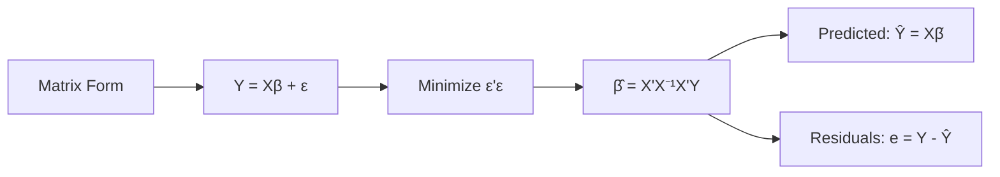

---

## Assumptions and Diagnostics

### The Five Key Assumptions

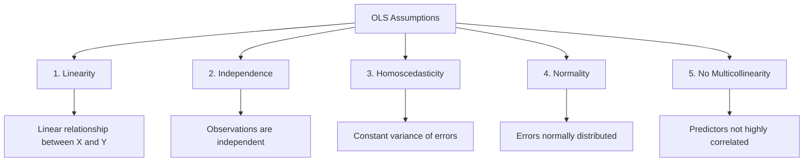

### 1. Linearity

**Assumption**: Relationship between X and Y is linear

**Check**:
- Scatter plots of Y vs each X
- Residuals vs Fitted values plot
- Should see random scatter, no patterns

**Violation Indicators**:
- Curved pattern in residual plot
- Non-linear scatter plots

**Solutions**:
```
1. Transform variables (log, sqrt, polynomial)
2. Add polynomial terms (X²,  X³)
3. Use non-linear models
```

**Example**:
```python
# Linear model fails
Y = β₀ + β₁X  # Poor fit for Y = X²

# Solution: Add polynomial term
Y = β₀ + β₁X + β₂X²  # Much better!
```

### 2. Independence

**Assumption**: Observations are independent (no autocorrelation)

**Check**:
- Durbin-Watson test
- Plot residuals vs time/order
- ACF/PACF plots for time series

**Durbin-Watson Statistic**:
```
DW = Σ(e_t - e_{t-1})² / Σe_t²

Interpretation:
DW ≈ 2: No autocorrelation
DW < 2: Positive autocorrelation
DW > 2: Negative autocorrelation
```

**Violation Indicators**:
- DW significantly different from 2
- Pattern in residuals over time
- Clustered residuals

**Solutions**:
```
1. Add lagged variables
2. Difference the time series
3. Use time series models (ARIMA, SARIMA)
4. Account for clustering (mixed effects models)
```

### 3. Homoscedasticity

**Assumption**: Constant variance of errors across all X values

**Heteroscedasticity**: Variance changes with X

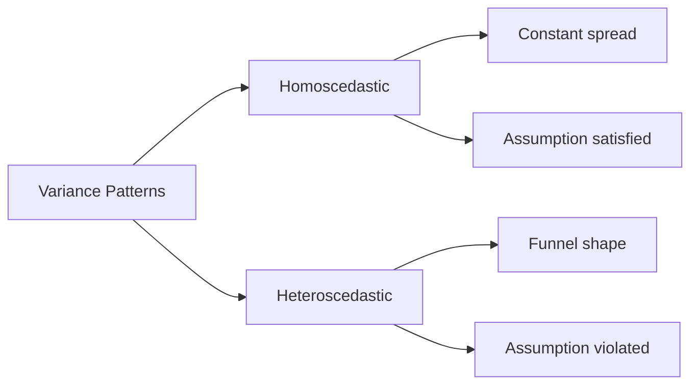

**Check**:
- Residuals vs Fitted plot
- Scale-Location plot
- Breusch-Pagan test
- White test

**Breusch-Pagan Test**:
```
H₀: Homoscedasticity (constant variance)
H₁: Heteroscedasticity

Test statistic ~ χ² distribution
```

**Violation Indicators**:
- Funnel/cone shape in residual plot
- Increasing/decreasing spread
- Significant BP or White test

**Solutions**:
```
1. Transform Y (log, sqrt)
2. Weighted Least Squares (WLS)
3. Robust standard errors (Huber-White)
4. Generalized Least Squares (GLS)
```

**Example**:
```
Problem: Income prediction
- Low income: Small variance
- High income: Large variance

Solution: log(Income) transformation
- Compresses high values
- Stabilizes variance
```

### 4. Normality of Errors

**Assumption**: Residuals are normally distributed

**Importance**:
- Required for hypothesis tests
- Confidence intervals
- Prediction intervals
- Less critical for point estimates (due to CLT)

**Check**:
- Q-Q plot (Quantile-Quantile)
- Histogram of residuals
- Shapiro-Wilk test
- Kolmogorov-Smirnov test

**Q-Q Plot**:
```
- Plot: Sample quantiles vs theoretical normal quantiles
- Straight line: Normal distribution
- S-curve: Skewed distribution
- Heavy tails: Outliers present
```

**Violation Indicators**:
- Q-Q plot deviates from line
- Skewed histogram
- Significant normality test

**Solutions**:
```
1. Transform Y (Box-Cox, log)
2. Remove outliers (if valid)
3. Robust regression methods
4. Bootstrap for inference (don't assume normality)
5. Larger sample size (CLT helps)
```

### 5. No Multicollinearity

**Assumption**: Independent variables are not highly correlated

**Problem**: High correlation between predictors

**Effects**:
```
1. Inflated standard errors
2. Unstable coefficient estimates
3. Wide confidence intervals
4. Difficulty interpreting coefficients
5. Coefficients may have wrong signs
```

**Detection Methods**:

**Variance Inflation Factor (VIF)**:
```
VIF_j = 1 / (1 - R²_j)

where R²_j is from regressing X_j on other predictors

Interpretation:
VIF = 1: No correlation
VIF < 5: Acceptable
5 ≤ VIF < 10: Moderate concern
VIF ≥ 10: Severe multicollinearity
```

**Correlation Matrix**:
```
|r| > 0.8-0.9: High correlation
Visualize with heatmap
```

**Condition Number**:
```
κ = √(λ_max / λ_min)

where λ are eigenvalues of X'X

κ > 30: Multicollinearity present
```

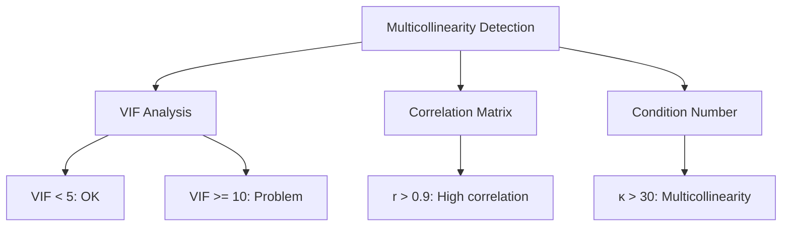

**Solutions**:
```
1. Remove highly correlated variables
2. Combine correlated variables (e.g., average)
3. Principal Component Analysis (PCA)
4. Ridge regression (L2 regularization)
5. Collect more data (sometimes helps)
6. Domain knowledge to select features
```

**Example**:
```
Predicting house price with:
- Square feet
- Number of rooms
- Total area

Square feet and total area highly correlated (VIF > 15)
Solution: Keep only one, or use PCA
```

### Diagnostic Plots

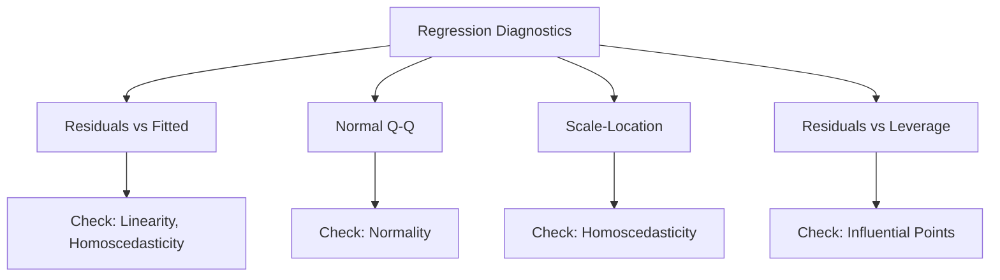

**1. Residuals vs Fitted**:
```
Purpose: Check linearity and homoscedasticity
Ideal: Random scatter around zero
Problems:
- Curve → Non-linearity
- Funnel → Heteroscedasticity
- Outliers → Check those points
```

**2. Normal Q-Q Plot**:
```
Purpose: Check normality of residuals
Ideal: Points on diagonal line
Problems:
- S-curve → Skewness
- Heavy tails → Outliers
- Light tails → Platykurtic
```

**3. Scale-Location (Spread-Location)**:
```
Purpose: Check homoscedasticity
Plot: √|standardized residuals| vs fitted
Ideal: Horizontal line with equal spread
Problem: Trend indicates heteroscedasticity
```

**4. Residuals vs Leverage**:
```
Purpose: Identify influential points
Shows: Cook's distance contours
Concerns:
- High leverage + Large residual = Influential
- Cook's distance > 1 is problematic
```

### Influential Observations

**Leverage (h_ii)**:
```
h_ii = diagonal elements of H = X(X'X)⁻¹X'

High leverage: h_ii > 2(p+1)/n

Interpretation:
- How far X_i is from other X values
- High leverage points can pull regression line
```

**Cook's Distance**:
```
D_i = (r_i² / (p+1)) × (h_ii / (1 - h_ii))

where r_i is standardized residual

Threshold: D_i > 1 is concerning

Interpretation:
- Measures influence on all fitted values
- Combines leverage and residual size
- Influential if both are large
```

**DFFITS** (Difference in Fits):
```
DFFITS_i = r_i × √(h_ii / (1 - h_ii))

Threshold: |DFFITS_i| > 2√((p+1)/n)

Interpretation:
- Influence on fitted value ŷ_i
- Standardized difference when removing observation
```

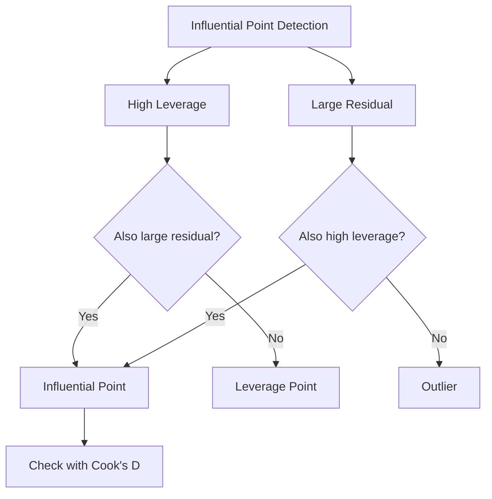

**What to do with influential points**:
```
1. Check for data entry errors
2. Investigate why point is unusual
3. If error: Correct or remove
4. If valid: Consider robust regression
5. Report sensitivity analysis
6. Don't automatically remove!
```

---

## Multiple Linear Regression

### Model Specification

```
Y = β₀ + β₁X₁ + β₂X₂ + ... + β_pX_p + ε
```

**Interpretation**:
```
β_j: Change in Y for one-unit change in X_j,
     holding all other variables constant

Also called: Partial effect, ceteris paribus effect
```

**Example**: House Price Prediction
```
Price = β₀ + β₁(sqft) + β₂(bedrooms) + β₃(age) + ε

β₁ = 100: Each additional sqft adds $100,
          holding bedrooms and age constant

β₂ = 5000: Each additional bedroom adds $5000,
           holding sqft and age constant
```

### Adjusted R-squared

**R-squared** (Coefficient of Determination):
```
R² = 1 - (SSR / SST)
   = 1 - (Σ(y_i - ŷ_i)²) / (Σ(y_i - ȳ)²)

where:
SST (Total Sum of Squares) = Σ(y_i - ȳ)²
SSR (Residual Sum of Squares) = Σ(y_i - ŷ_i)²
SSE (Explained Sum of Squares) = Σ(ŷ_i - ȳ)²

SST = SSE + SSR
```

**Properties**:
```
Range: [0, 1]
Interpretation: Proportion of variance explained
Always increases when adding variables (problem!)
```

**Adjusted R-squared**:
```
R²_adj = 1 - ((1 - R²)(n - 1)) / (n - p - 1)
       = 1 - (SSR/(n-p-1)) / (SST/(n-1))

where:
n = number of observations
p = number of predictors (excluding intercept)
```

**Properties**:
```
Penalizes adding irrelevant variables
Can decrease when adding weak predictors
Better for model comparison
Accounts for model complexity
```

**Example**:
```
Model 1: R² = 0.75, n=100, p=2
R²_adj = 1 - (0.25 × 99/97) = 0.744

Model 2: R² = 0.76, n=100, p=10
R²_adj = 1 - (0.24 × 99/89) = 0.731

Model 2 has higher R² but lower adjusted R²
→ Additional variables don't justify complexity
```

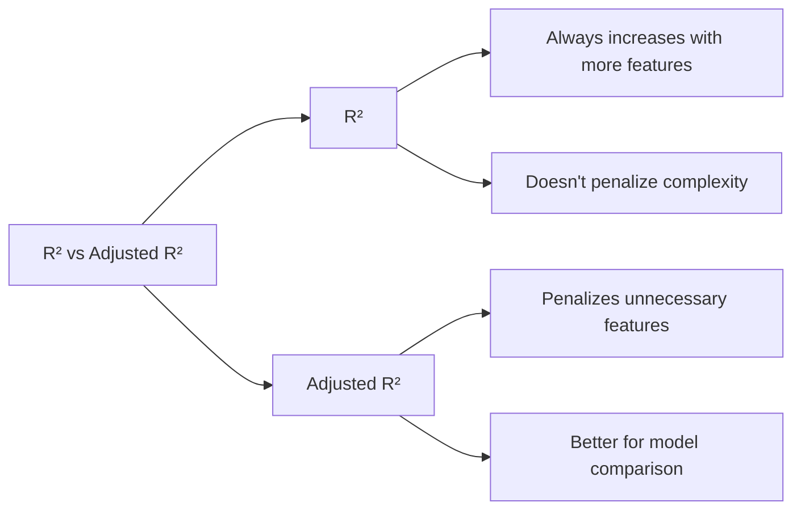

### F-test for Overall Significance

**Hypotheses**:
```
H₀: β₁ = β₂ = ... = β_p = 0  (all slopes are zero)
H₁: At least one β_j ≠ 0    (model has predictive power)
```

**F-statistic**:
```
F = (SSE / p) / (SSR / (n - p - 1))
  = (R² / p) / ((1 - R²) / (n - p - 1))

df₁ = p
df₂ = n - p - 1
```

**Interpretation**:
```
Large F-statistic → Reject H₀
Model is statistically significant
At least one predictor is useful
```

**Example**:
```
R² = 0.60, n = 50, p = 3

F = (0.60 / 3) / (0.40 / 46)
  = 0.20 / 0.0087
  = 23

Critical value F(0.05, 3, 46) ≈ 2.81

23 > 2.81 → Reject H₀
Model is significant!
```

### t-tests for Individual Coefficients

**Hypotheses** (for coefficient j):
```
H₀: β_j = 0  (no effect)
H₁: β_j ≠ 0  (has effect)
```

**t-statistic**:
```
t_j = β̂_j / SE(β̂_j)

df = n - p - 1
```

**Standard Error**:
```
SE(β̂_j) = s × √(diagonal element j of (X'X)⁻¹)

where s = √(SSR / (n - p - 1))
```

**Confidence Interval**:
```
β̂_j ± t_(α/2, n-p-1) × SE(β̂_j)
```

**Example**:
```
β̂₁ = 50, SE(β̂₁) = 15, df = 47

t = 50 / 15 = 3.33

Critical value t(0.025, 47) ≈ 2.01

|3.33| > 2.01 → Reject H₀
β₁ is significantly different from zero

95% CI: 50 ± 2.01(15) = [19.85, 80.15]
```

---

## Feature Engineering

### Polynomial Features

**Purpose**: Model non-linear relationships

**Model**:
```
Y = β₀ + β₁X + β₂X² + β₃X³ + ... + ε
```

**Still linear in parameters!**
```
Linear regression can be used
Just create new features: X² X³, etc.
```

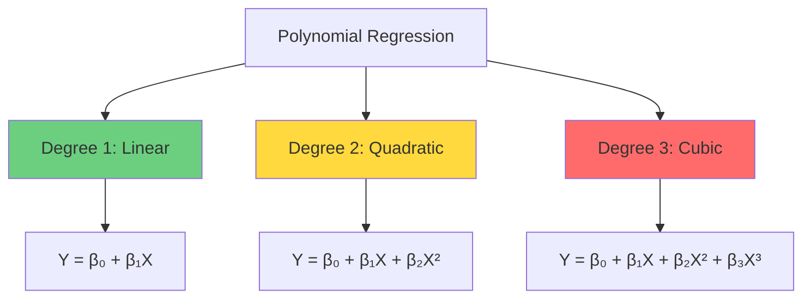

**Choosing Degree**:
```
Too low: Underfitting (high bias)
Too high: Overfitting (high variance)

Methods:
1. Cross-validation
2. Visual inspection
3. Domain knowledge
4. Typically: degree ≤ 3
```

**Example**:
```python
from sklearn.preprocessing import PolynomialFeatures

# Original feature
X = [[1], [2], [3], [4]]

# Create polynomial features (degree=2)
poly = PolynomialFeatures(degree=2)
X_poly = poly.fit_transform(X)

# Result: [1, X, X²]
# [[1, 1, 1],
#  [1, 2, 4],
#  [1, 3, 9],
#  [1, 4, 16]]
```

### Interaction Terms

**Purpose**: Model how effect of one variable depends on another

**Model**:
```
Y = β₀ + β₁X₁ + β₂X₂ + β₃(X₁ × X₂) + ε
```

**Interpretation**:
```
Effect of X₁ on Y = β₁ + β₃X₂
Effect of X₂ on Y = β₂ + β₃X₁

Effect depends on level of other variable!
```

**Example**: Advertising and Price
```
Sales = β₀ + β₁(Advertising) + β₂(Price) + β₃(Advertising × Price)

If β₃ < 0:
- Advertising more effective when price is low
- High price reduces advertising effectiveness
```

**When to include interactions**:
```
1. Domain knowledge suggests interaction
2. Exploratory analysis shows pattern
3. Improve model fit significantly
4. Can interpret meaningfully
```

### Variable Transformations

**Log Transformation**:

**Log-Log Model**:
```
log(Y) = β₀ + β₁log(X) + ε

Interpretation: β₁ is elasticity
1% increase in X → β₁% increase in Y
```

**Log-Linear Model**:
```
log(Y) = β₀ + β₁X + ε

Interpretation:
One-unit increase in X → 100×β₁% change in Y
```

**Linear-Log Model**:
```
Y = β₀ + β₁log(X) + ε

Interpretation:
1% increase in X → β₁/100 unit change in Y
```

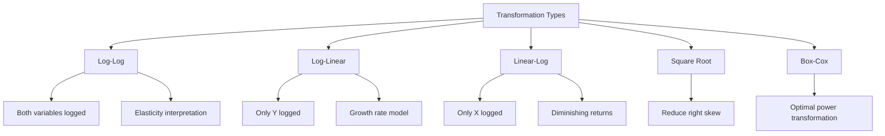

**When to transform**:
```
1. Non-linear relationship
2. Heteroscedasticity
3. Non-normal residuals
4. Skewed distributions
5. Multiplicative relationships
```

**Box-Cox Transformation**:
```
y(λ) = (y^λ - 1) / λ  if λ ≠ 0
     = log(y)          if λ = 0

Find optimal λ via maximum likelihood
```

---

## Regularization

### Why Regularization?

**Problems without regularization**:
```
1. Overfitting with many features
2. Unstable estimates with multicollinearity
3. High variance
4. Poor generalization to new data
```

**Solution**: Add penalty to objective function

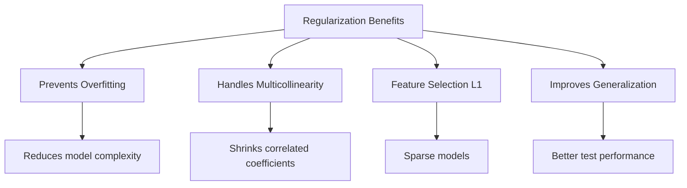

### Ridge Regression (L2)

**Objective**:
```
minimize: Σ(y_i - ŷ_i)² + λΣβ_j²

λ: Regularization parameter (≥ 0)
```

**Closed-form Solution**:
```
β̂_ridge = (X'X + λI)⁻¹X'Y
```

**Properties**:
```
1. Shrinks coefficients toward zero (but not exactly zero)
2. All features retained
3. Handles multicollinearity well
4. Larger λ → more shrinkage
5. λ = 0 → OLS regression
```

**Effect on coefficients**:
```
As λ increases:
- All β_j decrease in magnitude
- None become exactly zero
- Bias increases, variance decreases
```

**When to use**:
```
1. Multicollinearity present
2. Want to keep all features
3. p approaching n
4. Concerned about overfitting
```

### Lasso Regression (L1)

**Objective**:
```
minimize: Σ(y_i - ŷ_i)² + λΣ|β_j|
```

**Properties**:
```
1. Can shrink coefficients exactly to zero
2. Performs automatic feature selection
3. Produces sparse models
4. No closed-form solution (requires optimization)
5. Variable selection + regularization
```

**Effect on coefficients**:
```
As λ increases:
- Some β_j become exactly zero
- Features with zero coefficients are excluded
- Performs feature selection
```

**When to use**:
```
1. Many irrelevant features
2. Want sparse model (interpretability)
3. Feature selection needed
4. Believe only few features are important
```

### Elastic Net

**Objective**:
```
minimize: Σ(y_i - ŷ_i)² + λ₁Σ|β_j| + λ₂Σβ_j²
        = Σ(y_i - ŷ_i)² + λ[αΣ|β_j| + (1-α)Σβ_j²]

where α ∈ [0, 1] controls L1/L2 balance
```

**Properties**:
```
1. Combines L1 and L2 penalties
2. Can select groups of correlated features
3. More stable than Lasso with correlation
4. α = 0: Ridge regression
5. α = 1: Lasso regression
```

**When to use**:
```
1. Grouped correlated features
2. Want sparse model but Lasso unstable
3. High-dimensional data (p >> n)
4. Uncertain about L1 vs L2
```

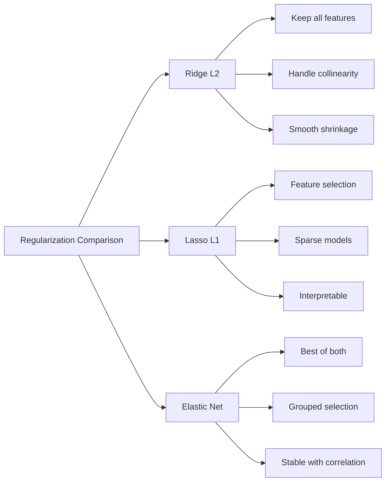

### Choosing λ (Hyperparameter Tuning)

**Cross-Validation**:
```python
from sklearn.model_selection import GridSearchCV
from sklearn.linear_model import Ridge

# Define parameter grid
param_grid = {'alpha': [0.001, 0.01, 0.1, 1, 10, 100]}

# Grid search with CV
ridge_cv = GridSearchCV(Ridge(), param_grid, cv=5,
                        scoring='neg_mean_squared_error')
ridge_cv.fit(X_train, y_train)

best_lambda = ridge_cv.best_params_['alpha']
```

**Regularization Path**:
```
- Plot coefficients vs λ
- See how coefficients shrink
- Identify when features are dropped (Lasso)
- Choose λ based on desired sparsity/performance
```

**Methods**:
```
1. k-Fold Cross-Validation (most common)
2. AIC/BIC information criteria
3. Validation set approach
4. Domain knowledge for interpretation
```

---

## Model Evaluation

### Performance Metrics

**Mean Squared Error (MSE)**:
```
MSE = (1/n)Σ(y_i - ŷ_i)²

Properties:
- Penalizes large errors heavily
- Same units as Y²
- Always non-negative
```

**Root Mean Squared Error (RMSE)**:
```
RMSE = √MSE = √[(1/n)Σ(y_i - ŷ_i)²]

Properties:
- Same units as Y
- Easier to interpret than MSE
- Still sensitive to outliers
```

**Mean Absolute Error (MAE)**:
```
MAE = (1/n)Σ|y_i - ŷ_i|

Properties:
- Linear penalty for errors
- More robust to outliers than MSE
- Same units as Y
```

**Mean Absolute Percentage Error (MAPE)**:
```
MAPE = (100/n)Σ|y_i - ŷ_i| / |y_i|

Properties:
- Percentage error (unitless)
- Easy to explain to non-technical audience
- Problems when y_i ≈ 0
```

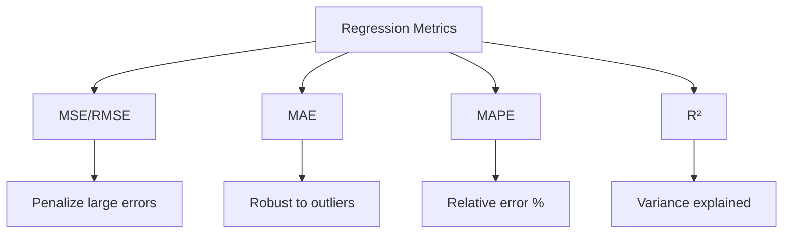

**Which metric to use**:
```
MSE/RMSE:
- Large errors are particularly bad
- Gaussian error assumption
- Standard in research

MAE:
- Robust to outliers
- All errors weighted equally
- More interpretable

MAPE:
- Need percentage error
- Compare across different scales
- Avoid if Y can be zero
```

### Train-Test Split

**Purpose**: Assess generalization to unseen data

**Common Splits**:
```
80% train / 20% test
70% train / 30% test
Train on early data, test on recent (time series)
```

```python
from sklearn.model_selection import train_test_split

X_train, X_test, y_train, y_test = train_test_split(
    X, y, test_size=0.2, random_state=42
)

# Train on training set
model.fit(X_train, y_train)

# Evaluate on test set
train_score = model.score(X_train, y_train)
test_score = model.score(X_test, y_test)

# Check for overfitting
if train_score >> test_score:
    print("Overfitting detected!")
```

### Cross-Validation

**k-Fold CV**:
```
1. Split data into k folds
2. For each fold i:
   - Train on k-1 folds
   - Validate on fold i
3. Average performance across k folds
```

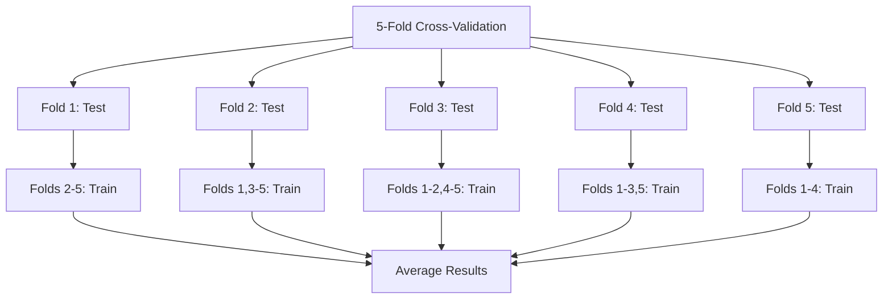

```python
from sklearn.model_selection import cross_val_score

# 5-fold cross-validation
scores = cross_val_score(model, X, y, cv=5,
                         scoring='neg_mean_squared_error')

# Convert to RMSE
rmse_scores = np.sqrt(-scores)

print(f"RMSE: {rmse_scores.mean():.2f} (+/- {rmse_scores.std():.2f})")
```

**Time Series CV** (Forward Chaining):
```
Fold 1: Train[1:100], Test[101:120]
Fold 2: Train[1:120], Test[121:140]
Fold 3: Train[1:140], Test[141:160]

Never train on future to predict past!
```

### Residual Analysis

Check all assumptions discussed earlier:
```
1. Plot residuals vs fitted values
2. Q-Q plot for normality
3. Scale-location plot for homoscedasticity
4. Residuals vs leverage for influential points
```

---

## Practical Implementation

### Complete Example

```python
import numpy as np
import pandas as pd
import matplotlib.pyplot as plt
import seaborn as sns
from sklearn.model_selection import train_test_split, cross_val_score
from sklearn.linear_model import LinearRegression, Ridge, Lasso
from sklearn.preprocessing import StandardScaler, PolynomialFeatures
from sklearn.metrics import mean_squared_error, r2_score, mean_absolute_error
from scipy import stats
import statsmodels.api as sm
from statsmodels.stats.outliers_influence import variance_inflation_factor

# Generate sample data
np.random.seed(42)
n = 200

X1 = np.random.normal(50, 10, n)
X2 = np.random.normal(30, 5, n)
X3 = 0.5 * X1 + np.random.normal(0, 3, n)  # Correlated with X1

y = 10 + 2*X1 + 1.5*X2 - 0.5*X3 + np.random.normal(0, 5, n)

# Create DataFrame
df = pd.DataFrame({'X1': X1, 'X2': X2, 'X3': X3, 'y': y})

# 1. EXPLORATORY DATA ANALYSIS
print("="*60)
print("EXPLORATORY DATA ANALYSIS")
print("="*60)
print("\nDescriptive Statistics:")
print(df.describe())

print("\nCorrelation Matrix:")
correlation = df.corr()
print(correlation)

# Visualize correlations
plt.figure(figsize=(10, 8))
sns.heatmap(correlation, annot=True, cmap='coolwarm', center=0)
plt.title('Correlation Heatmap')
plt.tight_layout()
plt.savefig('correlation_heatmap.png')
plt.close()

# Scatter plots
fig, axes = plt.subplots(1, 3, figsize=(15, 4))
for i, col in enumerate(['X1', 'X2', 'X3']):
    axes[i].scatter(df[col], df['y'], alpha=0.5)
    axes[i].set_xlabel(col)
    axes[i].set_ylabel('y')
    axes[i].set_title(f'y vs {col}')
plt.tight_layout()
plt.savefig('scatter_plots.png')
plt.close()

# 2. PREPARE DATA
X = df[['X1', 'X2', 'X3']].values
y = df['y'].values

X_train, X_test, y_train, y_test = train_test_split(
    X, y, test_size=0.2, random_state=42
)

# 3. CHECK MULTICOLLINEARITY
print("\n" + "="*60)
print("MULTICOLLINEARITY CHECK")
print("="*60)

X_with_intercept = sm.add_constant(X_train)
vif_data = pd.DataFrame()
vif_data["Feature"] = ['const'] + ['X1', 'X2', 'X3']
vif_data["VIF"] = [variance_inflation_factor(X_with_intercept, i)
                   for i in range(X_with_intercept.shape[1])]
print("\nVIF Values:")
print(vif_data)

# 4. FIT MODELS
print("\n" + "="*60)
print("MODEL TRAINING")
print("="*60)

# OLS Regression
model_ols = LinearRegression()
model_ols.fit(X_train, y_train)

# Ridge Regression
model_ridge = Ridge(alpha=1.0)
model_ridge.fit(X_train, y_train)

# Lasso Regression
model_lasso = Lasso(alpha=0.1)
model_lasso.fit(X_train, y_train)

# 5. EVALUATE MODELS
print("\nModel Coefficients:")
coef_df = pd.DataFrame({
    'Feature': ['X1', 'X2', 'X3'],
    'OLS': model_ols.coef_,
    'Ridge': model_ridge.coef_,
    'Lasso': model_lasso.coef_
})
print(coef_df)

print("\nIntercepts:")
print(f"OLS: {model_ols.intercept_:.4f}")
print(f"Ridge: {model_ridge.intercept_:.4f}")
print(f"Lasso: {model_lasso.intercept_:.4f}")

# Performance metrics
models = {'OLS': model_ols, 'Ridge': model_ridge, 'Lasso': model_lasso}
results = []

for name, model in models.items():
    y_train_pred = model.predict(X_train)
    y_test_pred = model.predict(X_test)

    train_r2 = r2_score(y_train, y_train_pred)
    test_r2 = r2_score(y_test, y_test_pred)
    train_rmse = np.sqrt(mean_squared_error(y_train, y_train_pred))
    test_rmse = np.sqrt(mean_squared_error(y_test, y_test_pred))
    test_mae = mean_absolute_error(y_test, y_test_pred)

    results.append({
        'Model': name,
        'Train R²': train_r2,
        'Test R²': test_r2,
        'Train RMSE': train_rmse,
        'Test RMSE': test_rmse,
        'Test MAE': test_mae
    })

results_df = pd.DataFrame(results)
print("\n" + "="*60)
print("MODEL PERFORMANCE")
print("="*60)
print(results_df.to_string(index=False))

# 6. CROSS-VALIDATION
print("\n" + "="*60)
print("CROSS-VALIDATION RESULTS")
print("="*60)

for name, model in models.items():
    cv_scores = cross_val_score(model, X, y, cv=5,
                                scoring='neg_mean_squared_error')
    cv_rmse = np.sqrt(-cv_scores)
    print(f"\n{name}:")
    print(f"  CV RMSE: {cv_rmse.mean():.4f} (+/- {cv_rmse.std():.4f})")

# 7. DIAGNOSTIC PLOTS FOR OLS
print("\n" + "="*60)
print("GENERATING DIAGNOSTIC PLOTS")
print("="*60)

y_pred = model_ols.predict(X_test)
residuals = y_test - y_pred
standardized_residuals = (residuals - residuals.mean()) / residuals.std()

fig, axes = plt.subplots(2, 2, figsize=(12, 10))

# Residuals vs Fitted
axes[0, 0].scatter(y_pred, residuals, alpha=0.5)
axes[0, 0].axhline(0, color='red', linestyle='--')
axes[0, 0].set_xlabel('Fitted values')
axes[0, 0].set_ylabel('Residuals')
axes[0, 0].set_title('Residuals vs Fitted')

# Q-Q Plot
stats.probplot(residuals, dist="norm", plot=axes[0, 1])
axes[0, 1].set_title('Normal Q-Q Plot')

# Scale-Location
axes[1, 0].scatter(y_pred, np.sqrt(np.abs(standardized_residuals)), alpha=0.5)
axes[1, 0].set_xlabel('Fitted values')
axes[1, 0].set_ylabel('√|Standardized Residuals|')
axes[1, 0].set_title('Scale-Location')

# Histogram of residuals
axes[1, 1].hist(residuals, bins=20, edgecolor='black')
axes[1, 1].set_xlabel('Residuals')
axes[1, 1].set_ylabel('Frequency')
axes[1, 1].set_title('Histogram of Residuals')

plt.tight_layout()
plt.savefig('diagnostic_plots.png')
plt.close()

print("Diagnostic plots saved as 'diagnostic_plots.png'")

# 8. DETAILED STATISTICS WITH STATSMODELS
print("\n" + "="*60)
print("DETAILED OLS STATISTICS")
print("="*60)

X_train_sm = sm.add_constant(X_train)
model_sm = sm.OLS(y_train, X_train_sm).fit()
print(model_sm.summary())

# 9. PREDICTION EXAMPLE
print("\n" + "="*60)
print("PREDICTION EXAMPLE")
print("="*60)

new_data = np.array([[55, 32, 28]])  # New observation
prediction = model_ols.predict(new_data)
print(f"\nInput: X1=55, X2=32, X3=28")
print(f"Predicted y: {prediction[0]:.2f}")

print("\nAnalysis complete!")
```

### Implementation from Scratch

```python
class LinearRegressionScratch:
    """Linear Regression implemented from scratch"""

    def __init__(self, fit_intercept=True):
        self.fit_intercept = fit_intercept
        self.coefficients = None
        self.intercept = None

    def fit(self, X, y):
        """Fit using Normal Equation"""
        n_samples, n_features = X.shape

        # Add intercept column if needed
        if self.fit_intercept:
            X_with_intercept = np.c_[np.ones(n_samples), X]
        else:
            X_with_intercept = X

        # Normal equation: β = (X'X)^(-1) X'y
        self.coefficients = np.linalg.inv(
            X_with_intercept.T @ X_with_intercept
        ) @ X_with_intercept.T @ y

        if self.fit_intercept:
            self.intercept = self.coefficients[0]
            self.coefficients = self.coefficients[1:]
        else:
            self.intercept = 0

        return self

    def predict(self, X):
        """Make predictions"""
        return X @ self.coefficients + self.intercept

    def score(self, X, y):
        """Calculate R² score"""
        y_pred = self.predict(X)
        ss_total = np.sum((y - y.mean()) ** 2)
        ss_residual = np.sum((y - y_pred) ** 2)
        return 1 - (ss_residual / ss_total)


# Test implementation
model_scratch = LinearRegressionScratch()
model_scratch.fit(X_train, y_train)

print("Coefficients (Scratch):", model_scratch.coefficients)
print("Intercept (Scratch):", model_scratch.intercept)
print("R² (Scratch):", model_scratch.score(X_test, y_test))
```

---

## Interview Questions

**Q1: Explain the assumptions of linear regression and what happens when they're violated.**

A: The five key OLS assumptions are:

**1. Linearity**: Linear relationship between X and Y
- Violation: Biased predictions, systematic errors
- Solution: Transform variables, add polynomial terms, use non-linear models

**2. Independence**: Observations are independent
- Violation: Underestimated standard errors, invalid hypothesis tests
- Solution: Add time/spatial components, use mixed effects models, ARIMA for time series

**3. Homoscedasticity**: Constant variance of errors
- Violation: Inefficient estimates, unreliable standard errors
- Solution: Transform Y (log, sqrt), weighted least squares, robust standard errors

**4. Normality**: Errors normally distributed
- Violation: Invalid confidence intervals and hypothesis tests (less critical for large n due to CLT)
- Solution: Transform Y, robust methods, bootstrap for inference

**5. No Multicollinearity**: Predictors not highly correlated
- Violation: Inflated standard errors, unstable coefficients, wrong signs
- Solution: Remove correlated features, PCA, Ridge regression

**Q2: What is the difference between R² and Adjusted R²?**

A: **R²** measures proportion of variance in Y explained by the model (0 to 1).

**Problem**: Always increases when adding ANY variable, even irrelevant ones.

**Adjusted R²** penalizes model complexity:
```
R²_adj = 1 - ((1 - R²)(n-1)) / (n-p-1)
```

Can decrease when adding weak predictors, making it better for model comparison.

**Use adjusted R²** when:
- Comparing models with different numbers of predictors
- Concerned about overfitting
- Need to justify adding variables

**Q3: Explain multicollinearity. How do you detect and fix it?**

A: **Multicollinearity**: High correlation between predictor variables.

**Problems**:
- Inflated standard errors → wider confidence intervals
- Unstable coefficient estimates (change dramatically with small data changes)
- Difficult to determine individual effects
- Coefficients can have wrong signs

**Detection**:
1. **VIF** (Variance Inflation Factor):
   - VIF > 10: Severe multicollinearity
   - VIF = 1 / (1 - R²_j), where R²_j is from regressing X_j on others

2. **Correlation matrix**: |r| > 0.8-0.9 between predictors

3. **Condition number**: Large eigenvalue ratio in X'X

**Solutions**:
1. Remove one of correlated variables
2. Combine variables (average, PCA)
3. Ridge regression (L2 regularization)
4. Collect more data
5. Domain knowledge to select most important features

**Q4: What is the difference between Ridge and Lasso regression?**

A:

**Ridge (L2)**: Penalty = λΣβ²
- Shrinks coefficients toward zero (never exactly zero)
- Keeps all features
- Handles multicollinearity well
- Has closed-form solution
- Use when: Want all features, multicollinearity present

**Lasso (L1)**: Penalty = λΣ|β|
- Can shrink coefficients exactly to zero
- Performs feature selection
- Creates sparse models
- No closed-form solution
- Use when: Want automatic feature selection, many irrelevant features

**Elastic Net**: Combines both
- Best of both worlds
- Can select groups of correlated features
- More stable than Lasso with correlation

**Q5: How do you choose between different models?**

A: Model selection strategy:

**1. Split data** into train/validation/test or use cross-validation

**2. Compare metrics**:
- R² / Adjusted R²
- RMSE / MAE
- AIC / BIC (information criteria)
- Cross-validation score

**3. Check assumptions**:
- Residual plots
- Normality tests
- Multicollinearity (VIF)

**4. Consider**:
- Interpretability vs accuracy tradeoff
- Model complexity (Occam's Razor)
- Domain knowledge
- Computational cost
- Generalization (test performance)

**5. Validate**:
- Final test on held-out data
- Check if performance is stable
- Assess practical significance (not just statistical)

**Bias-Variance Tradeoff**:
- Simple model: High bias, low variance (underfitting)
- Complex model: Low bias, high variance (overfitting)
- Goal: Find sweet spot via cross-validation

---

## Summary

### Key Formulas

**OLS Solution**:
```
β̂ = (X'X)⁻¹X'Y
```

**R-squared**:
```
R² = 1 - SSR/SST
```

**Adjusted R-squared**:
```
R²_adj = 1 - ((1-R²)(n-1))/(n-p-1)
```

**VIF**:
```
VIF_j = 1/(1-R²_j)
```

**Ridge**:
```
β̂_ridge = (X'X + λI)⁻¹X'Y
```

### Decision Tree

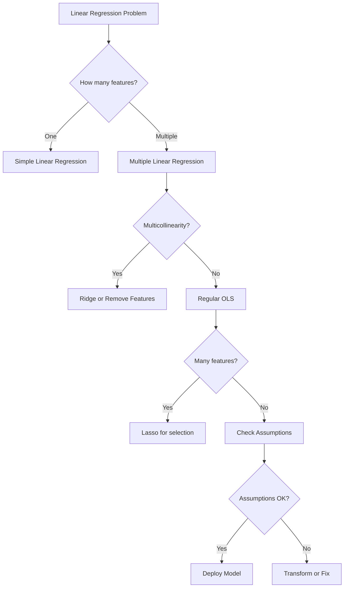

### Next Steps

This foundation prepares you for:
1. **Logistic Regression** - Classification problems
2. **Generalized Linear Models** - Non-normal distributions
3. **Time Series** - Temporal dependencies
4. **Advanced ML** - Tree models, neural networks

---

**Document Created**: 2025
**Target Audience**: Zero to Architect level
**Prerequisites**: Statistics and Probability Foundations
**Next**: Logistic Regression Complete Guide

