# Logistic Regression Complete Guide: Zero to Architect

## Table of Contents
1. [Introduction](#introduction)
2. [Mathematical Foundations](#mathematical-foundations)
3. [Maximum Likelihood Estimation](#maximum-likelihood-estimation)
4. [Model Interpretation](#model-interpretation)
5. [Multi-class Classification](#multi-class-classification)
6. [Model Evaluation](#model-evaluation)
7. [Regularization](#regularization)
8. [Advanced Topics](#advanced-topics)
9. [Practical Implementation](#practical-implementation)
10. [Interview Questions](#interview-questions)

---

## Introduction

### What is Logistic Regression?

**Logistic Regression** is a statistical method for **binary classification**:
- Predicts probability of categorical outcome
- Despite name, it's a classification algorithm
- Models probability using logistic (sigmoid) function

**Binary Classification**: Y ∈ {0, 1}
```
0: Negative class (failure, no, absence)
1: Positive class (success, yes, presence)
```

### Use Cases

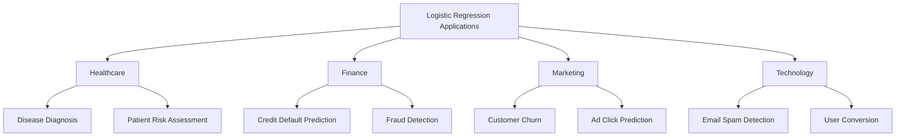

### Why Not Linear Regression for Classification?

**Problems with Linear Regression**:
```
1. Predictions outside [0,1] range
2. Assumes constant variance (violated for binary)
3. Residuals not normally distributed
4. Sensitive to outliers
5. Linear decision boundary may be inappropriate
```

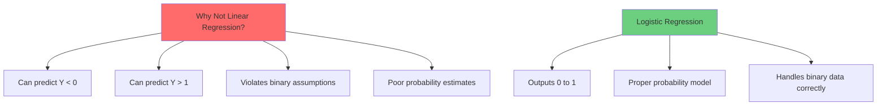

### Learning Roadmap


---

## Mathematical Foundations

### The Sigmoid Function

**Definition**:
```
σ(z) = 1 / (1 + e^(-z))
```

**Properties**:
```
Domain: (-∞, ∞)
Range: (0, 1)
σ(0) = 0.5
σ(∞) = 1
σ(-∞) = 0
σ(-z) = 1 - σ(z)  (symmetry)
```

**Shape**: S-curve (sigmoid = S-shaped in Greek)

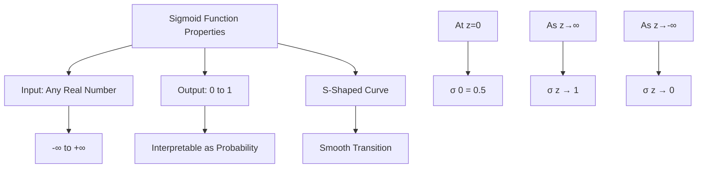

**Derivative** (important for optimization):
```
dσ/dz = σ(z)(1 - σ(z))

Nice property: Derivative in terms of function itself!
```

**Why Sigmoid?**
```
1. Maps any real number to (0,1)
2. Smooth and differentiable everywhere
3. Natural interpretation as probability
4. Monotonic (preserves ordering)
5. Bounded output
```

### Logistic Regression Model

**Model**:
```
P(Y=1|X) = σ(β₀ + β₁X₁ + β₂X₂ + ... + β_pX_p)
         = 1 / (1 + e^(-(β₀ + β₁X₁ + ... + β_pX_p)))
```

**Linear Component**:
```
z = β₀ + β₁X₁ + β₂X₂ + ... + β_pX_p = X'β

This is the log-odds (logit)
```

**Probability**:
```
p = P(Y=1|X) = σ(z) = σ(X'β)
```

**Prediction**:
```
Ŷ = 1  if p ≥ threshold (typically 0.5)
Ŷ = 0  if p < threshold
```

### Odds and Log-Odds

**Odds**:
```
Odds = P(Y=1) / P(Y=0) = p / (1-p)

Range: [0, ∞)
```

**Interpretation**:
```
Odds = 1: Equal probability (50-50)
Odds > 1: Event more likely
Odds < 1: Event less likely
Odds = 2: Event twice as likely as not
Odds = 0.5: Event half as likely
```

**Log-Odds (Logit)**:
```
logit(p) = log(Odds) = log(p / (1-p))
         = β₀ + β₁X₁ + ... + β_pX_p

Range: (-∞, ∞)
```

**Key Insight**: Logistic regression is **linear in log-odds space**!

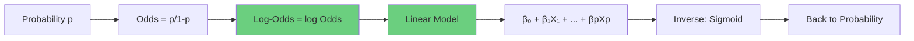

**Example**:
```
Probability: p = 0.8
Odds: 0.8/0.2 = 4
Log-odds: log(4) = 1.39

Probability: p = 0.5
Odds: 0.5/0.5 = 1
Log-odds: log(1) = 0

Probability: p = 0.2
Odds: 0.2/0.8 = 0.25
Log-odds: log(0.25) = -1.39
```

### Decision Boundary

**For binary classification**:
```
Predict Y=1 if p ≥ 0.5
p ≥ 0.5 ⟺ σ(z) ≥ 0.5
        ⟺ z ≥ 0
        ⟺ β₀ + β₁X₁ + ... + β_pX_p ≥ 0
```

**Decision boundary** is where p = 0.5:
```
β₀ + β₁X₁ + ... + β_pX_p = 0
```

**For 2D** (two features X₁, X₂):
```
β₀ + β₁X₁ + β₂X₂ = 0
X₂ = -(β₀ + β₁X₁) / β₂

This is a straight line!
```

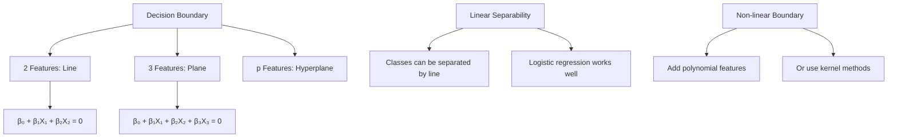

---

## Maximum Likelihood Estimation

### Likelihood Function

**For single observation**:
```
P(y_i|x_i) = p_i^(y_i) × (1-p_i)^(1-y_i)

where p_i = P(Y=1|x_i) = σ(x_i'β)

If y_i=1: P = p_i
If y_i=0: P = 1-p_i
```

**Full Likelihood** (assuming independence):
```
L(β) = ∏_{i=1}^n p_i^(y_i) × (1-p_i)^(1-y_i)
```

**Log-Likelihood**:
```
ℓ(β) = log L(β)
     = Σ[y_i log(p_i) + (1-y_i) log(1-p_i)]
```

**Objective**: Find β that maximizes ℓ(β)

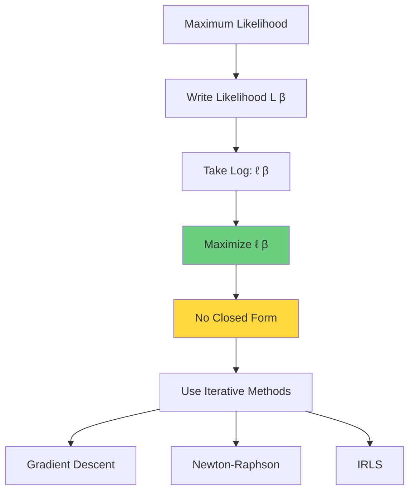

### Binary Cross-Entropy Loss

**Equivalent formulation** (machine learning perspective):
```
Loss = -1/n Σ[y_i log(p_i) + (1-y_i) log(1-p_i)]

This is negative average log-likelihood
Minimizing loss ⟺ Maximizing likelihood
```

**Why this loss function?**
```
1. Derived from probabilistic principles
2. Convex function (unique global minimum)
3. Differentiable everywhere
4. Proper scoring rule (encourages calibrated probabilities)
5. Large penalty for confident wrong predictions
```

**Example**:
```
True label: y=1

If p=0.9 (confident, correct):
  Loss = -log(0.9) = 0.105 (small)

If p=0.5 (uncertain):
  Loss = -log(0.5) = 0.693 (medium)

If p=0.1 (confident, wrong):
  Loss = -log(0.1) = 2.303 (large!)
```

### Optimization Algorithms

**No closed-form solution** like linear regression!

#### Gradient Descent

**Update rule**:
```
β^(t+1) = β^(t) + α × ∇ℓ(β^(t))

where:
α: Learning rate
∇ℓ: Gradient of log-likelihood
```

**Gradient**:
```
∂ℓ/∂β_j = Σ(y_i - p_i) × x_{ij}
```

**Advantages**:
```
1. Simple to implement
2. Works for large datasets (especially SGD)
3. Flexible (can use variants: Adam, RMSprop)
```

**Disadvantages**:
```
1. Slow convergence
2. Requires tuning learning rate
3. Many iterations needed
```

#### Newton-Raphson

**Update rule**:
```
β^(t+1) = β^(t) - H^(-1) × ∇ℓ(β^(t))

where:
H: Hessian matrix (second derivatives)
```

**Advantages**:
```
1. Fast convergence (quadratic near optimum)
2. Typically 4-10 iterations
3. No learning rate to tune
```

**Disadvantages**:
```
1. Expensive: Requires Hessian computation and inversion
2. Not practical for very large datasets
3. Memory intensive: O(p²) for Hessian
```

#### IRLS (Iteratively Reweighted Least Squares)

**Key insight**: Reformulate as weighted least squares problem

**Advantages**:
```
1. Natural extension of linear regression
2. Well-understood properties
3. Efficient implementation available
```

**Used by**: Most statistical software (R, statsmodels)

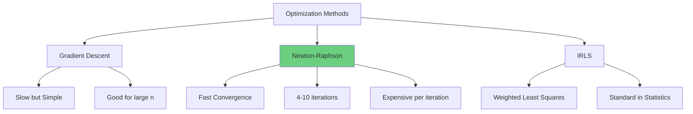

### Convergence

**How to know when done?**

**Convergence criteria**:
```
1. Change in parameters: ||β^(t+1) - β^(t)|| < ε
2. Change in log-likelihood: |ℓ^(t+1) - ℓ^(t)| < ε
3. Gradient norm: ||∇ℓ|| < ε
4. Maximum iterations reached
```

**Typical**:
```
ε = 10^(-6) to 10^(-8)
Max iterations: 100-1000 (gradient descent)
Max iterations: 10-50 (Newton-Raphson)
```

---

## Model Interpretation

### Coefficient Interpretation

**Log-odds interpretation**:
```
β_j: Change in log-odds for one-unit increase in X_j,
     holding other variables constant
```

**Odds Ratio (OR)**:
```
OR_j = e^(β_j)

Interpretation: Multiplicative effect on odds
```

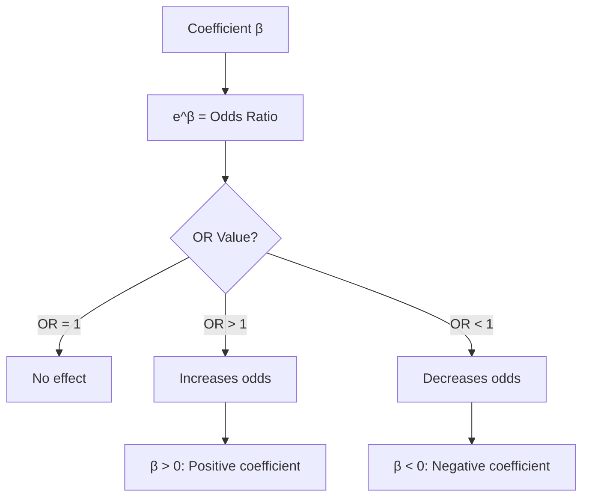

**Examples**:

```
β₁ = 0.5:
OR = e^0.5 = 1.65
→ One-unit increase in X₁ multiplies odds by 1.65
→ 65% increase in odds

β₂ = -0.5:
OR = e^(-0.5) = 0.61
→ One-unit increase in X₂ multiplies odds by 0.61
→ 39% decrease in odds

β₃ = 0:
OR = e^0 = 1
→ No effect on odds
```

**Percentage change in odds**:
```
% change = (e^β - 1) × 100%

β = 0.2 → 22% increase
β = -0.3 → 26% decrease
β = 0.1 → 10.5% increase
```

### Marginal Effects

**Problem**: Odds ratios are multiplicative, not intuitive for probabilities

**Marginal Effect**: Change in probability (not odds)

**Average Marginal Effect (AME)**:
```
ME_j = ∂P(Y=1|X)/∂X_j = β_j × p(1-p)

AME = (1/n) Σ β_j × p_i(1-p_i)

Depends on all feature values!
```

**Example**:
```
β₁ = 2 (very strong positive effect)

If baseline p = 0.1:
  ME = 2 × 0.1 × 0.9 = 0.18
  One-unit increase in X₁ → 18% increase in probability

If baseline p = 0.9:
  ME = 2 × 0.9 × 0.1 = 0.18
  Same marginal effect (symmetric)

If baseline p = 0.5:
  ME = 2 × 0.5 × 0.5 = 0.50
  Maximum marginal effect at p=0.5
```

**Key insight**: Effect on probability depends on baseline probability!

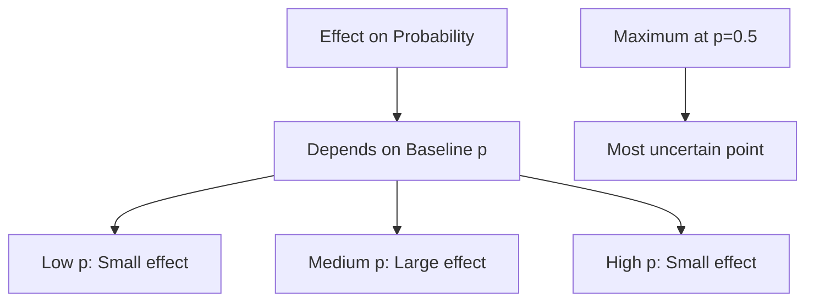

### Practical Example

**Credit Default Prediction**:
```
log(odds) = -3 + 0.5×Income - 2×Debt_Ratio + 1×Age

Interpretation:

Intercept (β₀ = -3):
  When all X=0, log-odds = -3
  Probability = σ(-3) = 0.047 (4.7%)

Income (β₁ = 0.5):
  OR = e^0.5 = 1.65
  $1000 increase in income → 65% increase in odds of default
  (Positive: Higher income → higher default risk? Check data!)

Debt Ratio (β₂ = -2):
  OR = e^(-2) = 0.135
  1-unit increase in debt ratio → 86.5% decrease in odds
  (Negative: Higher debt → lower default? Seems counterintuitive!)

Age (β₃ = 1):
  OR = e^1 = 2.72
  One year older → 172% increase in odds (nearly 3x)
```

**Prediction for specific person**:
```
Income = $50k, Debt_Ratio = 0.3, Age = 30

z = -3 + 0.5(50) - 2(0.3) + 1(30)
  = -3 + 25 - 0.6 + 30
  = 51.4

p = σ(51.4) ≈ 1 (essentially certain to default)

This seems unrealistic! Check:
1. Feature scaling
2. Data quality
3. Model assumptions
```

---

## Multi-class Classification

### One-vs-Rest (OvR)

**Approach**: Train k binary classifiers

**For class i**:
```
Positive: Class i
Negative: All other classes
```

**Prediction**:
```
p_i = P(Y=i|X) for each class
Predict class with highest probability
```

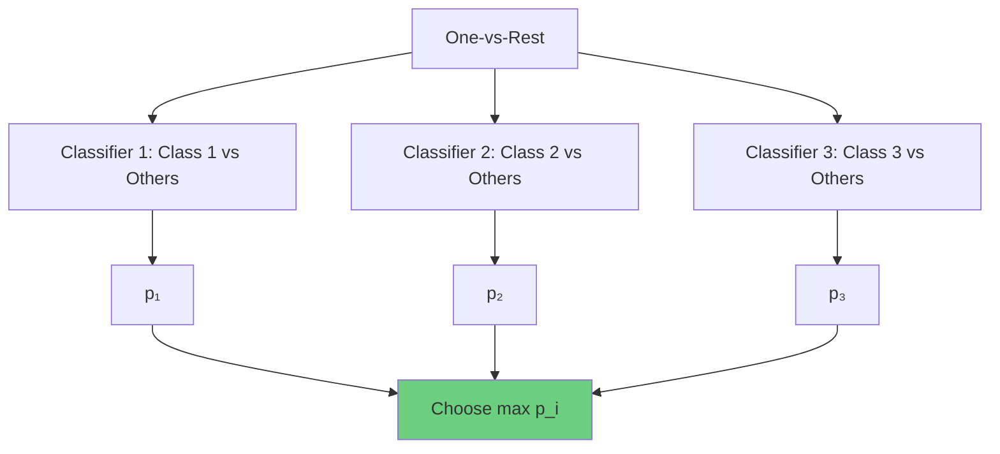

**Advantages**:
```
1. Simple to implement
2. Works with binary classifiers
3. Interpretable
```

**Disadvantages**:
```
1. Probabilities don't sum to 1
2. Imbalanced training sets (1 vs k-1)
3. Inconsistent predictions possible
```

### Softmax Regression (Multinomial Logistic)

**Model for K classes**:
```
P(Y=k|X) = e^(X'β_k) / Σ_{j=1}^K e^(X'β_j)

Properties:
- Probabilities sum to 1: Σ P(Y=k|X) = 1
- Mutually exclusive classes
- Each class has its own parameter vector β_k
```

**Softmax Function**:
```
softmax(z)_k = e^(z_k) / Σ_j e^(z_j)

Generalizes sigmoid to multiple classes
```

**Reference Category**:
```
Typically set β_K = 0 (reference class)
Interpret other coefficients relative to this
```

**Example** (3 classes):
```
P(Y=1|X) = e^(X'β₁) / (e^(X'β₁) + e^(X'β₂) + e^(X'β₃))
P(Y=2|X) = e^(X'β₂) / (e^(X'β₁) + e^(X'β₂) + e^(X'β₃))
P(Y=3|X) = e^(X'β₃) / (e^(X'β₁) + e^(X'β₂) + e^(X'β₃))

If β₃ = 0 (reference):
P(Y=3|X) = 1 / (e^(X'β₁) + e^(X'β₂) + 1)
```

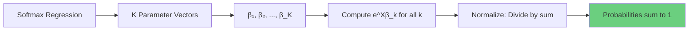

**Advantages**:
```
1. Proper probability distribution
2. Theoretically principled
3. Single unified model
4. Direct optimization
```

**Disadvantages**:
```
1. More parameters: p × K instead of p
2. Can be slower to train
3. Assumes classes are mutually exclusive
```

---

## Model Evaluation

### Classification Metrics

#### Confusion Matrix

```
                Predicted
              Pos    Neg
Actual Pos    TP     FN
       Neg    FP     TN

where:
TP: True Positives
TN: True Negatives
FP: False Positives (Type I Error)
FN: False Negatives (Type II Error)
```

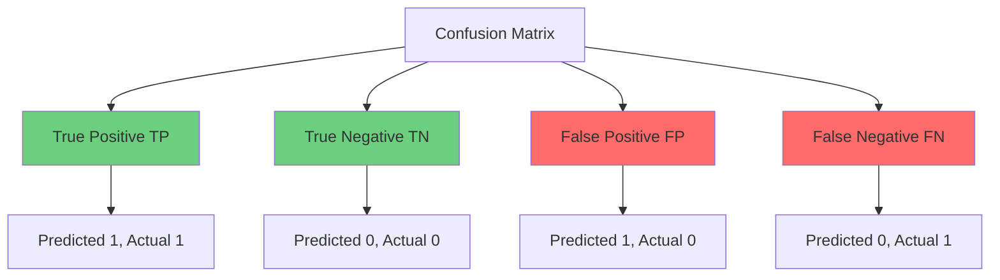

#### Accuracy

```
Accuracy = (TP + TN) / (TP + TN + FP + FN)

Proportion of correct predictions
```

**Problem**: Misleading with imbalanced classes

**Example**:
```
Dataset: 95% class 0, 5% class 1
Predict everything as 0: 95% accuracy!
But useless model (never detects positive class)
```

#### Precision

```
Precision = TP / (TP + FP)

Of predicted positives, how many are actually positive?
Also called: Positive Predictive Value (PPV)
```

**When important**:
```
- Cost of false positives is high
- Examples:
  • Spam detection (don't want to flag important emails)
  • Medical screening (avoid unnecessary procedures)
  • Legal cases (don't falsely accuse)
```

#### Recall (Sensitivity, TPR)

```
Recall = TP / (TP + FN) = TP / (All Actual Positives)

Of actual positives, how many did we catch?
Also called: Sensitivity, True Positive Rate
```

**When important**:
```
- Cost of false negatives is high
- Examples:
  • Disease detection (don't want to miss sick patients)
  • Fraud detection (catch all fraud cases)
  • Security threats (detect all intrusions)
```

#### Specificity (TNR)

```
Specificity = TN / (TN + FP) = TN / (All Actual Negatives)

Of actual negatives, how many did we correctly identify?
Also called: True Negative Rate
```

#### F1 Score

```
F1 = 2 × (Precision × Recall) / (Precision + Recall)

Harmonic mean of precision and recall
Range: [0, 1], higher is better
```

**When to use**:
```
- Need balance between precision and recall
- Imbalanced classes
- Single metric for optimization
```

**F-beta Score**:
```
F_β = (1 + β²) × (Precision × Recall) / (β² × Precision + Recall)

β > 1: Weight recall more (minimize FN)
β < 1: Weight precision more (minimize FP)
β = 1: F1 score (balanced)
β = 2: F2 score (emphasize recall)
```

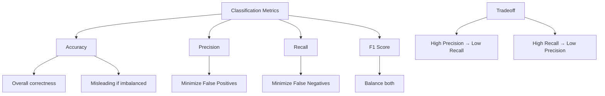

### Threshold-Based Metrics

**Default threshold**: 0.5, but not always optimal!

#### ROC Curve

**ROC** (Receiver Operating Characteristic):
```
Plot: TPR (y-axis) vs FPR (x-axis) at various thresholds

TPR = Recall = TP / (TP + FN)
FPR = FP / (FP + TN) = 1 - Specificity
```

**Interpretation**:
```
- Each point: Different classification threshold
- Top-left corner: Perfect classifier (TPR=1, FPR=0)
- Diagonal line: Random classifier
- Above diagonal: Better than random
- Below diagonal: Worse than random (flip predictions!)
```

**AUC-ROC** (Area Under Curve):
```
Range: [0, 1]
0.5: Random classifier
0.7-0.8: Acceptable
0.8-0.9: Excellent
> 0.9: Outstanding

Interpretation:
Probability that model ranks random positive instance
higher than random negative instance
```

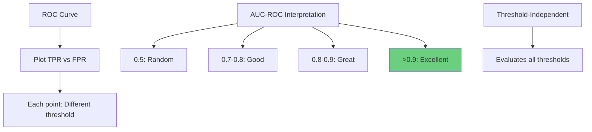

**Advantages**:
```
1. Threshold-independent
2. Works well for balanced classes
3. Widely understood and used
4. Single number summary (AUC)
```

**Disadvantages**:
```
1. Can be optimistic for imbalanced data
2. Doesn't show precision information
3. May hide poor performance on minority class
```

#### Precision-Recall Curve

**PR Curve**:
```
Plot: Precision (y-axis) vs Recall (x-axis) at various thresholds
```

**Interpretation**:
```
- Top-right corner: Perfect classifier
- Baseline: Proportion of positive class (not 0.5!)
- Better for imbalanced datasets than ROC
```

**AUC-PR**:
```
Area under Precision-Recall curve
Baseline = proportion of positives

Example:
If 5% positives, random classifier AUC-PR = 0.05
(Not 0.5 like AUC-ROC!)
```

**When to use PR over ROC**:
```
1. Highly imbalanced classes
2. Care most about positive class
3. False positives and negatives have very different costs
4. Positive class is rare (fraud, disease, etc.)
```

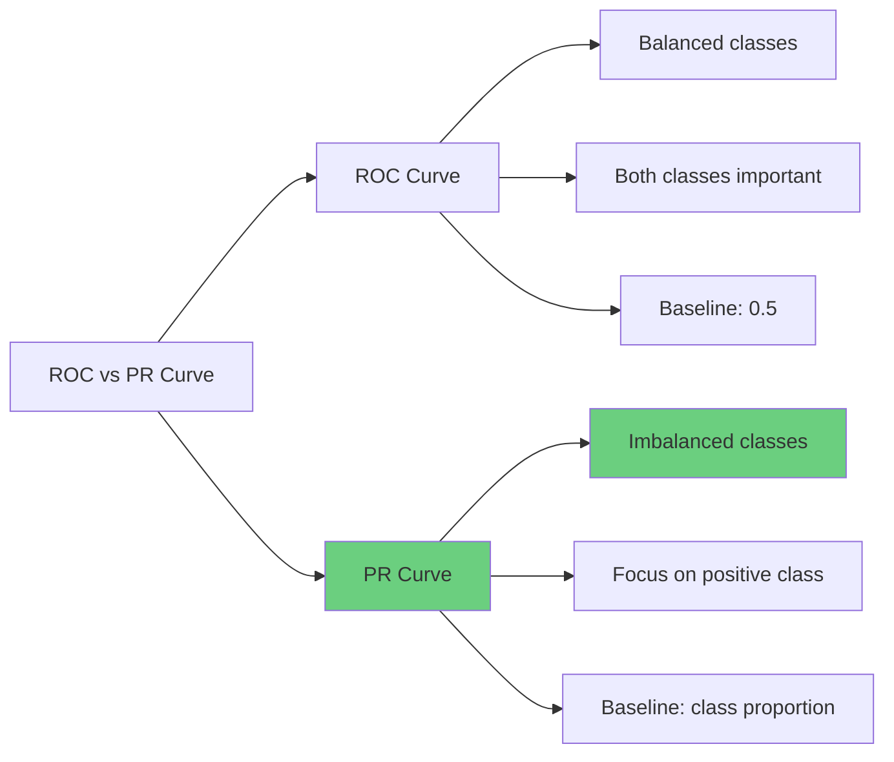

### Model Comparison

#### Log-Loss (Cross-Entropy)

```
Log-Loss = -1/n Σ[y_i log(p_i) + (1-y_i) log(1-p_i)]

Lower is better
Range: [0, ∞)
Heavily penalizes confident wrong predictions
```

**Example**:
```
True label y=1:
- Predict p=0.9: Loss = -log(0.9) = 0.105
- Predict p=0.7: Loss = -log(0.7) = 0.357
- Predict p=0.1: Loss = -log(0.1) = 2.303 (very bad!)

Proper scoring rule: Encourages calibrated probabilities
```

#### Brier Score

```
Brier = 1/n Σ(p_i - y_i)²

Mean squared error of probabilistic predictions
Range: [0, 1], lower is better
```

**Comparison**:
```
Log-Loss:
- Infinite penalty for wrong confident predictions
- Emphasizes calibration
- Proper scoring rule

Brier Score:
- Bounded penalty
- Less sensitive to extreme predictions
- Easier to interpret (like MSE)
```

#### Likelihood Ratio Test

**Compare nested models**:
```
Test statistic: G = -2(ℓ_reduced - ℓ_full)

G ~ χ²(df)
df = difference in number of parameters

Large G → Reject reduced model
Full model significantly better
```

**Example**:
```
Model 1: log(odds) = β₀ + β₁X₁
Model 2: log(odds) = β₀ + β₁X₁ + β₂X₂

ℓ₁ = -100, ℓ₂ = -85
G = -2(-100 - (-85)) = -2(-15) = 30
df = 1 (one additional parameter)

χ²(0.05, 1) = 3.84
30 > 3.84 → Reject Model 1
X₂ significantly improves model
```

#### AIC / BIC

**AIC** (Akaike Information Criterion):
```
AIC = -2ℓ + 2k

k: number of parameters
Lower AIC is better
Penalizes model complexity
```

**BIC** (Bayesian Information Criterion):
```
BIC = -2ℓ + k log(n)

n: sample size
Stronger penalty for complexity than AIC
Favors simpler models
```

**When to use**:
```
AIC:
- Prediction focus
- Accept more complex models
- Asymptotically efficient

BIC:
- Explanation focus
- Prefer simpler models
- Consistent (selects true model as n→∞)
```

---

## Regularization

### L2 Regularization (Ridge)

**Objective**:
```
minimize: -ℓ(β) + λΣβ_j²

Maximize penalized log-likelihood
λ: regularization parameter
```

**Properties**:
```
1. Shrinks coefficients toward zero
2. Handles multicollinearity
3. All features retained
4. Prevents overfitting
```

**Implementation**:
```python
from sklearn.linear_model import LogisticRegression

# C = 1/λ (inverse regularization)
model = LogisticRegression(penalty='l2', C=1.0)
```

### L1 Regularization (Lasso)

**Objective**:
```
minimize: -ℓ(β) + λΣ|β_j|
```

**Properties**:
```
1. Sets some coefficients exactly to zero
2. Automatic feature selection
3. Sparse models
4. Interpretability
```

### Elastic Net

**Objective**:
```
minimize: -ℓ(β) + λ[α Σ|β_j| + (1-α) Σβ_j²]

α: L1/L2 balance
```

**Properties**:
```
1. Combines L1 and L2
2. Groups correlated features
3. More stable than Lasso
```

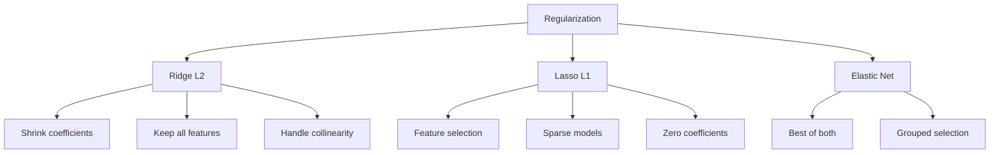

---

## Advanced Topics

### Class Imbalance

**Problem**: Minority class underrepresented

**Solutions**:

#### Resampling

```
Oversample minority class:
- Random oversampling
- SMOTE (Synthetic Minority Over-sampling)

Undersample majority class:
- Random undersampling
- Tomek links
- Near-miss

Combination approaches
```

#### Class Weights

```python
from sklearn.linear_model import LogisticRegression

# Automatically balance
model = LogisticRegression(class_weight='balanced')

# Manual weights
weights = {0: 1, 1: 10}  # 10x weight for class 1
model = LogisticRegression(class_weight=weights)
```

**Formula**:
```
weight_k = n_samples / (n_classes × n_samples_k)
```

#### Threshold Adjustment

```
Instead of threshold = 0.5:
- Lower threshold for minority class
- Increase recall at cost of precision
- Optimize for business metric
```

### Probability Calibration

**Problem**: Predicted probabilities may not match true frequencies

**Calibration Plot**:
```
- Bin predictions (e.g., 0-0.1, 0.1-0.2, ...)
- Plot mean predicted probability vs actual frequency
- Perfect calibration = diagonal line
```

#### Platt Scaling

**Method**: Fit logistic regression on top of predictions

```
Calibrated_p = σ(A × uncalibrated_p + B)

Learn A and B from validation set
```

**When to use**:
```
- Small calibration set
- Sigmoid-shaped miscalibration
- Fast and simple
```

#### Isotonic Regression

**Method**: Learn monotonic transformation

**When to use**:
```
- Larger calibration set (>1000 points)
- Non-parametric (more flexible)
- Any monotonic miscalibration
```

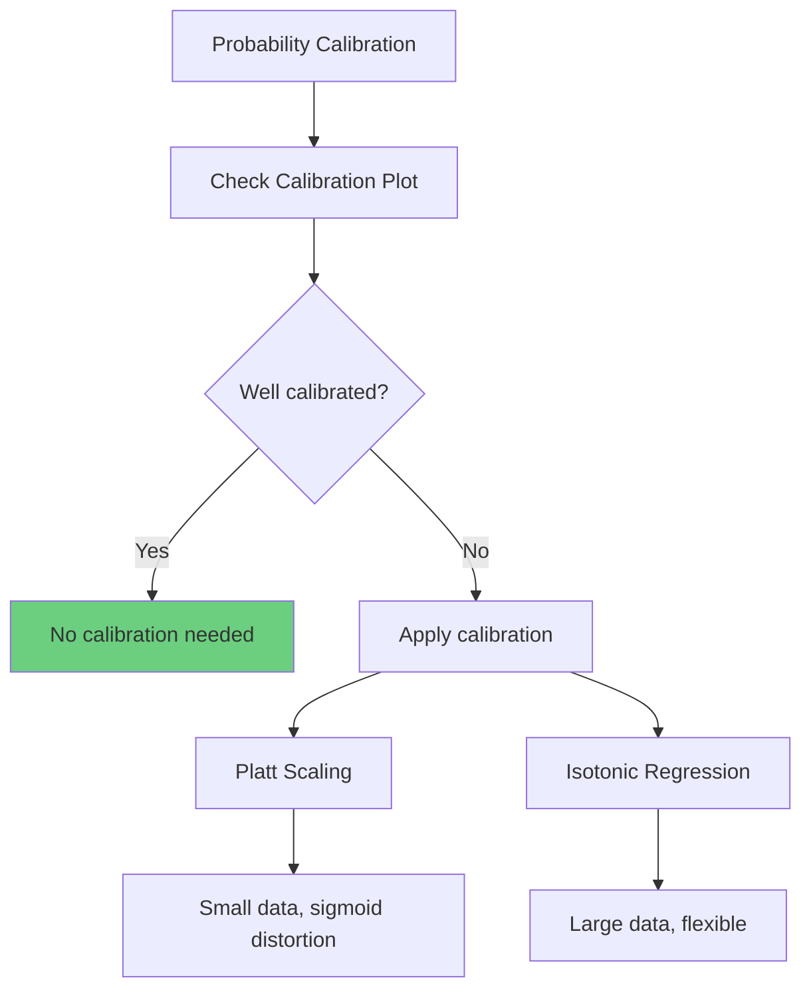

### Handling Non-linearity

**Polynomial Features**:
```python
from sklearn.preprocessing import PolynomialFeatures

poly = PolynomialFeatures(degree=2, include_bias=False)
X_poly = poly.fit_transform(X)
```

**Interaction Terms**:
```
Include X₁ × X₂ terms
Model effect of one feature depending on another
```

**Non-linear Decision Boundaries**:
```
Polynomial logistic regression can create:
- Curves
- Circles
- Complex shapes
```

---

## Practical Implementation

### Complete Example

```python
import numpy as np
import pandas as pd
import matplotlib.pyplot as plt
import seaborn as sns
from sklearn.model_selection import train_test_split, cross_val_score, GridSearchCV
from sklearn.linear_model import LogisticRegression
from sklearn.preprocessing import StandardScaler
from sklearn.metrics import (
    confusion_matrix, classification_report,
    roc_curve, roc_auc_score, precision_recall_curve,
    accuracy_score, precision_score, recall_score, f1_score,
    log_loss, brier_score_loss
)
import warnings
warnings.filterwarnings('ignore')

# Generate synthetic data
np.random.seed(42)
n = 1000

# Class 0: centered at (-2, -2)
X0 = np.random.randn(n//2, 2) + np.array([-2, -2])
y0 = np.zeros(n//2)

# Class 1: centered at (2, 2)
X1 = np.random.randn(n//2, 2) + np.array([2, 2])
y1 = np.ones(n//2)

X = np.vstack([X0, X1])
y = np.hstack([y0, y1])

# Create DataFrame
df = pd.DataFrame(X, columns=['X1', 'X2'])
df['y'] = y

print("="*60)
print("EXPLORATORY DATA ANALYSIS")
print("="*60)
print(f"\nDataset shape: {df.shape}")
print(f"\nClass distribution:")
print(df['y'].value_counts())
print(f"\nClass proportions:")
print(df['y'].value_counts(normalize=True))

# Visualize data
plt.figure(figsize=(8, 6))
plt.scatter(X0[:, 0], X0[:, 1], alpha=0.5, label='Class 0', c='blue')
plt.scatter(X1[:, 0], X1[:, 1], alpha=0.5, label='Class 1', c='red')
plt.xlabel('X1')
plt.ylabel('X2')
plt.title('Data Distribution')
plt.legend()
plt.grid(True)
plt.savefig('data_distribution.png')
plt.close()

# Split data
X_train, X_test, y_train, y_test = train_test_split(
    X, y, test_size=0.2, random_state=42, stratify=y
)

# Scale features
scaler = StandardScaler()
X_train_scaled = scaler.fit_transform(X_train)
X_test_scaled = scaler.transform(X_test)

print("\n" + "="*60)
print("MODEL TRAINING")
print("="*60)

# Train basic model
model = LogisticRegression(random_state=42, max_iter=1000)
model.fit(X_train_scaled, y_train)

print("\nModel Coefficients:")
print(f"β₀ (Intercept): {model.intercept_[0]:.4f}")
print(f"β₁ (X1): {model.coef_[0][0]:.4f}")
print(f"β₂ (X2): {model.coef_[0][1]:.4f}")

# Odds ratios
print("\nOdds Ratios:")
print(f"OR (X1): {np.exp(model.coef_[0][0]):.4f}")
print(f"OR (X2): {np.exp(model.coef_[0][1]):.4f}")

# Predictions
y_pred = model.predict(X_test_scaled)
y_pred_proba = model.predict_proba(X_test_scaled)[:, 1]

print("\n" + "="*60)
print("MODEL EVALUATION")
print("="*60)

# Confusion Matrix
cm = confusion_matrix(y_test, y_pred)
print("\nConfusion Matrix:")
print(cm)

# Detailed metrics
print("\nClassification Report:")
print(classification_report(y_test, y_pred, target_names=['Class 0', 'Class 1']))

# Individual metrics
accuracy = accuracy_score(y_test, y_pred)
precision = precision_score(y_test, y_pred)
recall = recall_score(y_test, y_pred)
f1 = f1_score(y_test, y_pred)
auc_roc = roc_auc_score(y_test, y_pred_proba)
logloss = log_loss(y_test, y_pred_proba)
brier = brier_score_loss(y_test, y_pred_proba)

print("\nDetailed Metrics:")
print(f"Accuracy:  {accuracy:.4f}")
print(f"Precision: {precision:.4f}")
print(f"Recall:    {recall:.4f}")
print(f"F1 Score:  {f1:.4f}")
print(f"AUC-ROC:   {auc_roc:.4f}")
print(f"Log Loss:  {logloss:.4f}")
print(f"Brier Score: {brier:.4f}")

# ROC Curve
fpr, tpr, thresholds_roc = roc_curve(y_test, y_pred_proba)

# Precision-Recall Curve
precision_vals, recall_vals, thresholds_pr = precision_recall_curve(y_test, y_pred_proba)

# Plotting
fig, axes = plt.subplots(2, 2, figsize=(14, 12))

# Decision boundary
ax = axes[0, 0]
xx, yy = np.meshgrid(
    np.linspace(X_train_scaled[:, 0].min()-1, X_train_scaled[:, 0].max()+1, 100),
    np.linspace(X_train_scaled[:, 1].min()-1, X_train_scaled[:, 1].max()+1, 100)
)
Z = model.predict(np.c_[xx.ravel(), yy.ravel()])
Z = Z.reshape(xx.shape)
ax.contourf(xx, yy, Z, alpha=0.3, cmap='RdYlBu')
ax.scatter(X_train_scaled[y_train==0, 0], X_train_scaled[y_train==0, 1],
           alpha=0.5, label='Class 0', c='blue', edgecolors='k')
ax.scatter(X_train_scaled[y_train==1, 0], X_train_scaled[y_train==1, 1],
           alpha=0.5, label='Class 1', c='red', edgecolors='k')
ax.set_xlabel('X1 (scaled)')
ax.set_ylabel('X2 (scaled)')
ax.set_title('Decision Boundary')
ax.legend()

# ROC Curve
ax = axes[0, 1]
ax.plot(fpr, tpr, label=f'ROC Curve (AUC = {auc_roc:.4f})')
ax.plot([0, 1], [0, 1], 'k--', label='Random Classifier')
ax.set_xlabel('False Positive Rate')
ax.set_ylabel('True Positive Rate')
ax.set_title('ROC Curve')
ax.legend()
ax.grid(True)

# Precision-Recall Curve
ax = axes[1, 0]
ax.plot(recall_vals, precision_vals, label='PR Curve')
ax.set_xlabel('Recall')
ax.set_ylabel('Precision')
ax.set_title('Precision-Recall Curve')
ax.legend()
ax.grid(True)

# Probability distribution
ax = axes[1, 1]
ax.hist(y_pred_proba[y_test==0], bins=30, alpha=0.5, label='Class 0', color='blue')
ax.hist(y_pred_proba[y_test==1], bins=30, alpha=0.5, label='Class 1', color='red')
ax.axvline(0.5, color='black', linestyle='--', label='Threshold')
ax.set_xlabel('Predicted Probability')
ax.set_ylabel('Frequency')
ax.set_title('Predicted Probability Distribution')
ax.legend()

plt.tight_layout()
plt.savefig('evaluation_plots.png')
plt.close()

print("\n" + "="*60)
print("CROSS-VALIDATION")
print("="*60)

cv_scores = cross_val_score(model, X_train_scaled, y_train,
                             cv=5, scoring='roc_auc')
print(f"\n5-Fold CV AUC-ROC: {cv_scores.mean():.4f} (+/- {cv_scores.std():.4f})")

print("\n" + "="*60)
print("HYPERPARAMETER TUNING")
print("="*60)

param_grid = {
    'C': [0.001, 0.01, 0.1, 1, 10, 100],
    'penalty': ['l1', 'l2'],
    'solver': ['liblinear']
}

grid_search = GridSearchCV(
    LogisticRegression(random_state=42, max_iter=1000),
    param_grid, cv=5, scoring='roc_auc', n_jobs=-1
)
grid_search.fit(X_train_scaled, y_train)

print(f"\nBest parameters: {grid_search.best_params_}")
print(f"Best CV AUC-ROC: {grid_search.best_score_:.4f}")

# Evaluate best model
best_model = grid_search.best_estimator_
y_pred_best = best_model.predict(X_test_scaled)
y_pred_proba_best = best_model.predict_proba(X_test_scaled)[:, 1]

print(f"\nTest AUC-ROC (best model): {roc_auc_score(y_test, y_pred_proba_best):.4f}")
print(f"Test F1 Score (best model): {f1_score(y_test, y_pred_best):.4f}")

print("\n" + "="*60)
print("PREDICTION EXAMPLE")
print("="*60)

# New observation
new_data = np.array([[0, 0]])
new_data_scaled = scaler.transform(new_data)
prob = model.predict_proba(new_data_scaled)[0]

print(f"\nInput: X1=0, X2=0")
print(f"P(Class 0): {prob[0]:.4f}")
print(f"P(Class 1): {prob[1]:.4f}")
print(f"Predicted Class: {model.predict(new_data_scaled)[0]}")

print("\nAnalysis complete!")
```

### Implementation from Scratch

```python
class LogisticRegressionScratch:
    """Logistic Regression from scratch using Gradient Descent"""

    def __init__(self, learning_rate=0.01, n_iterations=1000, fit_intercept=True):
        self.lr = learning_rate
        self.n_iter = n_iterations
        self.fit_intercept = fit_intercept
        self.coefficients = None
        self.intercept = None
        self.losses = []

    def sigmoid(self, z):
        """Sigmoid function"""
        return 1 / (1 + np.exp(-np.clip(z, -500, 500)))

    def fit(self, X, y):
        """Fit using Gradient Descent"""
        n_samples, n_features = X.shape

        # Initialize parameters
        self.coefficients = np.zeros(n_features)
        if self.fit_intercept:
            self.intercept = 0

        # Gradient descent
        for i in range(self.n_iter):
            # Linear combination
            if self.fit_intercept:
                z = X @ self.coefficients + self.intercept
            else:
                z = X @ self.coefficients

            # Predictions
            y_pred = self.sigmoid(z)

            # Loss (binary cross-entropy)
            loss = -np.mean(y * np.log(y_pred + 1e-15) +
                           (1 - y) * np.log(1 - y_pred + 1e-15))
            self.losses.append(loss)

            # Gradients
            dw = (1/n_samples) * X.T @ (y_pred - y)
            if self.fit_intercept:
                db = (1/n_samples) * np.sum(y_pred - y)

            # Update parameters
            self.coefficients -= self.lr * dw
            if self.fit_intercept:
                self.intercept -= self.lr * db

        return self

    def predict_proba(self, X):
        """Predict probabilities"""
        if self.fit_intercept:
            z = X @ self.coefficients + self.intercept
        else:
            z = X @ self.coefficients
        return self.sigmoid(z)

    def predict(self, X, threshold=0.5):
        """Predict class labels"""
        return (self.predict_proba(X) >= threshold).astype(int)


# Test implementation
model_scratch = LogisticRegressionScratch(learning_rate=0.1, n_iterations=1000)
model_scratch.fit(X_train_scaled, y_train)

print("\nCoefficients (Scratch):", model_scratch.coefficients)
print("Intercept (Scratch):", model_scratch.intercept)

y_pred_scratch = model_scratch.predict(X_test_scaled)
y_proba_scratch = model_scratch.predict_proba(X_test_scaled)

print(f"Accuracy (Scratch): {accuracy_score(y_test, y_pred_scratch):.4f}")
print(f"AUC-ROC (Scratch): {roc_auc_score(y_test, y_proba_scratch):.4f}")

# Plot loss curve
plt.figure(figsize=(10, 6))
plt.plot(model_scratch.losses)
plt.xlabel('Iteration')
plt.ylabel('Loss (Binary Cross-Entropy)')
plt.title('Training Loss Over Time')
plt.grid(True)
plt.savefig('loss_curve.png')
plt.close()
```

---

## Interview Questions

**Q1: Why can't we use linear regression for classification?**

A: Three main problems:

1. **Predictions outside [0,1]**: Linear regression can predict negative values or values > 1, which don't make sense as probabilities

2. **Violated assumptions**: Binary outcomes violate key assumptions:
   - Non-constant variance: Var(Y) = p(1-p), depends on X
   - Non-normal residuals: Y is binary, not continuous

3. **Inappropriate error metric**: MSE treats distance from 0.3 to 0.5 same as 0.9 to 1.1, but latter is impossible for probabilities

4. **Sensitivity to outliers**: Extreme values can drastically affect line

**Logistic regression solves these** by:
- Using sigmoid function to constrain output to (0,1)
- Using binomial likelihood appropriate for binary data
- Using cross-entropy loss designed for probabilities

**Q2: Interpret a logistic regression coefficient. What's an odds ratio?**

A: **Coefficient β_j**: Change in log-odds for one-unit increase in X_j

**Odds Ratio (OR)**: e^β_j
- Multiplicative effect on odds
- More interpretable than log-odds

**Examples**:
```
β = 0.5:
  OR = e^0.5 = 1.65
  One-unit increase in X → 65% increase in odds
  (Odds multiplied by 1.65)

β = -0.5:
  OR = e^(-0.5) = 0.61
  One-unit increase in X → 39% decrease in odds
  (Odds multiplied by 0.61)

β = 0:
  OR = 1
  No effect on odds
```

**Important**: This is effect on **odds**, not probability!
- Probability effect depends on baseline probability
- Maximum effect at p=0.5
- Smaller effect near 0 or 1

**Q3: What is Maximum Likelihood Estimation and why use it?**

A: **MLE**: Find parameters that maximize probability of observing the data

**Process**:
1. Write likelihood: L(β) = ∏ P(y_i|x_i, β)
2. Take log: ℓ(β) = Σ log P(y_i|x_i, β)
3. Maximize ℓ(β) using optimization (no closed form!)

**Why MLE**:
1. **Principled**: Based on probability theory
2. **Consistent**: Converges to true value as n→∞
3. **Asymptotically efficient**: Lowest variance among consistent estimators
4. **Asymptotically normal**: Can construct confidence intervals
5. **Equivalent to minimizing cross-entropy**: Machine learning perspective

**Connection to cross-entropy**:
```
Minimizing -ℓ(β)/n ⟺ Minimizing binary cross-entropy
Maximizing likelihood ⟺ Minimizing loss
```

**Q4: Explain ROC curve and AUC. When is it inappropriate?**

A: **ROC Curve**: Plot of TPR (sensitivity) vs FPR (1-specificity) at all classification thresholds

**AUC-ROC**: Area under ROC curve
- Probability that model ranks random positive higher than random negative
- Threshold-independent evaluation
- 0.5 = random, 1.0 = perfect

**Advantages**:
- Single number summary
- Threshold-independent
- Widely understood
- Good for balanced classes

**When inappropriate**:
1. **Imbalanced classes**: Can be overly optimistic
   - FPR denominator includes many negatives
   - Can have high AUC with poor precision on minority class

2. **Different costs for FP vs FN**: AUC treats them equally

3. **Need calibrated probabilities**: AUC only evaluates ranking, not calibration

**Solution for imbalanced**: Use Precision-Recall curve and AUC-PR instead
- Focuses on positive class
- Baseline = proportion of positives (not 0.5)
- More informative for rare events

**Q5: How do you handle imbalanced classes in logistic regression?**

A: Multiple strategies:

**1. Resampling**:
```
Oversample minority:
- Random oversampling
- SMOTE (synthetic examples)

Undersample majority:
- Random undersampling
- Informed methods (Tomek links)
```

**2. Class Weights**:
```python
model = LogisticRegression(class_weight='balanced')

# Weight for class k = n_samples / (n_classes × n_samples_k)
```

**3. Threshold Adjustment**:
```
- Default: threshold = 0.5
- Lower threshold to increase recall of minority class
- Optimize threshold based on business cost
```

**4. Different Evaluation Metrics**:
```
- Don't use accuracy!
- Use: F1, Precision, Recall, AUC-PR
- Focus on minority class performance
```

**5. Ensemble Methods**:
```
- Balanced random forest
- Boosting (XGBoost with scale_pos_weight)
```

**6. Anomaly Detection** (extreme imbalance):
```
- If <1% positive, treat as anomaly detection
- One-class SVM, Isolation Forest
```

**Trade-offs**:
- Oversampling: Risk of overfitting
- Undersampling: Loss of information
- Class weights: Built-in, no data change needed
- Threshold: Post-hoc, requires calibrated probabilities

---

## Summary

### Key Concepts

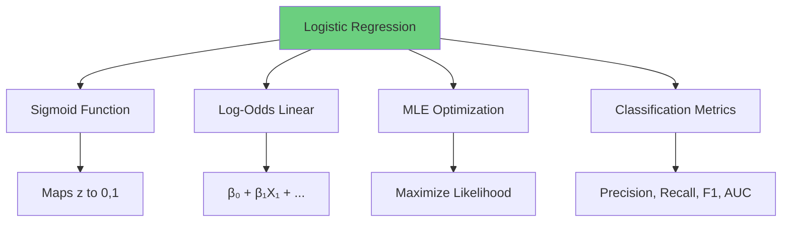

### Must-Remember Formulas

**Sigmoid**: σ(z) = 1/(1 + e^(-z))

**Model**: P(Y=1|X) = σ(X'β)

**Log-odds**: log(p/(1-p)) = X'β

**Odds Ratio**: OR = e^β

**Binary Cross-Entropy**: -Σ[y log(p) + (1-y) log(1-p)]

### Decision Guide

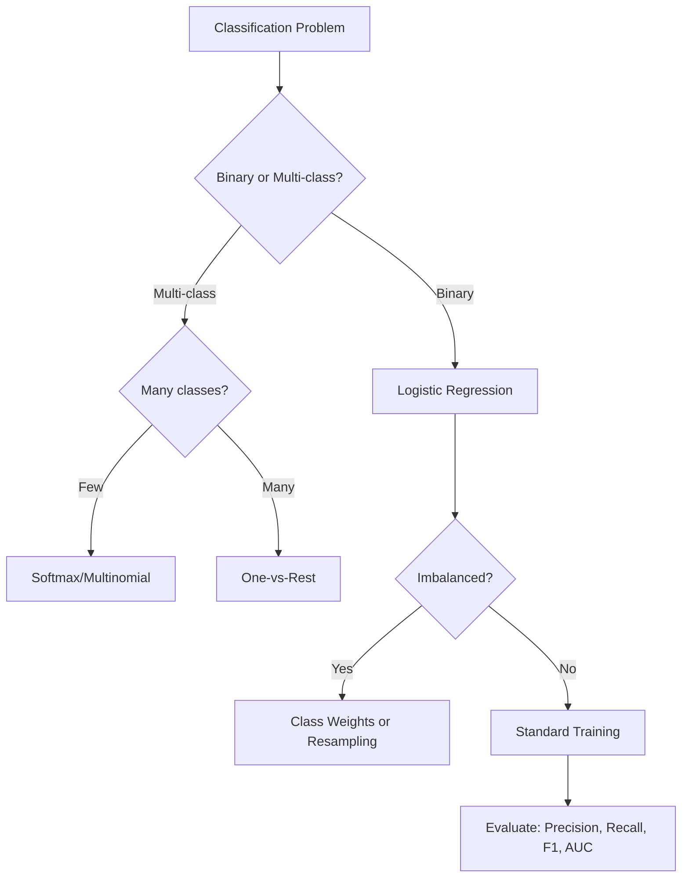

### Comparison with Linear Regression

| Aspect | Linear Regression | Logistic Regression |
|--------|------------------|---------------------|
| Output | Continuous | Probability (0-1) |
| Use Case | Regression | Classification |
| Function | Identity | Sigmoid |
| Loss | MSE | Cross-Entropy |
| Optimization | Closed-form | Iterative (GD, Newton) |
| Assumptions | Normality of errors | None on Y distribution |
| Interpretation | Direct effect on Y | Effect on log-odds |

---

**Document Created**: 2025
**Target Audience**: Zero to Architect level
**Prerequisites**: Statistics, Probability, Linear Regression
**Next Steps**: Advanced ML (Trees, Neural Networks, Ensemble Methods)

