# Neural Networks Fundamentals: Zero to Architect

## Table of Contents
1. [Introduction](#introduction)
2. [The Perceptron: Building Block](#the-perceptron-building-block)
3. [Activation Functions](#activation-functions)
4. [Feedforward Neural Networks](#feedforward-neural-networks)
5. [Network Architecture Design](#network-architecture-design)
6. [Loss Functions](#loss-functions)
7. [PyTorch Implementation Basics](#pytorch-implementation-basics)
8. [Interview Questions](#interview-questions)

---

## Introduction

### What are Neural Networks?

**Neural Networks** are computational models inspired by biological neural systems in the brain. They consist of interconnected nodes (neurons) that process information through weighted connections.

**Key Characteristics**:
- Learn patterns from data
- Non-linear function approximators
- Hierarchical feature learning
- Universal function approximators (with enough neurons/layers)

### Historical Context

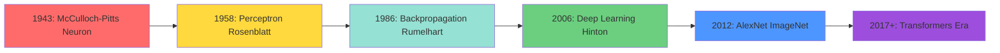

### Learning Roadmap

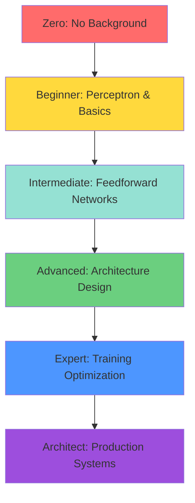

---

## The Perceptron: Building Block

### Biological Inspiration

**Biological Neuron**:
```
Dendrites → Cell Body → Axon → Synapses
(Inputs)   (Processing) (Output) (Connections)
```

**Artificial Neuron (Perceptron)**:
```
Inputs × Weights → Weighted Sum + Bias → Activation → Output
```

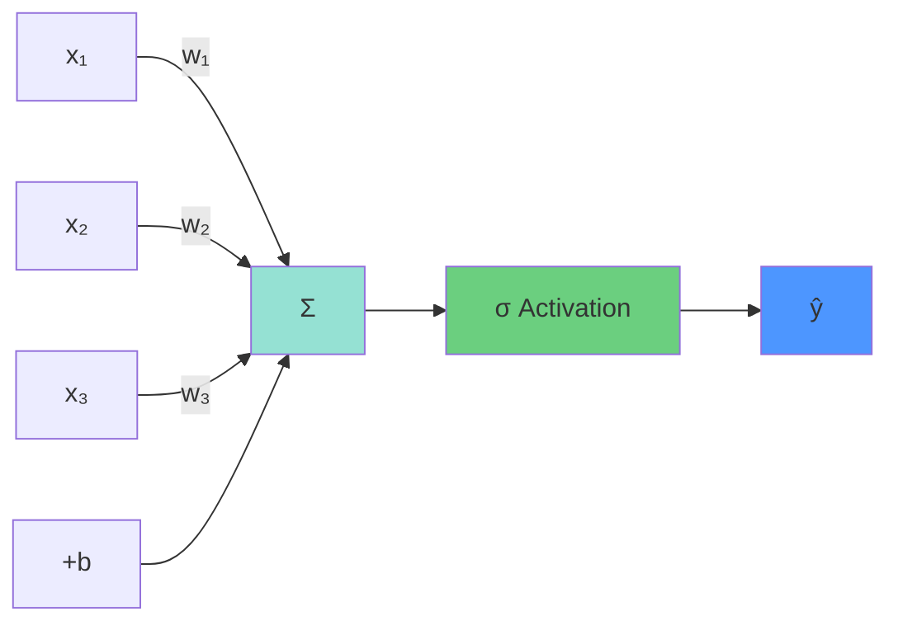

### Mathematical Formulation

**Weighted Sum**:
```
z = Σ(w_i × x_i) + b
  = w₁x₁ + w₂x₂ + ... + w_nx_n + b
```

**With Matrix Notation**:
```
z = w^T x + b

where:
w = [w₁, w₂, ..., w_n]^T  (weight vector)
x = [x₁, x₂, ..., x_n]^T  (input vector)
b = bias (scalar)
```

**Output**:
```
ŷ = σ(z)

where σ is the activation function
```

### Components Explained

**Inputs (x)**:
- Features from data
- Can be raw features or outputs from previous layer
- Typically normalized or standardized

**Weights (w)**:
- **Learnable parameters**
- Control importance of each input
- Updated during training to minimize error
- Initialize randomly (not zero!)

**Bias (b)**:
- **Learnable parameter**
- Shifts the activation function
- Allows model to fit data not passing through origin
- Like intercept in linear regression

**Activation Function (σ)**:
- Introduces non-linearity
- Determines output range
- Different functions for different purposes

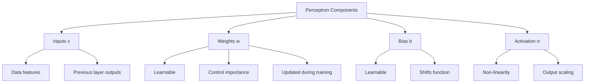

### Example: Simple Perceptron

**Problem**: Binary classification (spam email detection)

**Features**:
```
x₁ = number of exclamation marks
x₂ = number of capital letters
x₃ = contains word "free"
```

**Computation**:
```
z = w₁x₁ + w₂x₂ + w₃x₃ + b
  = 0.5(3) + 0.3(50) + 0.8(1) + (-2)
  = 1.5 + 15 + 0.8 - 2
  = 15.3

ŷ = sigmoid(15.3) = 0.9999... ≈ 1

Prediction: Spam!
```

---

## Activation Functions

### Why Activation Functions?

**Without activation functions**:
```
Layer 1: z₁ = W₁x + b₁
Layer 2: z₂ = W₂z₁ + b₂
       = W₂(W₁x + b₁) + b₂
       = (W₂W₁)x + (W₂b₁ + b₂)
       = W_combined × x + b_combined

Multiple layers → still just linear function!
```

**With activation**:
- Introduces non-linearity
- Allows modeling complex patterns
- Enables deep learning

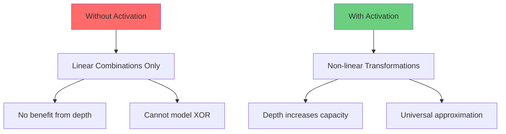

### Sigmoid Function

**Formula**:
```
σ(z) = 1 / (1 + e^(-z))
```

**Properties**:
```
Range: (0, 1)
Output interpretable as probability
Smooth gradient
```

**Derivative**:
```
σ'(z) = σ(z) × (1 - σ(z))
```

**Advantages**:
- Smooth, differentiable
- Output in probability range
- Historically important

**Disadvantages**:
- **Vanishing gradient problem**
  - For |z| > 4, gradient ≈ 0
  - Slows learning in deep networks
- Not zero-centered
  - Outputs always positive
  - Can cause zig-zagging in optimization
- Computationally expensive (exponential)

**Use Cases**:
- Binary classification output layer
- Gates in LSTM/GRU
- Legacy systems

**Example**:
```
z = -5 → σ(-5) = 0.0067
z = 0  → σ(0) = 0.5
z = 5  → σ(5) = 0.9933
```

### Tanh (Hyperbolic Tangent)

**Formula**:
```
tanh(z) = (e^z - e^(-z)) / (e^z + e^(-z))
        = 2σ(2z) - 1
```

**Properties**:
```
Range: (-1, 1)
Zero-centered (unlike sigmoid)
Steeper gradient than sigmoid
```

**Derivative**:
```
tanh'(z) = 1 - tanh²(z)
```

**Advantages**:
- Zero-centered output
  - Better gradient flow
  - Faster convergence
- Stronger gradients than sigmoid
- Good for normalized data

**Disadvantages**:
- Still suffers from vanishing gradients
  - For |z| > 3, gradient ≈ 0
- Computationally expensive

**Use Cases**:
- Hidden layers in RNNs
- When inputs are normalized around zero
- Traditional deep networks (pre-ReLU era)

### ReLU (Rectified Linear Unit)

**Formula**:
```
ReLU(z) = max(0, z)
        = z if z > 0
        = 0 if z ≤ 0
```

**Derivative**:
```
ReLU'(z) = 1 if z > 0
         = 0 if z ≤ 0
         = undefined at z = 0 (use 0 or 1 in practice)
```

**Advantages**:
- **Solves vanishing gradient** (for positive z)
- Computationally efficient
  - Simple threshold operation
  - Much faster than sigmoid/tanh
- Sparse activation
  - Only ~50% of neurons active
  - Computational efficiency
  - Network interpretability
- Empirically works very well

**Disadvantages**:
- **Dying ReLU problem**
  - Neurons can get stuck outputting 0
  - Gradient is always 0 for z < 0
  - Never recover during training
  - Can happen with:
    - Large learning rates
    - Bad initialization
    - Large negative bias updates

- Not zero-centered
- Unbounded output (can explode)

**Use Cases**:
- **Default choice for hidden layers**
- Convolutional Neural Networks (CNNs)
- Most modern architectures

**Example**:
```
z = -5 → ReLU(-5) = 0
z = 0  → ReLU(0) = 0
z = 5  → ReLU(5) = 5
```

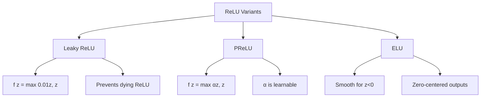

### Leaky ReLU

**Formula**:
```
LeakyReLU(z) = max(αz, z)

where α = 0.01 (typical)
```

**Advantages**:
- Prevents dying ReLU
- Small gradient for z < 0
- Still computationally efficient

### Softmax Function

**Formula** (for K classes):
```
softmax(z_i) = e^(z_i) / Σ(e^(z_j)) for j=1 to K
```

**Properties**:
```
Output: Probability distribution
Range: (0, 1) for each output
Constraint: Σ softmax(z_i) = 1
```

**Use Cases**:
- **Multi-class classification output layer**
- Attention mechanisms
- Whenever need probability distribution

**Example**:
```
Logits: z = [2.0, 1.0, 0.1]

e^z = [7.39, 2.72, 1.11]
Sum = 11.22

Probabilities:
softmax(z) = [0.659, 0.242, 0.099]

Prediction: Class 0 (65.9% confident)
```

### Activation Function Comparison

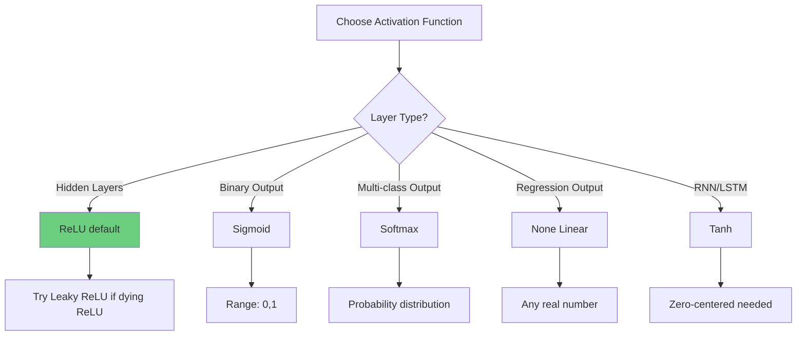

### Summary Table

| Function | Range | Advantages | Disadvantages | Use Case |
|----------|-------|------------|---------------|----------|
| Sigmoid | (0,1) | Probability output | Vanishing gradient, not zero-centered | Binary classification output |
| Tanh | (-1,1) | Zero-centered | Vanishing gradient | RNN hidden layers |
| ReLU | [0,∞) | Fast, no vanishing gradient | Dying ReLU, not zero-centered | Hidden layers (default) |
| Leaky ReLU | (-∞,∞) | Prevents dying ReLU | Small gradient for negative | Hidden layers |
| Softmax | (0,1) | Probability distribution | Expensive computation | Multi-class output |

---

## Feedforward Neural Networks

### Architecture Overview

**Feedforward Neural Network** (FNN): Information flows in one direction only (input → hidden → output)

**Structure**:
```
Input Layer → Hidden Layer(s) → Output Layer
```

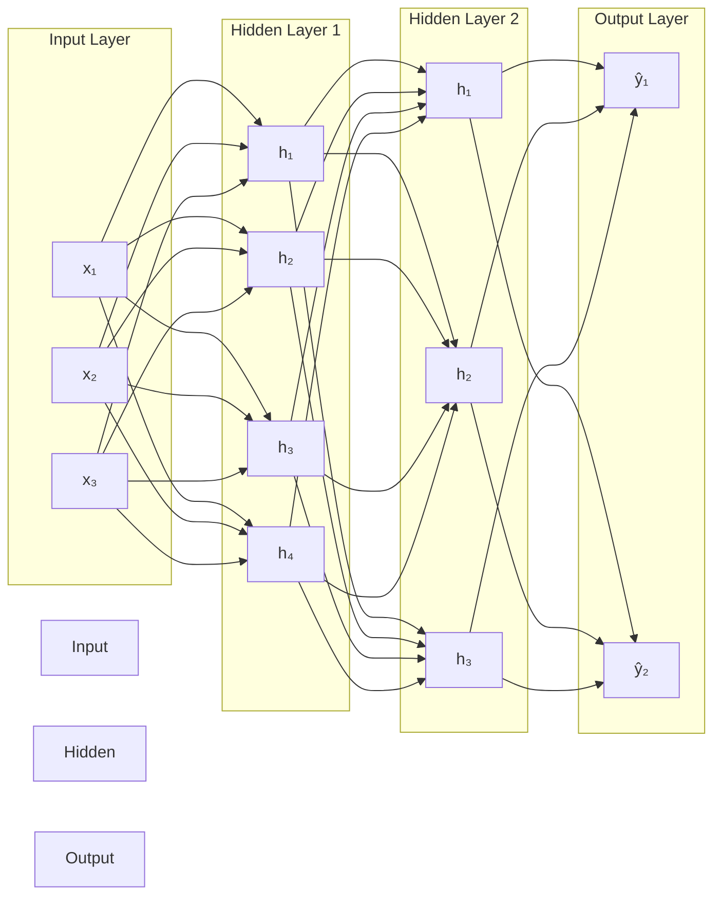

### Layer Types

**Input Layer**:
- Number of neurons = number of features
- No computation (just passes data forward)
- No learnable parameters
- Example: 28×28 image = 784 input neurons

**Hidden Layers**:
- Extract features at different levels of abstraction
- Number of layers = **depth**
- Number of neurons per layer = **width**
- Each neuron:
  ```
  h = σ(W^T x + b)
  ```

**Output Layer**:
- Number of neurons depends on task:
  - Binary classification: 1 neuron (sigmoid)
  - Multi-class (K classes): K neurons (softmax)
  - Regression: 1 or more neurons (linear)

### Mathematical Forward Pass

**Layer l computation**:
```
z^[l] = W^[l] a^[l-1] + b^[l]
a^[l] = σ^[l](z^[l])

where:
a^[l-1] = activations from previous layer (or input if l=1)
W^[l] = weight matrix for layer l
b^[l] = bias vector for layer l
σ^[l] = activation function for layer l
z^[l] = pre-activation (weighted sum)
a^[l] = post-activation (output)
```

**Dimensions**:
```
If layer l-1 has n^[l-1] neurons and layer l has n^[l] neurons:

W^[l]: (n^[l] × n^[l-1])
b^[l]: (n^[l] × 1)
z^[l]: (n^[l] × 1)
a^[l]: (n^[l] × 1)
```

### Complete Forward Pass Example

**Network**: 3 inputs → 4 hidden → 2 outputs

**Given**:
```
Input: x = [1, 2, 3]^T

Layer 1 (hidden):
W^[1] = 4×3 matrix (randomly initialized)
b^[1] = 4×1 vector (zeros)
σ^[1] = ReLU

Layer 2 (output):
W^[2] = 2×4 matrix (randomly initialized)
b^[2] = 2×1 vector (zeros)
σ^[2] = Softmax
```

**Computation**:
```
Step 1: Layer 1 pre-activation
z^[1] = W^[1] x + b^[1]  (4×1 vector)

Step 2: Layer 1 activation
a^[1] = ReLU(z^[1])  (4×1 vector)

Step 3: Layer 2 pre-activation
z^[2] = W^[2] a^[1] + b^[2]  (2×1 vector)

Step 4: Layer 2 activation (output)
a^[2] = Softmax(z^[2])  (2×1 vector)

Final output: [p₀, p₁]^T where p₀ + p₁ = 1
```

### Universal Approximation Theorem

**Theorem**: A feedforward neural network with:
- At least one hidden layer
- Sufficient number of neurons
- Non-linear activation function

Can approximate **any continuous function** to arbitrary precision.

**Implications**:
- Theoretical guarantee of expressiveness
- In practice: need enough neurons and proper training
- Depth vs Width tradeoff:
  - Deep networks (many layers): More efficient, hierarchical features
  - Wide networks (many neurons): Require exponentially more neurons

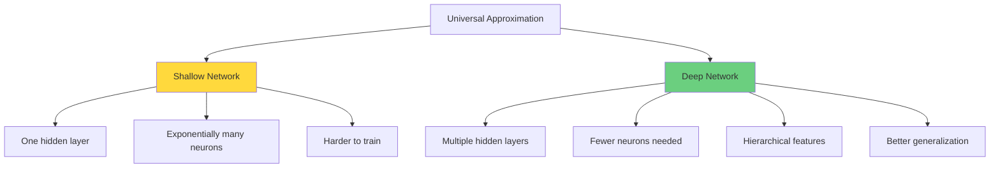

---

## Network Architecture Design

### Depth: Number of Layers

**Shallow Networks** (1-2 hidden layers):
```
Advantages:
- Faster training
- Less overfitting risk
- Easier to debug

Disadvantages:
- Limited feature learning
- Need many neurons
- Poor for complex tasks
```

**Deep Networks** (3+ hidden layers):
```
Advantages:
- Hierarchical feature learning
- More efficient representation
- Better for complex patterns
- State-of-the-art performance

Disadvantages:
- Harder to train
- Overfitting risk
- Computational cost
- Vanishing gradients
```

**Hierarchical Feature Learning**:
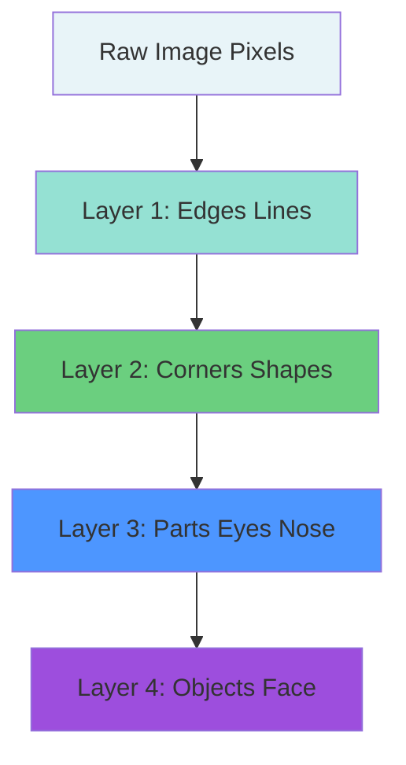

### Width: Neurons per Layer

**Narrow Layers** (few neurons):
```
Advantages:
- Less computation
- Fewer parameters
- Faster training

Disadvantages:
- Limited capacity
- May underfit
- Information bottleneck
```

**Wide Layers** (many neurons):
```
Advantages:
- High capacity
- Can learn complex patterns
- Less information loss

Disadvantages:
- Overfitting risk
- Computational cost
- Many parameters to tune
```

**Common Patterns**:
```
1. Decreasing width:
   Input: 784 → 512 → 256 → 128 → 10
   (Compresses information)

2. Constant width:
   Input: 100 → 64 → 64 → 64 → 10
   (ResNet style)

3. Increasing then decreasing:
   Input: 100 → 256 → 512 → 256 → 10
   (Bottleneck then expand)
```

### Architecture Design Guidelines

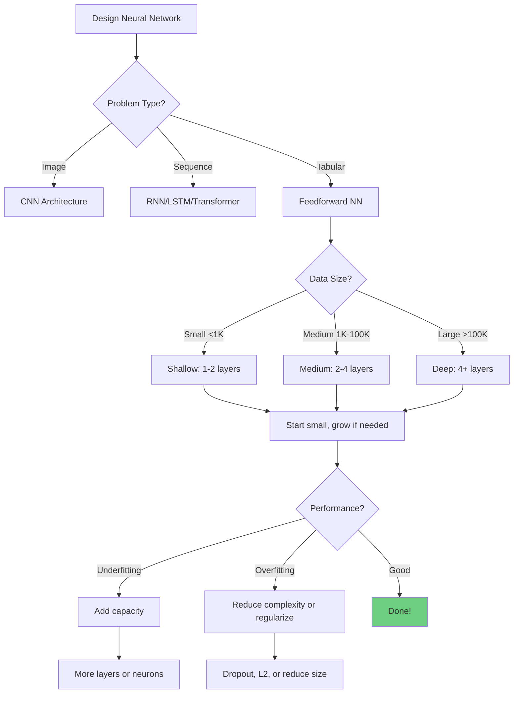

**Practical Recommendations**:

**Starting Point**:
```
1. Begin with 2-3 hidden layers
2. 64-128 neurons per layer
3. ReLU activation for hidden layers
4. Appropriate output layer for task
```

**Iterative Refinement**:
```
If underfitting (train error high):
- Add more layers (depth)
- Add more neurons (width)
- Train longer
- Check learning rate

If overfitting (large train-val gap):
- Add dropout
- Add L2 regularization
- Get more data
- Reduce model size
- Data augmentation
```

### Common Architectures

**Classification (MNIST digits)**:
```
Input (784) → Dense(128, ReLU) → Dropout(0.2)
→ Dense(64, ReLU) → Dropout(0.2) → Dense(10, Softmax)

Parameters:
- Input→H1: 784 × 128 + 128 = 100,480
- H1→H2: 128 × 64 + 64 = 8,256
- H2→Output: 64 × 10 + 10 = 650
Total: ~109K parameters
```

**Regression (Housing prices)**:
```
Input (13) → Dense(64, ReLU) → Dense(32, ReLU)
→ Dense(16, ReLU) → Dense(1, Linear)

Parameters:
- Input→H1: 13 × 64 + 64 = 896
- H1→H2: 64 × 32 + 32 = 2,080
- H2→H3: 32 × 16 + 16 = 528
- H3→Output: 16 × 1 + 1 = 17
Total: ~3.5K parameters
```

---

## Loss Functions

### Purpose of Loss Functions

**Loss Function** (Cost Function, Objective Function):
- Measures how wrong the model's predictions are
- Guides the learning process
- Different tasks require different loss functions

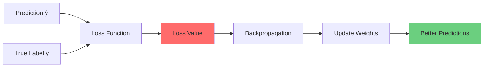

### Regression Loss Functions

#### Mean Squared Error (MSE)

**Formula**:
```
MSE = (1/n) Σ(y_i - ŷ_i)²
```

**Properties**:
- Penalizes large errors heavily (squared)
- Differentiable everywhere
- Convex (one global minimum)
- Sensitive to outliers

**Use Cases**:
- Regression tasks
- When large errors are particularly bad
- Gaussian error assumption

**Derivative**:
```
∂MSE/∂ŷ_i = 2(ŷ_i - y_i)/n
```

#### Mean Absolute Error (MAE)

**Formula**:
```
MAE = (1/n) Σ|y_i - ŷ_i|
```

**Properties**:
- Linear penalty
- More robust to outliers than MSE
- Not differentiable at zero (use subgradient)

**Use Cases**:
- When outliers shouldn't dominate
- More interpretable than MSE

### Classification Loss Functions

#### Binary Cross-Entropy (Log Loss)

**Formula**:
```
BCE = -(1/n) Σ[y_i log(ŷ_i) + (1-y_i) log(1-ŷ_i)]

where:
y_i ∈ {0, 1} (true label)
ŷ_i ∈ (0, 1) (predicted probability)
```

**Intuition**:
```
If y=1 (positive class):
  Loss = -log(ŷ)
  ŷ → 1: loss → 0 (good)
  ŷ → 0: loss → ∞ (very bad!)

If y=0 (negative class):
  Loss = -log(1-ŷ)
  ŷ → 0: loss → 0 (good)
  ŷ → 1: loss → ∞ (very bad!)
```

**Properties**:
- Heavily penalizes confident wrong predictions
- Encourages calibrated probabilities
- Convex
- Derived from maximum likelihood

**Use Cases**:
- Binary classification
- Sigmoid output layer

**Example**:
```
True label: y = 1

Prediction 1: ŷ = 0.9
Loss = -log(0.9) = 0.105 (small, good)

Prediction 2: ŷ = 0.5
Loss = -log(0.5) = 0.693 (medium)

Prediction 3: ŷ = 0.1
Loss = -log(0.1) = 2.303 (large, bad!)
```

#### Categorical Cross-Entropy

**Formula** (for K classes):
```
CCE = -(1/n) Σ_i Σ_k y_{ik} log(ŷ_{ik})

where:
y_{ik} = 1 if sample i belongs to class k, else 0
ŷ_{ik} = predicted probability for class k
```

**One-hot encoding example**:
```
True label: Class 2 (out of 4 classes)
y = [0, 0, 1, 0]

Predictions: ŷ = [0.1, 0.2, 0.6, 0.1]

Loss = -(0×log(0.1) + 0×log(0.2) + 1×log(0.6) + 0×log(0.1))
     = -log(0.6)
     = 0.511
```

**Properties**:
- Natural extension of binary cross-entropy
- Works with softmax output
- Encourages probability distributions

**Use Cases**:
- Multi-class classification
- Softmax output layer
- Mutually exclusive classes

#### Sparse Categorical Cross-Entropy

**Same as categorical cross-entropy but**:
- Accepts integer labels instead of one-hot
- More memory efficient
- Computationally equivalent

**Example**:
```
Instead of: y = [0, 0, 1, 0]
Use: y = 2

Same loss calculation, less memory!
```

### Loss Function Selection

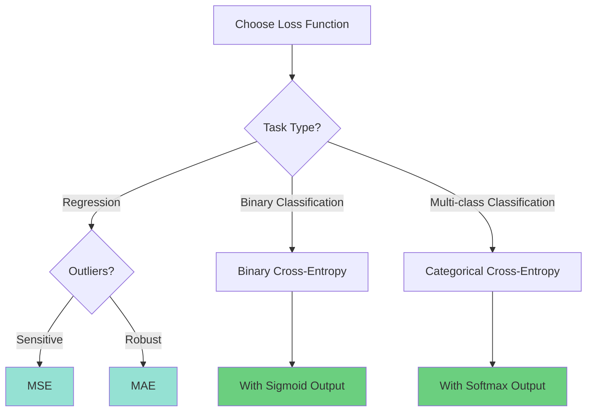

---

## PyTorch Implementation Basics

### PyTorch Philosophy

**Key Concepts**:
- **Tensors**: Multi-dimensional arrays (like NumPy, but GPU-enabled)
- **Autograd**: Automatic differentiation
- **nn.Module**: Building block for networks
- **Dynamic Computation Graphs**: Build graph on-the-fly

### Basic Tensor Operations

```python
import torch
import torch.nn as nn
import torch.nn.functional as F

# Create tensors
x = torch.tensor([1.0, 2.0, 3.0])
print(f"Tensor: {x}")
print(f"Shape: {x.shape}")
print(f"Device: {x.device}")

# Move to GPU if available
device = torch.device('cuda' if torch.cuda.is_available() else 'cpu')
x = x.to(device)

# Tensor operations
y = torch.tensor([4.0, 5.0, 6.0])
z = x + y  # Element-wise addition
w = torch.matmul(x, y)  # Dot product

# Requires gradient for training
x = torch.tensor([1.0, 2.0, 3.0], requires_grad=True)
y = x ** 2
z = y.sum()
z.backward()  # Compute gradients
print(f"Gradient: {x.grad}")  # dz/dx
```

### Defining a Neural Network

**Method 1: Sequential (Simple)**:
```python
model = nn.Sequential(
    nn.Linear(784, 128),  # Input layer to hidden
    nn.ReLU(),
    nn.Dropout(0.2),
    nn.Linear(128, 64),   # Hidden to hidden
    nn.ReLU(),
    nn.Dropout(0.2),
    nn.Linear(64, 10),    # Hidden to output
    nn.Softmax(dim=1)     # Multi-class output
)

print(model)
```

**Method 2: nn.Module (Flexible)**:
```python
class SimpleNN(nn.Module):
    def __init__(self, input_size, hidden_size, num_classes):
        super(SimpleNN, self).__init__()

        # Define layers
        self.fc1 = nn.Linear(input_size, hidden_size)
        self.relu1 = nn.ReLU()
        self.dropout1 = nn.Dropout(0.2)

        self.fc2 = nn.Linear(hidden_size, hidden_size // 2)
        self.relu2 = nn.ReLU()
        self.dropout2 = nn.Dropout(0.2)

        self.fc3 = nn.Linear(hidden_size // 2, num_classes)

    def forward(self, x):
        """Forward pass - must implement this method"""
        # Flatten if needed (for images)
        x = x.view(x.size(0), -1)

        # Layer 1
        x = self.fc1(x)
        x = self.relu1(x)
        x = self.dropout1(x)

        # Layer 2
        x = self.fc2(x)
        x = self.relu2(x)
        x = self.dropout2(x)

        # Output layer (no activation - handled by loss function)
        x = self.fc3(x)

        return x

# Instantiate model
model = SimpleNN(input_size=784, hidden_size=128, num_classes=10)
print(model)

# Count parameters
total_params = sum(p.numel() for p in model.parameters())
trainable_params = sum(p.numel() for p in model.parameters() if p.requires_grad)
print(f"Total parameters: {total_params:,}")
print(f"Trainable parameters: {trainable_params:,}")
```

### Complete Training Example

```python
import torch
import torch.nn as nn
import torch.optim as optim
from torch.utils.data import DataLoader, TensorDataset

# Generate dummy data
torch.manual_seed(42)
X_train = torch.randn(1000, 20)  # 1000 samples, 20 features
y_train = torch.randint(0, 3, (1000,))  # 3 classes

X_test = torch.randn(200, 20)
y_test = torch.randint(0, 3, (200,))

# Create datasets and dataloaders
train_dataset = TensorDataset(X_train, y_train)
test_dataset = TensorDataset(X_test, y_test)

train_loader = DataLoader(train_dataset, batch_size=32, shuffle=True)
test_loader = DataLoader(test_dataset, batch_size=32, shuffle=False)

# Define model
class Net(nn.Module):
    def __init__(self):
        super(Net, self).__init__()
        self.fc1 = nn.Linear(20, 64)
        self.fc2 = nn.Linear(64, 32)
        self.fc3 = nn.Linear(32, 3)
        self.dropout = nn.Dropout(0.2)

    def forward(self, x):
        x = F.relu(self.fc1(x))
        x = self.dropout(x)
        x = F.relu(self.fc2(x))
        x = self.dropout(x)
        x = self.fc3(x)  # No activation (CrossEntropyLoss expects logits)
        return x

# Initialize
device = torch.device('cuda' if torch.cuda.is_available() else 'cpu')
model = Net().to(device)

# Loss and optimizer
criterion = nn.CrossEntropyLoss()
optimizer = optim.Adam(model.parameters(), lr=0.001)

# Training loop
num_epochs = 50
train_losses = []
test_losses = []
test_accuracies = []

for epoch in range(num_epochs):
    # Training phase
    model.train()
    train_loss = 0.0

    for batch_X, batch_y in train_loader:
        batch_X, batch_y = batch_X.to(device), batch_y.to(device)

        # Zero gradients
        optimizer.zero_grad()

        # Forward pass
        outputs = model(batch_X)
        loss = criterion(outputs, batch_y)

        # Backward pass and optimization
        loss.backward()
        optimizer.step()

        train_loss += loss.item()

    train_loss /= len(train_loader)
    train_losses.append(train_loss)

    # Evaluation phase
    model.eval()
    test_loss = 0.0
    correct = 0
    total = 0

    with torch.no_grad():
        for batch_X, batch_y in test_loader:
            batch_X, batch_y = batch_X.to(device), batch_y.to(device)

            outputs = model(batch_X)
            loss = criterion(outputs, batch_y)
            test_loss += loss.item()

            # Calculate accuracy
            _, predicted = torch.max(outputs.data, 1)
            total += batch_y.size(0)
            correct += (predicted == batch_y).sum().item()

    test_loss /= len(test_loader)
    test_accuracy = 100 * correct / total

    test_losses.append(test_loss)
    test_accuracies.append(test_accuracy)

    # Print progress
    if (epoch + 1) % 10 == 0:
        print(f'Epoch [{epoch+1}/{num_epochs}]')
        print(f'  Train Loss: {train_loss:.4f}')
        print(f'  Test Loss: {test_loss:.4f}')
        print(f'  Test Accuracy: {test_accuracy:.2f}%')

# Save model
torch.save(model.state_dict(), 'model.pth')

# Load model
model_loaded = Net()
model_loaded.load_state_dict(torch.load('model.pth'))
model_loaded.eval()
```

### Key PyTorch Concepts

**model.train() vs model.eval()**:
```python
# Training mode
model.train()
# - Dropout is active
# - Batch normalization uses batch statistics
# - Gradients are computed

# Evaluation mode
model.eval()
# - Dropout is disabled
# - Batch normalization uses running statistics
# - Use with torch.no_grad() to save memory
```

**Gradient Management**:
```python
# Clear gradients (required before backward)
optimizer.zero_grad()

# Compute gradients
loss.backward()

# Update weights
optimizer.step()

# Disable gradient computation (inference)
with torch.no_grad():
    output = model(input)
```

**Device Management**:
```python
# Check GPU availability
device = torch.device('cuda' if torch.cuda.is_available() else 'cpu')

# Move model to device
model = model.to(device)

# Move data to device
x = x.to(device)

# Or during forward pass
output = model(x.to(device))
```

---

## Interview Questions

**Q1: What is the purpose of activation functions in neural networks?**

A: Activation functions introduce **non-linearity** into the network. Without them, multiple layers would collapse into a single linear transformation, making deep networks no better than linear regression.

**Key points**:
- **Non-linearity**: Allows modeling complex patterns
- **Enables depth**: Makes multiple layers meaningful
- **Universal approximation**: Necessary for approximating any function

**Example**: Without activation:
```
z₁ = W₁x + b₁
z₂ = W₂z₁ + b₂ = W₂(W₁x + b₁) + b₂ = (W₂W₁)x + (W₂b₁ + b₂)
```
This is still just a linear function!

**Q2: Explain the vanishing gradient problem and how ReLU helps.**

A: **Vanishing Gradient Problem**: In deep networks with sigmoid/tanh activations, gradients become very small as they backpropagate through layers, making early layers learn extremely slowly.

**Why it happens**:
- Sigmoid derivative: σ'(z) = σ(z)(1-σ(z)) ≤ 0.25
- For |z| > 4, gradient ≈ 0
- Chain rule: multiply many small gradients
- Result: Gradient → 0 exponentially with depth

**How ReLU helps**:
```
ReLU(z) = max(0, z)
ReLU'(z) = 1 for z > 0, 0 for z < 0

For positive activations:
- Gradient is exactly 1 (no saturation)
- No vanishing for active neurons
- Allows training very deep networks
```

**Trade-off**: Dying ReLU problem (neurons stuck at 0)

**Q3: How do you prevent overfitting in neural networks?**

A: Multiple strategies:

**1. More Data**:
- Best solution if possible
- Data augmentation for images

**2. Regularization**:
- **Dropout**: Randomly drop neurons during training
- **L2 (Weight Decay)**: Penalize large weights
- **L1**: Encourage sparsity

**3. Architecture**:
- Reduce model size (fewer layers/neurons)
- Use simpler models

**4. Early Stopping**:
- Monitor validation loss
- Stop when validation loss stops improving

**5. Batch Normalization**:
- Normalizes layer inputs
- Has mild regularization effect

**6. Cross-validation**:
- Better estimate of generalization

**Example signs of overfitting**:
```
Train accuracy: 95%
Test accuracy: 70%
→ Large gap indicates overfitting
```

**Q4: What is the Universal Approximation Theorem?**

A: **Theorem**: A feedforward neural network with:
- Single hidden layer
- Enough neurons
- Non-linear activation

Can approximate any continuous function on compact subsets of ℝⁿ to arbitrary accuracy.

**Implications**:
- **Theoretical**: Neural networks are powerful
- **Practical**: Deep networks are more efficient
  - Need exponentially fewer neurons with depth
  - Learn hierarchical features
  - Better generalization

**Not a guarantee**:
- Doesn't say how to find the weights
- Doesn't guarantee generalization
- Training may fail to find good solution

**Q5: Explain the difference between Binary Cross-Entropy and Categorical Cross-Entropy.**

A: Both measure classification performance but for different tasks:

**Binary Cross-Entropy**:
```
BCE = -[y log(ŷ) + (1-y) log(1-ŷ)]

Use with:
- Binary classification (2 classes)
- Sigmoid output (one neuron)
- y ∈ {0, 1}
- ŷ ∈ (0, 1)
```

**Categorical Cross-Entropy**:
```
CCE = -Σ y_k log(ŷ_k)

Use with:
- Multi-class classification (K > 2 classes)
- Softmax output (K neurons)
- y is one-hot encoded
- ŷ is probability distribution (sums to 1)
```

**Example**:
```
Binary: "Cat or Not Cat"
- Output: [0.8] (80% cat)
- Loss: BCE

Multi-class: "Cat, Dog, or Bird"
- Output: [0.7, 0.2, 0.1]
- Loss: CCE
```

---

## Summary

### Key Concepts

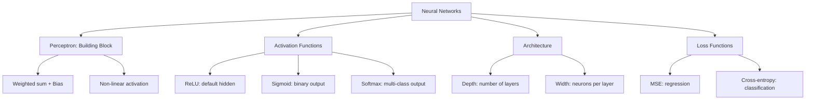

### Must-Remember Formulas

**Perceptron**: ŷ = σ(w^T x + b)

**ReLU**: f(z) = max(0, z)

**Sigmoid**: σ(z) = 1 / (1 + e^(-z))

**Softmax**: softmax(z_i) = e^(z_i) / Σ e^(z_j)

**MSE**: (1/n) Σ(y - ŷ)²

**Cross-Entropy**: -(1/n) Σ[y log(ŷ) + (1-y) log(1-ŷ)]

### Next Steps

This foundation prepares you for:
1. **Document 2**: Backpropagation and Training
2. **Document 3**: Optimizers and Efficient Training

---

**Document Created**: 2025
**Target Audience**: Zero to Architect level
**Prerequisites**: Linear algebra, calculus basics, Python
**Next**: Backpropagation and Gradient Descent Guide

