# Neural Networks: Training, Backpropagation & Optimization - Zero to Architect

## Table of Contents
1. [Backpropagation Algorithm](#backpropagation-algorithm)
2. [Gradient Descent Variants](#gradient-descent-variants)
3. [Advanced Optimizers](#advanced-optimizers)
4. [Weight Initialization](#weight-initialization)
5. [Overfitting and Underfitting](#overfitting-and-underfitting)
6. [Vanishing and Exploding Gradients](#vanishing-and-exploding-gradients)
7. [Regularization Techniques](#regularization-techniques)
8. [Training Best Practices](#training-best-practices)
9. [PyTorch Training Implementation](#pytorch-training-implementation)
10. [Interview Questions](#interview-questions)

---

## Backpropagation Algorithm

### Overview

**Backpropagation** (backward propagation of errors): Algorithm to efficiently compute gradients of the loss function with respect to all weights in the network.

**Key Insight**: Use **chain rule** to compute gradients layer-by-layer, backward from output to input.

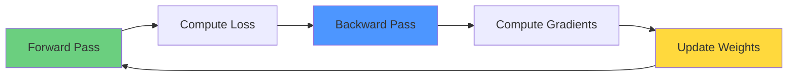

**Why Backpropagation?**
- **Efficient**: Computes all gradients in one backward pass
- **Automatic**: Can be automated (PyTorch autograd)
- **Scalable**: Works for any network architecture

### Mathematical Foundation

**Chain Rule** (Calculus):
```
If y = f(g(x)), then:
dy/dx = (dy/dg) × (dg/dx)
```

**Neural Network Application**:
```
Loss L depends on output y
Output y depends on weights W

∂L/∂W = (∂L/∂y) × (∂y/∂W)
```

### Forward Pass (Recap)

**For each layer l**:
```
z^[l] = W^[l] a^[l-1] + b^[l]     (pre-activation)
a^[l] = σ^[l](z^[l])                (activation)

where:
a^[0] = x (input)
a^[L] = ŷ (output)
```

**Example (2-layer network)**:
```
Layer 1:
z^[1] = W^[1] x + b^[1]
a^[1] = ReLU(z^[1])

Layer 2 (output):
z^[2] = W^[2] a^[1] + b^[2]
a^[2] = σ(z^[2]) = ŷ

Loss:
L = -(y log(ŷ) + (1-y) log(1-ŷ))
```

### Backward Pass (Backpropagation)

**Step 1: Compute output gradient**:
```
∂L/∂ŷ (derivative of loss w.r.t. output)

For binary cross-entropy with sigmoid:
∂L/∂ŷ = -(y/ŷ - (1-y)/(1-ŷ))
```

**Step 2: Backpropagate through output layer**:
```
∂L/∂z^[L] = ∂L/∂a^[L] × ∂a^[L]/∂z^[L]
          = ∂L/∂ŷ × σ'(z^[L])

For binary cross-entropy + sigmoid (simplifies to):
∂L/∂z^[L] = ŷ - y
```

**Step 3: Compute gradients for weights and biases**:
```
∂L/∂W^[L] = ∂L/∂z^[L] × ∂z^[L]/∂W^[L]
          = ∂L/∂z^[L] × a^[L-1]^T

∂L/∂b^[L] = ∂L/∂z^[L]
```

**Step 4: Backpropagate to previous layer**:
```
∂L/∂a^[L-1] = W^[L]^T × ∂L/∂z^[L]

∂L/∂z^[L-1] = ∂L/∂a^[L-1] ⊙ σ'(z^[L-1])
              (⊙ = element-wise multiplication)
```

**Repeat** steps 3-4 for all layers going backward.

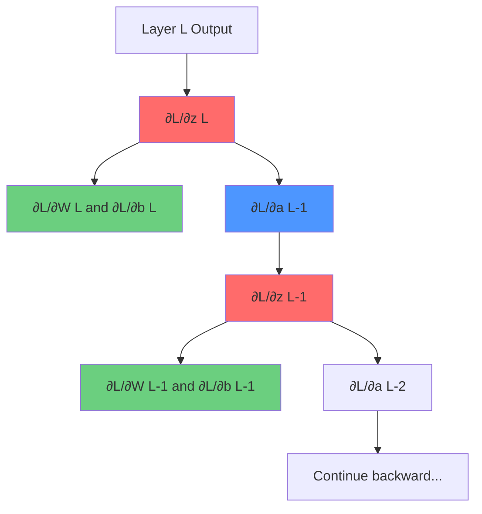

### General Backpropagation Equations

**For layer l** (moving backward from L to 1):

```
1. Compute gradient w.r.t. pre-activation:
   δ^[l] = ∂L/∂z^[l]

   If l = L (output layer):
      δ^[L] = ∂L/∂a^[L] ⊙ σ'(z^[L])

   If l < L (hidden layer):
      δ^[l] = (W^[l+1]^T δ^[l+1]) ⊙ σ'(z^[l])

2. Compute weight gradient:
   ∂L/∂W^[l] = δ^[l] (a^[l-1])^T

3. Compute bias gradient:
   ∂L/∂b^[l] = δ^[l]

4. Update parameters:
   W^[l] := W^[l] - α ∂L/∂W^[l]
   b^[l] := b^[l] - α ∂L/∂b^[l]
```

### Activation Function Derivatives

**Sigmoid**:
```
σ(z) = 1/(1 + e^(-z))
σ'(z) = σ(z)(1 - σ(z))
```

**Tanh**:
```
tanh'(z) = 1 - tanh²(z)
```

**ReLU**:
```
ReLU'(z) = 1 if z > 0
         = 0 if z ≤ 0
```

**Softmax** (with cross-entropy):
```
∂L/∂z = ŷ - y  (simplified form)
```

### Computational Complexity

**Forward Pass**: O(W) where W = total number of weights
**Backward Pass**: O(W) (same as forward!)

**Why efficient?**
- Reuses intermediate values from forward pass
- Single backward sweep computes all gradients
- Dynamic programming approach (memoization)

### Complete Example

**Network**:
```
Input: x = 2
Hidden: 1 neuron with ReLU
Output: 1 neuron with sigmoid
```

**Weights**:
```
W^[1] = 0.5, b^[1] = 0.1
W^[2] = 0.8, b^[2] = 0.2
```

**True label**: y = 1

**Forward Pass**:
```
z^[1] = 0.5 × 2 + 0.1 = 1.1
a^[1] = ReLU(1.1) = 1.1

z^[2] = 0.8 × 1.1 + 0.2 = 1.08
ŷ = σ(1.08) = 0.7466

L = -(1 × log(0.7466) + 0 × log(1-0.7466))
  = -log(0.7466) = 0.2923
```

**Backward Pass**:
```
Layer 2:
δ^[2] = ŷ - y = 0.7466 - 1 = -0.2534

∂L/∂W^[2] = δ^[2] × a^[1] = -0.2534 × 1.1 = -0.2787
∂L/∂b^[2] = δ^[2] = -0.2534

Layer 1:
∂L/∂a^[1] = W^[2] × δ^[2] = 0.8 × (-0.2534) = -0.2027

δ^[1] = ∂L/∂a^[1] × ReLU'(z^[1])
      = -0.2027 × 1 = -0.2027

∂L/∂W^[1] = δ^[1] × x = -0.2027 × 2 = -0.4054
∂L/∂b^[1] = δ^[1] = -0.2027
```

**Weight Update** (α = 0.1):
```
W^[2] := 0.8 - 0.1 × (-0.2787) = 0.8279
b^[2] := 0.2 - 0.1 × (-0.2534) = 0.2253

W^[1] := 0.5 - 0.1 × (-0.4054) = 0.5405
b^[1] := 0.1 - 0.1 × (-0.2027) = 0.1203
```

---

## Gradient Descent Variants

### Batch Gradient Descent (BGD)

**Algorithm**:
```
1. Compute loss over entire dataset
2. Compute gradients using all samples
3. Update weights once per epoch

θ := θ - α × ∇L(θ)

where ∇L(θ) = (1/n) Σ ∇L_i(θ)
```

**Advantages**:
- Stable convergence
- Guaranteed to reach minimum for convex functions
- Efficient vectorization

**Disadvantages**:
- Slow for large datasets (one update per epoch)
- Requires all data in memory
- Can get stuck in local minima
- Redundant computation for similar samples

**Use when**: Small datasets, need stable convergence

### Stochastic Gradient Descent (SGD)

**Algorithm**:
```
1. For each sample:
   a. Compute loss for that sample
   b. Compute gradient
   c. Update weights immediately

θ := θ - α × ∇L_i(θ)  (for sample i)
```

**Advantages**:
- Fast updates (n updates per epoch)
- Can escape local minima (noise helps)
- Online learning possible
- Memory efficient

**Disadvantages**:
- Noisy updates (high variance)
- May not converge exactly
- Slower per-iteration (no vectorization)
- Requires learning rate decay

**Use when**: Large datasets, online learning

### Mini-Batch Gradient Descent

**Algorithm**:
```
1. Split data into mini-batches (size: 32-512)
2. For each mini-batch:
   a. Compute loss and gradients
   b. Update weights

θ := θ - α × (1/m) Σ ∇L_i(θ)  (m = batch size)
```

**Advantages**:
- **Best of both worlds**
- Vectorization efficiency
- Reduced variance vs SGD
- Faster convergence than BGD
- GPU-friendly

**Disadvantages**:
- Hyperparameter: batch size
- Still some variance

**Typical Batch Sizes**:
```
- 32: Small, faster updates, more noise
- 64: Common default
- 128: Good balance
- 256: Less noise, more stable
- 512+: Large, very stable, slower per epoch
```

**Use when**: Most practical scenarios (default choice)

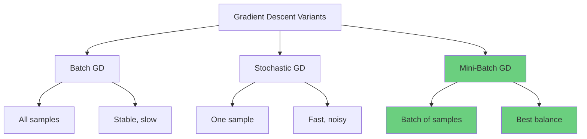

### Learning Rate

**Impact**:
```
Too Small:
- Slow convergence
- Can get stuck in plateaus
- Needs many iterations

Too Large:
- Oscillation
- Divergence
- Overshooting minima

Just Right:
- Fast convergence
- Reaches minimum
```

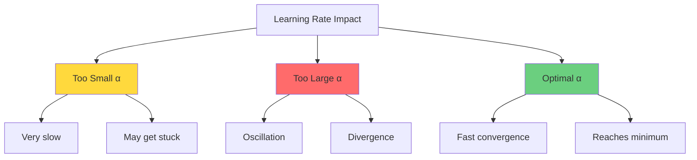

**Typical Values**:
```
- 0.1: Often too large
- 0.01: Common starting point
- 0.001: Safe default (Adam default)
- 0.0001: Very conservative
```

**Learning Rate Schedules**:

**Step Decay**:
```
α_t = α_0 × γ^(epoch/step_size)

Example: α_0 = 0.1, γ = 0.5, step_size = 10
- Epochs 0-9: α = 0.1
- Epochs 10-19: α = 0.05
- Epochs 20-29: α = 0.025
```

**Exponential Decay**:
```
α_t = α_0 × e^(-λt)
```

**Cosine Annealing**:
```
α_t = α_min + (α_max - α_min) × (1 + cos(πt/T)) / 2

Smoothly decreases learning rate following cosine curve
```

**Warmup**:
```
Linearly increase learning rate from 0 to target over initial epochs

Helps with:
- Large batch sizes
- Transformer training
- Avoiding early instability
```

---

## Advanced Optimizers

### Momentum

**Problem**: SGD oscillates in directions with high curvature

**Solution**: Add "velocity" term using exponential moving average of gradients

**Algorithm**:
```
v_t = βv_{t-1} + (1-β)∇L(θ_t)  (velocity)
θ_t = θ_{t-1} - α × v_t         (update)

β = 0.9 (typical)
```

**Intuition**:
- Like rolling ball downhill
- Accumulates momentum in consistent directions
- Dampens oscillations
- Accelerates in steady descent

**Advantages**:
- Faster convergence
- Reduces oscillations
- Better for ill-conditioned problems

**Nesterov Momentum**:
```
"Look ahead" before computing gradient

v_t = βv_{t-1} + (1-β)∇L(θ_t - βv_{t-1})
θ_t = θ_{t-1} - α × v_t

More responsive to gradient changes
```

### AdaGrad (Adaptive Gradient)

**Problem**: Same learning rate for all parameters

**Solution**: Adapt learning rate per parameter based on historical gradients

**Algorithm**:
```
G_t = G_{t-1} + (∇L(θ_t))²  (sum of squared gradients)
θ_t = θ_{t-1} - α × ∇L(θ_t) / (√G_t + ε)

ε = 10^(-8) (for numerical stability)
```

**Advantages**:
- Automatically adapts learning rates
- Larger updates for infrequent features
- Smaller updates for frequent features
- Good for sparse data

**Disadvantages**:
- **Accumulating denominator** → learning rate continually decreases
- May stop learning too early
- Not recommended for deep learning

### RMSprop (Root Mean Square Propagation)

**Solution to AdaGrad**: Use exponential moving average instead of sum

**Algorithm**:
```
s_t = βs_{t-1} + (1-β)(∇L(θ_t))²
θ_t = θ_{t-1} - α × ∇L(θ_t) / (√s_t + ε)

β = 0.9 (typical)
```

**Advantages**:
- Solves AdaGrad's diminishing learning rate
- Adapts per-parameter learning rates
- Works well for RNNs
- Good for non-stationary problems

**Developed by**: Geoffrey Hinton (unpublished, from Coursera lecture)

### Adam (Adaptive Moment Estimation)

**Combines**: Momentum + RMSprop

**Algorithm**:
```
m_t = β₁m_{t-1} + (1-β₁)∇L(θ_t)      (first moment, momentum)
v_t = β₂v_{t-1} + (1-β₂)(∇L(θ_t))²   (second moment, RMSprop)

Bias correction:
m̂_t = m_t / (1 - β₁^t)
v̂_t = v_t / (1 - β₂^t)

θ_t = θ_{t-1} - α × m̂_t / (√v̂_t + ε)
```

**Default Hyperparameters** (from paper):
```
α = 0.001 (learning rate)
β₁ = 0.9 (momentum decay)
β₂ = 0.999 (RMSprop decay)
ε = 10^(-8)
```

**Why Bias Correction?**
- m and v initialized to zero
- Biased toward zero in early iterations
- Correction compensates for this bias

**Advantages**:
- **Most popular optimizer** in deep learning
- Works well out-of-the-box
- Combines best of Momentum and RMSprop
- Efficient, low memory
- Well-suited for most problems

**When to Use**:
- **Default choice** for most problems
- Works for sparse gradients
- Good for noisy gradients
- Effective for high-dimensional spaces

### AdamW (Adam with Weight Decay)

**Improvement**: Decouples weight decay from gradient-based optimization

**Algorithm**:
```
Same as Adam, but:
θ_t = θ_{t-1} - α × (m̂_t / (√v̂_t + ε) + λθ_{t-1})

λ = weight decay coefficient
```

**Advantages over Adam**:
- Better regularization
- Improved generalization
- Recommended for transformers

### Optimizer Comparison

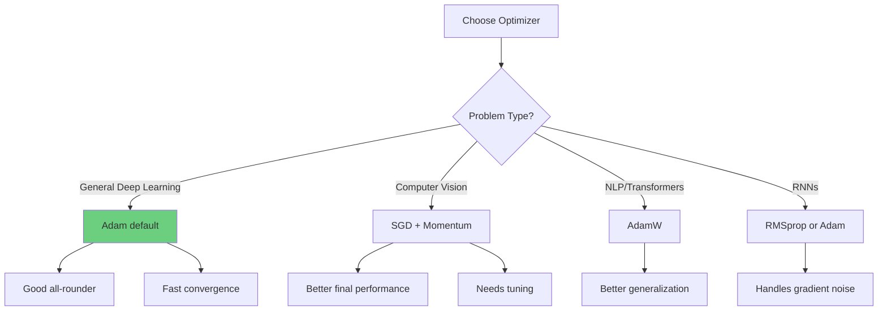

| Optimizer | Advantages | Disadvantages | Use Case |
|-----------|------------|---------------|----------|
| SGD | Simple, well-understood | Slow, needs tuning | Baseline |
| SGD + Momentum | Faster convergence | Needs tuning | CNNs (with tuning) |
| RMSprop | Adaptive LR | Can be unstable | RNNs |
| Adam | Fast, robust | May not converge to best solution | Default choice |
| AdamW | Better generalization | Slightly slower | Transformers |

---

## Weight Initialization

### Why Initialization Matters

**Bad initialization can cause**:
- Vanishing gradients (all zeros)
- Exploding gradients (too large)
- Slow convergence
- Dead neurons
- Symmetry (all neurons learn same thing)

**Goals**:
1. Preserve variance across layers
2. Avoid vanishing/exploding gradients
3. Break symmetry

### Zero Initialization (DON'T DO THIS!)

```python
# BAD!
W = np.zeros((n_out, n_in))
```

**Problem**: Symmetry
- All neurons compute same function
- All receive same gradient
- Learn same features
- No benefit from multiple neurons

**Exception**: Biases can be zero

### Random Initialization (Naive)

```python
# Suboptimal
W = np.random.randn(n_out, n_in) * 0.01
```

**Problems**:
- Variance shrinks/explodes through layers
- Small weights → vanishing activations/gradients
- Large weights → exploding activations/gradients

### Xavier (Glorot) Initialization

**For tanh/sigmoid activations**

**Normal distribution**:
```python
W = np.random.randn(n_out, n_in) * np.sqrt(1 / n_in)

# Or
W = np.random.randn(n_out, n_in) * np.sqrt(2 / (n_in + n_out))
```

**Uniform distribution**:
```python
limit = np.sqrt(6 / (n_in + n_out))
W = np.random.uniform(-limit, limit, (n_out, n_in))
```

**Motivation**:
- Maintain variance of activations
- Maintain variance of gradients
- Derived assuming linear activations

**Use with**: tanh, sigmoid, softmax

### He (Kaiming) Initialization

**For ReLU activations**

```python
W = np.random.randn(n_out, n_in) * np.sqrt(2 / n_in)
```

**Why different from Xavier?**
- ReLU kills half the neurons (outputs 0)
- Need larger variance to compensate
- Factor of 2 instead of 1

**Use with**: ReLU, Leaky ReLU, PReLU

**Variants**:
```python
# He normal (default)
W = np.random.randn(n_out, n_in) * np.sqrt(2 / n_in)

# He uniform
limit = np.sqrt(6 / n_in)
W = np.random.uniform(-limit, limit, (n_out, n_in))
```

### PyTorch Initialization

```python
import torch.nn as nn

# Default initialization (usually good)
layer = nn.Linear(n_in, n_out)
# PyTorch uses Kaiming uniform by default for Linear layers

# Manual Xavier initialization
nn.init.xavier_uniform_(layer.weight)
nn.init.zeros_(layer.bias)

# Manual He initialization
nn.init.kaiming_normal_(layer.weight, mode='fan_in', nonlinearity='relu')

# Custom initialization
def init_weights(m):
    if isinstance(m, nn.Linear):
        nn.init.xavier_uniform_(m.weight)
        nn.init.zeros_(m.bias)

model.apply(init_weights)
```

---

## Overfitting and Underfitting

### Understanding the Problem

**Overfitting** and **underfitting** represent the two extremes of model performance that we must balance during training.

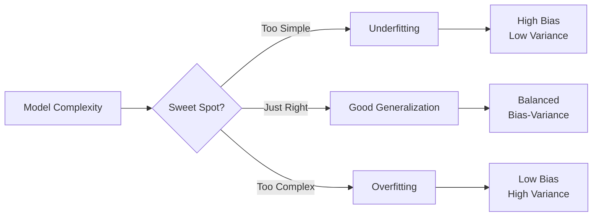

### Overfitting

**Definition**: Model learns training data too well, including noise and outliers, failing to generalize to new data.

**Characteristics**:
- High training accuracy, low validation/test accuracy
- Large gap between train and validation loss
- Model memorizes rather than learns patterns
- Complex decision boundaries

**Example scenario**:
```python
# Overfitted model behavior
Training accuracy: 99.5%
Validation accuracy: 72.3%
# Gap of 27.2% indicates overfitting
```

**Visual indicators**:

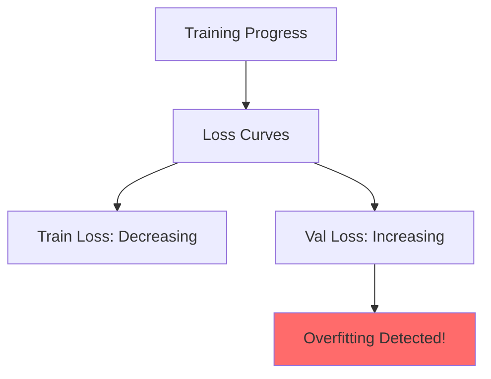

### Underfitting

**Definition**: Model is too simple to capture underlying patterns in the data.

**Characteristics**:
- Low training accuracy, low validation accuracy
- Small gap between train and validation loss
- Model cannot learn the training data
- Oversimplified decision boundaries

**Example scenario**:
```python
# Underfitted model behavior
Training accuracy: 68.2%
Validation accuracy: 67.8%
# Both low, model is too simple
```

### Bias-Variance Tradeoff

The fundamental tradeoff in machine learning:

**Mathematical formulation**:
```
Expected Test Error = Bias² + Variance + Irreducible Error

Bias: Error from incorrect assumptions
Variance: Error from sensitivity to training data fluctuations
Irreducible Error: Noise in data (cannot be reduced)
```

**Relationship**:

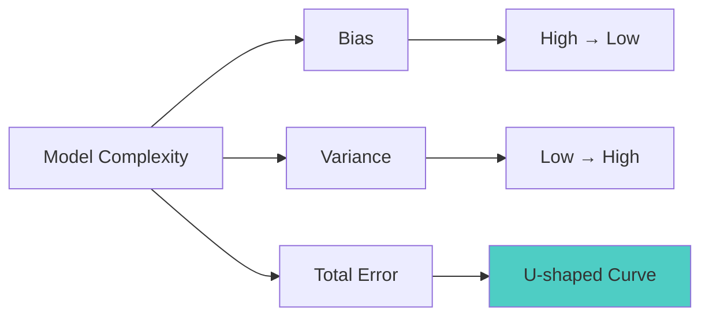

**Detailed breakdown**:

| Aspect | High Bias (Underfitting) | High Variance (Overfitting) |
|--------|--------------------------|------------------------------|
| Train Error | High | Low |
| Test Error | High | High |
| Model Complexity | Too Simple | Too Complex |
| Decision Boundary | Oversimplified | Overly Complex |
| Solution | Add complexity | Add regularization |

### Detecting Overfitting/Underfitting

**1. Learning Curves**

```python
import matplotlib.pyplot as plt
import numpy as np

def plot_learning_curves(train_losses, val_losses, train_accs, val_accs):
    """Plot training and validation metrics"""
    epochs = range(1, len(train_losses) + 1)

    fig, (ax1, ax2) = plt.subplots(1, 2, figsize=(14, 5))

    # Loss curves
    ax1.plot(epochs, train_losses, 'b-', label='Training Loss', linewidth=2)
    ax1.plot(epochs, val_losses, 'r-', label='Validation Loss', linewidth=2)
    ax1.set_xlabel('Epoch')
    ax1.set_ylabel('Loss')
    ax1.set_title('Loss Curves')
    ax1.legend()
    ax1.grid(True, alpha=0.3)

    # Accuracy curves
    ax2.plot(epochs, train_accs, 'b-', label='Training Accuracy', linewidth=2)
    ax2.plot(epochs, val_accs, 'r-', label='Validation Accuracy', linewidth=2)
    ax2.set_xlabel('Epoch')
    ax2.set_ylabel('Accuracy')
    ax2.set_title('Accuracy Curves')
    ax2.legend()
    ax2.grid(True, alpha=0.3)

    plt.tight_layout()
    plt.show()

    # Diagnosis
    final_train_loss = train_losses[-1]
    final_val_loss = val_losses[-1]
    gap = abs(final_train_loss - final_val_loss)

    print(f"\nDiagnosis:")
    print(f"Final Train Loss: {final_train_loss:.4f}")
    print(f"Final Val Loss: {final_val_loss:.4f}")
    print(f"Gap: {gap:.4f}")

    if final_train_loss > 0.5 and final_val_loss > 0.5:
        print("⚠️ UNDERFITTING: Both losses high - model too simple")
    elif gap > 0.2:
        print("⚠️ OVERFITTING: Large gap - model memorizing training data")
    else:
        print("✓ GOOD FIT: Model generalizing well")

# Example usage during training
train_losses = []
val_losses = []
train_accs = []
val_accs = []

for epoch in range(num_epochs):
    # Training
    train_loss, train_acc = train_one_epoch(model, train_loader)
    train_losses.append(train_loss)
    train_accs.append(train_acc)

    # Validation
    val_loss, val_acc = validate(model, val_loader)
    val_losses.append(val_loss)
    val_accs.append(val_acc)

plot_learning_curves(train_losses, val_losses, train_accs, val_accs)
```

**2. Cross-Validation**

```python
from sklearn.model_selection import KFold
import torch
import torch.nn as nn

def cross_validate_model(model_class, X, y, k_folds=5, **model_kwargs):
    """K-fold cross-validation for PyTorch models"""
    kfold = KFold(n_splits=k_folds, shuffle=True, random_state=42)

    fold_results = []

    for fold, (train_idx, val_idx) in enumerate(kfold.split(X)):
        print(f"\nFold {fold + 1}/{k_folds}")

        # Split data
        X_train, X_val = X[train_idx], X[val_idx]
        y_train, y_val = y[train_idx], y[val_idx]

        # Create fresh model for each fold
        model = model_class(**model_kwargs)
        optimizer = torch.optim.Adam(model.parameters(), lr=0.001)
        criterion = nn.CrossEntropyLoss()

        # Train
        for epoch in range(50):
            model.train()
            optimizer.zero_grad()
            outputs = model(X_train)
            loss = criterion(outputs, y_train)
            loss.backward()
            optimizer.step()

        # Evaluate
        model.eval()
        with torch.no_grad():
            val_outputs = model(X_val)
            val_loss = criterion(val_outputs, y_val)
            val_acc = (val_outputs.argmax(1) == y_val).float().mean()

        fold_results.append({
            'fold': fold + 1,
            'val_loss': val_loss.item(),
            'val_acc': val_acc.item()
        })

        print(f"Val Loss: {val_loss:.4f}, Val Acc: {val_acc:.4f}")

    # Summary statistics
    avg_loss = np.mean([r['val_loss'] for r in fold_results])
    std_loss = np.std([r['val_loss'] for r in fold_results])
    avg_acc = np.mean([r['val_acc'] for r in fold_results])
    std_acc = np.std([r['val_acc'] for r in fold_results])

    print(f"\n{'='*50}")
    print(f"Cross-Validation Results:")
    print(f"Average Val Loss: {avg_loss:.4f} ± {std_loss:.4f}")
    print(f"Average Val Acc: {avg_acc:.4f} ± {std_acc:.4f}")
    print(f"{'='*50}")

    # High std deviation indicates overfitting (high variance)
    if std_acc > 0.05:
        print("⚠️ High variance across folds - possible overfitting")

    return fold_results
```

### Solutions to Overfitting

**1. More Training Data**

```python
# Data augmentation example for images
from torchvision import transforms

train_transform = transforms.Compose([
    transforms.RandomHorizontalFlip(p=0.5),
    transforms.RandomRotation(degrees=15),
    transforms.RandomResizedCrop(224, scale=(0.8, 1.0)),
    transforms.ColorJitter(brightness=0.2, contrast=0.2, saturation=0.2),
    transforms.ToTensor(),
    transforms.Normalize(mean=[0.485, 0.456, 0.406], std=[0.229, 0.224, 0.225])
])

# For text/tabular: synthetic data generation
from imblearn.over_sampling import SMOTE

smote = SMOTE(random_state=42)
X_resampled, y_resampled = smote.fit_resample(X_train, y_train)
```

**2. Regularization (L2, Dropout)**

```python
class RegularizedNN(nn.Module):
    def __init__(self, input_size, hidden_size, num_classes, dropout_rate=0.5):
        super(RegularizedNN, self).__init__()
        self.fc1 = nn.Linear(input_size, hidden_size)
        self.bn1 = nn.BatchNorm1d(hidden_size)
        self.dropout1 = nn.Dropout(dropout_rate)

        self.fc2 = nn.Linear(hidden_size, hidden_size // 2)
        self.bn2 = nn.BatchNorm1d(hidden_size // 2)
        self.dropout2 = nn.Dropout(dropout_rate)

        self.fc3 = nn.Linear(hidden_size // 2, num_classes)

    def forward(self, x):
        x = self.fc1(x)
        x = self.bn1(x)
        x = F.relu(x)
        x = self.dropout1(x)

        x = self.fc2(x)
        x = self.bn2(x)
        x = F.relu(x)
        x = self.dropout2(x)

        x = self.fc3(x)
        return x

# L2 regularization via weight decay
model = RegularizedNN(input_size=784, hidden_size=256, num_classes=10, dropout_rate=0.3)
optimizer = torch.optim.Adam(model.parameters(), lr=0.001, weight_decay=1e-4)
```

**3. Early Stopping**

```python
class EarlyStopping:
    """Stop training when validation loss stops improving"""
    def __init__(self, patience=7, min_delta=0, verbose=True):
        self.patience = patience
        self.min_delta = min_delta
        self.verbose = verbose
        self.counter = 0
        self.best_loss = None
        self.early_stop = False
        self.best_model = None

    def __call__(self, val_loss, model):
        if self.best_loss is None:
            self.best_loss = val_loss
            self.save_checkpoint(model)
        elif val_loss > self.best_loss - self.min_delta:
            self.counter += 1
            if self.verbose:
                print(f'EarlyStopping counter: {self.counter}/{self.patience}')
            if self.counter >= self.patience:
                self.early_stop = True
        else:
            self.best_loss = val_loss
            self.save_checkpoint(model)
            self.counter = 0

    def save_checkpoint(self, model):
        """Save model when validation loss decreases"""
        self.best_model = model.state_dict().copy()

# Usage
early_stopping = EarlyStopping(patience=10, min_delta=0.001)

for epoch in range(num_epochs):
    train_loss = train_one_epoch(model, train_loader, optimizer, criterion)
    val_loss = validate(model, val_loader, criterion)

    early_stopping(val_loss, model)

    if early_stopping.early_stop:
        print(f"Early stopping at epoch {epoch}")
        model.load_state_dict(early_stopping.best_model)
        break
```

**4. Reduce Model Complexity**

```python
# Too complex (prone to overfitting)
class ComplexModel(nn.Module):
    def __init__(self):
        super().__init__()
        self.fc1 = nn.Linear(100, 1000)
        self.fc2 = nn.Linear(1000, 800)
        self.fc3 = nn.Linear(800, 600)
        self.fc4 = nn.Linear(600, 400)
        self.fc5 = nn.Linear(400, 10)

# Simpler (better generalization for small datasets)
class SimplerModel(nn.Module):
    def __init__(self):
        super().__init__()
        self.fc1 = nn.Linear(100, 128)
        self.dropout = nn.Dropout(0.3)
        self.fc2 = nn.Linear(128, 10)

    def forward(self, x):
        x = F.relu(self.fc1(x))
        x = self.dropout(x)
        x = self.fc2(x)
        return x
```

### Solutions to Underfitting

**1. Increase Model Complexity**

```python
# Too simple
class SimpleModel(nn.Module):
    def __init__(self):
        super().__init__()
        self.fc = nn.Linear(784, 10)

# Better complexity
class ImprovedModel(nn.Module):
    def __init__(self):
        super().__init__()
        self.fc1 = nn.Linear(784, 256)
        self.fc2 = nn.Linear(256, 128)
        self.fc3 = nn.Linear(128, 10)

    def forward(self, x):
        x = F.relu(self.fc1(x))
        x = F.relu(self.fc2(x))
        x = self.fc3(x)
        return x
```

**2. Train Longer**

```python
# Increase epochs
num_epochs = 100  # Instead of 10

# Use learning rate scheduling
scheduler = torch.optim.lr_scheduler.ReduceLROnPlateau(
    optimizer, mode='min', factor=0.5, patience=5, verbose=True
)

for epoch in range(num_epochs):
    train_loss = train_one_epoch(model, train_loader, optimizer, criterion)
    val_loss = validate(model, val_loader, criterion)

    scheduler.step(val_loss)  # Reduce LR when validation loss plateaus
```

**3. Feature Engineering**

```python
# Add polynomial features
from sklearn.preprocessing import PolynomialFeatures

poly = PolynomialFeatures(degree=2, include_bias=False)
X_poly = poly.fit_transform(X)

# Add interaction terms
X_with_interactions = np.column_stack([
    X,
    X[:, 0] * X[:, 1],  # Interaction between feature 0 and 1
    X[:, 2] ** 2,       # Squared feature 2
])
```

**4. Reduce Regularization**

```python
# Too much regularization
optimizer = torch.optim.Adam(model.parameters(), lr=0.001, weight_decay=1e-2)
model = nn.Dropout(0.7)  # 70% dropout is too high

# Better
optimizer = torch.optim.Adam(model.parameters(), lr=0.001, weight_decay=1e-5)
model = nn.Dropout(0.2)  # 20% dropout
```

### Practical Guidelines

**Decision flowchart**:

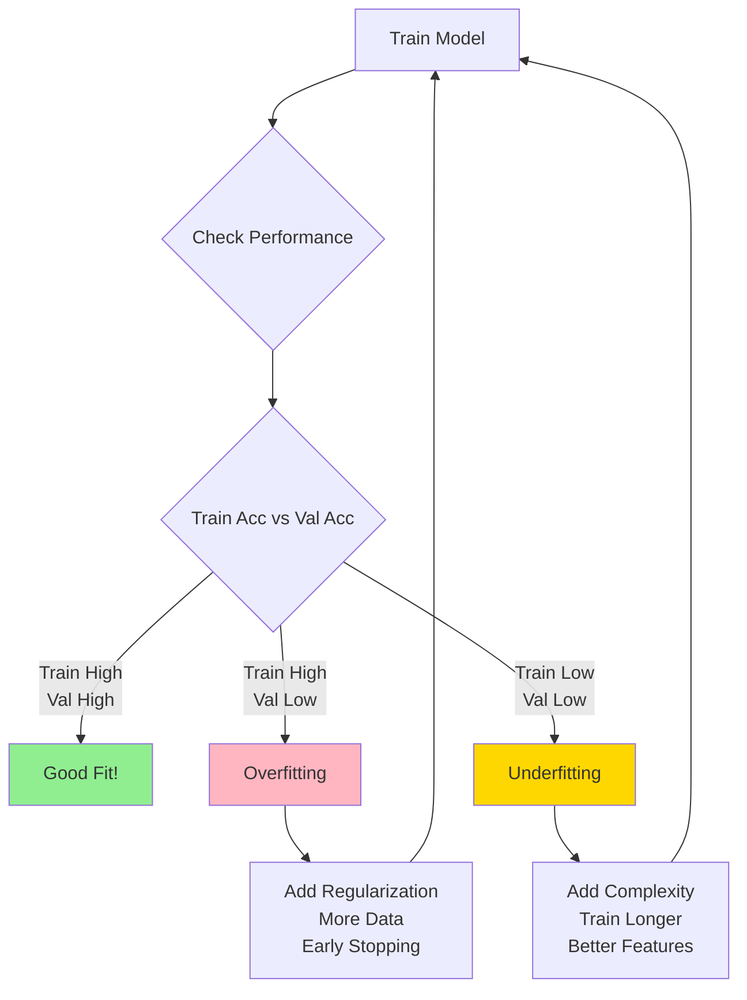

**Rule of thumb**:
1. Start simple (baseline model)
2. If underfitting: increase complexity gradually
3. If overfitting: add regularization, not reduce complexity immediately
4. Always use validation set for decisions
5. Test set only for final evaluation

---

## Vanishing and Exploding Gradients

### The Problem

During backpropagation in deep networks, gradients can become exponentially small (vanishing) or large (exploding), making training impossible.

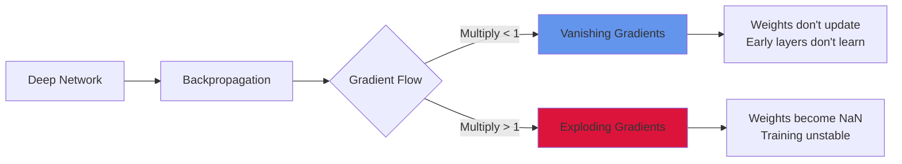

### Mathematical Explanation

**Chain rule in backpropagation**:

For a network with L layers, the gradient at layer l is:

```
∂L/∂w_l = ∂L/∂a_L × ∂a_L/∂a_(L-1) × ... × ∂a_(l+1)/∂a_l × ∂a_l/∂w_l

Where each term involves:
∂a_i/∂a_(i-1) = W_i × σ'(z_i)
```

**Problem**: We multiply many terms together:

```
∂L/∂w_l = (W_L × σ'(z_L)) × (W_(L-1) × σ'(z_(L-1))) × ... × (W_l × σ'(z_l))
```

**Vanishing**: If each term < 1, product → 0 exponentially
**Exploding**: If each term > 1, product → ∞ exponentially

### Vanishing Gradients

**Causes**:

1. **Sigmoid/Tanh activations**
```python
import numpy as np
import matplotlib.pyplot as plt

# Sigmoid derivative
def sigmoid(x):
    return 1 / (1 + np.exp(-x))

def sigmoid_derivative(x):
    s = sigmoid(x)
    return s * (1 - s)

x = np.linspace(-10, 10, 1000)
plt.plot(x, sigmoid_derivative(x))
plt.title('Sigmoid Derivative')
plt.xlabel('x')
plt.ylabel("σ'(x)")
plt.grid(True)
plt.show()

# Maximum value is 0.25!
print(f"Max derivative: {sigmoid_derivative(0):.4f}")  # 0.25
```

**Problem**: Maximum derivative is 0.25, so gradients shrink by 4x per layer!

For 10 layers: 0.25^10 ≈ 0.00000095 (practically zero)

2. **Poor weight initialization**
```python
# Bad: weights too small
W = np.random.randn(256, 256) * 0.01

# Gradient after 5 layers
gradient_scale = (0.01 ** 5) * (0.25 ** 5)  # Tiny!
print(f"Gradient scale: {gradient_scale:.2e}")  # ~9.77e-15
```

**Symptoms**:
- Early layers learn very slowly or not at all
- Training loss decreases slowly
- Gradients close to zero (check with `param.grad.abs().mean()`)

**Example detection**:
```python
def check_gradient_flow(model):
    """Monitor gradient magnitudes across layers"""
    ave_grads = []
    layers = []

    for name, param in model.named_parameters():
        if param.requires_grad and "weight" in name:
            layers.append(name)
            ave_grads.append(param.grad.abs().mean().item())

    plt.plot(ave_grads, alpha=0.3, color="b")
    plt.hlines(0, 0, len(ave_grads)+1, linewidth=1, color="k")
    plt.xticks(range(0, len(ave_grads), 1), layers, rotation="vertical")
    plt.xlim(xmin=0, xmax=len(ave_grads))
    plt.xlabel("Layers")
    plt.ylabel("Average Gradient")
    plt.title("Gradient Flow")
    plt.grid(True)
    plt.tight_layout()
    plt.show()

# Usage after backward pass
loss.backward()
check_gradient_flow(model)
optimizer.step()
```

### Exploding Gradients

**Causes**:

1. **Large weights**
```python
# Bad initialization
W = np.random.randn(256, 256) * 10

# Gradient after 5 layers
gradient_scale = (10 ** 5)  # 100,000!
```

2. **High learning rate**
```python
# Too high
optimizer = torch.optim.SGD(model.parameters(), lr=10.0)

# Can cause weights to explode
```

**Symptoms**:
- Training loss becomes NaN or infinity
- Weights become very large
- Unstable training (loss oscillates wildly)

**Example detection**:
```python
# Check for NaN
if torch.isnan(loss):
    print("Loss is NaN - exploding gradients!")

# Check gradient magnitude
total_norm = 0
for p in model.parameters():
    if p.grad is not None:
        param_norm = p.grad.data.norm(2)
        total_norm += param_norm.item() ** 2
total_norm = total_norm ** 0.5

if total_norm > 100:
    print(f"Large gradient norm: {total_norm:.2f}")
```

### Solutions

**1. Use ReLU Activation**

```python
# Bad: sigmoid/tanh
model = nn.Sequential(
    nn.Linear(784, 256),
    nn.Sigmoid(),  # Derivative max 0.25
    nn.Linear(256, 128),
    nn.Sigmoid(),
    nn.Linear(128, 10)
)

# Good: ReLU
model = nn.Sequential(
    nn.Linear(784, 256),
    nn.ReLU(),  # Derivative is 0 or 1
    nn.Linear(256, 128),
    nn.ReLU(),
    nn.Linear(128, 10)
)

# Even better: Leaky ReLU or ELU
model = nn.Sequential(
    nn.Linear(784, 256),
    nn.LeakyReLU(0.01),  # Derivative never zero
    nn.Linear(256, 128),
    nn.ELU(),  # Smooth, negative values
    nn.Linear(128, 10)
)
```

**Why ReLU helps**:
- Derivative is 1 (for positive inputs)
- No gradient shrinking during backprop
- Computationally efficient

**2. Proper Weight Initialization (He/Xavier)**

```python
# Already covered in Weight Initialization section

# He for ReLU
for m in model.modules():
    if isinstance(m, nn.Linear):
        nn.init.kaiming_normal_(m.weight, mode='fan_in', nonlinearity='relu')
        nn.init.constant_(m.bias, 0)

# Xavier for tanh
for m in model.modules():
    if isinstance(m, nn.Linear):
        nn.init.xavier_normal_(m.weight)
        nn.init.constant_(m.bias, 0)
```

**3. Gradient Clipping**

**Essential for exploding gradients**

**Method 1: Clip by norm (PREFERRED)**

```python
import torch.nn as nn

# Clip total gradient norm to max value
max_norm = 1.0

# During training loop
optimizer.zero_grad()
loss.backward()

# Clip gradients
torch.nn.utils.clip_grad_norm_(model.parameters(), max_norm=max_norm)

optimizer.step()
```

**How it works**:
```python
# Pseudocode
total_norm = sqrt(sum(p.grad.norm(2)^2 for all parameters))

if total_norm > max_norm:
    scaling_factor = max_norm / total_norm
    for p in parameters:
        p.grad = p.grad * scaling_factor
```

**Method 2: Clip by value**

```python
# Clip each gradient value to [-clip_value, clip_value]
clip_value = 1.0

torch.nn.utils.clip_grad_value_(model.parameters(), clip_value=clip_value)
```

**Comparison**:

| Aspect | clip_grad_norm_ | clip_grad_value_ |
|--------|-----------------|-------------------|
| Method | Scale all gradients together | Clip each gradient independently |
| Preserves | Gradient direction | Individual gradient bounds |
| Use case | General purpose, exploding gradients | Extreme outlier gradients |
| Recommended | Yes (default choice) | Rarely needed |

**Complete training example with gradient clipping**:

```python
import torch
import torch.nn as nn
import torch.optim as optim

class DeepNN(nn.Module):
    def __init__(self, input_size, hidden_size, num_layers, num_classes):
        super(DeepNN, self).__init__()

        layers = []
        layers.append(nn.Linear(input_size, hidden_size))
        layers.append(nn.ReLU())

        for _ in range(num_layers - 1):
            layers.append(nn.Linear(hidden_size, hidden_size))
            layers.append(nn.ReLU())

        layers.append(nn.Linear(hidden_size, num_classes))

        self.network = nn.Sequential(*layers)

        # He initialization
        self.apply(self._init_weights)

    def _init_weights(self, module):
        if isinstance(module, nn.Linear):
            nn.init.kaiming_normal_(module.weight, mode='fan_in', nonlinearity='relu')
            nn.init.constant_(module.bias, 0)

    def forward(self, x):
        return self.network(x)

# Training with gradient clipping
model = DeepNN(input_size=784, hidden_size=256, num_layers=10, num_classes=10)
criterion = nn.CrossEntropyLoss()
optimizer = optim.Adam(model.parameters(), lr=0.001)

max_grad_norm = 1.0
gradient_norms = []

for epoch in range(num_epochs):
    for batch_idx, (data, target) in enumerate(train_loader):
        # Forward pass
        optimizer.zero_grad()
        output = model(data)
        loss = criterion(output, target)

        # Backward pass
        loss.backward()

        # Calculate gradient norm before clipping (for monitoring)
        total_norm = 0
        for p in model.parameters():
            if p.grad is not None:
                param_norm = p.grad.data.norm(2)
                total_norm += param_norm.item() ** 2
        total_norm = total_norm ** 0.5
        gradient_norms.append(total_norm)

        # Gradient clipping
        torch.nn.utils.clip_grad_norm_(model.parameters(), max_norm=max_grad_norm)

        # Optimizer step
        optimizer.step()

        if batch_idx % 100 == 0:
            print(f'Epoch: {epoch}, Batch: {batch_idx}, '
                  f'Loss: {loss.item():.4f}, Grad Norm: {total_norm:.4f}')

# Plot gradient norms over training
import matplotlib.pyplot as plt
plt.plot(gradient_norms)
plt.axhline(y=max_grad_norm, color='r', linestyle='--', label='Clip threshold')
plt.xlabel('Training Steps')
plt.ylabel('Gradient Norm')
plt.title('Gradient Norms During Training')
plt.legend()
plt.yscale('log')
plt.show()
```

**4. Batch Normalization**

```python
class BNModel(nn.Module):
    def __init__(self):
        super().__init__()
        self.fc1 = nn.Linear(784, 256)
        self.bn1 = nn.BatchNorm1d(256)  # Normalize activations

        self.fc2 = nn.Linear(256, 128)
        self.bn2 = nn.BatchNorm1d(128)

        self.fc3 = nn.Linear(128, 10)

    def forward(self, x):
        x = self.fc1(x)
        x = self.bn1(x)  # Keeps activations in reasonable range
        x = F.relu(x)

        x = self.fc2(x)
        x = self.bn2(x)
        x = F.relu(x)

        x = self.fc3(x)
        return x
```

**Benefits**:
- Normalizes activations to mean=0, std=1
- Reduces internal covariate shift
- Allows higher learning rates
- Acts as regularizer

**5. Residual Connections (Skip Connections)**

```python
class ResidualBlock(nn.Module):
    def __init__(self, hidden_size):
        super().__init__()
        self.fc1 = nn.Linear(hidden_size, hidden_size)
        self.bn1 = nn.BatchNorm1d(hidden_size)
        self.fc2 = nn.Linear(hidden_size, hidden_size)
        self.bn2 = nn.BatchNorm1d(hidden_size)

    def forward(self, x):
        identity = x  # Save input

        out = F.relu(self.bn1(self.fc1(x)))
        out = self.bn2(self.fc2(out))

        out += identity  # Skip connection
        out = F.relu(out)

        return out

class ResNet(nn.Module):
    def __init__(self, input_size, hidden_size, num_blocks, num_classes):
        super().__init__()
        self.fc_in = nn.Linear(input_size, hidden_size)

        self.blocks = nn.ModuleList([
            ResidualBlock(hidden_size) for _ in range(num_blocks)
        ])

        self.fc_out = nn.Linear(hidden_size, num_classes)

    def forward(self, x):
        x = F.relu(self.fc_in(x))

        for block in self.blocks:
            x = block(x)  # Gradient flows through skip connections

        x = self.fc_out(x)
        return x
```

**Why residual connections help**:
```
Gradient flow:
Without skip: ∂L/∂x_l = ∂L/∂x_(l+1) × W × σ'(z)
With skip:    ∂L/∂x_l = ∂L/∂x_(l+1) × (W × σ'(z) + 1)
                                                    ↑
                                        Direct gradient path!
```

**6. LSTM and GRU for Sequences**

**Problem with vanilla RNNs**:
```
h_t = tanh(W_hh × h_(t-1) + W_xh × x_t)

Gradient through time:
∂h_T/∂h_0 = Π(W_hh × tanh'(·))
            ↑
        Product of many terms → vanishing!
```

**LSTM solution**:

```python
class LSTMModel(nn.Module):
    def __init__(self, input_size, hidden_size, num_layers, num_classes):
        super().__init__()
        self.hidden_size = hidden_size
        self.num_layers = num_layers

        # LSTM layer
        self.lstm = nn.LSTM(
            input_size=input_size,
            hidden_size=hidden_size,
            num_layers=num_layers,
            batch_first=True,
            dropout=0.2
        )

        self.fc = nn.Linear(hidden_size, num_classes)

    def forward(self, x):
        # x shape: (batch, seq_len, input_size)

        # Initialize hidden state
        h0 = torch.zeros(self.num_layers, x.size(0), self.hidden_size).to(x.device)
        c0 = torch.zeros(self.num_layers, x.size(0), self.hidden_size).to(x.device)

        # LSTM forward
        out, _ = self.lstm(x, (h0, c0))

        # Decode last time step
        out = self.fc(out[:, -1, :])
        return out
```

**Why LSTM works**:
- Cell state provides direct gradient path
- Gating mechanisms control information flow
- Gradient can flow through addition (not just multiplication)

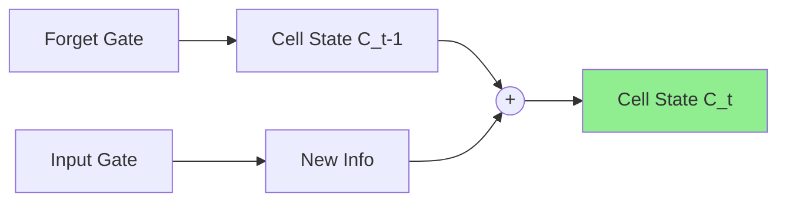

**LSTM gradient flow**:
```
∂C_t/∂C_(t-1) = f_t (forget gate)

Since f_t ∈ [0, 1] and is learned, gradient can flow without vanishing!
```

**GRU (simpler alternative)**:

```python
class GRUModel(nn.Module):
    def __init__(self, input_size, hidden_size, num_layers, num_classes):
        super().__init__()
        self.hidden_size = hidden_size
        self.num_layers = num_layers

        self.gru = nn.GRU(
            input_size=input_size,
            hidden_size=hidden_size,
            num_layers=num_layers,
            batch_first=True,
            dropout=0.2
        )

        self.fc = nn.Linear(hidden_size, num_classes)

    def forward(self, x):
        h0 = torch.zeros(self.num_layers, x.size(0), self.hidden_size).to(x.device)
        out, _ = self.gru(x, h0)
        out = self.fc(out[:, -1, :])
        return out
```

**GRU vs LSTM**:

| Feature | LSTM | GRU |
|---------|------|-----|
| Gates | 3 (input, forget, output) | 2 (reset, update) |
| Parameters | More | Fewer (faster training) |
| Performance | Slightly better on complex tasks | Comparable, faster |
| Memory | Cell state + hidden state | Hidden state only |

### Summary: Solution Checklist

**For vanishing gradients**:
- ✓ Use ReLU/Leaky ReLU/ELU activations
- ✓ Use He initialization for ReLU
- ✓ Use Xavier initialization for tanh
- ✓ Add Batch Normalization
- ✓ Use residual connections for very deep networks
- ✓ Use LSTM/GRU for sequence models

**For exploding gradients**:
- ✓ Implement gradient clipping (clip_grad_norm_)
- ✓ Use proper weight initialization
- ✓ Reduce learning rate
- ✓ Add Batch Normalization
- ✓ Monitor gradient norms during training

**Monitoring**:
```python
def monitor_gradients(model, threshold=10.0):
    """Check gradient health"""
    total_norm = 0
    for p in model.parameters():
        if p.grad is not None:
            param_norm = p.grad.data.norm(2)
            total_norm += param_norm.item() ** 2
    total_norm = total_norm ** 0.5

    if total_norm > threshold:
        print(f"⚠️ Large gradients: {total_norm:.4f}")
    elif total_norm < 1e-7:
        print(f"⚠️ Vanishing gradients: {total_norm:.2e}")
    else:
        print(f"✓ Healthy gradients: {total_norm:.4f}")

    return total_norm

# Use after backward()
loss.backward()
grad_norm = monitor_gradients(model)
optimizer.step()
```

---

## Regularization Techniques

### L2 Regularization (Weight Decay)

**Modified loss**:
```
L_total = L_data + λ × Σ(w²)

λ = regularization strength
```

**Effect**:
- Penalizes large weights
- Encourages weight spreading
- Smoother decision boundaries

**Gradient update**:
```
w := w - α × (∂L/∂w + 2λw)
  = (1 - 2αλ)w - α × ∂L/∂w

Effective "decay" of weights
```

**PyTorch**:
```python
optimizer = torch.optim.Adam(model.parameters(),
                             lr=0.001,
                             weight_decay=0.0001)  # λ = 0.0001
```

**Typical values**: λ ∈ [10^(-5), 10^(-2)]

### L1 Regularization

**Modified loss**:
```
L_total = L_data + λ × Σ|w|
```

**Effect**:
- Encourages sparsity (many weights → 0)
- Feature selection
- Less common in deep learning

### Dropout

**During training**: Randomly set fraction p of neurons to 0

**During testing**: Use all neurons, scale outputs by (1-p)

```python
# Training
if training:
    mask = (torch.rand(x.shape) > dropout_rate).float()
    x = x * mask / (1 - dropout_rate)  # Scale to maintain expected value

# Testing
else:
    x = x  # Use all neurons
```

**Advantages**:
- Prevents co-adaptation of neurons
- Ensemble effect (trains multiple sub-networks)
- Reduces overfitting significantly

**Typical values**:
```
- Hidden layers: 0.2-0.5
- Input layer: 0.1-0.2 (if at all)
- Output layer: Never
```

**PyTorch**:
```python
self.dropout = nn.Dropout(p=0.5)

# In forward
x = self.dropout(x)  # Automatically handles train/eval modes
```

**Inverted Dropout** (PyTorch default):
- Scale during training instead of testing
- More efficient inference

### Batch Normalization

**Normalize layer inputs** to have mean 0, variance 1

**For mini-batch**:
```
μ_B = (1/m) Σ x_i          (batch mean)
σ²_B = (1/m) Σ(x_i - μ_B)² (batch variance)

x̂_i = (x_i - μ_B) / √(σ²_B + ε)  (normalize)

y_i = γx̂_i + β  (scale and shift, learnable)
```

**Benefits**:
- Faster training (higher learning rates possible)
- Reduces internal covariate shift
- Mild regularization effect
- Less sensitive to initialization

**Where to apply**:
```
Option 1: After activation
x → Linear → ReLU → BatchNorm → next layer

Option 2: Before activation (more common)
x → Linear → BatchNorm → ReLU → next layer
```

**During inference**:
- Use running statistics (μ, σ) collected during training
- Don't normalize with batch statistics

**PyTorch**:
```python
self.bn = nn.BatchNorm1d(num_features)

# In forward
x = self.linear(x)
x = self.bn(x)
x = self.relu(x)
```

**Batch Norm vs Dropout**:
```
Can use together, but order matters:
- Recommended: BatchNorm before Dropout
- Some papers suggest not using both
- Experiment for your problem
```

### Early Stopping

**Monitor validation loss** during training

**Algorithm**:
```
1. Track validation loss each epoch
2. Save model when validation loss improves
3. If validation loss doesn't improve for 'patience' epochs:
   - Stop training
   - Restore best model
```

**Advantages**:
- Prevents overfitting
- Automatic stopping
- Saves computation

**PyTorch Example**:
```python
best_val_loss = float('inf')
patience = 10
patience_counter = 0

for epoch in range(max_epochs):
    train_loss = train(model, train_loader)
    val_loss = validate(model, val_loader)

    if val_loss < best_val_loss:
        best_val_loss = val_loss
        torch.save(model.state_dict(), 'best_model.pth')
        patience_counter = 0
    else:
        patience_counter += 1

    if patience_counter >= patience:
        print(f"Early stopping at epoch {epoch}")
        model.load_state_dict(torch.load('best_model.pth'))
        break
```

---

## Training Best Practices

### Complete Training Pipeline

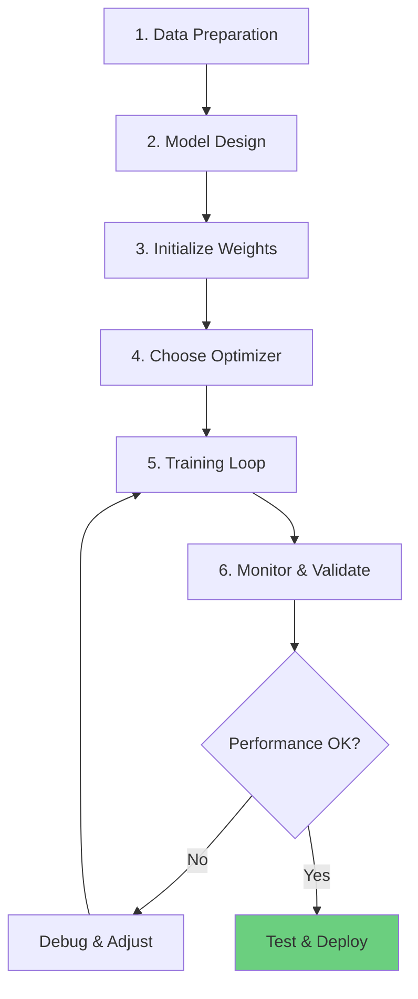

### 1. Data Preparation

**Normalization**:
```python
# Compute statistics on training set
mean = X_train.mean(axis=0)
std = X_train.std(axis=0)

# Apply to all sets
X_train = (X_train - mean) / std
X_val = (X_val - mean) / std
X_test = (X_test - mean) / std
```

**Data Augmentation** (for images):
```python
from torchvision import transforms

transform = transforms.Compose([
    transforms.RandomHorizontalFlip(),
    transforms.RandomRotation(10),
    transforms.ColorJitter(brightness=0.2),
    transforms.ToTensor(),
    transforms.Normalize(mean=[0.485, 0.456, 0.406],
                        std=[0.229, 0.224, 0.225])
])
```

### 2. Model Architecture

**Start Simple**:
```python
# Begin with baseline
model = nn.Sequential(
    nn.Linear(input_size, 64),
    nn.ReLU(),
    nn.Linear(64, num_classes)
)

# Add complexity if needed
model = nn.Sequential(
    nn.Linear(input_size, 128),
    nn.BatchNorm1d(128),
    nn.ReLU(),
    nn.Dropout(0.3),
    nn.Linear(128, 64),
    nn.BatchNorm1d(64),
    nn.ReLU(),
    nn.Dropout(0.3),
    nn.Linear(64, num_classes)
)
```

### 3. Hyperparameter Selection

**Priority Order**:
1. **Learning rate**: Most important
2. **Batch size**: Affects stability and speed
3. **Architecture**: Depth, width
4. **Regularization**: Dropout, weight decay
5. **Optimizer parameters**: β₁, β₂ (usually keep default)

**Learning Rate Finding**:
```python
# Learning rate range test
lrs = []
losses = []

for lr in np.logspace(-5, 0, 100):
    optimizer = optim.Adam(model.parameters(), lr=lr)
    # Train for 1 batch
    loss = train_one_batch(model, optimizer, train_loader)
    lrs.append(lr)
    losses.append(loss)

# Plot and choose LR before loss explodes
import matplotlib.pyplot as plt
plt.plot(lrs, losses)
plt.xscale('log')
plt.xlabel('Learning Rate')
plt.ylabel('Loss')
```

### 4. Training Monitoring

**Metrics to Track**:
```python
history = {
    'train_loss': [],
    'val_loss': [],
    'train_acc': [],
    'val_acc': [],
    'learning_rate': []
}

# Each epoch
history['train_loss'].append(train_loss)
history['val_loss'].append(val_loss)
# ... etc
```

**Visualization**:
```python
plt.figure(figsize=(12, 4))

plt.subplot(1, 2, 1)
plt.plot(history['train_loss'], label='Train')
plt.plot(history['val_loss'], label='Validation')
plt.xlabel('Epoch')
plt.ylabel('Loss')
plt.legend()

plt.subplot(1, 2, 2)
plt.plot(history['train_acc'], label='Train')
plt.plot(history['val_acc'], label='Validation')
plt.xlabel('Epoch')
plt.ylabel('Accuracy')
plt.legend()
```

### 5. Debugging Training Issues

**Loss not decreasing**:
```
- Check learning rate (try smaller)
- Check data preprocessing
- Verify loss function
- Check for bugs in forward pass
- Try simpler model first
```

**Loss decreasing but high training error**:
```
- Model too simple (underfit)
- Learning rate too high
- Bad initialization
- Incorrect loss function
```

**Train accuracy high, val accuracy low** (overfit):
```
- Add regularization (dropout, weight decay)
- Get more data
- Reduce model complexity
- Data augmentation
- Early stopping
```

**Training unstable** (loss spikes):
```
- Reduce learning rate
- Use gradient clipping
- Check for NaN/Inf in data
- Smaller batch size
- Better initialization
```

---

## PyTorch Training Implementation

### Complete Training Script

```python
import torch
import torch.nn as nn
import torch.optim as optim
from torch.utils.data import DataLoader, TensorDataset, random_split
import numpy as np
import matplotlib.pyplot as plt

# Set random seeds for reproducibility
torch.manual_seed(42)
np.random.seed(42)

class NeuralNetwork(nn.Module):
    def __init__(self, input_size, hidden_sizes, num_classes, dropout_rate=0.3):
        super(NeuralNetwork, self).__init__()

        layers = []
        prev_size = input_size

        # Hidden layers
        for hidden_size in hidden_sizes:
            layers.append(nn.Linear(prev_size, hidden_size))
            layers.append(nn.BatchNorm1d(hidden_size))
            layers.append(nn.ReLU())
            layers.append(nn.Dropout(dropout_rate))
            prev_size = hidden_size

        # Output layer
        layers.append(nn.Linear(prev_size, num_classes))

        self.network = nn.Sequential(*layers)

        # Initialize weights
        self.apply(self._init_weights)

    def _init_weights(self, module):
        if isinstance(module, nn.Linear):
            nn.init.kaiming_normal_(module.weight, mode='fan_in', nonlinearity='relu')
            if module.bias is not None:
                nn.init.zeros_(module.bias)

    def forward(self, x):
        return self.network(x)

class Trainer:
    def __init__(self, model, train_loader, val_loader, criterion, optimizer,
                 scheduler=None, device='cpu'):
        self.model = model.to(device)
        self.train_loader = train_loader
        self.val_loader = val_loader
        self.criterion = criterion
        self.optimizer = optimizer
        self.scheduler = scheduler
        self.device = device

        self.history = {
            'train_loss': [],
            'val_loss': [],
            'train_acc': [],
            'val_acc': [],
            'lr': []
        }

    def train_epoch(self):
        self.model.train()
        total_loss = 0
        correct = 0
        total = 0

        for batch_X, batch_y in self.train_loader:
            batch_X, batch_y = batch_X.to(self.device), batch_y.to(self.device)

            # Zero gradients
            self.optimizer.zero_grad()

            # Forward pass
            outputs = self.model(batch_X)
            loss = self.criterion(outputs, batch_y)

            # Backward pass
            loss.backward()

            # Gradient clipping (optional)
            torch.nn.utils.clip_grad_norm_(self.model.parameters(), max_norm=1.0)

            # Update weights
            self.optimizer.step()

            # Track metrics
            total_loss += loss.item()
            _, predicted = torch.max(outputs.data, 1)
            total += batch_y.size(0)
            correct += (predicted == batch_y).sum().item()

        avg_loss = total_loss / len(self.train_loader)
        accuracy = 100 * correct / total
        return avg_loss, accuracy

    def validate(self):
        self.model.eval()
        total_loss = 0
        correct = 0
        total = 0

        with torch.no_grad():
            for batch_X, batch_y in self.val_loader:
                batch_X, batch_y = batch_X.to(self.device), batch_y.to(self.device)

                outputs = self.model(batch_X)
                loss = self.criterion(outputs, batch_y)

                total_loss += loss.item()
                _, predicted = torch.max(outputs.data, 1)
                total += batch_y.size(0)
                correct += (predicted == batch_y).sum().item()

        avg_loss = total_loss / len(self.val_loader)
        accuracy = 100 * correct / total
        return avg_loss, accuracy

    def fit(self, num_epochs, patience=10, verbose=True):
        best_val_loss = float('inf')
        patience_counter = 0

        for epoch in range(num_epochs):
            # Training
            train_loss, train_acc = self.train_epoch()

            # Validation
            val_loss, val_acc = self.validate()

            # Learning rate scheduling
            if self.scheduler:
                self.scheduler.step(val_loss)

            # Record history
            self.history['train_loss'].append(train_loss)
            self.history['val_loss'].append(val_loss)
            self.history['train_acc'].append(train_acc)
            self.history['val_acc'].append(val_acc)
            self.history['lr'].append(self.optimizer.param_groups[0]['lr'])

            # Print progress
            if verbose and (epoch + 1) % 5 == 0:
                print(f'Epoch [{epoch+1}/{num_epochs}]')
                print(f'  Train Loss: {train_loss:.4f}, Train Acc: {train_acc:.2f}%')
                print(f'  Val Loss: {val_loss:.4f}, Val Acc: {val_acc:.2f}%')
                print(f'  LR: {self.optimizer.param_groups[0]["lr"]:.6f}')

            # Early stopping
            if val_loss < best_val_loss:
                best_val_loss = val_loss
                torch.save(self.model.state_dict(), 'best_model.pth')
                patience_counter = 0
            else:
                patience_counter += 1

            if patience_counter >= patience:
                print(f'\nEarly stopping at epoch {epoch+1}')
                self.model.load_state_dict(torch.load('best_model.pth'))
                break

        return self.history

    def plot_history(self):
        fig, axes = plt.subplots(1, 3, figsize=(15, 4))

        # Loss
        axes[0].plot(self.history['train_loss'], label='Train')
        axes[0].plot(self.history['val_loss'], label='Validation')
        axes[0].set_xlabel('Epoch')
        axes[0].set_ylabel('Loss')
        axes[0].set_title('Training and Validation Loss')
        axes[0].legend()
        axes[0].grid(True)

        # Accuracy
        axes[1].plot(self.history['train_acc'], label='Train')
        axes[1].plot(self.history['val_acc'], label='Validation')
        axes[1].set_xlabel('Epoch')
        axes[1].set_ylabel('Accuracy (%)')
        axes[1].set_title('Training and Validation Accuracy')
        axes[1].legend()
        axes[1].grid(True)

        # Learning Rate
        axes[2].plot(self.history['lr'])
        axes[2].set_xlabel('Epoch')
        axes[2].set_ylabel('Learning Rate')
        axes[2].set_title('Learning Rate Schedule')
        axes[2].set_yscale('log')
        axes[2].grid(True)

        plt.tight_layout()
        plt.savefig('training_history.png', dpi=150, bbox_inches='tight')
        plt.show()

# Example usage
if __name__ == '__main__':
    # Generate dummy data
    X = torch.randn(10000, 50)
    y = torch.randint(0, 10, (10000,))

    # Split dataset
    dataset = TensorDataset(X, y)
    train_size = int(0.7 * len(dataset))
    val_size = int(0.15 * len(dataset))
    test_size = len(dataset) - train_size - val_size

    train_dataset, val_dataset, test_dataset = random_split(
        dataset, [train_size, val_size, test_size]
    )

    # Create data loaders
    train_loader = DataLoader(train_dataset, batch_size=64, shuffle=True)
    val_loader = DataLoader(val_dataset, batch_size=64, shuffle=False)
    test_loader = DataLoader(test_dataset, batch_size=64, shuffle=False)

    # Initialize model
    model = NeuralNetwork(
        input_size=50,
        hidden_sizes=[128, 64, 32],
        num_classes=10,
        dropout_rate=0.3
    )

    # Loss and optimizer
    criterion = nn.CrossEntropyLoss()
    optimizer = optim.AdamW(
        model.parameters(),
        lr=0.001,
        weight_decay=0.0001
    )

    # Learning rate scheduler
    scheduler = optim.lr_scheduler.ReduceLROnPlateau(
        optimizer, mode='min', factor=0.5, patience=5, verbose=True
    )

    # Device
    device = torch.device('cuda' if torch.cuda.is_available() else 'cpu')
    print(f'Using device: {device}')

    # Train
    trainer = Trainer(
        model=model,
        train_loader=train_loader,
        val_loader=val_loader,
        criterion=criterion,
        optimizer=optimizer,
        scheduler=scheduler,
        device=device
    )

    history = trainer.fit(num_epochs=100, patience=15, verbose=True)

    # Plot results
    trainer.plot_history()

    # Final test evaluation
    model.eval()
    test_loss = 0
    correct = 0
    total = 0

    with torch.no_grad():
        for batch_X, batch_y in test_loader:
            batch_X, batch_y = batch_X.to(device), batch_y.to(device)
            outputs = model(batch_X)
            loss = criterion(outputs, batch_y)
            test_loss += loss.item()
            _, predicted = torch.max(outputs.data, 1)
            total += batch_y.size(0)
            correct += (predicted == batch_y).sum().item()

    test_loss /= len(test_loader)
    test_acc = 100 * correct / total

    print(f'\nFinal Test Results:')
    print(f'Test Loss: {test_loss:.4f}')
    print(f'Test Accuracy: {test_acc:.2f}%')
```

---

## Interview Questions

**Q1: Explain the backpropagation algorithm and why it's efficient.**

A: **Backpropagation** computes gradients of the loss with respect to all weights using the chain rule, working backward from output to input.

**Why efficient?**
1. **Single backward pass**: Computes all gradients at once
2. **Dynamic programming**: Reuses intermediate computations
3. **Computational cost**: O(W) - same as forward pass

**Process**:
```
1. Forward pass: Compute and store activations
2. Compute output gradient: ∂L/∂ŷ
3. Backward pass (for each layer l from L to 1):
   - Compute δ^[l] = ∂L/∂z^[l]
   - Compute ∂L/∂W^[l] = δ^[l] (a^[l-1])^T
   - Propagate to previous layer
4. Update weights using gradients
```

**Without backprop**: Would need to compute each gradient separately (very slow!)

**Q2: Compare SGD, Momentum, and Adam optimizers.**

A:

**SGD** (Stochastic Gradient Descent):
```
θ := θ - α × ∇L(θ)

Pros: Simple, guaranteed convergence (convex)
Cons: Slow, sensitive to learning rate, oscillates
```

**SGD + Momentum**:
```
v := βv + (1-β)∇L(θ)
θ := θ - α × v

Pros: Faster, dampens oscillations, accumulates velocity
Cons: Additional hyperparameter (β)
```

**Adam**:
```
Combines momentum + adaptive learning rates

Pros:
- Fast convergence
- Robust to hyperparameters
- Default choice for most problems
- Handles sparse gradients well

Cons:
- May not converge to best solution
- More complex
- Higher memory usage
```

**When to use**:
- **Adam**: Default, most problems, quick experiments
- **SGD + Momentum**: CNNs with careful tuning, best final performance
- **AdamW**: Transformers, NLP

**Q3: What is the vanishing/exploding gradient problem and how do you solve it?**

A: **Vanishing Gradients**: Gradients become very small during backpropagation, making early layers learn extremely slowly.

**Causes**:
- Activation functions (sigmoid/tanh saturate)
- Deep networks (many multiplications)
- Poor weight initialization

**Solutions**:
1. **ReLU activation**: Gradient = 1 for positive inputs
2. **Proper initialization**: He for ReLU, Xavier for tanh
3. **Batch Normalization**: Normalizes layer inputs
4. **Residual connections** (ResNet): Shortcuts for gradient flow
5. **Careful architecture design**: Don't go too deep

**Exploding Gradients**: Gradients become very large, causing unstable training.

**Solutions**:
1. **Gradient clipping**: Cap gradient norm
   ```python
   torch.nn.utils.clip_grad_norm_(model.parameters(), max_norm=1.0)
   ```
2. **Lower learning rate**
3. **Better initialization**
4. **Batch Normalization**

**Q4: Explain dropout and why it prevents overfitting.**

A: **Dropout**: During training, randomly set a fraction p of neurons to 0.

**How it works**:
```
Training: Keep each neuron with probability (1-p)
Testing: Use all neurons, no dropout
```

**Why it prevents overfitting**:
1. **Prevents co-adaptation**: Neurons can't rely on specific other neurons
2. **Ensemble effect**: Trains 2^n sub-networks, averages at test time
3. **Forces redundancy**: Network learns robust features
4. **Regularization**: Similar to L2, but different mechanism

**Analogy**: Like practicing with random teammates - forces you to be independently skilled.

**Typical values**:
- 0.2-0.5 for hidden layers
- Never on output layer
- Sometimes 0.1-0.2 on input (rare)

**Q5: How do you choose learning rate and why does it matter?**

A: **Learning rate** is the most important hyperparameter.

**Why it matters**:
```
Too small:
- Very slow convergence
- May get stuck in plateaus
- Wastes computation

Too large:
- Oscillation around minimum
- Divergence
- Never converges

Optimal:
- Fast convergence
- Reaches good minimum
```

**How to choose**:

**1. Learning Rate Range Test**:
```python
# Try exponentially increasing LRs
for lr in [1e-5, 1e-4, 1e-3, 1e-2, 1e-1]:
    train_for_few_batches(lr)
    plot_loss()
# Choose LR before loss explodes
```

**2. Default Values**:
```
- Adam: 0.001 (good default)
- SGD: 0.01-0.1 (needs tuning)
- Start conservative, increase if too slow
```

**3. Learning Rate Scheduling**:
```python
# ReduceLROnPlateau: Reduce when plateaus
scheduler = optim.lr_scheduler.ReduceLROnPlateau(
    optimizer, factor=0.5, patience=5
)

# CosineAnnealing: Smooth decrease
scheduler = optim.lr_scheduler.CosineAnnealingLR(
    optimizer, T_max=50
)

# StepLR: Decrease at intervals
scheduler = optim.lr_scheduler.StepLR(
    optimizer, step_size=30, gamma=0.1
)
```

**4. Warmup** (for large batch sizes):
```
Linearly increase LR from 0 to target over first few epochs
Helps avoid early instability
```

---

## Summary

### Training Pipeline Checklist

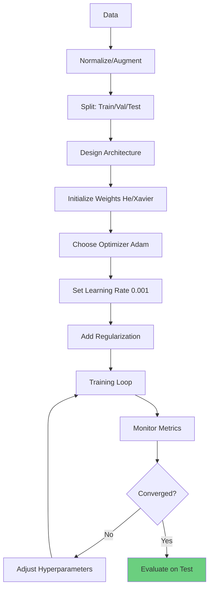

### Key Formulas

**Backpropagation**:
```
δ^[l] = (W^[l+1]^T δ^[l+1]) ⊙ σ'(z^[l])
∂L/∂W^[l] = δ^[l] (a^[l-1])^T
```

**Adam**:
```
m_t = β₁m_{t-1} + (1-β₁)∇L
v_t = β₂v_{t-1} + (1-β₂)(∇L)²
θ := θ - α × m̂_t / (√v̂_t + ε)
```

**Dropout**:
```
Training: a = a × mask / (1-p)
Testing: a = a
```

### Default Configuration

```python
# Good starting point for most problems
model = NeuralNetwork(...)

optimizer = optim.Adam(
    model.parameters(),
    lr=0.001,
    weight_decay=0.0001  # L2 regularization
)

scheduler = optim.lr_scheduler.ReduceLROnPlateau(
    optimizer, factor=0.5, patience=5
)

# Training
- Batch size: 64
- Dropout: 0.3
- Activation: ReLU
- Initialization: He
- Early stopping patience: 10-15
```

---

**Document Created**: 2025
**Target Audience**: Zero to Architect
**Prerequisites**: Neural Networks Fundamentals Guide
**Complete Coverage**: Backpropagation, Gradient Descent, Optimizers, Regularization, PyTorch Training

