# Statistics and Probability Foundations for Machine Learning: Zero to Architect

## Table of Contents
1. [Introduction](#introduction)
2. [Descriptive Statistics](#descriptive-statistics)
3. [Probability Theory](#probability-theory)
4. [Probability Distributions](#probability-distributions)
5. [Statistical Inference](#statistical-inference)
6. [Hypothesis Testing](#hypothesis-testing)
7. [Correlation and Dependence](#correlation-and-dependence)
8. [Practical Implementation](#practical-implementation)
9. [Interview Questions](#interview-questions)

---

## Introduction

### Why Statistics Matters in Machine Learning

Statistics provides the mathematical foundation for understanding data, making predictions, and drawing inferences. Every machine learning algorithm relies on statistical principles:

- **Linear/Logistic Regression**: Built on statistical inference and maximum likelihood
- **Neural Networks**: Use probabilistic frameworks for optimization
- **Bayesian Methods**: Directly apply probability theory
- **Evaluation Metrics**: Based on statistical measures

### Learning Path

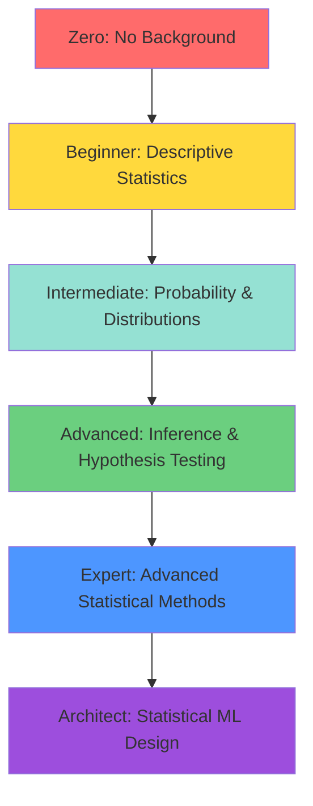

---

## Descriptive Statistics

### Measures of Central Tendency

#### Mean (Arithmetic Average)

**Definition**: Sum of all values divided by the number of values

```
Mean (μ or x̄) = (Σx_i) / n
```

**Properties**:
- Sensitive to outliers
- Best for symmetric distributions
- Used in: Most ML algorithms (gradient descent, linear regression)

**Example**:
```
Data: [10, 20, 30, 40, 50]
Mean = (10 + 20 + 30 + 40 + 50) / 5 = 30
```

**With outlier**:
```
Data: [10, 20, 30, 40, 1000]
Mean = 220 (pulled heavily by outlier)
```

#### Median

**Definition**: Middle value when data is sorted

**Properties**:
- Robust to outliers
- Better for skewed distributions
- Divides data into two equal halves

**Example**:
```
Data: [10, 20, 30, 40, 50]
Median = 30 (middle value)

Data: [10, 20, 30, 40, 1000]
Median = 30 (still middle, not affected by outlier)
```

**For even number of observations**:
```
Data: [10, 20, 30, 40]
Median = (20 + 30) / 2 = 25
```

#### Mode

**Definition**: Most frequently occurring value

**Properties**:
- Can have multiple modes (bimodal, multimodal)
- Only measure suitable for categorical data
- May not exist for continuous data without binning

**Example**:
```
Data: [1, 2, 2, 3, 3, 3, 4, 5]
Mode = 3 (appears 3 times)

Bimodal: [1, 1, 1, 2, 3, 4, 4, 4]
Modes = 1 and 4
```

#### When to Use Which?

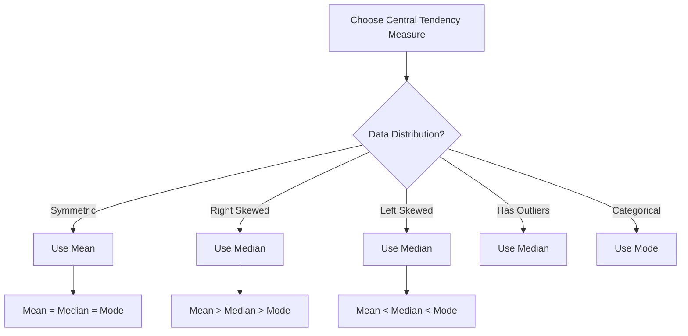

**Real-world applications**:
- **House prices**: Use median (right-skewed, outliers exist)
- **Test scores**: Use mean (typically symmetric)
- **Income**: Use median (heavily right-skewed)
- **Customer ratings**: Use mode or median

### Measures of Dispersion (Spread)

#### Range

**Definition**: Difference between maximum and minimum values

```
Range = max(X) - min(X)
```

**Properties**:
- Simplest measure of spread
- Highly sensitive to outliers
- Doesn't use all data points

**Example**:
```
Data: [10, 15, 20, 25, 30]
Range = 30 - 10 = 20
```

#### Variance

**Definition**: Average of squared differences from the mean

**Population Variance**:
```
σ² = Σ(x_i - μ)² / N
```

**Sample Variance** (Bessel's Correction):
```
s² = Σ(x_i - x̄)² / (n - 1)
```

**Why (n-1)?**
- Corrects for bias in sample variance
- Sample variance underestimates population variance
- Using (n-1) creates an unbiased estimator

**Properties**:
- Units are squared (hard to interpret)
- Always non-negative
- Zero variance means all values are identical

**Example**:
```
Data: [2, 4, 6, 8, 10]
Mean = 6

Deviations: [-4, -2, 0, 2, 4]
Squared: [16, 4, 0, 4, 16]
Variance = (16 + 4 + 0 + 4 + 16) / 4 = 10
```

#### Standard Deviation

**Definition**: Square root of variance

```
σ = √(variance)
```

**Properties**:
- Same units as original data
- More interpretable than variance
- 68-95-99.7 rule for normal distributions

**68-95-99.7 Rule** (Empirical Rule):
```
68% of data within μ ± 1σ
95% of data within μ ± 2σ
99.7% of data within μ ± 3σ
```

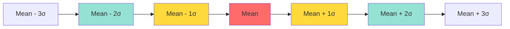

#### Coefficient of Variation (CV)

**Definition**: Relative measure of dispersion

```
CV = (σ / μ) × 100%
```

**Properties**:
- Unitless (allows comparison across different scales)
- Only for ratio scale data (values > 0)
- Lower CV = more consistent data

**Example**:
```
Stock A: Mean = $10, SD = $2
CV_A = (2/10) × 100% = 20%

Stock B: Mean = $100, SD = $10
CV_B = (10/100) × 100% = 10%

Stock B is less volatile relative to its price
```

#### Interquartile Range (IQR)

**Definition**: Range of middle 50% of data

```
IQR = Q3 - Q1

where:
Q1 = 25th percentile
Q3 = 75th percentile
```

**Outlier Detection**:
```
Lower bound = Q1 - 1.5 × IQR
Upper bound = Q3 + 1.5 × IQR

Values outside these bounds are outliers
```

**Example**:
```
Data (sorted): [10, 15, 20, 25, 30, 35, 40, 45, 100]

Q1 = 17.5 (25th percentile)
Q3 = 42.5 (75th percentile)
IQR = 42.5 - 17.5 = 25

Lower bound = 17.5 - 1.5(25) = -20
Upper bound = 42.5 + 1.5(25) = 80

100 is an outlier
```

### Visual Representations

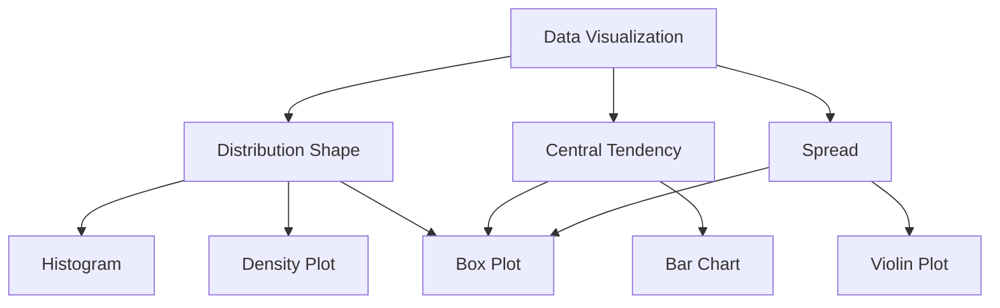

---

## Probability Theory

### Fundamental Concepts

#### Sample Space and Events

**Sample Space (S or Ω)**: Set of all possible outcomes

**Event (E)**: Subset of sample space

**Examples**:
```
Coin flip:
S = {Heads, Tails}
E₁ = {Heads}

Die roll:
S = {1, 2, 3, 4, 5, 6}
E₁ = {even numbers} = {2, 4, 6}
E₂ = {greater than 4} = {5, 6}
```

#### Probability Axioms

**Kolmogorov's Axioms**:

1. **Non-negativity**: P(E) ≥ 0 for any event E
2. **Normalization**: P(S) = 1
3. **Additivity**: For mutually exclusive events E₁, E₂:
   ```
   P(E₁ ∪ E₂) = P(E₁) + P(E₂)
   ```

**Derived Rules**:
```
P(∅) = 0 (empty set)
P(E') = 1 - P(E) (complement)
0 ≤ P(E) ≤ 1
```

#### Conditional Probability

**Definition**: Probability of A given B has occurred

```
P(A|B) = P(A ∩ B) / P(B)

where P(B) > 0
```

**Interpretation**: Adjust probability based on new information

**Example**:
```
Card deck: P(King) = 4/52 = 1/13

Given card is a face card:
P(King | Face card) = 4/12 = 1/3

Higher probability with additional information!
```

```mermaid
graph TD
    A[Total Sample Space] --> B[Condition B Occurs]
    B --> C[Among B, find A]
    C --> D[P A|B = P A∩B / P B]

    style A fill:#e8f4f8
    style B fill:#b8e6f0
    style C fill:#88d8e8
    style D fill:#58cad8
```

#### Independence

**Definition**: Events A and B are independent if:

```
P(A ∩ B) = P(A) × P(B)

Equivalently:
P(A|B) = P(A)
P(B|A) = P(B)
```

**Interpretation**: Occurrence of one doesn't affect the other

**Examples**:

**Independent**:
```
Two coin flips:
P(H₁ ∩ H₂) = 1/2 × 1/2 = 1/4
```

**Dependent**:
```
Draw two cards without replacement:
P(King₁ ∩ King₂) = 4/52 × 3/51 ≠ 4/52 × 4/52
```

#### Bayes' Theorem

**Formula**:
```
P(A|B) = [P(B|A) × P(A)] / P(B)

Expanded:
P(A|B) = [P(B|A) × P(A)] / [P(B|A) × P(A) + P(B|A') × P(A')]
```

**Components**:
- **P(A|B)**: Posterior probability (what we want)
- **P(B|A)**: Likelihood
- **P(A)**: Prior probability
- **P(B)**: Evidence

```mermaid
graph LR
    A[Prior P A] --> B[Bayes Theorem]
    C[Likelihood P B|A] --> B
    D[Evidence P B] --> B
    B --> E[Posterior P A|B]

    style A fill:#ffd93d
    style C fill:#95e1d3
    style D fill:#b8e6f0
    style E fill:#6bcf7f
```

**Medical Testing Example**:
```
Disease prevalence: P(D) = 0.01 (1%)
Test sensitivity: P(+|D) = 0.95 (95%)
Test specificity: P(-|D') = 0.90 (90%)

Find: P(D|+) = ?

P(+|D') = 1 - 0.90 = 0.10

P(D|+) = [0.95 × 0.01] / [0.95 × 0.01 + 0.10 × 0.99]
       = 0.0095 / (0.0095 + 0.099)
       = 0.0095 / 0.1085
       = 0.0875 ≈ 8.75%

Only 8.75% chance of having disease even with positive test!
```

**ML Application**: Naive Bayes classifier uses this principle

---

## Probability Distributions

### Discrete Distributions

#### Bernoulli Distribution

**Definition**: Models a single binary outcome

**Parameters**: p (probability of success)

**PMF**:
```
P(X = 1) = p
P(X = 0) = 1 - p
```

**Properties**:
```
Mean (μ) = p
Variance (σ²) = p(1 - p)
```

**Example**: Single coin flip, click/no-click on ad

#### Binomial Distribution

**Definition**: Number of successes in n independent Bernoulli trials

**Parameters**: n (trials), p (success probability)

**PMF**:
```
P(X = k) = C(n,k) × p^k × (1-p)^(n-k)

where C(n,k) = n! / (k! × (n-k)!)
```

**Properties**:
```
Mean (μ) = np
Variance (σ²) = np(1-p)
Standard Deviation (σ) = √(np(1-p))
```

**Example**:
```
10 coin flips, probability of exactly 6 heads:
n = 10, k = 6, p = 0.5

P(X = 6) = C(10,6) × 0.5^6 × 0.5^4
         = 210 × 0.015625 × 0.0625
         = 0.205
```

**ML Application**: Binary classification outcomes over multiple samples

#### Poisson Distribution

**Definition**: Number of events in fixed interval

**Parameter**: λ (average rate)

**PMF**:
```
P(X = k) = (λ^k × e^(-λ)) / k!
```

**Properties**:
```
Mean (μ) = λ
Variance (σ²) = λ
```

**Example**:
```
Average 3 customers per hour
Probability of exactly 5 customers:

P(X = 5) = (3^5 × e^(-3)) / 5!
         = (243 × 0.0498) / 120
         = 0.101
```

**When to use**:
- Rare events
- Event rate is constant
- Events are independent
- Examples: Website visits, defects in manufacturing, call center calls

**Relationship to Binomial**:
```
When n is large and p is small:
Binomial(n, p) ≈ Poisson(λ = np)
```

### Continuous Distributions

#### Uniform Distribution

**Definition**: All values equally likely in an interval

**Parameters**: a (min), b (max)

**PDF**:
```
f(x) = 1/(b-a)  for a ≤ x ≤ b
     = 0        otherwise
```

**Properties**:
```
Mean (μ) = (a + b) / 2
Variance (σ²) = (b - a)² / 12
```

**Example**: Random number generation, initial parameter values

#### Normal Distribution (Gaussian)

**Definition**: Bell-shaped symmetric distribution

**Parameters**: μ (mean), σ (standard deviation)

**PDF**:
```
f(x) = (1 / (σ√(2π))) × e^(-(x-μ)²/(2σ²))
```

**Properties**:
```
Mean = μ
Median = μ
Mode = μ
Variance = σ²
Symmetry: f(μ-x) = f(μ+x)
```

**Standard Normal Distribution**:
```
Z ~ N(0, 1)
μ = 0, σ = 1

Standardization:
Z = (X - μ) / σ
```

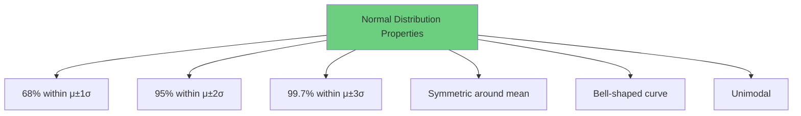

**Why Normal Distribution Matters**:
1. Many natural phenomena are normally distributed
2. Central Limit Theorem (CLT)
3. Mathematical tractability
4. Foundation for many statistical tests

**ML Applications**:
- Feature distributions (after transformation)
- Error terms in regression
- Weight initialization in neural networks
- Gaussian Naive Bayes

#### Exponential Distribution

**Definition**: Time between events in Poisson process

**Parameter**: λ (rate)

**PDF**:
```
f(x) = λe^(-λx)  for x ≥ 0
```

**Properties**:
```
Mean (μ) = 1/λ
Variance (σ²) = 1/λ²
Memoryless property: P(X > s+t | X > s) = P(X > t)
```

**Example**: Time until next customer arrival, system failure time

#### t-Distribution (Student's t)

**Definition**: Similar to normal but with heavier tails

**Parameter**: ν (degrees of freedom)

**Properties**:
```
Mean = 0 (for ν > 1)
Variance = ν/(ν-2) (for ν > 2)

As ν → ∞, t-distribution → Normal distribution
```

**When to use**:
- Small sample sizes (n < 30)
- Population standard deviation unknown
- Hypothesis testing with limited data

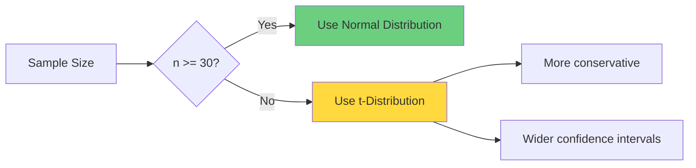

### Central Limit Theorem (CLT)

**Statement**:
```
For random sample X₁, X₂, ..., Xₙ from any distribution
with mean μ and variance σ²:

As n → ∞:
Sample Mean (X̄) ~ N(μ, σ²/n)
```

**Implications**:
1. Sample means are normally distributed (for large n)
2. Works regardless of original distribution shape
3. Typically n > 30 is sufficient

**Standard Error**:
```
SE(X̄) = σ / √n
```

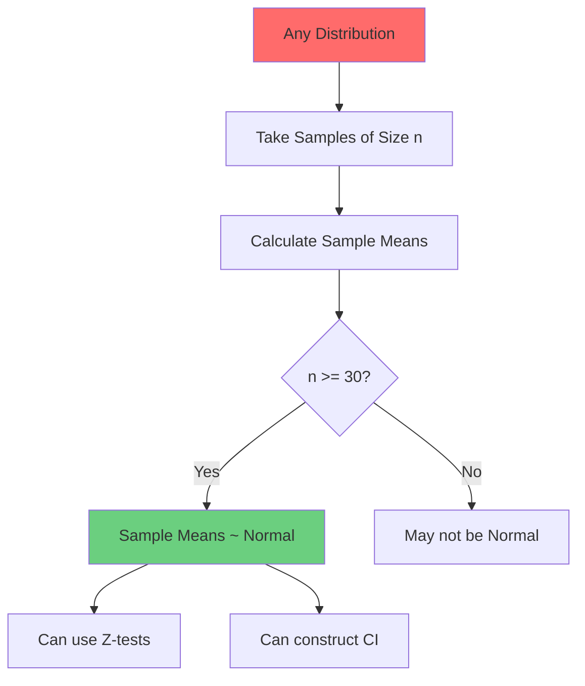

**Example**:
```
Population: Exponential(λ=2), NOT normal
μ = 0.5, σ = 0.5

Sample size n = 50:
X̄ ~ N(0.5, 0.5²/50) = N(0.5, 0.005)

Even though population is skewed, sample mean is approximately normal!
```

**ML Relevance**:
- Justifies using normal approximations
- Foundation for hypothesis testing
- Explains why averaging helps (ensemble methods)
- Batch gradient descent convergence

---

## Statistical Inference

### Point Estimation

**Goal**: Estimate population parameter from sample

#### Properties of Estimators

**Unbiased**:
```
E[θ̂] = θ

Sample mean is unbiased estimator of population mean
```

**Consistent**:
```
θ̂ → θ as n → ∞

Estimator converges to true value with more data
```

**Efficient**:
```
Has minimum variance among all unbiased estimators
```

**Example**:
```
Sample mean: X̄ = Σx_i / n
- Unbiased: E[X̄] = μ
- Consistent: Var(X̄) = σ²/n → 0
- Efficient: Minimum variance linear unbiased estimator
```

### Maximum Likelihood Estimation (MLE)

**Principle**: Find parameters that maximize probability of observed data

**Likelihood Function**:
```
L(θ|data) = P(data|θ)

For independent observations:
L(θ) = Π P(x_i|θ)
```

**Log-Likelihood**:
```
ℓ(θ) = log L(θ) = Σ log P(x_i|θ)

Maximizing ℓ is easier (sum instead of product)
```

**MLE Procedure**:
1. Write likelihood function
2. Take log-likelihood
3. Differentiate with respect to parameters
4. Set derivatives to zero
5. Solve for parameters

**Example: Normal Distribution**:
```
Data: x₁, x₂, ..., xₙ ~ N(μ, σ²)

Log-likelihood:
ℓ(μ, σ²) = -n/2 log(2π) - n/2 log(σ²) - Σ(x_i - μ)²/(2σ²)

∂ℓ/∂μ = 0  →  μ̂ = x̄ (sample mean)
∂ℓ/∂σ² = 0  →  σ̂² = Σ(x_i - x̄)²/n (biased estimator)
```

**MLE Properties**:
- **Consistent**: Converges to true value
- **Asymptotically normal**: Distribution becomes normal as n increases
- **Asymptotically efficient**: Achieves lowest possible variance
- **Invariance**: If θ̂ is MLE of θ, then g(θ̂) is MLE of g(θ)

```mermaid
graph TD
    A[Observed Data] --> B[Likelihood Function L θ|data]
    B --> C[Log-Likelihood ℓ θ]
    C --> D[Take Derivative]
    D --> E[Set to Zero]
    E --> F[Solve for θ̂]
    F --> G[MLE Estimate]

    style A fill:#e8f4f8
    style G fill:#6bcf7f
```

**ML Applications**:
- Logistic regression parameter estimation
- Neural network training (related to cross-entropy loss)
- Gaussian Mixture Models
- Hidden Markov Models

### Interval Estimation

#### Confidence Intervals

**Definition**: Range that contains true parameter with specified probability

**General Form**:
```
θ̂ ± (critical value) × SE(θ̂)
```

**For Population Mean** (σ known):
```
CI = x̄ ± z_(α/2) × (σ/√n)

where z_(α/2) is critical value from standard normal
```

**For Population Mean** (σ unknown, n < 30):
```
CI = x̄ ± t_(α/2, n-1) × (s/√n)

where t_(α/2, n-1) is critical value from t-distribution
```

**Interpretation**:
```
95% CI means:
"If we repeat this procedure 100 times,
95 of the intervals will contain the true parameter"

NOT: "95% probability true parameter is in this interval"
```

**Example**:
```
Sample: n = 25, x̄ = 50, s = 10
Find 95% CI for population mean

t_(0.025, 24) = 2.064

CI = 50 ± 2.064 × (10/√25)
   = 50 ± 2.064 × 2
   = 50 ± 4.128
   = [45.872, 54.128]
```

**Factors Affecting CI Width**:
1. **Confidence level** ↑ → Width ↑
2. **Sample size** ↑ → Width ↓
3. **Variability** ↑ → Width ↑

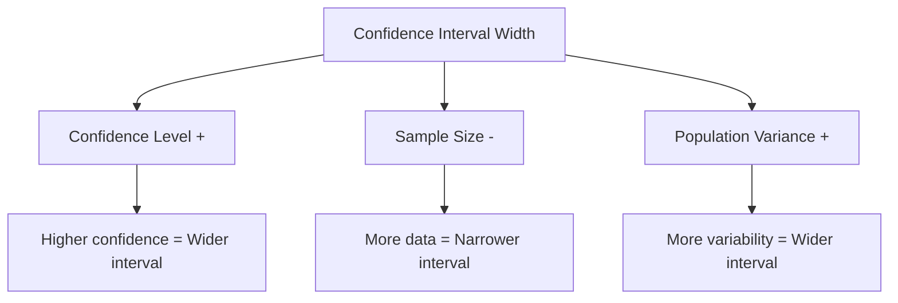

---

## Hypothesis Testing

### Framework

**Components**:
```
1. Null Hypothesis (H₀): Status quo, no effect
2. Alternative Hypothesis (H₁ or Hₐ): What we want to prove
3. Test Statistic: Computed from sample data
4. Significance Level (α): Threshold for rejection
5. Decision: Reject or fail to reject H₀
```

**Example**:
```
Testing new drug effectiveness:
H₀: Drug has no effect (μ = μ₀)
H₁: Drug has effect (μ ≠ μ₀)
α = 0.05
```

### Type I and Type II Errors

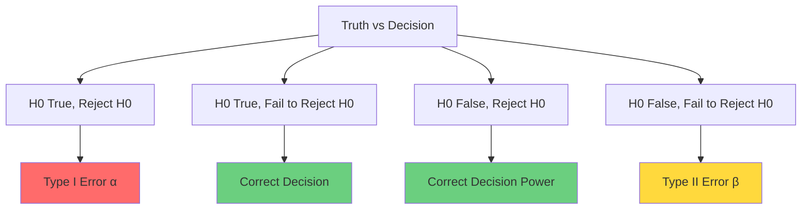

**Type I Error (False Positive)**:
```
α = P(Reject H₀ | H₀ is true)
Significance level
```

**Type II Error (False Negative)**:
```
β = P(Fail to reject H₀ | H₀ is false)
```

**Statistical Power**:
```
Power = 1 - β = P(Reject H₀ | H₀ is false)
Probability of correctly detecting an effect
```

**Tradeoff**:
```
α ↓ → β ↑  (more conservative)
α ↑ → β ↓  (more liberal)

To decrease both: Increase sample size
```

**Real-world Examples**:
```
COVID test:
Type I: Healthy person tests positive
Type II: Sick person tests negative

Spam filter:
Type I: Legitimate email marked as spam
Type II: Spam email reaches inbox
```

### p-value

**Definition**:
```
Probability of observing data at least as extreme as what we got,
assuming H₀ is true
```

**Decision Rule**:
```
If p-value < α: Reject H₀
If p-value ≥ α: Fail to reject H₀
```

**Common Misconceptions**:
```
WRONG: p-value = P(H₀ is true)
RIGHT: p-value = P(data | H₀ is true)

WRONG: 1 - p-value = P(H₁ is true)
RIGHT: Small p-value = Strong evidence against H₀
```

**Interpretation**:
```
p = 0.03: If H₀ true, 3% chance of seeing this data
p = 0.30: If H₀ true, 30% chance of seeing this data

Smaller p-value = Stronger evidence against H₀
```

### Common Tests

#### One-Sample t-test

**Purpose**: Test if population mean equals hypothesized value

**Hypotheses**:
```
H₀: μ = μ₀
H₁: μ ≠ μ₀  (two-tailed)
```

**Test Statistic**:
```
t = (x̄ - μ₀) / (s / √n)

df = n - 1
```

**Example**:
```
Claim: Average height is 170 cm
Sample: n = 30, x̄ = 172, s = 8

t = (172 - 170) / (8 / √30) = 2 / 1.46 = 1.37

Critical value at α=0.05: t(0.025, 29) = 2.045

|1.37| < 2.045  →  Fail to reject H₀
```

#### Two-Sample t-test

**Purpose**: Compare means of two groups

**Hypotheses**:
```
H₀: μ₁ = μ₂
H₁: μ₁ ≠ μ₂
```

**Test Statistic** (equal variances):
```
t = (x̄₁ - x̄₂) / √(s_p² × (1/n₁ + 1/n₂))

where s_p² = [(n₁-1)s₁² + (n₂-1)s₂²] / (n₁ + n₂ - 2)

df = n₁ + n₂ - 2
```

**Welch's t-test** (unequal variances):
```
t = (x̄₁ - x̄₂) / √(s₁²/n₁ + s₂²/n₂)

df = (s₁²/n₁ + s₂²/n₂)² / [(s₁²/n₁)²/(n₁-1) + (s₂²/n₂)²/(n₂-1)]
```

#### Paired t-test

**Purpose**: Compare related samples (before/after)

**Hypotheses**:
```
H₀: μ_d = 0  (mean difference = 0)
H₁: μ_d ≠ 0
```

**Test Statistic**:
```
d_i = x_i,after - x_i,before

t = d̄ / (s_d / √n)

df = n - 1
```

**Example**:
```
Weight loss program (before/after):
Differences: [2, 3, 1, 4, 2]
d̄ = 2.4, s_d = 1.14, n = 5

t = 2.4 / (1.14 / √5) = 4.71

Critical value: t(0.025, 4) = 2.776

4.71 > 2.776  →  Reject H₀
Significant weight loss!
```

#### Chi-Square Test

**Purpose**: Test independence of categorical variables

**Test Statistic**:
```
χ² = Σ (O_i - E_i)² / E_i

where:
O_i = Observed frequency
E_i = Expected frequency (if independent)
```

**Example**:
```
Drug effectiveness by gender:

              Effective  Not Effective
Male (40)        25           15
Female (60)      30           30

Expected (if independent):
E_male,eff = (40 × 55) / 100 = 22
E_male,not = (40 × 45) / 100 = 18
E_female,eff = (60 × 55) / 100 = 33
E_female,not = (60 × 45) / 100 = 27

χ² = (25-22)²/22 + (15-18)²/18 + (30-33)²/33 + (30-27)²/27
   = 0.41 + 0.50 + 0.27 + 0.33 = 1.51

df = (rows - 1) × (cols - 1) = 1

Critical value: χ²(0.05, 1) = 3.84

1.51 < 3.84  →  Fail to reject H₀
Gender and effectiveness appear independent
```

---

## Correlation and Dependence

### Covariance

**Definition**: Measure of joint variability

**Population Covariance**:
```
Cov(X, Y) = E[(X - μ_X)(Y - μ_Y)]
```

**Sample Covariance**:
```
cov(X, Y) = Σ(x_i - x̄)(y_i - ȳ) / (n - 1)
```

**Properties**:
```
Cov(X, X) = Var(X)
Cov(X, Y) = Cov(Y, X)  (symmetric)
Cov(aX, bY) = ab × Cov(X, Y)
```

**Interpretation**:
```
> 0: Positive relationship (move together)
= 0: No linear relationship
< 0: Negative relationship (move opposite)
```

**Problem**: Scale-dependent, hard to interpret

### Pearson Correlation

**Definition**: Standardized measure of linear relationship

```
r = Cov(X, Y) / (σ_X × σ_Y)

Range: [-1, 1]
```

**Sample Correlation**:
```
r = Σ(x_i - x̄)(y_i - ȳ) / √[Σ(x_i - x̄)² × Σ(y_i - ȳ)²]
```

**Interpretation**:
```
r = 1: Perfect positive linear relationship
r = -1: Perfect negative linear relationship
r = 0: No linear relationship
0 < |r| < 0.3: Weak correlation
0.3 ≤ |r| < 0.7: Moderate correlation
0.7 ≤ |r| ≤ 1: Strong correlation
```

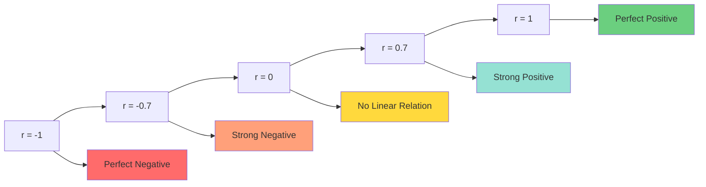

**Example**:
```
Study hours (X): [2, 4, 6, 8, 10]
Exam scores (Y): [60, 70, 80, 85, 95]

x̄ = 6, ȳ = 78
σ_X = 3.16, σ_Y = 13.04

Cov(X,Y) = 40
r = 40 / (3.16 × 13.04) = 0.97

Strong positive correlation!
```

**Important Notes**:
```
1. Correlation ≠ Causation
2. Only measures LINEAR relationships
3. Sensitive to outliers
4. Sample size affects reliability
```

### Spearman's Rank Correlation

**Definition**: Non-parametric measure using ranks

**Formula**:
```
ρ = 1 - [6Σd_i²] / [n(n²-1)]

where d_i = rank difference for observation i
```

**When to use**:
- Non-linear monotonic relationships
- Ordinal data
- Data with outliers
- Non-normal distributions

**Example**:
```
X: [10, 20, 30, 1000]
Y: [5, 15, 25, 900]

Pearson's r affected by outlier (1000, 900)
Spearman's ρ uses ranks: [1,2,3,4] vs [1,2,3,4]
ρ = 1 (perfect rank correlation)
```

---

## Practical Implementation

### Python Examples

#### Descriptive Statistics

```python
import numpy as np
import pandas as pd
from scipy import stats
import matplotlib.pyplot as plt
import seaborn as sns

# Generate sample data
np.random.seed(42)
data = np.random.normal(loc=50, scale=10, size=1000)

# Measures of central tendency
mean = np.mean(data)
median = np.median(data)
mode = stats.mode(data, keepdims=True).mode[0]

print(f"Mean: {mean:.2f}")
print(f"Median: {median:.2f}")
print(f"Mode: {mode:.2f}")

# Measures of dispersion
variance = np.var(data, ddof=1)  # sample variance
std_dev = np.std(data, ddof=1)   # sample std
range_val = np.ptp(data)          # range
iqr = stats.iqr(data)             # IQR
cv = (std_dev / mean) * 100       # coefficient of variation

print(f"\nVariance: {variance:.2f}")
print(f"Standard Deviation: {std_dev:.2f}")
print(f"Range: {range_val:.2f}")
print(f"IQR: {iqr:.2f}")
print(f"CV: {cv:.2f}%")

# Percentiles
q1 = np.percentile(data, 25)
q2 = np.percentile(data, 50)  # median
q3 = np.percentile(data, 75)

print(f"\nQ1 (25th percentile): {q1:.2f}")
print(f"Q2 (50th percentile): {q2:.2f}")
print(f"Q3 (75th percentile): {q3:.2f}")

# Outlier detection
lower_bound = q1 - 1.5 * iqr
upper_bound = q3 + 1.5 * iqr
outliers = data[(data < lower_bound) | (data > upper_bound)]

print(f"\nNumber of outliers: {len(outliers)}")

# Visualization
fig, axes = plt.subplots(2, 2, figsize=(12, 10))

# Histogram
axes[0, 0].hist(data, bins=30, edgecolor='black')
axes[0, 0].axvline(mean, color='red', linestyle='--', label=f'Mean: {mean:.2f}')
axes[0, 0].axvline(median, color='green', linestyle='--', label=f'Median: {median:.2f}')
axes[0, 0].set_title('Histogram with Mean and Median')
axes[0, 0].legend()

# Box plot
axes[0, 1].boxplot(data)
axes[0, 1].set_title('Box Plot')
axes[0, 1].set_ylabel('Value')

# Q-Q plot
stats.probplot(data, dist="norm", plot=axes[1, 0])
axes[1, 0].set_title('Q-Q Plot')

# Density plot
axes[1, 1].hist(data, bins=30, density=True, alpha=0.7, edgecolor='black')
axes[1, 1].set_title('Density Plot')

plt.tight_layout()
plt.show()
```

#### Probability Distributions

```python
from scipy.stats import binom, poisson, norm, t, expon

# Binomial distribution
n, p = 10, 0.5
binomial = binom(n, p)

print("Binomial Distribution (n=10, p=0.5):")
print(f"P(X=6) = {binomial.pmf(6):.4f}")
print(f"P(X<=7) = {binomial.cdf(7):.4f}")
print(f"Mean = {binomial.mean():.2f}")
print(f"Variance = {binomial.var():.2f}")

# Poisson distribution
lambda_val = 3
poisson_dist = poisson(lambda_val)

print(f"\nPoisson Distribution (λ=3):")
print(f"P(X=5) = {poisson_dist.pmf(5):.4f}")
print(f"P(X<=4) = {poisson_dist.cdf(4):.4f}")

# Normal distribution
mu, sigma = 0, 1
normal = norm(mu, sigma)

print(f"\nNormal Distribution (μ=0, σ=1):")
print(f"P(X<=1.96) = {normal.cdf(1.96):.4f}")  # ~0.975
print(f"P(-1.96 <= X <= 1.96) = {normal.cdf(1.96) - normal.cdf(-1.96):.4f}")  # ~0.95

# t-distribution
df = 10
t_dist = t(df)

print(f"\nt-Distribution (df=10):")
print(f"Critical value (α=0.05, two-tailed) = {t_dist.ppf(0.975):.4f}")

# Visualize distributions
fig, axes = plt.subplots(2, 2, figsize=(12, 10))

# Binomial
x_binom = np.arange(0, n+1)
axes[0, 0].bar(x_binom, binomial.pmf(x_binom))
axes[0, 0].set_title('Binomial Distribution (n=10, p=0.5)')
axes[0, 0].set_xlabel('k')
axes[0, 0].set_ylabel('P(X=k)')

# Poisson
x_poisson = np.arange(0, 15)
axes[0, 1].bar(x_poisson, poisson_dist.pmf(x_poisson))
axes[0, 1].set_title('Poisson Distribution (λ=3)')
axes[0, 1].set_xlabel('k')
axes[0, 1].set_ylabel('P(X=k)')

# Normal
x_normal = np.linspace(-4, 4, 100)
axes[1, 0].plot(x_normal, normal.pdf(x_normal))
axes[1, 0].fill_between(x_normal, normal.pdf(x_normal),
                         where=(x_normal >= -1.96) & (x_normal <= 1.96),
                         alpha=0.3, label='95% CI')
axes[1, 0].set_title('Normal Distribution (μ=0, σ=1)')
axes[1, 0].set_xlabel('x')
axes[1, 0].set_ylabel('f(x)')
axes[1, 0].legend()

# Compare Normal vs t-distribution
x = np.linspace(-4, 4, 100)
axes[1, 1].plot(x, norm.pdf(x), label='Normal')
axes[1, 1].plot(x, t.pdf(x, df=3), label='t (df=3)')
axes[1, 1].plot(x, t.pdf(x, df=10), label='t (df=10)')
axes[1, 1].set_title('Normal vs t-Distribution')
axes[1, 1].set_xlabel('x')
axes[1, 1].set_ylabel('f(x)')
axes[1, 1].legend()

plt.tight_layout()
plt.show()
```

#### Hypothesis Testing

```python
from scipy.stats import ttest_1samp, ttest_ind, ttest_rel, chi2_contingency

# One-sample t-test
data = np.array([172, 168, 175, 170, 169, 173, 171, 174, 170, 172])
hypothesized_mean = 170

t_stat, p_value = ttest_1samp(data, hypothesized_mean)
print("One-Sample t-test:")
print(f"t-statistic: {t_stat:.4f}")
print(f"p-value: {p_value:.4f}")
print(f"Result: {'Reject H0' if p_value < 0.05 else 'Fail to reject H0'}\n")

# Two-sample t-test
group1 = np.array([23, 25, 27, 29, 31, 33, 35])
group2 = np.array([18, 20, 22, 24, 26, 28, 30])

t_stat, p_value = ttest_ind(group1, group2)
print("Two-Sample t-test:")
print(f"t-statistic: {t_stat:.4f}")
print(f"p-value: {p_value:.4f}")
print(f"Result: {'Reject H0' if p_value < 0.05 else 'Fail to reject H0'}\n")

# Paired t-test
before = np.array([80, 85, 82, 88, 90, 85, 87])
after = np.array([82, 87, 85, 90, 92, 88, 89])

t_stat, p_value = ttest_rel(before, after)
print("Paired t-test:")
print(f"t-statistic: {t_stat:.4f}")
print(f"p-value: {p_value:.4f}")
print(f"Result: {'Reject H0' if p_value < 0.05 else 'Fail to reject H0'}\n")

# Chi-square test
observed = np.array([[25, 15], [30, 30]])
chi2_stat, p_value, dof, expected = chi2_contingency(observed)

print("Chi-Square Test:")
print(f"Chi-square statistic: {chi2_stat:.4f}")
print(f"p-value: {p_value:.4f}")
print(f"Degrees of freedom: {dof}")
print(f"Expected frequencies:\n{expected}")
print(f"Result: {'Reject H0' if p_value < 0.05 else 'Fail to reject H0'}")
```

#### Correlation Analysis

```python
from scipy.stats import pearsonr, spearmanr

# Generate correlated data
np.random.seed(42)
x = np.random.normal(50, 10, 100)
y = 2 * x + np.random.normal(0, 15, 100)  # y = 2x + noise

# Pearson correlation
pearson_corr, pearson_p = pearsonr(x, y)
print(f"Pearson Correlation: {pearson_corr:.4f}")
print(f"p-value: {pearson_p:.4f}\n")

# Spearman correlation
spearman_corr, spearman_p = spearmanr(x, y)
print(f"Spearman Correlation: {spearman_corr:.4f}")
print(f"p-value: {spearman_p:.4f}\n")

# Correlation matrix for multiple variables
data_dict = {
    'Feature1': np.random.normal(50, 10, 100),
    'Feature2': np.random.normal(30, 5, 100),
    'Feature3': np.random.normal(70, 15, 100)
}
df = pd.DataFrame(data_dict)
df['Target'] = 2 * df['Feature1'] + 1.5 * df['Feature2'] + np.random.normal(0, 20, 100)

corr_matrix = df.corr()
print("Correlation Matrix:")
print(corr_matrix)

# Visualize
plt.figure(figsize=(12, 5))

# Scatter plot with correlation
plt.subplot(1, 2, 1)
plt.scatter(x, y, alpha=0.5)
plt.xlabel('X')
plt.ylabel('Y')
plt.title(f'Scatter Plot (r = {pearson_corr:.4f})')
plt.plot(np.unique(x), np.poly1d(np.polyfit(x, y, 1))(np.unique(x)), 'r--')

# Correlation heatmap
plt.subplot(1, 2, 2)
sns.heatmap(corr_matrix, annot=True, cmap='coolwarm', center=0,
            square=True, linewidths=1)
plt.title('Correlation Heatmap')

plt.tight_layout()
plt.show()
```

---

## Interview Questions

### Conceptual Questions

**Q1: Explain the difference between population and sample. Why do we use (n-1) for sample variance?**

A: **Population** includes all members of a defined group, while **sample** is a subset used to make inferences about the population.

We use (n-1) due to **Bessel's correction**:
- Sample variance tends to underestimate population variance
- We use sample mean (x̄) instead of true mean (μ)
- This introduces bias: data points are closer to x̄ than to μ
- Dividing by (n-1) instead of n compensates for this bias
- Makes sample variance an unbiased estimator: E[s²] = σ²

**Q2: What is the Central Limit Theorem and why is it important?**

A: **CLT states**: For large enough sample size (typically n≥30), the distribution of sample means approaches a normal distribution, regardless of the original population distribution.

**Importance**:
1. Justifies using normal distribution for inference
2. Foundation for confidence intervals and hypothesis tests
3. Explains why averaging reduces variance (ensemble methods)
4. Enables parametric tests even with non-normal data
5. Underpins many ML algorithms (gradient descent, SGD)

**Q3: Explain Type I and Type II errors. How are they related?**

A:
- **Type I Error (α)**: False positive - Rejecting true H₀
- **Type II Error (β)**: False negative - Failing to reject false H₀

**Relationship**: Inverse tradeoff
- Decreasing α (more conservative) → increases β
- Decreasing β (more sensitive) → increases α
- Only way to decrease both: Increase sample size or effect size

**Real example (medical test)**:
- Type I: Diagnosing healthy person as sick
- Type II: Missing disease in sick person

**Q4: What's the difference between correlation and causation?**

A: **Correlation** measures statistical association between variables. **Causation** means one variable directly affects another.

**Why correlation ≠ causation**:
1. **Confounding variables**: Z causes both X and Y
2. **Reverse causation**: Y actually causes X
3. **Coincidence**: Random association

**Example**: Ice cream sales correlate with drowning deaths
- NOT causation (ice cream doesn't cause drowning)
- Confounding: Both increase in summer

**Establishing causation requires**:
- Randomized controlled trials
- Temporal precedence (cause before effect)
- Ruling out alternative explanations

**Q5: Explain p-value. What does p=0.03 mean?**

A: **p-value** = Probability of observing data at least as extreme as what we got, assuming H₀ is true.

**p = 0.03 means**: If H₀ were true, there's only 3% chance of seeing this data or more extreme.

**Common misconceptions**:
- NOT: "3% probability H₀ is true"
- NOT: "97% probability H₁ is true"
- NOT: "Effect size is large"

**Correct interpretation**: Strong evidence against H₀ (at α=0.05 level)

**Limitations**:
- Depends on sample size
- Doesn't measure effect size
- Arbitrary threshold (0.05)
- Doesn't prove alternative hypothesis

**Q6: When would you use t-distribution instead of normal distribution?**

A: Use **t-distribution** when:
1. **Small sample size** (n < 30)
2. **Population σ unknown** (must estimate from sample)
3. **Testing means** with limited data

**Why**: t-distribution has heavier tails, accounting for additional uncertainty from estimating σ.

**Key differences**:
- t-distribution depends on degrees of freedom
- As df → ∞, t → Normal
- t gives wider confidence intervals (more conservative)

**Example**: Testing mean with n=15 → use t(14)

**Q7: What is Maximum Likelihood Estimation?**

A: **MLE** finds parameter values that maximize the probability of observing the data.

**Process**:
1. Write likelihood function: L(θ|data) = P(data|θ)
2. Take log: ℓ(θ) = log L(θ)
3. Maximize by setting ∂ℓ/∂θ = 0

**Properties**:
- **Consistent**: Converges to true value as n→∞
- **Asymptotically normal**: Distribution becomes normal
- **Asymptotically efficient**: Minimum variance
- **Invariant**: MLE of g(θ) = g(MLE of θ)

**ML Applications**:
- Logistic regression parameters
- Neural network training (cross-entropy ≈ negative log-likelihood)
- Gaussian Mixture Models

### Calculation Questions

**Q8: Calculate mean, variance, and standard deviation**

```
Data: [4, 8, 6, 5, 3, 7, 9, 8, 8, 6]

Mean = (4+8+6+5+3+7+9+8+8+6) / 10 = 64/10 = 6.4

Variance:
Deviations: [-2.4, 1.6, -0.4, -1.4, -3.4, 0.6, 2.6, 1.6, 1.6, -0.4]
Squared: [5.76, 2.56, 0.16, 1.96, 11.56, 0.36, 6.76, 2.56, 2.56, 0.16]
Sum = 34.4
s² = 34.4 / (10-1) = 3.82

Standard Deviation = √3.82 = 1.95
```

**Q9: Conduct hypothesis test**

```
Claim: μ = 100
Sample: n = 25, x̄ = 105, s = 15
α = 0.05 (two-tailed)

H₀: μ = 100
H₁: μ ≠ 100

Test statistic:
t = (105 - 100) / (15/√25) = 5 / 3 = 1.67

Critical value: t(0.025, 24) = 2.064

|1.67| < 2.064

Decision: Fail to reject H₀
Conclusion: Insufficient evidence that mean differs from 100
```

**Q10: Calculate correlation**

```
X: [1, 2, 3, 4, 5]
Y: [2, 4, 5, 4, 5]

x̄ = 3, ȳ = 4

Deviations X: [-2, -1, 0, 1, 2]
Deviations Y: [-2, 0, 1, 0, 1]

Σ(x-x̄)(y-ȳ) = (-2)(-2) + (-1)(0) + (0)(1) + (1)(0) + (2)(1)
             = 4 + 0 + 0 + 0 + 2 = 6

Σ(x-x̄)² = 4 + 1 + 0 + 1 + 4 = 10
Σ(y-ȳ)² = 4 + 0 + 1 + 0 + 1 = 6

r = 6 / √(10 × 6) = 6 / 7.75 = 0.77

Moderate to strong positive correlation
```

---

## Summary

### Key Takeaways

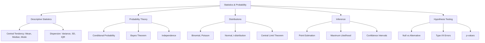

### Must-Remember Formulas

1. **Sample Variance**: s² = Σ(x - x̄)² / (n-1)
2. **Standard Error**: SE = σ / √n
3. **Confidence Interval**: x̄ ± t(α/2) × (s/√n)
4. **t-statistic**: t = (x̄ - μ₀) / (s/√n)
5. **Correlation**: r = Cov(X,Y) / (σ_X × σ_Y)
6. **Bayes**: P(A|B) = P(B|A) × P(A) / P(B)

### Next Steps

This foundation prepares you for:
1. **Linear Regression** - Statistical modeling of continuous outcomes
2. **Logistic Regression** - Classification using probabilistic framework
3. **Advanced ML** - Neural networks, Bayesian methods, ensemble techniques

---

**Document Created**: 2025
**Target Audience**: Zero to Architect level ML practitioners
**Prerequisites**: Basic algebra and calculus
**Next**: Linear Regression Complete Guide

