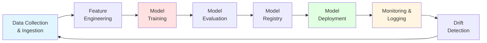
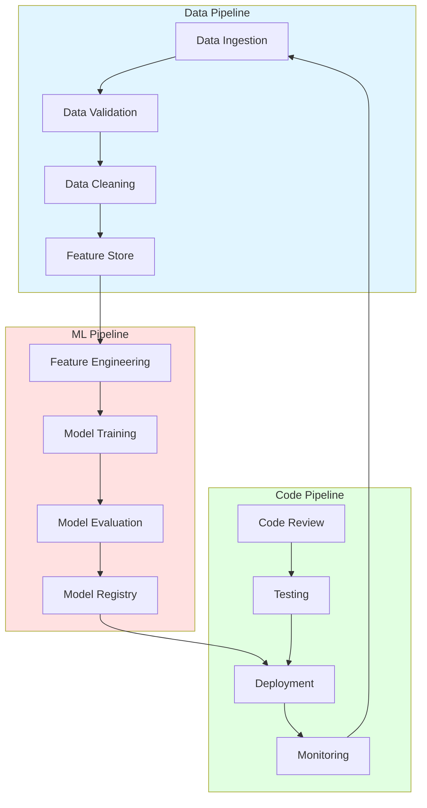
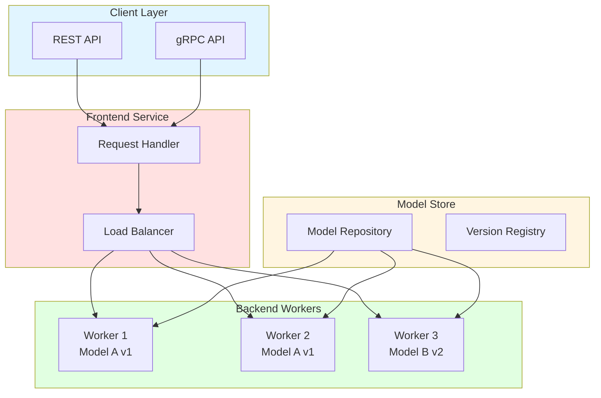
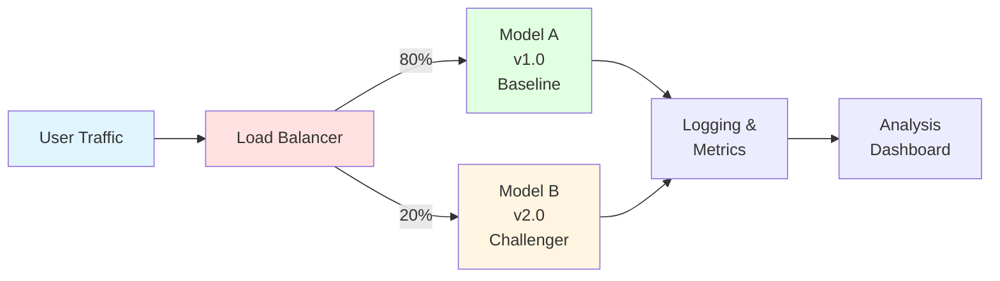
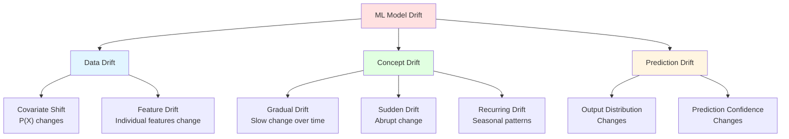
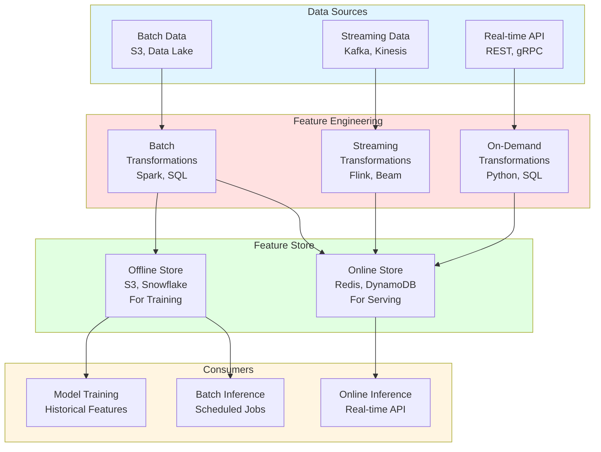
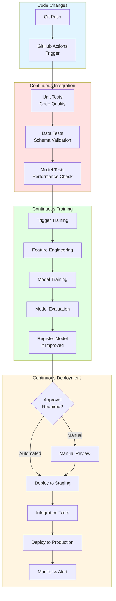
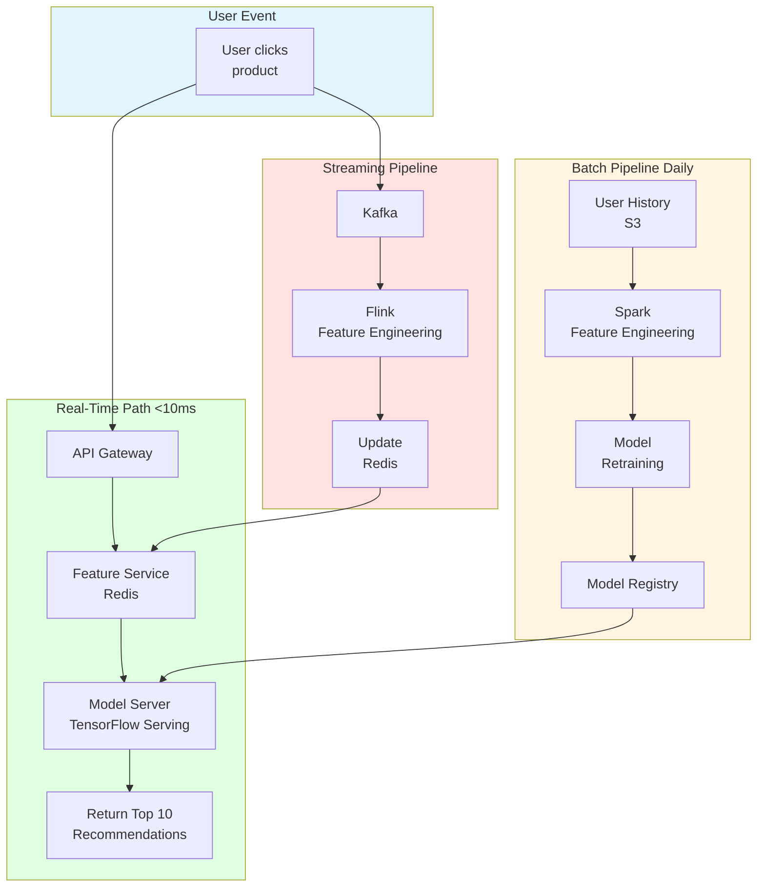

# MLOps & Production ML - Complete Engineering Manager Guide

**Last Updated:** January 2025
**Target Role:** Engineering Manager, ML/AI
**Estimated Reading Time:** 60 minutes

## Table of Contents
1. [MLOps Overview & Architecture](#mlops-overview)
2. [Model Serving Patterns](#model-serving)
3. [Model Monitoring & Drift Detection](#monitoring)
4. [Feature Stores](#feature-stores)
5. [CI/CD for ML](#cicd)
6. [Experiment Tracking](#experiment-tracking)
7. [Production Best Practices](#best-practices)
8. [Interview Topics](#interview-topics)

---

## MLOps Overview & Architecture

### What is MLOps?

MLOps (Machine Learning Operations) is the practice of applying DevOps principles to ML systems, focusing on:
- Automating model training, testing, and deployment
- Ensuring reproducibility and versioning
- Monitoring model performance in production
- Managing the full ML lifecycle

### ML Lifecycle Stages



### MLOps Maturity Levels

| Level | Description | Characteristics | Tools |
|-------|-------------|-----------------|-------|
| **Level 0: Manual** | Ad-hoc, manual process | Notebooks, manual deployment | Jupyter, Python scripts |
| **Level 1: DevOps** | Automated training/deployment | CI/CD for code only | Git, Docker |
| **Level 2: Automated Training** | Automated retraining pipelines | Scheduled/triggered training | Airflow, Kubeflow |
| **Level 3: Automated Deployment** | Continuous deployment | A/B testing, canary | KServe, Seldon |
| **Level 4: Full MLOps** | End-to-end automation | Feature stores, monitoring | Tecton, Evidently |

### Three-Pillar MLOps Architecture



---

## Model Serving Patterns

### Overview of Model Serving

Model serving is the process of making ML models available for inference in production. Key requirements:
- **Low latency**: < 100ms for real-time, < 1s for near-real-time
- **High throughput**: Handle thousands of requests per second
- **Scalability**: Auto-scale based on traffic
- **Version management**: Deploy multiple versions simultaneously
- **A/B testing**: Route traffic to different models

### Leading Model Serving Frameworks (2025)

| Framework | Backend | Strengths | Use Case | Performance |
|-----------|---------|-----------|----------|-------------|
| **TensorFlow Serving** | C++ | Production-grade, high performance | TensorFlow models | Best overall |
| **TorchServe** | C++ | PyTorch native, easy setup | PyTorch models | Very good |
| **Triton Inference Server** | C++ | Multi-framework, GPU optimization | Mixed frameworks | Excellent for GPUs |
| **BentoML** | Python | Developer-friendly, flexible | Rapid prototyping | Good (slower) |
| **KServe** | Multi | Kubernetes-native, serverless | K8s deployments | Excellent scaling |
| **vLLM** | C++/Python | LLM-optimized, continuous batching | Large language models | Best for LLMs |

### TorchServe Architecture



### TorchServe Implementation Example

```python
# Step 1: Export PyTorch model to TorchScript
import torch

class MyModel(torch.nn.Module):
    def __init__(self):
        super().__init__()
        self.linear = torch.nn.Linear(10, 2)

    def forward(self, x):
        return self.linear(x)

model = MyModel()
traced_model = torch.jit.trace(model, torch.randn(1, 10))
traced_model.save("model.pt")

# Step 2: Create custom handler (handler.py)
from ts.torch_handler.base_handler import BaseHandler
import torch
import json

class CustomHandler(BaseHandler):
    def preprocess(self, requests):
        """Transform raw input into model input format."""
        inputs = []
        for req in requests:
            data = req.get("data") or req.get("body")
            if isinstance(data, (bytes, bytearray)):
                data = data.decode("utf-8")
            inputs.append(json.loads(data))

        # Convert to tensor
        return torch.tensor(inputs, dtype=torch.float32)

    def inference(self, model_input):
        """Run model inference."""
        with torch.no_grad():
            return self.model(model_input)

    def postprocess(self, inference_output):
        """Transform model output into API response format."""
        return inference_output.tolist()

# Step 3: Package model
# torch-model-archiver --model-name my_model \
#     --version 1.0 \
#     --serialized-file model.pt \
#     --handler handler.py \
#     --export-path model_store

# Step 4: Start TorchServe
# torchserve --start \
#     --model-store model_store \
#     --models my_model=my_model.mar \
#     --ncs

# Step 5: Configure auto-scaling (config.properties)
"""
inference_address=http://0.0.0.0:8080
management_address=http://0.0.0.0:8081
metrics_address=http://0.0.0.0:8082

# Worker configuration
number_of_netty_threads=32
job_queue_size=1000
default_workers_per_model=4
min_workers=2
max_workers=8

# Batching
batch_size=32
max_batch_delay=100

# GPU
number_of_gpu=2
"""

# Step 6: Client usage
import requests
import json

response = requests.post(
    "http://localhost:8080/predictions/my_model",
    json={"data": [[0.1, 0.2, 0.3, 0.4, 0.5, 0.6, 0.7, 0.8, 0.9, 1.0]]}
)
print(response.json())
```

### Deployment Patterns

#### 1. A/B Testing Pattern



```python
# A/B Testing Router Implementation
import random
from typing import Dict, Any
import logging

class ABTestRouter:
    """Route requests to different model versions for A/B testing."""

    def __init__(self, models: Dict[str, Any], traffic_split: Dict[str, float]):
        """
        Args:
            models: Dictionary of model_name -> model_instance
            traffic_split: Dictionary of model_name -> traffic_percentage
                          e.g., {"model_a": 0.8, "model_b": 0.2}
        """
        self.models = models
        self.traffic_split = traffic_split
        self.logger = logging.getLogger(__name__)

        # Validate traffic split sums to 1.0
        assert abs(sum(traffic_split.values()) - 1.0) < 0.001

    def route(self, request: Dict[str, Any]) -> Any:
        """Route request to appropriate model variant."""
        # Generate random number for routing decision
        rand = random.random()

        # Select model based on traffic split
        cumulative = 0.0
        for model_name, percentage in self.traffic_split.items():
            cumulative += percentage
            if rand < cumulative:
                selected_model = model_name
                break

        # Log routing decision
        self.logger.info(
            "request_routed",
            extra={
                "request_id": request.get("request_id"),
                "model": selected_model,
                "user_id": request.get("user_id")
            }
        )

        # Perform inference
        result = self.models[selected_model].predict(request["input"])

        # Attach metadata
        return {
            "prediction": result,
            "model_version": selected_model,
            "request_id": request.get("request_id")
        }

# Usage
router = ABTestRouter(
    models={
        "model_a": model_a_instance,
        "model_b": model_b_instance
    },
    traffic_split={
        "model_a": 0.8,
        "model_b": 0.2
    }
)

response = router.route({
    "request_id": "req_123",
    "user_id": "user_456",
    "input": [0.1, 0.2, 0.3]
})
```

#### 2. Canary Deployment Pattern

```python
class CanaryDeployment:
    """Gradual rollout of new model version."""

    def __init__(self, stable_model, canary_model,
                 initial_percentage: float = 0.05,
                 increment: float = 0.1,
                 success_threshold: float = 0.95):
        """
        Args:
            stable_model: Current production model
            canary_model: New model being tested
            initial_percentage: Starting traffic to canary (5%)
            increment: How much to increase per stage (10%)
            success_threshold: Required accuracy to proceed (95%)
        """
        self.stable_model = stable_model
        self.canary_model = canary_model
        self.canary_percentage = initial_percentage
        self.increment = increment
        self.success_threshold = success_threshold
        self.metrics = {"stable": [], "canary": []}

    def route(self, request: Dict[str, Any]) -> Any:
        """Route to stable or canary based on current percentage."""
        if random.random() < self.canary_percentage:
            model = self.canary_model
            model_type = "canary"
        else:
            model = self.stable_model
            model_type = "stable"

        result = model.predict(request["input"])

        return {
            "prediction": result,
            "model_type": model_type
        }

    def evaluate_and_promote(self, accuracy: float, model_type: str):
        """Evaluate canary performance and decide whether to promote."""
        self.metrics[model_type].append(accuracy)

        # Check if we have enough samples
        if len(self.metrics["canary"]) < 100:
            return "collecting_data"

        # Calculate recent performance
        canary_avg = sum(self.metrics["canary"][-100:]) / 100
        stable_avg = sum(self.metrics["stable"][-100:]) / 100

        # Decision logic
        if canary_avg >= self.success_threshold and canary_avg >= stable_avg * 0.98:
            # Canary performing well, increase traffic
            self.canary_percentage = min(1.0, self.canary_percentage + self.increment)

            if self.canary_percentage >= 1.0:
                return "promoted"  # Full rollout
            return "increased"

        elif canary_avg < stable_avg * 0.95:
            # Canary performing poorly, rollback
            self.canary_percentage = 0.0
            return "rolled_back"

        else:
            # Performance similar, continue monitoring
            return "monitoring"

# Usage example
canary = CanaryDeployment(stable_model, new_model)

# Initial: 5% traffic to canary
# After success: 15% traffic to canary
# After success: 25% traffic to canary
# ... eventually 100% (full promotion)
```

#### 3. Shadow Deployment Pattern

```python
class ShadowDeployment:
    """
    Deploy new model alongside production without affecting users.
    Compare predictions side-by-side.
    """

    def __init__(self, production_model, shadow_model):
        self.production_model = production_model
        self.shadow_model = shadow_model
        self.comparison_results = []

    def predict(self, request: Dict[str, Any]) -> Any:
        """
        Run both models, return production result.
        Log shadow result for comparison.
        """
        # Production prediction (returned to user)
        prod_result = self.production_model.predict(request["input"])

        # Shadow prediction (logged but not returned)
        try:
            shadow_result = self.shadow_model.predict(request["input"])

            # Log comparison
            self.log_comparison(
                request_id=request.get("request_id"),
                prod_result=prod_result,
                shadow_result=shadow_result,
                input_data=request["input"]
            )
        except Exception as e:
            # Shadow failures don't affect production
            logging.error(f"Shadow model failed: {e}")

        # Always return production result
        return {"prediction": prod_result}

    def log_comparison(self, request_id, prod_result, shadow_result, input_data):
        """Log comparison for offline analysis."""
        comparison = {
            "request_id": request_id,
            "production": prod_result,
            "shadow": shadow_result,
            "difference": abs(prod_result - shadow_result),
            "timestamp": datetime.now().isoformat()
        }
        self.comparison_results.append(comparison)

    def analyze_differences(self, threshold: float = 0.1):
        """Analyze how often shadow model differs significantly."""
        if not self.comparison_results:
            return None

        large_diffs = sum(
            1 for c in self.comparison_results
            if c["difference"] > threshold
        )

        return {
            "total_requests": len(self.comparison_results),
            "large_differences": large_diffs,
            "large_diff_percentage": large_diffs / len(self.comparison_results),
            "avg_difference": sum(c["difference"] for c in self.comparison_results)
                            / len(self.comparison_results)
        }
```

#### 4. Multi-Model Serving (Ensemble)

```python
class EnsembleServer:
    """Serve multiple models and combine predictions."""

    def __init__(self, models: Dict[str, Any], weights: Dict[str, float] = None):
        """
        Args:
            models: Dictionary of model_name -> model_instance
            weights: Optional weights for weighted averaging
        """
        self.models = models
        self.weights = weights or {name: 1.0/len(models) for name in models}

    def predict_voting(self, request: Dict[str, Any]) -> Any:
        """Hard voting: Return most common prediction."""
        predictions = []
        for name, model in self.models.items():
            pred = model.predict(request["input"])
            predictions.append(pred)

        # Return most common prediction
        from collections import Counter
        return Counter(predictions).most_common(1)[0][0]

    def predict_weighted_average(self, request: Dict[str, Any]) -> float:
        """Weighted average of predictions (regression)."""
        weighted_sum = 0.0
        for name, model in self.models.items():
            pred = model.predict(request["input"])
            weighted_sum += pred * self.weights[name]

        return weighted_sum

    def predict_stacking(self, request: Dict[str, Any], meta_model) -> Any:
        """
        Stacking: Use meta-model to combine base model predictions.
        """
        # Get predictions from all base models
        base_predictions = []
        for name, model in self.models.items():
            pred = model.predict(request["input"])
            base_predictions.append(pred)

        # Use meta-model to combine
        return meta_model.predict([base_predictions])

# Usage
ensemble = EnsembleServer(
    models={
        "xgboost": xgb_model,
        "random_forest": rf_model,
        "neural_net": nn_model
    },
    weights={
        "xgboost": 0.5,
        "random_forest": 0.3,
        "neural_net": 0.2
    }
)

result = ensemble.predict_weighted_average(request)
```

---

## Model Monitoring & Drift Detection

### Why Monitor ML Models?

Unlike traditional software, ML models degrade over time due to:
- **Data drift**: Input distribution changes
- **Concept drift**: Relationship between features and target changes
- **Model staleness**: Model doesn't adapt to new patterns

### Types of Drift



### Data Drift Detection Methods

| Method | Type | Use Case | Pros | Cons |
|--------|------|----------|------|------|
| **KS Test** | Statistical | Continuous features | Simple, interpretable | Assumes 1D distributions |
| **Chi-Square Test** | Statistical | Categorical features | Standard, well-understood | Requires sufficient samples |
| **PSI (Population Stability Index)** | Statistical | Feature distributions | Interpretable threshold | Requires binning |
| **KL Divergence** | Information Theory | Probability distributions | Asymmetric, sensitive | Not a true metric |
| **JS Divergence** | Information Theory | Probability distributions | Symmetric, bounded | More complex |
| **Wasserstein Distance** | Optimal Transport | High-dim distributions | Handles complex shifts | Computationally expensive |

### Evidently AI Implementation

```python
# Install: pip install evidently

from evidently import ColumnMapping
from evidently.report import Report
from evidently.metric_set import DataDriftPreset, DataQualityPreset
from evidently.test_suite import TestSuite
from evidently.tests import TestNumberOfDriftedColumns
import pandas as pd

# Load reference (training) and current (production) data
reference_data = pd.read_csv("training_data.csv")
current_data = pd.read_csv("production_data_latest.csv")

# Define column mapping
column_mapping = ColumnMapping()
column_mapping.target = "target"
column_mapping.prediction = "prediction"
column_mapping.numerical_features = ["age", "income", "credit_score"]
column_mapping.categorical_features = ["gender", "region", "product_type"]

# Generate Data Drift Report
data_drift_report = Report(metrics=[
    DataDriftPreset(),
    DataQualityPreset()
])

data_drift_report.run(
    reference_data=reference_data,
    current_data=current_data,
    column_mapping=column_mapping
)

# Save report
data_drift_report.save_html("drift_report.html")

# Get JSON results programmatically
results = data_drift_report.as_dict()
print(f"Dataset drift detected: {results['metrics'][0]['result']['dataset_drift']}")
print(f"Number of drifted features: {results['metrics'][0]['result']['number_of_drifted_columns']}")

# Create automated test suite
tests = TestSuite(tests=[
    TestNumberOfDriftedColumns(lt=3)  # Fail if 3+ columns drifted
])

tests.run(reference_data=reference_data, current_data=current_data)
print(tests.as_dict())  # Returns pass/fail status
```

### Custom Drift Detection

```python
import numpy as np
from scipy import stats
from typing import Tuple, Dict

class DriftDetector:
    """Comprehensive drift detection for production ML."""

    def __init__(self, reference_data: pd.DataFrame,
                 drift_threshold: float = 0.05):
        """
        Args:
            reference_data: Training/baseline data
            drift_threshold: p-value threshold for statistical tests
        """
        self.reference_data = reference_data
        self.drift_threshold = drift_threshold
        self.feature_stats = self._compute_reference_stats()

    def _compute_reference_stats(self) -> Dict:
        """Compute statistics on reference data."""
        stats_dict = {}
        for col in self.reference_data.columns:
            if self.reference_data[col].dtype in [np.float64, np.int64]:
                stats_dict[col] = {
                    "mean": self.reference_data[col].mean(),
                    "std": self.reference_data[col].std(),
                    "min": self.reference_data[col].min(),
                    "max": self.reference_data[col].max(),
                    "distribution": self.reference_data[col].values
                }
        return stats_dict

    def detect_ks_drift(self, current_data: pd.DataFrame,
                       column: str) -> Tuple[bool, float]:
        """
        Kolmogorov-Smirnov test for continuous features.

        Returns:
            (drift_detected, p_value)
        """
        reference_values = self.reference_data[column].values
        current_values = current_data[column].values

        statistic, p_value = stats.ks_2samp(reference_values, current_values)

        drift_detected = p_value < self.drift_threshold
        return drift_detected, p_value

    def detect_psi_drift(self, current_data: pd.DataFrame,
                        column: str, bins: int = 10) -> Tuple[bool, float]:
        """
        Population Stability Index (PSI).

        PSI < 0.1: No significant change
        0.1 <= PSI < 0.2: Moderate change
        PSI >= 0.2: Significant change

        Returns:
            (drift_detected, psi_value)
        """
        # Create bins based on reference data
        reference_values = self.reference_data[column].values
        current_values = current_data[column].values

        # Define bin edges
        _, bin_edges = np.histogram(reference_values, bins=bins)

        # Calculate distributions
        ref_counts, _ = np.histogram(reference_values, bins=bin_edges)
        cur_counts, _ = np.histogram(current_values, bins=bin_edges)

        # Convert to percentages (add small constant to avoid log(0))
        ref_pct = (ref_counts + 0.0001) / len(reference_values)
        cur_pct = (cur_counts + 0.0001) / len(current_values)

        # Calculate PSI
        psi = np.sum((cur_pct - ref_pct) * np.log(cur_pct / ref_pct))

        drift_detected = psi >= 0.2
        return drift_detected, psi

    def detect_all_drift(self, current_data: pd.DataFrame) -> Dict:
        """Run all drift detection methods."""
        results = {}

        for col in self.reference_data.columns:
            if col not in current_data.columns:
                continue

            if self.reference_data[col].dtype in [np.float64, np.int64]:
                # Continuous feature
                ks_drift, ks_pvalue = self.detect_ks_drift(current_data, col)
                psi_drift, psi_value = self.detect_psi_drift(current_data, col)

                results[col] = {
                    "ks_test": {"drift": ks_drift, "p_value": ks_pvalue},
                    "psi": {"drift": psi_drift, "value": psi_value}
                }

        # Overall drift summary
        drifted_features = [
            col for col, res in results.items()
            if res["ks_test"]["drift"] or res["psi"]["drift"]
        ]

        return {
            "feature_results": results,
            "drifted_features": drifted_features,
            "drift_percentage": len(drifted_features) / len(results),
            "overall_drift": len(drifted_features) > len(results) * 0.2
        }

# Usage
detector = DriftDetector(reference_data=training_data)

# Check production data
drift_results = detector.detect_all_drift(production_data)

if drift_results["overall_drift"]:
    print("ALERT: Significant drift detected!")
    print(f"Drifted features: {drift_results['drifted_features']}")
    # Trigger retraining pipeline
```

### Model Performance Monitoring

```python
import logging
from datetime import datetime
from typing import Dict, Any
import json

class ModelPerformanceMonitor:
    """Monitor model performance in production."""

    def __init__(self, model_name: str, thresholds: Dict[str, float]):
        """
        Args:
            model_name: Name of the model being monitored
            thresholds: Performance thresholds, e.g.,
                       {"accuracy": 0.85, "latency_ms": 100}
        """
        self.model_name = model_name
        self.thresholds = thresholds
        self.metrics_buffer = []
        self.logger = logging.getLogger(__name__)

    def log_prediction(self, request: Dict[str, Any],
                      prediction: Any, ground_truth: Any = None,
                      latency_ms: float = None):
        """Log individual prediction for monitoring."""
        log_entry = {
            "timestamp": datetime.now().isoformat(),
            "model": self.model_name,
            "request_id": request.get("request_id"),
            "prediction": prediction,
            "ground_truth": ground_truth,
            "latency_ms": latency_ms,
            "features": request.get("input")
        }

        self.metrics_buffer.append(log_entry)

        # Check latency threshold
        if latency_ms and latency_ms > self.thresholds.get("latency_ms", float('inf')):
            self.logger.warning(
                f"High latency detected: {latency_ms}ms "
                f"(threshold: {self.thresholds['latency_ms']}ms)"
            )

    def compute_metrics(self, window_size: int = 1000) -> Dict:
        """Compute metrics over recent predictions."""
        recent = self.metrics_buffer[-window_size:]

        if not recent:
            return {}

        # Latency metrics
        latencies = [m["latency_ms"] for m in recent if m["latency_ms"]]

        # Accuracy (if ground truth available)
        correct = sum(
            1 for m in recent
            if m["ground_truth"] is not None and m["prediction"] == m["ground_truth"]
        )
        total_with_labels = sum(1 for m in recent if m["ground_truth"] is not None)

        metrics = {
            "total_predictions": len(recent),
            "avg_latency_ms": np.mean(latencies) if latencies else None,
            "p95_latency_ms": np.percentile(latencies, 95) if latencies else None,
            "p99_latency_ms": np.percentile(latencies, 99) if latencies else None,
        }

        if total_with_labels > 0:
            metrics["accuracy"] = correct / total_with_labels

        return metrics

    def check_alerts(self) -> list:
        """Check if any metrics exceed thresholds."""
        metrics = self.compute_metrics()
        alerts = []

        for metric_name, threshold in self.thresholds.items():
            if metric_name in metrics:
                value = metrics[metric_name]

                if metric_name == "latency_ms":
                    if value > threshold:
                        alerts.append({
                            "metric": metric_name,
                            "value": value,
                            "threshold": threshold,
                            "severity": "warning"
                        })

                elif metric_name == "accuracy":
                    if value < threshold:
                        alerts.append({
                            "metric": metric_name,
                            "value": value,
                            "threshold": threshold,
                            "severity": "critical"
                        })

        return alerts

# Usage
monitor = ModelPerformanceMonitor(
    model_name="fraud_detection_v2",
    thresholds={
        "accuracy": 0.90,
        "latency_ms": 50
    }
)

# Log predictions
monitor.log_prediction(
    request={"request_id": "req_123", "input": [...]},
    prediction=1,
    ground_truth=1,  # If available from delayed feedback
    latency_ms=45
)

# Check metrics
metrics = monitor.compute_metrics()
alerts = monitor.check_alerts()

if alerts:
    print(f"ALERTS: {alerts}")
```

### Fiddler AI Integration (Enterprise)

```python
# Install: pip install fiddler-client

import fiddler as fdl

# Initialize client
client = fdl.FiddlerApi(
    url="https://your-org.fiddler.ai",
    org_id="your-org-id",
    auth_token="your-token"
)

# Upload model to Fiddler
PROJECT_NAME = "fraud_detection"
MODEL_NAME = "xgboost_v1"

# Define model schema
model_info = fdl.ModelInfo.from_dataset_info(
    dataset_info=fdl.DatasetInfo.from_dataframe(training_df),
    target="is_fraud",
    features=["amount", "merchant_category", "distance_from_home"],
    categorical_target_class_names=["not_fraud", "fraud"]
)

client.upload_model_info(
    project_id=PROJECT_NAME,
    model_id=MODEL_NAME,
    model_info=model_info
)

# Publish production events for monitoring
import pandas as pd

production_events = pd.DataFrame({
    "amount": [100.0, 250.5, 1500.0],
    "merchant_category": ["grocery", "electronics", "jewelry"],
    "distance_from_home": [2.5, 15.0, 100.0],
    "prediction": [0, 0, 1],  # Model predictions
    "is_fraud": [0, 0, 1]     # Ground truth (if available)
})

client.publish_events_batch(
    project_id=PROJECT_NAME,
    model_id=MODEL_NAME,
    batch_source=production_events,
    id_field="event_id"
)

# Configure drift alerts
alert = fdl.Alert(
    name="High Drift Alert",
    model_id=MODEL_NAME,
    alert_type=fdl.AlertType.DATA_DRIFT,
    metric=fdl.Metric.PSI,
    bin=fdl.BinSize.DAY,
    compare_to=fdl.CompareTo.TIME_PERIOD,
    compare_period=fdl.ComparePeriod.ONE_WEEK,
    threshold=0.2,  # PSI threshold
    notification_config=fdl.NotificationConfig(
        emails=["ml-team@company.com"]
    )
)

client.create_alert(project_id=PROJECT_NAME, alert=alert)
```

---

## Feature Stores

### What is a Feature Store?

A feature store is a centralized repository for storing, managing, and serving ML features. It solves:
- **Feature reuse**: Share features across models
- **Consistency**: Same features in training and serving
- **Point-in-time correctness**: Avoid data leakage
- **Low latency**: Fast feature retrieval for online inference

### Feature Store Architecture



### Feast (Open-Source) Implementation

```python
# Install: pip install feast

from feast import FeatureStore, Entity, FeatureView, Field
from feast.types import Float32, Int64, String
from feast.value_type import ValueType
from datetime import timedelta
import pandas as pd

# Step 1: Define entities
customer = Entity(
    name="customer",
    join_keys=["customer_id"],
    description="Customer entity"
)

# Step 2: Define feature views
from feast.data_source import FileSource

customer_features_source = FileSource(
    path="data/customer_features.parquet",
    timestamp_field="event_timestamp"
)

customer_features = FeatureView(
    name="customer_features",
    entities=[customer],
    ttl=timedelta(days=365),
    schema=[
        Field(name="age", dtype=Int64),
        Field(name="total_purchases", dtype=Int64),
        Field(name="avg_purchase_amount", dtype=Float32),
        Field(name="credit_score", dtype=Int64),
    ],
    source=customer_features_source,
    online=True  # Enable online serving
)

# Step 3: Apply configuration
store = FeatureStore(repo_path=".")
store.apply([customer, customer_features])

# Step 4: Materialize features to online store
store.materialize_incremental(end_date=datetime.now())

# Step 5: Training - Get historical features
entity_df = pd.DataFrame({
    "customer_id": [1001, 1002, 1003],
    "event_timestamp": [
        datetime(2025, 1, 1),
        datetime(2025, 1, 2),
        datetime(2025, 1, 3)
    ]
})

training_df = store.get_historical_features(
    entity_df=entity_df,
    features=[
        "customer_features:age",
        "customer_features:total_purchases",
        "customer_features:avg_purchase_amount",
        "customer_features:credit_score"
    ]
).to_df()

print("Training data with features:")
print(training_df)

# Step 6: Online inference - Get real-time features
online_features = store.get_online_features(
    features=[
        "customer_features:age",
        "customer_features:total_purchases",
        "customer_features:avg_purchase_amount",
        "customer_features:credit_score"
    ],
    entity_rows=[
        {"customer_id": 1001}
    ]
).to_dict()

print("Online features:")
print(online_features)
```

### Tecton (Managed Platform) Example

```python
# Tecton provides declarative feature engineering

from tecton import Entity, BatchSource, FeatureView, Aggregation
from tecton.types import Field, String, Timestamp, Float64, Int64
from datetime import datetime, timedelta

# Define entity
customer = Entity(
    name="customer",
    join_keys=[Field("customer_id", String)],
    description="Customer entity"
)

# Define batch data source
transactions_batch = BatchSource(
    name="transactions",
    batch_config=SnowflakeConfig(
        database="PROD",
        schema="TRANSACTIONS",
        table="CUSTOMER_TRANSACTIONS",
        timestamp_field="transaction_time"
    )
)

# Define feature view with transformations
@batch_feature_view(
    sources=[transactions_batch],
    entities=[customer],
    mode="spark_sql",
    aggregation_interval=timedelta(days=1),
    aggregations=[
        Aggregation(column="amount", function="sum", time_window=timedelta(days=7)),
        Aggregation(column="amount", function="mean", time_window=timedelta(days=30)),
        Aggregation(column="amount", function="count", time_window=timedelta(days=90))
    ],
    online=True,
    offline=True,
    feature_start_time=datetime(2024, 1, 1),
    tags={"team": "ml"}
)
def customer_transaction_features(transactions):
    return f"""
        SELECT
            customer_id,
            transaction_time,
            amount
        FROM {transactions}
    """

# Get features for training (point-in-time correct)
training_data = tecton.get_historical_features(
    spine=training_spine_df,  # DataFrame with customer_id and timestamps
    features=[customer_transaction_features]
)

# Get features for online inference
online_features = tecton.get_online_features(
    feature_service=fraud_detection_service,
    join_keys={"customer_id": "C123"}
)
```

### Point-in-Time Correctness

```python
class PointInTimeCorrectFeatures:
    """
    Demonstrate point-in-time correctness to avoid data leakage.
    """

    def get_features_naive_wrong(self, customer_id: str,
                                  as_of_date: datetime) -> Dict:
        """
        WRONG: Using latest features (data leakage)
        """
        # This would use ALL transactions, including future ones
        query = f"""
        SELECT
            SUM(amount) as total_spent,
            AVG(amount) as avg_transaction,
            COUNT(*) as transaction_count
        FROM transactions
        WHERE customer_id = '{customer_id}'
        """
        # Problem: Includes transactions AFTER as_of_date
        return execute_query(query)

    def get_features_correct(self, customer_id: str,
                           as_of_date: datetime) -> Dict:
        """
        CORRECT: Only use data available at prediction time
        """
        query = f"""
        SELECT
            SUM(amount) as total_spent,
            AVG(amount) as avg_transaction,
            COUNT(*) as transaction_count
        FROM transactions
        WHERE customer_id = '{customer_id}'
          AND transaction_time < '{as_of_date}'  -- KEY: Filter by time
        """
        return execute_query(query)

# Example showing data leakage
training_df = pd.DataFrame({
    "customer_id": ["C1", "C2"],
    "label_date": [datetime(2025, 1, 15), datetime(2025, 1, 20)],
    "is_fraud": [1, 0]
})

# Wrong way (data leakage)
for idx, row in training_df.iterrows():
    # Gets features using ALL transactions (including future)
    features_wrong = get_features_naive_wrong(row["customer_id"])
    # Model will see future transactions it wouldn't have in production

# Correct way (point-in-time correct)
for idx, row in training_df.iterrows():
    # Gets features only up to label_date
    features_correct = get_features_correct(
        row["customer_id"],
        row["label_date"]
    )
    # Model only sees historical data, matching production
```

---

## CI/CD for ML

### ML CI/CD Pipeline Architecture



### GitHub Actions ML Workflow

```yaml
# .github/workflows/ml-pipeline.yml

name: ML CI/CD Pipeline

on:
  push:
    branches: [main, develop]
  pull_request:
    branches: [main]
  schedule:
    # Retrain weekly
    - cron: '0 0 * * 0'

env:
  PYTHON_VERSION: '3.10'
  MODEL_REGISTRY: 's3://my-bucket/models'

jobs:
  # Job 1: Code Quality & Unit Tests
  code-quality:
    runs-on: ubuntu-latest
    steps:
      - uses: actions/checkout@v3

      - name: Set up Python
        uses: actions/setup-python@v4
        with:
          python-version: ${{ env.PYTHON_VERSION }}

      - name: Install dependencies
        run: |
          pip install -r requirements.txt
          pip install pytest pylint black mypy

      - name: Code formatting check
        run: black --check src/

      - name: Linting
        run: pylint src/

      - name: Type checking
        run: mypy src/

      - name: Unit tests
        run: pytest tests/unit/ --cov=src --cov-report=xml

      - name: Upload coverage
        uses: codecov/codecov-action@v3

  # Job 2: Data Validation
  data-validation:
    runs-on: ubuntu-latest
    needs: code-quality
    steps:
      - uses: actions/checkout@v3

      - name: Set up Python
        uses: actions/setup-python@v4
        with:
          python-version: ${{ env.PYTHON_VERSION }}

      - name: Install dependencies
        run: pip install great-expectations pandas

      - name: Download latest data
        run: aws s3 cp s3://my-bucket/data/latest.csv data/

      - name: Run data validation
        run: python scripts/validate_data.py

      - name: Generate data report
        run: python scripts/data_quality_report.py

      - name: Upload report
        uses: actions/upload-artifact@v3
        with:
          name: data-quality-report
          path: reports/data_quality.html

  # Job 3: Model Training
  train-model:
    runs-on: ubuntu-latest
    needs: [code-quality, data-validation]
    steps:
      - uses: actions/checkout@v3

      - name: Set up Python
        uses: actions/setup-python@v4
        with:
          python-version: ${{ env.PYTHON_VERSION }}

      - name: Install dependencies
        run: pip install -r requirements.txt

      - name: Download training data
        run: aws s3 cp s3://my-bucket/data/train/ data/train/ --recursive

      - name: Train model
        run: python src/train.py --config configs/train_config.yaml

      - name: Upload model artifacts
        run: aws s3 cp models/ ${{ env.MODEL_REGISTRY }}/ --recursive

      - name: Log metrics to MLflow
        run: python scripts/log_to_mlflow.py

      - name: Generate training report
        uses: iterative/setup-cml@v1
      - name: Create CML report
        env:
          REPO_TOKEN: ${{ secrets.GITHUB_TOKEN }}
        run: |
          # Generate metrics report
          cat metrics.json | python scripts/format_metrics.py > report.md

          # Add plots
          echo "## Training Curves" >> report.md
          cml-publish training_curve.png --md >> report.md

          # Post as comment
          cml-send-comment report.md

  # Job 4: Model Evaluation
  evaluate-model:
    runs-on: ubuntu-latest
    needs: train-model
    steps:
      - uses: actions/checkout@v3

      - name: Set up Python
        uses: actions/setup-python@v4
        with:
          python-version: ${{ env.PYTHON_VERSION }}

      - name: Install dependencies
        run: pip install -r requirements.txt

      - name: Download test data
        run: aws s3 cp s3://my-bucket/data/test/ data/test/ --recursive

      - name: Download model
        run: aws s3 cp ${{ env.MODEL_REGISTRY }}/latest/ models/ --recursive

      - name: Run evaluation
        run: python src/evaluate.py --config configs/eval_config.yaml

      - name: Check performance thresholds
        run: |
          python -c "
          import json
          with open('metrics.json') as f:
              metrics = json.load(f)
          assert metrics['accuracy'] >= 0.85, f\"Accuracy {metrics['accuracy']} below threshold\"
          assert metrics['auc'] >= 0.80, f\"AUC {metrics['auc']} below threshold\"
          "

      - name: Compare with production model
        run: python scripts/compare_models.py

      - name: Upload evaluation report
        uses: actions/upload-artifact@v3
        with:
          name: evaluation-report
          path: reports/evaluation.html

  # Job 5: Register Model
  register-model:
    runs-on: ubuntu-latest
    needs: evaluate-model
    if: github.ref == 'refs/heads/main'
    steps:
      - uses: actions/checkout@v3

      - name: Register model in MLflow
        run: |
          python scripts/register_model.py \
            --model-path ${{ env.MODEL_REGISTRY }}/latest \
            --model-name fraud_detection \
            --stage Staging

  # Job 6: Deploy to Staging
  deploy-staging:
    runs-on: ubuntu-latest
    needs: register-model
    environment: staging
    steps:
      - uses: actions/checkout@v3

      - name: Deploy to staging
        run: |
          # Update model version in serving config
          python scripts/update_serving_config.py --env staging

          # Deploy using kubectl or other tool
          kubectl set image deployment/model-server \
            model-server=my-registry/model-server:${{ github.sha }} \
            -n staging

      - name: Wait for rollout
        run: kubectl rollout status deployment/model-server -n staging

      - name: Run integration tests
        run: pytest tests/integration/ --env=staging

      - name: Run smoke tests
        run: python scripts/smoke_test.py --endpoint ${{ secrets.STAGING_ENDPOINT }}

  # Job 7: Deploy to Production (manual approval)
  deploy-production:
    runs-on: ubuntu-latest
    needs: deploy-staging
    environment: production  # Requires manual approval
    if: github.ref == 'refs/heads/main'
    steps:
      - uses: actions/checkout@v3

      - name: Promote model to production
        run: |
          python scripts/register_model.py \
            --model-name fraud_detection \
            --stage Production

      - name: Deploy to production
        run: |
          kubectl set image deployment/model-server \
            model-server=my-registry/model-server:${{ github.sha }} \
            -n production

      - name: Wait for rollout
        run: kubectl rollout status deployment/model-server -n production

      - name: Run production smoke tests
        run: python scripts/smoke_test.py --endpoint ${{ secrets.PROD_ENDPOINT }}

      - name: Send deployment notification
        run: |
          curl -X POST ${{ secrets.SLACK_WEBHOOK }} \
            -H 'Content-Type: application/json' \
            -d '{"text":"Model deployed to production: ${{ github.sha }}"}'
```

### Data Validation with Great Expectations

```python
# scripts/validate_data.py

import great_expectations as ge
import pandas as pd
import sys

# Load data
df = pd.read_csv("data/latest.csv")
ge_df = ge.from_pandas(df)

# Define expectations (data quality rules)
ge_df.expect_table_row_count_to_be_between(min_value=1000, max_value=1000000)
ge_df.expect_column_values_to_not_be_null("customer_id")
ge_df.expect_column_values_to_be_unique("transaction_id")
ge_df.expect_column_values_to_be_between("age", min_value=18, max_value=100)
ge_df.expect_column_values_to_be_in_set("gender", ["M", "F", "Other"])
ge_df.expect_column_mean_to_be_between("transaction_amount", min_value=0, max_value=10000)

# Run validation
results = ge_df.validate()

# Check if validation passed
if not results["success"]:
    print("Data validation FAILED!")
    print(f"Failed expectations: {results['statistics']['unsuccessful_expectations']}")
    sys.exit(1)
else:
    print("Data validation PASSED!")
    print(f"All {results['statistics']['successful_expectations']} expectations met")
    sys.exit(0)
```

---

## Experiment Tracking

### MLflow vs Weights & Biases Comparison (2025)

| Feature | MLflow | Weights & Biases | Winner |
|---------|--------|------------------|---------|
| **Open Source** | Yes (free) | Limited (paid) | MLflow |
| **UI Quality** | Basic, functional | Rich, interactive | W&B |
| **Collaboration** | Limited | Excellent (comments, workspaces) | W&B |
| **Real-time Tracking** | Yes | Yes (better visualization) | W&B |
| **Model Registry** | Yes | Yes | Tie |
| **Deployment** | Yes | No (tracking only) | MLflow |
| **Hyperparameter Tuning** | Basic | Advanced (Sweeps) | W&B |
| **Cost** | Free | Paid for teams | MLflow |
| **Best For** | End-to-end ML, production | DL experimentation, research | Context-dependent |

### MLflow Implementation

```python
import mlflow
import mlflow.sklearn
from sklearn.ensemble import RandomForestClassifier
from sklearn.metrics import accuracy_score, precision_score, recall_score
import pandas as pd

# Set tracking URI (or use local ./mlruns)
mlflow.set_tracking_uri("http://mlflow-server:5000")

# Set experiment
mlflow.set_experiment("fraud_detection")

# Start run
with mlflow.start_run(run_name="rf_experiment_1") as run:

    # Log parameters
    params = {
        "n_estimators": 100,
        "max_depth": 10,
        "min_samples_split": 5,
        "class_weight": "balanced"
    }
    mlflow.log_params(params)

    # Train model
    model = RandomForestClassifier(**params)
    model.fit(X_train, y_train)

    # Evaluate
    y_pred = model.predict(X_test)
    accuracy = accuracy_score(y_test, y_pred)
    precision = precision_score(y_test, y_pred)
    recall = recall_score(y_test, y_pred)

    # Log metrics
    mlflow.log_metrics({
        "accuracy": accuracy,
        "precision": precision,
        "recall": recall
    })

    # Log model
    mlflow.sklearn.log_model(
        model,
        "model",
        registered_model_name="fraud_detection_rf"
    )

    # Log artifacts (plots, reports)
    import matplotlib.pyplot as plt
    from sklearn.metrics import confusion_matrix, ConfusionMatrixDisplay

    cm = confusion_matrix(y_test, y_pred)
    disp = ConfusionMatrixDisplay(confusion_matrix=cm)
    disp.plot()
    plt.savefig("confusion_matrix.png")
    mlflow.log_artifact("confusion_matrix.png")

    # Log dataset
    train_df = pd.DataFrame(X_train)
    train_df.to_csv("train_data.csv", index=False)
    mlflow.log_artifact("train_data.csv")

    print(f"Run ID: {run.info.run_id}")
    print(f"Accuracy: {accuracy:.4f}")

# Load model from registry for inference
loaded_model = mlflow.sklearn.load_model("models:/fraud_detection_rf/production")
predictions = loaded_model.predict(new_data)
```

### Weights & Biases Implementation

```python
import wandb
from wandb.integration.keras import WandbCallback
import tensorflow as tf

# Initialize W&B
wandb.init(
    project="fraud-detection",
    name="cnn-experiment-1",
    config={
        "learning_rate": 0.001,
        "batch_size": 32,
        "epochs": 50,
        "architecture": "CNN",
        "dataset": "fraud_v2"
    }
)

config = wandb.config

# Define model
model = tf.keras.Sequential([
    tf.keras.layers.Conv1D(64, 3, activation='relu'),
    tf.keras.layers.MaxPooling1D(2),
    tf.keras.layers.Flatten(),
    tf.keras.layers.Dense(64, activation='relu'),
    tf.keras.layers.Dropout(0.5),
    tf.keras.layers.Dense(1, activation='sigmoid')
])

model.compile(
    optimizer=tf.keras.optimizers.Adam(config.learning_rate),
    loss='binary_crossentropy',
    metrics=['accuracy']
)

# Train with W&B callback
history = model.fit(
    X_train, y_train,
    validation_data=(X_val, y_val),
    epochs=config.epochs,
    batch_size=config.batch_size,
    callbacks=[WandbCallback()]  # Automatically logs metrics
)

# Log custom metrics
y_pred = (model.predict(X_test) > 0.5).astype(int)
wandb.log({
    "test_accuracy": accuracy_score(y_test, y_pred),
    "test_precision": precision_score(y_test, y_pred),
    "test_recall": recall_score(y_test, y_pred)
})

# Log confusion matrix
wandb.sklearn.plot_confusion_matrix(y_test, y_pred, labels=["Not Fraud", "Fraud"])

# Log model
wandb.save("model.h5")

# Finish run
wandb.finish()
```

### Hyperparameter Tuning with W&B Sweeps

```python
# sweep_config.yaml
program: train.py
method: bayes  # or grid, random
metric:
  name: val_accuracy
  goal: maximize
parameters:
  learning_rate:
    min: 0.0001
    max: 0.1
    distribution: log_uniform
  batch_size:
    values: [16, 32, 64, 128]
  dropout:
    min: 0.2
    max: 0.5
    distribution: uniform
  num_layers:
    values: [2, 3, 4]

# Start sweep
import wandb

sweep_id = wandb.sweep(sweep_config, project="fraud-detection")

# Run agent
def train():
    run = wandb.init()
    config = wandb.config

    # Build model with config
    model = build_model(
        learning_rate=config.learning_rate,
        dropout=config.dropout,
        num_layers=config.num_layers
    )

    # Train
    model.fit(X_train, y_train, batch_size=config.batch_size)

    # Evaluate
    accuracy = model.evaluate(X_val, y_val)
    wandb.log({"val_accuracy": accuracy})

wandb.agent(sweep_id, function=train, count=50)
```

---

## Production Best Practices

### 1. Model Versioning Strategy

```python
# Model versioning scheme: semantic versioning
# Format: {model_name}_{major}.{minor}.{patch}
# major: Architecture change
# minor: Retraining with new data
# patch: Hyperparameter tuning

class ModelVersion:
    def __init__(self, major: int, minor: int, patch: int):
        self.major = major
        self.minor = minor
        self.patch = patch

    def __str__(self):
        return f"v{self.major}.{self.minor}.{self.patch}"

    @classmethod
    def from_string(cls, version_str: str):
        parts = version_str.strip("v").split(".")
        return cls(int(parts[0]), int(parts[1]), int(parts[2]))

    def bump_major(self):
        """Architecture change (e.g., RF -> NN)"""
        return ModelVersion(self.major + 1, 0, 0)

    def bump_minor(self):
        """Retrain with new data"""
        return ModelVersion(self.major, self.minor + 1, 0)

    def bump_patch(self):
        """Hyperparameter tune"""
        return ModelVersion(self.major, self.minor, self.patch + 1)

# Example
current = ModelVersion(2, 3, 1)  # v2.3.1
next_retrain = current.bump_minor()  # v2.4.0
```

### 2. Model Governance Checklist

```markdown
## Model Deployment Checklist

### Pre-Deployment
- [ ] Model trained on representative data
- [ ] Performance metrics meet thresholds (accuracy, latency)
- [ ] Model tested on holdout set
- [ ] Bias/fairness evaluation completed
- [ ] Feature importance documented
- [ ] Model card created (metadata, intended use, limitations)
- [ ] Security review (no sensitive data leakage)
- [ ] Compliance check (GDPR, regulatory requirements)

### Deployment
- [ ] Model versioned in registry
- [ ] Deployment config reviewed (replicas, resources)
- [ ] Monitoring dashboards configured
- [ ] Alerting rules defined (drift, performance degradation)
- [ ] Rollback plan documented
- [ ] Canary deployment configured (5% traffic initially)
- [ ] A/B test parameters set

### Post-Deployment
- [ ] Monitor metrics for 24 hours
- [ ] Verify prediction distribution matches expected
- [ ] Check for data drift
- [ ] Review user feedback/reports
- [ ] Document deployment in changelog
- [ ] Schedule retraining (weekly/monthly)
```

### 3. Error Handling & Fallbacks

```python
class RobustModelServer:
    """Production model server with fallbacks and error handling."""

    def __init__(self, primary_model, fallback_model,
                 timeout_ms: int = 100):
        self.primary_model = primary_model
        self.fallback_model = fallback_model
        self.timeout_ms = timeout_ms
        self.error_count = 0
        self.total_requests = 0

    def predict(self, request: Dict[str, Any]) -> Dict[str, Any]:
        """
        Predict with primary model, fallback to secondary if fails.
        """
        self.total_requests += 1

        try:
            # Try primary model with timeout
            result = self._predict_with_timeout(
                self.primary_model,
                request,
                self.timeout_ms
            )
            return {
                "prediction": result,
                "model": "primary",
                "success": True
            }

        except TimeoutError:
            # Fallback to simpler/faster model
            logging.warning("Primary model timeout, using fallback")
            self.error_count += 1

            result = self.fallback_model.predict(request["input"])
            return {
                "prediction": result,
                "model": "fallback",
                "success": True,
                "fallback_reason": "timeout"
            }

        except Exception as e:
            # Log error and return fallback
            logging.error(f"Primary model error: {e}")
            self.error_count += 1

            try:
                result = self.fallback_model.predict(request["input"])
                return {
                    "prediction": result,
                    "model": "fallback",
                    "success": True,
                    "fallback_reason": "error"
                }
            except Exception as e2:
                # Both models failed, return default
                logging.critical(f"Both models failed: {e2}")
                return {
                    "prediction": self.get_default_prediction(request),
                    "model": "default",
                    "success": False,
                    "error": str(e2)
                }

    def _predict_with_timeout(self, model, request, timeout_ms):
        """Run prediction with timeout."""
        import signal

        def timeout_handler(signum, frame):
            raise TimeoutError("Model prediction timeout")

        signal.signal(signal.SIGALRM, timeout_handler)
        signal.alarm(timeout_ms // 1000)

        try:
            result = model.predict(request["input"])
        finally:
            signal.alarm(0)

        return result

    def get_default_prediction(self, request):
        """Return safe default when all models fail."""
        # For fraud detection: default to "review manually"
        return 0.5  # Neutral score

    def health_check(self) -> bool:
        """Check if error rate is acceptable."""
        if self.total_requests == 0:
            return True

        error_rate = self.error_count / self.total_requests
        return error_rate < 0.05  # 5% threshold
```

### 4. Multi-Model Management

```python
class MultiModelManager:
    """
    Manage multiple models in production.
    Handles loading, routing, and lifecycle.
    """

    def __init__(self, model_config_path: str):
        self.models = {}
        self.load_models(model_config_path)

    def load_models(self, config_path: str):
        """Load all models from config."""
        with open(config_path) as f:
            config = yaml.safe_load(f)

        for model_spec in config["models"]:
            model_name = model_spec["name"]
            model_path = model_spec["path"]
            model_type = model_spec["type"]

            # Load model
            if model_type == "sklearn":
                import joblib
                model = joblib.load(model_path)
            elif model_type == "tensorflow":
                import tensorflow as tf
                model = tf.keras.models.load_model(model_path)
            elif model_type == "pytorch":
                import torch
                model = torch.load(model_path)

            self.models[model_name] = {
                "model": model,
                "version": model_spec["version"],
                "load_time": datetime.now(),
                "request_count": 0
            }

            logging.info(f"Loaded model: {model_name} v{model_spec['version']}")

    def route_request(self, request: Dict[str, Any]) -> str:
        """
        Route request to appropriate model based on rules.
        """
        # Example routing logic
        if request.get("amount", 0) > 10000:
            return "fraud_detection_complex"  # Use complex model for high-value
        else:
            return "fraud_detection_simple"  # Use simple model for low-value

    def predict(self, model_name: str, request: Dict[str, Any]) -> Any:
        """Make prediction with specified model."""
        if model_name not in self.models:
            raise ValueError(f"Model {model_name} not found")

        model_info = self.models[model_name]
        model_info["request_count"] += 1

        return model_info["model"].predict(request["input"])

    def reload_model(self, model_name: str, new_model_path: str):
        """Hot-reload model without downtime."""
        logging.info(f"Reloading model: {model_name}")

        # Load new model
        new_model = self._load_model_from_path(new_model_path)

        # Swap atomically
        old_model = self.models[model_name]["model"]
        self.models[model_name]["model"] = new_model
        self.models[model_name]["load_time"] = datetime.now()

        logging.info(f"Model {model_name} reloaded successfully")

    def get_stats(self) -> Dict:
        """Get statistics for all models."""
        stats = {}
        for name, info in self.models.items():
            stats[name] = {
                "version": info["version"],
                "load_time": info["load_time"].isoformat(),
                "request_count": info["request_count"],
                "uptime_seconds": (datetime.now() - info["load_time"]).total_seconds()
            }
        return stats
```

---

## Interview Topics

### Common MLOps Interview Questions

#### 1. Model Serving Architecture

**Question:** How would you design a production ML serving system handling 10,000 requests/second with <50ms latency?

**Answer:**
```
Architecture:
1. Load Balancer (ALB/NLB)
   - Distribute traffic across model servers
   - Health checks

2. Model Servers (TorchServe/TensorFlow Serving)
   - Horizontal scaling (10-20 replicas)
   - Batching (batch_size=32, max_delay=10ms)
   - GPU acceleration (if applicable)

3. Caching Layer (Redis)
   - Cache frequent predictions
   - TTL: 5 minutes
   - Expected hit rate: 30-40%

4. Feature Store (Redis/DynamoDB)
   - Precomputed features
   - <10ms lookup

5. Monitoring
   - Latency (p50, p95, p99)
   - Throughput (requests/sec)
   - Error rate
   - Model staleness

Optimizations:
- Model quantization (INT8) for 3-4x speedup
- Continuous batching (vLLM if LLM)
- Async inference for non-critical paths
```

#### 2. Drift Detection Strategy

**Question:** You deployed a fraud detection model 6 months ago. How do you detect if it needs retraining?

**Answer:**
```
Three-Level Monitoring:

1. Data Drift (Input Distribution)
   - Track feature distributions daily
   - Use PSI (Population Stability Index)
   - Alert if PSI > 0.2 for any feature
   - Tools: Evidently AI

2. Concept Drift (Input-Output Relationship)
   - Monitor accuracy on labeled data (delayed feedback)
   - Track prediction confidence distribution
   - Compare current vs. training distributions

3. Model Performance
   - Track precision/recall on labeled samples
   - Monitor false positive rate (critical for fraud)
   - Business metrics: $ saved, customer friction

Retraining Triggers:
- Accuracy drops >5% from baseline
- >20% of features show significant drift
- Business metric degradation

Retraining Cadence:
- Scheduled: Weekly (minimum)
- Triggered: When drift/performance thresholds exceeded
- Emergency: Manual trigger if fraud patterns change suddenly
```

#### 3. Feature Store Design

**Question:** Design a feature store for a recommendation system with 100M users.

**Answer:**
```
Architecture:

1. Offline Store (S3/Snowflake)
   - Historical features for training
   - Partitioned by date: /year=2025/month=01/day=15/
   - Columnar format (Parquet)
   - Point-in-time correct queries

2. Online Store (Redis Cluster)
   - Low-latency feature serving (<10ms)
   - Key: user_id -> features (JSON/msgpack)
   - 100M users * 1KB features = 100GB (fits in memory)
   - Replication factor: 3
   - TTL: 24 hours

3. Feature Pipeline
   - Batch: Daily Spark job (user history features)
   - Streaming: Kafka -> Flink (real-time activity features)
   - On-demand: Compute at request time (simple transforms)

4. Feature Registry (Feast/Tecton)
   - Feature metadata: name, owner, SLA
   - Lineage: which models use which features
   - Versioning: schema evolution

Key Design Decisions:
- Separate offline/online stores for different access patterns
- Redis for low-latency (<10ms)
- Materialization strategy: Precompute expensive features daily
- Consistency: Eventually consistent (trade-off for latency)
```

#### 4. CI/CD for ML

**Question:** Walk me through your ML CI/CD pipeline. What's different from traditional software CI/CD?

**Answer:**
```
ML-Specific Additions:

1. Data Validation (vs. just code tests)
   - Schema validation (Great Expectations)
   - Data quality checks (nulls, ranges, distributions)
   - Data drift detection

2. Model Training Pipeline
   - Trigger: Scheduled (weekly) + on-demand
   - Hyperparameter tuning (Optuna/Ray Tune)
   - Experiment tracking (MLflow/W&B)

3. Model Evaluation (vs. just unit tests)
   - Performance on holdout set
   - Comparison with production model
   - Bias/fairness checks
   - Threshold-based gating (accuracy >= 0.85)

4. Gradual Rollout (vs. blue-green)
   - Canary deployment (5% -> 25% -> 100%)
   - Shadow mode (run new model without affecting users)
   - A/B testing

5. Monitoring (vs. just uptime)
   - Data drift
   - Model performance
   - Prediction distribution
   - Business metrics

Full Pipeline:
Code Push -> Tests -> Data Validation -> Train -> Evaluate ->
Register -> Deploy Staging -> Integration Tests ->
Deploy Prod (Canary) -> Monitor -> (Retrain if needed)

Key Difference: ML models degrade over time, so continuous
monitoring and retraining are essential, not just deploy-and-forget.
```

#### 5. Trade-offs: Latency vs. Accuracy

**Question:** Your complex fraud model achieves 95% accuracy but takes 500ms. A simpler model achieves 88% accuracy in 20ms. What do you choose?

**Answer:**
```
Hybrid Strategy:

1. Tiered Approach
   - Fast model (20ms) for all transactions initially
   - If fast model confidence < threshold (e.g., 0.7), route to complex model
   - Result: Most transactions get 20ms, risky ones get deeper analysis

2. Async Complex Model
   - Fast model returns prediction immediately (20ms)
   - Complex model runs in background (500ms)
   - If complex model disagrees, trigger manual review
   - User experience: no delay, better fraud detection

3. Business Analysis
   - What's the cost of 500ms delay on user experience?
   - What's the cost of 7% more false negatives (fraud that slips through)?
   - If 7% = $1M/year loss, latency hit may be worth it

4. Optimization (Best of Both Worlds)
   - Model quantization: Reduce complex model to 100ms (4-5x speedup)
   - Ensemble: Combine fast + complex predictions
   - Feature selection: Remove least important features from complex model

Recommendation: Start with hybrid approach, optimize complex model latency,
measure business impact of both latency and accuracy.
```

### System Design: Real-Time ML Pipeline

**Question:** Design a real-time product recommendation system for an e-commerce site.

**Answer Framework:**



**Components:**

```python
"""
1. Feature Engineering
   - Real-time: Last 10 clicked products (from Redis)
   - Batch: User demographics, purchase history (from S3)
   - Streaming: Current session activity (from Kafka)

2. Model Architecture
   - Two-tower model (user embedding + item embedding)
   - Candidate generation: ANN search (FAISS) for top 100
   - Ranking: Rerank top 100 with complex model

3. Serving
   - TensorFlow Serving for model inference
   - Redis for feature caching
   - Target: <50ms p95 latency

4. Fallback
   - If model fails: Return popular items (cached)
   - If features missing: Use demographics-only model

5. A/B Testing
   - 80% users: new recommendation model
   - 20% users: baseline (popularity-based)
   - Metric: Click-through rate (CTR)

6. Monitoring
   - Latency (p50, p95, p99)
   - CTR by model version
   - Feature freshness
   - Prediction diversity (avoid filter bubble)
"""
```

---

## Summary

### Key Takeaways for Engineering Manager Role

1. **MLOps is about operationalizing ML**
   - Automate training, testing, deployment
   - Ensure reproducibility and versioning
   - Monitor performance and retrain when needed

2. **Production ML is different from research ML**
   - Latency and scalability matter
   - Models degrade over time (drift)
   - Fallbacks and error handling are critical

3. **Three-pillar architecture**
   - Data pipeline: Ingestion, validation, feature engineering
   - ML pipeline: Training, evaluation, registry
   - Code pipeline: Testing, deployment, monitoring

4. **Monitoring is continuous**
   - Data drift: Input distribution changes
   - Concept drift: Relationship between features and target changes
   - Model performance: Accuracy on labeled data

5. **Feature stores solve consistency**
   - Same features in training and serving
   - Point-in-time correctness avoids data leakage
   - Online (Redis) for serving, offline (S3) for training

6. **CI/CD for ML includes model-specific steps**
   - Data validation (not just code)
   - Model evaluation and comparison
   - Gradual rollout (canary, A/B testing)

7. **Trade-offs are inevitable**
   - Latency vs. accuracy
   - Complexity vs. maintainability
   - Real-time vs. batch processing

### Tools Cheatsheet

| Category | Open Source | Managed/Enterprise | Use Case |
|----------|-------------|--------------------|----------|
| **Serving** | TorchServe, TF Serving | vLLM, Triton | Model inference |
| **Monitoring** | Evidently AI | Fiddler AI, WhyLabs | Drift detection |
| **Feature Store** | Feast | Tecton, Hopsworks | Feature management |
| **Experiment Tracking** | MLflow | Weights & Biases | Track experiments |
| **Orchestration** | Airflow, Kubeflow | AWS SageMaker, Databricks | Pipeline automation |

---

**Document Status:** COMPLETE
**Coverage:** MLOps & Production ML fundamentals for Engineering Manager interviews
**Next:** Complete LLM Production Guide safety section
