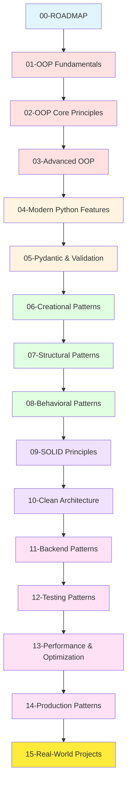

# Python OOP Masterclass: Complete Learning Roadmap

## Overview

This comprehensive masterclass will take you from zero to senior staff engineer level in Python Object-Oriented Programming. The curriculum is designed to match the standards expected at Google, Meta, and Amazon.

## Learning Path

## Module Breakdown

### Phase 1: Foundations (Week 1-2)

#### 01 - Python OOP Fundamentals
- Classes and Objects
- Attributes and Methods
- Special Methods (Dunder Methods)
- Properties and Encapsulation
- Instance vs Class vs Static Methods
- Production Patterns

**Time Estimate:** 8-10 hours
**Difficulty:** Beginner
**Prerequisites:** Basic Python knowledge

#### 02 - OOP Core Principles
- The Four Pillars: Encapsulation, Inheritance, Polymorphism, Abstraction
- Method Resolution Order (MRO)
- Multiple Inheritance
- Abstract Base Classes
- Protocols and Duck Typing

**Time Estimate:** 10-12 hours
**Difficulty:** Intermediate
**Prerequisites:** Module 01

#### 03 - Advanced OOP Concepts
- Metaclasses
- Descriptors
- Protocols and Structural Subtyping
- Context Managers
- Decorators (Advanced)
- Generators and Iterators

**Time Estimate:** 12-15 hours
**Difficulty:** Advanced
**Prerequisites:** Modules 01-02

### Phase 2: Modern Python (Week 3-4)

#### 04 - Modern Python Features
- Type Hints and Annotations
- Dataclasses and NamedTuples
- Async/Await and Asyncio
- Pattern Matching (Python 3.10+)
- Structural Pattern Matching
- Modern Error Handling

**Time Estimate:** 10-12 hours
**Difficulty:** Intermediate-Advanced
**Prerequisites:** Modules 01-03

#### 05 - Pydantic and Validation
- Pydantic Models
- Data Validation
- Settings Management
- JSON Schema Generation
- FastAPI Integration
- Custom Validators

**Time Estimate:** 8-10 hours
**Difficulty:** Intermediate
**Prerequisites:** Module 04

### Phase 3: Design Patterns (Week 5-7)

#### 06 - Creational Design Patterns
- Singleton Pattern
- Factory Method Pattern
- Abstract Factory Pattern
- Builder Pattern
- Prototype Pattern
- Object Pool Pattern

**Time Estimate:** 10-12 hours
**Difficulty:** Intermediate-Advanced
**Prerequisites:** Modules 01-05

#### 07 - Structural Design Patterns
- Adapter Pattern
- Bridge Pattern
- Composite Pattern
- Decorator Pattern
- Facade Pattern
- Flyweight Pattern
- Proxy Pattern

**Time Estimate:** 10-12 hours
**Difficulty:** Intermediate-Advanced
**Prerequisites:** Module 06

#### 08 - Behavioral Design Patterns
- Chain of Responsibility
- Command Pattern
- Iterator Pattern
- Mediator Pattern
- Memento Pattern
- Observer Pattern
- State Pattern
- Strategy Pattern
- Template Method Pattern
- Visitor Pattern

**Time Estimate:** 12-15 hours
**Difficulty:** Advanced
**Prerequisites:** Modules 06-07

### Phase 4: Architecture & Best Practices (Week 8-10)

#### 09 - SOLID Principles
- Single Responsibility Principle
- Open/Closed Principle
- Liskov Substitution Principle
- Interface Segregation Principle
- Dependency Inversion Principle
- Practical Applications

**Time Estimate:** 8-10 hours
**Difficulty:** Intermediate-Advanced
**Prerequisites:** Modules 01-08

#### 10 - Clean Architecture
- Hexagonal Architecture
- Onion Architecture
- Domain-Driven Design (DDD)
- CQRS Pattern
- Event Sourcing
- Microservices Patterns

**Time Estimate:** 12-15 hours
**Difficulty:** Advanced
**Prerequisites:** Modules 01-09

### Phase 5: Backend Engineering (Week 11-13)

#### 11 - Backend Engineering Patterns
- Repository Pattern
- Unit of Work Pattern
- Service Layer Pattern
- Dependency Injection
- Inversion of Control
- Factory Pattern in Backend
- DTO and Mapper Patterns

**Time Estimate:** 12-15 hours
**Difficulty:** Advanced
**Prerequisites:** Modules 09-10

#### 12 - Testing Patterns and Best Practices
- Unit Testing with pytest
- Test-Driven Development (TDD)
- Mocking and Patching
- Integration Testing
- Property-Based Testing
- Behavior-Driven Development (BDD)
- Test Coverage and Quality

**Time Estimate:** 10-12 hours
**Difficulty:** Intermediate-Advanced
**Prerequisites:** Modules 01-11

#### 13 - Performance and Optimization
- Profiling Python Code
- Memory Optimization
- Caching Strategies
- Async Performance Patterns
- Database Optimization
- Lazy Loading and Eager Loading
- Connection Pooling

**Time Estimate:** 10-12 hours
**Difficulty:** Advanced
**Prerequisites:** Modules 01-12

#### 14 - Production Patterns
- Logging and Monitoring
- Error Handling and Recovery
- Configuration Management
- Feature Flags
- Circuit Breaker Pattern
- Retry and Backoff Strategies
- Health Checks and Readiness

**Time Estimate:** 10-12 hours
**Difficulty:** Advanced
**Prerequisites:** Modules 01-13

### Phase 6: Real-World Application (Week 14-16)

#### 15 - Real-World Projects and Case Studies
- E-commerce Backend System
- Social Media Analytics Platform
- Real-Time Chat Application
- Data Pipeline Framework
- API Gateway Implementation
- Microservices Architecture
- FAANG-Style System Design

**Time Estimate:** 20-30 hours
**Difficulty:** Expert
**Prerequisites:** All previous modules

## Skill Progression Matrix

| Level | Modules | Skills Acquired | Job Readiness |
|-------|---------|----------------|---------------|
| **Junior** | 01-02 | Basic OOP, Core Principles | Entry-level positions |
| **Mid-Level** | 03-08 | Advanced OOP, Design Patterns | Mid-level positions |
| **Senior** | 09-12 | Architecture, Testing | Senior positions |
| **Staff** | 13-15 | Production, Systems | Staff/Principal positions |

## Coding Standards Reference

### Google Python Style Guide
- Use type hints for all functions
- Docstrings for all public methods
- Maximum line length: 80 characters (100 acceptable)
- Use `snake_case` for variables and functions
- Use `PascalCase` for class names

### Meta Python Standards
- Prefer composition over inheritance
- Keep functions small (< 20 lines)
- Single Responsibility Principle
- Comprehensive error handling
- Logging for production code

### Amazon Python Standards
- Write self-documenting code
- Extensive unit test coverage (> 80%)
- Use dependency injection
- Async for I/O-bound operations
- Monitor performance metrics

## Learning Strategies

### For Beginners
1. Start with Module 01-02
2. Code along with examples
3. Complete all practice exercises
4. Build small projects between modules
5. Review code with peers

### For Intermediate Developers
1. Skim Module 01-02 for review
2. Focus on Modules 03-08
3. Implement design patterns in existing projects
4. Refactor old code using new patterns
5. Contribute to open-source projects

### For Advanced Developers
1. Skip to Modules 09-15
2. Focus on architecture and production patterns
3. Lead code reviews
4. Mentor junior developers
5. Design systems from scratch

## Practice Projects by Phase

### Phase 1 Projects
- Build a library management system
- Create a banking application
- Design an inventory tracker

### Phase 2 Projects
- Async web scraper
- Data validation framework
- Configuration management system

### Phase 3 Projects
- Plugin architecture system
- Event-driven application
- Command pattern CLI tool

### Phase 4 Projects
- Clean architecture REST API
- DDD-based booking system
- CQRS event sourcing app

### Phase 5 Projects
- Production-ready microservice
- Data processing pipeline
- Distributed cache system

### Phase 6 Projects
- Full-stack application
- Real-time analytics platform
- Scalable API gateway

## Interview Preparation

### Junior Level Questions (Modules 01-02)
- Explain OOP concepts
- Implement basic classes
- Use inheritance and polymorphism
- Write clean, documented code

### Mid-Level Questions (Modules 03-08)
- Design patterns implementation
- Refactor legacy code
- Choose appropriate patterns
- Handle complex requirements

### Senior Level Questions (Modules 09-12)
- System design
- Architecture decisions
- Trade-off analysis
- Code review and mentoring

### Staff Level Questions (Modules 13-15)
- Large-scale system design
- Performance optimization
- Production incident handling
- Technical leadership

## Certification Path

Upon completion, you will have skills equivalent to:

- Google L4-L5 (Senior Software Engineer)
- Meta E4-E5 (Software Engineer)
- Amazon SDE II-III (Senior SDE)

## Resources and Tools

### Required Tools
- Python 3.10+
- VS Code or PyCharm
- Git for version control
- pytest for testing
- black for code formatting
- mypy for type checking
- pylint for linting

### Recommended Reading
- "Design Patterns" by Gang of Four
- "Clean Code" by Robert Martin
- "Effective Python" by Brett Slatkin
- "Python Cookbook" by David Beazley
- "Fluent Python" by Luciano Ramalho

### Online Resources
- Python.org documentation
- Real Python tutorials
- ArjanCodes YouTube channel
- Google Python Style Guide
- PEP 8 Style Guide

## Progress Tracking

### Week 1-2: Foundations
- [ ] Complete Module 01
- [ ] Complete Module 02
- [ ] Build library management system
- [ ] Pass fundamentals assessment

### Week 3-4: Modern Python
- [ ] Complete Module 03
- [ ] Complete Module 04
- [ ] Complete Module 05
- [ ] Build async web scraper

### Week 5-7: Design Patterns
- [ ] Complete Module 06
- [ ] Complete Module 07
- [ ] Complete Module 08
- [ ] Implement all 23 patterns

### Week 8-10: Architecture
- [ ] Complete Module 09
- [ ] Complete Module 10
- [ ] Design clean architecture system
- [ ] Pass architecture assessment

### Week 11-13: Backend Engineering
- [ ] Complete Module 11
- [ ] Complete Module 12
- [ ] Complete Module 13
- [ ] Complete Module 14
- [ ] Build production microservice

### Week 14-16: Real-World Projects
- [ ] Complete Module 15
- [ ] Build capstone project
- [ ] Code review from peers
- [ ] Ready for FAANG interviews

## Success Metrics

### Code Quality
- All code passes linting (pylint score > 9.0)
- Type checking passes (mypy --strict)
- Test coverage > 90%
- No critical code smells (SonarQube)

### Knowledge Assessment
- Can explain all OOP concepts
- Can implement all 23 design patterns
- Can design clean architecture
- Can optimize for production

### Project Completion
- All practice exercises completed
- All phase projects completed
- Capstone project deployed
- Code reviewed and approved

## Community and Support

### Getting Help
- Review documentation first
- Check stack overflow
- Join Python Discord communities
- Participate in code reviews
- Ask in learning forums

### Contributing Back
- Answer questions from juniors
- Share your projects
- Write blog posts
- Contribute to open source
- Mentor other learners

## Next Steps

Start with **01-python-oop-fundamentals.md** and follow the roadmap sequentially. Each module builds on the previous ones, so avoid skipping ahead unless you're already proficient in earlier topics.

Good luck on your journey to becoming a senior staff engineer!
