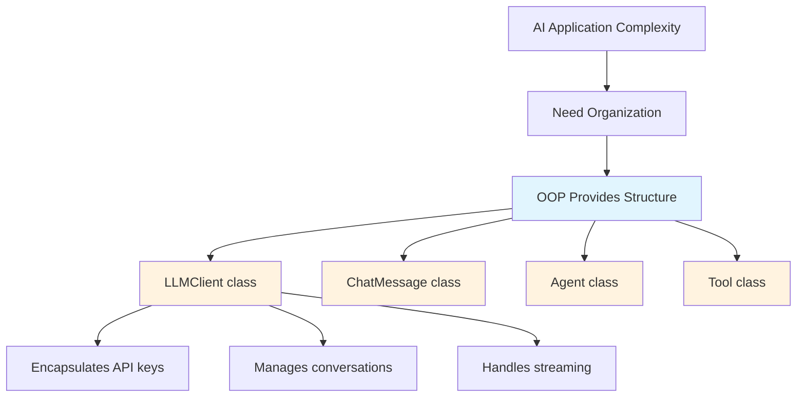
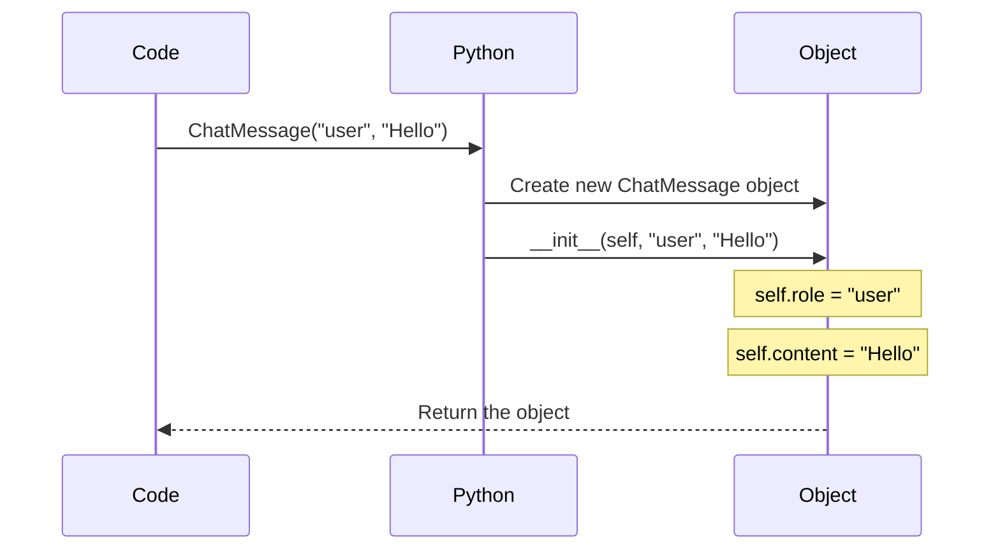
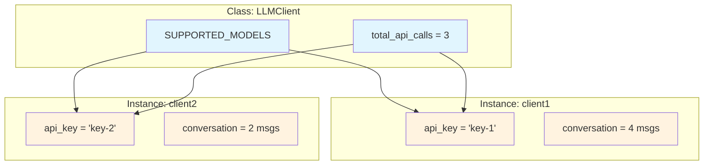
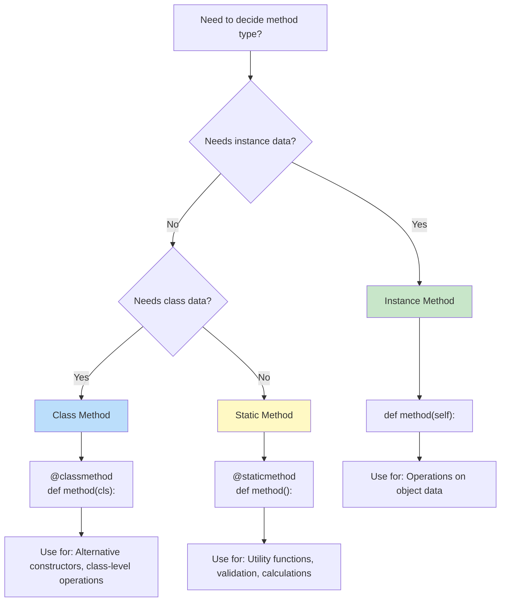
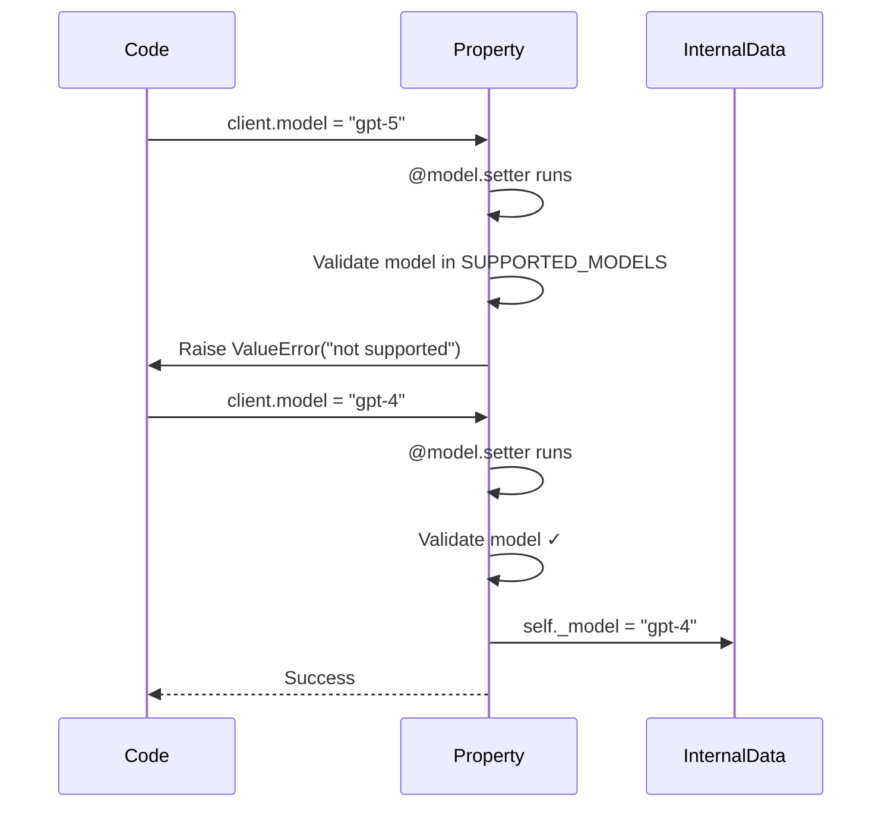
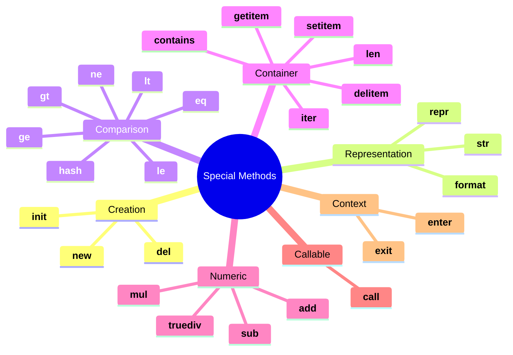

# Python OOP Fundamentals: Building LLM Clients from Scratch

## Learning Objectives
- Understand Object-Oriented Programming through building AI applications
- Master classes, objects, and the `__init__` constructor
- Learn instance, class, and static methods
- Implement properties for encapsulation and computed values
- Use special methods (dunder methods) effectively
- Build production-ready LLM client classes

## Table of Contents
1. [Introduction: Why OOP for AI?](#introduction)
2. [Classes and Objects](#classes-and-objects)
3. [The `__init__` Constructor](#the-init-constructor)
4. [Attributes: Instance vs Class](#attributes)
5. [Methods: Instance, Class, and Static](#methods)
6. [Properties and Encapsulation](#properties)
7. [Special Methods (Dunder Methods)](#special-methods)
8. [Building a Complete LLM Client](#complete-example)
9. [Practice Exercises](#exercises)

---

## Introduction: Why OOP for AI?

Modern AI applications like ChatGPT, Claude, and AI agents are built using Object-Oriented Programming. OOP helps us:



**Real-World Example:** Every major AI framework (LangChain, LlamaIndex, OpenAI SDK) is built with OOP.

### The Philosophy Behind OOP

Object-Oriented Programming isn't just a coding technique—it's a **way of thinking** about software that mirrors how we understand the real world. When you interact with ChatGPT, you're not thinking about bytes and memory addresses; you're thinking about a **conversation** with an **assistant** using **messages**. OOP lets us write code that reflects this natural mental model.

**The Problem OOP Solves:**

Before OOP, programmers used procedural programming where data and functions were separate. Imagine building an LLM application this way:

```python
# Procedural approach (messy, error-prone)
conversation_1 = []
conversation_2 = []
api_key_1 = "sk-xxx"
api_key_2 = "sk-yyy"

def send_message(conversation, api_key, message):
    # Which conversation? Which API key? Easy to mix up!
    pass
```

With OOP, data and behavior are bundled together:

```python
# OOP approach (clean, self-contained)
client = LLMClient(api_key="sk-xxx")
client.send("Hello!")  # Everything it needs is inside the object
```

**The Four Key Benefits of OOP:**

1. **Encapsulation** — Hide complexity. Users of your `LLMClient` don't need to know how API authentication works internally.

2. **Abstraction** — Work at higher levels. Instead of managing HTTP requests, you call `client.complete(prompt)`.

3. **Inheritance** — Reuse code. `OpenAIClient` and `AnthropicClient` can share common functionality from a `BaseLLMClient`.

4. **Polymorphism** — Write flexible code. A function that works with any `LLMClient` works with OpenAI, Anthropic, or local models.

> **Interview Insight:** FAANG interviewers often ask "Why use OOP here?" The answer should focus on **maintainability**, **testability**, and **modeling real-world concepts** naturally.

---

## Classes and Objects

### What is a Class?

A **class** is a blueprint for creating objects. Think of it like an architectural blueprint for a house—it defines what properties the house will have (rooms, doors, windows) and what you can do with it (open doors, turn on lights), but it's not a house itself.

In AI applications:
- `ChatMessage` class → blueprint for messages
- `LLMClient` class → blueprint for API clients
- `Tool` class → blueprint for agent tools

**Why This Matters:** When OpenAI designed their Python SDK, they didn't write separate code for each API call. They created a **class** that defines how any API call should work, then **instantiate** it for each specific call.

### What is an Object?

An **object** (also called an **instance**) is a specific realization of a class with actual data. If a class is the blueprint, an object is the actual house built from that blueprint.

**Key Distinction:**
- **Class**: Abstract definition (exists once in your code)
- **Object**: Concrete instance (you can create many from one class)

```python
# ChatMessage is the class (blueprint)
# message1 and message2 are objects (instances)
message1 = ChatMessage(role="user", content="Hello!")
message2 = ChatMessage(role="assistant", content="Hi there!")
```

Each object has its **own independent state**. Changing `message1.content` doesn't affect `message2.content`. This independence is fundamental to OOP and is what makes it powerful for managing complex applications like AI agents that handle multiple conversations simultaneously.

### The Class-Object Mental Model

Think of classes and objects like this:

| Concept | Analogy | AI Example |
|---------|---------|------------|
| **Class** | Recipe | `ChatMessage` definition |
| **Object** | Cake made from recipe | Specific message instance |
| **Attributes** | Ingredients | `role`, `content`, `timestamp` |
| **Methods** | Instructions | `to_dict()`, `count_tokens()` |

You can make many cakes from one recipe, and each cake can have different decorations (data), but they all follow the same basic structure.

### Your First AI Class

```python
class ChatMessage:
    """Represents a message in a conversation with an LLM.
    
    This is the fundamental building block of all LLM interactions.
    Every conversation is a list of ChatMessage objects.
    """
    pass  # Empty class for now


# Creating objects (instances)
message = ChatMessage()
print(type(message))  # <class '__main__.ChatMessage'>
print(isinstance(message, ChatMessage))  # True
```

**What's happening here?**
1. `class ChatMessage:` defines a new type
2. `message = ChatMessage()` creates an instance (the parentheses call the constructor)
3. `type(message)` confirms the object's type
4. `isinstance()` checks if an object belongs to a class (useful for validation)

> **Best Practice:** In production AI systems, you'll use `isinstance()` extensively to validate inputs. For example, ensuring that only valid `ChatMessage` objects are added to a conversation.

---

## The `__init__` Constructor

### Understanding Constructors

The `__init__` method is Python's **constructor**—a special method that runs automatically when you create an object. Its job is to **initialize** the object's state by setting up its attributes.

**Why "init" and not "constructor"?** Technically, `__init__` is an "initializer," not a true constructor. Python's `__new__` method creates the object, and `__init__` sets it up. For practical purposes, treat `__init__` as your constructor.

**The Purpose of `__init__`:**
1. **Receive configuration** — Accept parameters that customize each instance
2. **Set initial state** — Create and initialize attributes
3. **Validate inputs** — Ensure the object starts in a valid state
4. **Set up resources** — Initialize connections, load data, etc.

### Basic Constructor

```python
from typing import Optional, List, Dict, Any
from datetime import datetime


class ChatMessage:
    """Represents a message in an LLM conversation.
    
    Attributes:
        role: The role of the message sender (system/user/assistant/tool)
        content: The text content of the message
        name: Optional name for the sender
        created_at: Timestamp when message was created
    """
    
    def __init__(
        self,
        role: str,
        content: str,
        name: Optional[str] = None
    ) -> None:
        """Initialize a new ChatMessage.
        
        Args:
            role: One of 'system', 'user', 'assistant', 'tool'
            content: The message text
            name: Optional sender name (used for tool messages)
        """
        self.role = role
        self.content = content
        self.name = name
        self.created_at = datetime.now()


# Creating messages
system_msg = ChatMessage(
    role="system",
    content="You are a helpful AI assistant."
)

user_msg = ChatMessage(
    role="user",
    content="What is machine learning?"
)

print(f"Role: {user_msg.role}")  # Role: user
print(f"Content: {user_msg.content}")  # Content: What is machine learning?
print(f"Created: {user_msg.created_at}")  # Created: 2025-12-06 22:45:00.123456
```

### Understanding `self`

The `self` parameter is one of the most misunderstood concepts for Python beginners. Let's demystify it.

**What is `self`?**

`self` is a reference to the **current instance** of the class. When you call `client.send_message("Hello")`, Python automatically passes `client` as the first argument (`self`) to the method. This is how methods know which object's data to work with.

**Why is `self` necessary?**

Unlike some languages (like Java or C++) where `this` is implicit, Python requires you to explicitly declare `self`. This follows Python's philosophy of "explicit is better than implicit" (from The Zen of Python).

**Common Misconception:** `self` is not a keyword—it's just a convention. You could name it anything, but **always use `self`** for readability and consistency.



**Key Points:**
- `self` refers to the specific object being created
- Python automatically passes `self` as the first argument
- Use `self.attribute_name` to store data on the object

> **Interview Tip:** If asked "What is `self` in Python?", explain that it's a reference to the instance that allows methods to access and modify the object's state. It's passed automatically by Python when calling instance methods.

---

## Attributes: Instance vs Class

Understanding the difference between instance and class attributes is crucial for designing robust AI systems. This distinction affects memory usage, data sharing, and thread safety.

### The Core Difference

- **Instance attributes**: Belong to each object, stored separately in memory
- **Class attributes**: Shared across all instances, stored once in the class

**When to use which?**
- Use **instance attributes** for data unique to each object (API keys, conversation history)
- Use **class attributes** for shared configuration or global state (supported models, default settings, usage counters)

### Instance Attributes (Per-Object Data)

Instance attributes are created inside `__init__` (or other methods) using `self.attribute_name`. Each object gets its own copy.

**Why this matters in AI applications:** When you have multiple `LLMClient` instances talking to different AI providers, each needs its own API key, conversation history, and token count. Instance attributes ensure complete isolation.

Each object has its own copy of instance attributes:

```python
class LLMClient:
    """Client for interacting with Large Language Models."""
    
    def __init__(self, api_key: str, model: str = "gpt-4") -> None:
        """Initialize LLM client.
        
        Args:
            api_key: API key for authentication
            model: Model identifier (default: gpt-4)
        """
        # Instance attributes - unique to each object
        self.api_key = api_key
        self.model = model
        self.conversation: List[ChatMessage] = []
        self.total_tokens_used = 0


# Each client has its own data
client1 = LLMClient("key-123", "gpt-4")
client2 = LLMClient("key-456", "gpt-3.5-turbo")

client1.total_tokens_used = 100
print(client1.total_tokens_used)  # 100
print(client2.total_tokens_used)  # 0 (separate object)
```

### Class Attributes (Shared Data)

Class attributes are shared across all instances:

```python
class LLMClient:
    """Client for interacting with Large Language Models."""
    
    # Class attributes - shared by ALL instances
    SUPPORTED_MODELS = ["gpt-4", "gpt-3.5-turbo", "gpt-4-turbo"]
    DEFAULT_MAX_TOKENS = 4096
    total_api_calls = 0  # Track calls across all clients
    
    def __init__(self, api_key: str, model: str = "gpt-4") -> None:
        """Initialize LLM client."""
        # Instance attributes - unique to each object
        self.api_key = api_key
        self.model = model
        self.conversation: List[ChatMessage] = []
    
    def send_message(self, content: str) -> str:
        """Send a message and get response."""
        # Increment class-level counter
        LLMClient.total_api_calls += 1
        
        # Add to conversation
        self.conversation.append(ChatMessage("user", content))
        
        # Simulate API call (would be real API in production)
        response = f"Response to: {content}"
        self.conversation.append(ChatMessage("assistant", response))
        
        return response


# Class attributes are shared
client1 = LLMClient("key-1")
client2 = LLMClient("key-2")

client1.send_message("Hello")
client2.send_message("Hi")
client1.send_message("How are you?")

print(f"Client 1 messages: {len(client1.conversation)}")  # 4
print(f"Client 2 messages: {len(client2.conversation)}")  # 2
print(f"Total API calls: {LLMClient.total_api_calls}")  # 3 (shared)
```



---

## Methods: Instance, Class, and Static

Python classes support three types of methods, each serving a distinct purpose. Understanding when to use each is a hallmark of professional Python development.

### The Three Method Types at a Glance

| Method Type | First Parameter | Can Access | Primary Use |
|------------|-----------------|------------|-------------|
| **Instance** | `self` | Instance + class data | Object-specific operations |
| **Class** | `cls` | Class data only | Alternative constructors, class-level operations |
| **Static** | None | Neither | Utility functions grouped with the class |

### Why Three Types?

The distinction exists because not every function needs access to instance data:

- **Instance methods** need to read/write object state → give them `self`
- **Class methods** need to create instances or modify class state → give them `cls`
- **Static methods** are utilities that logically belong to the class → no special access needed

**Real AI Framework Example:** In the OpenAI Python SDK:
- `client.chat.completions.create()` is an instance method (needs the client's API key)
- `OpenAI.from_env()` would be a class method (creates a new instance)
- Token counting utilities are often static methods

### Instance Methods

Instance methods are the most common. They operate on a specific object and have access to `self`, meaning they can read and modify that object's state.

**Key Characteristics:**
- Defined with `self` as the first parameter
- Called on an instance: `object.method()`
- Can access both instance and class attributes

Instance methods operate on a specific object and have access to `self`:

```python
class LLMClient:
    """LLM Client with instance methods."""
    
    def __init__(self, api_key: str, model: str = "gpt-4") -> None:
        self.api_key = api_key
        self.model = model
        self.conversation: List[ChatMessage] = []
        self.total_tokens = 0
    
    # Instance method - operates on self
    def add_message(self, role: str, content: str) -> None:
        """Add a message to the conversation.
        
        Args:
            role: Message role
            content: Message content
        """
        message = ChatMessage(role, content)
        self.conversation.append(message)
    
    # Instance method - accesses self data
    def get_conversation_length(self) -> int:
        """Get number of messages in conversation.
        
        Returns:
            Number of messages
        """
        return len(self.conversation)
    
    # Instance method - modifies self
    def clear_conversation(self) -> None:
        """Clear the conversation history."""
        self.conversation = []
        self.total_tokens = 0


# Usage
client = LLMClient("my-api-key")
client.add_message("system", "You are helpful.")
client.add_message("user", "Hello!")

print(client.get_conversation_length())  # 2
```

### Class Methods

Class methods operate on the class itself, not instances. Use `@classmethod` decorator:

```python
import os
from typing import Dict


class LLMClient:
    """LLM Client with class methods for alternative constructors."""
    
    # Class attribute
    _default_model = "gpt-4"
    
    def __init__(self, api_key: str, model: str = "gpt-4") -> None:
        self.api_key = api_key
        self.model = model
        self.conversation: List[ChatMessage] = []
    
    # Class method - alternative constructor from environment
    @classmethod
    def from_env(cls, env_var: str = "OPENAI_API_KEY") -> "LLMClient":
        """Create client from environment variable.
        
        Args:
            env_var: Name of environment variable containing API key
            
        Returns:
            New LLMClient instance
            
        Raises:
            ValueError: If environment variable is not set
        """
        api_key = os.environ.get(env_var)
        if not api_key:
            raise ValueError(f"Environment variable {env_var} not set")
        return cls(api_key)
    
    # Class method - alternative constructor from config
    @classmethod
    def from_config(cls, config: Dict[str, Any]) -> "LLMClient":
        """Create client from configuration dictionary.
        
        Args:
            config: Configuration with 'api_key' and optional 'model'
            
        Returns:
            New LLMClient instance
        """
        return cls(
            api_key=config["api_key"],
            model=config.get("model", cls._default_model)
        )
    
    # Class method - modify class state
    @classmethod
    def set_default_model(cls, model: str) -> None:
        """Set the default model for new clients.
        
        Args:
            model: Model identifier
        """
        cls._default_model = model


# Usage
# From environment variable
os.environ["OPENAI_API_KEY"] = "sk-test-key"
client1 = LLMClient.from_env()

# From config dictionary
config = {"api_key": "sk-config-key", "model": "gpt-3.5-turbo"}
client2 = LLMClient.from_config(config)

# Modify class default
LLMClient.set_default_model("gpt-4-turbo")
```

### Static Methods

Static methods don't access instance or class data. They're utility functions that belong to the class:

```python
import tiktoken


class LLMClient:
    """LLM Client with static utility methods."""
    
    def __init__(self, api_key: str, model: str = "gpt-4") -> None:
        self.api_key = api_key
        self.model = model
        self.conversation: List[ChatMessage] = []
    
    # Static method - utility function for token counting
    @staticmethod
    def count_tokens(text: str, model: str = "gpt-4") -> int:
        """Count tokens in text for a specific model.
        
        Args:
            text: Text to count tokens for
            model: Model to use for tokenization
            
        Returns:
            Number of tokens
        """
        try:
            encoding = tiktoken.encoding_for_model(model)
            return len(encoding.encode(text))
        except Exception:
            # Fallback: rough estimate (1 token ≈ 4 chars)
            return len(text) // 4
    
    # Static method - validate API key format
    @staticmethod
    def validate_api_key(api_key: str) -> bool:
        """Validate API key format.
        
        Args:
            api_key: API key to validate
            
        Returns:
            True if valid format
        """
        if not api_key:
            return False
        # OpenAI keys start with 'sk-'
        return api_key.startswith("sk-") and len(api_key) > 20
    
    # Static method - estimate cost
    @staticmethod
    def estimate_cost(
        input_tokens: int,
        output_tokens: int,
        model: str = "gpt-4"
    ) -> float:
        """Estimate API call cost.
        
        Args:
            input_tokens: Number of input tokens
            output_tokens: Number of output tokens
            model: Model being used
            
        Returns:
            Estimated cost in USD
        """
        # Pricing per 1K tokens (as of 2024)
        pricing = {
            "gpt-4": {"input": 0.03, "output": 0.06},
            "gpt-4-turbo": {"input": 0.01, "output": 0.03},
            "gpt-3.5-turbo": {"input": 0.0005, "output": 0.0015},
        }
        
        rates = pricing.get(model, pricing["gpt-4"])
        input_cost = (input_tokens / 1000) * rates["input"]
        output_cost = (output_tokens / 1000) * rates["output"]
        
        return round(input_cost + output_cost, 6)


# Usage - can call without instance
tokens = LLMClient.count_tokens("Hello, how are you?")
print(f"Tokens: {tokens}")  # Tokens: 6

is_valid = LLMClient.validate_api_key("sk-abc123...")
print(f"Valid: {is_valid}")  # Valid: True

cost = LLMClient.estimate_cost(1000, 500, "gpt-4")
print(f"Cost: ${cost}")  # Cost: $0.06
```

### When to Use Each Method Type



| Method Type | Has `self`? | Has `cls`? | Use Case |
|-------------|------------|-----------|----------|
| **Instance** | ✅ | ❌ | Work with object data |
| **Class** | ❌ | ✅ | Alternative constructors, class state |
| **Static** | ❌ | ❌ | Utilities that logically belong to class |

---

## Properties and Encapsulation

### Why Encapsulation?

Encapsulation protects internal data and provides controlled access:

```python
class LLMClient:
    """LLM Client with encapsulated API key."""
    
    def __init__(self, api_key: str, model: str = "gpt-4") -> None:
        # Protected attribute (convention: single underscore)
        self._api_key = api_key
        self._model = model
        self._conversation: List[ChatMessage] = []
        self._total_tokens = 0
    
    # BAD: Direct access exposes internal state
    # client._api_key = "hacked!"  # Can be modified directly
```

### Properties: Controlled Access

Use `@property` to create getters and setters:

```python
class LLMClient:
    """LLM Client with property-based encapsulation."""
    
    SUPPORTED_MODELS = ["gpt-4", "gpt-4-turbo", "gpt-3.5-turbo"]
    
    def __init__(self, api_key: str, model: str = "gpt-4") -> None:
        self._api_key = api_key
        self._model = model
        self._conversation: List[ChatMessage] = []
        self._total_tokens = 0
    
    # Read-only property (no setter)
    @property
    def api_key_masked(self) -> str:
        """Get masked API key for display.
        
        Returns:
            API key with middle characters hidden
        """
        if len(self._api_key) < 8:
            return "***"
        return f"{self._api_key[:4]}...{self._api_key[-4:]}"
    
    # Property with getter and setter
    @property
    def model(self) -> str:
        """Get current model.
        
        Returns:
            Model identifier
        """
        return self._model
    
    @model.setter
    def model(self, value: str) -> None:
        """Set model with validation.
        
        Args:
            value: New model identifier
            
        Raises:
            ValueError: If model not supported
        """
        if value not in self.SUPPORTED_MODELS:
            raise ValueError(
                f"Model '{value}' not supported. "
                f"Choose from: {self.SUPPORTED_MODELS}"
            )
        self._model = value
    
    # Computed property (calculated on access)
    @property
    def token_count(self) -> int:
        """Get total tokens in conversation.
        
        Returns:
            Total token count
        """
        total = 0
        for msg in self._conversation:
            total += LLMClient.count_tokens(msg.content, self._model)
        return total
    
    # Computed property for cost
    @property
    def estimated_cost(self) -> float:
        """Get estimated cost of conversation so far.
        
        Returns:
            Estimated cost in USD
        """
        tokens = self.token_count
        return LLMClient.estimate_cost(tokens, tokens // 2, self._model)
    
    # Property with validation
    @property
    def conversation(self) -> List[ChatMessage]:
        """Get conversation history (read-only copy).
        
        Returns:
            Copy of conversation list
        """
        return self._conversation.copy()
    
    @staticmethod
    def count_tokens(text: str, model: str = "gpt-4") -> int:
        """Count tokens in text."""
        return len(text) // 4  # Simplified
    
    @staticmethod
    def estimate_cost(input_tokens: int, output_tokens: int, model: str) -> float:
        """Estimate cost."""
        return (input_tokens + output_tokens) * 0.00003


# Usage
client = LLMClient("sk-abc123secretkey456xyz")

# Read-only property
print(client.api_key_masked)  # sk-a...6xyz

# Property with validation
client.model = "gpt-3.5-turbo"  # OK
try:
    client.model = "invalid-model"  # Raises ValueError
except ValueError as e:
    print(f"Error: {e}")

# Computed property
print(f"Tokens: {client.token_count}")
print(f"Cost: ${client.estimated_cost:.4f}")
```



### Property Naming Conventions

| Convention | Meaning | Example |
|------------|---------|---------|
| `attribute` | Public, free to use | `client.model` |
| `_attribute` | Protected, internal use | `client._conversation` |
| `__attribute` | Private, name mangled | `client.__rate_limiter` |
| `@property` | Controlled access | `client.token_count` |

---

## Special Methods (Dunder Methods)

Special methods (double underscore = "dunder") let objects work with Python's built-in operations.

### String Representation: `__str__` and `__repr__`

```python
class ChatMessage:
    """Chat message with string representations."""
    
    def __init__(self, role: str, content: str) -> None:
        self.role = role
        self.content = content
        self.created_at = datetime.now()
    
    def __str__(self) -> str:
        """User-friendly string (used by print()).
        
        Returns:
            Formatted message for display
        """
        # Truncate long content
        preview = self.content[:50] + "..." if len(self.content) > 50 else self.content
        return f"[{self.role.upper()}]: {preview}"
    
    def __repr__(self) -> str:
        """Developer-friendly string (used in debugger/REPL).
        
        Returns:
            String that could recreate the object
        """
        return f"ChatMessage(role={self.role!r}, content={self.content!r})"


# Usage
msg = ChatMessage("user", "What is the capital of France?")

print(msg)  # [USER]: What is the capital of France?
print(repr(msg))  # ChatMessage(role='user', content='What is the capital of France?')

# In a list, __repr__ is used
messages = [msg, ChatMessage("assistant", "Paris")]
print(messages)  # [ChatMessage(role='user', ...), ChatMessage(role='assistant', ...)]
```

### Comparison: `__eq__`, `__lt__`, etc.

```python
class ChatMessage:
    """Chat message with comparison support."""
    
    def __init__(self, role: str, content: str) -> None:
        self.role = role
        self.content = content
        self.created_at = datetime.now()
        self.token_count = len(content) // 4
    
    def __eq__(self, other: object) -> bool:
        """Check equality based on role and content.
        
        Args:
            other: Object to compare with
            
        Returns:
            True if messages are equal
        """
        if not isinstance(other, ChatMessage):
            return NotImplemented
        return self.role == other.role and self.content == other.content
    
    def __lt__(self, other: "ChatMessage") -> bool:
        """Compare by token count (for sorting).
        
        Args:
            other: Message to compare with
            
        Returns:
            True if this message has fewer tokens
        """
        if not isinstance(other, ChatMessage):
            return NotImplemented
        return self.token_count < other.token_count
    
    def __hash__(self) -> int:
        """Make message hashable (for use in sets/dicts).
        
        Returns:
            Hash value
        """
        return hash((self.role, self.content))


# Usage
msg1 = ChatMessage("user", "Hello")
msg2 = ChatMessage("user", "Hello")
msg3 = ChatMessage("user", "This is a much longer message")

print(msg1 == msg2)  # True (same role and content)
print(msg1 < msg3)   # True (fewer tokens)

# Sorting by token count
messages = [msg3, msg1, msg2]
sorted_msgs = sorted(messages)
print([m.content for m in sorted_msgs])  # ['Hello', 'Hello', 'This is...']

# Use in set (requires __hash__)
unique_messages = {msg1, msg2, msg3}
print(len(unique_messages))  # 2 (msg1 and msg2 are equal)
```

### Container Methods: `__len__`, `__getitem__`, `__iter__`

```python
class Conversation:
    """Conversation container with list-like behavior."""
    
    def __init__(self) -> None:
        self._messages: List[ChatMessage] = []
    
    def add(self, role: str, content: str) -> None:
        """Add message to conversation."""
        self._messages.append(ChatMessage(role, content))
    
    def __len__(self) -> int:
        """Get number of messages. Enables len(conversation).
        
        Returns:
            Number of messages
        """
        return len(self._messages)
    
    def __getitem__(self, index: int) -> ChatMessage:
        """Get message by index. Enables conversation[0].
        
        Args:
            index: Message index
            
        Returns:
            Message at index
        """
        return self._messages[index]
    
    def __iter__(self):
        """Iterate over messages. Enables for msg in conversation.
        
        Yields:
            Messages in order
        """
        return iter(self._messages)
    
    def __contains__(self, item: ChatMessage) -> bool:
        """Check if message in conversation. Enables msg in conversation.
        
        Args:
            item: Message to check
            
        Returns:
            True if message exists
        """
        return item in self._messages
    
    def __bool__(self) -> bool:
        """Check if conversation has messages. Enables if conversation.
        
        Returns:
            True if not empty
        """
        return len(self._messages) > 0


# Usage
conv = Conversation()
conv.add("system", "You are helpful.")
conv.add("user", "Hello!")
conv.add("assistant", "Hi there!")

# len()
print(f"Messages: {len(conv)}")  # Messages: 3

# Indexing
print(conv[0])  # [SYSTEM]: You are helpful.
print(conv[-1])  # [ASSISTANT]: Hi there!

# Iteration
for msg in conv:
    print(f"  - {msg}")

# Boolean check
if conv:
    print("Conversation has messages")
```

### Callable Objects: `__call__`

```python
class LLMClient:
    """LLM Client that can be called like a function."""
    
    def __init__(self, api_key: str, model: str = "gpt-4") -> None:
        self._api_key = api_key
        self.model = model
        self._conversation: List[ChatMessage] = []
    
    def __call__(self, prompt: str) -> str:
        """Make client callable. Enables client("prompt").
        
        Args:
            prompt: User prompt
            
        Returns:
            Assistant response
        """
        # Add user message
        self._conversation.append(ChatMessage("user", prompt))
        
        # Simulate API call
        response = f"Response to: {prompt}"
        self._conversation.append(ChatMessage("assistant", response))
        
        return response


# Usage - call the object directly
client = LLMClient("sk-key")

# These are equivalent:
response1 = client("What is Python?")  # Uses __call__
print(response1)  # Response to: What is Python?

response2 = client("Tell me more")
print(response2)  # Response to: Tell me more
```

### Complete Special Methods Reference



---

## Building a Complete LLM Client

Let's combine everything into a production-ready LLM client:

```python
"""
Complete LLM Client Implementation
Demonstrates all OOP fundamentals in an AI context.
"""

from typing import Optional, List, Dict, Any, Iterator
from datetime import datetime
from dataclasses import dataclass
import os


@dataclass
class ChatMessage:
    """Immutable message in a conversation."""
    role: str
    content: str
    name: Optional[str] = None
    created_at: datetime = None
    
    def __post_init__(self):
        if self.created_at is None:
            self.created_at = datetime.now()
    
    def __str__(self) -> str:
        preview = self.content[:50] + "..." if len(self.content) > 50 else self.content
        return f"[{self.role.upper()}]: {preview}"
    
    def to_dict(self) -> Dict[str, str]:
        """Convert to API format."""
        result = {"role": self.role, "content": self.content}
        if self.name:
            result["name"] = self.name
        return result


class LLMClient:
    """Production-ready LLM Client demonstrating OOP fundamentals.
    
    Features:
        - Encapsulated API key handling
        - Conversation management
        - Token counting and cost estimation
        - Multiple construction patterns
        - Callable interface
    
    Example:
        >>> client = LLMClient.from_env()
        >>> response = client("What is Python?")
        >>> print(response)
    """
    
    # Class attributes
    SUPPORTED_MODELS = ["gpt-4", "gpt-4-turbo", "gpt-3.5-turbo", "claude-3-opus"]
    DEFAULT_MODEL = "gpt-4"
    PRICING = {
        "gpt-4": {"input": 0.03, "output": 0.06},
        "gpt-4-turbo": {"input": 0.01, "output": 0.03},
        "gpt-3.5-turbo": {"input": 0.0005, "output": 0.0015},
        "claude-3-opus": {"input": 0.015, "output": 0.075},
    }
    
    # Class-level tracking
    _total_api_calls = 0
    _total_tokens_used = 0
    
    def __init__(
        self,
        api_key: str,
        model: str = "gpt-4",
        system_prompt: Optional[str] = None,
        max_tokens: int = 4096
    ) -> None:
        """Initialize LLM client.
        
        Args:
            api_key: API key for authentication
            model: Model identifier
            system_prompt: Optional system prompt
            max_tokens: Maximum tokens per response
        
        Raises:
            ValueError: If API key is invalid or model not supported
        """
        if not self.validate_api_key(api_key):
            raise ValueError("Invalid API key format")
        
        if model not in self.SUPPORTED_MODELS:
            raise ValueError(f"Model '{model}' not supported")
        
        # Protected instance attributes
        self._api_key = api_key
        self._model = model
        self._max_tokens = max_tokens
        self._conversation: List[ChatMessage] = []
        self._total_input_tokens = 0
        self._total_output_tokens = 0
        
        # Add system prompt if provided
        if system_prompt:
            self._conversation.append(ChatMessage("system", system_prompt))
    
    # ========== Class Methods (Alternative Constructors) ==========
    
    @classmethod
    def from_env(
        cls,
        env_var: str = "OPENAI_API_KEY",
        **kwargs
    ) -> "LLMClient":
        """Create client from environment variable.
        
        Args:
            env_var: Environment variable name
            **kwargs: Additional arguments for __init__
        
        Returns:
            New LLMClient instance
        """
        api_key = os.environ.get(env_var)
        if not api_key:
            raise ValueError(f"Environment variable {env_var} not set")
        return cls(api_key, **kwargs)
    
    @classmethod
    def from_config(cls, config: Dict[str, Any]) -> "LLMClient":
        """Create client from configuration dictionary.
        
        Args:
            config: Configuration dictionary
        
        Returns:
            New LLMClient instance
        """
        return cls(
            api_key=config["api_key"],
            model=config.get("model", cls.DEFAULT_MODEL),
            system_prompt=config.get("system_prompt"),
            max_tokens=config.get("max_tokens", 4096)
        )
    
    @classmethod
    def get_stats(cls) -> Dict[str, int]:
        """Get global usage statistics.
        
        Returns:
            Dictionary with total calls and tokens
        """
        return {
            "total_api_calls": cls._total_api_calls,
            "total_tokens_used": cls._total_tokens_used
        }
    
    # ========== Static Methods (Utilities) ==========
    
    @staticmethod
    def validate_api_key(api_key: str) -> bool:
        """Validate API key format.
        
        Args:
            api_key: API key to validate
        
        Returns:
            True if valid
        """
        if not api_key or len(api_key) < 10:
            return False
        return api_key.startswith(("sk-", "claude-"))
    
    @staticmethod
    def count_tokens(text: str) -> int:
        """Estimate token count.
        
        Args:
            text: Text to count
        
        Returns:
            Estimated token count
        """
        # Rough estimate: 1 token ≈ 4 characters
        return max(1, len(text) // 4)
    
    # ========== Properties ==========
    
    @property
    def model(self) -> str:
        """Get current model."""
        return self._model
    
    @model.setter
    def model(self, value: str) -> None:
        """Set model with validation."""
        if value not in self.SUPPORTED_MODELS:
            raise ValueError(f"Model '{value}' not supported")
        self._model = value
    
    @property
    def api_key_masked(self) -> str:
        """Get masked API key for display."""
        return f"{self._api_key[:4]}...{self._api_key[-4:]}"
    
    @property
    def message_count(self) -> int:
        """Get number of messages in conversation."""
        return len(self._conversation)
    
    @property
    def total_tokens(self) -> int:
        """Get total tokens used in this conversation."""
        return self._total_input_tokens + self._total_output_tokens
    
    @property
    def estimated_cost(self) -> float:
        """Get estimated cost of conversation."""
        rates = self.PRICING.get(self._model, self.PRICING["gpt-4"])
        input_cost = (self._total_input_tokens / 1000) * rates["input"]
        output_cost = (self._total_output_tokens / 1000) * rates["output"]
        return round(input_cost + output_cost, 6)
    
    @property
    def conversation(self) -> List[ChatMessage]:
        """Get copy of conversation history."""
        return self._conversation.copy()
    
    # ========== Instance Methods ==========
    
    def send(self, content: str) -> str:
        """Send a message and get response.
        
        Args:
            content: User message
        
        Returns:
            Assistant response
        """
        # Create user message
        user_msg = ChatMessage("user", content)
        self._conversation.append(user_msg)
        
        # Count input tokens
        input_tokens = sum(self.count_tokens(m.content) for m in self._conversation)
        self._total_input_tokens += input_tokens
        
        # Simulate API call (replace with real API in production)
        response_content = f"[Simulated response to: {content[:30]}...]"
        output_tokens = self.count_tokens(response_content)
        self._total_output_tokens += output_tokens
        
        # Create assistant message
        assistant_msg = ChatMessage("assistant", response_content)
        self._conversation.append(assistant_msg)
        
        # Update class-level stats
        LLMClient._total_api_calls += 1
        LLMClient._total_tokens_used += input_tokens + output_tokens
        
        return response_content
    
    def clear(self) -> None:
        """Clear conversation history (keeps system prompt)."""
        system_msgs = [m for m in self._conversation if m.role == "system"]
        self._conversation = system_msgs
        self._total_input_tokens = 0
        self._total_output_tokens = 0
    
    def get_messages_for_api(self) -> List[Dict[str, str]]:
        """Get conversation in API format.
        
        Returns:
            List of message dictionaries
        """
        return [msg.to_dict() for msg in self._conversation]
    
    # ========== Special Methods ==========
    
    def __call__(self, prompt: str) -> str:
        """Make client callable.
        
        Args:
            prompt: User prompt
        
        Returns:
            Assistant response
        """
        return self.send(prompt)
    
    def __len__(self) -> int:
        """Get conversation length."""
        return len(self._conversation)
    
    def __iter__(self) -> Iterator[ChatMessage]:
        """Iterate over messages."""
        return iter(self._conversation)
    
    def __bool__(self) -> bool:
        """Check if conversation has messages."""
        return len(self._conversation) > 0
    
    def __str__(self) -> str:
        """Get user-friendly representation."""
        return (
            f"LLMClient(model={self._model}, "
            f"messages={len(self)}, "
            f"tokens={self.total_tokens})"
        )
    
    def __repr__(self) -> str:
        """Get developer-friendly representation."""
        return (
            f"LLMClient(api_key={self.api_key_masked!r}, "
            f"model={self._model!r})"
        )


# ========== Usage Example ==========

if __name__ == "__main__":
    # Create client
    client = LLMClient(
        api_key="sk-test-key-12345678",
        model="gpt-4",
        system_prompt="You are a helpful AI assistant."
    )
    
    # Show client info
    print(f"Client: {client}")
    print(f"API Key: {client.api_key_masked}")
    
    # Send messages (callable interface)
    response1 = client("What is machine learning?")
    print(f"\nResponse: {response1}")
    
    response2 = client("Give me an example")
    print(f"Response: {response2}")
    
    # Iterate over conversation
    print("\n--- Conversation ---")
    for msg in client:
        print(f"  {msg}")
    
    # Show stats
    print(f"\nTotal tokens: {client.total_tokens}")
    print(f"Estimated cost: ${client.estimated_cost:.4f}")
    print(f"Global stats: {LLMClient.get_stats()}")
```

**Output:**
```
Client: LLMClient(model=gpt-4, messages=1, tokens=0)
API Key: sk-t...5678

Response: [Simulated response to: What is machine learning?...]
Response: [Simulated response to: Give me an example...]

--- Conversation ---
  [SYSTEM]: You are a helpful AI assistant.
  [USER]: What is machine learning?
  [ASSISTANT]: [Simulated response to: What is machine learning?...]
  [USER]: Give me an example
  [ASSISTANT]: [Simulated response to: Give me an example...]

Total tokens: 67
Estimated cost: $0.002010
Global stats: {'total_api_calls': 2, 'total_tokens_used': 67}
```

---

## Practice Exercises

### Exercise 1: ToolCall Class (Beginner)

Create a `ToolCall` class to represent function calls in AI agents:

```python
# Requirements:
# - Attributes: name, arguments (dict), id
# - __str__ that shows: "ToolCall(name='search', args={...})"
# - __eq__ that compares by id

class ToolCall:
    # Your code here
    pass
```

### Exercise 2: TokenBudget (Intermediate)

Create a `TokenBudget` class that tracks token usage:

```python
# Requirements:
# - __init__ with max_tokens parameter
# - property 'remaining' that returns tokens left
# - method 'use(tokens)' that subtracts and raises if exceeded
# - class method 'for_model(model)' with default budgets
# - __bool__ that returns True if budget remaining

class TokenBudget:
    # Your code here
    pass
```

### Exercise 3: ConversationManager (Advanced)

Create a `ConversationManager` class:

```python
# Requirements:
# - Store multiple conversations by ID
# - __getitem__ to access by ID
# - __contains__ to check if conversation exists
# - Class attribute tracking total messages across all conversations
# - from_file() class method to load conversations

class ConversationManager:
    # Your code here
    pass
```

---

## Summary

### What You Learned

| Concept | AI Application |
|---------|----------------|
| Classes & Objects | `ChatMessage`, `LLMClient` |
| `__init__` | Initialize client with API key, model |
| Instance Attributes | Per-client conversation, tokens |
| Class Attributes | Shared pricing, total API calls |
| Instance Methods | `send()`, `clear()` |
| Class Methods | `from_env()`, `from_config()` |
| Static Methods | `validate_api_key()`, `count_tokens()` |
| Properties | `token_count`, `estimated_cost` |
| Encapsulation | Protected `_api_key`, validated `model` |
| Special Methods | `__call__`, `__iter__`, `__len__` |

### Next Steps

Continue to **[Module 02: Core Principles - Multi-Provider LLM System](./02-oop-principles-multi-provider.md)** to learn:
- Inheritance (`BaseLLM → OpenAILLM → AzureOpenAILLM`)
- Polymorphism (all providers have `complete()`)
- Abstract Base Classes for interfaces
- Multiple inheritance with mixins
