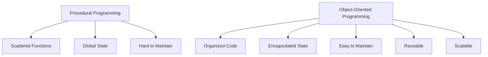
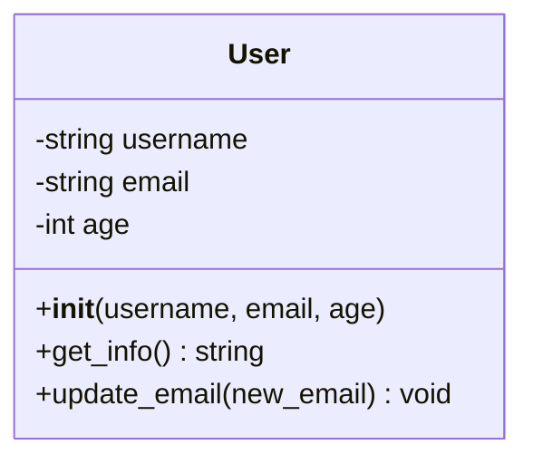
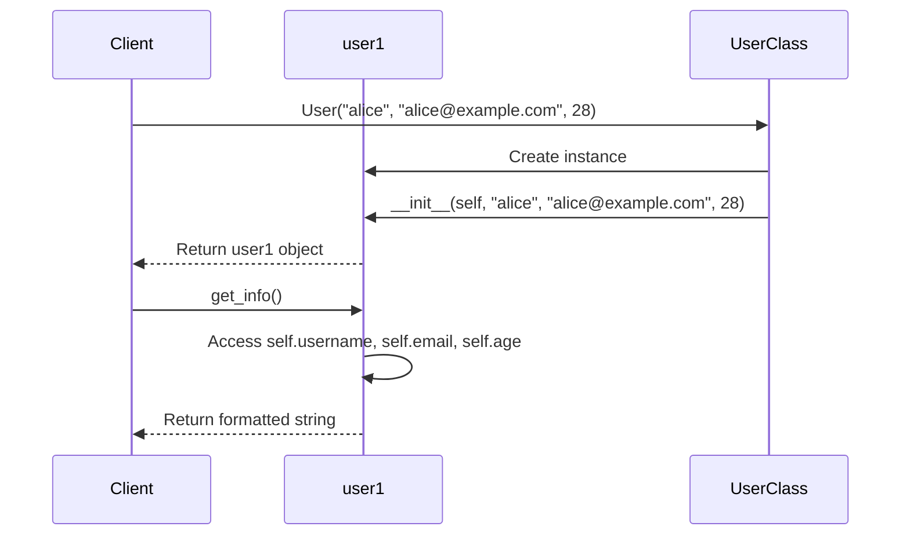
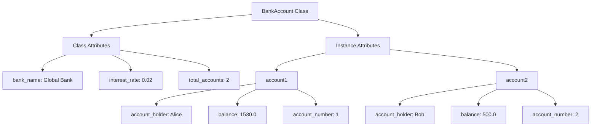
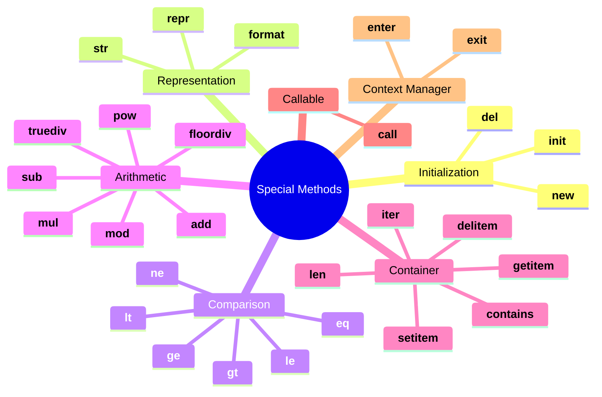
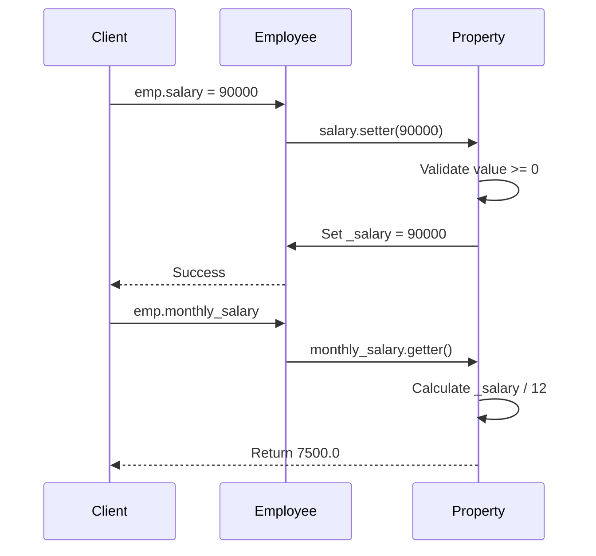
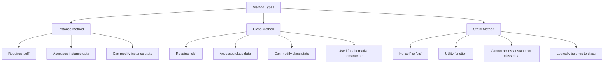

# Python OOP Fundamentals: From Zero to Mastery

## Learning Objectives
- Understand what Object-Oriented Programming is and why it matters
- Master the concepts of classes and objects
- Learn instance vs class vs static methods
- Understand attributes and properties
- Master the `__init__` constructor and other special methods
- Build production-ready classes following industry standards

## Table of Contents
1. [Introduction to OOP](#introduction-to-oop)
2. [Classes and Objects](#classes-and-objects)
3. [Attributes and Methods](#attributes-and-methods)
4. [Special Methods (Dunder Methods)](#special-methods)
5. [Properties and Encapsulation](#properties-and-encapsulation)
6. [Class vs Instance vs Static Methods](#method-types)
7. [Production Patterns](#production-patterns)
8. [Best Practices](#best-practices)

---

## Introduction to OOP

### What is Object-Oriented Programming?

Object-Oriented Programming (OOP) is a programming paradigm that organizes code around **objects** rather than functions and logic. Objects are instances of **classes** that encapsulate data (attributes) and behavior (methods).

### Why OOP?



**Key Benefits:**
- **Modularity**: Code is organized into self-contained units
- **Reusability**: Classes can be reused across projects
- **Maintainability**: Changes are localized to specific classes
- **Scalability**: Easy to extend functionality
- **Real-world modeling**: Maps naturally to real-world entities

---

## Classes and Objects

### The Class Blueprint

A **class** is a blueprint for creating objects. Think of it as a cookie cutter, and objects are the cookies.



### Basic Class Definition

```python
class User:
    """A class representing a user in the system.

    This follows Google's Python style guide for docstrings.
    """

    def __init__(self, username: str, email: str, age: int) -> None:
        """Initialize a new User instance.

        Args:
            username: The user's unique username
            email: The user's email address
            age: The user's age in years
        """
        self.username = username
        self.email = email
        self.age = age

    def get_info(self) -> str:
        """Return formatted user information.

        Returns:
            A formatted string containing user details
        """
        return f"User: {self.username}, Email: {self.email}, Age: {self.age}"

    def update_email(self, new_email: str) -> None:
        """Update the user's email address.

        Args:
            new_email: The new email address
        """
        self.email = new_email


# Creating objects (instances)
user1 = User("alice_smith", "alice@example.com", 28)
user2 = User("bob_jones", "bob@example.com", 35)

print(user1.get_info())  # User: alice_smith, Email: alice@example.com, Age: 28
print(user2.get_info())  # User: bob_jones, Email: bob@example.com, Age: 35
```

### Understanding `self`



**Key Points about `self`:**
- `self` represents the instance itself
- It's automatically passed as the first parameter
- It allows access to instance attributes and methods
- You can name it anything, but `self` is the convention

---

## Attributes and Methods

### Instance Attributes vs Class Attributes

```python
class BankAccount:
    """Represents a bank account with instance and class attributes."""

    # Class attribute (shared by all instances)
    bank_name: str = "Global Bank"
    interest_rate: float = 0.02
    total_accounts: int = 0

    def __init__(self, account_holder: str, balance: float = 0.0) -> None:
        """Initialize a new bank account.

        Args:
            account_holder: Name of the account holder
            balance: Initial balance (default: 0.0)
        """
        # Instance attributes (unique to each instance)
        self.account_holder = account_holder
        self.balance = balance
        self.account_number = BankAccount.total_accounts + 1

        # Update class attribute
        BankAccount.total_accounts += 1

    def deposit(self, amount: float) -> None:
        """Deposit money into the account.

        Args:
            amount: Amount to deposit

        Raises:
            ValueError: If amount is negative
        """
        if amount < 0:
            raise ValueError("Cannot deposit negative amount")
        self.balance += amount

    def withdraw(self, amount: float) -> bool:
        """Withdraw money from the account.

        Args:
            amount: Amount to withdraw

        Returns:
            True if withdrawal successful, False otherwise
        """
        if amount < 0:
            raise ValueError("Cannot withdraw negative amount")

        if amount > self.balance:
            return False

        self.balance -= amount
        return True

    def apply_interest(self) -> None:
        """Apply interest to the account balance."""
        self.balance += self.balance * BankAccount.interest_rate


# Usage
account1 = BankAccount("Alice", 1000.0)
account2 = BankAccount("Bob", 500.0)

print(f"Bank: {BankAccount.bank_name}")  # Bank: Global Bank
print(f"Total accounts: {BankAccount.total_accounts}")  # Total accounts: 2

account1.deposit(500)
print(f"Account 1 balance: ${account1.balance}")  # Account 1 balance: $1500.0

account1.apply_interest()
print(f"After interest: ${account1.balance}")  # After interest: $1530.0
```



---

## Special Methods (Dunder Methods)

Special methods (also called magic methods or dunder methods) allow you to define how objects behave with built-in Python operations.

### Common Special Methods

```python
from typing import Any


class Product:
    """Represents a product with special methods for rich functionality."""

    def __init__(self, name: str, price: float, quantity: int = 0) -> None:
        """Initialize a product.

        Args:
            name: Product name
            price: Product price
            quantity: Available quantity (default: 0)
        """
        self.name = name
        self.price = price
        self.quantity = quantity

    def __str__(self) -> str:
        """Return user-friendly string representation.

        Called by str() and print().
        """
        return f"{self.name} (${self.price})"

    def __repr__(self) -> str:
        """Return developer-friendly string representation.

        Called by repr() and in interactive mode.
        Should ideally be valid Python code to recreate the object.
        """
        return f"Product(name={self.name!r}, price={self.price}, quantity={self.quantity})"

    def __eq__(self, other: Any) -> bool:
        """Check equality based on name and price.

        Args:
            other: Another object to compare with

        Returns:
            True if objects are equal, False otherwise
        """
        if not isinstance(other, Product):
            return NotImplemented
        return self.name == other.name and self.price == other.price

    def __lt__(self, other: "Product") -> bool:
        """Compare products by price.

        Args:
            other: Another Product to compare with

        Returns:
            True if this product is cheaper
        """
        if not isinstance(other, Product):
            return NotImplemented
        return self.price < other.price

    def __add__(self, other: "Product") -> float:
        """Add prices of two products.

        Args:
            other: Another Product

        Returns:
            Sum of prices
        """
        if not isinstance(other, Product):
            return NotImplemented
        return self.price + other.price

    def __len__(self) -> int:
        """Return the quantity of products.

        Returns:
            Product quantity
        """
        return self.quantity

    def __bool__(self) -> bool:
        """Check if product is in stock.

        Returns:
            True if quantity > 0
        """
        return self.quantity > 0

    def __call__(self, discount: float = 0.0) -> float:
        """Make the object callable to calculate discounted price.

        Args:
            discount: Discount percentage (0-100)

        Returns:
            Discounted price
        """
        return self.price * (1 - discount / 100)


# Usage examples
laptop = Product("Laptop", 999.99, 5)
mouse = Product("Mouse", 29.99, 10)

# __str__ and __repr__
print(str(laptop))   # Laptop ($999.99)
print(repr(laptop))  # Product(name='Laptop', price=999.99, quantity=5)

# __eq__
laptop2 = Product("Laptop", 999.99, 3)
print(laptop == laptop2)  # True (same name and price)

# __lt__
print(mouse < laptop)  # True (mouse is cheaper)

# __add__
total = laptop + mouse
print(f"Total: ${total}")  # Total: $1029.98

# __len__
print(f"Laptops in stock: {len(laptop)}")  # Laptops in stock: 5

# __bool__
if laptop:
    print("Laptop is available")  # Laptop is available

empty_product = Product("Tablet", 499.99, 0)
if not empty_product:
    print("Tablet out of stock")  # Tablet out of stock

# __call__
discounted_price = laptop(10)  # 10% discount
print(f"Discounted: ${discounted_price:.2f}")  # Discounted: $899.99
```

### Complete Special Methods Reference



---

## Properties and Encapsulation

### Why Properties?

Properties allow you to add getter/setter logic while maintaining a simple attribute-like interface.

```python
from datetime import datetime
from typing import Optional


class Employee:
    """Represents an employee with encapsulated data."""

    def __init__(self, name: str, salary: float, hire_date: Optional[datetime] = None) -> None:
        """Initialize an employee.

        Args:
            name: Employee name
            salary: Annual salary
            hire_date: Date of hire (defaults to now)
        """
        self._name = name  # Protected attribute
        self._salary = salary
        self._hire_date = hire_date or datetime.now()

    @property
    def name(self) -> str:
        """Get employee name.

        Returns:
            Employee name
        """
        return self._name

    @name.setter
    def name(self, value: str) -> None:
        """Set employee name with validation.

        Args:
            value: New name

        Raises:
            ValueError: If name is empty or not a string
        """
        if not isinstance(value, str) or not value.strip():
            raise ValueError("Name must be a non-empty string")
        self._name = value.strip()

    @property
    def salary(self) -> float:
        """Get employee salary.

        Returns:
            Annual salary
        """
        return self._salary

    @salary.setter
    def salary(self, value: float) -> None:
        """Set employee salary with validation.

        Args:
            value: New salary

        Raises:
            ValueError: If salary is negative
        """
        if value < 0:
            raise ValueError("Salary cannot be negative")
        self._salary = value

    @property
    def monthly_salary(self) -> float:
        """Calculate monthly salary.

        Returns:
            Monthly salary (computed property)
        """
        return self._salary / 12

    @property
    def years_employed(self) -> int:
        """Calculate years of employment.

        Returns:
            Years since hire date
        """
        return (datetime.now() - self._hire_date).days // 365

    def give_raise(self, percentage: float) -> None:
        """Give employee a raise.

        Args:
            percentage: Raise percentage (e.g., 10 for 10%)
        """
        if percentage < 0:
            raise ValueError("Raise percentage cannot be negative")
        self._salary *= (1 + percentage / 100)


# Usage
emp = Employee("Alice Johnson", 80000)

# Property access (looks like attribute access)
print(emp.name)  # Alice Johnson
print(f"Salary: ${emp.salary:,.2f}")  # Salary: $80,000.00
print(f"Monthly: ${emp.monthly_salary:,.2f}")  # Monthly: $6,666.67

# Property setter with validation
try:
    emp.salary = -1000  # Raises ValueError
except ValueError as e:
    print(f"Error: {e}")  # Error: Salary cannot be negative

# Valid update
emp.give_raise(10)
print(f"New salary: ${emp.salary:,.2f}")  # New salary: $88,000.00
```



---

## Method Types: Instance, Class, and Static

### Understanding the Three Method Types

```python
from typing import Dict, List
from datetime import datetime


class Analytics:
    """Analytics tracking system demonstrating all method types."""

    # Class attribute
    total_events: int = 0
    events_by_type: Dict[str, int] = {}

    def __init__(self, user_id: str) -> None:
        """Initialize analytics for a user.

        Args:
            user_id: Unique user identifier
        """
        self.user_id = user_id
        self.user_events: List[Dict[str, any]] = []

    # Instance method (works with instance data)
    def track_event(self, event_type: str, metadata: Dict[str, any]) -> None:
        """Track an event for this user.

        Args:
            event_type: Type of event (e.g., 'click', 'view')
            metadata: Additional event data
        """
        event = {
            'user_id': self.user_id,
            'type': event_type,
            'metadata': metadata,
            'timestamp': datetime.now()
        }
        self.user_events.append(event)

        # Update class-level statistics
        Analytics.total_events += 1
        Analytics.events_by_type[event_type] = \
            Analytics.events_by_type.get(event_type, 0) + 1

    def get_user_event_count(self) -> int:
        """Get number of events for this user.

        Returns:
            Number of events tracked for this user
        """
        return len(self.user_events)

    # Class method (works with class data, alternative constructor)
    @classmethod
    def get_total_events(cls) -> int:
        """Get total events across all users.

        Returns:
            Total number of events tracked
        """
        return cls.total_events

    @classmethod
    def get_events_by_type(cls) -> Dict[str, int]:
        """Get event counts by type.

        Returns:
            Dictionary mapping event types to counts
        """
        return cls.events_by_type.copy()

    @classmethod
    def reset_analytics(cls) -> None:
        """Reset all analytics data."""
        cls.total_events = 0
        cls.events_by_type = {}

    # Static method (utility function, doesn't need class or instance data)
    @staticmethod
    def validate_event_type(event_type: str) -> bool:
        """Validate event type format.

        Args:
            event_type: Event type to validate

        Returns:
            True if valid, False otherwise
        """
        valid_types = {'click', 'view', 'purchase', 'signup', 'logout'}
        return event_type.lower() in valid_types

    @staticmethod
    def format_timestamp(dt: datetime) -> str:
        """Format datetime for display.

        Args:
            dt: Datetime to format

        Returns:
            Formatted string
        """
        return dt.strftime('%Y-%m-%d %H:%M:%S')


# Usage examples

# Instance methods
user1_analytics = Analytics("user_001")
user2_analytics = Analytics("user_002")

user1_analytics.track_event('click', {'button': 'subscribe'})
user1_analytics.track_event('view', {'page': 'home'})
user2_analytics.track_event('purchase', {'product_id': 'PRD123', 'price': 99.99})

print(f"User 1 events: {user1_analytics.get_user_event_count()}")  # User 1 events: 2

# Class methods
print(f"Total events: {Analytics.get_total_events()}")  # Total events: 3
print(f"Events by type: {Analytics.get_events_by_type()}")
# Events by type: {'click': 1, 'view': 1, 'purchase': 1}

# Static methods
print(Analytics.validate_event_type('click'))  # True
print(Analytics.validate_event_type('invalid'))  # False
print(Analytics.format_timestamp(datetime.now()))  # 2025-11-21 14:30:45
```



### When to Use Each Method Type

| Method Type | When to Use | Example Use Case |
|-------------|-------------|------------------|
| **Instance Method** | When you need to access or modify instance-specific data | `user.update_profile()`, `order.calculate_total()` |
| **Class Method** | When you need to access or modify class-level data, or create alternative constructors | `User.from_dict()`, `Analytics.get_total_count()` |
| **Static Method** | When you have a utility function that logically belongs to the class but doesn't need access to class or instance data | `Validator.is_valid_email()`, `Formatter.format_currency()` |

---

## Production Patterns

### Pattern 1: Immutable Objects

```python
from dataclasses import dataclass
from typing import Final


@dataclass(frozen=True)
class Point:
    """Immutable 2D point following value object pattern."""
    x: float
    y: float

    def distance_from_origin(self) -> float:
        """Calculate distance from origin.

        Returns:
            Distance from (0, 0)
        """
        return (self.x ** 2 + self.y ** 2) ** 0.5

    def translate(self, dx: float, dy: float) -> "Point":
        """Create new point translated by dx, dy.

        Args:
            dx: Change in x
            dy: Change in y

        Returns:
            New Point instance
        """
        return Point(self.x + dx, self.y + dy)


# Usage
p1 = Point(3.0, 4.0)
print(p1.distance_from_origin())  # 5.0

p2 = p1.translate(1.0, 1.0)
print(p2)  # Point(x=4.0, y=5.0)

# This will raise an error (frozen dataclass)
# p1.x = 10  # FrozenInstanceError
```

### Pattern 2: Builder Pattern for Complex Objects

```python
from typing import Optional, List, Dict, Any


class QueryBuilder:
    """SQL query builder using method chaining."""

    def __init__(self) -> None:
        """Initialize empty query builder."""
        self._table: Optional[str] = None
        self._columns: List[str] = ['*']
        self._where_clauses: List[str] = []
        self._order_by: Optional[str] = None
        self._limit: Optional[int] = None

    def select(self, *columns: str) -> "QueryBuilder":
        """Specify columns to select.

        Args:
            *columns: Column names

        Returns:
            Self for method chaining
        """
        self._columns = list(columns) if columns else ['*']
        return self

    def from_table(self, table: str) -> "QueryBuilder":
        """Specify table name.

        Args:
            table: Table name

        Returns:
            Self for method chaining
        """
        self._table = table
        return self

    def where(self, condition: str) -> "QueryBuilder":
        """Add WHERE condition.

        Args:
            condition: SQL condition

        Returns:
            Self for method chaining
        """
        self._where_clauses.append(condition)
        return self

    def order_by(self, column: str, direction: str = 'ASC') -> "QueryBuilder":
        """Add ORDER BY clause.

        Args:
            column: Column to order by
            direction: 'ASC' or 'DESC'

        Returns:
            Self for method chaining
        """
        self._order_by = f"{column} {direction}"
        return self

    def limit(self, count: int) -> "QueryBuilder":
        """Add LIMIT clause.

        Args:
            count: Number of rows to limit

        Returns:
            Self for method chaining
        """
        self._limit = count
        return self

    def build(self) -> str:
        """Build the final SQL query.

        Returns:
            SQL query string

        Raises:
            ValueError: If table is not specified
        """
        if not self._table:
            raise ValueError("Table name is required")

        query_parts = [
            f"SELECT {', '.join(self._columns)}",
            f"FROM {self._table}"
        ]

        if self._where_clauses:
            query_parts.append(f"WHERE {' AND '.join(self._where_clauses)}")

        if self._order_by:
            query_parts.append(f"ORDER BY {self._order_by}")

        if self._limit:
            query_parts.append(f"LIMIT {self._limit}")

        return ' '.join(query_parts)


# Usage with method chaining
query = (QueryBuilder()
         .select('id', 'name', 'email')
         .from_table('users')
         .where('age > 18')
         .where('active = true')
         .order_by('created_at', 'DESC')
         .limit(10)
         .build())

print(query)
# SELECT id, name, email FROM users WHERE age > 18 AND active = true ORDER BY created_at DESC LIMIT 10
```

### Pattern 3: Context Managers

```python
from typing import Optional, Any
import logging
from contextlib import contextmanager


class DatabaseConnection:
    """Database connection with context manager protocol."""

    def __init__(self, connection_string: str) -> None:
        """Initialize database connection.

        Args:
            connection_string: Database connection string
        """
        self.connection_string = connection_string
        self.connection: Optional[Any] = None
        self.is_connected = False

    def __enter__(self) -> "DatabaseConnection":
        """Enter context manager (connect to database).

        Returns:
            Self
        """
        self.connect()
        return self

    def __exit__(self, exc_type, exc_val, exc_tb) -> bool:
        """Exit context manager (cleanup).

        Args:
            exc_type: Exception type if raised
            exc_val: Exception value if raised
            exc_tb: Exception traceback if raised

        Returns:
            False to propagate exceptions
        """
        self.disconnect()
        if exc_type is not None:
            logging.error(f"Exception occurred: {exc_val}")
        return False

    def connect(self) -> None:
        """Establish database connection."""
        print(f"Connecting to database: {self.connection_string}")
        # Simulate connection
        self.connection = f"Connection<{self.connection_string}>"
        self.is_connected = True

    def disconnect(self) -> None:
        """Close database connection."""
        if self.is_connected:
            print("Disconnecting from database")
            self.connection = None
            self.is_connected = False

    def execute(self, query: str) -> None:
        """Execute a query.

        Args:
            query: SQL query to execute

        Raises:
            RuntimeError: If not connected
        """
        if not self.is_connected:
            raise RuntimeError("Not connected to database")
        print(f"Executing: {query}")


# Usage with context manager
with DatabaseConnection("postgresql://localhost/mydb") as db:
    db.execute("SELECT * FROM users")
    db.execute("INSERT INTO logs VALUES ('test')")
# Automatic cleanup happens here

# Connection is automatically closed even if exception occurs
try:
    with DatabaseConnection("postgresql://localhost/mydb") as db:
        db.execute("SELECT * FROM users")
        raise ValueError("Something went wrong!")
except ValueError:
    print("Exception handled, connection still closed properly")
```

---

## Best Practices

### 1. Follow Google Python Style Guide

```python
# Good: Clear naming, type hints, docstrings
class OrderProcessor:
    """Processes customer orders following Google style guide."""

    def __init__(self, order_id: str, customer_id: str) -> None:
        """Initialize order processor.

        Args:
            order_id: Unique order identifier
            customer_id: Customer's unique identifier
        """
        self.order_id = order_id
        self.customer_id = customer_id
        self._status = "pending"

    def process_order(self, payment_method: str) -> bool:
        """Process the order with given payment method.

        Args:
            payment_method: Payment method (e.g., 'credit_card', 'paypal')

        Returns:
            True if processing successful, False otherwise

        Raises:
            ValueError: If payment method is invalid
        """
        valid_methods = {'credit_card', 'paypal', 'bank_transfer'}
        if payment_method not in valid_methods:
            raise ValueError(f"Invalid payment method: {payment_method}")

        # Process logic here
        self._status = "processed"
        return True


# Bad: Poor naming, no type hints, no docstrings
class OP:
    def __init__(self, o, c):
        self.o = o
        self.c = c
        self.s = "pending"

    def proc(self, pm):
        # What does this do?
        if pm not in ['cc', 'pp', 'bt']:
            return False
        self.s = "processed"
        return True
```

### 2. Use Type Hints Consistently

```python
from typing import List, Dict, Optional, Union, Tuple


class DataProcessor:
    """Process data with comprehensive type hints."""

    def process_items(
        self,
        items: List[Dict[str, Union[str, int, float]]]
    ) -> Tuple[List[Dict[str, any]], int]:
        """Process list of item dictionaries.

        Args:
            items: List of item dictionaries

        Returns:
            Tuple of (processed items, count)
        """
        processed = [self._process_single(item) for item in items]
        return processed, len(processed)

    def _process_single(
        self,
        item: Dict[str, Union[str, int, float]]
    ) -> Dict[str, any]:
        """Process a single item.

        Args:
            item: Item dictionary

        Returns:
            Processed item
        """
        return {**item, 'processed': True}
```

### 3. Prefer Composition Over Inheritance (Where Appropriate)

```python
# Good: Composition
class Engine:
    """Represents a car engine."""

    def start(self) -> None:
        """Start the engine."""
        print("Engine started")


class Car:
    """Car using composition."""

    def __init__(self) -> None:
        """Initialize car with engine."""
        self.engine = Engine()  # Has-a relationship

    def start(self) -> None:
        """Start the car."""
        self.engine.start()
        print("Car ready to drive")


# When to use inheritance: "is-a" relationship
class Vehicle:
    """Base vehicle class."""
    pass


class Car(Vehicle):  # Car is-a Vehicle
    """Car is a type of vehicle."""
    pass
```

### 4. Single Responsibility Principle

```python
# Good: Each class has one responsibility
class EmailValidator:
    """Validates email addresses."""

    @staticmethod
    def is_valid(email: str) -> bool:
        """Check if email is valid.

        Args:
            email: Email address to validate

        Returns:
            True if valid
        """
        return '@' in email and '.' in email.split('@')[1]


class EmailSender:
    """Sends emails."""

    def send(self, to: str, subject: str, body: str) -> None:
        """Send an email.

        Args:
            to: Recipient email
            subject: Email subject
            body: Email body
        """
        if not EmailValidator.is_valid(to):
            raise ValueError(f"Invalid email: {to}")
        print(f"Sending email to {to}: {subject}")


class UserRegistration:
    """Handles user registration."""

    def __init__(self) -> None:
        """Initialize with email sender."""
        self.email_sender = EmailSender()

    def register_user(self, email: str, name: str) -> None:
        """Register a new user.

        Args:
            email: User's email
            name: User's name
        """
        # Register user in database
        print(f"Registering user: {name}")

        # Send welcome email
        self.email_sender.send(
            email,
            "Welcome!",
            f"Hello {name}, welcome to our platform!"
        )


# Bad: God class with multiple responsibilities
class UserManager:
    """Anti-pattern: Does too many things."""

    def validate_email(self, email: str) -> bool:
        pass

    def send_email(self, to: str, subject: str, body: str) -> None:
        pass

    def register_user(self, email: str, name: str) -> None:
        pass

    def authenticate_user(self, email: str, password: str) -> bool:
        pass

    def update_user_profile(self, user_id: str, data: dict) -> None:
        pass
```

---

## Interview Questions

### Junior Level
1. What is the difference between a class and an object?
2. What is `self` in Python?
3. What is the purpose of `__init__` method?
4. What is the difference between instance and class attributes?

### Mid Level
5. Explain the difference between `__str__` and `__repr__`
6. What are properties and why would you use them?
7. What is the difference between `@classmethod` and `@staticmethod`?
8. How do you make an attribute private in Python?

### Senior Level
9. Explain the context manager protocol
10. How would you implement an immutable class in Python?
11. When would you use `__new__` instead of `__init__`?
12. How do you prevent a class from being instantiated?

---

## Practice Exercises

### Exercise 1: Build a Shopping Cart
Create a `ShoppingCart` class that:
- Stores items with quantities
- Calculates total price
- Applies discount codes
- Has a context manager for transaction handling

### Exercise 2: Create a Logger Class
Build a `Logger` class that:
- Uses class methods to get singleton instance
- Has different log levels (DEBUG, INFO, ERROR)
- Formats log messages with timestamps
- Can write to file or console

### Exercise 3: Design a Cache System
Implement a `Cache` class with:
- TTL (time to live) for entries
- Maximum size limit
- LRU eviction policy
- Thread-safe operations

---

## Summary

In this foundational guide, you learned:

- **Classes and Objects**: The blueprint and instance relationship
- **Attributes and Methods**: Instance vs class vs static
- **Special Methods**: Making classes work with Python operators
- **Properties**: Encapsulation with getter/setter logic
- **Method Types**: When to use instance, class, or static methods
- **Production Patterns**: Real-world patterns used at FAANG companies
- **Best Practices**: Google/Meta coding standards

### Next Steps
- Continue to **02-python-oop-core-principles.md** for inheritance, polymorphism, and encapsulation
- Practice the exercises above
- Review production code examples from open-source projects

### Further Reading
- [Google Python Style Guide](https://google.github.io/styleguide/pyguide.html)
- [PEP 8 - Style Guide for Python Code](https://peps.python.org/pep-0008/)
- [Python Data Model](https://docs.python.org/3/reference/datamodel.html)
