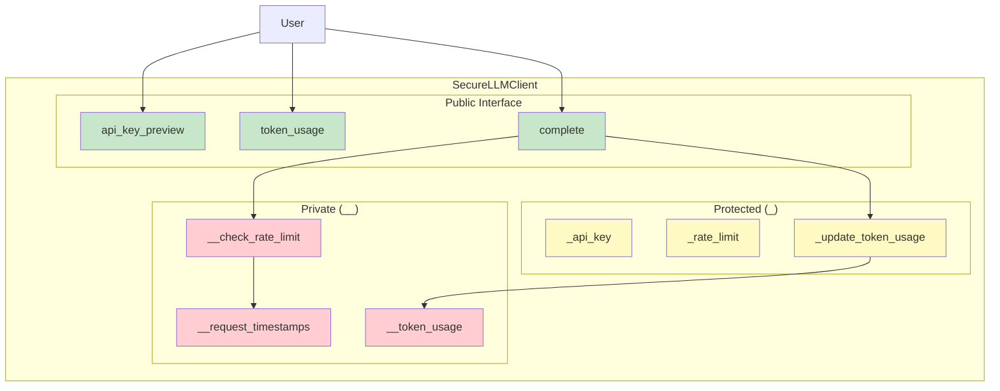
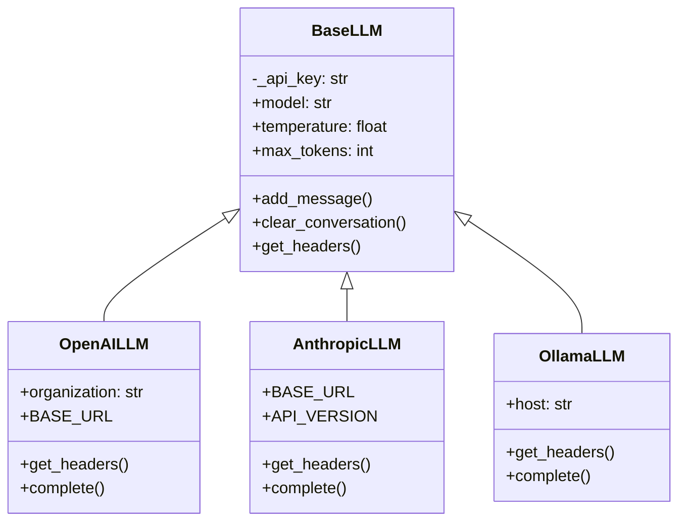
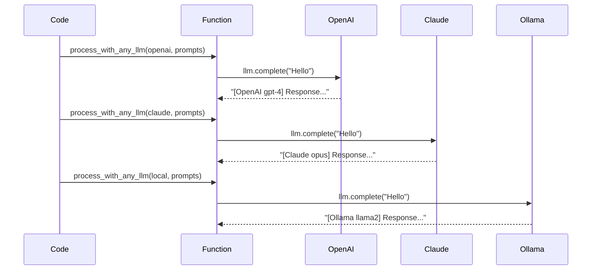
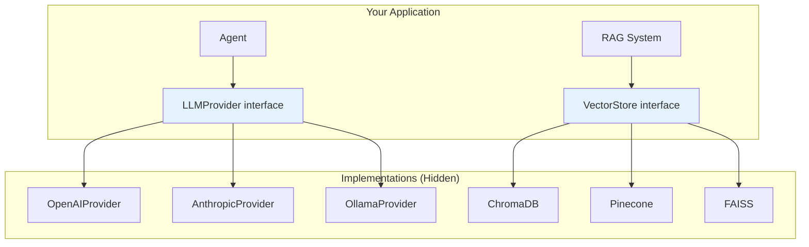
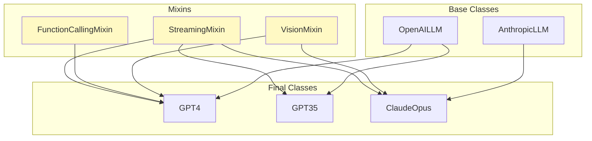
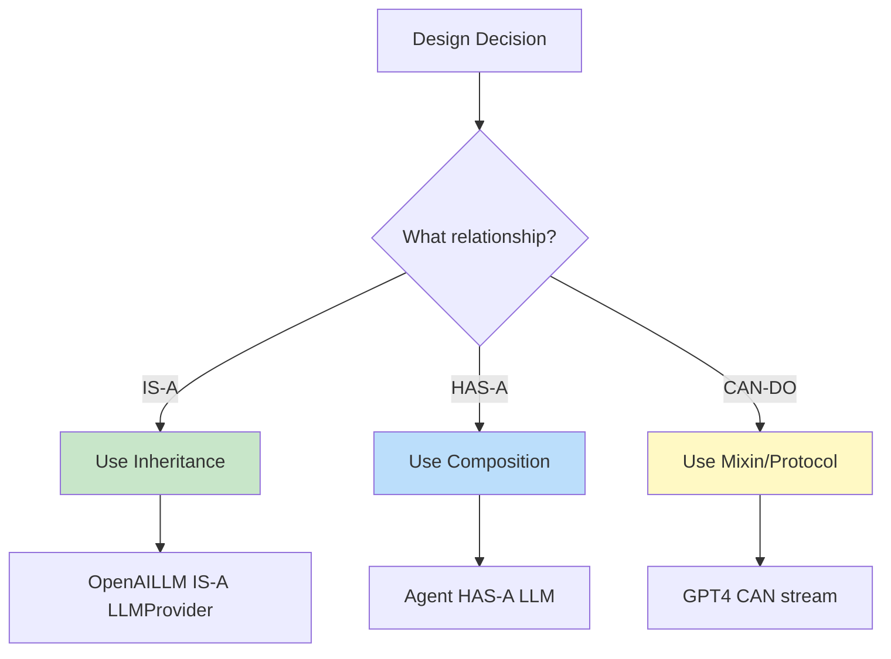

# Python OOP Core Principles: Building a Multi-Provider LLM System

## Learning Objectives
- Master the four pillars of OOP through building a multi-provider AI system
- Understand encapsulation, inheritance, polymorphism, and abstraction
- Implement Abstract Base Classes for LLM provider interfaces
- Learn Method Resolution Order (MRO) and the diamond problem
- Build mixins for streaming, function calling, and vision capabilities
- Choose between composition and inheritance

## Table of Contents
1. [The Four Pillars Overview](#four-pillars)
2. [Encapsulation: Protecting LLM Credentials](#encapsulation)
3. [Inheritance: LLM Provider Hierarchy](#inheritance)
4. [Polymorphism: Unified Provider Interface](#polymorphism)
5. [Abstraction: Defining Contracts](#abstraction)
6. [Multiple Inheritance & Mixins](#multiple-inheritance)
7. [Composition vs Inheritance](#composition-vs-inheritance)
8. [Complete Multi-Provider System](#complete-example)

---

## The Four Pillars Overview

```mermaid
mindmap
  root((OOP Pillars<br>for AI Systems))
    Encapsulation
      Hide API keys
      Rate limit internally
      Manage token budgets
    Inheritance
      BaseLLM
      OpenAILLM
      AnthropicLLM
      LocalLLM
    Polymorphism
      provider.complete()
      works for ALL providers
      swap providers easily
    Abstraction
      LLMProvider interface
      VectorStore interface
      hide implementation details
```

### Understanding the Four Pillars

The "four pillars of OOP" is a foundational concept that appears in virtually every software engineering interview. These aren't just academic concepts—they're practical patterns that solve real problems in building maintainable AI systems.

**Why These Four?**

Each pillar addresses a specific challenge in software development:

| Pillar | Problem Solved | AI System Example |
|--------|----------------|-------------------|
| **Encapsulation** | "How do I protect sensitive data and hide complexity?" | Keep API keys secure, hide rate limiting logic |
| **Inheritance** | "How do I reuse code without copying it?" | OpenAI and Anthropic clients share base functionality |
| **Polymorphism** | "How do I write flexible code that works with different types?" | One function works with any LLM provider |
| **Abstraction** | "How do I define contracts without implementation details?" | `LLMProvider` interface that any provider can implement |

**How They Work Together:**

In a real AI application, these pillars combine:

1. **Abstraction** defines the `LLMProvider` interface
2. **Inheritance** creates `OpenAIProvider` and `AnthropicProvider` from a base
3. **Polymorphism** lets your agent use any provider interchangeably
4. **Encapsulation** protects API keys and manages rate limits internally

> **Interview Insight:** When asked about OOP pillars, don't just define them—explain how they work together. FAANG interviewers want to see systems thinking.

---

## Encapsulation: Protecting LLM Credentials

### What is Encapsulation?

Encapsulation is the bundling of data and the methods that operate on that data within a single unit (class), while restricting direct access to some of the object's components. It's about **hiding internal details** and **protecting data integrity**.

**The Two Aspects of Encapsulation:**

1. **Data Hiding**: Making internal state inaccessible from outside
2. **Bundling**: Keeping related data and behavior together

**Why Encapsulation Matters for AI Applications:**

- **Security**: API keys must never be exposed
- **Integrity**: Rate limit counters shouldn't be bypassed
- **Simplicity**: Users don't need to understand internal complexity
- **Maintenance**: Internal implementation can change without breaking external code

### The Problem Without Encapsulation

```python
# BAD: Exposed credentials and internal state
class UnsafeLLMClient:
    def __init__(self, api_key: str):
        self.api_key = api_key  # Exposed!
        self.rate_limit_remaining = 100  # Exposed!
        self.token_budget = 10000  # Can be modified directly!

client = UnsafeLLMClient("sk-secret-key-12345")
print(client.api_key)  # Anyone can see the key!
client.rate_limit_remaining = 999999  # Bypass rate limiting!
```

### Proper Encapsulation for AI Systems

```python
from typing import Optional, Dict, Any
from datetime import datetime, timedelta
import threading


class SecureLLMClient:
    """LLM Client with properly encapsulated sensitive data.
    
    Demonstrates:
    - Protected attributes (_single_underscore)
    - Private attributes (__double_underscore)
    - Property-based access control
    - Internal rate limiting
    """
    
    # Class-level configuration
    _DEFAULT_RATE_LIMIT = 60  # requests per minute
    
    def __init__(
        self,
        api_key: str,
        org_id: Optional[str] = None,
        rate_limit: int = 60
    ) -> None:
        """Initialize secure client.
        
        Args:
            api_key: API key (will be protected)
            org_id: Optional organization ID
            rate_limit: Requests per minute limit
        """
        # Protected: use within class and subclasses
        self._api_key = api_key
        self._org_id = org_id
        self._rate_limit = rate_limit
        
        # Private: only this class should access (name mangled)
        self.__request_timestamps: list = []
        self.__token_usage: Dict[str, int] = {
            "prompt_tokens": 0,
            "completion_tokens": 0,
            "total_tokens": 0
        }
        self.__lock = threading.Lock()
    
    # ========== Controlled Access via Properties ==========
    
    @property
    def api_key_preview(self) -> str:
        """Get masked API key for logging/display.
        
        Note: Full key is never exposed outside the class.
        """
        if len(self._api_key) < 10:
            return "***"
        return f"{self._api_key[:7]}...{self._api_key[-4:]}"
    
    @property
    def token_usage(self) -> Dict[str, int]:
        """Get token usage (read-only copy)."""
        return self.__token_usage.copy()
    
    @property
    def rate_limit_remaining(self) -> int:
        """Get remaining requests in current window."""
        self.__cleanup_old_requests()
        return max(0, self._rate_limit - len(self.__request_timestamps))
    
    @property
    def is_rate_limited(self) -> bool:
        """Check if currently rate limited."""
        return self.rate_limit_remaining <= 0
    
    # ========== Internal Rate Limiting ==========
    
    def __cleanup_old_requests(self) -> None:
        """Remove request timestamps older than 1 minute."""
        cutoff = datetime.now() - timedelta(minutes=1)
        with self.__lock:
            self.__request_timestamps = [
                ts for ts in self.__request_timestamps
                if ts > cutoff
            ]
    
    def __record_request(self) -> None:
        """Record a request for rate limiting."""
        with self.__lock:
            self.__request_timestamps.append(datetime.now())
    
    def __check_rate_limit(self) -> None:
        """Check rate limit before request.
        
        Raises:
            RateLimitError: If rate limit exceeded
        """
        if self.is_rate_limited:
            raise RateLimitError(
                f"Rate limit exceeded. "
                f"Wait {self.__seconds_until_reset()} seconds."
            )
    
    def __seconds_until_reset(self) -> int:
        """Get seconds until rate limit resets."""
        if not self.__request_timestamps:
            return 0
        oldest = min(self.__request_timestamps)
        reset_time = oldest + timedelta(minutes=1)
        remaining = (reset_time - datetime.now()).total_seconds()
        return max(0, int(remaining))
    
    # ========== Internal Token Tracking ==========
    
    def _update_token_usage(
        self,
        prompt_tokens: int,
        completion_tokens: int
    ) -> None:
        """Update token usage (for internal/subclass use).
        
        Args:
            prompt_tokens: Input tokens used
            completion_tokens: Output tokens used
        """
        with self.__lock:
            self.__token_usage["prompt_tokens"] += prompt_tokens
            self.__token_usage["completion_tokens"] += completion_tokens
            self.__token_usage["total_tokens"] += (
                prompt_tokens + completion_tokens
            )
    
    # ========== Public API ==========
    
    def complete(self, prompt: str) -> str:
        """Send completion request.
        
        Args:
            prompt: User prompt
            
        Returns:
            Model response
            
        Raises:
            RateLimitError: If rate limited
        """
        # Internal checks (encapsulated)
        self.__check_rate_limit()
        self.__record_request()
        
        # Simulate API call
        response = f"Response to: {prompt[:30]}..."
        
        # Update internal tracking
        self._update_token_usage(
            prompt_tokens=len(prompt) // 4,
            completion_tokens=len(response) // 4
        )
        
        return response


class RateLimitError(Exception):
    """Rate limit exceeded."""
    pass


# Usage
client = SecureLLMClient("sk-very-secret-key-12345")

# Safe access
print(client.api_key_preview)  # sk-very...2345

# Cannot access private attributes directly
# print(client.__request_timestamps)  # AttributeError

# Rate limiting is automatic
for i in range(5):
    response = client.complete(f"Message {i}")
    print(f"Remaining: {client.rate_limit_remaining}")
```



---

## Inheritance: LLM Provider Hierarchy

### What is Inheritance?

Inheritance is a mechanism where a new class (child/subclass) derives properties and behaviors from an existing class (parent/superclass). The child class "inherits" everything from the parent and can add or modify functionality.

**The Core Idea:**

Instead of copying code, you create a hierarchy where common functionality lives in a base class, and specialized behavior lives in subclasses.

**Why Inheritance Matters for AI Applications:**

- **Code Reuse**: All LLM providers need conversation management, so write it once in `BaseLLM`
- **Consistency**: All providers follow the same patterns
- **Extensibility**: Adding a new provider means implementing only what's different
- **Maintainability**: Fix a bug in the base class, and all children benefit

**The IS-A Relationship:**

Inheritance models an "IS-A" relationship:
- `OpenAILLM` IS-A `BaseLLM`
- `AnthropicLLM` IS-A `BaseLLM`

If you can't say "X IS-A Y," inheritance might not be the right choice.

### `super()`: Calling Parent Methods

When you override a method, you often want to extend (not replace) the parent's behavior. The `super()` function gives you access to the parent class's methods:

```python
def get_headers(self):
    headers = super().get_headers()  # Get parent's headers
    headers["Authorization"] = f"Bearer {self._api_key}"  # Add our own
    return headers
```

**Why not just copy the parent's code?** Because if the parent changes, your code won't get the update. Always use `super()` to maintain the inheritance chain.

### Single Inheritance

```python
from abc import ABC, abstractmethod
from typing import List, Optional, AsyncIterator
from dataclasses import dataclass


@dataclass
class ChatMessage:
    """Message in a conversation."""
    role: str
    content: str


class BaseLLM:
    """Base class for all LLM providers.
    
    Provides common functionality that all providers share.
    """
    
    def __init__(
        self,
        api_key: str,
        model: str,
        temperature: float = 0.7,
        max_tokens: int = 4096
    ) -> None:
        """Initialize base LLM.
        
        Args:
            api_key: Provider API key
            model: Model identifier
            temperature: Sampling temperature
            max_tokens: Maximum response tokens
        """
        self._api_key = api_key
        self.model = model
        self.temperature = temperature
        self.max_tokens = max_tokens
        self._conversation: List[ChatMessage] = []
    
    def add_message(self, role: str, content: str) -> None:
        """Add message to conversation."""
        self._conversation.append(ChatMessage(role, content))
    
    def clear_conversation(self) -> None:
        """Clear conversation history."""
        self._conversation = []
    
    def get_headers(self) -> dict:
        """Get base headers for API requests."""
        return {
            "Content-Type": "application/json"
        }


class OpenAILLM(BaseLLM):
    """OpenAI-specific LLM implementation.
    
    Inherits from BaseLLM and adds OpenAI-specific functionality.
    """
    
    BASE_URL = "https://api.openai.com/v1"
    
    def __init__(
        self,
        api_key: str,
        model: str = "gpt-4",
        organization: Optional[str] = None,
        **kwargs
    ) -> None:
        """Initialize OpenAI LLM.
        
        Args:
            api_key: OpenAI API key
            model: Model name (gpt-4, gpt-3.5-turbo, etc.)
            organization: Optional organization ID
            **kwargs: Additional BaseLLM arguments
        """
        super().__init__(api_key, model, **kwargs)
        self.organization = organization
    
    def get_headers(self) -> dict:
        """Get OpenAI-specific headers."""
        headers = super().get_headers()  # Get base headers
        headers["Authorization"] = f"Bearer {self._api_key}"
        if self.organization:
            headers["OpenAI-Organization"] = self.organization
        return headers
    
    def complete(self, prompt: str) -> str:
        """Send completion request to OpenAI.
        
        Args:
            prompt: User prompt
            
        Returns:
            Model response
        """
        self.add_message("user", prompt)
        
        # Simulate OpenAI API call
        response = f"[OpenAI {self.model}] Response to: {prompt[:30]}..."
        
        self.add_message("assistant", response)
        return response


class AnthropicLLM(BaseLLM):
    """Anthropic Claude implementation."""
    
    BASE_URL = "https://api.anthropic.com/v1"
    API_VERSION = "2024-01-01"
    
    def __init__(
        self,
        api_key: str,
        model: str = "claude-3-opus-20240229",
        **kwargs
    ) -> None:
        """Initialize Anthropic LLM."""
        super().__init__(api_key, model, **kwargs)
    
    def get_headers(self) -> dict:
        """Get Anthropic-specific headers."""
        headers = super().get_headers()
        headers["x-api-key"] = self._api_key
        headers["anthropic-version"] = self.API_VERSION
        return headers
    
    def complete(self, prompt: str) -> str:
        """Send completion request to Anthropic."""
        self.add_message("user", prompt)
        
        response = f"[Claude {self.model}] Response to: {prompt[:30]}..."
        
        self.add_message("assistant", response)
        return response


class OllamaLLM(BaseLLM):
    """Local Ollama implementation."""
    
    def __init__(
        self,
        model: str = "llama2",
        host: str = "http://localhost:11434",
        **kwargs
    ) -> None:
        """Initialize Ollama LLM (no API key needed)."""
        super().__init__(api_key="", model=model, **kwargs)
        self.host = host
    
    def get_headers(self) -> dict:
        """Get Ollama headers (no auth needed)."""
        return super().get_headers()
    
    def complete(self, prompt: str) -> str:
        """Send completion request to local Ollama."""
        self.add_message("user", prompt)
        
        response = f"[Ollama {self.model}] Response to: {prompt[:30]}..."
        
        self.add_message("assistant", response)
        return response


# Usage
openai = OpenAILLM("sk-openai-key", model="gpt-4")
claude = AnthropicLLM("sk-anthropic-key", model="claude-3-opus")
local = OllamaLLM(model="llama2")

print(openai.complete("What is Python?"))
print(claude.complete("What is Python?"))
print(local.complete("What is Python?"))
```



---

## Polymorphism: Unified Provider Interface

### What is Polymorphism?

Polymorphism (Greek for "many forms") allows objects of different classes to be treated as objects of a common type. The same method call produces different behavior depending on the actual object type.

**The Power of Polymorphism:**

Write code once, use it with many types. Your `process_prompts()` function doesn't need to know if it's talking to OpenAI, Anthropic, or a local model—it just works.

**Types of Polymorphism in Python:**

| Type | How It Works | Example |
|------|-------------|---------|
| **Method Overriding** | Subclass redefines parent method | Each provider implements `complete()` differently |
| **Duck Typing** | "If it quacks like a duck..." | Any object with `complete()` works |
| **Operator Overloading** | Redefine `+`, `==`, etc. | `message1 + message2` concatenates content |
| **Protocols** | Structural typing (Python 3.8+) | `Completable` protocol matches any class with `complete()` |

**Why Polymorphism Changes Everything:**

Without polymorphism:
```python
if isinstance(llm, OpenAI):
    response = call_openai(llm, prompt)
elif isinstance(llm, Anthropic):
    response = call_anthropic(llm, prompt)
# Adding a new provider = modifying every function!
```

With polymorphism:
```python
response = llm.complete(prompt)  # Works with ANY provider
# Adding a new provider = zero changes to existing code
```

> **Interview Tip:** The Open/Closed Principle (from SOLID) relies on polymorphism. Code should be "open for extension, closed for modification." Polymorphism makes this possible.

### Method Overriding Polymorphism

```python
from typing import List, Protocol


def process_with_any_llm(llm: BaseLLM, prompts: List[str]) -> List[str]:
    """Process prompts with ANY LLM provider.
    
    This function works with OpenAI, Anthropic, Ollama, or any
    other class that inherits from BaseLLM.
    
    This is polymorphism in action!
    """
    responses = []
    for prompt in prompts:
        response = llm.complete(prompt)  # Same method, different behavior
        responses.append(response)
    return responses


# Same function works with all providers
prompts = ["Hello!", "What is AI?"]

# OpenAI
openai_responses = process_with_any_llm(
    OpenAILLM("sk-key"),
    prompts
)

# Anthropic  
claude_responses = process_with_any_llm(
    AnthropicLLM("sk-key"),
    prompts
)

# Local
local_responses = process_with_any_llm(
    OllamaLLM("llama2"),
    prompts
)
```

### Duck Typing Polymorphism

```python
class CustomLLM:
    """Custom LLM that doesn't inherit from BaseLLM.
    
    Still works with polymorphic functions if it has
    the required methods (duck typing).
    """
    
    def __init__(self, endpoint: str):
        self.endpoint = endpoint
    
    def complete(self, prompt: str) -> str:
        """Custom completion logic."""
        return f"[Custom] {prompt}"


# Works because it has complete() method
custom = CustomLLM("https://my-api.com")
custom_responses = process_with_any_llm(custom, prompts)  # Works!
```

### Protocol-Based Polymorphism (Structural Subtyping)

```python
from typing import Protocol, runtime_checkable


@runtime_checkable
class Completable(Protocol):
    """Protocol defining what it means to be completable.
    
    Any class with a complete() method matches this protocol,
    regardless of inheritance.
    """
    
    def complete(self, prompt: str) -> str:
        """Complete a prompt."""
        ...


def process_completable(llm: Completable, prompt: str) -> str:
    """Process with any Completable object."""
    return llm.complete(prompt)


# Type checking works with Protocol
def is_completable(obj: object) -> bool:
    """Check if object is completable at runtime."""
    return isinstance(obj, Completable)


# All these satisfy the Completable protocol
print(is_completable(OpenAILLM("key")))  # True
print(is_completable(AnthropicLLM("key")))  # True
print(is_completable(CustomLLM("url")))  # True
print(is_completable("string"))  # False
```



---

## Abstraction: Defining Contracts

### Abstract Base Classes

```python
from abc import ABC, abstractmethod
from typing import List, Dict, Any, Optional, AsyncIterator


class LLMProvider(ABC):
    """Abstract base class defining the LLM provider contract.
    
    All LLM providers MUST implement these methods.
    This is abstraction - hiding implementation details
    while enforcing a consistent interface.
    """
    
    @property
    @abstractmethod
    def model_name(self) -> str:
        """Get the model name."""
        ...
    
    @abstractmethod
    def complete(
        self,
        messages: List[ChatMessage],
        **kwargs
    ) -> str:
        """Generate a completion.
        
        Args:
            messages: Conversation history
            **kwargs: Provider-specific options
            
        Returns:
            Generated response
        """
        ...
    
    @abstractmethod
    async def complete_async(
        self,
        messages: List[ChatMessage],
        **kwargs
    ) -> str:
        """Async version of complete."""
        ...
    
    @abstractmethod
    def count_tokens(self, text: str) -> int:
        """Count tokens in text."""
        ...
    
    # Non-abstract method with default implementation
    def estimate_cost(
        self,
        input_tokens: int,
        output_tokens: int
    ) -> float:
        """Estimate cost (can be overridden)."""
        return 0.0  # Default: unknown cost


class VectorStore(ABC):
    """Abstract base class for vector stores.
    
    Used for semantic search in RAG systems.
    """
    
    @abstractmethod
    def add_documents(
        self,
        documents: List[str],
        embeddings: List[List[float]],
        metadata: Optional[List[Dict[str, Any]]] = None
    ) -> List[str]:
        """Add documents to the store.
        
        Returns:
            List of document IDs
        """
        ...
    
    @abstractmethod
    def search(
        self,
        query_embedding: List[float],
        k: int = 5
    ) -> List[Dict[str, Any]]:
        """Search for similar documents.
        
        Returns:
            List of {document, score, metadata}
        """
        ...
    
    @abstractmethod
    def delete(self, ids: List[str]) -> None:
        """Delete documents by ID."""
        ...


# Concrete implementation
class OpenAIProvider(LLMProvider):
    """Concrete OpenAI implementation."""
    
    def __init__(self, api_key: str, model: str = "gpt-4"):
        self._api_key = api_key
        self._model = model
    
    @property
    def model_name(self) -> str:
        return self._model
    
    def complete(
        self,
        messages: List[ChatMessage],
        **kwargs
    ) -> str:
        # Real implementation would call OpenAI API
        return f"[OpenAI] Response"
    
    async def complete_async(
        self,
        messages: List[ChatMessage],
        **kwargs
    ) -> str:
        return self.complete(messages, **kwargs)
    
    def count_tokens(self, text: str) -> int:
        return len(text) // 4
    
    def estimate_cost(
        self,
        input_tokens: int,
        output_tokens: int
    ) -> float:
        # GPT-4 pricing
        return (input_tokens * 0.03 + output_tokens * 0.06) / 1000


# Cannot instantiate abstract class
# provider = LLMProvider()  # TypeError!

# Must implement all abstract methods
provider = OpenAIProvider("sk-key")
print(provider.model_name)  # gpt-4
```

### Why Abstraction Matters



**Benefits:**
1. **Swap implementations** without changing application code
2. **Test with mocks** that implement the same interface
3. **Enforce contracts** - new providers must implement all methods

---

## Multiple Inheritance & Mixins

### The Diamond Problem

```python
class A:
    def method(self):
        return "A"

class B(A):
    def method(self):
        return "B"

class C(A):
    def method(self):
        return "C"

class D(B, C):
    pass

# Which method() is called?
d = D()
print(d.method())  # "B" - follows MRO

# Check Method Resolution Order
print(D.__mro__)
# (<class 'D'>, <class 'B'>, <class 'C'>, <class 'A'>, <class 'object'>)
```

### Mixins for LLM Capabilities

```python
from typing import AsyncIterator


class StreamingMixin:
    """Mixin that adds streaming capability to LLM providers."""
    
    async def stream(
        self,
        prompt: str
    ) -> AsyncIterator[str]:
        """Stream response tokens.
        
        Yields:
            Response chunks
        """
        # Simulate streaming
        response = self.complete(prompt)  # type: ignore
        for word in response.split():
            yield word + " "
    
    async def stream_to_string(self, prompt: str) -> str:
        """Stream and collect full response."""
        chunks = []
        async for chunk in self.stream(prompt):
            chunks.append(chunk)
        return "".join(chunks)


class FunctionCallingMixin:
    """Mixin that adds function/tool calling capability."""
    
    def __init__(self, *args, **kwargs):
        super().__init__(*args, **kwargs)
        self._available_tools: Dict[str, callable] = {}
    
    def register_tool(
        self,
        name: str,
        func: callable,
        description: str
    ) -> None:
        """Register a tool for function calling."""
        self._available_tools[name] = {
            "function": func,
            "description": description
        }
    
    def complete_with_tools(
        self,
        prompt: str
    ) -> Dict[str, Any]:
        """Complete with potential tool calls.
        
        Returns:
            {response, tool_calls}
        """
        # Simplified - real impl would parse LLM output
        return {
            "response": self.complete(prompt),  # type: ignore
            "tool_calls": [],
            "available_tools": list(self._available_tools.keys())
        }


class VisionMixin:
    """Mixin that adds vision/image capability."""
    
    def complete_with_image(
        self,
        prompt: str,
        image_url: str
    ) -> str:
        """Complete with image input.
        
        Args:
            prompt: Text prompt
            image_url: URL or base64 of image
            
        Returns:
            Model response
        """
        # Would send image to API
        return f"[Vision] Analyzed image: {image_url[:30]}..."


# Combine mixins with base class
class GPT4(StreamingMixin, FunctionCallingMixin, VisionMixin, OpenAILLM):
    """Full-featured GPT-4 with all capabilities."""
    
    def __init__(self, api_key: str):
        super().__init__(api_key, model="gpt-4-turbo")


class GPT35(StreamingMixin, OpenAILLM):
    """GPT-3.5 with streaming only."""
    
    def __init__(self, api_key: str):
        super().__init__(api_key, model="gpt-3.5-turbo")


class ClaudeOpus(StreamingMixin, VisionMixin, AnthropicLLM):
    """Claude with streaming and vision."""
    
    def __init__(self, api_key: str):
        super().__init__(api_key, model="claude-3-opus")


# Usage
gpt4 = GPT4("sk-key")

# Has all capabilities
print(gpt4.complete("Hello"))  # Base method
# await gpt4.stream("Hello")   # From StreamingMixin

gpt4.register_tool(
    "search",
    lambda q: f"Results for {q}",
    "Search the web"
)  # From FunctionCallingMixin

print(gpt4.complete_with_image(
    "What's in this image?",
    "https://example.com/image.jpg"
))  # From VisionMixin
```



### MRO in Practice

```python
# Check MRO for GPT4
print("GPT4 MRO:")
for i, cls in enumerate(GPT4.__mro__):
    print(f"  {i}. {cls.__name__}")

# Output:
# 0. GPT4
# 1. StreamingMixin
# 2. FunctionCallingMixin
# 3. VisionMixin
# 4. OpenAILLM
# 5. BaseLLM
# 6. object
```

---

## Composition vs Inheritance

### When to Use Inheritance

```python
# ✅ Good: IS-A relationship
# OpenAILLM IS-A LLMProvider
class OpenAILLM(LLMProvider):
    pass

# ✅ Good: Mixins add capabilities
class GPT4(StreamingMixin, OpenAILLM):
    pass
```

### When to Use Composition

```python
# ✅ Good: Agent HAS-A LLM, Memory, Tools
# Agent is NOT a type of LLM

class Agent:
    """Agent using composition instead of inheritance.
    
    An Agent HAS:
    - An LLM provider (for generating responses)
    - A memory (for conversation history)
    - Tools (for taking actions)
    """
    
    def __init__(
        self,
        llm: LLMProvider,
        memory: "Memory",
        tools: List["Tool"]
    ) -> None:
        """Initialize agent with components.
        
        Args:
            llm: Any LLM provider (OpenAI, Anthropic, etc.)
            memory: Any memory implementation
            tools: List of available tools
        """
        self.llm = llm      # HAS-A LLM
        self.memory = memory  # HAS-A Memory
        self.tools = tools   # HAS Tools
    
    def run(self, prompt: str) -> str:
        """Run agent on prompt."""
        # Get context from memory
        context = self.memory.get_context()
        
        # Generate response with LLM
        messages = context + [ChatMessage("user", prompt)]
        response = self.llm.complete(messages)
        
        # Save to memory
        self.memory.add(prompt, response)
        
        return response


# Can swap any component!
agent1 = Agent(
    llm=OpenAIProvider("key"),
    memory=BufferMemory(),
    tools=[SearchTool(), CalculatorTool()]
)

agent2 = Agent(
    llm=AnthropicProvider("key"),  # Different LLM
    memory=VectorMemory(),          # Different memory
    tools=[CustomTool()]            # Different tools
)
```

### Decision Guide



| Relationship | Pattern | Example |
|--------------|---------|---------|
| **IS-A** | Inheritance | `OpenAILLM` is a `LLMProvider` |
| **HAS-A** | Composition | `Agent` has a `LLMProvider` |
| **CAN-DO** | Mixin/Protocol | `GPT4` can `stream` |

---

## Complete Multi-Provider System

```python
"""
Complete Multi-Provider LLM System
Demonstrates all four OOP pillars in action.
"""

from abc import ABC, abstractmethod
from typing import List, Dict, Any, Optional, AsyncIterator, Protocol
from dataclasses import dataclass
from enum import Enum


# ========== Core Types ==========

@dataclass
class Message:
    role: str
    content: str

class ProviderType(Enum):
    OPENAI = "openai"
    ANTHROPIC = "anthropic"
    OLLAMA = "ollama"


# ========== Abstraction: Provider Interface ==========

class LLMProvider(ABC):
    """Abstract LLM provider interface."""
    
    @property
    @abstractmethod
    def name(self) -> str:
        """Provider name."""
        ...
    
    @abstractmethod
    def complete(self, messages: List[Message]) -> str:
        """Generate completion."""
        ...


# ========== Inheritance: Concrete Providers ==========

class OpenAI(LLMProvider):
    """OpenAI provider implementation."""
    
    def __init__(self, api_key: str, model: str = "gpt-4"):
        self._api_key = api_key
        self._model = model
    
    @property
    def name(self) -> str:
        return f"OpenAI/{self._model}"
    
    def complete(self, messages: List[Message]) -> str:
        return f"[{self.name}] Response generated"


class Anthropic(LLMProvider):
    """Anthropic provider implementation."""
    
    def __init__(self, api_key: str, model: str = "claude-3-opus"):
        self._api_key = api_key
        self._model = model
    
    @property
    def name(self) -> str:
        return f"Anthropic/{self._model}"
    
    def complete(self, messages: List[Message]) -> str:
        return f"[{self.name}] Response generated"


# ========== Factory Pattern ==========

class ProviderFactory:
    """Factory for creating LLM providers."""
    
    @staticmethod
    def create(
        provider_type: ProviderType,
        api_key: str,
        **kwargs
    ) -> LLMProvider:
        """Create provider by type."""
        if provider_type == ProviderType.OPENAI:
            return OpenAI(api_key, **kwargs)
        elif provider_type == ProviderType.ANTHROPIC:
            return Anthropic(api_key, **kwargs)
        else:
            raise ValueError(f"Unknown provider: {provider_type}")


# ========== Composition: Router ==========

class LLMRouter:
    """Routes requests to multiple providers.
    
    Uses composition to manage providers.
    """
    
    def __init__(self):
        self._providers: Dict[str, LLMProvider] = {}
        self._default: Optional[str] = None
    
    def add_provider(
        self,
        name: str,
        provider: LLMProvider,
        default: bool = False
    ) -> None:
        """Add a provider to the router."""
        self._providers[name] = provider
        if default or self._default is None:
            self._default = name
    
    def complete(
        self,
        messages: List[Message],
        provider_name: Optional[str] = None
    ) -> str:
        """Route request to specified or default provider."""
        name = provider_name or self._default
        if name not in self._providers:
            raise ValueError(f"Provider not found: {name}")
        
        return self._providers[name].complete(messages)
    
    def complete_with_fallback(
        self,
        messages: List[Message],
        providers: List[str]
    ) -> str:
        """Try providers in order until one succeeds."""
        for name in providers:
            try:
                return self._providers[name].complete(messages)
            except Exception as e:
                print(f"Provider {name} failed: {e}")
                continue
        raise RuntimeError("All providers failed")


# ========== Usage Example ==========

if __name__ == "__main__":
    # Create providers (Polymorphism - all satisfy LLMProvider)
    openai = ProviderFactory.create(
        ProviderType.OPENAI,
        api_key="sk-openai-key",
        model="gpt-4"
    )
    
    anthropic = ProviderFactory.create(
        ProviderType.ANTHROPIC,
        api_key="sk-anthropic-key"
    )
    
    # Setup router (Composition)
    router = LLMRouter()
    router.add_provider("openai", openai, default=True)
    router.add_provider("anthropic", anthropic)
    
    # Use any provider (Polymorphism)
    messages = [Message("user", "Hello!")]
    
    print(router.complete(messages))  # Uses default (OpenAI)
    print(router.complete(messages, "anthropic"))  # Uses Anthropic
    
    # Fallback chain
    print(router.complete_with_fallback(
        messages,
        ["openai", "anthropic"]
    ))
```

---

## Summary

### Four Pillars Applied to AI

| Pillar | AI Application |
|--------|----------------|
| **Encapsulation** | Protect API keys, manage rate limits internally |
| **Inheritance** | `BaseLLM → OpenAILLM → GPT4Turbo` |
| **Polymorphism** | All providers have `complete()`, swap freely |
| **Abstraction** | `LLMProvider` ABC defines the contract |

### Key Takeaways

1. **Encapsulation** → Use properties to control access to sensitive data like API keys
2. **Inheritance** → Build provider hierarchy with shared base functionality
3. **Polymorphism** → Write code that works with any provider
4. **Abstraction** → Define interfaces with ABC before implementations
5. **Mixins** → Add capabilities (streaming, tools) via multiple inheritance
6. **Composition** → Agents HAS-A LLM, don't inherit from it

### Next Steps

Continue to **[Module 03: Advanced OOP - Agent Architecture](./03-advanced-oop-agent-architecture.md)** to learn:
- Metaclasses for tool auto-registration
- Descriptors for prompt validation
- Protocols for structural subtyping
- Context managers for conversations
- Async generators for streaming
