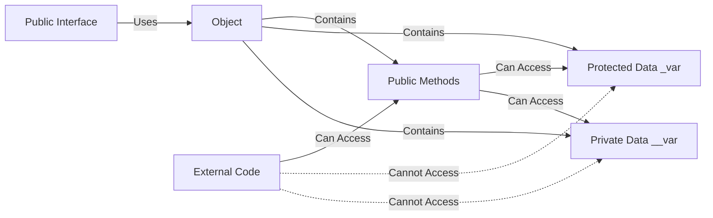
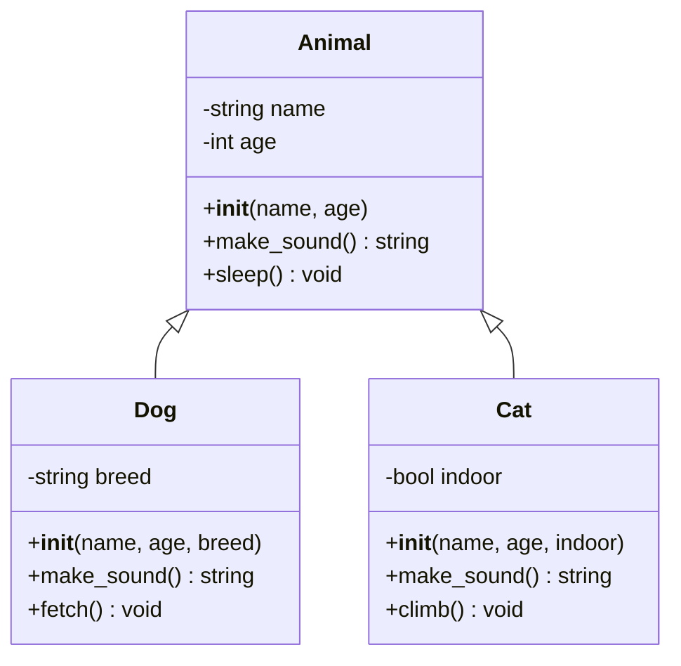
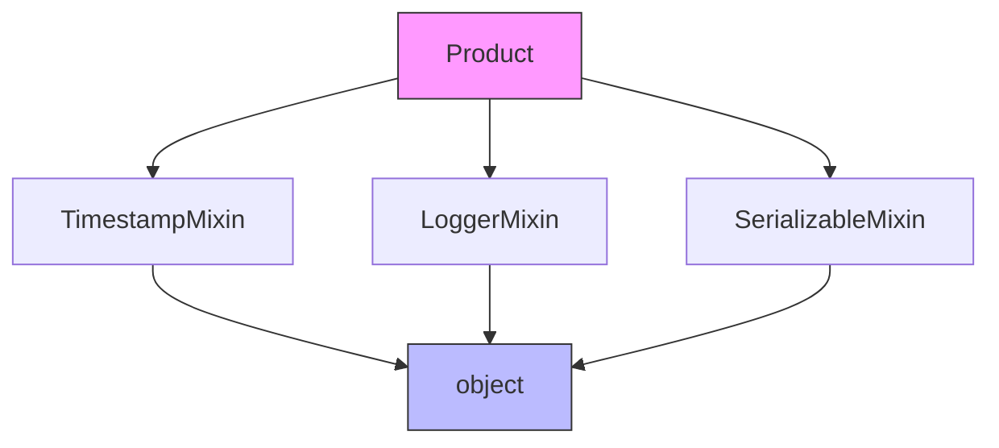
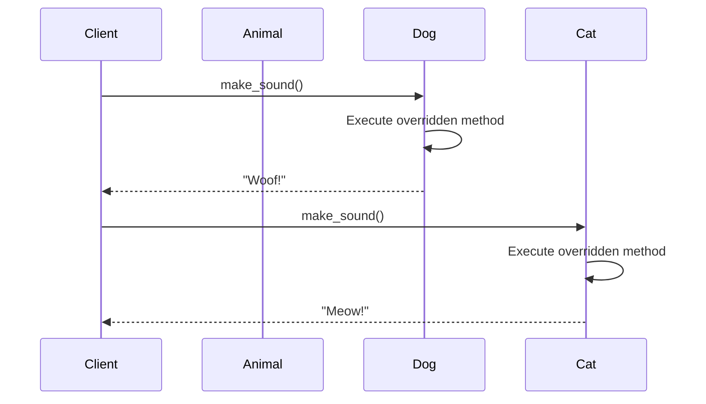
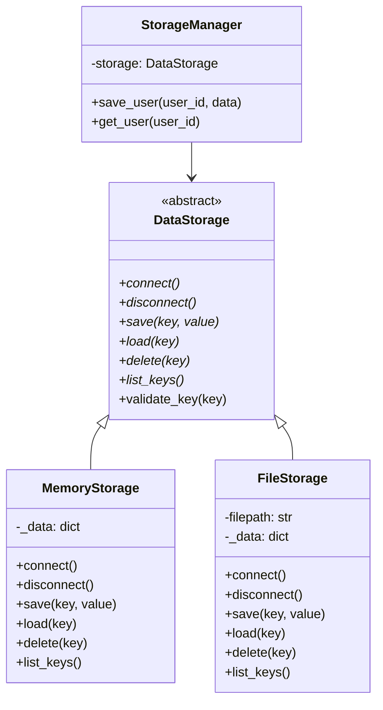

# Python OOP Core Principles: The Four Pillars

## Learning Objectives
- Master the four pillars of OOP: Encapsulation, Inheritance, Polymorphism, and Abstraction
- Understand when and how to apply each principle
- Learn the Method Resolution Order (MRO) and multiple inheritance
- Implement abstract base classes and interfaces
- Apply FAANG-level design patterns using these principles

## Table of Contents
1. [The Four Pillars Overview](#four-pillars-overview)
2. [Encapsulation](#encapsulation)
3. [Inheritance](#inheritance)
4. [Polymorphism](#polymorphism)
5. [Abstraction](#abstraction)
6. [Advanced Inheritance Patterns](#advanced-inheritance-patterns)
7. [Production Patterns](#production-patterns)
8. [Best Practices](#best-practices)

---

## Four Pillars Overview

```mermaid
mindmap
  root((OOP Principles))
    Encapsulation
      Data Hiding
      Properties
      Access Control
      Information Hiding
    Inheritance
      Code Reuse
      IS-A Relationship
      Method Override
      super()
    Polymorphism
      Method Overriding
      Duck Typing
      Operator Overloading
      Interface Implementation
    Abstraction
      Abstract Classes
      Interfaces
      Hide Complexity
      Define Contracts
```

---

## Encapsulation

### What is Encapsulation?

Encapsulation is the bundling of data (attributes) and methods that operate on that data within a single unit (class), while restricting direct access to some of the object's components.



### Access Modifiers in Python

```python
from typing import Optional


class BankAccount:
    """Demonstrates encapsulation with different access levels."""

    def __init__(self, account_number: str, initial_balance: float = 0.0) -> None:
        """Initialize a bank account.

        Args:
            account_number: Unique account identifier
            initial_balance: Starting balance (default: 0.0)
        """
        # Public attribute (convention: use sparingly)
        self.account_number = account_number

        # Protected attribute (convention: prefix with single underscore)
        # Intended for internal use and subclasses
        self._balance = initial_balance

        # Private attribute (name mangling: prefix with double underscore)
        # Strongly encapsulated, harder to access from outside
        self.__pin = "0000"

        # Transaction history
        self._transactions: list[dict] = []

    # Public method
    def get_balance(self) -> float:
        """Get current account balance.

        Returns:
            Current balance
        """
        return self._balance

    # Public method with validation
    def deposit(self, amount: float) -> None:
        """Deposit money into account.

        Args:
            amount: Amount to deposit

        Raises:
            ValueError: If amount is not positive
        """
        if amount <= 0:
            raise ValueError("Deposit amount must be positive")

        self._balance += amount
        self._record_transaction("deposit", amount)

    def withdraw(self, amount: float, pin: str) -> bool:
        """Withdraw money from account.

        Args:
            amount: Amount to withdraw
            pin: PIN for authentication

        Returns:
            True if withdrawal successful, False otherwise

        Raises:
            ValueError: If amount is not positive
        """
        if amount <= 0:
            raise ValueError("Withdrawal amount must be positive")

        if not self._verify_pin(pin):
            print("Invalid PIN")
            return False

        if amount > self._balance:
            print("Insufficient funds")
            return False

        self._balance -= amount
        self._record_transaction("withdrawal", amount)
        return True

    def change_pin(self, old_pin: str, new_pin: str) -> bool:
        """Change account PIN.

        Args:
            old_pin: Current PIN
            new_pin: New PIN

        Returns:
            True if PIN changed successfully
        """
        if not self._verify_pin(old_pin):
            return False

        if not self.__validate_pin_format(new_pin):
            print("Invalid PIN format (must be 4 digits)")
            return False

        self.__pin = new_pin
        return True

    # Protected method (for internal use and subclasses)
    def _record_transaction(self, transaction_type: str, amount: float) -> None:
        """Record a transaction.

        Args:
            transaction_type: Type of transaction
            amount: Transaction amount
        """
        self._transactions.append({
            'type': transaction_type,
            'amount': amount,
            'balance_after': self._balance
        })

    # Private method (name mangling)
    def __validate_pin_format(self, pin: str) -> bool:
        """Validate PIN format.

        Args:
            pin: PIN to validate

        Returns:
            True if valid format
        """
        return len(pin) == 4 and pin.isdigit()

    def _verify_pin(self, pin: str) -> bool:
        """Verify PIN.

        Args:
            pin: PIN to verify

        Returns:
            True if PIN matches
        """
        return pin == self.__pin


# Usage
account = BankAccount("ACC001", 1000.0)

# Public interface
print(f"Balance: ${account.get_balance()}")  # Balance: $1000.0
account.deposit(500)
print(f"Balance: ${account.get_balance()}")  # Balance: $1500.0

# Proper way to withdraw
success = account.withdraw(200, "0000")
print(f"Withdrawal successful: {success}")  # True

# Protected members (can access but shouldn't)
print(f"Transactions: {len(account._transactions)}")  # Works but not recommended

# Private members (name mangled to _BankAccount__pin)
# print(account.__pin)  # AttributeError
# But can still access with name mangling (not recommended)
print(account._BankAccount__pin)  # 0000 (not recommended to access this way)
```

### Property-Based Encapsulation

```python
from datetime import datetime
from typing import Optional


class User:
    """User class with property-based encapsulation."""

    def __init__(self, username: str, email: str, age: int) -> None:
        """Initialize user.

        Args:
            username: User's username
            email: User's email
            age: User's age
        """
        self._username = username
        self._email = email
        self._age = age
        self._created_at = datetime.now()
        self._last_login: Optional[datetime] = None

    @property
    def username(self) -> str:
        """Get username.

        Returns:
            Username
        """
        return self._username

    @username.setter
    def username(self, value: str) -> None:
        """Set username with validation.

        Args:
            value: New username

        Raises:
            ValueError: If username is invalid
        """
        if len(value) < 3:
            raise ValueError("Username must be at least 3 characters")
        if not value.isalnum():
            raise ValueError("Username must be alphanumeric")
        self._username = value

    @property
    def email(self) -> str:
        """Get email.

        Returns:
            Email address
        """
        return self._email

    @email.setter
    def email(self, value: str) -> None:
        """Set email with validation.

        Args:
            value: New email

        Raises:
            ValueError: If email is invalid
        """
        if '@' not in value or '.' not in value.split('@')[1]:
            raise ValueError("Invalid email format")
        self._email = value

    @property
    def age(self) -> int:
        """Get age.

        Returns:
            User's age
        """
        return self._age

    @age.setter
    def age(self, value: int) -> None:
        """Set age with validation.

        Args:
            value: New age

        Raises:
            ValueError: If age is invalid
        """
        if not 0 <= value <= 150:
            raise ValueError("Age must be between 0 and 150")
        self._age = value

    @property
    def created_at(self) -> datetime:
        """Get creation timestamp (read-only).

        Returns:
            Creation timestamp
        """
        return self._created_at

    # No setter for created_at - it's read-only

    def login(self) -> None:
        """Record user login."""
        self._last_login = datetime.now()


# Usage
user = User("alice123", "alice@example.com", 28)

# Clean property interface
print(user.username)  # alice123
print(user.email)     # alice@example.com

# Validation through setters
try:
    user.username = "ab"  # Too short
except ValueError as e:
    print(f"Error: {e}")  # Error: Username must be at least 3 characters

# Read-only property
print(user.created_at)
# user.created_at = datetime.now()  # AttributeError: can't set attribute
```

---

## Inheritance

### Single Inheritance



```python
from abc import ABC, abstractmethod
from typing import Optional


class Animal(ABC):
    """Base animal class demonstrating inheritance."""

    def __init__(self, name: str, age: int) -> None:
        """Initialize animal.

        Args:
            name: Animal's name
            age: Animal's age
        """
        self._name = name
        self._age = age
        self._energy = 100

    @property
    def name(self) -> str:
        """Get animal name.

        Returns:
            Name
        """
        return self._name

    @property
    def age(self) -> int:
        """Get animal age.

        Returns:
            Age in years
        """
        return self._age

    @abstractmethod
    def make_sound(self) -> str:
        """Make animal sound (must be implemented by subclasses).

        Returns:
            Sound string
        """
        pass

    def sleep(self) -> None:
        """Make animal sleep to restore energy."""
        self._energy = 100
        print(f"{self._name} is sleeping... Energy restored!")

    def get_info(self) -> str:
        """Get animal information.

        Returns:
            Formatted info string
        """
        return f"{self.__class__.__name__}: {self._name}, Age: {self._age}"


class Dog(Animal):
    """Dog class inheriting from Animal."""

    def __init__(self, name: str, age: int, breed: str) -> None:
        """Initialize dog.

        Args:
            name: Dog's name
            age: Dog's age
            breed: Dog's breed
        """
        super().__init__(name, age)  # Call parent constructor
        self._breed = breed

    def make_sound(self) -> str:
        """Implement dog sound.

        Returns:
            Barking sound
        """
        return f"{self._name} says: Woof! Woof!"

    def fetch(self, item: str = "ball") -> None:
        """Dog-specific behavior.

        Args:
            item: Item to fetch
        """
        if self._energy < 20:
            print(f"{self._name} is too tired to fetch")
            return

        print(f"{self._name} fetches the {item}!")
        self._energy -= 20

    def get_info(self) -> str:
        """Override parent method to add breed.

        Returns:
            Formatted info with breed
        """
        base_info = super().get_info()
        return f"{base_info}, Breed: {self._breed}"


class Cat(Animal):
    """Cat class inheriting from Animal."""

    def __init__(self, name: str, age: int, indoor: bool = True) -> None:
        """Initialize cat.

        Args:
            name: Cat's name
            age: Cat's age
            indoor: Whether cat is indoor-only
        """
        super().__init__(name, age)
        self._indoor = indoor

    def make_sound(self) -> str:
        """Implement cat sound.

        Returns:
            Meowing sound
        """
        return f"{self._name} says: Meow!"

    def climb(self) -> None:
        """Cat-specific behavior."""
        if self._indoor:
            print(f"{self._name} climbs the cat tree")
        else:
            print(f"{self._name} climbs a tree outside")


# Usage
dog = Dog("Buddy", 3, "Golden Retriever")
cat = Cat("Whiskers", 2, indoor=True)

print(dog.make_sound())  # Buddy says: Woof! Woof!
print(cat.make_sound())  # Whiskers says: Meow!

print(dog.get_info())  # Dog: Buddy, Age: 3, Breed: Golden Retriever
print(cat.get_info())  # Cat: Whiskers, Age: 2

dog.fetch()  # Buddy fetches the ball!
dog.fetch()
dog.fetch()
dog.fetch()
dog.fetch()  # Buddy is too tired to fetch

dog.sleep()  # Buddy is sleeping... Energy restored!
```

### Multiple Inheritance and MRO

```python
class LoggerMixin:
    """Mixin for logging functionality."""

    def log(self, message: str, level: str = "INFO") -> None:
        """Log a message.

        Args:
            message: Message to log
            level: Log level
        """
        print(f"[{level}] {self.__class__.__name__}: {message}")


class TimestampMixin:
    """Mixin for timestamp functionality."""

    def __init__(self, *args, **kwargs) -> None:
        """Initialize with timestamp."""
        super().__init__(*args, **kwargs)
        from datetime import datetime
        self._created_at = datetime.now()

    def get_timestamp(self) -> str:
        """Get creation timestamp.

        Returns:
            Formatted timestamp
        """
        return self._created_at.strftime("%Y-%m-%d %H:%M:%S")


class SerializableMixin:
    """Mixin for serialization functionality."""

    def to_dict(self) -> dict:
        """Convert object to dictionary.

        Returns:
            Dictionary representation
        """
        return {
            k: v for k, v in self.__dict__.items()
            if not k.startswith('_')
        }


class Product(TimestampMixin, LoggerMixin, SerializableMixin):
    """Product class using multiple mixins."""

    def __init__(self, name: str, price: float, stock: int) -> None:
        """Initialize product.

        Args:
            name: Product name
            price: Product price
            stock: Stock quantity
        """
        super().__init__()  # Initialize mixins
        self.name = name
        self.price = price
        self.stock = stock
        self.log(f"Created product: {name}")

    def update_stock(self, quantity: int) -> None:
        """Update stock quantity.

        Args:
            quantity: New quantity
        """
        old_stock = self.stock
        self.stock = quantity
        self.log(f"Stock updated from {old_stock} to {quantity}")


# Usage
product = Product("Laptop", 999.99, 50)

# From TimestampMixin
print(f"Created at: {product.get_timestamp()}")

# From LoggerMixin
product.log("Testing logger", "DEBUG")

# From SerializableMixin
print(f"Product data: {product.to_dict()}")

# Product's own method
product.update_stock(45)

# Check Method Resolution Order
print("\nMRO (Method Resolution Order):")
for cls in Product.__mro__:
    print(f"  - {cls.__name__}")
```



**MRO Output:**
```
- Product
- TimestampMixin
- LoggerMixin
- SerializableMixin
- object
```

---

## Polymorphism

### Method Overriding Polymorphism



```python
from typing import List
from abc import ABC, abstractmethod


class PaymentMethod(ABC):
    """Abstract base class for payment methods."""

    @abstractmethod
    def process_payment(self, amount: float) -> bool:
        """Process payment.

        Args:
            amount: Amount to charge

        Returns:
            True if successful
        """
        pass

    @abstractmethod
    def get_transaction_fee(self, amount: float) -> float:
        """Calculate transaction fee.

        Args:
            amount: Transaction amount

        Returns:
            Fee amount
        """
        pass


class CreditCardPayment(PaymentMethod):
    """Credit card payment processor."""

    def __init__(self, card_number: str) -> None:
        """Initialize credit card payment.

        Args:
            card_number: Credit card number
        """
        self.card_number = card_number[-4:]  # Store last 4 digits only

    def process_payment(self, amount: float) -> bool:
        """Process credit card payment.

        Args:
            amount: Amount to charge

        Returns:
            True if successful
        """
        fee = self.get_transaction_fee(amount)
        total = amount + fee
        print(f"Processing ${total:.2f} via Credit Card ending in {self.card_number}")
        return True

    def get_transaction_fee(self, amount: float) -> float:
        """Calculate credit card fee (2.9% + $0.30).

        Args:
            amount: Transaction amount

        Returns:
            Fee amount
        """
        return amount * 0.029 + 0.30


class PayPalPayment(PaymentMethod):
    """PayPal payment processor."""

    def __init__(self, email: str) -> None:
        """Initialize PayPal payment.

        Args:
            email: PayPal email
        """
        self.email = email

    def process_payment(self, amount: float) -> bool:
        """Process PayPal payment.

        Args:
            amount: Amount to charge

        Returns:
            True if successful
        """
        fee = self.get_transaction_fee(amount)
        total = amount + fee
        print(f"Processing ${total:.2f} via PayPal ({self.email})")
        return True

    def get_transaction_fee(self, amount: float) -> float:
        """Calculate PayPal fee (2.9% + $0.30 for US).

        Args:
            amount: Transaction amount

        Returns:
            Fee amount
        """
        return amount * 0.029 + 0.30


class CryptoCurrencyPayment(PaymentMethod):
    """Cryptocurrency payment processor."""

    def __init__(self, wallet_address: str, currency: str = "BTC") -> None:
        """Initialize crypto payment.

        Args:
            wallet_address: Wallet address
            currency: Cryptocurrency type
        """
        self.wallet_address = wallet_address
        self.currency = currency

    def process_payment(self, amount: float) -> bool:
        """Process cryptocurrency payment.

        Args:
            amount: Amount to charge

        Returns:
            True if successful
        """
        fee = self.get_transaction_fee(amount)
        total = amount + fee
        print(f"Processing ${total:.2f} via {self.currency} to {self.wallet_address[:10]}...")
        return True

    def get_transaction_fee(self, amount: float) -> float:
        """Calculate crypto fee (1% network fee).

        Args:
            amount: Transaction amount

        Returns:
            Fee amount
        """
        return amount * 0.01


class PaymentProcessor:
    """Process payments using polymorphism."""

    def process_order(
        self,
        payment_methods: List[PaymentMethod],
        amounts: List[float]
    ) -> None:
        """Process multiple payments.

        Args:
            payment_methods: List of payment method objects
            amounts: Corresponding amounts
        """
        if len(payment_methods) != len(amounts):
            raise ValueError("Payment methods and amounts must have same length")

        total_processed = 0.0
        for payment_method, amount in zip(payment_methods, amounts):
            # Polymorphism: same interface, different implementations
            if payment_method.process_payment(amount):
                total_processed += amount

        print(f"\nTotal processed: ${total_processed:.2f}")


# Usage demonstrating polymorphism
processor = PaymentProcessor()

payment_methods = [
    CreditCardPayment("4111111111111111"),
    PayPalPayment("user@example.com"),
    CryptoCurrencyPayment("1A1zP1eP5QGefi2DMPTfTL5SLmv7DivfNa", "BTC")
]

amounts = [100.0, 50.0, 75.0]

processor.process_order(payment_methods, amounts)
```

### Duck Typing Polymorphism

```python
from typing import Protocol


# Protocol defines interface (structural subtyping)
class Drawable(Protocol):
    """Protocol for drawable objects."""

    def draw(self) -> str:
        """Draw the object.

        Returns:
            String representation
        """
        ...


class Circle:
    """Circle shape."""

    def __init__(self, radius: float) -> None:
        """Initialize circle.

        Args:
            radius: Circle radius
        """
        self.radius = radius

    def draw(self) -> str:
        """Draw circle.

        Returns:
            Circle representation
        """
        return f"Drawing circle with radius {self.radius}"


class Square:
    """Square shape."""

    def __init__(self, side: float) -> None:
        """Initialize square.

        Args:
            side: Side length
        """
        self.side = side

    def draw(self) -> str:
        """Draw square.

        Returns:
            Square representation
        """
        return f"Drawing square with side {self.side}"


class Text:
    """Text element."""

    def __init__(self, content: str) -> None:
        """Initialize text.

        Args:
            content: Text content
        """
        self.content = content

    def draw(self) -> str:
        """Draw text.

        Returns:
            Text representation
        """
        return f"Rendering text: {self.content}"


def render_shapes(drawables: List[Drawable]) -> None:
    """Render multiple drawable objects.

    Args:
        drawables: List of objects with draw() method
    """
    for drawable in drawables:
        # Duck typing: if it has draw(), it's drawable
        print(drawable.draw())


# Usage
shapes: List[Drawable] = [
    Circle(5.0),
    Square(10.0),
    Text("Hello, World!")
]

render_shapes(shapes)
```

---

## Abstraction

### Abstract Base Classes

```python
from abc import ABC, abstractmethod
from typing import List, Dict, Any, Optional
from enum import Enum


class StorageType(Enum):
    """Storage backend types."""
    MEMORY = "memory"
    FILE = "file"
    DATABASE = "database"


class DataStorage(ABC):
    """Abstract base class for data storage."""

    def __init__(self) -> None:
        """Initialize storage."""
        self._initialized = False

    @abstractmethod
    def connect(self) -> None:
        """Establish connection to storage."""
        pass

    @abstractmethod
    def disconnect(self) -> None:
        """Close connection to storage."""
        pass

    @abstractmethod
    def save(self, key: str, value: Any) -> bool:
        """Save data.

        Args:
            key: Data key
            value: Data value

        Returns:
            True if successful
        """
        pass

    @abstractmethod
    def load(self, key: str) -> Optional[Any]:
        """Load data.

        Args:
            key: Data key

        Returns:
            Data value or None
        """
        pass

    @abstractmethod
    def delete(self, key: str) -> bool:
        """Delete data.

        Args:
            key: Data key

        Returns:
            True if successful
        """
        pass

    @abstractmethod
    def list_keys(self) -> List[str]:
        """List all keys.

        Returns:
            List of keys
        """
        pass

    # Concrete method (common to all implementations)
    def validate_key(self, key: str) -> bool:
        """Validate key format.

        Args:
            key: Key to validate

        Returns:
            True if valid
        """
        return isinstance(key, str) and len(key) > 0


class MemoryStorage(DataStorage):
    """In-memory storage implementation."""

    def __init__(self) -> None:
        """Initialize memory storage."""
        super().__init__()
        self._data: Dict[str, Any] = {}

    def connect(self) -> None:
        """Initialize memory storage."""
        self._initialized = True
        print("Memory storage initialized")

    def disconnect(self) -> None:
        """Clear memory storage."""
        self._data.clear()
        self._initialized = False
        print("Memory storage cleared")

    def save(self, key: str, value: Any) -> bool:
        """Save to memory.

        Args:
            key: Data key
            value: Data value

        Returns:
            True if successful
        """
        if not self.validate_key(key):
            return False
        self._data[key] = value
        return True

    def load(self, key: str) -> Optional[Any]:
        """Load from memory.

        Args:
            key: Data key

        Returns:
            Data value or None
        """
        return self._data.get(key)

    def delete(self, key: str) -> bool:
        """Delete from memory.

        Args:
            key: Data key

        Returns:
            True if successful
        """
        if key in self._data:
            del self._data[key]
            return True
        return False

    def list_keys(self) -> List[str]:
        """List all keys.

        Returns:
            List of keys
        """
        return list(self._data.keys())


class FileStorage(DataStorage):
    """File-based storage implementation."""

    def __init__(self, filepath: str) -> None:
        """Initialize file storage.

        Args:
            filepath: Path to storage file
        """
        super().__init__()
        self.filepath = filepath
        self._data: Dict[str, Any] = {}

    def connect(self) -> None:
        """Load data from file."""
        try:
            import json
            with open(self.filepath, 'r') as f:
                self._data = json.load(f)
            self._initialized = True
            print(f"Loaded data from {self.filepath}")
        except FileNotFoundError:
            self._data = {}
            self._initialized = True
            print(f"Created new storage file: {self.filepath}")

    def disconnect(self) -> None:
        """Save data to file."""
        import json
        with open(self.filepath, 'w') as f:
            json.dump(self._data, f, indent=2)
        self._initialized = False
        print(f"Saved data to {self.filepath}")

    def save(self, key: str, value: Any) -> bool:
        """Save to file storage.

        Args:
            key: Data key
            value: Data value

        Returns:
            True if successful
        """
        if not self.validate_key(key):
            return False
        self._data[key] = value
        return True

    def load(self, key: str) -> Optional[Any]:
        """Load from file storage.

        Args:
            key: Data key

        Returns:
            Data value or None
        """
        return self._data.get(key)

    def delete(self, key: str) -> bool:
        """Delete from file storage.

        Args:
            key: Data key

        Returns:
            True if successful
        """
        if key in self._data:
            del self._data[key]
            return True
        return False

    def list_keys(self) -> List[str]:
        """List all keys.

        Returns:
            List of keys
        """
        return list(self._data.keys())


class StorageManager:
    """Manager using abstraction to work with any storage type."""

    def __init__(self, storage: DataStorage) -> None:
        """Initialize with storage backend.

        Args:
            storage: Storage implementation
        """
        self.storage = storage
        self.storage.connect()

    def __enter__(self) -> "StorageManager":
        """Enter context manager.

        Returns:
            Self
        """
        return self

    def __exit__(self, exc_type, exc_val, exc_tb) -> None:
        """Exit context manager."""
        self.storage.disconnect()

    def save_user(self, user_id: str, user_data: Dict[str, Any]) -> bool:
        """Save user data.

        Args:
            user_id: User identifier
            user_data: User information

        Returns:
            True if successful
        """
        return self.storage.save(f"user:{user_id}", user_data)

    def get_user(self, user_id: str) -> Optional[Dict[str, Any]]:
        """Get user data.

        Args:
            user_id: User identifier

        Returns:
            User data or None
        """
        return self.storage.load(f"user:{user_id}")


# Usage with different storage backends
print("=== Using Memory Storage ===")
with StorageManager(MemoryStorage()) as manager:
    manager.save_user("001", {"name": "Alice", "age": 28})
    manager.save_user("002", {"name": "Bob", "age": 35})
    print(manager.get_user("001"))

print("\n=== Using File Storage ===")
with StorageManager(FileStorage("/tmp/data.json")) as manager:
    manager.save_user("001", {"name": "Alice", "age": 28})
    manager.save_user("002", {"name": "Bob", "age": 35})
    print(manager.get_user("001"))
```



---

## Advanced Inheritance Patterns

### Template Method Pattern

```python
from abc import ABC, abstractmethod
from typing import List, Dict, Any


class DataPipeline(ABC):
    """Template for data processing pipeline."""

    def execute(self) -> Dict[str, Any]:
        """Execute the pipeline (template method).

        Returns:
            Processing results
        """
        print(f"Starting {self.__class__.__name__}")

        # Template method defines the algorithm structure
        raw_data = self.extract_data()
        validated_data = self.validate_data(raw_data)
        transformed_data = self.transform_data(validated_data)
        self.load_data(transformed_data)

        print(f"Completed {self.__class__.__name__}")

        return {
            'status': 'success',
            'records_processed': len(transformed_data)
        }

    @abstractmethod
    def extract_data(self) -> List[Dict[str, Any]]:
        """Extract data from source.

        Returns:
            Raw data
        """
        pass

    def validate_data(self, data: List[Dict[str, Any]]) -> List[Dict[str, Any]]:
        """Validate data (optional hook).

        Args:
            data: Data to validate

        Returns:
            Validated data
        """
        # Default implementation (can be overridden)
        print("Validating data...")
        return [item for item in data if item]

    @abstractmethod
    def transform_data(self, data: List[Dict[str, Any]]) -> List[Dict[str, Any]]:
        """Transform data.

        Args:
            data: Data to transform

        Returns:
            Transformed data
        """
        pass

    @abstractmethod
    def load_data(self, data: List[Dict[str, Any]]) -> None:
        """Load data to destination.

        Args:
            data: Data to load
        """
        pass


class CSVToJSONPipeline(DataPipeline):
    """CSV to JSON conversion pipeline."""

    def __init__(self, csv_file: str, json_file: str) -> None:
        """Initialize pipeline.

        Args:
            csv_file: Source CSV file
            json_file: Destination JSON file
        """
        self.csv_file = csv_file
        self.json_file = json_file

    def extract_data(self) -> List[Dict[str, Any]]:
        """Extract from CSV.

        Returns:
            CSV data as list of dicts
        """
        print(f"Extracting data from {self.csv_file}")
        # Simulate CSV reading
        return [
            {'id': 1, 'name': 'Alice', 'age': 28},
            {'id': 2, 'name': 'Bob', 'age': 35},
        ]

    def transform_data(self, data: List[Dict[str, Any]]) -> List[Dict[str, Any]]:
        """Transform data.

        Args:
            data: Source data

        Returns:
            Transformed data
        """
        print("Transforming CSV to JSON format")
        # Add metadata
        return [
            {**item, 'processed': True, 'source': 'csv'}
            for item in data
        ]

    def load_data(self, data: List[Dict[str, Any]]) -> None:
        """Load to JSON.

        Args:
            data: Data to save
        """
        print(f"Loading data to {self.json_file}")
        import json
        # Simulate JSON writing
        print(json.dumps(data, indent=2))


class DatabaseToAPIPipeline(DataPipeline):
    """Database to API pipeline."""

    def __init__(self, db_table: str, api_endpoint: str) -> None:
        """Initialize pipeline.

        Args:
            db_table: Source database table
            api_endpoint: Destination API endpoint
        """
        self.db_table = db_table
        self.api_endpoint = api_endpoint

    def extract_data(self) -> List[Dict[str, Any]]:
        """Extract from database.

        Returns:
            Database records
        """
        print(f"Extracting data from table: {self.db_table}")
        # Simulate database query
        return [
            {'user_id': 1, 'email': 'alice@example.com'},
            {'user_id': 2, 'email': 'bob@example.com'},
        ]

    def validate_data(self, data: List[Dict[str, Any]]) -> List[Dict[str, Any]]:
        """Validate email addresses.

        Args:
            data: Data to validate

        Returns:
            Validated data
        """
        print("Validating email addresses")
        return [
            item for item in data
            if '@' in item.get('email', '')
        ]

    def transform_data(self, data: List[Dict[str, Any]]) -> List[Dict[str, Any]]:
        """Transform for API.

        Args:
            data: Source data

        Returns:
            API-formatted data
        """
        print("Transforming to API format")
        return [
            {
                'id': item['user_id'],
                'contact': {'email': item['email']}
            }
            for item in data
        ]

    def load_data(self, data: List[Dict[str, Any]]) -> None:
        """Send to API.

        Args:
            data: Data to send
        """
        print(f"Posting data to {self.api_endpoint}")
        for item in data:
            print(f"  POST {self.api_endpoint}: {item}")


# Usage
pipeline1 = CSVToJSONPipeline("data.csv", "output.json")
result1 = pipeline1.execute()
print(f"\nResult: {result1}\n")

pipeline2 = DatabaseToAPIPipeline("users", "https://api.example.com/users")
result2 = pipeline2.execute()
print(f"\nResult: {result2}")
```

---

## Production Patterns

### Repository Pattern with Abstraction

```python
from abc import ABC, abstractmethod
from typing import List, Optional, Generic, TypeVar
from dataclasses import dataclass

T = TypeVar('T')


@dataclass
class User:
    """User model."""
    id: Optional[int]
    username: str
    email: str
    age: int


class Repository(ABC, Generic[T]):
    """Abstract repository pattern."""

    @abstractmethod
    def find_by_id(self, id: int) -> Optional[T]:
        """Find entity by ID.

        Args:
            id: Entity ID

        Returns:
            Entity or None
        """
        pass

    @abstractmethod
    def find_all(self) -> List[T]:
        """Find all entities.

        Returns:
            List of entities
        """
        pass

    @abstractmethod
    def save(self, entity: T) -> T:
        """Save entity.

        Args:
            entity: Entity to save

        Returns:
            Saved entity with ID
        """
        pass

    @abstractmethod
    def delete(self, id: int) -> bool:
        """Delete entity.

        Args:
            id: Entity ID

        Returns:
            True if deleted
        """
        pass


class InMemoryUserRepository(Repository[User]):
    """In-memory user repository."""

    def __init__(self) -> None:
        """Initialize repository."""
        self._users: Dict[int, User] = {}
        self._next_id = 1

    def find_by_id(self, id: int) -> Optional[User]:
        """Find user by ID.

        Args:
            id: User ID

        Returns:
            User or None
        """
        return self._users.get(id)

    def find_all(self) -> List[User]:
        """Find all users.

        Returns:
            List of users
        """
        return list(self._users.values())

    def save(self, user: User) -> User:
        """Save user.

        Args:
            user: User to save

        Returns:
            Saved user with ID
        """
        if user.id is None:
            user.id = self._next_id
            self._next_id += 1

        self._users[user.id] = user
        return user

    def delete(self, id: int) -> bool:
        """Delete user.

        Args:
            id: User ID

        Returns:
            True if deleted
        """
        if id in self._users:
            del self._users[id]
            return True
        return False

    def find_by_email(self, email: str) -> Optional[User]:
        """Find user by email.

        Args:
            email: Email address

        Returns:
            User or None
        """
        for user in self._users.values():
            if user.email == email:
                return user
        return None


class UserService:
    """User service using repository pattern."""

    def __init__(self, repository: Repository[User]) -> None:
        """Initialize service.

        Args:
            repository: User repository
        """
        self.repository = repository

    def register_user(self, username: str, email: str, age: int) -> User:
        """Register new user.

        Args:
            username: Username
            email: Email
            age: Age

        Returns:
            Created user

        Raises:
            ValueError: If user already exists
        """
        # Check if already exists
        if isinstance(self.repository, InMemoryUserRepository):
            existing = self.repository.find_by_email(email)
            if existing:
                raise ValueError(f"User with email {email} already exists")

        user = User(id=None, username=username, email=email, age=age)
        return self.repository.save(user)

    def get_user(self, user_id: int) -> Optional[User]:
        """Get user by ID.

        Args:
            user_id: User ID

        Returns:
            User or None
        """
        return self.repository.find_by_id(user_id)

    def get_all_users(self) -> List[User]:
        """Get all users.

        Returns:
            List of users
        """
        return self.repository.find_all()


# Usage
repo = InMemoryUserRepository()
service = UserService(repo)

# Register users
user1 = service.register_user("alice", "alice@example.com", 28)
user2 = service.register_user("bob", "bob@example.com", 35)

print(f"Registered: {user1}")
print(f"Registered: {user2}")

# Get user
found_user = service.get_user(1)
print(f"\nFound user: {found_user}")

# List all users
all_users = service.get_all_users()
print(f"\nAll users ({len(all_users)}):")
for user in all_users:
    print(f"  - {user}")
```

---

## Best Practices

### 1. Favor Composition Over Inheritance

```python
# Good: Composition
class DatabaseLogger:
    """Logger that writes to database."""

    def log(self, message: str) -> None:
        """Log to database.

        Args:
            message: Log message
        """
        print(f"[DB] {message}")


class FileLogger:
    """Logger that writes to file."""

    def log(self, message: str) -> None:
        """Log to file.

        Args:
            message: Log message
        """
        print(f"[FILE] {message}")


class Application:
    """Application using composition for logging."""

    def __init__(self, logger: DatabaseLogger) -> None:
        """Initialize with logger.

        Args:
            logger: Logger instance
        """
        self.logger = logger  # Composition

    def run(self) -> None:
        """Run application."""
        self.logger.log("Application started")
        # Application logic
        self.logger.log("Application finished")


# Easy to swap implementations
app = Application(DatabaseLogger())
app.run()

app = Application(FileLogger())
app.run()
```

### 2. Use Abstract Base Classes for Contracts

```python
from abc import ABC, abstractmethod


class Validator(ABC):
    """Abstract validator contract."""

    @abstractmethod
    def validate(self, value: Any) -> bool:
        """Validate value.

        Args:
            value: Value to validate

        Returns:
            True if valid
        """
        pass

    @abstractmethod
    def get_error_message(self) -> str:
        """Get validation error message.

        Returns:
            Error message
        """
        pass


# All validators must implement these methods
```

### 3. Keep Inheritance Hierarchies Shallow

```python
# Good: Shallow hierarchy (2-3 levels max)
class Animal:
    pass


class Mammal(Animal):
    pass


class Dog(Mammal):
    pass


# Bad: Deep hierarchy (hard to maintain)
class Thing:
    pass


class LivingThing(Thing):
    pass


class Animal(LivingThing):
    pass


class Vertebrate(Animal):
    pass


class Mammal(Vertebrate):
    pass


class Carnivore(Mammal):
    pass


class Dog(Carnivore):  # Too deep!
    pass
```

---

## Summary

You've mastered the four pillars of OOP:

1. **Encapsulation**: Bundling data and methods, controlling access
2. **Inheritance**: Code reuse and IS-A relationships
3. **Polymorphism**: Same interface, different implementations
4. **Abstraction**: Hiding complexity, defining contracts

### Key Takeaways

- Use properties for controlled access to attributes
- Prefer composition over inheritance for flexibility
- Use abstract base classes to define contracts
- Keep inheritance hierarchies shallow (2-3 levels max)
- Apply polymorphism for clean, extensible code
- Use protocols for duck typing
- Follow the repository pattern for data access

### Next Steps

Continue to **03-python-advanced-oop.md** for:
- Metaclasses
- Descriptors
- Protocols and structural subtyping
- Advanced decorators
- Context managers

## Interview Questions

### Junior Level
1. What are the four pillars of OOP?
2. What is encapsulation and why is it important?
3. What is the difference between inheritance and composition?
4. What does `super()` do?

### Mid Level
5. Explain the Method Resolution Order (MRO)
6. What are mixins and when should you use them?
7. What is the difference between abstract classes and interfaces?
8. How does polymorphism work in Python?

### Senior Level
9. When would you use composition over inheritance?
10. Explain the Liskov Substitution Principle
11. How do you design a class hierarchy for a payment system?
12. What are the trade-offs of deep vs shallow inheritance?
