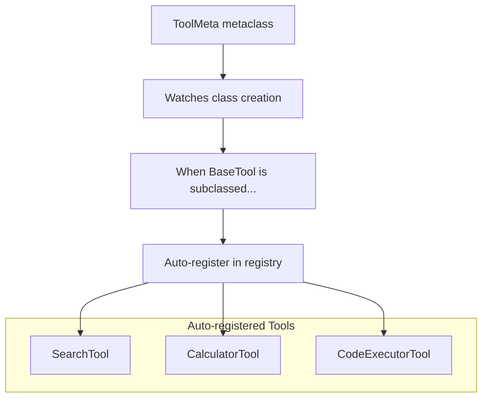
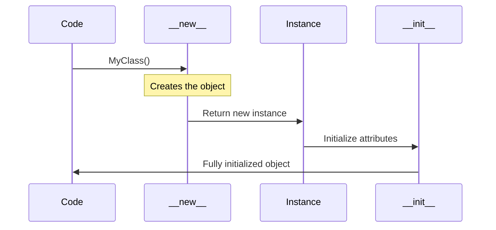

# Advanced Python OOP: Building Agent Architecture

## Learning Objectives
- Master metaclasses for auto-registering agents and tools
- Implement descriptors for prompt validation and token limits
- Use `__new__`, `__init_subclass__`, and `__set_name__`
- Optimize memory with `__slots__`
- Build async generators for streaming responses
- Create context managers for conversation sessions
- Design production-ready decorators

## Table of Contents
1. [Metaclasses: Tool Registry](#metaclasses)
2. [Object Creation: `__new__` vs `__init__`](#object-creation)
3. [Subclass Hooks: `__init_subclass__`](#init-subclass)
4. [Descriptors: Validated Prompts](#descriptors)
5. [Memory Optimization: `__slots__`](#slots)
6. [Context Managers: Conversation Sessions](#context-managers)
7. [Generators: Streaming Responses](#generators)
8. [Decorators: Production Patterns](#decorators)
9. [Complete Agent System](#complete-example)

---

## Introduction: The Power of Advanced OOP

This module covers Python's advanced OOP features—the techniques that separate senior engineers from juniors. These concepts are used extensively in production AI frameworks like LangChain, LlamaIndex, and the OpenAI SDK.

**Why These Topics Matter:**

| Feature | What It Does | Real AI Use Case |
|---------|-------------|------------------|
| **Metaclasses** | Control class creation | Auto-register tools, validate agent definitions |
| **`__new__`** | Control object creation | Singleton LLM clients, connection pools |
| **`__init_subclass__`** | Hook into subclassing | Agent type registration, plugin systems |
| **Descriptors** | Intercept attribute access | Validate prompts, enforce token limits |
| **`__slots__`** | Optimize memory layout | Millions of chat messages, embeddings |
| **Context Managers** | Setup/teardown patterns | Conversation sessions, API connections |
| **Generators** | Lazy iteration | Stream LLM responses token-by-token |
| **Decorators** | Modify function behavior | Retry logic, caching, rate limiting |

> **Career Insight:** These advanced features appear frequently in senior/staff engineer interviews. Metaclasses and descriptors are particularly valued at companies building developer tools and AI frameworks.

---

## Metaclasses: Tool Registry

### What is a Metaclass?

A metaclass is "the class of a class." Just as an object is an instance of a class, a class is an instance of a metaclass. The default metaclass in Python is `type`.

**The Key Insight:**

When you write `class MyClass:`, Python doesn't just run your code—it calls a metaclass to *create* the class object. By providing your own metaclass, you can intercept and customize this process.

**The Class Creation Process:**

1. Python collects class name, bases, and attributes
2. Python finds the metaclass (default: `type`)
3. Metaclass `__new__` creates the class object
4. Metaclass `__init__` initializes it
5. The class object is assigned to the name

**When to Use Metaclasses:**

- **Auto-registration**: Automatically register subclasses in a registry (tools, plugins, handlers)
- **Validation**: Ensure classes have required attributes or methods
- **Code injection**: Add methods or attributes to classes automatically
- **API enforcement**: Ensure all subclasses follow a specific pattern

> **Best Practice:** Metaclasses are powerful but complex. Before using one, consider if `__init_subclass__` (simpler) or decorators could achieve the same goal.

### Why Metaclasses for AI?

In agent systems, we need to auto-register tools, plugins, and handlers. Metaclasses make this automatic—you define a tool class, and it's automatically available to the agent.



### Basic Metaclass for Tool Registration

```python
from typing import Dict, Type, Any, Optional
from abc import ABC, abstractmethod


class ToolMeta(type):
    """Metaclass that auto-registers tools.
    
    When any class with this metaclass is created,
    it's automatically added to the registry.
    """
    
    # Class-level registry
    _registry: Dict[str, Type] = {}
    
    def __new__(
        mcs,
        name: str,
        bases: tuple,
        namespace: dict
    ) -> type:
        """Called when a new class is created.
        
        Args:
            mcs: The metaclass itself
            name: Name of the class being created
            bases: Base classes
            namespace: Class attributes and methods
            
        Returns:
            The new class
        """
        # Create the class first
        cls = super().__new__(mcs, name, bases, namespace)
        
        # Don't register the base class itself
        if name != "BaseTool" and not namespace.get("__abstract__", False):
            # Get tool name from class or use class name
            tool_name = namespace.get("name", name.lower())
            mcs._registry[tool_name] = cls
            print(f"🔧 Registered tool: {tool_name}")
        
        return cls
    
    @classmethod
    def get_tool(mcs, name: str) -> Optional[Type]:
        """Get tool class by name."""
        return mcs._registry.get(name)
    
    @classmethod
    def list_tools(mcs) -> list:
        """List all registered tools."""
        return list(mcs._registry.keys())


class BaseTool(metaclass=ToolMeta):
    """Base class for all agent tools.
    
    Any subclass is automatically registered.
    """
    
    name: str = "base"
    description: str = "Base tool"
    
    @abstractmethod
    def execute(self, **kwargs) -> str:
        """Execute the tool."""
        ...


# Tools are auto-registered when defined!
class SearchTool(BaseTool):
    """Search the web."""
    
    name = "search"
    description = "Search the web for information"
    
    def execute(self, query: str) -> str:
        return f"Search results for: {query}"


class CalculatorTool(BaseTool):
    """Perform calculations."""
    
    name = "calculator"
    description = "Perform mathematical calculations"
    
    def execute(self, expression: str) -> str:
        try:
            result = eval(expression)  # Don't do this in production!
            return f"Result: {result}"
        except Exception as e:
            return f"Error: {e}"


class CodeExecutorTool(BaseTool):
    """Execute Python code."""
    
    name = "code_executor"
    description = "Execute Python code snippets"
    
    def execute(self, code: str) -> str:
        return f"Executed: {code[:50]}..."


# Check the registry
print(f"\nRegistered tools: {ToolMeta.list_tools()}")
# Registered tools: ['search', 'calculator', 'code_executor']

# Get and use a tool
search = ToolMeta.get_tool("search")()
print(search.execute(query="Python tutorials"))
```

### Advanced: Validating Metaclass

```python
class ValidatedToolMeta(type):
    """Metaclass that validates tool definitions."""
    
    _registry: Dict[str, Type] = {}
    REQUIRED_ATTRS = ["name", "description"]
    
    def __new__(mcs, name: str, bases: tuple, namespace: dict) -> type:
        cls = super().__new__(mcs, name, bases, namespace)
        
        # Skip base class
        if name == "ValidatedTool":
            return cls
        
        # Validate required attributes
        for attr in mcs.REQUIRED_ATTRS:
            if attr not in namespace:
                raise TypeError(
                    f"Tool '{name}' must define '{attr}' attribute"
                )
        
        # Validate execute method
        if "execute" not in namespace:
            raise TypeError(
                f"Tool '{name}' must implement 'execute' method"
            )
        
        # Register
        mcs._registry[namespace["name"]] = cls
        return cls


class ValidatedTool(metaclass=ValidatedToolMeta):
    """Base tool with validation."""
    pass


# This works
class GoodTool(ValidatedTool):
    name = "good"
    description = "A good tool"
    
    def execute(self) -> str:
        return "Good!"


# This would raise TypeError
# class BadTool(ValidatedTool):
#     pass  # Missing name, description, execute!
```

---

## Object Creation: `__new__` vs `__init__`

### Understanding the Difference

Most Python developers only use `__init__`, but understanding `__new__` is crucial for advanced patterns like singletons, caching, and immutable objects.

**The Two-Phase Object Creation:**

| Method | Purpose | When Called | Returns |
|--------|---------|-------------|---------|
| `__new__` | **Creates** the instance | Before `__init__` | The new instance |
| `__init__` | **Initializes** the instance | After `__new__` | Nothing (`None`) |

**Key Insight:**

- `__new__` is a **class method** (receives `cls`) that returns an instance
- `__init__` is an **instance method** (receives `self`) that sets attributes
- If `__new__` returns an instance of a different class, `__init__` is NOT called

**When to Use `__new__`:**

1. **Singletons**: Return existing instance instead of creating new one
2. **Caching/Flyweight**: Reuse objects with same state
3. **Immutable types**: Subclassing `str`, `int`, `tuple` (they're set in `__new__`)
4. **Object pooling**: Manage a pool of reusable objects

> **Interview Note:** "When would you use `__new__` instead of `__init__`?" is a common senior Python question. The answer: when you need to control WHETHER an object is created, not just how it's initialized.



### Singleton LLM Client with `__new__`

```python
from typing import Optional, Dict


class SingletonLLM:
    """Singleton LLM client using __new__.
    
    Ensures only one instance exists per model.
    Useful for expensive model loading.
    """
    
    _instances: Dict[str, "SingletonLLM"] = {}
    
    def __new__(cls, model: str = "gpt-4") -> "SingletonLLM":
        """Create or return existing instance.
        
        Args:
            model: Model identifier
            
        Returns:
            Singleton instance for this model
        """
        if model not in cls._instances:
            print(f"Creating new client for: {model}")
            instance = super().__new__(cls)
            instance._initialized = False
            cls._instances[model] = instance
        else:
            print(f"Reusing existing client for: {model}")
        
        return cls._instances[model]
    
    def __init__(self, model: str = "gpt-4") -> None:
        """Initialize client (only once per instance).
        
        Args:
            model: Model identifier
        """
        # Prevent re-initialization
        if self._initialized:
            return
        
        self.model = model
        self._api_key: Optional[str] = None
        self._initialized = True
        print(f"Initialized client for: {model}")
    
    def configure(self, api_key: str) -> None:
        """Configure API key."""
        self._api_key = api_key


# Usage
client1 = SingletonLLM("gpt-4")
# Creating new client for: gpt-4
# Initialized client for: gpt-4

client2 = SingletonLLM("gpt-4")
# Reusing existing client for: gpt-4

client3 = SingletonLLM("claude-3")
# Creating new client for: claude-3
# Initialized client for: claude-3

print(client1 is client2)  # True (same instance)
print(client1 is client3)  # False (different models)

# Configure once, all references get it
client1.configure("sk-key")
print(client2._api_key)  # sk-key
```

---

## Subclass Hooks: `__init_subclass__`

### Automatic Validation Without Metaclasses

```python
from typing import ClassVar, List


class Agent:
    """Base agent with subclass validation.
    
    Uses __init_subclass__ to validate subclasses
    without needing a metaclass.
    """
    
    # Registry
    _registry: ClassVar[Dict[str, type]] = {}
    
    # Required attributes for subclasses
    agent_type: ClassVar[str]
    required_tools: ClassVar[List[str]]
    
    def __init_subclass__(
        cls,
        agent_type: Optional[str] = None,
        **kwargs
    ) -> None:
        """Called when Agent is subclassed.
        
        Args:
            agent_type: Optional type to register under
            **kwargs: Passed to parent
        """
        super().__init_subclass__(**kwargs)
        
        # Validate required class attributes
        if not hasattr(cls, "agent_type"):
            raise TypeError(
                f"Agent '{cls.__name__}' must define 'agent_type'"
            )
        
        if not hasattr(cls, "required_tools"):
            cls.required_tools = []  # Default to empty
        
        # Register agent
        type_name = agent_type or cls.agent_type
        Agent._registry[type_name] = cls
        print(f"📋 Registered agent: {type_name}")
    
    @classmethod
    def create(cls, agent_type: str, **kwargs) -> "Agent":
        """Factory method to create agents by type."""
        if agent_type not in cls._registry:
            raise ValueError(f"Unknown agent type: {agent_type}")
        return cls._registry[agent_type](**kwargs)


class ReActAgent(Agent, agent_type="react"):
    """ReAct reasoning agent."""
    
    agent_type = "react"
    required_tools = ["search", "calculator"]
    
    def __init__(self, max_iterations: int = 10):
        self.max_iterations = max_iterations
    
    def run(self, task: str) -> str:
        return f"[ReAct] Processing: {task}"


class ChainOfThoughtAgent(Agent):
    """Chain of Thought agent."""
    
    agent_type = "cot"
    required_tools = []
    
    def run(self, task: str) -> str:
        return f"[CoT] Thinking about: {task}"


# Output:
# 📋 Registered agent: react
# 📋 Registered agent: cot

# Create agents by type
react = Agent.create("react", max_iterations=5)
cot = Agent.create("cot")

print(react.run("Find information about Python"))
print(cot.run("Solve this problem step by step"))
```

---

## Descriptors: Validated Prompts

### What Are Descriptors?

Descriptors are one of Python's most powerful and least understood features. They're the mechanism behind `@property`, `@classmethod`, `@staticmethod`, and even regular method binding.

**The Definition:**

A descriptor is any object that implements at least one of these methods:
- `__get__(self, obj, type=None)` → Controls reading
- `__set__(self, obj, value)` → Controls writing
- `__delete__(self, obj)` → Controls deletion

**How Descriptors Work:**

When you access an attribute on an object, Python doesn't just look it up—it checks if the attribute is a descriptor. If it is, Python calls the descriptor's `__get__` method instead of returning the attribute directly.

```python
# When you write:
print(prompt.system)

# Python actually does:
type(prompt).__dict__['system'].__get__(prompt, type(prompt))
```

**Why Descriptors Matter for AI:**

- **Validation**: Ensure prompts don't exceed token limits
- **Type checking**: Enforce that configuration values have correct types
- **Computed attributes**: Calculate values on access (like token counts)
- **Lazy loading**: Load expensive resources only when accessed
- **Access control**: Make some attributes read-only

**Descriptor vs Property:**

| Feature | Property | Descriptor |
|---------|----------|------------|
| Reusability | One class only | Reuse across many classes |
| Complexity | Simpler syntax | More powerful, more code |
| Use case | One-off getters/setters | Reusable validation logic |

> **Best Practice:** Use `@property` for simple cases. Use descriptors when you need the same validation logic across multiple classes or attributes.

### The Descriptor Protocol in Action

Descriptors are objects that control attribute access. Perfect for validation.

```python
from typing import Any, Optional


class ValidatedString:
    """Descriptor that validates string length.
    
    A descriptor is an object that defines __get__, __set__, or __delete__.
    It intercepts attribute access on the owner class.
    """
    
    def __init__(
        self,
        min_length: int = 0,
        max_length: int = 10000,
        required: bool = True
    ) -> None:
        self.min_length = min_length
        self.max_length = max_length
        self.required = required
        self.name: str = ""  # Set by __set_name__
    
    def __set_name__(self, owner: type, name: str) -> None:
        """Called when descriptor is assigned to class attribute.
        
        Args:
            owner: The class owning this descriptor
            name: The attribute name
        """
        self.name = name
        self.private_name = f"_desc_{name}"
    
    def __get__(
        self,
        obj: Optional[object],
        objtype: Optional[type] = None
    ) -> Any:
        """Get the value.
        
        Args:
            obj: Instance accessing the attribute (None for class access)
            objtype: Type of the instance
        """
        if obj is None:
            return self  # Class-level access returns descriptor
        return getattr(obj, self.private_name, None)
    
    def __set__(self, obj: object, value: Any) -> None:
        """Set the value with validation.
        
        Args:
            obj: Instance
            value: Value to set
            
        Raises:
            ValueError: If validation fails
        """
        if value is None and self.required:
            raise ValueError(f"{self.name} is required")
        
        if value is not None:
            if not isinstance(value, str):
                raise TypeError(f"{self.name} must be a string")
            
            if len(value) < self.min_length:
                raise ValueError(
                    f"{self.name} must be at least {self.min_length} chars"
                )
            
            if len(value) > self.max_length:
                raise ValueError(
                    f"{self.name} must be at most {self.max_length} chars"
                )
        
        setattr(obj, self.private_name, value)


class TokenLimit:
    """Descriptor that validates token count."""
    
    def __init__(self, max_tokens: int = 4096):
        self.max_tokens = max_tokens
        self.name = ""
    
    def __set_name__(self, owner: type, name: str) -> None:
        self.name = name
        self.private_name = f"_desc_{name}"
    
    def __get__(self, obj: Optional[object], objtype: type = None) -> Any:
        if obj is None:
            return self
        return getattr(obj, self.private_name, "")
    
    def __set__(self, obj: object, value: str) -> None:
        token_count = len(value) // 4  # Rough estimate
        if token_count > self.max_tokens:
            raise ValueError(
                f"{self.name} exceeds token limit: "
                f"{token_count} > {self.max_tokens}"
            )
        setattr(obj, self.private_name, value)


class Prompt:
    """Prompt with validated fields using descriptors."""
    
    # Descriptors as class attributes
    system_prompt = ValidatedString(min_length=10, max_length=2000)
    user_prompt = TokenLimit(max_tokens=4096)
    
    def __init__(self, system: str, user: str):
        self.system_prompt = system  # Triggers ValidatedString.__set__
        self.user_prompt = user      # Triggers TokenLimit.__set__


# Usage
try:
    prompt = Prompt(
        system="You are a helpful assistant.",  # >= 10 chars ✓
        user="What is Python?"
    )
    print(f"System: {prompt.system_prompt}")
except ValueError as e:
    print(f"Validation error: {e}")

# This fails validation
try:
    bad_prompt = Prompt(system="Short", user="Hi")  # < 10 chars
except ValueError as e:
    print(f"Error: {e}")  # Error: system_prompt must be at least 10 chars
```

---

## Memory Optimization: `__slots__`

### Understanding `__slots__`

By default, Python stores instance attributes in a dictionary (`__dict__`). This is flexible—you can add attributes dynamically—but it consumes significant memory. `__slots__` tells Python to use a more memory-efficient fixed-size structure instead.

**How `__dict__` Works (Default):**

```python
class Message:
    def __init__(self, role, content):
        self.role = role      # Stored in self.__dict__
        self.content = content
        
msg = Message("user", "Hello")
print(msg.__dict__)  # {'role': 'user', 'content': 'Hello'}
```

Each object gets its own dictionary, which has overhead for hash tables, resizing, etc.

**How `__slots__` Works:**

```python
class Message:
    __slots__ = ('role', 'content')  # Fixed structure
    
    def __init__(self, role, content):
        self.role = role
        self.content = content
        
msg = Message("user", "Hello")
# msg.__dict__  # AttributeError! No __dict__ exists
```

Python allocates a fixed-size array for the slotted attributes, eliminating dictionary overhead.

**The Trade-offs:**

| Feature | With `__dict__` | With `__slots__` |
|---------|----------------|------------------|
| Memory | Higher (dict overhead) | Lower (~40% less) |
| Dynamic attributes | ✅ Can add any attribute | ❌ Only declared slots |
| Weak references | ✅ Supported by default | ❌ Need `__weakref__` slot |
| Multiple inheritance | ✅ Works normally | ⚠️ Complex rules |

**When to Use `__slots__`:**

- Creating millions of small objects (chat messages, tokens, embeddings)
- Performance-critical inner loops
- Objects with known, fixed attributes

> **Production Tip:** In AI applications processing millions of messages, `__slots__` can save hundreds of megabytes of RAM. LangChain and similar frameworks use it for their message classes.

### Why `__slots__` for AI Messages?

In AI applications, we create millions of `ChatMessage` objects. `__slots__` reduces memory by ~40%.

```python
import sys
from dataclasses import dataclass


# Without __slots__ (standard)
class MessageNormal:
    def __init__(self, role: str, content: str):
        self.role = role
        self.content = content


# With __slots__ (optimized)
class MessageSlots:
    __slots__ = ("role", "content")
    
    def __init__(self, role: str, content: str):
        self.role = role
        self.content = content


# Dataclass with slots (Python 3.10+)
@dataclass(slots=True)
class MessageDataclass:
    role: str
    content: str


# Compare memory usage
normal = MessageNormal("user", "Hello")
slotted = MessageSlots("user", "Hello")
dc = MessageDataclass("user", "Hello")

print(f"Normal: {sys.getsizeof(normal.__dict__)} bytes for __dict__")
print(f"Slotted: No __dict__ (uses slots)")

# Create many messages
import tracemalloc

tracemalloc.start()
messages_normal = [MessageNormal("user", f"Message {i}") for i in range(100000)]
current, peak = tracemalloc.get_traced_memory()
print(f"Normal: {current / 1024 / 1024:.2f} MB")
tracemalloc.stop()

tracemalloc.start()
messages_slotted = [MessageSlots("user", f"Message {i}") for i in range(100000)]
current, peak = tracemalloc.get_traced_memory()
print(f"Slotted: {current / 1024 / 1024:.2f} MB")
tracemalloc.stop()

# Typical output:
# Normal: ~15 MB
# Slotted: ~9 MB (40% reduction!)
```

### Production Message Class with `__slots__`

```python
from typing import Optional, List, Dict, Any
from datetime import datetime


class ChatMessage:
    """Memory-efficient chat message.
    
    Uses __slots__ for reduced memory footprint when
    handling millions of messages in production.
    """
    
    __slots__ = (
        "role",
        "content", 
        "name",
        "tool_calls",
        "tool_call_id",
        "created_at",
        "_token_count"
    )
    
    def __init__(
        self,
        role: str,
        content: str,
        name: Optional[str] = None,
        tool_calls: Optional[List[Dict]] = None,
        tool_call_id: Optional[str] = None
    ) -> None:
        self.role = role
        self.content = content
        self.name = name
        self.tool_calls = tool_calls
        self.tool_call_id = tool_call_id
        self.created_at = datetime.now()
        self._token_count: Optional[int] = None
    
    @property
    def token_count(self) -> int:
        """Lazy token count calculation."""
        if self._token_count is None:
            self._token_count = len(self.content) // 4
        return self._token_count
    
    def to_dict(self) -> Dict[str, Any]:
        """Convert to API format."""
        result = {"role": self.role, "content": self.content}
        if self.name:
            result["name"] = self.name
        if self.tool_calls:
            result["tool_calls"] = self.tool_calls
        if self.tool_call_id:
            result["tool_call_id"] = self.tool_call_id
        return result
    
    def __repr__(self) -> str:
        return f"ChatMessage(role={self.role!r}, content={self.content[:30]!r}...)"


# Note: With __slots__, you cannot add new attributes dynamically
msg = ChatMessage("user", "Hello")
# msg.extra = "value"  # AttributeError!
```

---

## Context Managers: Conversation Sessions

### Sync Context Manager

```python
from typing import List, Optional


class ConversationSession:
    """Context manager for conversation sessions.
    
    Automatically manages conversation lifecycle:
    - Sets up system prompt on enter
    - Cleans up on exit
    - Handles errors gracefully
    """
    
    def __init__(
        self,
        llm: "LLMProvider",
        system_prompt: str,
        save_on_exit: bool = True
    ) -> None:
        self.llm = llm
        self.system_prompt = system_prompt
        self.save_on_exit = save_on_exit
        self.messages: List[ChatMessage] = []
        self._session_id: Optional[str] = None
    
    def __enter__(self) -> "ConversationSession":
        """Enter the conversation session.
        
        Returns:
            Self for use in with block
        """
        import uuid
        self._session_id = str(uuid.uuid4())[:8]
        
        # Add system prompt
        self.messages.append(ChatMessage("system", self.system_prompt))
        print(f"📝 Started session: {self._session_id}")
        
        return self
    
    def __exit__(
        self,
        exc_type: Optional[type],
        exc_val: Optional[Exception],
        exc_tb: Optional[object]
    ) -> bool:
        """Exit the conversation session.
        
        Args:
            exc_type: Exception type if error occurred
            exc_val: Exception value
            exc_tb: Exception traceback
            
        Returns:
            False to propagate exceptions
        """
        if exc_type is not None:
            print(f"❌ Session {self._session_id} failed: {exc_val}")
            # Could save error state here
        else:
            print(f"✅ Session {self._session_id} completed")
            if self.save_on_exit:
                self._save_conversation()
        
        # Cleanup
        self.messages = []
        return False  # Don't suppress exceptions
    
    def send(self, message: str) -> str:
        """Send a message in this session."""
        self.messages.append(ChatMessage("user", message))
        
        # Get response from LLM
        response = f"[Session {self._session_id}] Response to: {message[:20]}..."
        self.messages.append(ChatMessage("assistant", response))
        
        return response
    
    def _save_conversation(self) -> None:
        """Save conversation to storage."""
        print(f"💾 Saved {len(self.messages)} messages")


# Usage
class MockLLM:
    pass

llm = MockLLM()

with ConversationSession(llm, "You are helpful.") as session:
    response1 = session.send("Hello!")
    response2 = session.send("What is Python?")
    print(f"Got {len(session.messages)} messages")

# Output:
# 📝 Started session: a1b2c3d4
# Got 5 messages
# ✅ Session a1b2c3d4 completed
# 💾 Saved 5 messages
```

### Async Context Manager

```python
import asyncio
from typing import AsyncIterator


class AsyncConversationSession:
    """Async context manager for streaming conversations."""
    
    def __init__(self, llm: "LLMProvider", system_prompt: str):
        self.llm = llm
        self.system_prompt = system_prompt
        self.messages: List[ChatMessage] = []
    
    async def __aenter__(self) -> "AsyncConversationSession":
        """Async enter."""
        print("🚀 Starting async session...")
        await asyncio.sleep(0.1)  # Simulate async setup
        self.messages.append(ChatMessage("system", self.system_prompt))
        return self
    
    async def __aexit__(self, exc_type, exc_val, exc_tb) -> bool:
        """Async exit."""
        await asyncio.sleep(0.1)  # Simulate async cleanup
        print(f"🏁 Ended async session with {len(self.messages)} messages")
        return False
    
    async def stream(self, message: str) -> AsyncIterator[str]:
        """Stream response tokens."""
        self.messages.append(ChatMessage("user", message))
        
        # Simulate streaming
        response = f"Response to: {message}"
        for word in response.split():
            await asyncio.sleep(0.05)
            yield word + " "
        
        self.messages.append(ChatMessage("assistant", response))


# Usage
async def main():
    llm = MockLLM()
    
    async with AsyncConversationSession(llm, "Be helpful") as session:
        async for chunk in session.stream("Tell me about Python"):
            print(chunk, end="", flush=True)
        print()


# asyncio.run(main())
```

---

## Generators: Streaming Responses

### Basic Generator for Streaming

```python
from typing import Iterator, Generator


def stream_response(text: str, chunk_size: int = 10) -> Generator[str, None, None]:
    """Generator that yields text in chunks.
    
    Args:
        text: Full text to stream
        chunk_size: Characters per chunk
        
    Yields:
        Text chunks
    """
    for i in range(0, len(text), chunk_size):
        yield text[i:i + chunk_size]


# Usage
for chunk in stream_response("This is a long response from the LLM...", 5):
    print(chunk, end="", flush=True)
# Output: This is a lo ng re spon se fr om t he LL M...
```

### Async Generator for LLM Streaming

```python
import asyncio
from typing import AsyncGenerator


async def stream_llm_response(
    prompt: str,
    model: str = "gpt-4"
) -> AsyncGenerator[str, None]:
    """Async generator that streams LLM response.
    
    In production, this would connect to OpenAI's streaming API.
    
    Yields:
        Response tokens
    """
    # Simulate LLM response
    response = f"Here is my response to '{prompt[:20]}': Python is a great language..."
    
    for word in response.split():
        await asyncio.sleep(0.05)  # Simulate network delay
        yield word + " "


class StreamingLLM:
    """LLM client with streaming support."""
    
    def __init__(self, model: str = "gpt-4"):
        self.model = model
    
    async def stream(self, prompt: str) -> AsyncGenerator[str, None]:
        """Stream response tokens.
        
        Args:
            prompt: User prompt
            
        Yields:
            Response tokens
        """
        async for token in stream_llm_response(prompt, self.model):
            yield token
    
    async def stream_to_string(self, prompt: str) -> str:
        """Stream and collect full response."""
        chunks = []
        async for chunk in self.stream(prompt):
            chunks.append(chunk)
        return "".join(chunks)


# Usage
async def demo_streaming():
    llm = StreamingLLM()
    
    print("Streaming: ", end="")
    async for token in llm.stream("What is Python?"):
        print(token, end="", flush=True)
    print()
    
    # Or collect full response
    full_response = await llm.stream_to_string("Tell me about AI")
    print(f"\nFull response: {full_response}")


# asyncio.run(demo_streaming())
```

---

## Decorators: Production Patterns

### Retry Decorator

```python
import functools
import asyncio
from typing import TypeVar, Callable, Any
import random

F = TypeVar("F", bound=Callable[..., Any])


def retry(
    max_attempts: int = 3,
    delay: float = 1.0,
    backoff: float = 2.0,
    exceptions: tuple = (Exception,)
) -> Callable[[F], F]:
    """Decorator that retries function on failure.
    
    Args:
        max_attempts: Maximum retry attempts
        delay: Initial delay between retries
        backoff: Delay multiplier for each retry
        exceptions: Exceptions to catch and retry
        
    Returns:
        Decorated function
    """
    def decorator(func: F) -> F:
        @functools.wraps(func)
        async def async_wrapper(*args, **kwargs):
            current_delay = delay
            last_exception = None
            
            for attempt in range(max_attempts):
                try:
                    return await func(*args, **kwargs)
                except exceptions as e:
                    last_exception = e
                    if attempt < max_attempts - 1:
                        print(f"Attempt {attempt + 1} failed: {e}. Retrying in {current_delay}s...")
                        await asyncio.sleep(current_delay)
                        current_delay *= backoff
            
            raise last_exception
        
        @functools.wraps(func)
        def sync_wrapper(*args, **kwargs):
            current_delay = delay
            last_exception = None
            
            for attempt in range(max_attempts):
                try:
                    return func(*args, **kwargs)
                except exceptions as e:
                    last_exception = e
                    if attempt < max_attempts - 1:
                        print(f"Attempt {attempt + 1} failed: {e}. Retrying...")
                        import time
                        time.sleep(current_delay)
                        current_delay *= backoff
            
            raise last_exception
        
        if asyncio.iscoroutinefunction(func):
            return async_wrapper  # type: ignore
        return sync_wrapper  # type: ignore
    
    return decorator


# Usage
class RateLimitError(Exception):
    pass


@retry(max_attempts=3, delay=0.5, exceptions=(RateLimitError,))
def call_api(endpoint: str) -> str:
    if random.random() < 0.7:  # 70% chance of failure
        raise RateLimitError("Rate limited!")
    return f"Success: {endpoint}"


# This will retry up to 3 times
try:
    result = call_api("/api/complete")
    print(result)
except RateLimitError:
    print("All retries failed")
```

### Caching Decorator for Embeddings

```python
from functools import lru_cache
import hashlib


def cache_embeddings(maxsize: int = 1000):
    """Decorator that caches embedding computations.
    
    Useful for RAG systems where same text is embedded multiple times.
    """
    def decorator(func):
        cache = {}
        
        @functools.wraps(func)
        def wrapper(text: str):
            # Create cache key from text hash
            key = hashlib.md5(text.encode()).hexdigest()
            
            if key not in cache:
                if len(cache) >= maxsize:
                    # Remove oldest entry (simple LRU)
                    oldest = next(iter(cache))
                    del cache[oldest]
                
                cache[key] = func(text)
                print(f"Cache miss: computed embedding for '{text[:20]}...'")
            else:
                print(f"Cache hit for '{text[:20]}...'")
            
            return cache[key]
        
        wrapper.cache_clear = lambda: cache.clear()
        wrapper.cache_info = lambda: {"size": len(cache), "maxsize": maxsize}
        
        return wrapper
    return decorator


@cache_embeddings(maxsize=100)
def get_embedding(text: str) -> List[float]:
    """Get embedding for text (expensive operation)."""
    # Simulate embedding computation
    return [0.1, 0.2, 0.3, 0.4]  # Would be 1536 dims in production


# Usage
emb1 = get_embedding("What is Python?")  # Cache miss
emb2 = get_embedding("What is Python?")  # Cache hit
emb3 = get_embedding("What is Java?")    # Cache miss

print(get_embedding.cache_info())  # {'size': 2, 'maxsize': 100}
```

### Tool Decorator

```python
from typing import Callable, Dict, Any
import inspect


# Global tool registry
_tools: Dict[str, Dict[str, Any]] = {}


def tool(
    name: Optional[str] = None,
    description: Optional[str] = None
) -> Callable:
    """Decorator that registers a function as an agent tool.
    
    Args:
        name: Tool name (defaults to function name)
        description: Tool description (defaults to docstring)
        
    Returns:
        Decorated function
    """
    def decorator(func: Callable) -> Callable:
        tool_name = name or func.__name__
        tool_desc = description or func.__doc__ or "No description"
        
        # Get function signature for schema
        sig = inspect.signature(func)
        parameters = {}
        for param_name, param in sig.parameters.items():
            if param_name == "self":
                continue
            parameters[param_name] = {
                "type": "string",  # Simplified
                "required": param.default == inspect.Parameter.empty
            }
        
        # Register tool
        _tools[tool_name] = {
            "function": func,
            "description": tool_desc.strip(),
            "parameters": parameters
        }
        
        @functools.wraps(func)
        def wrapper(*args, **kwargs):
            return func(*args, **kwargs)
        
        wrapper._tool_name = tool_name
        return wrapper
    
    return decorator


def get_all_tools() -> Dict[str, Dict[str, Any]]:
    """Get all registered tools."""
    return _tools.copy()


# Usage
@tool(name="web_search", description="Search the web for information")
def search(query: str, num_results: int = 5) -> str:
    """Search the web."""
    return f"Found {num_results} results for: {query}"


@tool()  # Uses function name and docstring
def calculate(expression: str) -> str:
    """Evaluate a mathematical expression."""
    return str(eval(expression))


print(get_all_tools())
# {'web_search': {...}, 'calculate': {...}}
```

---

## Complete Agent System

```python
"""
Complete Agent System demonstrating all advanced OOP concepts.
"""

from typing import Dict, List, Optional, Any, Type, Callable
from abc import ABC, abstractmethod
from dataclasses import dataclass, field
from datetime import datetime
import asyncio


# ========== Metaclass: Tool Registry ==========

class ToolMeta(type):
    """Auto-registers tools."""
    _registry: Dict[str, Type] = {}
    
    def __new__(mcs, name, bases, namespace):
        cls = super().__new__(mcs, name, bases, namespace)
        if name != "BaseTool" and "name" in namespace:
            mcs._registry[namespace["name"]] = cls
        return cls


class BaseTool(metaclass=ToolMeta):
    """Base tool with auto-registration."""
    name: str
    description: str
    
    @abstractmethod
    def execute(self, **kwargs) -> str:
        ...


# ========== Descriptor: Validated Config ==========

class ValidatedConfig:
    """Descriptor for validated configuration."""
    
    def __init__(self, validator: Callable[[Any], bool]):
        self.validator = validator
        self.name = ""
    
    def __set_name__(self, owner, name):
        self.name = name
        self.private_name = f"_config_{name}"
    
    def __get__(self, obj, objtype=None):
        return getattr(obj, self.private_name, None) if obj else self
    
    def __set__(self, obj, value):
        if not self.validator(value):
            raise ValueError(f"Invalid {self.name}: {value}")
        setattr(obj, self.private_name, value)


# ========== Memory-Optimized Message ==========

@dataclass(slots=True)
class Message:
    """Memory-efficient message."""
    role: str
    content: str
    timestamp: datetime = field(default_factory=datetime.now)


# ========== Agent with __init_subclass__ ==========

class BaseAgent(ABC):
    """Base agent with subclass validation."""
    
    _registry: Dict[str, Type] = {}
    
    # Validated configuration
    temperature = ValidatedConfig(lambda x: 0 <= x <= 2)
    max_tokens = ValidatedConfig(lambda x: x > 0)
    
    def __init_subclass__(cls, agent_type: Optional[str] = None, **kwargs):
        super().__init_subclass__(**kwargs)
        if agent_type:
            BaseAgent._registry[agent_type] = cls
    
    def __init__(self, llm: "LLMProvider"):
        self.llm = llm
        self.messages: List[Message] = []
        self.temperature = 0.7
        self.max_tokens = 4096
    
    @abstractmethod
    async def run(self, task: str) -> str:
        ...


# ========== Concrete Agents ==========

class ReActAgent(BaseAgent, agent_type="react"):
    """ReAct reasoning agent."""
    
    def __init__(self, llm, tools: List[BaseTool], max_iterations: int = 10):
        super().__init__(llm)
        self.tools = {t.name: t for t in tools}
        self.max_iterations = max_iterations
    
    async def run(self, task: str) -> str:
        """Run ReAct loop."""
        self.messages.append(Message("user", task))
        
        for i in range(self.max_iterations):
            # Think
            thought = f"[Iteration {i+1}] Thinking about: {task[:30]}..."
            
            # Act (simplified)
            action = "search"
            if action in self.tools:
                result = self.tools[action].execute(query=task)
            else:
                result = "No suitable tool"
            
            # Check if done
            if "final answer" in result.lower():
                break
        
        response = f"[ReAct] Completed task: {task[:30]}..."
        self.messages.append(Message("assistant", response))
        return response


# ========== Streaming with Async Generator ==========

class StreamingAgent(BaseAgent, agent_type="streaming"):
    """Agent with streaming responses."""
    
    async def run(self, task: str) -> str:
        """Run and return full response."""
        chunks = []
        async for chunk in self.stream(task):
            chunks.append(chunk)
        return "".join(chunks)
    
    async def stream(self, task: str):
        """Stream response tokens."""
        response = f"Processing task: {task}"
        for word in response.split():
            await asyncio.sleep(0.05)
            yield word + " "


# ========== Context Manager Session ==========

class AgentSession:
    """Context manager for agent sessions."""
    
    def __init__(self, agent: BaseAgent, system_prompt: str):
        self.agent = agent
        self.system_prompt = system_prompt
    
    async def __aenter__(self):
        self.agent.messages.append(Message("system", self.system_prompt))
        return self
    
    async def __aexit__(self, exc_type, exc_val, exc_tb):
        print(f"Session ended with {len(self.agent.messages)} messages")
        return False
    
    async def run(self, task: str) -> str:
        return await self.agent.run(task)


# ========== Usage Example ==========

class MockLLM:
    """Mock LLM for testing."""
    pass


class SearchTool(BaseTool):
    name = "search"
    description = "Search the web"
    
    def execute(self, query: str) -> str:
        return f"Results for: {query}"


async def main():
    # Create agent
    llm = MockLLM()
    tools = [SearchTool()]
    agent = ReActAgent(llm, tools)
    
    # Use context manager
    async with AgentSession(agent, "You are a helpful assistant") as session:
        result = await session.run("Find information about Python")
        print(result)


# asyncio.run(main())
```

---

## Summary

### Advanced OOP Concepts for AI

| Concept | AI Application |
|---------|----------------|
| **Metaclasses** | Auto-register tools and agents |
| **`__new__`** | Singleton LLM clients |
| **`__init_subclass__`** | Validate agent definitions |
| **Descriptors** | Validated prompts and config |
| **`__slots__`** | Memory-efficient messages |
| **Context Managers** | Conversation sessions |
| **Async Generators** | Streaming responses |
| **Decorators** | Retry, caching, tool registration |

### Next Steps

Continue to **[Module 04: Modern Python - Production AI Features](./04-modern-python-ai-features.md)** to learn:
- Advanced type hints (`TypeVar`, `ParamSpec`)
- Pydantic v2 for configuration
- Async patterns for concurrent API calls
- Pattern matching for tool routing
