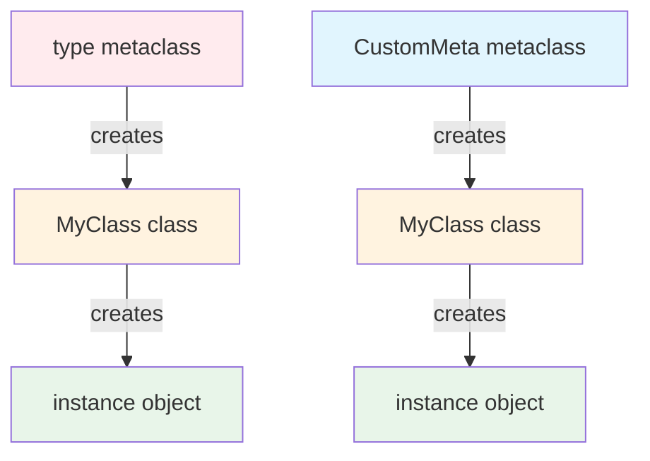
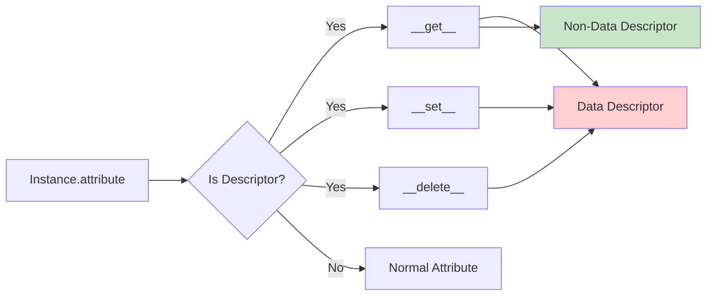

# Advanced Python OOP: Metaclasses, Descriptors, and Protocols

## Learning Objectives
- Master metaclasses and when to use them
- Understand and implement descriptors
- Use protocols for structural subtyping
- Create advanced decorators
- Build custom context managers
- Implement generators and iterators
- Apply advanced OOP patterns used at FAANG companies

## Table of Contents
1. [Metaclasses](#metaclasses)
2. [Descriptors](#descriptors)
3. [Protocols](#protocols)
4. [Advanced Decorators](#advanced-decorators)
5. [Context Managers](#context-managers)
6. [Generators and Iterators](#generators-and-iterators)
7. [Advanced Patterns](#advanced-patterns)

---

## Metaclasses

### What is a Metaclass?

A metaclass is a class of a class. It defines how a class behaves. A class is an instance of a metaclass.



### Basic Metaclass Example

```python
class Meta(type):
    """A simple metaclass."""

    def __new__(mcs, name, bases, namespace, **kwargs):
        """Create a new class.

        Args:
            mcs: The metaclass
            name: Name of the class being created
            bases: Base classes
            namespace: Class namespace (attributes and methods)
            **kwargs: Additional keyword arguments

        Returns:
            New class object
        """
        print(f"Creating class: {name}")
        print(f"  Bases: {bases}")
        print(f"  Attributes: {list(namespace.keys())}")

        # Modify the class before it's created
        namespace['created_by_metaclass'] = True

        # Create the class
        cls = super().__new__(mcs, name, bases, namespace)
        return cls

    def __init__(cls, name, bases, namespace, **kwargs):
        """Initialize the created class.

        Args:
            cls: The class being initialized
            name: Class name
            bases: Base classes
            namespace: Class namespace
            **kwargs: Additional keyword arguments
        """
        print(f"Initializing class: {name}")
        super().__init__(name, bases, namespace)

    def __call__(cls, *args, **kwargs):
        """Called when creating an instance of the class.

        Args:
            *args: Positional arguments
            **kwargs: Keyword arguments

        Returns:
            New instance
        """
        print(f"Creating instance of {cls.__name__}")
        instance = super().__call__(*args, **kwargs)
        return instance


class MyClass(metaclass=Meta):
    """A class using custom metaclass."""

    def __init__(self, value: int) -> None:
        """Initialize instance.

        Args:
            value: Some value
        """
        self.value = value


# Usage
print("=== Creating class ===")
# (Output already shown during class definition)

print("\n=== Creating instance ===")
obj = MyClass(42)
print(f"created_by_metaclass: {MyClass.created_by_metaclass}")  # True
print(f"Value: {obj.value}")  # 42
```

### Practical Metaclass: Singleton Pattern

```python
from typing import Dict, Any, Optional


class SingletonMeta(type):
    """Metaclass for implementing Singleton pattern."""

    _instances: Dict[type, Any] = {}

    def __call__(cls, *args, **kwargs):
        """Ensure only one instance exists.

        Args:
            *args: Positional arguments
            **kwargs: Keyword arguments

        Returns:
            The singleton instance
        """
        if cls not in cls._instances:
            # Create instance if it doesn't exist
            instance = super().__call__(*args, **kwargs)
            cls._instances[cls] = instance
        return cls._instances[cls]


class DatabaseConnection(metaclass=SingletonMeta):
    """Database connection using Singleton pattern."""

    def __init__(self, host: str, port: int) -> None:
        """Initialize connection.

        Args:
            host: Database host
            port: Database port
        """
        self.host = host
        self.port = port
        print(f"Connecting to {host}:{port}")

    def query(self, sql: str) -> str:
        """Execute query.

        Args:
            sql: SQL query

        Returns:
            Query result
        """
        return f"Executing: {sql}"


# Usage
db1 = DatabaseConnection("localhost", 5432)
db2 = DatabaseConnection("remotehost", 5432)  # Same instance, init not called again

print(f"Same instance? {db1 is db2}")  # True
print(f"DB1 host: {db1.host}")  # localhost (first initialization)
```

### Practical Metaclass: Auto-Registration

```python
from typing import Dict, Type


class PluginRegistry(type):
    """Metaclass for automatic plugin registration."""

    plugins: Dict[str, Type] = {}

    def __new__(mcs, name, bases, namespace, **kwargs):
        """Create and register plugin.

        Args:
            mcs: Metaclass
            name: Plugin class name
            bases: Base classes
            namespace: Class namespace
            **kwargs: Additional arguments

        Returns:
            New plugin class
        """
        cls = super().__new__(mcs, name, bases, namespace)

        # Don't register the base Plugin class itself
        if name != 'Plugin':
            # Register plugin by name
            plugin_name = namespace.get('name', name.lower())
            mcs.plugins[plugin_name] = cls
            print(f"Registered plugin: {plugin_name}")

        return cls


class Plugin(metaclass=PluginRegistry):
    """Base plugin class."""

    name: str = ""

    def execute(self) -> None:
        """Execute plugin."""
        pass


class EmailPlugin(Plugin):
    """Email plugin."""

    name = "email"

    def execute(self) -> None:
        """Send email."""
        print("Sending email...")


class SMSPlugin(Plugin):
    """SMS plugin."""

    name = "sms"

    def execute(self) -> None:
        """Send SMS."""
        print("Sending SMS...")


class PushPlugin(Plugin):
    """Push notification plugin."""

    name = "push"

    def execute(self) -> None:
        """Send push notification."""
        print("Sending push notification...")


# Usage
print(f"\nAvailable plugins: {list(PluginRegistry.plugins.keys())}")

# Get and use plugins dynamically
email_plugin = PluginRegistry.plugins['email']()
email_plugin.execute()

sms_plugin = PluginRegistry.plugins['sms']()
sms_plugin.execute()
```

### Practical Metaclass: Validation

```python
from typing import Any, Dict


class ValidationMeta(type):
    """Metaclass for adding validation to classes."""

    def __new__(mcs, name, bases, namespace, **kwargs):
        """Create class with validation.

        Args:
            mcs: Metaclass
            name: Class name
            bases: Base classes
            namespace: Class namespace
            **kwargs: Additional arguments

        Returns:
            New class with validation
        """
        # Extract validation rules
        validations = {}
        for attr_name, attr_value in namespace.items():
            if isinstance(attr_value, Validator):
                validations[attr_name] = attr_value

        # Store validations in class
        namespace['_validations'] = validations

        # Wrap __init__ to add validation
        original_init = namespace.get('__init__')

        def validated_init(self, **kwargs):
            """Initialize with validation."""
            # Validate all attributes
            for attr_name, validator in self._validations.items():
                if attr_name in kwargs:
                    value = kwargs[attr_name]
                    if not validator.validate(value):
                        raise ValueError(
                            f"Validation failed for {attr_name}: {validator.message}"
                        )
                    setattr(self, attr_name, value)

            # Call original init if exists
            if original_init:
                original_init(self, **kwargs)

        namespace['__init__'] = validated_init

        return super().__new__(mcs, name, bases, namespace)


class Validator:
    """Base validator."""

    def __init__(self, message: str = "Validation failed"):
        """Initialize validator.

        Args:
            message: Error message
        """
        self.message = message

    def validate(self, value: Any) -> bool:
        """Validate value.

        Args:
            value: Value to validate

        Returns:
            True if valid
        """
        return True


class RangeValidator(Validator):
    """Range validator."""

    def __init__(self, min_val: float, max_val: float):
        """Initialize range validator.

        Args:
            min_val: Minimum value
            max_val: Maximum value
        """
        super().__init__(f"Value must be between {min_val} and {max_val}")
        self.min_val = min_val
        self.max_val = max_val

    def validate(self, value: float) -> bool:
        """Validate value is in range.

        Args:
            value: Value to validate

        Returns:
            True if in range
        """
        return self.min_val <= value <= self.max_val


class Person(metaclass=ValidationMeta):
    """Person with validated attributes."""

    age = RangeValidator(0, 150)
    score = RangeValidator(0, 100)


# Usage
try:
    person1 = Person(age=25, score=85)
    print(f"Created person: age={person1.age}, score={person1.score}")

    person2 = Person(age=200, score=50)  # Will raise error
except ValueError as e:
    print(f"Validation error: {e}")
```

---

## Descriptors

### What is a Descriptor?

A descriptor is an object attribute with "binding behavior", whose attribute access has been overridden by methods in the descriptor protocol.



### Basic Descriptor

```python
from typing import Any, Optional


class Descriptor:
    """Basic descriptor example."""

    def __init__(self, name: Optional[str] = None):
        """Initialize descriptor.

        Args:
            name: Attribute name
        """
        self.name = name

    def __set_name__(self, owner, name):
        """Called when descriptor is assigned to class attribute.

        Args:
            owner: The class owning this descriptor
            name: Name of the attribute
        """
        self.name = name

    def __get__(self, instance, owner):
        """Get attribute value.

        Args:
            instance: Instance accessing the attribute (None for class access)
            owner: The class owning this descriptor

        Returns:
            Attribute value
        """
        if instance is None:
            return self

        return instance.__dict__.get(self.name)

    def __set__(self, instance, value):
        """Set attribute value.

        Args:
            instance: Instance setting the attribute
            value: New value
        """
        print(f"Setting {self.name} = {value}")
        instance.__dict__[self.name] = value

    def __delete__(self, instance):
        """Delete attribute.

        Args:
            instance: Instance deleting the attribute
        """
        print(f"Deleting {self.name}")
        del instance.__dict__[self.name]


class MyClass:
    """Class using descriptor."""

    x = Descriptor()

    def __init__(self, x: int):
        """Initialize.

        Args:
            x: Value for x
        """
        self.x = x


# Usage
obj = MyClass(10)  # Setting x = 10
print(obj.x)  # 10
obj.x = 20  # Setting x = 20
del obj.x  # Deleting x
```

### Practical Descriptor: Type Validation

```python
from typing import Any, Type


class TypedDescriptor:
    """Descriptor with type validation."""

    def __init__(self, expected_type: Type):
        """Initialize with expected type.

        Args:
            expected_type: Expected type for the attribute
        """
        self.expected_type = expected_type
        self.name = None

    def __set_name__(self, owner, name):
        """Store attribute name.

        Args:
            owner: Owner class
            name: Attribute name
        """
        self.name = name

    def __get__(self, instance, owner):
        """Get value.

        Args:
            instance: Instance accessing attribute
            owner: Owner class

        Returns:
            Attribute value
        """
        if instance is None:
            return self

        return instance.__dict__.get(self.name)

    def __set__(self, instance, value):
        """Set value with type checking.

        Args:
            instance: Instance setting attribute
            value: New value

        Raises:
            TypeError: If value is not of expected type
        """
        if not isinstance(value, self.expected_type):
            raise TypeError(
                f"{self.name} must be {self.expected_type.__name__}, "
                f"got {type(value).__name__}"
            )
        instance.__dict__[self.name] = value


class RangeDescriptor:
    """Descriptor with range validation."""

    def __init__(self, min_value: float, max_value: float):
        """Initialize with range.

        Args:
            min_value: Minimum allowed value
            max_value: Maximum allowed value
        """
        self.min_value = min_value
        self.max_value = max_value
        self.name = None

    def __set_name__(self, owner, name):
        """Store attribute name.

        Args:
            owner: Owner class
            name: Attribute name
        """
        self.name = name

    def __get__(self, instance, owner):
        """Get value.

        Args:
            instance: Instance accessing attribute
            owner: Owner class

        Returns:
            Attribute value
        """
        if instance is None:
            return self

        return instance.__dict__.get(self.name)

    def __set__(self, instance, value):
        """Set value with range validation.

        Args:
            instance: Instance setting attribute
            value: New value

        Raises:
            ValueError: If value is out of range
        """
        if not self.min_value <= value <= self.max_value:
            raise ValueError(
                f"{self.name} must be between {self.min_value} "
                f"and {self.max_value}"
            )
        instance.__dict__[self.name] = value


class Product:
    """Product with validated attributes."""

    name = TypedDescriptor(str)
    price = RangeDescriptor(0.0, 1000000.0)
    stock = RangeDescriptor(0, 1000000)

    def __init__(self, name: str, price: float, stock: int):
        """Initialize product.

        Args:
            name: Product name
            price: Product price
            stock: Stock quantity
        """
        self.name = name
        self.price = price
        self.stock = stock


# Usage
product = Product("Laptop", 999.99, 50)
print(f"{product.name}: ${product.price}")

try:
    product.price = "invalid"  # TypeError
except TypeError as e:
    print(f"Error: {e}")

try:
    product.stock = -10  # ValueError
except ValueError as e:
    print(f"Error: {e}")
```

### Practical Descriptor: Caching Property

```python
import time
from typing import Any, Callable


class CachedProperty:
    """Descriptor implementing cached property."""

    def __init__(self, func: Callable):
        """Initialize with function to cache.

        Args:
            func: Function whose result should be cached
        """
        self.func = func
        self.name = func.__name__

    def __get__(self, instance, owner):
        """Get cached value or compute it.

        Args:
            instance: Instance accessing property
            owner: Owner class

        Returns:
            Cached or computed value
        """
        if instance is None:
            return self

        # Check if value is cached
        cache_attr = f"_cached_{self.name}"
        if not hasattr(instance, cache_attr):
            # Compute and cache the value
            value = self.func(instance)
            setattr(instance, cache_attr, value)

        return getattr(instance, cache_attr)


class DataProcessor:
    """Data processor with expensive operations."""

    def __init__(self, data: list):
        """Initialize with data.

        Args:
            data: Data to process
        """
        self.data = data

    @CachedProperty
    def expensive_operation(self) -> float:
        """Perform expensive calculation (cached).

        Returns:
            Calculated result
        """
        print("Computing expensive operation...")
        time.sleep(1)  # Simulate expensive operation
        return sum(self.data) / len(self.data)


# Usage
processor = DataProcessor([1, 2, 3, 4, 5])

print("First access (will compute):")
result1 = processor.expensive_operation  # Computing expensive operation...
print(f"Result: {result1}")

print("\nSecond access (will use cache):")
result2 = processor.expensive_operation  # No computation
print(f"Result: {result2}")
```

---

## Protocols

### What is a Protocol?

Protocols provide a way to define interfaces using structural subtyping (duck typing) with static type checking.

```python
from typing import Protocol, List


class Drawable(Protocol):
    """Protocol for drawable objects."""

    def draw(self) -> str:
        """Draw the object.

        Returns:
            String representation
        """
        ...

    def get_area(self) -> float:
        """Get area.

        Returns:
            Area of the shape
        """
        ...


class Circle:
    """Circle implementing Drawable protocol."""

    def __init__(self, radius: float):
        """Initialize circle.

        Args:
            radius: Circle radius
        """
        self.radius = radius

    def draw(self) -> str:
        """Draw circle.

        Returns:
            Circle representation
        """
        return f"Circle(radius={self.radius})"

    def get_area(self) -> float:
        """Calculate area.

        Returns:
            Circle area
        """
        return 3.14159 * self.radius ** 2


class Rectangle:
    """Rectangle implementing Drawable protocol."""

    def __init__(self, width: float, height: float):
        """Initialize rectangle.

        Args:
            width: Rectangle width
            height: Rectangle height
        """
        self.width = width
        self.height = height

    def draw(self) -> str:
        """Draw rectangle.

        Returns:
            Rectangle representation
        """
        return f"Rectangle(width={self.width}, height={self.height})"

    def get_area(self) -> float:
        """Calculate area.

        Returns:
            Rectangle area
        """
        return self.width * self.height


def render_shapes(shapes: List[Drawable]) -> None:
    """Render shapes using protocol.

    Args:
        shapes: List of drawable objects
    """
    for shape in shapes:
        print(f"{shape.draw()} - Area: {shape.get_area():.2f}")


# Usage
shapes: List[Drawable] = [
    Circle(5.0),
    Rectangle(4.0, 6.0),
]

render_shapes(shapes)
```

### Runtime Checkable Protocols

```python
from typing import Protocol, runtime_checkable


@runtime_checkable
class Closeable(Protocol):
    """Protocol for closeable resources."""

    def close(self) -> None:
        """Close the resource."""
        ...


class File:
    """File class implementing Closeable."""

    def __init__(self, name: str):
        """Initialize file.

        Args:
            name: File name
        """
        self.name = name
        self.is_open = True

    def close(self) -> None:
        """Close file."""
        self.is_open = False
        print(f"Closed {self.name}")


class Connection:
    """Connection class implementing Closeable."""

    def __init__(self, host: str):
        """Initialize connection.

        Args:
            host: Host address
        """
        self.host = host
        self.is_connected = True

    def close(self) -> None:
        """Close connection."""
        self.is_connected = False
        print(f"Disconnected from {self.host}")


def cleanup_resource(resource: Closeable) -> None:
    """Cleanup any closeable resource.

    Args:
        resource: Resource to close
    """
    if isinstance(resource, Closeable):
        resource.close()
    else:
        print("Resource is not closeable")


# Usage
file = File("data.txt")
conn = Connection("localhost")

cleanup_resource(file)
cleanup_resource(conn)
```

---

## Advanced Decorators

### Class Decorators

```python
from typing import Any, Callable
import functools


def singleton(cls):
    """Decorator to make a class a singleton.

    Args:
        cls: Class to decorate

    Returns:
        Decorated class
    """
    instances = {}

    @functools.wraps(cls)
    def get_instance(*args, **kwargs):
        if cls not in instances:
            instances[cls] = cls(*args, **kwargs)
        return instances[cls]

    return get_instance


@singleton
class Configuration:
    """Configuration singleton."""

    def __init__(self):
        """Initialize configuration."""
        self.settings = {}
        print("Configuration initialized")

    def set(self, key: str, value: Any) -> None:
        """Set configuration value.

        Args:
            key: Setting key
            value: Setting value
        """
        self.settings[key] = value

    def get(self, key: str) -> Any:
        """Get configuration value.

        Args:
            key: Setting key

        Returns:
            Setting value
        """
        return self.settings.get(key)


# Usage
config1 = Configuration()  # Configuration initialized
config2 = Configuration()  # No new initialization

print(f"Same instance? {config1 is config2}")  # True

config1.set("debug", True)
print(f"Debug from config2: {config2.get('debug')}")  # True
```

### Decorator with Arguments

```python
from typing import Callable, Any
import functools
import time


def retry(max_attempts: int = 3, delay: float = 1.0):
    """Decorator to retry function on failure.

    Args:
        max_attempts: Maximum number of retry attempts
        delay: Delay between retries in seconds

    Returns:
        Decorator function
    """
    def decorator(func: Callable) -> Callable:
        @functools.wraps(func)
        def wrapper(*args, **kwargs) -> Any:
            for attempt in range(max_attempts):
                try:
                    return func(*args, **kwargs)
                except Exception as e:
                    if attempt == max_attempts - 1:
                        raise
                    print(f"Attempt {attempt + 1} failed: {e}. Retrying...")
                    time.sleep(delay)
            return None
        return wrapper
    return decorator


@retry(max_attempts=3, delay=0.5)
def unreliable_function(success_rate: float = 0.3) -> str:
    """Function that may fail.

    Args:
        success_rate: Probability of success

    Returns:
        Success message

    Raises:
        Exception: If operation fails
    """
    import random
    if random.random() < success_rate:
        return "Success!"
    raise Exception("Operation failed")


# Usage
try:
    result = unreliable_function(0.3)
    print(result)
except Exception as e:
    print(f"Final failure: {e}")
```

---

## Summary

Advanced OOP concepts covered:
- **Metaclasses**: Controlling class creation
- **Descriptors**: Managing attribute access
- **Protocols**: Structural subtyping
- **Advanced Decorators**: Function and class decoration
- **Context Managers**: Resource management
- **Generators**: Lazy evaluation

### Next Steps
Continue to **04-modern-python-features.md** for:
- Type hints and annotations
- Dataclasses
- Async/await
- Pattern matching

## Interview Questions

### Mid-Level
1. What is a metaclass and when would you use one?
2. Explain the descriptor protocol
3. What is the difference between data and non-data descriptors?
4. How do protocols differ from abstract base classes?

### Senior Level
5. Implement a descriptor for lazy loading
6. Design a metaclass for automatic API registration
7. When would you use a protocol instead of inheritance?
8. Explain the descriptor lookup chain

### Staff Level
9. Design a validation framework using descriptors
10. Implement a caching system using metaclasses
11. Create a plugin architecture using protocols
12. Optimize descriptor performance for production
