# Module 04: Modern Python - Production AI Features

> **Level**: Senior | **Time**: 10-12 hours | **Prerequisites**: Modules 01-03

## Overview

Modern Python provides powerful features that are essential for building production AI systems. This module covers advanced type hints, dataclasses, Pydantic, async patterns, and pattern matching—all applied to AI applications.

### The Evolution of Python for AI

Python has evolved dramatically in recent years, adding features specifically valuable for large-scale AI systems:


### Why These Features Matter for AI

```mermaid
flowchart TB
    subgraph "Without Modern Features"
        A1[Runtime Errors] --> B1[Debug in Production]
        B1 --> C1[❌ User Impact]
    end
    
    subgraph "With Modern Features"
        A2[Type Hints] --> B2[Catch at Development]
        B2 --> C2[✅ No Production Issues]
    end
    
    style A1 fill:#ffcdd2
    style C1 fill:#ffcdd2
    style A2 fill:#c8e6c9
    style C2 fill:#c8e6c9
```



| Feature | What It Provides | AI Application |
|---------|------------------|----------------|
| **Type Hints** | Static type checking | Catch LLM response type errors at dev time |
| **TypeVar/Generics** | Reusable typed containers | `Cache[K, V]`, `Repository[T]` |
| **ParamSpec** | Decorator type preservation | Type-safe `@retry`, `@cache` decorators |
| **Dataclasses** | Concise data containers | `ChatMessage`, `ToolCall`, `AgentConfig` |
| **Pydantic v2** | Runtime validation | Structured outputs, API schemas |
| **Async/await** | Concurrent I/O | Parallel LLM calls, streaming |
| **Pattern Matching** | Structural decomposition | Route tool calls, parse responses |

> **Interview Insight**: FAANG companies expect senior engineers to leverage these modern Python features. Questions like "How would you ensure type safety in an LLM pipeline?" or "How do you handle concurrent API calls?" are common.

---

## 1. Advanced Type Hints for AI Systems

### The Philosophy of Type Safety

In dynamically typed Python, bugs often appear at runtime—the worst possible time. For AI systems that process user data and make API calls, this is especially dangerous:

```mermaid
flowchart LR
    subgraph "Dynamic Typing Risk"
        A[User Input] --> B[LLM Call]
        B --> C{Type Error?}
        C -->|Runtime| D[💥 Production Crash]
    end
```



Type hints shift error detection to development time:

```mermaid
flowchart LR
    subgraph "Static Typing Safety"
        A[User Input] --> B{mypy check}
        B -->|Type Error| C[🛑 Dev Time Fix]
        B -->|OK| D[LLM Call] --> E[✅ Safe Production]
    end
    
    style C fill:#fff3e0
    style E fill:#c8e6c9
```



### Why Type Hints Matter in AI

Type hints provide:
- **Documentation that's always accurate** (unlike comments)
- **IDE autocomplete and navigation**
- **Static analysis with mypy** catches bugs before runtime
- **Safer refactoring** - breaking changes are visible

### Basic Types for AI

```python
from typing import List, Dict, Optional, Union, Any, Literal
from dataclasses import dataclass

# Message roles are a fixed set
Role = Literal["system", "user", "assistant", "tool"]

@dataclass
class ChatMessage:
    role: Role  # Only these 4 values allowed
    content: str
    name: Optional[str] = None  # Optional means: str | None

# LLM response structure
@dataclass
class LLMResponse:
    content: str
    model: str
    usage: Dict[str, int]  # {"prompt_tokens": 10, "completion_tokens": 20}
    finish_reason: Literal["stop", "length", "tool_calls"]

def complete(
    messages: List[ChatMessage],
    model: str = "gpt-4",
    temperature: float = 0.7
) -> LLMResponse:
    """Type hints document the contract clearly."""
    ...
```

### Generics with TypeVar

**The Problem**: You want to write reusable code that works with different types while maintaining type safety.

```mermaid
flowchart TB
    subgraph "Without Generics"
        A1[MessageRepository] --> B1["get() → Any"]
        A2[UserRepository] --> B2["get() → Any"]
        A3[AgentRepository] --> B3["get() → Any"]
        B1 & B2 & B3 --> C1[❌ No type info]
    end
    
    subgraph "With Generic[T]"
        D["Repository[T]"] --> E1["Repository[Message] → Message"]
        D --> E2["Repository[User] → User"]
        D --> E3["Repository[Agent] → Agent"]
        E1 & E2 & E3 --> F[✅ Full type safety]
    end
    
    style C1 fill:#ffcdd2
    style F fill:#c8e6c9
```



**Mental Model**: Think of `Generic[T]` like a template with a blank that gets filled in when you use it:
- `Repository[T]` is the template with a blank
- `Repository[ChatMessage]` fills the blank with `ChatMessage`
- Now `get()` returns `ChatMessage`, not `Any`

```python
from typing import TypeVar, Generic, List, Optional

# T is a placeholder for any type
T = TypeVar('T')

class Repository(Generic[T]):
    """Generic repository pattern.
    
    T is the entity type - could be ChatMessage, User, Agent, etc.
    The same code works for all entities!
    """
    
    def __init__(self) -> None:
        self._items: Dict[str, T] = {}
    
    def add(self, id: str, item: T) -> None:
        self._items[id] = item
    
    def get(self, id: str) -> Optional[T]:
        return self._items.get(id)
    
    def list_all(self) -> List[T]:
        return list(self._items.values())

# Usage - type checker knows the exact types!
message_repo: Repository[ChatMessage] = Repository()
message_repo.add("1", ChatMessage(role="user", content="Hi"))

msg = message_repo.get("1")  # Type: Optional[ChatMessage]
if msg:
    print(msg.content)  # IDE knows msg has .content
```

### Bounded TypeVar

```python
from typing import TypeVar
from abc import ABC, abstractmethod

class LLMProvider(ABC):
    @abstractmethod
    def complete(self, prompt: str) -> str: ...

# T must be a subclass of LLMProvider
T = TypeVar('T', bound=LLMProvider)

class ProviderPool(Generic[T]):
    """Pool of LLM providers with load balancing."""
    
    def __init__(self, providers: List[T]) -> None:
        self._providers = providers
        self._index = 0
    
    def get_next(self) -> T:
        """Round-robin provider selection."""
        provider = self._providers[self._index]
        self._index = (self._index + 1) % len(self._providers)
        return provider

# Only LLMProvider subclasses allowed!
pool: ProviderPool[OpenAILLM] = ProviderPool([OpenAILLM(), OpenAILLM()])
```

### ParamSpec for Decorators

**The Problem**: Decorators lose type information about the wrapped function.

```python
from typing import ParamSpec, TypeVar, Callable
import functools

P = ParamSpec('P')  # Captures parameters
R = TypeVar('R')    # Captures return type

def retry(max_attempts: int = 3):
    """Type-safe retry decorator.
    
    ParamSpec preserves the original function's signature!
    """
    def decorator(func: Callable[P, R]) -> Callable[P, R]:
        @functools.wraps(func)
        def wrapper(*args: P.args, **kwargs: P.kwargs) -> R:
            last_error = None
            for attempt in range(max_attempts):
                try:
                    return func(*args, **kwargs)
                except Exception as e:
                    last_error = e
            raise last_error
        return wrapper
    return decorator

@retry(max_attempts=3)
def call_llm(prompt: str, temperature: float = 0.7) -> str:
    """Original signature is preserved!"""
    ...

# Type checker knows:
# - call_llm takes (prompt: str, temperature: float = 0.7)
# - call_llm returns str
result: str = call_llm("Hello", temperature=0.5)
```

### Protocols for Structural Typing

**The Philosophy**: Protocols bring "duck typing" to static type checking. If it walks like a duck and quacks like a duck, it's a duck—no inheritance required.


```python
from typing import Protocol, runtime_checkable

@runtime_checkable
class Embeddable(Protocol):
    """Anything that can be embedded."""
    
    def to_embedding_text(self) -> str:
        """Convert to text for embedding."""
        ...

# Classes don't need to inherit - just implement the method
class Document:
    def __init__(self, content: str):
        self.content = content
    
    def to_embedding_text(self) -> str:
        return self.content

class WebPage:
    def __init__(self, url: str, html: str):
        self.url = url
        self.html = html
    
    def to_embedding_text(self) -> str:
        return f"{self.url}: {self.html[:500]}"

# Both work with functions expecting Embeddable
def embed(item: Embeddable) -> List[float]:
    text = item.to_embedding_text()
    # Call embedding API...
    return [0.1] * 768

# Runtime checking works!
doc = Document("Hello world")
print(isinstance(doc, Embeddable))  # True
```

---

## 2. Dataclasses for AI Data Structures

### Why Dataclasses?

Dataclasses eliminate boilerplate while providing a clean, typed API for your data structures:


```python
# WITHOUT dataclass - lots of boilerplate
class ChatMessage:
    def __init__(self, role: str, content: str, name: str = None):
        self.role = role
        self.content = content
        self.name = name
    
    def __repr__(self):
        return f"ChatMessage(role={self.role!r}, content={self.content!r})"
    
    def __eq__(self, other):
        return (self.role == other.role and 
                self.content == other.content and
                self.name == other.name)

# WITH dataclass - get __init__, __repr__, __eq__ for free!
from dataclasses import dataclass, field
from typing import Optional, List, Dict
from datetime import datetime

@dataclass
class ChatMessage:
    role: str
    content: str
    name: Optional[str] = None

# That's it! __init__, __repr__, __eq__, __hash__ are auto-generated
```

### Dataclass Options

```python
from dataclasses import dataclass, field, asdict, astuple
from typing import List, Dict, Any, Optional
from datetime import datetime

@dataclass(frozen=True)  # Immutable - for hashable messages
class ImmutableMessage:
    role: str
    content: str
    
    # frozen dataclasses are hashable - can use in sets/dicts
    # msg_set = {ImmutableMessage("user", "Hi")}

@dataclass(order=True)  # Auto-generate __lt__, __le__, etc.
class PrioritizedTask:
    priority: int
    task_name: str = field(compare=False)  # Don't include in comparisons
    
    # Can now sort tasks by priority
    # sorted([PrioritizedTask(2, "B"), PrioritizedTask(1, "A")])

@dataclass(kw_only=True)  # Python 3.10+ - all fields keyword-only
class AgentConfig:
    model: str
    temperature: float = 0.7
    max_tokens: int = 4096
    
    # Must use: AgentConfig(model="gpt-4")
    # Cannot use: AgentConfig("gpt-4")

@dataclass(slots=True)  # Python 3.10+ - memory efficient
class EfficientMessage:
    role: str
    content: str
    # Uses __slots__ automatically - ~40% less memory
```

### Complex Dataclass Patterns

```python
from dataclasses import dataclass, field
from typing import List, Dict, Any, Optional, Callable
from datetime import datetime
import uuid

@dataclass
class ToolCall:
    """Tool call from LLM response."""
    id: str = field(default_factory=lambda: str(uuid.uuid4())[:8])
    name: str = ""
    arguments: Dict[str, Any] = field(default_factory=dict)
    
    def execute(self, tools: Dict[str, Callable]) -> Any:
        """Execute this tool call."""
        if self.name not in tools:
            raise ValueError(f"Unknown tool: {self.name}")
        return tools[self.name](**self.arguments)

@dataclass
class LLMResponse:
    """Complete LLM response with all metadata."""
    content: str
    model: str
    created_at: datetime = field(default_factory=datetime.now)
    finish_reason: str = "stop"
    
    # Mutable defaults need default_factory
    tool_calls: List[ToolCall] = field(default_factory=list)
    usage: Dict[str, int] = field(default_factory=dict)
    
    # Field not included in __repr__
    raw_response: Optional[Dict] = field(default=None, repr=False)
    
    @property
    def total_tokens(self) -> int:
        return self.usage.get("total_tokens", 0)
    
    @property
    def has_tool_calls(self) -> bool:
        return len(self.tool_calls) > 0
    
    def to_dict(self) -> Dict[str, Any]:
        """Convert to dictionary."""
        return asdict(self)
```

### __post_init__ for Validation

```python
@dataclass
class AgentStep:
    """Single step in agent execution."""
    thought: str
    action: str
    action_input: Dict[str, Any]
    observation: Optional[str] = None
    
    def __post_init__(self):
        """Validate after initialization."""
        if not self.thought:
            raise ValueError("Thought cannot be empty")
        
        if self.action not in ["search", "calculate", "finish"]:
            raise ValueError(f"Invalid action: {self.action}")
```

---

## 3. Pydantic v2 for Production AI

### Why Pydantic for AI Systems?


| Feature | Use Case |
|---------|----------|
| **Runtime validation** | Validate LLM structured outputs |
| **Automatic serialization** | JSON for API responses |
| **Schema generation** | OpenAI function calling schemas |
| **Settings management** | Load API keys from environment |

### Basic Pydantic Models

```python
from pydantic import BaseModel, Field, field_validator
from typing import List, Optional, Literal
from datetime import datetime

class ChatMessage(BaseModel):
    """Validated chat message."""
    role: Literal["system", "user", "assistant", "tool"]
    content: str = Field(..., min_length=1, max_length=100000)
    name: Optional[str] = Field(None, max_length=64)
    
    @field_validator('content')
    @classmethod
    def content_not_empty(cls, v: str) -> str:
        if not v.strip():
            raise ValueError('Content cannot be blank')
        return v.strip()

class CompletionRequest(BaseModel):
    """API request for completion."""
    model: str = Field(..., pattern=r'^(gpt-4|gpt-3\.5|claude)')
    messages: List[ChatMessage] = Field(..., min_length=1)
    temperature: float = Field(0.7, ge=0, le=2)
    max_tokens: int = Field(4096, ge=1, le=128000)
    stream: bool = False
    
    model_config = {
        "json_schema_extra": {
            "examples": [{
                "model": "gpt-4",
                "messages": [{"role": "user", "content": "Hello"}],
                "temperature": 0.7
            }]
        }
    }

# Validation happens automatically
try:
    request = CompletionRequest(
        model="gpt-4",
        messages=[{"role": "user", "content": "Hello!"}],
        temperature=2.5  # Invalid! > 2
    )
except Exception as e:
    print(f"Validation error: {e}")
```

### Structured Outputs from LLMs

```python
from pydantic import BaseModel, Field
from typing import List, Optional

class ExtractedEntity(BaseModel):
    """Entity extracted from text."""
    name: str
    entity_type: Literal["person", "organization", "location", "date"]
    confidence: float = Field(..., ge=0, le=1)

class DocumentAnalysis(BaseModel):
    """Structured document analysis."""
    summary: str = Field(..., max_length=500)
    key_points: List[str] = Field(..., max_length=10)
    entities: List[ExtractedEntity]
    sentiment: Literal["positive", "negative", "neutral"]
    
    @classmethod
    def from_llm_response(cls, json_str: str) -> "DocumentAnalysis":
        """Parse and validate LLM JSON response."""
        return cls.model_validate_json(json_str)

# Use with OpenAI function calling
def get_analysis_schema() -> dict:
    """Get JSON schema for OpenAI function calling."""
    return DocumentAnalysis.model_json_schema()
```

### Settings Management

```python
from pydantic_settings import BaseSettings
from pydantic import Field, SecretStr
from typing import Optional

class AISettings(BaseSettings):
    """Application settings from environment."""
    
    # Required - no default
    openai_api_key: SecretStr
    
    # Optional with defaults
    anthropic_api_key: Optional[SecretStr] = None
    
    # With validation
    default_model: str = Field("gpt-4", pattern=r'^(gpt|claude)')
    temperature: float = Field(0.7, ge=0, le=2)
    max_retries: int = Field(3, ge=1, le=10)
    
    # Database settings
    database_url: str = "sqlite:///./app.db"
    redis_url: Optional[str] = None
    
    model_config = {
        "env_file": ".env",
        "env_file_encoding": "utf-8",
        "case_sensitive": False,
    }

# Usage (reads from .env or environment variables)
settings = AISettings()
api_key = settings.openai_api_key.get_secret_value()
```

---

## 4. Async Patterns for AI

### The Philosophy of Async

AI applications are I/O-bound, not CPU-bound. While waiting for an LLM API response (500ms-5s), your program could be doing other work instead of just waiting.


> **Key Insight**: `async/await` enables concurrency without threads. While one API call waits, Python runs other coroutines. This is perfect for LLM applications where the bottleneck is network I/O.

### When to Use Async

| Scenario | Use Async? | Why |
|----------|------------|-----|
| Single LLM call | ❌ No benefit | No concurrency needed |
| Multiple LLM calls | ✅ Yes | Run calls concurrently |
| Streaming responses | ✅ Yes | Process chunks as they arrive |
| Agent with tools | ✅ Yes | Run independent tools concurrently |
| CPU-intensive work | ❌ Use multiprocessing | Async doesn't help CPU-bound |

### Async LLM Client

```python
import asyncio
from typing import List, AsyncIterator
from dataclasses import dataclass

@dataclass
class ChatMessage:
    role: str
    content: str

class AsyncLLMClient:
    """Async LLM client for concurrent operations."""
    
    def __init__(self, api_key: str, model: str = "gpt-4"):
        self.api_key = api_key
        self.model = model
    
    async def complete(self, messages: List[ChatMessage]) -> str:
        """Make async completion request."""
        # Simulate API call
        await asyncio.sleep(0.5)
        return f"Response to: {messages[-1].content}"
    
    async def stream(self, messages: List[ChatMessage]) -> AsyncIterator[str]:
        """Stream response tokens."""
        response = await self.complete(messages)
        for word in response.split():
            await asyncio.sleep(0.05)
            yield word + " "
    
    async def batch_complete(
        self,
        message_lists: List[List[ChatMessage]]
    ) -> List[str]:
        """Process multiple conversations concurrently."""
        tasks = [self.complete(msgs) for msgs in message_lists]
        return await asyncio.gather(*tasks)

# Usage
async def main():
    client = AsyncLLMClient("sk-...")
    
    # Single request
    response = await client.complete([
        ChatMessage("user", "Hello!")
    ])
    
    # Streaming
    async for chunk in client.stream([ChatMessage("user", "Hi")]):
        print(chunk, end="", flush=True)
    
    # Batch processing - 3 calls take ~500ms, not 1500ms
    responses = await client.batch_complete([
        [ChatMessage("user", "Question 1")],
        [ChatMessage("user", "Question 2")],
        [ChatMessage("user", "Question 3")],
    ])

asyncio.run(main())
```

### Async Context Managers

```python
class AsyncConversation:
    """Async context manager for conversations."""
    
    def __init__(self, client: AsyncLLMClient, system_prompt: str):
        self.client = client
        self.system_prompt = system_prompt
        self.messages: List[ChatMessage] = []
    
    async def __aenter__(self) -> "AsyncConversation":
        self.messages = [ChatMessage("system", self.system_prompt)]
        return self
    
    async def __aexit__(self, exc_type, exc_val, exc_tb) -> bool:
        # Save conversation, cleanup, etc.
        print(f"Conversation ended with {len(self.messages)} messages")
        return False
    
    async def send(self, content: str) -> str:
        self.messages.append(ChatMessage("user", content))
        response = await self.client.complete(self.messages)
        self.messages.append(ChatMessage("assistant", response))
        return response

# Usage
async def chat():
    client = AsyncLLMClient("sk-...")
    
    async with AsyncConversation(client, "You are helpful.") as conv:
        response1 = await conv.send("Hello!")
        response2 = await conv.send("What is Python?")
```

---

## 5. Pattern Matching for AI

Pattern matching (Python 3.10+) provides elegant routing and parsing for AI applications:


### Routing Tool Calls

```python
from dataclasses import dataclass
from typing import Dict, Any

@dataclass
class ToolCall:
    name: str
    arguments: Dict[str, Any]

def execute_tool(tool_call: ToolCall) -> str:
    """Route tool calls using pattern matching."""
    
    match tool_call:
        case ToolCall(name="search", arguments={"query": query}):
            return f"Searching for: {query}"
        
        case ToolCall(name="calculate", arguments={"expression": expr}):
            return f"Calculating: {expr} = {eval(expr)}"
        
        case ToolCall(name="weather", arguments={"city": city, "unit": unit}):
            return f"Weather in {city} ({unit}): 22°"
        
        case ToolCall(name="weather", arguments={"city": city}):
            return f"Weather in {city}: 22°C"  # Default unit
        
        case ToolCall(name=name):
            return f"Unknown tool: {name}"
```

### Parsing LLM Responses

```python
def parse_llm_response(response: dict) -> str:
    """Parse various LLM response formats."""
    
    match response:
        # Standard completion
        case {"content": str(content), "finish_reason": "stop"}:
            return content
        
        # Tool calls
        case {"tool_calls": [{"function": {"name": name, "arguments": args}}, *rest]}:
            return f"Tool call: {name}({args})"
        
        # Function call (older format)
        case {"function_call": {"name": name, "arguments": args}}:
            return f"Function: {name}({args})"
        
        # Error response
        case {"error": {"message": msg, "code": code}}:
            raise ValueError(f"API Error {code}: {msg}")
        
        # Streaming chunk
        case {"delta": {"content": str(chunk)}}:
            return chunk
        
        case _:
            raise ValueError(f"Unknown response format: {response}")
```

### Matching Agent Actions

```python
from dataclasses import dataclass
from typing import Literal

@dataclass
class AgentAction:
    action: str
    thought: str
    input: str

def process_agent_step(action: AgentAction) -> str:
    """Process agent action with pattern matching."""
    
    match action:
        case AgentAction(action="Final Answer", input=answer):
            return f"✅ Final: {answer}"
        
        case AgentAction(action="Search", input=query) if len(query) > 100:
            return f"❌ Query too long: {len(query)} chars"
        
        case AgentAction(action="Search", input=query):
            return f"🔍 Searching: {query}"
        
        case AgentAction(action="Calculate", input=expr):
            return f"🔢 Calculating: {expr}"
        
        case AgentAction(action=unknown):
            return f"❓ Unknown action: {unknown}"
```

---

## Common Pitfalls

> **Interview Insight**: Knowing these pitfalls shows production experience.

| Feature | Common Mistake | Correct Approach |
|---------|---------------|------------------|
| **TypeVar** | Using `Any` instead of `TypeVar` | Use `Generic[T]` for type safety |
| **Dataclass** | Mutable default `tools = []` | Use `field(default_factory=list)` |
| **Pydantic** | Catching `Exception` broadly | Catch `ValidationError` specifically |
| **Async** | Blocking calls in async functions | Use `asyncio.to_thread()` for blocking I/O |
| **Pattern Matching** | No fallback case | Always include `case _:` default |

### Pitfall Example: Mutable Defaults

```python
# ❌ BAD: Shared mutable default
@dataclass
class Agent:
    tools: List[str] = []  # BUG! All instances share this list

# ✅ GOOD: Factory creates new list per instance
@dataclass  
class Agent:
    tools: List[str] = field(default_factory=list)
```

---

## Summary

| Topic | Key Takeaway |
|-------|--------------|
| **TypeVar/Generic** | Write reusable code that works with any type |
| **ParamSpec** | Preserve function signatures in decorators |
| **Protocols** | Structural typing - no inheritance needed |
| **Dataclasses** | Automatic `__init__`, `__repr__`, `__eq__` |
| **Pydantic** | Runtime validation + serialization |
| **Async/await** | Concurrent I/O for faster LLM calls |
| **Pattern matching** | Elegant routing and parsing |

---

## Next Steps

Continue to **[Module 05: Design Patterns](05-design-patterns-ai.md)** to learn design patterns applied to AI agent frameworks.

