# Module 05: Design Patterns for AI Agent Systems

> **Level**: Staff/Senior | **Time**: 12-15 hours | **Prerequisites**: Modules 01-04

## Overview

Design patterns are proven solutions to common software design problems. This module covers the patterns most essential for building production AI systems, with examples from LLM clients, agent frameworks, and RAG pipelines.

### The Philosophy of Design Patterns

Design patterns emerged from the "Gang of Four" (GoF) book in 1994, but their principles are timeless. In AI development, patterns help us:

1. **Avoid reinventing solutions** - LLM providers, agent architectures, and RAG pipelines follow common patterns
2. **Communicate effectively** - Saying "use the Adapter pattern" is clearer than explaining the full solution
3. **Build flexible systems** - AI is evolving rapidly; patterns make it easier to swap components

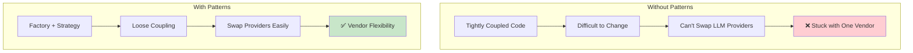

### Pattern Categories

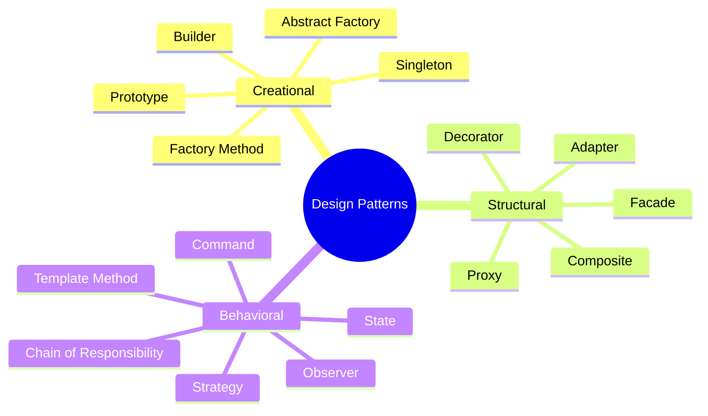

| Category | Purpose | AI Application |
|----------|---------|----------------|
| **Creational** | How objects are created | LLM clients, agent configs |
| **Structural** | How objects are composed | Multi-provider APIs, caching layers |
| **Behavioral** | How objects communicate | Routing, events, pipelines |

> **Interview Insight**: Understanding patterns is essential for Staff+ roles. You'll be asked "How would you design a system that supports multiple LLM providers?" The answer involves Factory, Strategy, and Adapter patterns.

### When to Use Each Pattern

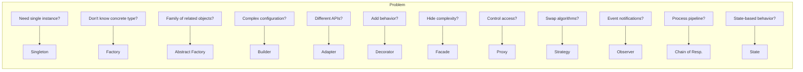

---

## Part 1: Creational Patterns

### 1.1 Singleton - Shared Resources

**Problem**: You need exactly one instance of a class (connection pool, configuration manager).

**AI Use Case**: LLM connection pool that manages API connections across your application.

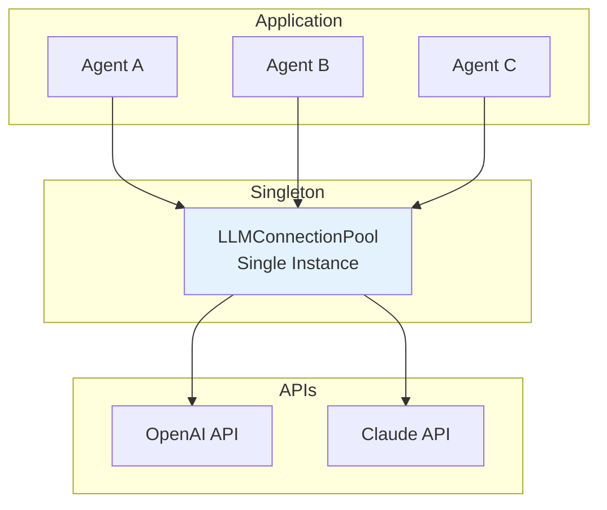

```python
import threading
from typing import Optional, Dict, Any

class LLMConnectionPool:
    """Thread-safe singleton for managing LLM connections.
    
    Why Singleton?
    - Centralized rate limiting
    - Connection reuse across agents
    - Single point for API key management
    """
    
    _instance: Optional["LLMConnectionPool"] = None
    _lock = threading.Lock()
    
    def __new__(cls) -> "LLMConnectionPool":
        if cls._instance is None:
            with cls._lock:
                # Double-check after acquiring lock
                if cls._instance is None:
                    cls._instance = super().__new__(cls)
                    cls._instance._initialized = False
        return cls._instance
    
    def __init__(self) -> None:
        if self._initialized:
            return
        self._connections: Dict[str, Any] = {}
        self._request_count = 0
        self._initialized = True
    
    def get_client(self, provider: str) -> Any:
        """Get or create client for provider."""
        if provider not in self._connections:
            self._connections[provider] = self._create_client(provider)
        return self._connections[provider]
    
    def _create_client(self, provider: str) -> Any:
        # Create actual client connection
        return f"Client for {provider}"

# Usage - same instance everywhere
pool1 = LLMConnectionPool()
pool2 = LLMConnectionPool()
assert pool1 is pool2  # Same instance
```

**When to Use**: Connection pools, configuration managers, logging services, caches.

---

### 1.2 Factory Method - Create Without Knowing Exact Type

**Problem**: Client code shouldn't know the concrete class it's creating.

**AI Use Case**: Create LLM providers without coupling to specific implementations.

```python
from abc import ABC, abstractmethod

class LLMProvider(ABC):
    """Abstract LLM provider."""
    
    @abstractmethod
    def complete(self, prompt: str) -> str:
        pass

class OpenAIProvider(LLMProvider):
    def complete(self, prompt: str) -> str:
        return f"[OpenAI] {prompt}"

class AnthropicProvider(LLMProvider):
    def complete(self, prompt: str) -> str:
        return f"[Claude] {prompt}"

class LLMFactory(ABC):
    """Factory Method pattern - subclasses decide what to create."""
    
    @abstractmethod
    def create_provider(self) -> LLMProvider:
        """Factory method - override in subclasses."""
        pass
    
    def generate(self, prompt: str) -> str:
        """Uses the factory method."""
        provider = self.create_provider()
        return provider.complete(prompt)

class OpenAIFactory(LLMFactory):
    def create_provider(self) -> LLMProvider:
        return OpenAIProvider()

class AnthropicFactory(LLMFactory):
    def create_provider(self) -> LLMProvider:
        return AnthropicProvider()

# Client code works with any factory
def process(factory: LLMFactory, prompt: str) -> str:
    return factory.generate(prompt)

print(process(OpenAIFactory(), "Hello"))     # Uses OpenAI
print(process(AnthropicFactory(), "Hello"))  # Uses Anthropic
```

**When to Use**: When the exact type to create isn't known until runtime.

---

### 1.3 Abstract Factory - Families of Related Objects

**Problem**: You need to create families of related objects that work together.

**AI Use Case**: Create complete AI stacks (LLM + Embedder + VectorStore) that are compatible.

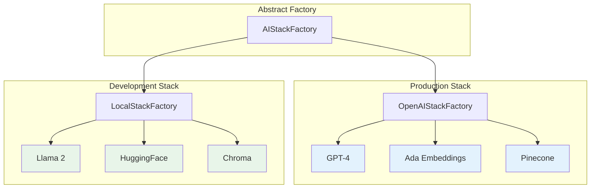

**Key Insight**: Switch entire technology stacks by changing one factory. All components are guaranteed to be compatible.

```python
class AIStackFactory(ABC):
    """Create families of AI components that work together."""
    
    @abstractmethod
    def create_llm(self) -> LLMProvider: pass
    
    @abstractmethod
    def create_embedder(self) -> Embedder: pass
    
    @abstractmethod
    def create_vector_store(self) -> VectorStore: pass

class OpenAIStackFactory(AIStackFactory):
    """Production: OpenAI + Ada + Pinecone"""
    
    def create_llm(self) -> LLMProvider:
        return OpenAIProvider("gpt-4")
    
    def create_embedder(self) -> Embedder:
        return OpenAIEmbedder("text-embedding-ada-002")
    
    def create_vector_store(self) -> VectorStore:
        return PineconeStore()

class LocalStackFactory(AIStackFactory):
    """Development: Local models + Chroma"""
    
    def create_llm(self) -> LLMProvider:
        return OllamaProvider("llama2")
    
    def create_embedder(self) -> Embedder:
        return HuggingFaceEmbedder("all-MiniLM-L6-v2")
    
    def create_vector_store(self) -> VectorStore:
        return ChromaStore()

# Switch entire stack by changing factory
def build_rag(factory: AIStackFactory):
    llm = factory.create_llm()
    embedder = factory.create_embedder()
    store = factory.create_vector_store()
    return RAGSystem(llm, embedder, store)
```

**When to Use**: Swapping entire technology stacks (prod vs dev, cloud vs local).

---

### 1.4 Builder - Complex Object Construction

**Problem**: Objects with many configuration options need step-by-step construction.

**AI Use Case**: Build complex agent configurations with fluent interface.

```python
from dataclasses import dataclass, field
from typing import List

@dataclass
class AgentConfig:
    name: str
    model: str = "gpt-4"
    temperature: float = 0.7
    system_prompt: str = ""
    tools: List[str] = field(default_factory=list)
    max_iterations: int = 10

class AgentBuilder:
    """Fluent builder for agent configuration."""
    
    def __init__(self, name: str):
        self._config = AgentConfig(name=name)
    
    def with_model(self, model: str) -> "AgentBuilder":
        self._config.model = model
        return self
    
    def with_temperature(self, temp: float) -> "AgentBuilder":
        if not 0 <= temp <= 2:
            raise ValueError("Temperature must be 0-2")
        self._config.temperature = temp
        return self
    
    def with_tools(self, *tools: str) -> "AgentBuilder":
        self._config.tools = list(tools)
        return self
    
    def with_system_prompt(self, prompt: str) -> "AgentBuilder":
        self._config.system_prompt = prompt
        return self
    
    def build(self) -> AgentConfig:
        return self._config

# Fluent, readable configuration
agent = (
    AgentBuilder("Research Assistant")
    .with_model("gpt-4")
    .with_temperature(0.3)
    .with_tools("search", "calculator", "code_interpreter")
    .with_system_prompt("You are a helpful research assistant.")
    .build()
)
```

**When to Use**: Complex objects with many optional parameters, readable configuration.

---

### 1.5 Prototype - Clone Existing Objects

**Problem**: Creating objects from scratch is expensive; clone existing ones instead.

**AI Use Case**: Clone agent templates and customize them.

```python
from copy import deepcopy

@dataclass
class AgentTemplate:
    name: str
    config: Dict[str, Any]
    tools: List[str]
    
    def clone(self) -> "AgentTemplate":
        """Deep copy to avoid shared state."""
        return deepcopy(self)

# Base template
base_agent = AgentTemplate(
    name="Base",
    config={"model": "gpt-4", "temperature": 0.7},
    tools=["search"]
)

# Clone and customize
research_agent = base_agent.clone()
research_agent.name = "Researcher"
research_agent.tools.append("arxiv_search")

coding_agent = base_agent.clone()
coding_agent.name = "Coder"
coding_agent.tools = ["code_execute", "file_read"]

# Original unchanged
print(base_agent.tools)  # ["search"]
```

**When to Use**: Template-based object creation, expensive initialization.

---

## Part 2: Structural Patterns

### 2.1 Adapter - Make Incompatible Interfaces Work Together

**Problem**: You have different APIs but need a unified interface.

**AI Use Case**: Unify OpenAI, Anthropic, and other LLM APIs into one interface.

```python
class UnifiedLLMClient(ABC):
    """Target interface - what our app expects."""
    
    @abstractmethod
    def chat(self, messages: List[Dict]) -> str:
        pass

# Actual OpenAI client (different interface)
class OpenAIClient:
    def create_chat_completion(self, model, messages, **kwargs):
        return {"choices": [{"message": {"content": "response"}}]}

# Adapter makes OpenAI match our interface
class OpenAIAdapter(UnifiedLLMClient):
    def __init__(self, client: OpenAIClient, model: str = "gpt-4"):
        self._client = client
        self._model = model
    
    def chat(self, messages: List[Dict]) -> str:
        response = self._client.create_chat_completion(
            model=self._model,
            messages=messages
        )
        return response["choices"][0]["message"]["content"]

# Same adapter pattern for Anthropic
class AnthropicAdapter(UnifiedLLMClient):
    def __init__(self, client, model: str = "claude-3-opus"):
        self._client = client
        self._model = model
    
    def chat(self, messages: List[Dict]) -> str:
        response = self._client.messages.create(
            model=self._model,
            messages=messages
        )
        return response.content[0].text

# Application code works with any adapter
def run_agent(llm: UnifiedLLMClient, task: str):
    return llm.chat([{"role": "user", "content": task}])
```

**When to Use**: Integrating third-party APIs, legacy system integration.

---

### 2.2 Decorator - Add Behavior Dynamically

**Problem**: Add features to objects without modifying their classes.

**AI Use Case**: Add logging, caching, retry logic to LLM calls.

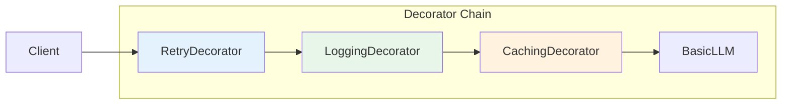

The decorator pattern lets you **stack behaviors** like layers. Each decorator wraps the next, adding its own logic before/after calling the wrapped component.

```python
class LLMService(ABC):
    @abstractmethod
    def complete(self, prompt: str) -> str:
        pass

class BasicLLM(LLMService):
    def complete(self, prompt: str) -> str:
        return f"Response to: {prompt}"

class LLMDecorator(LLMService):
    """Base decorator - wraps another service."""
    
    def __init__(self, wrapped: LLMService):
        self._wrapped = wrapped
    
    def complete(self, prompt: str) -> str:
        return self._wrapped.complete(prompt)

class LoggingDecorator(LLMDecorator):
    def complete(self, prompt: str) -> str:
        print(f"[LOG] Calling LLM: {prompt[:50]}...")
        result = self._wrapped.complete(prompt)
        print(f"[LOG] Response: {len(result)} chars")
        return result

class CachingDecorator(LLMDecorator):
    def __init__(self, wrapped: LLMService):
        super().__init__(wrapped)
        self._cache: Dict[str, str] = {}
    
    def complete(self, prompt: str) -> str:
        if prompt in self._cache:
            return self._cache[prompt]
        result = self._wrapped.complete(prompt)
        self._cache[prompt] = result
        return result

class RetryDecorator(LLMDecorator):
    def __init__(self, wrapped: LLMService, max_retries: int = 3):
        super().__init__(wrapped)
        self._max_retries = max_retries
    
    def complete(self, prompt: str) -> str:
        for attempt in range(self._max_retries):
            try:
                return self._wrapped.complete(prompt)
            except Exception as e:
                if attempt == self._max_retries - 1:
                    raise
        return ""

# Stack decorators
service = BasicLLM()
service = CachingDecorator(service)
service = LoggingDecorator(service)
service = RetryDecorator(service)

# Now has caching, logging, AND retry!
```

**When to Use**: Cross-cutting concerns (logging, caching, auth), optional features.

---

### 2.3 Facade - Simplify Complex Subsystems

**Problem**: Complex system with many classes - need simple interface.

**AI Use Case**: Simple RAG interface hiding document loaders, embedders, vector stores.

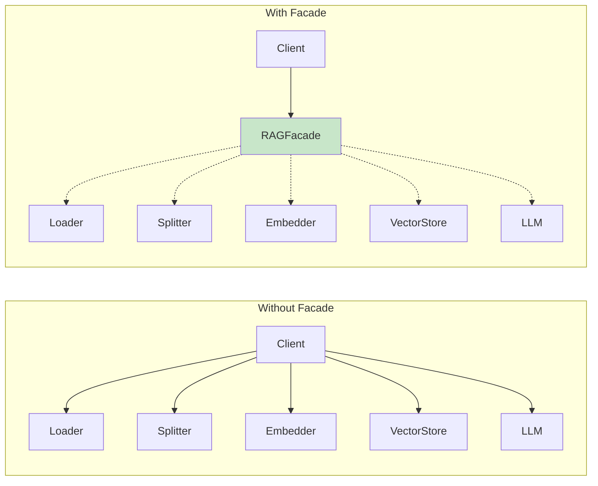

**Key Insight**: Client only needs to know about 2 methods (`index()`, `query()`) instead of managing 5 different subsystems.

```python
class RAGFacade:
    """Simple interface to complex RAG system."""
    
    def __init__(self):
        self._loader = DocumentLoader()
        self._splitter = TextSplitter()
        self._embedder = EmbeddingModel()
        self._store = VectorStore()
        self._llm = LLMClient()
    
    def index(self, documents: List[str]) -> int:
        """One method hides 4 operations."""
        chunks = []
        for doc in documents:
            text = self._loader.load(doc)
            chunks.extend(self._splitter.split(text))
        
        embeddings = self._embedder.embed(chunks)
        self._store.add(chunks, embeddings)
        return len(chunks)
    
    def query(self, question: str) -> str:
        """Simple query, complex pipeline underneath."""
        query_embedding = self._embedder.embed([question])[0]
        relevant_docs = self._store.search(query_embedding)
        
        context = "\n".join(relevant_docs)
        return self._llm.complete(f"Context: {context}\n\nQuestion: {question}")

# Simple usage
rag = RAGFacade()
rag.index(["doc1.pdf", "doc2.pdf"])
answer = rag.query("What is the main topic?")
```

**When to Use**: Simplifying complex APIs, providing convenience methods.

---

### 2.4 Proxy - Control Access to Objects

**Problem**: Need to control access, add lazy loading, or cache results.

**AI Use Case**: Rate limiting, lazy model loading, caching expensive calls.

```python
class LLMProxy:
    """Proxy controls access to expensive LLM."""
    
    def __init__(self, max_requests_per_minute: int = 60):
        self._llm: Optional[ExpensiveLLM] = None  # Lazy
        self._request_count = 0
        self._max_rpm = max_requests_per_minute
        self._cache: Dict[str, str] = {}
    
    def complete(self, prompt: str) -> str:
        # Rate limiting (protection proxy)
        if self._request_count >= self._max_rpm:
            raise RateLimitError("Too many requests")
        
        # Caching (caching proxy)
        if prompt in self._cache:
            return self._cache[prompt]
        
        # Lazy loading (virtual proxy)
        if self._llm is None:
            self._llm = ExpensiveLLM()  # Only load when needed
        
        self._request_count += 1
        result = self._llm.complete(prompt)
        self._cache[prompt] = result
        return result
```

**When to Use**: Lazy loading, access control, caching, logging.

---

### 2.5 Composite - Tree Structures

**Problem**: Treat individual objects and compositions uniformly.

**AI Use Case**: Agent teams with nested sub-teams.

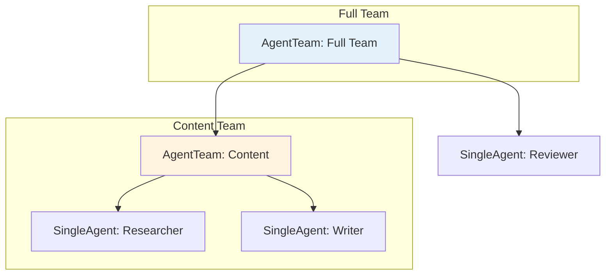

**Key Insight**: Both `SingleAgent` and `AgentTeam` implement the same `Agent` interface. You can nest teams arbitrarily deep and call `execute()` on any node.

```python
class Agent(ABC):
    @abstractmethod
    def execute(self, task: str) -> str:
        pass

class SingleAgent(Agent):
    def __init__(self, name: str, specialty: str):
        self.name = name
        self.specialty = specialty
    
    def execute(self, task: str) -> str:
        return f"[{self.name}] Completed {self.specialty} task"

class AgentTeam(Agent):
    """Composite - can contain agents or other teams."""
    
    def __init__(self, name: str):
        self.name = name
        self._members: List[Agent] = []
    
    def add(self, agent: Agent) -> None:
        self._members.append(agent)
    
    def execute(self, task: str) -> str:
        results = [member.execute(task) for member in self._members]
        return f"[{self.name}] Combined {len(results)} results"

# Build hierarchy
researcher = SingleAgent("Researcher", "research")
writer = SingleAgent("Writer", "writing")
reviewer = SingleAgent("Reviewer", "review")

content_team = AgentTeam("Content")
content_team.add(researcher)
content_team.add(writer)

full_team = AgentTeam("Full Team")
full_team.add(content_team)  # Nested!
full_team.add(reviewer)

# Same interface for single agent or team
result = full_team.execute("Create article")
```

**When to Use**: Hierarchies, recursive structures, uniform treatment.

---

## Part 3: Behavioral Patterns

### 3.1 Strategy - Swappable Algorithms

**Problem**: Need to switch between different algorithms at runtime.

**AI Use Case**: Switch between LLM providers based on task complexity or cost.

```python
class CompletionStrategy(ABC):
    @abstractmethod
    def complete(self, prompt: str) -> str: pass
    
    @abstractmethod
    def cost_per_token(self) -> float: pass

class GPT4Strategy(CompletionStrategy):
    def complete(self, prompt: str) -> str:
        return "[GPT-4 High Quality Response]"
    
    def cost_per_token(self) -> float:
        return 0.00003

class GPT35Strategy(CompletionStrategy):
    def complete(self, prompt: str) -> str:
        return "[GPT-3.5 Fast Response]"
    
    def cost_per_token(self) -> float:
        return 0.000002

class Assistant:
    def __init__(self, strategy: CompletionStrategy):
        self._strategy = strategy
    
    def set_strategy(self, strategy: CompletionStrategy):
        """Switch strategy at runtime."""
        self._strategy = strategy
    
    def respond(self, prompt: str) -> str:
        return self._strategy.complete(prompt)

# Switch based on complexity
assistant = Assistant(GPT35Strategy())  # Default: cheap
if is_complex_task(prompt):
    assistant.set_strategy(GPT4Strategy())  # Complex: quality
```

**When to Use**: Multiple algorithms for same task, runtime selection.

---

### 3.2 Observer - Event Notification

**Problem**: Objects need to be notified when something changes.

**AI Use Case**: Agent events for logging, metrics, alerts.

```python
class AgentObserver(ABC):
    @abstractmethod
    def on_event(self, event_type: str, data: Dict): pass

class MetricsCollector(AgentObserver):
    def on_event(self, event_type: str, data: Dict):
        # Track agent performance
        metrics.increment(event_type)

class AlertSystem(AgentObserver):
    def on_event(self, event_type: str, data: Dict):
        if event_type == "error":
            send_alert(data)

class ObservableAgent:
    def __init__(self):
        self._observers: List[AgentObserver] = []
    
    def add_observer(self, observer: AgentObserver):
        self._observers.append(observer)
    
    def _notify(self, event_type: str, data: Dict):
        for observer in self._observers:
            observer.on_event(event_type, data)
    
    def execute(self, task: str):
        self._notify("task_started", {"task": task})
        result = self._do_work(task)
        self._notify("task_completed", {"result": result})
        return result
```

**When to Use**: Event systems, pub/sub, monitoring, loose coupling.

---

### 3.3 Chain of Responsibility - Processing Pipeline

**Problem**: Pass request through chain of handlers.

**AI Use Case**: Message processing pipeline (validate → filter → enrich → process).

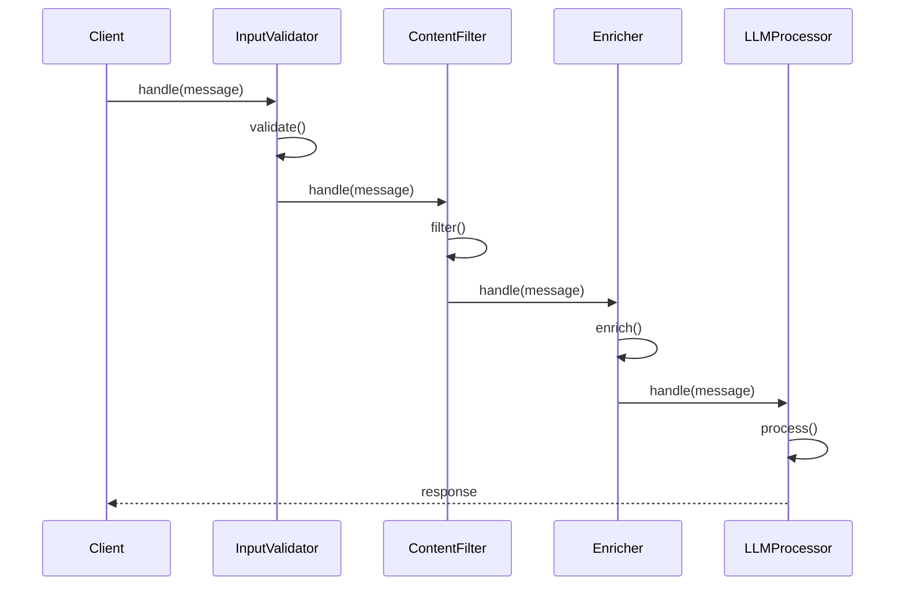

**Key Insight**: Each handler either processes the request and passes it on, or stops the chain. Handlers are decoupled from each other.

```python
class Handler(ABC):
    def __init__(self):
        self._next: Optional[Handler] = None
    
    def set_next(self, handler: "Handler") -> "Handler":
        self._next = handler
        return handler
    
    def handle(self, message: Message) -> Message:
        message = self._process(message)
        if self._next and not message.should_stop:
            return self._next.handle(message)
        return message
    
    @abstractmethod
    def _process(self, message: Message) -> Message: pass

class InputValidator(Handler):
    def _process(self, message: Message) -> Message:
        if len(message.content) < 2:
            message.should_stop = True
        return message

class ContentFilter(Handler):
    def _process(self, message: Message) -> Message:
        # Filter harmful content
        return message

class LLMProcessor(Handler):
    def _process(self, message: Message) -> Message:
        message.response = llm.complete(message.content)
        return message

# Build pipeline
validator = InputValidator()
filter = ContentFilter()
processor = LLMProcessor()

validator.set_next(filter).set_next(processor)

# Process message through chain
result = validator.handle(Message("Hello"))
```

**When to Use**: Processing pipelines, middleware, request handling.

---

### 3.4 Command - Encapsulate Actions

**Problem**: Need to queue, undo, or log operations.

**AI Use Case**: Undo/redo for agent actions, action history.

```python
class Command(ABC):
    @abstractmethod
    def execute(self) -> str: pass
    
    @abstractmethod
    def undo(self) -> str: pass

class AddTextCommand(Command):
    def __init__(self, document, text: str):
        self._document = document
        self._text = text
    
    def execute(self) -> str:
        self._document.append(self._text)
        return f"Added: {self._text}"
    
    def undo(self) -> str:
        self._document.remove_last(len(self._text))
        return f"Removed: {self._text}"

class CommandHistory:
    def __init__(self):
        self._history: List[Command] = []
    
    def execute(self, command: Command):
        command.execute()
        self._history.append(command)
    
    def undo(self):
        if self._history:
            self._history.pop().undo()
```

**When to Use**: Undo/redo, transactional operations, command queues.

---

### 3.5 State - State-Dependent Behavior

**Problem**: Object behavior changes based on internal state.

**AI Use Case**: Agent lifecycle states (idle → thinking → executing → done).

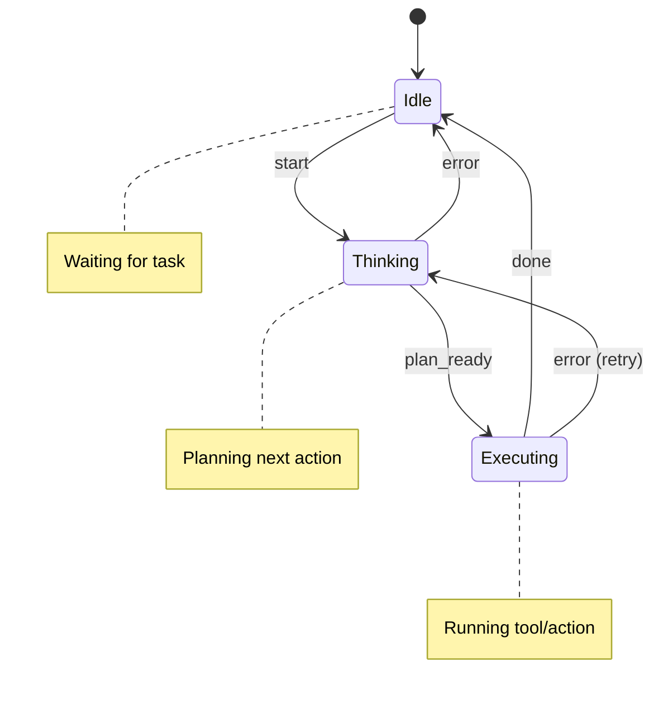

```python
class AgentState(ABC):
    @abstractmethod
    def handle(self, agent, input: str) -> str: pass

class IdleState(AgentState):
    def handle(self, agent, input: str) -> str:
        if input == "start":
            agent.set_state(ThinkingState())
            return "Starting..."
        return "Waiting..."

class ThinkingState(AgentState):
    def handle(self, agent, input: str) -> str:
        if input == "plan_ready":
            agent.set_state(ExecutingState())
            return "Executing..."
        return "Thinking..."

class ExecutingState(AgentState):
    def handle(self, agent, input: str) -> str:
        if input == "done":
            agent.set_state(IdleState())
            return "Complete!"
        return "Working..."

class StatefulAgent:
    def __init__(self):
        self._state = IdleState()
    
    def set_state(self, state: AgentState):
        self._state = state
    
    def process(self, input: str) -> str:
        return self._state.handle(self, input)
```

**When to Use**: State machines, workflow engines, game AI.

---

### 3.6 Template Method - Algorithm Skeleton

**Problem**: Define algorithm structure, let subclasses customize steps.

**AI Use Case**: Different LLM workflows (chat, code, analysis) with same structure.

```python
class LLMWorkflow(ABC):
    def execute(self, prompt: str) -> str:
        """Template method - fixed algorithm structure."""
        processed = self._preprocess(prompt)
        if not self._validate(processed):
            return "Invalid input"
        response = self._call_llm(processed)
        return self._postprocess(response)
    
    def _preprocess(self, prompt: str) -> str:
        return prompt.strip()  # Default, can override
    
    def _validate(self, prompt: str) -> bool:
        return len(prompt) > 0  # Default, can override
    
    @abstractmethod
    def _call_llm(self, prompt: str) -> str:
        """Subclasses must implement."""
        pass
    
    def _postprocess(self, response: str) -> str:
        return response  # Default, can override

class ChatWorkflow(LLMWorkflow):
    def _preprocess(self, prompt: str) -> str:
        return f"User: {prompt}\nAssistant:"
    
    def _call_llm(self, prompt: str) -> str:
        return "[Chat response]"

class CodeWorkflow(LLMWorkflow):
    def _preprocess(self, prompt: str) -> str:
        return f"Write Python code: {prompt}"
    
    def _call_llm(self, prompt: str) -> str:
        return "```python\nprint('hello')\n```"
    
    def _postprocess(self, response: str) -> str:
        # Extract code block
        return response.split("```python")[1].split("```")[0]
```

**When to Use**: Similar algorithms with minor variations, enforcing structure.

---

## Pattern Selection Guide

| If You Need... | Use |
|----------------|-----|
| Single shared instance | Singleton |
| Create objects without knowing concrete type | Factory Method |
| Create families of related objects | Abstract Factory |
| Complex object with many options | Builder |
| Clone existing objects | Prototype |
| Unify different interfaces | Adapter |
| Add behavior without modifying class | Decorator |
| Simple interface to complex system | Facade |
| Control access, lazy loading, caching | Proxy |
| Tree structures, recursive processing | Composite |
| Interchangeable algorithms | Strategy |
| Event notification | Observer |
| Processing pipeline | Chain of Responsibility |
| Encapsulate and queue actions | Command |
| State-dependent behavior | State |
| Algorithm skeleton with customizable steps | Template Method |

---

## Pattern Combinations for AI Systems

Patterns often work together. Here's a common combination for multi-provider LLM systems:

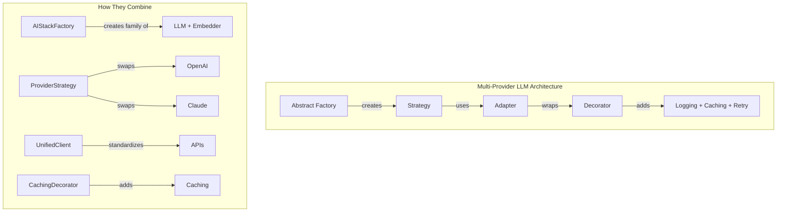

**Real-World Example Flow**:
1. **Abstract Factory** creates a compatible set (LLM, Embedder, VectorStore)
2. **Strategy** allows runtime switching between providers
3. **Adapter** normalizes different API formats to a common interface
4. **Decorator** adds logging, caching, retry without modifying core logic

---

## Common Anti-Patterns

> **Interview Insight**: Knowing when NOT to use a pattern is as important as knowing when to use it.

| Pattern | Anti-Pattern | Why It's Wrong |
|---------|--------------|----------------|
| **Singleton** | Using for everything | Creates hidden dependencies, hard to test |
| **Factory** | Factory that creates one type | Unnecessary complexity, just use constructor |
| **Decorator** | Deep nesting (10+ decorators) | Hard to debug, performance overhead |
| **Facade** | Facade that does everything | Becomes a "god class", breaks SRP |
| **Strategy** | Only two strategies ever | If-else is simpler for 2 cases |
| **Observer** | Circular notifications | Event loops, stack overflow |
| **Singleton** | Mutable global state | Concurrency bugs, unpredictable behavior |

### Anti-Pattern Example: Overusing Singleton

```python
# ❌ BAD: Everything is a singleton
class UserServiceSingleton:
    _instance = None
    # This makes testing nearly impossible!

# ✅ GOOD: Use dependency injection instead
class UserService:
    def __init__(self, db: Database):
        self.db = db  # Inject dependencies, easy to mock
```

---

## Next Steps

Continue to **[Module 06: SOLID & Clean Architecture](06-solid-architecture.md)** to learn how to structure large AI applications.

