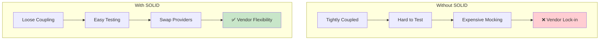
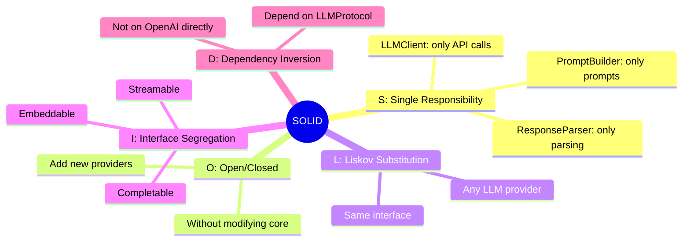
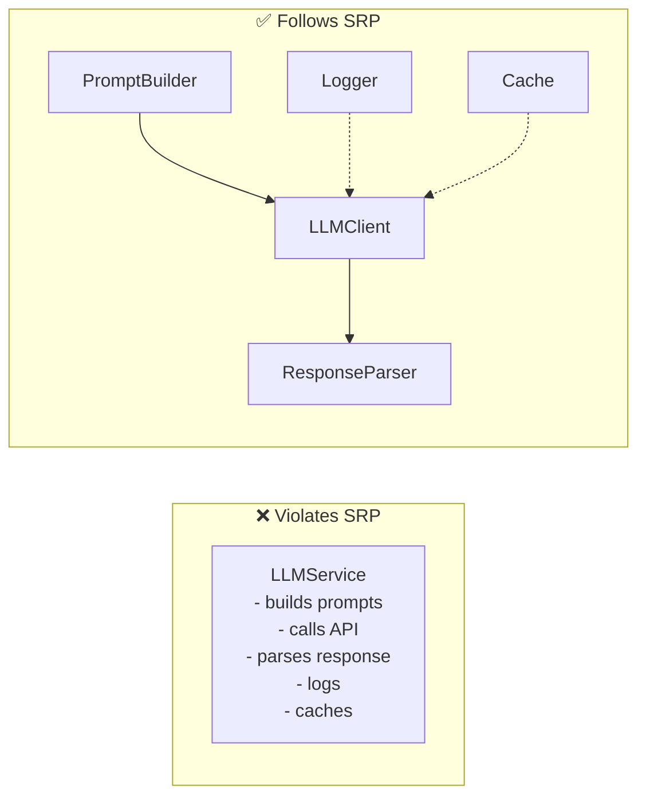
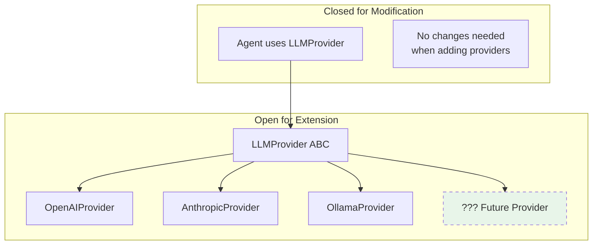
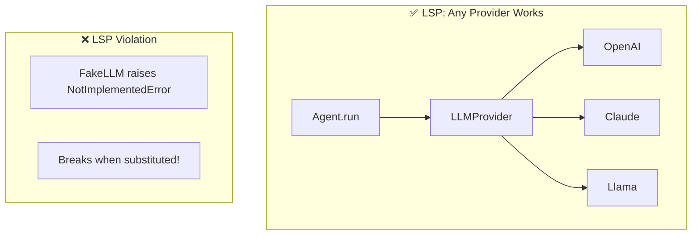
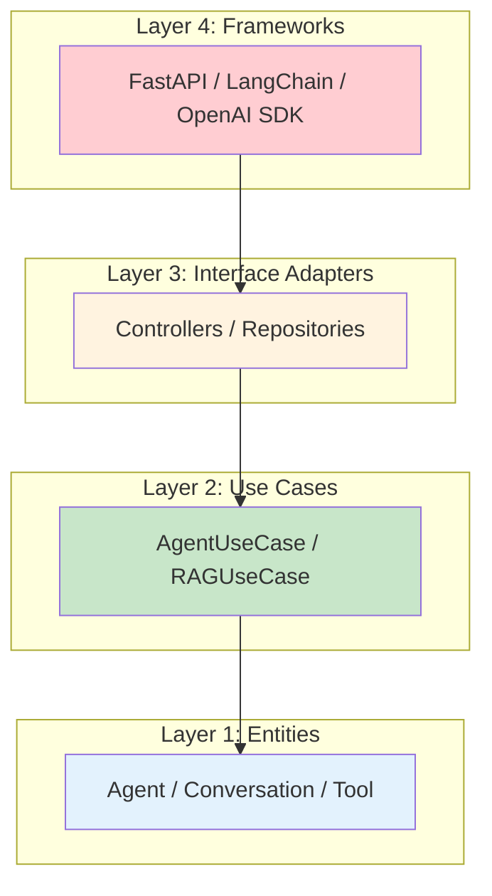

# Module 06: SOLID Principles & Clean Architecture for AI Systems

> **Level**: Staff/Senior | **Time**: 12-15 hours | **Prerequisites**: Modules 01-05

## Overview

SOLID principles and Clean Architecture are essential for building maintainable, scalable AI systems. This module applies these fundamental software engineering principles to LLM applications, agents, and RAG systems.

### Why SOLID Matters for AI

AI systems face unique architectural challenges:
- **Rapidly evolving LLM providers** - Switch from OpenAI to Anthropic seamlessly
- **Multiple model versions** - Support GPT-3.5, GPT-4, Claude concurrently
- **Complex pipelines** - RAG, agents, tool calling all need clean separation
- **Testing requirements** - Mock expensive API calls during development



### SOLID Overview



> **Interview Insight**: FAANG Staff+ interviews focus heavily on SOLID. "Design a multi-provider LLM system" is a common question—the answer is DIP + Factory.

---

## Part 1: SOLID Principles for AI

### S - Single Responsibility Principle

**Principle**: A class should have only one reason to change.

**AI Application**: Separate LLM interaction, prompt building, and response parsing.



```python
# ❌ BAD: One class doing everything
class LLMService:
    def generate(self, user_input: str) -> str:
        # Builds prompt
        prompt = f"System: You are helpful.\nUser: {user_input}"
        
        # Calls API
        response = openai.chat.completions.create(
            model="gpt-4",
            messages=[{"role": "user", "content": prompt}]
        )
        
        # Parses response
        text = response.choices[0].message.content
        
        # Logs
        print(f"Generated: {text[:50]}...")
        
        # Caches
        self._cache[user_input] = text
        
        return text


# ✅ GOOD: Each class has one responsibility
@dataclass
class PromptBuilder:
    """Builds prompts only."""
    system_prompt: str = "You are a helpful assistant."
    
    def build(self, user_input: str) -> List[Dict[str, str]]:
        return [
            {"role": "system", "content": self.system_prompt},
            {"role": "user", "content": user_input},
        ]


class LLMClient:
    """Calls LLM API only."""
    
    def __init__(self, model: str = "gpt-4"):
        self.model = model
    
    def complete(self, messages: List[Dict[str, str]]) -> str:
        response = openai.chat.completions.create(
            model=self.model,
            messages=messages
        )
        return response.choices[0].message.content


class ResponseParser:
    """Parses LLM responses only."""
    
    def extract_json(self, response: str) -> Dict:
        return json.loads(response)
    
    def extract_code(self, response: str) -> str:
        match = re.search(r'```python\n(.*?)```', response, re.DOTALL)
        return match.group(1) if match else ""


# Usage - compose them together
builder = PromptBuilder(system_prompt="You are a code assistant.")
client = LLMClient(model="gpt-4")
parser = ResponseParser()

messages = builder.build("Write a hello world function")
response = client.complete(messages)
code = parser.extract_code(response)
```

**When to Apply**: Whenever a class has multiple reasons to change.

---

### O - Open/Closed Principle

**Principle**: Software entities should be open for extension but closed for modification.

**AI Application**: Add new LLM providers without modifying existing code.



```python
from abc import ABC, abstractmethod

# Base abstraction (closed for modification)
class LLMProvider(ABC):
    """Abstract LLM provider - modify this and all code breaks."""
    
    @abstractmethod
    def complete(self, messages: List[Dict]) -> str:
        pass
    
    @abstractmethod
    def get_model_name(self) -> str:
        pass


# Extensions (open for extension - add freely)
class OpenAIProvider(LLMProvider):
    def __init__(self, model: str = "gpt-4"):
        self.model = model
    
    def complete(self, messages: List[Dict]) -> str:
        response = openai.chat.completions.create(
            model=self.model, messages=messages
        )
        return response.choices[0].message.content
    
    def get_model_name(self) -> str:
        return f"openai/{self.model}"


class AnthropicProvider(LLMProvider):
    def __init__(self, model: str = "claude-3-opus"):
        self.model = model
    
    def complete(self, messages: List[Dict]) -> str:
        response = anthropic.messages.create(
            model=self.model, messages=messages
        )
        return response.content[0].text
    
    def get_model_name(self) -> str:
        return f"anthropic/{self.model}"


# Add new provider without modifying ANYTHING above
class OllamaProvider(LLMProvider):
    def __init__(self, model: str = "llama2"):
        self.model = model
    
    def complete(self, messages: List[Dict]) -> str:
        response = requests.post(
            "http://localhost:11434/api/chat",
            json={"model": self.model, "messages": messages}
        )
        return response.json()["message"]["content"]
    
    def get_model_name(self) -> str:
        return f"ollama/{self.model}"


# Agent code works with any provider - never needs to change!
class Agent:
    def __init__(self, llm: LLMProvider):
        self.llm = llm
    
    def run(self, task: str) -> str:
        messages = [{"role": "user", "content": task}]
        return self.llm.complete(messages)
```

---

### L - Liskov Substitution Principle

**Principle**: Objects of a superclass should be replaceable with objects of subclasses.

**AI Application**: Any LLM provider can replace another without breaking the system.



```python
# ❌ BAD: Violates LSP - throws exception instead of returning string
class BrokenProvider(LLMProvider):
    def complete(self, messages: List[Dict]) -> str:
        raise NotImplementedError("Use complete_async instead!")  # BREAKS LSP
    
    async def complete_async(self, messages: List[Dict]) -> str:
        return "response"


# ✅ GOOD: All providers behave consistently
class MockProvider(LLMProvider):
    """Mock for testing - fully substitutable."""
    
    def __init__(self, response: str = "Mock response"):
        self.response = response
        self.call_count = 0
    
    def complete(self, messages: List[Dict]) -> str:
        self.call_count += 1
        return self.response  # Same return type, no exceptions
    
    def get_model_name(self) -> str:
        return "mock"


# Test with mock - works identically to real provider
def test_agent():
    mock = MockProvider(response="Test output")
    agent = Agent(llm=mock)
    
    result = agent.run("Test task")
    
    assert result == "Test output"
    assert mock.call_count == 1  # Verify call was made
```

---

### I - Interface Segregation Principle

**Principle**: Clients should not be forced to depend on interfaces they don't use.

**AI Application**: Separate interfaces for completion, embedding, and streaming.

```mermaid
flowchart LR
    subgraph "❌ Fat Interface"
        F[LLMProvider<br/>complete()<br/>embed()<br/>stream()<br/>finetune()]
    end
    
    subgraph "✅ Segregated Interfaces"
        C[Completable<br/>complete()]
        E[Embeddable<br/>embed()]
        S[Streamable<br/>stream()]
    end
    
    OAI[OpenAI] --> C
    OAI --> E
    OAI --> S
    
    LOC[Local Model] --> C
    LOC --> E
```

```python
from abc import ABC, abstractmethod
from typing import Protocol, AsyncIterator

# Segregated interfaces
class Completable(Protocol):
    """Interface for text completion."""
    def complete(self, messages: List[Dict]) -> str: ...

class Embeddable(Protocol):
    """Interface for embeddings."""
    def embed(self, texts: List[str]) -> List[List[float]]: ...

class Streamable(Protocol):
    """Interface for streaming responses."""
    async def stream(self, messages: List[Dict]) -> AsyncIterator[str]: ...


# OpenAI implements all interfaces
class OpenAIProvider(Completable, Embeddable, Streamable):
    def complete(self, messages: List[Dict]) -> str:
        return openai.chat.completions.create(...)
    
    def embed(self, texts: List[str]) -> List[List[float]]:
        return openai.embeddings.create(...)
    
    async def stream(self, messages: List[Dict]) -> AsyncIterator[str]:
        async for chunk in openai.chat.completions.create(stream=True, ...):
            yield chunk


# Ollama only implements completion - that's fine!
class OllamaProvider(Completable):
    def complete(self, messages: List[Dict]) -> str:
        return requests.post(...)  # No embed or stream needed


# Functions only require what they need
def generate_response(llm: Completable, prompt: str) -> str:
    """Only needs Completable - works with any provider."""
    return llm.complete([{"role": "user", "content": prompt}])


def build_index(embedder: Embeddable, documents: List[str]) -> List[List[float]]:
    """Only needs Embeddable - won't work with Ollama, and that's OK."""
    return embedder.embed(documents)
```

---

### D - Dependency Inversion Principle

**Principle**: Depend on abstractions, not concretions.

**AI Application**: Agent depends on `LLMProtocol`, not on `OpenAI` directly.

```mermaid
flowchart TB
    subgraph "❌ Without DIP"
        A1[Agent] --> O1[OpenAI]
        Note1[Tightly coupled<br/>Hard to test<br/>Vendor locked]
    end
    
    subgraph "✅ With DIP"
        A2[Agent] --> P[LLMProtocol]
        P <|.. O2[OpenAI]
        P <|.. C2[Claude]
        P <|.. M2[Mock]
    end
    
    style P fill:#e3f2fd
```

```python
from abc import ABC, abstractmethod

# Abstraction (interface)
class LLMProtocol(ABC):
    @abstractmethod
    def complete(self, prompt: str) -> str:
        pass


# High-level module depends on abstraction
class ResearchAgent:
    def __init__(self, llm: LLMProtocol):  # Depends on abstraction
        self.llm = llm
    
    def research(self, topic: str) -> str:
        return self.llm.complete(f"Research: {topic}")


# Low-level modules implement abstraction
class OpenAILLM(LLMProtocol):
    def complete(self, prompt: str) -> str:
        return openai.chat.completions.create(...)


class MockLLM(LLMProtocol):
    def complete(self, prompt: str) -> str:
        return f"Mock response for: {prompt}"


# Dependency injection at composition root
def create_agent(environment: str) -> ResearchAgent:
    if environment == "production":
        return ResearchAgent(llm=OpenAILLM())
    else:
        return ResearchAgent(llm=MockLLM())
```

---

## Part 2: Clean Architecture for AI

### The Layered Approach



**Key Rule**: Dependencies point inward. Outer layers depend on inner layers, never the reverse.

### AI System Clean Architecture Example

```python
# ==================== LAYER 1: ENTITIES ====================
from dataclasses import dataclass, field
from typing import List, Optional
from datetime import datetime

@dataclass
class Message:
    """Core domain entity - pure data, no external deps."""
    role: str
    content: str
    timestamp: datetime = field(default_factory=datetime.now)

@dataclass
class Conversation:
    """Aggregate root for a conversation."""
    id: str
    messages: List[Message] = field(default_factory=list)
    
    def add_message(self, role: str, content: str) -> Message:
        msg = Message(role=role, content=content)
        self.messages.append(msg)
        return msg
    
    def get_context(self, limit: int = 10) -> List[Message]:
        return self.messages[-limit:]


# ==================== LAYER 2: USE CASES ====================
class ChatUseCase:
    """Business logic - orchestrates but has no framework deps."""
    
    def __init__(
        self,
        llm_gateway: "LLMGateway",
        conversation_repo: "ConversationRepository"
    ):
        self.llm_gateway = llm_gateway
        self.conversation_repo = conversation_repo
    
    def send_message(self, conversation_id: str, user_message: str) -> str:
        # Get or create conversation
        conversation = self.conversation_repo.get(conversation_id)
        if not conversation:
            conversation = Conversation(id=conversation_id)
        
        # Add user message
        conversation.add_message("user", user_message)
        
        # Generate response via gateway
        context = conversation.get_context()
        response = self.llm_gateway.generate(context)
        
        # Add assistant message
        conversation.add_message("assistant", response)
        
        # Persist
        self.conversation_repo.save(conversation)
        
        return response


# ==================== LAYER 3: INTERFACE ADAPTERS ====================
from abc import ABC, abstractmethod

class LLMGateway(ABC):
    """Port for LLM interaction - no framework deps."""
    
    @abstractmethod
    def generate(self, messages: List[Message]) -> str:
        pass


class ConversationRepository(ABC):
    """Port for persistence - no framework deps."""
    
    @abstractmethod
    def get(self, conversation_id: str) -> Optional[Conversation]:
        pass
    
    @abstractmethod
    def save(self, conversation: Conversation) -> None:
        pass


# ==================== LAYER 4: FRAMEWORKS ====================
class OpenAIGateway(LLMGateway):
    """OpenAI implementation - knows about openai library."""
    
    def __init__(self, model: str = "gpt-4"):
        self.model = model
        self.client = openai.OpenAI()
    
    def generate(self, messages: List[Message]) -> str:
        formatted = [{"role": m.role, "content": m.content} for m in messages]
        response = self.client.chat.completions.create(
            model=self.model,
            messages=formatted
        )
        return response.choices[0].message.content


class RedisConversationRepository(ConversationRepository):
    """Redis implementation - knows about redis library."""
    
    def __init__(self, redis_client):
        self.redis = redis_client
    
    def get(self, conversation_id: str) -> Optional[Conversation]:
        data = self.redis.get(f"conv:{conversation_id}")
        return Conversation(**json.loads(data)) if data else None
    
    def save(self, conversation: Conversation) -> None:
        self.redis.set(f"conv:{conversation.id}", json.dumps(asdict(conversation)))


# ==================== COMPOSITION ROOT ====================
def create_chat_use_case() -> ChatUseCase:
    """Wire dependencies at startup."""
    llm = OpenAIGateway(model="gpt-4")
    repo = RedisConversationRepository(redis.Redis())
    return ChatUseCase(llm_gateway=llm, conversation_repo=repo)
```

---

## Part 3: Common Violations & How to Fix

> **Interview Insight**: Being able to identify SOLID violations shows senior-level thinking.

| Violation | Smell | Fix |
|-----------|-------|-----|
| **SRP** | Class has 5+ methods doing unrelated things | Split into focused classes |
| **OCP** | Giant if/elif chain for providers | Use Strategy pattern + factories |
| **LSP** | Subclass raises NotImplementedError | Refactor inheritance hierarchy |
| **ISP** | Interface requires 10+ methods | Split into focused protocols |
| **DIP** | `import openai` in business logic | Inject via constructor |

### Anti-Pattern: The God LLM Class

```python
# ❌ BAD: Violates ALL SOLID principles
class LLMService:
    def __init__(self):
        self.openai = openai.OpenAI()  # DIP violation
        self.cache = {}
        self.logger = logging.getLogger()
    
    def chat(self, prompt):
        # SRP violation: caching, logging, API call all in one
        if prompt in self.cache:
            self.logger.info("Cache hit")
            return self.cache[prompt]
        
        # OCP violation: hardcoded to OpenAI
        response = self.openai.chat.completions.create(...)
        
        self.cache[prompt] = response
        self.logger.info("API call made")
        return response
    
    def embed(self, text):  # ISP violation: not all callers need this
        return self.openai.embeddings.create(...)
```

---

## Summary

| Principle | AI Application |
|-----------|----------------|
| **SRP** | Separate clients, parsers, loggers |
| **OCP** | Add providers via new classes, not modifications |
| **LSP** | Any LLM provider works anywhere LLMProtocol is used |
| **ISP** | Completable, Embeddable, Streamable protocols |
| **DIP** | Inject LLMProtocol, not concrete OpenAI |

---

## Next Steps

Continue to **[Module 07: Production Backend](07-production-backend.md)** to build a complete FastAPI + PostgreSQL + Redis AI application.
