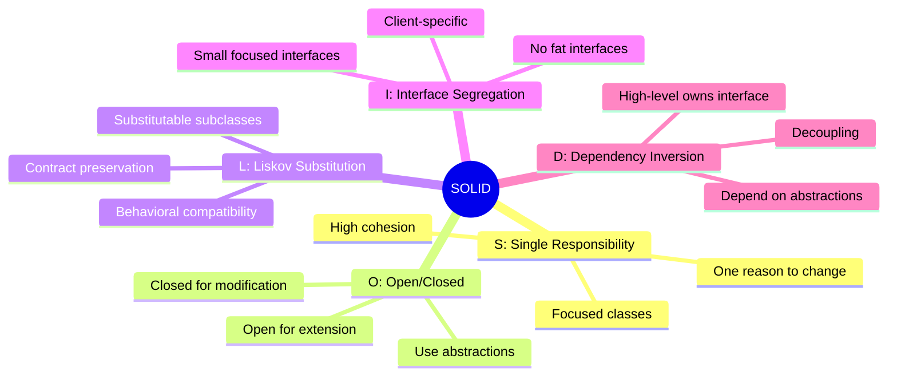
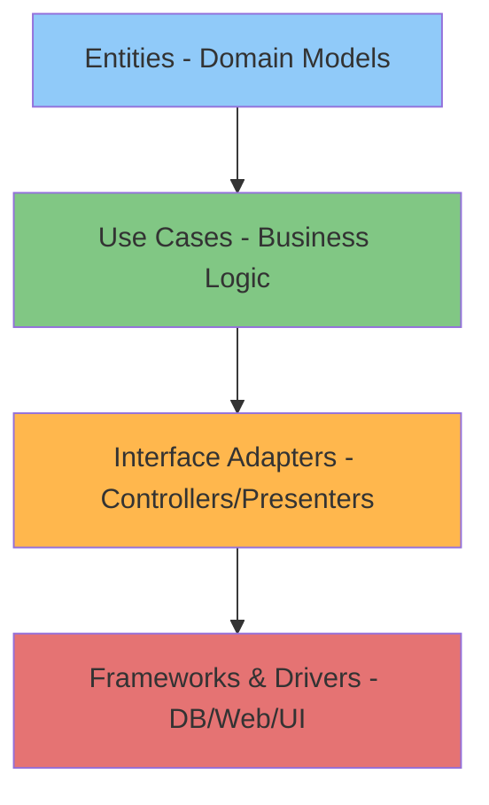

# SOLID Principles & Clean Architecture

## Learning Objectives
- Master all five SOLID principles
- Understand clean architecture principles
- Apply hexagonal architecture patterns
- Implement domain-driven design (DDD)
- Build production-ready, maintainable systems
- Make architectural decisions like senior engineers at FAANG

## Table of Contents
1. [SOLID Principles](#solid-principles)
2. [Clean Architecture](#clean-architecture)
3. [Hexagonal Architecture](#hexagonal-architecture)
4. [Domain-Driven Design](#domain-driven-design)
5. [Production Patterns](#production-patterns)

---

## SOLID Principles



---

### 1. Single Responsibility Principle (SRP)

**Principle**: A class should have only one reason to change.

```python
# Bad: Multiple responsibilities
class User:
    """User class with too many responsibilities."""

    def __init__(self, username: str, email: str):
        self.username = username
        self.email = email

    def save_to_database(self) -> None:
        """Save user to database."""
        # Database logic
        pass

    def send_welcome_email(self) -> None:
        """Send welcome email."""
        # Email logic
        pass

    def generate_report(self) -> str:
        """Generate user report."""
        # Reporting logic
        pass


# Good: Single responsibility for each class
from dataclasses import dataclass


@dataclass
class User:
    """User model - only data and domain logic."""
    username: str
    email: str

    def is_valid_email(self) -> bool:
        """Validate email format."""
        return '@' in self.email


class UserRepository:
    """Handles user persistence."""

    def save(self, user: User) -> None:
        """Save user to database."""
        print(f"Saving {user.username} to database")


class EmailService:
    """Handles email operations."""

    def send_welcome_email(self, user: User) -> None:
        """Send welcome email to user."""
        print(f"Sending welcome email to {user.email}")


class UserReportGenerator:
    """Generates user reports."""

    def generate_report(self, user: User) -> str:
        """Generate user report."""
        return f"Report for {user.username}"


# Usage
user = User("alice", "alice@example.com")
repository = UserRepository()
email_service = EmailService()
report_generator = UserReportGenerator()

repository.save(user)
email_service.send_welcome_email(user)
report = report_generator.generate_report(user)
```

---

### 2. Open/Closed Principle (OCP)

**Principle**: Software entities should be open for extension but closed for modification.

```python
from abc import ABC, abstractmethod


# Bad: Modifying existing code for new shapes
class AreaCalculator:
    """Calculate area (violates OCP)."""

    def calculate_area(self, shapes: List[Any]) -> float:
        """Calculate total area."""
        total_area = 0.0
        for shape in shapes:
            if isinstance(shape, Circle):
                total_area += 3.14 * shape.radius ** 2
            elif isinstance(shape, Rectangle):
                total_area += shape.width * shape.height
            # Need to modify this for every new shape!
        return total_area


# Good: Open for extension, closed for modification
class Shape(ABC):
    """Abstract shape."""

    @abstractmethod
    def area(self) -> float:
        """Calculate area."""
        pass


class Circle(Shape):
    """Circle shape."""

    def __init__(self, radius: float):
        self.radius = radius

    def area(self) -> float:
        """Calculate circle area."""
        return 3.14 * self.radius ** 2


class Rectangle(Shape):
    """Rectangle shape."""

    def __init__(self, width: float, height: float):
        self.width = width
        self.height = height

    def area(self) -> float:
        """Calculate rectangle area."""
        return self.width * self.height


class Triangle(Shape):
    """Triangle shape - new shape without modifying AreaCalculator."""

    def __init__(self, base: float, height: float):
        self.base = base
        self.height = height

    def area(self) -> float:
        """Calculate triangle area."""
        return 0.5 * self.base * self.height


class AreaCalculator:
    """Calculate area (follows OCP)."""

    def calculate_total_area(self, shapes: List[Shape]) -> float:
        """Calculate total area."""
        return sum(shape.area() for shape in shapes)


# Usage - can add new shapes without modifying AreaCalculator
shapes = [
    Circle(5.0),
    Rectangle(4.0, 6.0),
    Triangle(3.0, 4.0),  # New shape added without changes
]

calculator = AreaCalculator()
total = calculator.calculate_total_area(shapes)
print(f"Total area: {total}")
```

---

### 3. Liskov Substitution Principle (LSP)

**Principle**: Objects of a superclass should be replaceable with objects of subclasses without breaking the application.

```python
# Bad: Violates LSP
class Bird:
    """Base bird class."""

    def fly(self) -> str:
        """Fly behavior."""
        return "Flying"


class Penguin(Bird):
    """Penguin can't fly - violates LSP."""

    def fly(self) -> str:
        """Penguin can't fly!"""
        raise NotImplementedError("Penguins can't fly!")


# Good: Follows LSP
class Bird(ABC):
    """Abstract bird."""

    @abstractmethod
    def move(self) -> str:
        """Move behavior."""
        pass


class FlyingBird(Bird):
    """Bird that can fly."""

    def move(self) -> str:
        """Fly."""
        return "Flying"

    def fly(self) -> str:
        """Fly behavior."""
        return "Flying through the air"


class FlightlessBird(Bird):
    """Bird that cannot fly."""

    def move(self) -> str:
        """Walk."""
        return "Walking"


class Sparrow(FlyingBird):
    """Sparrow can fly."""
    pass


class Penguin(FlightlessBird):
    """Penguin cannot fly."""

    def swim(self) -> str:
        """Swim behavior."""
        return "Swimming"


def make_bird_move(bird: Bird) -> None:
    """Make any bird move."""
    print(bird.move())


# Usage - all birds can be substituted
make_bird_move(Sparrow())  # Flying
make_bird_move(Penguin())  # Walking
```

---

### 4. Interface Segregation Principle (ISP)

**Principle**: Clients should not be forced to depend on interfaces they don't use.

```python
# Bad: Fat interface
class Worker(ABC):
    """Fat interface - not all workers need all methods."""

    @abstractmethod
    def work(self) -> None:
        pass

    @abstractmethod
    def eat(self) -> None:
        pass

    @abstractmethod
    def sleep(self) -> None:
        pass


class Robot(Worker):
    """Robot doesn't eat or sleep!"""

    def work(self) -> None:
        print("Robot working")

    def eat(self) -> None:
        # Robot doesn't eat!
        raise NotImplementedError("Robots don't eat")

    def sleep(self) -> None:
        # Robot doesn't sleep!
        raise NotImplementedError("Robots don't sleep")


# Good: Segregated interfaces
class Workable(ABC):
    """Workable interface."""

    @abstractmethod
    def work(self) -> None:
        pass


class Eatable(ABC):
    """Eatable interface."""

    @abstractmethod
    def eat(self) -> None:
        pass


class Sleepable(ABC):
    """Sleepable interface."""

    @abstractmethod
    def sleep(self) -> None:
        pass


class Human(Workable, Eatable, Sleepable):
    """Human implements all interfaces."""

    def work(self) -> None:
        print("Human working")

    def eat(self) -> None:
        print("Human eating")

    def sleep(self) -> None:
        print("Human sleeping")


class Robot(Workable):
    """Robot only implements Workable."""

    def work(self) -> None:
        print("Robot working")


# Usage
def make_worker_work(worker: Workable) -> None:
    """Make worker work."""
    worker.work()


human = Human()
robot = Robot()

make_worker_work(human)  # OK
make_worker_work(robot)  # OK
```

---

### 5. Dependency Inversion Principle (DIP)

**Principle**: High-level modules should not depend on low-level modules. Both should depend on abstractions.

```python
# Bad: High-level depends on low-level
class MySQLDatabase:
    """Low-level MySQL database."""

    def save(self, data: str) -> None:
        print(f"Saving to MySQL: {data}")


class UserService:
    """High-level service depends on MySQL directly."""

    def __init__(self):
        self.database = MySQLDatabase()  # Tight coupling!

    def create_user(self, username: str) -> None:
        self.database.save(username)


# Good: Both depend on abstraction
class Database(ABC):
    """Database abstraction."""

    @abstractmethod
    def save(self, data: str) -> None:
        pass


class MySQLDatabase(Database):
    """MySQL implementation."""

    def save(self, data: str) -> None:
        print(f"Saving to MySQL: {data}")


class PostgreSQLDatabase(Database):
    """PostgreSQL implementation."""

    def save(self, data: str) -> None:
        print(f"Saving to PostgreSQL: {data}")


class UserService:
    """High-level service depends on abstraction."""

    def __init__(self, database: Database):
        self.database = database  # Depends on abstraction

    def create_user(self, username: str) -> None:
        self.database.save(username)


# Usage - easy to switch implementations
mysql_service = UserService(MySQLDatabase())
postgres_service = UserService(PostgreSQLDatabase())

mysql_service.create_user("alice")
postgres_service.create_user("bob")
```

---

## Clean Architecture

### Layers of Clean Architecture



### Clean Architecture Example

```python
# Layer 1: Entities (Domain Models)
@dataclass
class User:
    """Core domain entity."""
    id: Optional[int]
    username: str
    email: str


# Layer 2: Use Cases (Business Logic)
class CreateUserUseCase:
    """Use case for creating users."""

    def __init__(self, user_repository: "UserRepository"):
        self.user_repository = user_repository

    def execute(self, username: str, email: str) -> User:
        """Execute use case.

        Args:
            username: Username
            email: Email

        Returns:
            Created user

        Raises:
            ValueError: If validation fails
        """
        # Business rules
        if len(username) < 3:
            raise ValueError("Username too short")

        if '@' not in email:
            raise ValueError("Invalid email")

        # Create and save
        user = User(id=None, username=username, email=email)
        return self.user_repository.save(user)


# Layer 3: Interface Adapters (Repositories)
class UserRepository(ABC):
    """Abstract user repository."""

    @abstractmethod
    def save(self, user: User) -> User:
        pass

    @abstractmethod
    def find_by_id(self, user_id: int) -> Optional[User]:
        pass


class InMemoryUserRepository(UserRepository):
    """In-memory repository implementation."""

    def __init__(self):
        self._users: Dict[int, User] = {}
        self._next_id = 1

    def save(self, user: User) -> User:
        if user.id is None:
            user.id = self._next_id
            self._next_id += 1
        self._users[user.id] = user
        return user

    def find_by_id(self, user_id: int) -> Optional[User]:
        return self._users.get(user_id)


# Layer 4: Frameworks & Drivers (Web Controller)
class UserController:
    """Web controller."""

    def __init__(self, create_user_use_case: CreateUserUseCase):
        self.create_user_use_case = create_user_use_case

    def create_user_endpoint(self, request_data: Dict[str, str]) -> Dict[str, Any]:
        """HTTP endpoint for creating user."""
        try:
            user = self.create_user_use_case.execute(
                username=request_data['username'],
                email=request_data['email']
            )
            return {'status': 'success', 'user_id': user.id}
        except ValueError as e:
            return {'status': 'error', 'message': str(e)}


# Dependency Injection (wiring it all together)
repository = InMemoryUserRepository()
use_case = CreateUserUseCase(repository)
controller = UserController(use_case)

# Usage
response = controller.create_user_endpoint({
    'username': 'alice',
    'email': 'alice@example.com'
})
print(response)  # {'status': 'success', 'user_id': 1}
```

---

## Hexagonal Architecture

### Hexagonal Architecture Pattern

```python
# Core Domain
class Order:
    """Order domain model."""

    def __init__(self, order_id: str, items: List[str], total: float):
        self.order_id = order_id
        self.items = items
        self.total = total
        self.status = "pending"

    def confirm(self) -> None:
        """Confirm order."""
        self.status = "confirmed"


# Port (Interface)
class OrderRepository(ABC):
    """Repository port."""

    @abstractmethod
    def save(self, order: Order) -> None:
        pass

    @abstractmethod
    def find(self, order_id: str) -> Optional[Order]:
        pass


class PaymentGateway(ABC):
    """Payment gateway port."""

    @abstractmethod
    def process_payment(self, amount: float) -> bool:
        pass


# Application Service
class OrderService:
    """Application service (hexagon core)."""

    def __init__(
        self,
        order_repository: OrderRepository,
        payment_gateway: PaymentGateway
    ):
        self.order_repository = order_repository
        self.payment_gateway = payment_gateway

    def place_order(self, order_id: str, items: List[str], total: float) -> bool:
        """Place order."""
        # Create order
        order = Order(order_id, items, total)

        # Process payment
        payment_successful = self.payment_gateway.process_payment(total)

        if not payment_successful:
            return False

        # Confirm and save order
        order.confirm()
        self.order_repository.save(order)

        return True


# Adapters (Implementations)
class InMemoryOrderRepository(OrderRepository):
    """In-memory repository adapter."""

    def __init__(self):
        self._orders: Dict[str, Order] = {}

    def save(self, order: Order) -> None:
        self._orders[order.order_id] = order

    def find(self, order_id: str) -> Optional[Order]:
        return self._orders.get(order_id)


class StripePaymentGateway(PaymentGateway):
    """Stripe payment adapter."""

    def process_payment(self, amount: float) -> bool:
        print(f"Processing ${amount} payment via Stripe")
        return True


# Usage (Dependency Injection)
repository = InMemoryOrderRepository()
payment = StripePaymentGateway()
service = OrderService(repository, payment)

success = service.place_order("ORD001", ["item1", "item2"], 99.99)
print(f"Order placed: {success}")
```

---

## Domain-Driven Design

### DDD Building Blocks

```python
# Value Object
@dataclass(frozen=True)
class Money:
    """Value object for money."""
    amount: float
    currency: str

    def __post_init__(self):
        if self.amount < 0:
            raise ValueError("Amount cannot be negative")

    def add(self, other: "Money") -> "Money":
        """Add money."""
        if self.currency != other.currency:
            raise ValueError("Cannot add different currencies")
        return Money(self.amount + other.amount, self.currency)


# Entity
class Product:
    """Product entity."""

    def __init__(self, product_id: str, name: str, price: Money):
        self.product_id = product_id  # Identity
        self.name = name
        self.price = price

    def __eq__(self, other):
        """Entities are equal if IDs match."""
        if not isinstance(other, Product):
            return False
        return self.product_id == other.product_id


# Aggregate Root
class ShoppingCart:
    """Shopping cart aggregate root."""

    def __init__(self, cart_id: str):
        self.cart_id = cart_id
        self._items: List[Tuple[Product, int]] = []

    def add_product(self, product: Product, quantity: int) -> None:
        """Add product to cart."""
        if quantity <= 0:
            raise ValueError("Quantity must be positive")
        self._items.append((product, quantity))

    def total(self) -> Money:
        """Calculate total."""
        if not self._items:
            return Money(0.0, "USD")

        total_amount = sum(
            product.price.amount * quantity
            for product, quantity in self._items
        )
        return Money(total_amount, self._items[0][0].price.currency)


# Domain Service
class PricingService:
    """Domain service for pricing logic."""

    def apply_discount(self, original_price: Money, discount_percentage: float) -> Money:
        """Apply discount."""
        if not 0 <= discount_percentage <= 100:
            raise ValueError("Discount must be 0-100")

        discounted_amount = original_price.amount * (1 - discount_percentage / 100)
        return Money(discounted_amount, original_price.currency)


# Usage
product = Product("P001", "Laptop", Money(999.99, "USD"))
cart = ShoppingCart("CART001")
cart.add_product(product, 2)

pricing = PricingService()
discounted_price = pricing.apply_discount(product.price, 10)

print(f"Original: ${product.price.amount}")
print(f"Discounted: ${discounted_price.amount}")
print(f"Cart total: ${cart.total().amount}")
```

---

## Summary

### SOLID Principles Quick Reference

| Principle | Key Point | Benefit |
|-----------|-----------|---------|
| **S**RP | One responsibility per class | Easy to understand and maintain |
| **O**CP | Extend without modifying | Stable, flexible code |
| **L**SP | Subtypes must be substitutable | Reliable inheritance |
| **I**SP | Small, focused interfaces | No unused dependencies |
| **D**IP | Depend on abstractions | Decoupled, testable |

### Architecture Principles

- **Clean Architecture**: Separate concerns by layers
- **Hexagonal Architecture**: Isolate core business logic
- **DDD**: Model complex business domains

### Next Steps
Continue to **07-backend-production-patterns.md** for backend engineering patterns.

## Interview Questions

### Mid-Level
1. Explain each SOLID principle with examples
2. What is the difference between SRP and ISP?
3. How does DIP enable testing?
4. What are the layers of clean architecture?

### Senior Level
5. Design a payment system following SOLID
6. Implement hexagonal architecture for e-commerce
7. Refactor legacy code using SOLID principles
8. Build a DDD-based booking system

### Staff Level
9. Architect a microservices system with clean architecture
10. Design domain models for complex business rules
11. Evaluate trade-offs between different architectures
12. Lead architectural decisions for large systems
