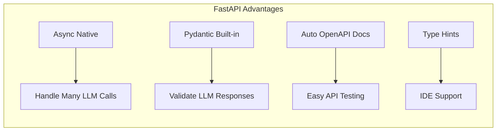
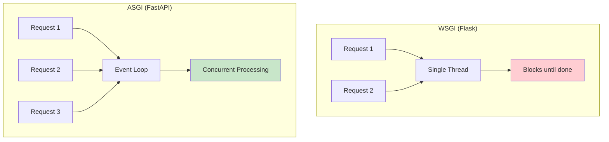
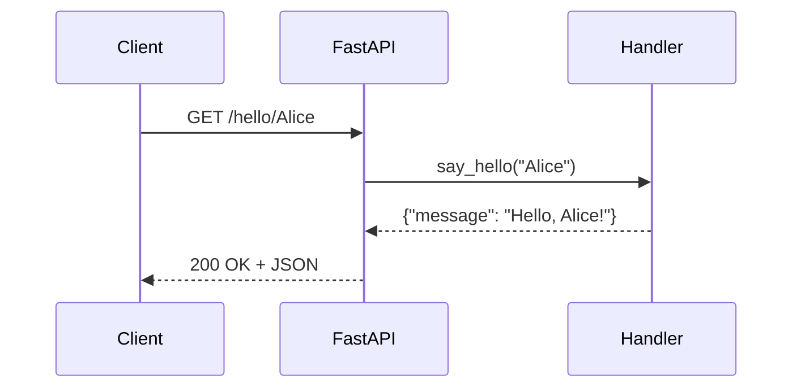
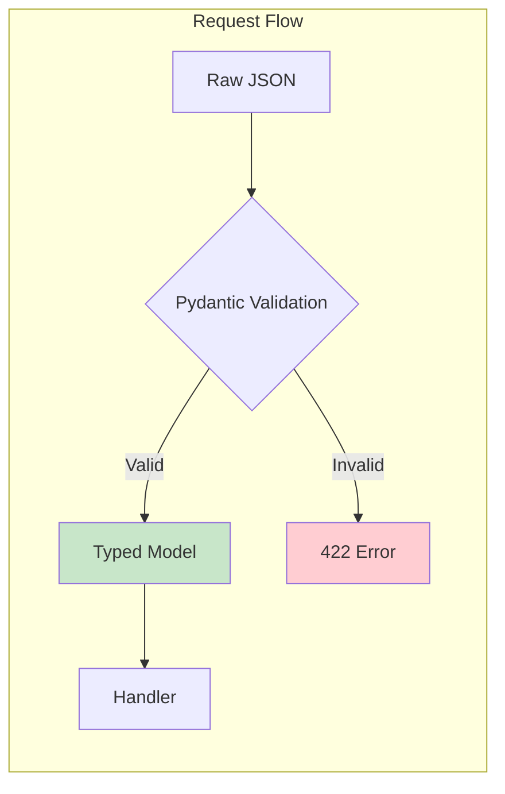
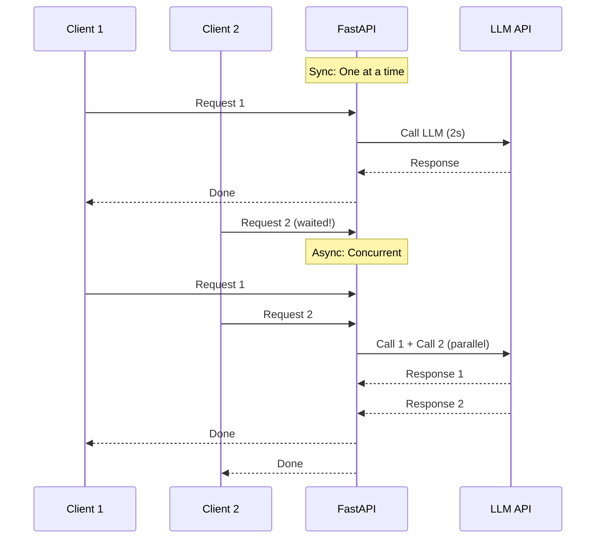
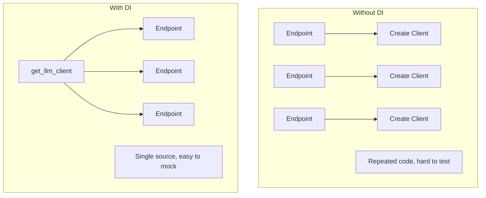

# Module 07a: FastAPI Fundamentals for AI Applications

> **Level**: Beginner → Intermediate | **Time**: 10-12 hours | **Prerequisites**: Modules 01-06

## Overview

FastAPI is the go-to framework for building production AI APIs. This module teaches FastAPI from scratch, using LLM API examples throughout, preparing you to build real AI backends.

### Why FastAPI for AI?



| Feature | Why It Matters for AI |
|---------|----------------------|
| **Async/await** | LLM calls are I/O bound; async handles many concurrent requests |
| **Pydantic** | Validate structured outputs from LLMs |
| **Streaming** | SSE for token-by-token LLM responses |
| **Dependency Injection** | Inject LLM clients, DB connections cleanly |
| **Auto-documentation** | Swagger UI for testing your AI endpoints |

> **Interview Insight**: "Why FastAPI over Flask/Django for AI?" — Async native, Pydantic integration, and streaming support make it ideal for LLM applications.

---

## Part 1: FastAPI Basics

### Understanding the ASGI Foundation

FastAPI is built on **ASGI** (Asynchronous Server Gateway Interface), the successor to WSGI. This architecture enables:

1. **Non-blocking I/O**: Handle thousands of concurrent connections
2. **WebSocket support**: Real-time bidirectional communication
3. **Background tasks**: Process work after sending responses
4. **Lifespan events**: Startup/shutdown hooks for resource management

Unlike Flask (WSGI-based), FastAPI can await I/O operations without blocking other requests—critical for LLM APIs where each call may take 2-30 seconds.



### Your First FastAPI App

```python
# main.py
from fastapi import FastAPI

app = FastAPI(
    title="AI Chat API",
    description="Production-ready LLM API",
    version="1.0.0"
)

@app.get("/")
def read_root():
    """Health check endpoint."""
    return {"status": "healthy", "service": "ai-chat-api"}

@app.get("/hello/{name}")
def say_hello(name: str):
    """Greet a user by name."""
    return {"message": f"Hello, {name}!"}
```

Run with:
```bash
# Install FastAPI
pip install fastapi uvicorn

# Run the server
uvicorn main:app --reload

# Visit: http://localhost:8000/docs (Swagger UI)
```



---

### Path and Query Parameters

```python
from fastapi import FastAPI, Query, Path
from typing import Optional

app = FastAPI()

# Path parameter: required, part of URL
@app.get("/models/{model_id}")
def get_model(
    model_id: str = Path(..., description="Model identifier like 'gpt-4'")
):
    """Get model information by ID."""
    return {"model_id": model_id, "provider": "openai"}


# Query parameters: optional, after ?
@app.get("/chat/completions")
def list_completions(
    model: str = Query("gpt-4", description="Model to use"),
    limit: int = Query(10, ge=1, le=100, description="Max results"),
    skip: int = Query(0, ge=0, description="Offset for pagination"),
):
    """List chat completions with optional filtering."""
    return {
        "model": model,
        "limit": limit,
        "skip": skip,
        "results": []
    }


# Combined: path + query
@app.get("/conversations/{conversation_id}/messages")
def get_messages(
    conversation_id: str = Path(..., min_length=1),
    role: Optional[str] = Query(None, description="Filter by role"),
    limit: int = Query(50, ge=1, le=200),
):
    """Get messages from a conversation."""
    return {
        "conversation_id": conversation_id,
        "role_filter": role,
        "limit": limit,
        "messages": []
    }
```

**Key Concepts**:
- `Path(...)` = required path parameter
- `Query(default)` = optional with default
- `ge`, `le`, `min_length` = validation constraints

---

## Part 2: Request & Response Models

### The Philosophy of Schema-First Design

FastAPI embraces **schema-first design**: define your data structures as Pydantic models, and everything else flows from that—validation, serialization, documentation, and IDE support.

This is especially powerful for AI applications where:
- LLM responses must conform to specific structures
- API contracts need to be explicit and documented
- Invalid inputs should fail fast with clear errors

**Key Insight**: Every Pydantic model becomes part of your OpenAPI schema, automatically generating documentation and client SDKs.

### Pydantic Models for AI



```python
from fastapi import FastAPI, HTTPException
from pydantic import BaseModel, Field
from typing import List, Optional, Literal
from datetime import datetime

app = FastAPI()


# ==================== REQUEST MODELS ====================

class ChatMessage(BaseModel):
    """Single message in a conversation."""
    role: Literal["system", "user", "assistant"]
    content: str = Field(..., min_length=1, max_length=100000)
    
    class Config:
        json_schema_extra = {
            "example": {
                "role": "user",
                "content": "Explain FastAPI in one sentence."
            }
        }


class ChatRequest(BaseModel):
    """Request to generate a chat completion."""
    model: str = Field("gpt-4", description="Model to use")
    messages: List[ChatMessage] = Field(..., min_length=1)
    temperature: float = Field(0.7, ge=0, le=2)
    max_tokens: Optional[int] = Field(None, ge=1, le=4096)
    stream: bool = Field(False, description="Enable streaming")
    
    class Config:
        json_schema_extra = {
            "example": {
                "model": "gpt-4",
                "messages": [
                    {"role": "user", "content": "Hello!"}
                ],
                "temperature": 0.7
            }
        }


# ==================== RESPONSE MODELS ====================

class TokenUsage(BaseModel):
    """Token usage statistics."""
    prompt_tokens: int
    completion_tokens: int
    total_tokens: int


class ChatChoice(BaseModel):
    """Single completion choice."""
    index: int
    message: ChatMessage
    finish_reason: Literal["stop", "length", "tool_calls"]


class ChatResponse(BaseModel):
    """Response from chat completion."""
    id: str
    model: str
    created: datetime
    choices: List[ChatChoice]
    usage: TokenUsage


# ==================== ENDPOINTS ====================

@app.post("/v1/chat/completions", response_model=ChatResponse)
def create_chat_completion(request: ChatRequest):
    """
    Create a chat completion.
    
    This endpoint mimics the OpenAI API structure.
    """
    # Validate: at least one message
    if not request.messages:
        raise HTTPException(status_code=400, detail="Messages cannot be empty")
    
    # Simulated response
    return ChatResponse(
        id="chatcmpl-123",
        model=request.model,
        created=datetime.now(),
        choices=[
            ChatChoice(
                index=0,
                message=ChatMessage(
                    role="assistant",
                    content=f"Response to: {request.messages[-1].content}"
                ),
                finish_reason="stop"
            )
        ],
        usage=TokenUsage(
            prompt_tokens=10,
            completion_tokens=20,
            total_tokens=30
        )
    )
```

---

## Part 3: Async Endpoints

### The Concurrency Model

Understanding async/await is essential for AI backends. Here's the mental model:

- **Sync function (`def`)**: Blocks the thread until complete
- **Async function (`async def`)**: Yields control while waiting for I/O

**When to use which:**

| Operation | Use | Why |
|-----------|-----|-----|
| LLM API call | `async def` | Network I/O, may take seconds |
| CPU computation | `def` | Compute-bound, runs in thread pool |
| Database query | `async def` | Network I/O |
| File read | `async def` (with aiofiles) | Disk I/O |

> **Interview Insight**: "When would you NOT use async?" — For CPU-bound tasks like ML inference, async doesn't help. Use `run_in_executor()` or a task queue instead.

### Why Async for LLM APIs?



```python
import asyncio
from fastapi import FastAPI
from pydantic import BaseModel
from typing import List
import httpx

app = FastAPI()


class ChatRequest(BaseModel):
    messages: List[dict]
    model: str = "gpt-4"


class ChatResponse(BaseModel):
    content: str
    model: str


# Simulated async LLM call
async def call_llm(messages: List[dict], model: str) -> str:
    """Simulate an LLM API call with delay."""
    await asyncio.sleep(1)  # Simulate network latency
    return f"[{model}] Response to: {messages[-1]['content']}"


# ==================== ASYNC ENDPOINT ====================

@app.post("/v1/chat", response_model=ChatResponse)
async def create_chat(request: ChatRequest):
    """
    Async chat endpoint.
    
    The 'async def' allows other requests to be processed
    while waiting for the LLM response.
    """
    content = await call_llm(request.messages, request.model)
    return ChatResponse(content=content, model=request.model)


# ==================== BATCH ENDPOINT ====================

class BatchRequest(BaseModel):
    prompts: List[str]
    model: str = "gpt-4"


class BatchResponse(BaseModel):
    responses: List[str]
    total_time_ms: float


@app.post("/v1/batch", response_model=BatchResponse)
async def batch_complete(request: BatchRequest):
    """
    Process multiple prompts concurrently.
    
    3 prompts with 1s each = ~1s total (not 3s!)
    """
    import time
    start = time.time()
    
    # Create tasks for all prompts
    tasks = [
        call_llm([{"role": "user", "content": p}], request.model)
        for p in request.prompts
    ]
    
    # Run all concurrently
    responses = await asyncio.gather(*tasks)
    
    elapsed = (time.time() - start) * 1000
    return BatchResponse(responses=responses, total_time_ms=elapsed)
```

---

## Part 4: Dependency Injection

### The Philosophy of Inversion of Control

Dependency Injection (DI) inverts the traditional control flow: instead of a function creating its dependencies, they are provided externally. This enables:

1. **Testability**: Swap real LLM clients with mocks
2. **Configurability**: Switch providers via environment variables
3. **Separation of Concerns**: Endpoints focus on business logic, not setup
4. **Resource Sharing**: Reuse database connections across endpoints

FastAPI's `Depends()` is both simple and powerful—it supports sub-dependencies, caching, and async dependencies.

### The Power of Dependencies



```python
from fastapi import FastAPI, Depends, HTTPException
from pydantic import BaseModel
from typing import Protocol, List
from functools import lru_cache


app = FastAPI()


# ==================== LLM PROTOCOL ====================

class LLMClient(Protocol):
    """Protocol for LLM clients."""
    async def complete(self, messages: List[dict]) -> str: ...


# ==================== CONCRETE IMPLEMENTATIONS ====================

class OpenAIClient:
    """OpenAI implementation."""
    
    def __init__(self, api_key: str, model: str = "gpt-4"):
        self.api_key = api_key
        self.model = model
    
    async def complete(self, messages: List[dict]) -> str:
        # In production: call OpenAI API
        return f"[OpenAI {self.model}] {messages[-1]['content']}"


class MockLLMClient:
    """Mock for testing."""
    
    def __init__(self, response: str = "Mock response"):
        self.response = response
    
    async def complete(self, messages: List[dict]) -> str:
        return self.response


# ==================== SETTINGS ====================

class Settings(BaseModel):
    openai_api_key: str = "sk-test-key"
    default_model: str = "gpt-4"
    environment: str = "development"


@lru_cache()
def get_settings() -> Settings:
    """Load settings once and cache."""
    return Settings()


# ==================== DEPENDENCY FUNCTIONS ====================

def get_llm_client(settings: Settings = Depends(get_settings)) -> LLMClient:
    """
    Dependency that provides an LLM client.
    
    In tests, you can override this with a mock.
    """
    if settings.environment == "test":
        return MockLLMClient()
    return OpenAIClient(
        api_key=settings.openai_api_key,
        model=settings.default_model
    )


# ==================== ENDPOINTS USING DI ====================

class ChatRequest(BaseModel):
    message: str


@app.post("/chat")
async def chat(
    request: ChatRequest,
    llm: LLMClient = Depends(get_llm_client)
):
    """
    Chat endpoint using injected LLM client.
    
    The LLM client is injected, not created here.
    Easy to test by overriding the dependency.
    """
    response = await llm.complete([
        {"role": "user", "content": request.message}
    ])
    return {"response": response}


# ==================== TESTING WITH DI ====================

"""
# In tests/test_chat.py
from fastapi.testclient import TestClient

def test_chat_endpoint():
    # Override dependency with mock
    mock_client = MockLLMClient(response="Test response")
    
    app.dependency_overrides[get_llm_client] = lambda: mock_client
    
    client = TestClient(app)
    response = client.post("/chat", json={"message": "Hello"})
    
    assert response.json()["response"] == "Test response"
    
    # Clean up
    app.dependency_overrides.clear()
"""
```

---

## Part 5: Error Handling

### The ErrorHandling Strategy

Production APIs need consistent, machine-readable errors. OpenAI's API is a good model:

```json
{
  "error": {
    "code": "rate_limit_exceeded",
    "message": "Rate limit exceeded. Retry after 60 seconds.",
    "type": "rate_limit_error"
  }
}
```

**Key Principles:**
1. **Structured codes**: Machine-parseable error types
2. **Human messages**: Clear explanations for developers
3. **Appropriate HTTP status**: 400 for client errors, 500 for server errors, 429 for rate limits
4. **Retry guidance**: `Retry-After` headers for rate limits

### Structured Error Responses

```python
from fastapi import FastAPI, HTTPException, Request
from fastapi.responses import JSONResponse
from fastapi.exceptions import RequestValidationError
from pydantic import BaseModel
from typing import Optional, List
import traceback


app = FastAPI()


# ==================== ERROR MODELS ====================

class ErrorDetail(BaseModel):
    """Structured error detail."""
    code: str
    message: str
    field: Optional[str] = None


class ErrorResponse(BaseModel):
    """Standardized error response."""
    error: ErrorDetail
    request_id: Optional[str] = None


# ==================== CUSTOM EXCEPTIONS ====================

class LLMError(Exception):
    """Base exception for LLM errors."""
    def __init__(self, message: str, code: str = "llm_error"):
        self.message = message
        self.code = code
        super().__init__(message)


class RateLimitError(LLMError):
    """Rate limit exceeded."""
    def __init__(self, message: str = "Rate limit exceeded"):
        super().__init__(message, code="rate_limit_exceeded")


class ModelNotFoundError(LLMError):
    """Model not found."""
    def __init__(self, model: str):
        super().__init__(f"Model '{model}' not found", code="model_not_found")


# ==================== EXCEPTION HANDLERS ====================

@app.exception_handler(LLMError)
async def llm_error_handler(request: Request, exc: LLMError):
    """Handle LLM-specific errors."""
    return JSONResponse(
        status_code=400,
        content=ErrorResponse(
            error=ErrorDetail(code=exc.code, message=exc.message)
        ).model_dump()
    )


@app.exception_handler(RateLimitError)
async def rate_limit_handler(request: Request, exc: RateLimitError):
    """Handle rate limit errors with 429 status."""
    return JSONResponse(
        status_code=429,
        content=ErrorResponse(
            error=ErrorDetail(code=exc.code, message=exc.message)
        ).model_dump(),
        headers={"Retry-After": "60"}
    )


@app.exception_handler(RequestValidationError)
async def validation_error_handler(request: Request, exc: RequestValidationError):
    """Handle Pydantic validation errors."""
    errors = exc.errors()
    first_error = errors[0] if errors else {"msg": "Validation error"}
    
    return JSONResponse(
        status_code=422,
        content=ErrorResponse(
            error=ErrorDetail(
                code="validation_error",
                message=first_error.get("msg", "Invalid request"),
                field=".".join(str(x) for x in first_error.get("loc", []))
            )
        ).model_dump()
    )


# ==================== USING EXCEPTIONS ====================

@app.post("/v1/completions")
async def create_completion(model: str, prompt: str):
    """Endpoint that demonstrates error handling."""
    
    # Check model exists
    valid_models = ["gpt-4", "gpt-3.5-turbo", "claude-3"]
    if model not in valid_models:
        raise ModelNotFoundError(model)
    
    # Simulate rate limit
    import random
    if random.random() < 0.1:  # 10% chance
        raise RateLimitError()
    
    return {"model": model, "completion": f"Response to: {prompt}"}
```

---

## Part 6: Lifespan & Startup/Shutdown

### Resource Lifecycle Management

Production applications need to:
1. **Initialize resources on startup**: Database pools, ML models, API clients
2. **Clean up on shutdown**: Close connections, flush caches, complete pending work

FastAPI's `lifespan` context manager (introduced in 0.93+) replaces the older `@app.on_event` decorators and provides cleaner semantics—resources acquired before `yield` are guaranteed to be released after.

**When to use lifespan:**
- Database connection pools
- ML model loading (can take 10+ seconds)
- Cache warming
- Background task schedulers

### Managing Resources

```python
from fastapi import FastAPI, Depends
from contextlib import asynccontextmanager
from typing import AsyncIterator
import asyncio


# ==================== RESOURCE MANAGEMENT ====================

class LLMConnectionPool:
    """Connection pool for LLM clients."""
    
    def __init__(self):
        self.clients = {}
        self.initialized = False
    
    async def initialize(self):
        """Initialize connections on startup."""
        print("[STARTUP] Initializing LLM connection pool...")
        await asyncio.sleep(0.5)  # Simulate connection setup
        self.clients = {
            "openai": "OpenAI Client",
            "anthropic": "Anthropic Client",
        }
        self.initialized = True
        print("[STARTUP] Connection pool ready")
    
    async def shutdown(self):
        """Cleanup on shutdown."""
        print("[SHUTDOWN] Shutting down connection pool...")
        self.clients.clear()
        self.initialized = False
        print("[SHUTDOWN] Cleanup complete")
    
    def get_client(self, provider: str):
        if not self.initialized:
            raise RuntimeError("Pool not initialized")
        return self.clients.get(provider)


# Global instance
pool = LLMConnectionPool()


# ==================== LIFESPAN CONTEXT ====================

@asynccontextmanager
async def lifespan(app: FastAPI) -> AsyncIterator[None]:
    """
    Lifespan context manager for startup/shutdown.
    
    - Code before 'yield' runs on startup
    - Code after 'yield' runs on shutdown
    """
    # Startup
    await pool.initialize()
    
    yield  # Application runs here
    
    # Shutdown
    await pool.shutdown()


# Create app with lifespan
app = FastAPI(lifespan=lifespan)


# ==================== DEPENDENCY USING POOL ====================

def get_llm_pool() -> LLMConnectionPool:
    """Dependency to access the pool."""
    return pool


@app.get("/providers/{provider}")
async def get_provider_client(
    provider: str,
    pool: LLMConnectionPool = Depends(get_llm_pool)
):
    """Get a client from the pool."""
    client = pool.get_client(provider)
    if not client:
        raise HTTPException(404, f"Provider '{provider}' not found")
    return {"provider": provider, "client": client}


@app.get("/health")
async def health_check(pool: LLMConnectionPool = Depends(get_llm_pool)):
    """Health check including pool status."""
    return {
        "status": "healthy",
        "pool_initialized": pool.initialized,
        "available_providers": list(pool.clients.keys())
    }
```

---

## Summary

| Topic | Key Takeaway |
|-------|--------------|
| **Routes** | `@app.get("/path/{param}")` for endpoints |
| **Path/Query** | `Path()` for URL parts, `Query()` for ?params |
| **Pydantic** | Request/response models with validation |
| **Async** | Use `async def` for I/O-bound LLM calls |
| **Dependencies** | `Depends()` for injection, easy testing |
| **Errors** | Custom exceptions + handlers for clean errors |
| **Lifespan** | `@asynccontextmanager` for startup/shutdown |

---

## Next Steps

Continue to **[Module 07b: FastAPI Advanced](07b-fastapi-advanced.md)** to learn:
- Middleware for logging and auth
- Background tasks
- WebSocket streaming for LLM responses
- Security (OAuth2, JWT, API keys)
