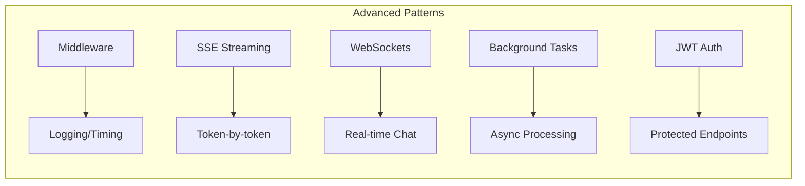
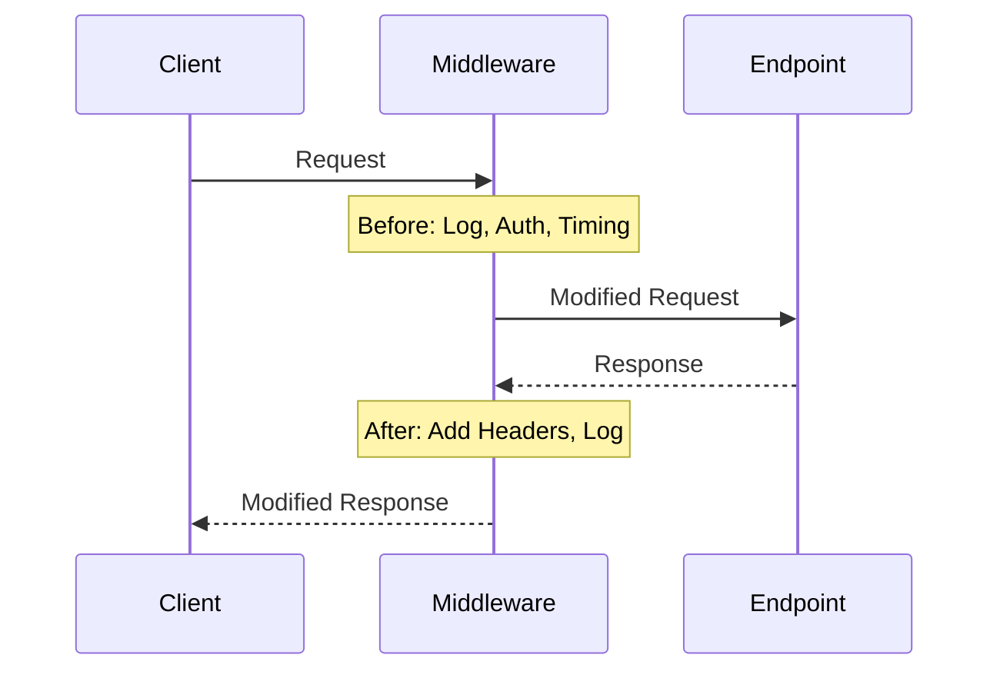
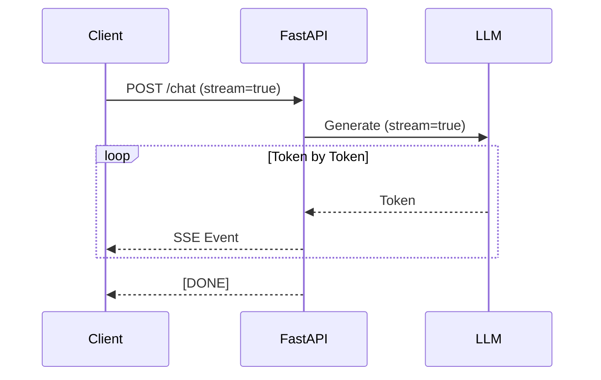
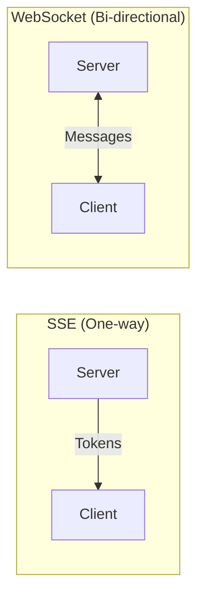
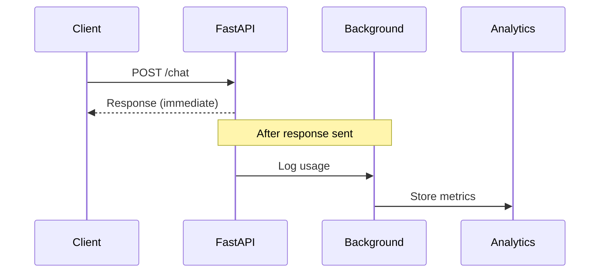
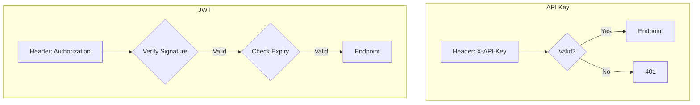

# Module 07b: FastAPI Advanced for AI Applications

> **Level**: Intermediate → Advanced | **Time**: 12-15 hours | **Prerequisites**: Module 07a

## Overview

This module covers advanced FastAPI patterns essential for production AI applications: middleware, streaming responses, WebSockets, background tasks, and security. These patterns enable real-time LLM interactions with proper authentication and monitoring.

### What You'll Build



| Pattern | Use Case |
|---------|----------|
| **Middleware** | Request logging, timing, CORS, auth checks |
| **SSE Streaming** | Token-by-token LLM responses |
| **WebSockets** | Bidirectional real-time chat |
| **Background Tasks** | Post-response processing, analytics |
| **JWT/API Keys** | Securing your AI endpoints |

---

## Part 1: Middleware

### Understanding Middleware

Middleware intercepts every request before it reaches your endpoint and every response before it returns to the client. This is the ideal place for cross-cutting concerns.



**Common Middleware Use Cases:**
1. **Request logging**: Track all API calls
2. **Timing**: Measure response latency
3. **Authentication**: Verify tokens before routing
4. **CORS**: Handle cross-origin requests
5. **Rate limiting**: Throttle requests per user

### Implementing Custom Middleware

```python
import time
import uuid
from fastapi import FastAPI, Request, Response
from starlette.middleware.base import BaseHTTPMiddleware
from typing import Callable
import logging

app = FastAPI()
logger = logging.getLogger(__name__)


# ==============================================================================
# TIMING MIDDLEWARE
# ==============================================================================

class TimingMiddleware(BaseHTTPMiddleware):
    """Add request timing to all responses."""
    
    async def dispatch(
        self, request: Request, call_next: Callable
    ) -> Response:
        start_time = time.perf_counter()
        
        response = await call_next(request)
        
        process_time = time.perf_counter() - start_time
        response.headers["X-Process-Time"] = f"{process_time:.4f}"
        
        return response


# ==============================================================================
# REQUEST ID MIDDLEWARE
# ==============================================================================

class RequestIDMiddleware(BaseHTTPMiddleware):
    """Add unique request ID for tracing."""
    
    async def dispatch(
        self, request: Request, call_next: Callable
    ) -> Response:
        # Generate or extract request ID
        request_id = request.headers.get("X-Request-ID", str(uuid.uuid4()))
        
        # Store in request state for use in handlers
        request.state.request_id = request_id
        
        response = await call_next(request)
        
        # Add to response headers
        response.headers["X-Request-ID"] = request_id
        
        return response


# ==============================================================================
# LOGGING MIDDLEWARE
# ==============================================================================

class LoggingMiddleware(BaseHTTPMiddleware):
    """Log all requests and responses."""
    
    async def dispatch(
        self, request: Request, call_next: Callable
    ) -> Response:
        # Get request ID if available
        request_id = getattr(request.state, "request_id", "unknown")
        
        # Log request
        logger.info(
            f"[{request_id}] {request.method} {request.url.path} - Started"
        )
        
        start_time = time.perf_counter()
        response = await call_next(request)
        duration = time.perf_counter() - start_time
        
        # Log response
        logger.info(
            f"[{request_id}] {request.method} {request.url.path} - "
            f"{response.status_code} ({duration:.3f}s)"
        )
        
        return response


# Register middleware (order matters: first registered = outermost)
app.add_middleware(LoggingMiddleware)
app.add_middleware(TimingMiddleware)
app.add_middleware(RequestIDMiddleware)


@app.get("/chat")
async def chat(request: Request):
    """Endpoint with request ID available."""
    return {
        "message": "Hello",
        "request_id": request.state.request_id
    }
```

> **Interview Insight**: "Explain middleware order" - Middleware forms an onion: first added = outermost layer. Request goes in from outer to inner, response goes out from inner to outer.

---

## Part 2: SSE Streaming for LLM Responses

### Why Streaming Matters

Without streaming, users wait for the entire LLM response (2-30 seconds). With streaming, they see tokens appear immediately, creating a "typing" effect like ChatGPT.



### Server-Sent Events (SSE) Implementation

```python
from fastapi import FastAPI
from fastapi.responses import StreamingResponse
from pydantic import BaseModel
from typing import AsyncIterator
import asyncio
import json

app = FastAPI()


class ChatRequest(BaseModel):
    message: str
    model: str = "gpt-4"


# ==============================================================================
# SIMULATED LLM STREAMING
# ==============================================================================

async def stream_llm_response(message: str, model: str) -> AsyncIterator[str]:
    """
    Simulate LLM streaming response.
    
    In production, this would call OpenAI with stream=True:
    
    async for chunk in openai.chat.completions.create(
        model=model,
        messages=[{"role": "user", "content": message}],
        stream=True
    ):
        yield chunk.choices[0].delta.content or ""
    """
    # Simulated response tokens
    response = f"I received your message: '{message}'. Here is my response using {model}."
    tokens = response.split()
    
    for token in tokens:
        await asyncio.sleep(0.05)  # Simulate token generation delay
        yield token + " "


# ==============================================================================
# SSE ENDPOINT
# ==============================================================================

async def generate_sse_events(message: str, model: str) -> AsyncIterator[str]:
    """Generate SSE-formatted events."""
    async for token in stream_llm_response(message, model):
        # SSE format: data: {json}\n\n
        event_data = json.dumps({"token": token})
        yield f"data: {event_data}\n\n"
    
    # Send completion signal
    yield "data: [DONE]\n\n"


@app.post("/v1/chat/stream")
async def chat_stream(request: ChatRequest):
    """
    Streaming chat endpoint using Server-Sent Events.
    
    Returns tokens as they are generated, providing
    real-time feedback to the user.
    """
    return StreamingResponse(
        generate_sse_events(request.message, request.model),
        media_type="text/event-stream",
        headers={
            "Cache-Control": "no-cache",
            "Connection": "keep-alive",
        }
    )


# ==============================================================================
# OPENAI-COMPATIBLE STREAMING
# ==============================================================================

async def generate_openai_stream(message: str, model: str) -> AsyncIterator[str]:
    """Generate OpenAI-compatible streaming format."""
    chat_id = f"chatcmpl-{int(asyncio.get_event_loop().time())}"
    
    async for token in stream_llm_response(message, model):
        chunk = {
            "id": chat_id,
            "object": "chat.completion.chunk",
            "model": model,
            "choices": [{
                "index": 0,
                "delta": {"content": token},
                "finish_reason": None
            }]
        }
        yield f"data: {json.dumps(chunk)}\n\n"
    
    # Final chunk with finish_reason
    final_chunk = {
        "id": chat_id,
        "object": "chat.completion.chunk",
        "model": model,
        "choices": [{
            "index": 0,
            "delta": {},
            "finish_reason": "stop"
        }]
    }
    yield f"data: {json.dumps(final_chunk)}\n\n"
    yield "data: [DONE]\n\n"


@app.post("/v1/chat/completions")
async def chat_completions(request: ChatRequest, stream: bool = False):
    """OpenAI-compatible endpoint with optional streaming."""
    if stream:
        return StreamingResponse(
            generate_openai_stream(request.message, request.model),
            media_type="text/event-stream"
        )
    
    # Non-streaming: collect all tokens
    tokens = []
    async for token in stream_llm_response(request.message, request.model):
        tokens.append(token)
    
    return {
        "id": "chatcmpl-123",
        "model": request.model,
        "choices": [{
            "message": {"role": "assistant", "content": "".join(tokens)},
            "finish_reason": "stop"
        }]
    }
```

---

## Part 3: WebSockets for Real-Time Chat

### WebSocket vs SSE

| Feature | SSE | WebSocket |
|---------|-----|-----------|
| **Direction** | Server → Client only | Bidirectional |
| **Protocol** | HTTP | WS/WSS |
| **Reconnection** | Built-in | Manual |
| **Use Case** | LLM streaming | Real-time chat |



### WebSocket Chat Implementation

```python
from fastapi import FastAPI, WebSocket, WebSocketDisconnect
from typing import List, Dict
import json

app = FastAPI()


# ==============================================================================
# CONNECTION MANAGER
# ==============================================================================

class ConnectionManager:
    """Manage active WebSocket connections."""
    
    def __init__(self):
        self.active_connections: Dict[str, WebSocket] = {}
    
    async def connect(self, websocket: WebSocket, client_id: str):
        """Accept and register a new connection."""
        await websocket.accept()
        self.active_connections[client_id] = websocket
    
    def disconnect(self, client_id: str):
        """Remove a connection."""
        self.active_connections.pop(client_id, None)
    
    async def send_personal(self, message: str, client_id: str):
        """Send message to specific client."""
        websocket = self.active_connections.get(client_id)
        if websocket:
            await websocket.send_text(message)
    
    async def broadcast(self, message: str):
        """Send message to all connected clients."""
        for websocket in self.active_connections.values():
            await websocket.send_text(message)


manager = ConnectionManager()


# ==============================================================================
# WEBSOCKET ENDPOINT
# ==============================================================================

@app.websocket("/ws/chat/{client_id}")
async def websocket_chat(websocket: WebSocket, client_id: str):
    """
    WebSocket endpoint for real-time chat.
    
    Protocol:
    - Client sends: {"message": "Hello"}
    - Server streams: {"token": "I"}, {"token": " am"}, ...
    - Server signals: {"done": true}
    """
    await manager.connect(websocket, client_id)
    
    try:
        while True:
            # Receive message from client
            data = await websocket.receive_text()
            request = json.loads(data)
            message = request.get("message", "")
            
            # Stream response back
            async for token in stream_llm_response(message, "gpt-4"):
                await websocket.send_json({"token": token})
            
            # Signal completion
            await websocket.send_json({"done": True})
            
    except WebSocketDisconnect:
        manager.disconnect(client_id)


# ==============================================================================
# MULTI-USER CHAT ROOM
# ==============================================================================

class ChatRoom:
    """Manage a chat room with multiple users."""
    
    def __init__(self):
        self.rooms: Dict[str, List[WebSocket]] = {}
    
    async def join(self, room_id: str, websocket: WebSocket):
        await websocket.accept()
        if room_id not in self.rooms:
            self.rooms[room_id] = []
        self.rooms[room_id].append(websocket)
    
    def leave(self, room_id: str, websocket: WebSocket):
        if room_id in self.rooms:
            self.rooms[room_id].remove(websocket)
    
    async def broadcast_to_room(self, room_id: str, message: dict):
        if room_id in self.rooms:
            for ws in self.rooms[room_id]:
                await ws.send_json(message)


chat_room = ChatRoom()


@app.websocket("/ws/room/{room_id}/{user_id}")
async def room_chat(websocket: WebSocket, room_id: str, user_id: str):
    """Multi-user chat room with LLM assistant."""
    await chat_room.join(room_id, websocket)
    
    try:
        while True:
            data = await websocket.receive_text()
            request = json.loads(data)
            
            # Broadcast user message to room
            await chat_room.broadcast_to_room(room_id, {
                "type": "user",
                "user_id": user_id,
                "content": request["message"]
            })
            
            # If message mentions @assistant, generate LLM response
            if "@assistant" in request["message"]:
                async for token in stream_llm_response(request["message"], "gpt-4"):
                    await chat_room.broadcast_to_room(room_id, {
                        "type": "assistant",
                        "token": token
                    })
                await chat_room.broadcast_to_room(room_id, {
                    "type": "assistant_done"
                })
                
    except WebSocketDisconnect:
        chat_room.leave(room_id, websocket)
```

---

## Part 4: Background Tasks

### When to Use Background Tasks

Background tasks run after the response is sent, ideal for:
- Logging and analytics
- Sending notifications
- Updating caches
- Cleanup operations



### Implementation

```python
from fastapi import FastAPI, BackgroundTasks
from pydantic import BaseModel
from datetime import datetime
import asyncio

app = FastAPI()


# ==============================================================================
# BACKGROUND TASK FUNCTIONS
# ==============================================================================

async def log_chat_usage(
    user_id: str,
    model: str,
    prompt_tokens: int,
    completion_tokens: int
):
    """Log usage to analytics system (runs after response)."""
    # Simulate async logging
    await asyncio.sleep(0.1)
    print(
        f"[ANALYTICS] user={user_id} model={model} "
        f"tokens={prompt_tokens + completion_tokens}"
    )


async def update_user_quota(user_id: str, tokens_used: int):
    """Update user's remaining quota."""
    await asyncio.sleep(0.1)
    print(f"[QUOTA] user={user_id} used={tokens_used}")


def send_usage_alert(user_id: str, threshold: int):
    """Sync function: Send alert if quota is low."""
    print(f"[ALERT] user={user_id} approaching quota limit ({threshold})")


# ==============================================================================
# ENDPOINT WITH BACKGROUND TASKS
# ==============================================================================

class ChatRequest(BaseModel):
    message: str
    model: str = "gpt-4"


@app.post("/v1/chat")
async def chat_with_tracking(
    request: ChatRequest,
    background_tasks: BackgroundTasks,
    user_id: str = "anonymous"
):
    """
    Chat endpoint with background analytics.
    
    The response is returned immediately, then
    background tasks run for logging and quota updates.
    """
    # Simulate LLM call
    response_content = f"Response to: {request.message}"
    prompt_tokens = len(request.message.split())
    completion_tokens = len(response_content.split())
    
    # Schedule background tasks (run AFTER response is sent)
    background_tasks.add_task(
        log_chat_usage,
        user_id,
        request.model,
        prompt_tokens,
        completion_tokens
    )
    
    background_tasks.add_task(
        update_user_quota,
        user_id,
        prompt_tokens + completion_tokens
    )
    
    # Check quota (sync task is also supported)
    background_tasks.add_task(
        send_usage_alert,
        user_id,
        threshold=1000
    )
    
    # Return immediately - background tasks run after
    return {
        "content": response_content,
        "model": request.model,
        "usage": {
            "prompt_tokens": prompt_tokens,
            "completion_tokens": completion_tokens
        }
    }
```

---

## Part 5: Authentication & Security

### Authentication Strategies for AI APIs

| Strategy | Use Case | Pros | Cons |
|----------|----------|------|------|
| **API Key** | Server-to-server | Simple | No expiry, hard to revoke |
| **JWT** | User sessions | Stateless, carries claims | Token size, rotation |
| **OAuth2** | Third-party apps | Standard, delegated | Complexity |



### API Key Authentication

```python
from fastapi import FastAPI, Depends, HTTPException, Security
from fastapi.security import APIKeyHeader
from pydantic import BaseModel
from typing import Optional

app = FastAPI()


# ==============================================================================
# API KEY AUTHENTICATION
# ==============================================================================

API_KEYS = {
    "sk-prod-abc123": {"user": "alice", "tier": "pro"},
    "sk-prod-xyz789": {"user": "bob", "tier": "free"},
}

api_key_header = APIKeyHeader(name="X-API-Key", auto_error=False)


async def verify_api_key(
    api_key: Optional[str] = Security(api_key_header)
) -> dict:
    """Dependency to verify API key."""
    if not api_key:
        raise HTTPException(
            status_code=401,
            detail={"code": "missing_api_key", "message": "API key required"}
        )
    
    if api_key not in API_KEYS:
        raise HTTPException(
            status_code=401,
            detail={"code": "invalid_api_key", "message": "Invalid API key"}
        )
    
    return API_KEYS[api_key]


@app.post("/v1/chat")
async def chat(
    message: str,
    api_user: dict = Depends(verify_api_key)
):
    """Protected endpoint requiring API key."""
    return {
        "message": f"Hello, {api_user['user']}!",
        "tier": api_user["tier"]
    }
```

### JWT Authentication

```python
from fastapi import FastAPI, Depends, HTTPException
from fastapi.security import HTTPBearer, HTTPAuthorizationCredentials
from pydantic import BaseModel
from datetime import datetime, timedelta
from typing import Optional
import jwt

app = FastAPI()

# Configuration
SECRET_KEY = "your-secret-key-store-in-env"  # Use environment variable
ALGORITHM = "HS256"
ACCESS_TOKEN_EXPIRE_MINUTES = 30

security = HTTPBearer()


# ==============================================================================
# TOKEN MODELS
# ==============================================================================

class TokenPayload(BaseModel):
    sub: str  # Subject (user ID)
    exp: datetime  # Expiration
    tier: str = "free"


class TokenResponse(BaseModel):
    access_token: str
    token_type: str = "bearer"
    expires_in: int


# ==============================================================================
# TOKEN FUNCTIONS
# ==============================================================================

def create_access_token(user_id: str, tier: str = "free") -> str:
    """Create a new JWT access token."""
    expires = datetime.utcnow() + timedelta(minutes=ACCESS_TOKEN_EXPIRE_MINUTES)
    
    payload = {
        "sub": user_id,
        "exp": expires,
        "tier": tier,
        "iat": datetime.utcnow()
    }
    
    return jwt.encode(payload, SECRET_KEY, algorithm=ALGORITHM)


def verify_token(token: str) -> TokenPayload:
    """Verify and decode a JWT token."""
    try:
        payload = jwt.decode(token, SECRET_KEY, algorithms=[ALGORITHM])
        return TokenPayload(**payload)
    except jwt.ExpiredSignatureError:
        raise HTTPException(
            status_code=401,
            detail={"code": "token_expired", "message": "Token has expired"}
        )
    except jwt.InvalidTokenError:
        raise HTTPException(
            status_code=401,
            detail={"code": "invalid_token", "message": "Invalid token"}
        )


# ==============================================================================
# AUTH DEPENDENCY
# ==============================================================================

async def get_current_user(
    credentials: HTTPAuthorizationCredentials = Depends(security)
) -> TokenPayload:
    """Dependency to get current authenticated user."""
    return verify_token(credentials.credentials)


# ==============================================================================
# ENDPOINTS
# ==============================================================================

class LoginRequest(BaseModel):
    username: str
    password: str


# Simple user store (use database in production)
USERS = {
    "alice": {"password": "secret123", "tier": "pro"},
    "bob": {"password": "password", "tier": "free"},
}


@app.post("/auth/login", response_model=TokenResponse)
async def login(request: LoginRequest):
    """Login endpoint - returns JWT token."""
    user = USERS.get(request.username)
    
    if not user or user["password"] != request.password:
        raise HTTPException(
            status_code=401,
            detail={"code": "invalid_credentials", "message": "Invalid credentials"}
        )
    
    token = create_access_token(request.username, user["tier"])
    
    return TokenResponse(
        access_token=token,
        expires_in=ACCESS_TOKEN_EXPIRE_MINUTES * 60
    )


@app.get("/v1/me")
async def get_me(current_user: TokenPayload = Depends(get_current_user)):
    """Get current user info (protected)."""
    return {
        "user_id": current_user.sub,
        "tier": current_user.tier
    }


@app.post("/v1/chat")
async def chat(
    message: str,
    current_user: TokenPayload = Depends(get_current_user)
):
    """Protected chat endpoint."""
    return {
        "response": f"Hello, {current_user.sub}!",
        "tier": current_user.tier
    }
```

---

## Part 6: Rate Limiting

### Protecting Your AI Endpoints

LLM APIs are expensive. Rate limiting prevents abuse and ensures fair usage.

```python
from fastapi import FastAPI, Depends, HTTPException, Request
from datetime import datetime, timedelta
from typing import Dict, Tuple
import asyncio

app = FastAPI()


# ==============================================================================
# RATE LIMITER
# ==============================================================================

class RateLimiter:
    """Simple in-memory rate limiter."""
    
    def __init__(self, requests_per_minute: int = 60):
        self.requests_per_minute = requests_per_minute
        self.requests: Dict[str, list] = {}  # user_id -> [timestamps]
    
    def is_allowed(self, user_id: str) -> Tuple[bool, int]:
        """
        Check if request is allowed.
        
        Returns:
            (allowed, remaining_requests)
        """
        now = datetime.now()
        window_start = now - timedelta(minutes=1)
        
        # Get user's requests in the current window
        user_requests = self.requests.get(user_id, [])
        
        # Filter to only recent requests
        recent_requests = [ts for ts in user_requests if ts > window_start]
        self.requests[user_id] = recent_requests
        
        remaining = self.requests_per_minute - len(recent_requests)
        
        if remaining <= 0:
            return False, 0
        
        # Record this request
        self.requests[user_id].append(now)
        return True, remaining - 1


rate_limiter = RateLimiter(requests_per_minute=10)


# ==============================================================================
# RATE LIMIT DEPENDENCY
# ==============================================================================

async def check_rate_limit(request: Request, user_id: str = "anonymous"):
    """Dependency to check rate limits."""
    allowed, remaining = rate_limiter.is_allowed(user_id)
    
    if not allowed:
        raise HTTPException(
            status_code=429,
            detail={
                "code": "rate_limit_exceeded",
                "message": "Too many requests. Try again later."
            },
            headers={"Retry-After": "60"}
        )
    
    # Add remaining count to request state
    request.state.rate_limit_remaining = remaining


@app.post("/v1/chat")
async def chat(
    message: str,
    request: Request,
    _: None = Depends(check_rate_limit)
):
    """Rate-limited chat endpoint."""
    return {
        "response": f"Echo: {message}",
        "rate_limit_remaining": request.state.rate_limit_remaining
    }
```

---

## Summary

| Topic | Key Pattern |
|-------|-------------|
| **Middleware** | `BaseHTTPMiddleware` for cross-cutting concerns |
| **SSE Streaming** | `StreamingResponse` with `text/event-stream` |
| **WebSockets** | `@app.websocket` for bidirectional real-time |
| **Background Tasks** | `BackgroundTasks.add_task()` for post-response work |
| **API Keys** | `APIKeyHeader` + `Security()` dependency |
| **JWT** | `HTTPBearer` + `jwt.encode/decode` |
| **Rate Limiting** | Custom dependency with in-memory store |

---

## Next Steps

Continue to **[Module 08a: PostgreSQL + SQLAlchemy](08a-postgresql-sqlalchemy.md)** to learn:
- SQLAlchemy 2.0 async patterns
- Repository pattern for data access
- Alembic migrations
- Session management
