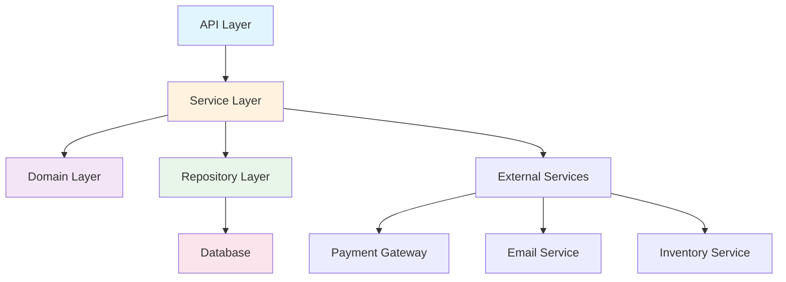

# Real-World Applications & Case Studies

## Learning Objectives
- Apply OOP principles to real-world projects
- Design complete production-ready systems
- Integrate all learned patterns and principles
- Build portfolio-worthy projects
- Prepare for FAANG-level system design interviews

## Table of Contents
1. [E-Commerce Backend System](#ecommerce-system)
2. [Task Management API](#task-management)
3. [Real-Time Chat Application](#chat-application)
4. [Data Processing Pipeline](#data-pipeline)
5. [System Design Examples](#system-design)

---

## E-Commerce Backend System

### System Architecture



### Domain Models

```python
from dataclasses import dataclass
from typing import List, Optional
from decimal import Decimal
from datetime import datetime
from enum import Enum


class OrderStatus(Enum):
    """Order status enum."""
    PENDING = "pending"
    CONFIRMED = "confirmed"
    SHIPPED = "shipped"
    DELIVERED = "delivered"
    CANCELLED = "cancelled"


@dataclass(frozen=True)
class Money:
    """Value object for money."""
    amount: Decimal
    currency: str = "USD"

    def __post_init__(self):
        if self.amount < 0:
            raise ValueError("Amount cannot be negative")

    def add(self, other: "Money") -> "Money":
        """Add money."""
        if self.currency != other.currency:
            raise ValueError("Currency mismatch")
        return Money(self.amount + other.amount, self.currency)

    def multiply(self, factor: int) -> "Money":
        """Multiply money."""
        return Money(self.amount * factor, self.currency)


@dataclass
class Product:
    """Product entity."""
    id: Optional[int]
    name: str
    description: str
    price: Money
    stock_quantity: int
    category: str

    def is_available(self, quantity: int) -> bool:
        """Check if product is available."""
        return self.stock_quantity >= quantity

    def reduce_stock(self, quantity: int) -> None:
        """Reduce stock quantity."""
        if not self.is_available(quantity):
            raise ValueError("Insufficient stock")
        self.stock_quantity -= quantity


@dataclass
class OrderItem:
    """Order item value object."""
    product: Product
    quantity: int
    price_at_purchase: Money

    def subtotal(self) -> Money:
        """Calculate subtotal."""
        return self.price_at_purchase.multiply(self.quantity)


class Order:
    """Order aggregate root."""

    def __init__(
        self,
        order_id: Optional[int],
        customer_id: int,
        items: Optional[List[OrderItem]] = None
    ):
        self.id = order_id
        self.customer_id = customer_id
        self._items: List[OrderItem] = items or []
        self.status = OrderStatus.PENDING
        self.created_at = datetime.now()
        self.updated_at = datetime.now()

    def add_item(self, product: Product, quantity: int) -> None:
        """Add item to order."""
        if quantity <= 0:
            raise ValueError("Quantity must be positive")

        if not product.is_available(quantity):
            raise ValueError(f"Product {product.name} not available")

        item = OrderItem(
            product=product,
            quantity=quantity,
            price_at_purchase=product.price
        )
        self._items.append(item)
        self.updated_at = datetime.now()

    def total(self) -> Money:
        """Calculate order total."""
        if not self._items:
            return Money(Decimal("0.00"))

        total = self._items[0].subtotal()
        for item in self._items[1:]:
            total = total.add(item.subtotal())
        return total

    def confirm(self) -> None:
        """Confirm order."""
        if self.status != OrderStatus.PENDING:
            raise ValueError("Only pending orders can be confirmed")

        if not self._items:
            raise ValueError("Cannot confirm empty order")

        # Reduce stock for all items
        for item in self._items:
            item.product.reduce_stock(item.quantity)

        self.status = OrderStatus.CONFIRMED
        self.updated_at = datetime.now()

    def ship(self) -> None:
        """Mark order as shipped."""
        if self.status != OrderStatus.CONFIRMED:
            raise ValueError("Only confirmed orders can be shipped")

        self.status = OrderStatus.SHIPPED
        self.updated_at = datetime.now()

    def cancel(self) -> None:
        """Cancel order."""
        if self.status in [OrderStatus.SHIPPED, OrderStatus.DELIVERED]:
            raise ValueError("Cannot cancel shipped or delivered orders")

        # Restore stock
        if self.status == OrderStatus.CONFIRMED:
            for item in self._items:
                item.product.stock_quantity += item.quantity

        self.status = OrderStatus.CANCELLED
        self.updated_at = datetime.now()
```

### Repository Layer

```python
from abc import ABC, abstractmethod


class ProductRepository(ABC):
    """Product repository interface."""

    @abstractmethod
    async def find_by_id(self, product_id: int) -> Optional[Product]:
        pass

    @abstractmethod
    async def find_by_category(self, category: str) -> List[Product]:
        pass

    @abstractmethod
    async def save(self, product: Product) -> Product:
        pass


class OrderRepository(ABC):
    """Order repository interface."""

    @abstractmethod
    async def find_by_id(self, order_id: int) -> Optional[Order]:
        pass

    @abstractmethod
    async def find_by_customer(self, customer_id: int) -> List[Order]:
        pass

    @abstractmethod
    async def save(self, order: Order) -> Order:
        pass
```

### Service Layer

```python
class OrderService:
    """Order service with business logic."""

    def __init__(
        self,
        order_repository: OrderRepository,
        product_repository: ProductRepository,
        payment_service: "PaymentService",
        notification_service: "NotificationService",
        logger: "Logger"
    ):
        self.order_repository = order_repository
        self.product_repository = product_repository
        self.payment_service = payment_service
        self.notification_service = notification_service
        self.logger = logger

    async def create_order(
        self,
        customer_id: int,
        items: List[Dict[str, any]]
    ) -> Order:
        """Create new order.

        Args:
            customer_id: Customer ID
            items: List of {product_id, quantity}

        Returns:
            Created order
        """
        # Create order
        order = Order(order_id=None, customer_id=customer_id)

        # Add items
        for item_data in items:
            product = await self.product_repository.find_by_id(item_data['product_id'])
            if not product:
                raise ValueError(f"Product {item_data['product_id']} not found")

            order.add_item(product, item_data['quantity'])

        # Save order
        order = await self.order_repository.save(order)

        self.logger.info(f"Order created: {order.id}")

        return order

    async def checkout_order(
        self,
        order_id: int,
        payment_method: str
    ) -> bool:
        """Checkout order with payment.

        Args:
            order_id: Order ID
            payment_method: Payment method

        Returns:
            True if successful
        """
        # Get order
        order = await self.order_repository.find_by_id(order_id)
        if not order:
            raise ValueError(f"Order {order_id} not found")

        # Process payment
        total = order.total()
        payment_successful = await self.payment_service.process_payment(
            order.customer_id,
            total,
            payment_method
        )

        if not payment_successful:
            self.logger.error(f"Payment failed for order {order_id}")
            return False

        # Confirm order
        order.confirm()
        await self.order_repository.save(order)

        # Send confirmation email
        await self.notification_service.send_order_confirmation(order)

        self.logger.info(f"Order confirmed: {order_id}")

        return True

    async def get_customer_orders(self, customer_id: int) -> List[Order]:
        """Get customer's orders."""
        return await self.order_repository.find_by_customer(customer_id)
```

---

## Task Management API

### Domain Models

```python
from enum import Enum


class Priority(Enum):
    """Task priority."""
    LOW = 1
    MEDIUM = 2
    HIGH = 3
    CRITICAL = 4


class TaskStatus(Enum):
    """Task status."""
    TODO = "todo"
    IN_PROGRESS = "in_progress"
    REVIEW = "review"
    DONE = "done"


@dataclass
class Task:
    """Task entity."""
    id: Optional[int]
    title: str
    description: str
    assignee_id: Optional[int]
    priority: Priority
    status: TaskStatus
    created_at: datetime
    due_date: Optional[datetime]
    completed_at: Optional[datetime]

    def assign_to(self, user_id: int) -> None:
        """Assign task to user."""
        self.assignee_id = user_id

    def start(self) -> None:
        """Start task."""
        if self.status != TaskStatus.TODO:
            raise ValueError("Only TODO tasks can be started")
        self.status = TaskStatus.IN_PROGRESS

    def complete(self) -> None:
        """Complete task."""
        if self.status != TaskStatus.IN_PROGRESS:
            raise ValueError("Only IN_PROGRESS tasks can be completed")
        self.status = TaskStatus.DONE
        self.completed_at = datetime.now()

    def is_overdue(self) -> bool:
        """Check if task is overdue."""
        if not self.due_date or self.status == TaskStatus.DONE:
            return False
        return datetime.now() > self.due_date


class Project:
    """Project aggregate root."""

    def __init__(
        self,
        project_id: Optional[int],
        name: str,
        owner_id: int
    ):
        self.id = project_id
        self.name = name
        self.owner_id = owner_id
        self._tasks: List[Task] = []
        self._members: Set[int] = {owner_id}

    def add_task(self, task: Task) -> None:
        """Add task to project."""
        self._tasks.append(task)

    def add_member(self, user_id: int) -> None:
        """Add member to project."""
        self._members.add(user_id)

    def get_overdue_tasks(self) -> List[Task]:
        """Get overdue tasks."""
        return [task for task in self._tasks if task.is_overdue()]

    def get_progress(self) -> float:
        """Get project completion percentage."""
        if not self._tasks:
            return 0.0

        completed = sum(1 for task in self._tasks if task.status == TaskStatus.DONE)
        return (completed / len(self._tasks)) * 100
```

### Use Cases

```python
class CreateTaskUseCase:
    """Use case for creating tasks."""

    def __init__(
        self,
        task_repository: "TaskRepository",
        project_repository: "ProjectRepository"
    ):
        self.task_repository = task_repository
        self.project_repository = project_repository

    async def execute(
        self,
        project_id: int,
        title: str,
        description: str,
        priority: Priority,
        due_date: Optional[datetime] = None
    ) -> Task:
        """Execute use case."""
        # Validate project exists
        project = await self.project_repository.find_by_id(project_id)
        if not project:
            raise ValueError(f"Project {project_id} not found")

        # Create task
        task = Task(
            id=None,
            title=title,
            description=description,
            assignee_id=None,
            priority=priority,
            status=TaskStatus.TODO,
            created_at=datetime.now(),
            due_date=due_date,
            completed_at=None
        )

        # Save task
        task = await self.task_repository.save(task)

        # Add to project
        project.add_task(task)
        await self.project_repository.save(project)

        return task
```

---

## Real-Time Chat Application

### WebSocket Handler

```python
import asyncio
from typing import Set


class ChatRoom:
    """Chat room with WebSocket connections."""

    def __init__(self, room_id: str):
        self.room_id = room_id
        self._connections: Set[WebSocket] = set()
        self._messages: List[Dict] = []

    async def add_connection(self, websocket: WebSocket) -> None:
        """Add WebSocket connection."""
        self._connections.add(websocket)

    async def remove_connection(self, websocket: WebSocket) -> None:
        """Remove WebSocket connection."""
        self._connections.discard(websocket)

    async def broadcast(self, message: Dict) -> None:
        """Broadcast message to all connections."""
        self._messages.append(message)

        # Send to all connections
        disconnected = set()
        for connection in self._connections:
            try:
                await connection.send_json(message)
            except Exception:
                disconnected.add(connection)

        # Remove disconnected
        self._connections -= disconnected


class ChatService:
    """Chat service managing rooms."""

    def __init__(self):
        self._rooms: Dict[str, ChatRoom] = {}

    def get_or_create_room(self, room_id: str) -> ChatRoom:
        """Get or create chat room."""
        if room_id not in self._rooms:
            self._rooms[room_id] = ChatRoom(room_id)
        return self._rooms[room_id]

    async def send_message(
        self,
        room_id: str,
        user_id: int,
        message: str
    ) -> None:
        """Send message to room."""
        room = self.get_or_create_room(room_id)

        message_data = {
            'user_id': user_id,
            'message': message,
            'timestamp': datetime.now().isoformat()
        }

        await room.broadcast(message_data)
```

---

## Data Processing Pipeline

### Pipeline Architecture

```python
from abc import ABC, abstractmethod


class DataProcessor(ABC):
    """Abstract data processor."""

    @abstractmethod
    async def process(self, data: Any) -> Any:
        """Process data."""
        pass


class Pipeline:
    """Data processing pipeline."""

    def __init__(self):
        self._processors: List[DataProcessor] = []

    def add_processor(self, processor: DataProcessor) -> "Pipeline":
        """Add processor to pipeline."""
        self._processors.append(processor)
        return self

    async def execute(self, data: Any) -> Any:
        """Execute pipeline."""
        result = data
        for processor in self._processors:
            result = await processor.process(result)
        return result


# Concrete processors
class ValidateProcessor(DataProcessor):
    """Validate data."""

    async def process(self, data: Dict) -> Dict:
        """Validate data."""
        required_fields = ['id', 'name', 'email']
        for field in required_fields:
            if field not in data:
                raise ValueError(f"Missing required field: {field}")
        return data


class TransformProcessor(DataProcessor):
    """Transform data."""

    async def process(self, data: Dict) -> Dict:
        """Transform data."""
        data['name'] = data['name'].upper()
        data['email'] = data['email'].lower()
        return data


class EnrichProcessor(DataProcessor):
    """Enrich data."""

    async def process(self, data: Dict) -> Dict:
        """Enrich data."""
        data['processed_at'] = datetime.now().isoformat()
        return data


# Usage
pipeline = (Pipeline()
    .add_processor(ValidateProcessor())
    .add_processor(TransformProcessor())
    .add_processor(EnrichProcessor())
)

result = await pipeline.execute({
    'id': 1,
    'name': 'alice',
    'email': 'ALICE@EXAMPLE.COM'
})
```

---

## System Design Examples

### URL Shortener System

```python
import hashlib
import random
import string


class URLShortener:
    """URL shortening service."""

    def __init__(self):
        self._url_map: Dict[str, str] = {}
        self._reverse_map: Dict[str, str] = {}
        self._base_url = "http://short.url/"

    def shorten(self, long_url: str) -> str:
        """Shorten URL.

        Args:
            long_url: Original URL

        Returns:
            Shortened URL
        """
        # Check if already shortened
        if long_url in self._reverse_map:
            return self._base_url + self._reverse_map[long_url]

        # Generate short code
        short_code = self._generate_short_code(long_url)

        # Store mapping
        self._url_map[short_code] = long_url
        self._reverse_map[long_url] = short_code

        return self._base_url + short_code

    def expand(self, short_url: str) -> Optional[str]:
        """Expand shortened URL."""
        short_code = short_url.replace(self._base_url, "")
        return self._url_map.get(short_code)

    def _generate_short_code(self, url: str) -> str:
        """Generate short code from URL."""
        # Use hash + random for uniqueness
        hash_object = hashlib.md5(url.encode())
        hash_hex = hash_object.hexdigest()
        return hash_hex[:7]
```

---

## Summary

### Project Completion Checklist

For each real-world project:
- [ ] Domain models with business logic
- [ ] Repository pattern for data access
- [ ] Service layer for use cases
- [ ] Comprehensive error handling
- [ ] Unit and integration tests
- [ ] Async operations where appropriate
- [ ] Logging and monitoring
- [ ] Documentation

### Skills Demonstrated

- **OOP Principles**: Encapsulation, inheritance, polymorphism
- **Design Patterns**: Repository, Service Layer, Strategy, Observer
- **SOLID Principles**: Applied throughout
- **Clean Architecture**: Layered design
- **Testing**: TDD, mocking, integration tests
- **Production Ready**: Logging, monitoring, error handling

### Portfolio Projects

Complete these projects to build your portfolio:
1. E-commerce backend API
2. Task management system
3. Real-time chat application
4. Data processing pipeline
5. URL shortener service

### Next Steps

You've completed the Python OOP Masterclass! You now have:
- Deep understanding of OOP principles
- Knowledge of all 23 design patterns
- Clean architecture skills
- Production-ready code patterns
- Real-world project experience

**Ready for FAANG interviews!**

## Interview Preparation

### System Design Questions

1. Design an e-commerce platform
2. Design a task management system
3. Design a real-time chat application
4. Design a data processing pipeline
5. Design a URL shortener

### Coding Questions

1. Implement an order management system
2. Build a shopping cart with promotions
3. Create a notification system
4. Design a caching layer
5. Implement rate limiting

### Architecture Questions

1. How would you scale an e-commerce system?
2. How do you ensure data consistency?
3. How do you handle failovers?
4. How do you monitor production systems?
5. How do you handle technical debt?
