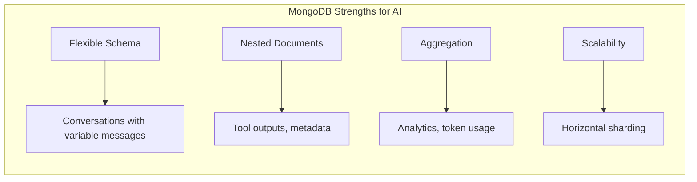
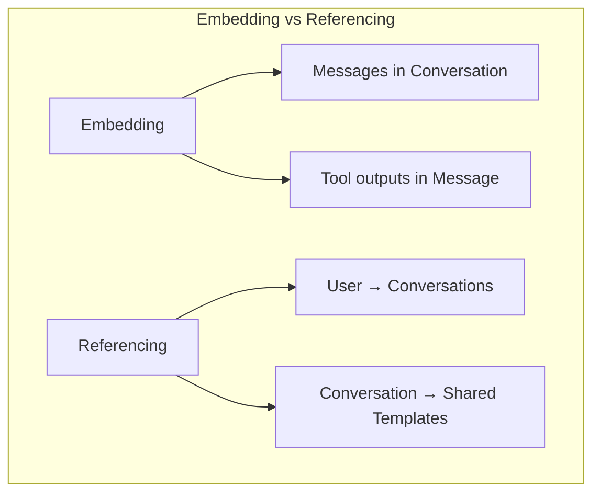
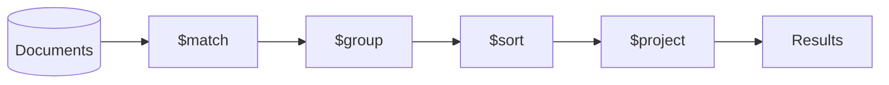

# Module 08b: MongoDB Deep Dive for AI Applications

> **Level**: Intermediate → Advanced | **Time**: 10-12 hours | **Prerequisites**: Module 08a

## Overview

This module provides comprehensive coverage of MongoDB for AI applications. You'll master document modeling, aggregation pipelines, indexing strategies, transactions, and async patterns using PyMongo's async API.

### Why MongoDB for AI?



| Use Case | Why MongoDB |
|----------|-------------|
| **Conversations** | Variable-length message arrays, nested tool calls |
| **User Preferences** | Schema evolves over time without migrations |
| **LLM Outputs** | Complex nested metadata (tokens, latency, model params) |
| **Analytics** | Aggregation pipelines for usage patterns |

> **Interview Insight**: "Why MongoDB over PostgreSQL for AI apps?"
> 
> **Answer**: MongoDB excels when data is **semi-structured** (like LLM responses with variable tool calls), **accessed as whole documents** (fetch entire conversation), and **schema evolves frequently** (new model features). PostgreSQL is better for **strict relational data** (billing), **complex joins** (reports), and **ACID guarantees** (financial transactions).

### Key Concepts to Master

| Concept | What It Is | Why It Matters |
|---------|-----------|----------------|
| **Document Model** | BSON documents with nested structures | Natural fit for JSON-heavy AI APIs |
| **Embedding** | Nested documents inside parent | Fast reads, atomic updates |
| **Referencing** | Storing ObjectId links | Many-to-many, large sub-docs |
| **Aggregation** | Server-side data processing | Analytics without loading to Python |
| **Indexes** | B-tree/text/geospatial | Query performance (critical!) |

> **Note (Dec 2025)**: Motor was deprecated in May 2025. Use **PyMongo Async API** (`pymongo>=4.7`) for async operations.

---


## Part 1: PyMongo Async Setup

### Modern Async Client

```python
from pymongo import AsyncMongoClient
from pymongo.errors import ConnectionFailure, OperationFailure
from pydantic_settings import BaseSettings
from contextlib import asynccontextmanager
from typing import Optional
import asyncio


# ==============================================================================
# CONFIGURATION
# ==============================================================================

class MongoSettings(BaseSettings):
    """MongoDB configuration from environment."""
    
    mongodb_url: str = "mongodb://localhost:27017"
    database_name: str = "ai_platform"
    max_pool_size: int = 10
    min_pool_size: int = 1
    
    class Config:
        env_prefix = "MONGO_"


# ==============================================================================
# CONNECTION MANAGER
# ==============================================================================

class MongoDB:
    """
    MongoDB connection manager using PyMongo Async API.
    
    Motor was deprecated in May 2025. PyMongo 4.7+ provides
    native async support via AsyncMongoClient.
    """
    
    _client: Optional[AsyncMongoClient] = None
    _settings: Optional[MongoSettings] = None
    
    @classmethod
    async def connect(cls, settings: Optional[MongoSettings] = None):
        """Initialize async MongoDB connection."""
        cls._settings = settings or MongoSettings()
        
        cls._client = AsyncMongoClient(
            cls._settings.mongodb_url,
            maxPoolSize=cls._settings.max_pool_size,
            minPoolSize=cls._settings.min_pool_size,
        )
        
        # Verify connection
        try:
            await cls._client.admin.command("ping")
            print(f"[STARTUP] MongoDB connected: {cls._settings.database_name}")
        except ConnectionFailure as e:
            print(f"[ERROR] MongoDB connection failed: {e}")
            raise
    
    @classmethod
    async def disconnect(cls):
        """Close MongoDB connection."""
        if cls._client:
            cls._client.close()
            cls._client = None
            print("[SHUTDOWN] MongoDB disconnected")
    
    @classmethod
    def get_database(cls):
        """Get database instance."""
        if not cls._client:
            raise RuntimeError("MongoDB not connected. Call connect() first.")
        return cls._client[cls._settings.database_name]
    
    @classmethod
    def get_collection(cls, name: str):
        """Get collection by name."""
        return cls.get_database()[name]


# ==============================================================================
# FASTAPI INTEGRATION
# ==============================================================================

@asynccontextmanager
async def mongodb_lifespan(app):
    """Lifespan context manager for FastAPI."""
    await MongoDB.connect()
    yield
    await MongoDB.disconnect()


# Usage in FastAPI:
# app = FastAPI(lifespan=mongodb_lifespan)
```

---

## Part 2: Document Modeling for AI

### Schema Design Patterns



**Embedding Guidelines:**
- Embed when data is always accessed together
- Embed when child documents are small and bounded
- Don't embed if array can grow unbounded

**Referencing Guidelines:**
- Reference when entities are accessed independently
- Reference when documents would exceed 16MB limit
- Reference for many-to-many relationships

### AI-Optimized Document Models

```python
from pydantic import BaseModel, Field, ConfigDict
from typing import Optional, List, Dict, Any, Literal
from datetime import datetime
from bson import ObjectId


# ==============================================================================
# CUSTOM TYPES
# ==============================================================================

class PyObjectId(str):
    """ObjectId that serializes to string."""
    
    @classmethod
    def __get_pydantic_core_schema__(cls, _source_type, _handler):
        from pydantic_core import core_schema
        return core_schema.str_schema()
    
    @classmethod
    def validate(cls, v):
        if isinstance(v, ObjectId):
            return str(v)
        if ObjectId.is_valid(v):
            return str(v)
        raise ValueError("Invalid ObjectId")


# ==============================================================================
# MESSAGE MODELS (Embedded in Conversation)
# ==============================================================================

class ToolCall(BaseModel):
    """Tool/function call in a message."""
    name: str
    arguments: Dict[str, Any]
    result: Optional[str] = None


class TokenUsage(BaseModel):
    """Token usage for a message."""
    prompt_tokens: int = 0
    completion_tokens: int = 0
    total_tokens: int = 0
    
    @property
    def cost_estimate(self) -> float:
        """Estimate cost (GPT-4 pricing)."""
        return (self.prompt_tokens * 0.03 + self.completion_tokens * 0.06) / 1000


class Message(BaseModel):
    """Message embedded in conversation."""
    
    role: Literal["system", "user", "assistant", "tool"]
    content: str
    
    # Optional fields
    tool_calls: Optional[List[ToolCall]] = None
    tool_call_id: Optional[str] = None  # For tool responses
    
    # Metadata
    usage: Optional[TokenUsage] = None
    model: Optional[str] = None
    latency_ms: Optional[int] = None
    
    created_at: datetime = Field(default_factory=datetime.utcnow)
    
    model_config = ConfigDict(populate_by_name=True)


# ==============================================================================
# CONVERSATION MODEL
# ==============================================================================

class ConversationSettings(BaseModel):
    """Conversation-level settings."""
    temperature: float = 0.7
    max_tokens: int = 4096
    system_prompt: Optional[str] = None
    tools_enabled: bool = True


class Conversation(BaseModel):
    """
    Conversation document.
    
    Design decisions:
    - Messages embedded (always accessed together, bounded by context window)
    - Settings embedded (small, accessed with conversation)
    - User referenced (separate access patterns)
    """
    
    id: Optional[PyObjectId] = Field(default=None, alias="_id")
    user_id: str  # Reference to users collection
    
    title: Optional[str] = None
    model: str = "gpt-4"
    
    # Embedded documents
    messages: List[Message] = Field(default_factory=list)
    settings: ConversationSettings = Field(default_factory=ConversationSettings)
    
    # Aggregated stats (denormalized for fast queries)
    message_count: int = 0
    total_tokens: int = 0
    total_cost: float = 0.0
    
    # Metadata
    tags: List[str] = Field(default_factory=list)
    metadata: Dict[str, Any] = Field(default_factory=dict)
    
    # Timestamps
    created_at: datetime = Field(default_factory=datetime.utcnow)
    updated_at: datetime = Field(default_factory=datetime.utcnow)
    last_message_at: Optional[datetime] = None
    
    model_config = ConfigDict(populate_by_name=True)
    
    def add_message(self, message: Message):
        """Add message and update stats."""
        self.messages.append(message)
        self.message_count = len(self.messages)
        self.last_message_at = message.created_at
        self.updated_at = datetime.utcnow()
        
        if message.usage:
            self.total_tokens += message.usage.total_tokens
            self.total_cost += message.usage.cost_estimate


# ==============================================================================
# USER MODEL
# ==============================================================================

class UserQuota(BaseModel):
    """User's usage quota."""
    tokens_limit: int = 100000
    tokens_used: int = 0
    reset_at: datetime = Field(default_factory=datetime.utcnow)
    
    @property
    def remaining(self) -> int:
        return max(0, self.tokens_limit - self.tokens_used)


class User(BaseModel):
    """User document."""
    
    id: Optional[PyObjectId] = Field(default=None, alias="_id")
    email: str
    name: str
    tier: Literal["free", "pro", "enterprise"] = "free"
    
    # Embedded quota (small, always accessed with user)
    quota: UserQuota = Field(default_factory=UserQuota)
    
    # Preferences (can grow, but bounded)
    preferences: Dict[str, Any] = Field(default_factory=dict)
    
    created_at: datetime = Field(default_factory=datetime.utcnow)
    updated_at: datetime = Field(default_factory=datetime.utcnow)
    
    model_config = ConfigDict(populate_by_name=True)
```

---

## Part 3: Repository Pattern

### Type-Safe Async Repository

```python
from abc import ABC, abstractmethod
from typing import TypeVar, Generic, List, Optional, Type
from bson import ObjectId


T = TypeVar("T", bound=BaseModel)


class Repository(ABC, Generic[T]):
    """Abstract repository interface."""
    
    @abstractmethod
    async def find_by_id(self, id: str) -> Optional[T]:
        pass
    
    @abstractmethod
    async def find_all(self, limit: int = 100, skip: int = 0) -> List[T]:
        pass
    
    @abstractmethod
    async def create(self, entity: T) -> T:
        pass
    
    @abstractmethod
    async def update(self, id: str, entity: T) -> Optional[T]:
        pass
    
    @abstractmethod
    async def delete(self, id: str) -> bool:
        pass


class MongoRepository(Repository[T]):
    """MongoDB repository implementation."""
    
    def __init__(self, collection_name: str, model_class: Type[T]):
        self.collection = MongoDB.get_collection(collection_name)
        self.model_class = model_class
    
    async def find_by_id(self, id: str) -> Optional[T]:
        doc = await self.collection.find_one({"_id": ObjectId(id)})
        if doc:
            return self.model_class(**doc)
        return None
    
    async def find_all(self, limit: int = 100, skip: int = 0) -> List[T]:
        cursor = self.collection.find().skip(skip).limit(limit)
        return [self.model_class(**doc) async for doc in cursor]
    
    async def create(self, entity: T) -> T:
        doc = entity.model_dump(by_alias=True, exclude={"id"})
        result = await self.collection.insert_one(doc)
        entity.id = str(result.inserted_id)
        return entity
    
    async def update(self, id: str, entity: T) -> Optional[T]:
        doc = entity.model_dump(by_alias=True, exclude={"id"})
        doc["updated_at"] = datetime.utcnow()
        
        result = await self.collection.update_one(
            {"_id": ObjectId(id)},
            {"$set": doc}
        )
        
        if result.modified_count > 0:
            return await self.find_by_id(id)
        return None
    
    async def delete(self, id: str) -> bool:
        result = await self.collection.delete_one({"_id": ObjectId(id)})
        return result.deleted_count > 0


# ==============================================================================
# SPECIALIZED REPOSITORIES
# ==============================================================================

class ConversationRepository(MongoRepository[Conversation]):
    """Conversation-specific operations."""
    
    def __init__(self):
        super().__init__("conversations", Conversation)
    
    async def find_by_user(
        self,
        user_id: str,
        limit: int = 20,
        skip: int = 0
    ) -> List[Conversation]:
        """Get user's conversations, most recent first."""
        cursor = self.collection.find(
            {"user_id": user_id}
        ).sort("updated_at", -1).skip(skip).limit(limit)
        
        return [Conversation(**doc) async for doc in cursor]
    
    async def add_message(self, conv_id: str, message: Message) -> bool:
        """Add message and update stats atomically."""
        update = {
            "$push": {"messages": message.model_dump()},
            "$inc": {
                "message_count": 1,
                "total_tokens": message.usage.total_tokens if message.usage else 0,
            },
            "$set": {
                "updated_at": datetime.utcnow(),
                "last_message_at": message.created_at,
            }
        }
        
        if message.usage:
            update["$inc"]["total_cost"] = message.usage.cost_estimate
        
        result = await self.collection.update_one(
            {"_id": ObjectId(conv_id)},
            update
        )
        return result.modified_count > 0
    
    async def search_messages(
        self,
        user_id: str,
        query: str,
        limit: int = 10
    ) -> List[Conversation]:
        """Search conversations by message content."""
        cursor = self.collection.find({
            "user_id": user_id,
            "messages.content": {"$regex": query, "$options": "i"}
        }).limit(limit)
        
        return [Conversation(**doc) async for doc in cursor]


class UserRepository(MongoRepository[User]):
    """User-specific operations."""
    
    def __init__(self):
        super().__init__("users", User)
    
    async def find_by_email(self, email: str) -> Optional[User]:
        doc = await self.collection.find_one({"email": email})
        if doc:
            return User(**doc)
        return None
    
    async def update_quota(self, user_id: str, tokens_used: int) -> bool:
        """Atomically update token usage."""
        result = await self.collection.update_one(
            {"_id": ObjectId(user_id)},
            {
                "$inc": {"quota.tokens_used": tokens_used},
                "$set": {"updated_at": datetime.utcnow()}
            }
        )
        return result.modified_count > 0
    
    async def reset_quota(self, user_id: str) -> bool:
        """Reset user's quota."""
        result = await self.collection.update_one(
            {"_id": ObjectId(user_id)},
            {
                "$set": {
                    "quota.tokens_used": 0,
                    "quota.reset_at": datetime.utcnow(),
                    "updated_at": datetime.utcnow()
                }
            }
        )
        return result.modified_count > 0
```

---

## Part 4: Aggregation Pipelines

### Why Aggregation?

Aggregation pipelines process data through stages, enabling:
- Complex analytics without loading all data into Python
- Server-side computation (faster, less network)
- Real-time dashboards and reports



### AI Analytics Pipelines

```python
from typing import Dict, Any, List
from datetime import datetime, timedelta


class AnalyticsService:
    """MongoDB aggregation pipelines for AI analytics."""
    
    def __init__(self):
        self.conversations = MongoDB.get_collection("conversations")
        self.users = MongoDB.get_collection("users")
    
    async def get_usage_by_model(
        self,
        user_id: str,
        days: int = 30
    ) -> List[Dict[str, Any]]:
        """
        Get token usage breakdown by model.
        
        Pipeline stages:
        1. $match - Filter by user and date range
        2. $group - Sum tokens per model
        3. $sort - Order by usage
        """
        start_date = datetime.utcnow() - timedelta(days=days)
        
        pipeline = [
            # Stage 1: Filter
            {
                "$match": {
                    "user_id": user_id,
                    "created_at": {"$gte": start_date}
                }
            },
            # Stage 2: Group by model
            {
                "$group": {
                    "_id": "$model",
                    "total_tokens": {"$sum": "$total_tokens"},
                    "total_cost": {"$sum": "$total_cost"},
                    "conversation_count": {"$sum": 1},
                    "message_count": {"$sum": "$message_count"}
                }
            },
            # Stage 3: Sort by tokens
            {"$sort": {"total_tokens": -1}},
            # Stage 4: Reshape output
            {
                "$project": {
                    "_id": 0,
                    "model": "$_id",
                    "total_tokens": 1,
                    "total_cost": {"$round": ["$total_cost", 4]},
                    "conversation_count": 1,
                    "message_count": 1,
                    "avg_tokens_per_conv": {
                        "$round": [
                            {"$divide": ["$total_tokens", "$conversation_count"]},
                            0
                        ]
                    }
                }
            }
        ]
        
        return [doc async for doc in self.conversations.aggregate(pipeline)]
    
    async def get_daily_usage(
        self,
        user_id: str,
        days: int = 7
    ) -> List[Dict[str, Any]]:
        """
        Get daily token usage for trend charts.
        
        Uses $dateToString to group by date.
        """
        start_date = datetime.utcnow() - timedelta(days=days)
        
        pipeline = [
            {"$match": {
                "user_id": user_id,
                "created_at": {"$gte": start_date}
            }},
            # Unwind messages to get individual message stats
            {"$unwind": "$messages"},
            # Group by date
            {"$group": {
                "_id": {
                    "$dateToString": {
                        "format": "%Y-%m-%d",
                        "date": "$messages.created_at"
                    }
                },
                "tokens": {"$sum": "$messages.usage.total_tokens"},
                "messages": {"$sum": 1}
            }},
            {"$sort": {"_id": 1}},
            {"$project": {
                "_id": 0,
                "date": "$_id",
                "tokens": 1,
                "messages": 1
            }}
        ]
        
        return [doc async for doc in self.conversations.aggregate(pipeline)]
    
    async def get_top_users_by_usage(
        self,
        limit: int = 10
    ) -> List[Dict[str, Any]]:
        """
        Get top users by token usage.
        
        Uses $lookup to join with users collection.
        """
        pipeline = [
            # Group conversations by user
            {"$group": {
                "_id": "$user_id",
                "total_tokens": {"$sum": "$total_tokens"},
                "total_cost": {"$sum": "$total_cost"},
                "conversation_count": {"$sum": 1}
            }},
            {"$sort": {"total_tokens": -1}},
            {"$limit": limit},
            # Join with users collection
            {"$lookup": {
                "from": "users",
                "localField": "_id",
                "foreignField": "_id",
                "as": "user_info"
            }},
            {"$unwind": "$user_info"},
            {"$project": {
                "_id": 0,
                "user_id": "$_id",
                "email": "$user_info.email",
                "tier": "$user_info.tier",
                "total_tokens": 1,
                "total_cost": {"$round": ["$total_cost", 2]},
                "conversation_count": 1
            }}
        ]
        
        return [doc async for doc in self.conversations.aggregate(pipeline)]
    
    async def get_model_performance_stats(self) -> List[Dict[str, Any]]:
        """
        Get average latency and token stats per model.
        
        Useful for identifying slow models.
        """
        pipeline = [
            {"$unwind": "$messages"},
            {"$match": {
                "messages.role": "assistant",
                "messages.latency_ms": {"$exists": True}
            }},
            {"$group": {
                "_id": "$messages.model",
                "avg_latency_ms": {"$avg": "$messages.latency_ms"},
                "min_latency_ms": {"$min": "$messages.latency_ms"},
                "max_latency_ms": {"$max": "$messages.latency_ms"},
                "avg_tokens": {"$avg": "$messages.usage.completion_tokens"},
                "message_count": {"$sum": 1}
            }},
            {"$project": {
                "_id": 0,
                "model": "$_id",
                "avg_latency_ms": {"$round": ["$avg_latency_ms", 0]},
                "min_latency_ms": 1,
                "max_latency_ms": 1,
                "avg_tokens": {"$round": ["$avg_tokens", 0]},
                "message_count": 1
            }},
            {"$sort": {"avg_latency_ms": 1}}
        ]
        
        return [doc async for doc in self.conversations.aggregate(pipeline)]
```

---

## Part 5: Indexing Strategies

### Index Design for AI Workloads

```python
async def create_indexes():
    """
    Create indexes for common AI workload patterns.
    
    Best practices:
    - Index fields used in $match (filter) first
    - Compound indexes for multi-field queries
    - Consider read/write ratio (indexes slow writes)
    """
    conversations = MongoDB.get_collection("conversations")
    users = MongoDB.get_collection("users")
    
    # ==========================================================================
    # CONVERSATION INDEXES
    # ==========================================================================
    
    # User's conversations (most common query)
    await conversations.create_index(
        [("user_id", 1), ("updated_at", -1)],
        name="user_conversations"
    )
    
    # Date range queries for analytics
    await conversations.create_index(
        [("user_id", 1), ("created_at", -1)],
        name="user_conversations_by_date"
    )
    
    # Text search on conversation titles and messages
    await conversations.create_index(
        [("title", "text"), ("messages.content", "text")],
        name="conversation_text_search",
        default_language="english"
    )
    
    # Tag-based filtering
    await conversations.create_index(
        [("user_id", 1), ("tags", 1)],
        name="user_tags"
    )
    
    # Model usage analytics
    await conversations.create_index(
        [("model", 1), ("created_at", -1)],
        name="model_usage"
    )
    
    # ==========================================================================
    # USER INDEXES
    # ==========================================================================
    
    # Email lookup (unique)
    await users.create_index(
        "email",
        unique=True,
        name="email_unique"
    )
    
    # Tier-based queries
    await users.create_index(
        [("tier", 1), ("quota.tokens_used", -1)],
        name="tier_usage"
    )
    
    print("[SETUP] Indexes created successfully")


async def analyze_query(collection_name: str, query: dict):
    """
    Analyze query execution plan.
    
    Use this to verify index usage.
    """
    collection = MongoDB.get_collection(collection_name)
    
    explanation = await collection.find(query).explain()
    
    # Check if index was used
    winning_plan = explanation.get("queryPlanner", {}).get("winningPlan", {})
    stage = winning_plan.get("stage")
    
    if stage == "COLLSCAN":
        print(f"[WARNING] Collection scan! Consider adding index for: {query}")
    elif stage == "IXSCAN":
        index_name = winning_plan.get("indexName")
        print(f"[OK] Using index: {index_name}")
    
    return explanation
```

---

## Part 6: Transactions

### Multi-Document Transactions

```python
async def create_conversation_with_message(
    user_id: str,
    message: Message
) -> Conversation:
    """
    Create conversation and update user quota atomically.
    
    Uses multi-document transaction for consistency.
    """
    client = MongoDB._client
    
    async with await client.start_session() as session:
        async with session.start_transaction():
            conversations = MongoDB.get_collection("conversations")
            users = MongoDB.get_collection("users")
            
            # Create conversation
            conv = Conversation(
                user_id=user_id,
                messages=[message],
                message_count=1,
                total_tokens=message.usage.total_tokens if message.usage else 0
            )
            
            result = await conversations.insert_one(
                conv.model_dump(by_alias=True, exclude={"id"}),
                session=session
            )
            conv.id = str(result.inserted_id)
            
            # Update user quota
            if message.usage:
                await users.update_one(
                    {"_id": ObjectId(user_id)},
                    {"$inc": {"quota.tokens_used": message.usage.total_tokens}},
                    session=session
                )
            
            # Transaction commits here
            return conv


async def transfer_conversation(
    conv_id: str,
    from_user_id: str,
    to_user_id: str
) -> bool:
    """
    Transfer conversation between users.
    
    Demonstrates transaction with validation.
    """
    client = MongoDB._client
    conversations = MongoDB.get_collection("conversations")
    users = MongoDB.get_collection("users")
    
    async with await client.start_session() as session:
        async with session.start_transaction():
            # Verify conversation belongs to from_user
            conv = await conversations.find_one(
                {"_id": ObjectId(conv_id), "user_id": from_user_id},
                session=session
            )
            
            if not conv:
                raise ValueError("Conversation not found or not owned by user")
            
            # Verify to_user exists
            to_user = await users.find_one(
                {"_id": ObjectId(to_user_id)},
                session=session
            )
            
            if not to_user:
                raise ValueError("Target user not found")
            
            # Transfer
            await conversations.update_one(
                {"_id": ObjectId(conv_id)},
                {
                    "$set": {
                        "user_id": to_user_id,
                        "updated_at": datetime.utcnow(),
                        "metadata.transferred_from": from_user_id,
                        "metadata.transferred_at": datetime.utcnow()
                    }
                },
                session=session
            )
            
            return True
```

---

## Summary

| Topic | Key Patterns |
|-------|--------------|
| **Async** | `AsyncMongoClient` (PyMongo 4.7+, not Motor) |
| **Modeling** | Embed messages, reference users, denormalize stats |
| **Repository** | Generic base + specialized for domain logic |
| **Aggregation** | $match first, $group, $lookup for joins |
| **Indexes** | Compound indexes, text search, explain() |
| **Transactions** | `start_session()`, `start_transaction()` |

---

## Next Steps

Continue to **[Module 08c: Weaviate & Vector Search](08c-weaviate-vector-search.md)** for:
- Weaviate v4.18.x Python client
- Chunking strategies for RAG
- Hybrid search (vector + keyword)
- Reranking for better retrieval
