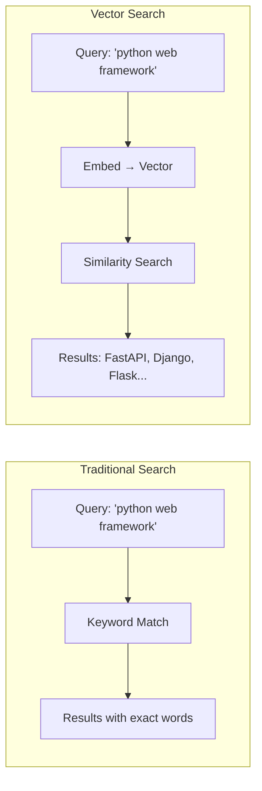
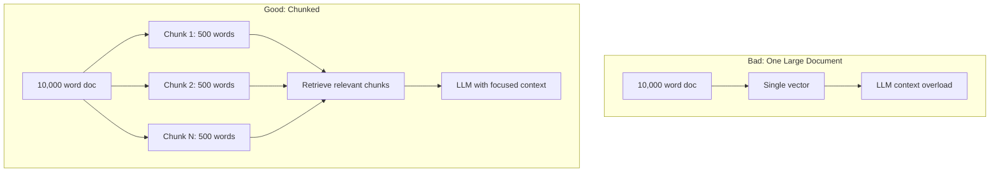

# Module 08c: Weaviate & Vector Search for RAG

> **Level**: Intermediate → Advanced | **Time**: 10-12 hours | **Prerequisites**: Module 08b

## Overview

This module covers Weaviate, a purpose-built vector database for AI applications. You'll master vector search, chunking strategies, hybrid search, and RAG retrieval patterns using the Weaviate v4 Python client.

### What is a Vector Database?



| Aspect | Keyword Search | Vector Search |
|--------|---------------|---------------|
| **Matching** | Exact terms | Semantic meaning |
| **"automobile" vs "car"** | No match | High similarity |
| **Handles typos** | No | Yes |
| **Best for** | Exact lookup | Finding similar content |

> **Interview Insight**: "Why use a vector database instead of PostgreSQL with pgvector?"
> 
> **Answer**: Dedicated vector DBs like Weaviate offer **hybrid search** (vector + BM25), **built-in RAG** (generative modules), **better scaling** for large collections (millions of vectors), and **specialized indexes** (HNSW). Use pgvector for simpler use cases where you already have PostgreSQL and <1M documents.

### Key Concepts to Master

| Concept | What It Is | Interview Importance |
|---------|-----------|----------------------|
| **Embeddings** | Dense vector representations of text | ⭐⭐⭐ Core RAG concept |
| **Cosine Similarity** | Measure of vector alignment | ⭐⭐⭐ How search works |
| **HNSW Index** | Hierarchical graph for fast ANN | ⭐⭐ Performance tuning |
| **Chunking** | Breaking docs into smaller pieces | ⭐⭐⭐ Affects retrieval quality |
| **Hybrid Search** | Vector + keyword combined | ⭐⭐⭐ Production RAG |

### Why Weaviate?

- **Hybrid search**: Combine vector + keyword (best of both)
- **Integrated RAG**: Built-in generative search
- **Multi-tenancy**: Separate data per user
- **Async support**: `WeaviateAsyncClient` since v4.7.0

> **Dec 2025 Status**: Weaviate v1.34.x, Python client v4.18.x

> **Common Pitfall**: Don't skip chunking! Using whole documents as vectors leads to poor retrieval because embeddings lose specificity with longer text.

---


## Part 1: Weaviate v4 Python Client Setup

### Installation & Connection

```python
import weaviate
from weaviate.classes.init import Auth
from weaviate.classes.config import Configure, Property, DataType
from weaviate.classes.query import MetadataQuery, Filter
from contextlib import contextmanager
from typing import Optional


# ==============================================================================
# CONNECTION OPTIONS
# ==============================================================================

def connect_local() -> weaviate.WeaviateClient:
    """Connect to local Weaviate instance."""
    return weaviate.connect_to_local(
        host="localhost",
        port=8080,
        grpc_port=50051,  # gRPC for faster queries
    )


def connect_cloud(
    cluster_url: str,
    api_key: str,
    openai_key: Optional[str] = None
) -> weaviate.WeaviateClient:
    """Connect to Weaviate Cloud."""
    headers = {}
    if openai_key:
        headers["X-OpenAI-Api-Key"] = openai_key
    
    return weaviate.connect_to_weaviate_cloud(
        cluster_url=cluster_url,
        auth_credentials=Auth.api_key(api_key),
        headers=headers,
    )


# ==============================================================================
# ASYNC CLIENT (v4.7.0+)
# ==============================================================================

async def connect_async() -> weaviate.WeaviateAsyncClient:
    """
    Connect using async client.
    
    Available since v4.7.0 for non-blocking operations.
    """
    client = weaviate.use_async_with_local(
        host="localhost",
        port=8080,
    )
    await client.connect()
    return client


# ==============================================================================
# CONNECTION MANAGER
# ==============================================================================

class VectorDB:
    """Weaviate connection manager."""
    
    _client: Optional[weaviate.WeaviateClient] = None
    
    @classmethod
    def connect(cls, **kwargs):
        """Initialize Weaviate connection."""
        cls._client = connect_local(**kwargs)
        
        if cls._client.is_ready():
            print("[STARTUP] Weaviate connected")
        else:
            raise ConnectionError("Weaviate not ready")
    
    @classmethod
    def disconnect(cls):
        """Close connection."""
        if cls._client:
            cls._client.close()
            cls._client = None
            print("[SHUTDOWN] Weaviate disconnected")
    
    @classmethod
    def get_client(cls) -> weaviate.WeaviateClient:
        if not cls._client:
            raise RuntimeError("Weaviate not connected")
        return cls._client
    
    @classmethod
    @contextmanager
    def collection(cls, name: str):
        """Get collection with automatic error handling."""
        try:
            yield cls._client.collections.get(name)
        except Exception as e:
            print(f"[ERROR] Collection {name}: {e}")
            raise
```

---

## Part 2: Schema Design for RAG

### Collection Configuration

```python
from weaviate.classes.config import (
    Configure,
    Property,
    DataType,
    Tokenization,
    VectorDistances,
)


def create_document_collection():
    """
    Create collection for document chunks.
    
    Schema design decisions:
    - source: Original document path
    - chunk_index: Position in document
    - content: Actual text (vectorized)
    - metadata: Flexible JSON for extra info
    """
    client = VectorDB.get_client()
    
    # Delete if exists (development only)
    if client.collections.exists("Document"):
        client.collections.delete("Document")
    
    client.collections.create(
        name="Document",
        
        # Vectorizer: Use OpenAI text-embedding-3-small
        vectorizer_config=Configure.Vectorizer.text2vec_openai(
            model="text-embedding-3-small",
            vectorize_collection_name=False,
        ),
        
        # Generative module for RAG
        generative_config=Configure.Generative.openai(
            model="gpt-4o-mini",
        ),
        
        # Vector index settings
        vector_index_config=Configure.VectorIndex.hnsw(
            distance_metric=VectorDistances.COSINE,
            ef_construction=128,
            max_connections=64,
        ),
        
        # Properties
        properties=[
            Property(
                name="content",
                data_type=DataType.TEXT,
                description="Chunk text content",
                # Tokenization for hybrid search
                tokenization=Tokenization.WORD,
            ),
            Property(
                name="source",
                data_type=DataType.TEXT,
                description="Source document path",
                skip_vectorization=True,  # Don't include in vector
            ),
            Property(
                name="chunk_index",
                data_type=DataType.INT,
                description="Position in original document",
                skip_vectorization=True,
            ),
            Property(
                name="title",
                data_type=DataType.TEXT,
                description="Document title",
            ),
            Property(
                name="metadata",
                data_type=DataType.OBJECT,
                description="Additional metadata",
                skip_vectorization=True,
                nested_properties=[
                    Property(name="author", data_type=DataType.TEXT),
                    Property(name="created_at", data_type=DataType.DATE),
                    Property(name="tokens", data_type=DataType.INT),
                ]
            ),
        ],
    )
    
    print("[SETUP] Created 'Document' collection")


def create_conversation_collection():
    """
    Create collection for conversation history.
    
    Enables semantic search across past conversations.
    """
    client = VectorDB.get_client()
    
    if client.collections.exists("ConversationMessage"):
        client.collections.delete("ConversationMessage")
    
    client.collections.create(
        name="ConversationMessage",
        
        vectorizer_config=Configure.Vectorizer.text2vec_openai(
            model="text-embedding-3-small",
        ),
        
        properties=[
            Property(
                name="content",
                data_type=DataType.TEXT,
                description="Message content",
            ),
            Property(
                name="role",
                data_type=DataType.TEXT,
                skip_vectorization=True,
            ),
            Property(
                name="conversation_id",
                data_type=DataType.TEXT,
                skip_vectorization=True,
            ),
            Property(
                name="user_id",
                data_type=DataType.TEXT,
                skip_vectorization=True,
            ),
            Property(
                name="created_at",
                data_type=DataType.DATE,
                skip_vectorization=True,
            ),
        ],
    )
    
    print("[SETUP] Created 'ConversationMessage' collection")
```

---

## Part 3: Chunking Strategies

### Why Chunking Matters



### Chunking Implementations

```python
from typing import List, Iterator
from dataclasses import dataclass
import re


@dataclass
class Chunk:
    """Document chunk with metadata."""
    content: str
    source: str
    chunk_index: int
    char_start: int
    char_end: int


class ChunkingStrategy:
    """Base class for chunking strategies."""
    
    def chunk(self, text: str, source: str) -> List[Chunk]:
        raise NotImplementedError


class FixedSizeChunker(ChunkingStrategy):
    """
    Split by character count with overlap.
    
    Simple but effective for many use cases.
    """
    
    def __init__(
        self,
        chunk_size: int = 1000,
        chunk_overlap: int = 200
    ):
        self.chunk_size = chunk_size
        self.chunk_overlap = chunk_overlap
    
    def chunk(self, text: str, source: str) -> List[Chunk]:
        chunks = []
        start = 0
        chunk_index = 0
        
        while start < len(text):
            end = start + self.chunk_size
            
            # Try to break at sentence boundary
            if end < len(text):
                # Look for sentence end in last 100 chars
                search_start = max(end - 100, start)
                sentence_ends = [
                    m.end() for m in re.finditer(r'[.!?]\s', text[search_start:end])
                ]
                if sentence_ends:
                    end = search_start + sentence_ends[-1]
            
            chunks.append(Chunk(
                content=text[start:end].strip(),
                source=source,
                chunk_index=chunk_index,
                char_start=start,
                char_end=end,
            ))
            
            # Move start with overlap
            start = end - self.chunk_overlap
            chunk_index += 1
        
        return chunks


class SemanticChunker(ChunkingStrategy):
    """
    Split by semantic boundaries (paragraphs, headers).
    
    Preserves document structure better.
    """
    
    def __init__(
        self,
        min_chunk_size: int = 200,
        max_chunk_size: int = 1500
    ):
        self.min_chunk_size = min_chunk_size
        self.max_chunk_size = max_chunk_size
    
    def chunk(self, text: str, source: str) -> List[Chunk]:
        # Split by double newlines (paragraphs)
        paragraphs = re.split(r'\n\n+', text)
        
        chunks = []
        current_chunk = ""
        chunk_index = 0
        char_pos = 0
        chunk_start = 0
        
        for para in paragraphs:
            para = para.strip()
            if not para:
                continue
            
            # Would adding this paragraph exceed max?
            if len(current_chunk) + len(para) > self.max_chunk_size:
                # Save current chunk if substantial
                if len(current_chunk) >= self.min_chunk_size:
                    chunks.append(Chunk(
                        content=current_chunk.strip(),
                        source=source,
                        chunk_index=chunk_index,
                        char_start=chunk_start,
                        char_end=char_pos,
                    ))
                    chunk_index += 1
                    current_chunk = ""
                    chunk_start = char_pos
            
            current_chunk += para + "\n\n"
            char_pos += len(para) + 2
        
        # Don't forget last chunk
        if current_chunk.strip():
            chunks.append(Chunk(
                content=current_chunk.strip(),
                source=source,
                chunk_index=chunk_index,
                char_start=chunk_start,
                char_end=char_pos,
            ))
        
        return chunks


class MarkdownChunker(ChunkingStrategy):
    """
    Split by markdown headers.
    
    Best for technical documentation.
    """
    
    def __init__(self, max_chunk_size: int = 2000):
        self.max_chunk_size = max_chunk_size
    
    def chunk(self, text: str, source: str) -> List[Chunk]:
        # Split by headers (##, ###, etc.)
        sections = re.split(r'(^#{1,4}\s+.+$)', text, flags=re.MULTILINE)
        
        chunks = []
        current_chunk = ""
        current_header = ""
        chunk_index = 0
        
        for section in sections:
            section = section.strip()
            if not section:
                continue
            
            # Is this a header?
            if re.match(r'^#{1,4}\s+', section):
                # Save previous chunk
                if current_chunk:
                    chunks.append(Chunk(
                        content=f"{current_header}\n{current_chunk}".strip(),
                        source=source,
                        chunk_index=chunk_index,
                        char_start=0,  # Simplified
                        char_end=0,
                    ))
                    chunk_index += 1
                
                current_header = section
                current_chunk = ""
            else:
                current_chunk += section + "\n"
        
        # Last chunk
        if current_chunk:
            chunks.append(Chunk(
                content=f"{current_header}\n{current_chunk}".strip(),
                source=source,
                chunk_index=chunk_index,
                char_start=0,
                char_end=0,
            ))
        
        return chunks
```

---

## Part 4: Ingestion & Batch Operations

### Efficient Data Ingestion

```python
from typing import List, Dict, Any
from datetime import datetime


class DocumentIngester:
    """Ingest documents into Weaviate."""
    
    def __init__(self, chunker: ChunkingStrategy):
        self.chunker = chunker
        self.client = VectorDB.get_client()
        self.collection = self.client.collections.get("Document")
    
    def ingest_document(
        self,
        content: str,
        source: str,
        title: str = "",
        metadata: Dict[str, Any] = None
    ) -> int:
        """Ingest a single document."""
        chunks = self.chunker.chunk(content, source)
        
        with self.collection.batch.dynamic() as batch:
            for chunk in chunks:
                batch.add_object(
                    properties={
                        "content": chunk.content,
                        "source": source,
                        "chunk_index": chunk.chunk_index,
                        "title": title,
                        "metadata": metadata or {},
                    }
                )
        
        return len(chunks)
    
    def ingest_documents(
        self,
        documents: List[Dict[str, Any]]
    ) -> int:
        """
        Batch ingest multiple documents.
        
        documents: List of {"content": str, "source": str, "title": str}
        """
        total_chunks = 0
        
        with self.collection.batch.dynamic() as batch:
            for doc in documents:
                chunks = self.chunker.chunk(
                    doc["content"],
                    doc["source"]
                )
                
                for chunk in chunks:
                    batch.add_object(
                        properties={
                            "content": chunk.content,
                            "source": doc["source"],
                            "chunk_index": chunk.chunk_index,
                            "title": doc.get("title", ""),
                            "metadata": doc.get("metadata", {}),
                        }
                    )
                
                total_chunks += len(chunks)
        
        return total_chunks
    
    def ingest_from_file(self, file_path: str) -> int:
        """Ingest from a text/markdown file."""
        with open(file_path, "r") as f:
            content = f.read()
        
        return self.ingest_document(
            content=content,
            source=file_path,
            title=file_path.split("/")[-1],
        )
```

---

## Part 5: Search Methods

### Vector, Keyword, and Hybrid Search

```python
from dataclasses import dataclass
from typing import List, Optional


@dataclass
class SearchResult:
    """Search result with score and metadata."""
    content: str
    source: str
    score: float
    chunk_index: int
    title: str = ""


class VectorSearch:
    """Weaviate search operations."""
    
    def __init__(self):
        self.client = VectorDB.get_client()
        self.documents = self.client.collections.get("Document")
    
    # ==========================================================================
    # VECTOR SEARCH (Semantic)
    # ==========================================================================
    
    def semantic_search(
        self,
        query: str,
        limit: int = 5,
        min_score: float = 0.0
    ) -> List[SearchResult]:
        """
        Pure vector search by semantic similarity.
        
        Uses cosine similarity between query and document embeddings.
        """
        response = self.documents.query.near_text(
            query=query,
            limit=limit,
            return_metadata=MetadataQuery(distance=True),
        )
        
        results = []
        for obj in response.objects:
            score = 1 - obj.metadata.distance  # distance → similarity
            if score >= min_score:
                results.append(SearchResult(
                    content=obj.properties["content"],
                    source=obj.properties["source"],
                    score=score,
                    chunk_index=obj.properties["chunk_index"],
                    title=obj.properties.get("title", ""),
                ))
        
        return results
    
    # ==========================================================================
    # KEYWORD SEARCH (BM25)
    # ==========================================================================
    
    def keyword_search(
        self,
        query: str,
        limit: int = 5
    ) -> List[SearchResult]:
        """
        BM25 keyword search.
        
        Finds exact term matches, good for specific terms/names.
        """
        response = self.documents.query.bm25(
            query=query,
            limit=limit,
            return_metadata=MetadataQuery(score=True),
        )
        
        return [
            SearchResult(
                content=obj.properties["content"],
                source=obj.properties["source"],
                score=obj.metadata.score,
                chunk_index=obj.properties["chunk_index"],
                title=obj.properties.get("title", ""),
            )
            for obj in response.objects
        ]
    
    # ==========================================================================
    # HYBRID SEARCH (Best of Both)
    # ==========================================================================
    
    def hybrid_search(
        self,
        query: str,
        limit: int = 5,
        alpha: float = 0.5
    ) -> List[SearchResult]:
        """
        Hybrid search combining vector and keyword.
        
        alpha: 0.0 = pure keyword, 1.0 = pure vector
        
        Recommended: alpha=0.5 to 0.7 for balanced results.
        """
        response = self.documents.query.hybrid(
            query=query,
            limit=limit,
            alpha=alpha,
            return_metadata=MetadataQuery(score=True),
        )
        
        return [
            SearchResult(
                content=obj.properties["content"],
                source=obj.properties["source"],
                score=obj.metadata.score,
                chunk_index=obj.properties["chunk_index"],
                title=obj.properties.get("title", ""),
            )
            for obj in response.objects
        ]
    
    # ==========================================================================
    # FILTERED SEARCH
    # ==========================================================================
    
    def search_with_filter(
        self,
        query: str,
        source_filter: Optional[str] = None,
        limit: int = 5
    ) -> List[SearchResult]:
        """
        Hybrid search with metadata filter.
        
        Useful for scoping search to specific sources.
        """
        filters = None
        if source_filter:
            filters = Filter.by_property("source").equal(source_filter)
        
        response = self.documents.query.hybrid(
            query=query,
            limit=limit,
            filters=filters,
            return_metadata=MetadataQuery(score=True),
        )
        
        return [
            SearchResult(
                content=obj.properties["content"],
                source=obj.properties["source"],
                score=obj.metadata.score,
                chunk_index=obj.properties["chunk_index"],
                title=obj.properties.get("title", ""),
            )
            for obj in response.objects
        ]
```

---

## Part 6: RAG Retrieval Patterns

### Building RAG Pipelines

```python
from typing import List, Tuple


class RAGRetriever:
    """RAG retrieval patterns for LLM context."""
    
    def __init__(self):
        self.search = VectorSearch()
    
    def retrieve_context(
        self,
        query: str,
        max_tokens: int = 3000,
        strategy: str = "hybrid"
    ) -> str:
        """
        Retrieve context for RAG.
        
        Returns formatted context string for LLM prompt.
        """
        # Choose search strategy
        if strategy == "hybrid":
            results = self.search.hybrid_search(query, limit=10, alpha=0.6)
        elif strategy == "semantic":
            results = self.search.semantic_search(query, limit=10)
        else:
            results = self.search.keyword_search(query, limit=10)
        
        # Build context within token limit (rough estimate: 4 chars/token)
        context_parts = []
        total_chars = 0
        char_limit = max_tokens * 4
        
        for result in results:
            if total_chars + len(result.content) > char_limit:
                break
            
            context_parts.append(
                f"[Source: {result.source}]\n{result.content}"
            )
            total_chars += len(result.content)
        
        return "\n\n---\n\n".join(context_parts)
    
    def retrieve_with_sources(
        self,
        query: str,
        limit: int = 5
    ) -> Tuple[str, List[str]]:
        """
        Retrieve context with source attribution.
        
        Returns: (context_string, list_of_sources)
        """
        results = self.search.hybrid_search(query, limit=limit)
        
        context_parts = []
        sources = []
        
        for i, result in enumerate(results, 1):
            context_parts.append(f"[{i}] {result.content}")
            sources.append(f"[{i}] {result.source}")
        
        return "\n\n".join(context_parts), sources
    
    def build_rag_prompt(
        self,
        query: str,
        context: str,
        system_prompt: str = ""
    ) -> List[dict]:
        """
        Build complete RAG prompt for LLM.
        
        Returns messages in OpenAI format.
        """
        if not system_prompt:
            system_prompt = """You are a helpful assistant. Answer questions based on the provided context.
If the context doesn't contain relevant information, say so.
Always cite sources when possible."""
        
        return [
            {"role": "system", "content": system_prompt},
            {"role": "user", "content": f"""Context:
{context}

Question: {query}

Please answer based on the context above."""}
        ]
    
    # ==========================================================================
    # WEAVIATE GENERATIVE SEARCH (Built-in RAG)
    # ==========================================================================
    
    def generative_search(
        self,
        query: str,
        prompt: str = "Summarize the key points from these documents:",
        limit: int = 5
    ) -> str:
        """
        Use Weaviate's built-in generative search.
        
        Weaviate retrieves and generates in one call!
        """
        client = VectorDB.get_client()
        documents = client.collections.get("Document")
        
        response = documents.generate.near_text(
            query=query,
            limit=limit,
            grouped_task=prompt,  # Generate from all results
        )
        
        return response.generated
```

---

## Summary

| Topic | Key Patterns |
|-------|--------------|
| **Client** | `WeaviateClient` v4.18.x, async via `WeaviateAsyncClient` |
| **Schema** | Properties, vectorizer, generative config |
| **Chunking** | Fixed size, semantic, markdown-aware |
| **Search** | `near_text` (vector), `bm25` (keyword), `hybrid` |
| **RAG** | Retrieve context, format prompt, cite sources |
| **Generative** | `generate.near_text()` for built-in RAG |

---

## Next Steps

Continue to **[Module 08d: Redis Patterns](08d-redis-patterns.md)** for:
- redis-py asyncio patterns
- Pub/Sub for real-time events
- LLM response caching
- Distributed rate limiting
