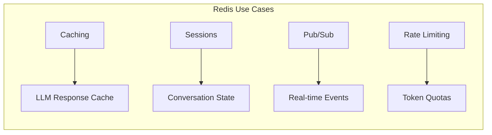
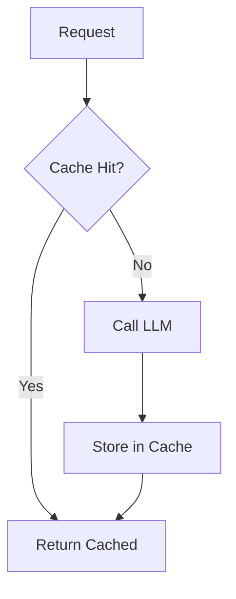
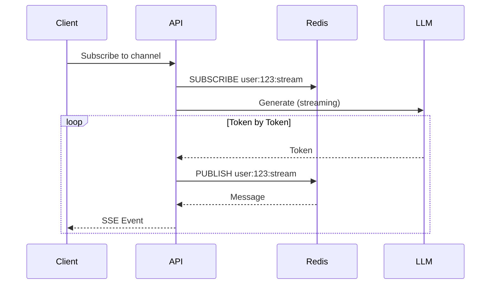

# Module 08d: Redis Patterns for AI Applications

> **Level**: Intermediate → Advanced | **Time**: 8-10 hours | **Prerequisites**: Module 08c

## Overview

This module covers Redis patterns essential for production AI applications: caching, sessions, pub/sub for real-time events, and distributed rate limiting using redis-py's async API.

### Why Redis for AI?



| Use Case | Pattern | Benefit |
|----------|---------|---------|
| **LLM Cache** | Key-value with TTL | Avoid duplicate API calls ($$$) |
| **Sessions** | Hash/JSON | Fast conversation state access |
| **Real-time** | Pub/Sub | Stream tokens to clients |
| **Rate Limiting** | Sliding window | Enforce usage quotas |

> **Interview Insight**: "Why Redis instead of in-memory caching?"
> 
> **Answer**: Redis provides **shared state** across multiple API instances (horizontal scaling), **persistence** (survives restarts), **atomic operations** (race-condition-free rate limiting), and **pub/sub** for real-time events. In-memory cache is faster but instance-local only.

### Key Concepts to Master

| Concept | What It Is | Interview Importance |
|---------|-----------|----------------------|
| **TTL (Expire)** | Auto-delete after time | ⭐⭐⭐ Cache invalidation |
| **Atomic Operations** | INCR, SETNX, etc. | ⭐⭐⭐ Race-condition-free |
| **Pub/Sub** | Publish-subscribe messaging | ⭐⭐ Real-time streaming |
| **Sorted Sets** | Ordered by score | ⭐⭐⭐ Rate limiting |
| **Pipeline** | Batch commands | ⭐⭐ Performance |

> **Common Pitfall**: Don't use Redis for large objects (>1MB). Use for small, frequently accessed data. For large objects, store in S3/GCS and cache the path.

---


## Part 1: redis-py Async Setup

### Modern Async Client

```python
import redis.asyncio as redis
from redis.asyncio.connection import ConnectionPool
from pydantic_settings import BaseSettings
from typing import Optional
from contextlib import asynccontextmanager


# ==============================================================================
# CONFIGURATION
# ==============================================================================

class RedisSettings(BaseSettings):
    """Redis configuration from environment."""
    
    redis_url: str = "redis://localhost:6379/0"
    max_connections: int = 10
    decode_responses: bool = True
    
    class Config:
        env_prefix = "REDIS_"


# ==============================================================================
# CONNECTION MANAGER
# ==============================================================================

class RedisClient:
    """
    Redis connection manager using redis-py async.
    
    Uses connection pooling for efficiency.
    """
    
    _pool: Optional[ConnectionPool] = None
    _client: Optional[redis.Redis] = None
    
    @classmethod
    async def connect(cls, settings: Optional[RedisSettings] = None):
        """Initialize Redis connection pool."""
        settings = settings or RedisSettings()
        
        cls._pool = ConnectionPool.from_url(
            settings.redis_url,
            max_connections=settings.max_connections,
            decode_responses=settings.decode_responses,
        )
        
        cls._client = redis.Redis(connection_pool=cls._pool)
        
        # Verify connection
        await cls._client.ping()
        print("[STARTUP] Redis connected")
    
    @classmethod
    async def disconnect(cls):
        """Close Redis connections."""
        if cls._client:
            await cls._client.close()
        if cls._pool:
            await cls._pool.disconnect()
        print("[SHUTDOWN] Redis disconnected")
    
    @classmethod
    def get_client(cls) -> redis.Redis:
        if not cls._client:
            raise RuntimeError("Redis not connected")
        return cls._client


# ==============================================================================
# FASTAPI INTEGRATION
# ==============================================================================

@asynccontextmanager
async def redis_lifespan(app):
    """Lifespan context for FastAPI."""
    await RedisClient.connect()
    yield
    await RedisClient.disconnect()
```

---

## Part 2: LLM Response Caching

### Cache Strategy



### Implementation

```python
from typing import Optional, List, Dict, Any, Callable
from datetime import timedelta
import hashlib
import json


class LLMCache:
    """
    Cache LLM responses to avoid duplicate API calls.
    
    Key design decisions:
    - Hash request for cache key (deterministic)
    - Include model in key (different models = different cache)
    - TTL to handle stale data
    """
    
    def __init__(
        self,
        prefix: str = "llm:",
        ttl_hours: int = 24,
        max_tokens_to_cache: int = 10000
    ):
        self.client = RedisClient.get_client()
        self.prefix = prefix
        self.ttl = timedelta(hours=ttl_hours)
        self.max_tokens = max_tokens_to_cache
    
    def _make_key(
        self,
        model: str,
        messages: List[Dict[str, str]],
        temperature: float = 0.0
    ) -> str:
        """
        Create deterministic cache key.
        
        Only cache when temperature=0 (deterministic output).
        """
        if temperature > 0:
            return ""  # Don't cache non-deterministic
        
        content = json.dumps({
            "model": model,
            "messages": messages,
        }, sort_keys=True)
        
        hash_val = hashlib.sha256(content.encode()).hexdigest()[:32]
        return f"{self.prefix}{model}:{hash_val}"
    
    async def get(
        self,
        model: str,
        messages: List[Dict[str, str]],
        temperature: float = 0.0
    ) -> Optional[str]:
        """Get cached response."""
        key = self._make_key(model, messages, temperature)
        if not key:
            return None
        
        cached = await self.client.get(key)
        if cached:
            # Track hit
            await self.client.incr(f"{self.prefix}hits")
        else:
            await self.client.incr(f"{self.prefix}misses")
        
        return cached
    
    async def set(
        self,
        model: str,
        messages: List[Dict[str, str]],
        response: str,
        temperature: float = 0.0
    ):
        """Cache a response."""
        key = self._make_key(model, messages, temperature)
        if not key:
            return
        
        # Don't cache very long responses
        if len(response) > self.max_tokens * 4:
            return
        
        await self.client.setex(key, self.ttl, response)
    
    async def get_or_generate(
        self,
        model: str,
        messages: List[Dict[str, str]],
        generate_fn: Callable,
        temperature: float = 0.0
    ) -> tuple[str, bool]:
        """
        Get from cache or generate and cache.
        
        Returns: (response, from_cache)
        """
        cached = await self.get(model, messages, temperature)
        if cached:
            return cached, True
        
        response = await generate_fn()
        await self.set(model, messages, response, temperature)
        
        return response, False
    
    async def get_stats(self) -> Dict[str, int]:
        """Get cache hit/miss stats."""
        hits = await self.client.get(f"{self.prefix}hits") or 0
        misses = await self.client.get(f"{self.prefix}misses") or 0
        
        total = int(hits) + int(misses)
        hit_rate = int(hits) / total if total > 0 else 0
        
        return {
            "hits": int(hits),
            "misses": int(misses),
            "hit_rate": round(hit_rate, 3)
        }
    
    async def invalidate_model(self, model: str):
        """Clear all cache for a specific model."""
        pattern = f"{self.prefix}{model}:*"
        
        cursor = 0
        while True:
            cursor, keys = await self.client.scan(cursor, match=pattern, count=100)
            if keys:
                await self.client.delete(*keys)
            if cursor == 0:
                break
```

---

## Part 3: Session Management

### Conversation State

```python
from typing import Optional, List, Dict, Any
from datetime import datetime, timedelta
from pydantic import BaseModel
import json


class SessionMessage(BaseModel):
    """Message in session."""
    role: str
    content: str
    timestamp: datetime = None
    
    def __init__(self, **data):
        super().__init__(**data)
        if not self.timestamp:
            self.timestamp = datetime.utcnow()


class ConversationSession(BaseModel):
    """Conversation session state."""
    session_id: str
    user_id: str
    messages: List[SessionMessage] = []
    model: str = "gpt-4"
    system_prompt: Optional[str] = None
    created_at: datetime = None
    updated_at: datetime = None
    
    def __init__(self, **data):
        super().__init__(**data)
        now = datetime.utcnow()
        if not self.created_at:
            self.created_at = now
        self.updated_at = now


class SessionStore:
    """
    Redis-backed session storage.
    
    Stores conversation state for fast access.
    """
    
    def __init__(
        self,
        prefix: str = "session:",
        ttl_hours: int = 24
    ):
        self.client = RedisClient.get_client()
        self.prefix = prefix
        self.ttl = timedelta(hours=ttl_hours)
    
    def _key(self, session_id: str) -> str:
        return f"{self.prefix}{session_id}"
    
    async def create(
        self,
        session_id: str,
        user_id: str,
        model: str = "gpt-4",
        system_prompt: Optional[str] = None
    ) -> ConversationSession:
        """Create new session."""
        session = ConversationSession(
            session_id=session_id,
            user_id=user_id,
            model=model,
            system_prompt=system_prompt,
        )
        
        await self.client.setex(
            self._key(session_id),
            self.ttl,
            session.model_dump_json()
        )
        
        return session
    
    async def get(self, session_id: str) -> Optional[ConversationSession]:
        """Get session by ID."""
        data = await self.client.get(self._key(session_id))
        if data:
            return ConversationSession.model_validate_json(data)
        return None
    
    async def add_message(
        self,
        session_id: str,
        role: str,
        content: str
    ) -> Optional[ConversationSession]:
        """Add message to session."""
        session = await self.get(session_id)
        if not session:
            return None
        
        session.messages.append(SessionMessage(role=role, content=content))
        session.updated_at = datetime.utcnow()
        
        await self.client.setex(
            self._key(session_id),
            self.ttl,
            session.model_dump_json()
        )
        
        return session
    
    async def get_messages_for_llm(
        self,
        session_id: str
    ) -> List[Dict[str, str]]:
        """
        Get messages in OpenAI format.
        
        Includes system prompt if set.
        """
        session = await self.get(session_id)
        if not session:
            return []
        
        messages = []
        
        if session.system_prompt:
            messages.append({
                "role": "system",
                "content": session.system_prompt
            })
        
        for msg in session.messages:
            messages.append({
                "role": msg.role,
                "content": msg.content
            })
        
        return messages
    
    async def delete(self, session_id: str) -> bool:
        """Delete session."""
        result = await self.client.delete(self._key(session_id))
        return result > 0
    
    async def extend_ttl(self, session_id: str):
        """Extend session TTL on activity."""
        await self.client.expire(
            self._key(session_id),
            int(self.ttl.total_seconds())
        )
```

---

## Part 4: Pub/Sub for Real-Time

### Streaming Tokens to Clients



### Implementation

```python
from typing import AsyncIterator, Callable, Any
import json
import asyncio


class TokenPublisher:
    """
    Publish LLM tokens via Redis Pub/Sub.
    
    Enables real-time streaming to multiple subscribers.
    """
    
    def __init__(self, prefix: str = "stream:"):
        self.client = RedisClient.get_client()
        self.prefix = prefix
    
    def _channel(self, session_id: str) -> str:
        return f"{self.prefix}{session_id}"
    
    async def publish_token(self, session_id: str, token: str):
        """Publish a single token."""
        await self.client.publish(
            self._channel(session_id),
            json.dumps({"type": "token", "data": token})
        )
    
    async def publish_done(self, session_id: str):
        """Signal stream completion."""
        await self.client.publish(
            self._channel(session_id),
            json.dumps({"type": "done"})
        )
    
    async def publish_error(self, session_id: str, error: str):
        """Publish error."""
        await self.client.publish(
            self._channel(session_id),
            json.dumps({"type": "error", "data": error})
        )


class TokenSubscriber:
    """
    Subscribe to LLM token streams.
    
    Returns async iterator for SSE events.
    """
    
    def __init__(self, prefix: str = "stream:"):
        self.client = RedisClient.get_client()
        self.prefix = prefix
    
    def _channel(self, session_id: str) -> str:
        return f"{self.prefix}{session_id}"
    
    async def subscribe(
        self,
        session_id: str
    ) -> AsyncIterator[dict]:
        """
        Subscribe to token stream.
        
        Yields events until 'done' or 'error' received.
        """
        pubsub = self.client.pubsub()
        await pubsub.subscribe(self._channel(session_id))
        
        try:
            async for message in pubsub.listen():
                if message["type"] != "message":
                    continue
                
                data = json.loads(message["data"])
                yield data
                
                if data["type"] in ("done", "error"):
                    break
        finally:
            await pubsub.unsubscribe(self._channel(session_id))
            await pubsub.close()


# ==============================================================================
# STREAMING ORCHESTRATOR
# ==============================================================================

class StreamingOrchestrator:
    """
    Orchestrate streaming LLM responses via Redis.
    
    Decouples generation from delivery.
    """
    
    def __init__(self):
        self.publisher = TokenPublisher()
        self.subscriber = TokenSubscriber()
    
    async def stream_generation(
        self,
        session_id: str,
        generate_fn: Callable[[], AsyncIterator[str]]
    ):
        """
        Generate tokens and publish to Redis.
        
        Run this in a background task.
        """
        try:
            async for token in generate_fn():
                await self.publisher.publish_token(session_id, token)
            
            await self.publisher.publish_done(session_id)
        
        except Exception as e:
            await self.publisher.publish_error(session_id, str(e))
    
    async def get_stream(
        self,
        session_id: str
    ) -> AsyncIterator[str]:
        """
        Get token stream for a session.
        
        Use this in SSE endpoint.
        """
        async for event in self.subscriber.subscribe(session_id):
            if event["type"] == "token":
                yield event["data"]
            elif event["type"] == "done":
                break
            elif event["type"] == "error":
                raise RuntimeError(event["data"])
```

---

## Part 5: Rate Limiting

### Sliding Window Rate Limiter

```python
from datetime import datetime
from typing import Tuple
import time


class SlidingWindowRateLimiter:
    """
    Sliding window rate limiter using Redis.
    
    More accurate than fixed window, prevents burst at window edges.
    """
    
    def __init__(
        self,
        prefix: str = "ratelimit:",
        requests_per_minute: int = 60
    ):
        self.client = RedisClient.get_client()
        self.prefix = prefix
        self.limit = requests_per_minute
        self.window_seconds = 60
    
    def _key(self, user_id: str) -> str:
        return f"{self.prefix}{user_id}"
    
    async def check(self, user_id: str) -> Tuple[bool, int, int]:
        """
        Check if request is allowed.
        
        Returns: (allowed, remaining, reset_seconds)
        """
        key = self._key(user_id)
        now = time.time()
        window_start = now - self.window_seconds
        
        pipe = self.client.pipeline()
        
        # Remove old entries
        pipe.zremrangebyscore(key, 0, window_start)
        
        # Count current window
        pipe.zcard(key)
        
        # Add current request (optimistically)
        pipe.zadd(key, {str(now): now})
        
        # Set expiry
        pipe.expire(key, self.window_seconds)
        
        results = await pipe.execute()
        current_count = results[1]
        
        if current_count >= self.limit:
            # Remove the optimistic add
            await self.client.zrem(key, str(now))
            
            # Get oldest entry for reset time
            oldest = await self.client.zrange(key, 0, 0, withscores=True)
            if oldest:
                reset = int(oldest[0][1] + self.window_seconds - now)
            else:
                reset = self.window_seconds
            
            return False, 0, reset
        
        remaining = self.limit - current_count - 1
        return True, remaining, self.window_seconds


class TokenBucketRateLimiter:
    """
    Token bucket rate limiter for LLM token quotas.
    
    Better for metering token usage than request count.
    """
    
    def __init__(
        self,
        prefix: str = "tokenbucket:",
        tokens_per_minute: int = 100000
    ):
        self.client = RedisClient.get_client()
        self.prefix = prefix
        self.limit = tokens_per_minute
        self.window_seconds = 60
    
    def _key(self, user_id: str) -> str:
        return f"{self.prefix}{user_id}"
    
    async def consume(
        self,
        user_id: str,
        tokens: int
    ) -> Tuple[bool, int]:
        """
        Try to consume tokens.
        
        Returns: (success, remaining)
        """
        key = self._key(user_id)
        
        # Get current usage
        current = await self.client.get(key)
        used = int(current) if current else 0
        
        remaining = self.limit - used
        
        if tokens > remaining:
            return False, remaining
        
        # Consume tokens
        pipe = self.client.pipeline()
        pipe.incrby(key, tokens)
        pipe.expire(key, self.window_seconds)
        await pipe.execute()
        
        return True, remaining - tokens
    
    async def get_remaining(self, user_id: str) -> int:
        """Get remaining tokens."""
        key = self._key(user_id)
        current = await self.client.get(key)
        used = int(current) if current else 0
        return self.limit - used
```

---

## Part 6: FastAPI Integration

### Complete Example

```python
from fastapi import FastAPI, Depends, HTTPException, BackgroundTasks
from fastapi.responses import StreamingResponse
from pydantic import BaseModel
from typing import List, Optional
import asyncio


app = FastAPI(lifespan=redis_lifespan)


# Dependencies
def get_cache() -> LLMCache:
    return LLMCache()


def get_sessions() -> SessionStore:
    return SessionStore()


def get_rate_limiter() -> TokenBucketRateLimiter:
    return TokenBucketRateLimiter()


# Schemas
class ChatRequest(BaseModel):
    message: str
    session_id: str


class ChatResponse(BaseModel):
    response: str
    from_cache: bool
    tokens_remaining: int


# Endpoints
@app.post("/v1/chat", response_model=ChatResponse)
async def chat(
    request: ChatRequest,
    user_id: str = "demo",
    cache: LLMCache = Depends(get_cache),
    sessions: SessionStore = Depends(get_sessions),
    rate_limiter: TokenBucketRateLimiter = Depends(get_rate_limiter),
):
    """Chat endpoint with caching and rate limiting."""
    
    # Check rate limit
    allowed, remaining = await rate_limiter.consume(user_id, 100)
    if not allowed:
        raise HTTPException(429, "Token quota exceeded")
    
    # Get or create session
    session = await sessions.get(request.session_id)
    if not session:
        session = await sessions.create(request.session_id, user_id)
    
    # Add user message
    await sessions.add_message(request.session_id, "user", request.message)
    
    # Get messages for LLM
    messages = await sessions.get_messages_for_llm(request.session_id)
    
    # Check cache
    async def generate():
        # Simulated LLM call
        await asyncio.sleep(0.5)
        return f"Response to: {request.message}"
    
    response, from_cache = await cache.get_or_generate(
        model="gpt-4",
        messages=messages,
        generate_fn=generate,
        temperature=0.0
    )
    
    # Add assistant message
    await sessions.add_message(request.session_id, "assistant", response)
    
    return ChatResponse(
        response=response,
        from_cache=from_cache,
        tokens_remaining=remaining
    )


@app.get("/v1/stream/{session_id}")
async def stream_chat(
    session_id: str,
    background_tasks: BackgroundTasks
):
    """SSE streaming endpoint."""
    orchestrator = StreamingOrchestrator()
    
    async def generate_tokens():
        words = "This is a streaming response from the LLM.".split()
        for word in words:
            await asyncio.sleep(0.1)
            yield word + " "
    
    # Start generation in background
    background_tasks.add_task(
        orchestrator.stream_generation,
        session_id,
        generate_tokens
    )
    
    # Return SSE stream
    async def event_stream():
        async for token in orchestrator.get_stream(session_id):
            yield f"data: {token}\n\n"
        yield "data: [DONE]\n\n"
    
    return StreamingResponse(
        event_stream(),
        media_type="text/event-stream"
    )
```

---

## Summary

| Pattern | Implementation |
|---------|---------------|
| **Cache** | Hash-based keys, TTL, hit/miss tracking |
| **Sessions** | JSON serialization, auto-expire |
| **Pub/Sub** | Channel per session, token streaming |
| **Rate Limit** | Sliding window (requests), token bucket (usage) |

---

## Next Steps

**Phase 4 Complete!** Continue to **[Module 09a: LLM API Service](09a-llm-api-service.md)** for:
- Multi-provider LLM clients (OpenAI, Anthropic, Ollama)
- Streaming responses
- Retry logic and error handling
- Provider fallback patterns
