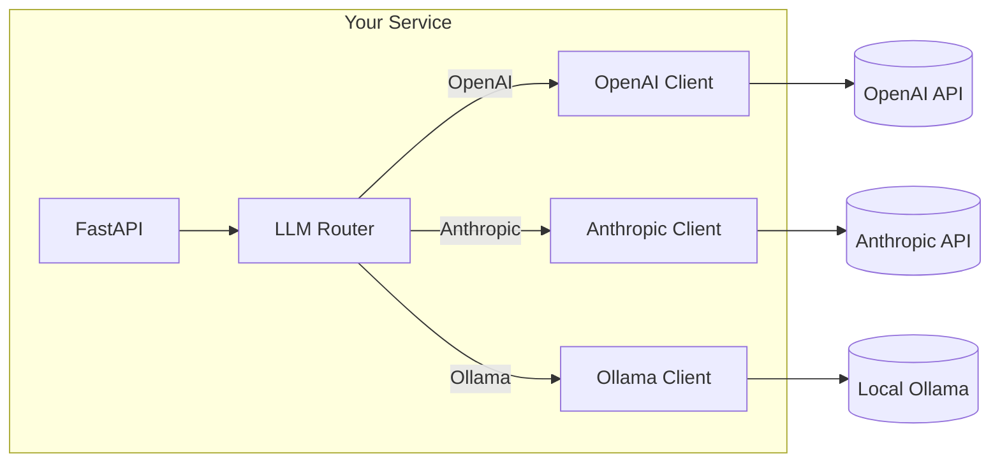

# Module 09a: Multi-Provider LLM API Service

> **Level**: Intermediate → Advanced | **Time**: 10-12 hours | **Prerequisites**: Module 08d

## Overview

This module teaches you to build a production-ready LLM API service supporting multiple providers (OpenAI, Anthropic, Ollama). You'll implement clean abstractions using OOP principles, handle streaming responses, and build robust error handling with retries.

### What You'll Build



### Key Design Patterns

| Pattern | Why It's Used |
|---------|---------------|
| **Strategy** | Swap providers without changing business logic |
| **Factory** | Create provider clients dynamically |
| **Adapter** | Normalize different API response formats |
| **Template Method** | Common streaming logic, provider-specific details |

> **Interview Insight**: "How do you handle multiple LLM providers?"
> 
> **Answer**: Use the **Strategy Pattern** with a common interface. Each provider implements the same `complete()` and `stream()` methods. A factory creates the right client based on config. This enables A/B testing, fallbacks, and cost optimization.

---

## Part 1: Provider Interface (Strategy Pattern)

### Clean Abstraction

The key to supporting multiple providers is a **common interface**. This is the Strategy Pattern in action.

```python
from abc import ABC, abstractmethod
from dataclasses import dataclass, field
from typing import List, Dict, Any, AsyncIterator, Optional
from enum import Enum


class Role(str, Enum):
    """Message roles - standardized across providers."""
    SYSTEM = "system"
    USER = "user"
    ASSISTANT = "assistant"


@dataclass
class Message:
    """A chat message - works with any provider."""
    role: Role
    content: str


@dataclass
class LLMResponse:
    """Standardized response from any provider."""
    content: str
    model: str
    usage: Dict[str, int] = field(default_factory=dict)
    finish_reason: str = "stop"


class LLMProvider(ABC):
    """
    Abstract base class for LLM providers.
    
    This is the Strategy Pattern - each provider implements
    the same interface, making them interchangeable.
    
    OOP Principle: Dependency Inversion
    - High-level code depends on this abstraction
    - Not on concrete OpenAI/Anthropic implementations
    """
    
    @property
    @abstractmethod
    def name(self) -> str:
        """Provider name for logging/metrics."""
        pass
    
    @abstractmethod
    async def complete(
        self,
        messages: List[Message],
        model: str,
        temperature: float = 0.7,
        max_tokens: int = 1024,
    ) -> LLMResponse:
        """
        Generate a complete response.
        
        Use when you need the full response at once.
        Simpler but slower perceived latency.
        """
        pass
    
    @abstractmethod
    async def stream(
        self,
        messages: List[Message],
        model: str,
        temperature: float = 0.7,
        max_tokens: int = 1024,
    ) -> AsyncIterator[str]:
        """
        Stream response tokens.
        
        Use for real-time UI updates.
        Better user experience for long responses.
        """
        pass
```

**Why this design?**
- `Message` and `LLMResponse` are **provider-agnostic** - works with any LLM
- `LLMProvider` ABC ensures all providers have the same methods
- Async methods for non-blocking I/O in FastAPI

---

## Part 2: OpenAI Implementation

### OpenAI SDK v1.0+ (Dec 2025)

```python
from openai import AsyncOpenAI


class OpenAIProvider(LLMProvider):
    """
    OpenAI provider using SDK v1.0+.
    
    Key SDK changes (v1.0, Nov 2023):
    - AsyncOpenAI for async operations
    - Pydantic response models
    - Built-in retry logic
    """
    
    def __init__(self, api_key: str):
        self.client = AsyncOpenAI(api_key=api_key)
    
    @property
    def name(self) -> str:
        return "openai"
    
    def _convert_messages(self, messages: List[Message]) -> List[Dict]:
        """Convert our Message format to OpenAI format."""
        return [
            {"role": msg.role.value, "content": msg.content}
            for msg in messages
        ]
    
    async def complete(
        self,
        messages: List[Message],
        model: str = "gpt-4o-mini",
        temperature: float = 0.7,
        max_tokens: int = 1024,
    ) -> LLMResponse:
        """Non-streaming completion."""
        response = await self.client.chat.completions.create(
            model=model,
            messages=self._convert_messages(messages),
            temperature=temperature,
            max_tokens=max_tokens,
        )
        
        choice = response.choices[0]
        return LLMResponse(
            content=choice.message.content,
            model=response.model,
            usage={
                "prompt_tokens": response.usage.prompt_tokens,
                "completion_tokens": response.usage.completion_tokens,
                "total_tokens": response.usage.total_tokens,
            },
            finish_reason=choice.finish_reason,
        )
    
    async def stream(
        self,
        messages: List[Message],
        model: str = "gpt-4o-mini",
        temperature: float = 0.7,
        max_tokens: int = 1024,
    ) -> AsyncIterator[str]:
        """
        Stream tokens as they're generated.
        
        Uses stream=True to get incremental responses.
        Each chunk contains a delta with partial content.
        """
        stream = await self.client.chat.completions.create(
            model=model,
            messages=self._convert_messages(messages),
            temperature=temperature,
            max_tokens=max_tokens,
            stream=True,
        )
        
        async for chunk in stream:
            if chunk.choices[0].delta.content:
                yield chunk.choices[0].delta.content
```

**Key Points:**
- `AsyncOpenAI` for async/await compatibility
- `stream=True` returns an async iterator
- Each chunk has `delta.content` (partial token)

---

## Part 3: Anthropic Implementation

### Anthropic SDK (Dec 2025)

```python
from anthropic import AsyncAnthropic


class AnthropicProvider(LLMProvider):
    """
    Anthropic provider for Claude models.
    
    API Differences from OpenAI:
    - System prompt is a separate parameter (not in messages)
    - Uses 'max_tokens' (required, not optional)
    - Different streaming event format
    """
    
    def __init__(self, api_key: str):
        self.client = AsyncAnthropic(api_key=api_key)
    
    @property
    def name(self) -> str:
        return "anthropic"
    
    def _prepare_request(
        self,
        messages: List[Message]
    ) -> tuple[Optional[str], List[Dict]]:
        """
        Prepare messages for Anthropic API.
        
        Anthropic handles system prompts differently:
        - System is a top-level parameter, not a message
        """
        system_prompt = None
        api_messages = []
        
        for msg in messages:
            if msg.role == Role.SYSTEM:
                system_prompt = msg.content
            else:
                api_messages.append({
                    "role": msg.role.value,
                    "content": msg.content,
                })
        
        return system_prompt, api_messages
    
    async def complete(
        self,
        messages: List[Message],
        model: str = "claude-3-5-sonnet-20241022",
        temperature: float = 0.7,
        max_tokens: int = 1024,
    ) -> LLMResponse:
        """Non-streaming completion."""
        system, api_messages = self._prepare_request(messages)
        
        response = await self.client.messages.create(
            model=model,
            max_tokens=max_tokens,
            temperature=temperature,
            system=system or "",
            messages=api_messages,
        )
        
        return LLMResponse(
            content=response.content[0].text,
            model=response.model,
            usage={
                "prompt_tokens": response.usage.input_tokens,
                "completion_tokens": response.usage.output_tokens,
                "total_tokens": (
                    response.usage.input_tokens + 
                    response.usage.output_tokens
                ),
            },
            finish_reason=response.stop_reason,
        )
    
    async def stream(
        self,
        messages: List[Message],
        model: str = "claude-3-5-sonnet-20241022",
        temperature: float = 0.7,
        max_tokens: int = 1024,
    ) -> AsyncIterator[str]:
        """
        Stream tokens from Claude.
        
        Anthropic uses a different event format:
        - content_block_delta events contain text
        - message_stop signals completion
        """
        system, api_messages = self._prepare_request(messages)
        
        async with self.client.messages.stream(
            model=model,
            max_tokens=max_tokens,
            temperature=temperature,
            system=system or "",
            messages=api_messages,
        ) as stream:
            async for text in stream.text_stream:
                yield text
```

**Key Differences from OpenAI:**
- System prompt is a **parameter**, not a message
- Uses `messages.stream()` context manager
- `stream.text_stream` yields text directly

---

## Part 4: Ollama (Local Models)

### Free Local Inference

```python
import httpx


class OllamaProvider(LLMProvider):
    """
    Ollama provider for local models.
    
    Why Ollama?
    - Free, runs locally
    - No API keys needed
    - Great for development/testing
    - Privacy-sensitive use cases
    
    Models: llama2, codellama, mistral, etc.
    """
    
    def __init__(self, base_url: str = "http://localhost:11434"):
        self.base_url = base_url
        self.client = httpx.AsyncClient(timeout=60.0)
    
    @property
    def name(self) -> str:
        return "ollama"
    
    def _convert_messages(self, messages: List[Message]) -> List[Dict]:
        """Convert to Ollama format (same as OpenAI)."""
        return [
            {"role": msg.role.value, "content": msg.content}
            for msg in messages
        ]
    
    async def complete(
        self,
        messages: List[Message],
        model: str = "llama2",
        temperature: float = 0.7,
        max_tokens: int = 1024,
    ) -> LLMResponse:
        """Non-streaming completion via HTTP."""
        response = await self.client.post(
            f"{self.base_url}/api/chat",
            json={
                "model": model,
                "messages": self._convert_messages(messages),
                "stream": False,
                "options": {
                    "temperature": temperature,
                    "num_predict": max_tokens,
                },
            },
        )
        response.raise_for_status()
        data = response.json()
        
        return LLMResponse(
            content=data["message"]["content"],
            model=model,
            usage={
                "prompt_tokens": data.get("prompt_eval_count", 0),
                "completion_tokens": data.get("eval_count", 0),
                "total_tokens": (
                    data.get("prompt_eval_count", 0) + 
                    data.get("eval_count", 0)
                ),
            },
            finish_reason="stop",
        )
    
    async def stream(
        self,
        messages: List[Message],
        model: str = "llama2",
        temperature: float = 0.7,
        max_tokens: int = 1024,
    ) -> AsyncIterator[str]:
        """Stream tokens from Ollama."""
        async with self.client.stream(
            "POST",
            f"{self.base_url}/api/chat",
            json={
                "model": model,
                "messages": self._convert_messages(messages),
                "stream": True,
                "options": {
                    "temperature": temperature,
                    "num_predict": max_tokens,
                },
            },
        ) as response:
            async for line in response.aiter_lines():
                if line:
                    import json
                    data = json.loads(line)
                    if "message" in data:
                        yield data["message"].get("content", "")
    
    async def close(self):
        """Close the HTTP client."""
        await self.client.aclose()
```

**Why Include Ollama?**
- Free for development
- No rate limits
- Same interface as cloud providers
- Easy to test without API keys

---

## Part 5: Provider Factory

### Dynamic Provider Creation

```python
from typing import Type


class ProviderFactory:
    """
    Factory Pattern for creating LLM providers.
    
    Why Factory?
    - Centralized provider creation
    - Easy to add new providers
    - Config-driven instantiation
    """
    
    _providers: Dict[str, Type[LLMProvider]] = {
        "openai": OpenAIProvider,
        "anthropic": AnthropicProvider,
        "ollama": OllamaProvider,
    }
    
    @classmethod
    def register(cls, name: str, provider_class: Type[LLMProvider]):
        """Register a new provider type."""
        cls._providers[name] = provider_class
    
    @classmethod
    def create(cls, name: str, **kwargs) -> LLMProvider:
        """
        Create a provider instance.
        
        Example:
            provider = ProviderFactory.create("openai", api_key="sk-...")
        """
        if name not in cls._providers:
            raise ValueError(f"Unknown provider: {name}")
        
        return cls._providers[name](**kwargs)
    
    @classmethod
    def available_providers(cls) -> List[str]:
        """List registered providers."""
        return list(cls._providers.keys())
```

**Usage:**
```python
# Create providers dynamically
openai = ProviderFactory.create("openai", api_key=os.getenv("OPENAI_API_KEY"))
claude = ProviderFactory.create("anthropic", api_key=os.getenv("ANTHROPIC_API_KEY"))
local = ProviderFactory.create("ollama")
```

---

## Part 6: LLM Router with Fallback

### Production-Ready Routing

```python
import asyncio
from typing import Optional
import logging

logger = logging.getLogger(__name__)


class LLMRouter:
    """
    Route requests to LLM providers with fallback.
    
    Features:
    - Primary/fallback provider pattern
    - Automatic retry on failure
    - Provider health tracking
    """
    
    def __init__(
        self,
        primary: LLMProvider,
        fallback: Optional[LLMProvider] = None,
        max_retries: int = 2,
    ):
        self.primary = primary
        self.fallback = fallback
        self.max_retries = max_retries
    
    async def complete(
        self,
        messages: List[Message],
        model: str,
        **kwargs,
    ) -> LLMResponse:
        """
        Complete with automatic fallback.
        
        Strategy:
        1. Try primary provider
        2. Retry on transient errors
        3. Fall back to secondary on persistent failure
        """
        # Try primary
        for attempt in range(self.max_retries + 1):
            try:
                return await self.primary.complete(
                    messages=messages,
                    model=model,
                    **kwargs,
                )
            except Exception as e:
                logger.warning(
                    f"{self.primary.name} attempt {attempt + 1} failed: {e}"
                )
                if attempt < self.max_retries:
                    await asyncio.sleep(2 ** attempt)  # Exponential backoff
                continue
        
        # Try fallback
        if self.fallback:
            logger.info(f"Falling back to {self.fallback.name}")
            try:
                return await self.fallback.complete(
                    messages=messages,
                    model=model,
                    **kwargs,
                )
            except Exception as e:
                logger.error(f"Fallback also failed: {e}")
                raise
        
        raise RuntimeError("All providers failed")
    
    async def stream(
        self,
        messages: List[Message],
        model: str,
        **kwargs,
    ) -> AsyncIterator[str]:
        """Stream with fallback on initial connection failure."""
        try:
            async for token in self.primary.stream(
                messages=messages,
                model=model,
                **kwargs,
            ):
                yield token
        except Exception as e:
            logger.warning(f"{self.primary.name} stream failed: {e}")
            
            if self.fallback:
                logger.info(f"Streaming from {self.fallback.name}")
                async for token in self.fallback.stream(
                    messages=messages,
                    model=model,
                    **kwargs,
                ):
                    yield token
            else:
                raise
```

---

## Part 7: FastAPI Integration

### Complete Streaming Endpoint

```python
from fastapi import FastAPI, HTTPException
from fastapi.responses import StreamingResponse
from pydantic import BaseModel
from typing import List
import os


app = FastAPI(title="Multi-Provider LLM API")


# Initialize providers
router = LLMRouter(
    primary=ProviderFactory.create(
        "openai", 
        api_key=os.getenv("OPENAI_API_KEY", "")
    ),
    fallback=ProviderFactory.create(
        "anthropic",
        api_key=os.getenv("ANTHROPIC_API_KEY", "")
    ),
)


class ChatRequest(BaseModel):
    messages: List[Dict[str, str]]
    model: str = "gpt-4o-mini"
    stream: bool = False
    temperature: float = 0.7


class ChatResponse(BaseModel):
    content: str
    model: str
    usage: Dict[str, int]


@app.post("/v1/chat")
async def chat(request: ChatRequest):
    """
    Chat endpoint with optional streaming.
    
    Demonstrates:
    - Unified API for multiple providers
    - Streaming via SSE
    - Automatic fallback
    """
    # Convert to our Message format
    messages = [
        Message(role=Role(m["role"]), content=m["content"])
        for m in request.messages
    ]
    
    if request.stream:
        async def generate():
            async for token in router.stream(
                messages=messages,
                model=request.model,
                temperature=request.temperature,
            ):
                yield f"data: {token}\n\n"
            yield "data: [DONE]\n\n"
        
        return StreamingResponse(
            generate(),
            media_type="text/event-stream",
        )
    else:
        response = await router.complete(
            messages=messages,
            model=request.model,
            temperature=request.temperature,
        )
        return ChatResponse(
            content=response.content,
            model=response.model,
            usage=response.usage,
        )


@app.get("/v1/providers")
async def list_providers():
    """List available providers."""
    return {"providers": ProviderFactory.available_providers()}
```

---

## Summary

### Design Patterns Used

| Pattern | Where | Benefit |
|---------|-------|---------|
| **Strategy** | `LLMProvider` ABC | Swap providers easily |
| **Factory** | `ProviderFactory` | Config-driven creation |
| **Adapter** | Message conversion | Normalize APIs |
| **Template Method** | Router retry logic | Reusable error handling |

### Key Takeaways

1. **Abstract away provider differences** - One interface, many implementations
2. **Handle streaming consistently** - All providers yield tokens the same way
3. **Build in resilience** - Retries + fallbacks for production
4. **Keep it simple** - No over-engineering, just clean OOP

---

## Next Steps

Continue to **[Module 09b: Agentic Patterns](09b-agentic-patterns.md)** for:
- Tool calling and function execution
- ReAct pattern implementation
- Multi-step reasoning chains
