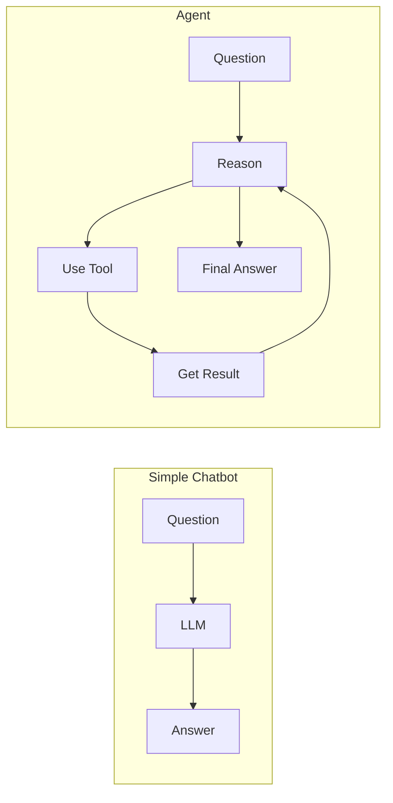
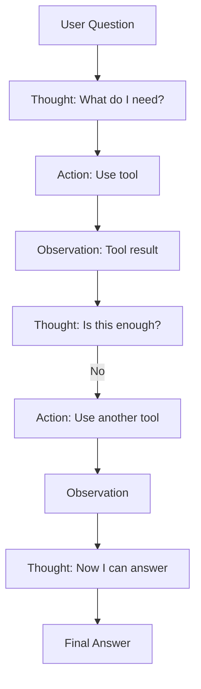

# Module 09b: Agentic Patterns - Tool Calling & ReAct

> **Level**: Advanced | **Time**: 12-15 hours | **Prerequisites**: Module 09a

## Overview

This module teaches you to build AI agents that can use tools, reason about problems, and take multi-step actions. You'll implement the ReAct pattern (Reasoning + Acting) and build a practical tool-calling system.

### What is an Agent?



**Key Difference**: Agents can **take actions** and **iterate** until they solve the problem.

### Core Patterns

| Pattern | What It Does | When to Use |
|---------|-------------|-------------|
| **Tool Calling** | LLM chooses and calls functions | External APIs, databases, calculations |
| **ReAct** | Reason → Act → Observe loop | Multi-step problem solving |
| **Chain of Thought** | Step-by-step reasoning | Complex reasoning tasks |

> **Interview Insight**: "How do agents differ from RAG?"
> 
> **Answer**: RAG **retrieves** information passively. Agents **take actions** - they can call APIs, run code, search the web, and iterate until success. An agent might use RAG as one of its tools.

---

## Part 1: Tool Definition (Clean Interface)

### Simple Tool Abstraction

```python
from abc import ABC, abstractmethod
from dataclasses import dataclass
from typing import Any, Dict, List, Callable
import json


@dataclass
class ToolResult:
    """Result from tool execution."""
    success: bool
    output: str
    error: str = ""


class Tool(ABC):
    """
    Base class for agent tools.
    
    Design: Keep it simple
    - name: Unique identifier
    - description: What it does (for LLM)
    - parameters: JSON Schema for inputs
    - execute(): Run the tool
    """
    
    @property
    @abstractmethod
    def name(self) -> str:
        """Tool name (used in function calls)."""
        pass
    
    @property
    @abstractmethod
    def description(self) -> str:
        """What the tool does (shown to LLM)."""
        pass
    
    @property
    @abstractmethod
    def parameters(self) -> Dict[str, Any]:
        """JSON Schema for parameters."""
        pass
    
    @abstractmethod
    def execute(self, **kwargs) -> ToolResult:
        """Run the tool with given parameters."""
        pass
    
    def to_openai_schema(self) -> Dict[str, Any]:
        """Convert to OpenAI function calling format."""
        return {
            "type": "function",
            "function": {
                "name": self.name,
                "description": self.description,
                "parameters": self.parameters,
            }
        }
```

---

## Part 2: Practical Tools

### Calculator Tool

```python
class CalculatorTool(Tool):
    """
    Simple calculator for math operations.
    
    Why this tool?
    - LLMs are bad at math
    - Shows basic tool pattern
    - Easy to test
    """
    
    @property
    def name(self) -> str:
        return "calculator"
    
    @property
    def description(self) -> str:
        return "Perform basic math calculations. Use for any arithmetic."
    
    @property
    def parameters(self) -> Dict[str, Any]:
        return {
            "type": "object",
            "properties": {
                "expression": {
                    "type": "string",
                    "description": "Math expression to evaluate, e.g. '2 + 2 * 3'"
                }
            },
            "required": ["expression"]
        }
    
    def execute(self, expression: str) -> ToolResult:
        """Safely evaluate math expression."""
        try:
            # Only allow safe math operations
            allowed = set("0123456789+-*/.() ")
            if not all(c in allowed for c in expression):
                return ToolResult(
                    success=False,
                    output="",
                    error="Invalid characters in expression"
                )
            
            result = eval(expression)  # Safe due to character check
            return ToolResult(success=True, output=str(result))
        except Exception as e:
            return ToolResult(success=False, output="", error=str(e))
```

### Web Search Tool

```python
class SearchTool(Tool):
    """
    Web search tool (mock for demo).
    
    In production, use:
    - Tavily API
    - SerpAPI
    - Brave Search API
    """
    
    @property
    def name(self) -> str:
        return "web_search"
    
    @property
    def description(self) -> str:
        return "Search the web for current information. Use for facts, news, or recent events."
    
    @property
    def parameters(self) -> Dict[str, Any]:
        return {
            "type": "object",
            "properties": {
                "query": {
                    "type": "string",
                    "description": "Search query"
                }
            },
            "required": ["query"]
        }
    
    def execute(self, query: str) -> ToolResult:
        """Execute search (mock implementation)."""
        # In production: call actual search API
        mock_results = {
            "python": "Python 3.12 is the latest stable version.",
            "openai": "OpenAI's latest model is GPT-4o.",
            "weather": "Current weather data requires a real API.",
        }
        
        for key, result in mock_results.items():
            if key in query.lower():
                return ToolResult(success=True, output=result)
        
        return ToolResult(
            success=True,
            output=f"No specific results for '{query}'. Try a more specific query."
        )
```

### Database Query Tool

```python
class DatabaseTool(Tool):
    """
    Query a database (mock for demo).
    
    Shows: Tool with structured output
    """
    
    def __init__(self):
        # Mock data
        self.users = [
            {"id": 1, "name": "Alice", "role": "admin"},
            {"id": 2, "name": "Bob", "role": "user"},
            {"id": 3, "name": "Charlie", "role": "user"},
        ]
    
    @property
    def name(self) -> str:
        return "query_users"
    
    @property
    def description(self) -> str:
        return "Query the users database. Can filter by role."
    
    @property
    def parameters(self) -> Dict[str, Any]:
        return {
            "type": "object",
            "properties": {
                "role": {
                    "type": "string",
                    "description": "Filter by role (admin, user)",
                    "enum": ["admin", "user"]
                }
            },
            "required": []
        }
    
    def execute(self, role: str = None) -> ToolResult:
        """Query users, optionally filter by role."""
        results = self.users
        if role:
            results = [u for u in self.users if u["role"] == role]
        
        return ToolResult(
            success=True,
            output=json.dumps(results, indent=2)
        )
```

---

## Part 3: Tool Registry

### Centralized Tool Management

```python
class ToolRegistry:
    """
    Registry for available tools.
    
    Why a registry?
    - Central place to manage tools
    - Easy to add/remove tools
    - Convert all tools to LLM format at once
    """
    
    def __init__(self):
        self._tools: Dict[str, Tool] = {}
    
    def register(self, tool: Tool):
        """Add a tool to the registry."""
        self._tools[tool.name] = tool
    
    def get(self, name: str) -> Tool:
        """Get tool by name."""
        if name not in self._tools:
            raise ValueError(f"Unknown tool: {name}")
        return self._tools[name]
    
    def execute(self, name: str, **kwargs) -> ToolResult:
        """Execute a tool by name."""
        return self.get(name).execute(**kwargs)
    
    def to_openai_tools(self) -> List[Dict]:
        """Get all tools in OpenAI format."""
        return [tool.to_openai_schema() for tool in self._tools.values()]
    
    def list_tools(self) -> List[str]:
        """List available tool names."""
        return list(self._tools.keys())
```

**Usage:**
```python
registry = ToolRegistry()
registry.register(CalculatorTool())
registry.register(SearchTool())
registry.register(DatabaseTool())

# Execute by name
result = registry.execute("calculator", expression="15 * 4")
print(result.output)  # "60"
```

---

## Part 4: ReAct Pattern

### Reason + Act Loop

The ReAct pattern alternates between reasoning and acting:



### Implementation

```python
from dataclasses import dataclass, field
from typing import List, Optional
from enum import Enum


class StepType(str, Enum):
    THOUGHT = "thought"
    ACTION = "action"
    OBSERVATION = "observation"
    ANSWER = "answer"


@dataclass
class AgentStep:
    """One step in the agent's reasoning process."""
    type: StepType
    content: str
    tool_name: str = ""
    tool_args: Dict[str, Any] = field(default_factory=dict)


class ReActAgent:
    """
    ReAct Agent: Reason + Act in a loop.
    
    The agent:
    1. Thinks about what to do
    2. Chooses and executes a tool
    3. Observes the result
    4. Repeats until it has an answer
    """
    
    def __init__(
        self,
        tools: ToolRegistry,
        max_steps: int = 5,
    ):
        self.tools = tools
        self.max_steps = max_steps
    
    def _build_prompt(self, question: str, steps: List[AgentStep]) -> str:
        """Build prompt with reasoning history."""
        
        tool_descriptions = "\n".join([
            f"- {name}: {self.tools.get(name).description}"
            for name in self.tools.list_tools()
        ])
        
        prompt = f"""You are a helpful assistant that solves problems step by step.

Available tools:
{tool_descriptions}

To use a tool, respond with:
Thought: [your reasoning]
Action: [tool_name]
Action Input: {{"param": "value"}}

When you have the final answer, respond with:
Thought: [your reasoning]
Answer: [your final answer]

Question: {question}
"""
        
        # Add previous steps
        for step in steps:
            if step.type == StepType.THOUGHT:
                prompt += f"\nThought: {step.content}"
            elif step.type == StepType.ACTION:
                prompt += f"\nAction: {step.tool_name}"
                prompt += f"\nAction Input: {json.dumps(step.tool_args)}"
            elif step.type == StepType.OBSERVATION:
                prompt += f"\nObservation: {step.content}"
        
        return prompt
    
    def _parse_response(self, response: str) -> AgentStep:
        """Parse LLM response into a step."""
        response = response.strip()
        
        # Check for final answer
        if "Answer:" in response:
            answer = response.split("Answer:")[-1].strip()
            return AgentStep(type=StepType.ANSWER, content=answer)
        
        # Parse thought + action
        thought = ""
        if "Thought:" in response:
            thought = response.split("Thought:")[-1].split("Action:")[0].strip()
        
        if "Action:" in response:
            action_part = response.split("Action:")[-1]
            action_name = action_part.split("\n")[0].strip()
            
            # Parse action input
            args = {}
            if "Action Input:" in action_part:
                args_str = action_part.split("Action Input:")[-1].strip()
                try:
                    args = json.loads(args_str)
                except:
                    args = {}
            
            return AgentStep(
                type=StepType.ACTION,
                content=thought,
                tool_name=action_name,
                tool_args=args,
            )
        
        # Just a thought
        return AgentStep(type=StepType.THOUGHT, content=thought or response)
    
    def run(self, question: str, llm_call: Callable) -> str:
        """
        Run the ReAct loop.
        
        Args:
            question: User's question
            llm_call: Function that takes prompt and returns LLM response
        
        Returns:
            Final answer string
        """
        steps: List[AgentStep] = []
        
        for i in range(self.max_steps):
            # Build prompt with history
            prompt = self._build_prompt(question, steps)
            
            # Get LLM response
            response = llm_call(prompt)
            
            # Parse into step
            step = self._parse_response(response)
            
            if step.type == StepType.ANSWER:
                return step.content
            
            steps.append(step)
            
            # Execute tool if action
            if step.type == StepType.ACTION:
                try:
                    result = self.tools.execute(step.tool_name, **step.tool_args)
                    observation = result.output if result.success else f"Error: {result.error}"
                except Exception as e:
                    observation = f"Error: {str(e)}"
                
                steps.append(AgentStep(
                    type=StepType.OBSERVATION,
                    content=observation,
                ))
        
        return "I couldn't find an answer within the step limit."
```

---

## Part 5: OpenAI Function Calling

### Native Tool Calling

OpenAI provides native function calling - simpler than parsing ReAct format:

```python
class FunctionCallingAgent:
    """
    Agent using OpenAI's native function calling.
    
    Simpler than ReAct for many use cases.
    The LLM returns structured tool calls directly.
    """
    
    def __init__(self, tools: ToolRegistry):
        self.tools = tools
    
    async def run(self, question: str, client, model: str = "gpt-4o-mini") -> str:
        """
        Run function calling loop.
        
        In production, use openai.AsyncOpenAI as client.
        """
        messages = [{"role": "user", "content": question}]
        tools = self.tools.to_openai_tools()
        
        for _ in range(5):  # Max iterations
            # Call LLM with tools
            response = await client.chat.completions.create(
                model=model,
                messages=messages,
                tools=tools,
                tool_choice="auto",
            )
            
            message = response.choices[0].message
            
            # If no tool call, return content
            if not message.tool_calls:
                return message.content
            
            # Process tool calls
            messages.append(message)
            
            for tool_call in message.tool_calls:
                name = tool_call.function.name
                args = json.loads(tool_call.function.arguments)
                
                # Execute tool
                result = self.tools.execute(name, **args)
                
                # Add result to messages
                messages.append({
                    "role": "tool",
                    "tool_call_id": tool_call.id,
                    "content": result.output if result.success else result.error,
                })
        
        return "Could not complete the task."
```

---

## Part 6: Simple Chain Pattern

### Sequential Tool Execution

Sometimes you know the exact sequence of tools:

```python
@dataclass
class ChainStep:
    """One step in a chain."""
    tool_name: str
    input_key: str  # Key from previous output to use
    output_key: str  # Key to store output


class ToolChain:
    """
    Execute tools in sequence.
    
    Simpler than agents when you know the exact flow.
    No LLM reasoning overhead.
    """
    
    def __init__(self, tools: ToolRegistry, steps: List[ChainStep]):
        self.tools = tools
        self.steps = steps
    
    def run(self, initial_input: Dict[str, Any]) -> Dict[str, Any]:
        """Run the chain with initial input."""
        context = initial_input.copy()
        
        for step in self.steps:
            # Get input from context
            tool_input = context.get(step.input_key, "")
            
            # Execute tool
            result = self.tools.execute(step.tool_name, **{step.input_key: tool_input})
            
            # Store output
            if result.success:
                context[step.output_key] = result.output
            else:
                context[step.output_key] = f"Error: {result.error}"
        
        return context
```

**Usage:**
```python
chain = ToolChain(
    tools=registry,
    steps=[
        ChainStep("web_search", "query", "search_result"),
        ChainStep("calculator", "expression", "calc_result"),
    ]
)

result = chain.run({"query": "python version", "expression": "3.12 * 2"})
```

---

## Summary

### Patterns Comparison

| Pattern | Complexity | When to Use |
|---------|------------|-------------|
| **Tool Chain** | Simple | Known sequence of steps |
| **Function Calling** | Medium | LLM decides which tools, structured output |
| **ReAct** | Complex | Multi-step reasoning with explanation |

### Key Takeaways

1. **Tools are just functions** - ABC keeps it simple
2. **Registry centralizes tools** - Easy to add/remove
3. **ReAct = Reason + Act loop** - For complex reasoning
4. **Function calling is simpler** - When OpenAI's native format works
5. **Chains for known flows** - No LLM overhead

---

## Next Steps

Continue to **[Module 10: Testing & Production](10-testing-production.md)** for:
- Unit testing FastAPI apps
- Mocking LLM responses
- Docker containerization
- Logging and monitoring
