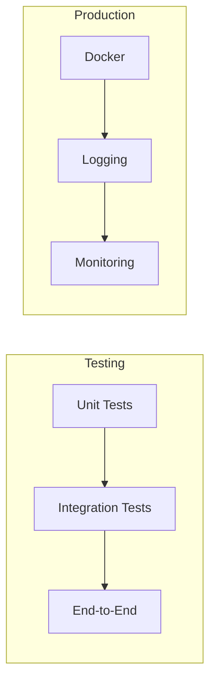

# Module 10: Testing & Production for AI Applications

> **Level**: Advanced | **Time**: 10-12 hours | **Prerequisites**: Modules 07-09

## Overview

This module teaches you to build production-ready AI applications: testing strategies for LLM-based systems, Docker containerization, structured logging, and monitoring. Focus on practical patterns, not over-engineering.

### What You'll Learn



| Topic | Why It Matters |
|-------|---------------|
| **Unit Testing** | Fast feedback, catch bugs early |
| **Mocking LLMs** | Test without API costs |
| **Docker** | Consistent deployments |
| **Logging** | Debug production issues |

---

## Part 1: Testing FastAPI Applications

### Test Setup with pytest

```python
import pytest
from fastapi.testclient import TestClient
from httpx import AsyncClient, ASGITransport
from unittest.mock import Mock, AsyncMock, patch

# Your FastAPI app
from main import app


# ==============================================================================
# SYNC TEST CLIENT (Simple)
# ==============================================================================

@pytest.fixture
def client():
    """Sync test client for simple tests."""
    return TestClient(app)


def test_health_check(client):
    """Basic endpoint test."""
    response = client.get("/health")
    assert response.status_code == 200
    assert response.json() == {"status": "healthy"}


# ==============================================================================
# ASYNC TEST CLIENT (For async endpoints)
# ==============================================================================

@pytest.fixture
async def async_client():
    """Async client for testing async endpoints."""
    transport = ASGITransport(app=app)
    async with AsyncClient(transport=transport, base_url="http://test") as client:
        yield client


@pytest.mark.asyncio
async def test_chat_endpoint(async_client):
    """Test async chat endpoint."""
    response = await async_client.post(
        "/v1/chat",
        json={"message": "Hello", "session_id": "test-123"}
    )
    assert response.status_code == 200
```

### Testing with Dependencies

```python
from fastapi import Depends


# Your dependency
def get_llm_provider():
    return OpenAIProvider(api_key=os.getenv("OPENAI_API_KEY"))


# Override for testing
@pytest.fixture
def mock_provider():
    """Mock LLM provider for tests."""
    provider = Mock()
    provider.complete = AsyncMock(return_value=LLMResponse(
        content="Mock response",
        model="gpt-4o-mini",
        usage={"total_tokens": 10},
    ))
    return provider


@pytest.fixture
def client_with_mock(mock_provider):
    """Client with mocked dependencies."""
    app.dependency_overrides[get_llm_provider] = lambda: mock_provider
    client = TestClient(app)
    yield client
    app.dependency_overrides.clear()


def test_chat_with_mock(client_with_mock, mock_provider):
    """Test chat endpoint with mocked LLM."""
    response = client_with_mock.post(
        "/v1/chat",
        json={"message": "Hello"}
    )
    
    assert response.status_code == 200
    assert "Mock response" in response.json()["content"]
    mock_provider.complete.assert_called_once()
```

---

## Part 2: Mocking LLM Responses

### The Challenge

Testing LLM-based code is tricky:
- API calls are slow and expensive
- Responses are non-deterministic
- Rate limits can break CI/CD

### Solutions

```python
from unittest.mock import patch, AsyncMock


class MockLLMResponse:
    """Mock OpenAI-style response."""
    
    def __init__(self, content: str):
        self.choices = [Mock(message=Mock(content=content))]
        self.model = "gpt-4o-mini"
        self.usage = Mock(
            prompt_tokens=10,
            completion_tokens=20,
            total_tokens=30,
        )


# ==============================================================================
# PATTERN 1: Patch the client
# ==============================================================================

@pytest.mark.asyncio
async def test_with_patched_openai():
    """Patch OpenAI client directly."""
    
    mock_response = MockLLMResponse("Hello from mock!")
    
    with patch("openai.AsyncOpenAI") as mock_client:
        mock_client.return_value.chat.completions.create = AsyncMock(
            return_value=mock_response
        )
        
        provider = OpenAIProvider(api_key="test")
        response = await provider.complete(
            messages=[Message(Role.USER, "Hi")],
            model="gpt-4o-mini",
        )
        
        assert response.content == "Hello from mock!"


# ==============================================================================
# PATTERN 2: Fixture-based mocking
# ==============================================================================

@pytest.fixture
def mock_openai():
    """Reusable OpenAI mock fixture."""
    with patch("openai.AsyncOpenAI") as mock:
        mock.return_value.chat.completions.create = AsyncMock()
        yield mock.return_value


def configure_mock_response(mock_client, content: str):
    """Helper to configure mock responses."""
    mock_client.chat.completions.create.return_value = MockLLMResponse(content)


@pytest.mark.asyncio
async def test_with_fixture(mock_openai):
    """Use fixture for cleaner tests."""
    configure_mock_response(mock_openai, "Fixture response")
    
    provider = OpenAIProvider(api_key="test")
    response = await provider.complete(
        messages=[Message(Role.USER, "Test")],
        model="gpt-4o-mini",
    )
    
    assert response.content == "Fixture response"


# ==============================================================================
# PATTERN 3: Mock streaming responses
# ==============================================================================

async def mock_stream():
    """Mock streaming response."""
    for token in ["Hello", " ", "world", "!"]:
        chunk = Mock()
        chunk.choices = [Mock(delta=Mock(content=token))]
        yield chunk


@pytest.mark.asyncio
async def test_streaming_with_mock():
    """Test streaming endpoint."""
    
    with patch("openai.AsyncOpenAI") as mock_client:
        mock_client.return_value.chat.completions.create = AsyncMock(
            return_value=mock_stream()
        )
        
        provider = OpenAIProvider(api_key="test")
        tokens = []
        async for token in provider.stream(
            messages=[Message(Role.USER, "Hi")],
            model="gpt-4o-mini",
        ):
            tokens.append(token)
        
        assert "".join(tokens) == "Hello world!"
```

---

## Part 3: Testing Agents

### Testing Tool Execution

```python
from a02_agentic_patterns import ToolRegistry, CalculatorTool, ReActAgent


class TestToolIntegration:
    """Integration tests for agent tools."""
    
    @pytest.fixture
    def registry(self):
        """Create tool registry."""
        registry = ToolRegistry()
        registry.register(CalculatorTool())
        return registry
    
    def test_calculator_integration(self, registry):
        """Test calculator in registry."""
        result = registry.execute("calculator", expression="10 * 5")
        assert result.success
        assert result.output == "50"
    
    def test_agent_with_mock_llm(self, registry):
        """Test agent loop with mock LLM."""
        
        # Mock LLM that returns calculator action then answer
        responses = [
            'Thought: Need to calculate.\nAction: calculator\nAction Input: {"expression": "2+2"}',
            'Thought: Got it.\nAnswer: The answer is 4',
        ]
        call_count = 0
        
        def mock_llm(prompt):
            nonlocal call_count
            response = responses[call_count]
            call_count += 1
            return response
        
        agent = ReActAgent(tools=registry, max_steps=3)
        answer = agent.run("What is 2+2?", mock_llm)
        
        assert "4" in answer
```

---

## Part 4: Docker for AI Applications

### Dockerfile (Production-Ready)

```dockerfile
# ==============================================================================
# Multi-stage build for smaller image
# ==============================================================================

# Stage 1: Build
FROM python:3.12-slim as builder

WORKDIR /app

# Install build dependencies
RUN apt-get update && apt-get install -y --no-install-recommends \
    build-essential \
    && rm -rf /var/lib/apt/lists/*

# Create virtual environment
RUN python -m venv /opt/venv
ENV PATH="/opt/venv/bin:$PATH"

# Install Python dependencies
COPY requirements.txt .
RUN pip install --no-cache-dir -r requirements.txt


# Stage 2: Runtime
FROM python:3.12-slim

WORKDIR /app

# Copy virtual environment from builder
COPY --from=builder /opt/venv /opt/venv
ENV PATH="/opt/venv/bin:$PATH"

# Create non-root user (security)
RUN useradd --create-home appuser
USER appuser

# Copy application
COPY --chown=appuser:appuser . .

# Health check
HEALTHCHECK --interval=30s --timeout=3s \
    CMD curl -f http://localhost:8000/health || exit 1

# Run with uvicorn
EXPOSE 8000
CMD ["uvicorn", "main:app", "--host", "0.0.0.0", "--port", "8000"]
```

### Docker Compose

```yaml
# docker-compose.yml
version: "3.9"

services:
  api:
    build: .
    ports:
      - "8000:8000"
    environment:
      - OPENAI_API_KEY=${OPENAI_API_KEY}
      - REDIS_URL=redis://redis:6379
      - DATABASE_URL=postgresql://user:pass@db:5432/app
    depends_on:
      - redis
      - db
    healthcheck:
      test: ["CMD", "curl", "-f", "http://localhost:8000/health"]
      interval: 30s
      timeout: 10s
      retries: 3

  redis:
    image: redis:7-alpine
    ports:
      - "6379:6379"
    volumes:
      - redis_data:/data

  db:
    image: postgres:16-alpine
    environment:
      POSTGRES_USER: user
      POSTGRES_PASSWORD: pass
      POSTGRES_DB: app
    volumes:
      - postgres_data:/var/lib/postgresql/data

volumes:
  redis_data:
  postgres_data:
```

---

## Part 5: Structured Logging

### Production Logging Setup

```python
import logging
import json
from datetime import datetime
from typing import Any, Dict
import sys


# ==============================================================================
# JSON FORMATTER (For log aggregation)
# ==============================================================================

class JSONFormatter(logging.Formatter):
    """Format logs as JSON for easy parsing."""
    
    def format(self, record: logging.LogRecord) -> str:
        log_data = {
            "timestamp": datetime.utcnow().isoformat(),
            "level": record.levelname,
            "message": record.getMessage(),
            "logger": record.name,
            "module": record.module,
            "function": record.funcName,
            "line": record.lineno,
        }
        
        # Add exception info if present
        if record.exc_info:
            log_data["exception"] = self.formatException(record.exc_info)
        
        # Add extra fields
        for key, value in record.__dict__.items():
            if key not in logging.LogRecord.__dict__ and not key.startswith("_"):
                log_data[key] = value
        
        return json.dumps(log_data)


# ==============================================================================
# LOGGER CONFIGURATION
# ==============================================================================

def setup_logging(level: str = "INFO", json_format: bool = True):
    """Configure logging for the application."""
    
    root_logger = logging.getLogger()
    root_logger.setLevel(getattr(logging, level.upper()))
    
    handler = logging.StreamHandler(sys.stdout)
    
    if json_format:
        handler.setFormatter(JSONFormatter())
    else:
        handler.setFormatter(logging.Formatter(
            "%(asctime)s - %(name)s - %(levelname)s - %(message)s"
        ))
    
    root_logger.addHandler(handler)
    
    # Reduce noise from libraries
    logging.getLogger("httpx").setLevel(logging.WARNING)
    logging.getLogger("uvicorn.access").setLevel(logging.WARNING)


# ==============================================================================
# REQUEST LOGGING MIDDLEWARE
# ==============================================================================

from fastapi import Request
from starlette.middleware.base import BaseHTTPMiddleware
import time
import uuid


class LoggingMiddleware(BaseHTTPMiddleware):
    """Log all requests with timing and context."""
    
    async def dispatch(self, request: Request, call_next):
        request_id = str(uuid.uuid4())[:8]
        start_time = time.time()
        
        # Add request ID to logs
        logger = logging.getLogger("api")
        
        logger.info(
            "Request started",
            extra={
                "request_id": request_id,
                "method": request.method,
                "path": request.url.path,
            }
        )
        
        response = await call_next(request)
        
        duration_ms = (time.time() - start_time) * 1000
        
        logger.info(
            "Request completed",
            extra={
                "request_id": request_id,
                "status_code": response.status_code,
                "duration_ms": round(duration_ms, 2),
            }
        )
        
        # Add request ID to response headers
        response.headers["X-Request-ID"] = request_id
        
        return response


# Usage in FastAPI:
# app.add_middleware(LoggingMiddleware)
```

---

## Part 6: LLM-Specific Logging

### Tracking LLM Calls

```python
import logging
from functools import wraps
from typing import Callable
import time


logger = logging.getLogger("llm")


def log_llm_call(func: Callable) -> Callable:
    """Decorator to log LLM API calls."""
    
    @wraps(func)
    async def wrapper(*args, **kwargs):
        start_time = time.time()
        model = kwargs.get("model", "unknown")
        
        try:
            result = await func(*args, **kwargs)
            duration_ms = (time.time() - start_time) * 1000
            
            logger.info(
                "LLM call completed",
                extra={
                    "model": model,
                    "duration_ms": round(duration_ms, 2),
                    "prompt_tokens": result.usage.get("prompt_tokens", 0),
                    "completion_tokens": result.usage.get("completion_tokens", 0),
                    "total_tokens": result.usage.get("total_tokens", 0),
                }
            )
            
            return result
            
        except Exception as e:
            duration_ms = (time.time() - start_time) * 1000
            logger.error(
                "LLM call failed",
                extra={
                    "model": model,
                    "duration_ms": round(duration_ms, 2),
                    "error": str(e),
                }
            )
            raise
    
    return wrapper


# Usage:
class OpenAIProvider(LLMProvider):
    
    @log_llm_call
    async def complete(self, messages, model, **kwargs):
        # ... implementation
        pass
```

---

## Part 7: Health Checks & Metrics

### Basic Health Check

```python
from fastapi import FastAPI, Depends
from typing import Dict


app = FastAPI()


async def check_database():
    """Check database connection."""
    try:
        # Your DB check
        return True
    except:
        return False


async def check_redis():
    """Check Redis connection."""
    try:
        # Your Redis check
        return True
    except:
        return False


@app.get("/health")
async def health_check() -> Dict:
    """Basic health check."""
    return {"status": "healthy"}


@app.get("/health/detailed")
async def detailed_health_check() -> Dict:
    """Detailed health with dependency status."""
    db_ok = await check_database()
    redis_ok = await check_redis()
    
    status = "healthy" if (db_ok and redis_ok) else "degraded"
    
    return {
        "status": status,
        "checks": {
            "database": "ok" if db_ok else "error",
            "redis": "ok" if redis_ok else "error",
        }
    }
```

---

## Summary

### Testing Strategies

| Type | What to Test | Tools |
|------|-------------|-------|
| **Unit** | Functions, classes | pytest, mock |
| **Integration** | Endpoints with mocks | TestClient, httpx |
| **E2E** | Full flow | Real or sandbox APIs |

### Production Checklist

- [ ] Docker multi-stage build
- [ ] Non-root user in container
- [ ] Health check endpoint
- [ ] Structured JSON logging
- [ ] Request ID tracking
- [ ] LLM call logging with tokens/duration
- [ ] Environment variables for secrets

### Key Takeaways

1. **Mock LLM calls** - Don't hit real APIs in CI
2. **Use dependency injection** - Easy to swap for tests
3. **Docker multi-stage** - Smaller, faster images
4. **JSON logs** - Essential for log aggregation
5. **Track LLM metrics** - Tokens = money

---

## Next Steps

Continue to **[Module 11a: RAG System (End-to-End)](11a-rag-system.md)** for:
- Complete RAG implementation
- Document ingestion pipeline
- API endpoints for Q&A
- Production deployment
