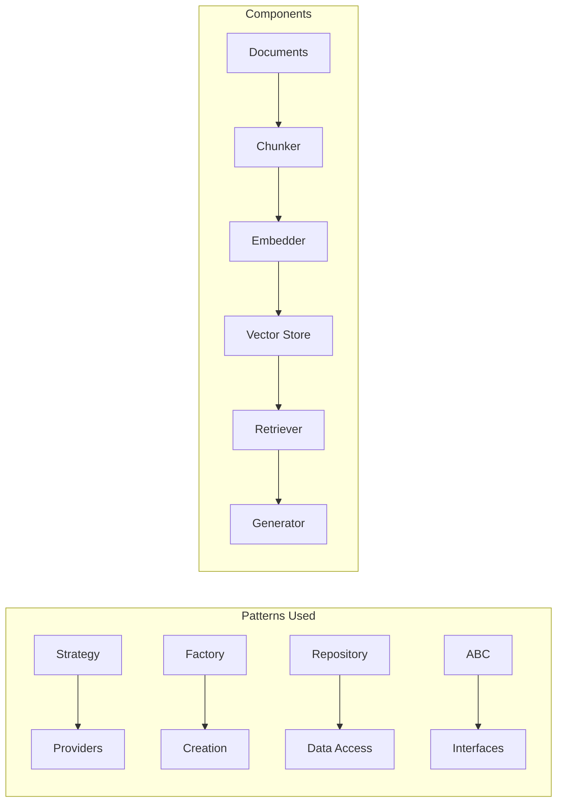
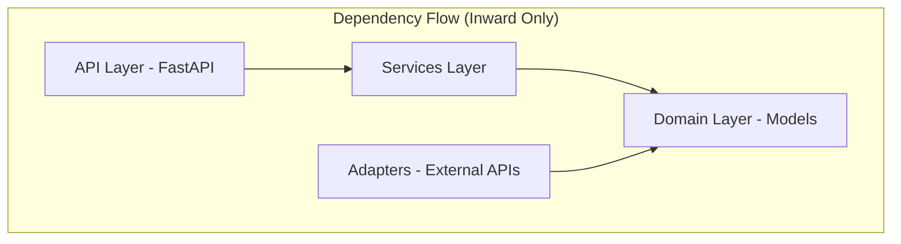
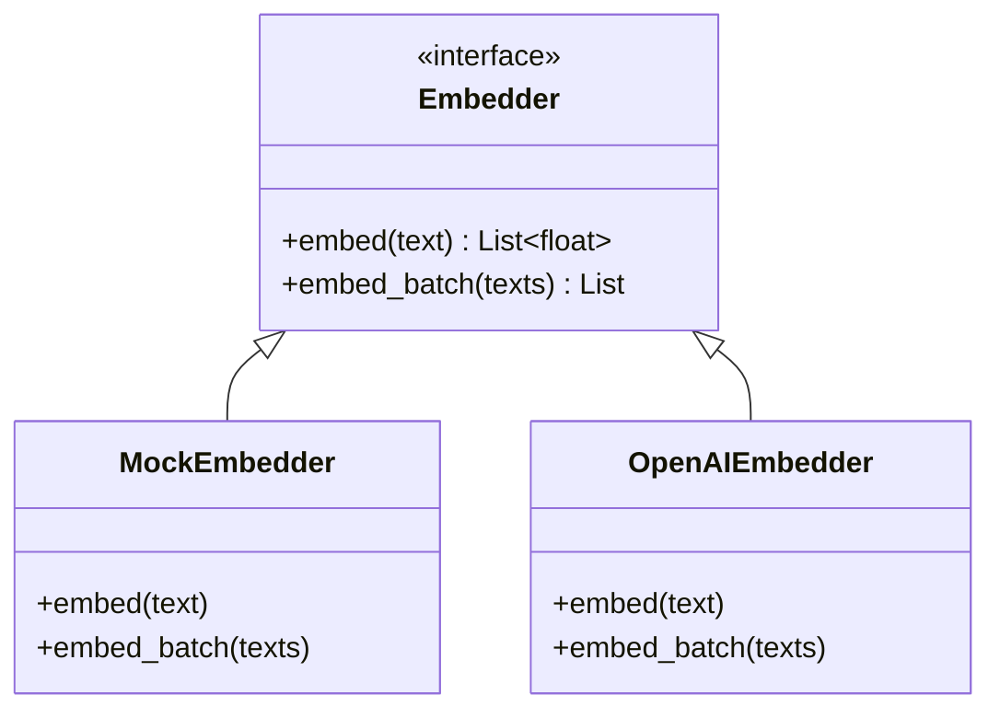

# Module 11a: RAG System (End-to-End Capstone)

> **Level**: Advanced | **Time**: 15-20 hours | **Prerequisites**: All previous modules

## Overview

This capstone module brings together everything you've learned to build a production-ready RAG (Retrieval-Augmented Generation) system. You'll see how OOP principles, design patterns, and best practices combine in a real application.

### What This Module Demonstrates



| Previous Module | What We Use Here |
|-----------------|------------------|
| **Module 05** | Strategy, Factory, Repository patterns |
| **Module 07** | FastAPI endpoints, async/await |
| **Module 08c** | Chunking, vector search |
| **Module 09a** | LLM provider abstraction |
| **Module 10** | Logging, testing patterns |

> **Interview Insight**: "What's the difference between RAG and fine-tuning?"
> 
> **Answer**: RAG retrieves external knowledge at query time, while fine-tuning modifies model weights. RAG is better for frequently changing data, proprietary knowledge, and when you need source attribution. Fine-tuning is better for teaching new behaviors or consistent style.

### Key Concepts to Master

| Concept | What It Is | Interview Importance |
|---------|-----------|----------------------|
| **Clean Architecture** | Domain → Services → Adapters → API | ⭐⭐⭐ Testability |
| **Repository Pattern** | Abstract data access layer | ⭐⭐⭐ VectorStore ABC |
| **Strategy Pattern** | Swap chunking/embedding impls | ⭐⭐⭐ Flexibility |
| **Dependency Injection** | Pass deps, don't create internally | ⭐⭐⭐ Testing |
| **Cosine Similarity** | Vector similarity metric | ⭐⭐ Core RAG math |

> **Common Pitfall**: Chunk size matters! Too small = lost context. Too large = irrelevant info retrieved. Start with 300-500 chars with 50-100 overlap and tune based on your use case.

---

## Part 1: Clean Architecture

### OOP Principle: Separation of Concerns

Clean Architecture organizes code into **layers** with strict dependency rules:



| Layer | Contains | Dependencies |
|-------|----------|--------------|
| **Domain** | Models, Interfaces | None (pure Python) |
| **Services** | Business logic | Domain only |
| **Adapters** | DB, APIs, external | Domain only |
| **API** | FastAPI routes | Services |

**Why This Matters**: Domain models have ZERO imports from FastAPI, SQLAlchemy, etc. This makes them testable and portable.

### Project Structure

```
rag_system/
├── domain/           # Business logic (no framework deps)
│   ├── models.py     # Document, Chunk, SearchResult
│   └── interfaces.py # ABC for components
├── adapters/         # External integrations
│   ├── embedders.py  # OpenAI, local embedders
│   ├── stores.py     # Vector store implementations
│   └── llm.py        # LLM providers
├── services/         # Application logic
│   ├── ingestion.py  # Document processing
│   └── retrieval.py  # RAG pipeline
├── api/              # FastAPI layer
│   └── routes.py
└── main.py
```

### OOP Principle: Dataclasses for Value Objects

We use `@dataclass` for domain models - they're **Value Objects** that carry data without behavior:

```python
# ✅ Good: Pure data, no framework dependencies
@dataclass
class Chunk:
    id: str
    content: str
    embedding: List[float]

# ❌ Bad: Business logic mixed with data
class Chunk:
    def save_to_database(self):  # Don't put this here!
        pass
```

### Domain Models (No Dependencies)


```python
from dataclasses import dataclass, field
from typing import List, Dict, Any


@dataclass
class Document:
    """Source document to ingest."""
    id: str
    content: str
    metadata: Dict[str, Any] = field(default_factory=dict)


@dataclass
class Chunk:
    """Processed chunk with embedding."""
    id: str
    content: str
    document_id: str
    embedding: List[float] = field(default_factory=list)
    metadata: Dict[str, Any] = field(default_factory=dict)


@dataclass
class SearchResult:
    """Result from vector search."""
    chunk: Chunk
    score: float
```

---

## Part 2: Interfaces (ABC)

### Design Pattern: Strategy Pattern

Each interface (`Embedder`, `VectorStore`, `ChunkingStrategy`) represents the **Strategy Pattern** - a family of interchangeable algorithms:



### OOP Principle: Polymorphism

Thanks to the ABC interface, services work with ANY embedder through polymorphism:

```python
# Service doesn't know or care which embedder it gets
class RAGService:
    def __init__(self, embedder: Embedder):  # Any Embedder works!
        self.embedder = embedder
```

### Why Interfaces?

Using ABCs lets us swap implementations without changing business logic - this is the core of clean architecture.


```python
from abc import ABC, abstractmethod
from typing import List


class Embedder(ABC):
    """
    Interface for text embedding.
    
    Strategy Pattern: Different embedding implementations.
    """
    
    @abstractmethod
    async def embed(self, text: str) -> List[float]:
        """Embed a single text."""
        pass
    
    @abstractmethod
    async def embed_batch(self, texts: List[str]) -> List[List[float]]:
        """Embed multiple texts efficiently."""
        pass


class VectorStore(ABC):
    """
    Interface for vector storage.
    
    Repository Pattern: Abstract data access.
    """
    
    @abstractmethod
    async def add(self, chunks: List[Chunk]) -> None:
        """Add chunks to store."""
        pass
    
    @abstractmethod
    async def search(
        self, 
        embedding: List[float], 
        limit: int = 5
    ) -> List[SearchResult]:
        """Search by vector similarity."""
        pass


class ChunkingStrategy(ABC):
    """
    Interface for chunking.
    
    Strategy Pattern: Different chunking approaches.
    """
    
    @abstractmethod
    def chunk(self, document: Document) -> List[Chunk]:
        """Split document into chunks."""
        pass
```

---

## Part 3: Implementations

### Embedder Implementation

```python
import hashlib


class MockEmbedder(Embedder):
    """
    Mock embedder for testing.
    
    Use in tests to avoid API calls.
    """
    
    async def embed(self, text: str) -> List[float]:
        h = hashlib.sha256(text.encode()).digest()
        return [b / 255.0 for b in h[:128]]
    
    async def embed_batch(self, texts: List[str]) -> List[List[float]]:
        return [await self.embed(t) for t in texts]


class OpenAIEmbedder(Embedder):
    """
    OpenAI embeddings.
    
    In production, use text-embedding-3-small or large.
    """
    
    def __init__(self, api_key: str, model: str = "text-embedding-3-small"):
        self.api_key = api_key
        self.model = model
        # In production: self.client = AsyncOpenAI(api_key=api_key)
    
    async def embed(self, text: str) -> List[float]:
        # Mock for demo
        return await MockEmbedder().embed(text)
    
    async def embed_batch(self, texts: List[str]) -> List[List[float]]:
        # In production, use batch API
        return [await self.embed(t) for t in texts]
```

### Vector Store Implementation

```python
import math


class InMemoryVectorStore(VectorStore):
    """
    In-memory vector store.
    
    Simple but sufficient for demos and testing.
    For production, use Weaviate, Pinecone, etc.
    """
    
    def __init__(self):
        self.chunks: List[Chunk] = []
    
    async def add(self, chunks: List[Chunk]) -> None:
        self.chunks.extend(chunks)
    
    async def search(
        self, 
        embedding: List[float], 
        limit: int = 5
    ) -> List[SearchResult]:
        scored = []
        
        for chunk in self.chunks:
            score = self._cosine_similarity(embedding, chunk.embedding)
            scored.append(SearchResult(chunk=chunk, score=score))
        
        scored.sort(key=lambda x: x.score, reverse=True)
        return scored[:limit]
    
    def _cosine_similarity(self, a: List[float], b: List[float]) -> float:
        dot = sum(x * y for x, y in zip(a, b))
        norm_a = math.sqrt(sum(x ** 2 for x in a))
        norm_b = math.sqrt(sum(x ** 2 for x in b))
        return dot / (norm_a * norm_b) if norm_a and norm_b else 0
```

### Chunking Implementation

```python
import uuid


class FixedSizeChunker(ChunkingStrategy):
    """
    Fixed-size chunking with overlap.
    
    Simple, predictable, works well for most cases.
    """
    
    def __init__(self, chunk_size: int = 500, overlap: int = 50):
        self.chunk_size = chunk_size
        self.overlap = overlap
    
    def chunk(self, document: Document) -> List[Chunk]:
        text = document.content
        chunks = []
        start = 0
        
        while start < len(text):
            end = min(start + self.chunk_size, len(text))
            
            chunk_text = text[start:end].strip()
            if chunk_text:
                chunks.append(Chunk(
                    id=str(uuid.uuid4()),
                    content=chunk_text,
                    document_id=document.id,
                    metadata={"char_start": start, "char_end": end},
                ))
            
            start = end - self.overlap
        
        return chunks
```

---

## Part 4: Services (Business Logic)

### OOP Principle: Dependency Injection (DI)

Services receive their dependencies through their `__init__` - they don't create them internally. This is **Dependency Inversion** (the 'D' in SOLID):

```python
# ✅ Good: Dependencies injected
class IngestionService:
    def __init__(self, chunker, embedder, store):  # Passed in!
        self.chunker = chunker
        
# ❌ Bad: Dependencies created internally
class IngestionService:
    def __init__(self):
        self.chunker = FixedSizeChunker()  # Hardcoded!
```

**Benefits of DI**:
- Easy to test (inject mocks)
- Swap implementations without code changes
- Clear dependencies visible in constructor

### Ingestion Service


```python
class IngestionService:
    """
    Document ingestion pipeline.
    
    Uses dependency injection - all dependencies passed in.
    Easy to test with mocks.
    """
    
    def __init__(
        self,
        chunker: ChunkingStrategy,
        embedder: Embedder,
        store: VectorStore,
    ):
        self.chunker = chunker
        self.embedder = embedder
        self.store = store
    
    async def ingest(self, document: Document) -> int:
        """
        Ingest a document: chunk → embed → store.
        
        Returns number of chunks created.
        """
        # 1. Chunk
        chunks = self.chunker.chunk(document)
        
        # 2. Embed
        texts = [c.content for c in chunks]
        embeddings = await self.embedder.embed_batch(texts)
        
        for chunk, embedding in zip(chunks, embeddings):
            chunk.embedding = embedding
        
        # 3. Store
        await self.store.add(chunks)
        
        return len(chunks)
```

### RAG Service

```python
from typing import Dict


class RAGService:
    """
    Retrieval-Augmented Generation service.
    
    Combines retrieval and generation into a clean API.
    """
    
    def __init__(
        self,
        embedder: Embedder,
        store: VectorStore,
        llm_call,  # Callable for LLM completion
    ):
        self.embedder = embedder
        self.store = store
        self.llm_call = llm_call
    
    async def query(
        self,
        question: str,
        top_k: int = 3,
    ) -> Dict[str, str]:
        """
        Answer a question using RAG.
        
        1. Embed question
        2. Search for relevant chunks
        3. Build context
        4. Generate answer
        """
        # 1. Embed question
        query_embedding = await self.embedder.embed(question)
        
        # 2. Search
        results = await self.store.search(query_embedding, limit=top_k)
        
        # 3. Build context
        context = "\n\n".join([
            f"[Source: {r.chunk.document_id}]\n{r.chunk.content}"
            for r in results
        ])
        
        # 4. Generate answer
        prompt = f"""Answer the question based on the context below.
If the context doesn't contain relevant information, say so.

Context:
{context}

Question: {question}

Answer:"""
        
        answer = await self.llm_call(prompt)
        
        return {
            "question": question,
            "answer": answer,
            "sources": [r.chunk.document_id for r in results],
            "context_used": len(results),
        }
```

---

## Part 5: FastAPI Integration

### API Routes

```python
from fastapi import FastAPI, HTTPException, Depends
from pydantic import BaseModel
from typing import List, Optional


app = FastAPI(title="RAG API")


# ==============================================================================
# REQUEST/RESPONSE MODELS
# ==============================================================================

class IngestRequest(BaseModel):
    id: str
    content: str
    metadata: Optional[dict] = None


class QueryRequest(BaseModel):
    question: str
    top_k: int = 3


class QueryResponse(BaseModel):
    question: str
    answer: str
    sources: List[str]


# ==============================================================================
# DEPENDENCY INJECTION
# ==============================================================================

# Global instances (configure on startup)
_ingestion_service: Optional[IngestionService] = None
_rag_service: Optional[RAGService] = None


def get_ingestion_service() -> IngestionService:
    if not _ingestion_service:
        raise HTTPException(500, "Service not initialized")
    return _ingestion_service


def get_rag_service() -> RAGService:
    if not _rag_service:
        raise HTTPException(500, "Service not initialized")
    return _rag_service


# ==============================================================================
# ENDPOINTS
# ==============================================================================

@app.post("/ingest")
async def ingest_document(
    request: IngestRequest,
    service: IngestionService = Depends(get_ingestion_service),
):
    """Ingest a document into the RAG system."""
    doc = Document(
        id=request.id,
        content=request.content,
        metadata=request.metadata or {},
    )
    
    chunks_created = await service.ingest(doc)
    
    return {
        "document_id": doc.id,
        "chunks_created": chunks_created,
        "status": "success",
    }


@app.post("/query", response_model=QueryResponse)
async def query_rag(
    request: QueryRequest,
    service: RAGService = Depends(get_rag_service),
):
    """Query the RAG system."""
    result = await service.query(
        question=request.question,
        top_k=request.top_k,
    )
    
    return QueryResponse(
        question=result["question"],
        answer=result["answer"],
        sources=result["sources"],
    )


@app.get("/health")
async def health_check():
    return {"status": "healthy"}
```

---

## Part 6: Wiring It Together

### Application Factory

```python
def create_app() -> FastAPI:
    """
    Factory function to create configured app.
    
    Factory Pattern: Centralized app creation.
    """
    global _ingestion_service, _rag_service
    
    # Create components
    chunker = FixedSizeChunker(chunk_size=500, overlap=50)
    embedder = MockEmbedder()  # Use OpenAIEmbedder in production
    store = InMemoryVectorStore()
    
    # Mock LLM call
    async def mock_llm(prompt: str) -> str:
        return f"Based on the context, here is my answer..."
    
    # Create services
    _ingestion_service = IngestionService(
        chunker=chunker,
        embedder=embedder,
        store=store,
    )
    
    _rag_service = RAGService(
        embedder=embedder,
        store=store,
        llm_call=mock_llm,
    )
    
    return app
```

---

## Summary

### Patterns Used

| Pattern | Where | Benefit |
|---------|-------|---------|
| **Strategy** | Chunker, Embedder | Swap implementations easily |
| **Repository** | VectorStore | Abstract data access |
| **Factory** | create_app() | Centralized creation |
| **Dependency Injection** | FastAPI Depends | Testable endpoints |

### Clean Architecture Layers

```
API (FastAPI) → Services (Business Logic) → Domain (Models)
                       ↓
               Adapters (External APIs)
```

### Key Takeaways

1. **Interfaces first** - Define ABCs before implementations
2. **Dependency injection** - Pass dependencies, don't create internally
3. **Services are testable** - Mock all dependencies
4. **No framework in domain** - Keep models pure Python

---

## Next Steps

Continue to **[Module 11b: Production Agent](11b-production-agent.md)** for:
- Multi-step agent with tools
- Conversation memory
- Production deployment
