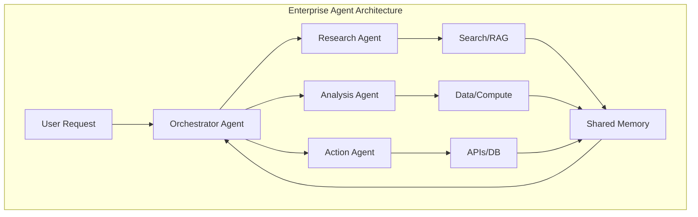
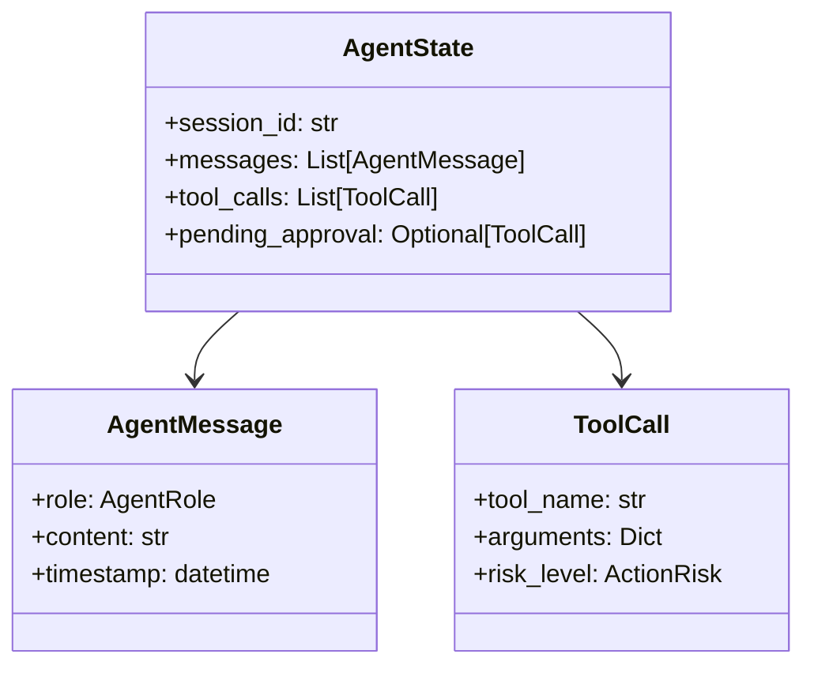
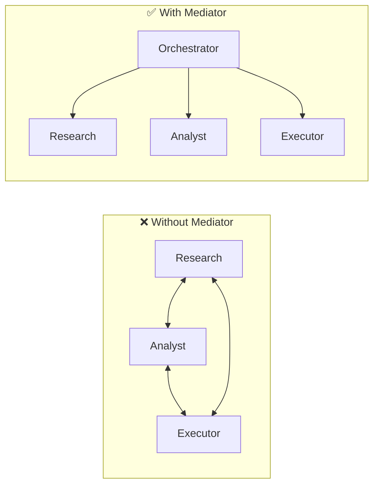

# Module 11b: Enterprise Agentic AI (Production Capstone)

> **Level**: Advanced | **Time**: 20-25 hours | **Prerequisites**: All previous modules

## Overview

This capstone module builds an **enterprise-grade AI agent** that reflects 2025 production patterns. You'll implement multi-agent orchestration, memory management, human-in-the-loop controls, and robust tool orchestration - all using the OOP patterns learned throughout this course.

### Enterprise Agentic AI in 2025



### 2025 Production Patterns Applied

| Pattern | Description | Module Reference |
|---------|-------------|------------------|
| **Orchestrator Agent** | Central manager delegating to specialists | Multi-agent from research |
| **Perception-Reasoning-Action** | Structured agent loop | M09b ReAct |
| **Memory-Augmented** | Persistent context across steps | New in 11b |
| **Human-in-the-Loop** | Approval gates for high-risk actions | Enterprise requirement |
| **Tool Registry** | Centralized tool management | M09b patterns |

> **Interview Insight**: "How do you handle high-risk actions in AI agents?"
> 
> **Answer**: Implement Human-in-the-Loop (HITL) controls by classifying tool risk levels (LOW/MEDIUM/HIGH). LOW-risk actions auto-execute, MEDIUM are logged, HIGH require explicit human approval. Store pending actions in state and resume after approval.

### Key Concepts to Master

| Concept | What It Is | Interview Importance |
|---------|-----------|----------------------|
| **Multi-Agent Orchestration** | Central manager delegates to specialists | ⭐⭐⭐ Enterprise pattern |
| **Memory-Augmented State** | Persistent context across turns | ⭐⭐⭐ Long-running tasks |
| **Action Risk Classification** | LOW/MEDIUM/HIGH for HITL | ⭐⭐⭐ Safety & governance |
| **PRA Loop** | Perceive → Reason → Act | ⭐⭐ Structured execution |
| **Session Management** | State persistence across calls | ⭐⭐ Production apps |

> **Common Pitfall**: Don't give a single agent 100+ tools. This overwhelms the LLM and degrades performance. Instead, use specialized agents with 5-10 tools each, coordinated by an orchestrator.

---

## Part 1: Domain Models

### OOP Principle: Encapsulation with Dataclasses

Domain models encapsulate the **state** of our enterprise agent. We use `@dataclass` for clean, immutable-by-design data containers with automatic `__init__`, `__repr__`, and type hints.

**Why Dataclasses over Regular Classes?**
- Less boilerplate (no manual `__init__`)
- Automatic `__repr__` for debugging
- `field(default_factory=...)` for mutable defaults
- Type hints built-in

**Design Pattern: Value Object**

`AgentMessage`, `ToolCall`, and `AgentState` are **Value Objects** - they carry data but have no business logic. This separation keeps our code clean:



### Enterprise-Ready Data Structures


```python
from dataclasses import dataclass, field
from typing import List, Dict, Any, Optional
from enum import Enum
from datetime import datetime
import uuid


class AgentRole(str, Enum):
    """Specialist agent roles."""
    ORCHESTRATOR = "orchestrator"
    RESEARCHER = "researcher"
    ANALYST = "analyst"
    EXECUTOR = "executor"


class ActionRisk(str, Enum):
    """Risk level for human-in-the-loop."""
    LOW = "low"        # Auto-execute
    MEDIUM = "medium"  # Log and proceed
    HIGH = "high"      # Require approval


@dataclass
class AgentMessage:
    """Message in agent communication."""
    role: AgentRole
    content: str
    timestamp: datetime = field(default_factory=datetime.utcnow)
    metadata: Dict[str, Any] = field(default_factory=dict)


@dataclass
class ToolCall:
    """Record of a tool execution."""
    id: str = field(default_factory=lambda: str(uuid.uuid4())[:8])
    tool_name: str = ""
    arguments: Dict[str, Any] = field(default_factory=dict)
    result: str = ""
    success: bool = True
    risk_level: ActionRisk = ActionRisk.LOW


@dataclass
class AgentState:
    """
    Current state of agent execution.
    
    Memory-Augmented: Persists across conversation turns.
    """
    session_id: str
    messages: List[AgentMessage] = field(default_factory=list)
    tool_calls: List[ToolCall] = field(default_factory=list)
    context: Dict[str, Any] = field(default_factory=dict)
    pending_approval: Optional[ToolCall] = None
    completed: bool = False
```

---

## Part 2: Memory Management

### Design Pattern: Strategy Pattern for Memory Backends

The `Memory` ABC defines a **Strategy Pattern** - we can swap between different memory implementations without changing the agent code:

| Implementation | Use Case |
|---------------|----------|
| `InMemoryStore` | Development, testing |
| `RedisMemory` | Production, distributed |
| `PostgresMemory` | Persistent, auditable |

**OOP Principle: Programming to Interfaces**

The orchestrator depends on the `Memory` interface, not a concrete class. This is **Dependency Inversion** (the 'D' in SOLID):

```python
# Good: Depends on abstraction
def __init__(self, memory: Memory):  # ✅ Interface
    self.memory = memory

# Bad: Depends on concrete class  
def __init__(self):
    self.memory = InMemoryStore()  # ❌ Hardcoded
```

### Conversation Memory (Enterprise Pattern)


```python
from abc import ABC, abstractmethod


class Memory(ABC):
    """
    Interface for agent memory.
    
    Strategy Pattern: Swap memory backends.
    """
    
    @abstractmethod
    async def save_state(self, state: AgentState) -> None:
        pass
    
    @abstractmethod
    async def load_state(self, session_id: str) -> Optional[AgentState]:
        pass
    
    @abstractmethod
    async def get_context(self, session_id: str, key: str) -> Any:
        pass
    
    @abstractmethod
    async def set_context(self, session_id: str, key: str, value: Any) -> None:
        pass


class InMemoryStore(Memory):
    """
    In-memory state store.
    
    Use Redis or database in production.
    """
    
    def __init__(self):
        self._states: Dict[str, AgentState] = {}
    
    async def save_state(self, state: AgentState) -> None:
        self._states[state.session_id] = state
    
    async def load_state(self, session_id: str) -> Optional[AgentState]:
        return self._states.get(session_id)
    
    async def get_context(self, session_id: str, key: str) -> Any:
        state = self._states.get(session_id)
        return state.context.get(key) if state else None
    
    async def set_context(self, session_id: str, key: str, value: Any) -> None:
        if session_id in self._states:
            self._states[session_id].context[key] = value
```

---

## Part 3: Tool System

### Design Pattern: Template Method + Strategy

The `Tool` ABC uses **Template Method** - it defines the skeleton (`name`, `description`, `execute`) while subclasses provide the specific implementation. Combined with **Strategy**, each tool is a swappable algorithm:

**OOP Principle: Polymorphism**

All tools share the same interface, so the registry can call `execute()` on any tool without knowing its concrete type:

```python
# Polymorphism in action
for tool in tools:
    result = tool.execute(**args)  # Works for ANY tool type
```

**Adding Risk Levels (Enterprise Feature)**

Unlike simple tool systems, we add `risk_level` property for HITL governance:

| Risk | Behavior | Example Tool |
|------|----------|--------------|
| `LOW` | Auto-execute | Search, Calculator |
| `MEDIUM` | Log + execute | Database query |
| `HIGH` | Require approval | Send email, Delete |

### Enterprise Tool Interface


```python
from abc import ABC, abstractmethod
from typing import Callable


class Tool(ABC):
    """Enterprise tool with risk classification."""
    
    @property
    @abstractmethod
    def name(self) -> str:
        pass
    
    @property
    @abstractmethod
    def description(self) -> str:
        pass
    
    @property
    @abstractmethod
    def risk_level(self) -> ActionRisk:
        """Risk level for HITL controls."""
        pass
    
    @abstractmethod
    async def execute(self, **kwargs) -> str:
        pass


class SearchTool(Tool):
    """Web search - low risk, auto-execute."""
    
    @property
    def name(self) -> str:
        return "search"
    
    @property
    def description(self) -> str:
        return "Search for information online."
    
    @property
    def risk_level(self) -> ActionRisk:
        return ActionRisk.LOW
    
    async def execute(self, query: str) -> str:
        # Mock - use Tavily/SerpAPI in production
        return f"Search results for: {query}"


class DatabaseQueryTool(Tool):
    """DB query - medium risk, logged."""
    
    @property
    def name(self) -> str:
        return "query_database"
    
    @property
    def description(self) -> str:
        return "Query the customer database."
    
    @property
    def risk_level(self) -> ActionRisk:
        return ActionRisk.MEDIUM
    
    async def execute(self, sql: str) -> str:
        # Mock - use actual DB in production
        return f"Query executed: {sql}"


class SendEmailTool(Tool):
    """Email - HIGH risk, requires approval."""
    
    @property
    def name(self) -> str:
        return "send_email"
    
    @property
    def description(self) -> str:
        return "Send an email to a customer. Requires approval."
    
    @property
    def risk_level(self) -> ActionRisk:
        return ActionRisk.HIGH
    
    async def execute(self, to: str, subject: str, body: str) -> str:
        # Mock - use email service in production
        return f"Email sent to {to}"


class ToolRegistry:
    """Central tool management."""
    
    def __init__(self):
        self._tools: Dict[str, Tool] = {}
    
    def register(self, tool: Tool):
        self._tools[tool.name] = tool
    
    def get(self, name: str) -> Tool:
        if name not in self._tools:
            raise ValueError(f"Unknown tool: {name}")
        return self._tools[name]
    
    def list_tools(self) -> List[Dict[str, str]]:
        return [
            {"name": t.name, "description": t.description, "risk": t.risk_level.value}
            for t in self._tools.values()
        ]
```

---

## Part 4: Specialist Agents

### OOP Principle: Inheritance vs Composition

**When to Use Inheritance** (like our `Agent` ABC):
- When you have a clear "is-a" relationship
- When all subclasses share the same interface
- For defining contracts (ABCs)

**When to Use Composition** (agents have a `ToolRegistry`):
- When you have a "has-a" relationship
- For flexible, runtime-configurable behavior
- To avoid deep inheritance hierarchies

```python
# Inheritance: Agent IS-A base class
class ResearchAgent(Agent):  # ✅ Inheritance
    pass

# Composition: Agent HAS-A tools registry
class ResearchAgent(Agent):
    def __init__(self, tools: ToolRegistry):  # ✅ Composition
        self.tools = tools
```

**Design Pattern: Single Responsibility Principle (SRP)**

Each specialist agent has ONE job:
- `ResearchAgent` → Information gathering
- `AnalystAgent` → Data analysis
- `ExecutorAgent` → Taking actions

This is the 'S' in SOLID.

### Agent Interface


```python
class Agent(ABC):
    """
    Base class for specialist agents.
    
    Each agent has a role and handles specific tasks.
    """
    
    @property
    @abstractmethod
    def role(self) -> AgentRole:
        pass
    
    @abstractmethod
    async def process(
        self,
        task: str,
        state: AgentState,
        llm_call: Callable,
    ) -> str:
        """Process a task and return result."""
        pass


class ResearchAgent(Agent):
    """Handles information gathering."""
    
    def __init__(self, tools: ToolRegistry):
        self.tools = tools
    
    @property
    def role(self) -> AgentRole:
        return AgentRole.RESEARCHER
    
    async def process(
        self,
        task: str,
        state: AgentState,
        llm_call: Callable,
    ) -> str:
        # Use search tool
        search = self.tools.get("search")
        result = await search.execute(query=task)
        
        # Record tool call
        state.tool_calls.append(ToolCall(
            tool_name="search",
            arguments={"query": task},
            result=result,
            risk_level=search.risk_level,
        ))
        
        return result


class AnalystAgent(Agent):
    """Handles data analysis."""
    
    def __init__(self, tools: ToolRegistry):
        self.tools = tools
    
    @property
    def role(self) -> AgentRole:
        return AgentRole.ANALYST
    
    async def process(
        self,
        task: str,
        state: AgentState,
        llm_call: Callable,
    ) -> str:
        # Analyze based on context
        context = state.context.get("research_results", "")
        
        prompt = f"""Analyze the following data:
{context}

Task: {task}

Provide insights:"""
        
        return await llm_call(prompt)


class ExecutorAgent(Agent):
    """Handles actions (with HITL for high-risk)."""
    
    def __init__(self, tools: ToolRegistry):
        self.tools = tools
    
    @property
    def role(self) -> AgentRole:
        return AgentRole.EXECUTOR
    
    async def process(
        self,
        task: str,
        state: AgentState,
        llm_call: Callable,
    ) -> str:
        # Parse task to determine tool and args
        # In production, use structured output from LLM
        
        if "email" in task.lower():
            tool = self.tools.get("send_email")
            args = {"to": "customer@example.com", "subject": "Follow-up", "body": task}
        else:
            tool = self.tools.get("query_database")
            args = {"sql": f"SELECT * FROM data WHERE task = '{task}'"}
        
        tool_call = ToolCall(
            tool_name=tool.name,
            arguments=args,
            risk_level=tool.risk_level,
        )
        
        # HITL: High-risk requires approval
        if tool.risk_level == ActionRisk.HIGH:
            state.pending_approval = tool_call
            return f"⚠️ Action requires approval: {tool.name} with {args}"
        
        # Execute
        result = await tool.execute(**args)
        tool_call.result = result
        state.tool_calls.append(tool_call)
        
        return result
```

---

## Part 5: Orchestrator Agent

### Design Pattern: Mediator / Manager Pattern

The Orchestrator uses the **Mediator Pattern** - it centralizes complex communications between specialist agents. Instead of agents talking directly to each other (messy coupling), they communicate through the orchestrator.



**Benefits**:
- Loose coupling between agents
- Central control point for logging/monitoring
- Easy to add new agents without modifying existing ones

**OOP Principle: Open/Closed Principle (OCP)**

The orchestrator is open for extension (add new agent types) but closed for modification (existing code doesn't change when adding agents).

### Central Coordination (Manager Pattern)


```python
class OrchestratorAgent:
    """
    Central agent that coordinates specialists.
    
    Manager Pattern: Delegates to specialists based on task.
    """
    
    def __init__(
        self,
        agents: Dict[AgentRole, Agent],
        memory: Memory,
        llm_call: Callable,
    ):
        self.agents = agents
        self.memory = memory
        self.llm_call = llm_call
    
    async def plan(self, request: str, state: AgentState) -> List[tuple]:
        """
        Decide which agents to use.
        
        Returns list of (agent_role, task) tuples.
        """
        prompt = f"""Given this request: "{request}"

Available agents:
- RESEARCHER: Gather information, search
- ANALYST: Analyze data, generate insights
- EXECUTOR: Take actions (email, database updates)

Return the sequence of agents to use as:
1. AGENT_NAME: task description
2. AGENT_NAME: task description

Plan:"""
        
        plan_text = await self.llm_call(prompt)
        
        # Parse plan (simplified - use structured output in production)
        steps = []
        if "research" in plan_text.lower():
            steps.append((AgentRole.RESEARCHER, request))
        if "analy" in plan_text.lower():
            steps.append((AgentRole.ANALYST, "Analyze findings"))
        if "execut" in plan_text.lower() or "email" in request.lower():
            steps.append((AgentRole.EXECUTOR, request))
        
        if not steps:
            steps.append((AgentRole.RESEARCHER, request))
        
        return steps
    
    async def run(self, request: str, session_id: str) -> AgentState:
        """
        Execute multi-agent workflow.
        
        PRA Loop: Perceive → Reason → Act
        """
        # Load or create state
        state = await self.memory.load_state(session_id)
        if not state:
            state = AgentState(session_id=session_id)
        
        # Record user request
        state.messages.append(AgentMessage(
            role=AgentRole.ORCHESTRATOR,
            content=f"User request: {request}",
        ))
        
        # Plan
        steps = await self.plan(request, state)
        
        # Execute each step
        for agent_role, task in steps:
            agent = self.agents.get(agent_role)
            if not agent:
                continue
            
            result = await agent.process(task, state, self.llm_call)
            
            # Store result in context for next agent
            state.context[f"{agent_role.value}_result"] = result
            state.messages.append(AgentMessage(
                role=agent_role,
                content=result,
            ))
            
            # Check if pending approval (HITL)
            if state.pending_approval:
                await self.memory.save_state(state)
                return state  # Return early, wait for approval
        
        # Generate final response
        final_prompt = f"""Based on the agent results:
{state.context}

Provide a concise final answer to: {request}"""
        
        final_answer = await self.llm_call(final_prompt)
        state.messages.append(AgentMessage(
            role=AgentRole.ORCHESTRATOR,
            content=final_answer,
        ))
        
        state.completed = True
        await self.memory.save_state(state)
        
        return state
    
    async def approve_action(self, session_id: str) -> AgentState:
        """
        Human approves pending high-risk action.
        
        HITL Pattern: Explicit approval gate.
        """
        state = await self.memory.load_state(session_id)
        if not state or not state.pending_approval:
            raise ValueError("No pending approval")
        
        tool_call = state.pending_approval
        tool = self.agents[AgentRole.EXECUTOR].tools.get(tool_call.tool_name)
        
        # Execute approved action
        result = await tool.execute(**tool_call.arguments)
        tool_call.result = result
        tool_call.success = True
        
        state.tool_calls.append(tool_call)
        state.pending_approval = None
        state.messages.append(AgentMessage(
            role=AgentRole.EXECUTOR,
            content=f"Approved action executed: {result}",
        ))
        
        await self.memory.save_state(state)
        return state
```

---

## Part 6: Factory & Wiring

### Application Factory

```python
def create_enterprise_agent():
    """
    Factory function to wire up the enterprise agent.
    
    Factory Pattern: Centralized creation with dependency injection.
    """
    # Memory
    memory = InMemoryStore()
    
    # Tools
    tools = ToolRegistry()
    tools.register(SearchTool())
    tools.register(DatabaseQueryTool())
    tools.register(SendEmailTool())
    
    # Specialist Agents
    agents = {
        AgentRole.RESEARCHER: ResearchAgent(tools),
        AgentRole.ANALYST: AnalystAgent(tools),
        AgentRole.EXECUTOR: ExecutorAgent(tools),
    }
    
    # Mock LLM
    async def mock_llm(prompt: str) -> str:
        if "plan" in prompt.lower():
            return "1. RESEARCHER: gather info\n2. ANALYST: analyze\n3. EXECUTOR: take action"
        return f"LLM response to: {prompt[:50]}..."
    
    # Orchestrator
    orchestrator = OrchestratorAgent(
        agents=agents,
        memory=memory,
        llm_call=mock_llm,
    )
    
    return orchestrator, memory
```

---

## Part 7: API Integration

### FastAPI Endpoints

```python
from fastapi import FastAPI, HTTPException
from pydantic import BaseModel


app = FastAPI(title="Enterprise Agent API")


class ChatRequest(BaseModel):
    session_id: str
    message: str


class ApprovalRequest(BaseModel):
    session_id: str


# Global (configure on startup)
_orchestrator = None
_memory = None


@app.on_event("startup")
async def startup():
    global _orchestrator, _memory
    _orchestrator, _memory = create_enterprise_agent()


@app.post("/chat")
async def chat(request: ChatRequest):
    """Process user message through agent."""
    state = await _orchestrator.run(request.message, request.session_id)
    
    return {
        "session_id": state.session_id,
        "response": state.messages[-1].content if state.messages else "",
        "pending_approval": state.pending_approval is not None,
        "completed": state.completed,
    }


@app.post("/approve")
async def approve(request: ApprovalRequest):
    """Approve pending high-risk action."""
    try:
        state = await _orchestrator.approve_action(request.session_id)
        return {
            "session_id": state.session_id,
            "approved": True,
            "result": state.messages[-1].content,
        }
    except ValueError as e:
        raise HTTPException(400, str(e))


@app.get("/session/{session_id}")
async def get_session(session_id: str):
    """Get session state."""
    state = await _memory.load_state(session_id)
    if not state:
        raise HTTPException(404, "Session not found")
    
    return {
        "session_id": state.session_id,
        "messages": len(state.messages),
        "tool_calls": len(state.tool_calls),
        "pending_approval": state.pending_approval is not None,
    }
```

---

## Summary

### Enterprise Patterns Applied

| Pattern | Implementation | Benefit |
|---------|---------------|---------|
| **Multi-Agent** | Orchestrator + Specialists | Separation of concerns |
| **Memory-Augmented** | `AgentState` + `Memory` ABC | Persistent context |
| **HITL Controls** | `ActionRisk` + `pending_approval` | Safety for high-risk |
| **Tool Registry** | Centralized with risk levels | Enterprise governance |
| **PRA Loop** | Perceive → Plan → Act | Structured execution |

### Course Patterns Summary

This module brings together everything from the course:

| Module | Pattern Used Here |
|--------|-------------------|
| **M02** | Inheritance (Agent ABC) |
| **M04** | Dataclasses, Async/Await |
| **M05** | Strategy, Factory, Observer |
| **M06** | Clean Architecture layers |
| **M07** | FastAPI endpoints |
| **M08** | Memory/State persistence pattern |
| **M09a** | LLM abstraction |
| **M09b** | Tool calling, ReAct loop |
| **M10** | Production patterns |
| **M11a** | RAG integration ready |

### Production Checklist

- [ ] Multi-agent orchestration
- [ ] Persistent session memory
- [ ] Tool risk classification
- [ ] Human-in-the-loop for high-risk
- [ ] Audit trail (all tool calls logged)
- [ ] Structured state management
- [ ] FastAPI integration

---

## Course Complete! 🎉

You've completed the **Python OOP Masterclass for AI Development**.

### What You've Learned

1. **OOP Fundamentals** - Classes, inheritance, composition
2. **Core Principles** - Encapsulation, polymorphism, abstraction
3. **Advanced Python** - Generics, async, dataclasses, Pydantic
4. **Design Patterns** - 16 patterns applied to AI
5. **SOLID & Architecture** - Clean, maintainable code
6. **FastAPI** - Production-ready APIs
7. **Databases** - SQL, NoSQL, Vector, Cache
8. **LLM Services** - Multi-provider, streaming
9. **Agentic Patterns** - Tools, ReAct, chains
10. **Production** - Testing, Docker, logging
11. **Capstones** - RAG system, Enterprise agent

### Next Steps

- Deploy your agent to production
- Add real LLM providers (OpenAI, Anthropic)
- Implement Redis/PostgreSQL for memory
- Add observability (LangSmith, Langfuse)
- Explore LangGraph for complex workflows
